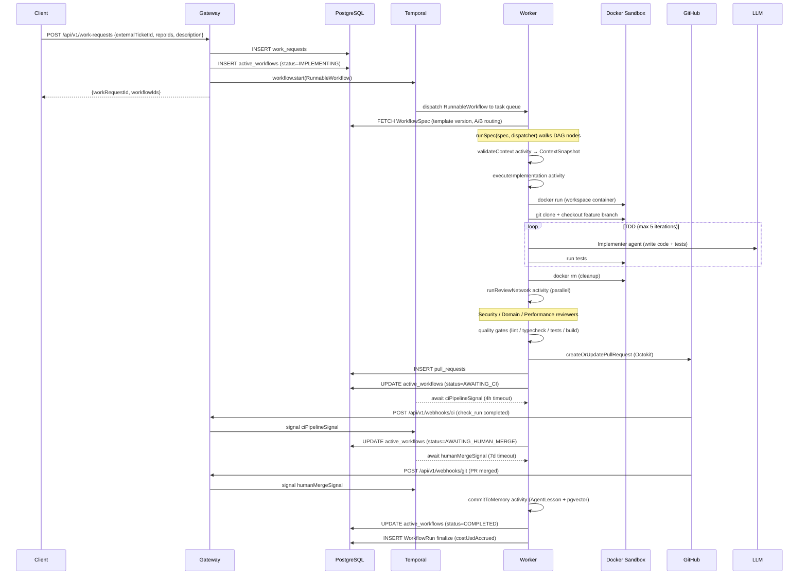
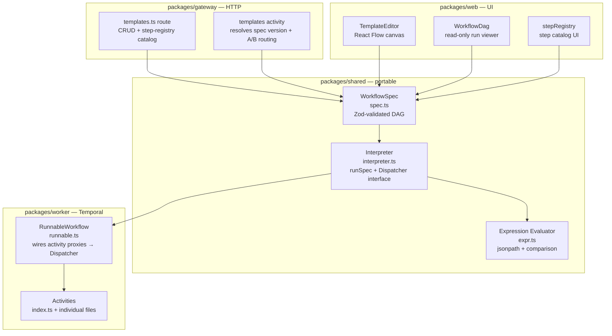
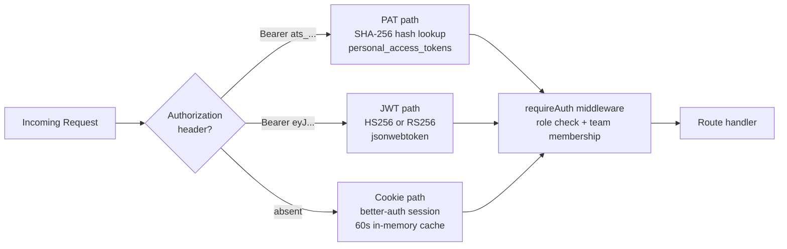
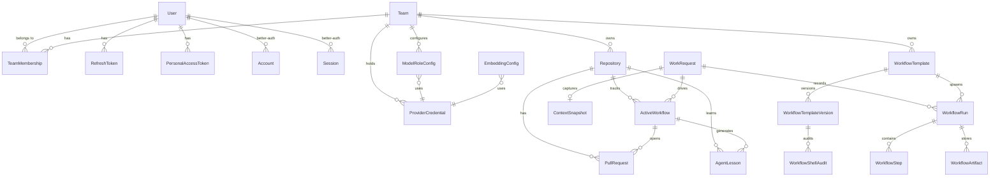

# System Architecture — auto-swe

> **Current-state reference.** This document describes the system as shipped (all 9 configurable-workflow phases complete). For historical design rationale see the other files in this directory; for conventions and commands see [AGENTS.md](../AGENTS.md); for deployment see [deployment.md](./deployment.md).

---

## 1. System Context


Key design choices:
- **Gateway is stateless** — all durable state lives in Temporal + Postgres.
- **Worker drives all execution** — no LLM calls happen in the Gateway.
- **Human merges only** — the system never merges PRs; a Temporal signal bridges the GitHub webhook back to the waiting workflow.

---

## 2. Monorepo Package Map

```
packages/
├── shared/      Prisma schema, DB client, shared types, workflow engine (spec + interpreter)
├── gateway/     Fastify 5 HTTP API — auth, RBAC, routing, webhooks, admin
├── worker/      Temporal worker — Mastra agents, activities, workflow runners
├── web/         Next.js 16 dashboard — App Router, TanStack Query, Zustand, React Flow
└── cli/         auto-swe binary — thin REST client over gateway
```

### 2.1 `packages/shared`

| Path | Purpose |
|------|---------|
| `src/db.ts` | Singleton `PrismaClient` — import this everywhere |
| `src/index.ts` | Re-exports types and enums from `@auto-swe/shared` |
| `src/prisma/schema.prisma` | **Authoritative data model** — 20+ models (see §6) |
| `src/prisma/seed.ts` | Seeds admin user, default team, sample repo, default workflow template, built-in skills, and GLOBAL tool config |
| `src/prisma/migrations/` | Squashed init migration + HNSW-index migration |
| `src/skills/index.ts` | Barrel — `BUILTIN_SKILLS` array + `BuiltinSkillDef` interface; one file per skill in this directory |
| `src/workflow/spec.ts` | `WorkflowSpec` Zod schema — DAG node types (step/set/cond/signal/terminate/fanOut/shell) |
| `src/workflow/interpreter.ts` | **Pure DAG interpreter** (`runSpec`) — no Temporal imports; side effects via `Dispatcher` |
| `src/workflow/expr.ts` | Expression evaluator for `cond` node predicates (jsonpath + comparison, no JS sandbox) |
| `src/workflow/stepRegistry.ts` | Step catalog (metadata, input schemas) — imported by gateway + web without worker dependency |
| `src/workflow/defaultEngineeringSpec.ts` | Seed spec `default-engineering@v1` — behavioural parity with the old hardcoded loop |
| `src/workflow/shellImageAllowlist.ts` | Built-in image allowlist + per-team extension logic |
| `src/workflow/signalSlots.ts` | Typed signal-slot registry (maps spec signal names → Temporal signal names) |
| `src/workflow/specDiff.ts` | Version-diff utility used by the editor's diff viewer |
| `src/workflow/analytics.ts` | Pure analytics aggregation helpers (used by gateway analytics routes) |
| `src/lib/crypto.ts` | AES-256-GCM helpers for `ProviderCredential.apiKeyCiphertext` |

### 2.2 `packages/gateway`

| Path | Purpose |
|------|---------|
| `src/index.ts` | Entry point — registers all plugins and routes, starts Fastify |
| `src/plugins/auth.ts` | **Auth middleware** — `requireAuth({ requiredRole })` / `requireUser()` / role hierarchy |
| `src/plugins/prisma.ts` | Decorates `fastify.prisma` |
| `src/plugins/temporal.ts` | Decorates `fastify.temporal` (Temporal `Client`) |
| `src/lib/betterAuth.ts` | better-auth instance — email+password, GitHub/Google OAuth, magic-link, cookie sessions |
| `src/lib/github.ts` | Octokit singleton and GitHub webhook HMAC verification |
| `src/lib/slack.ts` | Slack SDK client; slash-command and interactive-webhook handlers |
| `src/lib/telemetry.ts` | OpenTelemetry SDK init (OTLP/HTTP exporter) |
| `src/routes/auth.ts` | `POST /api/v1/auth/login`, `/refresh`, `/logout`, `/slack/connect` |
| `src/routes/workRequests.ts` | `POST /api/v1/work-requests` — creates `WorkRequest` + starts `RunnableWorkflow` |
| `src/routes/workflows.ts` | `GET /api/v1/workflows` — list active workflows (RBAC-filtered) |
| `src/routes/workflowRuns.ts` | `GET /api/v1/workflow-runs` — paginated run history; `POST /:id/cancel` |
| `src/routes/workflowTemplates.ts` | CRUD for `WorkflowTemplate` + versions; promotes active version; step registry catalog |
| `src/routes/workflowProjections.ts` | Live step-status projections for the `/runs/[id]` viewer |
| `src/routes/webhooks.ts` | `POST /api/v1/webhooks/git` (merge signal) + `/webhooks/ci` (CI signal) |
| `src/routes/epics.ts` | `POST /api/v1/epics` — starts `EpicOrchestratorWorkflow` |
| `src/routes/repositories.ts` | CRUD for `Repository` (team-scoped) |
| `src/routes/teams.ts` | CRUD for `Team` + membership + shell-image allowlist; team-scoped agent skill/tool overrides |
| `src/routes/users.ts` | User management (ADMIN only) |
| `src/routes/lessons.ts` | `AgentLesson` list, text search, per-repo stats, delete |
| `src/routes/skills.ts` | `Skill` CRUD; `AgentSkillAssignment` + `AgentToolConfig` CRUD at GLOBAL, TEAM, and WORKFLOW_TEMPLATE scope |
| `src/routes/tokens.ts` | Personal access token create / list / revoke |
| `src/routes/modelConfig.ts` | `ModelRoleConfig` + `ProviderCredential` + `EmbeddingConfig` CRUD (admin + team-owner) |
| `src/routes/admin.ts` | Admin-only: list/revoke all PATs, list/revoke sessions, shell-audit prune |
| `src/lib/auditLog.ts` | `writeAuditLog()` — shared helper that writes `ConfigAuditLog` rows for all config mutations |

### 2.3 `packages/worker`

| Path | Purpose |
|------|---------|
| `src/index.ts` | Worker entry — calls `assertConfigReady()`, starts Temporal worker |
| `src/workflows/runnable.ts` | **`RunnableWorkflow`** — generic Temporal workflow; wires activity proxies to `Dispatcher` and calls `runSpec` |
| `src/workflows/epicOrchestrator.ts` | **`EpicOrchestratorWorkflow`** — decomposes multi-repo epics, fans out child `RunnableWorkflow`s with dep-graph scheduling |
| `src/activities/index.ts` | Barrel — exports all activity functions registered with the worker |
| `src/activities/executeImplementation.ts` | **Core agent loop** — DinD workspace, git clone, Implementer Mastra agent, TDD loop |
| `src/activities/runReviewNetwork.ts` | Runs Security / Domain / Performance reviewers in parallel via `Promise.allSettled` |
| `src/activities/ciFixLoop.ts` | `fetchCILogs` + `executeCIFixImplementation` — CI self-healing |
| `src/activities/qualityGates.ts` | `runLint` / `runTypecheck` / `runTests` / `runBuild` / `runVulnScan` / `runPerfBench` |
| `src/activities/shellStep.ts` | Phase-6 `runShellStep` — ephemeral container, image allowlist, audit write |
| `src/activities/decomposition.ts` | `planDecomposition` — Decomposer agent → `Subtask[]` for fan-out |
| `src/activities/validateContext.ts` | `validateContext` — Context Validator agent → `ContextSnapshot` |
| `src/activities/commitToMemory.ts` | Memory Agent summarization → `AgentLesson` + pgvector embedding |
| `src/activities/createOrUpdatePullRequest.ts` | GitHub PR create/update via Octokit; idempotent on branch |
| `src/activities/templates.ts` | Fetches + resolves `WorkflowSpec` for a run (scope cascade + A/B routing) |
| `src/activities/state.ts` | `updateDomainState`, `createWorkflowRun`, `recordWorkflowStep`, `finalizeWorkflowRun` |
| `src/activities/workspace.ts` | DinD workspace helpers — `createWorkspace()` returns `{ exec, execCapture, destroy }` + `shellQuote()` |
| `src/agents/implementer.ts` | Mastra `Agent` for code writing + TDD |
| `src/agents/reviewNetwork.ts` | Three Mastra `Agent`s (Security Auditor, Domain Logic, Performance) |
| `src/agents/plannerAgent.ts` | Mastra `Agent` for per-repo plan decomposition |
| `src/agents/decomposer.ts` | Mastra `Agent` for fan-out subtask decomposition |
| `src/agents/preWriteSecurityCheck.ts` | Regex-based pre-write scanner wrapping the `writeFile` tool |
| `src/lib/models.ts` | `getModel(role, ctx)` — 3-level scope cascade (template → team → global) |
| `src/lib/config/agentSkills.ts` | `loadAgentSkills(role, ctx)` — resolves `ResolvedSkill[]` at WORKFLOW_TEMPLATE → TEAM → GLOBAL scope |
| `src/lib/config/resolver.ts` | `loadAgentToolConfig(role, ctx)` — resolves enabled tool list at same scope cascade |
| `src/lib/embeddings.ts` | `generateEmbedding` — resolves `EmbeddingConfig` from DB, enforces 1536-dim |
| `src/lib/costTracking.ts` | `recordLlmUsage` — per-call USD metering via `MODEL_PRICES`, OTel span attributes |

### 2.4 `packages/web`

| Path | Purpose |
|------|---------|
| `src/app/layout.tsx` | Root layout — `AppShell` chrome (Sidebar + TopBar), theme tokens |
| `src/app/page.tsx` | Dashboard home — KPI stats, "needs attention" queue, recent activity |
| `src/app/runs/` | Global run history with status + template filters |
| `src/app/runs/[id]/` | Live run viewer — React Flow DAG with per-node status overlay |
| `src/app/templates/` | Workflow template list + 5 starter specs |
| `src/app/templates/[id]/` | React Flow canvas editor (`TemplateEditor`) — drag-to-create, drag-to-connect, version sidebar, A/B experiment, analytics |
| `src/app/workflows/` | Active workflow list (renamed "Active Runs") |
| `src/app/epics/` | Multi-repo epic creation + status |
| `src/app/repositories/` | Repository CRUD |
| `src/app/teams/` | Team management — members, roles, shell-image allowlist |
| `src/app/users/` | User management (ADMIN) |
| `src/app/lessons/` | Agent memory search |
| `src/app/analytics/` | Global analytics — success rate, p50/p95, $/run, per-step failure rates |
| `src/app/settings/` | User settings — API tokens (create / list / revoke) |
| `src/app/admin/` | Admin pages — model config, access tokens, sessions, shell audit, skills library, agent role config (skills + tool access), lessons observability |
| `src/hooks/` | TanStack Query hooks (one per resource) — `useWorkflows`, `useRuns`, etc. |
| `src/stores/` | Zustand stores — `authStore.ts`, `teamStore.ts` |
| `src/components/` | Shared primitives: `Button`, `Input`, `Card`, `Modal`, `Stat`, `WorkflowDag`, `TemplateEditor` |
| `src/lib/` | API client helpers, auth helpers, chart theme (`chartChrome.tsx`) |

---

## 3. Work Request Lifecycle

End-to-end flow from API call to merged PR:



### Multi-repo Epics

For `POST /api/v1/epics`, the gateway starts `EpicOrchestratorWorkflow` (`packages/worker/src/workflows/epicOrchestrator.ts`) instead. It:
1. Runs the **Planner agent** (`plannerAgent.ts`) to decompose the brief into per-repo subtasks.
2. Builds a dependency graph from the plan.
3. Fans out child `RunnableWorkflow`s, scheduling them in dependency order.
4. Reports `PLANNING → FANNING_OUT → COMPLETED/FAILED/CANCELLED`.

---

## 4. Workflow Engine

The configurable workflow engine is the core runtime — every work request runs through it.



### Node types in a WorkflowSpec

| Node type | Purpose | Key fields |
|-----------|---------|-----------|
| `step` | Dispatch a registered activity | `step` (name), `inputs`, `next`, `onFail`, `config` |
| `set` | Write values into the workflow context | `values` (map of path → binding) |
| `cond` | Branch on a boolean expression | `expr` (jsonpath), `onTrue`, `onFalse` |
| `signal` | Await a named Temporal signal with timeout | `name`, `timeout`, `onReceive`, `onTimeout`, `storeAs` |
| `terminate` | End the run with a specific status | `status`, `result` |
| `fanOut` | Run a subgraph once per item in an array | `over`, `subgraph`, `join`, `itemKey`, `concurrency`, `onBranchFail`, `exports`, `pluck` |
| `shell` | Run a user-authored command in an ephemeral container | `image`, `command`, `network`, `timeoutMs`, `memory`, `cpus`, `onFail` |

### Dispatcher interface (`interpreter.ts`)

```
interface Dispatcher {
  dispatchStep({ nodeId, step, config, inputs, ctx, cancellation? }) → Promise<unknown>
  dispatchShell?({ nodeId, node, inputs, ctx, cancellation? })       → Promise<unknown>
  waitSignal(name, timeout)                                          → Promise<unknown | undefined>
  recordStep({ nodeId, status, inputs?, outputs?, error?, attempt? }) → Promise<void>
}
```

`RunnableWorkflow` implements this by wrapping each activity proxy call. Fan-out, set, cond, signal, and terminate nodes are handled internally by the interpreter — only `step` and `shell` go through the dispatcher. `dispatchShell` is optional; dispatchers that omit it throw on shell nodes. The interpreter has no Temporal imports and runs in tests with a mock dispatcher.

### 3-level scope cascade

All per-role configuration (model selection, skills, tool access) follows the same cascade at activity-call time:

```
For each LLM call / activity invocation:
  resolve(role, { teamId, workflowTemplateId })
      ↓
  1. WORKFLOW_TEMPLATE row (if templateId set)
  ↓ (fall through if missing)
  2. TEAM row (if teamId set)
  ↓ (fall through if missing)
  3. GLOBAL row

Model config  → getModel()          in packages/worker/src/lib/models.ts          (GLOBAL required)
Skills        → loadAgentSkills()   in packages/worker/src/lib/config/agentSkills.ts (falls back to empty)
Tool access   → loadAgentToolConfig() in packages/worker/src/lib/config/resolver.ts  (null = all tools)
```

**Skills vs tools:**
- **Skill** = named prompt fragment (`promptText`) injected into the agent system message. Controls *how* an agent reasons.
- **Tool** = executable Mastra `createTool()` function (readFile, writeFile, listDirectory, bash). Controls *what* an agent can do.

Files: `packages/worker/src/lib/models.ts`, `packages/worker/src/lib/config/agentSkills.ts`, `packages/worker/src/lib/config/resolver.ts`, `packages/shared/src/prisma/schema.prisma` (`ModelRoleConfig`, `Skill`, `AgentSkillAssignment`, `AgentToolConfig`).

---

## 5. Authentication

The gateway supports three independent auth paths on every protected route:



| Path | Token format | Storage | Issued by |
|------|-------------|---------|-----------|
| JWT bearer | `eyJ…` (HS256/RS256) | `refresh_tokens` table | `POST /api/v1/auth/login` |
| PAT bearer | `ats_<base64url-32B>` | `personal_access_tokens` (hash only) | Settings → API tokens in UI |
| better-auth cookie | HTTP-only session cookie | `sessions` table (60s in-memory cache) | `POST /api/auth/sign-in/*` — email+password, GitHub OAuth, Google OAuth, magic-link |

Relevant files:
- `packages/gateway/src/plugins/auth.ts` — `requireAuth`, `requireUser`, role hierarchy
- `packages/gateway/src/lib/betterAuth.ts` — better-auth instance
- `packages/gateway/src/routes/auth.ts` — JWT login/refresh/logout
- `packages/gateway/src/routes/tokens.ts` — PAT lifecycle

RBAC roles (platform-wide): `ENGINEER < LEAD < ADMIN`. Team-role enforcement (`ENGINEER/LEAD/ADMIN` per team) is layered on top via `requiredTeamRole` in `requireAuth`.

---

## 6. Data Model

The authoritative schema is `packages/shared/src/prisma/schema.prisma`. Key model groups:



### Model groups at a glance

| Group | Models | Purpose |
|-------|--------|---------|
| Identity | `User`, `Account`, `Session`, `Verification` | User identity (legacy JWT + better-auth) |
| Auth tokens | `RefreshToken`, `PersonalAccessToken` | Token lifecycle |
| RBAC | `TeamMembership` | Platform + team role enforcement |
| Work | `WorkRequest`, `ContextSnapshot` | Input + context capture |
| Execution state | `ActiveWorkflow`, `PullRequest` | Temporal ↔ DB state sync |
| Workflow engine | `WorkflowTemplate`, `WorkflowTemplateVersion`, `WorkflowRun`, `WorkflowStep`, `WorkflowArtifact`, `WorkflowShellAudit` | Template versioning, run tracking, artifact storage, shell audit |
| Observability | `AgentTrace` | Per-activity tool-call / LLM-response / activity-event rows — full agent observability |
| Memory | `AgentLesson` | pgvector semantic memory (1536-dim HNSW index) |
| Model config | `ModelRoleConfig`, `ProviderCredential`, `EmbeddingConfig`, `ConfigAuditLog` | DB-backed LLM routing (AES-256-GCM encrypted keys) |
| Agent config | `Skill`, `AgentSkillAssignment`, `AgentToolConfig` | Skills (prompt fragments) and tool access control — scoped at GLOBAL / TEAM / WORKFLOW_TEMPLATE |
| Infrastructure | `Team`, `Repository` | Tenant isolation + repo registry |

---

## 7. Infrastructure

```mermaid
flowchart LR
    subgraph docker-compose.infra.yml
        PG[(postgres\npgvector/pgvector:pg17\n:5432)]
        PGTMP[(postgres-temporal\n:5433)]
        TMPSETUP[temporal-setup\ntemporalio/auto-setup:1.31]
        TMPADMIN[temporal-admin-tools\n:7233]
        TMPUI[temporal-ui\n:8233]
        TMPSETUP --> PGTMP
        TMPADMIN --> TMPSETUP
        TMPUI --> TMPSETUP
    end

    subgraph docker-compose.app.yml
        GW2[gateway\n:8080]
        WK2[worker]
        WEB2[web\n:3000]
        OTEL[otel-lgtm\nGrafana + OTel\n:3001 Grafana]
        GW2 --> PG
        WK2 --> PG
        GW2 --> TMPSETUP
        WK2 --> TMPSETUP
        WK2 -->|/var/run/docker.sock| HOST[Docker daemon]
        OTEL --> GW2
        OTEL --> WK2
    end
```



- **`docker-compose.infra.yml`** — Postgres (app) + Postgres (Temporal) + Temporal (server + admin-tools + UI).
- **`docker-compose.app.yml`** — Gateway + Worker + Web + Grafana LGTM. Overlay — references infra network, not standalone.
- **Worker Docker socket** — The worker needs `/var/run/docker.sock` mounted to spin up DinD workspaces.
- **MinIO** (optional) — S3-compatible artifact store started alongside infra. Configure the backend via `/admin/integrations → Storage`; falls back to Postgres inline blobs when no S3 config is present.

---

## 8. Observability

Every LLM call emitted by the worker is wrapped in an OpenTelemetry span. Key span attributes:

| Attribute | Value |
|-----------|-------|
| `llm.cost_usd` | USD cost computed from `MODEL_PRICES` in `costTracking.ts` |
| `llm.cost_pricing_known` | `false` if the model is not in `MODEL_PRICES` (still tracked, zero cost) |
| `workflow.budget_remaining_input` | Remaining input-token budget for the current run |
| `workflow.budget_remaining_output` | Remaining output-token budget |

Traces export to the Grafana LGTM stack via OTLP/HTTP (`OTEL_EXPORTER_OTLP_ENDPOINT`). The Grafana UI is at `:3001` when running `yarn docker:app:up`.

Files:
- `packages/gateway/src/lib/telemetry.ts` — OTel SDK init for the gateway
- `packages/worker/src/lib/costTracking.ts` — `recordLlmUsage`, `MODEL_PRICES`

---

## 9. Key Design Decisions

| Decision | Rationale | Where |
|----------|-----------|-------|
| `RunnableWorkflow` over hardcoded workflow | Teams can configure and version their own workflow DAGs without code changes | `runnable.ts`, `spec.ts`, `interpreter.ts` |
| Pure interpreter in `shared` | Importable by V8 workflow isolate, tests, and gateway (step catalog) without Temporal | `interpreter.ts` |
| Dispatcher interface | Decouples spec traversal from Temporal activity dispatch; test-friendly | `interpreter.ts` |
| DB-backed model config | Provider keys and per-role model selection without env vars; scope cascade supports per-team overrides | `models.ts`, `ModelRoleConfig` |
| AES-256-GCM for credentials | Keys stored encrypted at rest; `CONFIG_ENCRYPTION_KEY` is the only LLM-related env var | `crypto.ts`, `ProviderCredential` |
| Three auth paths | CLI + CI use PATs; web uses better-auth cookies; legacy JWT path for existing integrations | `auth.ts`, `betterAuth.ts`, `tokens.ts` |
| Docker-in-Docker (not K8s) | Zero cluster dependency; same isolation model; works in Docker Compose | `workspace.ts` |
| Temporal for orchestration | Durable execution — workflows survive crashes, wait days for signals, replay deterministically | `runnable.ts`, `epicOrchestrator.ts` |
| pgvector for agent memory | Semantic similarity search surfaces relevant past lessons into agent context at query time | `commitToMemory.ts`, `embeddings.ts`, `AgentLesson` |
| Human-governed merges only | The system opens PRs but never merges; a Temporal signal bridges the GitHub webhook | `webhooks.ts` → `humanMergeSignal` |
