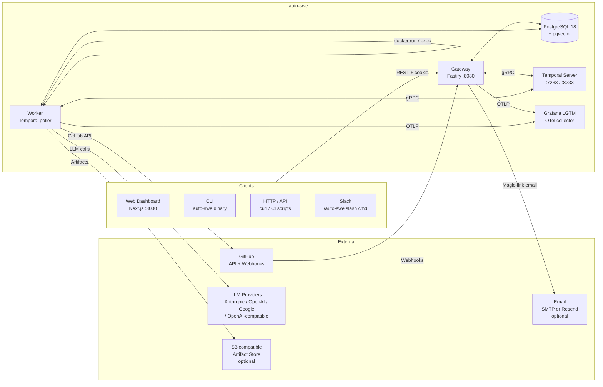
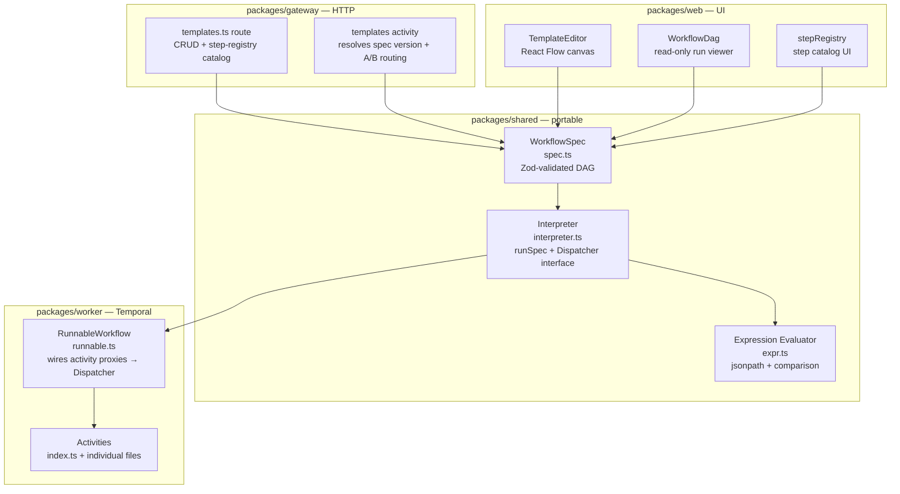
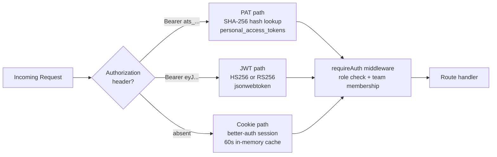
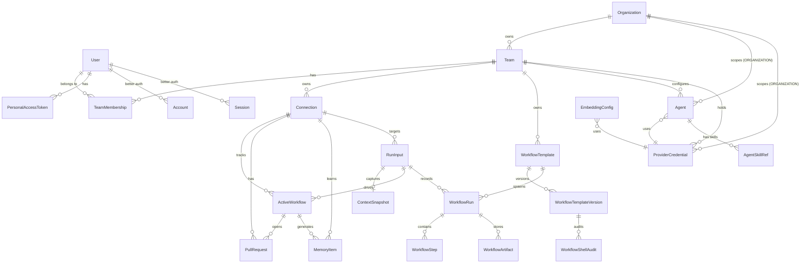
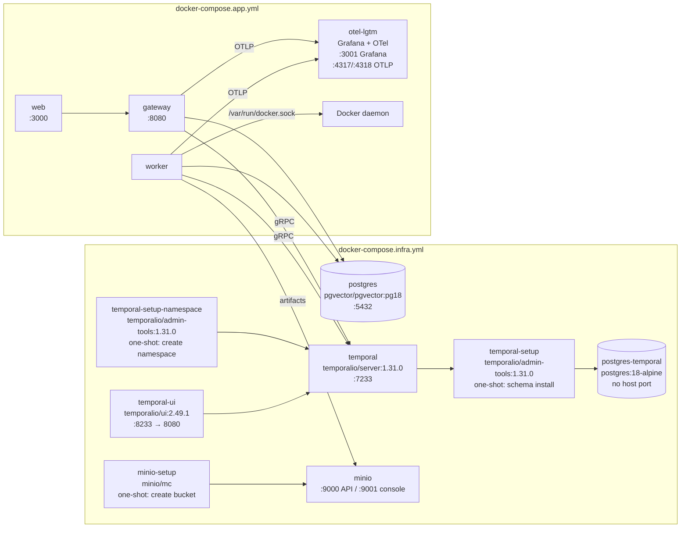

# System Architecture — auto-swe

> **Current-state reference.** This document describes the system as shipped (all 9 configurable-workflow phases complete). For historical design rationale see the other files in this directory; for conventions and commands see [AGENTS.md](../AGENTS.md); for deployment see [deployment.md](./deployment.md).

---

## 1. System Context



Key design choices:
- **Gateway is stateless** — all durable state lives in Temporal + Postgres.
- **Worker drives all execution** — no LLM calls happen in the Gateway.
- **Human merges only** — the system never merges PRs; a Temporal signal bridges the GitHub webhook back to the waiting workflow.

---

## 2. Monorepo Package Map

```
packages/
├── shared/      Prisma schema, DB client, shared types, workflow engine (spec + interpreter)
├── gateway/     Fastify 5 HTTP API — auth, RBAC, routing, webhooks, admin
├── worker/      Temporal worker — Mastra agents, activities, workflow runners
├── web/         Next.js 16 dashboard — App Router, TanStack Query, Zustand, React Flow
└── cli/         auto-swe binary — thin REST client over gateway
```

### 2.1 `packages/shared`

| Path | Purpose |
|------|---------|
| `src/db.ts` | Singleton `PrismaClient` — import this everywhere |
| `src/index.ts` | Re-exports types and enums from `@auto-swe/shared` |
| `src/prisma/schema.prisma` | **Authoritative data model** — 40 models (see §6; the `Agent` + `AgentSkillRef` entities replaced `ModelRoleConfig` / `AgentSkillAssignment` / `AgentToolConfig` in P1/P1.5) |
| `src/prisma/seed.ts` | Seeds admin user, default team, sample `git_repo` connection, default workflow template, built-in skills + scanner patterns, and the GLOBAL `Agent` rows |
| `src/prisma/migrations/` | Squashed init migration + HNSW-index migration |
| `src/skills/index.ts` | Barrel — `BUILTIN_SKILLS` array + `BuiltinSkillDef` interface; one file per skill in this directory |
| `src/scannerPatterns/index.ts` | `BUILTIN_SCANNER_PATTERNS` — 52 patterns across `INJECTION` (14), `EXFILTRATION` (11), `SHELL_COMMAND` (11), `CODE_SECURITY` (10), `SENSITIVE_FILE` (6) types; synced as `isBuiltIn: true` by `syncBuiltins()` at gateway startup |
| `src/lib/skillScanner.ts` | `scanSkillContent(text)` — loads INJECTION/EXFILTRATION patterns from DB (60 s cache), scans LLM output and skill prompt text for injection/exfiltration signatures; returns `{ safe, warnings }` |
| `src/workflow/spec.ts` | `WorkflowSpec` Zod schema — DAG node types (step/agent/mcp/eval/set/cond/signal/terminate/fanOut/shell/containerStep/human*) |
| `src/workflow/interpreter.ts` | **Pure DAG interpreter** (`runSpec`) — no Temporal imports; side effects via `Dispatcher` |
| `src/workflow/expr.ts` | Expression evaluator for `cond` node predicates (jsonpath + comparison, no JS sandbox) |
| `src/workflow/stepRegistry.ts` | Step catalog (metadata, input schemas) — imported by gateway + web without worker dependency |
| `src/workflow/defaultEngineeringSpec.ts` | Seed spec `default-engineering@v1` — behavioural parity with the old hardcoded loop |
| `src/workflow/shellImageAllowlist.ts` | Built-in image allowlist + per-team extension logic |
| `src/workflow/signalSlots.ts` | Typed signal-slot registry (maps spec signal names → Temporal signal names) |
| `src/workflow/specDiff.ts` | Version-diff utility used by the editor's diff viewer |
| `src/workflow/analytics.ts` | Pure analytics aggregation helpers (used by gateway analytics routes) |
| `src/lib/crypto.ts` | AES-256-GCM helpers for `ProviderCredential.apiKeyCiphertext` |

### 2.2 `packages/gateway`

| Path | Purpose |
|------|---------|
| `src/index.ts` | Entry point — registers all plugins and routes, starts Fastify; inline `POST /api/v1/auth/session-token` bridge (better-auth session → short-lived JWT) and `GET /api/v1/auth/providers` |
| `src/plugins/auth.ts` | **Auth middleware** — `requireAuth({ requiredRole })` / `requireUser()` / role hierarchy |
| `src/plugins/prisma.ts` | Decorates `fastify.prisma` |
| `src/plugins/temporal.ts` | Decorates `fastify.temporal` (Temporal `Client`) |
| `src/lib/betterAuth.ts` | better-auth instance — email+password, GitHub/Google OAuth, magic-link, cookie sessions |
| `src/lib/github.ts` | Octokit singleton and GitHub webhook HMAC verification |
| `src/lib/slack.ts` | Slack SDK client; slash-command and interactive-webhook handlers |
| `src/lib/telemetry.ts` | OpenTelemetry SDK init (OTLP/HTTP exporter) |
| `src/routes/workRequests.ts` | `POST /api/v1/work-requests` — validates the run-input payload against the template's `inputSchema`, then creates `RunInput` (`payload` + `connectionId`) + starts `RunnableWorkflow` |
| `src/routes/workflows.ts` | `GET /api/v1/workflows` — list active workflows (RBAC-filtered) |
| `src/routes/workflowRuns.ts` | `GET /api/v1/workflow-runs` — paginated run history; `POST /:id/cancel` |
| `src/routes/workflowTemplates.ts` | CRUD for `WorkflowTemplate` + versions; promotes active version; step registry catalog |
| `src/routes/workflowProjections.ts` | Live step-status projections for the `/runs/[id]` viewer |
| `src/routes/webhooks.ts` | `POST /api/v1/webhooks/git` (merge signal) + `/webhooks/ci` (CI signal) |
| `src/routes/epics.ts` | `POST /api/v1/epics` — starts `EpicOrchestratorWorkflow` |
| `src/routes/repositories.ts` | CRUD for `Connection` (team-scoped) |
| `src/routes/teams.ts` | CRUD for `Team` + membership + shell-image allowlist; team-scoped credentials |
| `src/routes/users.ts` | User management (ADMIN only) |
| `src/routes/lessons.ts` | `MemoryItem` list, text search, per-repo stats, delete |
| `src/routes/skills.ts` | `Skill` library CRUD + a team-scoped read-only skill list (per-role skill/tool config moved to the Agent library) |
| `src/routes/agentLibrary.ts` | P1 Agent library CRUD — `/api/v1/admin/agent-library` (all scopes, ADMIN) + `/api/v1/teams/:id/agent-library` (team OWNER); create/version/list/deactivate with prompt scan + referential integrity (`lib/agentLibraryService.ts`) |
| `src/routes/me.ts` | `GET /api/v1/me/preferences` + `PATCH /api/v1/me/preferences` — read and merge-update the authenticated user's preferences JSON (e.g. `runDetailLayout`) |
| `src/routes/tokens.ts` | Personal access token create / list / revoke |
| `src/routes/modelConfig.ts` | `ProviderCredential` + `EmbeddingConfig` CRUD + config audit log (admin + team-owner); per-role model config lives in the Agent library |
| `src/routes/admin.ts` | Admin-only: list/revoke all PATs, list/revoke sessions, shell-audit prune |
| `src/routes/scannerPatterns.ts` | CRUD for `ScannerPattern` — `INJECTION`, `EXFILTRATION`, `SHELL_COMMAND`, `CODE_SECURITY`, `SENSITIVE_FILE` types; validates regex + safe flag subset (i,m,s,u,v); calls `invalidateScannerPatternCache()` on writes |
| `src/routes/securityEvents.ts` | `GET /api/v1/admin/security-events` — queries `agent_traces` for security-relevant rows; derives `SecurityEventType` at read time using DB-level predicates; supports `limit`/`offset`/`runId`/`type` filters |
| `src/routes/humanSteps.ts` | `GET /api/v1/inbox` + `GET /api/v1/inbox/:id` + `POST /api/v1/inbox/:id/respond` — HITL pending-step inbox and response endpoint (see [hitl-workflows.md](./hitl-workflows.md)) |
| `src/routes/systemConfig.ts` | `/api/v1/admin` system-config CRUD — GitHub (incl. GitHub App), Slack, Storage, Tracker, OAuth, and workflow-defaults singletons backing `/admin/integrations` and `/admin/workflow` |
| `src/lib/ticketTracker.ts` | Read-only issue-tracker connectors (Jira REST v3 / Linear GraphQL / GitHub Issues) — `fetchTicket()` runs at work-request submit time and seeds `ContextSnapshot.rawTicketData`; 5 s timeout, never throws (best-effort enrichment) |
| `src/routes/scheduledWorkRequests.ts` | CRUD for `ScheduledWorkRequest` + Temporal Schedule lifecycle — creates a standing `RunInput` + `ActiveWorkflow` (status `SCHEDULED`) on first save; each Temporal Schedule fire starts a fresh `RunnableWorkflow` |
| `src/routes/slack.ts` | `/api/v1/auth/slack` — OAuth connect + callback, `/auto-swe` slash command, signature-verified interactive webhooks |
| `src/lib/auditLog.ts` | `writeAuditLog()` — shared helper that writes `ConfigAuditLog` rows for all config mutations |

### 2.3 `packages/worker`

| Path | Purpose |
|------|---------|
| `src/index.ts` | Worker entry — calls `assertConfigReady()`, starts Temporal worker |
| `src/workflows/runnable.ts` | **`RunnableWorkflow`** — generic Temporal workflow; wires activity proxies to `Dispatcher` and calls `runSpec` |
| `src/workflows/epicOrchestrator.ts` | **`EpicOrchestratorWorkflow`** — decomposes multi-repo epics, fans out child `RunnableWorkflow`s with dep-graph scheduling |
| `src/activities/index.ts` | Barrel — exports all activity functions registered with the worker |
| `src/activities/executeImplementation.ts` | **Core agent loop** — DinD workspace, git clone, Implementer Mastra agent, TDD loop |
| `src/activities/runReviewNetwork.ts` | Runs Security / Domain / Performance reviewers in parallel via `Promise.allSettled` |
| `src/activities/ciFixLoop.ts` | `fetchCILogs` + `executeCIFixImplementation` — CI self-healing |
| `src/activities/qualityGates.ts` | `runLint` / `runTypecheck` / `runTests` / `runBuild` / `runVulnScan` / `runPerfBench` |
| `src/activities/shellStep.ts` | Phase-6 `runShellStep` — ephemeral container, image allowlist, audit write |
| `src/activities/decomposition.ts` | `planDecomposition` — Decomposer agent → `Subtask[]` for fan-out |
| `src/activities/validateContext.ts` | `validateContext` — Context Validator agent → `ContextSnapshot` |
| `src/activities/commitToMemory.ts` | Memory Agent summarization → `MemoryItem` + pgvector embedding |
| `src/activities/createOrUpdatePullRequest.ts` | GitHub PR create/update via Octokit; idempotent on branch |
| `src/activities/templates.ts` | Fetches + resolves `WorkflowSpec` for a run (scope cascade + A/B routing) |
| `src/activities/state.ts` | `updateDomainState`, `createWorkflowRun`, `recordWorkflowStep`, `finalizeWorkflowRun` |
| `src/activities/workspace.ts` | DinD workspace helpers — `createWorkspace()` returns `{ exec, execCapture, destroy }` + `shellQuote()` |
| `src/agents/implementer.ts` | Mastra `Agent` for code writing + TDD |
| `src/agents/reviewNetwork.ts` | Three Mastra `Agent`s (Security Auditor, Domain Logic, Performance) |
| `src/agents/plannerAgent.ts` | Mastra `Agent` for per-repo plan decomposition |
| `src/agents/decomposer.ts` | Mastra `Agent` for fan-out subtask decomposition |
| `src/agents/preWriteSecurityCheck.ts` | Regex-based pre-write content scanner wrapping the `writeFile` tool; exports `SECURITY_CHECK_FAILED_PREFIX` and `SECURITY_WARNINGS_PREFIX` constants |
| `src/lib/scannerPatternLoader.ts` | `makePatternLoader(type, logPrefix)` — factory returning `load()` / `invalidate()` backed by a per-instance 60 s TTL cache; used by `shellCommandScanner`, `codeSecurityScanner`, and `sensitiveFileScanner` to avoid boilerplate |
| `src/lib/shellCommandScanner.ts` | `scanShellCommand(cmd)` — checks bash tool calls against active `SHELL_COMMAND` patterns; soft-block returns error string to agent for self-correction |
| `src/lib/sensitiveFileScanner.ts` | `checkSensitiveFilePath(path)` — hard-blocks writes to paths matching DB-backed `SENSITIVE_FILE` patterns (6 built-ins: `.env`, PEM/key files, SSH private keys, credential JSON; admin-extensible at `/admin/scanner`) via `makePatternLoader` |
| `src/lib/codeSecurityScanner.ts` | `scanDiffForCodeIssues(diff)` — advisory scan of git diff added-lines against `CODE_SECURITY` patterns; `formatCodeSecurityFindings(findings)` — formats for security reviewer prompt |
| `src/lib/models.ts` | `getModel(role, ctx)` — 4-level scope cascade (template → team → org → global) |
| `src/lib/config/agentSkills.ts` | `loadAgentSkills(role, ctx)` + `loadAgentToolConfig(role, ctx)` + `skillsToPromptSuffix(skills)` — skill and tool config loading at WORKFLOW_TEMPLATE → TEAM → ORGANIZATION → GLOBAL scope |
| `src/lib/config/resolver.ts` | `resolveProviderCredential(provider, ctx)` + `resolveEmbeddingConfig()` — credential + embedding cascade (per-agent model resolution lives in `agentResolver.ts` → `resolveAgent`); `ConfigMissingError` |
| `src/lib/config/agentResolver.ts` | `resolveAgent(key, ctx)` — **sole** model/skill/tool resolver (P1.5); most-specific active Agent version with run-start pin (`WorkflowRun.agentVersions`); model via `modelSpec`/`inheritsModelFrom`, skills via `skillRefs`, tools via `toolKeys` |
| `src/lib/config/agentSpec.ts` | `resolveAgentSpec(input, ctx)` — composes the resolved Agent into an `AgentSpec` (model + prompt + skills + tools); used by `runAgent` |
| `src/lib/config/agentRef.ts` | `parseAgentRef(ref)` / `formatAgentRef` — `<key>` (float) / `<key>@<version>` (pin) grammar for the `agent` node |
| `src/lib/embeddings.ts` | `generateEmbedding` — resolves `EmbeddingConfig` from DB, enforces 1536-dim |
| `src/lib/costTracking.ts` | `recordLlmUsage` — per-call USD metering via `MODEL_PRICES`, OTel span attributes |

### 2.4 `packages/web`

| Path | Purpose |
|------|---------|
| `src/app/layout.tsx` | Root layout — `AppShell` chrome (Sidebar + TopBar), theme tokens |
| `src/app/page.tsx` | Dashboard home — KPI stats, "needs attention" queue, recent activity |
| `src/app/runs/` | Global run history with status + template filters |
| `src/app/runs/[id]/` | Live run viewer — React Flow DAG with per-node status overlay; bottom panel supports **split-panel** (steps + traces side-by-side, `SplitRunPanel`) and **inline-expansion** (traces accordion below each step, `TracesTab`) layouts toggled by `LayoutToggle` with preference persisted via `useUserPreferences` |
| `src/app/templates/` | Workflow template list + 5 starter specs |
| `src/app/templates/[id]/` | React Flow canvas editor (`TemplateEditor`) — drag-to-create, drag-to-connect, version sidebar, A/B experiment, analytics |
| `src/app/workflows/` | Active workflow list |
| `src/app/epics/` | Multi-repo epic creation + status |
| `src/app/repositories/` | Connection CRUD |
| `src/app/teams/` | Team management — members, roles, shell-image allowlist |
| `src/app/users/` | User management (ADMIN) |
| `src/app/lessons/` | Agent memory search |
| `src/app/inbox/` | HITL inbox — pending human steps with respond forms; 10 s polling; sidebar count badge |
| `src/app/analytics/` | Global analytics — success rate, p50/p95, $/run, per-step failure rates |
| `src/app/settings/` | User settings — API tokens (create / list / revoke) |
| `src/app/admin/model-config/` | Provider credential + embedding-config CRUD + audit log (per-role model/prompt/skills/tools live in /admin/agents/library) |
| `src/app/admin/integrations/` | System integrations — GitHub (PAT or GitHub App), Slack, Storage (S3/MinIO), Tracker (Jira / Linear / GitHub Issues ticket connector), OAuth tabs |
| `src/app/admin/workflow/` | Workflow defaults — branch prefix, PR title/body templates, default team slug, lesson consolidation schedule |
| `src/app/admin/skills/` | Skills library — CRUD for custom skills; built-in skills (read-only); `isVerified` badge |
| `src/app/admin/agents/` | Agent role config list — per-role skill + tool access assignments at GLOBAL scope |
| `src/app/admin/schedules/` | Scheduled work requests — list, create, edit, delete standing automations backed by Temporal Schedules |
| `src/app/admin/access-tokens/` | PAT lifecycle management (admin view — all tokens across users) |
| `src/app/admin/sessions/` | Session management — list and revoke active better-auth sessions |
| `src/app/admin/lessons/` | Agent memory observability — full lesson table with text search and per-repo stats |
| `src/app/admin/scanner/` | Scanner pattern admin — CRUD for all 5 `ScannerPatternType` values; regex validation; built-in vs custom badges |
| `src/app/admin/security/` | Security events dashboard — type filter, per-type summary bar, expandable event rows, 30 s auto-refresh |
| `src/components/security/SecurityEventList.tsx` | `SecurityEventBadge`, `SecurityEventList` — expandable list with per-type formatted details (code findings, LLM warnings, content security lines, bash command); `classifyTraceAsSecurityEvent` — client-side classification for run-detail security panel |
| `src/hooks/` | TanStack Query hooks split by resource domain — `useRuns`, `useTemplates`, `useTeams`, `useRepositories`, `useUsers`, `useAdmin`, `usePats`, `useInbox`, `useEpics`, `useLessons`, `useUserPreferences` (run detail layout preference with optimistic update); `useWorkflows` is a barrel re-export |
| `src/stores/` | Zustand stores — `authStore.ts` (JWT + user identity), `teamStore.ts` (active team context) |
| `src/components/ui/` | Design-system primitives: `Button`, `Input`, `Select`, `Card`, `Modal`, `ConfirmModal`, `Alert`, `TabBar`, `Pagination`, `LoadingState`, `Stat`, `StatusBadge` |
| `src/components/<feature>/` | Feature components grouped by domain (`charts/`, `dashboard/`, `modelConfig/`, `repositories/`, `teams/`, `templates/`) |
| `src/lib/api.ts` | `ApiClient` — all fetches; automatic 401 → token refresh |
| `src/lib/chartUtils.ts` | Pure data transformations for Recharts (`groupWorkflowsByStatus`, `groupLessonsByType`, etc.) |
| `src/lib/utils.ts` | `formatDate`, `formatRelativeTime`, `formatCost`, `formatPercent`, `cn()` |

#### Design system

The dashboard uses a custom "Workshop Telemetry" theme defined via Tailwind v4 `@theme` in `globals.css`.

| Token family | Semantic use |
|---|---|
| `ink-*` (900→600) | Backgrounds and borders — dark surfaces |
| `paper-*` (100→500) | Foreground text — light on dark |
| `ember-*` | Primary accent — interactive elements, links |
| `moss-*` | Success states |
| `brick-*` | Error / danger states |
| `amber-*` | Warning states |
| `dust-*` | Informational / neutral accent |
| `violet-*` | Secondary accent |

Legacy `var(--muted-foreground)`, `var(--border)`, `var(--muted)`, `var(--primary)` aliases are bridged in `globals.css` for backward compatibility — new code uses tokens directly.

#### Data fetching conventions

All server state lives in TanStack Query (staleTime 30 s, retry 1). Running workflows use an adaptive refetch interval (3 s); terminal-state queries use 30 s. All hooks import `api` from `src/lib/api.ts` — no direct `fetch` calls in components.

---

## 3. Work Request Lifecycle

End-to-end flow from API call to merged PR:


### Multi-repo Epics

For `POST /api/v1/epics`, the gateway starts `EpicOrchestratorWorkflow` (`packages/worker/src/workflows/epicOrchestrator.ts`) instead. It:
1. Runs the **Planner agent** (`plannerAgent.ts`) to decompose the brief into per-repo subtasks.
2. Builds a dependency graph from the plan.
3. Fans out child `RunnableWorkflow`s, scheduling them in dependency order.
4. Reports `PLANNING → FANNING_OUT → COMPLETED/FAILED/CANCELLED`.

---

## 4. Workflow Engine

The configurable workflow engine is the core runtime — every work request runs through it.



### Node types in a WorkflowSpec

The spec supports **15 node types**. The eleven core/structural nodes below are handled by the interpreter or dispatched as activities; the four human-in-the-loop nodes pause the run for a human signal and are documented in detail in [hitl-workflows.md](./hitl-workflows.md).

| Node type | Purpose | Key fields |
|-----------|---------|-----------|
| `step` | Dispatch a registered activity | `step` (name), `inputs`, `next`, `onFail`, `config` |
| `agent` | Run a library Agent by reference (P2) | `agentRef` (`<key>` / `<key>@<version>`), `userMessage`, `systemPrompt`, `inputs`, `next`, `onFail` |
| `mcp` | Call one tool on an `mcp` Connection (P2) | `connectionRef` (mcp Connection id), `tool`, `inputs` (→ tool args), `next`, `onFail` |
| `eval` | Score a target value with floor/judge/trajectory scorers, then gate or branch on the verdict (evals P2) | `target` (binding), `scorers[]` (`gate`/`assert`/`judge`/`trajectory`), `judgeAdvisory`, `inputs`, `next`, `onFail` |
| `set` | Write values into the workflow context | `values` (map of path → binding) |
| `cond` | Branch on a boolean expression | `expr` (jsonpath), `onTrue`, `onFalse` |
| `signal` | Await a named Temporal signal with timeout | `name`, `timeout`, `onReceive`, `onTimeout`, `storeAs` |
| `terminate` | End the run with a specific status | `status`, `result` |
| `fanOut` | Run a subgraph once per item in an array | `over`, `subgraph`, `join`, `itemKey`, `concurrency`, `onBranchFail`, `exports`, `pluck` |
| `shell` | Run a user-authored command in an ephemeral container | `image`, `command`, `network`, `timeoutMs`, `memory`, `cpus`, `onFail` |
| `containerStep` | Container-contract coded capability — run an image with a JSON in/out contract (P4) | `image`, `command`, `inputs`, `network`, `memory`, `cpus`, `timeoutMs`, `transport` (`stdout`/`ndjson`/`sidecar`, P5), `sidecar` (`{ port, requestPath?, readinessPath?, readyTimeoutMs? }`), `onFail` |
| `humanApproval` | Pause for a binary approve/reject before continuing | `timeout`, `onTimeout`, `contentFrom`, `storeAs` |
| `humanDecision` | Pause for a 2–10 option branch selection | `options`, `timeout`, `onTimeout` |
| `humanInput` | Pause for a structured typed-field form, written back into context | `fields`, `timeout`, `onTimeout`, `storeAs` |
| `humanReview` | Pause for an annotated review of displayed content | `contentFrom`, `timeout`, `onTimeout`, `storeAs` |

All four HITL nodes are handled internally by the interpreter (`runHumanNode`): they create a `WorkflowHumanStep` row, optionally send a Slack notification, then park on a Temporal signal `hitl_<nodeId>` until the inbox/Slack response arrives or the timeout routes to `onTimeout`. See [hitl-workflows.md](./hitl-workflows.md).

### Dispatcher interface (`interpreter.ts`)

```
interface Dispatcher {
  dispatchStep({ nodeId, step, config, inputs, ctx, cancellation? }) → Promise<unknown>
  dispatchShell?({ nodeId, node, inputs, ctx, cancellation? })       → Promise<unknown>
  waitSignal(name, timeout)                                          → Promise<unknown | undefined>
  recordStep({ nodeId, status, inputs?, outputs?, error?, attempt? }) → Promise<void>
  notifyHumanStep?({ ... })                                          → Promise<void>   // HITL: create inbox row + notify
  resolveHumanStep?({ nodeId, status })                             → Promise<void>   // HITL: mark inbox row resolved
}
```

`RunnableWorkflow` implements this by wrapping each activity proxy call. Set, cond, signal, terminate, fan-out, and the four HITL nodes are handled internally by the interpreter — only `step` and `shell` cross the dispatcher's activity boundary. `dispatchShell` is optional (dispatchers that omit it throw on shell nodes); `notifyHumanStep` / `resolveHumanStep` are optional and only exercised by HITL nodes. The interpreter has no Temporal imports and runs in tests with a mock dispatcher.

### 4-level scope cascade

All per-role configuration (model selection, skills, tool access) follows the same cascade at activity-call time. P5 inserted the `ORGANIZATION` tier between `TEAM` and `GLOBAL`; it fires only when the run's team belongs to an org (`ctx.orgId` is derived transitively from `Team.orgId`), so org-free deployments behave exactly as the prior 3-level cascade:

```
For each LLM call / activity invocation:
  resolve(role, { teamId, orgId, workflowTemplateId })
      ↓
  1. WORKFLOW_TEMPLATE row (if templateId set)
  ↓ (fall through if missing)
  2. TEAM row (if teamId set)
  ↓ (fall through if missing)
  3. ORGANIZATION row (if orgId set; P5)
  ↓ (fall through if missing)
  4. GLOBAL row

Agent (P1.5)  → resolveAgent()        in packages/worker/src/lib/config/agentResolver.ts (THE resolver; run-start version pin)
Model         → getModel()            in packages/worker/src/lib/models.ts            (shim over resolveAgent — 6 model-backed roles)
Skills        → loadAgentSkills()     in packages/worker/src/lib/config/agentSkills.ts (shim over resolveAgent — Agent skillRefs)
Tool access   → loadAgentToolConfig() in packages/worker/src/lib/config/agentSkills.ts (shim over resolveAgent — Agent toolKeys; null = all)
```

**Agent identity (post-P1.5):**

Agent identity is a **free-form string** (`AnySkillRole = string`); the legacy `AgentRole` enum and the `SkillOnlyRole` union were removed in the platform pivot (P0/P1). Two groups of seeded SWE keys remain by convention:

- **Model-backed roles (6):** `implementer`, `reviewer`, `planner`, `securityReview`, `validateContext`, `commitToMemory` — each has a GLOBAL `Agent` with a `modelSpec` (validated at worker boot by `assertConfigReady`). Note: `securityReview` is a legacy role name preserved for forward compatibility; the canonical security analysis path is the three-agent **review network** (`runReviewNetwork`) which uses the `reviewer` model for all three sub-agents. Do not route new code through `securityReview`.
- **Sub-role personas (4):** `securityReviewer`, `domainLogicReviewer`, `performanceReviewer`, `decomposer` — used within a parent activity. Their `Agent` has **no** `modelSpec`; it carries `inheritsModelFrom` (→ `reviewer` for the three reviewers, → `planner` for `decomposer`) so `resolveAgent` binds the parent's model.

**First-class `Agent` entity (P1, sole source since P1.5):** the `Agent` table is the versioned, governed, **single source of truth** for per-role model/prompt/skills/tools — the legacy `ModelRoleConfig` / `AgentSkillAssignment` / `AgentToolConfig` tables were removed in P1.5. `resolveAgent(key, ctx)` (`lib/config/agentResolver.ts`) resolves the most-specific active Agent version (cascade `WORKFLOW_TEMPLATE → TEAM → ORGANIZATION → GLOBAL`, run-start version pinned via the `WorkflowRun.agentVersions` snapshot): model from `modelSpec` (chasing `inheritsModelFrom`) + credential, skills from `skillRefs`, tools from `toolKeys`. `getModel`/`getModelSpec`/`loadAgentSkills`/`loadAgentToolConfig` are thin shims over it. `resolveAgentSpec` (`lib/config/agentSpec.ts`) composes the result into an `AgentSpec`; the generic `runAgent` activity executes it. Seeded built-in agents live at GLOBAL scope tagged `origin='swe-starter'` (with default model specs, so the worker boots from the seed — no "Seed defaults" step). Managed at `/admin/agents/library` via `/api/v1/admin/agent-library`.

Sub-role usage:
- `securityReviewer`, `domainLogicReviewer`, `performanceReviewer` — loaded by `runReviewNetwork`; each reviewer agent gets its own skill suffix appended to its system prompt. All three inherit the `reviewer` model.
- `decomposer` — loaded by `planDecomposition`; the decomposer agent gets its own skill suffix (model comes from the parent `planner` role config).

**Skills vs tools:**
- **Skill** = named prompt fragment (`promptText`) injected into the agent system message. Controls *how* an agent reasons. Each skill has an `isVerified` flag (`true` for built-ins seeded from `packages/shared/src/skills/`; `false` for custom skills, reset whenever `promptText` is updated). Custom skill content is scanned for injection/exfiltration patterns by `scanSkillContent` in `packages/shared/src/lib/skillScanner.ts` (non-blocking; returns warnings). Scan patterns are stored in the `ScannerPattern` table — 52 built-in patterns (all 5 types) synced by `syncBuiltins()` at gateway startup, plus any custom patterns added by admins at `/admin/scanner`. Patterns have `flags` (safe subset: `i`, `m`, `s`, `u`, `v` only) and `isActive` toggle. The scanner caches active patterns for 60 s and invalidates on any pattern mutation.
- **Tool** = executable Mastra `createTool()` function. The implementer has four configurable workspace tools (`readFile`, `writeFile`, `listDirectory`, `bash`) tracked in `IMPLEMENTER_TOOL_IDS` and controlled by the resolved `Agent`'s `toolKeys` (P1.5: replaced the `AgentToolConfig` table; `null` = all four enabled). A fifth tool, `loadSkill`, is automatically added alongside the workspace tools when skills are present — it is not part of `toolKeys`. Other agents have no tools; they use skills for reasoning guidance only.

**Progressive skill disclosure (implementer agent):** Skills are not pre-injected wholesale. The implementer agent receives a compact L1 menu (skill name + description) in its system prompt and calls the `loadSkill` tool to fetch the full `promptText` only when it decides to engage a skill. This avoids token bloat from unused skills. Other agents (reviewer sub-agents, planner, decomposer) continue to receive their skill fragments directly in the system prompt since they have no tools.

**Lesson memory and skills:** When `commitToMemory` creates a `MemoryItem` (SWE lessons live under `scope = 'swe-lessons'`), it records which skills were active during that run in the `skillsActive` column (`String[]`). This allows future observability and skill-effectiveness analysis without changing the lesson query path.

**Agent observability — `AgentTracer`:** Every LLM-calling activity must create an `AgentTracer`, call `addToolCall` / `addLlmResponse` / `addActivityEvent` as operations run, and then call `persistActivityTrace(tracer, role)` at exit (best-effort; failures are swallowed). These records land in the `agent_traces` table and power the `/runs/[id]` viewer. See [docs/agents.md §8](./agents.md#8-agent-observability-agenttracer) for the full pattern and table schema.

**Full agent, tool, and skill reference:** [docs/agents.md](./agents.md) covers all 10 roles, all 27 built-in skills, the implementer's 5 tools, the review network model resolution, the `AgentTracer` pattern, and the complete skill + tool assignment API endpoint reference.

Files: `packages/worker/src/lib/models.ts`, `packages/worker/src/lib/config/agentSkills.ts`, `packages/worker/src/lib/config/types.ts`, `packages/worker/src/lib/config/resolver.ts`, `packages/worker/src/lib/agentTracer.ts`, `packages/worker/src/lib/activityContext.ts`, `packages/shared/src/lib/skillScanner.ts`, `packages/gateway/src/routes/scannerPatterns.ts`, `packages/gateway/src/routes/skills.ts`, `packages/shared/src/prisma/schema.prisma` (`Agent`, `AgentSkillRef`, `Skill`, `MemoryItem`, `ScannerPattern`, `AgentTrace`).

---

## 5. Authentication

The gateway supports three independent auth paths on every protected route:



| Path | Token format | Storage | Issued by |
|------|-------------|---------|-----------|
| JWT bearer | `eyJ…` (HS256/RS256) | `sessions` table (via better-auth) | `POST /api/v1/auth/session-token` bridge — exchanges an active better-auth session cookie for a short-lived JWT |
| PAT bearer | `ats_<base64url-32B>` | `personal_access_tokens` (hash only) | Settings → API tokens in UI |
| better-auth cookie | HTTP-only session cookie | `sessions` table (60s in-memory cache) | `POST /api/auth/sign-in/*` — email+password, GitHub OAuth, Google OAuth, magic-link |

Relevant files:
- `packages/gateway/src/plugins/auth.ts` — `requireAuth`, `requireUser`, role hierarchy
- `packages/gateway/src/lib/betterAuth.ts` — better-auth instance
- `packages/gateway/src/index.ts` — session-token bridge (`POST /api/v1/auth/session-token`)
- `packages/gateway/src/routes/tokens.ts` — PAT lifecycle

RBAC roles (platform-wide): `ENGINEER < LEAD < ADMIN`. Team-role enforcement (`ENGINEER/LEAD/ADMIN` per team) is layered on top via `requiredTeamRole` in `requireAuth`.

---

## 6. Data Model

The authoritative schema is `packages/shared/src/prisma/schema.prisma`. Key model groups:



### Model groups at a glance

| Group | Models | Purpose |
|-------|--------|---------|
| Identity | `User`, `Account`, `Session`, `Verification` | User identity (better-auth sessions + PATs + JWT bridge); `User.preferences` JSONB stores per-user settings (e.g. `runDetailLayout`) |
| Auth tokens | `PersonalAccessToken` | PAT lifecycle — `ats_*` bearer tokens minted in Settings → API tokens |
| RBAC | `TeamMembership` | Platform + team role enforcement |
| Work | `RunInput`, `ContextSnapshot` | Generic run input (P3) — `payload` Json validated against the template's `inputSchema`, `connectionId` target, plus the SWE columns (`externalTicketId`, `description`) for parity; `ContextSnapshot` is an SWE satellite keyed by run |
| Execution state | `ActiveWorkflow`, `PullRequest` | Temporal ↔ DB state sync |
| Workflow engine | `WorkflowTemplate`, `WorkflowTemplateVersion`, `WorkflowRun`, `WorkflowStep`, `WorkflowArtifact`, `WorkflowShellAudit` | Template versioning, run tracking, artifact storage, shell audit |
| Observability | `AgentTrace` | Per-activity tool-call / LLM-response / activity-event rows — full agent observability |
| Memory | `MemoryItem` | Generic pgvector semantic memory (1536-dim HNSW index); `scope` partitions domains (SWE lessons use `'swe-lessons'`) |
| Model config | `Agent`, `ProviderCredential`, `EmbeddingConfig`, `ConfigAuditLog` | DB-backed LLM routing (AES-256-GCM encrypted keys); the first-class `Agent` is the sole source of model/skill/tool config (P1.5 retired `ModelRoleConfig`) |
| System config | `GitHubConfig`, `SlackConfig`, `StorageConfig`, `WorkflowDefaults`, `GoogleOAuthConfig`, `TrackerConfig` | Singleton (`id='default'`) integration config — encrypted secrets, env-var fallback; `TrackerConfig` drives the submit-time ticket fetch into `ContextSnapshot.rawTicketData` |
| Agent config | `Agent`, `AgentSkillRef`, `Skill` | First-class versioned agents (model/skill/tool overrides, scoped GLOBAL / ORGANIZATION / TEAM / WORKFLOW_TEMPLATE) + skills (prompt fragments) joined via `AgentSkillRef` |
| Infrastructure | `Organization`, `Team`, `Connection` | Tenancy + connection registry. `Organization` (P5) is the top-level tenant boundary — every `Team` nests under one org, and the config cascade gains an `ORGANIZATION` tier between TEAM and GLOBAL (billing/RBAC/row-level isolation still deferred). `Connection.type` (`'git_repo'` for SWE; `'mcp'` for an MCP server, URL in `config.url`, referenced by `Agent.mcpConnectionId`) + generic `config` Json; git-identity columns are nullable for non-git types, git uniqueness is a partial unique index scoped to `type='git_repo'` |

---

## 7. Infrastructure



- **`docker-compose.infra.yml`** — Postgres (app) + Postgres (Temporal, container-internal only — no published host port) + Temporal split across separate images (`temporalio/server` + two one-shot `admin-tools` setup containers + `temporalio/ui`) + MinIO with a one-shot bucket-bootstrap container.
- **`docker-compose.app.yml`** — Gateway + Worker + Web + Grafana LGTM. Overlay — references infra services, not standalone.
- **Worker Docker socket** — The worker needs `/var/run/docker.sock` mounted to spin up DinD workspaces.
- **MinIO** (optional) — S3-compatible artifact store started alongside infra. Configure the backend via `/admin/integrations → Storage`; falls back to Postgres inline blobs when no S3 config is present.

---

## 8. Observability

Every LLM call emitted by the worker is wrapped in an OpenTelemetry span. Key span attributes:

| Attribute | Value |
|-----------|-------|
| `llm.cost_usd` | USD cost computed from `MODEL_PRICES` in `costTracking.ts` |
| `llm.cost_pricing_known` | `false` if the model is not in `MODEL_PRICES` (still tracked, zero cost) |
| `workflow.budget_remaining_input` | Remaining input-token budget for the current run |
| `workflow.budget_remaining_output` | Remaining output-token budget |

Traces export to the Grafana LGTM stack via OTLP/HTTP (`OTEL_EXPORTER_OTLP_ENDPOINT`). The Grafana UI is at `:3001` when running `yarn docker:app:up`.

Files:
- `packages/gateway/src/lib/telemetry.ts` — OTel SDK init for the gateway
- `packages/worker/src/lib/costTracking.ts` — `recordLlmUsage`, `MODEL_PRICES`

### Budget tiers

Every run carries a `budgetTier` (set at submission, default `STANDARD`). `recordLlmUsage` accrues `tokensInputUsed` / `tokensOutputUsed` / `costUsdAccrued` on the `ActiveWorkflow` row before checking the limit (so the UI shows real overage), and throws a non-retryable `BUDGET_EXCEEDED` `ApplicationFailure` when cumulative tokens exceed the tier cap.

| Tier | Input token cap | Output token cap |
|---|---|---|
| `STANDARD` | 2,000,000 | 500,000 |
| `LARGE` | 8,000,000 | 2,000,000 |
| `EPIC` | 20,000,000 | 5,000,000 |

Unknown model specs emit `llm.cost_pricing_known=false` and accrue zero cost rather than breaking the run.

---

## 9. Runtime Security Scanners

Six independent scanners run during agent execution, at distinct stages, each advisory or blocking. Five are backed by DB regex patterns (`ScannerPattern`, 60 s TTL cache via `makePatternLoader`); the pre-write content scanner uses static OWASP-aligned rules. Built-in patterns total **52** (14 `INJECTION`, 11 `EXFILTRATION`, 11 `SHELL_COMMAND`, 10 `CODE_SECURITY`, 6 `SENSITIVE_FILE`), synced by `syncBuiltins()` at gateway startup and admin-extensible at `/admin/scanner`.

| Scanner | Stage | Behavior | Source |
|---|---|---|---|
| **Sensitive file** | Pre-write of every `writeFile` | **Hard-block** | `SENSITIVE_FILE` patterns (`.env`, PEM/key, SSH keys, credential JSON) — `sensitiveFileScanner.ts` |
| **Pre-write content** | Pre-write of every `writeFile` | **Soft-block** (CRITICAL = hard-block) | Static rules in `preWriteSecurityCheck.ts` (hardcoded secrets, SQLi, command injection, weak crypto, CORS `*`) |
| **Shell command** | Pre-exec of every `bash` call | **Soft-block** (returns error string to agent for self-correction) | `SHELL_COMMAND` patterns — `shellCommandScanner.ts` |
| **Code security** | Post-commit diff scan | **Advisory** (findings flow to the security reviewer via `CodeResult.codeSecurityFindings`) | `CODE_SECURITY` patterns — `codeSecurityScanner.ts` |
| **Skill content** | Skill save + LLM output per TDD iteration | **Advisory** (non-blocking; DB failure cannot abort the run) | `INJECTION` + `EXFILTRATION` patterns — `skillScanner.ts` |
| **LLM output** | Post-generate per TDD iteration | **Advisory** (named `activity_event`) | `scanSkillContent` (`INJECTION` / `EXFILTRATION`) |

Scanner blocks tag `AgentTrace.error` with specific prefixes; advisory events write named `activity_event` rows. The `GET /api/v1/admin/security-events` endpoint derives `SecurityEventType` from these at read time. See `/admin/security` (global dashboard) and `/runs/[id]` (per-run panel). Shell nodes additionally run in locked-down ephemeral containers (`--rm --read-only`, `--cap-drop=ALL`, `--pids-limit`, image allowlist, DNS-based egress allowlist).

---

## 10. Key Design Decisions

| Decision | Rationale | Where |
|----------|-----------|-------|
| `RunnableWorkflow` over hardcoded workflow | Teams can configure and version their own workflow DAGs without code changes | `runnable.ts`, `spec.ts`, `interpreter.ts` |
| Pure interpreter in `shared` | Importable by V8 workflow isolate, tests, and gateway (step catalog) without Temporal | `interpreter.ts` |
| Dispatcher interface | Decouples spec traversal from Temporal activity dispatch; test-friendly | `interpreter.ts` |
| DB-backed model config | Provider keys and per-role model selection without env vars; scope cascade supports per-team overrides | `models.ts`, `Agent` (P1.5: replaced `ModelRoleConfig`) |
| AES-256-GCM for credentials | Keys stored encrypted at rest; `CONFIG_ENCRYPTION_KEY` is the only LLM-related env var | `crypto.ts`, `ProviderCredential` |
| Three auth paths | CLI + CI use PATs; web uses better-auth cookies; session-token bridge issues short-lived JWTs for the API surface | `plugins/auth.ts`, `betterAuth.ts`, `tokens.ts` |
| Docker-in-Docker (not K8s) | Zero cluster dependency; same isolation model; works in Docker Compose | `workspace.ts` |
| Temporal for orchestration | Durable execution — workflows survive crashes, wait days for signals, replay deterministically | `runnable.ts`, `epicOrchestrator.ts` |
| pgvector for agent memory | Semantic similarity search surfaces relevant past lessons into agent context at query time | `commitToMemory.ts`, `embeddings.ts`, `MemoryItem` |
| Human-governed merges only | The system opens PRs but never merges; a Temporal signal bridges the GitHub webhook | `webhooks.ts` → `humanMergeSignal` |
