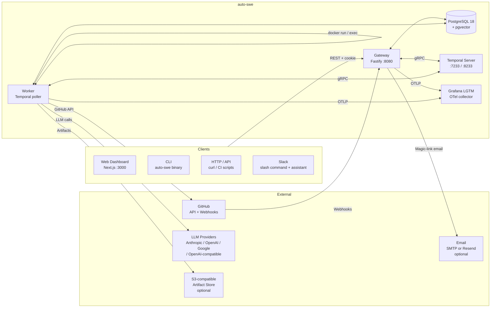
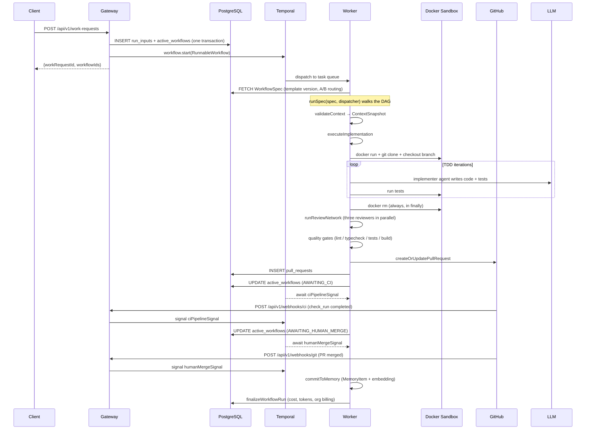
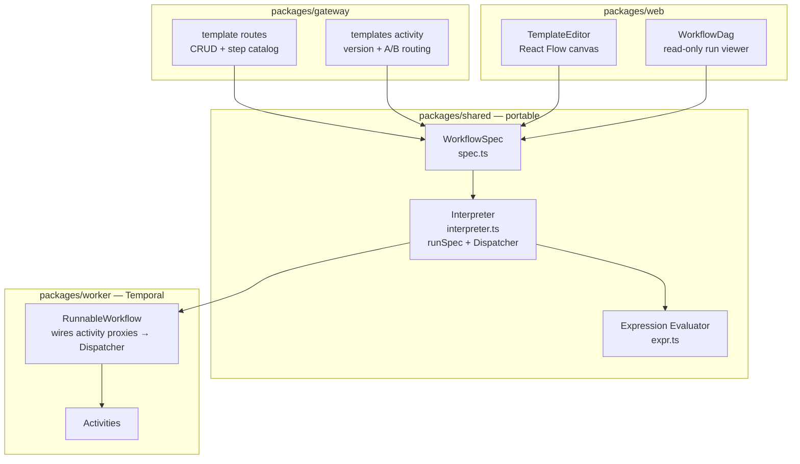
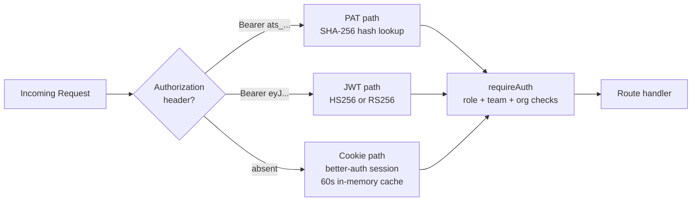
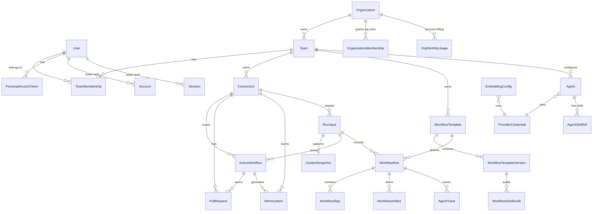
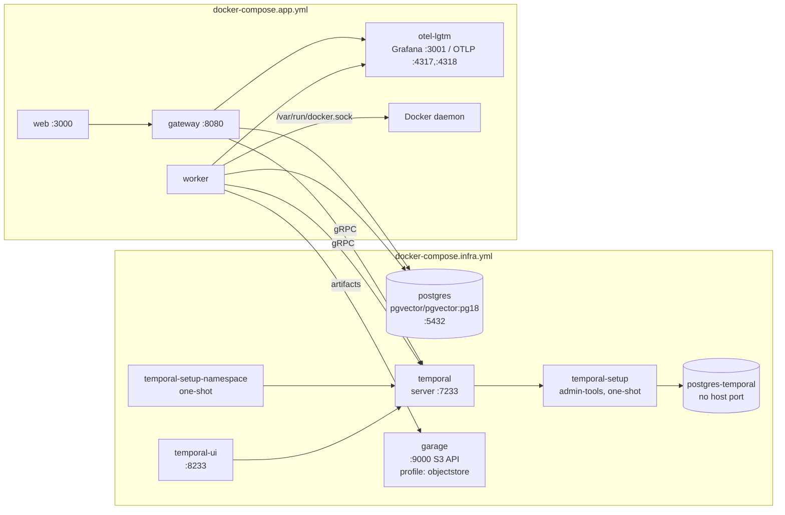

# System Architecture

How auto-swe is put together. For conventions and implementation gotchas see
[AGENTS.md](../AGENTS.md); for the agent layer see [agents.md](./agents.md); for deployment see
[deployment.md](./deployment.md).

---

## 1. System Context



Two invariants shape everything else:

- **The gateway is stateless.** All durable state lives in Temporal and Postgres.
- **The worker drives all execution.** No LLM call ever happens in the gateway.

A third property holds across everything the platform ships, though it is a property of the
activity catalog rather than an enforced boundary: **nothing merges a pull request.** No activity
calls the GitHub merge API, and no seeded template merges — the SWE flow opens a PR and parks, and a
Temporal signal bridges the GitHub merge webhook back to the waiting workflow. See §10 for where
that stops being a guarantee.

---

## 2. Package Map

```
packages/
├── shared/      Prisma schema, DB client, shared types, workflow spec + interpreter
├── gateway/     Fastify 5 HTTP API — auth, RBAC, routing, webhooks, admin
├── worker/      Temporal worker — Mastra agents, activities, workflow runners
├── web/         Next.js 16 dashboard — App Router, TanStack Query, Zustand, React Flow
├── cli/         auto-swe binary — REST client + local bundle authoring
└── sdk/         @auto-swe/sdk — bundle authoring helpers
```

### `packages/shared`

| Path | Purpose |
|------|---------|
| `src/db.ts` | Singleton `PrismaClient` — import this everywhere |
| `src/prisma/schema.prisma` | **Authoritative data model** — 55 models (see §6) |
| `src/prisma/seed.ts` | Seeds the admin user, default team, sample connection, default template, built-in skills + scanner patterns, and the GLOBAL `Agent` rows |
| `src/prisma/migrations/` | Generated `init` baseline + a hand-written constraints/indexes migration |
| `src/skills/` | Built-in skill definitions, one file per skill; `index.ts` exports `BUILTIN_SKILLS` |
| `src/scannerPatterns/index.ts` | `BUILTIN_SCANNER_PATTERNS` — synced at gateway startup |
| `src/lib/syncBuiltins.ts` | Seeded built-in agents, skills, and scanner patterns; idempotent |
| `src/lib/skillScanner.ts` | `scanSkillContent(text)` — injection/exfiltration scan of skill text and LLM output |
| `src/lib/crypto.ts` | AES-256-GCM helpers for encrypted credential columns |
| `src/lib/systemConfig.ts` | `resolveXxxConfig()` resolvers for every singleton config table |
| `src/lib/billing.ts` | `currentYearMonth()` — the month-bucket key shared by the worker writer and gateway reader |
| `src/workflow/spec.ts` | `WorkflowSpec` Zod schema — the node-type union |
| `src/workflow/interpreter.ts` | **Pure DAG interpreter** (`runSpec`) — no Temporal imports; side effects go through `Dispatcher` |
| `src/workflow/expr.ts` | Expression evaluator for `cond` predicates (jsonpath + comparison, no JS sandbox) |
| `src/workflow/stepRegistry.ts` | Step catalog — importable by gateway and web without a worker dependency |
| `src/workflow/defaultEngineeringSpec.ts` | The seeded `default-engineering` spec |
| `src/workflow/shellImageAllowlist.ts` | Built-in image allowlist + per-team extension |
| `src/workflow/signalSlots.ts` | Maps spec signal names → Temporal signal names |
| `src/workflow/specDiff.ts` | Version diff used by the editor |
| `src/workflow/analytics.ts` | Pure aggregation helpers behind the analytics routes |

### `packages/gateway`

| Path | Purpose |
|------|---------|
| `src/index.ts` | Entry point; also hosts the session-token bridge and `GET /api/v1/auth/providers` |
| `src/plugins/auth.ts` | **Auth middleware** — `requireAuth({ requiredRole, requiredTeamRole, requiredOrgRole })`, role hierarchy |
| `src/plugins/prisma.ts`, `src/plugins/temporal.ts` | Decorate `fastify.prisma` / `fastify.temporal` |
| `src/lib/betterAuth.ts` | better-auth instance — email+password, GitHub/Google OAuth, Okta SSO (OIDC), magic-link, cookie sessions |
| `src/lib/workflowLaunch.ts` | `launchTrackedWorkflow` — the single launch path; every route that starts a run goes through it. Writes the `RunInput` (+ `ActiveWorkflow`, when the launch keeps one) in one transaction, **then** starts the Temporal workflow, deleting the rows if the start fails. The unique index on `ActiveWorkflow.temporalWorkflowId` is the atomic dedup gate, so a run cannot execute without a ledger row to attribute its spend and PRs to. |
| `src/lib/idempotency.ts` | `Idempotency-Key` support for the two generic triggers — hashes the caller's key into a deterministic workflow ID so the dedup gate above has something stable to fire on |
| `src/lib/github.ts` | Octokit singleton + GitHub webhook HMAC verification |
| `src/lib/slack.ts` | Slack client; slash-command, events, and interactive handlers |
| `src/lib/ticketTracker.ts` | Read-only issue-tracker connectors (Jira / Linear / GitHub Issues); best-effort, never throws |
| `src/lib/orgAccess.ts` | `assertOrgAccess` — the inline org gate for handlers that derive their org from the body rather than a route param |
| `src/lib/auditLog.ts` | `writeAuditLog()` — `ConfigAuditLog` rows for every config mutation |
| `src/lib/telemetry.ts` | OpenTelemetry SDK init |
| `src/routes/` | Work requests, workflows, runs, templates, projections, webhooks, epics, connections, teams, users, memory, skills, agent library, tokens, model config, admin, scanner patterns, security events, inbox (HITL), system config, schedules, Slack, organizations, bundles, evals |

### `packages/worker`

| Path | Purpose |
|------|---------|
| `src/index.ts` | Entry — runs `assertConfigReady()`, then starts the Temporal worker |
| `src/workflows/runnable.ts` | **`RunnableWorkflow`** — the generic workflow; wires activity proxies to `Dispatcher` and calls `runSpec` |
| `src/workflows/epicOrchestrator.ts` | **`EpicOrchestratorWorkflow`** — decomposes multi-repo epics, fans out children in dependency order |
| `src/activities/executeImplementation.ts` | **Core agent loop** — DinD workspace, clone, implementer agent, TDD loop |
| `src/activities/runReviewNetwork.ts` | Security / domain / performance reviewers in parallel via `Promise.allSettled` |
| `src/activities/qualityGates.ts` | `runLint` / `runTypecheck` / `runTests` / `runBuild` / `runVulnScan` / `runPerfBench` |
| `src/activities/ciFixLoop.ts` | `fetchCILogs` + `executeCIFixImplementation` — CI self-healing |
| `src/activities/workspace.ts` | DinD helpers — `createWorkspace()` returns `{ exec, execCapture, gitAuthed, destroy }`, plus `shellQuote()` |
| `src/activities/decomposition.ts` | `planDecomposition` → `Subtask[]` for fan-out |
| `src/activities/validateContext.ts` | Context validator → `ContextSnapshot` |
| `src/activities/commitToMemory.ts` | Memory summarization → `MemoryItem` + embedding |
| `src/activities/createOrUpdatePullRequest.ts` | PR create/update via Octokit; idempotent on branch |
| `src/activities/templates.ts` | Resolves the run's `WorkflowSpec` (cascade + A/B routing); `finalizeWorkflowRun` |
| `src/activities/state.ts` | `updateDomainState`, `createWorkflowRun`, `recordWorkflowStep` |
| `src/activities/shellStep.ts` | `runShellStep` — ephemeral container, image allowlist, audit write |
| `src/lib/config/agentResolver.ts` | `resolveAgent(key, ctx)` — the sole model/skill/tool resolver |
| `src/lib/config/agentSpec.ts`, `agentRef.ts`, `agentSkills.ts`, `resolver.ts`, `mcpConnection.ts` | Spec composition, `key@version` parsing, skill/tool loading, credential + embedding resolution, MCP URL resolution |
| `src/lib/models.ts` | `getModel(key, ctx)` — shim over `resolveAgent` |
| `src/lib/embeddings.ts` | `generateEmbedding` — resolves `EmbeddingConfig`, enforces 1536 dimensions |
| `src/lib/costTracking.ts` | `recordLlmUsage` — per-call USD metering, OTel span attributes, budget enforcement |
| `src/lib/agentTracer.ts`, `activityContext.ts` | `AgentTracer` + `persistActivityTrace` |
| `src/lib/scannerPatternLoader.ts` | `makePatternLoader(type)` — 60 s TTL cache factory shared by three scanners |
| `src/lib/shellCommandScanner.ts`, `sensitiveFileScanner.ts`, `codeSecurityScanner.ts` | Runtime scanners (see [AGENTS.md §6](../AGENTS.md#runtime-security-scanners)) |
| `src/agents/` | Mastra agents — implementer, review network, planner, decomposer, pre-write security check, MCP tool loading |

### `packages/web`

| Path | Purpose |
|------|---------|
| `src/app/page.tsx` | Dashboard home — KPIs, "needs attention" queue, recent activity |
| `src/app/runs/[id]/` | Live run viewer — React Flow DAG with per-node status; bottom panel toggles between three layouts (split console, transcript, flight recorder), persisted per user via `/api/v1/me/preferences` |
| `src/app/templates/[id]/` | React Flow canvas editor — drag-to-create, drag-to-connect, version sidebar, A/B experiment, analytics |
| `src/app/inbox/` | HITL inbox — pending human steps with respond forms |
| `src/app/analytics/` | Global analytics — success rate, p50/p95, $/run, per-step failure rates |
| `src/app/admin/` | Model config, integrations, workflow defaults, skills, agents + agent library, schedules, access tokens, sessions, memory, scanner patterns, security events, MCP connections, Slack channels, organizations, bundles, evals |
| `src/hooks/` | TanStack Query hooks split by resource domain |
| `src/stores/` | Zustand — `authStore` (identity), `teamStore` (active team) |
| `src/components/ui/` | Design-system primitives — `Button`, `Input`, `Select`, `Textarea`, `Card`, `Modal`, `ConfirmModal`, `Alert`, `TabBar`, `Pagination`, `PageHeader`, `LoadingState`, `FieldWrapper`, `Th`, `Stat`, `StatusBadge`, `ToggleSwitch`, `CopyButton` |
| `src/lib/palette.ts` | The theme's colours as checked literals, for the SVG contexts that cannot resolve `var()` |
| `src/lib/api.ts` | `ApiClient` — all fetches; no direct `fetch` in components |

**Design system.** A custom "Workshop Telemetry" theme defined via Tailwind v4 `@theme` in
`globals.css`: `ink-*` surfaces, `paper-*` foregrounds, `ember-*` primary accent, with `moss-*`
(success), `brick-*` (danger), `amber-*` (warning), `dust-*` (neutral), `violet-*` (secondary).
Legacy `var(--muted-foreground)` style aliases are bridged for compatibility; new code uses tokens
directly. SVG presentation attributes — Recharts axis ticks, React Flow edge strokes and markers —
do not resolve `var()`, so those read hex literals from `lib/palette.ts`; `palette.test.ts` parses
`globals.css` and fails if a literal drifts from its token, and a second guard fails the build if a
component reaches past the theme into a default Tailwind colour scale.

**Data fetching.** All server state lives in TanStack Query (staleTime 30 s, retry 1). Running
workflows poll on an adaptive 3 s interval; terminal-state queries use 30 s.

---

## 3. Run Lifecycle

The engine walks whatever DAG the run's `WorkflowSpec` declares — the sequence below is the shape of
the seeded `default-engineering` template, not a fixed pipeline. It is worth reading in full because
it exercises nearly every mechanism (agent activities, sandboxes, gates, signals, memory); a
template that omits half of it is equally valid.

End-to-end, from API call to merged pull request:



**CI verdicts are matched to a commit, not just to a PR.** The `/webhooks/ci` handler only signals a
run when the tracked pull request is awaiting a verdict *at the head the event describes*
(`ciStatus = PENDING` at that `headSha`). That pairing is what stops a redelivered verdict for an
older commit from resuming a run that has already moved on. `createOrUpdatePullRequest` arms it by
resetting `ciStatus` whenever it moves the head, so a template that waits on `ciPipelineSignal`
**must reach that wait through a `createOrUpdatePullRequest` step**. Every built-in template does.
A hand-authored template that pushes by some other route and then waits on `ciPipelineSignal` gets
its first verdict and silently ignores every later one, failing at the wait's own timeout rather
than at the point of the mistake.

**Multi-repo epics.** `POST /api/v1/epics` starts `EpicOrchestratorWorkflow` instead: the planner
agent decomposes the brief into per-repo subtasks, a dependency graph is built, child
`RunnableWorkflow`s fan out in dependency order, and the parent reports
`PLANNING → FANNING_OUT → COMPLETED/FAILED/CANCELLED`. Repos downstream of a failure are marked
`SKIPPED` with a reason rather than silently omitted.

---

## 4. Workflow Engine

Every run goes through the configurable engine. A `WorkflowSpec` is a Zod-validated JSON DAG; a
pure interpreter walks it; a `Dispatcher` is the only seam to the outside world.



### Node types

The spec supports 15 node types.

| Node type | Purpose | Key fields |
|-----------|---------|-----------|
| `step` | Dispatch a registered activity | `step`, `inputs`, `next`, `onFail`, `config` |
| `agent` | Run a library Agent by reference | `agentRef` (`<key>` or `<key>@<version>`), `userMessage`, `systemPrompt`, `inputs` |
| `mcp` | Call one tool on an `mcp` Connection | `connectionRef`, `tool`, `inputs` |
| `eval` | Score a value with floor/judge/trajectory scorers, then gate or branch | `target`, `scorers[]`, `judgeAdvisory` |
| `set` | Write values into the run context | `values` (path → binding) |
| `cond` | Branch on a boolean expression | `expr`, `onTrue`, `onFalse` |
| `signal` | Await a named Temporal signal with a timeout | `name`, `timeout`, `onReceive`, `onTimeout`, `storeAs` |
| `terminate` | End the run with a status | `status`, `result` |
| `fanOut` | Run a subgraph once per item in an array | `over`, `subgraph`, `join`, `itemKey`, `concurrency`, `onBranchFail`, `exports`, `pluck` |
| `shell` | Run a user-authored command in an ephemeral container | `image`, `command`, `network`, `timeoutMs`, `memory`, `cpus` |
| `containerStep` | Coded capability — an image with a JSON in/out contract | `image`, `command`, `inputs`, `transport` (`stdout`/`ndjson`/`sidecar`), `sidecar` |
| `humanApproval` | Pause for a binary approve/reject | `timeout`, `onTimeout`, `contentFrom`, `storeAs` |
| `humanDecision` | Pause for a 2–10 option branch | `options`, `timeout`, `onTimeout` |
| `humanInput` | Pause for a typed form, written back into context | `fields`, `timeout`, `onTimeout`, `storeAs` |
| `humanReview` | Pause for an annotated review of displayed content | `contentFrom`, `timeout`, `onTimeout`, `storeAs` |

The four human nodes are handled inside the interpreter: each creates a `WorkflowHumanStep` row,
optionally notifies Slack, then parks on the `hitl_<nodeId>` signal until an inbox or Slack response
arrives, or the timeout routes to `onTimeout`. See [hitl-workflows.md](./hitl-workflows.md).

### Dispatcher

```
interface Dispatcher {
  dispatchStep({ nodeId, step, config, inputs, ctx, cancellation? }) → Promise<unknown>
  dispatchShell?({ nodeId, node, inputs, ctx, cancellation? })       → Promise<unknown>
  waitSignal(name, timeout)                                          → Promise<unknown | undefined>
  recordStep({ nodeId, status, inputs?, outputs?, error?, attempt? }) → Promise<void>
  notifyHumanStep?({ ... })                                          → Promise<void>
  resolveHumanStep?({ nodeId, status })                              → Promise<void>
}
```

`RunnableWorkflow` implements this by wrapping activity proxies. Only `step` and `shell` cross the
activity boundary — `set`, `cond`, `signal`, `terminate`, `fanOut`, and the human nodes are handled
internally. Because the interpreter has no Temporal imports, it runs in tests against a mock
dispatcher, and the gateway can import the step catalog without a worker dependency.

### Versioning and reproducibility

A run freezes its `WorkflowSpec` into `WorkflowRun.specSnapshot` and its resolved agent versions
into `WorkflowRun.agentVersions` at start. Editing a template or an agent afterwards cannot change
what an in-flight or already-completed run did. Template versions are immutable; the active version
is promoted explicitly, and a second version can be routed as an A/B experiment by a deterministic
per-ticket split.

### Configuration cascade

Every per-agent config — model, prompt, skills, tools — resolves through five scopes, most specific
first:

```
WORKFLOW_TEMPLATE  →  CHANNEL  →  TEAM  →  ORGANIZATION  →  GLOBAL
```

`CHANNEL` applies only to channel-resident runs, `ORGANIZATION` only when the run's team belongs to
an org, so a deployment using neither behaves exactly like a three-level cascade. There is no
fallback past `GLOBAL`; a missing row throws `ConfigMissingError`, and `assertConfigReady()`
validates every required row at worker boot. Full rules in
[AGENTS.md §6](../AGENTS.md#agents-skills-and-tool-access); the agent layer itself is in
[agents.md](./agents.md).

Operator policy — the tuning knobs that are not agent config — resolves through the same five scopes
via the **setting registry**, which adds an env-var tier and a definition default below `GLOBAL`
rather than throwing, and can freeze a value to a run. See
[configuration.md](./configuration.md).

---

## 5. Authentication

Three independent auth paths on every protected route:



| Path | Token format | Storage | Issued by |
|------|-------------|---------|-----------|
| better-auth cookie | HTTP-only session cookie | `sessions` (60 s in-memory cache) | `POST /api/auth/sign-in/*` — email+password, GitHub, Google, magic-link |
| PAT bearer | `ats_<base64url-32B>` | `personal_access_tokens` (hash only) | Settings → API tokens |
| JWT bearer | `eyJ…` (HS256/RS256) | — | `POST /api/v1/auth/session-token`, which exchanges an active session cookie for a short-lived JWT |

**Authorization** is declarative on the `requireAuth` hook. Platform roles are
`ENGINEER < LEAD < ADMIN`. `requiredTeamRole` resolves team membership from a route's team param;
`requiredOrgRole` resolves `OrganizationMembership` from its `:orgId` param and checks
`ORG_ADMIN > ORG_MEMBER`. An `ORG_ADMIN` therefore self-serves their own org regardless of platform
role, and a platform `ADMIN` bypasses the org check. Handlers that derive the org from the request
body rather than a route param — work-request submit, notably — call `assertOrgAccess` inline
instead. Tenant isolation is enforced in the application layer, not by database row policies.

---

## 6. Data Model

`packages/shared/src/prisma/schema.prisma` is authoritative — 55 models.



| Group | Models | Purpose |
|-------|--------|---------|
| Identity | `User`, `Account`, `Session`, `Verification` | better-auth sessions, PATs, the JWT bridge; `User.preferences` JSONB holds per-user UI settings |
| Auth tokens | `PersonalAccessToken` | `ats_*` bearer tokens; only the hash is stored |
| Tenancy & RBAC | `Organization`, `Team`, `TeamMembership`, `OrganizationMembership` | `Organization` is the top-level tenant; every `Team` nests under one. `OrgRole` is `ORG_ADMIN` / `ORG_MEMBER` |
| Connections | `Connection` | Typed binding to an external system. `type='git_repo'` carries repo coordinates, default branch, and gate commands; `type='mcp'` carries a server URL in `config`. Git-identity columns are nullable for non-git types, and git uniqueness is a partial unique index scoped to `type='git_repo'` |
| Work | `RunInput`, `ContextSnapshot` | `RunInput.payload` is validated against the template's `inputSchema`; `ContextSnapshot` is an SWE satellite keyed by run |
| Execution state | `ActiveWorkflow`, `PullRequest` | Temporal ↔ DB state sync |
| Workflow engine | `WorkflowTemplate`, `WorkflowTemplateVersion`, `WorkflowRun`, `WorkflowStep`, `WorkflowArtifact`, `WorkflowShellAudit` | Versioning, run tracking, artifact storage, shell audit |
| Observability | `AgentTrace` | Per-activity tool-call / LLM-response / activity-event rows |
| Memory | `MemoryItem` | pgvector semantic memory, 1536-dim with an HNSW index; `scope` partitions domains |
| Agent config | `Agent`, `AgentSkillRef`, `Skill` | Versioned agents scoped GLOBAL / ORGANIZATION / TEAM / CHANNEL / WORKFLOW_TEMPLATE, joined to skills via `AgentSkillRef` |
| Model config | `ProviderCredential`, `EmbeddingConfig`, `ConfigAuditLog` | Encrypted keys, embedding singleton, config audit trail |
| System config | `GitHubConfig`, `SlackConfig`, `StorageConfig`, `WorkflowDefaults`, `GoogleOAuthConfig`, `OktaOAuthConfig`, `IssueTrackerConfig`, `KnowledgeBaseConfig`, `FigmaConfig` | Singletons (`id='default'`) with encrypted secrets and env-var fallback |
| Billing | `OrgMonthlyUsage`, `ChannelMonthlyUsage`, `ChannelBudgetHold` | Monthly cost/run/token aggregates keyed by `(scope, yearMonth)`; a hold row is one turn's outstanding claim on a channel's remaining budget |
| Channel assistant | `SlackWorkspace`, `SlackChannel`, `ChannelThreadSession`, `ChannelOpenItem` | See [channel-assistant.md](./channel-assistant.md) |
| Evals | `EvalDataset`, `EvalCase`, `EvalRun`, `EvalRubric` | See [evals.md](./evals.md) |
| Distribution | `InstalledBundle` | Installed bundles as a managed base layer |
| Scanners | `ScannerPattern` | DB-backed regex patterns across five scanner types |

**Billing idempotency.** `finalizeWorkflowRun` performs the run-denormalize update and the
`OrgMonthlyUsage` increment-upsert in one transaction, guarded by a pre-read of `endedAt`, so a
Temporal activity retry cannot double-count. `runsCompleted` counts only `SUCCESS`; cost and tokens
accrue for every terminal status. `Organization.monthlyBudgetUsdCents` caps monthly spend —
work-request submit returns `402 ORG_BUDGET_EXCEEDED` once the month's accrued cost meets the cap.
The cap and org membership are managed at `/api/v1/admin/organizations/:orgId/budget` and
`/members`. `currentYearMonth()` in `@auto-swe/shared/lib/billing` is the shared month-bucket key,
so the worker writer and the gateway reader cannot disagree about which month a run lands in.

---

## 7. Infrastructure



`docker-compose.app.yml` is an overlay — it references infra services and is not runnable
standalone. The worker needs `/var/run/docker.sock` mounted to create workspaces. The object store
is optional: without an S3 config, artifacts fall back to Postgres inline blobs. Garage sits behind
the `objectstore` compose profile, so a deployment using a hosted S3 provider omits it entirely and
points `ARTIFACT_S3_ENDPOINT` at the provider instead.

---

## 8. Observability & Cost

Every worker LLM call is wrapped in an OpenTelemetry span, exported over OTLP/HTTP to the Grafana
LGTM stack.

| Span attribute | Value |
|-----------|-------|
| `llm.cost_usd` | USD cost computed from `MODEL_PRICES` |
| `llm.cost_pricing_known` | `false` when the model has no price entry — usage is still recorded at zero cost rather than failing the run |
| `workflow.budget_remaining_input` / `_output` | Remaining token budget for the run |

**Budget tiers.** Every run carries a tier, set at submission (default `STANDARD`).
`recordLlmUsage` accrues tokens and cost onto `ActiveWorkflow` *before* checking the limit, so the
UI shows real overage, then throws a non-retryable `BUDGET_EXCEEDED` failure once the cap is passed.

| Tier | Input cap | Output cap |
|---|---|---|
| `STANDARD` | 2,000,000 | 500,000 |
| `LARGE` | 8,000,000 | 2,000,000 |
| `EPIC` | 20,000,000 | 5,000,000 |

These are DB-backed defaults on the `WorkflowDefaults` singleton, editable at `/admin/workflow`,
falling back to the built-in `BUDGET_LIMITS` when unconfigured.

**Agent traces.** Each LLM-calling activity records tool calls, LLM requests/responses, and named
events as `AgentTrace` rows, which power the `/runs/[id]` viewer. The pattern — including the
mandatory `finally` — is in [AGENTS.md §6](../AGENTS.md#agent-observability-agenttracer).

### Workspace hardening

The agent workspace container executes LLM-generated commands, so its posture matters more than
anything else in the system. `createWorkspace()` (`activities/workspace.ts`) applies:

| Control | Detail |
|---|---|
| Capabilities | `--cap-drop=ALL`, `--security-opt=no-new-privileges` |
| Resources | Memory, CPU, and PID caps from the Tier-2 defaults |
| Network | Kept — git and package installs need it. Egress is **not** IP-filtered |
| Clone credential | Scrubbed from `.git/config` immediately after clone, then re-injected per-call by `gitAuthed` via `http.extraheader` for push and fetch only, so it never sits at rest in the workspace |
| Cloud metadata | `169.254.169.254`, the ECS endpoint, and the IPv6 IMDS address are blackholed by a short-lived `--cap-add=NET_ADMIN` sidecar sharing the workspace netns (`buildMetadataBlockArgs`). Best-effort, gated by `WORKSPACE_BLOCK_METADATA` (default on) |
| Docker socket | **Not** mounted into the workspace — there is no daemon-level escape path |

`shellQuote()` wraps every `docker exec … sh -c` and every clone/checkout argument. It is the
injection boundary for agent-generated commands; treat any change to it, or any caller that
bypasses it, as security-critical.

> The metadata blackhole needs a real-Docker smoke test — it is exercised by unit tests against
> argument construction, not against a live daemon.

**Security scanners.** Six run during agent execution at distinct stages, five backed by DB regex
patterns with a 60 s cache. Table and rules in
[AGENTS.md §6](../AGENTS.md#runtime-security-scanners); the dashboards are `/admin/security` and the
per-run panel on `/runs/[id]`.

---

## 9. Key Design Decisions

The load-bearing ones, with rationale:

| Decision | Rationale |
|----------|-----------|
| `RunnableWorkflow` over a hardcoded workflow | Teams configure and version their own DAGs without code changes |
| Pure interpreter in `shared` | Importable by the V8 workflow isolate, by tests, and by the gateway — none of which can take a Temporal dependency |
| `Dispatcher` interface | Decouples spec traversal from activity dispatch; makes the engine testable with a mock |
| Frozen `specSnapshot` + `agentVersions` per run | A run is reproducible; later edits cannot rewrite what already happened |
| DB-backed model config | Per-team and per-template model overrides with no env vars and no redeploy |
| AES-256-GCM for credentials | Keys encrypted at rest; `CONFIG_ENCRYPTION_KEY` is the only LLM-related env var |
| Three auth paths | CLI and CI use PATs, browsers use session cookies, and the bridge issues short-lived JWTs for the API surface |
| Docker-in-Docker, not K8s | Same isolation model with zero cluster dependency; runs under Docker Compose |
| Temporal for orchestration | Durable execution — runs survive crashes, wait days for human and CI signals, and replay deterministically |
| pgvector for memory | Semantic retrieval surfaces relevant past lessons into agent context |
| Human-governed merges | Nothing shipped merges a PR; a signal bridges the merge webhook (see §10) |

---

## 10. Limitations

Current constraints of the system as built. Deliberate product boundaries are in
[product-overview.md §7](./product-overview.md#7-non-goals--out-of-scope).

- **Tenant isolation is application-layer only.** Org and team membership are checked on the routes;
  there are no database row-level policies. A missing check is a data-exposure bug, not something
  the database will catch. The shared Prisma singleton carries a `tenantGuard` extension — applied
  once, in `db.ts`, and everything else decorates or imports that singleton rather than building a
  second client, so gateway and worker are covered by the same attachment. It fails a multi-row
  query (`findMany` / `count` / `aggregate` / `groupBy` / `updateMany` / `deleteMany`) on a model
  with a `teamId`/`orgId` when the query has no tenant predicate. A predicate has to *narrow*:
  `NOT`, a `not`/`none` operator, and a null `channelId` are all read as unscoped, since each
  matches every tenant but one. Every
  call site is accounted for: a deliberate cross-tenant read declares itself with
  `runUnscoped(reason, models, fn)`, and the common `admin ? {} : filter` shape uses
  `asPlatformAdmin`,
  which keeps the guard live for everyone except the role meant to see everything. It throws
  outside production and warns inside it, so a false positive pages someone rather than taking the
  API down; `TENANT_GUARD_STRICT=1` makes production throw too. Single-row lookups are deliberately
  unguarded — `findUnique` by id is the normal fetch-then-check shape — and raw SQL bypasses the
  extension entirely. This is defence in depth, not the row-level security it stands in for.
- **A `runUnscoped` exemption still covers repeat queries on the models it names.** It is an
  `AsyncLocalStorage` region, so everything awaited inside inherits it; naming the models bounds
  that — a query on anything else inside the block still fails — but a *second* query on an
  already-named model does not. That is the residual hole, and it is deliberate: several call sites
  legitimately wrap a `Promise.all` of two or three queries on the same model, so a
  one-query-per-region rule would not fit them.
- **The guard is enforced at run time but audited statically.** Route tests decorate a mocked
  Prisma, so the extension never runs on them, and production defaults to `warn` — which means a
  forgotten filter can reach a log line nobody reads. `tenantGuard.coverage.test.ts` closes that by
  reading the source: every mass query on a tenant-scoped model must carry a tenant key in an inline
  `where`, or sit inside a `runUnscoped`/`asPlatformAdmin` that names *that* model. It also fails if
  any file outside a named allowlist constructs its own `PrismaClient`, since a second client is an
  unguarded one. It parses rather than pattern-matches, and hands each reconstructed `where` to the
  guard's own `hasTenantPredicate`, so the audit and the runtime rule cannot disagree about what
  counts as scoped. What it cannot see is anything needing types or a call graph: a `where` hoisted
  behind a variable, a helper call, or a conditional spread is undecidable to it. Those few sites
  are listed by name in the test, verified by hand, and each entry declares how many call sites it
  covers, so the allowlist cannot widen without someone editing it.
- **Shell-step egress filtering is DNS-based.** IP-direct connections are unfiltered and wildcard
  allowlist entries are informational only. An in-path proxy or resolver would be required.
- **"Nothing merges" is a property of the catalog, not a boundary.** No activity calls the GitHub
  merge API and no seeded template merges, but `shell` and `containerStep` nodes take
  `network: 'egress'` against the team's allowlist. A team that allowlists the GitHub API host and
  supplies a token can author a DAG that merges. The guarantee covers what the platform ships; it
  is not enforced against what a team authors.
- **The agent workspace keeps network access** — git and package installs need it — so its egress is
  not default-deny. The metadata blackhole (§8) is best-effort, env-gated, and exercised only
  against argument construction, not a live Docker daemon.
- **Scanner pattern edits propagate by TTL, not invalidation.** Gateway and worker are separate
  processes with independent 60 s caches, so a pattern change can take up to a minute to reach the
  worker and the two can briefly disagree.
- **Scanner regex execution is bounded, not proven safe.** Patterns run in a pooled worker thread
  killed at a 250 ms budget, so a catastrophic one cannot wedge the process — but it is then
  quarantined per process and no longer enforced, and the scan it overran costs one spurious block
  on a blocking scanner. See [agents.md §11](./agents.md#11-limitations).
- **Budget enforcement is a gate, not a reservation.** `assertBudgetAvailable` refuses a call for a
  workflow whose tier is already spent, and `recordLlmUsage` accrues atomically and re-checks after.
  A workflow sitting just under its limit is still allowed one more call of unknown size, because a
  call's cost is not known until it returns. A true reservation needs a declared max-output-token
  budget per call site, which the agent configs do not carry.
- **Rotating `CONFIG_ENCRYPTION_KEY` needs both keys present.** `rotateEncryptionKey` re-encrypts
  every row, but the old key must stay in `CONFIG_ENCRYPTION_KEY_PREVIOUS` until it reports nothing
  left to move. Dropping it while rows remain at the old version makes those secrets unrecoverable —
  the run exits non-zero and names them for exactly this reason. Only one previous version is held,
  so two rotations cannot overlap.
- **Linear status sync resolves by state *type* when names differ.** Linear teams name workflow
  states freely, so an exact name match is tried first and otherwise the target maps through
  Linear's five canonical state types. A status with neither an exact name nor a type mapping
  no-ops rather than failing the run.
- **Replay guards command shape, not data.** The determinism fixtures now cover every node type
  the interpreter dispatches, plus the finalization spill path, but Temporal compares command type
  and sequence rather than activity arguments — permuting same-type branch activities replays
  clean either way. Replay also only guards paths a *recorded* history walked, so a new node type
  needs a new fixture; `runnable.replay.test.ts` asserts the fixture list explicitly so losing one
  fails loudly rather than quietly narrowing the guard.
