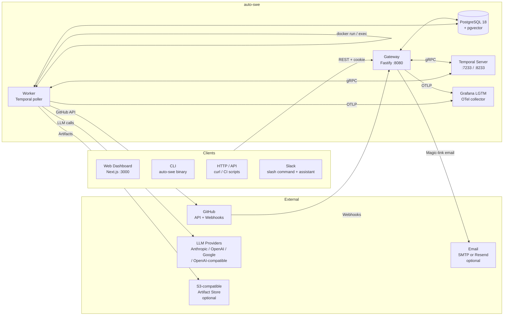
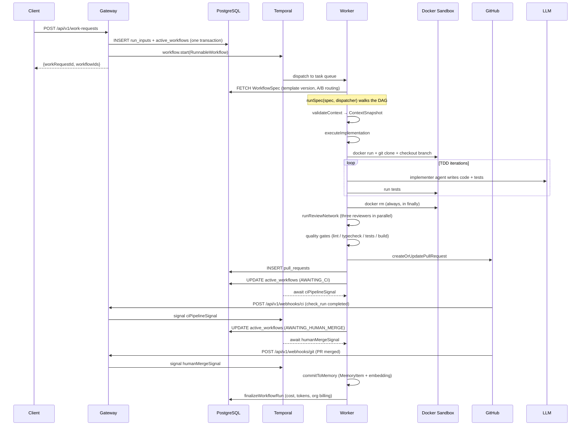
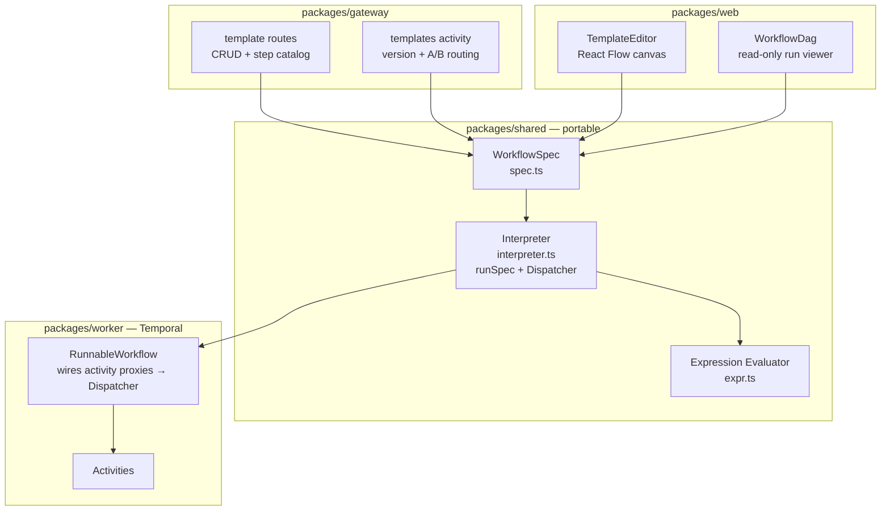
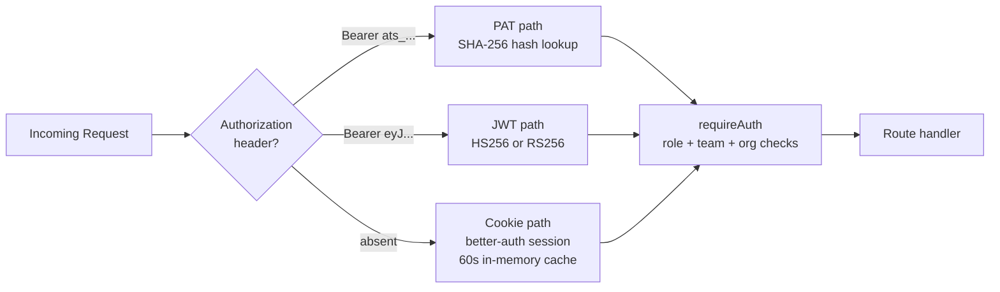
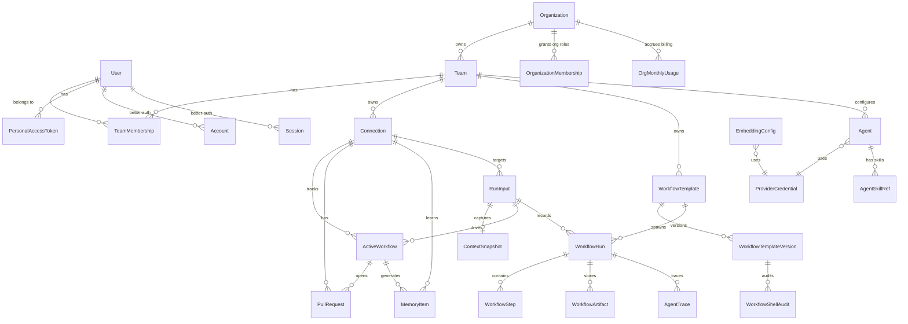
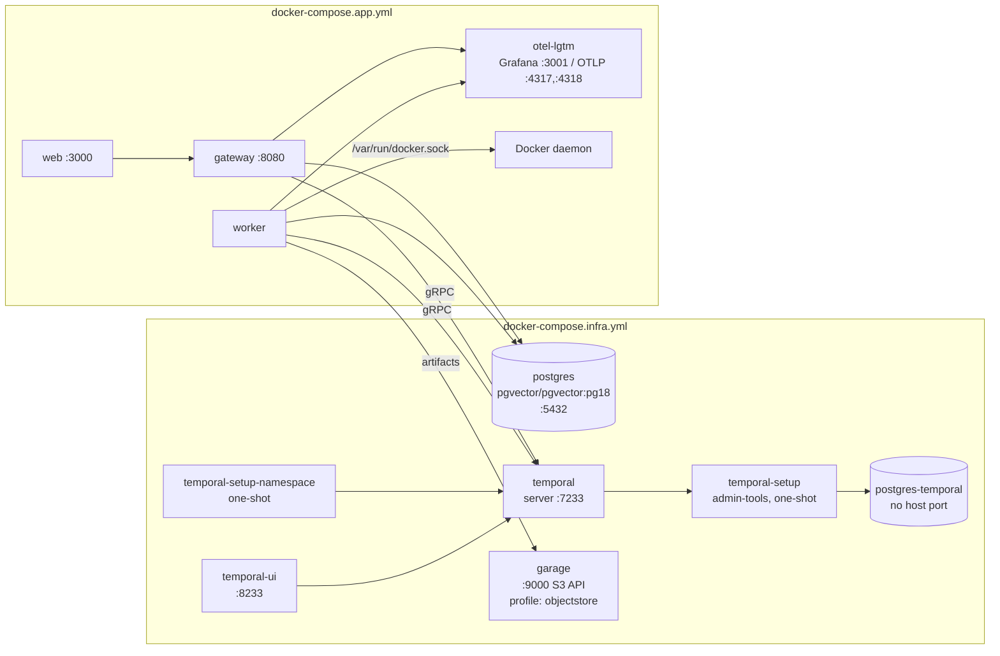

# Architecture

How auto-swe is put together. For conventions and implementation gotchas see
[AGENTS.md](../AGENTS.md); for the agent layer see [agents.md](./agents.md); for deployment see
[deployment.md](./deployment.md).

---

## 1. System Context


```mermaid
flowchart LR
    subgraph Clients
        WEB[Web Dashboard\nNext.js :3000]
        CLI[CLI\nauto-swe binary]
        HTTP[HTTP / API\ncurl / CI scripts]
        SLACK[Slack\nslash command + assistant]
    end

    subgraph auto-swe
        GW[Gateway\nFastify :8080]
        WK[Worker\nTemporal poller]
        DB[(PostgreSQL 18\n+ pgvector)]
        TMP[Temporal Server\n:7233 / :8233]
        OBS[Grafana LGTM\nOTel collector]
    end

    subgraph External
        GH[GitHub\nAPI + Webhooks]
        LLM[LLM Providers\nAnthropic / OpenAI / Google\n/ OpenAI-compatible]
        S3[S3-compatible\nArtifact Store\noptional]
        EMAIL[Email\nSMTP or Resend\noptional]
    end

    Clients -->|REST + cookie| GW
    GW <-->|gRPC| TMP
    GW <--> DB
    WK <-->|gRPC| TMP
    WK <--> DB
    WK -->|docker run / exec| WK
    WK -->|GitHub API| GH
    WK -->|LLM calls| LLM
    WK -->|Artifacts| S3
    GH -->|Webhooks| GW
    GW -->|OTLP| OBS
    WK -->|OTLP| OBS
    GW -->|Magic-link email| EMAIL
```

Two invariants shape everything else:

- **The gateway is stateless.** All durable state lives in Temporal and Postgres.
- **The worker drives all execution.** No LLM call ever happens in the gateway.

A third property holds across everything the platform ships, though it is a property of the
activity catalog rather than an enforced boundary: **nothing merges a pull request.** No activity
calls the GitHub merge API, and no seeded template merges — the SWE flow opens a PR and parks, and a
Temporal signal bridges the GitHub merge webhook back to the waiting workflow. See §10 for where
that stops being a guarantee.

---

## 2. Package Map

```
packages/
├── shared/      Prisma schema, DB client, shared types, workflow spec + interpreter
├── gateway/     Fastify 5 HTTP API — auth, RBAC, routing, webhooks, admin
├── worker/      Temporal worker — Mastra agents, activities, workflow runners
├── web/         Next.js 16 dashboard — App Router, TanStack Query, Zustand, React Flow
├── cli/         auto-swe binary — REST client + local bundle authoring
└── sdk/         @auto-swe/sdk — bundle authoring helpers
```

### `packages/shared`

| Path | Purpose |
|------|---------|
| `src/db.ts` | Singleton `PrismaClient` — import this everywhere |
| `src/prisma/schema.prisma` | **Authoritative data model** — 77 models (see §6) |
| `src/prisma/seed.ts` | Seeds the admin user, default team, sample connection, default template, built-in skills + scanner patterns, and the GLOBAL `Agent` rows |
| `src/prisma/migrations/` | Generated `init` baseline, a hand-written constraints/indexes migration, and appended migrations for later changes |
| `src/skills/` | Built-in skill definitions, one file per skill; `index.ts` exports `BUILTIN_SKILLS` |
| `src/scannerPatterns/index.ts` | `BUILTIN_SCANNER_PATTERNS` — synced at gateway startup |
| `src/lib/syncBuiltins.ts` | Seeded built-in templates, agents, skills, and scanner patterns; idempotent, and never overwrites admin-owned state (see [Versioning and reproducibility](#versioning-and-reproducibility)) |
| `src/lib/skillScanner.ts` | `scanSkillContent(text)` — injection/exfiltration scan of skill text and LLM output |
| `src/lib/crypto.ts` | AES-256-GCM helpers for encrypted credential columns |
| `src/lib/systemConfig.ts` | `resolveXxxConfig()` resolvers for every singleton config table |
| `src/lib/billing.ts` | `currentYearMonth()` — the month-bucket key shared by the worker writer and gateway reader |
| `src/lib/connectionTypes.ts` | Typed registry of supported `Connection.type` values and their metadata |
| `src/lib/outcomePublishers.ts` | Typed registry of outcome publishers (`openPullRequest`, `updateRecord`, `sendMessage`, etc.) |
| `src/lib/workspaceProviders.ts` | Typed registry of workspace provider types (`git_repo`, `document`, `record`, `api_only`) |
| `src/lib/integrations/` | Read-only issue-tracker (Jira / Linear / GitHub Issues), knowledge-base (Confluence / Notion) and Figma connectors, fetched at work-request submit time; best-effort, never block a submission. The platform tracker and knowledge-base clients (Jira, Confluence, GitHub Issues) and the admin Jira field detection first pass `checkConnectorBaseUrl`: strict first, with the connector's private-network opt-in waiving only private-address refusals. The worker's per-connection Jira URL uses a narrower same-origin opt-in |
| `src/workflow/spec.ts` | `WorkflowSpec` Zod schema — the node-type union |
| `src/workflow/interpreter.ts` | **Pure DAG interpreter** (`runSpec`) — no Temporal imports; side effects go through `Dispatcher` |
| `src/workflow/expr.ts` | Expression evaluator for `cond` predicates (jsonpath + comparison, no JS sandbox) |
| `src/workflow/stepRegistry.ts` | Step catalog — importable by gateway and web without a worker dependency |
| `src/workflow/defaultEngineeringSpec.ts` | The seeded `default-engineering` spec |
| `src/workflow/shellImageAllowlist.ts` | Built-in image allowlist + per-team extension |
| `src/workflow/signalSlots.ts` | Maps spec signal names → Temporal signal names |
| `src/workflow/specDiff.ts` | Version diff used by the editor |
| `src/workflow/analytics.ts` | Pure aggregation helpers behind the analytics routes |

### `packages/gateway`

| Path | Purpose |
|------|---------|
| `src/index.ts` | Entry point; also hosts the session-token bridge and `GET /api/v1/auth/providers` |
| `src/plugins/auth.ts` | **Auth middleware** — `requireAuth({ requiredRole, requiredTeamRole, requiredOrgRole })`, role hierarchy |
| `src/plugins/prisma.ts`, `src/plugins/temporal.ts` | Decorate `fastify.prisma` / `fastify.temporal` |
| `src/lib/betterAuth.ts` | better-auth instance — email+password, GitHub/Google OAuth, Okta SSO (OIDC), magic-link, cookie sessions |
| `src/lib/workflowLaunch.ts` | `launchTrackedWorkflow` — the single launch path; every route that starts a run goes through it. Writes the `RunInput` (+ `ActiveWorkflow`, when the launch keeps one) in one transaction, **then** starts the Temporal workflow, deleting the rows if the start fails. The unique index on `ActiveWorkflow.temporalWorkflowId` is the atomic dedup gate, so a run cannot execute without a ledger row to attribute its spend and PRs to. |
| `src/lib/idempotency.ts` | `Idempotency-Key` support for the two generic triggers — hashes the caller's key into a deterministic workflow ID so the dedup gate above has something stable to fire on. `POST /work-requests` reuses only its header schema: it keeps its ticket-derived workflow ID and stores the key on `RunInput` (unique per submitter) instead — see [product overview](./product-overview.md) |
| `src/lib/github.ts` | GitHub webhook HMAC verification + the paginated repository listing behind repo import (plain `fetch`; the gateway carries no Octokit) |
| `src/lib/slack.ts` | Slack request-signature verification + Web API helpers (post a message, publish App Home, open a view) |
| `src/routes/slack.ts` | Slack slash-command, events, and interactive handlers (mounted at `/api/v1/auth/slack`) |
| `src/lib/launchAuthorization.ts` | `authorizeLaunch` — the one launch decision (repository access, org membership, org monthly cap) every launch path takes |
| `src/lib/orgAccess.ts` | Org membership and monthly-cap checks behind `authorizeLaunch`, plus `assertOrgAccess` / `assertOrgBudget` for handlers that derive their org from the body rather than a route param |
| `src/lib/auditLog.ts` | `writeAuditLog()` — `ConfigAuditLog` rows for every config mutation |
| `src/lib/telemetry.ts` | OpenTelemetry SDK init |
| `src/routes/` | Work requests, workflows, runs, templates, projections, webhooks, epics, connections, teams, users, memory, skills, agent library, tokens, model config, admin, scanner patterns, security events, inbox (HITL), system config, schedules, Slack, organizations, bundles, evals |

### `packages/worker`

| Path | Purpose |
|------|---------|
| `src/index.ts` | Entry — runs `assertConfigReady()`, then starts the Temporal worker |
| `src/workflows/runnable.ts` | **`RunnableWorkflow`** — the generic workflow; wires activity proxies to `Dispatcher` and calls `runSpec` |
| `src/workflows/epicOrchestrator.ts` | **`EpicOrchestratorWorkflow`** — decomposes multi-repo epics, fans out children in dependency order |
| `src/activities/executeImplementation.ts` | **Core agent loop** — DinD workspace, clone, implementer agent, TDD loop |
| `src/activities/runReviewNetwork.ts` | Security / domain / performance reviewers in parallel via `Promise.allSettled` |
| `src/activities/qualityGates.ts` | `runLint` / `runTypecheck` / `runTests` / `runBuild` / `runVulnScan` / `runPerfBench` |
| `src/activities/ciFixLoop.ts` | `fetchCILogs` + `executeCIFixImplementation` — CI self-healing |
| `src/activities/workspace.ts` | DinD helpers — `createWorkspace()` returns `{ exec, execCapture, gitAuthed, destroy }`, plus `shellQuote()` |
| `src/activities/decomposition.ts` | `planDecomposition` → `Subtask[]` for fan-out |
| `src/activities/validateContext.ts` | Context validator → `ContextSnapshot` |
| `src/activities/commitToMemory.ts` | Memory summarization → `MemoryItem` + embedding |
| `src/activities/createOrUpdatePullRequest.ts` | PR create/update through the SCM provider; idempotent on branch |
| `src/lib/scm/` | `ScmProvider` abstraction; `github.ts` builds the authenticated Octokit client (the only Octokit in the codebase) and `ciStatus.ts` reads check runs |
|| `src/activities/resolveWorkspace.ts` | Materialise workspace context for a declared `workspaceProvider` |
|| `src/activities/genericActions.ts` | Generic `readSource`/`writeOutcome`/`runTool` activities dispatched by `Connection.type` |
| `src/activities/templates.ts` | Resolves the run's `WorkflowSpec` (cascade + A/B routing); `createWorkflowRun`, `recordWorkflowStep`, `finalizeWorkflowRun` |
| `src/activities/state.ts` | `updateDomainState` and the human-step lifecycle (`createHumanStep`, `resolveHumanStep`, `cancelPendingHumanSteps`) |
| `src/activities/shellStep.ts` | `runShellStep` — ephemeral container, image allowlist, audit write |
| `src/lib/config/agentResolver.ts` | `resolveAgent(key, ctx)` — the sole model/skill/tool resolver |
| `src/lib/config/agentSpec.ts`, `agentRef.ts`, `agentSkills.ts`, `resolver.ts`, `mcpConnection.ts` | Spec composition, `key@version` parsing, skill/tool loading, credential + embedding resolution, MCP URL resolution |
| `src/lib/models.ts` | `getModel(key, ctx)` — shim over `resolveAgent` |
| `src/lib/embeddings.ts` | `generateEmbedding` — resolves `EmbeddingConfig`, enforces 1536 dimensions |
| `src/lib/costTracking.ts` | `recordLlmUsage` — per-call USD metering, OTel span attributes, budget enforcement |
| `src/lib/agentTracer.ts`, `activityContext.ts` | `AgentTracer` + `persistActivityTrace` |
| `src/lib/activityNodeTag.ts`, `src/workflows/nodeTag*.ts` | Spec-node attribution: workflow interceptor stamps a header, activity interceptor reads it |
| `src/lib/scannerPatternLoader.ts` | `makePatternLoader(type)` — 60 s TTL cache factory shared by three scanners |
| `src/lib/shellCommandScanner.ts`, `sensitiveFileScanner.ts`, `codeSecurityScanner.ts` | Runtime scanners (see [AGENTS.md §6](../AGENTS.md#runtime-security-scanners)) |
| `src/agents/` | Mastra agents — implementer, review network, planner, decomposer, pre-write security check, MCP tool loading |

### `packages/web`

| Path | Purpose |
|------|---------|
| `src/app/page.tsx` | Dashboard home — KPIs, "needs attention" queue, recent activity |
| `src/app/runs/[id]/` | Live run viewer — React Flow DAG with per-node status; bottom panel toggles between three layouts (split console, transcript, flight recorder), persisted per user via `/api/v1/me/preferences`; traces link to graph nodes and fan-out branches through `src/lib/traceLinkage.ts` |
| `src/app/workflows/library/[id]/` | React Flow canvas editor — drag-to-create, drag-to-connect, version sidebar, A/B experiment, analytics |
| `src/app/govern/approvals/` | HITL approvals — pending human steps with respond forms |
| `src/app/govern/analytics/` | Global analytics — success rate, p50/p95, $/run, per-step failure rates |
| `src/app/studio/*` | Model config, integrations, workflow defaults, skills, agents + agent library, schedules, bundles, MCP connections, evals |
| `src/app/govern/*` | Access tokens, sessions, memory, scanner patterns, security events, Slack channels, organizations, teams, budgets, users |
| `src/hooks/` | TanStack Query hooks split by resource domain |
| `src/stores/` | Zustand — `authStore` (identity), `teamStore` (active team) |
| `src/components/ui/` | Design-system primitives — `Button`, `Input`, `Select`, `Textarea`, `Card`, `Modal`, `ConfirmModal`, `Alert`, `TabBar`, `Pagination`, `PageHeader`, `LoadingState`, `FieldWrapper`, `Th`, `Stat`, `StatusBadge`, `ToggleSwitch`, `CopyButton` |
| `src/lib/palette.ts` | The theme's colours as checked literals, for the SVG contexts that cannot resolve `var()` |
| `src/lib/api.ts` | `ApiClient` — all fetches; no direct `fetch` in components |

**Design system.** A custom "Workshop Telemetry" theme defined via Tailwind v4 `@theme` in
`globals.css`: `ink-*` surfaces, `paper-*` foregrounds, `ember-*` primary accent, with `moss-*`
(success), `brick-*` (danger), `amber-*` (warning), `dust-*` (neutral), `violet-*` (secondary).
Legacy `var(--muted-foreground)` style aliases are bridged for compatibility; new code uses tokens
directly. SVG presentation attributes — Recharts axis ticks, React Flow edge strokes and markers —
do not resolve `var()`, so those read hex literals from `lib/palette.ts`; `palette.test.ts` parses
`globals.css` and fails if a literal drifts from its token, and a second guard fails the build if a
component reaches past the theme into a default Tailwind colour scale.

**Data fetching.** All server state lives in TanStack Query (staleTime 30 s, retry 1). Running
workflows poll on an adaptive 3 s interval; terminal-state queries use 30 s. The run page loads its
traces once, then each poll reads the run without traces and only the traces created since the
newest one it holds (`GET /api/v1/workflow-runs/:id/traces?since=`), appending them. A trace's
`createdAt` is the writing worker's clock, at millisecond precision, when it built the insert — not
when the row committed — so a slow insert or a lagging worker clock can commit a row older than one
already read. The cursor trails the gateway's time at the previous tail read (the newest trace, on
the first poll) by 10 s and the page merges by trace id, which covers the common case and lets an
idle run's poll come back empty. For the rest, the tail also returns `total`, the run's trace count read in
the same snapshot as the rows: when the merged set does not match it, that poll re-reads every
trimmed trace instead. The page also re-reads them all once when the run turns terminal. The spec
snapshot is fixed when a run starts, so the page reads it once and every later read passes
`includeSpec=false` — the gateway then leaves the column out of the query — and carries the held
copy over; the flag defaults to true for other callers. Nothing streams: updates arrive on the poll, not as they are written.

---

## 3. Run Lifecycle

The engine walks whatever DAG the run's `WorkflowSpec` declares — the sequence below is the shape of
the seeded `default-engineering` template, not a fixed pipeline. It is worth reading in full because
it exercises nearly every mechanism (agent activities, sandboxes, gates, signals, memory); a
template that omits half of it is equally valid.

End-to-end, from API call to merged pull request:


```mermaid
sequenceDiagram
    participant Client
    participant Gateway
    participant DB as PostgreSQL
    participant Temporal
    participant Worker
    participant DinD as Docker Sandbox
    participant GitHub

    Client->>Gateway: POST /api/v1/work-requests
    Gateway->>DB: INSERT run_inputs + active_workflows (one transaction)
    Gateway->>Temporal: workflow.start(RunnableWorkflow)
    Gateway-->>Client: {workRequestId, workflowIds}

    Temporal->>Worker: dispatch to task queue
    Worker->>DB: FETCH WorkflowSpec (template version, A/B routing)
    Note over Worker: runSpec(spec, dispatcher) walks the DAG

    Worker->>Worker: validateContext → ContextSnapshot
    Worker->>Worker: executeImplementation
    Worker->>DinD: docker run + git clone + checkout branch
    loop TDD iterations
        Worker->>LLM: implementer agent writes code + tests
        Worker->>DinD: run tests
    end
    Worker->>DinD: docker rm (always, in finally)

    Worker->>Worker: runReviewNetwork (three reviewers in parallel)
    Worker->>Worker: quality gates (lint / typecheck / tests / build)

    Worker->>GitHub: createOrUpdatePullRequest
    Worker->>DB: INSERT pull_requests

    Worker->>DB: UPDATE active_workflows (AWAITING_CI)
    Temporal-->>Worker: await ciPipelineSignal
    GitHub->>Gateway: POST /api/v1/webhooks/ci (check_run completed)
    Gateway->>Temporal: signal ciPipelineSignal

    Worker->>DB: UPDATE active_workflows (AWAITING_HUMAN_MERGE)
    Temporal-->>Worker: await humanMergeSignal
    GitHub->>Gateway: POST /api/v1/webhooks/git (PR merged)
    Gateway->>Temporal: signal humanMergeSignal

    Worker->>Worker: commitToMemory (MemoryItem + embedding)
    Worker->>DB: finalizeWorkflowRun (cost, tokens, org billing)
```

**CI verdicts are matched to a commit, not just to a PR.** The `/webhooks/ci` handler only signals a
run when the tracked pull request is awaiting a verdict *at the head the event describes*
(`ciStatus = PENDING` at that `headSha`). That pairing is what stops a redelivered verdict for an
older commit from resuming a run that has already moved on. `createOrUpdatePullRequest` arms it by
resetting `ciStatus` whenever it moves the head, so a template that waits on `ciPipelineSignal`
**must reach that wait through a `createOrUpdatePullRequest` step**. Every built-in template does.
A hand-authored template that pushes by some other route and then waits on `ciPipelineSignal` gets
its first verdict and silently ignores every later one, failing at the wait's own timeout rather
than at the point of the mistake.

**Multi-repo epics.** `POST /api/v1/epics` starts `EpicOrchestratorWorkflow` instead: the planner
agent decomposes the brief into per-repo subtasks (every repository the epic names is in the plan;
the planner only orders them), a dependency graph is built, and each repo's child
`RunnableWorkflow` starts as soon as the repos it depends on have succeeded — it does not wait for
unrelated siblings. The parent reports `PLANNING → FANNING_OUT → COMPLETED/FAILED/CANCELLED`; an
epic with no repos to run is `FAILED`, never vacuously `COMPLETED`. Repos downstream of a failure
are marked `SKIPPED` with a reason rather than silently omitted. An epic whose history began before
event-driven scheduling replays under the earlier wave scheduling (`patched`), where a wave of
ready repos starts together and the next wave waits for all of them. The epic list shows a non-admin the epics
they requested and those with a started child on a repository they can reach, so an epic still in
`PLANNING` is listed only for its requester and ADMINs until its first child starts.

---

## 4. Workflow Engine

Every run goes through the configurable engine. A `WorkflowSpec` is a Zod-validated JSON DAG; a
pure interpreter walks it; a `Dispatcher` is the only seam to the outside world.


```mermaid
flowchart TD
    subgraph shared [packages/shared — portable]
        SPEC[WorkflowSpec\nspec.ts]
        INTERP[Interpreter\ninterpreter.ts\nrunSpec + Dispatcher]
        EXPR[Expression Evaluator\nexpr.ts]
    end
    subgraph worker [packages/worker — Temporal]
        RUNNABLE[RunnableWorkflow\nwires activity proxies → Dispatcher]
        ACTS[Activities]
    end
    subgraph gateway [packages/gateway]
        TMPL[template routes\nCRUD + step catalog]
        RESOLVER[templates activity\nversion + A/B routing]
    end
    subgraph web [packages/web]
        EDITOR[TemplateEditor\nReact Flow canvas]
        VIEWER[WorkflowDag\nread-only run viewer]
    end
    SPEC --> INTERP --> RUNNABLE --> ACTS
    INTERP --> EXPR
    TMPL --> SPEC
    RESOLVER --> SPEC
    EDITOR --> SPEC
    VIEWER --> SPEC
```

### Node types

The spec supports 15 node types.

| Node type | Purpose | Key fields |
|-----------|---------|-----------|
| `step` | Dispatch a registered activity | `step`, `inputs`, `next`, `onFail`, `config` |
| `agent` | Run a library Agent by reference | `agentRef` (`<key>` or `<key>@<version>`), `userMessage`, `systemPrompt`, `inputs` |
| `mcp` | Call one tool on an `mcp` Connection | `connectionRef`, `tool`, `inputs` |
| `eval` | Score a value with floor/judge/trajectory scorers, then gate or branch | `target`, `scorers[]`, `judgeAdvisory` |
| `set` | Write values into the run context | `values` (path → binding) |
| `cond` | Branch on a boolean expression | `expr`, `onTrue`, `onFalse` |
| `signal` | Await a named Temporal signal with a timeout | `name`, `timeout`, `onReceive`, `onTimeout`, `storeAs` |
| `terminate` | End the run with a status | `status`, `result` |
| `fanOut` | Run a subgraph once per item in an array | `over`, `subgraph`, `join`, `itemKey`, `concurrency`, `onBranchFail`, `exports`, `pluck` |
| `shell` | Run a user-authored command in an ephemeral container | `image`, `command`, `network`, `timeoutMs`, `memory`, `cpus` |
| `containerStep` | Coded capability — an image with a JSON in/out contract | `image`, `command`, `inputs`, `transport` (`stdout`/`ndjson`/`sidecar`), `sidecar` |
| `humanApproval` | Pause for a binary approve/reject | `timeout`, `onTimeout`, `contentFrom`, `storeAs` |
| `humanDecision` | Pause for a 2–10 option branch | `options`, `timeout`, `onTimeout` |
| `humanInput` | Pause for a typed form, written back into context | `fields`, `timeout`, `onTimeout`, `storeAs` |
| `humanReview` | Pause for an annotated review of displayed content | `contentFrom`, `timeout`, `onTimeout`, `storeAs` |

The four human nodes are handled inside the interpreter: each creates a `WorkflowHumanStep` row,
optionally notifies Slack, then parks on the `hitl_<nodeId>` signal until an inbox or Slack response
arrives, or the timeout routes to `onTimeout`. See [hitl-workflows.md](./hitl-workflows.md).

#### Presentation fields: `group` and `title`

Every node may carry two optional, presentation-only strings. `group` (up to 40 characters) is a
phase label such as `review loop` or `CI loop`; `title` (up to 80) is a name shown in place of the
node id. The interpreter, the worker, the cost estimator and template analytics never read them, and
they are absent on a spec saved without them, so such a spec parses and hashes exactly as it
always did — including inside a signed bundle, whose content hash covers the spec as written. They
are fields, not node types. The four human nodes already carry a required `title` (the approver's
inbox heading, up to 200 characters), so they take only `group`, and their `title` is what the canvas
shows as their name.

`validateSpec` raises an advisory `GROUP_NOT_CONTIGUOUS` warning when the edges between the nodes
sharing a `group` (direction ignored) do not join them into one connected piece, because a card
standing in for members with no edge between them would misdraw the graph. It checks connectedness
only: it does not require a single entry or exit, and a connected group with a path that leaves and
re-enters it passes. Both `group` and `title` are trimmed when a spec is read, so `ci` and `ci ` are
one group, and a value that is not a non-blank string within the limits is treated as absent on read
while the save API rejects it.

Reading is tolerant by design: a stored or bundle-installed spec may carry a `title` or `group` in any
shape, because before these fields existed such a key was ignored. A bad value therefore drops that
field and nothing else, and never fails run creation or hides a run's graph.

#### Reading a large graph

The same spec is shown three ways, none of which changes it:

- **Canvas.** A card shows the node's `title` (its id when there is none; the id stays in the
  card's tooltip and the inspector) and a badge for its `group`. Bookkeeping nodes (`set` and
  `updateDomainState`) can be folded out of view, and, on the read-only canvases, each contiguous
  group of two or more nodes can be folded into one card with a count. Edges into the group lead
  to the card and each distinct way out of it is drawn as an exit. A group holding a node that
  failed, is running or pending, carries a diff mark, or is selected stays open. Clicking a card, or
  pressing Enter on it, opens that group. The editor never folds, because a hidden node is one the
  author cannot change.
- **Outline.** The steps as a list in flow order (a walk from the entry that follows each node's edges
  in order), gathered under their `group` headings, with a status beside each row when a run overlay
  is supplied. Rows are selectable and keyboard-driven: Up and Down move and select, Home and End
  jump, and a heading folds its group. It is offered on the template page, in the run viewer, and as
  a rail in the editor.
- **Inspector.** `title` and `group` are edited in the node inspector; clearing one removes the key.

#### How the built-in templates are written

The seeded templates are flat specs like any other, but they are authored with a set of pure helpers
in `packages/shared/src/workflow/templates/authoring/` that expand when the template module loads:
`reviewLoop`, `ciLoop` (with `waitForCi`), `openPullRequest`, `validatePhase`, `signalGate`,
`policyGatedWrite`, `sourceHead`, and small node factories for status stamps, quality gates, counters
and terminals. A helper returns ordinary nodes under the ids the templates have always used, stamped
with a `group` and `title`; nothing in a stored spec, a run snapshot, or a bundle refers to a helper.
`golden.test.ts` holds every built-in to the flat spec it was seeded as (stored under
`templates/__golden__/`), apart from a short list of intended changes, so a refactor of a helper
cannot alter a template unnoticed. An edit to a template or helper is released like any other change
to a built-in: `syncBuiltins` compares specs key-order-insensitively and appends a new version.

The built-ins that wait on CI handle a failing check in one of two ways, both with the same limit:
the CI fixer runs on the failure logs, and a third failing check ends the run `FAILED` (two fix
attempts). The implementer's fix session pushes its own commit to the branch; the
`createOrUpdatePullRequest` step that follows only re-arms the pull request's CI wait for the new
head, which is what lets the CI webhook match a verdict to it. `agent-reviewed-pr`, `code-and-ci`,
`dependency-update`, `canary-rollout`, `signal-gated-rollout`, `consensus-review` and `four-eyes`
go straight from the fix back to the CI wait. `default-engineering` instead sends the fixed code
back through its review loop first. `pr-approval-gate` only observes CI: both outcomes end the run.
A CI failure therefore spends agent time and tokens before the run can fail.

`consensus-review` and `four-eyes` put CI ahead of their gate, so the gate sees code that is already
green and identical to the pull request head. Both open the pull request (ready for review; the
step has no draft option) and run CI with the fix loop first. `four-eyes` then asks two people, who
see the head commit, the pull request URL, how many rejections came before, whether the code
changed since, and whether the last fix made no change; `consensus-review` then runs its two
reviewers. A rejection goes to a fix (the fix session pushes), CI again with a fresh two-attempt
budget, and the gate again. Nothing carries over between rounds: each round creates new pending
human steps, so an approval never covers different code. The agent-review attempts and the sign-off
rejections of `four-eyes` are separate budgets of three; in `consensus-review` the consensus attempts
are the one review budget, shared across CI rounds.

A `four-eyes` rejection first asks the reviewer what should change, in a one-hour text question. The
answer becomes the fix session's rejection summary; an empty answer or a timeout falls back to a
generic "rejected, no written reason" text. `consensus-review` has no such question because its
reviewers are agents whose rejection text already feeds the fix.

A fix that changes nothing makes no commit, so the head stays the one CI already judged and no CI
event can follow. These two templates never wait for one:

- a no-op CI fix counts as a spent attempt and the loop goes round again (fetch logs, fix) until the
  two-attempt limit ends the run `FAILED`;
- a no-op sign-off fix goes straight back to both people for the same code, shown with
  `noChangeMade` true and `changedSinceLastSignoff` false. The rejection was already counted, so
  repeated no-ops end in the same third-rejection `FAILED`;
- a no-op consensus fix goes straight back to the two reviewers, bounded the same way.

#### Limitations

- A CI fix is pushed by the fix session before the step that re-arms the pull request's CI wait runs.
  A verdict that completes in that gap, a few seconds, has no matching head and is dropped by the CI
  webhook, and a signal-mode wait then runs to its 4 h timeout. `default-engineering` can route to
  polling to avoid it; `four-eyes` and `consensus-review` wait on the signal only.
- The pull request in `four-eyes` and `consensus-review` is opened ready for review before any person
  (`four-eyes`) or any reviewer (`consensus-review`) has judged the change. Opening it posts the Slack
  "ready for review" message, syncs the tracker and the knowledge base, and lets GitHub request
  reviewers from CODEOWNERS. A run that ends `FAILED` or `TIMED_OUT` leaves that pull request open:
  nothing in the platform merges or closes pull requests. The SCM layer can open a draft, but no
  activity passes `draft` and there is no step that marks a draft ready, so a draft-first flow is not
  available.
- Only `four-eyes` and `consensus-review` guard a fix that changed nothing. In the other repush
  templates a no-op CI fix leaves the head CI already judged, no new event arrives, and the CI wait
  runs to its 4 h timeout.
- A `humanApproval` itself records no written reason; `four-eyes` asks for one in a separate question,
  and a skipped or timed-out question gives the fix session no detail.
- A group collapses only when it has two or more members and they form one connected piece; otherwise
  it is left open and the contiguity warning says why.
- Collapsing is a read-only canvas feature. The editor shows every node, and offers the outline
  beside its canvas instead.
- `group` and `title` are not part of the natural-language authoring prompt, so a generated draft
  carries none until an author adds them.
- A group is collapsed all at once or expanded one card at a time; there is no per-group collapse
  control on the canvas (the outline folds each heading separately).

### Dispatcher

```
interface Dispatcher {
  dispatchStep({ nodeId, specNodeId?, stepAttempt?, step, config, inputs, ctx, cancellation? }) → Promise<unknown>
  dispatchShell?({ nodeId, specNodeId?, stepAttempt?, node, inputs, ctx, cancellation? })       → Promise<unknown>
  waitSignal(name, timeout, { abandoned? }?)                         → Promise<unknown | undefined>
  recordStep({ nodeId, status, inputs?, outputs?, error?, attempt? }) → Promise<void>
  notifyHumanStep?({ ... })                                          → Promise<void>
  resolveHumanStep?({ nodeId, status })                              → Promise<void>
  isCancellation?(err)                                               → boolean
  patched?(id)                                                       → boolean
}
```

`RunnableWorkflow` implements this by wrapping activity proxies. The dispatch nodes — `step`,
`agent`, `mcp`, `eval`, `containerStep`, and `shell` — cross the activity boundary, and the human
nodes call `notifyHumanStep` / `resolveHumanStep` for their bookkeeping. `set`, `cond`, `signal`,
`terminate`, and `fanOut` are handled internally. Each dispatch carries the node's spec key and the
interpreter's attempt next to the (branch-prefixed) recording id; the dispatcher stamps them on the
activity so every `AgentTrace` it writes names its node (see [agents.md §8.4](./agents.md)). Because the interpreter has no Temporal imports, it runs in tests against a mock
dispatcher, and the gateway can import the step catalog without a worker dependency.

**How a run ends when something goes wrong.** A failure the interpreter raises itself — a blocking
gate's `passed: false`, a fan-out branch that failed under `onBranchFail: 'block'`, the transition
cap, an `over` that is not an array, an expression or executor error — fails the run once, as a
non-retryable `WORKFLOW_SPEC_FAILED` carrying the original message, after the run row is finalized
`FAILED`. An activity failure fails it as itself. A cancellation of the run (`isCancellation`) ends
it `CANCELLED`: it bypasses `onError: 'continue'`, `onFail` and `onBranchFail`, including when it
reaches an activity inside a fan-out branch, where only a sibling's block-mode cancel is a branch
cancellation. `onFail: { retry: N }` does not re-run an attempt whose error is marked non-retryable
(on itself or its cause, as an activity's non-retryable `ApplicationFailure` is); the node fails at
once under block semantics. The interpreter asks `patched(id)` before each of these behaviours, so a
run recorded before them replays as it ran.

A block-mode cancel stops the interpreter waiting on a branch's signal or human wait but leaves the
Temporal condition itself to run out, so the workflow's commands do not change; the wait is told it
was `abandoned`, and a payload that arrives afterwards stays for the next wait on that name instead
of being consumed. Step records carry each string input, output and error cut to 8,000 characters
(activity inputs are written to the workflow history); the full values remain in the run context,
which the final snapshot spills to artifacts.

`validateSpec` reports `RESERVED_PATH_SEGMENT` as an error when a path the run writes — a `storeAs`,
a `set` key, a fan-out `exports` entry, or a node id (outputs land at `nodes.<id>.output`) — contains
`__proto__`, `prototype` or `constructor`, which the interpreter refuses to write through.

### Versioning and reproducibility

A run freezes its `WorkflowSpec` into `WorkflowRun.specSnapshot` and its resolved agent versions
into `WorkflowRun.agentVersions` at start. Editing a template or an agent afterwards cannot change
what an in-flight or already-completed run did. Template versions are immutable; the active version
is promoted explicitly, and a second version can be routed as an A/B experiment by a deterministic
per-ticket split.

Built-in templates follow the same rule. `syncBuiltins()` runs at every gateway start and creates
a missing built-in template, but on an existing one it never touches `status`, `isDefault` or
`activeVersion`, and never rewrites a version. When a release changes a built-in spec it appends a
new version, and activates it only when the template is still active on the previous built-in
version; a template an admin archived or moved onto their own version keeps that choice, and so
does one running a live A/B experiment (`experimentSplit` above zero): the new version is appended,
a warning names the template, and the admin promotes it when the experiment ends. Template-level
fields (`inputSchema`, `workspaceProvider`) are filled only where the row has none, so an admin's
edit is never reverted; a release that changes one of them for an already-seeded built-in does not
propagate it. A
built-in version is one with no author (`createdBy` and `generatedBy` both null). The same
create-if-missing rule covers the GLOBAL agents and their skill refs: a ref an admin removed stays
removed, and only a built-in skill new in this release is attached to an existing agent. The one
change to an existing agent is a model move: an untouched seed whose latest version still carries a
default an earlier release shipped gets a new version on the current default, as
[model configuration](./model-configuration.md) describes. That version copies its predecessor's
refs, so a removal survives it, and the version it replaces is left alone for the runs pinned to it.

### Configuration cascade

Every per-agent config — model, prompt, skills, tools — resolves through five scopes, most specific
first:

```
WORKFLOW_TEMPLATE  →  CHANNEL  →  TEAM  →  ORGANIZATION  →  GLOBAL
```

`CHANNEL` applies only to channel-resident runs, `ORGANIZATION` only when the run's team belongs to
an org, so a deployment using neither behaves exactly like a three-level cascade. There is no
fallback past `GLOBAL`; a missing row throws `ConfigMissingError`, and `assertConfigReady()`
validates every required row at worker boot. Full rules in
[AGENTS.md §6](../AGENTS.md#agents-skills-and-tool-access); the agent layer itself is in
[agents.md](./agents.md).

Operator policy — the tuning knobs that are not agent config — resolves through the same five scopes
via the **setting registry**, which adds an env-var tier and a definition default below `GLOBAL`
rather than throwing, and can freeze a value to a run. See
[configuration.md](./configuration.md).

---

## 5. Authentication

Three independent auth paths on every protected route:


```mermaid
flowchart LR
    REQ[Incoming Request] --> SNIFF{Authorization\nheader?}
    SNIFF -->|Bearer ats_...| PAT[PAT path\nSHA-256 hash lookup]
    SNIFF -->|Bearer eyJ...| JWT[JWT path\nHS256 or RS256]
    SNIFF -->|absent| COOKIE[Cookie path\nbetter-auth session\n60s in-memory cache]
    PAT --> RBAC[requireAuth\nrole + team + org checks]
    JWT --> RBAC
    COOKIE --> RBAC
    RBAC --> ROUTE[Route handler]
```

| Path | Token format | Storage | Issued by |
|------|-------------|---------|-----------|
| better-auth cookie | HTTP-only session cookie | `sessions` (60 s in-memory cache) | `POST /api/auth/sign-in/*` — email+password, GitHub, Google, magic-link |
| PAT bearer | `ats_<base64url-32B>` | `personal_access_tokens` (hash only) | Settings → API tokens |
| JWT bearer | `eyJ…` (HS256/RS256) | — | `POST /api/v1/auth/session-token`, which exchanges an active session cookie for a short-lived JWT |

A JWT's role claim is not trusted on its own: after verifying the signature, the gateway re-reads
the user's current role and `isActive` flag (behind a 30 s in-process cache), so a demotion or
deactivation applies before the token expires. Changing a user's role or active flag drops that
user's cached sessions and bearer state on the node that made the change at once; other gateway
nodes pick it up when their cache entries expire.

**MCP clients** authenticate against a fourth component, an OAuth 2.1 authorization server that is part
of the gateway: better-auth's OAuth provider and `jwt` plugin, served under `/api/auth/oauth2/*` and
published at `/.well-known/oauth-authorization-server/api/auth`. It issues short-lived JWT access tokens
whose audience is the MCP resource (`{BETTER_AUTH_URL}/api/v1/mcp`), signed with a key distinct from the
REST API's, so a token from one is not valid on the other. A Fastify plugin in front of better-auth
(`mcpOAuthGate.ts`) decides which provider endpoints exist, who may authorize and what a client may
register; the operator switches are the registry settings `mcp.enabled` and `mcp.writeToolsEnabled`. The
tables it uses are the eight `oauth*` and `jwks` models. Details, and what it does not do, are in
[oauth-setup.md](./oauth-setup.md#the-platform-as-an-oauth-server-for-mcp-clients).

**Authorization** is declarative on the `requireAuth` hook. Platform roles are
`ENGINEER < LEAD < ADMIN`. `requiredTeamRole` resolves team membership from a route's team param;
`requiredOrgRole` resolves `OrganizationMembership` from its `:orgId` param and checks
`ORG_ADMIN > ORG_MEMBER`. An `ORG_ADMIN` therefore self-serves their own org regardless of platform
role, and a platform `ADMIN` bypasses the org check. Handlers that derive the org from the request
body rather than a route param — every launch path, notably — take the org checks inline through
`authorizeLaunch` instead. Tenant isolation is enforced in the application layer, not by database row policies.

**Run visibility** keys on the run, never on its template: a non-admin sees a run they requested, a
run whose work request targets a repository they can reach, a run of a template their team owns, or
a channel-assistant run in a Slack channel their team owns. That one predicate also gates
cancelling a run and resolving its human steps, from the dashboard and from Slack buttons, and it
filters each template's "last run" summary. A run of a GLOBAL template is therefore not visible to
everyone. Every term is an exact relational match, and a multi-repository run is decided per run:
an epic child is reached through its own repository (`WorkflowRun.connectionId`), never through the
epic's shared work request, so a member of one of the epic's teams reaches that team's child and
not the others. A PRD run records its primary repository as its work request's connection, and a
channel run links its channel (`WorkflowRun.channelId`).
What falls outside every term is visible to its requester and platform ADMINs only — see
[`hitl-workflows.md`](./hitl-workflows.md#limitations).

---

## 6. Data Model

`packages/shared/src/prisma/schema.prisma` is authoritative — 77 models.


```mermaid
erDiagram
    User ||--o{ TeamMembership : "belongs to"
    User ||--o{ PersonalAccessToken : has
    User ||--o{ Account : "better-auth"
    User ||--o{ Session : "better-auth"

    Organization ||--o{ Team : owns
    Organization ||--o{ OrganizationMembership : "grants org roles"
    Organization ||--o{ OrgMonthlyUsage : "accrues billing"

    Team ||--o{ TeamMembership : has
    Team ||--o{ Connection : owns
    Team ||--o{ WorkflowTemplate : owns
    Team ||--o{ Agent : configures

    Connection ||--o{ ActiveWorkflow : tracks
    Connection ||--o{ PullRequest : has
    Connection ||--o{ MemoryItem : learns
    Connection ||--o{ RunInput : targets

    RunInput ||--o| ContextSnapshot : captures
    RunInput ||--o{ ActiveWorkflow : drives
    RunInput ||--o{ WorkflowRun : records

    WorkflowTemplate ||--o{ WorkflowTemplateVersion : versions
    WorkflowTemplate ||--o{ WorkflowRun : spawns
    WorkflowTemplateVersion ||--o{ WorkflowShellAudit : audits

    WorkflowRun ||--o{ WorkflowStep : contains
    WorkflowRun ||--o{ WorkflowArtifact : stores
    WorkflowRun ||--o{ AgentTrace : traces

    ActiveWorkflow ||--o{ PullRequest : opens
    ActiveWorkflow ||--o{ MemoryItem : generates

    Agent }o--|| ProviderCredential : uses
    Agent ||--o{ AgentSkillRef : "has skills"
    EmbeddingConfig }o--|| ProviderCredential : uses
```

| Group | Models | Purpose |
|-------|--------|---------|
| Identity | `User`, `Account`, `Session`, `Verification` | better-auth sessions, PATs, the JWT bridge; `User.preferences` JSONB holds per-user UI settings |
| Auth tokens | `PersonalAccessToken` | `ats_*` bearer tokens; only the hash is stored |
| Tenancy & RBAC | `Organization`, `Team`, `TeamMembership`, `OrganizationMembership` | `Organization` is the top-level tenant; every `Team` nests under one. `OrgRole` is `ORG_ADMIN` / `ORG_MEMBER` |
| Connections | `Connection` | Typed binding to an external system. `type` is validated against the runtime registry in `@auto-swe/shared/lib/connectionTypes` (`git_repo`, `issue_tracker`, `notion`, `zendesk`, `hubspot`, `slack_workspace`, `http_api`, `mcp`). `type='git_repo'` carries repo coordinates, default branch, and gate commands; other types store type-specific settings in `config`. Token-based connection types may store an AES-256-GCM encrypted API token (`apiKeyCiphertext`/`Nonce`/`AuthTag`/`Version`). Git-identity columns are nullable for non-git types, and git uniqueness is a partial unique index scoped to `type='git_repo'` |
| Repository sharing | `ConnectionTeamShare` | A further team, in the owning team's organization, whose members may see and launch on a repository; the owning team keeps management. See [repositories.md](./repositories.md) |
| Per-user credentials | `ConnectionCredential` | One user's own encrypted GitHub token for one repository, bound to the origins it was verified against and used only for runs that user launched (`WorkflowRun.launchedById`). See [user-github-credentials.md](./user-github-credentials.md) |
| Work | `RunInput`, `ContextSnapshot` | `RunInput.payload` is the generic request body, validated against the template's `inputSchema`. The in-memory `RunRequest` type is the base for domain-specific requests such as `RepoWorkRequest`; `ContextSnapshot` is an SWE satellite keyed by run |
| Execution state | `ActiveWorkflow`, `PullRequest` | Temporal ↔ DB state sync |
| Workflow engine | `WorkflowTemplate`, `WorkflowTemplateVersion`, `WorkflowRun`, `WorkflowStep`, `WorkflowArtifact`, `WorkflowShellAudit` | Versioning, run tracking, artifact storage, shell audit |
| Observability | `AgentTrace` | Per-activity tool-call / LLM-response / activity-event rows |
| Memory | `MemoryItem` | pgvector semantic memory, 1536-dim with an HNSW index; `scope` partitions domains and `entityType`/`entityId` support generic entity scoping beyond repos and channels |
| Agent config | `Agent`, `AgentSkillRef`, `Skill`, `SkillRevision`, `SkillSource` | Versioned agents scoped GLOBAL / ORGANIZATION / TEAM / CHANNEL / WORKFLOW_TEMPLATE, joined to skills via `AgentSkillRef` |
| Model config | `ProviderCredential`, `EmbeddingConfig`, `ConfigAuditLog` | Encrypted keys, embedding singleton, config audit trail |
| System config | `GitHubConfig`, `SlackConfig`, `WorkflowDefaults`, `IssueTrackerConfig`, `KnowledgeBaseConfig`, `FigmaConfig` | Singletons (`id='default'`) with encrypted secrets and env-var fallback. Sign-in credentials (Google, Okta, GitHub OAuth), artifact storage, and workspace sizing are environment-only — see [configuration.md](./configuration.md) |
| Per-host webhook secrets | `GitHubHostWebhookSecret` | One GitHub Enterprise host's encrypted webhook secret, keyed by lowercase `host[:port]` and used only for deliveries naming that host in `X-GitHub-Enterprise-Host`. Platform infrastructure, not tenant-scoped. See [repositories.md](./repositories.md) |
| Per-host platform credentials | `GitHubHostCredential` | One non-instance GitHub host's encrypted PAT and/or GitHub App (id and private key), keyed by the lowercase `host[:port]` of its host family. A repository on that host is reached with this set and never the instance's. Platform infrastructure, not tenant-scoped. See [repositories.md](./repositories.md) |
| Billing | `OrgMonthlyUsage`, `ChannelMonthlyUsage`, `ChannelBudgetHold` | Monthly cost/run/token aggregates keyed by `(scope, yearMonth)`; a hold row is one turn's outstanding claim on a channel's remaining budget |
| Channel assistant | `SlackWorkspace`, `SlackChannel`, `ChannelThreadSession`, `ChannelOpenItem` | See [channel-assistant.md](./channel-assistant.md) |
| Evals | `EvalDataset`, `EvalCase`, `EvalRun`, `EvalRubric` | See [evals.md](./evals.md) |
| Distribution | `InstalledBundle` | Installed bundles as a managed base layer |
| Scanners | `ScannerPattern` | DB-backed regex patterns across five scanner types |

**Billing idempotency.** `finalizeWorkflowRun` performs the run-denormalize update and the
`OrgMonthlyUsage` increment-upsert in one transaction, and only the write that sets `endedAt`
bills, so a Temporal activity retry cannot double-count. `runsCompleted` counts only `SUCCESS`; cost
and tokens accrue for every terminal status. A dashboard cancel that Temporal accepts sets a
`RunnableWorkflow` run `CANCELLED` and leaves `endedAt` null: the workflow's cancellation path then
finalizes it in a non-cancellable scope, keeping `CANCELLED` whatever outcome it reports, and bills
everything the run spent — what it spent while stopping included. A channel turn (the global
Channel Assistant template) finalizes in a cancellable scope, so the cancel would reject its
finalization; the cancel ends it directly, which costs the org cap nothing because channel turns
bill their channel, not an org. A cancel that finds no execution left to stop leaves a non-channel
run for the run reaper (§8), which finalizes and bills it; a channel turn is ended by the cancel
itself. `Organization.monthlyBudgetUsdCents` caps monthly spend —
every launch path returns `402 ORG_BUDGET_EXCEEDED` once the month's spend meets the cap.
The launch paths — work requests and their re-runs, epics, PRD runs, schedules, template runs and
the Slack run modal — take one decision, `authorizeLaunch` (`gateway/src/lib/launchAuthorization.ts`):
repository access, then membership of every org the launch spends against, then each org's cap.
The spend the cap reads is `orgMonthSpend` (`@auto-swe/shared/lib/billing`): `OrgMonthlyUsage`, plus
what each unfinalized run billed to the org has accrued so far (its own ledger row, or its trace
rows when it has none), plus this month's trace rows of runless workflows attributed to the org.
An in-flight run counts whenever it started, because finalization bills it to the month it ends in,
and "in flight" means `endedAt` is null — a cancelled run counts there until it finalizes.
All three are read in one REPEATABLE READ snapshot, so a run finalizing at that moment is counted
on exactly one side. When the connection pool cannot start that transaction in time (Prisma
`P2028`), the same reads run without the snapshot rather than failing the launch: a run finalizing
during them then counts twice or not at all, which is off by one run rather than every in-flight
run. The scheduled-fire check reads the same figure, and the org budget endpoint
returns it as `currentMonthSpend` beside the finalized `currentMonthUsage`. The cap is still
best-effort under concurrency: launches that arrive together see the same total.
A run already going meets the cap too: `assertBudgetAvailable` also reads `orgMonthSpend` for the
run's organization (found as billing finds it: the work request's connection, else the run's own
connection, else — only when the run has no connection — the ledger row's repository, else — for a workflow with no run — its spend owner) and refuses the next model call with a non-retryable `BUDGET_EXCEEDED` once spend
reaches the cap. That read goes through a per-org cache of one config-cache window (30 s), holding
the cap and the spend together, so a refusal clears within a window of the cap being raised.
The cap and org membership are managed at `/api/v1/platform/organizations/:orgId/budget` and
`/members`. `currentYearMonth()` in `@auto-swe/shared/lib/billing` is the shared month-bucket key,
so the worker writer and the gateway reader cannot disagree about which month a run lands in.

---

## 7. Infrastructure


```mermaid
flowchart LR
    subgraph docker-compose.infra.yml
        PG[(postgres\npgvector/pgvector:pg18\n:5432)]
        PGTMP[(postgres-temporal\nno host port)]
        TMPSETUP[temporal-setup\nadmin-tools, one-shot]
        TMP[temporal\nserver :7233]
        TMPNS[temporal-setup-namespace\none-shot]
        TMPUI[temporal-ui\n:8233]
        GARAGE[garage\n:9000 S3 API\nprofile: objectstore]
        TMPSETUP --> PGTMP
        TMP --> TMPSETUP
        TMPNS --> TMP
        TMPUI --> TMP
    end

    subgraph docker-compose.app.yml
        GW2[gateway :8080]
        WK2[worker]
        WEB2[web :3000]
        OTEL[otel-lgtm\nGrafana :3001 / OTLP :4317,:4318]
        GW2 --> PG
        WK2 --> PG
        GW2 -->|gRPC| TMP
        WK2 -->|gRPC| TMP
        WK2 -->|artifacts| GARAGE
        WK2 -->|/var/run/docker.sock| HOST[Docker daemon]
        GW2 --> OTEL
        WK2 --> OTEL
        WEB2 --> GW2
    end
```

`docker-compose.app.yml` is an overlay — it references infra services and is not runnable
standalone. The worker needs `/var/run/docker.sock` mounted to create workspaces. The object store
is optional: without an S3 config, artifacts fall back to Postgres inline blobs. Garage sits behind
the `objectstore` compose profile, so a deployment using a hosted S3 provider omits it entirely and
points `ARTIFACT_S3_ENDPOINT` at the provider instead.

---

## 8. Observability & Cost

Every worker LLM call is wrapped in an OpenTelemetry span, exported over OTLP to the Grafana LGTM
stack. Every activity attempt is itself wrapped in an `activity.<type>` span by a worker activity
interceptor (`lib/activitySpans.ts`), so an attempt's `llm.*` spans share one trace, and its
`temporal.workflow_id` attribute finds a run's traces in Tempo. The same trace ID is what
`AgentTrace.otelTraceId` records, which is how the run viewer links an LLM call to Tempo.

**Trace propagation.** A run has a workflow span, and its activities hang off it. The workflow span
is a child of whoever started the run, so the hierarchy is starter → workflow → activity. None of it
loads OpenTelemetry into the workflow isolate:

| Hop | Where | What it does |
|---|---|---|
| Start | `traceContextClientInterceptor` (`shared/lib/temporalTracing.ts`), on the gateway's Temporal client and the worker's own | Writes the active W3C context (`traceparent`, `tracestate`) into an `x-auto-swe-trace` header on every workflow start and signal-with-start, and — on the gateway's client only — every signal and update |
| Workflow | `workflows/traceContextInterceptor.ts`, registered through `interceptors.workflowModules` | Derives the run's workflow span id by arithmetic from its workflow id and run id (`workflows/workflowSpan.ts`, replay-stable), then rewrites that header so its parent span is the workflow span and puts it on every scheduled activity, local activity, child workflow and continue-as-new. A run that arrives without a usable header gets a derived trace id hashed from its workflow id and first run id, and its workflow span is the root of that trace. The newest signal's or update's header travels beside it as `x-auto-swe-trace-signal`. When the run's workflow code ends, the interceptor calls the `workflowSpans` sink |
| Workflow span | `lib/workflowSpanSink.ts`, registered as a Temporal sink with `callDuringReplay: false` | Builds a finished `workflow.<type>` span with exactly the ids the interceptor derived — the tracer API cannot be told a span id, so it constructs the SDK's public `ReadableSpan` and hands it to a batch span processor in front of the OTLP exporter, with the same resource as the SDK's own spans — with `temporal.workflow_id`, `temporal.run_id`, `temporal.workflow_type` and `temporal.outcome` attributes, an error status when the run failed (a run cancelled by the user, including while awaiting an activity, is recorded as `cancelled` and is not an error), and the run's start and end times. With telemetry off the sink does nothing |
| Activity | the activity interceptor | Extracts the header and starts `activity.<type>` as a child of the workflow span, with a span link to the signal's span when the signal header is present |

So a gateway request — its Fastify and HTTP server spans — the run's workflow span, and every
activity of the run, are one trace in Tempo. A child workflow's span is a child of its parent's
workflow span, and each run of a continue-as-new chain has its own span, parented on the previous
run's. A workflow started without a span around it (a Temporal schedule) gets one trace per run, with
the workflow span as its root; the carrier is flagged sampled so a parent-based sampler keeps it, and
a starter's own flags decide sampling otherwise. An approval or steering signal does not move the run
into the sender's trace: activities scheduled after it link to the signal's span instead, so the
approval request is one click from the work it released. Headers and sink calls are not part of the
command stream Temporal compares on replay: `runnable.traceContext.replay.test.ts` replays every
committed fixture with both workflow interceptors registered. `@temporalio/interceptors-opentelemetry`
is not used: it pins the 1.x OpenTelemetry SDK beside this repo's 2.x one, and runs OpenTelemetry
inside the isolate.

**Instrumentation.** The gateway and worker start the OpenTelemetry SDK from a preload,
`src/instrument.ts`, passed to `node --import` — the Dockerfile `CMD`, `yarn start` and `yarn dev`
all pass it, with `--disable-warning=DEP0205` beside it. Both services are ESM, and an ESM entry point evaluates every static import before its
own first statement, so an SDK started from `index.ts` would find `http` already bound and patch
nothing. The preload also registers the `import-in-the-middle` loader hook for exactly the modules
the instrumentations patch (`http` and `https`, plus `fastify` on the gateway), because the
instrumentations' own `require` hook never sees an ESM import. Outbound `fetch` — model providers,
Octokit, the tracker and knowledge-base connectors — is traced by the undici instrumentation, which
subscribes to Node's diagnostics channels and needs no patching.

| Span attribute | Value |
|-----------|-------|
| `llm.cost_usd` | USD cost computed from the model catalog, falling back to `BUILTIN_MODELS` |
| `llm.cost_price_source` | `catalog`, `builtin` or `unknown` — where `llm.cost_usd`'s price came from |
| `llm.cost_pricing_known` | `false` when the model has no price entry — usage is still recorded at zero cost, except that a call under an organization or channel monthly USD budget is refused before it is made (`MODEL_UNPRICED`) |
| `workflow.budget_remaining_input` / `_output` | Remaining token budget for the run |

**Logs.** The worker's Temporal Runtime logger (`lib/otelLogger.ts`) writes every line to stderr as
before and also emits it as an OpenTelemetry log record, exported over OTLP to Loki. That covers
the SDK's own logging and everything activities log through `@temporalio/activity`'s `log`
(`lib/activityLog.ts`). An activity logs inside its own async context, so its records carry the
`activity.<type>` span's trace and span id, and Temporal's metadata — workflow id, activity type,
attempt — becomes their attributes. An `Error` in that metadata, at any depth and including its
`cause`, is exported with its name, message and stack rather than as `{}`, and the first top-level
one also sets the OpenTelemetry `exception.type`, `exception.message` and `exception.stacktrace`
attributes. Temporal's `taskToken` is not exported: it is an opaque per-attempt token nobody
searches by. The `[bash:audit]` and `[mcp:audit]` lines go through `auditLog` (`lib/activityLog.ts`):
stdout as before and, inside an activity, the same text through that logger, so they reach Loki
with the activity's trace and workflow id.

The gateway's Fastify logger is pino. `@opentelemetry/instrumentation-pino` stamps `trace_id`,
`span_id` and `trace_flags` on every line it writes to stdout and emits each as an OTLP log record,
exported to Loki beside the worker's, so a request's log lines share its trace id.

The worker exports metrics (`lib/metrics.ts`), and the gateway exports its share of the run counter
(`gateway/src/lib/metrics.ts`), labelled only by low-cardinality keys — model, agent, activity,
status, source, tier — never a run or ticket:

| Metric (Prometheus name) | Labels | Recorded by |
|---|---|---|
| `llm_calls_total`, `llm_tokens_total`, `llm_cost_usd_total` | `model`, `agent` (+ `direction` on tokens) | `recordLlmUsage`, embedding usage |
| `workflow_runs_finalized_total` | `status`, `source` | Once per run, by whichever write ended it: `worker` (`finalizeWorkflowRun`), `channel` (`finalizeChannelRun`), `eval` (an `EvalRun` verdict, or the gateway marking a run whose workflow failed to start), `gateway` (a dashboard cancel), `reaper` (the run reaper, below). The worker, channel and eval-verdict writes are conditional on `endedAt` still being null and the dashboard cancel on `status` still being `RUNNING`, so a retried activity or a cancel racing the workflow's own finalisation counts once. A run the dashboard cancelled is counted by the cancel; the worker or channel write that later sets its `endedAt` keeps it `CANCELLED` and does not count it again. The gateway's eval start-failure write is unconditional: no workflow exists to finalise that row, so nothing else writes it |
| `workflow_budget_exceeded_total` | `tier` | `recordLlmUsage`, on each call that ends over the tier |
| `activity_duration_seconds` (histogram) | `activity`, `outcome` (`success` / `failure` / `cancelled`) | the activity interceptor |

Temporal Core's own runtime metrics export beside them. The bundled `otel-lgtm` container provisions
an **auto-swe — LLM & workflow overview** dashboard from `infra/grafana/` — spend, calls, and tokens
by model and agent, run outcomes, activity p95 latency and failure rate, and recent activity traces.

**Budget tiers.** Every run carries a tier, set at submission (default `STANDARD`).
`recordLlmUsage` accrues tokens and cost onto `ActiveWorkflow` *before* checking the limit, so the
UI shows real overage, then throws a non-retryable `BUDGET_EXCEEDED` failure once the cap is passed.

| Tier | Input cap | Output cap |
|---|---|---|
| `STANDARD` | 2,000,000 | 500,000 |
| `LARGE` | 8,000,000 | 2,000,000 |
| `EPIC` | 20,000,000 | 5,000,000 |

These are DB-backed defaults on the `WorkflowDefaults` singleton, editable at `/govern/workflow-defaults`,
falling back to the built-in `BUDGET_LIMITS` when unconfigured.

**Runless workflows.** Workflow authoring and explaining, scheduled evals, lesson consolidation and
repo-dependency inference keep neither a ledger row nor a run, so no tier applies. Each execution is
capped instead by `workflow.runlessMaxInputTokens` / `workflow.runlessMaxOutputTokens` (default
20,000,000 / 5,000,000, overridable per team or organization, resolved against the execution's
spend owner). Its spend is the sum of its own `llm_response` trace rows — keyed by workflow id and
Temporal run id, since some of these ids are reused across executions — plus the calls this worker
has recorded that its activities have not yet persisted. `assertBudgetAvailable` refuses a call
once the cap is reached, and `recordLlmUsage` fails the call that passes it with a non-retryable
`BUDGET_EXCEEDED`. An eval dataset run multiplies the cap by its case count, and finishes with a
partial verdict rather than failing when the cap runs out after some cases completed (see
[evals.md](./evals.md)). Epic planning is not runless: it is held to the tier of the epic's own
ledger row. Its calls also count toward the org cap, as runless spend: the planning activity
declares the first named repository's team as the owner of its trace rows (only that activity — a
child run is counted through its own run and ledger row, and stamping it too would count its spend
twice), and the epic's ledger row itself is never read by `orgMonthSpend`, so nothing is counted
twice.

**Run reaper.** A run is finalized — ended and billed to its org — by its own workflow's last step,
so a workflow that never reaches it would otherwise stay "in flight" for the org cap for ever. The
`auto-swe-run-reaper` Temporal Schedule (`RUN_REAPER_ENABLED`, default `true`; `RUN_REAPER_CRON`,
default every 15 minutes) starts `ScheduledRunReaperWorkflow`, whose one activity (`reapStrandedRuns`)
takes up to 200 unfinalized runs older than 10 minutes and asks Temporal about each. It picks them
never-checked first, then least recently checked (`WorkflowRun.reapCheckedAt`, stamped on every run
found still running), so a crowd of long-lived live runs rotates behind newer ones rather than
holding the batch.
A run whose execution is finished or no longer exists is ended through `finalizeRun`, the same core
as the workflow's own finalize step, so billing and the `workflow_runs_finalized_total` count
(`source=reaper`) happen exactly once however the two race. A run whose execution closed within the
last hour, or closed after the last sweep that found it still running (up to a day back, because a
run waits its turn in the rotation and its notice should not be lost to that wait), still gets the
usual Slack run-complete notice, in-thread channel report and tracker sync. A finalize that fails
is retried on the next sweep, not a rotation later, only while its execution closed within the last
hour (the widened window above applies to a finalize that succeeds, not to this retry); past that
hour the run is stamped like a live one, so a run that cannot be finalized holds the front of the
queue for at most an hour after its execution closed. For an execution that closed before both, or that Temporal no
longer has, the reaper finalizes billing and status only (a channel task's cost still accrues to
its channel) and logs, once it has done so, that it did not notify, because a first sweep over
history would otherwise post every orphan at once, even against tickets a later run completed.
Billing goes to the month of finalization, like every other finalization: the cap
counts an unfinalized run's spend in the current month whenever it started, so billing it
elsewhere would move spend out of the figure the cap reads. A run that crosses a month boundary,
or is reaped late, therefore lands wholly in the month it ends in; apportioning it would need
per-call timestamps. A
Temporal status maps to a run status as `COMPLETED` → `SUCCESS`, `TIMED_OUT` → `TIMED_OUT`,
`CANCELLED` and `TERMINATED` → `CANCELLED` (stopped on purpose), `FAILED` and an execution Temporal
has forgotten → `FAILED` (`COMPLETED` means the workflow returned; a channel turn whose own
finalize failed is therefore recorded `SUCCESS` whatever its turn's outcome); a run the dashboard already cancelled stays `CANCELLED`. A lookup that
fails or exceeds its 5 s deadline leaves the run alone, so a live run is never billed on a Temporal
hiccup. Channel turns end through `finalizeChannelRun`, which bills their channel, not an org. A
dashboard cancel that finds the execution gone leaves the run for the reaper rather than ending it
unbilled; the one exception is a channel turn, which bills no org and ends in the cancel itself.

**Agent traces.** Each LLM-calling activity records tool calls, LLM requests/responses, and named
events as `AgentTrace` rows, which power the `/runs/[id]` viewer. The pattern — including the
mandatory `finally` — is in [AGENTS.md §6](../AGENTS.md#agent-observability-agenttracer).

**Usage.** Every LLM call and every successful embedding call writes one `llm_response` row
carrying its model, tokens, cost, and the team and organization whose spend it is
([agents.md §8.5](./agents.md#85-spend-attribution)) — including calls from workflows that keep no
`WorkflowRun` — so those rows are the one complete record of spend.
`GET /api/v1/platform/usage?window=7|30|90[&teamId=…|&orgId=…]` (or `since=YYYY-MM-DD&until=YYYY-MM-DD`, inclusive UTC days, at most 366 and bucketed weekly above 90, in place of `window`) aggregates them into totals, a
per-UTC-day series, breakdowns by team, organization, model, agent, and activity (calls, tokens,
average latency of the calls that succeeded, error rate, cost), the spend from workflows without a
run, and the ten runs that spent most inside the window. With no filter the report is
platform-wide and ADMIN-only, since it includes spend no team owns; a team LEAD (by team
membership) may read their team and an ORG_ADMIN their organization, and every query of a scoped
report carries the `teamId`/`orgId` predicate the tenant guard checks. The dashboard renders it at
`/govern/usage` with a scope picker. `GET /api/v1/platform/usage/scopes` returns what the caller may
read — `platform` (ADMIN), the teams they lead, the organizations they administer — by the same rules
as the report. The page, its layout, and the sidebar entry all gate on that list being non-empty
rather than on the platform role, so a team LEAD or ORG_ADMIN whose platform role is ENGINEER reaches
it; the report route still checks every request.

Workflow analytics read the same whole-UTC-day windows. `GET /api/v1/workflow-templates/analytics`
and `GET /api/v1/workflow-templates/:id/analytics` turn `window=<days>` into the last that many UTC
days, closed at the end of today (`resolveWindow()` in `gateway/src/lib/dateWindow.ts`), so a preset
and a custom `since`/`until` span of the same days report the same numbers, and the comparison
period is the same number of days directly before. Weekly-bucketed charts (a usage or eval window
above 90 days) say "week" in their summary, table and tooltips.

### Workspace hardening

The agent workspace container executes LLM-generated commands, so its posture matters more than
anything else in the system. `createWorkspace()` (`activities/workspace.ts`) applies:

| Control | Detail |
|---|---|
| Capabilities | `--cap-drop=ALL`, `--security-opt=no-new-privileges` |
| Resources | Memory, CPU, and PID caps from `WORKSPACE_MEMORY` / `WORKSPACE_CPUS` / `WORKSPACE_PIDS_LIMIT` |
| Network | Kept — git and package installs need it. Egress is **not** IP-filtered |
| Clone credential | Scrubbed from `.git/config` immediately after clone, then re-injected per-call by `gitAuthed` via `http.extraheader` for push and fetch only, so it never sits at rest in the workspace |
| Authenticated git calls | Each one (`authedGitScript`) first rewrites `.git/config` from an allow-list — repository format, `origin` pinned to the scrubbed URL, plain `origin` fetch refspecs — so a planted `url.*.insteadOf`, `http.<url>.proxy`, `include.path`, `credential.helper` or rewritten remote cannot redirect the header; refuses a `.git` that is a gitfile or symlink; pins `GIT_DIR` / `GIT_WORK_TREE` to the repository and refuses unless `git rev-parse --absolute-git-dir` names exactly that `.git`, so a `.git` broken on purpose is an error rather than a fallback to a parent `/workspace/.git` or `/.git` whose config was never rewritten; in the agent workspace, first SIGKILLs every process except PID 1, the container's keeper and the call's own process tree, so nothing the agent left running can read the header from `/proc/<pid>/cmdline` or rewrite the config between the rewrite and the call; runs with hooks off (`core.hooksPath=/dev/null`), system and global config ignored, `core.fsmonitor`/`ext::`/submodule recursion disabled; and pushes to the scrubbed URL explicitly with `--no-verify`. A built-in `SENSITIVE_FILE` pattern also hard-blocks `writeFile` and shell redirects into `.git/` |
| Cloud metadata | `169.254.169.254`, the ECS endpoint, and the IPv6 IMDS address are blackholed by a short-lived `--cap-add=NET_ADMIN` sidecar sharing the workspace netns (`buildMetadataBlockArgs`). Best-effort, gated by `WORKSPACE_BLOCK_METADATA` (default on) |
| Docker socket | **Not** mounted into the workspace — there is no daemon-level escape path |
| Timed-out commands | Every `docker exec` carries a per-call `AUTO_SWE_EXEC_ID` tag; when a command overruns its timeout, its whole in-container process tree (found by that tag in `/proc/*/environ`) is stopped and killed, not just the local `docker exec` client. The container runs under `--init`, so the killed processes are reaped rather than left holding PIDs |
| Provisioning failure | The container is named before `docker run`, and any failure from `docker run` onward removes it by that name |

`shellQuote()` wraps every `docker exec … sh -c` and every clone/checkout argument. It is the
injection boundary for agent-generated commands; treat any change to it, or any caller that
bypasses it, as security-critical.

> The metadata blackhole needs a real-Docker smoke test — it is exercised by unit tests against
> argument construction, not against a live daemon.

**Shell and container steps get the same credential treatment.** `runShellStep`
(`activities/shellStep.ts`) clones the branch into a Docker volume that is then bind-mounted into
the container running the author-supplied command, so a token left in `.git/config` would be
readable by that command — and, on a `network: 'egress'` step, exfiltratable. `origin` is therefore
reset to the credential-free URL in the same script as the clone, and the post-command commit/push
(a separate container, after the command has exited) authenticates per-call through
`http.extraheader`. Both paths share `splitCloneCredential()` / `authedGitScript()` with
`createWorkspace`, and the finalize container runs every git command — `status`, `add`, `commit`,
not just `push` — hardened, pinned to the repository and after the config rewrite, since the author
command had write access to the volume's `.git/`. Filter, diff and merge drivers need a config entry
to run and the rewrite keeps none, so an in-tree `.gitattributes` naming one is inert. Output redaction of the token remains on every sink as defense in depth, but it
is not the containment: it matches the exact substring, so any transform (`base64`, `rev`, `tr`)
would defeat it.

> **Consequence for authors:** a shell-step command cannot run its own authenticated `git fetch`,
> `pull`, or `push` against a private repo — it holds no credential. Leave changes in the working
> tree instead; the step commits and pushes them to the run's branch after the command exits.

**Security scanners.** Six run during agent execution at distinct stages, five backed by DB regex
patterns with a 60 s cache. Table and rules in
[AGENTS.md §6](../AGENTS.md#runtime-security-scanners); the dashboards are `/govern/security` and the
per-run panel on `/runs/[id]`.

---

## 9. Key Design Decisions

The load-bearing ones, with rationale:

| Decision | Rationale |
|----------|-----------|
| `RunnableWorkflow` over a hardcoded workflow | Teams configure and version their own DAGs without code changes |
| Pure interpreter in `shared` | Importable by the V8 workflow isolate, by tests, and by the gateway — none of which can take a Temporal dependency |
| `Dispatcher` interface | Decouples spec traversal from activity dispatch; makes the engine testable with a mock |
| Frozen `specSnapshot` + `agentVersions` per run | A run is reproducible; later edits cannot rewrite what already happened |
| DB-backed model config | Per-team and per-template model overrides with no env vars and no redeploy |
| AES-256-GCM for credentials | Keys encrypted at rest; `CONFIG_ENCRYPTION_KEY` is the only LLM-related env var |
| Three auth paths | CLI and CI use PATs, browsers use session cookies, and the bridge issues short-lived JWTs for the API surface |
| Docker-in-Docker, not K8s | Same isolation model with zero cluster dependency; runs under Docker Compose |
| Temporal for orchestration | Durable execution — runs survive crashes, wait days for human and CI signals, and replay deterministically |
| pgvector for memory | Semantic retrieval surfaces relevant past lessons into agent context |
| Human-governed merges | Nothing shipped merges a PR; a signal bridges the merge webhook (see §10) |

---

## 10. Limitations

Current constraints of the system as built. Deliberate product boundaries are in
[product-overview.md §7](./product-overview.md#7-non-goals--out-of-scope).

- **A run fails permanently on any non-Temporal error from workflow code.** `RunnableWorkflow`
  turns every such error into a non-retryable `WORKFLOW_SPEC_FAILED`, because the spec failures that
  produce them are deterministic. A bug in the workflow code itself is therefore not retried by a
  later deploy either: the run fails, and the work is started again rather than resumed.
- **Step records are cut, not spilled.** A string over 8,000 characters in a step's recorded inputs,
  outputs or error is truncated in `workflow_steps`; only the run's final context keeps the full
  value (as an artifact), so a value a later node overwrote survives only in its truncated record.
- **`Idempotency-Key` on `POST /work-requests` has an in-progress window and never expires.** The
  ledger rows are written before the Temporal start, so a same-key request that arrives while the
  start is in flight gets `409 IDEMPOTENCY_KEY_IN_PROGRESS` (`Retry-After`), not success: the key only
  replays once `RunInput.startedActiveWorkflowId` is stamped after a successful start. If the start
  fails the rows are deleted and the key is free. Two failures can leave the key `IN_PROGRESS`
  indefinitely, and they need opposite remedies; an operator tells them apart by asking Temporal
  whether the workflow id of the `ActiveWorkflow` row exists (Temporal UI, or `temporal workflow
  describe`). (1) The stamp write failed after a successful start (the gateway logs `could not confirm
  idempotent launch`, or it died between the start and the stamp): a run **is** live. Set
  `run_inputs.started_active_workflow_id` to that run's `active_workflows.id`; the key then replays
  normally. (2) Compensation failed after a failed start: no run exists (Temporal has no such
  execution). Delete the leftover `ActiveWorkflow` row and then its `RunInput` row; the key is free. In
  neither case does the key turn into a false success. Keys are never expired or swept, so a key is permanently bound to its first ticket,
  repository, description and budget tier. A concurrent same-key loser whose winner then failed to start
  gets `409 IDEMPOTENCY_KEY_RETRY`. Only this route honours the key on `RunInput`; the generic triggers
  hash it into a workflow ID instead.
- **Tenant isolation is application-layer only.** Org and team membership are checked on the routes;
  there are no database row-level policies. A missing check is a data-exposure bug, not something
  the database will catch. The shared Prisma singleton carries a `tenantGuard` extension — applied
  once, in `db.ts`, and everything else decorates or imports that singleton rather than building a
  second client, so gateway and worker are covered by the same attachment. It fails a multi-row
  query (`findMany` / `count` / `aggregate` / `groupBy` / `updateMany` / `deleteMany`) on a model
  with a `teamId`/`orgId` when the query has no tenant predicate. A predicate has to *narrow*:
  `NOT`, a `not`/`none` operator, and a null `channelId` are all read as unscoped, since each
  matches every tenant but one; so is an `undefined` value (`{ teamId: undefined }`), which Prisma
  drops from the filter entirely. Every
  call site is accounted for: a deliberate cross-tenant read declares itself with
  `runUnscoped(reason, models, fn)`, and the common `admin ? {} : filter` shape uses
  `asPlatformAdmin`,
  which keeps the guard live for everyone except the role meant to see everything. It throws in
  every environment by default, so a missing tenant filter fails fast rather than leaking data; set
  `TENANT_GUARD_WARN=1` to warn instead of throw while triaging false positives. Single-row lookups
  are deliberately unguarded — `findUnique` by id is the normal fetch-then-check shape — and raw SQL
  bypasses the extension entirely. This is defence in depth, not the row-level security it stands in for.
- **A built-in template's template-level fields follow its spec.** `inputSchema` and
  `workspaceProvider` are updated only together with an auto-activated new built-in version, so a
  release that changes one of them without changing the spec does not reach an existing
  deployment.
- **A `runUnscoped` exemption still covers repeat queries on the models it names.** It is an
  `AsyncLocalStorage` region, so everything awaited inside inherits it; naming the models bounds
  that — a query on anything else inside the block still fails — but a *second* query on an
  already-named model does not. That is the residual hole, and it is deliberate: several call sites
  legitimately wrap a `Promise.all` of two or three queries on the same model, so a
  one-query-per-region rule would not fit them.
- **The guard is enforced at run time but audited statically.** Route tests decorate a mocked
  Prisma, so the extension never runs on them, and production defaults to `warn` — which means a
  forgotten filter can reach a log line nobody reads. `tenantGuard.coverage.test.ts` closes that by
  reading the source: every mass query on a tenant-scoped model must carry a tenant key in an inline
  `where`, or sit inside a `runUnscoped`/`asPlatformAdmin` that names *that* model. It also fails if
  any file outside a named allowlist constructs its own `PrismaClient`, since a second client is an
  unguarded one. It parses rather than pattern-matches, and hands each reconstructed `where` to the
  guard's own `hasTenantPredicate`, so the audit and the runtime rule cannot disagree about what
  counts as scoped. What it cannot see is anything needing types or a call graph: a `where` hoisted
  behind a variable, a helper call, or a conditional spread is undecidable to it. Those few sites
  are listed by name in the test, verified by hand, and each entry declares how many call sites it
  covers, so the allowlist cannot widen without someone editing it.
- **Shell-step egress filtering is DNS-based.** IP-direct connections are unfiltered and wildcard
  allowlist entries are informational only. An in-path proxy or resolver would be required.
- **"Nothing merges" is a property of the catalog, not a boundary.** No activity calls the GitHub
  merge API and no seeded template merges, but `shell` and `containerStep` nodes take
  `network: 'egress'` against the team's allowlist. A team that allowlists the GitHub API host and
  supplies a token can author a DAG that merges. The guarantee covers what the platform ships; it
  is not enforced against what a team authors.
- **Authenticated git runs inside the container the agent controls.** The agent runs as root in its
  workspace. The sweep before each authenticated call kills what the agent left running, but it is a
  scan of `/proc`, not a freeze of the container: a process that forks faster than the two stop
  passes can reach it may survive, and a process started by another `docker exec` in the instant
  between the sweep and the call is not covered. A replaced `git` binary (or `sh`, `sed`) is not
  touched by the sweep at all; the config rewrite, the repository pin and hook suppression close
  the configuration routes, not that one. Closing it means performing the push from a separate trusted
  container, which the workspace (a container layer, not a volume) does not support for those paths.
  Agent runs are the exception: they check and push from a fresh container the agent never ran in
  ([agent-runs.md §4](./agent-runs.md#4-delivery-and-the-trust-boundary)). The
  hardening also ignores `/etc/gitconfig`, so a custom workspace image that configures a private CA
  or proxy there must set it through the environment (`GIT_SSL_CAINFO`, `HTTPS_PROXY`) instead.
- **The agent workspace keeps network access** — git and package installs need it — so its egress is
  not default-deny. The metadata blackhole (§8) is best-effort, env-gated, and exercised only
  against argument construction, not a live Docker daemon.
- **Scanner pattern edits propagate by TTL, not invalidation.** Gateway and worker are separate
  processes with independent 60 s caches, so a pattern change can take up to a minute to reach the
  worker and the two can briefly disagree.
- **Scanner regex execution is bounded, not proven safe.** Patterns run in a pooled worker thread
  killed at the `SCANNER_REGEX_BUDGET_MS` budget (default 250 ms) per scanned window, so a
  catastrophic one cannot wedge the process — but once it has overrun twice in isolation it is
  quarantined per process for 10 min: the blocking scanners then block on it outright until an
  admin fixes the row, the advisory ones run without it. See
  [agents.md §11](./agents.md#11-limitations).
- **The runless cap is bounded, not exact.** It sums persisted trace rows plus this worker's
  unpersisted calls, so calls in flight on another worker are invisible until their activity
  persists, an activity's own calls are invisible for the moment its trace write is committing, and
  the rows of a failed trace write count only on the worker that made them. A budget read that
  fails lets the call through rather than failing a call already paid for.
- **Metrics undercount at their edges.** `llm_calls_total` counts agent calls, not model round
  trips inside a tool loop. Prometheus `increase()` reads a new series' first sample as its
  baseline; status, source and tier series are seeded with a zero at boot, but a model's or agent's
  first call after a worker restart does not appear in increase-based panels. A process that ends a
  run and dies before its next periodic export loses that increment.
- **HTTP instrumentation depends on the preload.** A service started without
  `--import ./dist/instrument.js` (a hand-written `node dist/index.js`) still initialises the SDK
  and exports spans and metrics, but `http` and `fastify` go unpatched. With telemetry enabled, a
  hand-written `node` command without `--disable-warning=DEP0205` prints that warning at boot:
  `import-in-the-middle` registers through `module.register()`, which Node 26 deprecates in favour
  of `module.registerHooks()`, and neither it nor the OpenTelemetry instrumentation package offers
  that yet. The start scripts and Dockerfile `CMD`s pass the flag, which silences only that code.
- **A run's workflow span is exported when its workflow code ends.** A long run, a human-approval
  wait included, has no span in Tempo until it finishes, though its activities appear as they run,
  under a parent the backend does not yet have. A run terminated or timed out from outside never runs
  workflow code, so its span is never exported and its activities stay under a missing parent. A
  workflow error that is not a Temporal failure fails the workflow task, which Temporal retries, so
  it exports nothing until the run actually ends (that holds while the worker leaves
  `failureExceptionTypes` unset, as it does). Sinks run before Temporal records the completion, so a
  final workflow task that Temporal rejects or retries — a signal racing the end, a task timeout, a
  worker that dies mid-task — exports the span again; the duplicate has the same span id. The span covers the
  run, not the idle time between activities. A signal's link reaches only activities scheduled after
  it, and only the newest signal's: work already running when it arrives, and earlier signals, are
  not linked.
- **Log export is limited to pino and the Temporal logger.** Plain `console` output other than the
  audit lines stays on stdout only. An audit line outside an activity (the unit-test path) is stdout
  only. Workflow-code logs arrive through the SDK's sink after the activation that produced them, so
  they carry no trace context. Inside an activity an audit line appears twice in a container's
  output — once on stdout, once on the Temporal logger's stderr.
- **Usage is attributed at write time, not by repository.** The team and org breakdowns read the
  owner each trace row was written with, so rows older than those columns, spend with no
  derivable owner, and rows written while the run lookup failed land under "no team". The last are
  left ownerless on purpose: a row with an org and no run counts toward the org cap as runless
  spend, which would bill a run already counted from its ledger a second time. There is no per-repository breakdown. The page opens for anyone holding a usage
  scope (`GET /usage/scopes`, checked by `requireUsageScope()` in the page layout), so an ORG_ADMIN
  or team LEAD with a lower platform role can open it; the gateway limits which scopes each may read. The daily series is one aggregate per UTC day, so a 90-day window
  costs 90 small queries.
  A failed embedding writes no row, so embedding error rates always read 0%, and a row whose call
  succeeded with a degraded result can carry an `error` (the decomposer's singleton fallback does),
  so it counts as a failure.
- **The org cap counts unfinalized runs until they finalize.** A run whose workflow ended without
  finalizing it — terminated outside the worker, or cancelled before its first activity was
  recorded — keeps its accrued cost in the in-flight figure until the run reaper ends it, so it
  counts for up to the 10-minute grace plus a sweep interval, and for as long as the reaper is
  disabled (`RUN_REAPER_ENABLED=false`) or Temporal is unreachable. A sweep checks 200 runs, so with
  more unfinalized runs than that a stranded one is reached after at most
  `ceil(unfinalized / 200)` sweeps. The first sweep over a long history reaps 200 per interval,
  billing each into the current month and notifying no one for runs that ended over an hour ago, so
  that month's usage report carries the spend of every run reaped late.
  A run is counted for, capped under and billed to one organization, found in this order: its work
  request's connection, else — only when the request names none, as an epic child's and a scheduled
  fire's do not — the run's own connection, else — only when the run has no connection — the
  repository of the run's own ledger row. A connection that is found decides even when its team has
  no organization: the run is then billed to no one, never to the next source. A
  scheduled fire gets its connection and ledger row at its first activity, from the schedule's
  repository (and its branch and budget tier), so it is capped, counted in flight and billed to that
  repository's organization like any other run. For the same reason a running fire counts against
  its creator's MCP concurrency cap and appears in team-scoped workflow lists, as any launched run
  does.
  Spend with no org on it — a runless workflow with no derivable owner — is outside the cap. An
  epic's planning is attributed to one team, the first repository the epic names, even when the
  epic spans organizations; each child run is billed to its own repository's organization.
- **The org cap is checked before each call, so spend can overshoot it.** A run's next call is
  refused only once the cached org spend has reached the cap. Up to one cache window (30 s) of new
  calls, from every run of the org at once, plus the full cost of every call or Claude Code harness
  turn already admitted, can land after the cap is crossed: an admitted call completes and bills in
  full, its cost reaches the ledger only after it returns, and a harness turn reports usage only
  when the turn ends. A spend or cap read that fails lets the call through. A
  repo-less channel task bills its channel, not an org, so the org cap never refuses it; a code-route
  channel task and a PRD run bill their connection's org and are refused like any run.
- **Budget enforcement is a gate, not a reservation.** `assertBudgetAvailable` refuses a call for a
  workflow whose tier is already spent, and `recordLlmUsage` accrues atomically and re-checks after.
  A workflow sitting just under its limit is still allowed one more call of unknown size, because a
  call's cost is not known until it returns. A true reservation needs a declared max-output-token
  budget per call site, which the agent configs do not carry.
- **Rotating `CONFIG_ENCRYPTION_KEY` needs both keys present.** `rotateEncryptionKey` re-encrypts
  every row, but the old key must stay in `CONFIG_ENCRYPTION_KEY_PREVIOUS` until it reports nothing
  left to move. Dropping it while rows remain at the old version makes those secrets unrecoverable —
  the run exits non-zero and names them for exactly this reason. Only one previous version is held,
  so two rotations cannot overlap.
- **Linear status sync resolves by state *type* when names differ.** Linear teams name workflow
  states freely, so an exact name match is tried first and otherwise the target maps through
  Linear's five canonical state types. A status with neither an exact name nor a type mapping
  no-ops rather than failing the run.
- **Replay guards command shape, not data.** The determinism fixtures now cover every node type
  the interpreter dispatches, plus the finalization spill path, but Temporal compares command type
  and sequence rather than activity arguments — permuting same-type branch activities replays
  clean either way. Replay also only guards paths a *recorded* history walked, so a new node type
  needs a new fixture; `runnable.replay.test.ts` asserts the fixture list explicitly so losing one
  fails loudly rather than quietly narrowing the guard.
- **Generic workspace and outcome dispatch is wired end-to-end, with provider-specific writes
  idempotent by workflow identity.** `Connection.type`, `RunRequest`, `MemoryItem.entityType`/
  `entityId`, `workspaceProvider` on `WorkflowTemplate`, and outcome publishers are typed and
  registered. The generic trigger endpoints propagate the validated `payload` and `connectionId`
  through `RunInput` and the `RepoWorkRequest` that starts `RunnableWorkflow`, and the interpreter
  dispatches `resolveWorkspace`, `readSource`, `writeOutcome`, and `runTool` as built-in steps.
  `writeOutcome` keys its idempotency ledger on the Temporal workflow execution ID so retries do
  not duplicate external writes. Notion, Zendesk, Slack, and issue-tracker outcomes are concrete;
  `http_api`, `hubspot`, and `mcp` still return placeholder results pending provider-specific
  activity packs. The `record` workspace provider metadata currently targets `zendesk` only.
- **The run page polls; nothing is pushed.** A running run's page learns of a new trace, step, or
  status up to 3 s after it is written. Only traces are fetched incrementally: each poll still
  re-reads the run's steps whole, and the 10 s overlap re-reads a trace on each
  poll for up to 10 s after the read that first returned it. A trace that commits behind the cursor is not lost, but it costs a full
  re-read of every trimmed trace on the poll that notices it; a worker whose clock lags the others
  by more than 10 s triggers one on every poll it writes during.
