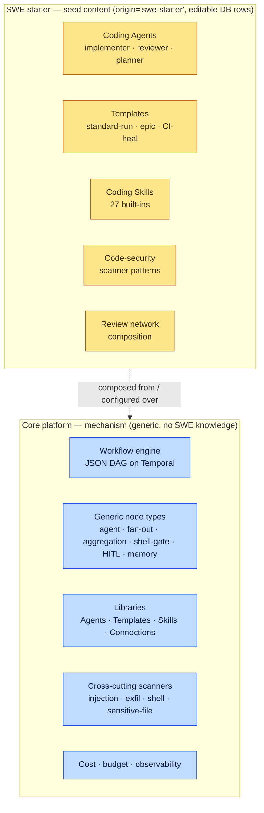
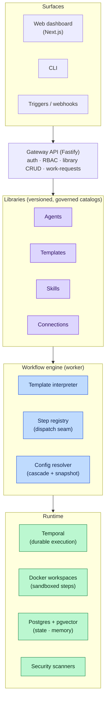
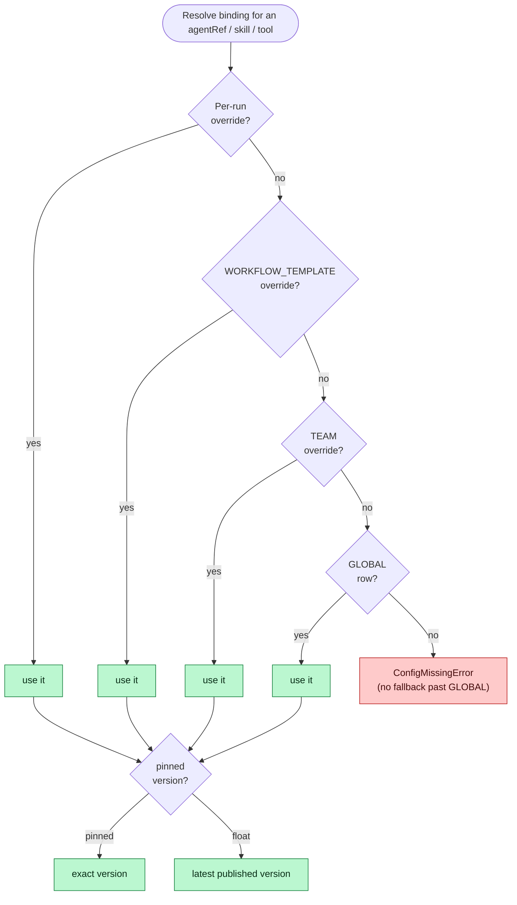
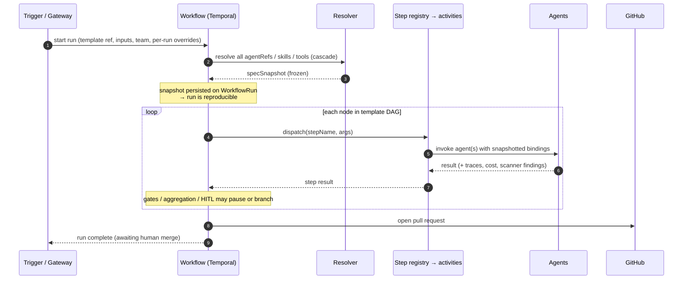
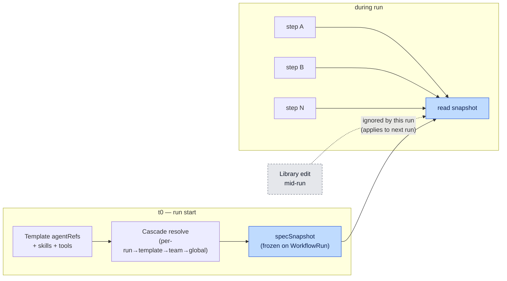
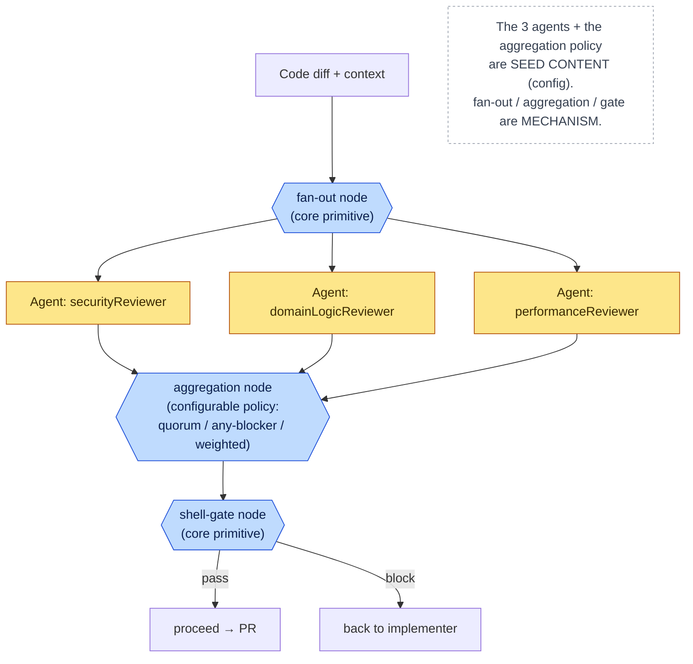
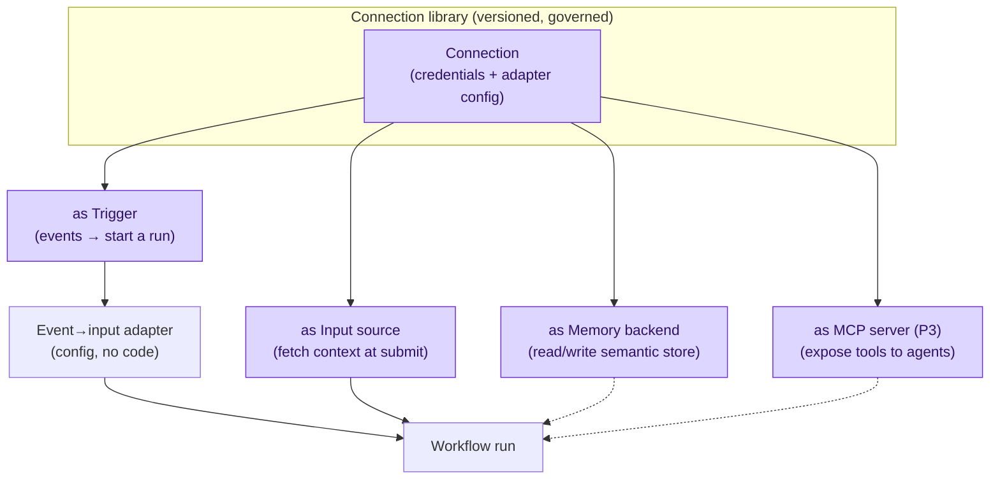
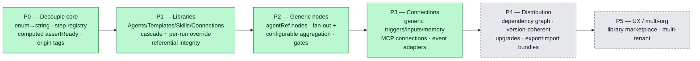
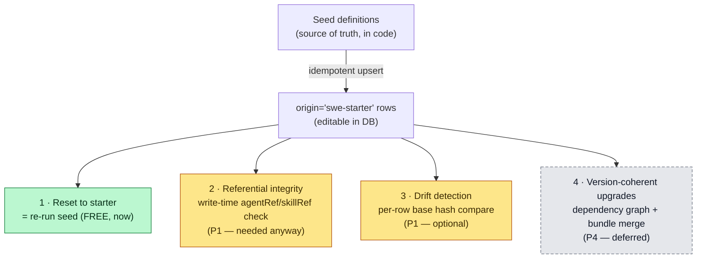

# Platform Pivot — Architecture & Flow Diagrams

High-level diagrams for the platform pivot. Companion to the
[RFC & roadmap](./platform-pivot.md) and the [P0 epic](./platform-pivot-p0.md).
Every diagram here renders inline on GitHub (Mermaid). They reflect the decisions
landed so far:

- **mechanism vs. content** — the engine ships generic primitives; SWE ships as *seed content*;
- **agent resolution is snapshotted at run start** (reproducible; supersedes mid-run model edits);
- **coherence** = idempotent re-seed (reset) + write-time referential integrity now, dependency/version upgrades deferred to P4.

> Status: **Proposed** — tracks RFC rev. 3 (in draft). Diagrams are normative for *shape*, not
> for exact field names; the schema is authoritative where they diverge.

---

## 1. The pivot in one picture — mechanism vs. content

The core platform is generic. Everything SWE-specific becomes seeded, editable DB rows that sit
*on top of* the engine. The dotted line is the boundary the pivot enforces: nothing below it
knows what "software engineering" is.

---

## 2. Layered architecture

How the pieces stack. Libraries are the composition surface; the engine interprets templates and
dispatches steps; the runtime is unchanged from today (Temporal + Docker + Postgres/pgvector).

---

## 3. Override cascade (config resolution)

Skills, tool configs, and **model/Agent bindings** all resolve through the same precedence chain.
The pivot adds a **per-run override** at the top and makes every layer able to **pin** (freeze a
version) or **float** (track latest).

---

## 4. Run lifecycle (end to end)

A trigger fires, the engine resolves and **snapshots** all references once, then interprets the
template DAG, dispatching each node through the step registry.

---

## 5. Agent resolution — snapshot at run start

The decision: resolve every `agentRef` **once** at run start and freeze the result into a
`specSnapshot` on the `WorkflowRun`. Steps read the snapshot, never the live library. This trades
the old mid-run model-edit behavior for full reproducibility.

---

## 6. SWE review network composed from generic primitives

The multi-agent review network is **not** a core feature — it's seed content assembled from three
generic node types. A second use case can build its own review fan-out with zero engine changes.

---

## 7. Connection model (generic external integration)

A **Connection** is one generic abstraction for everything external: triggers, input sources,
memory backends, and MCP tool servers. Adapters map a connector's events onto template inputs —
configuration, not code.

---

## 8. Phase roadmap (P0–P5)

What each phase delivers and the dependency order. P0–P3 are committed; P4–P5 are deferred but
shape-compatible from day one.

---

## 9. Coherence model (reset · integrity · drift · upgrade)

"Resettable SWE starter" does **not** require a dependency manifest. It decomposes into four
capabilities with very different costs — only the cheap ones are needed before P4.

---

## Legend

| Color | Meaning |
|---|---|
| 🟦 Blue | Core platform **mechanism** (generic engine) |
| 🟨 Amber | SWE **seed content** / near-term config work |
| 🟪 Purple | Libraries layer |
| 🟩 Green | Available now / committed / runtime |
| ⬜ Gray (dashed) | Deferred (P4–P5) or intentionally ignored |
