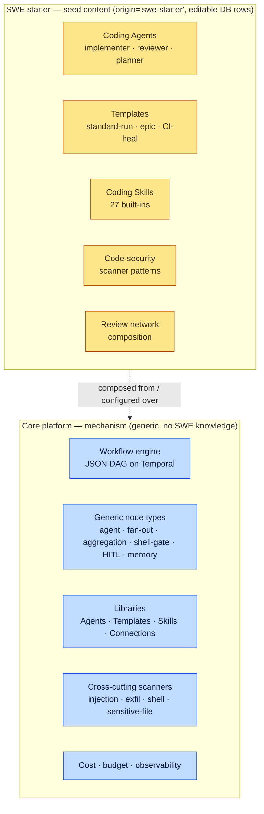
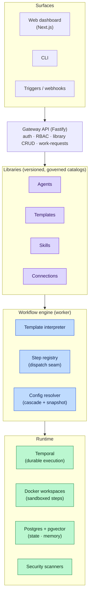
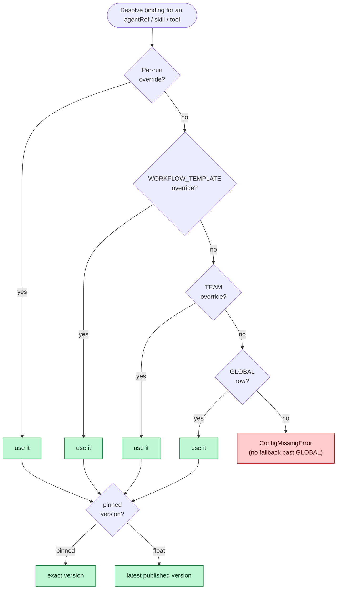
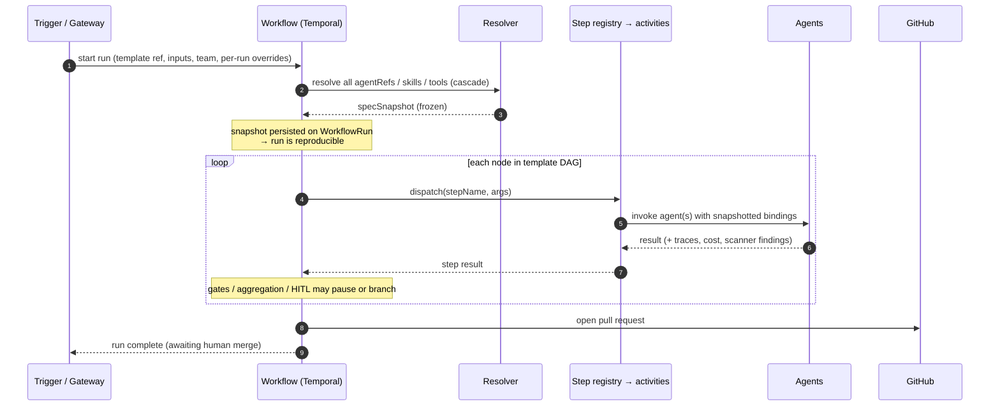
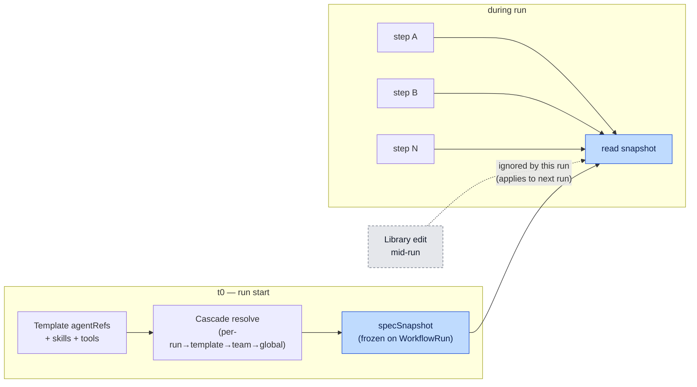
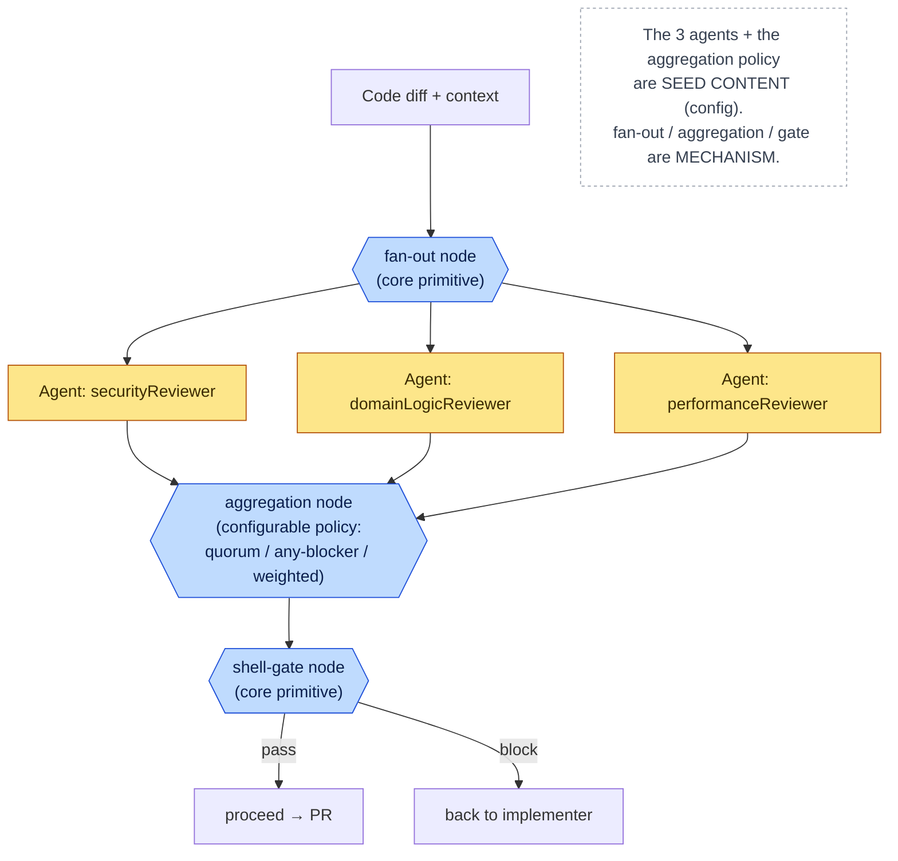
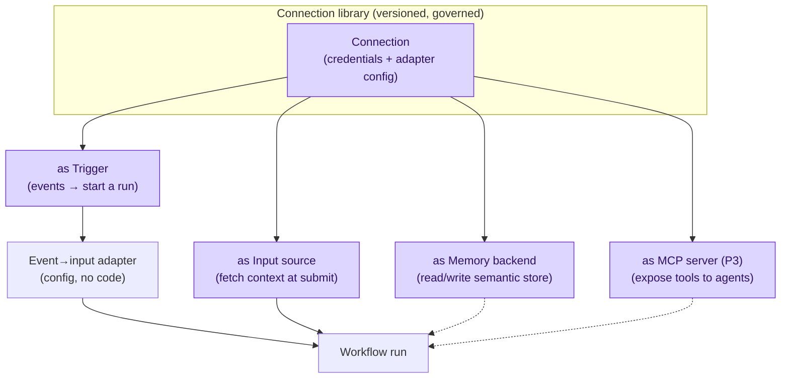
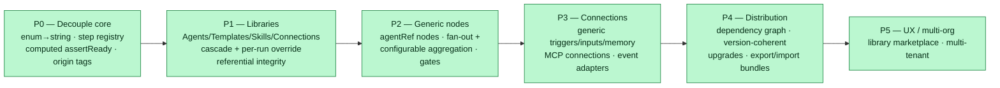
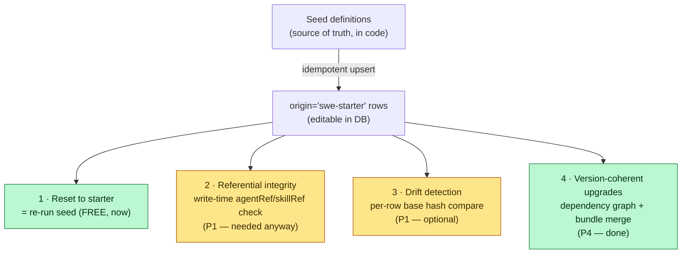

# Platform Pivot — RFC & Roadmap

Living planning doc for the **platform pivot**: turning auto-swe from a SWE-specific
autonomous coding system into a generic, durable, **multi-agent workflow orchestration
platform**, where SWE is simply the first use case seeded into the platform's reusable
libraries. Each phase is sized to land in one (or a small handful of) PR(s). Pick up here
when starting a follow-up PR.

> Status: **Complete** (rev. 2026-06-19). **All phases are implemented: P0, P1, P1.5, P2 (the
> declarative `agent` node (WS1), the `'mcp'` tool key (WS2), the full MCP integration (WS3:
> first-class `mcp` Connection, binding across all implementer activities + the generic agent node,
> and the admin write-path), the `mcp` workflow node (WS4), and the canvas palette/inspector
> authoring for the new node types (WS5)), P3, P4 (distribution layer), and now P5 in full —
> multi-org foundation, org-level RBAC, application-layer row isolation, org-granularity billing
> (budget caps), authoring-SDK polish, coded-step transports, and canvas org-scope polish.** Per-phase
> build plans + status: `platform-pivot-p0.md`, `platform-pivot-p1.md`, `platform-pivot-p2.md`.
>
> **This is rev. 2** — it supersedes the original pack-centric framing. See
> [Design evolution](#design-evolution) for the rationale trail.
>
> 📊 **Diagrams:** see [Architecture & flow diagrams](#architecture--flow-diagrams) below for
> high-level flow + architecture diagrams (engine/content split, cascade, run lifecycle, agent
> snapshot, review-network composition, Connections, roadmap, coherence).

---

## Vision

The product is a **durable, governed, multi-agent workflow orchestration platform**. Two things
are the product:

1. **The engine** — a JSON-defined, versioned DAG executed on Temporal, with the mechanisms that
   make agent work production-grade: HITL governance, a multi-agent review network, layered
   security scanning, semantic memory, fan-out/decomposition, sandboxed container steps, and
   cost/budget control.
2. **The libraries** — reusable, versioned, governed catalogs of **Agents**, **Templates**,
   **Skills**, and **Connections** that users compose into workflows and reuse across them.

**Software engineering is the first use case**, not a special module. SWE ships as *seed content*
in those libraries (coding Agents, the standard-run/epic/CI templates, coding Skills,
code-security scan patterns, and the git/PR/gate workflow wiring) — fully visible and
customizable, with no privileged runtime status.

The moat is not "compose agent DAGs" (crowded). It is **durable execution + HITL governance +
multi-agent review + layered security scanning + semantic memory + cost control**, applied to
production agent workflows. SWE is the flagship proof, not the ceiling.

### What this is *not* (anymore)

The original RFC made a **pack** the central abstraction — a module that *owned* a domain's
steps, roles, skills, scanners, and connectors. We retired that. Supporting many use cases is a
**libraries + composition** problem, not a packaging one. "Packaging" (versioned, distributable
bundles; a marketplace; third-party capability extension) solves a *different* problem —
distribution across deployments/parties — and is **deferred** until that is an actual goal
(P4). Until then there is no `Pack` runtime concept; SWE is seed data with a provenance tag.

---

## Core principles

These four principles drive every decision below.

1. **Mechanism vs. content.** *Mechanism* = how to do something (run a review network, fan out,
   decompose, scan output, exec a container, store/retrieve memory). Mechanisms live in **core** —
   they are engine, not domain. *Content* = which specifics plug into a mechanism (which Agent
   prompts, which scan patterns, which steps compose into a template). Content lives in the
   **libraries** as data.
2. **Reuse is layered.** `Workflows compose → Agents`; `Agents compose → Skills + Connections`;
   Skills/Connections are primitives. Each layer is an independently reusable, versioned library.
3. **Compose, don't fork.** The same library entity is reused across many workflows; per-team and
   per-template differences are expressed as **overrides via a cascade**, never by copying.
4. **Don't package prematurely.** Build the engine and libraries; keep entities export/import-
   friendly (versioned, self-describing, referenced by name) so that *if* distribution becomes a
   goal, a "package" is just a signed, versioned export of a tagged set — but build none of that
   marketplace machinery now.

---

## Concepts

### The engine (core mechanisms)
The interpreter, Temporal runtime, step registry, the **review-network** engine, **fan-out** and
**decomposition**, the **scanner framework** (+ cross-cutting default patterns: injection,
exfiltration, shell, sensitive-file), **container/workspace execution**, **HITL** node types,
the **memory** framework, and **cost** tracking. None of these are SWE-specific; all are free to
every workflow.

### The integrations layer (core)
Reusable **connectors** — GitHub, Jira/Linear, Slack, Postgres/HTTP, S3, MCP — each contributing
a connection type + credential schema, an auth/API client, generic steps (e.g. "open PR",
"comment issue"), and webhook receivers/verifiers. Connectors are shared infrastructure, not owned
by any use case. (GitHub/Jira clients already live in core today.)

### The libraries (the product surface)

| Library | Entity | Reused across |
|---|---|---|
| **Agents** | a named, configured agent definition | workflows |
| **Templates** | a versioned workflow DAG | runs |
| **Skills** | a named prompt fragment | Agents |
| **Connections** | a typed binding to an external system | Agents, templates, triggers |

### Agent (replaces "role")
A first-class, versioned, reusable definition:

```
Agent {
  key, name, description,
  scope: GLOBAL | TEAM,          // ownership + visibility
  origin?: string,               // provenance, e.g. 'swe-starter' (null = user-defined)
  modelSpec,                     // default binding (overridable via cascade)
  systemPrompt,
  skills:  [skillRef],
  tools:   [toolRef],            // workspace tools + MCP connections
  outputSchema?, memoryScope?,
  version, isBuiltIn, isVerified
}
```

"Role" was the SWE-era word for a fixed functional *slot* (the implementer, the reviewer). On a
generic platform the thing you define is a reusable **Agent**; a workflow references it. We delete
the `AgentRole` enum and the term "role" (it survives only as informal language for "which Agent a
node uses"). The review network's security/domain/performance "sub-roles" simply become Agents —
the `SkillOnlyRole` distinction disappears.

Vocabulary: **Agent** = the saved definition · **agent node** = a workflow step that runs an Agent
· **AgentSpec** = the resolved runtime form after overrides.

### Override cascade
Any library entity (esp. an Agent's model binding) resolves through:

```
GLOBAL (base)  →  TEAM override  →  WORKFLOW_TEMPLATE override
```

This is principle #3 in action: the payments team reuses the global `code-reviewer` Agent but
swaps its model; one template pins a stricter prompt — nobody forks the Agent or the workflow.

### Provenance & packaging (deferred)
Seed content carries an `origin` tag so it's identifiable and resettable ("SWE starter"). A
lightweight **export/import** of a tagged, versioned set of library entities is the seed of
"packaging" — enough to share a bundle. True distribution (marketplace, dependency graphs,
third-party coded capability) is **P4**.

---

## Architecture Decisions

| # | Decision |
|---|---|
| 1 | The engine treats **agent identity as an opaque string key** end-to-end. The Prisma `AgentRole` enum is **deleted**; `AgentTrace.agentRole` and config keys become `String`. No hardcoded agent list anywhere in core. |
| 2 | A first-class **`Agent` entity** consolidates today's scattered config (`ModelRoleConfig` + `AgentSkillAssignment` + `AgentToolConfig`) into one versioned object. Workflows reference an Agent **by key** (`agentRef`) or **inline** an ad-hoc one. |
| 3 | A single **`AgentSpec` resolver** produces the runtime spec from either a key (→ cascade lookup + skills + tools) or an inline definition. One resolver, two inputs. |
| 4 | **Override cascade** `GLOBAL → TEAM → TEMPLATE` applies per-Agent (and per-config) so the same Agent behaves differently per team/template without forking. |
| 5 | `assertConfigReady()` is **computed**: it validates the union of Agents referenced by active template specs + required seeded defaults — not a fixed list. Missing model bindings fail fast at boot. |
| 6 | **Cost pricing is decoupled from agent identity.** Pricing keys off the resolved `provider/model` spec only; the agent key is retained for attribution/telemetry. |
| 7 | **Step dispatch is registry-driven.** The hardcoded `dispatchStepImpl` switch is replaced by a `StepRegistry` populated at boot. The interpreter's `Dispatcher` seam is unchanged. |
| 8 | **Mechanism vs. content.** Review network, fan-out, decomposition, the scanner *framework* + cross-cutting default patterns, container exec, memory, and cost stay in **core**. Only domain *content* (Agent prompts, code-security patterns, template wiring) is data. |
| 9 | **Connectors are core/shared**, not owned by any use case. Connection types, credential schemas, API clients, generic steps, and webhook receivers live in the integrations layer. |
| 10 | **`Connection` replaces `Repository`** (P3); SWE's repo specifics (gate commands, default branch, GitHub coords) become `git_repo` connection config. `mcpServerRef` becomes a first-class `mcp` Connection. |
| 11 | **Generic run input.** A template declares an `inputSchema`; a trigger maps a payload to it. `WorkRequest` is replaced by a typed `RunInput`. SWE's `{ticketId, connectionId, description, budget}` is just its declared input. SWE-specific `ContextSnapshot`/`PullRequest` become SWE-owned satellite tables. |
| 12 | **Generic triggers.** Core ships manual/API + schedule + webhook *receivers/verifiers*. The event→input *mapping* (e.g. `issue.labeled → SWE standard-run`) is config/seed, not core code. |
| 13 | **Generic memory.** `AgentLesson` → `MemoryItem { scope, tags Json, embedding }`. SWE writes `scope='swe', tags={repo, failureType}`. pgvector retrieval is unchanged. |
| 14 | **No `Pack` runtime concept.** SWE is seed content tagged `origin='swe-starter'`. No manifest, no `register()`, no `pack` columns. The term "pack" is **retired** from the forward design (it survives only in the historical notes); the deferred distribution artifact (P4) is a **bundle**. |
| 15 | **No backward compatibility.** The system is undeployed; migrations are consolidated/rewritten for the target shape. The frozen `WorkflowRun.specSnapshot` is retained because it's good design. |
| 16 | **Plugin/coded capability isolation = container contract** (deferred, P4). A coded step is a container with a JSON stdin→stdout I/O contract, reusing `ephemeralContainer.ts` — untrusted code never runs in the worker process. WASM/sidecar rejected for v1. |
| 17 | **Layered abstractions, one execution model.** Canvas, declarative JSON+CLI, and the future authoring SDK are authoring surfaces over the same Templates + libraries. No surface gets a private execution path. |
| 18 | Node types stay as-is (the 11 are domain-agnostic). The **declarative agent step is a new node type** `agent` (carries an `agentRef` or inline spec), distinct from a registered `step`. |

> Decisions are append-only; supersede with a new row rather than editing in place once a phase ships.

---

## Phase Status

| Phase | Status | Slice |
|---|---|---|
| **P0. De-domainify the engine** | ✅ Done | Delete `AgentRole` enum (→ string keys); registry-driven step dispatch; `AgentSpec` resolver + generic `runAgent`; cost decoupled from identity; move SWE content out of core code into seeded data (+ `origin` tag); cross-cutting scanner patterns → core defaults; computed `assertConfigReady`. **No behavior change.** |
| **P1. Agent library** | ✅ Done | First-class `Agent` entity (consolidates model/skill/tool config); library UI + API; reference-by-key + inline; override cascade; versioning (pin/float) + prompt-edit security scan + RBAC. Supersedes `SkillOnlyRole`. |
| **P2. Declarative agent node + MCP** | ✅ Done | `agent` node (WS1); `'mcp'` tool key (WS2); full MCP integration — first-class `mcp` Connection, binding across all implementer activities + the generic agent node, admin write-path (WS3); `mcp` workflow node (WS4); canvas palette + inspector for both new node types (WS5). The no/low-code tiers. |
| **P3. Generic Connections, inputs, triggers, memory** | ✅ Done | `Connection` replaces `Repository` (slice 2); `MemoryItem` replaces `AgentLesson` (slice 1); template `inputSchema` + generic `RunInput` with submit-time validation (slice 3); config-driven trigger event→`RunInput` mappings (slice 4). SWE specializes via seed/config. Surface polish (generic `POST /runs`, live issues-webhook receiver, nullable `externalTicketId`) deferred — see `platform-pivot-p3.md`. |
| **P4. Distribution layer** | ✅ Done | Export/import versioned, dependency-aware bundles of library entities; cross-deployment install as a managed base layer; signature-based provenance/trust; third-party **capability** extension via container-contract coded steps; authoring SDK. All 5 work-streams (WS1–WS5) — see [platform-pivot-p4.md](./platform-pivot-p4.md). |
| **P5. UX layering + multi-org** | ✅ Done | **Multi-org foundation** (first-class `Organization`; `ORGANIZATION` config scope; 4-level cascade `WORKFLOW_TEMPLATE → TEAM → ORGANIZATION → GLOBAL`). **Org-level RBAC** (`OrganizationMembership` + `OrgRole`; `assertOrgAccess`/`assertOrgAdmin`; member CRUD API; platform `ADMIN` bypass). **Row-level data isolation** (application-layer: org-membership gate on work-request submit + org-scoped routes). **Org-granularity billing** (`OrgMonthlyUsage` increment-upsert aggregation; `monthlyBudgetUsdCents` cap → `402 ORG_BUDGET_EXCEEDED`; budget API + admin UI). **Authoring-SDK polish** (`auto-swe bundle` local init/validate/sign + `auto-swe bundles` install/export). **Coded-step transports** (containerStep NDJSON streaming + sidecar HTTP). **Canvas palette org-scope polish** (`ORGANIZATION` tier in agent/credential scope selectors + Scope column + `/admin/organizations/[orgId]` page). |

---

## P0 — De-domainify the engine (no behavior change)

> Detailed build plan: [`platform-pivot-p0.md`](./platform-pivot-p0.md) (workstreams, PR slicing, parity tests).

**Goal:** remove every hardcoded SWE assumption from core so the engine is domain-agnostic, while
keeping every existing workflow running identically. This replaces the original "extract SWE into a
pack" P0 — without inventing a pack abstraction.

### What ships
- **Agent identity = string.** Delete the Prisma `AgentRole` enum (`schema.prisma:47–60`); change
  `AgentTrace.agentRole` and config keys to `String`. Delete `ROLE_TO_PRISMA`/`ALL_ROLES`
  (`config/types.ts:17–67`).
- **StepRegistry** (`packages/worker/src/lib/stepRegistry.ts`): replace the `dispatchStepImpl`
  switch (`runnable.ts:320–473`) with a registry populated at boot; unknown step → typed error.
  The `Dispatcher` seam (`runnable.ts:229`) is preserved.
- **`AgentSpec` resolver** + a generic **`runAgent`** activity. SWE's bespoke activities
  (`executeImplementation`, review network, gates, …) become registered step executors that call
  `runAgent` or keep their multi-turn logic — registered, not switched.
- **Cost decoupled from identity** (`costTracking.ts:35–65,148–252`): pricing already spec-keyed;
  remove any identity→price assumption, keep the key as a telemetry dimension.
- **Content → seed data.** Tag every SWE-originated seed row with `origin='swe-starter'` across
  the **canonical six tables**: `Skill`, `ScannerPattern`, `WorkflowTemplate`, `ModelRoleConfig`,
  `AgentSkillAssignment`, `AgentToolConfig`. **Cross-cutting** scanner patterns
  (injection/exfil/shell/sensitive-file) become **core defaults** (`origin=null`); only
  code-security patterns stay SWE-tagged. (This list is authoritative; the P0 epic WS6 mirrors it.)
- **Computed `assertConfigReady`** (`config/assertReady.ts:18–103`): required set = Agents
  referenced by active template specs + seeded defaults.

### Decouplability checks
- `grep -r "AgentRole" packages/shared packages/worker/src/lib` → no enum references in core.
- A hypothetical second use case (e.g. a `summarizer` Agent + a template) requires **zero** core
  edits — only seed rows.

### Tests
- Registry: unknown step → error; registered step dispatches.
- `assertConfigReady`: passes with the computed union; fails fast on a missing model binding.
- Cost parity (snapshot) regardless of agent key.
- **Full existing workflow/interpreter/activity suites pass unchanged** (proves no behavior change).

---

## P1 — Agent library (first-class, reusable, governed)

**Goal:** make Agents real, reusable objects users create and share across workflows.

### What ships
- **`Agent` entity** consolidating `ModelRoleConfig` + `AgentSkillAssignment` + `AgentToolConfig`
  into one versioned row + layered override rows for the cascade.
- **Library UI + API** (the current dashboard's "Roles & models" page becomes the **Agents** library — mocked in `mocks/agents.html`).
- **Reference + reuse:** `agentRef: "<key>"` from any number of templates; or inline for one-offs.
- **Override cascade** `GLOBAL → TEAM → TEMPLATE` per Agent.
- **Versioning** (pin `@v` or float), **prompt-edit security scan** (injection/exfil; resets
  `isVerified=false`, mirroring custom-skill behavior today), **RBAC** (GLOBAL=platform ADMIN,
  TEAM=team OWNER, inline=template editors).
- Removes the `SkillOnlyRole` concept — sub-reviewers are just Agents.

### Decouplability checks
- Fixing `code-reviewer`'s prompt once changes every template that references it.
- A team swaps `code-reviewer`'s model via a TEAM override without forking the Agent or any template.

### Tests
- Agent CRUD + cascade resolution (template > team > global).
- Reference-by-key resolves identically to today's per-role config output (parity).
- Prompt edit triggers a scan and resets verification.

---

## P2 — Declarative agent node + MCP

**Goal:** ship the two no/low-code extension tiers.

### What ships
- **`agent` node type** (`spec.ts` `NodeSchema`): carries `agentRef` or an inline AgentSpec;
  interpreter dispatches it to `runAgent`. Canvas inspector + step metadata gain the node.
- **MCP completion:** ✅ `'mcp'` added to the canonical tool-key set (`AGENT_TOOL_KEYS` in
  `stepRegistry.ts`) valid for any Agent (WS2); ✅ MCP config moved off the dropped
  `Repository.mcpServerRef` onto a first-class `mcp`-type **Connection** (`config.url`) referenced by
  `Agent.mcpConnectionId`, bound into the implementer at run time (WS3 slices 1–2). Remaining: the
  gateway/UI write-path and a new **`mcp` node** that calls a single MCP tool as a workflow step.
- Canvas palette gains `agent` + `mcp` nodes.

### Tests
- Interpreter: `agent` node resolves agentRef/inline → `runAgent`; `mcp` node calls one tool.
- MCP: `'mcp'` accepted for any Agent; tools load from an `mcp` Connection.

---

## P3 — Generic Connections, inputs, triggers, memory

**Goal:** decouple the remaining SWE-shaped schema; SWE specializes via seed/config.

### What ships
- **`Connection` model** (core integrations layer) replaces `Repository`; SWE's `git_repo` type +
  satellite config (gate commands, branch, GitHub coords). Runs reference `connectionId`.
- **Template `inputSchema` + generic `RunInput`** replaces `WorkRequest`; SWE declares
  `{ticketId, connectionId, description, budget}`. `ContextSnapshot`/`PullRequest` → SWE satellite
  tables.
- **Generic triggers:** core webhook receivers/verifiers + manual/API + schedule; event→input
  mappings are config/seed (SWE: GitHub `issue.labeled`, Jira fetch).
- **`MemoryItem`** (`scope` + `tags Json` + `embedding`) replaces `AgentLesson`.

### Decouplability checks
- A non-SWE template declares its own `inputSchema`, binds a non-`git_repo` Connection, fires from
  a schedule, and reads/writes `MemoryItem` under its own scope — **no core path assumes tickets,
  repos, PRs, or failure types.**

### Tests
- Connection CRUD + `git_repo` specialization; run-submit validates payload against `inputSchema`.
- Trigger mapping for a sample GitHub/Jira payload; memory scope/tag filtering + pgvector parity.

---

## P4 — Distribution layer (DEFERRED — full spec)

**Goal:** distribute coherent bundles of library content across deployments/parties, and let third
parties add new **capabilities**. Built only when an ecosystem / vertical-solution distribution is
a goal. The P0–P3 libraries are designed export/import-friendly specifically so this is additive.

### Design
- **Bundles, not packs-as-runtime.** A bundle is a **signed, versioned export of a tagged set of
  library entities** (Agents, Templates, Skills, Connection types, scanner patterns) + a
  dependency manifest ("requires the `github` connector"). Install seeds the entities as a
  **managed base layer**; user customizations remain **overrides** via the P1 cascade, so bundle
  upgrades and user edits coexist.
- **Marketplace + install** across deployments; provenance/trust (verified first-party vs
  community); RBAC on who may install (platform ADMIN for GLOBAL, team OWNER for TEAM).
- **Third-party capability extension = the plugin SDK.** Most bundles are pure content (no code).
  Only a bundle that adds a *new capability* (a connector core lacks, a novel mechanism) ships
  code — as a **container-contract step** (Decision 16): a manifest declaring image, I/O schema,
  resource limits, required connections, and egress allowlist; executed via `ephemeralContainer.ts`
  with JSON stdin→stdout. Untrusted code never enters the worker process.
- **Authoring SDK** (`packages/sdk/`): TypeScript helpers to define bundles, Agents, Templates, and
  container-contract steps programmatically, with a local test harness — the third authoring
  surface.

### Open questions
- Bundle artifact format & signing/trust; transport for coded steps (stdin/stdout first vs sidecar).
- Secret scoping & rotation for capability-required connections.
- Cross-process cache invalidation when an install mutates rows at runtime (today TTL-only).

---

## P5 — UX layering + multi-org (DONE)

- **Canvas palette** for all node kinds (`agent`, `mcp`, coded step) with schema-aware inspectors;
  library content drives a categorized palette. **Org-scope polish done** — `ORGANIZATION` is a
  first-class option in the agent-library and credential scope selectors (with an `orgId` input), a
  "Scope" column surfaces org-scoped rows, and `/admin/organizations/[orgId]` manages members +
  budget.
- **Authoring SDK polish:** scaffolding CLI, local dev-loop, publish flow. **Done** — `auto-swe
  bundle init|validate|sign` (token-free, over `@auto-swe/sdk`) + `auto-swe bundles
  list|export|install|install-from-url` (gateway-backed).
- **Multi-org / true multi-tenancy:** promote the `orgId` stub to a first-class tenant boundary —
  org-scoped libraries, billing/budget, RBAC; today's team/global scopes nest under org (the
  cascade becomes 4-level). **Foundation done:** first-class `Organization` model (every `Team`
  nests under one), `ORGANIZATION` added to `ConfigScope`, and the agent + credential cascades are
  now `WORKFLOW_TEMPLATE → TEAM → ORGANIZATION → GLOBAL` (the ORGANIZATION tier fires only when the
  run's team has an org, so single-tenant behavior is unchanged). **RBAC done:**
  `OrganizationMembership` join table + `OrgRole` enum (`ORG_ADMIN` / `ORG_MEMBER`);
  `assertOrgAccess` / `assertOrgAdmin` gateway helpers; member CRUD at
  `/api/v1/admin/organizations/:orgId/members`; platform `ADMIN` bypasses membership checks.
  **Row-level data isolation done** (application-layer): work-request submission requires org
  membership, and every org-scoped route enforces `assertOrgAccess`. **Billing done:**
  `OrgMonthlyUsage` aggregates per-org cost/runs/tokens via Prisma `increment` upserts (race-safe)
  at run finalize; `Organization.monthlyBudgetUsdCents` caps spend and returns
  `402 ORG_BUDGET_EXCEEDED` at submit time; budget read/update API at
  `/api/v1/admin/organizations/:orgId/budget` with admin UI.

### Open questions (remaining)
- None — Postgres-level RLS remains a possible future hardening over today's application-layer
  isolation, but is not required for the P5 deliverable.

---

## Resolved open questions

| Question | Resolution |
|---|---|
| Agent identity: fixed taxonomy vs dynamic? | **Fully dynamic** — opaque string keys + first-class `Agent` entity + `AgentSpec` resolver; `AgentRole` enum deleted. |
| Why "role"? | Renamed to **Agent** — "role" was a SWE-era functional-slot term. |
| Generalize `Repository`? | **Yes, now** — `Connection` replaces it in P3; no shim. |
| Plugin/coded capability isolation? | **Container contract** (deferred, P4); WASM/sidecar rejected. |
| Backward compatibility? | **None** — undeployed; consolidate migrations. |
| **Do we still need packs?** | **No — not for supporting many use cases.** That's a libraries+composition problem. Packaging is a *distribution* concern, deferred to P4. SWE is seed content with an `origin` tag. |
| Phasing? | Build **P0–P3** (engine + libraries); document **P4–P5** (distribution, UX/multi-org). |

---

## Risks & mitigations

| Risk | Mitigation |
|---|---|
| Scope creep | P0–P3 is a credible standalone product (durable, governed agent-workflow platform with SWE seeded in). P4–P5 gated behind it. |
| Deleting `AgentRole` enum loses compile-time safety | Zod-validate Agent definitions at write/seed time; `assertConfigReady` fails fast; integration tests cover the computed union. |
| Big-bang schema rewrite | Allowed (undeployed, Decision 15). Existing interpreter/workflow/activity suites are the behavior contract through each phase. |
| Premature distribution machinery | Explicitly deferred (P4). We only keep entities export/import-friendly; we build no marketplace now. |
| Coded-capability untrusted surface (P4) | Container isolation, egress-default-none, per-connection secret scoping, manifest scanning, audit — none run code in-process. |

---

## Design evolution

This RFC reached its current shape through a sequence of refinements (rationale preserved here, as
`configurable-workflows.md` preserves its decisions):

1. **Pack-centric (rev. 1).** A pack owned a domain's steps/roles/skills/scanners/connectors.
2. **Mechanism vs. content.** Most "pack" contents are mechanisms (review network, fan-out,
   scanning) → they belong in core; only content is domain-specific.
3. **Connectors are shared.** GitHub/Jira (already in core) are reusable across use cases → the
   integrations layer is core, not pack-owned.
4. **Packs own composition, not capability.** What remained for a "pack" was thin composition over
   shared capabilities.
5. **Role → Agent.** The reusable unit is a first-class **Agent** (library entity), referenced
   across workflows with an override cascade — not a fixed "role."
6. **Drop packs (rev. 2).** Supporting many use cases is solved by **libraries + composition**.
   Packaging solves *distribution across parties* — a different, deferrable problem. SWE becomes
   seed content; "packs" become an optional future **distribution layer** (P4).

---

## Current-state coordinates (for implementers)

- **Step switch:** `packages/worker/src/workflows/runnable.ts:320–473` (`dispatchStepImpl`) → P0
  registry. `Dispatcher` seam `runnable.ts:229` preserved.
- **Agent identity enum:** `schema.prisma:47–60`; `config/types.ts:17–67`;
  `config/assertReady.ts:18–103` → P0.
- **Cost:** `costTracking.ts:35–65,148–252` (already spec-keyed) → P0 cleanup.
- **Config to consolidate into `Agent`:** `ModelRoleConfig` (`schema.prisma:623–642`),
  `AgentSkillAssignment` (`950–967`), `AgentToolConfig` (`974–990`) → P1.
- **Domain models:** `WorkRequest` (`356–383`), `ContextSnapshot` (`136–146`), `PullRequest`
  (`148–162`), `Repository`, `AgentLesson` → P3 (Connection / RunInput / MemoryItem / SWE satellite
  tables). Generic core models stay: `WorkflowTemplate` (`567–609`), `WorkflowRun` (`455–482`),
  `WorkflowStep` (`514–530`), `AgentTrace` (`489–510`).
- **Node types:** `packages/shared/src/workflow/spec.ts:306–330` (11, all generic) → P2 adds
  `agent` + `mcp`.
- **MCP:** `packages/worker/src/agents/mcpTools.ts` + `lib/config/mcpConnection.ts`; first-class
  `mcp`-type `Connection` (`config.url`) + `Agent.mcpConnectionId` (replaced the dropped
  `Repository.mcpServerRef`); `MCP_TOOL_KEY` / `AGENT_TOOL_KEYS` in `stepRegistry.ts` → P2 (WS2 + WS3
  slices 1–2 done).
- **Container infra (coded-step basis):** `packages/worker/src/lib/ephemeralContainer.ts`,
  `packages/worker/src/activities/shellStep.ts` → reused by P4.
- **Content → seed:** `packages/shared/src/skills/`, `prisma/seed.ts`, `lib/syncBuiltins.ts`,
  `scannerPatterns/` → P0 (seed rows + `origin` tag; cross-cutting patterns → core defaults).
- **Connectors (already core):** `packages/gateway/src/lib/github.ts`, resolvers in
  `packages/shared/src/lib/systemConfig.ts` → integrations layer (stay shared).

## Architecture & flow diagrams

High-level diagrams for the pivot (folded in from the former `platform-pivot-diagrams.md`). Every diagram renders inline on GitHub (Mermaid); they are normative for *shape*, not exact field names — the schema is authoritative where they diverge.

### 1. The pivot in one picture — mechanism vs. content

The core platform is generic. Everything SWE-specific becomes seeded, editable DB rows that sit
*on top of* the engine. The dotted line is the boundary the pivot enforces: nothing below it
knows what "software engineering" is.



---

### 2. Layered architecture

How the pieces stack. Libraries are the composition surface; the engine interprets templates and
dispatches steps; the runtime is unchanged from today (Temporal + Docker + Postgres/pgvector).



---

### 3. Override cascade (config resolution)

Skills, tool configs, and **model/Agent bindings** all resolve through the same precedence chain.
The pivot adds a **per-run override** at the top and makes every layer able to **pin** (freeze a
version) or **float** (track latest).



---

### 4. Run lifecycle (end to end)

A trigger fires, the engine resolves and **snapshots** all references once, then interprets the
template DAG, dispatching each node through the step registry.



---

### 5. Agent resolution — snapshot at run start

The decision: resolve every `agentRef` **once** at run start and freeze the result into a
`specSnapshot` on the `WorkflowRun`. Steps read the snapshot, never the live library. This trades
the old mid-run model-edit behavior for full reproducibility.



---

### 6. SWE review network composed from generic primitives

The multi-agent review network is **not** a core feature — it's seed content assembled from three
generic node types. A second use case can build its own review fan-out with zero engine changes.



---

### 7. Connection model (generic external integration)

A **Connection** is one generic abstraction for everything external: triggers, input sources,
memory backends, and MCP tool servers. Adapters map a connector's events onto template inputs —
configuration, not code.



---

### 8. Phase roadmap (P0–P5)

What each phase delivers and the dependency order. All phases (P0–P5) are now implemented.



---

### 9. Coherence model (reset · integrity · drift · upgrade)

"Resettable SWE starter" does **not** require a dependency manifest. It decomposes into four
capabilities with very different costs — only the cheap ones are needed before P4.



---

### Legend

| Color | Meaning |
|---|---|
| 🟦 Blue | Core platform **mechanism** (generic engine) |
| 🟨 Amber | SWE **seed content** / near-term config work |
| 🟪 Purple | Libraries layer |
| 🟩 Green | Available now / committed / runtime |
| ⬜ Gray (dashed) | Intentionally ignored / out of scope |
