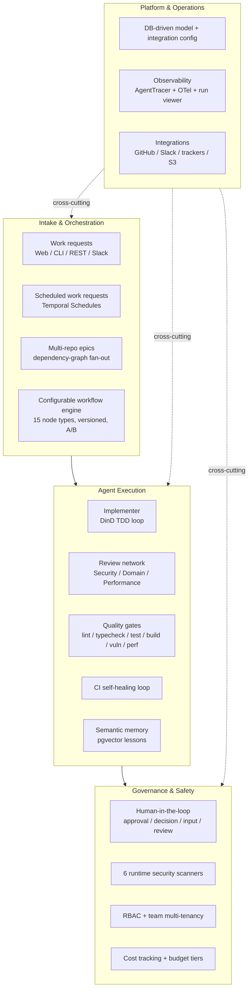
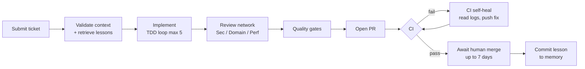

# Product Overview — auto-swe

> What auto-swe is, who it is for, the value it delivers, the end-to-end use cases it covers, and what is deliberately out of scope. For the technical "how" see [architecture.md](./architecture.md) and [agents.md](./agents.md).

---

## 1. Product Thesis

**auto-swe turns a ticket ID into a reviewed, tested, draft pull request — and then waits for a human to merge.**

It closes the last-mile gap between *"work is specified"* and *"code is in review."* Engineering teams spend disproportionate time on work that is well-defined but repetitive or time-consuming: implementing described features, writing tests, chasing CI failures, and waiting on review. auto-swe automates that span as a **durable, observable, governable pipeline** while preserving the one decision that should stay human — the merge.

The defining constraint is a product choice, not a limitation: **the system never auto-merges.** It operates as a contributor that opens PRs; a human always merges. This positions auto-swe as an *amplifier* of an engineering team rather than a replacement for it.

---

## 2. Target Users

| Persona | What they get | Primary surfaces |
|---|---|---|
| **Engineering teams** (more tickets than engineers) | Autonomous implementation of well-specified tickets, with quality gates and review applied by default | Dashboard submit flow, Slack `/auto-swe`, Epics |
| **Tech leads** | Guaranteed human-governed merge, full visibility into what the agent did and why, HITL approval gates | Run viewer, HITL inbox, review network output |
| **Platform / DevOps engineers** | Run auto-swe as shared infrastructure for other teams: integrations, model config, RBAC, security policy | Admin console, team config, scanner patterns |
| **CI/CD pipeline authors** | A scriptable pipeline step (PAT + CLI/REST) that fires on issue creation | CLI, REST API, scheduled work requests |

auto-swe deliberately does **not** target very early-stage codebases where the implementation surface is too undefined for an agent to work autonomously — the value depends on tickets being specified well enough to derive measurable success criteria.

---

## 3. Business Value & Goals

| Value pillar | How it is delivered |
|---|---|
| **Throughput amplification** | Automates well-specified implementation work so a given headcount ships more |
| **Quality by default** | Lint, typecheck, tests, build, a three-agent review network, and security scanning all run on every change — none are opt-in |
| **Institutional learning** | Every run writes a semantic `MemoryItem` (pgvector); future runs on similar repos/failures get those lessons injected automatically — the system improves per-repo over time |
| **Cost transparency** | Per-call / per-run / per-team USD tracking, budget tiers with hard caps, and per-template A/B analytics |
| **Operator control** | Models, skills, tool access, workflow shape, and security policy are all DB-driven and overridable per team or per template — most changes need no restart |
| **Operational safety** | Temporal makes runs durable (survive crashes, wait days for signals, replay deterministically); humans govern the merge |

---

## 4. Capability Map

| Domain | Capabilities |
|---|---|
| **Agent system** | 21 seeded agents (10 model-backed + 11 sub-role personas); multi-agent review network; TDD implementation loop; channel-resident assistant with ambient, reactive, and persona modes. See [agents.md](./agents.md). |
| **Skills** | 28 built-in prompt-fragment skills; progressive disclosure (`loadSkill`) for the implementer; custom skills with content scanning + verification flag; scope cascade |
| **Multi-model** | DB-driven model selection per role per scope; Anthropic / OpenAI / Google + any OpenAI-compatible provider; AES-256-GCM encrypted credentials. See [model-configuration.md](./model-configuration.md). |
| **Workflow engine** | 15 node types (incl. the declarative `agent` node and the `eval` node); versioned immutable template versions; visual React-Flow editor; deterministic A/B routing; per-template/team/global analytics; frozen spec snapshot per run |
| **Orchestration** | Temporal durable execution; budget tiers (STANDARD / LARGE / EPIC) with hard token caps and `BUDGET_EXCEEDED` enforcement |
| **Memory** | pgvector (HNSW) semantic lessons; per-repo cosine retrieval at run start; weekly consolidation ("dreaming") of similar lessons |
| **Security** | 6 runtime scanners (shell, sensitive-file, pre-write content, code-security, skill-content, LLM-output); 52 built-in admin-extensible regex patterns; locked-down ephemeral shell containers |
| **HITL** | 4 node types (approval / decision / input / review); inbox UI + Slack buttons; atomic resolution, timeout routing, cancellation cleanup. See [hitl-workflows.md](./hitl-workflows.md). |
| **Auth / RBAC** | 3 auth paths (JWT, PAT, better-auth sessions); 3 platform roles + team-scoped roles; OAuth (GitHub/Google), magic-link, account linking, new-user approval |
| **Integrations** | GitHub (PAT *or* GitHub App), Slack (slash command + interactive), issue trackers (Jira / Linear / GitHub Issues), S3/MinIO storage, email (SMTP/Resend) — all DB-configured, encrypted, with connection tests + audit log |
| **Observability** | AgentTracer (tool calls / LLM responses / events per attempt); OTel → Grafana LGTM; 3-mode run viewer (split / transcript / flight-recorder replay) |
| **Surfaces** | Web dashboard, full CLI, REST API, Slack |

---

## 5. Primary Use Cases & Workflows

### 5.1 Standard single-repo work request (the core flow)

The canonical end-to-end journey. (Sequence diagram in [architecture.md §3](./architecture.md#3-work-request-lifecycle).)

### 5.2 Multi-repo epic

A planner agent decomposes a brief spanning ≥2 repos into a per-repo dependency graph; `EpicOrchestratorWorkflow` fans out child workflows in dependency order, each running the full standard flow, with auto merge-conflict resolution. Surfaced as a dependency graph at `/epics/:id`.

### 5.3 Human-in-the-loop approvals

Teams insert pause points anywhere in a workflow spec: `humanApproval` (binary gate before a PR), `humanDecision` (multi-option branch), `humanInput` (structured form into context), `humanReview` (annotated diff review). Workflows park inside Temporal until a signal arrives (inbox response or Slack button) or route to `onTimeout`.

### 5.4 CI self-healing loop

On a GitHub `check_run` failure webhook, the worker fetches the actual CI logs, runs a targeted fix activity, pushes, and re-awaits CI — repeating until green or a retry cap. No human intervention for fixable failures.

### 5.5 Semantic memory / learning loop

After every run, the memory agent writes a structured `MemoryItem` (failure type, rationale, 1536-dim embedding, active skills). On future runs, the context validator does a per-repo semantic similarity search and injects the top matches into the implementer's context — institutional knowledge accrues automatically. Browsable at `/lessons`.

### 5.6 Configurable + versioned workflow templates

Teams author their own workflow DAGs on a visual canvas without code changes, version them, diff versions, and A/B-test two versions by deterministic per-ticket split — with success-rate / duration / cost analytics per template.

### 5.7 Scheduled work requests

Admins configure standing automations backed by Temporal Schedules (nightly dependency checks, recurring lint sweeps, periodic doc generation) at `/admin/schedules`.

### 5.8 Team-scoped configuration

Each team overrides at TEAM scope (falling back to GLOBAL): model-per-role, provider credentials, assigned skills, enabled implementer tools, per-repo gate commands, shell-image and egress allowlists, and Slack notification channels.

---

## 6. Differentiators

What sets auto-swe apart from simpler "AI coding" tools:

- **Durable orchestration (Temporal):** runs survive crashes, wait days for human/CI signals without polling, and replay deterministically — the foundation that makes multi-day merge waits and CI retry loops operationally safe.
- **Multi-agent review network:** three specialized reviewers (security, domain logic, performance) run in parallel against every diff, instead of one catch-all reviewer; all must approve.
- **CI self-healing:** the loop from CI failure → log analysis → automated fix → re-submit is fully automated.
- **Semantic institutional memory:** pgvector retrieval surfaces relevant past failures and decisions into agent context on relevant future runs; the system's effective quality improves per-repo over time.
- **First-class configurable workflow engine:** the workflow DAG is a versioned JSON spec interpreted by a pure functional interpreter — editable, A/B-testable, and analyzable from the UI, not a YAML pipeline bolted onto an agent.
- **Operational security stack:** six independent runtime scanners at distinct stages, all DB-backed and admin-extensible, plus locked-down ephemeral shell containers.

---

## 7. Non-Goals / Out of Scope

These are architecturally enforced, not just policy:

- **No auto-merge.** The system opens PRs and never merges them; a Temporal signal bridges the GitHub merge webhook to the waiting workflow.
- **No Kubernetes.** Docker-in-Docker is the workspace isolation model; works inside Docker Compose.
- **No repo-admin actions.** auto-swe acts as a contributor — no branch-protection bypass, approval, or auto-merge on target repos.
- **No IP-level egress filtering for shell steps.** DNS-based filtering only; IP-direct connections are out of scope (would require host iptables).
- **No multi-arm A/B.** Exactly two arms per template (active vs experiment).
- **No cross-process scanner-cache invalidation.** Gateway and worker are separate processes; pattern edits propagate via 60 s TTL.

---

## 8. Maturity

The feature surface described above is built: the workflow engine, HITL, the security scanners,
multi-repo epics, GitHub App auth, scheduled requests, Slack integration, evals, the distribution
layer, the CLI, and analytics all exist in code, with the unit and workflow suites green.

Read that precisely. **The unit suite runs against mocked Docker, mocked Temporal, and mocked LLM
calls**, so it establishes that the wiring is coherent — not that an agent given a real ticket and a
real repository produces a pull request worth merging. Verifying the Temporal, Docker, and LLM paths
end to end requires the full infrastructure stack, and the channel assistant in particular is newly
built rather than validated under sustained real-world use.

**The generic-platform surface is thinner than the engine underneath it.** The engine is
domain-agnostic — templates declare an `inputSchema`, runs carry a typed `RunInput`, and memory and
connections are generic. The *submit surface* has not caught up: there is no generic `POST /runs`
endpoint, `RunInput.externalTicketId` is still non-nullable, trigger event→input mappings are
config rather than a persisted `Trigger` table, and there is no live issues-webhook receiver. A
non-SWE workflow therefore still enters through the SWE-shaped work-request route and must supply a
ticket ID.

Two limitations in §7 are deliberate rather than pending: shell-step egress filtering is DNS-based,
so IP-direct connections are unfiltered and wildcard entries are informational only. Both would
require an in-path egress proxy or resolver.

Tenant isolation is enforced in the application layer — org and team membership checks on the
routes — not by database row-level policies.

Both the read-only run/diff DAG viewer and the interactive template editor support keyboard
navigation: arrow-key edge traversal, Home-to-entry, Enter-to-open, and per-node screen-reader
labels (the editor also keeps Delete-to-remove). The editor's traversal is bound in the capture
phase so it takes precedence over React Flow's native arrow-key node nudge (node positions are
session-only, so nothing is lost).

---

## 9. Where to Go Next

| To understand… | Read |
|---|---|
| System context, package map, lifecycle, data model, infra | [architecture.md](./architecture.md) |
| Agent roles, review network, skills, scanners, observability | [agents.md](./agents.md) |
| HITL node types, signal flow, inbox | [hitl-workflows.md](./hitl-workflows.md) |
| Model + credential configuration | [model-configuration.md](./model-configuration.md) |
| Production deployment | [deployment.md](./deployment.md) |
| Conventions, tech stack, model defaults | [AGENTS.md](../AGENTS.md) |
| Design rationale behind decisions already made | [history/](./history/) |
