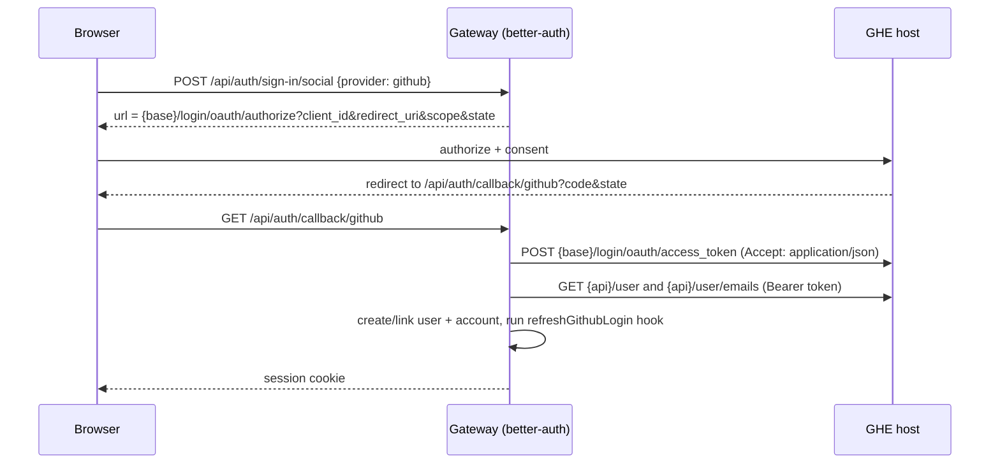

# GitHub Enterprise Server sign-in

Jira: N/A
Date: 2026-10-01
Status: Approved
Last reviewed: 2026-10-01

## Problem

"Continue with GitHub" always sends the browser to `github.com`, even when the GitHub integration
is configured for a GitHub Enterprise Server (GHE) instance. better-auth's built-in `github`
provider hardcodes `https://github.com/login/oauth/authorize`, the token endpoint and
`https://api.github.com/user`, and exposes no option to change them. The **Base URL** and **API URL**
fields on the GitHub tab only reach repository access and the post-sign-in username lookup
(`fetchGithubLogin`), never the sign-in redirect. A deployment whose GitHub is a GHE instance cannot
sign in with it: the OAuth app lives on GHE, and github.com reports the client ID as unknown.

## Approach

When the saved Base URL points at a host other than `github.com`, register GitHub sign-in through
better-auth's `genericOAuth` plugin with explicit GHE endpoints, under the **same provider id
`github`**, instead of the built-in provider. Activation needs no new setting: the Base URL/API URL
already saved on the GitHub tab decide it. With those fields empty, behaviour is exactly today's.

Reusing the id keeps the callback URL (`/api/auth/callback/github`), existing `account` rows, the
`refreshGithubLogin` hook, `backfillGithubLogins`, the email-linking allowlist and the login/settings
UI working unchanged. The cost is that GHE sign-in replaces github.com sign-in; the two cannot
coexist under one id. That is accepted.

## Design

Okta already shows the pattern: it is registered through `genericOAuth`, which merges the provider
into the same social-provider list, so sign-in, callback and link all use the standard routes.

**New module** `packages/gateway/src/lib/githubEnterpriseAuth.ts`, pure and unit-testable:

- `isGithubEnterprise(baseUrl)` is true when the URL's host is not `github.com`.
- `githubEnterpriseOAuth({ baseUrl, apiUrl, clientId, clientSecret })` returns the `genericOAuth`
  config: `providerId: 'github'`, `authorizationUrl`/`tokenUrl` under `{base}/login/oauth/`,
  `scopes: ['read:user', 'user:email']`, `pkce: false` (mirrors the built-in provider; GHE versions
  differ in PKCE support), and a custom `getUserInfo`.
- URLs are normalised (trailing slash stripped) and must be `http:` or `https:`.
- When the API URL is still the github.com default (`https://api.github.com`) while the Base URL is
  GHE, the sign-in API URL is derived as `{base}/api/v3`. Only sign-in uses the derived value;
  other consumers of the API URL are untouched.

**`getUserInfo`** calls `GET {api}/user` and `GET {api}/user/emails` with the access token. The email
is the entry that is both `primary` and `verified`; the public `email` on `/user` is never used
because it carries no verification flag. With no such entry it returns `null`, which makes
better-auth refuse the sign-in.

**Account id is namespaced** as `{host}:{numeric id}`. Both servers issue small numeric ids and accounts
are keyed unique on `(issuer, accountId)`; a generic provider with no `accountIssuer` gets
`local:oauth:github`, the same issuer as the built-in provider. A bare numeric id from GHE could
therefore match a user's earlier github.com account and sign the wrong person in. Prefixing the host makes that
impossible. The `refreshGithubLogin` hook and the backfill script key on `providerId` and the access
token, not on `accountId`, so they are unaffected.

**Wiring** in `betterAuth.ts`: `initAuth` keeps the resolved `baseUrl`/`apiUrl` beside the client
credentials. `socialProviders.github` is registered only when not GHE. A single `genericOAuth`
plugin is built from a list of configs holding GHE and/or Okta (better-auth takes one plugin
instance), and is omitted when the list is empty. `configuredProviders().github` still reports
whether a client ID and secret are set, in both modes.

**Docs:** `docs/oauth-setup.md` gains a short GHE section; the callback URL it names is unchanged.

## Acceptance Criteria

1. While the saved Base URL's host is not `github.com` and an OAuth client ID and secret are set,
   when `POST /api/auth/sign-in/social` is called with `provider: "github"`, the system shall return
   a `url` whose origin is the Base URL's origin and whose path is `/login/oauth/authorize`, with
   `client_id` set, `redirect_uri` equal to `{BETTER_AUTH_URL}/api/auth/callback/github`, `scope`
   containing `read:user` and `user:email`, and a `state` parameter.
2. While the Base URL is `https://github.com` or unset, the same request shall return a `url` on
   `https://github.com/login/oauth/authorize`, exactly as today.
3. When the authorisation code is exchanged in GHE mode, the system shall POST to
   `{base}/login/oauth/access_token`.
4. When the profile is fetched in GHE mode, the system shall request `{api}/user` and
   `{api}/user/emails`, each with `Authorization: Bearer <access token>`.
5. When `/user/emails` contains an entry that is both `primary` and `verified`, the system shall set
   the user's email to that address with `emailVerified: true`, the name to `name` falling back to
   `login`, and the image to `avatar_url`.
6. If `/user/emails` has no entry that is both `primary` and `verified`, then the system shall refuse
   the sign-in and create no user and no account.
7. The system shall store the GHE account id as `{host}:{numeric id}` (for example
   `ghe.example.com:42`), never as the bare numeric id.
8. If the Base URL is GHE and the API URL equals `https://api.github.com`, then the system shall use
   `{base}/api/v3` for the sign-in profile requests.
9. If the Base URL ends in `/` the system shall behave as though it did not, so no endpoint contains
   `//`.
10. If the Base URL is not an `http:` or `https:` URL, then the system shall register no GitHub
    sign-in provider, log the reason, start normally, and report `github: false` from
    `/api/v1/auth/providers`.
11. While an OAuth client ID and secret are set and the Base URL is valid, the system shall report
    `github: true` from `/api/v1/auth/providers` in both modes.
12. While GHE and Okta are both configured, the system shall register both in a single `genericOAuth`
    plugin and Okta sign-in shall behave as before.

## Out of Scope

- GHE and github.com sign-in coexisting (one provider id; chosen above).
- Changing the API URL used for repository access, clone or Octokit when only the Base URL is set.
- Restricting sign-in to members of a GHE organisation or team.
- A separate "use GHE for sign-in" toggle, new DB columns or migrations.
- Migrating accounts that already exist with bare numeric ids.
- Any UI change: the callback URL shown on the GitHub tab is unchanged.

## Risks & Open Questions

- **Account takeover via email linking** (Deferred, mitigated). `github` is in `trustedProviders`, so
  a sign-in links onto an existing user with the same verified email. On GHE that is only as strong
  as the instance's email verification. Mitigation: only a `primary` and `verified` address is
  accepted (AC 6). Enabling GHE sign-in is an admin action on the GitHub tab, and no separate flag is
  warranted because the change is gated by config the admin already controls.
- **Account id collision** (Resolved). Handled by namespacing the id (AC 7).
- **Token endpoint error shape** (Needs spike). github.com and GHE answer a failed exchange with
  HTTP 200 and an `error` body, which the built-in provider special-cases. The generic plugin's
  default exchange may surface that as a generic failure instead of a specific message. Sign-in
  still fails safely; only the error text is less specific.
- **GHE PKCE support varies by version** (Resolved). PKCE is off, matching the built-in provider.
- **Real GHE not available in CI** (Deferred). Automated tests mock the GHE endpoints. A manual
  sign-in against the real instance after the image publishes is the final check.
- **Restart required** (Resolved). OAuth credentials and the Base URL are read once at gateway start,
  as today; the GitHub tab already shows the restart banner.

## Testing

- **Unit** (`githubEnterpriseAuth.test.ts`, `fetch` mocked): `isGithubEnterprise`; URL normalisation
  and scheme rejection; API URL derivation; endpoint construction (AC 3, 8, 9, 10); profile mapping
  and the id prefix (AC 5, 7); email selection including no verified primary and an empty list
  (AC 6); a failing `/user` call returns `null`.
- **Integration:** build a minimal better-auth instance with the generated `genericOAuth` config and
  an in-memory store, call `/api/auth/sign-in/social`, and assert the returned authorisation URL
  (AC 1, 2). Assert that GHE plus Okta produce one plugin (AC 12) and that the providers endpoint
  reports `github` correctly (AC 10, 11).
- **Regression:** the existing gateway suite, `yarn typecheck`, biome on the CI path set,
  `yarn docs:check` and `yarn invariants:check`.
- **Manual:** after the image publishes, redeploy to Yukon with the GHE Base URL and API URL saved,
  restart the gateway, and sign in through GHE.
