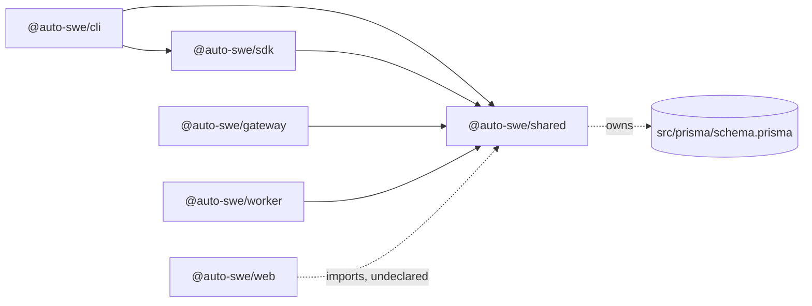
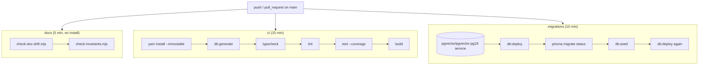

# Repository Structure and Build System

> Indexed at commit `b1d8930` on 2026-09-08 · [view on GitHub](https://github.com/yorch/auto-swe/tree/b1d8930)

## Relevant source files

- [package.json](https://github.com/yorch/auto-swe/blob/b1d8930/package.json)
- [.yarnrc.yml](https://github.com/yorch/auto-swe/blob/b1d8930/.yarnrc.yml)
- [tsconfig.base.json](https://github.com/yorch/auto-swe/blob/b1d8930/tsconfig.base.json)
- [vitest.config.ts](https://github.com/yorch/auto-swe/blob/b1d8930/vitest.config.ts)
- [biome.json](https://github.com/yorch/auto-swe/blob/b1d8930/biome.json)
- [scripts/check-doc-drift.mjs](https://github.com/yorch/auto-swe/blob/b1d8930/scripts/check-doc-drift.mjs)
- [scripts/check-invariants.mjs](https://github.com/yorch/auto-swe/blob/b1d8930/scripts/check-invariants.mjs)
- [.github/workflows/ci.yml](https://github.com/yorch/auto-swe/blob/b1d8930/.github/workflows/ci.yml)
- [.github/workflows/docker.yml](https://github.com/yorch/auto-swe/blob/b1d8930/.github/workflows/docker.yml)
- [.github/workflows/build-executor.yml](https://github.com/yorch/auto-swe/blob/b1d8930/.github/workflows/build-executor.yml)
- [.github/dependabot.yml](https://github.com/yorch/auto-swe/blob/b1d8930/.github/dependabot.yml)
- [docker-compose.infra.yml](https://github.com/yorch/auto-swe/blob/b1d8930/docker-compose.infra.yml)
- [docker-compose.app.yml](https://github.com/yorch/auto-swe/blob/b1d8930/docker-compose.app.yml)
- [docker-compose.prod.yml](https://github.com/yorch/auto-swe/blob/b1d8930/docker-compose.prod.yml)
- [docker-compose.traefik.yml](https://github.com/yorch/auto-swe/blob/b1d8930/docker-compose.traefik.yml)
- [packages/shared/package.json](https://github.com/yorch/auto-swe/blob/b1d8930/packages/shared/package.json)
- [packages/gateway/package.json](https://github.com/yorch/auto-swe/blob/b1d8930/packages/gateway/package.json)
- [packages/worker/package.json](https://github.com/yorch/auto-swe/blob/b1d8930/packages/worker/package.json)
- [packages/web/package.json](https://github.com/yorch/auto-swe/blob/b1d8930/packages/web/package.json)
- [packages/cli/package.json](https://github.com/yorch/auto-swe/blob/b1d8930/packages/cli/package.json)
- [packages/sdk/package.json](https://github.com/yorch/auto-swe/blob/b1d8930/packages/sdk/package.json)
- [packages/web/tsconfig.json](https://github.com/yorch/auto-swe/blob/b1d8930/packages/web/tsconfig.json)
- [packages/gateway/Dockerfile](https://github.com/yorch/auto-swe/blob/b1d8930/packages/gateway/Dockerfile)
- [infra/scripts/setup-postgres.sh](https://github.com/yorch/auto-swe/blob/b1d8930/infra/scripts/setup-postgres.sh)
- [infra/garage/garage.toml](https://github.com/yorch/auto-swe/blob/b1d8930/infra/garage/garage.toml)

## Overview

auto-swe is a private, unpublished Yarn 4 monorepo. The root `package.json` declares a single workspace glob, `packages/*`, and every script it exposes is a thin delegation into one workspace or a `docker compose` invocation, so the root package carries no source of its own — only `@biomejs/biome`, `vitest`, `@vitest/coverage-v8`, and `tsx` as development dependencies ([package.json:L5-L7](https://github.com/yorch/auto-swe/blob/b1d8930/package.json#L5-L7), [package.json:L48-L55](https://github.com/yorch/auto-swe/blob/b1d8930/package.json#L48-L55)).

Three tools own the whole repository rather than one workspace each: Vitest runs every test from a single root config, Biome lints and formats every file from a single root config, and two hand-written Node scripts under `scripts/` enforce rules the compiler and the test suite cannot state. The runtime floor is Node 26, pinned by `engines` in the root manifest and by `.node-version`, which the GitHub Actions workflows read through `node-version-file` ([package.json:L42-L44](https://github.com/yorch/auto-swe/blob/b1d8930/package.json#L42-L44), [.github/workflows/ci.yml:L31-L34](https://github.com/yorch/auto-swe/blob/b1d8930/.github/workflows/ci.yml#L31-L34)).

## Architecture

Every workspace edge in the repository points at `@auto-swe/shared`, which is the only package other workspaces depend on: `@auto-swe/gateway`, `@auto-swe/worker`, `@auto-swe/sdk`, and `@auto-swe/cli` each declare `"@auto-swe/shared": "workspace:*"`, and `@auto-swe/cli` additionally depends on `@auto-swe/sdk`. `@auto-swe/web` is the exception — its manifest declares no workspace dependency at all, while 60 files under `packages/web/src` import `@auto-swe/shared` subpaths, resolving through the hoisted root `node_modules` that the `node-modules` linker creates.

Sources: [packages/gateway/package.json:L12-L39](https://github.com/yorch/auto-swe/blob/b1d8930/packages/gateway/package.json#L12-L39) [packages/cli/package.json:L16-L19](https://github.com/yorch/auto-swe/blob/b1d8930/packages/cli/package.json#L16-L19) [packages/sdk/package.json:L18-L20](https://github.com/yorch/auto-swe/blob/b1d8930/packages/sdk/package.json#L18-L20) [packages/web/package.json:L11-L27](https://github.com/yorch/auto-swe/blob/b1d8930/packages/web/package.json#L11-L27) [packages/web/src/app/page.tsx#L3](https://github.com/yorch/auto-swe/blob/b1d8930/packages/web/src/app/page.tsx#L3)

## Module Layout

| Module | Path | Responsibility |
| --- | --- | --- |
| `@auto-swe/shared` | `packages/shared` | Prisma schema and client, workflow spec and interpreter, config registry, built-in skills and scanner patterns |
| `@auto-swe/gateway` | `packages/gateway` | Fastify 5 HTTP API, auth, webhooks; built with `tsc`, started as `node dist/index.js` |
| `@auto-swe/worker` | `packages/worker` | Temporal worker, activities, Mastra agents, Docker workspaces |
| `@auto-swe/web` | `packages/web` | Next.js 16 dashboard; the only workspace built by a framework CLI rather than `tsc` |
| `@auto-swe/cli` | `packages/cli` | `auto-swe` binary, published from `dist/index.js` via the `bin` field |
| `@auto-swe/sdk` | `packages/sdk` | Bundle authoring helpers over `@auto-swe/shared/bundle`; a single `src/index.ts` plus its test |

`@auto-swe/shared` is also the only workspace with a large `exports` map: 65 entries pin the barrel and each public subpath to a compiled file under `dist/`, which is why consumers import `@auto-swe/shared/config` or `@auto-swe/shared/workflow/interpreter` rather than reaching through the barrel. It owns the Prisma configuration too, declaring the schema at `src/prisma/schema.prisma` and the seed command in a `prisma` block.

Sources: [packages/shared/package.json:L8-L73](https://github.com/yorch/auto-swe/blob/b1d8930/packages/shared/package.json#L8-L73) [packages/shared/package.json:L107-L110](https://github.com/yorch/auto-swe/blob/b1d8930/packages/shared/package.json#L107-L110) [packages/cli/package.json:L6-L15](https://github.com/yorch/auto-swe/blob/b1d8930/packages/cli/package.json#L6-L15) [packages/web/package.json:L5-L10](https://github.com/yorch/auto-swe/blob/b1d8930/packages/web/package.json#L5-L10) [packages/sdk/package.json:L8-L17](https://github.com/yorch/auto-swe/blob/b1d8930/packages/sdk/package.json#L8-L17)

## Package Manager Configuration

`.yarnrc.yml` pins the Yarn release to the vendored `.yarn/releases/yarn-4.18.0.cjs` through `yarnPath` and selects `nodeLinker: node-modules`, so dependencies hoist into a conventional `node_modules` tree instead of Plug'n'Play. The same file enables install scripts, disables telemetry, approves all git repositories as dependency sources, discards the `YN0060` and `YN0086` log codes, and sets `npmMinimalAgeGate: 3` ([.yarnrc.yml:L1-L18](https://github.com/yorch/auto-swe/blob/b1d8930/.yarnrc.yml#L1-L18)).

`yarnPath` being the single place the version is written has a consequence the Dockerfiles depend on. `node:26` ships no Corepack and therefore no `yarn` command, so each build stage writes a two-line shim to `/usr/local/bin/yarn` that reads `yarnPath` out of `.yarnrc.yml` and execs the vendored release. The comment above it records why a glob over `.yarn/releases` was rejected: a second release file left behind by `yarn set version` becomes `argv[1]` and breaks every real subcommand while `yarn --version` still answers ([packages/gateway/Dockerfile:L5-L27](https://github.com/yorch/auto-swe/blob/b1d8930/packages/gateway/Dockerfile#L5-L27)).

The same gap shapes CI. `actions/setup-node` extracts a plain Node distribution with no Corepack and no yarn shim, so the `yarn` that runs on the runner is the preinstalled Yarn Classic, which reads `yarnPath` and execs Yarn 4.18.0. Because `cache: yarn` probes `yarn --version` inside the setup step, any fix for a missing yarn has to precede `setup-node` rather than follow it ([.github/workflows/ci.yml:L55-L72](https://github.com/yorch/auto-swe/blob/b1d8930/.github/workflows/ci.yml#L55-L72)).

Sources: [.yarnrc.yml:L1-L18](https://github.com/yorch/auto-swe/blob/b1d8930/.yarnrc.yml#L1-L18) [packages/gateway/Dockerfile:L1-L53](https://github.com/yorch/auto-swe/blob/b1d8930/packages/gateway/Dockerfile#L1-L53) [.github/workflows/ci.yml:L47-L90](https://github.com/yorch/auto-swe/blob/b1d8930/.github/workflows/ci.yml#L47-L90)

## Root Script Catalog

| Script | Command | Purpose |
| --- | --- | --- |
| `build` | `yarn workspaces foreach -At run build` | Builds every workspace in topological order |
| `typecheck` | `foreach -At --exclude @auto-swe/web run build` then `foreach -A run typecheck` | Builds declarations for the non-web workspaces so their `.d.ts` files exist, then type-checks all six |
| `dev` | `yarn workspaces foreach -Api run dev` | Runs every workspace dev server in parallel and interleaved |
| `dev:gateway` / `dev:worker` / `dev:web` | `yarn workspace <pkg> dev` | Single-service dev loops |
| `db:migrate` / `db:deploy` / `db:generate` / `db:reset` / `db:push` / `db:studio` | delegate to `@auto-swe/shared` | Prisma commands against `src/prisma/schema.prisma` |
| `db:seed` | shared `build` + `prisma db seed` + `db:seed:auth` | Seeds library content, then provisions the admin's better-auth credential |
| `docker:infra:*` / `docker:app:*` | `run docker:infra …` / `run docker:app …` | Compose wrappers; the base `docker:infra` and `docker:app` scripts hold the `-f` file lists |
| `test` / `test:watch` | `vitest run` / `vitest` | Root Vitest suite |
| `lint` / `lint:fix` / `format` | `biome check .` / `biome check . --write` / `biome format . --write` | Lint and format |
| `docs:check` / `invariants:check` | `node scripts/check-doc-drift.mjs` / `node scripts/check-invariants.mjs` | The two custom gates |
| `postinstall` | `yarn db:generate` | Regenerates the Prisma client after every install |

The `docker:*` family works by re-entering `yarn run`: `docker:infra` is the bare `docker compose -f docker-compose.infra.yml`, and `docker:infra:up` is `run docker:infra up -d`, which appends its own arguments. `docker:app` composes both files, so `yarn docker:app:up` brings up infrastructure and applications together ([package.json:L24-L32](https://github.com/yorch/auto-swe/blob/b1d8930/package.json#L24-L32)).

Sources: [package.json:L8-L41](https://github.com/yorch/auto-swe/blob/b1d8930/package.json#L8-L41) [packages/shared/package.json:L74-L87](https://github.com/yorch/auto-swe/blob/b1d8930/packages/shared/package.json#L74-L87)

## TypeScript Configuration

`tsconfig.base.json` holds the settings five of the six workspaces inherit: `strict`, `target` and `lib` at ES2022, `module` and `moduleResolution` at Node16, declaration output with declaration maps and source maps, `rootDir: src`, and `outDir: dist` ([tsconfig.base.json:L1-L18](https://github.com/yorch/auto-swe/blob/b1d8930/tsconfig.base.json#L1-L18)). The per-workspace files are correspondingly thin — `packages/gateway/tsconfig.json` and `packages/worker/tsconfig.json` are eight lines each, restating only `outDir`, `rootDir`, and `include`. `packages/shared/tsconfig.json` adds one exclusion, `src/prisma/migrations`, and `packages/cli` and `packages/sdk` each pin `types: ["node"]`.

`packages/web/tsconfig.json` does not extend the base at all. It is a standalone Next.js configuration: `noEmit`, `moduleResolution: bundler`, `jsx: react-jsx`, `lib` including the DOM, the `next` TypeScript plugin, and a `@/*` path alias onto `./src/*` ([packages/web/tsconfig.json:L1-L33](https://github.com/yorch/auto-swe/blob/b1d8930/packages/web/tsconfig.json#L1-L33)). That divergence is why the root `typecheck` script excludes web from its build pass and then type-checks it alongside the others — web emits nothing, so building it would mean running `next build`.

Sources: [tsconfig.base.json:L1-L18](https://github.com/yorch/auto-swe/blob/b1d8930/tsconfig.base.json#L1-L18) [packages/web/tsconfig.json:L1-L33](https://github.com/yorch/auto-swe/blob/b1d8930/packages/web/tsconfig.json#L1-L33) [package.json:L10](https://github.com/yorch/auto-swe/blob/b1d8930/package.json#L10)

## Test Runner

A single `vitest.config.ts` at the root runs the whole suite. Test discovery covers `packages/*/src/**/*.test.ts` and `.test.tsx`, and `root` is anchored to `__dirname` so the correct files are found regardless of the directory Vitest is invoked from ([vitest.config.ts:L256-L267](https://github.com/yorch/auto-swe/blob/b1d8930/vitest.config.ts#L256-L267)). The default environment is `node`; React component tests opt into jsdom with a `// @vitest-environment jsdom` pragma per file rather than through config, a choice the comment attributes to `environmentMatchGlobs` having been replaced by the `projects` API.

The bulk of the file is the `resolve.alias` list, which maps each `@auto-swe/shared` subpath to its TypeScript source so tests need no prior build. It uses the array form because Vite's prefix matching is order-sensitive, and two ordering hazards are called out in comments: every subpath alias must precede the bare `@auto-swe/shared` catch-all, and `repoDependencyResolver` and `repoDependencyMatch` must precede `repoDependency`, of which they are extensions ([vitest.config.ts:L5-L9](https://github.com/yorch/auto-swe/blob/b1d8930/vitest.config.ts#L5-L9), [vitest.config.ts:L98-L111](https://github.com/yorch/auto-swe/blob/b1d8930/vitest.config.ts#L98-L111)). Two aliases are deliberately broad — `@auto-swe/shared/lib/integrations` and `@auto-swe/shared/config` point at directories so future subpaths need no new entry. A final regex alias mirrors the web package's `@/*` mapping, which Next.js reads from tsconfig but Vitest does not.

`test.env` sets a dummy `DATABASE_URL` when the environment supplies none, because modules such as `@auto-swe/shared/db` construct a `PrismaClient` at import time; the client connects lazily, so the placeholder only satisfies the import-time guard ([vitest.config.ts:L248-L255](https://github.com/yorch/auto-swe/blob/b1d8930/vitest.config.ts#L248-L255)).

Coverage uses the v8 provider over `packages/*/src/**/*.ts`, excluding tests, migrations, the generated Prisma client, `.d.ts` files, barrel `index.ts` files, and the seed. The thresholds sit a few points under measured coverage of hand-written code so a regression fails CI without the floor being brittle:

| Metric | Threshold |
| --- | --- |
| `statements` | 57 |
| `lines` | 57 |
| `branches` | 51 |
| `functions` | 47 |

Sources: [vitest.config.ts:L229-L247](https://github.com/yorch/auto-swe/blob/b1d8930/vitest.config.ts#L229-L247) [vitest.config.ts:L4-L228](https://github.com/yorch/auto-swe/blob/b1d8930/vitest.config.ts#L4-L228)

## Lint and Format

`biome.json` is marked `root: true` and is the only lint or format configuration in the repository — there is no ESLint or Prettier config. Formatting is two-space indentation, LF endings, and a line width of 100; JavaScript formatting uses single quotes, double quotes in JSX, mandatory semicolons, and ES5 trailing commas ([biome.json:L42-L61](https://github.com/yorch/auto-swe/blob/b1d8930/biome.json#L42-L61)). Import organization and sorted keys, attributes, and properties run as assist actions ([biome.json:L3-L12](https://github.com/yorch/auto-swe/blob/b1d8930/biome.json#L3-L12)).

The linter enables the recommended preset and escalates a specific set: `noExplicitAny` and `noCatchAssign` under `suspicious`, `noNonNullAssertion`, `useBlockStatements`, `useConsistentArrowReturn`, and `useConst` under `style`, and eight `complexity` rules ([biome.json:L62-L88](https://github.com/yorch/auto-swe/blob/b1d8930/biome.json#L62-L88)). Three overrides narrow the rules by path: `package.json` files are exempt from key and property sorting, `packages/worker/src/workflows/**` raises `useImportType` to an error because those files execute in a Temporal V8 isolate, and one web component disables `noDangerouslySetInnerHtml` ([biome.json:L89-L121](https://github.com/yorch/auto-swe/blob/b1d8930/biome.json#L89-L121)).

Biome reads the git ignore file (`vcs.useIgnoreFile`) and additionally excludes build output, `.yarn`, `coverage`, `tmp`, the generated Prisma client, Prisma migrations, and the lockfile ([biome.json:L21-L41](https://github.com/yorch/auto-swe/blob/b1d8930/biome.json#L21-L41)).

Sources: [biome.json:L1-L128](https://github.com/yorch/auto-swe/blob/b1d8930/biome.json#L1-L128)

## Custom CI Gates

Two Node scripts under `scripts/` run with no dependencies and no install, which is why CI invokes them directly with `node` rather than through a yarn script — Yarn 4 refuses to run a script before `yarn install` ([.github/workflows/ci.yml:L36-L45](https://github.com/yorch/auto-swe/blob/b1d8930/.github/workflows/ci.yml#L36-L45)).

`scripts/check-doc-drift.mjs` is the larger of the two at 849 lines and describes itself as the compiler for prose. It derives facts from source — workflow node types from the `NodeSchema` union, `model` declarations in the Prisma schema, `BUILTIN_SKILLS` entries, scanner patterns counted per type, seeded agents split by whether they carry `modelSpec` or `inheritsModelFrom`, and `IMPLEMENTER_TOOL_IDS` entries — then fails on any living doc that states a different number ([scripts/check-doc-drift.mjs:L51-L114](https://github.com/yorch/auto-swe/blob/b1d8930/scripts/check-doc-drift.mjs#L51-L114)). It runs six further families of check:

| Check | Derived from |
| --- | --- |
| Countable claims | `spec.ts`, `schema.prisma`, `skills/index.ts`, `scannerPatterns/index.ts`, `syncBuiltins.ts`, `stepRegistry.ts` |
| Dependency versions | every workspace `package.json`; a truncated claim passes as a dot-boundary prefix |
| Container image tags | the compose files' `${VAR:-tag}` defaults, plus `.node-version` and the `workspaceImage` fallback |
| Forbidden status prose | eleven regexes covering phase labels, PR numbers, `now shipped`, and roadmap promises |
| Missing `## Limitations` sections | every doc under `docs/` except a five-entry exempt list of runbooks |
| Setting keys named in prose | `SETTING_DEFINITIONS` in `config/registry.ts` |
| Broken relative `.md` links and anchors | the filesystem, scanning the whole tree including `docs/history/` |

The gap check is an exempt list rather than an allowlist, so a newly added doc is covered by default and skipping one is a reviewable edit; a listed doc that no longer exists is itself reported as a stale exemption ([scripts/check-doc-drift.mjs:L587-L622](https://github.com/yorch/auto-swe/blob/b1d8930/scripts/check-doc-drift.mjs#L587-L622)). The prose check strips backticked and quoted spans before matching so the conventions document can quote the phrases it bans ([scripts/check-doc-drift.mjs:L437-L465](https://github.com/yorch/auto-swe/blob/b1d8930/scripts/check-doc-drift.mjs#L437-L465)). Link checking reimplements GitHub's heading-slug algorithm, including the detail that runs of spaces are not collapsed ([scripts/check-doc-drift.mjs:L665-L695](https://github.com/yorch/auto-swe/blob/b1d8930/scripts/check-doc-drift.mjs#L665-L695)).

`scripts/check-invariants.mjs` is the same idea aimed at source instead of prose, and it enforces exactly two rules, each added after the corresponding bug shipped past a green suite. The first walks `packages/worker/src` for `createWorkspace(` calls and rejects a quoted string in the fourth argument position, because `createWorkspace` resolves `image ?? cfg.workspaceImage` and a literal there wins the coalesce, making the operator's configured image unreachable; a named constant is allowed ([scripts/check-invariants.mjs:L97-L124](https://github.com/yorch/auto-swe/blob/b1d8930/scripts/check-invariants.mjs#L97-L124)). The second splits each `packages/*/Dockerfile` into `FROM` stages and requires that any stage invoking `yarn` provisions one first, and that no other stage does — `node:26` ships neither Corepack nor yarn, so a stage without the shim exits 127 at build time, and a shim in a runtime stage is dead weight ([scripts/check-invariants.mjs:L143-L201](https://github.com/yorch/auto-swe/blob/b1d8930/scripts/check-invariants.mjs#L143-L201)). Both scripts print their derived facts on success and a per-violation explanation on failure before exiting non-zero.

Sources: [scripts/check-doc-drift.mjs:L1-L849](https://github.com/yorch/auto-swe/blob/b1d8930/scripts/check-doc-drift.mjs#L1-L849) [scripts/check-invariants.mjs:L1-L223](https://github.com/yorch/auto-swe/blob/b1d8930/scripts/check-invariants.mjs#L1-L223)

## Continuous Integration

`ci.yml` runs three independent jobs on every push and pull request against `main`, with `cancel-in-progress` concurrency ([.github/workflows/ci.yml:L1-L18](https://github.com/yorch/auto-swe/blob/b1d8930/.github/workflows/ci.yml#L1-L18)). The `ci` job sets an intentionally unreachable `DATABASE_URL` because all Prisma access in unit tests is mocked; the `migrations` job exists precisely because of that, applying every migration to a real `pgvector/pgvector:pg18` service, verifying with `prisma migrate status` that the committed migrations match `schema.prisma`, running the full seed, and re-applying the migrations as an idempotency check ([.github/workflows/ci.yml:L92-L157](https://github.com/yorch/auto-swe/blob/b1d8930/.github/workflows/ci.yml#L92-L157)). The deploy path uses `prisma migrate deploy` rather than `migrate dev`, which would try to generate a migration on drift and drop the hand-written HNSW index.

`docker.yml` builds and publishes three images — gateway, web, and worker — from a matrix emitted by a `setup` job ([.github/workflows/docker.yml:L38-L50](https://github.com/yorch/auto-swe/blob/b1d8930/.github/workflows/docker.yml#L38-L50)). Pull requests run a `build` job that builds each image without pushing; pushes to `main` or a `v*` tag run a `checks` job followed by `publish`. The `checks` job repeats typecheck, lint, test, build, and the documentation-drift script, on the stated reasoning that the publish gate should not be looser than the pull-request gate; it does not run the invariants script, and it adds an advisory `yarn npm audit` that never fails the job ([.github/workflows/docker.yml:L52-L108](https://github.com/yorch/auto-swe/blob/b1d8930/.github/workflows/docker.yml#L52-L108)). Images are tagged with a commit timestamp and short SHA, the branch or tag ref, and `latest` on the default branch, and are pushed to GitHub Container Registry plus an optional external registry configured through repository variables ([.github/workflows/docker.yml:L184-L243](https://github.com/yorch/auto-swe/blob/b1d8930/.github/workflows/docker.yml#L184-L243)). `BUILD_PLATFORMS` is `linux/amd64` only: arm64 is disabled because under QEMU the gateway image's `yarn workspaces focus --production` step dies with exit 132, while web and worker build on both architectures ([.github/workflows/docker.yml:L16-L28](https://github.com/yorch/auto-swe/blob/b1d8930/.github/workflows/docker.yml#L16-L28)).

`build-executor.yml` is a separate, operator-triggered pipeline that builds per-repository agent executor images. It accepts a repository UUID through `workflow_dispatch` or `repository_dispatch`, fetches that repository's organization and name from the gateway API, uses the target repository's `.auto-swe/Dockerfile` or falls back to `defaults/Dockerfile.node` from the control-plane repository, pushes to Amazon ECR under OIDC credentials, and PATCHes the resulting tag back onto the repository record as `executorImage`. A weekly cron trigger carries no repository id, so every step is gated on one being present and the scheduled run ends green as a no-op ([.github/workflows/build-executor.yml:L25-L134](https://github.com/yorch/auto-swe/blob/b1d8930/.github/workflows/build-executor.yml#L25-L134)).

Dependabot watches three ecosystems weekly: GitHub Actions at the root, Docker for the three package directories that hold Dockerfiles, and `docker-compose` at the root, where it updates the default inside each `${VAR:-default}` tag expression ([.github/dependabot.yml:L1-L22](https://github.com/yorch/auto-swe/blob/b1d8930/.github/dependabot.yml#L1-L22)).

Sources: [.github/workflows/ci.yml:L1-L157](https://github.com/yorch/auto-swe/blob/b1d8930/.github/workflows/ci.yml#L1-L157) [.github/workflows/docker.yml:L1-L243](https://github.com/yorch/auto-swe/blob/b1d8930/.github/workflows/docker.yml#L1-L243) [.github/workflows/build-executor.yml:L1-L134](https://github.com/yorch/auto-swe/blob/b1d8930/.github/workflows/build-executor.yml#L1-L134) [.github/dependabot.yml:L1-L22](https://github.com/yorch/auto-swe/blob/b1d8930/.github/dependabot.yml#L1-L22)

## Docker Compose Layout

Five compose files divide by role, and only the infrastructure file is runnable on its own.

| File | Role | Contents |
| --- | --- | --- |
| `docker-compose.infra.yml` | Base, standalone | `postgres` (pgvector), `postgres-temporal`, `temporal-setup`, `temporal`, `temporal-setup-namespace`, `temporal-ui`, `garage` |
| `docker-compose.app.yml` | Local dev overlay | `gateway`, `worker`, `web` built from source, plus `otel-lgtm` |
| `docker-compose.prod.yml` | Production overlay | The same three services pulled from `ghcr.io`, with mandatory secrets |
| `docker-compose.traefik.yml` | Ingress overlay | Clears published ports with `!reset` and attaches Traefik router labels |
| `docker-compose.watchtower.yml` | Auto-update overlay | A pinned `watchtower` container plus enable and scope labels |

The application overlay states in its first lines that it is not runnable standalone, because its services reference `postgres` and `temporal` from the infrastructure file; `yarn docker:app:up` therefore passes both `-f` flags ([docker-compose.app.yml:L1-L11](https://github.com/yorch/auto-swe/blob/b1d8930/docker-compose.app.yml#L1-L11)). Temporal is assembled from parts rather than the `auto-setup` image: a one-shot `temporal-setup` container runs `temporal-sql-tool` against its own dedicated Postgres to create and version the `temporal` and `temporal_visibility` databases, and a second one-shot container creates the default namespace once the server reports healthy ([docker-compose.infra.yml:L66-L129](https://github.com/yorch/auto-swe/blob/b1d8930/docker-compose.infra.yml#L66-L129), [infra/scripts/setup-postgres.sh:L14-L23](https://github.com/yorch/auto-swe/blob/b1d8930/infra/scripts/setup-postgres.sh#L14-L23)). The Temporal UI container listens on 8080 internally and is mapped to host 8233 to avoid colliding with the gateway.

The object store sits behind an `objectstore` Compose profile so a deployment using hosted S3 can drop it by clearing `COMPOSE_PROFILES`, and the worker's `depends_on` for it is `required: false` for the same reason ([docker-compose.infra.yml:L146-L162](https://github.com/yorch/auto-swe/blob/b1d8930/docker-compose.infra.yml#L146-L162), [docker-compose.prod.yml:L75-L80](https://github.com/yorch/auto-swe/blob/b1d8930/docker-compose.prod.yml#L75-L80)). Garage's committed configuration omits `rpc_secret` deliberately and reads it from the environment, because Garage refuses to start on a world-readable secrets file ([infra/garage/garage.toml:L9-L13](https://github.com/yorch/auto-swe/blob/b1d8930/infra/garage/garage.toml#L9-L13)).

The credential split between the dev and production paths is the sharpest distinction between the overlays. The infrastructure file carries `:-` fallbacks so the quickstart works with no configuration, and the production overlay makes `POSTGRES_PASSWORD`, `ARTIFACT_S3_ACCESS_KEY`, and `ARTIFACT_S3_SECRET_KEY` mandatory with `:?`, which surfaces a missing value as a Compose error at `up` time. Because those same variables feed the infrastructure services, the production path cannot come up on the dev defaults ([docker-compose.infra.yml:L1-L25](https://github.com/yorch/auto-swe/blob/b1d8930/docker-compose.infra.yml#L1-L25), [docker-compose.prod.yml:L1-L11](https://github.com/yorch/auto-swe/blob/b1d8930/docker-compose.prod.yml#L1-L11)). Artifact-store credentials are named `ARTIFACT_S3_*` on the outside and mapped to `AWS_ACCESS_KEY_ID` and `AWS_SECRET_ACCESS_KEY` inside the container, so an ambient AWS credential in the operator's shell cannot silently take precedence over `.env` ([docker-compose.app.yml:L80-L83](https://github.com/yorch/auto-swe/blob/b1d8930/docker-compose.app.yml#L80-L83)).

Sources: [docker-compose.infra.yml:L1-L195](https://github.com/yorch/auto-swe/blob/b1d8930/docker-compose.infra.yml#L1-L195) [docker-compose.app.yml:L1-L116](https://github.com/yorch/auto-swe/blob/b1d8930/docker-compose.app.yml#L1-L116) [docker-compose.prod.yml:L1-L94](https://github.com/yorch/auto-swe/blob/b1d8930/docker-compose.prod.yml#L1-L94) [docker-compose.traefik.yml:L1-L32](https://github.com/yorch/auto-swe/blob/b1d8930/docker-compose.traefik.yml#L1-L32) [infra/garage/garage.toml:L1-L37](https://github.com/yorch/auto-swe/blob/b1d8930/infra/garage/garage.toml#L1-L37)

## Image Builds

Three workspaces ship Docker images, each from a three-stage build. `packages/gateway/Dockerfile` is representative: a builder stage installs with `yarn workspaces focus auto-swe @auto-swe/shared @auto-swe/gateway` and compiles both packages, a `prod-deps` stage runs `yarn workspaces focus @auto-swe/gateway --production` to strip development dependencies, and a runtime stage copies the production tree, the generated Prisma client, the compiled `dist/` output, the workspace manifests, and the schema and migrations needed for migrate-on-boot ([packages/gateway/Dockerfile:L1-L134](https://github.com/yorch/auto-swe/blob/b1d8930/packages/gateway/Dockerfile#L1-L134)).

Two details in that file are load-bearing and recorded in its comments. The Prisma schema must be copied before `yarn install` runs, because the root `postinstall` invokes `prisma generate`, and the generated client lands at a custom path under `packages/shared/src/generated/prisma` rather than `node_modules/.prisma` ([packages/gateway/Dockerfile:L37-L41](https://github.com/yorch/auto-swe/blob/b1d8930/packages/gateway/Dockerfile#L37-L41), [packages/gateway/Dockerfile:L103-L109](https://github.com/yorch/auto-swe/blob/b1d8930/packages/gateway/Dockerfile#L103-L109)). Ownership is set per `COPY` with `--chown` rather than by a trailing recursive `chown`, which had stored the entire tree twice and cost roughly 450 MB ([packages/gateway/Dockerfile:L145-L154](https://github.com/yorch/auto-swe/blob/b1d8930/packages/gateway/Dockerfile#L145-L154)).

Sources: [packages/gateway/Dockerfile:L1-L159](https://github.com/yorch/auto-swe/blob/b1d8930/packages/gateway/Dockerfile#L1-L159)

## Related Pages

- Shared library: [@auto-swe/shared](./2-shared-library.md)
- Gateway API: [@auto-swe/gateway](./3-gateway-api.md)
- Temporal worker: [@auto-swe/worker](./4-temporal-worker.md)
- Web dashboard: [@auto-swe/web](./5-web-dashboard.md)
- CLI: [@auto-swe/cli](./6-cli.md)
- Bundle SDK: [@auto-swe/sdk](./7-bundle-sdk.md)
