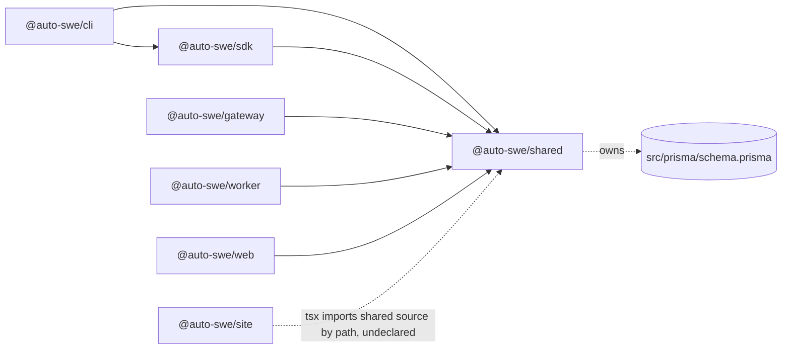
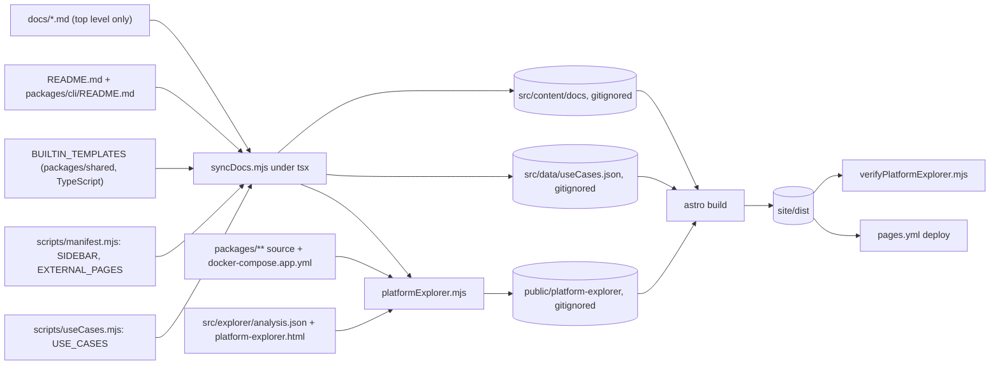
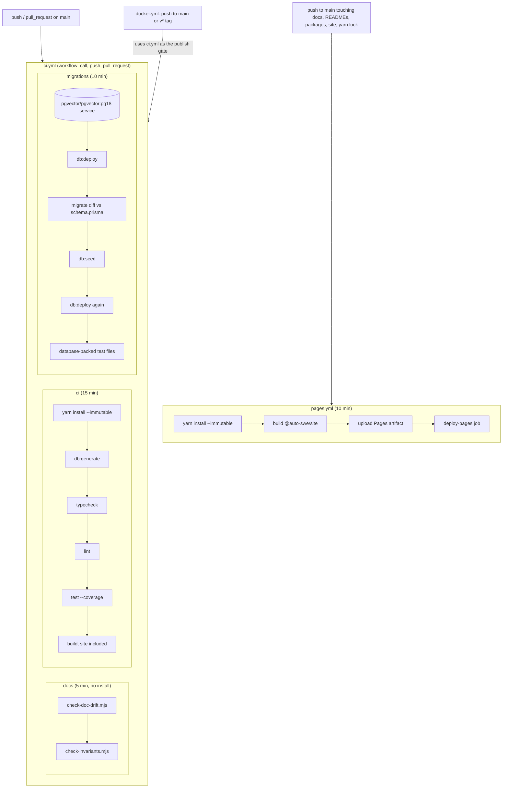

# Repository Structure and Build System

> Indexed at commit `ae416937` on 2026-10-03 · [view on GitHub](https://github.com/yorch/auto-swe/tree/ae416937)

## Relevant source files

- [package.json](https://github.com/yorch/auto-swe/blob/ae416937/package.json)
- [.yarnrc.yml](https://github.com/yorch/auto-swe/blob/ae416937/.yarnrc.yml)
- [.env.example](https://github.com/yorch/auto-swe/blob/ae416937/.env.example)
- [tsconfig.base.json](https://github.com/yorch/auto-swe/blob/ae416937/tsconfig.base.json)
- [vitest.config.ts](https://github.com/yorch/auto-swe/blob/ae416937/vitest.config.ts)
- [biome.json](https://github.com/yorch/auto-swe/blob/ae416937/biome.json)
- [scripts/check-doc-drift.mjs](https://github.com/yorch/auto-swe/blob/ae416937/scripts/check-doc-drift.mjs)
- [scripts/check-invariants.mjs](https://github.com/yorch/auto-swe/blob/ae416937/scripts/check-invariants.mjs)
- [.github/workflows/ci.yml](https://github.com/yorch/auto-swe/blob/ae416937/.github/workflows/ci.yml)
- [.github/workflows/docker.yml](https://github.com/yorch/auto-swe/blob/ae416937/.github/workflows/docker.yml)
- [.github/workflows/pages.yml](https://github.com/yorch/auto-swe/blob/ae416937/.github/workflows/pages.yml)
- [.github/workflows/build-executor.yml](https://github.com/yorch/auto-swe/blob/ae416937/.github/workflows/build-executor.yml)
- [.github/dependabot.yml](https://github.com/yorch/auto-swe/blob/ae416937/.github/dependabot.yml)
- [docker-compose.infra.yml](https://github.com/yorch/auto-swe/blob/ae416937/docker-compose.infra.yml)
- [docker-compose.app.yml](https://github.com/yorch/auto-swe/blob/ae416937/docker-compose.app.yml)
- [docker-compose.prod.yml](https://github.com/yorch/auto-swe/blob/ae416937/docker-compose.prod.yml)
- [docker-compose.traefik.yml](https://github.com/yorch/auto-swe/blob/ae416937/docker-compose.traefik.yml)
- [packages/shared/package.json](https://github.com/yorch/auto-swe/blob/ae416937/packages/shared/package.json)
- [packages/gateway/package.json](https://github.com/yorch/auto-swe/blob/ae416937/packages/gateway/package.json)
- [packages/worker/package.json](https://github.com/yorch/auto-swe/blob/ae416937/packages/worker/package.json)
- [packages/web/package.json](https://github.com/yorch/auto-swe/blob/ae416937/packages/web/package.json)
- [packages/cli/package.json](https://github.com/yorch/auto-swe/blob/ae416937/packages/cli/package.json)
- [packages/sdk/package.json](https://github.com/yorch/auto-swe/blob/ae416937/packages/sdk/package.json)
- [site/package.json](https://github.com/yorch/auto-swe/blob/ae416937/site/package.json)
- [site/tsconfig.json](https://github.com/yorch/auto-swe/blob/ae416937/site/tsconfig.json)
- [site/astro.config.mjs](https://github.com/yorch/auto-swe/blob/ae416937/site/astro.config.mjs)
- [site/scripts/manifest.mjs](https://github.com/yorch/auto-swe/blob/ae416937/site/scripts/manifest.mjs)
- [site/scripts/syncDocs.mjs](https://github.com/yorch/auto-swe/blob/ae416937/site/scripts/syncDocs.mjs)
- [site/scripts/useCasePages.mjs](https://github.com/yorch/auto-swe/blob/ae416937/site/scripts/useCasePages.mjs)
- [site/scripts/platformExplorer.mjs](https://github.com/yorch/auto-swe/blob/ae416937/site/scripts/platformExplorer.mjs)
- [site/scripts/reviewPlatformExplorer.mjs](https://github.com/yorch/auto-swe/blob/ae416937/site/scripts/reviewPlatformExplorer.mjs)
- [site/scripts/verifyPlatformExplorer.mjs](https://github.com/yorch/auto-swe/blob/ae416937/site/scripts/verifyPlatformExplorer.mjs)
- [packages/web/tsconfig.json](https://github.com/yorch/auto-swe/blob/ae416937/packages/web/tsconfig.json)
- [packages/gateway/Dockerfile](https://github.com/yorch/auto-swe/blob/ae416937/packages/gateway/Dockerfile)
- [packages/web/Dockerfile](https://github.com/yorch/auto-swe/blob/ae416937/packages/web/Dockerfile)
- [packages/worker/Dockerfile](https://github.com/yorch/auto-swe/blob/ae416937/packages/worker/Dockerfile)
- [infra/scripts/setup-postgres.sh](https://github.com/yorch/auto-swe/blob/ae416937/infra/scripts/setup-postgres.sh)
- [infra/garage/garage.toml](https://github.com/yorch/auto-swe/blob/ae416937/infra/garage/garage.toml)
- [infra/grafana/provisioning/auto-swe-dashboards.yaml](https://github.com/yorch/auto-swe/blob/ae416937/infra/grafana/provisioning/auto-swe-dashboards.yaml)

## Overview

auto-swe is a private, unpublished Yarn 4 monorepo of seven workspaces. The root `package.json` declares two workspace entries, the glob `packages/*` and the single directory `site`, and every script it exposes is a thin delegation into one workspace or a `docker compose` invocation, so the root package carries no source of its own — only `@biomejs/biome`, `vitest`, `@vitest/coverage-v8`, and `tsx` as development dependencies, plus one `resolutions` pin for the PostCSS that Next resolves ([package.json:L5-L8](https://github.com/yorch/auto-swe/blob/ae416937/package.json#L5-L8), [package.json:L47-L55](https://github.com/yorch/auto-swe/blob/ae416937/package.json#L47-L55)). Six of the workspaces are the packages under `packages/`; the seventh, `@auto-swe/site`, is the public documentation site and is the only one outside that directory.

Three tools own the whole repository rather than one workspace each: Vitest runs every test from a single root config, Biome lints and formats every file from a single root config, and two hand-written Node scripts under `scripts/` enforce rules the compiler and the test suite cannot state. The runtime floor is Node 26, pinned by `engines` in the root manifest and by `.node-version`, which the GitHub Actions workflows read through `node-version-file` ([package.json:L44-L46](https://github.com/yorch/auto-swe/blob/ae416937/package.json#L44-L46), [.github/workflows/ci.yml:L37-L40](https://github.com/yorch/auto-swe/blob/ae416937/.github/workflows/ci.yml#L37-L40)).

Runtime configuration is split by who may change it. Secrets and integrations an admin edits live in the database; sign-in credentials, artifact storage, workspace sizing and the scanner time budget are environment variables read at process start, which is why `.env.example` and the compose files carry them (see [Docker Compose Layout](#docker-compose-layout)). The operator-facing description of that split is in [docs/configuration.md](https://github.com/yorch/auto-swe/blob/ae416937/docs/configuration.md).

Sources: [package.json:L1-L57](https://github.com/yorch/auto-swe/blob/ae416937/package.json#L1-L57) [site/package.json:L1-L26](https://github.com/yorch/auto-swe/blob/ae416937/site/package.json#L1-L26)

## Architecture


```mermaid
flowchart LR
    cli["@auto-swe/cli"] --> sdk["@auto-swe/sdk"]
    cli --> shared["@auto-swe/shared"]
    sdk --> shared
    gateway["@auto-swe/gateway"] --> shared
    worker["@auto-swe/worker"] --> shared
    web["@auto-swe/web"] --> shared
    site["@auto-swe/site"] -. "tsx imports shared source by path, undeclared" .-> shared

    shared -.owns.-> schema[("src/prisma/schema.prisma")]
```

Every workspace edge in the repository points at `@auto-swe/shared`, which is the only workspace others depend on: `@auto-swe/gateway`, `@auto-swe/worker`, `@auto-swe/web`, `@auto-swe/sdk`, and `@auto-swe/cli` each declare `"@auto-swe/shared": "workspace:*"`, and `@auto-swe/cli` additionally depends on `@auto-swe/sdk`. The web dashboard is the heaviest consumer: 100 files under `packages/web/src` import `@auto-swe/shared` subpaths (22 of them tests), mostly `types/api` and `workflow`, and its image build compiles `@auto-swe/shared` before `@auto-swe/web`.

`@auto-swe/site` is the one undeclared edge. Its manifest lists only Astro, Starlight, fonts, Mermaid, and `sharp`, yet its build scripts import TypeScript out of the shared package by relative path: `useCasePages.mjs` takes `BUILTIN_TEMPLATES`, and `platformExplorer.mjs` additionally takes the setting registry, the workflow spec schema, and the step registry. That is why the site's sync step runs under `tsx` rather than bare `node`, and why `site/tsconfig.json` has nothing to say about it.

Sources: [packages/gateway/package.json:L12-L13](https://github.com/yorch/auto-swe/blob/ae416937/packages/gateway/package.json#L12-L13) [packages/worker/package.json:L18](https://github.com/yorch/auto-swe/blob/ae416937/packages/worker/package.json#L18) [packages/cli/package.json:L16-L19](https://github.com/yorch/auto-swe/blob/ae416937/packages/cli/package.json#L16-L19) [packages/sdk/package.json:L18-L20](https://github.com/yorch/auto-swe/blob/ae416937/packages/sdk/package.json#L18-L20) [packages/web/package.json:L11-L12](https://github.com/yorch/auto-swe/blob/ae416937/packages/web/package.json#L11-L12) [packages/web/src/app/page.tsx:L3](https://github.com/yorch/auto-swe/blob/ae416937/packages/web/src/app/page.tsx#L3) [packages/web/Dockerfile:L65-L67](https://github.com/yorch/auto-swe/blob/ae416937/packages/web/Dockerfile#L65-L67) [site/package.json:L14-L22](https://github.com/yorch/auto-swe/blob/ae416937/site/package.json#L14-L22) [site/scripts/useCasePages.mjs:L8](https://github.com/yorch/auto-swe/blob/ae416937/site/scripts/useCasePages.mjs#L8) [site/scripts/platformExplorer.mjs:L6-L13](https://github.com/yorch/auto-swe/blob/ae416937/site/scripts/platformExplorer.mjs#L6-L13)

## Module Layout

The repository root, outside `node_modules` and generated output, is laid out as follows.

```text
auto-swe/
├── packages/
│   ├── shared/    Prisma schema, workflow spec + interpreter, config registry
│   ├── gateway/   Fastify HTTP API
│   ├── worker/    Temporal worker + Mastra agents
│   ├── web/       Next.js dashboard
│   ├── cli/       auto-swe binary
│   └── sdk/       bundle authoring helpers
├── site/          Astro Starlight docs site + platform explorer (workspace, not a package)
├── docs/          living references, rendered by both the dashboard and site/
├── scripts/       check-doc-drift.mjs, check-invariants.mjs
├── infra/         Temporal dynamic config, Garage config, setup scripts, Grafana provisioning
├── .github/       ci.yml, docker.yml, pages.yml, build-executor.yml, dependabot.yml
└── docker-compose.{infra,app,prod,traefik,watchtower}.yml
```


| Module | Path | Responsibility |
| --- | --- | --- |
| `@auto-swe/shared` | `packages/shared` | Prisma schema and client, workflow spec and interpreter, config registry, built-in skills and scanner patterns |
| `@auto-swe/gateway` | `packages/gateway` | Fastify 5 HTTP API, auth, webhooks; built with `tsc`, started as `node --import ./dist/instrument.js dist/index.js` |
| `@auto-swe/worker` | `packages/worker` | Temporal worker, activities, Mastra agents, Docker workspaces; started with the same OpenTelemetry preload |
| `@auto-swe/web` | `packages/web` | Next.js 16 dashboard; the only workspace built by a framework CLI rather than `tsc` |
| `@auto-swe/cli` | `packages/cli` | `auto-swe` binary, exposed from `dist/index.js` via the `bin` field |
| `@auto-swe/sdk` | `packages/sdk` | Bundle authoring helpers over `@auto-swe/shared/bundle`; a single `src/index.ts` plus its test |
| `@auto-swe/site` | `site` | Astro and Starlight public documentation site and generated platform explorer; built with `astro build` after a sync step, published to GitHub Pages |

`@auto-swe/shared` is also the only workspace with a large `exports` map: 86 entries pin the barrel and each public subpath to a compiled file under `dist/`, which is why consumers import `@auto-swe/shared/config` or `@auto-swe/shared/workflow/interpreter` rather than reaching through the barrel. It owns the Prisma configuration too, declaring the schema at `src/prisma/schema.prisma` and the seed command in a `prisma` block.

Sources: [packages/shared/package.json:L8-L95](https://github.com/yorch/auto-swe/blob/ae416937/packages/shared/package.json#L8-L95) [packages/shared/package.json:L131-L134](https://github.com/yorch/auto-swe/blob/ae416937/packages/shared/package.json#L131-L134) [packages/gateway/package.json:L6-L11](https://github.com/yorch/auto-swe/blob/ae416937/packages/gateway/package.json#L6-L11) [packages/worker/package.json:L6-L11](https://github.com/yorch/auto-swe/blob/ae416937/packages/worker/package.json#L6-L11) [packages/cli/package.json:L6-L15](https://github.com/yorch/auto-swe/blob/ae416937/packages/cli/package.json#L6-L15) [packages/web/package.json:L5-L10](https://github.com/yorch/auto-swe/blob/ae416937/packages/web/package.json#L5-L10) [packages/sdk/package.json:L8-L17](https://github.com/yorch/auto-swe/blob/ae416937/packages/sdk/package.json#L8-L17) [site/package.json:L1-L26](https://github.com/yorch/auto-swe/blob/ae416937/site/package.json#L1-L26)

## Package Manager Configuration

`.yarnrc.yml` pins the Yarn release to the vendored `.yarn/releases/yarn-4.18.0.cjs` through `yarnPath` and selects `nodeLinker: node-modules`, so dependencies hoist into a conventional `node_modules` tree instead of Plug'n'Play. The same file enables install scripts, disables telemetry, approves all git repositories as dependency sources, discards the `YN0060` and `YN0086` log codes, and sets `npmMinimalAgeGate: 3`. A `supportedArchitectures` block asks Yarn to install both glibc and musl variants of every native optional dependency, for the build architecture plus Linux: the worker copies a Claude Code binary into workspace containers, and a container's libc is the executor image's, not the worker's ([.yarnrc.yml:L1-L33](https://github.com/yorch/auto-swe/blob/ae416937/.yarnrc.yml#L1-L33)).

`yarnPath` being the single place the version is written has a consequence the Dockerfiles depend on. `node:26` ships no Corepack and therefore no `yarn` command, so each build stage writes a two-line shim to `/usr/local/bin/yarn` that reads `yarnPath` out of `.yarnrc.yml` and execs the vendored release. The comment above it records why a glob over `.yarn/releases` was rejected: a second release file left behind by `yarn set version` becomes `argv[1]` and breaks every real subcommand while `yarn --version` still answers ([packages/gateway/Dockerfile:L5-L27](https://github.com/yorch/auto-swe/blob/ae416937/packages/gateway/Dockerfile#L5-L27)).

The same gap shapes CI. `actions/setup-node` extracts a plain Node distribution with no Corepack and no yarn shim, so the `yarn` that runs on the runner is the preinstalled Yarn Classic, which reads `yarnPath` and execs Yarn 4.18.0. Because `cache: yarn` probes `yarn --version` inside the setup step, any fix for a missing yarn has to precede `setup-node` rather than follow it ([.github/workflows/ci.yml:L61-L78](https://github.com/yorch/auto-swe/blob/ae416937/.github/workflows/ci.yml#L61-L78)).

Sources: [.yarnrc.yml:L1-L33](https://github.com/yorch/auto-swe/blob/ae416937/.yarnrc.yml#L1-L33) [packages/gateway/Dockerfile:L1-L53](https://github.com/yorch/auto-swe/blob/ae416937/packages/gateway/Dockerfile#L1-L53) [.github/workflows/ci.yml:L53-L96](https://github.com/yorch/auto-swe/blob/ae416937/.github/workflows/ci.yml#L53-L96)

## Root Script Catalog

| Script | Command | Purpose |
| --- | --- | --- |
| `build` | `yarn workspaces foreach -At run build` | Builds every workspace in topological order, the docs site included |
| `typecheck` | `foreach -At --exclude @auto-swe/web run build` then `foreach -A run typecheck` | Builds every workspace except web so declarations exist (which includes a full site build), then runs `typecheck` in each workspace that defines one; `@auto-swe/site` defines none |
| `dev` | `yarn workspaces foreach -Api run dev` | Runs every workspace dev server in parallel and interleaved; the site is among them |
| `dev:gateway` / `dev:worker` / `dev:web` / `dev:site` | `yarn workspace <pkg> dev` | Single-service dev loops; `dev:site` runs `yarn sync && astro dev` in `@auto-swe/site` |
| `db:migrate` / `db:deploy` / `db:generate` / `db:reset` / `db:push` / `db:studio` | delegate to `@auto-swe/shared` | Prisma commands against `src/prisma/schema.prisma` |
| `db:seed` | shared `build` + `prisma db seed` + `db:seed:auth` | Seeds library content, then provisions the admin's better-auth credential |
| `docker:infra:*` / `docker:app:*` | `run docker:infra …` / `run docker:app …` | Compose wrappers; the base `docker:infra` and `docker:app` scripts hold the `-f` file lists |
| `test` / `test:watch` | `vitest run` / `vitest` | Root Vitest suite |
| `lint` / `lint:fix` / `format` | `biome check .` / `biome check . --write` / `biome format . --write` | Lint and format |
| `docs:check` / `invariants:check` | `node scripts/check-doc-drift.mjs` / `node scripts/check-invariants.mjs` | The two custom gates |
| `keys:rotate` | delegates to `@auto-swe/shared` | Re-encrypts stored credentials under a new `CONFIG_ENCRYPTION_KEY` |
| `postinstall` | `yarn db:generate` | Regenerates the Prisma client after every install |

The `docker:*` family works by re-entering `yarn run`: `docker:infra` is the bare `docker compose -f docker-compose.infra.yml`, and `docker:infra:up` is `run docker:infra up -d`, which appends its own arguments. `docker:app` composes both files, so `yarn docker:app:up` brings up infrastructure and applications together ([package.json:L26-L34](https://github.com/yorch/auto-swe/blob/ae416937/package.json#L26-L34)).

The site workspace adds its own scripts, run through `yarn workspace @auto-swe/site`: `sync`, `explorer:review`, `dev`, `build`, and `preview`. Only `dev:site` has a root alias ([site/package.json:L7-L13](https://github.com/yorch/auto-swe/blob/ae416937/site/package.json#L7-L13)).

Sources: [package.json:L9-L43](https://github.com/yorch/auto-swe/blob/ae416937/package.json#L9-L43) [site/package.json:L7-L13](https://github.com/yorch/auto-swe/blob/ae416937/site/package.json#L7-L13) [packages/shared/package.json:L96-L109](https://github.com/yorch/auto-swe/blob/ae416937/packages/shared/package.json#L96-L109)

## TypeScript Configuration

`tsconfig.base.json` holds the settings five of the seven workspaces inherit — shared, gateway, worker, cli, and sdk: `strict`, `target` and `lib` at ES2022, `module` and `moduleResolution` at Node16, declaration output with declaration maps and source maps, `rootDir: src`, and `outDir: dist` ([tsconfig.base.json:L1-L18](https://github.com/yorch/auto-swe/blob/ae416937/tsconfig.base.json#L1-L18)). The per-workspace files are correspondingly thin — `packages/gateway/tsconfig.json` and `packages/worker/tsconfig.json` are eight lines each, restating only `outDir`, `rootDir`, and `include`. `packages/shared/tsconfig.json` adds one exclusion, `src/prisma/migrations`; `packages/cli` pins `types: ["node"]` and a `lib` that adds the DOM, and `packages/sdk` pins `types: ["node"]` ([packages/shared/tsconfig.json:L1-L9](https://github.com/yorch/auto-swe/blob/ae416937/packages/shared/tsconfig.json#L1-L9), [packages/cli/tsconfig.json:L1-L10](https://github.com/yorch/auto-swe/blob/ae416937/packages/cli/tsconfig.json#L1-L10), [packages/sdk/tsconfig.json:L1-L10](https://github.com/yorch/auto-swe/blob/ae416937/packages/sdk/tsconfig.json#L1-L10)).

`packages/web/tsconfig.json` does not extend the base at all. It is a standalone Next.js configuration: `noEmit`, `moduleResolution: bundler`, `jsx: react-jsx`, `lib` including the DOM, the `next` TypeScript plugin, and a `@/*` path alias onto `./src/*` ([packages/web/tsconfig.json:L1-L33](https://github.com/yorch/auto-swe/blob/ae416937/packages/web/tsconfig.json#L1-L33)). That divergence is why the root `typecheck` script excludes web from its build pass and then type-checks it alongside the others — web emits nothing, so building it would mean running `next build`.

`site/tsconfig.json` is the third shape. It does not extend the base either; it extends `astro/tsconfigs/strict`, includes everything under the workspace plus Astro's generated `.astro/types.d.ts`, and excludes `dist` ([site/tsconfig.json:L1-L5](https://github.com/yorch/auto-swe/blob/ae416937/site/tsconfig.json#L1-L5)). Its scripts are plain ESM `.mjs`, so the compiler has little to check there.

Sources: [tsconfig.base.json:L1-L18](https://github.com/yorch/auto-swe/blob/ae416937/tsconfig.base.json#L1-L18) [site/tsconfig.json:L1-L5](https://github.com/yorch/auto-swe/blob/ae416937/site/tsconfig.json#L1-L5) [packages/web/tsconfig.json:L1-L33](https://github.com/yorch/auto-swe/blob/ae416937/packages/web/tsconfig.json#L1-L33) [package.json:L11](https://github.com/yorch/auto-swe/blob/ae416937/package.json#L11)

## Test Runner

A single `vitest.config.ts` at the root runs the whole suite. Test discovery covers `packages/*/src/**/*.test.ts` and `.test.tsx`, plus a third glob, `site/scripts/**/*.test.mjs`, because the site is a workspace but not a package and its build scripts are plain ESM that neither `packages/*` glob reaches; without that line the site tests would be collected by nothing and the suite would pass without running them. `root` is anchored to `__dirname` so the correct files are found regardless of the directory Vitest is invoked from ([vitest.config.ts:L346-L362](https://github.com/yorch/auto-swe/blob/ae416937/vitest.config.ts#L346-L362)). The default environment is `node`; React component tests opt into jsdom with a `// @vitest-environment jsdom` pragma per file rather than through config, a choice the comment attributes to `environmentMatchGlobs` having been replaced by the `projects` API.

The bulk of the file is the `resolve.alias` list, which maps each `@auto-swe/shared` subpath to its TypeScript source so tests need no prior build. It uses the array form because Vite's prefix matching is order-sensitive, and two ordering hazards are called out in comments: every subpath alias must precede the bare `@auto-swe/shared` catch-all, and `repoDependencyResolver` and `repoDependencyMatch` must precede `repoDependency`, of which they are extensions ([vitest.config.ts:L6-L8](https://github.com/yorch/auto-swe/blob/ae416937/vitest.config.ts#L6-L8), [vitest.config.ts:L178-L190](https://github.com/yorch/auto-swe/blob/ae416937/vitest.config.ts#L178-L190)). Two aliases are deliberately broad — `@auto-swe/shared/lib/integrations` and `@auto-swe/shared/config` point at directories so future subpaths need no new entry, and between them they stand in for 15 of the 86 entries in the shared package's `exports` map; every other `exports` subpath has its own alias, which is why a new public subpath needs an entry in both places ([vitest.config.ts:L232-L246](https://github.com/yorch/auto-swe/blob/ae416937/vitest.config.ts#L232-L246)). A final regex alias mirrors the web package's `@/*` mapping, which Next.js reads from tsconfig but Vitest does not ([vitest.config.ts:L308-L314](https://github.com/yorch/auto-swe/blob/ae416937/vitest.config.ts#L308-L314)).

`test.env` sets a dummy `DATABASE_URL` when the environment supplies none, because modules such as `@auto-swe/shared/db` construct a `PrismaClient` at import time; the client connects lazily, so the placeholder only satisfies the import-time guard ([vitest.config.ts:L336-L343](https://github.com/yorch/auto-swe/blob/ae416937/vitest.config.ts#L336-L343)).

Coverage uses the v8 provider over `packages/*/src/**/*.ts` only — the site scripts run in the suite but are outside the coverage include — excluding tests, migrations, the generated Prisma client, `.d.ts` files, barrel `index.ts` files, and the seed. The thresholds sit a few points under measured coverage of hand-written code so a regression fails CI without the floor being brittle ([vitest.config.ts:L318-L335](https://github.com/yorch/auto-swe/blob/ae416937/vitest.config.ts#L318-L335)):

| Metric | Threshold |
| --- | --- |
| `statements` | 57 |
| `lines` | 57 |
| `branches` | 51 |
| `functions` | 47 |

Sources: [vitest.config.ts:L1-L364](https://github.com/yorch/auto-swe/blob/ae416937/vitest.config.ts#L1-L364)

## Lint and Format

`biome.json` is marked `root: true` and is the only lint or format configuration in the repository — there is no ESLint or Prettier config. Formatting is two-space indentation, LF endings, and a line width of 100; JavaScript formatting uses single quotes, double quotes in JSX, mandatory semicolons, and ES5 trailing commas ([biome.json:L42-L61](https://github.com/yorch/auto-swe/blob/ae416937/biome.json#L42-L61)). Import organization and sorted keys, attributes, and properties run as assist actions ([biome.json:L3-L12](https://github.com/yorch/auto-swe/blob/ae416937/biome.json#L3-L12)).

The linter enables the recommended preset and escalates a specific set: `noExplicitAny` and `noCatchAssign` under `suspicious`, `noNonNullAssertion`, `useBlockStatements`, `useConsistentArrowReturn`, and `useConst` as errors and `useTemplate` as a warning under `style`, and eight `complexity` rules ([biome.json:L62-L88](https://github.com/yorch/auto-swe/blob/ae416937/biome.json#L62-L88)). Six overrides narrow the rules by path: `package.json` files are exempt from key and property sorting; the built-in workflow template files and `defaultEngineeringSpec.ts` are exempt from key sorting, since a spec's key order is authored; `packages/worker/src/workflows/**` raises `useImportType` to an error because those files execute in a Temporal V8 isolate; one web component disables `noDangerouslySetInnerHtml`; `site/src/styles/custom.css` disables `noImportantStyles`; and `site/src/**/*.astro` turns off the unused-import and unused-variable rules for Astro components ([biome.json:L89-L155](https://github.com/yorch/auto-swe/blob/ae416937/biome.json#L89-L155)).

Biome reads the git ignore file (`vcs.useIgnoreFile`) and additionally excludes build output, `.yarn`, `coverage`, `tmp`, the generated Prisma client, Prisma migrations, the lockfile, and `.claude` — including `.claude/worktrees`, which is why `biome check .` inspects nothing when run from inside a worktree there ([biome.json:L21-L41](https://github.com/yorch/auto-swe/blob/ae416937/biome.json#L21-L41)).

Sources: [biome.json:L1-L162](https://github.com/yorch/auto-swe/blob/ae416937/biome.json#L1-L162)

## Custom CI Gates

Two Node scripts under `scripts/` run with no dependencies and no install, which is why CI invokes them directly with `node` rather than through a yarn script — Yarn 4 refuses to run a script before `yarn install` ([.github/workflows/ci.yml:L42-L51](https://github.com/yorch/auto-swe/blob/ae416937/.github/workflows/ci.yml#L42-L51)).

`scripts/check-doc-drift.mjs` is the larger of the two at 1,112 lines and describes itself as the compiler for prose. It derives facts from source — workflow node types from the `NodeSchema` union, `model` declarations in the Prisma schema, `BUILTIN_SKILLS` entries, scanner patterns counted per type, seeded agents split by whether they carry `modelSpec` or `inheritsModelFrom`, `MODEL_BACKED_AGENT_KEYS`, and `IMPLEMENTER_TOOL_IDS` entries — then fails on any living doc that states a different number ([scripts/check-doc-drift.mjs:L48-L114](https://github.com/yorch/auto-swe/blob/ae416937/scripts/check-doc-drift.mjs#L48-L114), [scripts/check-doc-drift.mjs:L120-L197](https://github.com/yorch/auto-swe/blob/ae416937/scripts/check-doc-drift.mjs#L120-L197)). The docs it reads are `AGENTS.md`, `README.md`, `CONTRIBUTING.md`, `packages/cli/README.md`, and every top-level `docs/*.md` ([scripts/check-doc-drift.mjs:L560-L571](https://github.com/yorch/auto-swe/blob/ae416937/scripts/check-doc-drift.mjs#L560-L571)). Its checks fall into ten families:

| Check | Derived from |
| --- | --- |
| Countable claims | `spec.ts`, `schema.prisma`, `skills/index.ts`, `scannerPatterns/index.ts`, `syncBuiltins.ts`, `agentKeys.ts`, `stepRegistry.ts` |
| Dependency versions | every workspace `package.json`, enumerated by expanding the root `workspaces` globs so `site` is visible; sixteen tracked dependencies including Astro and Starlight. A truncated claim passes as a dot-boundary prefix |
| Container image tags | the compose files' `${VAR:-tag}` defaults for six images, plus `.node-version` and the `WORKSPACE_IMAGE` fallback in `systemConfig.ts` |
| Forbidden status prose | eleven regexes covering phase labels, PR numbers, `now shipped`, and roadmap promises |
| Missing `## Limitations` sections | every doc under `docs/` except a seven-entry exempt list: the index, the glossary, and five runbooks |
| Agent roster completeness | every seeded agent key must appear in backticks in `AGENTS.md` and `docs/agents.md` |
| Repository paths named in prose | a backticked path under `packages/`, `scripts/`, `infra/`, `site/`, or `docs/` must exist on disk (globs skipped); a package-relative `src/…` path is resolved against the package named in the nearest enclosing heading |
| Dashboard routes named in prose | every `page.tsx` under `packages/web/src/app`, with route groups elided and `[param]` segments as wildcards; lines that mention the API are skipped, because `/api/v1/admin/...` is still live |
| Setting keys named in prose | `SETTING_DEFINITIONS` in `config/registry.ts` |
| Broken relative `.md` links and anchors | the filesystem, scanning the whole tree including `docs/history/` |

The gap check is an exempt list rather than an allowlist, so a newly added doc is covered by default and skipping one is a reviewable edit; a listed doc that no longer exists is itself reported as a stale exemption ([scripts/check-doc-drift.mjs:L608-L646](https://github.com/yorch/auto-swe/blob/ae416937/scripts/check-doc-drift.mjs#L608-L646)). The prose check strips backticked and quoted spans before matching so the conventions document can quote the phrases it bans ([scripts/check-doc-drift.mjs:L446-L474](https://github.com/yorch/auto-swe/blob/ae416937/scripts/check-doc-drift.mjs#L446-L474)). The path check treats a heading that names `packages/<name>` in backticks as opening that package's section and the next heading at the same or a shallower level as closing it, so per-package tables can write `src/lib/github.ts` and still be checked ([scripts/check-doc-drift.mjs:L679-L748](https://github.com/yorch/auto-swe/blob/ae416937/scripts/check-doc-drift.mjs#L679-L748)). Link checking reimplements GitHub's heading-slug algorithm, including the detail that runs of spaces are not collapsed ([scripts/check-doc-drift.mjs:L847-L944](https://github.com/yorch/auto-swe/blob/ae416937/scripts/check-doc-drift.mjs#L847-L944)).

`scripts/check-invariants.mjs` is the same idea aimed at source instead of prose, and it enforces exactly four rules. The first three were each added after the corresponding bug shipped past a green suite:

1. The script walks `packages/worker/src` for `createWorkspace(` calls and rejects a quoted string in the fourth argument position. `createWorkspace` resolves `image ?? infra.image`, where `infra` comes from the environment-backed `resolveWorkspaceInfra()`, so a literal there wins the coalesce and the operator's configured image is unreachable; a named constant is allowed ([scripts/check-invariants.mjs:L45-L124](https://github.com/yorch/auto-swe/blob/ae416937/scripts/check-invariants.mjs#L45-L124)).
2. It splits each `packages/*/Dockerfile` into `FROM` stages and requires that any stage invoking `yarn` provisions one first, and that no other stage does — `node:26` ships neither Corepack nor yarn, so a stage without the shim exits 127 at build time, and a shim in a runtime stage is dead weight ([scripts/check-invariants.mjs:L126-L201](https://github.com/yorch/auto-swe/blob/ae416937/scripts/check-invariants.mjs#L126-L201)).
3. It reads `packages/web/src/app/layout.tsx` and fails when the layout reads `process.env.NEXT_PUBLIC_*` — directly, or by importing `@/lib/env` while that module reads a `NEXT_PUBLIC_*` variable — without exporting `dynamic = 'force-dynamic'`. Next would otherwise prerender the layout at `next build`, where the variable is unset, and bake the `localhost` fallback into every page, so sign-in fails in the browser while the gateway is healthy ([scripts/check-invariants.mjs:L203-L250](https://github.com/yorch/auto-swe/blob/ae416937/scripts/check-invariants.mjs#L203-L250)).
4. MCP code — everything under `packages/gateway/src/lib/mcp` plus `routes/mcp.ts` — may import only an allowlist (`node:*`, the MCP server SDK, `better-auth/node`, Fastify, `fastify-plugin`, Zod, two pure gateway modules, and other MCP files), and may not name `prisma`, `PrismaClient`, or raw-SQL helpers. Static imports, re-exports, `import()` and `require()` all count, and a call with a non-literal argument is refused. Unlike the others this is a standing constraint on a new surface rather than a past incident: a tool reaches data only through a REST route, so the route's role check, visibility filter and audit apply to it ([scripts/check-invariants.mjs:L252-L369](https://github.com/yorch/auto-swe/blob/ae416937/scripts/check-invariants.mjs#L252-L369)). See [3.5-mcp-server-and-oauth.md](./3.5-mcp-server-and-oauth.md) for the surface it protects.

All four checks are source reads with no dependencies, and both scripts print their derived facts on success and a per-violation explanation on failure before exiting non-zero ([scripts/check-invariants.mjs:L371-L395](https://github.com/yorch/auto-swe/blob/ae416937/scripts/check-invariants.mjs#L371-L395)).

Sources: [scripts/check-doc-drift.mjs:L1-L1112](https://github.com/yorch/auto-swe/blob/ae416937/scripts/check-doc-drift.mjs#L1-L1112) [scripts/check-invariants.mjs:L1-L395](https://github.com/yorch/auto-swe/blob/ae416937/scripts/check-invariants.mjs#L1-L395)

## Docs Site Workspace

`site/` is the seventh workspace and the only one outside `packages/*`. It renders the repository's documentation and publishes three kinds of page. The first is the docs: `docs/`, the root `README.md`, and `packages/cli/README.md` stay the single source, and `site/scripts/syncDocs.mjs` copies them into `site/src/content/docs/` on every run, rewriting links for their new URLs, deriving Starlight frontmatter from each doc's H1 and opening paragraph, and pointing "Edit this page" at the true source file. The copied tree is gitignored and deleted and rebuilt each run, so there is no second copy to edit by mistake ([site/scripts/syncDocs.mjs:L1-L22](https://github.com/yorch/auto-swe/blob/ae416937/site/scripts/syncDocs.mjs#L1-L22), [site/.gitignore:L1-L13](https://github.com/yorch/auto-swe/blob/ae416937/site/.gitignore#L1-L13)). The second is a use-case section generated from the built-in workflow templates. The third is a standalone platform explorer generated from the checked-out source.


```mermaid
flowchart LR
    docs["docs/*.md (top level only)"] --> sync
    readme["README.md + packages/cli/README.md"] --> sync
    tpl["BUILTIN_TEMPLATES (packages/shared, TypeScript)"] --> sync
    manifest["scripts/manifest.mjs: SIDEBAR, EXTERNAL_PAGES"] --> sync
    catalogue["scripts/useCases.mjs: USE_CASES"] --> sync
    code["packages/** source + docker-compose.app.yml"] --> explorer
    analysis["src/explorer/analysis.json + platform-explorer.html"] --> explorer
    sync["syncDocs.mjs under tsx"] --> content[("src/content/docs, gitignored")]
    sync --> data[("src/data/useCases.json, gitignored")]
    sync --> explorer["platformExplorer.mjs"]
    explorer --> pub[("public/platform-explorer, gitignored")]
    content --> astro["astro build"]
    data --> astro
    pub --> astro
    astro --> dist[("site/dist")]
    dist --> verify["verifyPlatformExplorer.mjs"]
    dist --> pages["pages.yml deploy"]
```

Its scripts are `sync` (`tsx scripts/syncDocs.mjs`), `explorer:review` (`tsx scripts/reviewPlatformExplorer.mjs`), `dev` and `build` (each `yarn sync` first, then `astro dev`, or `astro build` followed by `node scripts/verifyPlatformExplorer.mjs`), and `preview`. The root exposes only `dev:site` as a dedicated alias; the site is reached for builds through the root `build` and for tests through the root Vitest run ([site/package.json:L7-L13](https://github.com/yorch/auto-swe/blob/ae416937/site/package.json#L7-L13)).

`scripts/manifest.mjs` is the single answer to "is this file on the site?". It defines the GitHub Pages `BASE` of `/auto-swe`, the explorer's label and slug, the `REPO_REF` that fallback links point at, publishes top-level `docs/*.md` only (so `history/` is excluded by having no entry), lists the two outside-`docs/` pages, and holds the `SIDEBAR` groups. `syncDocs.mjs` throws if a published page is missing from the sidebar, listed twice, or listed without being published, and `astro.config.mjs` builds the Starlight sidebar from the same constant, so a doc added to `docs/` cannot go unlinked ([site/scripts/manifest.mjs:L12-L29](https://github.com/yorch/auto-swe/blob/ae416937/site/scripts/manifest.mjs#L12-L29), [site/scripts/manifest.mjs:L98-L146](https://github.com/yorch/auto-swe/blob/ae416937/site/scripts/manifest.mjs#L98-L146), [site/scripts/syncDocs.mjs:L163-L191](https://github.com/yorch/auto-swe/blob/ae416937/site/scripts/syncDocs.mjs#L163-L191)).

The use-case section is generated, not written. `useCasePages.mjs` imports `BUILTIN_TEMPLATES` straight from the shared package's TypeScript source and pairs each template with an entry in the hand-written `USE_CASES` catalogue in `useCases.mjs` — 26 entries, one per built-in template. A template without an entry, or an entry without a template, throws and fails the build. `templateGraph.mjs` draws each spec as a Mermaid flowchart using the schema's own `nodeEdges`, so a page cannot show a step the template lacks. The landing page's three hand-authored signal-panel routes live in `heroRoutes.mjs`, and `heroRoutes.test.mjs` holds them to the specs ([site/scripts/useCasePages.mjs:L1-L66](https://github.com/yorch/auto-swe/blob/ae416937/site/scripts/useCasePages.mjs#L1-L66), [site/scripts/useCases.mjs:L99-L120](https://github.com/yorch/auto-swe/blob/ae416937/site/scripts/useCases.mjs#L99-L120), [site/scripts/heroRoutes.mjs:L1-L12](https://github.com/yorch/auto-swe/blob/ae416937/site/scripts/heroRoutes.mjs#L1-L12)).

The platform explorer is a self-contained HTML page served at `/auto-swe/platform-explorer/`. Its shell, `site/src/explorer/platform-explorer.html`, has nine views — overview, architecture, use cases, workflow lab, core concepts, data models, feature atlas, governance and limits, and source evidence — and reads one JSON snapshot embedded in an inert `<template>` element. `syncDocs.mjs` ends by calling `writePlatformExplorer()`, which builds that snapshot from the working tree and writes `site/public/platform-explorer/index.html`, a gitignored path ([site/src/explorer/platform-explorer.html:L23-L25](https://github.com/yorch/auto-swe/blob/ae416937/site/src/explorer/platform-explorer.html#L23-L25), [site/scripts/syncDocs.mjs:L252-L256](https://github.com/yorch/auto-swe/blob/ae416937/site/scripts/syncDocs.mjs#L252-L256), [site/scripts/platformExplorer.mjs:L396-L411](https://github.com/yorch/auto-swe/blob/ae416937/site/scripts/platformExplorer.mjs#L396-L411)).

What the snapshot holds splits into two kinds. The inventories are derived from code on every run: Prisma models with fields, relation targets, `@@map` tables and constraints parsed from the schema text; the seeded agents, read from the `SWE_AGENTS` literal rather than by importing the database-connected bootstrap module; route families, from the gateway's `app.register(…, { prefix })` calls and the literal `fastify.get|post|…` declarations in each mounted route module; the setting registry, the node-type union, the registered steps, each package's declared dependencies, and every built-in template validated against `WorkflowSpecSchema` with its edges computed by `nodeEdges`. Extractors throw rather than publish a partial catalog when a pattern stops matching. Evidence excerpts are located by a text anchor that must match exactly once in the cited file, so line numbers are recomputed at build and a moved or ambiguous anchor fails the build instead of citing unrelated lines ([site/scripts/platformExplorer.mjs:L26-L81](https://github.com/yorch/auto-swe/blob/ae416937/site/scripts/platformExplorer.mjs#L26-L81), [site/scripts/platformExplorer.mjs:L125-L161](https://github.com/yorch/auto-swe/blob/ae416937/site/scripts/platformExplorer.mjs#L125-L161), [site/scripts/platformExplorer.mjs:L278-L394](https://github.com/yorch/auto-swe/blob/ae416937/site/scripts/platformExplorer.mjs#L278-L394)).

The narrative — feature, concept, use-case and limitation cards, model descriptions and groupings, and the list of evidence anchors — is authored by hand in `site/src/explorer/analysis.json`, and evidence may only cite files under `packages/` or `docker-compose.app.yml`; documentation is not accepted as capability evidence. Because prose cannot be recompiled, the build compares a fingerprint of the code against a reviewed baseline. `fingerprintCode()` hashes every tracked or untracked file under `packages/` and `docker-compose.app.yml` with a code extension (or named `Dockerfile`); `analysis.json` stores the hashes recorded at the last review in `codeHashes`, and any path whose hash was added, removed or changed lands in `meta.changedSources`. A cited file whose content no longer matches its stored `sourceHashes` entry is added to the same list. When the list is non-empty, sync prints a warning and the published page displays a "narrative review needed" notice rather than silently claiming currency ([site/scripts/platformExplorer.mjs:L189-L260](https://github.com/yorch/auto-swe/blob/ae416937/site/scripts/platformExplorer.mjs#L189-L260), [site/scripts/platformExplorer.mjs:L285-L300](https://github.com/yorch/auto-swe/blob/ae416937/site/scripts/platformExplorer.mjs#L285-L300)).

Clearing the warning is a separate, explicit act. `yarn workspace @auto-swe/site explorer:review <sha>` refuses to run unless its one argument equals the current full `HEAD` commit and no code path is staged, modified or untracked; it then requires every evidence source to be a tracked code file, rewrites `analysis.json` with fresh `codeHashes`, `sourceHashes` and `reviewedCommit`, and prints that it recorded "a manual attestation, not a test result". It is never invoked by sync, build or CI, and the review it attests is expected to have been done against the code first ([site/scripts/reviewPlatformExplorer.mjs:L1-L47](https://github.com/yorch/auto-swe/blob/ae416937/site/scripts/reviewPlatformExplorer.mjs#L1-L47)). The maintenance procedure is in the repository's `platform-explorer` skill ([.claude/skills/platform-explorer/SKILL.md](https://github.com/yorch/auto-swe/blob/ae416937/.claude/skills/platform-explorer/SKILL.md)).

Two guards keep the generated page reachable and safe. The snapshot is serialised with `&`, `<` and `>` escaped as Unicode and braces as entities so hostile text in code or cards cannot be reinterpreted by the HTML parser. After `astro build`, `verifyPlatformExplorer.mjs` reads `dist/` and fails unless the rendered home page and a rendered docs page each link to the explorer at its base-prefixed URL, and the embedded snapshot parses and carries that same URL. The explorer is added to the Starlight sidebar by splicing a `link` entry into the first group, which is outside the manifest's slug check, and the landing page links to it through `siteUrl()` ([site/scripts/platformExplorer.mjs:L163-L179](https://github.com/yorch/auto-swe/blob/ae416937/site/scripts/platformExplorer.mjs#L163-L179), [site/scripts/verifyPlatformExplorer.mjs:L7-L40](https://github.com/yorch/auto-swe/blob/ae416937/site/scripts/verifyPlatformExplorer.mjs#L7-L40), [site/astro.config.mjs:L13-L22](https://github.com/yorch/auto-swe/blob/ae416937/site/astro.config.mjs#L13-L22), [site/src/components/Landing.astro:L85-L86](https://github.com/yorch/auto-swe/blob/ae416937/site/src/components/Landing.astro#L85-L86)).

Starlight serves from `https://yorch.github.io/auto-swe/`, so `astro.config.mjs` sets both `site` and `base`. Mermaid diagrams render in the browser through `astro-mermaid`, trading a small loader on every page for no headless Chromium in CI and a diagram that follows the reader's theme toggle; a small injected `mermaidZoom.js` adds a diagram viewer ([site/astro.config.mjs:L34-L104](https://github.com/yorch/auto-swe/blob/ae416937/site/astro.config.mjs#L34-L104)). Five test files under `site/scripts/` cover link rewriting, the sync, use-case pages, hero routes, and the explorer — extraction, anchors, drift detection, the publication check, and all nine views running offline — and run in the root Vitest suite through the extra `site/scripts/**/*.test.mjs` glob ([site/scripts/platformExplorer.test.mjs:L67-L68](https://github.com/yorch/auto-swe/blob/ae416937/site/scripts/platformExplorer.test.mjs#L67-L68), [site/scripts/platformExplorer.test.mjs:L249-L265](https://github.com/yorch/auto-swe/blob/ae416937/site/scripts/platformExplorer.test.mjs#L249-L265)).

Sources: [site/package.json:L1-L26](https://github.com/yorch/auto-swe/blob/ae416937/site/package.json#L1-L26) [site/scripts/manifest.mjs:L1-L146](https://github.com/yorch/auto-swe/blob/ae416937/site/scripts/manifest.mjs#L1-L146) [site/scripts/syncDocs.mjs:L1-L308](https://github.com/yorch/auto-swe/blob/ae416937/site/scripts/syncDocs.mjs#L1-L308) [site/scripts/useCasePages.mjs:L1-L198](https://github.com/yorch/auto-swe/blob/ae416937/site/scripts/useCasePages.mjs#L1-L198) [site/scripts/platformExplorer.mjs:L1-L415](https://github.com/yorch/auto-swe/blob/ae416937/site/scripts/platformExplorer.mjs#L1-L415) [site/astro.config.mjs:L1-L104](https://github.com/yorch/auto-swe/blob/ae416937/site/astro.config.mjs#L1-L104)

## Continuous Integration


```mermaid
flowchart TD
    trigger["push / pull_request on main"] --> ci_yml
    dockerpush["docker.yml: push to main or v* tag"] -- "uses ci.yml as the publish gate" --> ci_yml
    pushmain["push to main touching docs, READMEs, packages, site, yarn.lock"] --> pages

    subgraph ci_yml["ci.yml (workflow_call, push, pull_request)"]
        subgraph docs["docs (5 min, no install)"]
            d1["check-doc-drift.mjs"] --> d2["check-invariants.mjs"]
        end
        subgraph ci["ci (15 min)"]
            c1["yarn install --immutable"] --> c2["db:generate"] --> c3[typecheck] --> c4[lint] --> c5["test --coverage"] --> c6["build, site included"]
        end
        subgraph migrations["migrations (10 min)"]
            m0[("pgvector/pgvector:pg18 service")] --> m1["db:deploy"] --> m2["migrate diff vs schema.prisma"] --> m3["db:seed"] --> m4["db:deploy again"] --> m5["database-backed test files"]
        end
    end

    subgraph pages["pages.yml (10 min)"]
        p1["yarn install --immutable"] --> p2["build @auto-swe/site"] --> p3["upload Pages artifact"] --> p4["deploy-pages job"]
    end
```

`ci.yml` runs three independent jobs on every push and pull request against `main`, and is also a reusable workflow (`workflow_call`) that `docker.yml` invokes. Pull-request runs cancel a superseded run, but a push to `main` is never cancelled, because a cancelled check would leave `docker.yml` with nothing to publish that commit against ([.github/workflows/ci.yml:L1-L17](https://github.com/yorch/auto-swe/blob/ae416937/.github/workflows/ci.yml#L1-L17)). The `docs` job runs both custom gates ([.github/workflows/ci.yml:L30-L51](https://github.com/yorch/auto-swe/blob/ae416937/.github/workflows/ci.yml#L30-L51)). The `ci` job sets an intentionally unreachable `DATABASE_URL` because all Prisma access in unit tests is mocked, and its `yarn build` is a topological `foreach` over every workspace, so a pull request also builds the docs site; that build is the PR-time check for a doc missing from the sidebar, a link to a page that does not exist, and an explorer link missing from the rendered pages ([.github/workflows/ci.yml:L22-L23](https://github.com/yorch/auto-swe/blob/ae416937/.github/workflows/ci.yml#L22-L23), [.github/workflows/ci.yml:L53-L96](https://github.com/yorch/auto-swe/blob/ae416937/.github/workflows/ci.yml#L53-L96)).

The `migrations` job exists because of that mocked database: it applies every migration to a real `pgvector/pgvector:pg18` service with `prisma migrate deploy`, diffs the resulting database against `schema.prisma` and fails on any statement other than the one hand-written HNSW index drop it expects, runs the full seed (the shared half and the gateway's better-auth admin provisioning), and re-applies the migrations as an idempotency check. It then runs seven opt-in, database-backed test files, each as its own step because they wipe shared tables and must not overlap: the OAuth authorization server, MCP grants and revocation, the MCP endpoint, work-request idempotency, MCP read tools, MCP write tools, and model-discovery suggestions ([.github/workflows/ci.yml:L98-L248](https://github.com/yorch/auto-swe/blob/ae416937/.github/workflows/ci.yml#L98-L248)). The deploy path uses `prisma migrate deploy` rather than `migrate dev`, which would try to generate a migration on drift and drop the hand-written HNSW index ([.github/workflows/ci.yml:L138-L143](https://github.com/yorch/auto-swe/blob/ae416937/.github/workflows/ci.yml#L138-L143)).

`docker.yml` builds and publishes three images — gateway, web, and worker — from a matrix emitted by a `setup` job ([.github/workflows/docker.yml:L38-L50](https://github.com/yorch/auto-swe/blob/ae416937/.github/workflows/docker.yml#L38-L50)). Pull requests run a `build` job that builds each image without pushing. Pushes to `main` or a `v*` tag run a `checks` job that is nothing more than a call to `ci.yml`, so the publish gate carries every job the pull-request gate does — documentation drift, source invariants, typecheck, lint, test, build, and the real-database migrations job — and cannot fall behind it; `publish` needs `checks`. A separate `audit` job runs an advisory `yarn npm audit` that never gates anything ([.github/workflows/docker.yml:L52-L84](https://github.com/yorch/auto-swe/blob/ae416937/.github/workflows/docker.yml#L52-L84), [.github/workflows/docker.yml:L118-L122](https://github.com/yorch/auto-swe/blob/ae416937/.github/workflows/docker.yml#L118-L122)). Images are tagged with a commit timestamp and short SHA, the branch or tag ref, and `latest` on the default branch, and are pushed to GitHub Container Registry plus an optional external registry configured through repository variables ([.github/workflows/docker.yml:L145-L199](https://github.com/yorch/auto-swe/blob/ae416937/.github/workflows/docker.yml#L145-L199)). `BUILD_PLATFORMS` is `linux/amd64` only: arm64 is disabled because under QEMU the gateway image's `yarn workspaces focus --production` step dies with exit 132, while web and worker build on both architectures ([.github/workflows/docker.yml:L14-L28](https://github.com/yorch/auto-swe/blob/ae416937/.github/workflows/docker.yml#L14-L28)).

`pages.yml` publishes the docs site to GitHub Pages. It triggers on pushes to `main` that touch `docs/**`, `README.md`, `packages/**`, `docker-compose.app.yml`, `site/**`, the workflow itself, or `yarn.lock`, and on manual `workflow_dispatch`; the `packages/**` and compose paths are there because the platform explorer's inventories are derived from package source, so a code change alone can change what the site publishes. It deliberately has no `pull_request` trigger, because `ci.yml`'s root `yarn build` already builds the site on every pull request ([.github/workflows/pages.yml:L3-L25](https://github.com/yorch/auto-swe/blob/ae416937/.github/workflows/pages.yml#L3-L25)). Concurrency is a single `pages` group with `cancel-in-progress: false`, since an interrupted deploy leaves Pages serving a half-uploaded artifact. The `build` job fetches full git history so Starlight's `lastUpdated` dates are real, runs `yarn install --immutable` and `yarn workspace @auto-swe/site build`, and uploads `site/dist`; a separate `deploy` job holds the `pages: write` and `id-token: write` permissions and runs no project code ([.github/workflows/pages.yml:L27-L89](https://github.com/yorch/auto-swe/blob/ae416937/.github/workflows/pages.yml#L27-L89)).

`build-executor.yml` is a separate, operator-triggered pipeline that builds per-repository agent executor images. It accepts a repository UUID through `workflow_dispatch` or `repository_dispatch`, finds that repository's organization and name by paging the gateway's repository list (the gateway has no single-repository GET) and selecting the row by id, uses the target repository's `.auto-swe/Dockerfile` or falls back to `defaults/Dockerfile.node` from the control-plane repository, pushes to Amazon ECR under OIDC credentials, and PATCHes the resulting tag back onto the repository record as `executorImage`. A weekly cron trigger carries no repository id, so every step is gated on one being present and the scheduled run ends green as a no-op. Third-party actions in all four workflows are pinned to commit SHAs ([.github/workflows/build-executor.yml:L1-L152](https://github.com/yorch/auto-swe/blob/ae416937/.github/workflows/build-executor.yml#L1-L152)).

Dependabot watches three ecosystems weekly: GitHub Actions at the root, Docker for the three package directories that hold Dockerfiles, and `docker-compose` at the root, where it updates the default inside each `${VAR:-default}` tag expression ([.github/dependabot.yml:L1-L22](https://github.com/yorch/auto-swe/blob/ae416937/.github/dependabot.yml#L1-L22)).

Sources: [.github/workflows/ci.yml:L1-L248](https://github.com/yorch/auto-swe/blob/ae416937/.github/workflows/ci.yml#L1-L248) [.github/workflows/pages.yml:L1-L89](https://github.com/yorch/auto-swe/blob/ae416937/.github/workflows/pages.yml#L1-L89) [.github/workflows/docker.yml:L1-L219](https://github.com/yorch/auto-swe/blob/ae416937/.github/workflows/docker.yml#L1-L219) [.github/workflows/build-executor.yml:L1-L152](https://github.com/yorch/auto-swe/blob/ae416937/.github/workflows/build-executor.yml#L1-L152) [.github/dependabot.yml:L1-L22](https://github.com/yorch/auto-swe/blob/ae416937/.github/dependabot.yml#L1-L22)

## Docker Compose Layout

Five compose files divide by role, and only the infrastructure file is runnable on its own.

| File | Role | Contents |
| --- | --- | --- |
| `docker-compose.infra.yml` | Base, standalone | `postgres` (pgvector), `postgres-temporal`, `temporal-setup`, `temporal`, `temporal-setup-namespace`, `temporal-ui`, `garage` |
| `docker-compose.app.yml` | Local dev overlay | `gateway`, `worker`, `web` built from source, plus `otel-lgtm` with the repository's Grafana dashboard provisioned from `infra/grafana/` |
| `docker-compose.prod.yml` | Production overlay | The same three services pulled from `ghcr.io`, with mandatory secrets |
| `docker-compose.traefik.yml` | Ingress overlay | Clears published ports with `!reset` and attaches Traefik router labels |
| `docker-compose.watchtower.yml` | Auto-update overlay | A pinned `watchtower` container plus enable and scope labels |

The application overlay states in its first lines that it is not runnable standalone, because its services reference `postgres` and `temporal` from the infrastructure file; `yarn docker:app:up` therefore passes both `-f` flags ([docker-compose.app.yml:L1-L5](https://github.com/yorch/auto-swe/blob/ae416937/docker-compose.app.yml#L1-L5)). Temporal is assembled from parts rather than the `auto-setup` image: a one-shot `temporal-setup` container runs `temporal-sql-tool` against its own dedicated Postgres to create and version the `temporal` and `temporal_visibility` databases, and a second one-shot container creates the default namespace once the server reports healthy ([docker-compose.infra.yml:L68-L132](https://github.com/yorch/auto-swe/blob/ae416937/docker-compose.infra.yml#L68-L132), [infra/scripts/setup-postgres.sh:L14-L23](https://github.com/yorch/auto-swe/blob/ae416937/infra/scripts/setup-postgres.sh#L14-L23)). The Temporal UI container listens on 8080 internally and is mapped to host 8233 to avoid colliding with the gateway ([docker-compose.infra.yml:L134-L144](https://github.com/yorch/auto-swe/blob/ae416937/docker-compose.infra.yml#L134-L144)).

**Environment reaches the app containers two ways.** The dev overlay gives gateway, worker and web an optional `env_file: .env`, so every integration fallback and every environment-only setting set there — OAuth sign-in credentials, `SCANNER_REGEX_BUDGET_MS`, the `WORKSPACE_*` sizing and image variables, the scheduled-sweep switches — is visible to them without a line per variable in the compose file. `environment:` wins over `env_file`, so the explicit entries override the host-oriented `DATABASE_URL` and `TEMPORAL_ADDRESS` that `.env` carries for `yarn dev:*`, and pin `NODE_ENV=production` so a development value cannot switch the images onto the in-source dev secrets. The production overlay requires the `.env` file and pins `NODE_ENV` the same way ([docker-compose.app.yml:L13-L20](https://github.com/yorch/auto-swe/blob/ae416937/docker-compose.app.yml#L13-L20), [docker-compose.app.yml:L38-L42](https://github.com/yorch/auto-swe/blob/ae416937/docker-compose.app.yml#L38-L42), [docker-compose.prod.yml:L20-L25](https://github.com/yorch/auto-swe/blob/ae416937/docker-compose.prod.yml#L20-L25)). `.env.example` groups what it sets accordingly: four required secrets (`CONFIG_ENCRYPTION_KEY`, `BETTER_AUTH_SECRET`, `JWT_SECRET`, `SEED_ADMIN_PASSWORD`), worker bounds and workspace sizing, gateway sweep schedules that are applied to Temporal once at gateway start, the artifact-store variables, and an "OAuth social sign-in (environment-only)" block for GitHub, Google and Okta that is read once at gateway boot and so needs a restart to change ([.env.example:L167-L195](https://github.com/yorch/auto-swe/blob/ae416937/.env.example#L167-L195), [.env.example:L56-L117](https://github.com/yorch/auto-swe/blob/ae416937/.env.example#L56-L117), [.env.example:L408-L428](https://github.com/yorch/auto-swe/blob/ae416937/.env.example#L408-L428)). The sign-in setup walkthrough is in [docs/oauth-setup.md](https://github.com/yorch/auto-swe/blob/ae416937/docs/oauth-setup.md).

**Ports bind to loopback by default.** None of Postgres, Temporal gRPC, the Temporal UI, the object store, Grafana or the OTLP receivers authenticates its callers, so their host-side port variables default to `127.0.0.1:<port>` and accept `[host-ip:]port`; a bare port publishes on every interface. The gateway and web dashboard are the browser-facing services and publish on every interface ([docker-compose.infra.yml:L18-L25](https://github.com/yorch/auto-swe/blob/ae416937/docker-compose.infra.yml#L18-L25), [docker-compose.app.yml:L115-L125](https://github.com/yorch/auto-swe/blob/ae416937/docker-compose.app.yml#L115-L125), [.env.example:L10-L29](https://github.com/yorch/auto-swe/blob/ae416937/.env.example#L10-L29)). Long-running services carry `restart: unless-stopped`, while the one-shot setup containers keep bounded `on-failure` retries ([docker-compose.infra.yml:L14-L16](https://github.com/yorch/auto-swe/blob/ae416937/docker-compose.infra.yml#L14-L16)).

**Observability.** The `otel-lgtm` service bind-mounts `infra/grafana/provisioning/auto-swe-dashboards.yaml`, a file provider that names the dashboard folder and its path, and `infra/grafana/dashboards/`, so the overview dashboard is present on first boot. The web service takes an optional `NEXT_PUBLIC_GRAFANA_URL` so a run can link its traces to Grafana ([docker-compose.app.yml:L114-L125](https://github.com/yorch/auto-swe/blob/ae416937/docker-compose.app.yml#L114-L125), [infra/grafana/provisioning/auto-swe-dashboards.yaml:L1-L13](https://github.com/yorch/auto-swe/blob/ae416937/infra/grafana/provisioning/auto-swe-dashboards.yaml#L1-L13), [docker-compose.app.yml:L148](https://github.com/yorch/auto-swe/blob/ae416937/docker-compose.app.yml#L148)).

**Start order.** The worker waits on Postgres, Temporal, and a healthy gateway, because the gateway syncs the built-in agents, skills and scanner patterns at startup and the worker refuses to boot until that configuration exists; the web service waits on a healthy gateway ([docker-compose.app.yml:L68-L81](https://github.com/yorch/auto-swe/blob/ae416937/docker-compose.app.yml#L68-L81), [docker-compose.app.yml:L136-L138](https://github.com/yorch/auto-swe/blob/ae416937/docker-compose.app.yml#L136-L138)).

The object store sits behind an `objectstore` Compose profile so a deployment using hosted S3 can drop it by clearing `COMPOSE_PROFILES`, and the worker's `depends_on` for it is `required: false` in both the dev and production overlays for the same reason ([docker-compose.infra.yml:L158-L164](https://github.com/yorch/auto-swe/blob/ae416937/docker-compose.infra.yml#L158-L164), [docker-compose.app.yml:L77-L81](https://github.com/yorch/auto-swe/blob/ae416937/docker-compose.app.yml#L77-L81), [docker-compose.prod.yml:L84-L89](https://github.com/yorch/auto-swe/blob/ae416937/docker-compose.prod.yml#L84-L89)). Garage's committed configuration omits `rpc_secret` deliberately and reads it from the environment, because Garage refuses to start on a world-readable secrets file ([infra/garage/garage.toml:L10-L13](https://github.com/yorch/auto-swe/blob/ae416937/infra/garage/garage.toml#L10-L13)).

The credential split between the dev and production paths is the sharpest distinction between the overlays. The infrastructure file carries `:-` fallbacks so the quickstart works with no configuration, and the production overlay makes `POSTGRES_PASSWORD`, `JWT_SECRET`, `BETTER_AUTH_SECRET`, `CONFIG_ENCRYPTION_KEY`, `ARTIFACT_S3_ACCESS_KEY`, and `ARTIFACT_S3_SECRET_KEY` mandatory with `:?`, which surfaces a missing value as a Compose error at `up` time. Because the database and object-store variables also feed the infrastructure services, the production path cannot come up on the dev defaults ([docker-compose.infra.yml:L1-L12](https://github.com/yorch/auto-swe/blob/ae416937/docker-compose.infra.yml#L1-L12), [docker-compose.prod.yml:L1-L11](https://github.com/yorch/auto-swe/blob/ae416937/docker-compose.prod.yml#L1-L11), [docker-compose.prod.yml:L32-L34](https://github.com/yorch/auto-swe/blob/ae416937/docker-compose.prod.yml#L32-L34), [docker-compose.prod.yml:L70-L71](https://github.com/yorch/auto-swe/blob/ae416937/docker-compose.prod.yml#L70-L71)). Artifact-store credentials are named `ARTIFACT_S3_*` on the outside and mapped to `AWS_ACCESS_KEY_ID` and `AWS_SECRET_ACCESS_KEY` inside the container, so an ambient AWS credential in the operator's shell cannot silently take precedence over `.env` ([docker-compose.app.yml:L105-L108](https://github.com/yorch/auto-swe/blob/ae416937/docker-compose.app.yml#L105-L108)). The operator runbook for all of this is [docs/deployment.md](https://github.com/yorch/auto-swe/blob/ae416937/docs/deployment.md).

Sources: [docker-compose.infra.yml:L1-L195](https://github.com/yorch/auto-swe/blob/ae416937/docker-compose.infra.yml#L1-L195) [docker-compose.app.yml:L1-L153](https://github.com/yorch/auto-swe/blob/ae416937/docker-compose.app.yml#L1-L153) [docker-compose.prod.yml:L1-L105](https://github.com/yorch/auto-swe/blob/ae416937/docker-compose.prod.yml#L1-L105) [docker-compose.traefik.yml:L1-L32](https://github.com/yorch/auto-swe/blob/ae416937/docker-compose.traefik.yml#L1-L32) [.env.example:L1-L458](https://github.com/yorch/auto-swe/blob/ae416937/.env.example#L1-L458) [infra/garage/garage.toml:L1-L37](https://github.com/yorch/auto-swe/blob/ae416937/infra/garage/garage.toml#L1-L37)

## Image Builds

Three workspaces ship Docker images. The gateway and worker use a three-stage build; the web image uses two. `packages/gateway/Dockerfile` is representative of the first shape: a builder stage installs with `yarn workspaces focus auto-swe @auto-swe/shared @auto-swe/gateway` and compiles both packages, a `prod-deps` stage runs `yarn workspaces focus @auto-swe/gateway --production` to strip development dependencies, and a runtime stage copies the production tree, the generated Prisma client, the compiled `dist/` output, the workspace manifests, and the schema and migrations needed for migrate-on-boot. The worker differs in its runtime base: it is `node:26-slim`, a glibc image, because `@temporalio/core-bridge` ships only `-gnu` prebuilds, and it carries the Docker CLI copied from the official CLI image so it can manage workspace containers. Both start through an OpenTelemetry preload (`--import ./…/dist/instrument.js`) that must load before the application's imports ([packages/gateway/Dockerfile:L1-L160](https://github.com/yorch/auto-swe/blob/ae416937/packages/gateway/Dockerfile#L1-L160), [packages/worker/Dockerfile:L55-L92](https://github.com/yorch/auto-swe/blob/ae416937/packages/worker/Dockerfile#L55-L92)).

The web image is builder and runtime only. The builder focuses on `@auto-swe/shared` and `@auto-swe/web`, copies only the top level of `docs/*.md` (the dashboard serves that one directory), generates the Prisma client, builds shared and then web, and the runtime stage copies Next.js's standalone output rather than a production dependency tree, so it needs no `prod-deps` stage and no yarn shim ([packages/web/Dockerfile:L48-L68](https://github.com/yorch/auto-swe/blob/ae416937/packages/web/Dockerfile#L48-L68), [packages/web/Dockerfile:L70-L105](https://github.com/yorch/auto-swe/blob/ae416937/packages/web/Dockerfile#L70-L105)).

Two details in the gateway file are load-bearing and recorded in its comments. The Prisma schema must be copied before `yarn install` runs, because the root `postinstall` invokes `prisma generate`, and the generated client lands at a custom path under `packages/shared/src/generated/prisma` rather than `node_modules/.prisma` ([packages/gateway/Dockerfile:L37-L41](https://github.com/yorch/auto-swe/blob/ae416937/packages/gateway/Dockerfile#L37-L41), [packages/gateway/Dockerfile:L103-L109](https://github.com/yorch/auto-swe/blob/ae416937/packages/gateway/Dockerfile#L103-L109)). Ownership is set per `COPY` with `--chown` rather than by a trailing recursive `chown`, which had stored the entire tree twice and cost roughly 450 MB ([packages/gateway/Dockerfile:L145-L153](https://github.com/yorch/auto-swe/blob/ae416937/packages/gateway/Dockerfile#L145-L153)).

The site has no image: it ships as static files through Pages, and none of the three Dockerfiles copies `site/package.json` — their manifest `COPY` lines name only the six packages ([packages/gateway/Dockerfile:L29-L36](https://github.com/yorch/auto-swe/blob/ae416937/packages/gateway/Dockerfile#L29-L36)).

Sources: [packages/gateway/Dockerfile:L1-L160](https://github.com/yorch/auto-swe/blob/ae416937/packages/gateway/Dockerfile#L1-L160) [packages/worker/Dockerfile:L1-L148](https://github.com/yorch/auto-swe/blob/ae416937/packages/worker/Dockerfile#L1-L148) [packages/web/Dockerfile:L1-L105](https://github.com/yorch/auto-swe/blob/ae416937/packages/web/Dockerfile#L1-L105)

## Related Pages

- Shared library: [@auto-swe/shared](./2-shared-library.md)
- Gateway API: [@auto-swe/gateway](./3-gateway-api.md)
- MCP server and OAuth: [MCP server](./3.5-mcp-server-and-oauth.md)
- Temporal worker: [@auto-swe/worker](./4-temporal-worker.md)
- Web dashboard: [@auto-swe/web](./5-web-dashboard.md)
- CLI: [@auto-swe/cli](./6-cli.md)
- Bundle SDK: [@auto-swe/sdk](./7-bundle-sdk.md)
