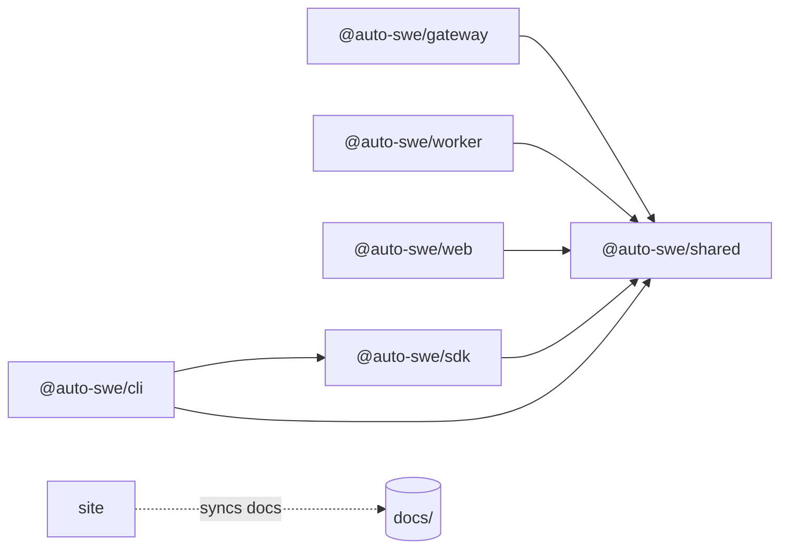
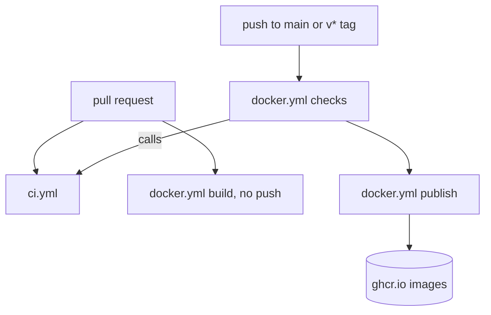

# Repository Structure

> Indexed at commit `d0a90fb5` on 2026-10-06 · [view on GitHub](https://github.com/yorch/auto-swe/tree/d0a90fb5)

## Relevant source files

- [package.json](https://github.com/yorch/auto-swe/blob/d0a90fb5/package.json)
- [tsconfig.base.json](https://github.com/yorch/auto-swe/blob/d0a90fb5/tsconfig.base.json)
- [vitest.config.ts](https://github.com/yorch/auto-swe/blob/d0a90fb5/vitest.config.ts)
- [biome.json](https://github.com/yorch/auto-swe/blob/d0a90fb5/biome.json)
- [Justfile](https://github.com/yorch/auto-swe/blob/d0a90fb5/Justfile)
- [docker-compose.infra.yml](https://github.com/yorch/auto-swe/blob/d0a90fb5/docker-compose.infra.yml)
- [docker-compose.app.yml](https://github.com/yorch/auto-swe/blob/d0a90fb5/docker-compose.app.yml)
- [packages/shared/package.json](https://github.com/yorch/auto-swe/blob/d0a90fb5/packages/shared/package.json)
- [packages/gateway/package.json](https://github.com/yorch/auto-swe/blob/d0a90fb5/packages/gateway/package.json)
- [packages/web/package.json](https://github.com/yorch/auto-swe/blob/d0a90fb5/packages/web/package.json)
- [packages/cli/package.json](https://github.com/yorch/auto-swe/blob/d0a90fb5/packages/cli/package.json)
- [packages/sdk/package.json](https://github.com/yorch/auto-swe/blob/d0a90fb5/packages/sdk/package.json)
- [packages/gateway/Dockerfile](https://github.com/yorch/auto-swe/blob/d0a90fb5/packages/gateway/Dockerfile)
- [packages/worker/Dockerfile](https://github.com/yorch/auto-swe/blob/d0a90fb5/packages/worker/Dockerfile)
- [packages/web/Dockerfile](https://github.com/yorch/auto-swe/blob/d0a90fb5/packages/web/Dockerfile)
- [scripts/compose.mjs](https://github.com/yorch/auto-swe/blob/d0a90fb5/scripts/compose.mjs)
- [scripts/check-invariants.mjs](https://github.com/yorch/auto-swe/blob/d0a90fb5/scripts/check-invariants.mjs)
- [scripts/env-setup.mjs](https://github.com/yorch/auto-swe/blob/d0a90fb5/scripts/env-setup.mjs)
- [.github/workflows/ci.yml](https://github.com/yorch/auto-swe/blob/d0a90fb5/.github/workflows/ci.yml)
- [.github/workflows/docker.yml](https://github.com/yorch/auto-swe/blob/d0a90fb5/.github/workflows/docker.yml)
- [.github/workflows/pages.yml](https://github.com/yorch/auto-swe/blob/d0a90fb5/.github/workflows/pages.yml)
- [.github/workflows/build-executor.yml](https://github.com/yorch/auto-swe/blob/d0a90fb5/.github/workflows/build-executor.yml)
- [site/scripts/manifest.mjs](https://github.com/yorch/auto-swe/blob/d0a90fb5/site/scripts/manifest.mjs)

## Overview

`auto-swe` is a single private Yarn 4 monorepo. The root [package.json](https://github.com/yorch/auto-swe/blob/d0a90fb5/package.json#L5-L8) declares two workspace globs, `packages/*` and `site`, and pins `yarn@4.18.0` as the package manager with Node `>=26.0.0` as the engine ([package.json:L45-L47](https://github.com/yorch/auto-swe/blob/d0a90fb5/package.json#L45-L47)). Six packages (`shared`, `gateway`, `worker`, `web`, `cli`, `sdk`) plus the `site` documentation workspace share one lockfile, one TypeScript base config, one test runner and one linter.

This page covers the cross-cutting plumbing: layout, build and typecheck ordering, the lint and test configuration, the Docker images, the Compose stacks, the repo-level check scripts and the continuous integration (CI) workflows. Each package's internals are covered on its own page.

Sources: [package.json:L1-L58](https://github.com/yorch/auto-swe/blob/d0a90fb5/package.json#L1-L58)

## Architecture

```mermaid
flowchart LR
    shared["@auto-swe/shared"]
    gateway["@auto-swe/gateway"]
    worker["@auto-swe/worker"]
    web["@auto-swe/web"]
    sdk["@auto-swe/sdk"]
    cli["@auto-swe/cli"]
    site["site"]

    gateway --> shared
    worker --> shared
    web --> shared
    sdk --> shared
    cli --> sdk
    cli --> shared
    site -.syncs docs.-> docs[(docs/)]
```

`@auto-swe/shared` is the leaf every other package depends on through `workspace:*` ranges. The CLI additionally depends on `@auto-swe/sdk` for bundle authoring ([packages/cli/package.json:L16-L19](https://github.com/yorch/auto-swe/blob/d0a90fb5/packages/cli/package.json#L16-L19)). The `site` workspace does not import code; it copies `docs/` into its content tree at build time.

Sources: [packages/cli/package.json:L1-L25](https://github.com/yorch/auto-swe/blob/d0a90fb5/packages/cli/package.json#L1-L25) [packages/sdk/package.json:L1-L25](https://github.com/yorch/auto-swe/blob/d0a90fb5/packages/sdk/package.json#L1-L25) [packages/web/package.json:L11-L13](https://github.com/yorch/auto-swe/blob/d0a90fb5/packages/web/package.json#L11-L13)

## Module Layout

| Module | Path | Responsibility |
| ------ | ---- | -------------- |
| shared | `packages/shared` | Prisma schema and client, shared types, setting registry; exposes per-file subpath exports |
| gateway | `packages/gateway` | Fastify HTTP API |
| worker | `packages/worker` | Temporal worker and agent activities |
| web | `packages/web` | Next.js dashboard |
| cli | `packages/cli` | `auto-swe` binary |
| sdk | `packages/sdk` | Bundle authoring helpers |
| site | `site` | Public docs site, built from `docs/` |
| scripts | `scripts/` | Dependency-free Node scripts for Compose, env setup, doc drift and source invariants |
| workflows | `.github/workflows/` | CI, image publishing, Pages deploy, executor image build |
| infra | `infra/`, `docker-compose.*.yml`, `Justfile` | Local and production container stacks |

Every package follows the same script contract: `build` is `tsc` (the web package uses `next build`), `typecheck` is `tsc --noEmit`, and the server packages add a `dev` watcher ([packages/gateway/package.json:L6-L11](https://github.com/yorch/auto-swe/blob/d0a90fb5/packages/gateway/package.json#L6-L11), [packages/web/package.json:L5-L10](https://github.com/yorch/auto-swe/blob/d0a90fb5/packages/web/package.json#L5-L10)). The CLI is an ESM package whose `bin` entry maps `auto-swe` to `dist/index.js`.

Sources: [packages/gateway/package.json:L1-L11](https://github.com/yorch/auto-swe/blob/d0a90fb5/packages/gateway/package.json#L1-L11) [packages/cli/package.json:L6-L9](https://github.com/yorch/auto-swe/blob/d0a90fb5/packages/cli/package.json#L6-L9) [packages/web/package.json:L1-L10](https://github.com/yorch/auto-swe/blob/d0a90fb5/packages/web/package.json#L1-L10)

## Key Components

### Build, typecheck and database scripts

The root `build` runs `yarn workspaces foreach -At run build`, a topological pass over all workspaces. `typecheck` first builds every workspace except `@auto-swe/web`, so dependents resolve the emitted declarations of `shared`, then runs `typecheck` everywhere ([package.json:L10-L11](https://github.com/yorch/auto-swe/blob/d0a90fb5/package.json#L10-L11)). The `db:*` scripts delegate to `@auto-swe/shared`, and `postinstall` runs `db:generate` so a Prisma client exists after every install ([package.json:L17-L25](https://github.com/yorch/auto-swe/blob/d0a90fb5/package.json#L17-L25)).

`shared` builds with `yarn db:generate && tsc`, and `db:generate` carries a dummy `DATABASE_URL` so generation never needs a database ([packages/shared/package.json:L106-L119](https://github.com/yorch/auto-swe/blob/d0a90fb5/packages/shared/package.json#L106-L119)). Its `exports` map lists individual compiled subpaths (`./db`, `./lib/crypto`, `./config/registry`, and so on) rather than a wildcard ([packages/shared/package.json:L8-L28](https://github.com/yorch/auto-swe/blob/d0a90fb5/packages/shared/package.json#L8-L28)).

Sources: [package.json:L9-L44](https://github.com/yorch/auto-swe/blob/d0a90fb5/package.json#L9-L44) [packages/shared/package.json:L1-L28](https://github.com/yorch/auto-swe/blob/d0a90fb5/packages/shared/package.json#L1-L28)

### TypeScript, Vitest and Biome

[tsconfig.base.json](https://github.com/yorch/auto-swe/blob/d0a90fb5/tsconfig.base.json#L1-L18) sets `strict`, `target` and `lib` `ES2022`, `Node16` module resolution, `rootDir: src`, `outDir: dist`, and emits declarations and source maps. Each package inherits it.

[vitest.config.ts](https://github.com/yorch/auto-swe/blob/d0a90fb5/vitest.config.ts#L1-L15) uses array-form `resolve.alias` entries that map `@auto-swe/shared/*` subpaths to source `.ts` files, so tests run without a prior build. The array form matters because Vite matches prefixes in order; subpath aliases must precede the bare `@auto-swe/shared` alias.

[biome.json](https://github.com/yorch/auto-swe/blob/d0a90fb5/biome.json#L1-L40) is the single lint and format configuration. It enables sorted keys, properties and attributes plus import organization, and excludes `dist`, `.next`, `coverage`, generated Prisma output, migrations and `.claude/worktrees` from checking.

Sources: [tsconfig.base.json:L1-L18](https://github.com/yorch/auto-swe/blob/d0a90fb5/tsconfig.base.json#L1-L18) [vitest.config.ts:L1-L15](https://github.com/yorch/auto-swe/blob/d0a90fb5/vitest.config.ts#L1-L15) [biome.json:L1-L40](https://github.com/yorch/auto-swe/blob/d0a90fb5/biome.json#L1-L40)

### Docker images

The gateway and worker Dockerfiles are three-stage builds: a builder stage that runs `yarn workspaces focus` for the package and its `shared` dependency and generates the Prisma client, a `prod-deps` stage that runs `yarn workspaces focus <pkg> --production`, and a runtime stage ([packages/gateway/Dockerfile:L42-L75](https://github.com/yorch/auto-swe/blob/d0a90fb5/packages/gateway/Dockerfile#L42-L75), [packages/worker/Dockerfile:L42-L86](https://github.com/yorch/auto-swe/blob/d0a90fb5/packages/worker/Dockerfile#L42-L86)). The gateway runtime is `node:26-alpine` with a health check against `/health`; the worker runtime is `node:26-slim`. Both start Node with `--import ./packages/<pkg>/dist/instrument.js` so OpenTelemetry instrumentation loads first ([packages/gateway/Dockerfile:L160](https://github.com/yorch/auto-swe/blob/d0a90fb5/packages/gateway/Dockerfile#L160), [packages/worker/Dockerfile:L148](https://github.com/yorch/auto-swe/blob/d0a90fb5/packages/worker/Dockerfile#L148)).

Every stage that invokes `yarn` first writes a small `/usr/local/bin/yarn` shim that executes the release named by `yarnPath` in `.yarnrc.yml`, because the Node 26 base images ship no Corepack ([packages/gateway/Dockerfile:L25-L27](https://github.com/yorch/auto-swe/blob/d0a90fb5/packages/gateway/Dockerfile#L25-L27)). The web image has two stages and runs the Next.js standalone `server.js` ([packages/web/Dockerfile:L1-L105](https://github.com/yorch/auto-swe/blob/d0a90fb5/packages/web/Dockerfile#L1-L105)).

Sources: [packages/gateway/Dockerfile:L1-L160](https://github.com/yorch/auto-swe/blob/d0a90fb5/packages/gateway/Dockerfile#L1-L160) [packages/worker/Dockerfile:L1-L148](https://github.com/yorch/auto-swe/blob/d0a90fb5/packages/worker/Dockerfile#L1-L148) [packages/web/Dockerfile:L1-L105](https://github.com/yorch/auto-swe/blob/d0a90fb5/packages/web/Dockerfile#L1-L105)

### Local stack: Compose files, Justfile and compose.mjs

[docker-compose.infra.yml](https://github.com/yorch/auto-swe/blob/d0a90fb5/docker-compose.infra.yml#L27-L168) defines `postgres`, `postgres-temporal`, the one-shot `temporal-setup` and `temporal-setup-namespace` containers, `temporal`, and two profile-gated services: `temporal-ui` behind the `temporal-ui` profile and `garage` (object storage) behind `objectstore`. [docker-compose.app.yml](https://github.com/yorch/auto-swe/blob/d0a90fb5/docker-compose.app.yml#L25-L128) is an overlay with `gateway`, `worker`, `otel-lgtm` and `web`, and is not runnable standalone. Production layers `docker-compose.prod.yml` over the infra file, with optional Traefik and Watchtower overlays ([Justfile:L13-L20](https://github.com/yorch/auto-swe/blob/d0a90fb5/Justfile#L13-L20)).

Because the infra file is layered under production, the Temporal UI sits behind a profile so it never starts there. Compose's `--profile` flag replaces `COMPOSE_PROFILES`, which would drop `objectstore` from `.env`; [scripts/compose.mjs](https://github.com/yorch/auto-swe/blob/d0a90fb5/scripts/compose.mjs#L1-L20) therefore reads `COMPOSE_PROFILES` itself and appends each `--add-profile`. The `docker:infra*` and `docker:app*` package scripts and the `infra-*`, `dev-*` and `prod-*` Justfile recipes all route through it ([package.json:L26-L34](https://github.com/yorch/auto-swe/blob/d0a90fb5/package.json#L26-L34), [Justfile:L26-L64](https://github.com/yorch/auto-swe/blob/d0a90fb5/Justfile#L26-L64)). The `prod-down` recipe uses `--profile '*'` so profiled containers are removed too ([Justfile:L74-L83](https://github.com/yorch/auto-swe/blob/d0a90fb5/Justfile#L74-L83)).

Sources: [docker-compose.infra.yml:L1-L203](https://github.com/yorch/auto-swe/blob/d0a90fb5/docker-compose.infra.yml#L1-L203) [docker-compose.app.yml:L1-L153](https://github.com/yorch/auto-swe/blob/d0a90fb5/docker-compose.app.yml#L1-L153) [Justfile:L1-L110](https://github.com/yorch/auto-swe/blob/d0a90fb5/Justfile#L1-L110) [scripts/compose.mjs:L1-L92](https://github.com/yorch/auto-swe/blob/d0a90fb5/scripts/compose.mjs#L1-L92)

### Repo-level check scripts

Four dependency-free Node scripts live in `scripts/`, so they run before `yarn install`. `check-doc-drift.mjs` (`yarn docs:check`) derives countable facts from source and fails when living docs disagree. `check-invariants.mjs` (`yarn invariants:check`) enforces rules that the type checker and tests cannot state; its header states that each rule exists because the bug already shipped past a green suite ([scripts/check-invariants.mjs:L1-L17](https://github.com/yorch/auto-swe/blob/d0a90fb5/scripts/check-invariants.mjs#L1-L17)). `env-setup.mjs` (`yarn env:setup init|sync|check`) builds `.env` from `.env.example`, never regenerates an existing secret, never prints secret values and writes files `0600` ([scripts/env-setup.mjs:L1-L19](https://github.com/yorch/auto-swe/blob/d0a90fb5/scripts/env-setup.mjs#L1-L19)). The scripts have co-located `.test.mjs` files for compose, env-setup and invariants.

Sources: [scripts/check-invariants.mjs:L1-L25](https://github.com/yorch/auto-swe/blob/d0a90fb5/scripts/check-invariants.mjs#L1-L25) [scripts/env-setup.mjs:L1-L19](https://github.com/yorch/auto-swe/blob/d0a90fb5/scripts/env-setup.mjs#L1-L19) [package.json:L35-L37](https://github.com/yorch/auto-swe/blob/d0a90fb5/package.json#L35-L37)

### Docs site manifest

[site/scripts/manifest.mjs](https://github.com/yorch/auto-swe/blob/d0a90fb5/site/scripts/manifest.mjs#L1-L12) is the single answer to which files the public site publishes. It publishes top-level `docs/` and skips `history/` and `redesign/` ([site/scripts/manifest.mjs:L36-L40](https://github.com/yorch/auto-swe/blob/d0a90fb5/site/scripts/manifest.mjs#L36-L40)), and exports `SIDEBAR` at line 98, from which the sync script, the link rewriter and the Astro sidebar are all built.

Sources: [site/scripts/manifest.mjs:L1-L147](https://github.com/yorch/auto-swe/blob/d0a90fb5/site/scripts/manifest.mjs#L1-L147)

## Data Flow

```mermaid
flowchart TD
    PR[pull request] --> ci[ci.yml]
    PR --> build[docker.yml build, no push]
    main[push to main or v* tag] --> checks[docker.yml checks]
    checks -->|calls| ci
    checks --> publish[docker.yml publish]
    publish --> ghcr[(ghcr.io images)]
```

[.github/workflows/ci.yml](https://github.com/yorch/auto-swe/blob/d0a90fb5/.github/workflows/ci.yml#L1-L28) triggers on push to `main`, pull requests, and `workflow_call`. It has four jobs: `docs` (doc drift and invariants, no install), `ci` (immutable install, Prisma generate, typecheck, lint, tests with coverage, build), `docker-tests` (Docker-backed worker suites), and `migrations` ([ci.yml:L30-L142](https://github.com/yorch/auto-swe/blob/d0a90fb5/.github/workflows/ci.yml#L30-L142)). The `migrations` job runs against a `pgvector/pgvector:pg18` service: it applies all migrations to a fresh database, checks them against `schema.prisma`, seeds, re-applies for idempotency, then runs the database-backed `*.pg.test.ts` suites one step each ([ci.yml:L142-L327](https://github.com/yorch/auto-swe/blob/d0a90fb5/.github/workflows/ci.yml#L142-L327)).

[.github/workflows/docker.yml](https://github.com/yorch/auto-swe/blob/d0a90fb5/.github/workflows/docker.yml#L38-L56) builds a matrix of `gateway`, `web` and `worker`. On pull requests the `build` job builds each image without pushing. On anything that is not a pull request (`main` pushes, `v*` tags and manual dispatch), `checks` calls `ci.yml` as a reusable workflow, so the publish gate cannot drift from the pull request gate, and `publish`, which runs only for `main` and tags, needs it ([docker.yml:L58-L64](https://github.com/yorch/auto-swe/blob/d0a90fb5/.github/workflows/docker.yml#L58-L64), [docker.yml:L118-L125](https://github.com/yorch/auto-swe/blob/d0a90fb5/.github/workflows/docker.yml#L118-L125)). Builds target `linux/amd64` only; `arm64` is disabled because the gateway's production focus step crashes under QEMU ([docker.yml:L14-L27](https://github.com/yorch/auto-swe/blob/d0a90fb5/.github/workflows/docker.yml#L14-L27)). An advisory `yarn npm audit` job never gates publishing.

Two further workflows exist. [pages.yml](https://github.com/yorch/auto-swe/blob/d0a90fb5/.github/workflows/pages.yml#L1-L12) deploys the docs site on pushes to `main` that touch `docs/`, the READMEs or site sources. [build-executor.yml](https://github.com/yorch/auto-swe/blob/d0a90fb5/.github/workflows/build-executor.yml#L1-L16) builds a per-repository executor image on manual dispatch, repository dispatch, or a weekly Sunday 02:00 UTC schedule.

Sources: [.github/workflows/ci.yml:L1-L327](https://github.com/yorch/auto-swe/blob/d0a90fb5/.github/workflows/ci.yml#L1-L327) [.github/workflows/docker.yml:L1-L219](https://github.com/yorch/auto-swe/blob/d0a90fb5/.github/workflows/docker.yml#L1-L219) [.github/workflows/pages.yml:L1-L89](https://github.com/yorch/auto-swe/blob/d0a90fb5/.github/workflows/pages.yml#L1-L89) [.github/workflows/build-executor.yml:L1-L152](https://github.com/yorch/auto-swe/blob/d0a90fb5/.github/workflows/build-executor.yml#L1-L152)

## Configuration & Extension Points

| Setting | Type | Default | Purpose |
| ------- | ---- | ------- | ------- |
| `COMPOSE_PROFILES` | env var | unset | Enables profiled services such as `objectstore` (Garage); read from the shell, then `.env`, by `scripts/compose.mjs` |
| `--add-profile` | flag | `temporal-ui` in the package scripts | Adds a Compose profile without replacing `COMPOSE_PROFILES` |
| `BUILD_PLATFORMS` | workflow env | `linux/amd64` | Target platforms for image builds |
| `DATABASE_URL` | env var | dummy value in `db:generate` | Placeholder so Prisma client generation needs no database |

New operator-facing documentation is wired into the site through the `SIDEBAR` in the manifest, and the repository's own contributor guidance is in the root [AGENTS.md](https://github.com/yorch/auto-swe/blob/d0a90fb5/AGENTS.md).

Sources: [scripts/compose.mjs:L1-L20](https://github.com/yorch/auto-swe/blob/d0a90fb5/scripts/compose.mjs#L1-L20) [package.json:L26-L30](https://github.com/yorch/auto-swe/blob/d0a90fb5/package.json#L26-L30) [.github/workflows/docker.yml:L27](https://github.com/yorch/auto-swe/blob/d0a90fb5/.github/workflows/docker.yml#L27) [packages/shared/package.json:L107](https://github.com/yorch/auto-swe/blob/d0a90fb5/packages/shared/package.json#L107)

## Related Pages

- Shared library: [2. Shared library](./2-shared-library.md)
- Gateway: [3. Gateway API](./3-gateway-api.md)
- Worker: [4. Temporal worker](./4-temporal-worker.md)
- Web dashboard: [5. Web dashboard](./5-web-dashboard.md)
- CLI: [6. CLI](./6-cli.md)
- Bundle SDK: [7. Bundle SDK](./7-bundle-sdk.md)
