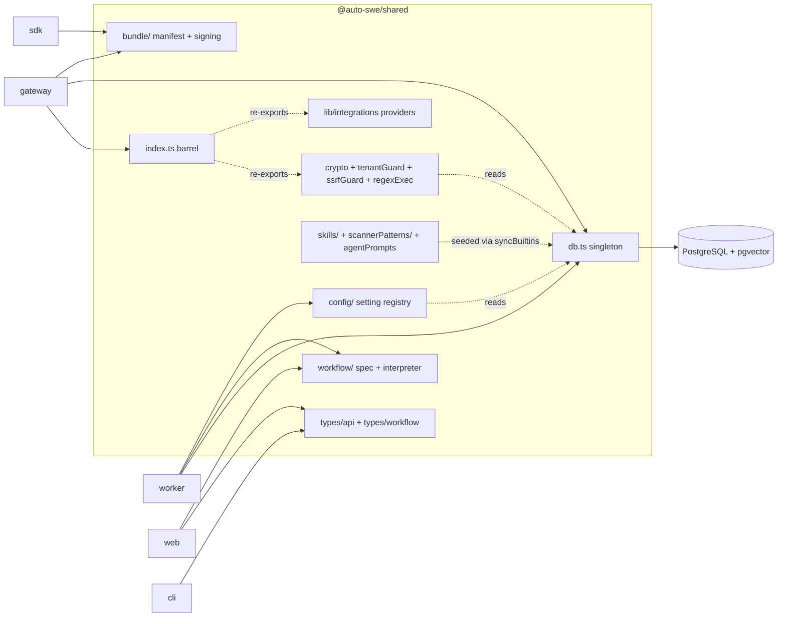

# @auto-swe/shared — Schema, Types, and Cross-Cutting Libraries

> Indexed at commit `b1d8930` on 2026-09-08 · [view on GitHub](https://github.com/yorch/auto-swe/tree/b1d8930)

## Relevant source files

- [packages/shared/package.json](https://github.com/yorch/auto-swe/blob/b1d8930/packages/shared/package.json)
- [packages/shared/src/index.ts](https://github.com/yorch/auto-swe/blob/b1d8930/packages/shared/src/index.ts)
- [packages/shared/src/db.ts](https://github.com/yorch/auto-swe/blob/b1d8930/packages/shared/src/db.ts)
- [packages/shared/src/agentKeys.ts](https://github.com/yorch/auto-swe/blob/b1d8930/packages/shared/src/agentKeys.ts)
- [packages/shared/src/types/workflow.ts](https://github.com/yorch/auto-swe/blob/b1d8930/packages/shared/src/types/workflow.ts)
- [packages/shared/src/types/api.ts](https://github.com/yorch/auto-swe/blob/b1d8930/packages/shared/src/types/api.ts)
- [packages/shared/src/lib/crypto.ts](https://github.com/yorch/auto-swe/blob/b1d8930/packages/shared/src/lib/crypto.ts)
- [packages/shared/src/lib/keyRotation.ts](https://github.com/yorch/auto-swe/blob/b1d8930/packages/shared/src/lib/keyRotation.ts)
- [packages/shared/src/lib/systemConfig.ts](https://github.com/yorch/auto-swe/blob/b1d8930/packages/shared/src/lib/systemConfig.ts)
- [packages/shared/src/lib/tenantGuard.ts](https://github.com/yorch/auto-swe/blob/b1d8930/packages/shared/src/lib/tenantGuard.ts)
- [packages/shared/src/lib/regexSafety.ts](https://github.com/yorch/auto-swe/blob/b1d8930/packages/shared/src/lib/regexSafety.ts)
- [packages/shared/src/lib/regexExec.ts](https://github.com/yorch/auto-swe/blob/b1d8930/packages/shared/src/lib/regexExec.ts)
- [packages/shared/src/lib/ssrfGuard.ts](https://github.com/yorch/auto-swe/blob/b1d8930/packages/shared/src/lib/ssrfGuard.ts)
- [packages/shared/src/lib/syncBuiltins.ts](https://github.com/yorch/auto-swe/blob/b1d8930/packages/shared/src/lib/syncBuiltins.ts)
- [packages/shared/src/lib/agentPrompts.ts](https://github.com/yorch/auto-swe/blob/b1d8930/packages/shared/src/lib/agentPrompts.ts)
- [packages/shared/src/lib/integrations/registry.ts](https://github.com/yorch/auto-swe/blob/b1d8930/packages/shared/src/lib/integrations/registry.ts)
- [packages/shared/src/bundle/index.ts](https://github.com/yorch/auto-swe/blob/b1d8930/packages/shared/src/bundle/index.ts)
- [packages/shared/src/scripts/rotateEncryptionKey.ts](https://github.com/yorch/auto-swe/blob/b1d8930/packages/shared/src/scripts/rotateEncryptionKey.ts)

## Overview

`@auto-swe/shared` is the dependency root of the monorepo. It owns the Prisma schema and the singleton client every other package queries through, the TypeScript types that describe workflow payloads and HTTP responses, the workflow specification language and its interpreter, the operator setting registry, the seeded library content (agent prompts, skills, scanner patterns), and the cross-cutting security primitives — envelope encryption, tenant scoping, Server-Side Request Forgery (SSRF) blocking, and bounded regular-expression execution.

Nothing in the package is a service. It has no HTTP surface, no Temporal registration, and no React tree. It is consumed by all five sibling packages, and the direction of that dependency is strictly one-way: shared never imports from gateway, worker, web, cli, or sdk. Its runtime dependencies are the Prisma client and adapter, `zod`, `pg`, `bcrypt`, and the OpenTelemetry Node SDK ([packages/shared/package.json#L83-L94](https://github.com/yorch/auto-swe/blob/b1d8930/packages/shared/package.json#L83-L94)).

Sources: [packages/shared/package.json:L1-L111](https://github.com/yorch/auto-swe/blob/b1d8930/packages/shared/package.json#L1-L111) [packages/shared/src/index.ts:L1-L106](https://github.com/yorch/auto-swe/blob/b1d8930/packages/shared/src/index.ts#L1-L106)

## Architecture

The diagram shows the two access patterns. Runtime services reach the database only through `db.ts`, so the tenant-guard extension attached there covers every consumer. Pure modules — the workflow spec, the bundle format, the regex safety checks — carry no input/output at all, which is what lets the browser bundle in `web` and the I/O-free `sdk` import them.

Sources: [packages/shared/src/db.ts:L1-L31](https://github.com/yorch/auto-swe/blob/b1d8930/packages/shared/src/db.ts#L1-L31) [packages/shared/package.json:L8-L72](https://github.com/yorch/auto-swe/blob/b1d8930/packages/shared/package.json#L8-L72)

## Module Layout

| Module | Path | Responsibility |
| --- | --- | --- |
| Barrel | `src/index.ts` | Curated re-export of the most-used values and types |
| Database | `src/db.ts` | Singleton `PrismaClient` with the tenant guard attached |
| Schema | `src/prisma/` | `schema.prisma`, migrations, `seed.ts`, `schemaModels.ts` |
| Types | `src/types/` | Workflow payload contracts and HTTP data-transfer objects |
| Workflow | `src/workflow/` | Spec schema, interpreter, expressions, step registry, cost estimator |
| Config | `src/config/` | Setting registry, cascade resolver, permission rules, cache |
| Libraries | `src/lib/` | Cryptography, guards, resolvers, integrations, pure helpers |
| Skills | `src/skills/` | Built-in prompt fragments, one file per skill |
| Scanner patterns | `src/scannerPatterns/` | Built-in security regular expressions |
| Bundle | `src/bundle/` | Portable library-content manifest, hashing, signing |
| Scripts | `src/scripts/` | Encryption-key rotation entry point |

Sources: [packages/shared/src/index.ts:L1-L106](https://github.com/yorch/auto-swe/blob/b1d8930/packages/shared/src/index.ts#L1-L106) [packages/shared/package.json:L74-L86](https://github.com/yorch/auto-swe/blob/b1d8930/packages/shared/package.json#L74-L86)

## The Export Surface

The package declares sixty-four subpath exports in [packages/shared/package.json#L8-L72](https://github.com/yorch/auto-swe/blob/b1d8930/packages/shared/package.json#L8-L72), and the fine granularity is load-bearing rather than stylistic. Two consumers cannot afford the barrel: the Temporal workflow isolate in `packages/worker/src/workflows/` may only take type-only imports from external packages, and the Next.js dashboard must not pull `db.ts` into a client bundle. A deep import such as `@auto-swe/shared/workflow/spec` or `@auto-swe/shared/types/api` gives both a path that reaches exactly the module they need without dragging the Prisma client along.

The barrel at [packages/shared/src/index.ts#L1-L106](https://github.com/yorch/auto-swe/blob/b1d8930/packages/shared/src/index.ts#L1-L106) is therefore a convenience layer, not the API. It re-exports `prisma` and `PrismaClient`, the generated `Prisma` namespace and the `ConfigAuditAction`, `ConfigScope`, and `Role` enums, the autonomy-policy schema, the connection-token and secret encryption helpers, the connection-type registry, the integration provider factories, the eight system-config resolvers, the workflow-identifier generators, and the workspace-provider metadata. The two type modules are re-exported wholesale with `export type *`, so anything in `types/api.ts` or `types/workflow.ts` is reachable from the package root without appearing in the barrel by name.

Sources: [packages/shared/src/index.ts:L1-L106](https://github.com/yorch/auto-swe/blob/b1d8930/packages/shared/src/index.ts#L1-L106) [packages/shared/package.json:L8-L72](https://github.com/yorch/auto-swe/blob/b1d8930/packages/shared/package.json#L8-L72)

## Key Components

### The Prisma singleton and the tenant guard

`db.ts` constructs one `PrismaClient` per process behind a `globalThis` cache, using the Prisma 7 driver-adapter form (`PrismaPg` over `DATABASE_URL`) and throwing at construction when the connection string is absent ([packages/shared/src/db.ts#L12-L18](https://github.com/yorch/auto-swe/blob/b1d8930/packages/shared/src/db.ts#L12-L18)). Under a non-production `NODE_ENV` the instance is stashed on the global so a watch-mode reload does not open a new pool each time.

The decisive line is [packages/shared/src/db.ts#L24](https://github.com/yorch/auto-swe/blob/b1d8930/packages/shared/src/db.ts#L24), which wraps the base client in `tenantGuardExtension()`. Placing the guard on the singleton rather than on the gateway's Fastify decoration is deliberate: the earlier arrangement left the worker unguarded, and the worker is the half that puts `MemoryItem` rows into an agent prompt. The guard fails any multi-row operation on a tenant-scoped model that carries no tenant predicate. It covers twenty models and six operations — `findMany`, `count`, `aggregate`, `groupBy`, `updateMany`, `deleteMany` ([packages/shared/src/lib/tenantGuard.ts#L25-L54](https://github.com/yorch/auto-swe/blob/b1d8930/packages/shared/src/lib/tenantGuard.ts#L25-L54)). Single-row lookups by identifier are exempt on purpose, since they leak at most one row and guarding them would mean rewriting every ownership check in the codebase. `runUnscoped` at [packages/shared/src/lib/tenantGuard.ts#L129](https://github.com/yorch/auto-swe/blob/b1d8930/packages/shared/src/lib/tenantGuard.ts#L129) opens a named, reasoned escape hatch through `AsyncLocalStorage` for genuinely global operations such as key rotation. The module documents its own limit: raw SQL bypasses it entirely, so this is defence in depth at the object-relational-mapping layer, not row-level security.

Sources: [packages/shared/src/db.ts:L1-L31](https://github.com/yorch/auto-swe/blob/b1d8930/packages/shared/src/db.ts#L1-L31) [packages/shared/src/lib/tenantGuard.ts:L1-L248](https://github.com/yorch/auto-swe/blob/b1d8930/packages/shared/src/lib/tenantGuard.ts#L1-L248)

### Shared type definitions

`types/workflow.ts` holds the payload contracts that cross the Temporal activity boundary: `RunRequest` and the `RepoWorkRequest` that extends it, `CodeResult` with its `FileChange` and `CodeSecurityFinding` members, `ReviewVerdict` and `AggregatedReviewResult`, `Subtask` and `DecompositionResult`, the epic-planning shapes, and the `BUDGET_TIERS` tuple that names the standard, large, and epic caps ([packages/shared/src/types/workflow.ts#L285-L286](https://github.com/yorch/auto-swe/blob/b1d8930/packages/shared/src/types/workflow.ts#L285-L286)). These are the structured results the interpreter consumes; the delegation boundary in this codebase is that a sub-agent returns one of these typed values rather than a transcript.

`types/api.ts` is the wire contract between gateway and dashboard, and at 754 lines it is the larger of the two. It defines the generic `ApiResponse<T>` envelope, the summary and detail pairs for workflows, teams, repositories, users, templates, runs, epics, and evaluations, and the status tuples the user interface renders from — `WORKFLOW_TEMPLATE_STATUSES`, `WORKFLOW_RUN_STATUSES`, `WORKFLOW_STEP_RECORD_STATUSES`, `CONFIG_SCOPES`, `EVAL_SIGNAL_SOURCES`. Declaring these once and importing them on both sides is what keeps a route's response and the component that renders it from drifting.

Sources: [packages/shared/src/types/workflow.ts:L1-L361](https://github.com/yorch/auto-swe/blob/b1d8930/packages/shared/src/types/workflow.ts#L1-L361) [packages/shared/src/types/api.ts:L1-L754](https://github.com/yorch/auto-swe/blob/b1d8930/packages/shared/src/types/api.ts#L1-L754)

### Envelope encryption and key rotation

Every secret the platform stores — provider API keys, connection tokens, integration credentials, OAuth client secrets — passes through `lib/crypto.ts`. The scheme is AES-256-GCM with a per-record twelve-byte nonce and a separately stored sixteen-byte authentication tag, and each ciphertext is stamped with the key version that produced it ([packages/shared/src/lib/crypto.ts#L104-L141](https://github.com/yorch/auto-swe/blob/b1d8930/packages/shared/src/lib/crypto.ts#L104-L141)). The master key is read from `CONFIG_ENCRYPTION_KEY` as base64-encoded thirty-two bytes and cached for the process lifetime.

Rotation supports exactly one key in flight. `CONFIG_ENCRYPTION_KEY` is the write key and `CONFIG_ENCRYPTION_KEY_PREVIOUS` is a read-only key for the version immediately below, which is enough for the only state a rotation actually passes through. `assertEncryptionKeyConfigured()` at [packages/shared/src/lib/crypto.ts#L100](https://github.com/yorch/auto-swe/blob/b1d8930/packages/shared/src/lib/crypto.ts#L100) is the boot guard both services call first thing, so a missing or wrong-length key kills the process at startup instead of on the first credential read. `encryptSecret` also records a `lastFour` hint, and suppresses it for secrets shorter than eight characters on the reasoning that four characters of an eight-character secret is half of it.

`lib/keyRotation.ts` re-encrypts every stored secret under the current key. Its `ENCRYPTED_FIELDS` map at [packages/shared/src/lib/keyRotation.ts#L69](https://github.com/yorch/auto-swe/blob/b1d8930/packages/shared/src/lib/keyRotation.ts#L69) enumerates each encrypted column by model, and a coverage test derives the same set from `schema.prisma` and fails when the two disagree — a new encrypted column nobody registers would otherwise be skipped silently and become unreadable the moment the old key is dropped. Rotation runs row by row with no global transaction and skips rows already at the current version, so an interrupted run resumes by rerunning. The `yarn keys:rotate` script wires it up at [packages/shared/src/scripts/rotateEncryptionKey.ts](https://github.com/yorch/auto-swe/blob/b1d8930/packages/shared/src/scripts/rotateEncryptionKey.ts).

Sources: [packages/shared/src/lib/crypto.ts:L1-L180](https://github.com/yorch/auto-swe/blob/b1d8930/packages/shared/src/lib/crypto.ts#L1-L180) [packages/shared/src/lib/keyRotation.ts:L1-L193](https://github.com/yorch/auto-swe/blob/b1d8930/packages/shared/src/lib/keyRotation.ts#L1-L193) [packages/shared/src/scripts/rotateEncryptionKey.ts:L1-L65](https://github.com/yorch/auto-swe/blob/b1d8930/packages/shared/src/scripts/rotateEncryptionKey.ts#L1-L65)

### System config resolvers

`lib/systemConfig.ts` is the read path for integration credentials and workflow defaults. Each singleton configuration table holds one row keyed `default`, and a resolver reads it, decrypts the secret columns, and falls back to the matching environment variable when the row is absent — so a deployment that has never opened the admin interface keeps working. `resolveGitHubConfig`, `resolveSlackConfig`, `resolveStorageConfig`, `resolveIssueTrackerConfig`, `resolveKnowledgeBaseConfig`, `resolveFigmaConfig`, `resolveGoogleOAuthConfig`, and `resolveOktaOAuthConfig` follow that shape, alongside `resolveWorkflowDefaults` at [packages/shared/src/lib/systemConfig.ts#L386](https://github.com/yorch/auto-swe/blob/b1d8930/packages/shared/src/lib/systemConfig.ts#L386) and the consolidation, evaluation-schedule, revalidation, and canary variants.

Two properties are worth noting. The module imports the database lazily through a local `db()` helper ([packages/shared/src/lib/systemConfig.ts#L4-L8](https://github.com/yorch/auto-swe/blob/b1d8930/packages/shared/src/lib/systemConfig.ts#L4-L8)) so importing it in a test does not trigger `DATABASE_URL` validation. And the resolvers hold no cache of their own, which keeps the shared package free of any cache implementation; the worker and gateway wrap them in their own time-to-live caches. Every resolver accepts a reserved `ResolveOpts.orgId` that is ignored while the tables are singletons, so threading org context through now makes per-org rows a resolver-internal change later ([packages/shared/src/lib/systemConfig.ts#L20-L31](https://github.com/yorch/auto-swe/blob/b1d8930/packages/shared/src/lib/systemConfig.ts#L20-L31)). The tail of the file also carries the plain environment readers that have no database backing: `resolvePublicUrl`, `resolveWebUrl`, `resolveTemporalAddress`, and the OpenTelemetry exporter settings.

Sources: [packages/shared/src/lib/systemConfig.ts:L1-L783](https://github.com/yorch/auto-swe/blob/b1d8930/packages/shared/src/lib/systemConfig.ts#L1-L783)

### Regular-expression safety and bounded execution

Scanner patterns are data supplied by administrators and installed bundles, and their bodies run in-process against agent text on every shell command, every file write, and every skill save. The package splits the problem across two modules with different purity requirements.

`lib/regexSafety.ts` is pure and synchronous, because the bundle authoring kit depends on it and must stay free of input/output ([packages/shared/src/lib/regexSafety.ts#L1-L17](https://github.com/yorch/auto-swe/blob/b1d8930/packages/shared/src/lib/regexSafety.ts#L1-L17)). It owns the write-time policy: `checkRegexSafety` validates compilation, flags, and source length only, `SAFE_FLAGS_RE` restricts flags to `i`, `m`, `s`, `u`, and `v` so a cached expression cannot carry stateful `lastIndex` behaviour, and the caps that mirror the admin interface live here so bundle install cannot become a back door around them. It also supplies the two input-shaping helpers with opposite guarantees: `capScanText` truncates at twenty thousand characters for advisory scanners, and `chunkScanText` covers the whole input in overlapping windows for blocking ones, because truncating a blocking scan is a detection bypass. The module's header records that static "does this look like a catastrophic pattern" analysis was shipped and then removed, having both missed real hangs and rejected two of the repository's own linear scanner expressions.

`lib/regexExec.ts` owns the runtime bound. A single pooled `worker_thread` executes every pattern and is terminated when a batch overruns a wall-clock budget, which is the only construction that actually interrupts a running JavaScript regular expression. The budget defaults to 250 milliseconds ([packages/shared/src/lib/regexExec.ts#L85](https://github.com/yorch/auto-swe/blob/b1d8930/packages/shared/src/lib/regexExec.ts#L85)) and is resolved from the setting registry per scan. Overruns are attributed by bisecting the batch against a fresh thread, an isolated overrun is confirmed by a second solo run before it is believed, and a twice-confirmed pattern is quarantined for ten minutes per process ([packages/shared/src/lib/regexExec.ts#L93](https://github.com/yorch/auto-swe/blob/b1d8930/packages/shared/src/lib/regexExec.ts#L93)). `runRegexBatch` never throws — a scan must not abort its calling activity — so every failure resolves to a result marked incomplete and the caller decides. `probeRegexBacktracking` at [packages/shared/src/lib/regexExec.ts#L577](https://github.com/yorch/auto-swe/blob/b1d8930/packages/shared/src/lib/regexExec.ts#L577) runs the same machinery at write time so an administrator gets an early error. The full behaviour and its residual risks are covered on the [Skills and Security Scanners](./2.4-skills-and-security-scanners.md) page.

Sources: [packages/shared/src/lib/regexSafety.ts:L1-L135](https://github.com/yorch/auto-swe/blob/b1d8930/packages/shared/src/lib/regexSafety.ts#L1-L135) [packages/shared/src/lib/regexExec.ts:L1-L120](https://github.com/yorch/auto-swe/blob/b1d8930/packages/shared/src/lib/regexExec.ts#L1-L120)

### SSRF guard and connector registry

`lib/ssrfGuard.ts` exposes a single `isSafeProbeUrl` used by every path that fetches an operator-supplied address: credential base-URL probes, Model Context Protocol connection targets, bundle install-from-URL, and the tracker, knowledge-base, and Figma connector bases. It rejects non-HTTP schemes and hostnames that resolve textually to loopback, link-local, private, or cloud-metadata ranges, including IPv4-mapped IPv6 forms and the short-octet notations a naive expression misses ([packages/shared/src/lib/ssrfGuard.ts#L20-L46](https://github.com/yorch/auto-swe/blob/b1d8930/packages/shared/src/lib/ssrfGuard.ts#L20-L46)). It states its own boundary plainly: no name resolution is performed, so DNS rebinding is out of scope and belongs to container-level outbound policy.

`lib/integrations/` holds the outbound connectors themselves. `registry.ts` exposes `createIssueTrackerProvider`, `createKnowledgeBaseProvider`, and `createFigmaDesignProvider`, each dispatching a resolved configuration to a concrete implementation under `providers/` — Jira, Linear, GitHub Issues, Confluence, Notion, and Figma — behind the `IssueTrackerProvider` and `KnowledgeBaseProvider` interfaces. A shared `atlassianClient.ts` and an Atlassian Document Format helper back the two Atlassian providers.

Sources: [packages/shared/src/lib/ssrfGuard.ts:L1-L112](https://github.com/yorch/auto-swe/blob/b1d8930/packages/shared/src/lib/ssrfGuard.ts#L1-L112) [packages/shared/src/lib/integrations/registry.ts:L1-L174](https://github.com/yorch/auto-swe/blob/b1d8930/packages/shared/src/lib/integrations/registry.ts#L1-L174)

### Small pure helpers with one owner

A cluster of short modules exists so that a single formula has exactly one definition and two processes cannot drift apart on it.

| Module | Owns |
| --- | --- |
| `lib/workflowId.ts` | Temporal workflow identifier and branch-name formats |
| `lib/channelTask.ts` | Channel task workflow identifier, steer signal name, seeded template names |
| `lib/billing.ts` | The `YYYY-MM` month bucket both the usage writer and the budget reader use |
| `lib/canary.ts` | Deterministic FNV-1a hash routing a fraction of runs to a candidate agent version |
| `lib/scannerCache.ts` | The sixty-second pattern-cache lifetime gateway and worker must agree on |
| `lib/connectionGuards.ts` | The single predicate for "is this connection a usable git repository" |
| `lib/repoDependency.ts` | Edge kinds and the label sanitiser that flattens repository names before they reach a prompt |
| `lib/manifestParsers.ts` | Defensive parsers for five manifest formats, returning empty rather than throwing |
| `lib/inputSchema.ts` | The small JSON-Schema subset a template declares its run inputs with |
| `lib/triggerMapping.ts` | Declarative event-to-run-input mapping, so no trigger path is hard-coded |
| `lib/autonomyPolicy.ts` | Autonomy rule schema plus the fail-safe fallback that requires approval |
| `lib/connectionTypes.ts` | The eight connection types and their per-type configuration schemas |
| `lib/workspaceProviders.ts` | The five workspace provider kinds |
| `lib/outcomePublishers.ts` | The six ways a run publishes its outcome |
| `lib/telemetry.ts` | OpenTelemetry boot, a no-op when no exporter endpoint is set |

The label sanitiser is the clearest example of why these are centralised. Repository names are operator-supplied with no character or length limit and they reach agent prompts, so a name containing newlines and markdown headings could close the surrounding context block and append instructions of its own; collapsing whitespace and capping length is done once, in `repoLabel`, rather than at each render site ([packages/shared/src/lib/repoDependency.ts#L20-L52](https://github.com/yorch/auto-swe/blob/b1d8930/packages/shared/src/lib/repoDependency.ts#L20-L52)).

Sources: [packages/shared/src/lib/repoDependency.ts:L1-L52](https://github.com/yorch/auto-swe/blob/b1d8930/packages/shared/src/lib/repoDependency.ts#L1-L52) [packages/shared/src/lib/canary.ts:L1-L47](https://github.com/yorch/auto-swe/blob/b1d8930/packages/shared/src/lib/canary.ts#L1-L47) [packages/shared/src/lib/connectionTypes.ts:L1-L168](https://github.com/yorch/auto-swe/blob/b1d8930/packages/shared/src/lib/connectionTypes.ts#L1-L168) [packages/shared/src/lib/billing.ts:L1-L11](https://github.com/yorch/auto-swe/blob/b1d8930/packages/shared/src/lib/billing.ts#L1-L11)

### Seeded library content

The platform's flagship software-engineering behaviour ships as ordinary library content, not privileged runtime code, and this package is where that content lives. `lib/agentPrompts.ts` holds every agent system prompt as an exported constant — the implementer, the three reviewer personas, the planner and decomposers, the fix engineers, the channel assistant, and the workflow author and explainer. `skills/` holds thirty-five built-in prompt fragments, one per file, collected into `BUILTIN_SKILLS` at [packages/shared/src/skills/index.ts#L44](https://github.com/yorch/auto-swe/blob/b1d8930/packages/shared/src/skills/index.ts#L44). `scannerPatterns/index.ts` holds sixty-two built-in security patterns.

`lib/syncBuiltins.ts` reconciles all of it into the database idempotently at gateway startup, split into `seedCoreDefaults` and `seedSweStarter` so a deployment can take the engine without the software-engineering content ([packages/shared/src/lib/syncBuiltins.ts#L170-L182](https://github.com/yorch/auto-swe/blob/b1d8930/packages/shared/src/lib/syncBuiltins.ts#L170-L182)). It also carries the two channel workflow specifications inline and tags everything it seeds with a `swe-starter` provenance marker.

`bundle/index.ts` is the export side of the same idea: a versioned, signed manifest carrying agents, skills, scanner patterns, and templates between deployments. Connection instances never travel in a bundle — it only declares the connection types its content requires. The schema is at version two, in which the content hash covers the whole manifest including its identity, and version-one bundles are rejected rather than reinterpreted ([packages/shared/src/bundle/index.ts#L30-L49](https://github.com/yorch/auto-swe/blob/b1d8930/packages/shared/src/bundle/index.ts#L30-L49)). Signing is Ed25519 over the content hash. `agentKeys.ts` complements this with `MODEL_BACKED_AGENT_KEYS`, a narrow convenience list of the seven agents that carry their own model specification; agent identity itself is a free-form string, so new agents arrive as data.

Sources: [packages/shared/src/lib/syncBuiltins.ts:L1-L182](https://github.com/yorch/auto-swe/blob/b1d8930/packages/shared/src/lib/syncBuiltins.ts#L1-L182) [packages/shared/src/skills/index.ts:L37-L126](https://github.com/yorch/auto-swe/blob/b1d8930/packages/shared/src/skills/index.ts#L37-L126) [packages/shared/src/bundle/index.ts:L1-L60](https://github.com/yorch/auto-swe/blob/b1d8930/packages/shared/src/bundle/index.ts#L1-L60) [packages/shared/src/agentKeys.ts:L1-L29](https://github.com/yorch/auto-swe/blob/b1d8930/packages/shared/src/agentKeys.ts#L1-L29)

## Detail Pages

Four areas of the package are large enough to have their own page.

**Data model.** `src/prisma/` holds a sixty-one-model schema covering organisations, teams, connections, workflow templates and runs, agent traces, memory items with pgvector embeddings, evaluation datasets, and the singleton configuration tables. Migrations are a generated baseline plus one hand-written migration for the DDL the Prisma schema language cannot express — check constraints, partial unique indexes, and the HNSW vector index. See [Data Model](./2.1-data-model.md).

**Workflow spec and interpreter.** `src/workflow/` defines the versioned JSON directed acyclic graph the platform executes: a fifteen-member discriminated union of node types validated by `WorkflowSpecSchema`, an expression evaluator, a step registry, a static validator, a spec differ, codemods for version migration, and the `runSpec` interpreter that the Temporal workflow drives through a dispatcher. See [Workflow Spec and Interpreter](./2.2-workflow-spec-and-interpreter.md).

**Configuration and settings.** `src/config/` implements the setting registry: nineteen declarations, each carrying its schema, default, overridable scopes, required role, and whether it pins to a run. One declaration drives validation, resolution, the admin form, and the permission check. Resolution walks a run pin, then template, channel, team, organisation, and global scopes, then an environment variable, then the default. See [Configuration and Settings](./2.3-configuration-and-settings.md).

**Skills and security scanners.** The built-in skills, the sixty-two scanner patterns and their categories, the advisory skill-content scanner, and how the bounded executor described above is consumed by the blocking and advisory scanners. See [Skills and Security Scanners](./2.4-skills-and-security-scanners.md).

Sources: [packages/shared/src/prisma/schema.prisma:L1-L60](https://github.com/yorch/auto-swe/blob/b1d8930/packages/shared/src/prisma/schema.prisma#L1-L60) [packages/shared/src/workflow/spec.ts:L449-L470](https://github.com/yorch/auto-swe/blob/b1d8930/packages/shared/src/workflow/spec.ts#L449-L470) [packages/shared/src/config/registry.ts:L1-L60](https://github.com/yorch/auto-swe/blob/b1d8930/packages/shared/src/config/registry.ts#L1-L60) [packages/shared/src/scannerPatterns/index.ts:L59-L80](https://github.com/yorch/auto-swe/blob/b1d8930/packages/shared/src/scannerPatterns/index.ts#L59-L80)

## Why This Package Is the Dependency Root

Each sibling depends on a different face of the package, and the shape of that dependency explains the subpath granularity.

| Consumer | Heaviest imports | Why |
| --- | --- | --- |
| `worker` | `shared/db`, `types/workflow`, `lib/systemConfig`, `workflow` | Activities query the database, exchange typed payloads, and run the interpreter |
| `gateway` | `shared` barrel, `lib/systemConfig`, `lib/tenantGuard`, `shared/db` | Routes resolve integration config and enforce tenant scoping |
| `web` | `types/api`, `workflow` | The dashboard renders response types and edits workflow specs client-side |
| `cli` | `types/api`, `bundle` | A thin fetch wrapper plus local bundle authoring |
| `sdk` | `bundle`, `workflow` | Pure authoring helpers over the bundle format and spec schema |

Three constraints follow from being the root, and each is enforced somewhere other than review. The workflow isolate forbids runtime imports of external packages, which is why the spec and interpreter are import-free of the database. The browser bundle must never reach `db.ts`, which is why `types/api` is its own subpath. And the authoring kit must stay free of input/output, which is why the write-time regex policy sits in `regexSafety.ts` and the thread-owning executor sits in `regexExec.ts`.

Sources: [packages/shared/package.json:L8-L72](https://github.com/yorch/auto-swe/blob/b1d8930/packages/shared/package.json#L8-L72) [packages/shared/src/lib/regexSafety.ts:L1-L17](https://github.com/yorch/auto-swe/blob/b1d8930/packages/shared/src/lib/regexSafety.ts#L1-L17)

## Related Pages

- Detail: [Data Model](./2.1-data-model.md)
- Detail: [Workflow Spec and Interpreter](./2.2-workflow-spec-and-interpreter.md)
- Detail: [Configuration and Settings](./2.3-configuration-and-settings.md)
- Detail: [Skills and Security Scanners](./2.4-skills-and-security-scanners.md)
- Sibling: [Repository Structure](./1-repository-structure.md)
- Sibling: [Gateway API](./3-gateway-api.md)
- Sibling: [Temporal Worker](./4-temporal-worker.md)
- Sibling: [Web Dashboard](./5-web-dashboard.md)
- Sibling: [CLI](./6-cli.md)
- Sibling: [Bundle SDK](./7-bundle-sdk.md)
