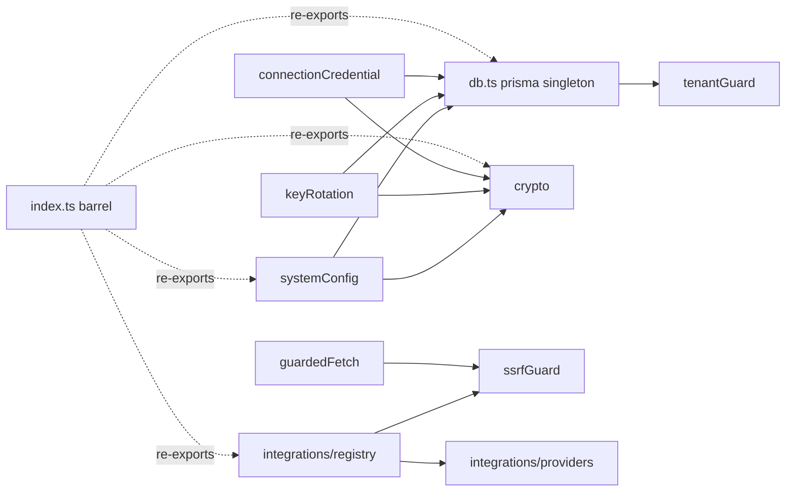

# Shared library (@auto-swe/shared)

> Indexed at commit `d0a90fb5` on 2026-10-06 · [view on GitHub](https://github.com/yorch/auto-swe/tree/d0a90fb5)

## Relevant source files

- [packages/shared/package.json](https://github.com/yorch/auto-swe/blob/d0a90fb5/packages/shared/package.json)
- [packages/shared/src/index.ts](https://github.com/yorch/auto-swe/blob/d0a90fb5/packages/shared/src/index.ts)
- [packages/shared/src/db.ts](https://github.com/yorch/auto-swe/blob/d0a90fb5/packages/shared/src/db.ts)
- [packages/shared/src/agentKeys.ts](https://github.com/yorch/auto-swe/blob/d0a90fb5/packages/shared/src/agentKeys.ts)
- [packages/shared/src/lib/tenantGuard.ts](https://github.com/yorch/auto-swe/blob/d0a90fb5/packages/shared/src/lib/tenantGuard.ts)
- [packages/shared/src/lib/crypto.ts](https://github.com/yorch/auto-swe/blob/d0a90fb5/packages/shared/src/lib/crypto.ts)
- [packages/shared/src/lib/keyRotation.ts](https://github.com/yorch/auto-swe/blob/d0a90fb5/packages/shared/src/lib/keyRotation.ts)
- [packages/shared/src/lib/systemConfig.ts](https://github.com/yorch/auto-swe/blob/d0a90fb5/packages/shared/src/lib/systemConfig.ts)
- [packages/shared/src/lib/workflowId.ts](https://github.com/yorch/auto-swe/blob/d0a90fb5/packages/shared/src/lib/workflowId.ts)
- [packages/shared/src/lib/modelSpec.ts](https://github.com/yorch/auto-swe/blob/d0a90fb5/packages/shared/src/lib/modelSpec.ts)
- [packages/shared/src/lib/guardedFetch.ts](https://github.com/yorch/auto-swe/blob/d0a90fb5/packages/shared/src/lib/guardedFetch.ts)
- [packages/shared/src/lib/ssrfGuard.ts](https://github.com/yorch/auto-swe/blob/d0a90fb5/packages/shared/src/lib/ssrfGuard.ts)
- [packages/shared/src/lib/regexExec.ts](https://github.com/yorch/auto-swe/blob/d0a90fb5/packages/shared/src/lib/regexExec.ts)
- [packages/shared/src/lib/connectionCredential.ts](https://github.com/yorch/auto-swe/blob/d0a90fb5/packages/shared/src/lib/connectionCredential.ts)
- [packages/shared/src/lib/repoMembership.ts](https://github.com/yorch/auto-swe/blob/d0a90fb5/packages/shared/src/lib/repoMembership.ts)
- [packages/shared/src/lib/syncBuiltins.ts](https://github.com/yorch/auto-swe/blob/d0a90fb5/packages/shared/src/lib/syncBuiltins.ts)
- [packages/shared/src/lib/integrations/registry.ts](https://github.com/yorch/auto-swe/blob/d0a90fb5/packages/shared/src/lib/integrations/registry.ts)

## Overview

`@auto-swe/shared` is the private base package of the monorepo. It owns the Prisma schema and the singleton database client, the encryption primitives for stored secrets, the resolvers for system configuration, the connector registry for issue trackers and knowledge bases, and the types and helpers that the gateway, worker, web dashboard, CLI and SDK all import. Nothing in it runs a server; it is a library of modules consumed through a wide `exports` map.

The public surface has three layers. The root barrel [packages/shared/src/index.ts](https://github.com/yorch/auto-swe/blob/d0a90fb5/packages/shared/src/index.ts#L1-L118) re-exports the most common symbols (`prisma`, resolvers, crypto, connection and workspace-provider metadata, API and workflow types). Deep subpaths such as `@auto-swe/shared/lib/crypto` or `@auto-swe/shared/db` are declared one by one in `package.json`. Larger domains (the workflow spec and interpreter, the settings registry, bundles, skills and scanner patterns) live in sibling directories that have their own pages.

Sources: [packages/shared/src/index.ts:L1-L118](https://github.com/yorch/auto-swe/blob/d0a90fb5/packages/shared/src/index.ts#L1-L118) [packages/shared/package.json](https://github.com/yorch/auto-swe/blob/d0a90fb5/packages/shared/package.json)

## Architecture

```mermaid
flowchart LR
    db[db.ts prisma singleton] --> tenantGuard
    systemConfig --> db
    systemConfig --> crypto
    keyRotation --> crypto
    keyRotation --> db
    registry[integrations/registry] --> ssrfGuard
    registry --> providers[integrations/providers]
    guardedFetch --> ssrfGuard
    connectionCredential --> crypto
    connectionCredential --> db
    index[index.ts barrel] -.re-exports.-> systemConfig
    index -.re-exports.-> crypto
    index -.re-exports.-> registry
    index -.re-exports.-> db
```

Almost every stateful module sits on top of `db.ts`, which attaches the tenant guard. Secrets pass through `crypto.ts` on their way in and out of the configuration tables. Outbound connector traffic is checked by `ssrfGuard.ts`, with `guardedFetch.ts` applying that check across redirect hops. The barrel only re-exports; it adds no behaviour.

Sources: [packages/shared/src/db.ts:L1-L31](https://github.com/yorch/auto-swe/blob/d0a90fb5/packages/shared/src/db.ts#L1-L31) [packages/shared/src/index.ts:L1-L118](https://github.com/yorch/auto-swe/blob/d0a90fb5/packages/shared/src/index.ts#L1-L118)

## Module Layout

| Module | Path | Responsibility |
| ------ | ---- | -------------- |
| Prisma singleton | `packages/shared/src/db.ts` | Process-wide `PrismaClient` with the tenant guard attached |
| Agent keys | `packages/shared/src/agentKeys.ts` | `MODEL_BACKED_AGENT_KEYS` convenience set |
| Types | `packages/shared/src/types/` | `api.ts` (REST shapes, terminal-status helpers) and `workflow.ts` |
| Crypto and rotation | `packages/shared/src/lib/crypto.ts`, `keyRotation.ts` | AES-256-GCM envelope and key rotation |
| System config | `packages/shared/src/lib/systemConfig.ts` | DB-primary resolvers with environment fallback |
| Integrations | `packages/shared/src/lib/integrations/` | Issue tracker, knowledge base and Figma providers plus registry |
| Network guards | `packages/shared/src/lib/ssrfGuard.ts`, `guardedFetch.ts` | Address screening and redirect-checked fetch |
| Repository access | `packages/shared/src/lib/repoMembership.ts`, `connectionCredential.ts` | Team membership predicates and per-user credentials |
| Workflow identity | `packages/shared/src/lib/workflowId.ts` | Workflow ID and branch name generation |
| Scanner execution | `packages/shared/src/lib/regexExec.ts` | Budgeted regex execution in a worker thread |
| Built-in seeding | `packages/shared/src/lib/syncBuiltins.ts` | Idempotent seed of scanner patterns, policies and model catalog |

Sources: [packages/shared/src/lib/syncBuiltins.ts:L169-L180](https://github.com/yorch/auto-swe/blob/d0a90fb5/packages/shared/src/lib/syncBuiltins.ts#L169-L180) [packages/shared/src/lib/repoMembership.ts:L14-L57](https://github.com/yorch/auto-swe/blob/d0a90fb5/packages/shared/src/lib/repoMembership.ts#L14-L57) [packages/shared/src/agentKeys.ts:L14-L29](https://github.com/yorch/auto-swe/blob/d0a90fb5/packages/shared/src/agentKeys.ts#L14-L29)

## Key Components

### Prisma singleton and tenant guard

[packages/shared/src/db.ts#L8-L31](https://github.com/yorch/auto-swe/blob/d0a90fb5/packages/shared/src/db.ts#L8-L31) builds the `PrismaClient` over the `@prisma/adapter-pg` driver from `DATABASE_URL`, throwing if it is unset, and wraps it with `tenantGuardExtension()`. The instance is cached on `globalThis` outside production so hot reload does not open extra pools. Attaching the guard here, rather than in the gateway, means the worker is guarded too.

The guard in [packages/shared/src/lib/tenantGuard.ts](https://github.com/yorch/auto-swe/blob/d0a90fb5/packages/shared/src/lib/tenantGuard.ts#L25-L59) holds a `TENANT_SCOPED_MODELS` set (models with a `teamId` or `orgId` column, for example `Agent`, `MemoryItem`, `Skill`, `WorkflowTemplate`) and a `GUARDED_OPERATIONS` set (`findMany`, `count`, `updateMany`, `deleteMany`, `aggregate`, `groupBy`). A guarded operation on a scoped model without a tenant predicate raises `UnscopedTenantQueryError`, or logs a warning when `TENANT_GUARD_WARN=1` ([L230-L265](https://github.com/yorch/auto-swe/blob/d0a90fb5/packages/shared/src/lib/tenantGuard.ts#L230-L265)). Intentional cross-tenant queries go through `runUnscoped(reason, models, fn)` ([L146](https://github.com/yorch/auto-swe/blob/d0a90fb5/packages/shared/src/lib/tenantGuard.ts#L146)). The file's own header states that it does not replace row-level security.

Sources: [packages/shared/src/db.ts:L8-L31](https://github.com/yorch/auto-swe/blob/d0a90fb5/packages/shared/src/db.ts#L8-L31) [packages/shared/src/lib/tenantGuard.ts:L25-L59](https://github.com/yorch/auto-swe/blob/d0a90fb5/packages/shared/src/lib/tenantGuard.ts#L25-L59) [packages/shared/src/lib/tenantGuard.ts:L230-L265](https://github.com/yorch/auto-swe/blob/d0a90fb5/packages/shared/src/lib/tenantGuard.ts#L230-L265)

### Encryption and key rotation

`encryptSecret` produces an `EncryptedSecret` carrying `ciphertext`, `nonce`, `authTag`, `keyVersion` and `lastFour`; it rejects an empty plaintext and stamps new ciphertext with `currentKeyVersion()` ([packages/shared/src/lib/crypto.ts#L105-L125](https://github.com/yorch/auto-swe/blob/d0a90fb5/packages/shared/src/lib/crypto.ts#L105-L125)). Keys are 32 bytes, base64-decoded from `CONFIG_ENCRYPTION_KEY`, with at most one previous key honoured during rotation ([crypto.ts:L25-L60](https://github.com/yorch/auto-swe/blob/d0a90fb5/packages/shared/src/lib/crypto.ts#L25-L60)). `assertEncryptionKeyConfigured` is the start-up check.

`rotateEncryptionKey` re-encrypts every row listed in `ENCRYPTED_FIELDS`, a map from Prisma delegate to its encrypted column groups. A coverage test derives the same set from `schema.prisma` so an unlisted encrypted column fails CI ([packages/shared/src/lib/keyRotation.ts:L70-L134](https://github.com/yorch/auto-swe/blob/d0a90fb5/packages/shared/src/lib/keyRotation.ts#L70-L134)). The `keys:rotate` script in `package.json` runs it.

Sources: [packages/shared/src/lib/crypto.ts:L25-L125](https://github.com/yorch/auto-swe/blob/d0a90fb5/packages/shared/src/lib/crypto.ts#L25-L125) [packages/shared/src/lib/keyRotation.ts:L70-L134](https://github.com/yorch/auto-swe/blob/d0a90fb5/packages/shared/src/lib/keyRotation.ts#L70-L134)

### System configuration resolvers

[packages/shared/src/lib/systemConfig.ts](https://github.com/yorch/auto-swe/blob/d0a90fb5/packages/shared/src/lib/systemConfig.ts#L1-L30) reads the singleton config tables (`id = 'default'`) and falls back to environment variables. It loads `prisma` lazily so importing it in tests does not require `DATABASE_URL`, and it keeps no in-process cache; callers wrap it themselves. Database-backed resolvers include `resolveGitHubConfig`, `resolveSlackConfig`, `resolveWorkflowDefaults`, `resolveIssueTrackerConfig`, `resolveKnowledgeBaseConfig` and `resolveFigmaConfig`. Environment-only resolvers include `resolveGoogleOAuthConfig`, `resolveOktaOAuthConfig`, `resolveStorageConfig` and `resolveWorkspaceInfra` ([L627-L801](https://github.com/yorch/auto-swe/blob/d0a90fb5/packages/shared/src/lib/systemConfig.ts#L627-L801)).

The `ResolveOpts.orgId` parameter is reserved for multi-org rows and ignored today. Operator-tunable knobs are not here; they belong to the settings registry in `src/config/`, covered on its own page.

Sources: [packages/shared/src/lib/systemConfig.ts:L1-L90](https://github.com/yorch/auto-swe/blob/d0a90fb5/packages/shared/src/lib/systemConfig.ts#L1-L90) [packages/shared/src/lib/systemConfig.ts:L627-L801](https://github.com/yorch/auto-swe/blob/d0a90fb5/packages/shared/src/lib/systemConfig.ts#L627-L801)

### Integration registry

`createIssueTrackerProvider` switches on `config.provider` to build a `JiraProvider` (over `AtlassianClient`), `LinearProvider` or `GitHubIssuesProvider`, returning `null` when the token or base URL is missing or fails the SSRF check ([packages/shared/src/lib/integrations/registry.ts:L81-L131](https://github.com/yorch/auto-swe/blob/d0a90fb5/packages/shared/src/lib/integrations/registry.ts#L81-L131)). `createKnowledgeBaseProvider` (Confluence and Notion) and `createFigmaDesignProvider` follow the same pattern ([L134](https://github.com/yorch/auto-swe/blob/d0a90fb5/packages/shared/src/lib/integrations/registry.ts#L134), [L165](https://github.com/yorch/auto-swe/blob/d0a90fb5/packages/shared/src/lib/integrations/registry.ts#L165)). Provider implementations sit in `lib/integrations/providers/`.

Sources: [packages/shared/src/lib/integrations/registry.ts:L81-L170](https://github.com/yorch/auto-swe/blob/d0a90fb5/packages/shared/src/lib/integrations/registry.ts#L81-L170)

### Outbound request guards

`ssrfGuard.ts` exposes `isSafeProbeUrl`, `checkProbeUrl(apiBase, { allowPrivate })` and `checkConnectorBaseUrl`, plus address predicates `isReservedAddress` and `isFakeIpAddress` ([packages/shared/src/lib/ssrfGuard.ts:L76-L302](https://github.com/yorch/auto-swe/blob/d0a90fb5/packages/shared/src/lib/ssrfGuard.ts#L76-L302)). `fetchGuarded` follows redirects manually for at most `MAX_GUARDED_REDIRECTS` (3) hops, re-runs the caller's `check` on every hop, sends credential headers only to `credentialOrigin`, and refuses a cross-origin redirect for a write ([guardedFetch.ts:L44-L80](https://github.com/yorch/auto-swe/blob/d0a90fb5/packages/shared/src/lib/guardedFetch.ts#L44-L80)). `fetchImpl` is a required option, so there is no bare-`fetch` default.

Sources: [packages/shared/src/lib/guardedFetch.ts:L12-L80](https://github.com/yorch/auto-swe/blob/d0a90fb5/packages/shared/src/lib/guardedFetch.ts#L12-L80) [packages/shared/src/lib/ssrfGuard.ts:L76-L302](https://github.com/yorch/auto-swe/blob/d0a90fb5/packages/shared/src/lib/ssrfGuard.ts#L76-L302)

### Repository access and credentials

`repoMembership.ts` provides `repoMembersSelect`, `allRepoMemberships`, `isRepoMember` and `repoMemberWhere`, so every caller asks membership through one definition that covers both the owning team and shared teams ([packages/shared/src/lib/repoMembership.ts:L14-L57](https://github.com/yorch/auto-swe/blob/d0a90fb5/packages/shared/src/lib/repoMembership.ts#L14-L57)). `connectionCredential.ts` implements per-user GitHub credentials: `credentialHostAllowed`, `repositoryHostsAllowed` and `resolveUserCredential`, which applies the host allowlist and returns a `UsableCredential` ([connectionCredential.ts:L73-L230](https://github.com/yorch/auto-swe/blob/d0a90fb5/packages/shared/src/lib/connectionCredential.ts#L73-L230)).

Sources: [packages/shared/src/lib/repoMembership.ts:L14-L57](https://github.com/yorch/auto-swe/blob/d0a90fb5/packages/shared/src/lib/repoMembership.ts#L14-L57) [packages/shared/src/lib/connectionCredential.ts:L73-L230](https://github.com/yorch/auto-swe/blob/d0a90fb5/packages/shared/src/lib/connectionCredential.ts#L73-L230)

### Workflow identity and model specs

`generateWorkflowId` builds `eng-<org>-<repo>-<ticket>` with owner and repository lowercased and the ticket casing preserved; `chooseWorkflowId` resolves collisions between repositories whose hyphenated parts produce the same string ([packages/shared/src/lib/workflowId.ts:L1-L67](https://github.com/yorch/auto-swe/blob/d0a90fb5/packages/shared/src/lib/workflowId.ts#L1-L67)). `parseProviderModelSpec` splits `<provider>/<model-id>`, lowercases the provider, and keeps any further slashes in the model id ([modelSpec.ts:L16-L28](https://github.com/yorch/auto-swe/blob/d0a90fb5/packages/shared/src/lib/modelSpec.ts#L16-L28)). `MODEL_BACKED_AGENT_KEYS` lists seven seeded agents, from `implementer` through `channelAssistant`, and is not the agent universe ([agentKeys.ts:L14-L29](https://github.com/yorch/auto-swe/blob/d0a90fb5/packages/shared/src/agentKeys.ts#L14-L29)).

Sources: [packages/shared/src/lib/workflowId.ts:L1-L67](https://github.com/yorch/auto-swe/blob/d0a90fb5/packages/shared/src/lib/workflowId.ts#L1-L67) [packages/shared/src/lib/modelSpec.ts:L16-L28](https://github.com/yorch/auto-swe/blob/d0a90fb5/packages/shared/src/lib/modelSpec.ts#L16-L28) [packages/shared/src/agentKeys.ts:L14-L29](https://github.com/yorch/auto-swe/blob/d0a90fb5/packages/shared/src/agentKeys.ts#L14-L29)

### Budgeted regex execution

`regexExec.ts` runs scanner patterns in a pooled worker thread with a wall-clock budget, `DEFAULT_REGEX_BUDGET_MS` of 250 ms, and a per-process quarantine of `REGEX_QUARANTINE_TTL_MS` (10 minutes) for patterns that overrun ([packages/shared/src/lib/regexExec.ts:L84-L150](https://github.com/yorch/auto-swe/blob/d0a90fb5/packages/shared/src/lib/regexExec.ts#L84-L150)). The scanners that consume it are covered on the skills and scanners page.

Sources: [packages/shared/src/lib/regexExec.ts:L84-L150](https://github.com/yorch/auto-swe/blob/d0a90fb5/packages/shared/src/lib/regexExec.ts#L84-L150)

## Configuration & Extension Points

| Setting | Type | Default | Purpose |
| ------- | ---- | ------- | ------- |
| `DATABASE_URL` | env string | none, required | Connection string for the Prisma singleton |
| `CONFIG_ENCRYPTION_KEY` | base64, 32 bytes | none, required | Current key for secret envelopes |
| `CONFIG_ENCRYPTION_KEY_VERSION` | integer | see `currentKeyVersion()` | Version stamped on new ciphertext |
| `TENANT_GUARD_WARN` | `'1'` or unset | unset (throw) | Downgrade tenant-guard violations to warnings |
| `SCANNER_REGEX_BUDGET_MS` | integer ms | 250 | Per-target regex budget, resolved by `resolveRegexBudgetMs()` |

New subpath imports are added by declaring an entry in the `exports` map; the build is `yarn db:generate && tsc` and emits to `dist/`.

Sources: [packages/shared/src/db.ts:L8-L31](https://github.com/yorch/auto-swe/blob/d0a90fb5/packages/shared/src/db.ts#L8-L31) [packages/shared/src/lib/tenantGuard.ts:L230-L236](https://github.com/yorch/auto-swe/blob/d0a90fb5/packages/shared/src/lib/tenantGuard.ts#L230-L236) [packages/shared/src/lib/regexExec.ts:L84-L106](https://github.com/yorch/auto-swe/blob/d0a90fb5/packages/shared/src/lib/regexExec.ts#L84-L106) [packages/shared/package.json](https://github.com/yorch/auto-swe/blob/d0a90fb5/packages/shared/package.json)

## Related Pages

- Data model: [2.1 Data model](./2.1-data-model.md)
- Workflow spec and interpreter: [2.2 Workflow spec and interpreter](./2.2-workflow-spec-and-interpreter.md)
- Configuration and settings: [2.3 Configuration and settings](./2.3-configuration-and-settings.md)
- Skills and scanners: [2.4 Skills and security scanners](./2.4-skills-and-security-scanners.md)
