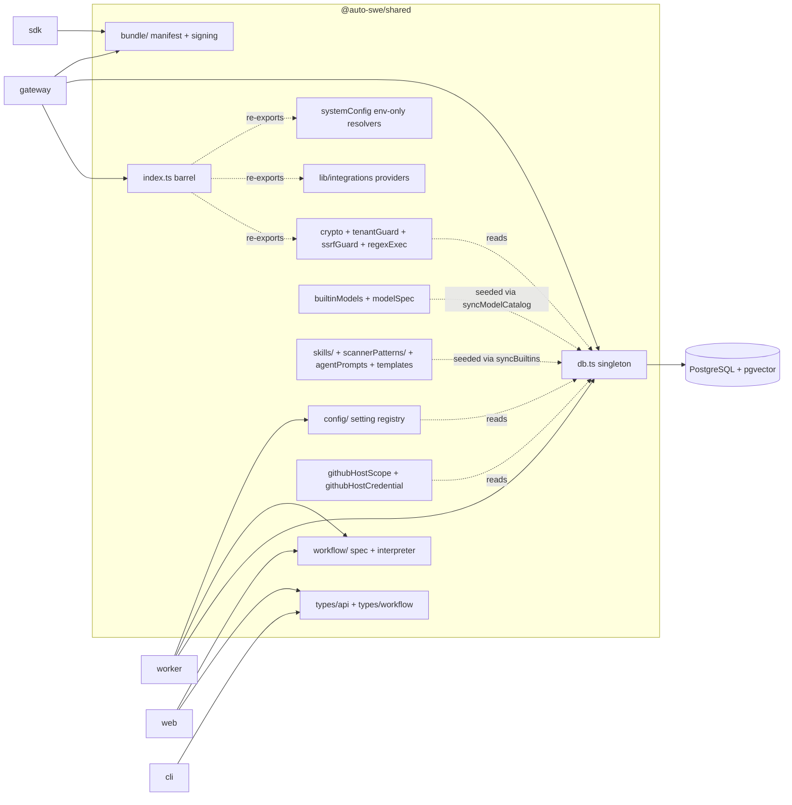

# @auto-swe/shared — Schema, Types, and Cross-Cutting Libraries

> Indexed at commit `ae416937` on 2026-10-03 · [view on GitHub](https://github.com/yorch/auto-swe/tree/ae416937)

## Relevant source files

- [packages/shared/package.json](https://github.com/yorch/auto-swe/blob/ae416937/packages/shared/package.json)
- [packages/shared/src/index.ts](https://github.com/yorch/auto-swe/blob/ae416937/packages/shared/src/index.ts)
- [packages/shared/src/db.ts](https://github.com/yorch/auto-swe/blob/ae416937/packages/shared/src/db.ts)
- [packages/shared/src/agentKeys.ts](https://github.com/yorch/auto-swe/blob/ae416937/packages/shared/src/agentKeys.ts)
- [packages/shared/src/types/workflow.ts](https://github.com/yorch/auto-swe/blob/ae416937/packages/shared/src/types/workflow.ts)
- [packages/shared/src/types/api.ts](https://github.com/yorch/auto-swe/blob/ae416937/packages/shared/src/types/api.ts)
- [packages/shared/src/lib/crypto.ts](https://github.com/yorch/auto-swe/blob/ae416937/packages/shared/src/lib/crypto.ts)
- [packages/shared/src/lib/keyRotation.ts](https://github.com/yorch/auto-swe/blob/ae416937/packages/shared/src/lib/keyRotation.ts)
- [packages/shared/src/lib/systemConfig.ts](https://github.com/yorch/auto-swe/blob/ae416937/packages/shared/src/lib/systemConfig.ts)
- [packages/shared/src/lib/tenantGuard.ts](https://github.com/yorch/auto-swe/blob/ae416937/packages/shared/src/lib/tenantGuard.ts)
- [packages/shared/src/lib/regexSafety.ts](https://github.com/yorch/auto-swe/blob/ae416937/packages/shared/src/lib/regexSafety.ts)
- [packages/shared/src/lib/regexExec.ts](https://github.com/yorch/auto-swe/blob/ae416937/packages/shared/src/lib/regexExec.ts)
- [packages/shared/src/lib/ssrfGuard.ts](https://github.com/yorch/auto-swe/blob/ae416937/packages/shared/src/lib/ssrfGuard.ts)
- [packages/shared/src/lib/syncBuiltins.ts](https://github.com/yorch/auto-swe/blob/ae416937/packages/shared/src/lib/syncBuiltins.ts)
- [packages/shared/src/lib/builtinModels.ts](https://github.com/yorch/auto-swe/blob/ae416937/packages/shared/src/lib/builtinModels.ts)
- [packages/shared/src/lib/modelSpec.ts](https://github.com/yorch/auto-swe/blob/ae416937/packages/shared/src/lib/modelSpec.ts)
- [packages/shared/src/lib/githubHostCredential.ts](https://github.com/yorch/auto-swe/blob/ae416937/packages/shared/src/lib/githubHostCredential.ts)
- [packages/shared/src/lib/githubHostScope.ts](https://github.com/yorch/auto-swe/blob/ae416937/packages/shared/src/lib/githubHostScope.ts)
- [packages/shared/src/lib/agentPrompts.ts](https://github.com/yorch/auto-swe/blob/ae416937/packages/shared/src/lib/agentPrompts.ts)
- [packages/shared/src/lib/integrations/registry.ts](https://github.com/yorch/auto-swe/blob/ae416937/packages/shared/src/lib/integrations/registry.ts)
- [packages/shared/src/bundle/index.ts](https://github.com/yorch/auto-swe/blob/ae416937/packages/shared/src/bundle/index.ts)
- [packages/shared/src/scripts/rotateEncryptionKey.ts](https://github.com/yorch/auto-swe/blob/ae416937/packages/shared/src/scripts/rotateEncryptionKey.ts)

## Overview

`@auto-swe/shared` is the dependency root of the monorepo. It owns the Prisma schema and the singleton client every other package queries through, the TypeScript types that describe workflow payloads and HTTP responses, the workflow specification language and its interpreter, the operator setting registry, the model catalog's built-in prices and spec parser, the seeded library content (agent prompts, skills, scanner patterns, templates), and the cross-cutting security primitives: envelope encryption, tenant scoping, Server-Side Request Forgery (SSRF) blocking, and bounded regular-expression execution.

Nothing in the package is a service. It has no HTTP surface, no Temporal registration, and no React tree. It is consumed by all five sibling packages, and the direction of that dependency is strictly one-way: shared never imports from gateway, worker, web, cli, or sdk. Its runtime dependencies are the Prisma client and its `pg` adapter, `pg` itself, `zod`, `bcrypt`, `dotenv-expand`, the Temporal client (for the trace-context interceptor), and the OpenTelemetry Node SDK ([packages/shared/package.json#L110-L123](https://github.com/yorch/auto-swe/blob/ae416937/packages/shared/package.json#L110-L123)). The schema holds 75 models; the living reference for how the pieces fit is [`docs/architecture.md`](https://github.com/yorch/auto-swe/blob/ae416937/docs/architecture.md).

Sources: [packages/shared/package.json:L1-L135](https://github.com/yorch/auto-swe/blob/ae416937/packages/shared/package.json#L1-L135) [packages/shared/src/index.ts:L1-L118](https://github.com/yorch/auto-swe/blob/ae416937/packages/shared/src/index.ts#L1-L118)

## Architecture

```mermaid
flowchart LR
    subgraph Shared["@auto-swe/shared"]
        Barrel[index.ts barrel]
        DB[db.ts singleton]
        Types[types/api + types/workflow]
        Wf[workflow/ spec + interpreter]
        Cfg[config/ setting registry]
        Env[systemConfig env-only resolvers]
        Models[builtinModels + modelSpec]
        Seed[skills/ + scannerPatterns/ + agentPrompts + templates]
        Sec[crypto + tenantGuard + ssrfGuard + regexExec]
        Gh[githubHostScope + githubHostCredential]
        Int[lib/integrations providers]
        Bun[bundle/ manifest + signing]
    end

    Prisma[(PostgreSQL + pgvector)]

    DB --> Prisma
    Cfg -.reads.-> DB
    Sec -.reads.-> DB
    Gh -.reads.-> DB
    Seed -.seeded via syncBuiltins.-> DB
    Models -.seeded via syncModelCatalog.-> DB
    Barrel -.re-exports.-> Sec
    Barrel -.re-exports.-> Int
    Barrel -.re-exports.-> Env

    Gateway[gateway] --> Barrel
    Gateway --> DB
    Gateway --> Bun
    Worker[worker] --> DB
    Worker --> Wf
    Worker --> Cfg
    Web[web] --> Types
    Web --> Wf
    CLI[cli] --> Types
    SDK[sdk] --> Bun
```

The diagram shows the two access patterns. Runtime services reach the database only through `db.ts`, so the tenant-guard extension attached there covers every consumer. Pure modules (the workflow spec, the bundle format, the regex safety checks, the agent-run payload) carry no input/output at all, which is what lets the browser bundle in `web` and the I/O-free `sdk` import them. The environment-only resolvers never touch the database; they appear as their own node because they are the one place `process.env` is read for sign-in, storage, and workspace settings.

Sources: [packages/shared/src/db.ts:L1-L31](https://github.com/yorch/auto-swe/blob/ae416937/packages/shared/src/db.ts#L1-L31) [packages/shared/package.json:L8-L95](https://github.com/yorch/auto-swe/blob/ae416937/packages/shared/package.json#L8-L95)

## Module Layout

| Module | Path | Responsibility |
| --- | --- | --- |
| Barrel | `src/index.ts` | Curated re-export of the most-used values and types |
| Database | `src/db.ts` | Singleton `PrismaClient` with the tenant guard attached |
| Schema | `src/prisma/` | `schema.prisma`, the baseline and custom-DDL migrations, `seed.ts`, `schemaModels.ts` |
| Types | `src/types/` | Workflow payload contracts and HTTP data-transfer objects |
| Workflow | `src/workflow/` | Spec schema, interpreter, expressions, step registry, cost estimator, built-in templates and their authoring helpers |
| Config | `src/config/` | Setting registry, cascade resolver, permission rules, cache |
| Libraries | `src/lib/` | 57 modules: cryptography, guards, resolvers, model catalog helpers, GitHub host scoping, integrations, pure helpers |
| Skills | `src/skills/` | Built-in prompt fragments, one file per skill |
| Scanner patterns | `src/scannerPatterns/` | Built-in security regular expressions |
| Bundle | `src/bundle/` | Portable library-content manifest, hashing, signing |
| Scripts | `src/scripts/` | Encryption-key rotation entry point |

The `lib/` count is the number of non-test `.ts` entries in `packages/shared/src/lib/`, which includes the `integrations/` directory as one entry.

Sources: [packages/shared/src/index.ts:L1-L118](https://github.com/yorch/auto-swe/blob/ae416937/packages/shared/src/index.ts#L1-L118) [packages/shared/package.json:L96-L109](https://github.com/yorch/auto-swe/blob/ae416937/packages/shared/package.json#L96-L109)

## The Export Surface

The package declares the root entry plus eighty-five subpath exports in [packages/shared/package.json#L8-L95](https://github.com/yorch/auto-swe/blob/ae416937/packages/shared/package.json#L8-L95), and the fine granularity is load-bearing rather than stylistic. Two consumers cannot afford the barrel: the Temporal workflow isolate in `packages/worker/src/workflows/` may only take type-only imports from external packages, and the Next.js dashboard must not pull `db.ts` into a client bundle. A deep import such as `@auto-swe/shared/workflow/spec` or `@auto-swe/shared/types/api` gives both a path that reaches exactly the module they need without dragging the Prisma client along.

The barrel at [packages/shared/src/index.ts#L1-L118](https://github.com/yorch/auto-swe/blob/ae416937/packages/shared/src/index.ts#L1-L118) is therefore a convenience layer, not the API. It is twenty-two export statements: `MODEL_BACKED_AGENT_KEYS`, the `prisma` singleton and `PrismaClient`, the generated `Prisma` namespace and the `ConfigAuditAction`, `ConfigScope`, and `Role` enums, the autonomy-policy schema, the connection-token and secret encryption helpers, the connection-type registry, the credential-scope guard, the issue-tracker and knowledge-base provider factories and their types, the outcome-publisher and workspace-provider metadata, ten system-config resolvers (GitHub, Slack, storage, issue tracker, knowledge base, Google and Okta sign-in, workflow defaults, scheduled sweeps, workspace infrastructure), and the workflow-identifier generators. The two type modules are re-exported wholesale with `export type *`, so anything in `types/api.ts` or `types/workflow.ts` is reachable from the package root without appearing in the barrel by name. The Figma resolver, the model-catalog modules, and the GitHub host modules are subpath-only.

Most of the subpaths are single modules under `lib/`: the repository-access and credential family (`lib/repoMembership`, `lib/repoAccessDecision`, `lib/repoAccessGate`, `lib/connectionCredential`, `lib/githubPermission`, `lib/githubHostScope`, `lib/githubHostCredential`, and their companions), the model family (`lib/modelSpec`, `lib/builtinModels`, `lib/modelDiscovery`, `lib/modelSuggestions`), the agent-run family (`lib/agentRun`, `lib/agentRunAdmission`, `lib/agentRunFailure`), and the integration providers. The rest are the workflow and config trees, `bundle`, `db`, `agentKeys`, and the two type modules.

Sources: [packages/shared/src/index.ts:L1-L118](https://github.com/yorch/auto-swe/blob/ae416937/packages/shared/src/index.ts#L1-L118) [packages/shared/package.json:L8-L95](https://github.com/yorch/auto-swe/blob/ae416937/packages/shared/package.json#L8-L95)

## Key Components

### The Prisma singleton and the tenant guard

`db.ts` constructs one `PrismaClient` per process behind a `globalThis` cache, using the Prisma 7 driver-adapter form (`PrismaPg` over `DATABASE_URL`) and throwing at construction when the connection string is absent ([packages/shared/src/db.ts#L12-L18](https://github.com/yorch/auto-swe/blob/ae416937/packages/shared/src/db.ts#L12-L18)). Under a non-production `NODE_ENV` the instance is stashed on the global so a watch-mode reload does not open a new pool each time.

The decisive line is [packages/shared/src/db.ts#L24](https://github.com/yorch/auto-swe/blob/ae416937/packages/shared/src/db.ts#L24), which wraps the base client in `tenantGuardExtension()`. Placing the guard on the singleton rather than on the gateway's Fastify decoration is deliberate: coverage should not depend on which file happens to call `$extends`, and the worker is the half that puts `MemoryItem` rows into an agent prompt. The guard fails any multi-row operation on a tenant-scoped model that carries no tenant predicate. It covers twenty-two models (`Agent`, `AgentTrace`, `Connection`, `ConnectionTeamShare`, `MemoryItem`, `ProviderCredential`, `Skill`, `Team`, `WorkflowTemplate` and thirteen more) and six operations: `findMany`, `count`, `aggregate`, `groupBy`, `updateMany`, `deleteMany` ([packages/shared/src/lib/tenantGuard.ts#L25-L58](https://github.com/yorch/auto-swe/blob/ae416937/packages/shared/src/lib/tenantGuard.ts#L25-L58)). Single-row lookups by identifier are exempt on purpose, since they leak at most one row and guarding them would mean rewriting every ownership check in the codebase.

A predicate counts only if it narrows: `NOT`, `not`, `notIn`, `none`, and `isNot` never scope, an `undefined` filter is dropped by Prisma and never scopes, and `teamId: null` scopes (it selects the GLOBAL rows) while `channelId: null` does not ([packages/shared/src/lib/tenantGuard.ts#L60-L115](https://github.com/yorch/auto-swe/blob/ae416937/packages/shared/src/lib/tenantGuard.ts#L60-L115)). The extension throws in every environment unless `TENANT_GUARD_WARN=1` is set ([packages/shared/src/lib/tenantGuard.ts#L213-L264](https://github.com/yorch/auto-swe/blob/ae416937/packages/shared/src/lib/tenantGuard.ts#L213-L264)). `runUnscoped` at [packages/shared/src/lib/tenantGuard.ts#L145](https://github.com/yorch/auto-swe/blob/ae416937/packages/shared/src/lib/tenantGuard.ts#L145) opens a named, reasoned escape hatch through `AsyncLocalStorage` for genuinely global operations such as key rotation, and awaits the wrapped query inside the region so the guard sees the right context.

Because route tests decorate a mocked Prisma and never run the extension, a second check reads the source: `tenantGuard.coverage.test.ts` parses every package with the TypeScript compiler and runs each mass query's `where` through the guard's own `hasTenantPredicate`, so the audit and the runtime agree by construction ([packages/shared/src/lib/tenantGuard.coverage.test.ts#L1-L50](https://github.com/yorch/auto-swe/blob/ae416937/packages/shared/src/lib/tenantGuard.coverage.test.ts#L1-L50)). The module documents its own limit: raw SQL bypasses the guard entirely, so this is defence in depth at the object-relational-mapping layer, not row-level security. The full model list and the schema behind it are on the [Data Model](./2.1-data-model.md) page.

Sources: [packages/shared/src/db.ts:L1-L31](https://github.com/yorch/auto-swe/blob/ae416937/packages/shared/src/db.ts#L1-L31) [packages/shared/src/lib/tenantGuard.ts:L1-L264](https://github.com/yorch/auto-swe/blob/ae416937/packages/shared/src/lib/tenantGuard.ts#L1-L264) [packages/shared/src/lib/tenantGuard.coverage.test.ts:L1-L50](https://github.com/yorch/auto-swe/blob/ae416937/packages/shared/src/lib/tenantGuard.coverage.test.ts#L1-L50)

### Shared type definitions

`types/workflow.ts` holds the payload contracts that cross the Temporal activity boundary: `RunRequest` and the `RepoWorkRequest` that extends it, `CodeResult` with its `FileChange` and `CodeSecurityFinding` members, `ReviewVerdict` and `AggregatedReviewResult`, `Subtask` and `DecompositionResult`, the epic-planning shapes, and the `BUDGET_TIERS` tuple that names the standard, large, and epic caps ([packages/shared/src/types/workflow.ts#L299-L300](https://github.com/yorch/auto-swe/blob/ae416937/packages/shared/src/types/workflow.ts#L299-L300)). These are the structured results the interpreter consumes; the delegation boundary in this codebase is that a sub-agent returns one of these typed values rather than a transcript.

`types/api.ts` is the wire contract between gateway and dashboard, and at 887 lines it is the larger of the two. It defines the generic `ApiResponse<T>` envelope ([packages/shared/src/types/api.ts#L7](https://github.com/yorch/auto-swe/blob/ae416937/packages/shared/src/types/api.ts#L7)), the summary and detail pairs for workflows, teams, repositories, users, templates, runs, epics, agent runs, and evaluations, and the status tuples the user interface renders from: `WORKFLOW_TEMPLATE_STATUSES`, `WORKFLOW_RUN_STATUSES`, `WORKFLOW_STEP_RECORD_STATUSES`, and `EVAL_SIGNAL_SOURCES` ([packages/shared/src/types/api.ts#L260-L319](https://github.com/yorch/auto-swe/blob/ae416937/packages/shared/src/types/api.ts#L260-L319), [packages/shared/src/types/api.ts#L762-L773](https://github.com/yorch/auto-swe/blob/ae416937/packages/shared/src/types/api.ts#L762-L773)). Declaring these once and importing them on both sides is what keeps a route's response and the component that renders it from drifting.

Sources: [packages/shared/src/types/workflow.ts:L1-L375](https://github.com/yorch/auto-swe/blob/ae416937/packages/shared/src/types/workflow.ts#L1-L375) [packages/shared/src/types/api.ts:L1-L887](https://github.com/yorch/auto-swe/blob/ae416937/packages/shared/src/types/api.ts#L1-L887)

### Envelope encryption and key rotation

Every secret the platform stores (provider API keys, connection tokens, integration credentials, per-host GitHub credentials, webhook secrets) passes through `lib/crypto.ts`. The scheme is AES-256-GCM with a per-record twelve-byte nonce and a separately stored sixteen-byte authentication tag, and each ciphertext is stamped with the key version that produced it ([packages/shared/src/lib/crypto.ts#L9-L13](https://github.com/yorch/auto-swe/blob/ae416937/packages/shared/src/lib/crypto.ts#L9-L13), [packages/shared/src/lib/crypto.ts#L112-L130](https://github.com/yorch/auto-swe/blob/ae416937/packages/shared/src/lib/crypto.ts#L112-L130)). The master key is read from `CONFIG_ENCRYPTION_KEY` as base64-encoded thirty-two bytes and cached for the process lifetime.

Rotation supports exactly one key in flight. `CONFIG_ENCRYPTION_KEY` is the write key and `CONFIG_ENCRYPTION_KEY_PREVIOUS` is a read-only key for the version immediately below, which is enough for the only state a rotation actually passes through. `assertEncryptionKeyConfigured()` at [packages/shared/src/lib/crypto.ts#L100](https://github.com/yorch/auto-swe/blob/ae416937/packages/shared/src/lib/crypto.ts#L100) is the boot guard both services call first thing, so a missing or wrong-length key kills the process at startup instead of on the first credential read. `encryptSecret` also records a `lastFour` hint, and suppresses it for secrets shorter than eight characters on the reasoning that four characters of an eight-character secret is half of it.

`lib/keyRotation.ts` re-encrypts every stored secret under the current key. Its `ENCRYPTED_FIELDS` map at [packages/shared/src/lib/keyRotation.ts#L77-L103](https://github.com/yorch/auto-swe/blob/ae416937/packages/shared/src/lib/keyRotation.ts#L77-L103) enumerates each encrypted column by model (connection, connection credential, the Figma, GitHub, issue-tracker, knowledge-base and Slack singletons, per-host GitHub credentials and webhook secrets, provider credentials, Slack workspaces), and a coverage test derives the same set from `schema.prisma` and fails when the two disagree, because a new encrypted column nobody registers would otherwise be skipped silently and become unreadable the moment the old key is dropped. Rotation runs row by row with no global transaction and skips rows already at the current version, so an interrupted run resumes by rerunning. The `yarn keys:rotate` script wires it up at [packages/shared/src/scripts/rotateEncryptionKey.ts](https://github.com/yorch/auto-swe/blob/ae416937/packages/shared/src/scripts/rotateEncryptionKey.ts#L1-L76). The configuration-side view of the same secrets is on the [Configuration and Settings](./2.3-configuration-and-settings.md) page.

Sources: [packages/shared/src/lib/crypto.ts:L1-L180](https://github.com/yorch/auto-swe/blob/ae416937/packages/shared/src/lib/crypto.ts#L1-L180) [packages/shared/src/lib/keyRotation.ts:L1-L225](https://github.com/yorch/auto-swe/blob/ae416937/packages/shared/src/lib/keyRotation.ts#L1-L225) [packages/shared/src/scripts/rotateEncryptionKey.ts:L1-L76](https://github.com/yorch/auto-swe/blob/ae416937/packages/shared/src/scripts/rotateEncryptionKey.ts#L1-L76)

### System config resolvers

`lib/systemConfig.ts` is the read path for integration credentials, workflow defaults, and the environment-only settings. It has two families with different sources.

The **database-primary** family reads a singleton configuration table (one row keyed `default`), decrypts the secret columns, and falls back to the matching environment variable when the row is absent, so a deployment that has never opened the admin interface keeps working. `resolveGitHubConfig`, `resolveSlackConfig`, `resolveIssueTrackerConfig`, `resolveKnowledgeBaseConfig`, and `resolveFigmaConfig` follow that shape, alongside `resolveWorkflowDefaults` at [packages/shared/src/lib/systemConfig.ts#L362](https://github.com/yorch/auto-swe/blob/ae416937/packages/shared/src/lib/systemConfig.ts#L362) and the consolidation, evaluation-schedule, revalidation, and canary variants.

The **environment-only** family never consults the database. Sign-in credentials for Google, Okta, and GitHub (`resolveGoogleOAuthConfig`, `resolveOktaOAuthConfig`, and the two OAuth fields of `resolveGitHubConfig`), artifact storage (`resolveStorageConfig`, which picks the `s3` backend when a bucket is set and `inline` otherwise), and workspace sizing, images, and worker and scanner bounds (`resolveWorkspaceInfra`) are infrastructure decisions read once at boot or per call from `process.env`, so they have no table and no admin tab ([packages/shared/src/lib/systemConfig.ts#L278-L304](https://github.com/yorch/auto-swe/blob/ae416937/packages/shared/src/lib/systemConfig.ts#L278-L304), [packages/shared/src/lib/systemConfig.ts#L625-L670](https://github.com/yorch/auto-swe/blob/ae416937/packages/shared/src/lib/systemConfig.ts#L625-L670)). `resolveWorkspaceInfra` returns the container memory, CPU, and pids caps, the default image, the metadata-blackhole sidecar image and switch, the per-worker activity concurrency, and the scanner regex budget; it is lenient (a bad value falls back to its default so a scan never throws), and a strict `assertWorkspaceInfraEnv()` runs at worker boot so a bad value fails the deploy instead ([packages/shared/src/lib/systemConfig.ts#L731-L876](https://github.com/yorch/auto-swe/blob/ae416937/packages/shared/src/lib/systemConfig.ts#L731-L876)). `resolveScheduledSweeps` does the same for the three Temporal Schedules the gateway applies at boot: repository access, repository dependency, and model discovery ([packages/shared/src/lib/systemConfig.ts#L878-L970](https://github.com/yorch/auto-swe/blob/ae416937/packages/shared/src/lib/systemConfig.ts#L878-L970)). The tail of the file also carries the plain readers for the public and web URLs, the Temporal address, transactional email, the better-auth bootstrap values, and the OpenTelemetry exporter settings.

Two properties hold for both families. The module imports the database lazily through a local `db()` helper ([packages/shared/src/lib/systemConfig.ts#L4-L8](https://github.com/yorch/auto-swe/blob/ae416937/packages/shared/src/lib/systemConfig.ts#L4-L8)) so importing it in a test does not trigger `DATABASE_URL` validation. And the resolvers hold no cache of their own, which keeps the shared package free of any cache implementation; the worker and gateway wrap them in their own time-to-live caches. Every resolver accepts a reserved `ResolveOpts.orgId` that is ignored, so threading org context through now makes per-org rows a resolver-internal change later ([packages/shared/src/lib/systemConfig.ts#L28-L33](https://github.com/yorch/auto-swe/blob/ae416937/packages/shared/src/lib/systemConfig.ts#L28-L33)).

Credentials for GitHub hosts other than the instance's are a separate library pair. `lib/githubHostScope.ts` decides which credential set a repository's host calls for (`instance`, `host`, or one of the refusal scopes) and never lets a platform credential leave its host family; `lib/githubHostCredential.ts` resolves that set, turning a per-host `GitHubHostCredential` row into the same `ResolvedGitHubConfig` shape so the token mechanics run unchanged and inherit nothing of the instance's token, App, or installation id ([packages/shared/src/lib/githubHostScope.ts#L1-L50](https://github.com/yorch/auto-swe/blob/ae416937/packages/shared/src/lib/githubHostScope.ts#L1-L50), [packages/shared/src/lib/githubHostCredential.ts#L95-L177](https://github.com/yorch/auto-swe/blob/ae416937/packages/shared/src/lib/githubHostCredential.ts#L95-L177)). The gateway side is on the [Repository Access and Credentials](./3.4-repository-access-and-credentials.md) page; the OAuth authorization server that MCP clients use is gateway code, covered on [MCP Server and OAuth](./3.5-mcp-server-and-oauth.md), and shares only the environment-driven sign-in settings above.

Sources: [packages/shared/src/lib/systemConfig.ts:L1-L970](https://github.com/yorch/auto-swe/blob/ae416937/packages/shared/src/lib/systemConfig.ts#L1-L970) [packages/shared/src/lib/githubHostScope.ts:L1-L194](https://github.com/yorch/auto-swe/blob/ae416937/packages/shared/src/lib/githubHostScope.ts#L1-L194) [packages/shared/src/lib/githubHostCredential.ts:L1-L177](https://github.com/yorch/auto-swe/blob/ae416937/packages/shared/src/lib/githubHostCredential.ts#L1-L177)

### Model catalog helpers

Pricing and model binding both start from a spec string of the form `<provider>/<model-id>`, and the shared package owns the three pieces every consumer needs. `parseProviderModelSpec` splits at the first slash, lowercases the provider, and preserves the model id as written ([packages/shared/src/lib/modelSpec.ts#L1-L29](https://github.com/yorch/auto-swe/blob/ae416937/packages/shared/src/lib/modelSpec.ts#L1-L29)). `BUILTIN_MODELS` is the baseline price table, 34 rows (16 Anthropic, 10 Google, 8 OpenAI) in USD per million tokens, each with a kind, a status, and a pricing-page URL ([packages/shared/src/lib/builtinModels.ts#L100-L422](https://github.com/yorch/auto-swe/blob/ae416937/packages/shared/src/lib/builtinModels.ts#L100-L422)). `lib/modelDiscovery.ts` and `lib/modelSuggestions.ts` list what each provider offers and record the unpriced gap as admin-reviewed suggestions without ever writing the catalog. The catalog table, the seeding rules, the worker's pricing path, and the discovery flow are described once, on [Model Catalog, Pricing, and Discovery](./4.7-model-catalog-and-pricing.md); this page does not repeat them.

Sources: [packages/shared/src/lib/modelSpec.ts:L1-L29](https://github.com/yorch/auto-swe/blob/ae416937/packages/shared/src/lib/modelSpec.ts#L1-L29) [packages/shared/src/lib/builtinModels.ts:L1-L422](https://github.com/yorch/auto-swe/blob/ae416937/packages/shared/src/lib/builtinModels.ts#L1-L422) [packages/shared/src/lib/modelDiscovery.ts:L1-L30](https://github.com/yorch/auto-swe/blob/ae416937/packages/shared/src/lib/modelDiscovery.ts#L1-L30) [packages/shared/src/lib/modelSuggestions.ts:L1-L40](https://github.com/yorch/auto-swe/blob/ae416937/packages/shared/src/lib/modelSuggestions.ts#L1-L40)

### Regular-expression safety and bounded execution

Scanner patterns are data supplied by administrators and installed bundles, and their bodies run in-process against agent text on every shell command, every file write, and every skill save. The package splits the problem across two modules with different purity requirements.

`lib/regexSafety.ts` is pure and synchronous, because the bundle authoring kit depends on it and must stay free of input/output ([packages/shared/src/lib/regexSafety.ts#L1-L17](https://github.com/yorch/auto-swe/blob/ae416937/packages/shared/src/lib/regexSafety.ts#L1-L17)). It owns the write-time policy: `checkRegexSafety` validates compilation, flags, and source length only, `SAFE_FLAGS_RE` restricts flags to `i`, `m`, `s`, `u`, and `v` so a cached expression cannot carry stateful `lastIndex` behaviour, and the caps that mirror the admin interface live here so bundle install cannot become a back door around them ([packages/shared/src/lib/regexSafety.ts#L19-L100](https://github.com/yorch/auto-swe/blob/ae416937/packages/shared/src/lib/regexSafety.ts#L19-L100)). It also supplies the input-shaping helpers with opposite guarantees: `capScanText` truncates at twenty thousand characters for advisory scanners, `chunkScanText` covers the whole input in overlapping windows for file-path scanning, and `shellScanTargets` builds the segment-aligned windows the shell scanner needs, because truncating a blocking scan is a detection bypass ([packages/shared/src/lib/regexSafety.ts#L107-L235](https://github.com/yorch/auto-swe/blob/ae416937/packages/shared/src/lib/regexSafety.ts#L107-L235)). The module's header records that static "does this look like a catastrophic pattern" analysis was tried and removed, having both missed real hangs and rejected two of the repository's own linear scanner expressions.

`lib/regexExec.ts` owns the runtime bound. A single pooled `worker_thread` executes every pattern and is terminated when a batch overruns a wall-clock budget, which is the only construction that actually interrupts a running JavaScript regular expression. The budget defaults to 250 milliseconds ([packages/shared/src/lib/regexExec.ts#L84](https://github.com/yorch/auto-swe/blob/ae416937/packages/shared/src/lib/regexExec.ts#L84)) and is the `regexScanBudgetMs` field of `resolveWorkspaceInfra()`, so it is a deployment-wide environment value (`SCANNER_REGEX_BUDGET_MS`, clamped to 10 ms through 60 s) rather than a database setting; `resolveRegexBudgetMs()` returns it and cannot fail ([packages/shared/src/lib/regexExec.ts#L103-L105](https://github.com/yorch/auto-swe/blob/ae416937/packages/shared/src/lib/regexExec.ts#L103-L105)). Overruns are attributed by bisecting the batch against a fresh thread, an isolated overrun is confirmed by a second solo run before it is believed, and a twice-confirmed pattern is quarantined for ten minutes per process ([packages/shared/src/lib/regexExec.ts#L92](https://github.com/yorch/auto-swe/blob/ae416937/packages/shared/src/lib/regexExec.ts#L92)). `runRegexBatch` never throws, so every failure resolves to a result marked incomplete and the caller decides. `probeRegexBacktracking` at [packages/shared/src/lib/regexExec.ts#L603](https://github.com/yorch/auto-swe/blob/ae416937/packages/shared/src/lib/regexExec.ts#L603) runs the same machinery at write time so an administrator gets an early error. The full behaviour and its residual risks are covered on the [Skills and Security Scanners](./2.4-skills-and-security-scanners.md) page.

Sources: [packages/shared/src/lib/regexSafety.ts:L1-L235](https://github.com/yorch/auto-swe/blob/ae416937/packages/shared/src/lib/regexSafety.ts#L1-L235) [packages/shared/src/lib/regexExec.ts:L1-L105](https://github.com/yorch/auto-swe/blob/ae416937/packages/shared/src/lib/regexExec.ts#L1-L105)

### SSRF guard and connector registry

`lib/ssrfGuard.ts` exposes a single `isSafeProbeUrl` used by every path that fetches an operator-supplied address: credential base-URL probes, Model Context Protocol connection targets, bundle install-from-URL, worker-side MCP server references, and the tracker, knowledge-base, and Figma connector bases. It rejects non-HTTP schemes and hostnames that resolve textually to loopback, link-local, private, or cloud-metadata ranges, including the IPv6 forms that embed an IPv4 address (IPv4-mapped, translated, and compatible, the NAT64 well-known prefix, and 6to4) and the short-octet notations a naive expression misses ([packages/shared/src/lib/ssrfGuard.ts#L20-L70](https://github.com/yorch/auto-swe/blob/ae416937/packages/shared/src/lib/ssrfGuard.ts#L20-L70)). It states its own boundary plainly: no name resolution is performed, so DNS rebinding is out of scope and belongs to container-level outbound policy.

`lib/integrations/` holds the outbound connectors themselves. `registry.ts` exposes `createIssueTrackerProvider`, `createKnowledgeBaseProvider`, and `createFigmaDesignProvider`, each dispatching a resolved configuration to a concrete implementation under `providers/` (Jira, Linear, GitHub Issues, Confluence, Notion, and Figma) behind the `IssueTrackerProvider` and `KnowledgeBaseProvider` interfaces ([packages/shared/src/lib/integrations/registry.ts#L79-L174](https://github.com/yorch/auto-swe/blob/ae416937/packages/shared/src/lib/integrations/registry.ts#L79-L174)). A shared `atlassianClient.ts` and an Atlassian Document Format helper back the two Atlassian providers.

Sources: [packages/shared/src/lib/ssrfGuard.ts:L1-L157](https://github.com/yorch/auto-swe/blob/ae416937/packages/shared/src/lib/ssrfGuard.ts#L1-L157) [packages/shared/src/lib/integrations/registry.ts:L1-L174](https://github.com/yorch/auto-swe/blob/ae416937/packages/shared/src/lib/integrations/registry.ts#L1-L174)

### Small helpers with one owner

A cluster of short modules exists so that a single formula has exactly one definition and two processes cannot drift apart on it.

| Module | Owns |
| --- | --- |
| `lib/workflowId.ts` | Temporal workflow identifier and branch-name formats; owner and repository are lowercased, and a repository on a non-instance host also carries that host in the id; the allocator disambiguates ids that collide across repositories |
| `lib/channelTask.ts` | Channel task workflow identifier, the `slack-<channel>-<thread>` external ticket id, steer signal name, seeded template names |
| `lib/agentRun.ts`, `agentRunAdmission.ts`, `agentRunFailure.ts` | The agent-run payload schema, reserved template name and origin, the non-launchable agent denylist, concurrency admission, and failure classification |
| `lib/billing.ts` | The `YYYY-MM` month bucket the usage writer and budget reader share, and an organisation's month spend across finalized, in-flight, and runless sources |
| `lib/canary.ts` | Deterministic FNV-1a hash routing a fraction of runs to a candidate agent version |
| `lib/scannerPatternLoader.ts`, `lib/scannerCache.ts` | The 60-second pattern-cache lifetime and the loader both gateway and worker use; `scannerCache` re-exports them under one subpath |
| `lib/securityTraceTags.ts` | The `AgentTrace.error` strings a scanner block writes, shared by the worker that writes them and the readers that classify them |
| `lib/temporalTracing.ts` | The client interceptor that carries W3C trace context in a workflow header |
| `lib/connectionGuards.ts` | The single predicate for "is this connection a usable git repository" |
| `lib/repoMembership.ts` | The one definition of "who belongs to a repository": owning team or any team it is shared with |
| `lib/accessActor.ts` | The structural subset of an authenticated caller an access decision reads, so gateway and worker share one decision |
| `lib/credentialScope.ts`, `lib/channelBudget.ts` | The GLOBAL, ORGANIZATION, or TEAM guard for provider credentials, and the single refund protocol for channel budget holds |
| `lib/repoDependency.ts`, `repoDependencyMatch.ts`, `repoDependencyResolver.ts` | Edge kinds and the label sanitiser, the three-tier matcher from a raw dependency string to a repository, and the neighbour context handed to agents |
| `lib/manifestParsers.ts` | Defensive parsers for five manifest files (`package.json`, `go.mod`, `requirements.txt`, `pom.xml`, `Cargo.toml`) plus `.gitmodules` and `CODEOWNERS`, returning empty rather than throwing |
| `lib/inputSchema.ts` | The small JSON-Schema subset a template declares its run inputs with |
| `lib/triggerMapping.ts` | Declarative event-to-run-input mapping, so no trigger path is hard-coded |
| `lib/autonomyPolicy.ts` | Autonomy rule schema plus the fail-safe fallback that requires approval |
| `lib/connectionTypes.ts` | The eight connection types and their per-type configuration schemas |
| `lib/workspaceProviders.ts` | The five workspace provider kinds |
| `lib/outcomePublishers.ts` | The six ways a run publishes its outcome |
| `lib/trackerWrite.ts`, `lib/trackerSync.ts` | Issue-tracker epic and story creation and the sync-on-event hook |
| `lib/telemetry.ts` | OpenTelemetry boot, a no-op when no exporter endpoint is set |

The label sanitiser is the clearest example of why these are centralised. Repository names are operator-supplied with no character or length limit and they reach agent prompts, so a name containing newlines and markdown headings could close the surrounding context block and append instructions of its own; stripping control characters, collapsing whitespace, and capping length is done once, in `sanitizeRepoLabel` behind `repoLabel`, rather than at each render site ([packages/shared/src/lib/repoDependency.ts#L15-L52](https://github.com/yorch/auto-swe/blob/ae416937/packages/shared/src/lib/repoDependency.ts#L15-L52)).

Sources: [packages/shared/src/lib/repoDependency.ts:L1-L52](https://github.com/yorch/auto-swe/blob/ae416937/packages/shared/src/lib/repoDependency.ts#L1-L52) [packages/shared/src/lib/workflowId.ts:L1-L125](https://github.com/yorch/auto-swe/blob/ae416937/packages/shared/src/lib/workflowId.ts#L1-L125) [packages/shared/src/lib/agentRun.ts:L1-L60](https://github.com/yorch/auto-swe/blob/ae416937/packages/shared/src/lib/agentRun.ts#L1-L60) [packages/shared/src/lib/canary.ts:L1-L47](https://github.com/yorch/auto-swe/blob/ae416937/packages/shared/src/lib/canary.ts#L1-L47) [packages/shared/src/lib/connectionTypes.ts:L1-L168](https://github.com/yorch/auto-swe/blob/ae416937/packages/shared/src/lib/connectionTypes.ts#L1-L168) [packages/shared/src/lib/billing.ts:L1-L25](https://github.com/yorch/auto-swe/blob/ae416937/packages/shared/src/lib/billing.ts#L1-L25) [packages/shared/src/lib/manifestParsers.ts:L14-L24](https://github.com/yorch/auto-swe/blob/ae416937/packages/shared/src/lib/manifestParsers.ts#L14-L24) [packages/shared/src/lib/scannerCache.ts:L1-L30](https://github.com/yorch/auto-swe/blob/ae416937/packages/shared/src/lib/scannerCache.ts#L1-L30)

### Repository access and per-user credentials

A group of modules answers one question in one place: may this person act on this repository, and with whose credential. `lib/repoMembership.ts` defines membership as the owning team or any team the repository is shared with through `ConnectionTeamShare`, and exports `repoMembersSelect`, `isRepoMember`, and `repoMemberWhere` so listings, launches, and the credential resolver cannot disagree ([packages/shared/src/lib/repoMembership.ts#L14-L57](https://github.com/yorch/auto-swe/blob/ae416937/packages/shared/src/lib/repoMembership.ts#L14-L57)). `lib/repoAccessGate.ts` resolves the `repoAccess.mode` setting (`off`, `advisory`, `enforce`) and `decideRepoLaunch` turns it into a launch decision; `lib/repoAccessDecision.ts` folds the team-membership test and that gate into one `decideRepoAccess`, because the two-step version had been omitted at several call sites ([packages/shared/src/lib/repoAccessDecision.ts#L160](https://github.com/yorch/auto-swe/blob/ae416937/packages/shared/src/lib/repoAccessDecision.ts#L160)). `lib/slackRepoAccess.ts` adds the Slack step of resolving a workspace user id to a platform user before taking the same decision.

The host side lives in `lib/githubPermission.ts` (ask GitHub what level of access a user holds), `lib/repoPermission.ts` (the gateway's path from a `Connection` row to that lookup), `lib/githubInstallation.ts` (installation tokens cached per installation rather than in one module-level slot, with a guard that refuses a credential minted for another host), `lib/githubIdentityCheck.ts` (verify a stored login still belongs to the same numeric account id), and `lib/repoAccessProjection.ts`, the single writer of the cached permission answer, which writes nothing on a failed lookup so an outage is never recorded as a denial. `lib/connectionCredential.ts` implements the opt-in per-user GitHub token: `resolveUserCredential` loads the repository's URLs itself and applies the host allowlist and origin binding before it returns a usable token ([packages/shared/src/lib/connectionCredential.ts#L210](https://github.com/yorch/auto-swe/blob/ae416937/packages/shared/src/lib/connectionCredential.ts#L210)). The credential column is registered in the key-rotation map, so `yarn keys:rotate` re-encrypts it. The gateway-side behaviour that consumes all of this is covered on the [Repository Access and Credentials](./3.4-repository-access-and-credentials.md) page.

Sources: [packages/shared/src/lib/repoMembership.ts:L1-L57](https://github.com/yorch/auto-swe/blob/ae416937/packages/shared/src/lib/repoMembership.ts#L1-L57) [packages/shared/src/lib/repoAccessGate.ts:L1-L320](https://github.com/yorch/auto-swe/blob/ae416937/packages/shared/src/lib/repoAccessGate.ts#L1-L320) [packages/shared/src/lib/repoAccessDecision.ts:L1-L286](https://github.com/yorch/auto-swe/blob/ae416937/packages/shared/src/lib/repoAccessDecision.ts#L1-L286) [packages/shared/src/lib/connectionCredential.ts:L1-L289](https://github.com/yorch/auto-swe/blob/ae416937/packages/shared/src/lib/connectionCredential.ts#L1-L289) [packages/shared/src/lib/githubPermission.ts:L1-L207](https://github.com/yorch/auto-swe/blob/ae416937/packages/shared/src/lib/githubPermission.ts#L1-L207) [packages/shared/src/lib/githubInstallation.ts:L1-L218](https://github.com/yorch/auto-swe/blob/ae416937/packages/shared/src/lib/githubInstallation.ts#L1-L218) [packages/shared/src/lib/repoPermission.ts:L1-L217](https://github.com/yorch/auto-swe/blob/ae416937/packages/shared/src/lib/repoPermission.ts#L1-L217)

### Seeded library content

The platform's flagship software-engineering behaviour ships as ordinary library content, not privileged runtime code, and this package is where that content lives. `lib/agentPrompts.ts` holds every agent system prompt as an exported constant, thirty-one in all. `skills/` holds thirty-five built-in prompt fragments, one per file, collected into `BUILTIN_SKILLS` at [packages/shared/src/skills/index.ts#L44](https://github.com/yorch/auto-swe/blob/ae416937/packages/shared/src/skills/index.ts#L44). `scannerPatterns/index.ts` holds sixty-three built-in security patterns (13 injection, 11 exfiltration, 18 shell-command, 10 code-security, 7 sensitive-file, 4 PII) ([packages/shared/src/scannerPatterns/index.ts#L61-L552](https://github.com/yorch/auto-swe/blob/ae416937/packages/shared/src/scannerPatterns/index.ts#L61-L552)). `workflow/templates/index.ts` collects twenty-six built-in workflow templates into `BUILTIN_TEMPLATES`, grouped as core, automated, signal-driven, parallel, human-in-the-loop, and the record, document, product, messaging, issue-tracker, and PRD packs ([packages/shared/src/workflow/templates/index.ts#L63-L293](https://github.com/yorch/auto-swe/blob/ae416937/packages/shared/src/workflow/templates/index.ts#L63-L293)). The templates are written with the helpers under `workflow/templates/authoring/` and stored flat; see [Workflow Spec and Interpreter](./2.2-workflow-spec-and-interpreter.md). The model catalog's 34 baseline rows are the fifth seeded set.

`lib/syncBuiltins.ts` reconciles all of it into the database idempotently at gateway startup, split into `seedCoreDefaults` (core scanner patterns, autonomy policies, the model catalog) and `seedSweStarter` (templates, the channel and agent-run system templates, skills, software-engineering scanner patterns, agents, evaluation rubrics) so a deployment can take the engine without the software-engineering content ([packages/shared/src/lib/syncBuiltins.ts#L174-L251](https://github.com/yorch/auto-swe/blob/ae416937/packages/shared/src/lib/syncBuiltins.ts#L174-L251)). It also carries the two channel workflow specifications inline and tags everything it seeds with a `swe-starter` provenance marker. The `SWE_AGENTS` roster at [packages/shared/src/lib/syncBuiltins.ts#L465](https://github.com/yorch/auto-swe/blob/ae416937/packages/shared/src/lib/syncBuiltins.ts#L465) seeds 28 agents: 17 model-backed and 11 sub-role personas that inherit a model. `syncAgents` moves an untouched seeded agent forward when a default model changes: `PREVIOUS_DEFAULT_MODEL_SPECS` maps the outgoing defaults to the current ones, and `migrateSeededModelDefault` cuts a new agent version rather than editing the old one, because a run pins the version it started on. An administrator's own choice is never rewritten ([packages/shared/src/lib/syncBuiltins.ts#L734-L760](https://github.com/yorch/auto-swe/blob/ae416937/packages/shared/src/lib/syncBuiltins.ts#L734-L760)).

`bundle/index.ts` is the export side of the same idea: a versioned, signed manifest carrying agents, skills, scanner patterns, and templates between deployments. Connection instances never travel in a bundle; it only declares the connection types its content requires. The schema is at version two, in which the content hash covers the whole manifest including its identity, and version-one bundles are rejected rather than reinterpreted ([packages/shared/src/bundle/index.ts#L25-L51](https://github.com/yorch/auto-swe/blob/ae416937/packages/shared/src/bundle/index.ts#L25-L51)). Signing is Ed25519 over the content hash. `agentKeys.ts` complements this with `MODEL_BACKED_AGENT_KEYS`, a narrow convenience list of seven agents (`implementer`, `reviewer`, `planner`, `securityReview`, `validateContext`, `commitToMemory`, `channelAssistant`) used for cost pricing and model-config labels. It is not the agent universe: the seeded roster has seventeen model-backed agents, including the non-engineering `contentWriter`, `brandReviewer`, `supportResponder`, `productAnalyst`, `prdWriter`, and `issueDrafter` plus `evalJudge`, `workflowAuthor`, `workflowExplainer`, and `repoDependencyInferrer`. Agent identity is a free-form string, so new agents arrive as data. The file's own doc comment says "six" and "one of the six seeded SWE model-backed agent keys", while the array below it has seven entries; the count in the comment is stale and the array is authoritative ([packages/shared/src/agentKeys.ts#L1-L29](https://github.com/yorch/auto-swe/blob/ae416937/packages/shared/src/agentKeys.ts#L1-L29)).

Sources: [packages/shared/src/lib/syncBuiltins.ts:L174-L251](https://github.com/yorch/auto-swe/blob/ae416937/packages/shared/src/lib/syncBuiltins.ts#L174-L251) [packages/shared/src/lib/syncBuiltins.ts:L734-L760](https://github.com/yorch/auto-swe/blob/ae416937/packages/shared/src/lib/syncBuiltins.ts#L734-L760) [packages/shared/src/skills/index.ts:L44-L126](https://github.com/yorch/auto-swe/blob/ae416937/packages/shared/src/skills/index.ts#L44-L126) [packages/shared/src/workflow/templates/index.ts:L63-L293](https://github.com/yorch/auto-swe/blob/ae416937/packages/shared/src/workflow/templates/index.ts#L63-L293) [packages/shared/src/bundle/index.ts:L25-L60](https://github.com/yorch/auto-swe/blob/ae416937/packages/shared/src/bundle/index.ts#L25-L60) [packages/shared/src/agentKeys.ts:L1-L29](https://github.com/yorch/auto-swe/blob/ae416937/packages/shared/src/agentKeys.ts#L1-L29)

## Detail Pages

Four areas of the package are large enough to have their own page.

**Data model.** `src/prisma/` holds a 75-model schema covering organisations, teams, connections and their team shares, per-user credentials and per-host credentials, workflow templates and runs, agent traces, memory items with pgvector embeddings, evaluation datasets, the model catalog and discovery state, the OAuth authorization server's tables, and the singleton configuration tables that remain after sign-in, storage, and workspace settings moved to the environment. Migrations are a generated baseline plus one hand-written migration for the DDL the Prisma schema language cannot express: check constraints, partial unique indexes, and the HNSW vector index. See [Data Model](./2.1-data-model.md).

**Workflow spec and interpreter.** `src/workflow/` defines the versioned JSON directed acyclic graph the platform executes: a fifteen-member discriminated union of node types validated by `WorkflowSpecSchema`, an expression evaluator, a step registry, a static validator, a spec differ, codemods for version migration, and the `runSpec` interpreter that the Temporal workflow drives through a dispatcher. See [Workflow Spec and Interpreter](./2.2-workflow-spec-and-interpreter.md).

**Configuration and settings.** `src/config/` implements the setting registry: thirty-one declarations, each carrying its schema, default, overridable scopes, required role, and whether it pins to a run. One declaration drives validation, resolution, the admin form, and the permission check. Resolution walks a run pin, then template, channel, team, organisation, and global scopes, then the default. The same page covers the environment-only resolvers summarised above. See [Configuration and Settings](./2.3-configuration-and-settings.md).

**Skills and security scanners.** The thirty-five built-in skills, the sixty-three scanner patterns and their categories, the advisory skill-content scanner, and how the bounded executor described above is consumed by the blocking and advisory scanners. See [Skills and Security Scanners](./2.4-skills-and-security-scanners.md).

Two further pages describe features whose code is split between this package and the services: [Model Catalog, Pricing, and Discovery](./4.7-model-catalog-and-pricing.md) (the catalog helpers above) and [MCP Server and OAuth](./3.5-mcp-server-and-oauth.md) (the environment-driven sign-in settings and the OAuth tables).

Sources: [packages/shared/src/prisma/schema.prisma:L1-L107](https://github.com/yorch/auto-swe/blob/ae416937/packages/shared/src/prisma/schema.prisma#L1-L107) [packages/shared/src/workflow/spec.ts:L1-L60](https://github.com/yorch/auto-swe/blob/ae416937/packages/shared/src/workflow/spec.ts#L1-L60) [packages/shared/src/config/registry.ts:L1-L60](https://github.com/yorch/auto-swe/blob/ae416937/packages/shared/src/config/registry.ts#L1-L60) [packages/shared/src/scannerPatterns/index.ts:L61-L80](https://github.com/yorch/auto-swe/blob/ae416937/packages/shared/src/scannerPatterns/index.ts#L61-L80)

## Why This Package Is the Dependency Root

Each sibling depends on a different face of the package, and the shape of that dependency explains the subpath granularity. The counts below are import statements naming each subpath in non-test `.ts` and `.tsx` source, found by `grep` over each package directory.

| Consumer | Heaviest imports | Why |
| --- | --- | --- |
| `worker` | `shared/db` (73), `types/workflow` (37), `lib/systemConfig` (25), `workflow` (16), `config` (15), `lib/tenantGuard` (12) | Activities query the database, exchange typed payloads, and run the interpreter |
| `gateway` | `shared` barrel (45), `lib/tenantGuard` (31), `lib/systemConfig` (22), `config` (11), `lib/connectionCredential` (10), `lib/repoMembership` (7) | Routes resolve integration config, enforce tenant scoping, and take the repository access decision |
| `web` | `types/api` (47), `workflow` (30), `lib/inputSchema` (6), `lib/connectionTypes` (3), `lib/agentRun` (3) | The dashboard renders response types and edits workflow specs client-side |
| `cli` | `types/api` (5), `bundle` (1) | A thin fetch wrapper plus local bundle authoring |
| `sdk` | `bundle` (1), `workflow` (1) | Pure authoring helpers over the bundle format and spec schema |

Three constraints follow from being the root, and each is enforced somewhere other than review. The workflow isolate forbids runtime imports of external packages, which is why the spec and interpreter are import-free of the database. The browser bundle must never reach `db.ts`, which is why `types/api` is its own subpath. And the authoring kit must stay free of input/output, which is why the write-time regex policy sits in `regexSafety.ts` and the thread-owning executor sits in `regexExec.ts`.

Sources: [packages/shared/package.json:L8-L95](https://github.com/yorch/auto-swe/blob/ae416937/packages/shared/package.json#L8-L95) [packages/shared/src/lib/regexSafety.ts:L1-L17](https://github.com/yorch/auto-swe/blob/ae416937/packages/shared/src/lib/regexSafety.ts#L1-L17)

## Related Pages

- Detail: [Data Model](./2.1-data-model.md)
- Detail: [Workflow Spec and Interpreter](./2.2-workflow-spec-and-interpreter.md)
- Detail: [Configuration and Settings](./2.3-configuration-and-settings.md)
- Detail: [Skills and Security Scanners](./2.4-skills-and-security-scanners.md)
- Related: [Model Catalog, Pricing, and Discovery](./4.7-model-catalog-and-pricing.md)
- Related: [MCP Server and OAuth](./3.5-mcp-server-and-oauth.md)
- Related: [Repository Access and Credentials](./3.4-repository-access-and-credentials.md)
- Sibling: [Repository Structure](./1-repository-structure.md)
- Sibling: [Gateway API](./3-gateway-api.md)
- Sibling: [Temporal Worker](./4-temporal-worker.md)
- Sibling: [Web Dashboard](./5-web-dashboard.md)
- Sibling: [CLI](./6-cli.md)
- Sibling: [Bundle SDK](./7-bundle-sdk.md)
