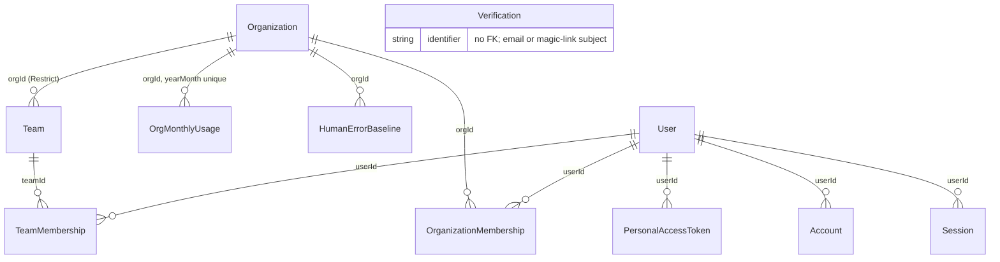
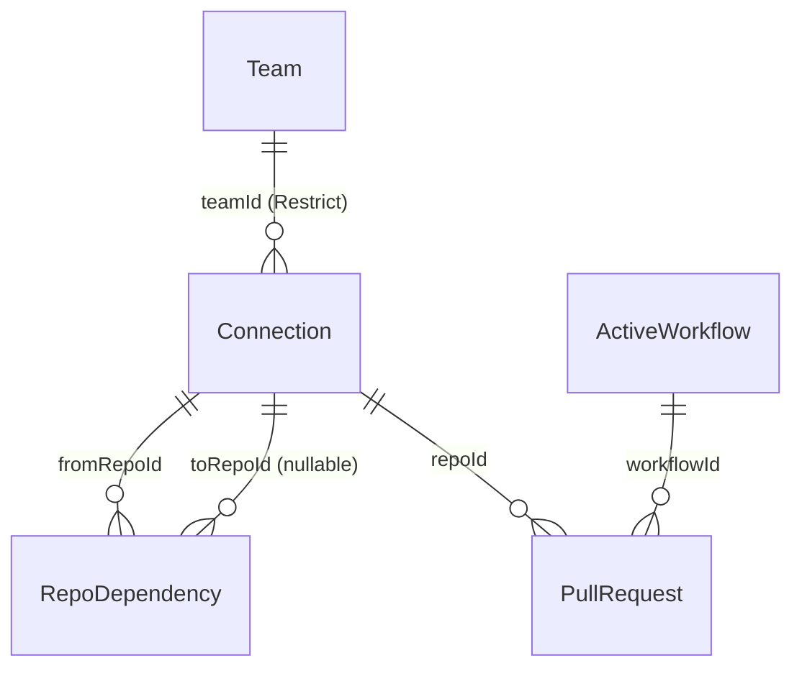
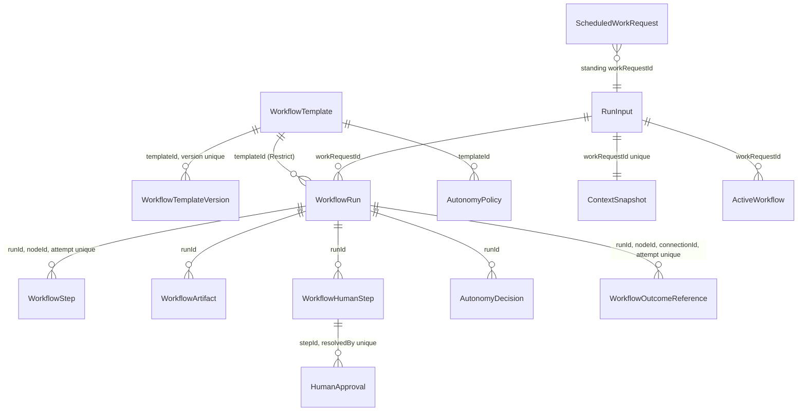
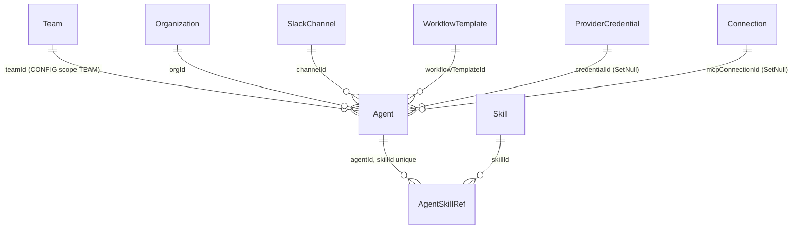
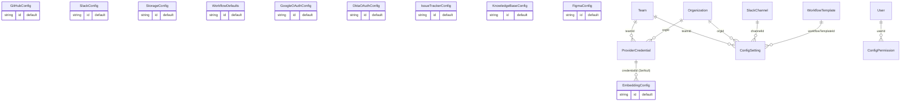
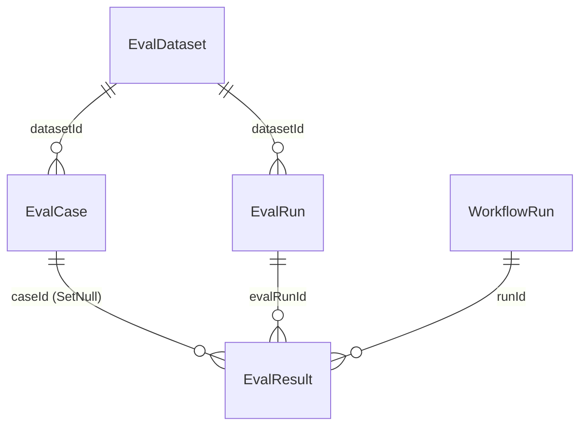
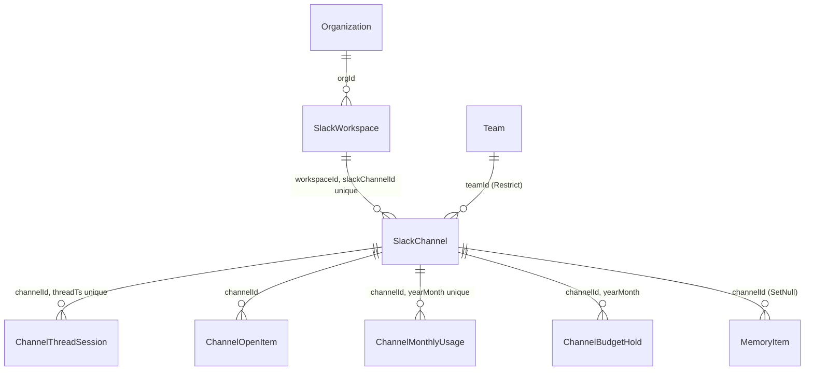

# Data Model and Persistence

> Indexed at commit `b1d8930` on 2026-09-08 · [view on GitHub](https://github.com/yorch/auto-swe/tree/b1d8930)

## Relevant source files

- [packages/shared/src/prisma/schema.prisma](https://github.com/yorch/auto-swe/blob/b1d8930/packages/shared/src/prisma/schema.prisma)
- [packages/shared/src/prisma/migrations/00000000000000_init/migration.sql](https://github.com/yorch/auto-swe/blob/b1d8930/packages/shared/src/prisma/migrations/00000000000000_init/migration.sql)
- [packages/shared/src/prisma/migrations/00000000000001_custom_constraints_and_indexes/migration.sql](https://github.com/yorch/auto-swe/blob/b1d8930/packages/shared/src/prisma/migrations/00000000000001_custom_constraints_and_indexes/migration.sql)
- [packages/shared/src/prisma/seed.ts](https://github.com/yorch/auto-swe/blob/b1d8930/packages/shared/src/prisma/seed.ts)
- [packages/shared/src/prisma/schemaModels.ts](https://github.com/yorch/auto-swe/blob/b1d8930/packages/shared/src/prisma/schemaModels.ts)
- [packages/shared/src/db.ts](https://github.com/yorch/auto-swe/blob/b1d8930/packages/shared/src/db.ts)
- [packages/shared/src/lib/tenantGuard.ts](https://github.com/yorch/auto-swe/blob/b1d8930/packages/shared/src/lib/tenantGuard.ts)
- [packages/shared/src/lib/syncBuiltins.ts](https://github.com/yorch/auto-swe/blob/b1d8930/packages/shared/src/lib/syncBuiltins.ts)

## Overview

The platform stores everything in one PostgreSQL 18 database with the `vector` extension enabled, described by a single 2,200-line Prisma schema holding **61 models** and **13 enums**. There is no second store: workflow definitions, run history, agent configuration, semantic memory, Slack channel state, evaluation datasets, and every integration credential live in the same instance.

Every model maps a `PascalCase` Prisma name to a `snake_case` table via `@@map`, and every non-`id` column that is not already lower-case maps through `@map`. `ActiveWorkflow` becomes `active_workflows`, `WorkflowTemplateVersion` becomes `workflow_template_versions`. One enum, `ChannelOpenItemStatus`, also carries an `@@map` to `channel_open_item_status`, which is why the file contains 62 `@@map` directives for 61 models.

Primary keys are UUIDs generated in the database with `gen_random_uuid()`, except for the ten singleton config tables, whose `id` defaults to the literal string `default`. Timestamps are `@db.Timestamptz` throughout.

Sources: [packages/shared/src/prisma/schema.prisma:L1-L98](https://github.com/yorch/auto-swe/blob/b1d8930/packages/shared/src/prisma/schema.prisma#L1-L98)

## Client access

All database access goes through one extended `PrismaClient` singleton exported from [packages/shared/src/db.ts#L27](https://github.com/yorch/auto-swe/blob/b1d8930/packages/shared/src/db.ts#L27). Prisma 7 requires an explicit driver adapter, so the client is constructed with `PrismaPg` over `DATABASE_URL` and throws at import time when that variable is absent.

The singleton is wrapped in `tenantGuardExtension()` before export. That extension fails any mass operation — `findMany`, `count`, `aggregate`, `groupBy`, `updateMany`, `deleteMany` — issued against one of the 19 models that carry a `teamId` or `orgId` column without a tenant predicate in the `where` clause. It is attached inside the shared package rather than at the gateway so the worker inherits it too; the worker is the half that feeds `MemoryItem` rows into agent prompts. Single-row reads are deliberately unguarded, and raw SQL bypasses the extension entirely.

A companion parser, `parseSchemaModels`, reads `schema.prisma` at test time and yields model-to-column names, so hand-maintained lists such as the encrypted-field inventory and `TENANT_SCOPED_MODELS` can be asserted against the schema instead of drifting from it. It throws rather than returning an empty map, because an empty result would make every drift assertion pass vacuously.

Sources: [packages/shared/src/db.ts:L1-L31](https://github.com/yorch/auto-swe/blob/b1d8930/packages/shared/src/db.ts#L1-L31) [packages/shared/src/lib/tenantGuard.ts:L1-L56](https://github.com/yorch/auto-swe/blob/b1d8930/packages/shared/src/lib/tenantGuard.ts#L1-L56) [packages/shared/src/prisma/schemaModels.ts:L1-L40](https://github.com/yorch/auto-swe/blob/b1d8930/packages/shared/src/prisma/schemaModels.ts#L1-L40)

## Model clusters

The 61 models group into ten clusters by concern. Every model appears in exactly one.

| Cluster | Models | Schema lines |
| --- | --- | --- |
| Identity, tenancy, and access | 11 | L375-L531, L791-L894, L236-L260 |
| Connections and targets | 3 | L216-L373 |
| Workflow definition and execution | 14 | L100-L214, L896-L1136, L1317-L1498 |
| Agents, skills, and scanner patterns | 4 | L2015-L2162 |
| Semantic memory | 1 | L137-L195 |
| Configuration | 13 | L1500-L1987 |
| Evaluations | 5 | L1138-L1276 |
| Slack and channels | 6 | L533-L789 |
| Audit and telemetry | 3 | L1278-L1315, L1989-L2002, L2164-L2185 |
| Bundles | 1 | L2187-L2200 |

Sources: [packages/shared/src/prisma/schema.prisma:L100-L2200](https://github.com/yorch/auto-swe/blob/b1d8930/packages/shared/src/prisma/schema.prisma#L100-L2200)

### Identity, tenancy, and access



`Organization` is the outermost tenant boundary and every `Team` nests under exactly one, with `onDelete: Restrict` so an org holding teams cannot be dropped. Membership is expressed twice: `TeamMembership` carries the three-value `Role` enum (ADMIN, LEAD, ENGINEER) under a `@@unique([userId, teamId])`, and `OrganizationMembership` carries `OrgRole` under `@@unique([userId, orgId])`.

Browser authentication uses better-auth's `Account`, `Session`, and `Verification` tables. `Account` keys an external identity by `@@unique([issuer, accountId])` rather than by provider, so built-in social providers get a synthetic `local:oauth:<providerId>` issuer and email-password rows get `local:credential`. `User.passwordHash` survives as a legacy bcrypt column and is nullable, since OAuth-only users have none. Command-line and CI access uses `PersonalAccessToken`, which stores only a sha-256 `tokenHash` plus a non-secret 12-character `prefix` for disambiguation in the admin UI.

`OrgMonthlyUsage` aggregates spend one row per org per calendar month, and `HumanErrorBaseline` records an audited manual-process error rate that analytics compares agent output against.

Sources: [packages/shared/src/prisma/schema.prisma:L375-L531](https://github.com/yorch/auto-swe/blob/b1d8930/packages/shared/src/prisma/schema.prisma#L375-L531) [packages/shared/src/prisma/schema.prisma:L791-L894](https://github.com/yorch/auto-swe/blob/b1d8930/packages/shared/src/prisma/schema.prisma#L791-L894) [packages/shared/src/prisma/schema.prisma:L236-L260](https://github.com/yorch/auto-swe/blob/b1d8930/packages/shared/src/prisma/schema.prisma#L236-L260)

### Connections and targets



`Connection` is the generic integration target that replaced an earlier SWE-specific `Repository` model. A `type` discriminator defaults to `git_repo`; other types such as `mcp` or `http_api` stash their specifics in the untyped `config` JSON bag while git repositories keep typed columns for organization, repo name, default branch, and gate commands. Because `organizationName` and `repoName` are nullable for non-git types, uniqueness is a partial index rather than a Prisma `@@unique`.

`Connection.executorImage` is nullable with no column default on purpose. A default would write a literal into every row the create path omits, making an inherited value indistinguishable from a deliberate pin and silently shadowing the operator-configured workspace image.

`RepoDependency` is a directed edge in the repo dependency graph. A row is either a resolved edge with `toRepoId` set, or an unresolved suggestion with `toRepoId` null and `toRef` naming a package that has no onboarded repository yet. Its uniqueness rules, no-self-edge rule, target-shape guard, and the `status`/`source` value sets are all CHECK constraints and partial indexes in the hand-written migration.

Sources: [packages/shared/src/prisma/schema.prisma:L262-L373](https://github.com/yorch/auto-swe/blob/b1d8930/packages/shared/src/prisma/schema.prisma#L262-L373) [packages/shared/src/prisma/schema.prisma:L216-L234](https://github.com/yorch/auto-swe/blob/b1d8930/packages/shared/src/prisma/schema.prisma#L216-L234) [packages/shared/src/prisma/migrations/00000000000001_custom_constraints_and_indexes/migration.sql:L316-L362](https://github.com/yorch/auto-swe/blob/b1d8930/packages/shared/src/prisma/migrations/00000000000001_custom_constraints_and_indexes/migration.sql#L316-L362)

### Workflow definition and execution



A `WorkflowTemplate` is a named, team-owned container; its versions are immutable `WorkflowTemplateVersion` rows holding a `spec` JSON validated against the workflow spec schema on insert. `WorkflowRun` is one execution and freezes three snapshots at start: `specSnapshot` (the parsed spec), `agentVersions` (a `{ agentKey: version }` map), and `pinnedSettings` (every run-pinned registry setting). Because those are snapshots, editing a template or a pinned knob mid-flight cannot change a decision an in-flight run has already made, while non-pinned settings such as model choice still re-resolve on every call.

`RunInput` is the submission record — kept under the older relation names `workRequest`/`workRequestId` on related models so the public API shape did not churn during the rename. `ContextSnapshot` hangs off it one-to-one and holds the ticket, documentation, and Figma design payloads fetched at submit time.

Human-in-the-loop pauses become `WorkflowHumanStep` rows carrying a `HumanStepKind` of APPROVAL, DECISION, INPUT, or REVIEW, with individual responses recorded as `HumanApproval` rows so distinct approvers can be counted against `requiredApprovers`. Large step outputs go to `WorkflowArtifact`, which stores bytes inline in Postgres when `backend` is `pg` and only an `s3Key` when it is `s3`, keeping diffs and logs out of Temporal's 50 MB history cap. `WorkflowOutcomeReference` is an idempotency ledger: a unique key over run, node, connection, and Temporal attempt lets a retried activity read back its previous external side effect instead of re-issuing it.

Token counters on `ActiveWorkflow` and `WorkflowRun` are `BigInt`, because a long-lived run's cumulative usage exceeds the INT32 ceiling.

Sources: [packages/shared/src/prisma/schema.prisma:L1008-L1136](https://github.com/yorch/auto-swe/blob/b1d8930/packages/shared/src/prisma/schema.prisma#L1008-L1136) [packages/shared/src/prisma/schema.prisma:L1317-L1498](https://github.com/yorch/auto-swe/blob/b1d8930/packages/shared/src/prisma/schema.prisma#L1317-L1498) [packages/shared/src/prisma/schema.prisma:L896-L1006](https://github.com/yorch/auto-swe/blob/b1d8930/packages/shared/src/prisma/schema.prisma#L896-L1006) [packages/shared/src/prisma/schema.prisma:L100-L214](https://github.com/yorch/auto-swe/blob/b1d8930/packages/shared/src/prisma/schema.prisma#L100-L214)

### Agents, skills, and scanner patterns



`Agent` is the versioned, first-class record of one agent identity. Its `key` is a free-form string, not an enum, so new agents ship as seed data rather than a migration. One of the five `ConfigScope` values discriminates the row, and exactly one of `teamId`, `orgId`, `channelId`, or `workflowTemplateId` may be set — enforced by the `agents_scope_keys_check` CHECK constraint listing all five branches.

A `Skill` is a named prompt fragment attached to agents through the ordered join table `AgentSkillRef`. Skills carry their own `scope` triple under the same discriminator rule (`skills_scope_keys_check`), so a team-authored skill's `promptText` is not readable platform-wide. `ScannerPattern` stores the runtime security regexes with a `label` unique index, a `ScannerPatternType` of one of six kinds, and `flags` restricted to a safe subset at the API layer.

Sources: [packages/shared/src/prisma/schema.prisma:L2015-L2162](https://github.com/yorch/auto-swe/blob/b1d8930/packages/shared/src/prisma/schema.prisma#L2015-L2162) [packages/shared/src/prisma/migrations/00000000000001_custom_constraints_and_indexes/migration.sql:L57-L116](https://github.com/yorch/auto-swe/blob/b1d8930/packages/shared/src/prisma/migrations/00000000000001_custom_constraints_and_indexes/migration.sql#L57-L116)

### Semantic memory and the pgvector column

`MemoryItem` is the single semantic-memory model, generalized from an earlier SWE-only lesson table. Its `scope` string partitions domains, defaulting to `swe-lessons`. It carries six optional scoping foreign keys — `workflowId`, `repoId`, `channelId`, `teamId`, `orgId`, and `workflowRunId` — plus a generic `entityType`/`entityId` pair for domains with no dedicated column. Consolidation is a soft delete: a merged item gets a `consolidatedAt` timestamp and active items always have it null, which is why nearly every index on the model is a compound ending in `consolidatedAt`.

The embedding column is declared as `embedding Unsupported("vector(1536)")?` at [schema.prisma#L166](https://github.com/yorch/auto-swe/blob/b1d8930/packages/shared/src/prisma/schema.prisma#L166), typed by the `vector` extension declared on the datasource. **The dimensionality is fixed at 1536.** The embedding helper in the worker throws when the configured model returns any other shape, because the column cannot hold it. `embeddingModel` records which `<provider>/<model>` spec produced each vector, so rows written under different models are distinguishable; null on rows predating the column.

Prisma's schema DSL cannot model HNSW or IVFFlat index types, so the approximate-nearest-neighbour index lives in raw SQL in the second migration:

```sql
CREATE INDEX IF NOT EXISTS "idx_memory_items_embedding" ON "memory_items"
    USING hnsw ("embedding" vector_cosine_ops)
    WITH (m = 16, ef_construction = 200);
```

The consequence is that `prisma migrate dev` cannot see the index and will try to re-drop it on the next unrelated schema change. Routine application is `prisma migrate deploy` instead. Because the column type is `Unsupported`, the generated client cannot read or write it, so all embedding reads and writes go through raw `$queryRawUnsafe` — the one sanctioned exception to the project's Prisma-only rule.

Sources: [packages/shared/src/prisma/schema.prisma:L116-L195](https://github.com/yorch/auto-swe/blob/b1d8930/packages/shared/src/prisma/schema.prisma#L116-L195) [packages/shared/src/prisma/migrations/00000000000001_custom_constraints_and_indexes/migration.sql:L11-L21](https://github.com/yorch/auto-swe/blob/b1d8930/packages/shared/src/prisma/migrations/00000000000001_custom_constraints_and_indexes/migration.sql#L11-L21)

### Configuration



Configuration splits three ways. Ten **singleton tables** hold relationally-shaped integration config: `GitHubConfig`, `SlackConfig`, `StorageConfig`, `WorkflowDefaults`, `GoogleOAuthConfig`, `OktaOAuthConfig`, `IssueTrackerConfig`, `KnowledgeBaseConfig`, `FigmaConfig`, and `EmbeddingConfig`. Each declares `id String @id @default("default")`, and each is additionally pinned by a CHECK constraint of the form `CHECK ("id" = 'default')` in the hand-written migration. The Prisma default already guarantees the value on client writes; the constraints are belt-and-braces against raw SQL inserts.

Secrets in those tables use a uniform AES-256-GCM envelope: for each secret, a `Bytes` ciphertext column plus nonce, auth tag, key version, and a plaintext `lastFour` for display. `GitHubConfig` alone carries six such envelopes, covering the personal access token, webhook secret, OAuth client secret, App client secret, and App private key.

`ProviderCredential` holds one encrypted LLM provider key per scope, restricted by CHECK to GLOBAL, ORGANIZATION, or TEAM — template scope is deliberately unsupported.

The third form is the **setting registry**: `ConfigSetting` stores one JSON `value` per `(key, scope)` pair, and `ConfigPermission` stores who may write which key patterns where. Both carry the same five-branch scope-discriminator CHECK as `Agent`.

Sources: [packages/shared/src/prisma/schema.prisma:L1500-L1987](https://github.com/yorch/auto-swe/blob/b1d8930/packages/shared/src/prisma/schema.prisma#L1500-L1987) [packages/shared/src/prisma/migrations/00000000000001_custom_constraints_and_indexes/migration.sql:L133-L282](https://github.com/yorch/auto-swe/blob/b1d8930/packages/shared/src/prisma/migrations/00000000000001_custom_constraints_and_indexes/migration.sql#L133-L282)

### Partial unique indexes and why upsert cannot express them

The migration defines 27 unique indexes and 28 CHECK constraints that Prisma's DSL cannot state. The pattern that shapes application code most is the per-scope partial unique index. `ConfigSetting`, for instance, gets five:

```sql
CREATE UNIQUE INDEX IF NOT EXISTS "config_settings_global_uidx"
    ON "config_settings" ("key")
    WHERE "scope" = 'GLOBAL';

CREATE UNIQUE INDEX IF NOT EXISTS "config_settings_team_uidx"
    ON "config_settings" ("key", "team_id")
    WHERE "scope" = 'TEAM';
```

`Agent` gets the same five over `(key, version)`, `ProviderCredential` gets three over `provider`, and `ConfigPermission` gets six over `keyPattern` split by grantee kind.

**Prisma's `upsert` cannot target any of these.** The client's `where` accepts only a declared `@@unique` or `@id`, and there is no way to attach a `WHERE scope = …` predicate to it. A GLOBAL-scope write therefore has no addressable unique key from the client's point of view. Every write to these tables uses `findFirst` followed by a conditional `create` or `update` instead. The database still rejects a genuine duplicate through the partial index, so the read-then-write race degrades to a constraint violation rather than a duplicate row.

The two constructs interlock. Postgres treats NULL discriminators as distinct, so a partial unique index alone would admit several mis-scoped rows — a GLOBAL row carrying a stray `team_id`, say. The scope-discriminator CHECK constraints close that hole by requiring the row's own scope column to be non-null and every other scope column null.

The same migration also reinstates `NOT NULL` on seven `String[]` columns. Prisma 7's generator emits array columns as nullable at the database level even though the client treats them as always present, so each is coalesced to an empty array and then altered.

Sources: [packages/shared/src/prisma/migrations/00000000000001_custom_constraints_and_indexes/migration.sql:L1-L396](https://github.com/yorch/auto-swe/blob/b1d8930/packages/shared/src/prisma/migrations/00000000000001_custom_constraints_and_indexes/migration.sql#L1-L396)

### Evaluations



`EvalResult` is the single normalized quality signal, one row per scorer, with a `value` in `[0,1]` and an `EvalSignalSource` naming where it came from — GATE, ASSERT, REVIEW, MERGE, JUDGE, TRAJECTORY, POLICY, PII, or HUMAN_AUDIT. A row is either an online capture attached to a `WorkflowRun`, or an offline harness row attached to an `EvalCase` and `EvalRun`; the foreign keys are independently nullable to allow both.

`EvalCase` pins a fixture repository by URL and `baselineSha` with an in-scope golden test command, making a case deterministic by construction. `flakeScreened` gates promotion until the reference passes repeatedly, and `quarantined` marks a case whose reference stopped passing against current repo state so it is excluded from the gate. `EvalRubric` holds versioned, scope-cascaded judge prompts.

Sources: [packages/shared/src/prisma/schema.prisma:L1138-L1276](https://github.com/yorch/auto-swe/blob/b1d8930/packages/shared/src/prisma/schema.prisma#L1138-L1276)

### Slack and channels



`SlackWorkspace` is one installed Slack team, owned by exactly one `Organization`, and holds a per-workspace bot token under the standard AES-GCM envelope. `SlackChannel` is the widest model in the schema at over a hundred lines, because every proactivity behaviour is an opt-in boolean plus a nullable tuning column: ambient digests, reactive interjection, passive memory ingestion, org-wide flagging, follow-up sessions, and per-channel consolidation each contribute a flag, a cron or cursor, and cooldown overrides. A null tuning column means the worker's built-in default applies.

`ChannelBudgetHold` is the most interesting of the children. A turn's real cost is unknown until the model answers, so the channel increments its monthly ledger by an estimate first and nets it out on settle. The increment alone bounds concurrency but is unrecoverable — a worker that dies mid-turn never settles. The hold row makes the claim reversible: settling deletes it, and a later reserve sweeps rows past `expiresAt` and subtracts what they added. A lost hold costs one expiry window instead of one calendar month. It is the highest-churn table in the channel path, one insert and one delete per turn, which is why its indexes are the two compounds the sweep actually filters on rather than a bare `expiresAt`.

Sources: [packages/shared/src/prisma/schema.prisma:L533-L789](https://github.com/yorch/auto-swe/blob/b1d8930/packages/shared/src/prisma/schema.prisma#L533-L789)

### Audit, telemetry, and bundles

`AgentTrace` is the per-activity observability record: one row per tool call, LLM response, or activity event, keyed by run, `nodeId` (the Temporal activity type), `agentKey`, `attempt`, and `seq`. LLM rows additionally carry the model spec, input and output token counts, cost, and the W3C `otelTraceId`/`otelSpanId` of the active span, which is what correlates database rows with Grafana traces. `ConfigAuditLog` records before and after JSON for config mutations with secrets redacted to `lastFour`, and holds no foreign key — it names its subject by `entityType` and `entityId`. `WorkflowShellAudit` records one row per shell node in a saved template version, including a snapshot of the egress allowlist at authoring time. `InstalledBundle` is a one-row-per-bundle-name registry whose `trustState` is VERIFIED only when a detached signature matched a deployment-trusted key at install.

Sources: [packages/shared/src/prisma/schema.prisma:L1278-L1315](https://github.com/yorch/auto-swe/blob/b1d8930/packages/shared/src/prisma/schema.prisma#L1278-L1315) [packages/shared/src/prisma/schema.prisma:L1989-L2002](https://github.com/yorch/auto-swe/blob/b1d8930/packages/shared/src/prisma/schema.prisma#L1989-L2002) [packages/shared/src/prisma/schema.prisma:L2164-L2200](https://github.com/yorch/auto-swe/blob/b1d8930/packages/shared/src/prisma/schema.prisma#L2164-L2200)

## Migrations directory

The migrations directory holds exactly two migrations plus the provider lock file.

| Path | Lines | Contents |
| --- | --- | --- |
| `migrations/00000000000000_init/migration.sql` | 1,803 | Generated baseline: the `vector` extension, every table, column, standard index, and foreign key |
| `migrations/00000000000001_custom_constraints_and_indexes/migration.sql` | 396 | Hand-written DDL Prisma cannot express |
| `migrations/migration_lock.toml` | 3 | `provider = "postgresql"` |

The split is deliberate. Everything Prisma can generate stays in the baseline so it can be regenerated at will; only the HNSW index, CHECK constraints, partial unique indexes, array `NOT NULL` reinstatements, and one seed row live in the hand-written file. Since Postgres has no `ADD CONSTRAINT IF NOT EXISTS`, each CHECK is wrapped in a `DO $$ … EXCEPTION WHEN duplicate_object THEN NULL; END $$` block so a retried `migrate deploy` is safe. Index creation uses the native `IF NOT EXISTS` and needs no wrapper.

The second migration also seeds the default embedding configuration directly in SQL, so the worker can resolve a model spec before an administrator ever opens the dashboard:

```sql
INSERT INTO "embedding_configs" ("id", "model_spec")
VALUES ('default', 'openai/text-embedding-3-large')
ON CONFLICT ("id") DO NOTHING;
```

The `db:migrate` script maps to `prisma migrate dev` and `db:deploy` to `prisma migrate deploy`. Routine application uses deploy, because `migrate dev` cannot see the HNSW index and will attempt to drop it.

Sources: [packages/shared/src/prisma/migrations/00000000000001_custom_constraints_and_indexes/migration.sql:L1-L30](https://github.com/yorch/auto-swe/blob/b1d8930/packages/shared/src/prisma/migrations/00000000000001_custom_constraints_and_indexes/migration.sql#L1-L30) [packages/shared/src/prisma/migrations/00000000000000_init/migration.sql:L1-L10](https://github.com/yorch/auto-swe/blob/b1d8930/packages/shared/src/prisma/migrations/00000000000000_init/migration.sql#L1-L10)

## Seed script

`seed.ts` is 134 lines and runs under `prisma db seed`. It builds its own `PrismaClient` with a `PrismaPg` adapter rather than importing the shared singleton, and fails the invoking step by setting `process.exitCode = 1` on error instead of exiting zero with a log line.

It seeds, in order:

1. **An admin `User`**, from `SEED_ADMIN_EMAIL` (default `admin@auto-swe.local`) with a bcrypt hash of `SEED_ADMIN_PASSWORD`. When that variable is absent it generates a random 16-byte password and prints it; a configured password is never printed. `emailVerified` is forced true so better-auth's link-by-verified-email picks the row up rather than creating a duplicate when the same address later signs in through GitHub or Google.
2. **A default `Organization`** with slug `default`, then a **default `Team`** under it with the same slug.
3. **Memberships** placing the admin in the team as ADMIN and in the org as ORG_ADMIN.
4. **A sample `git_repo` `Connection`** for `your-org/your-repo`. Because git-repo uniqueness is a partial index, this step uses `findFirst` then `create` — the concrete instance of the upsert limitation described above.
5. **Built-in reference data**, by calling `syncBuiltins`.

`syncBuiltins` splits into two provenance groups. `seedCoreDefaults` writes domain-agnostic platform content — the cross-cutting scanner patterns and the autonomy policies — with `origin = null`. `seedSweStarter` writes the software-engineering use case as ordinary content tagged `origin = 'swe-starter'`: the workflow templates, the two channel templates, the coding skills, the SWE code-security scanner patterns, the `Agent` rows with their skill references, and the eval rubrics. Everything is idempotent through `findFirst` plus conditional create or update, so the gateway calls it on every startup.

Sources: [packages/shared/src/prisma/seed.ts:L1-L134](https://github.com/yorch/auto-swe/blob/b1d8930/packages/shared/src/prisma/seed.ts#L1-L134) [packages/shared/src/lib/syncBuiltins.ts:L155-L190](https://github.com/yorch/auto-swe/blob/b1d8930/packages/shared/src/lib/syncBuiltins.ts#L155-L190)

## Related Pages

- Parent: [Shared Library](./2-shared-library.md)
- Sibling: [Workflow Spec and Interpreter](./2.2-workflow-spec-and-interpreter.md)
- Sibling: [Configuration and Settings](./2.3-configuration-and-settings.md)
- Sibling: [Skills and Security Scanners](./2.4-skills-and-security-scanners.md)
