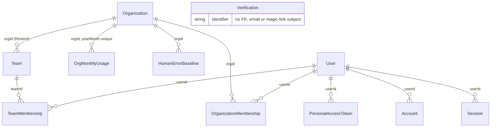
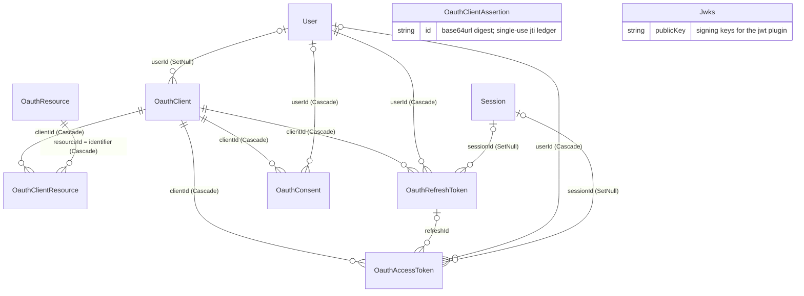
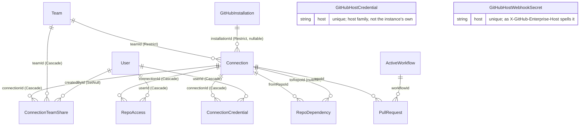
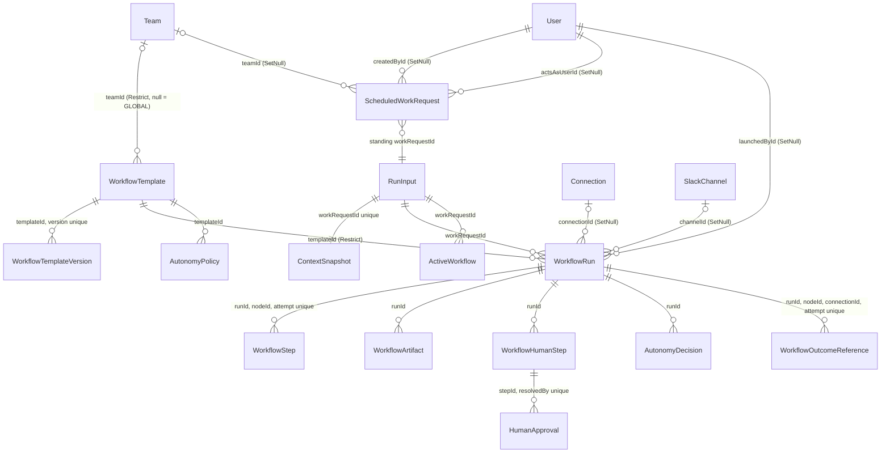
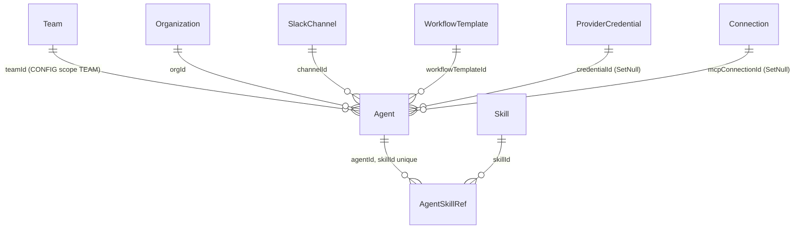
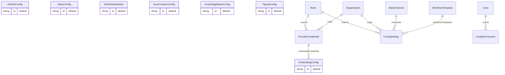
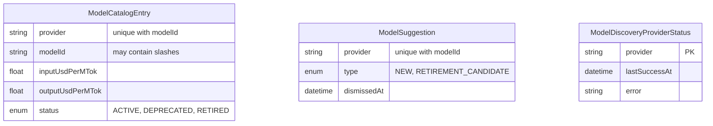
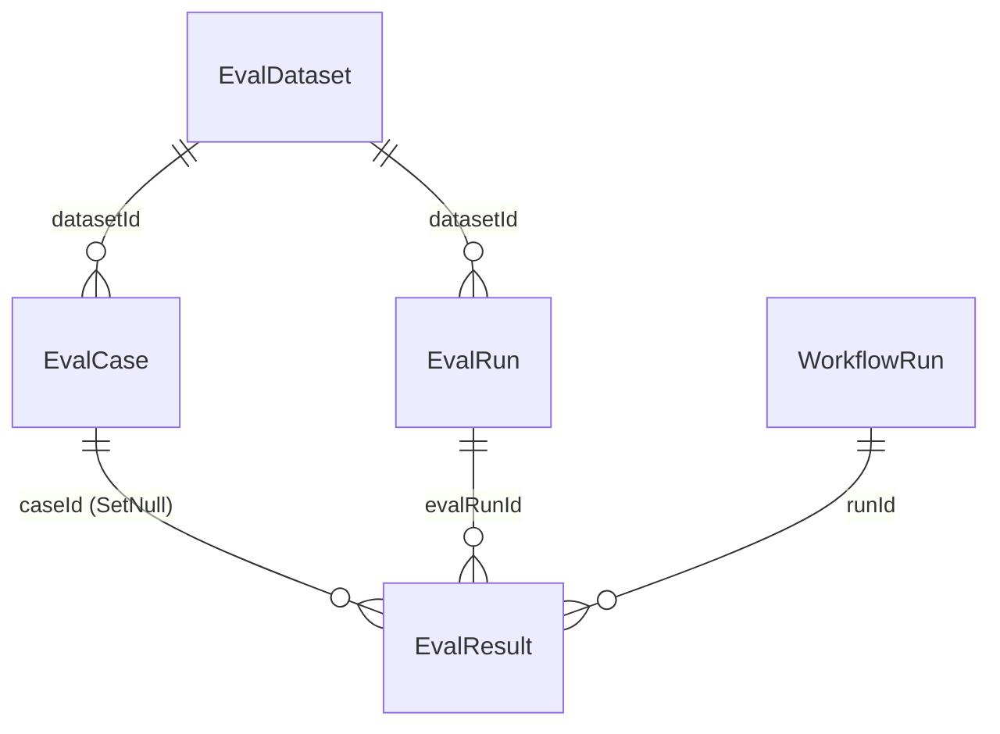
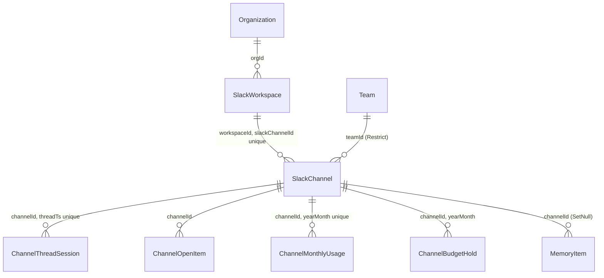

# Data Model and Persistence

> Indexed at commit `ae416937` on 2026-10-03 · [view on GitHub](https://github.com/yorch/auto-swe/tree/ae416937)

## Relevant source files

- [packages/shared/src/prisma/schema.prisma](https://github.com/yorch/auto-swe/blob/ae416937/packages/shared/src/prisma/schema.prisma)
- [packages/shared/src/prisma/migrations/00000000000000_init/migration.sql](https://github.com/yorch/auto-swe/blob/ae416937/packages/shared/src/prisma/migrations/00000000000000_init/migration.sql)
- [packages/shared/src/prisma/migrations/00000000000001_custom_constraints_and_indexes/migration.sql](https://github.com/yorch/auto-swe/blob/ae416937/packages/shared/src/prisma/migrations/00000000000001_custom_constraints_and_indexes/migration.sql)
- [packages/shared/src/prisma/seed.ts](https://github.com/yorch/auto-swe/blob/ae416937/packages/shared/src/prisma/seed.ts)
- [packages/shared/src/prisma/schemaModels.ts](https://github.com/yorch/auto-swe/blob/ae416937/packages/shared/src/prisma/schemaModels.ts)
- [packages/shared/src/db.ts](https://github.com/yorch/auto-swe/blob/ae416937/packages/shared/src/db.ts)
- [packages/shared/src/lib/tenantGuard.ts](https://github.com/yorch/auto-swe/blob/ae416937/packages/shared/src/lib/tenantGuard.ts)
- [packages/shared/src/lib/syncBuiltins.ts](https://github.com/yorch/auto-swe/blob/ae416937/packages/shared/src/lib/syncBuiltins.ts)

## Overview

The platform stores everything in one PostgreSQL 18 database with the `vector` extension enabled, described by a single 2,771-line Prisma schema holding **75 models** and **17 enums**. There is no second store: workflow definitions, run history, agent configuration, semantic memory, Slack channel state, evaluation datasets, repository access state, the model price catalog, the OAuth authorization server's tokens, and the integration credentials that are kept in the database all live in the same instance.

Every model maps a `PascalCase` Prisma name to a `snake_case` table via `@@map`, and every non-`id` column that is not already lower-case maps through `@map`. `ActiveWorkflow` becomes `active_workflows`, `WorkflowTemplateVersion` becomes `workflow_template_versions`. One enum, `ChannelOpenItemStatus`, also carries an `@@map` to `channel_open_item_status`, which is why the file contains 76 `@@map(` directives for 75 models.

Primary keys are UUIDs generated in the database with `gen_random_uuid()`, with three kinds of exception: the seven singleton config tables, whose `id` defaults to the literal string `default`; `ModelDiscoveryProviderStatus`, keyed by the provider name; and `OauthClientAssertion`, keyed by a base64url digest. Timestamps are `@db.Timestamptz` throughout.

Not everything configurable is a table. Google, Okta and GitHub sign-in credentials, artifact storage, and workspace sizing and image are read from the environment by resolvers in `lib/systemConfig.ts` and have no model here; see [Configuration and Settings](./2.3-configuration-and-settings.md).

Sources: [packages/shared/src/prisma/schema.prisma:L1-L107](https://github.com/yorch/auto-swe/blob/ae416937/packages/shared/src/prisma/schema.prisma#L1-L107)

## Client access

All database access goes through one extended `PrismaClient` singleton exported from [packages/shared/src/db.ts#L27](https://github.com/yorch/auto-swe/blob/ae416937/packages/shared/src/db.ts#L27). Prisma 7 requires an explicit driver adapter, so the client is constructed with `PrismaPg` over `DATABASE_URL` and throws at import time when that variable is absent.

The singleton is wrapped in `tenantGuardExtension()` before export. That extension fails any mass operation — `findMany`, `count`, `aggregate`, `groupBy`, `updateMany`, `deleteMany` — issued against one of the 22 models in `TENANT_SCOPED_MODELS` without a tenant predicate in the `where` clause. The set is: `Agent`, `AgentTrace`, `AutonomyPolicy`, `ConfigPermission`, `ConfigSetting`, `Connection`, `ConnectionTeamShare`, `EvalDataset`, `EvalRubric`, `HumanErrorBaseline`, `MemoryItem`, `OrgMonthlyUsage`, `OrganizationMembership`, `ProviderCredential`, `ScheduledWorkRequest`, `Skill`, `SlackChannel`, `SlackWorkspace`, `Team`, `TeamMembership`, `WorkflowShellAudit`, and `WorkflowTemplate`. It is attached inside the shared package rather than at the gateway so the worker inherits it too; the worker is the half that feeds `MemoryItem` rows into agent prompts. Single-row reads are deliberately unguarded, and raw SQL bypasses the extension entirely. A cross-tenant query that is intended must say so through `runUnscoped(reason, models, fn)`, which exempts only the models it names and awaits the query inside the exemption so a Prisma thenable cannot escape it.

Models that carry neither a `teamId` nor an `orgId` column stay outside the guard and are narrowed by other keys on every query: `RepoAccess` by `userId` or `connectionId`, `ConnectionCredential` by `connectionId` or `userId`, and the platform-infrastructure tables (`GitHubInstallation`, `GitHubHostCredential`, `GitHubHostWebhookSecret`, `ModelCatalogEntry`) are global by design.

A companion parser, `parseSchemaModels`, reads `schema.prisma` at test time and yields model-to-column names, so hand-maintained lists such as the encrypted-field inventory and `TENANT_SCOPED_MODELS` can be asserted against the schema instead of drifting from it. It throws rather than returning an empty map, because an empty result would make every drift assertion pass vacuously.

Sources: [packages/shared/src/db.ts:L1-L31](https://github.com/yorch/auto-swe/blob/ae416937/packages/shared/src/db.ts#L1-L31) [packages/shared/src/lib/tenantGuard.ts:L25-L58](https://github.com/yorch/auto-swe/blob/ae416937/packages/shared/src/lib/tenantGuard.ts#L25-L58) [packages/shared/src/lib/tenantGuard.ts:L135-L162](https://github.com/yorch/auto-swe/blob/ae416937/packages/shared/src/lib/tenantGuard.ts#L135-L162) [packages/shared/src/prisma/schemaModels.ts:L1-L77](https://github.com/yorch/auto-swe/blob/ae416937/packages/shared/src/prisma/schemaModels.ts#L1-L77)

## Model clusters

The 75 models group into twelve clusters by concern. Every model appears in exactly one.

| Cluster | Models | Schema lines |
| --- | --- | --- |
| Identity, tenancy, and access | 11 | L245-L262, L608-L766, L1031-L1143 |
| OAuth authorization server | 8 | L2560-L2771 |
| Connections and targets | 9 | L225-L239, L271-L602 |
| Workflow definition and execution | 14 | L109-L133, L206-L219, L1153-L1441, L1674-L1849 |
| Agents, skills, and scanner patterns | 4 | L2373-L2517 |
| Semantic memory | 1 | L146-L204 |
| Configuration | 10 | L1859-L1908, L2001-L2262, L2279-L2347 |
| Model catalog and discovery | 3 | L1910-L1994 |
| Evaluations | 5 | L1451-L1587 |
| Slack and channels | 6 | L772-L1029 |
| Audit and telemetry | 3 | L1594-L1670, L2349-L2363, L2522-L2539 |
| Bundles | 1 | L2545-L2558 |

The sum is 11 + 8 + 9 + 14 + 4 + 1 + 10 + 3 + 5 + 6 + 3 + 1 = 75.

Sources: [packages/shared/src/prisma/schema.prisma:L109-L2771](https://github.com/yorch/auto-swe/blob/ae416937/packages/shared/src/prisma/schema.prisma#L109-L2771)

### Identity, tenancy, and access


```mermaid
erDiagram
    Organization ||--o{ Team : "orgId (Restrict)"
    Organization ||--o{ OrganizationMembership : "orgId"
    Organization ||--o{ OrgMonthlyUsage : "orgId, yearMonth unique"
    Organization ||--o{ HumanErrorBaseline : "orgId"
    Team ||--o{ TeamMembership : "teamId"
    User ||--o{ TeamMembership : "userId"
    User ||--o{ OrganizationMembership : "userId"
    User ||--o{ PersonalAccessToken : "userId"
    User ||--o{ Account : "userId"
    User ||--o{ Session : "userId"
    Verification {
        string identifier "no FK; email or magic-link subject"
    }
```

`Organization` is the outermost tenant boundary and every `Team` nests under exactly one, with `onDelete: Restrict` so an org holding teams cannot be dropped. Membership is expressed twice: `TeamMembership` carries the three-value `Role` enum (ADMIN, LEAD, ENGINEER) under a `@@unique([userId, teamId])`, and `OrganizationMembership` carries `OrgRole` under `@@unique([userId, orgId])`.

Browser authentication uses better-auth's `Account`, `Session`, and `Verification` tables. `Account` keys an external identity by `@@unique([providerId, accountId])`, so a provider's own subject id is unique within that provider. `User.passwordHash` survives as a legacy bcrypt column and is nullable, since OAuth-only users have none. `User.githubLogin` is a nullable unique column holding the GitHub username captured when a user links a GitHub identity: better-auth stores only the numeric account id, and GitHub's collaborator-permission endpoint addresses a user by login. Uniqueness is the safety property, since two platform users sharing one login would let the repository-permission projection grant one user's access to the other. Command-line and CI access uses `PersonalAccessToken`, which stores only a sha-256 `tokenHash` plus a non-secret 12-character `prefix` for disambiguation in the admin UI.

`OrgMonthlyUsage` aggregates spend one row per org per calendar month, and `HumanErrorBaseline` records an audited manual-process error rate that analytics compares agent output against; both are constrained further by CHECKs described below.

Sources: [packages/shared/src/prisma/schema.prisma:L608-L766](https://github.com/yorch/auto-swe/blob/ae416937/packages/shared/src/prisma/schema.prisma#L608-L766) [packages/shared/src/prisma/schema.prisma:L1031-L1143](https://github.com/yorch/auto-swe/blob/ae416937/packages/shared/src/prisma/schema.prisma#L1031-L1143) [packages/shared/src/prisma/schema.prisma:L245-L262](https://github.com/yorch/auto-swe/blob/ae416937/packages/shared/src/prisma/schema.prisma#L245-L262)

### OAuth authorization server


```mermaid
erDiagram
    OauthClient ||--o{ OauthClientResource : "clientId (Cascade)"
    OauthResource ||--o{ OauthClientResource : "resourceId = identifier (Cascade)"
    OauthClient ||--o{ OauthAccessToken : "clientId (Cascade)"
    OauthClient ||--o{ OauthRefreshToken : "clientId (Cascade)"
    OauthClient ||--o{ OauthConsent : "clientId (Cascade)"
    OauthRefreshToken |o--o{ OauthAccessToken : "refreshId"
    User |o--o{ OauthClient : "userId (SetNull)"
    User ||--o{ OauthRefreshToken : "userId (Cascade)"
    User |o--o{ OauthAccessToken : "userId (Cascade)"
    User |o--o{ OauthConsent : "userId (Cascade)"
    Session |o--o{ OauthRefreshToken : "sessionId (SetNull)"
    Session |o--o{ OauthAccessToken : "sessionId (SetNull)"
    OauthClientAssertion {
        string id "base64url digest; single-use jti ledger"
    }
    Jwks {
        string publicKey "signing keys for the jwt plugin"
    }
```

Eight models serve the OAuth 2.1 authorization server that MCP clients authenticate against. They are owned by better-auth — `@better-auth/oauth-provider` for the `oauth*` tables and its `jwt` plugin for `Jwks` — so the model and field names are fixed by the plugin, which addresses them by their logical camelCase names; only table and column names are the project's (`@@map` and `@map`).

`OauthClient` is a registered client (Dynamic Client Registration), with `clientId` as the public identifier other tables reference by value rather than by row id. `OauthResource` is a protected resource the server issues tokens for, with its `identifier` unique; `OauthClientResource` records which clients may request which resources. Refresh tokens, access tokens, and consents reference their client through `clientId` with cascade deletes, and tokens also reference the browser `Session` that granted them with `SetNull`. `OauthConsent.updatedAt` is the grant's generation, moved by a re-consent. `OauthClientAssertion` is a single-use `jti` ledger for `private_key_jwt` assertions that the plugin requires even while every client is public.

Optional array columns carry no default on purpose, because the plugin distinguishes `NULL` from an empty array: a resource's `allowedScopes` of null means unrestricted and `{}` means nothing allowed, so a `[]` default would turn an omitted value into deny-all. Only the arrays the plugin requires are `NOT NULL`, and that is set in the hand-written migration (`oauth_clients.redirect_uris` and the `scopes` of access tokens, refresh tokens, and consents). The surface that consumes these tables is covered in [MCP Server and OAuth](./3.5-mcp-server-and-oauth.md).

Sources: [packages/shared/src/prisma/schema.prisma:L2560-L2771](https://github.com/yorch/auto-swe/blob/ae416937/packages/shared/src/prisma/schema.prisma#L2560-L2771) [packages/shared/src/prisma/migrations/00000000000001_custom_constraints_and_indexes/migration.sql:L304-L325](https://github.com/yorch/auto-swe/blob/ae416937/packages/shared/src/prisma/migrations/00000000000001_custom_constraints_and_indexes/migration.sql#L304-L325)

### Connections and targets


```mermaid
erDiagram
    Team ||--o{ Connection : "teamId (Restrict)"
    GitHubInstallation ||--o{ Connection : "installationId (Restrict, nullable)"
    Connection ||--o{ ConnectionTeamShare : "connectionId (Cascade)"
    Team ||--o{ ConnectionTeamShare : "teamId (Cascade)"
    User ||--o{ ConnectionTeamShare : "createdById (SetNull)"
    Connection ||--o{ RepoAccess : "connectionId (Cascade)"
    User ||--o{ RepoAccess : "userId (Cascade)"
    Connection ||--o{ ConnectionCredential : "connectionId (Cascade)"
    User ||--o{ ConnectionCredential : "userId (Cascade)"
    Connection ||--o{ RepoDependency : "fromRepoId"
    Connection ||--o{ RepoDependency : "toRepoId (nullable)"
    Connection ||--o{ PullRequest : "repoId"
    ActiveWorkflow ||--o{ PullRequest : "workflowId"
    GitHubHostCredential {
        string host "unique; host family, not the instance's own"
    }
    GitHubHostWebhookSecret {
        string host "unique; as X-GitHub-Enterprise-Host spells it"
    }
```

`Connection` is the generic integration target that replaced an earlier SWE-specific `Repository` model. A `type` discriminator defaults to `git_repo`; other types such as `mcp` or `http_api` stash their specifics in the untyped `config` JSON bag while git repositories keep typed columns for organization, repo name, default branch, and gate commands. Because `organizationName` and `repoName` are nullable for non-git types, uniqueness is a partial index rather than a Prisma `@@unique`. That index is host-aware and case-insensitive: `connections_git_repo_host_org_repo_ci_uidx` is keyed on `(COALESCE(github_url, ''), lower(organization_name), lower(repo_name))`, so `acme/api` on github.com and `acme/api` on a GitHub Enterprise server are distinct repositories, `Acme/API` and `acme/api` on one host are the same one, and a null `github_url` means the instance's own host.

`Connection.executorImage` is nullable with no column default on purpose. A default would write a literal into every row the create path omits, making an inherited value indistinguishable from a deliberate pin and silently shadowing the operator-configured workspace image.

Seven models describe who may reach a repository and as whom it is reached:

- **`GitHubInstallation`** is one GitHub App installation on one GitHub account. The `GitHubConfig` singleton keeps the App's own instance-wide credentials; where the App is installed is not instance-wide, because reaching several GitHub organizations takes several installations. Its identity is `@@unique([host, installationId])`: a numeric installation id is only unique per GitHub host, and `host` is empty for the instance's own family rather than null so the composite is an ordinary index. `Connection.installationId` is nullable with `onDelete: Restrict`, and null means "the singleton's `appInstallationId`", so a single-org deployment works with every row untouched. Restrict rather than SetNull because silently reverting a repository to the default installation would send its clone and permission lookups to a different GitHub account. The model is platform infrastructure, not tenant-scoped.
- **`GitHubHostCredential`** holds the platform's own PAT and/or GitHub App (app id plus private key, each under the AES-GCM envelope) for one approved host that is not the instance's, unique on `host`. Every column but the key is optional, since a host may have a PAT, an App, or both. The `host` is the host family — `github.com` covers both github.com and api.github.com — so a credential is only ever sent to the family it belongs to.
- **`GitHubHostWebhookSecret`** is the signing secret for one such host, unique on `host`. A delivery naming a host that has a row here is verified with that row's secret and no other. It is separate from `GitHubHostCredential` on purpose: a row here means "this host signs with its own secret", which a credentials-only row must not imply.
- **`ConnectionTeamShare`** shares a repository with a further team, unique on `(connectionId, teamId)`. Members of a shared team may see and launch on the repository; management, budgets, and settings stay with the owning team. Shares are limited to teams in the owning team's organization, so a repository never crosses a tenant boundary this way. It carries a `teamId` and is therefore in the tenant guard.
- **`RepoAccess`** is a cache of what the source-control host last said about one user's access to one repository, as a `RepoPermissionLevel` (NONE, READ, WRITE, ADMIN), unique on `(userId, connectionId)`. It is not a grant table: the only writer is the sync, and a failed lookup leaves `checkedAt` untouched so an outage grows stale rather than being recorded as a denial. An index on `checkedAt` serves the oldest-first staleness sweep.
- **`ConnectionCredential`** holds one user's own GitHub token for one repository, under the standard AES-GCM envelope (ciphertext, nonce, auth tag, key version, last four), unique on `(connectionId, userId)`. It also stores the `apiOrigin` and `webOrigin` the token was verified against, so a team lead repointing the repository's URLs makes the row unusable rather than sending the token somewhere new. It is read only for runs the user launched.
- **`RepoDependency`** is a directed edge in the repo dependency graph. A row is either a resolved edge with `toRepoId` set, or an unresolved suggestion with `toRepoId` null and `toRef` naming a package that has no onboarded repository yet. Its uniqueness rules, no-self-edge rule, target-shape guard, and the `status`/`source` value sets are all CHECK constraints and partial indexes in the hand-written migration.

How these credentials are resolved and who may reach what is described in [Repository Access and Credentials](./3.4-repository-access-and-credentials.md).

Sources: [packages/shared/src/prisma/schema.prisma:L271-L359](https://github.com/yorch/auto-swe/blob/ae416937/packages/shared/src/prisma/schema.prisma#L271-L359) [packages/shared/src/prisma/schema.prisma:L376-L526](https://github.com/yorch/auto-swe/blob/ae416937/packages/shared/src/prisma/schema.prisma#L376-L526) [packages/shared/src/prisma/schema.prisma:L539-L602](https://github.com/yorch/auto-swe/blob/ae416937/packages/shared/src/prisma/schema.prisma#L539-L602) [packages/shared/src/prisma/schema.prisma:L225-L239](https://github.com/yorch/auto-swe/blob/ae416937/packages/shared/src/prisma/schema.prisma#L225-L239) [packages/shared/src/prisma/migrations/00000000000001_custom_constraints_and_indexes/migration.sql:L71-L81](https://github.com/yorch/auto-swe/blob/ae416937/packages/shared/src/prisma/migrations/00000000000001_custom_constraints_and_indexes/migration.sql#L71-L81) [packages/shared/src/prisma/migrations/00000000000001_custom_constraints_and_indexes/migration.sql:L327-L373](https://github.com/yorch/auto-swe/blob/ae416937/packages/shared/src/prisma/migrations/00000000000001_custom_constraints_and_indexes/migration.sql#L327-L373)

### Workflow definition and execution


```mermaid
erDiagram
    WorkflowTemplate ||--o{ WorkflowTemplateVersion : "templateId, version unique"
    WorkflowTemplate ||--o{ WorkflowRun : "templateId (Restrict)"
    WorkflowTemplate ||--o{ AutonomyPolicy : "templateId"
    Team |o--o{ WorkflowTemplate : "teamId (Restrict, null = GLOBAL)"
    RunInput ||--|| ContextSnapshot : "workRequestId unique"
    RunInput ||--o{ WorkflowRun : "workRequestId"
    RunInput ||--o{ ActiveWorkflow : "workRequestId"
    ScheduledWorkRequest }o--|| RunInput : "standing workRequestId"
    Team |o--o{ ScheduledWorkRequest : "teamId (SetNull)"
    User ||--o{ ScheduledWorkRequest : "createdById (SetNull)"
    User ||--o{ ScheduledWorkRequest : "actsAsUserId (SetNull)"
    User ||--o{ WorkflowRun : "launchedById (SetNull)"
    Connection |o--o{ WorkflowRun : "connectionId (SetNull)"
    SlackChannel |o--o{ WorkflowRun : "channelId (SetNull)"
    WorkflowRun ||--o{ WorkflowStep : "runId, nodeId, attempt unique"
    WorkflowRun ||--o{ WorkflowArtifact : "runId"
    WorkflowRun ||--o{ WorkflowHumanStep : "runId"
    WorkflowRun ||--o{ AutonomyDecision : "runId"
    WorkflowRun ||--o{ WorkflowOutcomeReference : "runId, nodeId, connectionId, attempt unique"
    WorkflowHumanStep ||--o{ HumanApproval : "stepId, resolvedBy unique"
```

A `WorkflowTemplate` is a named container owned by a team or, with a null `teamId`, global; its versions are immutable `WorkflowTemplateVersion` rows holding a `spec` JSON validated against the workflow spec schema on insert. The `teamId` foreign key is `Restrict` rather than `SetNull` because a null `teamId` means GLOBAL, so nulling it when a team is deleted would silently publish the team's template to every tenant. `WorkflowRun` is one execution and freezes three snapshots at start: `specSnapshot` (the parsed spec), `agentVersions` (a `{ agentKey: version }` map), and `pinnedSettings` (every run-pinned registry setting). Because those are snapshots, editing a template or a pinned knob mid-flight cannot change a decision an in-flight run has already made, while non-pinned settings such as model choice still re-resolve on every call. A run also carries nullable `connectionId` and `channelId` (both `SetNull`) so runs started without a work request, such as an agent run, still attach to their repository or channel.

Two further columns on `WorkflowRun` carry run identity. `launchedById` is the platform user who started this execution, taken from the workflow's own input and distinct from the request's `requestedById`, because a re-run of someone else's request is launched by whoever re-ran it. It decides whose saved GitHub credential the run may use, and null (a webhook or a cron fire) means none. `temporalRunId` records Temporal's run id for the execution that created the row; because a workflow id can be started again after its previous execution closes and the row is upserted by workflow id and never rewritten, `launchedById` is trusted only by an activity whose own run id matches. `ScheduledWorkRequest` carries the same idea forward through `actsAsUserId`, the user who last defined what the schedule does, so every fire launches as that user. A schedule also carries the `teamId` that owns it (the repository's owning team or a team it is shared with) and an integer `version` used as a compare-and-set token for edits, takeovers, and deactivations.

`RunInput` is the submission record — kept under the older relation names `workRequest`/`workRequestId` on related models so the public API shape did not churn during the rename. It carries an optional caller-supplied `idempotencyKey`, unique per submitter through `@@unique([requestedById, idempotencyKey])` (null keys never collide because Postgres treats nulls as distinct), and `startedActiveWorkflowId`, stamped once the Temporal start succeeds, so a replayed keyed request can tell "answered" from "still starting". `ContextSnapshot` hangs off it one-to-one and holds the ticket, documentation, and Figma design payloads fetched at submit time.

Human-in-the-loop pauses become `WorkflowHumanStep` rows carrying a `HumanStepKind` of APPROVAL, DECISION, INPUT, or REVIEW, with individual responses recorded as `HumanApproval` rows so distinct approvers can be counted against `requiredApprovers`. Large step outputs go to `WorkflowArtifact`, which stores bytes inline in Postgres when `backend` is `pg` and only an `s3Key` when it is `s3`, keeping diffs and logs out of Temporal's 50 MB history cap. `WorkflowOutcomeReference` is an idempotency ledger: a unique key over run, node, connection, and Temporal attempt lets a retried activity read back its previous external side effect instead of re-issuing it.

Token counters on `ActiveWorkflow` and `WorkflowRun` are `BigInt`, because a long-lived run's cumulative usage exceeds the INT32 ceiling.

Sources: [packages/shared/src/prisma/schema.prisma:L1153-L1441](https://github.com/yorch/auto-swe/blob/ae416937/packages/shared/src/prisma/schema.prisma#L1153-L1441) [packages/shared/src/prisma/schema.prisma:L1674-L1849](https://github.com/yorch/auto-swe/blob/ae416937/packages/shared/src/prisma/schema.prisma#L1674-L1849) [packages/shared/src/prisma/schema.prisma:L109-L133](https://github.com/yorch/auto-swe/blob/ae416937/packages/shared/src/prisma/schema.prisma#L109-L133) [packages/shared/src/prisma/schema.prisma:L206-L219](https://github.com/yorch/auto-swe/blob/ae416937/packages/shared/src/prisma/schema.prisma#L206-L219)

### Agents, skills, and scanner patterns


```mermaid
erDiagram
    Agent ||--o{ AgentSkillRef : "agentId, skillId unique"
    Skill ||--o{ AgentSkillRef : "skillId"
    Team ||--o{ Agent : "teamId (CONFIG scope TEAM)"
    Organization ||--o{ Agent : "orgId"
    SlackChannel ||--o{ Agent : "channelId"
    WorkflowTemplate ||--o{ Agent : "workflowTemplateId"
    ProviderCredential ||--o{ Agent : "credentialId (SetNull)"
    Connection ||--o{ Agent : "mcpConnectionId (SetNull)"
```

`Agent` is the versioned, first-class record of one agent identity. Its `key` is a free-form string, not an enum, so new agents ship as seed data rather than a migration. One of the five `ConfigScope` values discriminates the row, and exactly one of `teamId`, `orgId`, `channelId`, or `workflowTemplateId` may be set — enforced by the `agents_scope_keys_check` CHECK constraint listing all five branches.

A `Skill` is a named prompt fragment attached to agents through the ordered join table `AgentSkillRef`. Skills carry their own `scope` triple under the same discriminator rule (`skills_scope_keys_check`), so a team-authored skill's `promptText` is not readable platform-wide. `ScannerPattern` stores the runtime security regexes with a `label` unique index, a `ScannerPatternType` of one of six kinds, and `flags` restricted to a safe subset at the API layer.

Sources: [packages/shared/src/prisma/schema.prisma:L2373-L2517](https://github.com/yorch/auto-swe/blob/ae416937/packages/shared/src/prisma/schema.prisma#L2373-L2517) [packages/shared/src/prisma/migrations/00000000000001_custom_constraints_and_indexes/migration.sql:L57-L119](https://github.com/yorch/auto-swe/blob/ae416937/packages/shared/src/prisma/migrations/00000000000001_custom_constraints_and_indexes/migration.sql#L57-L119)

### Semantic memory and the pgvector column

`MemoryItem` is the single semantic-memory model, generalized from an earlier SWE-only lesson table. Its `scope` string partitions domains, defaulting to `swe-lessons`. It carries six optional scoping foreign keys — `workflowId`, `repoId`, `channelId`, `teamId`, `orgId`, and `workflowRunId` — plus a generic `entityType`/`entityId` pair for domains with no dedicated column. Consolidation is a soft delete: a merged item gets a `consolidatedAt` timestamp and active items always have it null, which is why nearly every index on the model is a compound ending in `consolidatedAt`.

The embedding column is declared as `embedding Unsupported("vector(1536)")?` at [schema.prisma#L175](https://github.com/yorch/auto-swe/blob/ae416937/packages/shared/src/prisma/schema.prisma#L175), typed by the `vector` extension declared on the datasource, and the baseline migration creates it as `vector(1536)`. **The dimensionality is fixed at 1536.** The embedding helper in the worker throws when the configured model returns any other shape, because the column cannot hold it. `embeddingModel` records which `<provider>/<model>` spec produced each vector, so rows written under different models are distinguishable; null on rows predating the column.

Prisma's schema DSL cannot model HNSW or IVFFlat index types, so the approximate-nearest-neighbour index lives in raw SQL in the hand-written migration:

```sql
CREATE INDEX IF NOT EXISTS "idx_memory_items_embedding" ON "memory_items"
    USING hnsw ("embedding" vector_cosine_ops)
    WITH (m = 16, ef_construction = 200);
```

The consequence is that `prisma migrate dev` cannot see the index and will try to re-drop it on the next unrelated schema change. Routine application is `prisma migrate deploy` instead. Because the column type is `Unsupported`, the generated client cannot read or write it, so all embedding reads and writes go through raw `$queryRawUnsafe` — the one sanctioned exception to the project's Prisma-only rule.

Sources: [packages/shared/src/prisma/schema.prisma:L146-L204](https://github.com/yorch/auto-swe/blob/ae416937/packages/shared/src/prisma/schema.prisma#L146-L204) [packages/shared/src/prisma/migrations/00000000000000_init/migration.sql:L77-L91](https://github.com/yorch/auto-swe/blob/ae416937/packages/shared/src/prisma/migrations/00000000000000_init/migration.sql#L77-L91) [packages/shared/src/prisma/migrations/00000000000001_custom_constraints_and_indexes/migration.sql:L11-L19](https://github.com/yorch/auto-swe/blob/ae416937/packages/shared/src/prisma/migrations/00000000000001_custom_constraints_and_indexes/migration.sql#L11-L19)

### Configuration


```mermaid
erDiagram
    GitHubConfig { string id "default" }
    SlackConfig { string id "default" }
    WorkflowDefaults { string id "default" }
    IssueTrackerConfig { string id "default" }
    KnowledgeBaseConfig { string id "default" }
    FigmaConfig { string id "default" }
    EmbeddingConfig { string id "default" }
    ProviderCredential ||--o{ EmbeddingConfig : "credentialId (SetNull)"
    Team ||--o{ ProviderCredential : "teamId"
    Organization ||--o{ ProviderCredential : "orgId"
    Team ||--o{ ConfigSetting : "teamId"
    Organization ||--o{ ConfigSetting : "orgId"
    SlackChannel ||--o{ ConfigSetting : "channelId"
    WorkflowTemplate ||--o{ ConfigSetting : "workflowTemplateId"
    User ||--o{ ConfigPermission : "userId"
```

Configuration splits three ways. Seven **singleton tables** hold relationally-shaped integration config: `GitHubConfig`, `SlackConfig`, `WorkflowDefaults`, `IssueTrackerConfig`, `KnowledgeBaseConfig`, `FigmaConfig`, and `EmbeddingConfig`. Each declares `id String @id @default("default")`, and each is additionally pinned by a CHECK constraint of the form `CHECK ("id" = 'default')` in the hand-written migration. The Prisma default already guarantees the value on client writes; the constraints are belt-and-braces against raw SQL inserts. `WorkflowDefaults` also has two CHECKs on its nullable CI-wait columns: `ci_wait_mode` must be null, `signal`, or `poll`, and the three poll durations must be null or positive, because a non-positive interval would busy-loop the CI poller.

Secrets in those tables use a uniform AES-256-GCM envelope: for each secret, a `Bytes` ciphertext column plus nonce, auth tag, key version, and a plaintext `lastFour` for display. `GitHubConfig` carries four such envelopes, covering the personal access token, webhook secret, App client secret, and App private key. Per-user tokens on `ConnectionCredential` and per-host credentials on `GitHubHostCredential` reuse the same envelope shape but live with the repository cluster, not here.

`ProviderCredential` holds one encrypted LLM provider key per scope, restricted by CHECK to GLOBAL, ORGANIZATION, or TEAM — template scope is deliberately unsupported. The model prices that calls are costed at are not stored on it; they live in the catalog cluster below.

The third form is the **setting registry**: `ConfigSetting` stores one JSON `value` per `(key, scope)` pair, and `ConfigPermission` stores who may write which key patterns where. Both carry the same scope-discriminator CHECK shape as `Agent`, and `ConfigPermission` restricts grants to GLOBAL, ORGANIZATION, and TEAM and to exactly one grantee, a user or a role.

Sources: [packages/shared/src/prisma/schema.prisma:L1859-L1908](https://github.com/yorch/auto-swe/blob/ae416937/packages/shared/src/prisma/schema.prisma#L1859-L1908) [packages/shared/src/prisma/schema.prisma:L2001-L2262](https://github.com/yorch/auto-swe/blob/ae416937/packages/shared/src/prisma/schema.prisma#L2001-L2262) [packages/shared/src/prisma/schema.prisma:L2279-L2347](https://github.com/yorch/auto-swe/blob/ae416937/packages/shared/src/prisma/schema.prisma#L2279-L2347) [packages/shared/src/prisma/migrations/00000000000001_custom_constraints_and_indexes/migration.sql:L137-L270](https://github.com/yorch/auto-swe/blob/ae416937/packages/shared/src/prisma/migrations/00000000000001_custom_constraints_and_indexes/migration.sql#L137-L270)

### Model catalog and discovery


```mermaid
erDiagram
    ModelCatalogEntry {
        string provider "unique with modelId"
        string modelId "may contain slashes"
        float inputUsdPerMTok
        float outputUsdPerMTok
        enum status "ACTIVE, DEPRECATED, RETIRED"
    }
    ModelSuggestion {
        string provider "unique with modelId"
        enum type "NEW, RETIREMENT_CANDIDATE"
        datetime dismissedAt
    }
    ModelDiscoveryProviderStatus {
        string provider PK
        datetime lastSuccessAt
        string error
    }
```

None of these three tables has a foreign key; they join by the `provider` and `modelId` strings that make up a `<provider>/<model-id>` spec. `ModelCatalogEntry` holds one row per spec with its per-MTok input and output USD prices, a `ModelKind` (CHAT or EMBEDDING), and a `ModelStatus`. Status drives the pickers and never the pricing: a RETIRED model is hidden from pickers but still priced, since pinned agent versions keep billing to it. A 0/0 row is a known free model, not an unknown one. Built-in rows are seeded from `BUILTIN_MODELS`; `isBuiltIn` marks them and `isCustomized` is set by any admin edit so seeding never overwrites a customized row. The table is global, since prices are facts about a vendor, not policy.

`ModelSuggestion` is kept apart from the catalog on purpose, so that discovery can never make a model "known" at $0 and the pricing path never reads it. A NEW row says a provider lists a model nothing prices; a RETIREMENT_CANDIDATE row says a priced model is no longer listed by a provider whose listing succeeded. Only the discovery run writes them and an admin only dismisses. `ModelDiscoveryProviderStatus` records, per provider, when discovery last asked, when it last got a complete listing, and the error otherwise; a provider whose listing failed keeps its previous suggestions untouched, so this row is the only trace the failure leaves. Pricing and the discovery flow are covered in [Model Catalog and Pricing](./4.7-model-catalog-and-pricing.md).

Sources: [packages/shared/src/prisma/schema.prisma:L1910-L1994](https://github.com/yorch/auto-swe/blob/ae416937/packages/shared/src/prisma/schema.prisma#L1910-L1994) [packages/shared/src/lib/syncBuiltins.ts:L186-L232](https://github.com/yorch/auto-swe/blob/ae416937/packages/shared/src/lib/syncBuiltins.ts#L186-L232)

### Partial unique indexes and why upsert cannot express them

The hand-written migration defines 27 partial or expression unique indexes and 23 CHECK constraints that Prisma's DSL cannot state. The pattern that shapes application code most is the per-scope partial unique index. `ConfigSetting`, for instance, gets five:

```sql
CREATE UNIQUE INDEX IF NOT EXISTS "config_settings_global_uidx"
    ON "config_settings" ("key")
    WHERE "scope" = 'GLOBAL';

CREATE UNIQUE INDEX IF NOT EXISTS "config_settings_team_uidx"
    ON "config_settings" ("key", "team_id")
    WHERE "scope" = 'TEAM';
```

`Agent` gets the same five over `(key, version)`, `ProviderCredential` gets three over `provider`, and `ConfigPermission` gets six over `keyPattern` split by grantee kind and scope. Those four models account for 19 of the 27. The other eight are one each on `Connection` (git-repo identity, an expression index), `PullRequest` (`(repoId, prNumber)` where the number is set), and `WorkflowHumanStep` (one PENDING row per run and node), two on `RepoDependency` (resolved edges and unresolved suggestions), and three on `AutonomyPolicy`.

The 23 CHECK constraints divide as follows: seven singleton `id = 'default'` pins; two CI-wait checks on `WorkflowDefaults`; seven scope-shape checks (`provider_credentials_scope_check` and `provider_credentials_scope_keys_check`, then one discriminator check each on `Skill`, `Agent`, and `ConfigSetting`, and `config_permissions_scope_keys_check` plus `config_permissions_grantee_check` on `ConfigPermission`); four on `RepoDependency` (target shape, no self-edge, status values, source values); and three non-negative checks on `HumanErrorBaseline`.

**Prisma's `upsert` cannot target any of these.** The client's `where` accepts only a declared `@@unique` or `@id`, and there is no way to attach a `WHERE scope = …` predicate to it. A GLOBAL-scope write therefore has no addressable unique key from the client's point of view. Every write to these tables uses `findFirst` followed by a conditional `create` or `update` instead. The database still rejects a genuine duplicate through the partial index, so the read-then-write race degrades to a constraint violation rather than a duplicate row.

The two constructs interlock. Postgres treats NULL discriminators as distinct, so a partial unique index alone would admit several mis-scoped rows — a GLOBAL row carrying a stray `team_id`, say. The scope-discriminator CHECK constraints close that hole by requiring the row's own scope column to be non-null and every other scope column null.

The same migration also reinstates `NOT NULL` on twelve `String[]` columns: seven on the platform's own tables (`teams` twice, `workflow_shell_audit`, `memory_items`, `context_snapshots`, `eval_cases`, `knowledge_base_config`), four on the OAuth tables, and `connections.package_names`. Prisma 7's generator emits array columns as nullable at the database level even though the client treats them as always present, so each is coalesced to an empty array and then altered.

Sources: [packages/shared/src/prisma/migrations/00000000000001_custom_constraints_and_indexes/migration.sql:L1-L407](https://github.com/yorch/auto-swe/blob/ae416937/packages/shared/src/prisma/migrations/00000000000001_custom_constraints_and_indexes/migration.sql#L1-L407)

### Evaluations


```mermaid
erDiagram
    EvalDataset ||--o{ EvalCase : "datasetId"
    EvalDataset ||--o{ EvalRun : "datasetId"
    EvalCase ||--o{ EvalResult : "caseId (SetNull)"
    EvalRun ||--o{ EvalResult : "evalRunId"
    WorkflowRun ||--o{ EvalResult : "runId"
```

`EvalResult` is the single normalized quality signal, one row per scorer, with a `value` in `[0,1]` and an `EvalSignalSource` naming where it came from — GATE, ASSERT, REVIEW, MERGE, JUDGE, TRAJECTORY, POLICY, PII, or HUMAN_AUDIT. A row is either an online capture attached to a `WorkflowRun`, or an offline harness row attached to an `EvalCase` and `EvalRun`; the foreign keys are independently nullable to allow both.

`EvalCase` pins a fixture repository by URL and `baselineSha` with an in-scope golden test command, making a case deterministic by construction. `flakeScreened` gates promotion until the reference passes repeatedly, and `quarantined` marks a case whose reference stopped passing against current repo state so it is excluded from the gate. `EvalRubric` holds versioned, scope-cascaded judge prompts.

Sources: [packages/shared/src/prisma/schema.prisma:L1451-L1587](https://github.com/yorch/auto-swe/blob/ae416937/packages/shared/src/prisma/schema.prisma#L1451-L1587)

### Slack and channels


```mermaid
erDiagram
    Organization ||--o{ SlackWorkspace : "orgId"
    SlackWorkspace ||--o{ SlackChannel : "workspaceId, slackChannelId unique"
    Team ||--o{ SlackChannel : "teamId (Restrict)"
    SlackChannel ||--o{ ChannelThreadSession : "channelId, threadTs unique"
    SlackChannel ||--o{ ChannelOpenItem : "channelId"
    SlackChannel ||--o{ ChannelMonthlyUsage : "channelId, yearMonth unique"
    SlackChannel ||--o{ ChannelBudgetHold : "channelId, yearMonth"
    SlackChannel ||--o{ MemoryItem : "channelId (SetNull)"
```

`SlackWorkspace` is one installed Slack team, owned by exactly one `Organization`, and holds a per-workspace bot token under the standard AES-GCM envelope. `SlackChannel` is the widest model in the schema at over a hundred lines, because every proactivity behaviour is an opt-in boolean plus a nullable tuning column: ambient digests, reactive interjection, passive memory ingestion, org-wide flagging, follow-up sessions, and per-channel consolidation each contribute a flag, a cron or cursor, and cooldown overrides. A null tuning column means the worker's built-in default applies.

`ChannelBudgetHold` is the most interesting of the children. A turn's real cost is unknown until the model answers, so the channel increments its monthly ledger by an estimate first and nets it out on settle. The increment alone bounds concurrency but is unrecoverable — a worker that dies mid-turn never settles. The hold row makes the claim reversible: settling deletes it, and a later reserve sweeps rows past `expiresAt` and subtracts what they added. A lost hold costs one expiry window instead of one calendar month. It is the highest-churn table in the channel path, one insert and one delete per turn, which is why its indexes are the two compounds the sweep actually filters on rather than a bare `expiresAt`.

Sources: [packages/shared/src/prisma/schema.prisma:L772-L1029](https://github.com/yorch/auto-swe/blob/ae416937/packages/shared/src/prisma/schema.prisma#L772-L1029)

### Audit, telemetry, and bundles

```mermaid
erDiagram
    WorkflowRun |o--o{ AgentTrace "runId (nullable, Cascade)"
    Team |o--o{ AgentTrace "teamId (SetNull)"
    Organization |o--o{ AgentTrace "orgId (SetNull)"
    AgentTrace {
        string workflowId "Temporal workflow ID"
        string specNodeId "spec node; null outside the interpreter"
        string recordingId "spec key plus fan-out branch path"
    }
    ConfigAuditLog {
        string entityType "no FK; names its subject"
        string entityId "no FK"
    }
```

`AgentTrace` is the per-activity observability record: one row per tool call, LLM response, or activity event, keyed by run, `nodeId` (the Temporal activity type), `agentKey`, `attempt`, and `seq`. Three groups of columns were added to make a trace attributable without a join:

- `runId` is nullable, because several workflows keep no `WorkflowRun` row — workflow authoring, scheduled evals, lesson consolidation, repo-access sync, and epic planning. Those traces carry the Temporal `workflowId` and `temporalRunId`, so a runless workflow's spend is scoped to one execution even when its workflow id is started again.
- `specNodeId`, `recordingId`, and `stepAttempt` tie a trace to the workflow-spec node it ran for and the interpreter's own attempt. `recordingId` is the spec key, prefixed with the fan-out branch path inside a branch, and matches `WorkflowStep.nodeId`. All three are null when the activity was not dispatched by the interpreter.
- `teamId` and `orgId` denormalize the spend owner at write time, so usage can be broken down by tenant without the run, request, and connection join that a runless workflow cannot make. This is also why the model is in the tenant guard.

LLM rows additionally carry the model spec, input and output token counts, cost, and the W3C `otelTraceId`/`otelSpanId` of the active span, which is what correlates database rows with Grafana traces. Indexes on `createdAt`, `(workflowId, temporalRunId)`, `(teamId, createdAt)`, and `(orgId, createdAt)` serve the reports that scan traces by time window and tenant.

`ConfigAuditLog` records before and after JSON for config mutations with secrets redacted to `lastFour`, and holds no foreign key — it names its subject by `entityType` and `entityId`. `WorkflowShellAudit` records one row per shell node in a saved template version, including a snapshot of the egress allowlist at authoring time. `InstalledBundle` is a one-row-per-bundle-name registry whose `trustState` is VERIFIED only when a detached signature matched a deployment-trusted key at install.

Sources: [packages/shared/src/prisma/schema.prisma:L1594-L1670](https://github.com/yorch/auto-swe/blob/ae416937/packages/shared/src/prisma/schema.prisma#L1594-L1670) [packages/shared/src/prisma/schema.prisma:L2349-L2363](https://github.com/yorch/auto-swe/blob/ae416937/packages/shared/src/prisma/schema.prisma#L2349-L2363) [packages/shared/src/prisma/schema.prisma:L2522-L2558](https://github.com/yorch/auto-swe/blob/ae416937/packages/shared/src/prisma/schema.prisma#L2522-L2558)

## Migrations directory

The migrations directory holds two migrations plus the provider lock file.

| Path | Lines | Contents |
| --- | --- | --- |
| `migrations/00000000000000_init/migration.sql` | 2,283 | Generated baseline: the `vector` extension, 17 enum types, all 75 tables, and every column, standard index, and foreign key |
| `migrations/00000000000001_custom_constraints_and_indexes/migration.sql` | 407 | Hand-written DDL Prisma cannot express |
| `migrations/migration_lock.toml` | 3 | `provider = "postgresql"` |

The split is deliberate. Everything Prisma can generate stays in the baseline so it can be regenerated at will; only the constructs below live in the hand-written file, because the schema DSL has no way to state them:

- the pgvector HNSW index (the DSL has no index-method syntax for it);
- 27 unique indexes that are partial (`WHERE …`) or built on expressions (`COALESCE`, `lower`), which `@@unique` cannot declare;
- 23 CHECK constraints, since the DSL has no `CHECK`;
- `NOT NULL` on twelve array columns, which the Prisma 7 generator emits as nullable;
- one seed row.

Since Postgres has no `ADD CONSTRAINT IF NOT EXISTS`, each CHECK is wrapped in a `DO $$ … EXCEPTION WHEN duplicate_object THEN NULL; END $$` block so a retried `migrate deploy` is safe. Index creation uses the native `IF NOT EXISTS` and needs no wrapper.

The migration also seeds the default embedding configuration directly in SQL, so the worker can resolve a model spec before an administrator ever opens the dashboard:

```sql
INSERT INTO "embedding_configs" ("id", "model_spec")
VALUES ('default', 'openai/text-embedding-3-large')
ON CONFLICT ("id") DO NOTHING;
```

The `db:migrate` script maps to `prisma migrate dev` and `db:deploy` to `prisma migrate deploy`. Routine application uses deploy, because `migrate dev` cannot see the HNSW index and will attempt to drop it, and on a fresh database it reads the hand-written DDL as drift.

Sources: [packages/shared/src/prisma/migrations/00000000000001_custom_constraints_and_indexes/migration.sql:L1-L26](https://github.com/yorch/auto-swe/blob/ae416937/packages/shared/src/prisma/migrations/00000000000001_custom_constraints_and_indexes/migration.sql#L1-L26) [packages/shared/src/prisma/migrations/00000000000001_custom_constraints_and_indexes/migration.sql:L375-L380](https://github.com/yorch/auto-swe/blob/ae416937/packages/shared/src/prisma/migrations/00000000000001_custom_constraints_and_indexes/migration.sql#L375-L380) [packages/shared/src/prisma/migrations/00000000000000_init/migration.sql:L1-L10](https://github.com/yorch/auto-swe/blob/ae416937/packages/shared/src/prisma/migrations/00000000000000_init/migration.sql#L1-L10)

## Seed script

`seed.ts` is 135 lines and runs under `prisma db seed`. It builds its own `PrismaClient` with a `PrismaPg` adapter rather than importing the shared singleton, and fails the invoking step by setting `process.exitCode = 1` on error instead of exiting zero with a log line.

It seeds, in order:

1. **An admin `User`**, from `SEED_ADMIN_EMAIL` (default `admin@auto-swe.local`) with a bcrypt hash of `SEED_ADMIN_PASSWORD`. That variable is required: the seed throws when it is absent, because `yarn db:seed:auth` hashes the same value into better-auth's credential account in a separate process, so a password generated here could never match. It is never printed. `emailVerified` is forced true so better-auth's link-by-verified-email picks the row up rather than creating a duplicate when the same address later signs in through GitHub or Google.
2. **A default `Organization`** with slug `default`, then a **default `Team`** under it with the same slug.
3. **Memberships** placing the admin in the team as ADMIN and in the org as ORG_ADMIN.
4. **A sample `git_repo` `Connection`** for `your-org/your-repo`. Because git-repo uniqueness is a partial index, this step uses `findFirst` then `create` — the concrete instance of the upsert limitation described above.
5. **Built-in reference data**, by calling `syncBuiltins`.

`syncBuiltins` splits into two provenance groups. `seedCoreDefaults` writes domain-agnostic platform content — the cross-cutting scanner patterns, the autonomy policies, and the model catalog — the scanner patterns with `origin = null`. `seedSweStarter` writes the software-engineering use case as ordinary content tagged `origin = 'swe-starter'`: the workflow templates, the two channel templates, the coding skills, the SWE code-security scanner patterns, the `Agent` rows with their skill references, and the eval rubrics. It also seeds the hidden agent-run system template, which carries its own `system:` origin and is never edited by an admin. Everything is idempotent through `findFirst` plus conditional create or update, so the gateway calls it on every startup.

Sources: [packages/shared/src/prisma/seed.ts:L1-L135](https://github.com/yorch/auto-swe/blob/ae416937/packages/shared/src/prisma/seed.ts#L1-L135) [packages/shared/src/lib/syncBuiltins.ts:L153-L244](https://github.com/yorch/auto-swe/blob/ae416937/packages/shared/src/lib/syncBuiltins.ts#L153-L244) [packages/shared/src/lib/syncBuiltins.ts:L277-L325](https://github.com/yorch/auto-swe/blob/ae416937/packages/shared/src/lib/syncBuiltins.ts#L277-L325)

## Related Pages

- Parent: [Shared Library](./2-shared-library.md)
- Sibling: [Workflow Spec and Interpreter](./2.2-workflow-spec-and-interpreter.md)
- Sibling: [Configuration and Settings](./2.3-configuration-and-settings.md)
- Sibling: [Skills and Security Scanners](./2.4-skills-and-security-scanners.md)
- [MCP Server and OAuth](./3.5-mcp-server-and-oauth.md)
- [Repository Access and Credentials](./3.4-repository-access-and-credentials.md)
- [Model Catalog and Pricing](./4.7-model-catalog-and-pricing.md)

Sources: [packages/shared/src/prisma/schema.prisma:L1-L2771](https://github.com/yorch/auto-swe/blob/ae416937/packages/shared/src/prisma/schema.prisma#L1-L2771)
