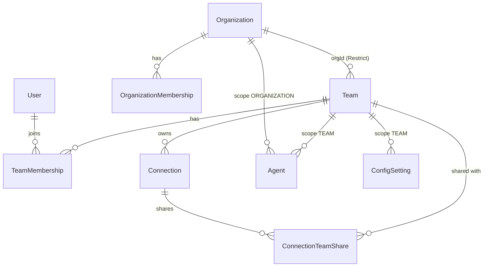

# Data Model (Prisma schema, migrations, tenancy)

> Indexed at commit `d0a90fb5` on 2026-10-06 · [view on GitHub](https://github.com/yorch/auto-swe/tree/d0a90fb5)

## Relevant source files

- [packages/shared/src/prisma/schema.prisma](https://github.com/yorch/auto-swe/blob/d0a90fb5/packages/shared/src/prisma/schema.prisma)
- [packages/shared/src/prisma/migrations/00000000000001_custom_constraints_and_indexes/migration.sql](https://github.com/yorch/auto-swe/blob/d0a90fb5/packages/shared/src/prisma/migrations/00000000000001_custom_constraints_and_indexes/migration.sql)
- [packages/shared/src/prisma/seed.ts](https://github.com/yorch/auto-swe/blob/d0a90fb5/packages/shared/src/prisma/seed.ts)
- [packages/shared/src/db.ts](https://github.com/yorch/auto-swe/blob/d0a90fb5/packages/shared/src/db.ts)
- [packages/shared/src/lib/tenantGuard.ts](https://github.com/yorch/auto-swe/blob/d0a90fb5/packages/shared/src/lib/tenantGuard.ts)
- [.claude/skills/prisma-pgvector-hnsw/SKILL.md](https://github.com/yorch/auto-swe/blob/d0a90fb5/.claude/skills/prisma-pgvector-hnsw/SKILL.md)

## Overview

The data model is a single Prisma schema in `packages/shared` that declares 77 models and 19 enums on PostgreSQL with the `vector` extension ([schema.prisma:L1-L10](https://github.com/yorch/auto-swe/blob/d0a90fb5/packages/shared/src/prisma/schema.prisma#L1-L10)). Table names are `snake_case` through `@@map`, and primary keys are UUIDs generated by the database with `gen_random_uuid()`.

Three concerns define the layer: a tenancy hierarchy (Organization, Team, membership) that scopes nearly everything; a scope cascade expressed as a `ConfigScope` enum plus per-scope nullable foreign keys; and DDL that Prisma cannot express, kept in a hand-written migration. The process-wide client in `db.ts` wraps all queries in a tenant guard.

Sources: [schema.prisma:L1-L10](https://github.com/yorch/auto-swe/blob/d0a90fb5/packages/shared/src/prisma/schema.prisma#L1-L10) [packages/shared/src/db.ts:L1-L31](https://github.com/yorch/auto-swe/blob/d0a90fb5/packages/shared/src/db.ts#L1-L31)

## Tenancy and the scope cascade

`Organization` owns `Team` rows; a `Team` has a required `orgId` with `onDelete: Restrict`, so a team always nests under exactly one organization ([schema.prisma:L631-L714](https://github.com/yorch/auto-swe/blob/d0a90fb5/packages/shared/src/prisma/schema.prisma#L631-L714)). Users join teams through `TeamMembership` (role `Role`: `ADMIN`, `LEAD`, `ENGINEER`) and organizations through `OrganizationMembership` (`OrgRole`: `ORG_ADMIN`, `ORG_MEMBER`), each with a unique `(userId, teamId)` or `(userId, orgId)` pair ([schema.prisma:L716-L749](https://github.com/yorch/auto-swe/blob/d0a90fb5/packages/shared/src/prisma/schema.prisma#L716-L749)). Repositories are `Connection` rows owned by a team and can be shared with other teams through `ConnectionTeamShare`.

`ConfigScope` has five values: `GLOBAL`, `ORGANIZATION`, `TEAM`, `CHANNEL`, `WORKFLOW_TEMPLATE` ([schema.prisma:L55-L63](https://github.com/yorch/auto-swe/blob/d0a90fb5/packages/shared/src/prisma/schema.prisma#L55-L63)). Models such as `Agent` and `ConfigSetting` carry the enum plus four nullable discriminator columns (`teamId`, `orgId`, `channelId`, `workflowTemplateId`) ([schema.prisma:L2621-L2685](https://github.com/yorch/auto-swe/blob/d0a90fb5/packages/shared/src/prisma/schema.prisma#L2621-L2685), [schema.prisma:L2352-L2392](https://github.com/yorch/auto-swe/blob/d0a90fb5/packages/shared/src/prisma/schema.prisma#L2352-L2392)). `Agent` is versioned, one row per `(key, version)` at a scope, and agent identity is a free-form string rather than an enum, so new agents ship as data ([schema.prisma:L66-L69](https://github.com/yorch/auto-swe/blob/d0a90fb5/packages/shared/src/prisma/schema.prisma#L66-L69)).

Integration configuration (GitHub, Slack, issue tracker, knowledge base, Figma, workflow defaults, embedding config) lives in singleton tables rather than the scope cascade; the migration forces each one's `id` to the literal `'default'` with a CHECK constraint ([migration.sql:L170-L217](https://github.com/yorch/auto-swe/blob/d0a90fb5/packages/shared/src/prisma/migrations/00000000000001_custom_constraints_and_indexes/migration.sql#L170-L217)).

```mermaid
erDiagram
  Organization ||--o{ Team : "orgId (Restrict)"
  Organization ||--o{ OrganizationMembership : has
  Team ||--o{ TeamMembership : has
  User ||--o{ TeamMembership : joins
  Team ||--o{ Connection : owns
  Team ||--o{ ConnectionTeamShare : "shared with"
  Connection ||--o{ ConnectionTeamShare : shares
  Team ||--o{ Agent : "scope TEAM"
  Organization ||--o{ Agent : "scope ORGANIZATION"
  Team ||--o{ ConfigSetting : "scope TEAM"
```

Sources: [schema.prisma:L631-L749](https://github.com/yorch/auto-swe/blob/d0a90fb5/packages/shared/src/prisma/schema.prisma#L631-L749) [schema.prisma:L2621-L2685](https://github.com/yorch/auto-swe/blob/d0a90fb5/packages/shared/src/prisma/schema.prisma#L2621-L2685) [schema.prisma:L55-L69](https://github.com/yorch/auto-swe/blob/d0a90fb5/packages/shared/src/prisma/schema.prisma#L55-L69)

## Migrations and DDL Prisma cannot express

The migration directory holds exactly two migrations: `00000000000000_init`, the generated baseline, and `00000000000001_custom_constraints_and_indexes`, hand-written ([SKILL.md:L12-L16](https://github.com/yorch/auto-swe/blob/d0a90fb5/.claude/skills/prisma-pgvector-hnsw/SKILL.md#L12-L16)). The second file carries everything the Prisma DSL cannot state: the HNSW index, CHECK constraints, partial unique indexes and array `NOT NULL`s ([migration.sql:L1-L9](https://github.com/yorch/auto-swe/blob/d0a90fb5/packages/shared/src/prisma/migrations/00000000000001_custom_constraints_and_indexes/migration.sql#L1-L9)).

`memory_items.embedding` is declared `Unsupported("vector(1536)")` in the schema, with an `embeddingModel` string recording which model produced the vector ([schema.prisma:L146-L205](https://github.com/yorch/auto-swe/blob/d0a90fb5/packages/shared/src/prisma/schema.prisma#L146-L205)). Its index, `idx_memory_items_embedding`, uses `hnsw` with `vector_cosine_ops`, `m = 16` and `ef_construction = 200` ([migration.sql:L11-L18](https://github.com/yorch/auto-swe/blob/d0a90fb5/packages/shared/src/prisma/migrations/00000000000001_custom_constraints_and_indexes/migration.sql#L11-L18)).

Scoped tables use one partial unique index per scope because Prisma cannot write `WHERE scope = …`. `agents` has five (`agents_key_version_global_uidx` through `_template_uidx`), plus `agents_scope_keys_check`, a CHECK requiring the matching discriminator to be non-null and the other three null ([migration.sql:L117-L150](https://github.com/yorch/auto-swe/blob/d0a90fb5/packages/shared/src/prisma/migrations/00000000000001_custom_constraints_and_indexes/migration.sql#L117-L150)). `config_settings`, `config_permissions`, `provider_credentials` and `skill_sources` follow the same pattern. Other partial indexes allow one pending `workflow_human_steps` row per `(run_id, node_id)` ([migration.sql:L153-L158](https://github.com/yorch/auto-swe/blob/d0a90fb5/packages/shared/src/prisma/migrations/00000000000001_custom_constraints_and_indexes/migration.sql#L153-L158)) and a case-insensitive unique repository identity for `git_repo` connections ([migration.sql:L103-L112](https://github.com/yorch/auto-swe/blob/d0a90fb5/packages/shared/src/prisma/migrations/00000000000001_custom_constraints_and_indexes/migration.sql#L103-L112)). Each CHECK is wrapped in a `DO` block that swallows `duplicate_object`, so a retried `migrate deploy` is safe ([migration.sql:L20-L33](https://github.com/yorch/auto-swe/blob/d0a90fb5/packages/shared/src/prisma/migrations/00000000000001_custom_constraints_and_indexes/migration.sql#L20-L33)).

The operational hazard is that `prisma migrate dev` reads this hand-written DDL as drift and proposes `DROP INDEX "idx_memory_items_embedding"` on unrelated changes; the drop leaves queries working through a sequential scan, so recall and latency degrade silently ([SKILL.md:L18-L31](https://github.com/yorch/auto-swe/blob/d0a90fb5/.claude/skills/prisma-pgvector-hnsw/SKILL.md#L18-L31)). The rules: use `prisma migrate deploy` in production, read every generated migration for unintended `DROP` statements, keep non-expressible DDL in `00000000000001` while the schema is undeployed, and append new migrations once it is deployed ([SKILL.md:L33-L53](https://github.com/yorch/auto-swe/blob/d0a90fb5/.claude/skills/prisma-pgvector-hnsw/SKILL.md#L33-L53)). Local recovery is `prisma migrate reset`, which replays both migrations ([SKILL.md:L55-L62](https://github.com/yorch/auto-swe/blob/d0a90fb5/.claude/skills/prisma-pgvector-hnsw/SKILL.md#L55-L62)).

Sources: [migration.sql:L1-L158](https://github.com/yorch/auto-swe/blob/d0a90fb5/packages/shared/src/prisma/migrations/00000000000001_custom_constraints_and_indexes/migration.sql#L1-L158) [SKILL.md:L1-L70](https://github.com/yorch/auto-swe/blob/d0a90fb5/.claude/skills/prisma-pgvector-hnsw/SKILL.md#L1-L70) [schema.prisma:L146-L205](https://github.com/yorch/auto-swe/blob/d0a90fb5/packages/shared/src/prisma/schema.prisma#L146-L205)

## The client singleton and tenant guard

`db.ts` builds one `PrismaClient` over the `@prisma/adapter-pg` driver adapter, reading `DATABASE_URL` and throwing if it is absent ([db.ts:L11-L21](https://github.com/yorch/auto-swe/blob/d0a90fb5/packages/shared/src/db.ts#L11-L21)). The instance is cached on `globalThis` outside production to survive hot reload ([db.ts:L27-L30](https://github.com/yorch/auto-swe/blob/d0a90fb5/packages/shared/src/db.ts#L27-L30)). The client is extended with `tenantGuardExtension()` at creation, so the gateway and the worker both get it ([db.ts:L16-L23](https://github.com/yorch/auto-swe/blob/d0a90fb5/packages/shared/src/db.ts#L16-L23)).

The guard in `lib/tenantGuard.ts` covers 23 models that carry a `teamId` or `orgId` ([tenantGuard.ts:L25-L49](https://github.com/yorch/auto-swe/blob/d0a90fb5/packages/shared/src/lib/tenantGuard.ts#L25-L49)). It intercepts only mass operations (`findMany`, `count`, `aggregate`, `groupBy`, `updateMany`, `deleteMany`) and throws `UnscopedTenantQueryError` when the `where` clause has no tenant predicate ([tenantGuard.ts:L52-L59](https://github.com/yorch/auto-swe/blob/d0a90fb5/packages/shared/src/lib/tenantGuard.ts#L52-L59), [tenantGuard.ts:L230-L263](https://github.com/yorch/auto-swe/blob/d0a90fb5/packages/shared/src/lib/tenantGuard.ts#L230-L263)). `hasTenantPredicate` recurses through nested relations, treats `OR` as scoping, and refuses negating operators such as `not` or `none` ([tenantGuard.ts:L166-L199](https://github.com/yorch/auto-swe/blob/d0a90fb5/packages/shared/src/lib/tenantGuard.ts#L166-L199)). Deliberately cross-tenant queries declare themselves with `runUnscoped(reason, models, fn)`, which exempts only the named models ([tenantGuard.ts:L146-L158](https://github.com/yorch/auto-swe/blob/d0a90fb5/packages/shared/src/lib/tenantGuard.ts#L146-L158)). The guard is ORM-level defence in depth, not a security boundary: raw SQL bypasses it ([tenantGuard.ts:L1-L22](https://github.com/yorch/auto-swe/blob/d0a90fb5/packages/shared/src/lib/tenantGuard.ts#L1-L22)). Setting `TENANT_GUARD_WARN=1` downgrades violations to warnings.

Sources: [packages/shared/src/db.ts:L1-L31](https://github.com/yorch/auto-swe/blob/d0a90fb5/packages/shared/src/db.ts#L1-L31) [tenantGuard.ts:L1-L263](https://github.com/yorch/auto-swe/blob/d0a90fb5/packages/shared/src/lib/tenantGuard.ts#L1-L263)

## Seeding

`seed.ts` creates its own un-extended `PrismaClient` and requires `SEED_ADMIN_PASSWORD`, failing otherwise ([seed.ts:L7-L26](https://github.com/yorch/auto-swe/blob/d0a90fb5/packages/shared/src/prisma/seed.ts#L7-L26)). It upserts the admin user (email defaults to `admin@auto-swe.local`, verified, `ADMIN` role, bcrypt hash), a `Default Organization` (slug `default`), and a `Default Team` nested under it ([seed.ts:L34-L73](https://github.com/yorch/auto-swe/blob/d0a90fb5/packages/shared/src/prisma/seed.ts#L34-L73)). It then adds the admin as team `ADMIN` and organization `ORG_ADMIN` ([seed.ts:L76-L94](https://github.com/yorch/auto-swe/blob/d0a90fb5/packages/shared/src/prisma/seed.ts#L76-L94)). The sample `git_repo` connection uses `findFirst` plus `create` because its uniqueness is a partial index, not a compound unique usable by `upsert` ([seed.ts:L96-L112](https://github.com/yorch/auto-swe/blob/d0a90fb5/packages/shared/src/prisma/seed.ts#L96-L112)). Finally `syncBuiltins` loads built-in reference data, and a failure sets a non-zero exit code ([seed.ts:L114-L135](https://github.com/yorch/auto-swe/blob/d0a90fb5/packages/shared/src/prisma/seed.ts#L114-L135)).

Sources: [seed.ts:L1-L135](https://github.com/yorch/auto-swe/blob/d0a90fb5/packages/shared/src/prisma/seed.ts#L1-L135)

## Related Pages

- Parent: [Shared Library](./2-shared-library.md)
- Sibling: [Workflow Spec and Interpreter](./2.2-workflow-spec-and-interpreter.md)
- Sibling: [Configuration and Settings](./2.3-configuration-and-settings.md)
- Sibling: [Skills and Security Scanners](./2.4-skills-and-security-scanners.md)
