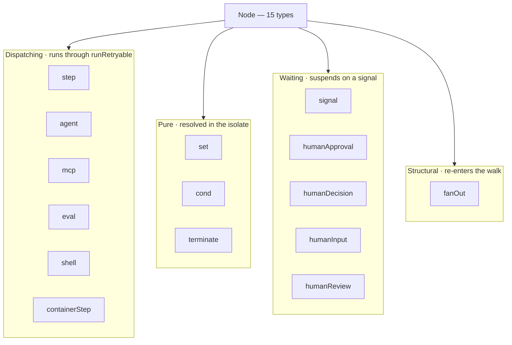
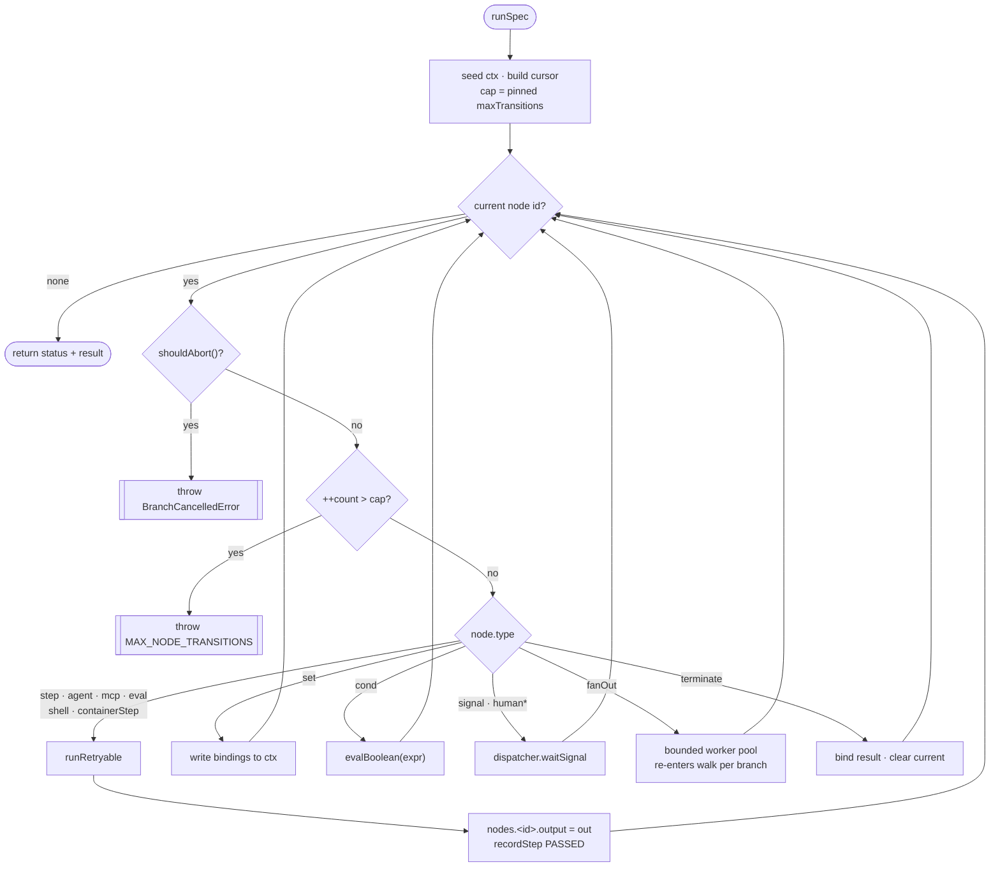

# Workflow Spec and Interpreter

> Indexed at commit `b1d8930` on 2026-09-08 · [view on GitHub](https://github.com/yorch/auto-swe/tree/b1d8930)

## Relevant source files

- [packages/shared/src/workflow/spec.ts](https://github.com/yorch/auto-swe/blob/b1d8930/packages/shared/src/workflow/spec.ts)
- [packages/shared/src/workflow/interpreter.ts](https://github.com/yorch/auto-swe/blob/b1d8930/packages/shared/src/workflow/interpreter.ts)
- [packages/shared/src/workflow/expr.ts](https://github.com/yorch/auto-swe/blob/b1d8930/packages/shared/src/workflow/expr.ts)
- [packages/shared/src/workflow/stepRegistry.ts](https://github.com/yorch/auto-swe/blob/b1d8930/packages/shared/src/workflow/stepRegistry.ts)
- [packages/shared/src/workflow/registry-types.ts](https://github.com/yorch/auto-swe/blob/b1d8930/packages/shared/src/workflow/registry-types.ts)
- [packages/shared/src/workflow/validateSpec.ts](https://github.com/yorch/auto-swe/blob/b1d8930/packages/shared/src/workflow/validateSpec.ts)
- [packages/shared/src/workflow/signalSlots.ts](https://github.com/yorch/auto-swe/blob/b1d8930/packages/shared/src/workflow/signalSlots.ts)
- [packages/shared/src/workflow/codemod.ts](https://github.com/yorch/auto-swe/blob/b1d8930/packages/shared/src/workflow/codemod.ts)
- [packages/shared/src/workflow/codemods.ts](https://github.com/yorch/auto-swe/blob/b1d8930/packages/shared/src/workflow/codemods.ts)
- [packages/shared/src/workflow/specDiff.ts](https://github.com/yorch/auto-swe/blob/b1d8930/packages/shared/src/workflow/specDiff.ts)
- [packages/shared/src/workflow/costEstimator.ts](https://github.com/yorch/auto-swe/blob/b1d8930/packages/shared/src/workflow/costEstimator.ts)
- [packages/shared/src/workflow/authoring.ts](https://github.com/yorch/auto-swe/blob/b1d8930/packages/shared/src/workflow/authoring.ts)
- [packages/shared/src/workflow/shellImageAllowlist.ts](https://github.com/yorch/auto-swe/blob/b1d8930/packages/shared/src/workflow/shellImageAllowlist.ts)
- [packages/shared/src/workflow/index.ts](https://github.com/yorch/auto-swe/blob/b1d8930/packages/shared/src/workflow/index.ts)
- [packages/shared/src/workflow/defaultEngineeringSpec.ts](https://github.com/yorch/auto-swe/blob/b1d8930/packages/shared/src/workflow/defaultEngineeringSpec.ts)
- [packages/shared/src/workflow/templates/index.ts](https://github.com/yorch/auto-swe/blob/b1d8930/packages/shared/src/workflow/templates/index.ts)
- [packages/worker/src/workflows/runnable.ts](https://github.com/yorch/auto-swe/blob/b1d8930/packages/worker/src/workflows/runnable.ts)
- [packages/worker/src/lib/workflowEngine.ts](https://github.com/yorch/auto-swe/blob/b1d8930/packages/worker/src/lib/workflowEngine.ts)

---

## Overview

A workflow in auto-swe is not code. It is a JSON document — a `WorkflowSpec` — stored in a template version row and executed by a shared interpreter. The spec declares a named map of nodes plus an `entry` node id, and every node names its own successors by id. The graph is deliberately not acyclic: a `cond` node may point backwards to express a retry loop, and the interpreter bounds the total number of node transitions instead of forbidding cycles.

This directory owns three things that are usually separate concerns. It owns the **schema** (`spec.ts`), which is the only definition of what a workflow may say. It owns the **interpreter** (`interpreter.ts`), which walks the graph and decides what happens next. And it owns the **static analysis** around both — validation, diffing, cost estimation, and the catalog of steps a spec is allowed to name.

What it does not own is execution. The interpreter never opens a socket, never touches Prisma, never imports Temporal. Every effect goes through a `Dispatcher` object the caller supplies.

Sources: [packages/shared/src/workflow/spec.ts:L1-L30](https://github.com/yorch/auto-swe/blob/b1d8930/packages/shared/src/workflow/spec.ts#L1-L30) [packages/shared/src/workflow/interpreter.ts:L1-L10](https://github.com/yorch/auto-swe/blob/b1d8930/packages/shared/src/workflow/interpreter.ts#L1-L10)

---

## Why the interpreter lives in `shared`

The obvious home for a workflow interpreter is the worker, next to the Temporal code that runs it. It lives in `shared` instead, and the reason is a hard constraint rather than a preference.

Temporal workflow files run inside a V8 isolate, not Node. A workflow file may only import runtime values from `@temporalio/workflow`; anything else must be `import type`. A module that is pure — no `fs`, no `crypto`, no `Date.now()`, no transitive dependency that reaches for one — is safe to bundle into that isolate. `interpreter.ts` is written to that standard, and its header says so explicitly. The worker still does not import it directly from `@auto-swe/shared`: it re-exports the four isolate-safe symbols through a worker-internal shim so the workflow file's import list stays inside the worker package.

Purity buys three more consumers that a worker-local interpreter would have shut out. The gateway validates a template against the same schema and the same step catalog before it saves it. The web canvas lints a spec live in the browser as an operator edits it, using the same `validateSpec` the repair loop uses. The tests exercise the interpreter directly against fake dispatchers with no Temporal test server at all, which is why `interpreter.test.ts` is the largest file in the directory.

Sources: [packages/shared/src/workflow/interpreter.ts:L1-L10](https://github.com/yorch/auto-swe/blob/b1d8930/packages/shared/src/workflow/interpreter.ts#L1-L10) [packages/worker/src/lib/workflowEngine.ts:L1-L19](https://github.com/yorch/auto-swe/blob/b1d8930/packages/worker/src/lib/workflowEngine.ts#L1-L19) [packages/shared/src/workflow/validateSpec.ts:L20-L28](https://github.com/yorch/auto-swe/blob/b1d8930/packages/shared/src/workflow/validateSpec.ts#L20-L28)

---

## The spec schema

`WorkflowSpecSchema` is a Zod object with five fields: `name`, `description`, `entry`, `nodes`, and a literal `schemaVersion` pinned to `SPEC_SCHEMA_VERSION`, currently `1`. Node ids are strings of 1 to 64 characters. The `nodes` field is a record from node id to a discriminated union on `type`.

Two structural checks run in a `superRefine` on top of the shape check. The entry node must exist in the map, and every outgoing edge of every node must name a node that exists. Both checks route through `nodeEdges`, described below.

A **binding** is how a node reads a value. It is a three-member union: `{ from: path, default? }` reads a dot-and-bracket path out of the run context, `{ literal: value }` supplies a constant, and `{ expr: string }` evaluates a small expression. The union is intentionally non-strict, so a stored spec that has picked up an incidental extra key still parses when it is re-read at run time. An object that satisfies more than one member resolves to whichever Zod matches first, which is a documented sharp edge rather than an error.

An expression's source is capped at `MAX_EXPR_LENGTH`, which is 2000 characters. The grammar is tiny and every transition may evaluate one, so a binding that long is a payload someone pasted, not a condition.

Sources: [packages/shared/src/workflow/spec.ts:L484-L512](https://github.com/yorch/auto-swe/blob/b1d8930/packages/shared/src/workflow/spec.ts#L484-L512) [packages/shared/src/workflow/spec.ts:L39-L54](https://github.com/yorch/auto-swe/blob/b1d8930/packages/shared/src/workflow/spec.ts#L39-L54) [packages/shared/src/workflow/spec.ts:L28-L37](https://github.com/yorch/auto-swe/blob/b1d8930/packages/shared/src/workflow/spec.ts#L28-L37)

---

## Node-type taxonomy

The union has **15 members**, enumerated in one place at [packages/shared/src/workflow/spec.ts#L449-L465](https://github.com/yorch/auto-swe/blob/b1d8930/packages/shared/src/workflow/spec.ts#L449-L465). They fall into four families by how the interpreter handles them: six dispatch work to the outside world, three are resolved entirely in-process, five suspend the run until something arrives, and one restructures the walk itself.

The four dispatching types other than `step` and `shell` are not separate transport paths. `agent`, `mcp`, `eval`, and `containerStep` each pack their typed fields into a step `config` object and call `dispatchStep` under a synthetic step name — `runAgentNode`, `mcpCallTool`, `runEvalNode`, `runContainerStep` respectively — so that retry, failure policy, and step recording behave identically for all of them.

| Type | Family | Outgoing edges | Semantics |
|---|---|---|---|
| `step` | dispatch | `next` | Invokes a registered activity by name with resolved `inputs` and a static `config` blob. |
| `agent` | dispatch | `next` | Runs a library agent by `agentRef` (`key` or `key@version`); `userMessage` overrides the prompt payload, `systemPrompt` overrides the agent's own prompt. |
| `mcp` | dispatch | `next` | Calls one named `tool` on an `mcp` Connection identified by `connectionRef`; the result lands at `nodes.<id>.output.result`. |
| `eval` | dispatch | `next` | Scores a `target` binding with one or more scorers; floor scorers run first and short-circuit the judge. |
| `shell` | dispatch | `next` | Runs a user-authored `command` in an ephemeral, allowlisted container with `network: none` by default. |
| `containerStep` | dispatch | `next` | Same sandbox as `shell` but with a JSON contract: inputs in as an env var, JSON out over stdout, NDJSON, or a sidecar HTTP port. |
| `set` | pure | `next` | Writes each `values` entry into the run context at its dot path. |
| `cond` | pure | `onTrue`, `onFalse` | Evaluates `expr` for truthiness and branches. Back-edges here are how loops are written. |
| `terminate` | pure | none | Ends the walk with a status of `SUCCESS`, `FAILED`, `TIMED_OUT`, or `SKIPPED`, plus an optional bound `result` map. |
| `signal` | waiting | `onReceive`, `onTimeout` | Waits for a named Temporal signal up to `timeout`; optionally stores the payload at `storeAs`. |
| `humanApproval` | waiting | `onApprove`, `onReject`, `onTimeout` | Asks a human to approve or reject; `approverCount` is a binding, so the quorum can be computed from context. |
| `humanDecision` | waiting | `onTimeout` plus one `next` per option | Presents 2 to 10 labelled options; the chosen option supplies the next node. |
| `humanInput` | waiting | `onSubmit`, `onTimeout` | Collects a structured form of 1 to 20 typed fields (`text`, `number`, `boolean`, `select`). |
| `humanReview` | waiting | `onSubmit`, `onTimeout` | Shows content read from `contentFrom` for a human to read and optionally edit. |
| `fanOut` | structural | `subgraph`, `join` | Runs `subgraph` once per element of the array `over` resolves to, then resumes at `join`. |

`CANCELLED` is deliberately absent from the `terminate` status enum. Temporal sets it out of band on a cancellation signal, so no node can ever reach it and the spec must not be able to claim it.

Sources: [packages/shared/src/workflow/spec.ts:L85-L465](https://github.com/yorch/auto-swe/blob/b1d8930/packages/shared/src/workflow/spec.ts#L85-L465) [packages/shared/src/workflow/interpreter.ts:L545-L734](https://github.com/yorch/auto-swe/blob/b1d8930/packages/shared/src/workflow/interpreter.ts#L545-L734) [packages/shared/src/workflow/spec.ts:L204-L211](https://github.com/yorch/auto-swe/blob/b1d8930/packages/shared/src/workflow/spec.ts#L204-L211)

---

## Edges are enumerated in exactly one place

`nodeEdges(node)` returns a list of `[fieldName, targetNodeId]` pairs for every outgoing edge a node actually has. It is the single source of truth for graph traversal: the schema's reference check uses it, and so do the reachability and termination analyses in `validateSpec`.

The `switch` ends in an exhaustiveness sentinel — an assignment to `const unhandled: never`. The comment explains the failure mode this guards, which is worth restating because it is unusually quiet. A node variant missing from this switch reports zero outgoing edges. Zero edges means the schema's reference validation checks nothing for that node, and it means `validateSpec` believes every node downstream of it is unreachable. Validation would call a broken spec clean. The sentinel turns that into a build failure.

`humanDecision` is the one type whose edges are not plain top-level fields — its option targets live inside an array, addressed as `options[0].next`. Two helpers, `readNodeEdge` and `setNodeEdge`, let an editor read and retarget an edge by the same field name `nodeEdges` emits, and they special-case that indexed form so no consumer has to. `setNodeEdge` returns a new node and cannot clear an option edge, because the schema requires it.

Sources: [packages/shared/src/workflow/spec.ts:L514-L579](https://github.com/yorch/auto-swe/blob/b1d8930/packages/shared/src/workflow/spec.ts#L514-L579) [packages/shared/src/workflow/spec.ts:L581-L633](https://github.com/yorch/auto-swe/blob/b1d8930/packages/shared/src/workflow/spec.ts#L581-L633)

---

## The expression language

Expressions appear in `cond` nodes and in `expr` bindings. The evaluator in `expr.ts` is a hand-written tokenizer and recursive-descent parser supporting path lookups, numeric and string and boolean and null literals, the four arithmetic operators, six comparisons, `&&`, `||`, `!`, `??`, and parentheses.

What it deliberately omits is the interesting part. There are no function calls, no assignment, no computed property access, and no `eval`. A workflow spec is data that arrives from an operator, a bundle, or an LLM author, and the evaluator is the boundary that keeps it data.

Comparison is strict. `==` and `!=` use `===` and `!==`, so no coercion happens. The four ordering operators require both operands to be numbers and throw otherwise, with a message that reports the operand's *type* and never its content — those messages land in step rows, logs, and the run page, and operands come from step outputs and request payloads.

Three path segments are refused outright: `__proto__`, `prototype`, and `constructor`. The set is exported and shared, so it blocks reads in `lookupPath` and writes in the interpreter's `setPath` from the same definition. Hitting one is raised as a syntax error rather than a runtime error, so the spec is rejected at save time instead of on the first run that happens to evaluate the binding.

`checkExprSyntax` is the piece that makes save-time linting possible without a context. It evaluates the expression against an empty object and reports only `ExprSyntaxError`. A comparison like `count >= 3` throws a runtime type error against `{}`, and treating that as a lint failure would flag every real expression in the codebase.

Sources: [packages/shared/src/workflow/expr.ts:L1-L33](https://github.com/yorch/auto-swe/blob/b1d8930/packages/shared/src/workflow/expr.ts#L1-L33) [packages/shared/src/workflow/expr.ts:L94-L167](https://github.com/yorch/auto-swe/blob/b1d8930/packages/shared/src/workflow/expr.ts#L94-L167) [packages/shared/src/workflow/expr.ts:L450-L487](https://github.com/yorch/auto-swe/blob/b1d8930/packages/shared/src/workflow/expr.ts#L450-L487)

---

## Variable scoping and the run context

The context is a plain object with four conventional top-level keys. `request` holds the work request that started the run, `workflow` holds the run's own identity, `context` is the free-form scratch space a `set` node writes into, and `nodes` holds each node's recorded output at `nodes.<id>.output`.

A `set` node writes each of its `values` entries at the dot path given as the key, so `'context.ciRetries'` targets a nested field rather than a literal key with a dot in it. `setPath` splits on `.` only. Bracket notation that `lookupPath` understands for reads is *not* interpreted on writes, because a path segment may legitimately contain brackets — a fan-out branch's recording ids look like `fan[0]/echo`. Intermediate objects it creates are null-prototype, as a second layer under the reserved-segment check.

The one place scoping stops being flat is a fan-out branch. `makeChildContext` builds a sealed context per branch: `request` and `workflow` pass through by reference, `context` is shallow-cloned so the branch can read parent values while its own writes stay local, and `nodes` starts empty. The element is bound at the node's `itemKey` (default `subtask`) and its index at `<itemKey>Index`. A `fanOut` descriptor object records the index and the key name, so a step executor that wants to default an input from the branch item can find it without assuming the key is `subtask`.

Because `nodes` is reinitialized per branch, a branch writes and reads its node outputs under the plain spec node id even though its *recorded* id carries a prefix. Nothing else flows back to the parent: only the paths listed in `exports` are lifted out at join time.

Sources: [packages/shared/src/workflow/interpreter.ts:L1338-L1364](https://github.com/yorch/auto-swe/blob/b1d8930/packages/shared/src/workflow/interpreter.ts#L1338-L1364) [packages/shared/src/workflow/interpreter.ts:L1270-L1305](https://github.com/yorch/auto-swe/blob/b1d8930/packages/shared/src/workflow/interpreter.ts#L1270-L1305) [packages/shared/src/workflow/interpreter.ts:L790-L807](https://github.com/yorch/auto-swe/blob/b1d8930/packages/shared/src/workflow/interpreter.ts#L790-L807)

---

## The execution model

`runSpec` shallow-copies the initial context, ensures `nodes` and `context` exist, builds a cursor holding the transition counter and the run's resolved limits, and calls `walk` from the entry node.

`walk` is a loop over a current node id. Each iteration checks an abort predicate, increments and tests the transition counter, looks the node up, and switches on its type. It exits when a node yields no successor, which happens only at `terminate`. The catch around the switch records a `FAILED` row and rethrows — but it skips recording for the seven types listed in `SELF_RECORDING_NODE_TYPES`, because those already write a row per attempt inside `runRetryable`, or in fan-out's case write an aggregate before throwing.

The transition cap defaults to `DEFAULT_MAX_TRANSITIONS`, which is 500. The cursor is threaded into nested walks, so the cap covers a whole run including every fan-out branch rather than resetting per branch.

Sources: [packages/shared/src/workflow/interpreter.ts:L314-L512](https://github.com/yorch/auto-swe/blob/b1d8930/packages/shared/src/workflow/interpreter.ts#L314-L512) [packages/shared/src/workflow/interpreter.ts:L34-L47](https://github.com/yorch/auto-swe/blob/b1d8930/packages/shared/src/workflow/interpreter.ts#L34-L47) [packages/shared/src/workflow/interpreter.ts:L253-L265](https://github.com/yorch/auto-swe/blob/b1d8930/packages/shared/src/workflow/interpreter.ts#L253-L265)

---

## What the interpreter may do, and what it must delegate

The split is enforced by the `Dispatcher` interface rather than by convention. Anything the interpreter can compute from the spec and the context, it computes. Anything that touches the world goes through a method on the dispatcher object the caller passed in.

**The interpreter owns**: resolving bindings and evaluating expressions, mutating the run context, choosing the next node id, counting transitions and enforcing the cap, sealing per-branch child contexts and collecting exports, bounding fan-out concurrency, applying `onFail` and `onError` policy, and mapping a human response back to an outgoing edge.

**It delegates**, through six methods, two of which are required:

| Method | Required | Responsibility |
|---|---|---|
| `dispatchStep` | yes | Invoke a step's activity and return its output, or throw. |
| `waitSignal` | yes | Block on a named signal up to a timeout; `undefined` means it timed out. |
| `recordStep` | yes | Persist a step outcome. Best-effort — the interpreter wraps every call so a database hiccup cannot poison a run. |
| `dispatchShell` | no | Run a `shell` node's container. Absent means `shell` nodes are unsupported and raise a clear error. |
| `notifyHumanStep` / `resolveHumanStep` | no | Create the pending human-step row and notify, then mark it timed out. Both best-effort. |
| `drainSteering` | no | Return and clear any out-of-band guidance for the next `agent` node. |

The optional methods are what let a test dispatcher be a small object literal. The worker's real one is a Temporal-backed object built inside `runnable.ts`, where `dispatchStep` resolves the step name through a `STEP_EXECUTORS` map and `waitSignal` bridges to `condition()` over a `SignalSlots` buffer.

Steering deserves its own note because its semantics are easy to over-read. It is soft. The interpreter drains the buffer immediately before invoking an `agent` node and merges the result into that node's prompt. It does not preempt an agent node already running, so guidance that arrives mid-node applies at the *next* agent node — and a run with a single agent node only picks up steering that arrived before that node started.

Sources: [packages/shared/src/workflow/interpreter.ts:L97-L205](https://github.com/yorch/auto-swe/blob/b1d8930/packages/shared/src/workflow/interpreter.ts#L97-L205) [packages/worker/src/workflows/runnable.ts:L332-L372](https://github.com/yorch/auto-swe/blob/b1d8930/packages/worker/src/workflows/runnable.ts#L332-L372) [packages/shared/src/workflow/interpreter.ts:L568-L575](https://github.com/yorch/auto-swe/blob/b1d8930/packages/shared/src/workflow/interpreter.ts#L568-L575)

---

## Failure policy

Every dispatching node routes through `runRetryable`, which layers workflow-level failure handling on top of whatever activity-level retry the node's `retry` field configured.

Two things count as a failure. A thrown error is one. The other is a returned object with `passed === false` — the gate contract that quality gates and shell steps use to report a logical failure without raising. Both feed the same policy.

`onFail` has three settings. `block` is the default and terminates the run. `warn` records the failure, writes it into the context at `nodes.<id>.output` and `nodes.<id>.error`, and continues along `next`. `{ retry: N }` re-runs the node up to N additional times, recording each attempt as its own row, then falls back to `block` semantics once the budget is spent. The older `onError: 'continue'` field still wins when set: it records the step as `SKIPPED`, nulls the output, and proceeds.

One case bypasses all of it. A `BranchCancelledError` — raised on a fan-out sibling when block mode fires — is recorded and rethrown immediately. Without that bypass, a sibling configured with `onFail: 'warn'` would swallow the cancellation that block mode raised on it and keep running after the fan-out had already been decided. The error carries a `__branchCancelled` tag alongside its class identity, because a Temporal isolate can make `instanceof` unreliable across realms.

Sources: [packages/shared/src/workflow/interpreter.ts:L785-L924](https://github.com/yorch/auto-swe/blob/b1d8930/packages/shared/src/workflow/interpreter.ts#L785-L924) [packages/shared/src/workflow/interpreter.ts:L70-L95](https://github.com/yorch/auto-swe/blob/b1d8930/packages/shared/src/workflow/interpreter.ts#L70-L95) [packages/shared/src/workflow/spec.ts:L68-L83](https://github.com/yorch/auto-swe/blob/b1d8930/packages/shared/src/workflow/spec.ts#L68-L83)

---

## Fan-out semantics

`runFanOut` resolves `over` to an array — a non-array is an immediate self-recorded failure — then runs the subgraph once per element through a bounded worker pool. Concurrency comes from the node's own `concurrency` field when set, otherwise from the run's pinned limit, defaulting to 4 and capped at 20.

Results are written into a pre-allocated slot array indexed by element position, so the aggregate preserves input order regardless of completion order. Branches that block mode never scheduled leave holes, which are dropped at the end while everything that ran keeps its relative order. The aggregate bound at `nodes.<fanOutId>.output` carries `count`, `results`, `succeeded`, `failed`, `skipped`, and — when `pluck` is set — a flat `plucked` array projecting one path out of each entry, with `null` for entries that had no match.

A branch that reaches a `terminate` node ends *that branch*, not the run. The nested `walk` is told it is branch-local by a non-empty node id prefix, and the caller distinguishes a branch terminate from a workflow terminate by the returned status. A branch that terminates with a non-`SUCCESS` status never throws, so the pool surfaces it explicitly to make sure `onBranchFail: 'block'` still fires.

Block mode does three things at once: it stops scheduling new branches, it calls `cancel()` on the cancellation token every in-flight sibling installed, and it sets a flag the sibling walks check between nodes. That last one matters because a branch sitting on a `set` or `cond` is not inside an activity and has nothing to cancel. Dispatchers that do not support cancellation simply leave the token undefined, and the behaviour degrades to letting in-flight work drain.

Sources: [packages/shared/src/workflow/interpreter.ts:L1082-L1268](https://github.com/yorch/auto-swe/blob/b1d8930/packages/shared/src/workflow/interpreter.ts#L1082-L1268) [packages/shared/src/workflow/spec.ts:L213-L264](https://github.com/yorch/auto-swe/blob/b1d8930/packages/shared/src/workflow/spec.ts#L213-L264)

---

## Signals and human-in-the-loop nodes

A `signal` node awaits `dispatcher.waitSignal(name, timeout)`. An `undefined` return means the timeout elapsed; the step is recorded `SKIPPED` and the walk takes `onTimeout`. Otherwise the payload is bound at `storeAs` if requested, always bound at `nodes.<id>.output`, and the walk takes `onReceive`.

`null` is a legal payload, which is why the buffer between the Temporal handler and the interpreter is a small state machine rather than a nullable variable. `SignalSlots` distinguishes "no payload since the last take" from "a falsy payload was delivered", keeps a payload that arrives before anyone waits — a CI webhook routinely beats the interpreter to its wait node — and consumes it on `take()` so no two waits can see the same value.

The four HITL types share one handler. Its signal name is `hitl_${recordingId}`, keyed on the *recording* id rather than the spec id, so a HITL node inside a fan-out gets a distinct slot and a distinct pending-step row per branch. Keying on the spec id would give every branch one shared signal and one shared row, and only the first branch could ever be answered.

The handler records `PENDING`, calls `notifyHumanStep` best-effort, waits, and then routes. `humanApproval` reads `action` and takes `onReject` or `onApprove`. `humanDecision` matches the payload's `value` against its options. `humanInput` and `humanReview` take `onSubmit`.

The malformed-decision case is worth calling out. If a `humanDecision` payload carries a value that matches no option, the handler records the step `FAILED` and routes to `onTimeout` — the node's "no usable answer" edge. It does not throw, and the comment is explicit that it must not start throwing: the committed replay-history fixture for `humanDecision` walks exactly this path, and a change here would strand a production workflow rather than fail a test.

Sources: [packages/shared/src/workflow/interpreter.ts:L937-L1067](https://github.com/yorch/auto-swe/blob/b1d8930/packages/shared/src/workflow/interpreter.ts#L937-L1067) [packages/shared/src/workflow/signalSlots.ts:L1-L67](https://github.com/yorch/auto-swe/blob/b1d8930/packages/shared/src/workflow/signalSlots.ts#L1-L67) [packages/worker/src/workflows/runnable.ts:L272-L303](https://github.com/yorch/auto-swe/blob/b1d8930/packages/worker/src/workflows/runnable.ts#L272-L303)

---

## Determinism for Temporal replay

Four properties keep the walk replayable, and each is a deliberate choice rather than an accident of style.

**No non-determinism in the interpreter itself.** No clock, no randomness, no I/O. Every branch the walk takes is a function of the spec and the context, and the context only changes through dispatcher results that Temporal records in history.

**The worker pool is ordered.** Temporal workflows run on a single-threaded event loop, so N workers sharing a `nextIndex` counter and joined with `Promise.all` schedule activities in a fixed order on every replay. The pool would be a determinism hazard on a real thread pool; it is not one here.

**Bounds are pinned at run start, not read live.** `maxTransitions` and `fanoutConcurrency` come from the setting registry, but the isolate cannot read the database, and a run that finished under different limits than it started with would stop matching its own history. So they are frozen into the run's pinned settings and read back by `readInterpreterLimits`, which re-validates the two values by hand rather than importing the registry's Zod schemas — a value import from outside `@temporalio/workflow` is exactly what the isolate forbids. Anything missing or malformed falls back to the interpreter defaults instead of throwing, because a whole class of older runs carries a NULL snapshot, and a workflow that threw on those would retry forever rather than surface.

**Recorded histories are the test.** `runnable.replay.test.ts` replays committed fixtures — one per control-flow shape — against current workflow code. Running forward against fakes cannot catch a change that takes a different path *on replay*, which is the failure that strands a live workflow. A failing replay is a signal to fix the code, not to re-record the fixture.

Sources: [packages/shared/src/workflow/interpreter.ts:L1082-L1095](https://github.com/yorch/auto-swe/blob/b1d8930/packages/shared/src/workflow/interpreter.ts#L1082-L1095) [packages/shared/src/workflow/interpreter.ts:L267-L312](https://github.com/yorch/auto-swe/blob/b1d8930/packages/shared/src/workflow/interpreter.ts#L267-L312) [packages/worker/src/workflows/runnable.ts:L255-L262](https://github.com/yorch/auto-swe/blob/b1d8930/packages/worker/src/workflows/runnable.ts#L255-L262)

---

## The step catalog

A `step` node names an activity by string. The catalog that says which strings are legal is split across two files by who needs what.

`registry-types.ts` holds `BUILTIN_STEPS`, a `readonly` tuple of **36 step names**, plus the `StepMetadata` and `StepFieldDef` shapes. `stepRegistry.ts` holds the 36 matching metadata registrations: a label, a description, a category, the config fields the editor should render, and an optional `costHint` giving approximate token usage per call.

By category:

| Category | Count |
|---|---|
| `agent` | 14 |
| `control` | 11 |
| `gate` | 8 |
| `vcs` | 2 |
| `shell` | 1 |

The activity wiring lives in the worker, not here — deliberately, so the gateway can validate a template and the web canvas can render a palette without pulling in worker-only code. Adding a step is a five-step checklist written into the registry's header: implement the activity, export it, add the name to `BUILTIN_STEPS`, register the metadata, and add an entry to `STEP_EXECUTORS` in the worker's `runnable.ts`. Two gates catch a half-finished addition: the worker calls `assertBuiltinStepsRegistered()` at boot, and a coverage test checks `BUILTIN_STEPS` against the executor table.

At run time the mapping is a single `Map` lookup. `dispatchStepImpl` resolves the step name against `STEP_EXECUTORS` with no `switch` statement, which is also how the four synthetic step names behind the `agent`, `mcp`, `eval`, and `containerStep` nodes find their executors.

Sources: [packages/shared/src/workflow/registry-types.ts:L46-L95](https://github.com/yorch/auto-swe/blob/b1d8930/packages/shared/src/workflow/registry-types.ts#L46-L95) [packages/shared/src/workflow/stepRegistry.ts:L1-L21](https://github.com/yorch/auto-swe/blob/b1d8930/packages/shared/src/workflow/stepRegistry.ts#L1-L21) [packages/shared/src/workflow/stepRegistry.ts:L625-L648](https://github.com/yorch/auto-swe/blob/b1d8930/packages/shared/src/workflow/stepRegistry.ts#L625-L648) [packages/worker/src/workflows/runnable.ts:L938-L946](https://github.com/yorch/auto-swe/blob/b1d8930/packages/worker/src/workflows/runnable.ts#L938-L946)

---

## Static validation

`validateSpec` is the layer above the schema. The schema proves the shape is right and that every edge points somewhere real; this proves the graph is runnable. It is pure and I/O-free, so the worker's repair loop, the gateway, and the browser canvas all run the identical analysis.

It reports two errors and five warnings:

| Code | Severity | Meaning |
|---|---|---|
| `EXPR_SYNTAX` | error | A `cond` expression or an `expr` binding does not parse. |
| `NO_TERMINAL` | error | No `terminate` node is reachable from `entry`. |
| `UNKNOWN_NODE_REF` | warning | A `{ from: "nodes.<id>…" }` binding names a node that does not exist. |
| `UNREACHABLE` | warning | A node cannot be reached from `entry`. |
| `NODE_CANT_TERMINATE` | warning | A reachable node has no path to any `terminate` — a likely infinite loop. |
| `UNKNOWN_STEP` | warning | A `step` name is not a built-in. |
| `MISSING_CONFIG` | warning | A step's required config field is absent from both `config` and `inputs`. |

Reachability is a forward breadth-first walk from `entry`. Termination is the reverse: seed the set with every `terminate` node, then repeatedly add any node with an edge into the set until it stops growing, and flag every reachable node left outside.

The wiring differs by caller, which is the point of separating severity from behaviour. The LLM generation repair loop hard-gates on `errors`. The gateway's save path is advisory: it surfaces both errors and warnings as non-blocking warnings, so an operator's half-finished draft is never rejected. Reference checks that need the database — does this `agentRef` exist, is this image on the team's allowlist — live outside this function and compose on top.

Sources: [packages/shared/src/workflow/validateSpec.ts:L1-L28](https://github.com/yorch/auto-swe/blob/b1d8930/packages/shared/src/workflow/validateSpec.ts#L1-L28) [packages/shared/src/workflow/validateSpec.ts:L107-L240](https://github.com/yorch/auto-swe/blob/b1d8930/packages/shared/src/workflow/validateSpec.ts#L107-L240)

---

## Versioning and migration

`SPEC_SCHEMA_VERSION` is a literal on the schema, so a spec at the wrong version fails to parse rather than being interpreted under the wrong rules.

`codemod.ts` is the migration harness. A codemod is `{ from, to, transform }`; registration rejects a duplicate `from` and rejects any jump that is not exactly one version, so the chain stays linear. `migrateSpec` walks the chain until it reaches the target version.

Its contract has an explicit limit. It checks only that each transform returned a versioned object at the expected `schemaVersion`. It does *not* validate against `WorkflowSpecSchema`, so callers must run `parseWorkflowSpec` on the output before treating the result as a `WorkflowSpec` — which the runtime consumer in the worker's template activity does. A future structural codemod that produces a malformed blob will surface at that parse, not inside the harness.

The schema is at its v1 baseline and no built-in codemods are registered. The pre-deployment v1-to-v5 history was collapsed because nothing was ever deployed at an older version, so there are no stored specs to migrate. The registration machinery stays, covered by its own tests, and the package barrel side-effect-imports `codemods.ts` so any consumer of `migrateSpec` picks up the chain automatically once one exists.

Alongside versioning, `specDiff.ts` supports the version-comparison UI. It reports added, removed, changed, and unchanged node ids plus top-level metadata changes, comparing nodes by canonical JSON with deterministically sorted keys so property ordering never shows up as a spurious change. The diff is per-node by design; a consumer wanting field-level detail re-diffs the two raw node values itself.

Sources: [packages/shared/src/workflow/codemod.ts:L1-L69](https://github.com/yorch/auto-swe/blob/b1d8930/packages/shared/src/workflow/codemod.ts#L1-L69) [packages/shared/src/workflow/codemods.ts:L1-L17](https://github.com/yorch/auto-swe/blob/b1d8930/packages/shared/src/workflow/codemods.ts#L1-L17) [packages/shared/src/workflow/specDiff.ts:L1-L50](https://github.com/yorch/auto-swe/blob/b1d8930/packages/shared/src/workflow/specDiff.ts#L1-L50)

---

## Supporting modules

**`shellImageAllowlist.ts`** gates `shell` and `containerStep` images. Four built-ins are permitted for every team, and `Team.shellImageAllowlist` adds more. Matching is exact string equality on `image:tag` — no prefix or pattern matching, so a typo in an allowlist entry cannot silently grant access to a similarly-named image. Both Node images in the built-in set are load-bearing: `node:26-alpine` matches the services' runtime, while `node:24-alpine` is the workspace default and the only one of the two carrying `yarn`, which every built-in gate command needs.

**`costEstimator.ts`** walks a spec and projects USD per run from each step's `costHint`. It is honest about being rough. Branching nodes take the *maximum* of both arms rather than an average, so the number is a worst case. A `fanOut` multiplies its subgraph by an assumed width, since the real width only exists at run time. Per-node costs are memoised so a diamond counts fully in every arm, and cycles are cut by the walk stack so a step in a retry loop counts once.

**`authoring.ts`** carries the pure pieces of natural-language workflow authoring: the catalog of real steps, agents, and MCP connections rendered into the prompt, plus the request and repair message scaffolding. Its output schema asks the model for the spec as a JSON *string* rather than a typed object, precisely because a 15-member discriminated union round-trips poorly through provider structured-output conversion. `parseWorkflowSpec` is the real gate, with a repair loop on top.

**`templates/`** holds 27 built-in template specs plus `defaultEngineeringSpec.ts`, the seeded default that mirrors the original hardcoded engineering workflow. **`examples/`** holds four specs that are documentation rather than seed data — quality gates, decomposition, per-branch gates, and a shell step — each with a test that parses it, and each explicitly not registered as a template.

Sources: [packages/shared/src/workflow/shellImageAllowlist.ts:L1-L54](https://github.com/yorch/auto-swe/blob/b1d8930/packages/shared/src/workflow/shellImageAllowlist.ts#L1-L54) [packages/shared/src/workflow/costEstimator.ts:L1-L46](https://github.com/yorch/auto-swe/blob/b1d8930/packages/shared/src/workflow/costEstimator.ts#L1-L46) [packages/shared/src/workflow/authoring.ts:L1-L33](https://github.com/yorch/auto-swe/blob/b1d8930/packages/shared/src/workflow/authoring.ts#L1-L33) [packages/shared/src/workflow/templates/index.ts:L1-L70](https://github.com/yorch/auto-swe/blob/b1d8930/packages/shared/src/workflow/templates/index.ts#L1-L70)

---

## Related Pages

- Parent: [Shared Library](./2-shared-library.md)
- Sibling: [Data Model](./2.1-data-model.md)
- Sibling: [Configuration and Settings](./2.3-configuration-and-settings.md)
- Sibling: [Skills and Security Scanners](./2.4-skills-and-security-scanners.md)
