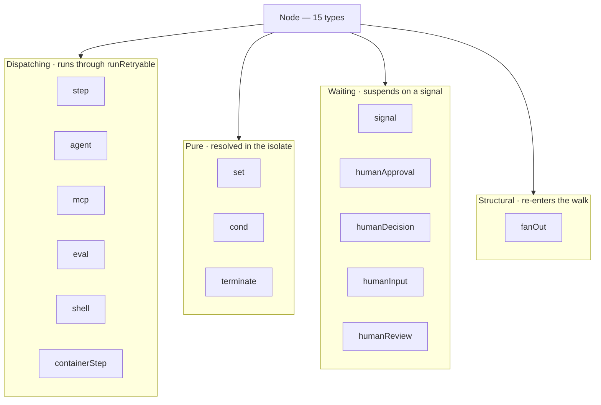
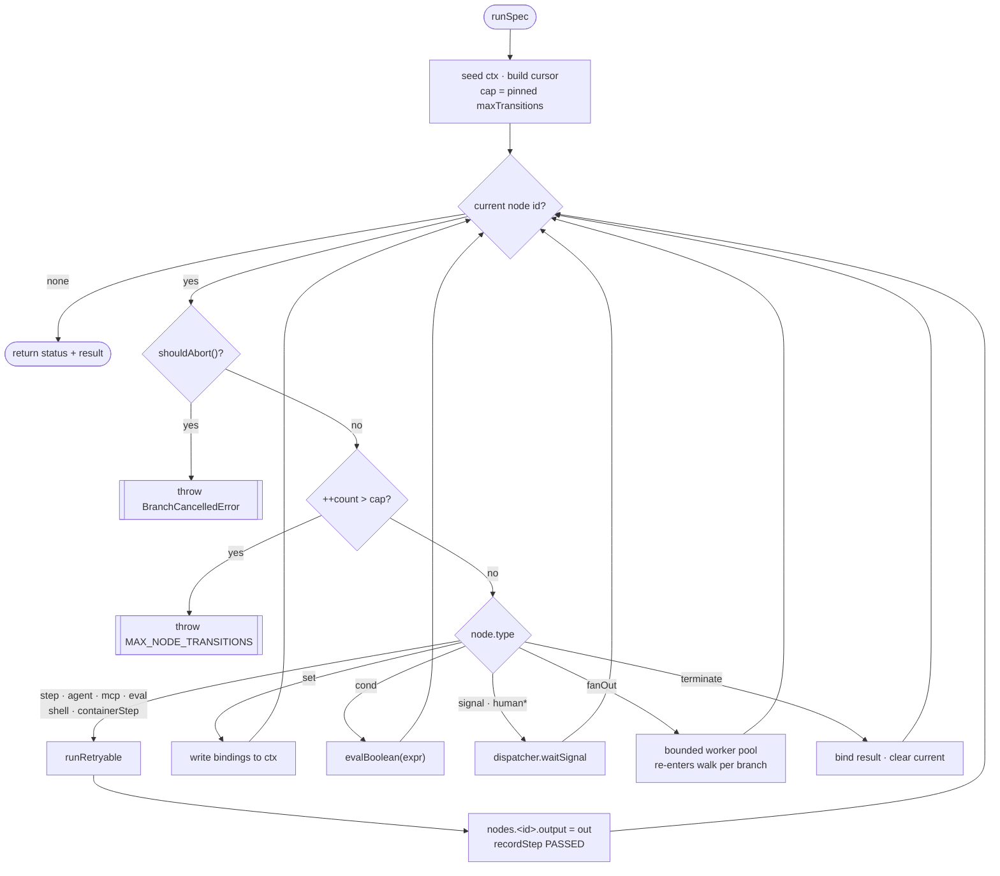

# Workflow Spec and Interpreter

> Indexed at commit `ae416937` on 2026-10-03 · [view on GitHub](https://github.com/yorch/auto-swe/tree/ae416937)

## Relevant source files

- [packages/shared/src/workflow/spec.ts](https://github.com/yorch/auto-swe/blob/ae416937/packages/shared/src/workflow/spec.ts)
- [packages/shared/src/workflow/interpreter.ts](https://github.com/yorch/auto-swe/blob/ae416937/packages/shared/src/workflow/interpreter.ts)
- [packages/shared/src/workflow/expr.ts](https://github.com/yorch/auto-swe/blob/ae416937/packages/shared/src/workflow/expr.ts)
- [packages/shared/src/workflow/stepRegistry.ts](https://github.com/yorch/auto-swe/blob/ae416937/packages/shared/src/workflow/stepRegistry.ts)
- [packages/shared/src/workflow/registry-types.ts](https://github.com/yorch/auto-swe/blob/ae416937/packages/shared/src/workflow/registry-types.ts)
- [packages/shared/src/workflow/validateSpec.ts](https://github.com/yorch/auto-swe/blob/ae416937/packages/shared/src/workflow/validateSpec.ts)
- [packages/shared/src/workflow/signalSlots.ts](https://github.com/yorch/auto-swe/blob/ae416937/packages/shared/src/workflow/signalSlots.ts)
- [packages/shared/src/workflow/codemod.ts](https://github.com/yorch/auto-swe/blob/ae416937/packages/shared/src/workflow/codemod.ts)
- [packages/shared/src/workflow/codemods.ts](https://github.com/yorch/auto-swe/blob/ae416937/packages/shared/src/workflow/codemods.ts)
- [packages/shared/src/workflow/specDiff.ts](https://github.com/yorch/auto-swe/blob/ae416937/packages/shared/src/workflow/specDiff.ts)
- [packages/shared/src/workflow/costEstimator.ts](https://github.com/yorch/auto-swe/blob/ae416937/packages/shared/src/workflow/costEstimator.ts)
- [packages/shared/src/workflow/authoring.ts](https://github.com/yorch/auto-swe/blob/ae416937/packages/shared/src/workflow/authoring.ts)
- [packages/shared/src/workflow/shellImageAllowlist.ts](https://github.com/yorch/auto-swe/blob/ae416937/packages/shared/src/workflow/shellImageAllowlist.ts)
- [packages/shared/src/workflow/index.ts](https://github.com/yorch/auto-swe/blob/ae416937/packages/shared/src/workflow/index.ts)
- [packages/shared/src/workflow/defaultEngineeringSpec.ts](https://github.com/yorch/auto-swe/blob/ae416937/packages/shared/src/workflow/defaultEngineeringSpec.ts)
- [packages/shared/src/workflow/templates/index.ts](https://github.com/yorch/auto-swe/blob/ae416937/packages/shared/src/workflow/templates/index.ts)
- [packages/shared/src/workflow/templates/authoring/index.ts](https://github.com/yorch/auto-swe/blob/ae416937/packages/shared/src/workflow/templates/authoring/index.ts)
- [packages/shared/src/workflow/templates/authoring/common.ts](https://github.com/yorch/auto-swe/blob/ae416937/packages/shared/src/workflow/templates/authoring/common.ts)
- [packages/shared/src/workflow/templates/authoring/reviewLoop.ts](https://github.com/yorch/auto-swe/blob/ae416937/packages/shared/src/workflow/templates/authoring/reviewLoop.ts)
- [packages/shared/src/workflow/templates/authoring/ciLoop.ts](https://github.com/yorch/auto-swe/blob/ae416937/packages/shared/src/workflow/templates/authoring/ciLoop.ts)
- [packages/shared/src/workflow/templates/golden.test.ts](https://github.com/yorch/auto-swe/blob/ae416937/packages/shared/src/workflow/templates/golden.test.ts)
- [packages/shared/src/workflow/templates/agentReviewedPr.ts](https://github.com/yorch/auto-swe/blob/ae416937/packages/shared/src/workflow/templates/agentReviewedPr.ts)
- [packages/shared/src/workflow/templates/fourEyes.ts](https://github.com/yorch/auto-swe/blob/ae416937/packages/shared/src/workflow/templates/fourEyes.ts)
- [packages/shared/src/workflow/templates/consensusReview.ts](https://github.com/yorch/auto-swe/blob/ae416937/packages/shared/src/workflow/templates/consensusReview.ts)
- [packages/shared/src/workflow/templates/modelCatalogRefresh.ts](https://github.com/yorch/auto-swe/blob/ae416937/packages/shared/src/workflow/templates/modelCatalogRefresh.ts)
- [packages/worker/src/workflows/runnable.ts](https://github.com/yorch/auto-swe/blob/ae416937/packages/worker/src/workflows/runnable.ts)
- [packages/worker/src/lib/workflowEngine.ts](https://github.com/yorch/auto-swe/blob/ae416937/packages/worker/src/lib/workflowEngine.ts)
- [packages/shared/src/lib/syncBuiltins.ts](https://github.com/yorch/auto-swe/blob/ae416937/packages/shared/src/lib/syncBuiltins.ts)
- [packages/shared/src/config/registry.ts](https://github.com/yorch/auto-swe/blob/ae416937/packages/shared/src/config/registry.ts)
- [packages/gateway/src/routes/workflowTemplates.ts](https://github.com/yorch/auto-swe/blob/ae416937/packages/gateway/src/routes/workflowTemplates.ts)
- [packages/web/src/components/workflow/outline.ts](https://github.com/yorch/auto-swe/blob/ae416937/packages/web/src/components/workflow/outline.ts)

---

## Overview

A workflow in auto-swe is not code. It is a JSON document — a `WorkflowSpec` — stored in a template version row and executed by a shared interpreter. The spec declares a named map of nodes plus an `entry` node id, and every node names its own successors by id. The graph is deliberately not acyclic: a `cond` node may point backwards to express a retry loop, and the interpreter bounds the total number of node transitions instead of forbidding cycles.

This directory owns three things that are usually separate concerns. It owns the **schema** (`spec.ts`), which is the only definition of what a workflow may say. It owns the **interpreter** (`interpreter.ts`), which walks the graph and decides what happens next. And it owns the **static analysis** around both — validation, diffing, cost estimation, and the catalog of steps a spec is allowed to name. The built-in templates live in the same directory, written with a small set of pure authoring helpers that expand into the same flat nodes the schema describes.

What it does not own is execution. The interpreter never opens a socket, never touches Prisma, never imports Temporal. Every effect goes through a `Dispatcher` object the caller supplies.

For the product-level view of workflows see [`docs/concepts.md`](https://github.com/yorch/auto-swe/blob/ae416937/docs/concepts.md) and [`docs/hitl-workflows.md`](https://github.com/yorch/auto-swe/blob/ae416937/docs/hitl-workflows.md).

Sources: [packages/shared/src/workflow/spec.ts:L1-L30](https://github.com/yorch/auto-swe/blob/ae416937/packages/shared/src/workflow/spec.ts#L1-L30) [packages/shared/src/workflow/interpreter.ts:L1-L10](https://github.com/yorch/auto-swe/blob/ae416937/packages/shared/src/workflow/interpreter.ts#L1-L10)

---

## Why the interpreter lives in `shared`

The obvious home for a workflow interpreter is the worker, next to the Temporal code that runs it. It lives in `shared` instead, and the reason is a hard constraint rather than a preference.

Temporal workflow files run inside a V8 isolate, not Node. A workflow file may only import runtime values from `@temporalio/workflow`; anything else must be `import type`. A module that is pure — no `fs`, no `crypto`, no `Date.now()`, no transitive dependency that reaches for one — is safe to bundle into that isolate. `interpreter.ts` is written to that standard, and its header says so explicitly. The worker still does not import it directly from `@auto-swe/shared`: `lib/workflowEngine.ts` re-exports six isolate-safe symbols through a worker-internal shim so the workflow file's import list stays inside the worker package. Four come from the engine itself — `runSpec`, `BranchCancelledError`, `readInterpreterLimits`, and `SignalSlots` — and two are small pure helpers it leans on, `lookupPath` and the `CHANNEL_TASK_STEER_SIGNAL` name.

Purity buys three more consumers that a worker-local interpreter would have shut out. The gateway validates a template against the same schema and the same step catalog before it saves it. The web canvas lints a spec live in the browser as an operator edits it, using the same `validateSpec` the repair loop uses. The tests exercise the interpreter directly against fake dispatchers with no Temporal test server at all, which is why `interpreter.test.ts` sits beside the interpreter rather than in the worker.

Sources: [packages/shared/src/workflow/interpreter.ts:L1-L10](https://github.com/yorch/auto-swe/blob/ae416937/packages/shared/src/workflow/interpreter.ts#L1-L10) [packages/worker/src/lib/workflowEngine.ts:L1-L19](https://github.com/yorch/auto-swe/blob/ae416937/packages/worker/src/lib/workflowEngine.ts#L1-L19) [packages/shared/src/workflow/validateSpec.ts:L30-L43](https://github.com/yorch/auto-swe/blob/ae416937/packages/shared/src/workflow/validateSpec.ts#L30-L43)

---

## The spec schema

`WorkflowSpecSchema` is a Zod object with five fields: `name`, `description`, `entry`, `nodes`, and a literal `schemaVersion` pinned to `SPEC_SCHEMA_VERSION`, currently `1`. Node ids are strings of 1 to 64 characters. The `nodes` field is a record from node id to a discriminated union on `type`. `parseWorkflowSpec`, in the same file, is the single parse gate every consumer uses.

Two structural checks run in a `superRefine` on top of the shape check. The entry node must exist in the map, and every outgoing edge of every node must name a node that exists. Both checks route through `nodeEdges`, described below.

A **binding** is how a node reads a value. It is a three-member union: `{ from: path, default? }` reads a dot-and-bracket path out of the run context, `{ literal: value }` supplies a constant, and `{ expr: string }` evaluates a small expression. The union is intentionally non-strict, so a stored spec that has picked up an incidental extra key still parses when it is re-read at run time. An object that satisfies more than one member resolves to whichever Zod matches first, which is a documented sharp edge rather than an error.

An expression's source is capped at `MAX_EXPR_LENGTH`, which is 2000 characters. The grammar is tiny and every transition may evaluate one, so a binding that long is a payload someone pasted, not a condition.

Sources: [packages/shared/src/workflow/spec.ts:L590-L618](https://github.com/yorch/auto-swe/blob/ae416937/packages/shared/src/workflow/spec.ts#L590-L618) [packages/shared/src/workflow/spec.ts:L39-L52](https://github.com/yorch/auto-swe/blob/ae416937/packages/shared/src/workflow/spec.ts#L39-L52) [packages/shared/src/workflow/spec.ts:L28-L37](https://github.com/yorch/auto-swe/blob/ae416937/packages/shared/src/workflow/spec.ts#L28-L37) [packages/shared/src/workflow/spec.ts:L743-L746](https://github.com/yorch/auto-swe/blob/ae416937/packages/shared/src/workflow/spec.ts#L743-L746)

---

## Node-type taxonomy

The union has **15 members**, enumerated in one place at [packages/shared/src/workflow/spec.ts:L555-L571](https://github.com/yorch/auto-swe/blob/ae416937/packages/shared/src/workflow/spec.ts#L555-L571). They fall into four families by how the interpreter handles them: six dispatch work to the outside world, three are resolved entirely in-process, five suspend the run until something arrives, and one restructures the walk itself.

```mermaid
graph TB
    Root["Node — 15 types"]

    subgraph Dispatch["Dispatching · runs through runRetryable"]
        Step[step]
        Agent[agent]
        Mcp[mcp]
        Eval[eval]
        Shell[shell]
        Container[containerStep]
    end

    subgraph Pure["Pure · resolved in the isolate"]
        Set[set]
        Cond[cond]
        Terminate[terminate]
    end

    subgraph Waiting["Waiting · suspends on a signal"]
        Signal[signal]
        Approval[humanApproval]
        Decision[humanDecision]
        Input[humanInput]
        Review[humanReview]
    end

    subgraph Structural["Structural · re-enters the walk"]
        FanOut[fanOut]
    end

    Root --> Dispatch
    Root --> Pure
    Root --> Waiting
    Root --> Structural
```

The four dispatching types other than `step` and `shell` are not separate transport paths. `agent`, `mcp`, `eval`, and `containerStep` each pack their typed fields into a step `config` object and call `dispatchStep` under a synthetic step name — `runAgentNode`, `mcpCallTool`, `runEvalNode`, `runContainerStep` respectively — so that retry, failure policy, and step recording behave identically for all of them.

| Type | Family | Outgoing edges | Semantics |
|---|---|---|---|
| `step` | dispatch | `next` | Invokes a registered activity by name with resolved `inputs` and a static `config` blob. |
| `agent` | dispatch | `next` | Runs a library agent by `agentRef` (`key` or `key@version`); `userMessage` overrides the prompt payload, `systemPrompt` overrides the agent's own prompt. |
| `mcp` | dispatch | `next` | Calls one named `tool` on an `mcp` Connection identified by `connectionRef`; the result lands at `nodes.<id>.output.result`. |
| `eval` | dispatch | `next` | Scores a `target` binding with one or more scorers; floor scorers run first and short-circuit the judge. |
| `shell` | dispatch | `next` | Runs a user-authored `command` in an ephemeral, allowlisted container with `network: none` by default. |
| `containerStep` | dispatch | `next` | Same sandbox as `shell` but with a JSON contract: inputs in as an env var, JSON out over stdout, NDJSON, or a sidecar HTTP port. |
| `set` | pure | `next` | Writes each `values` entry into the run context at its dot path. |
| `cond` | pure | `onTrue`, `onFalse` | Evaluates `expr` for truthiness and branches. Back-edges here are how loops are written. |
| `terminate` | pure | none | Ends the walk with a status of `SUCCESS`, `FAILED`, `TIMED_OUT`, or `SKIPPED`, plus an optional bound `result` map. |
| `signal` | waiting | `onReceive`, `onTimeout` | Waits for a named Temporal signal up to `timeout`; optionally stores the payload at `storeAs`. |
| `humanApproval` | waiting | `onApprove`, `onReject`, `onTimeout` | Asks a human to approve or reject; `approverCount` is a binding, so the quorum can be computed from context. |
| `humanDecision` | waiting | `onTimeout` plus one `next` per option | Presents 2 to 10 labelled options; the chosen option supplies the next node. |
| `humanInput` | waiting | `onSubmit`, `onTimeout` | Collects a structured form of 1 to 20 typed fields (`text`, `number`, `boolean`, `select`). |
| `humanReview` | waiting | `onSubmit`, `onTimeout` | Shows content read from `contentFrom` for a human to read and optionally edit. |
| `fanOut` | structural | `subgraph`, `join` | Runs `subgraph` once per element of the array `over` resolves to, then resumes at `join`. |

`CANCELLED` is deliberately absent from the `terminate` status enum. Temporal sets it out of band on a cancellation signal, so no node can ever reach it and the spec must not be able to claim it.

Activity-level `retry`, `startToCloseTimeout` and `heartbeatTimeout` are still accepted on a node so that stored specs and signed bundles keep parsing, but nothing reads them: the worker applies fixed proxy groups by step kind, and workflow-level retry is `onFail: { retry: N }`. `validateSpec` warns when one is set.

Sources: [packages/shared/src/workflow/spec.ts:L146-L546](https://github.com/yorch/auto-swe/blob/ae416937/packages/shared/src/workflow/spec.ts#L146-L546) [packages/shared/src/workflow/interpreter.ts:L558-L831](https://github.com/yorch/auto-swe/blob/ae416937/packages/shared/src/workflow/interpreter.ts#L558-L831) [packages/shared/src/workflow/spec.ts:L294-L302](https://github.com/yorch/auto-swe/blob/ae416937/packages/shared/src/workflow/spec.ts#L294-L302)

---

## Presentation metadata: groups and titles

Every node schema except the four human nodes spreads the same two optional fields, `group` and `title`; the human nodes take only `group`, because their `title` is already required (it is the approver's inbox heading, bounded at 200 characters) and the canvas reads it as the display name. A `group` is a short phase label such as `review loop` or `CI loop`; a `title` is a human-readable name shown in place of the node id. Neither is read by the interpreter, the worker, the cost estimator or analytics. They exist for the canvas, the outline and the run viewer.

They are stored inline on each node, inside the same JSON the spec has always been, so there is no separate table or sidecar. Because specs stored before the fields existed carry neither, an old spec parses and hashes exactly as it did.

**Reading is tolerant, writing is strict.** An unknown `title` or `group` key used to be stripped silently, and a bundle installs its spec raw, so a stored spec can carry one in any shape. A value that is not a string, is blank, or is over the limit therefore degrades to absent on parse instead of failing it — a failing parse would fail run creation and blank the run viewer's graph. A string is trimmed, so `"ci"` and `"ci "` are one group everywhere. The limits (`MAX_NODE_GROUP_LENGTH` 40, `MAX_NODE_TITLE_LENGTH` 80) are enforced where a spec is authored: `findInvalidPresentation` checks the raw spec on the gateway's save path and returns one message per bad value, and `builtinTemplates.test.ts` runs the same check over every built-in.

Two further pieces keep the metadata honest:

- `splitGroups` computes the connected pieces of each group, counting only edges between members and ignoring direction. `validateSpec` turns a group that falls apart into a `GROUP_NOT_CONTIGUOUS` warning, since a view that folds the group into one card would hide the path between its pieces. It checks connectedness only, not single entry or exit.
- `diffSpecs` reports a node whose only difference is `group` or `title` under `presentationOnlyNodes`, neither changed nor unchanged, so a spec that merely gained labels does not bury its real edits. A human node's `title` counts as content, not presentation.

On the web side, `outline.ts` builds the outline view: the nodes in flow order (a walk from the entry that follows `nodeEdges` order, so a `cond`'s true branch is read before its false branch), gathered into sections by group, with a lone ungrouped node as its own section. `WorkflowOutline` renders it as a rail beside the canvas that the editor toggles, and `foldGroups.ts` offers to collapse a group into one card only when that is honest — two or more members forming one connected piece.

Sources: [packages/shared/src/workflow/spec.ts:L56-L136](https://github.com/yorch/auto-swe/blob/ae416937/packages/shared/src/workflow/spec.ts#L56-L136) [packages/shared/src/workflow/spec.ts:L478-L553](https://github.com/yorch/auto-swe/blob/ae416937/packages/shared/src/workflow/spec.ts#L478-L553) [packages/shared/src/workflow/validateSpec.ts:L140-L189](https://github.com/yorch/auto-swe/blob/ae416937/packages/shared/src/workflow/validateSpec.ts#L140-L189) [packages/shared/src/workflow/specDiff.ts:L18-L69](https://github.com/yorch/auto-swe/blob/ae416937/packages/shared/src/workflow/specDiff.ts#L18-L69) [packages/shared/src/workflow/specDiff.ts:L73-L131](https://github.com/yorch/auto-swe/blob/ae416937/packages/shared/src/workflow/specDiff.ts#L73-L131) [packages/gateway/src/routes/workflowTemplates.ts:L593-L601](https://github.com/yorch/auto-swe/blob/ae416937/packages/gateway/src/routes/workflowTemplates.ts#L593-L601) [packages/web/src/components/workflow/outline.ts:L1-L40](https://github.com/yorch/auto-swe/blob/ae416937/packages/web/src/components/workflow/outline.ts#L1-L40) [packages/web/src/components/workflow/WorkflowOutline.tsx:L1-L25](https://github.com/yorch/auto-swe/blob/ae416937/packages/web/src/components/workflow/WorkflowOutline.tsx#L1-L25) [packages/web/src/components/workflow/foldGroups.ts:L1-L26](https://github.com/yorch/auto-swe/blob/ae416937/packages/web/src/components/workflow/foldGroups.ts#L1-L26) [packages/web/src/components/workflow/TemplateEditor.tsx:L430-L442](https://github.com/yorch/auto-swe/blob/ae416937/packages/web/src/components/workflow/TemplateEditor.tsx#L430-L442)

---

## Edges are enumerated in exactly one place

`nodeEdges(node)` returns a list of `[fieldName, targetNodeId]` pairs for every outgoing edge a node actually has. It is the single source of truth for graph traversal: the schema's reference check uses it, and so do the reachability, termination, fan-out-closure and group-contiguity analyses in `validateSpec`, and the web outline's flow ordering.

The `switch` ends in an exhaustiveness sentinel — an assignment to `const unhandled: never`. The comment explains the failure mode this guards, which is worth restating because it is unusually quiet. A node variant missing from this switch reports zero outgoing edges. Zero edges means the schema's reference validation checks nothing for that node, and it means `validateSpec` believes every node downstream of it is unreachable. Validation would call a broken spec clean. The sentinel turns that into a build failure.

`humanDecision` is the one type whose edges are not plain top-level fields — its option targets live inside an array, addressed as `options[0].next`. Two helpers, `readNodeEdge` and `setNodeEdge`, let an editor read and retarget an edge by the same field name `nodeEdges` emits, and they special-case that indexed form so no consumer has to. `setNodeEdge` returns a new node and cannot clear an option edge, because the schema requires it.

Sources: [packages/shared/src/workflow/spec.ts:L620-L689](https://github.com/yorch/auto-swe/blob/ae416937/packages/shared/src/workflow/spec.ts#L620-L689) [packages/shared/src/workflow/spec.ts:L691-L739](https://github.com/yorch/auto-swe/blob/ae416937/packages/shared/src/workflow/spec.ts#L691-L739)

---

## The expression language

Expressions appear in `cond` nodes and in `expr` bindings. The evaluator in `expr.ts` is a hand-written tokenizer and recursive-descent parser supporting path lookups, numeric and string and boolean and null literals, the four arithmetic operators, six comparisons, `&&`, `||`, `!`, `??`, and parentheses.

What it deliberately omits is the interesting part. There are no function calls, no assignment, no computed property access, and no `eval`. A workflow spec is data that arrives from an operator, a bundle, or an LLM author, and the evaluator is the boundary that keeps it data.

Comparison is strict. `==` and `!=` use `===` and `!==`, so no coercion happens. The four ordering operators require both operands to be numbers and throw otherwise, with a message that reports the operand's *type* and never its content — those messages land in step rows, logs, and the run page, and operands come from step outputs and request payloads.

`&&`, `||` and `??` short-circuit. The right-hand side of a decided operator is still parsed, so a syntax error anywhere is still reported, but nothing in it is read or run: `a != null && a.count > 0` does not raise a type error when `a` is null. The parser carries a skip depth for this, and the same mechanism powers the syntax check.

Three path segments are refused outright: `__proto__`, `prototype`, and `constructor`. The set is exported and shared, so it blocks reads in `lookupPath` and writes in the interpreter's `setPath` from the same definition. Hitting one is raised as a syntax error rather than a runtime error, so the spec is rejected at save time instead of on the first run that happens to evaluate the binding — and a reserved segment inside a skipped right-hand side is still caught.

`checkExprSyntax` is the piece that makes save-time linting possible without a context. It runs the parser with evaluation switched off for the whole expression, so no path is read and no operator executes. An evaluating pass against an empty object would stop at the first runtime type error — `count >= 3` throws against `{}` — and never reach a syntax error further right, as in `count >= 3 && (a`. Anything other than a syntax error escaping the parse-only pass is reported rather than swallowed, since it can only be a parser bug.

Sources: [packages/shared/src/workflow/expr.ts:L1-L36](https://github.com/yorch/auto-swe/blob/ae416937/packages/shared/src/workflow/expr.ts#L1-L36) [packages/shared/src/workflow/expr.ts:L81-L118](https://github.com/yorch/auto-swe/blob/ae416937/packages/shared/src/workflow/expr.ts#L81-L118) [packages/shared/src/workflow/expr.ts:L317-L395](https://github.com/yorch/auto-swe/blob/ae416937/packages/shared/src/workflow/expr.ts#L317-L395) [packages/shared/src/workflow/expr.ts:L469-L482](https://github.com/yorch/auto-swe/blob/ae416937/packages/shared/src/workflow/expr.ts#L469-L482) [packages/shared/src/workflow/expr.ts:L500-L537](https://github.com/yorch/auto-swe/blob/ae416937/packages/shared/src/workflow/expr.ts#L500-L537)

---

## Variable scoping and the run context

The context is a plain object with four conventional top-level keys. `request` holds the work request that started the run, `workflow` holds the run's own identity, `context` is the free-form scratch space a `set` node writes into, and `nodes` holds each node's recorded output at `nodes.<id>.output`.

A `set` node writes each of its `values` entries at the dot path given as the key, so `'context.ciRetries'` targets a nested field rather than a literal key with a dot in it. `setPath` splits on `.` only. Bracket notation that `lookupPath` understands for reads is *not* interpreted on writes, because a path segment may legitimately contain brackets — a fan-out branch's recording ids look like `fan[0]/echo`. Intermediate objects it creates are null-prototype, as a second layer under the reserved-segment check.

The one place scoping stops being flat is a fan-out branch. `makeChildContext` builds a sealed context per branch. `request`, `workflow`, the `context` scratch space and the bound element are each deep-copied by `cloneData`, so a branch can read parent values while a `set` on a nested path such as `context.plan.status` cannot write through a shared object into the parent or a sibling. `nodes` starts empty. The element is bound at the node's `itemKey` (default `subtask`) and its index at `<itemKey>Index`. A `fanOut` descriptor object records the index and the key name, so a step executor that wants to default an input from the branch item can find it without assuming the key is `subtask`.

`cloneData` is hand-rolled because `structuredClone` is not guaranteed inside the Temporal isolate. It copies arrays and plain or null-prototype objects, skips reserved segment names, and returns anything else as is.

Because `nodes` is reinitialized per branch, a branch writes and reads its node outputs under the plain spec node id even though its *recorded* id carries a prefix. Nothing else flows back to the parent: only the paths listed in `exports` are lifted out at join time.

Sources: [packages/shared/src/workflow/interpreter.ts:L1522-L1546](https://github.com/yorch/auto-swe/blob/ae416937/packages/shared/src/workflow/interpreter.ts#L1522-L1546) [packages/shared/src/workflow/interpreter.ts:L1425-L1475](https://github.com/yorch/auto-swe/blob/ae416937/packages/shared/src/workflow/interpreter.ts#L1425-L1475) [packages/shared/src/workflow/interpreter.ts:L1003-L1008](https://github.com/yorch/auto-swe/blob/ae416937/packages/shared/src/workflow/interpreter.ts#L1003-L1008)

---

## The execution model

`runSpec` shallow-copies the initial context, ensures `nodes` and `context` exist, builds a cursor holding the transition counter and the run's resolved limits, and calls `walk` from the entry node.

`walk` is a loop over a current node id. Each iteration checks an abort predicate, increments and tests the transition counter, looks the node up, and switches on its type. It exits when a node yields no successor, which happens only at `terminate`. The catch around the switch records a `FAILED` row and rethrows — but it skips recording for the seven types listed in `SELF_RECORDING_NODE_TYPES`, because those already write a row per attempt inside `runRetryable`, or in fan-out's case write an aggregate before throwing.

```mermaid
flowchart TD
    Start([runSpec]) --> Init["seed ctx · build cursor<br/>cap = pinned maxTransitions"]
    Init --> Loop{"current node id?"}
    Loop -->|none| Done([return status + result])
    Loop -->|yes| Abort{"shouldAbort()?"}
    Abort -->|yes| Cancel[["throw BranchCancelledError"]]
    Abort -->|no| Count{"++count > cap?"}
    Count -->|yes| Overrun[["throw MAX_NODE_TRANSITIONS"]]
    Count -->|no| Kind{"node.type"}

    Kind -->|"step · agent · mcp · eval<br/>shell · containerStep"| Retryable["runRetryable"]
    Kind -->|"set"| SetN["write bindings to ctx"]
    Kind -->|"cond"| CondN["evalBoolean(expr)"]
    Kind -->|"signal · human*"| Wait["dispatcher.waitSignal"]
    Kind -->|"fanOut"| Fan["bounded worker pool<br/>re-enters walk per branch"]
    Kind -->|"terminate"| Term["bind result · clear current"]

    Retryable --> Bind["nodes.&lt;id&gt;.output = out<br/>recordStep PASSED"]
    Bind --> Loop
    SetN --> Loop
    CondN --> Loop
    Wait --> Loop
    Fan --> Loop
    Term --> Loop
```

The transition cap defaults to `DEFAULT_MAX_TRANSITIONS`, which is 500. The cursor is threaded into nested walks, so the cap covers a whole run including every fan-out branch rather than resetting per branch.

When a failure is recorded, `describeStepError` decides the text. A failed activity reaches the workflow as an `ActivityFailure` whose own message is always "Activity task failed"; the real reason is its innermost `cause`. The helper walks the cause chain (duck-typed, because this module has no runtime imports) and records `<type>: <message>` for a typed failure, else the innermost message. It changes only what is recorded in the arguments of the step-record activity, never the commands the workflow issues, so replay is unaffected.

Sources: [packages/shared/src/workflow/interpreter.ts:L343-L556](https://github.com/yorch/auto-swe/blob/ae416937/packages/shared/src/workflow/interpreter.ts#L343-L556) [packages/shared/src/workflow/interpreter.ts:L36-L47](https://github.com/yorch/auto-swe/blob/ae416937/packages/shared/src/workflow/interpreter.ts#L36-L47) [packages/shared/src/workflow/interpreter.ts:L243](https://github.com/yorch/auto-swe/blob/ae416937/packages/shared/src/workflow/interpreter.ts#L243) [packages/shared/src/workflow/interpreter.ts:L273](https://github.com/yorch/auto-swe/blob/ae416937/packages/shared/src/workflow/interpreter.ts#L273) [packages/shared/src/workflow/interpreter.ts:L1552-L1583](https://github.com/yorch/auto-swe/blob/ae416937/packages/shared/src/workflow/interpreter.ts#L1552-L1583)

---

## What the interpreter may do, and what it must delegate

The split is enforced by the `Dispatcher` interface rather than by convention. Anything the interpreter can compute from the spec and the context, it computes. Anything that touches the world goes through a method on the dispatcher object the caller passed in.

**The interpreter owns**: resolving bindings and evaluating expressions, mutating the run context, choosing the next node id, counting transitions and enforcing the cap, sealing per-branch child contexts and collecting exports, bounding fan-out concurrency, applying `onFail` and `onError` policy, and mapping a human response back to an outgoing edge.

**It delegates**, through seven methods, three of which are required:

| Method | Required | Responsibility |
|---|---|---|
| `dispatchStep` | yes | Invoke a step's activity and return its output, or throw. |
| `waitSignal` | yes | Block on a named signal up to a timeout; `undefined` means it timed out. |
| `recordStep` | yes | Persist a step outcome. Best-effort — the interpreter wraps every call so a database hiccup cannot poison a run. |
| `dispatchShell` | no | Run a `shell` node's container. Absent means `shell` nodes are unsupported and raise a clear error. |
| `notifyHumanStep` / `resolveHumanStep` | no | Create the pending human-step row and notify, then mark it timed out. Both best-effort. |
| `drainSteering` | no | Return and clear any out-of-band guidance for the next `agent` node. |

Every dispatch carries three identifiers: `nodeId`, the recording id, which a fan-out branch prefixes (`fan[0]/impl`); `specNodeId`, the bare key in `spec.nodes`; and `stepAttempt`, the 1-based interpreter attempt (an `onFail` retry re-dispatches). The worker's dispatcher uses them to tag the activity it schedules with the node it runs for, so traces can be attributed to a spec node and a branch; an outbound interceptor turns the tag into an activity header.

The optional methods are what let a test dispatcher be a small object literal. The worker's real one is a Temporal-backed object built inside `runnable.ts`, where `dispatchStep` resolves the step name through a `STEP_EXECUTORS` map and `waitSignal` bridges to `condition()` over a `SignalSlots` buffer.

Steering deserves its own note because its semantics are easy to over-read. It is soft. The interpreter drains the buffer immediately before invoking an `agent` node and merges the result into that node's prompt. It does not preempt an agent node already running, so guidance that arrives mid-node applies at the *next* agent node — and a run with a single agent node only picks up steering that arrived before that node started.

Sources: [packages/shared/src/workflow/interpreter.ts:L108-L234](https://github.com/yorch/auto-swe/blob/ae416937/packages/shared/src/workflow/interpreter.ts#L108-L234) [packages/worker/src/workflows/runnable.ts:L373-L433](https://github.com/yorch/auto-swe/blob/ae416937/packages/worker/src/workflows/runnable.ts#L373-L433) [packages/shared/src/workflow/interpreter.ts:L592-L645](https://github.com/yorch/auto-swe/blob/ae416937/packages/shared/src/workflow/interpreter.ts#L592-L645)

---

## Failure policy

Every dispatching node routes through `runRetryable`, which layers workflow-level failure handling on top of the fixed activity-level retry the worker's proxy groups apply.

Two things count as a failure. A thrown error is one. The other is a returned object with `passed === false` — the gate contract that quality gates and shell steps use to report a logical failure without raising. Both feed the same policy.

`onFail` has three settings. `block` is the default and terminates the run. `warn` records the failure, writes it into the context at `nodes.<id>.output` and `nodes.<id>.error`, and continues along `next`. `{ retry: N }` re-runs the node up to N additional times, recording each attempt as its own row, then falls back to `block` semantics once the budget is spent. The older `onError: 'continue'` field still wins when set: it records the step as `SKIPPED`, nulls the output, and proceeds.

Two cancellation rules sit around that policy. A `BranchCancelledError` — raised on a fan-out sibling when block mode fires — is recorded and rethrown immediately. Without that bypass, a sibling configured with `onFail: 'warn'` would swallow the cancellation that block mode raised on it and keep running after the fan-out had already been decided. The error carries a `__branchCancelled` tag alongside its class identity, because a Temporal isolate can make `instanceof` unreliable across realms. And before every attempt after the first, `runRetryable` checks the branch's abort predicate, so a retrying branch does not start another full activity run after the fan-out was decided.

Sources: [packages/shared/src/workflow/interpreter.ts:L852-L991](https://github.com/yorch/auto-swe/blob/ae416937/packages/shared/src/workflow/interpreter.ts#L852-L991) [packages/shared/src/workflow/interpreter.ts:L62-L106](https://github.com/yorch/auto-swe/blob/ae416937/packages/shared/src/workflow/interpreter.ts#L62-L106) [packages/shared/src/workflow/spec.ts:L148-L166](https://github.com/yorch/auto-swe/blob/ae416937/packages/shared/src/workflow/spec.ts#L148-L166)

---

## Fan-out semantics

`runFanOut` resolves `over` to an array — a non-array is an immediate self-recorded failure — then runs the subgraph once per element through a bounded worker pool. Concurrency comes from the node's own `concurrency` field when set (the schema allows 1 to `MAX_FANOUT_CONCURRENCY`, which is 20), otherwise from the run's pinned `workflow.fanoutConcurrency` limit, which defaults to 4 and is capped by the same constant, so a value the setting accepts is always one a spec could state.

Results are written into a pre-allocated slot array indexed by element position, so the aggregate preserves input order regardless of completion order. Branches that block mode never scheduled leave holes, which are dropped at the end while everything that ran keeps its relative order. The aggregate bound at `nodes.<fanOutId>.output` carries `count`, `results`, `succeeded`, `failed`, `skipped`, and — when `pluck` is set — a flat `plucked` array projecting one path out of each entry, with `null` for entries that had no match.

A branch that reaches a `terminate` node ends *that branch*, not the run. The nested `walk` is told it is branch-local by a non-empty node id prefix, and the caller distinguishes a branch terminate from a workflow terminate by the returned status. A branch that terminates with a non-`SUCCESS` status never throws, so the pool surfaces it explicitly to make sure `onBranchFail: 'block'` still fires.

Block mode does three things at once: it stops scheduling new branches, it calls `cancel()` on the cancellation token every in-flight sibling installed, and it sets a flag the sibling walks check between nodes. That last one matters because a branch sitting on a `set` or `cond` is not inside an activity and has nothing to cancel. Each branch holds a `BranchSink` carrying both the token and that abort predicate. Whoever is currently blocking the branch writes the token: the dispatcher around an activity, the interpreter around a signal or human wait (`waitCancellable`), or a nested fan-out. A block-mode sibling failure therefore interrupts a branch parked on a human approval instead of leaving the join waiting out the whole timeout; the pending human-step row is closed later by run finalization.

Fan-outs nest. An inner fan-out takes its enclosing branch's sink as its parent: the parent's abort stops new inner branches, the parent's token is pointed at "cancel every inner branch" for the duration, and if the enclosing branch was cancelled the inner fan-out reports a cancellation rather than its own possibly clean outcome, so the outer policy applies. Dispatchers that do not support cancellation simply leave the token undefined, and the behaviour degrades to letting in-flight work drain.

Sources: [packages/shared/src/workflow/interpreter.ts:L1213-L1431](https://github.com/yorch/auto-swe/blob/ae416937/packages/shared/src/workflow/interpreter.ts#L1213-L1431) [packages/shared/src/workflow/interpreter.ts:L1163-L1184](https://github.com/yorch/auto-swe/blob/ae416937/packages/shared/src/workflow/interpreter.ts#L1163-L1184) [packages/shared/src/workflow/interpreter.ts:L86-L97](https://github.com/yorch/auto-swe/blob/ae416937/packages/shared/src/workflow/interpreter.ts#L86-L97) [packages/shared/src/workflow/spec.ts:L329-L346](https://github.com/yorch/auto-swe/blob/ae416937/packages/shared/src/workflow/spec.ts#L329-L346)

---

## Signals and human-in-the-loop nodes

A `signal` node awaits `dispatcher.waitSignal(name, timeout)`. An `undefined` return means the timeout elapsed; the step is recorded `SKIPPED` and the walk takes `onTimeout`. Otherwise the payload is bound at `storeAs` if requested, always bound at `nodes.<id>.output`, and the walk takes `onReceive`.

`null` is a legal payload, which is why the buffer between the Temporal handler and the interpreter is a small state machine rather than a nullable variable. `SignalSlots` distinguishes "no payload since the last take" from "a falsy payload was delivered", keeps a payload that arrives before anyone waits — a CI webhook routinely beats the interpreter to its wait node — and consumes it on `take()` so no two waits can see the same value.

The four HITL kinds share one handler, `runHumanNode`, and map to database kinds through `HITL_KINDS`: `humanApproval` to `APPROVAL`, `humanDecision` to `DECISION`, `humanInput` to `INPUT`, `humanReview` to `REVIEW`. `HITL_VALID_ACTIONS` lists the actions the gateway accepts for each (`approve`/`reject`, `select`, `submit`, `submit`). The handler's signal name is `hitl_${recordingId}`, keyed on the *recording* id rather than the spec id, so a HITL node inside a fan-out gets a distinct slot and a distinct pending-step row per branch. Keying on the spec id would give every branch one shared signal and one shared row, and only the first branch could ever be answered. The workflow registers handlers for the statically known names at start; a branch-local name is registered lazily when the dispatcher first waits on it, which is replay-safe because handler registration emits no command.

The handler records `PENDING`, calls `notifyHumanStep` best-effort, waits, and then routes. `humanApproval` reads `action` and takes `onReject` or `onApprove`; its quorum comes from `normalizeApproverCount`, which treats anything that is not a positive integer as one approver. `humanDecision` matches the payload's `value` against its options. `humanInput` and `humanReview` take `onSubmit`.

The malformed-decision case is worth calling out. If a `humanDecision` payload carries a value that matches no option, the handler records the step `FAILED` and routes to `onTimeout` — the node's "no usable answer" edge. It does not throw, and the comment is explicit that it must not start throwing: the committed replay-history fixture for `humanDecision` walks exactly this path, and a change here would strand a production workflow rather than fail a test.

Sources: [packages/shared/src/workflow/interpreter.ts:L1014-L1036](https://github.com/yorch/auto-swe/blob/ae416937/packages/shared/src/workflow/interpreter.ts#L1014-L1036) [packages/shared/src/workflow/interpreter.ts:L1038-L1161](https://github.com/yorch/auto-swe/blob/ae416937/packages/shared/src/workflow/interpreter.ts#L1038-L1161) [packages/shared/src/workflow/interpreter.ts:L245-L267](https://github.com/yorch/auto-swe/blob/ae416937/packages/shared/src/workflow/interpreter.ts#L245-L267) [packages/shared/src/workflow/interpreter.ts:L50-L56](https://github.com/yorch/auto-swe/blob/ae416937/packages/shared/src/workflow/interpreter.ts#L50-L56) [packages/shared/src/workflow/signalSlots.ts:L1-L67](https://github.com/yorch/auto-swe/blob/ae416937/packages/shared/src/workflow/signalSlots.ts#L1-L67) [packages/worker/src/workflows/runnable.ts:L312-L346](https://github.com/yorch/auto-swe/blob/ae416937/packages/worker/src/workflows/runnable.ts#L312-L346) [packages/worker/src/workflows/runnable.ts:L422-L431](https://github.com/yorch/auto-swe/blob/ae416937/packages/worker/src/workflows/runnable.ts#L422-L431)

---

## Determinism for Temporal replay

Four properties keep the walk replayable, and each is a deliberate choice rather than an accident of style.

**No non-determinism in the interpreter itself.** No clock, no randomness, no I/O. Every branch the walk takes is a function of the spec and the context, and the context only changes through dispatcher results that Temporal records in history. The cloning helper is written by hand for the same reason.

**The worker pool is ordered.** Temporal workflows run on a single-threaded event loop, so N workers sharing a `nextIndex` counter and joined with `Promise.all` schedule activities in a fixed order on every replay. The pool would be a determinism hazard on a real thread pool; it is not one here.

**Bounds are pinned at run start, not read live.** `maxTransitions` and `fanoutConcurrency` come from the setting registry (`workflow.maxTransitions`, default 500, maximum 100,000, and `workflow.fanoutConcurrency`, default 4, maximum 20, both declared `runPinned`), but the isolate cannot read the database, and a run that finished under different limits than it started with would stop matching its own history. So they are frozen into the run's pinned settings and read back by `readInterpreterLimits`, which re-validates the two values by hand rather than importing the registry's Zod schemas — a value import from outside `@temporalio/workflow` is exactly what the isolate forbids. Anything missing or malformed falls back to the interpreter defaults instead of throwing, because a whole class of older runs carries a NULL snapshot, and a workflow that threw on those would retry forever rather than surface. The same discipline applies one level up: a failure to load the template row is raised as a non-retryable `ApplicationFailure`, because a plain error fails the workflow task, which Temporal retries forever.

**Recorded histories are the test, and changed code is gated.** `runnable.replay.test.ts` replays committed fixtures — 19 recorded histories today, covering linear, fan-out, nested and block-cancelled fan-out, signal, each of the four HITL kinds, `cond` loops, `onFail` retry, `onError: continue`, shell, container, eval, mcp, agent, agent-run and context-spill shapes — against current workflow code. Running forward against fakes cannot catch a change that takes a different path *on replay*, which is the failure that strands a live workflow. A failing replay is a signal to fix the code, not to re-record the fixture. Where workflow code does have to change what it issues, it is gated with `patched()`: the context-spill budget skips an oversized value and spills a smaller one after it only for runs that started after the change, so a history recorded earlier still replays the way it was recorded.

Sources: [packages/shared/src/workflow/interpreter.ts:L1286-L1340](https://github.com/yorch/auto-swe/blob/ae416937/packages/shared/src/workflow/interpreter.ts#L1286-L1340) [packages/shared/src/workflow/interpreter.ts:L267-L341](https://github.com/yorch/auto-swe/blob/ae416937/packages/shared/src/workflow/interpreter.ts#L267-L341) [packages/worker/src/workflows/runnable.ts:L296-L302](https://github.com/yorch/auto-swe/blob/ae416937/packages/worker/src/workflows/runnable.ts#L296-L302) [packages/shared/src/config/registry.ts:L311-L336](https://github.com/yorch/auto-swe/blob/ae416937/packages/shared/src/config/registry.ts#L311-L336) [packages/worker/src/workflows/runnable.ts:L1268-L1285](https://github.com/yorch/auto-swe/blob/ae416937/packages/worker/src/workflows/runnable.ts#L1268-L1285) [packages/worker/src/workflows/runnable.ts:L288-L295](https://github.com/yorch/auto-swe/blob/ae416937/packages/worker/src/workflows/runnable.ts#L288-L295)

---

## The step catalog

A `step` node names an activity by string. The catalog that says which strings are legal is split across two files by who needs what.

`registry-types.ts` holds `BUILTIN_STEPS`, a `readonly` tuple of **38 step names**, plus the `StepMetadata` and `StepFieldDef` shapes. `stepRegistry.ts` holds the 38 matching metadata registrations: a label, a description, a category, the config fields the editor should render, and an optional `costHint` giving approximate token usage per call.

By category, counted over the 38 registrations:

| Category | Count |
|---|---|
| `agent` | 15 |
| `control` | 11 |
| `gate` | 8 |
| `vcs` | 3 |
| `shell` | 1 |

One registration is **internal**. `StepMetadata.internal` marks a step that is registered but not offered to authors: `listSteps()` leaves it out, so the palette and the authoring catalog show 37, and `listAllSteps()` returns all 38. The one internal step is `runAgentTask`, the single step of the agent-run system template, whose workspace, gate and push live in one activity and so must not be placeable in an authored template. Three layers refuse it elsewhere: `validateSpec` reports `INTERNAL_STEP` unless the caller passes `allowInternalSteps`, the gateway rejects a save or bundle that names one, and the worker refuses to run it for any other template. See [Agent Runs and Implementer Runtimes](./4.6-agent-runs-and-implementer-runtimes.md).

The activity wiring lives in the worker, not here — deliberately, so the gateway can validate a template and the web canvas can render a palette without pulling in worker-only code. Adding a step is a five-step checklist written into the registry's header: implement the activity, export it, add the name to `BUILTIN_STEPS`, register the metadata, and add an entry to `STEP_EXECUTORS` in the worker's `runnable.ts`. Two gates catch a half-finished addition: the worker calls `assertBuiltinStepsRegistered()` at boot, and a coverage test, `stepRequiredAgents.coverage.test.ts`, checks `BUILTIN_STEPS` against the executor table. The fifth step also asks for an entry in `STEP_REQUIRED_AGENTS` when the step resolves a model.

At run time the mapping is a single `Map` lookup. `dispatchStepImpl` resolves the step name against `STEP_EXECUTORS` with no `switch` statement, which is also how the four synthetic step names behind the `agent`, `mcp`, `eval`, and `containerStep` nodes find their executors. Some steps take optional config that the executor passes on only when it is set, so a template that does not use it calls the activity exactly as before: `allowedPaths` on the implementer and review-fix steps (a change touching any other file fails the step before commit or push), and `draft` on `createOrUpdatePullRequest`.

Sources: [packages/shared/src/workflow/registry-types.ts:L24-L48](https://github.com/yorch/auto-swe/blob/ae416937/packages/shared/src/workflow/registry-types.ts#L24-L48) [packages/shared/src/workflow/registry-types.ts:L53-L105](https://github.com/yorch/auto-swe/blob/ae416937/packages/shared/src/workflow/registry-types.ts#L53-L105) [packages/shared/src/workflow/stepRegistry.ts:L1-L24](https://github.com/yorch/auto-swe/blob/ae416937/packages/shared/src/workflow/stepRegistry.ts#L1-L24) [packages/shared/src/workflow/stepRegistry.ts:L504-L517](https://github.com/yorch/auto-swe/blob/ae416937/packages/shared/src/workflow/stepRegistry.ts#L504-L517) [packages/shared/src/workflow/stepRegistry.ts:L676-L697](https://github.com/yorch/auto-swe/blob/ae416937/packages/shared/src/workflow/stepRegistry.ts#L676-L697) [packages/worker/src/workflows/runnable.ts:L592-L600](https://github.com/yorch/auto-swe/blob/ae416937/packages/worker/src/workflows/runnable.ts#L592-L600) [packages/worker/src/workflows/runnable.ts:L1042-L1054](https://github.com/yorch/auto-swe/blob/ae416937/packages/worker/src/workflows/runnable.ts#L1042-L1054) [packages/worker/src/index.ts:L69](https://github.com/yorch/auto-swe/blob/ae416937/packages/worker/src/index.ts#L69) [packages/worker/src/lib/config/stepRequiredAgents.coverage.test.ts](https://github.com/yorch/auto-swe/blob/ae416937/packages/worker/src/lib/config/stepRequiredAgents.coverage.test.ts)

---

## Static validation

`validateSpec` is the layer above the schema. The schema proves the shape is right and that every edge points somewhere real; this proves the graph is runnable. It is pure and I/O-free, so the worker's repair loop, the gateway, and the browser canvas all run the identical analysis.

It reports three errors and nine warnings:

| Code | Severity | Meaning |
|---|---|---|
| `EXPR_SYNTAX` | error | A `cond` expression or an `expr` binding does not parse. |
| `NO_TERMINAL` | error | No `terminate` node is reachable from `entry`. |
| `INTERNAL_STEP` | error | A `step` names an internal step and the caller did not pass `allowInternalSteps`. |
| `UNKNOWN_NODE_REF` | warning | A `{ from: "nodes.<id>…" }` binding names a node that does not exist. |
| `UNREACHABLE` | warning | A node cannot be reached from `entry`. |
| `NODE_CANT_TERMINATE` | warning | A reachable node has no path to any `terminate` — a likely infinite loop. |
| `UNKNOWN_STEP` | warning | A `step` name is not a built-in. |
| `MISSING_CONFIG` | warning | A step's required config field is absent from both `config` and `inputs`. |
| `FANOUT_LEAK` | warning | A fan-out branch can walk into its own `join` node, or back into the fan-out, so every branch would run what is meant to run once. |
| `TERMINAL_IN_SUBGRAPH_ONLY` | warning | Every reachable `terminate` sits inside a fan-out branch, where it ends one branch and not the run. |
| `IGNORED_FIELD` | warning | A node sets `retry`, `startToCloseTimeout` or `heartbeatTimeout`, which nothing reads. |
| `GROUP_NOT_CONTIGUOUS` | warning | The edges between nodes sharing a `group` do not join them into one connected piece. |

Reachability is a forward breadth-first walk from `entry`. Termination is the reverse: seed the set with every `terminate` node, then repeatedly add any node with an edge into the set until it stops growing, and flag every reachable node left outside. The fan-out closure check is a second forward walk that starts at `subgraph` and, for the main-flow check, skips `subgraph` edges: the interpreter walks a branch over the same flat node map as the main flow, so nothing but the edges keeps the two apart.

The wiring differs by caller, which is the point of separating severity from behaviour. The LLM generation repair loop hard-gates on `errors`. The gateway's save path surfaces validation findings as non-blocking warnings, so an operator's half-finished draft is never rejected — but it does hard-reject a bad `group` or `title` and an internal step, which are authoring errors rather than drafts. Reference checks that need the database — does this `agentRef` exist, is this image on the team's allowlist — live outside this function and compose on top.

That composition includes the authoring-permission check on container execution. A `shell` node, a `containerStep` node, and a plain `step` node naming a `shell`-category step (`runContainerStep`) all run team-authored code in a container, so the gateway collects all three and applies the same permission check, image allowlist and audit row to each. The `step` spelling is reachable from hand-written JSON, and the interpreter dispatches it to the same executor as the declarative node, so gating on node type alone would leave it ungated.

Sources: [packages/shared/src/workflow/validateSpec.ts:L1-L43](https://github.com/yorch/auto-swe/blob/ae416937/packages/shared/src/workflow/validateSpec.ts#L1-L43) [packages/shared/src/workflow/validateSpec.ts:L118-L136](https://github.com/yorch/auto-swe/blob/ae416937/packages/shared/src/workflow/validateSpec.ts#L118-L136) [packages/shared/src/workflow/validateSpec.ts:L191-L417](https://github.com/yorch/auto-swe/blob/ae416937/packages/shared/src/workflow/validateSpec.ts#L191-L417) [packages/gateway/src/routes/workflowTemplates.ts:L125-L160](https://github.com/yorch/auto-swe/blob/ae416937/packages/gateway/src/routes/workflowTemplates.ts#L125-L160) [packages/gateway/src/routes/workflowTemplates.ts:L593-L625](https://github.com/yorch/auto-swe/blob/ae416937/packages/gateway/src/routes/workflowTemplates.ts#L593-L625)

---

## Built-in templates and the authoring helpers

`templates/index.ts` registers **26 built-in templates** in `BUILTIN_TEMPLATES`, led by `default-engineering`, the seeded default. By group, in registration order:

| Group | Templates |
|---|---|
| Core | `default-engineering` |
| Automated, no human gate | `hotfix`, `dependency-update`, `model-catalog-refresh`, `code-and-ci`, `agent-reviewed-pr`, `consensus-review` |
| Signal-driven | `signal-gated-rollout`, `canary-rollout` |
| Parallel | `parallel-fan-out` |
| Human-in-the-loop | `pr-approval-gate`, `scope-clarification`, `security-triage`, `human-code-review`, `tiered-escalation`, `four-eyes`, `migration`, `full-supervised` |
| Record workspace | `zendesk-ticket-reply` |
| Document workspace | `notion-content-draft`, `notion-content-brand-review`, `product-prd-draft` |
| Messaging | `send-slack-update` |
| Issue tracker | `create-issue`, `create-issue-from-brief` |
| PRD | `prd-decomposition` |

The non-code templates declare an `inputSchema` and a `workspaceProvider` (`record`, `document`, `api_only`, `issue_tracker`) so the run form and the gateway know what they take; the default engineering template declares the SWE input contract. `model-catalog-refresh` is the template that keeps the built-in model catalog current: it lists live model ids through the platform, has an agent edit only the catalog file under an `allowedPaths` restriction, runs the review loop, checks that the cumulative change is exactly that one file, and ends at a draft pull request with no CI loop and no approval inside the run. `agent-reviewed-pr` was seeded as `review-and-merge`; `RENAMED_TEMPLATES` in `syncBuiltins` renames that row in place so its history and team overrides follow the new name, because it opens a pull request and stops at green CI and never merges.

### Authored with helpers, stored flat

The templates are written with pure functions from `templates/authoring/`, and the contract of those helpers is the important part: **a built-in template is still a flat `WorkflowSpec`.** There is no macro, composite or sub-workflow node in the spec, and a helper is not a node type. Each helper runs when its template module loads and returns a plain node map under the same node ids the template has always used, which the template spreads into `nodes`. The engine, the worker, replay, run snapshots, node-keyed template analytics and bundle hashes see a flat spec and nothing else.

| Helper | What it emits |
|---|---|
| `validatePhase` | `setValidating → validate → setSuccessCriteria`; `validate` is non-blocking (`onError: 'continue'`). |
| `reviewLoop` | The nine-node agent review loop with a `context.reviewRetries` counter and a configurable limit (default 3); entry `setReviewing`. |
| `openPullRequest` | `openPR → savePrInfo → next`, optionally as a draft; records `context.prNumber` and `context.prUrl`. |
| `waitForCi` / `ciLoop` / `ciWaitEntry` | The CI wait (a signal, or `loadCiWaitConfig → routeCiWait` to a poll) and the fix loop around `checkCI`, with a repush or re-review handoff and an optional guard for a fix that changed nothing. |
| `signalGate` | An external go/no-go gate: a signal, a `cond` on its payload, and two terminals. |
| `policyGatedWrite` | Record the autonomy decision, branch on it, and make the write unreachable without approval when the policy requires one. |
| `sourceHead` | The head of a non-code template: resolve the workspace, then read the source record. |
| `statusStamp`, `qualityGate`, `initCounters`, `storeCodeResult`, `terminate`, `prResult` | Small node factories shared by the rest. |
| `mergeNodes`, `inGroup` | Combine node maps, throwing on a duplicate id instead of letting a spread silently replace a node; stamp a group on nodes that have none. |

`default-engineering` shows the shape: `validatePhase`, `reviewLoop`, `openPullRequest` and `ciLoop` spread into one `nodes` map beside a few hand-written nodes, with the human-merge signal and the lesson step written inline.

**`golden.test.ts` holds the helpers to that promise.** `__golden__/<name>.json` stores each template's flat spec as it was seeded before the rewrite, one file per built-in (26), and the built spec must equal its golden node for node and id for id. The only permitted differences are the entries in `INTENDED_CHANGES`, each with a reason, plus the `group` and `title` fields the helpers add. `builtinTemplates.test.ts` separately requires that every built-in parses, validates with no errors, and has no `UNREACHABLE`, `FANOUT_LEAK`, `TERMINAL_IN_SUBGRAPH_ONLY`, `IGNORED_FIELD` or `GROUP_NOT_CONTIGUOUS` finding.

**Two templates run CI before the human gates.** `four-eyes` and `consensus-review` open the pull request, wait for CI and run a fix loop on a failing CI (2 fix attempts, a third failure fails the run) before the two human approvals or the two-reviewer consensus. The implementer's fix session pushes its own commit, so no sign-off exists yet for a CI fix to invalidate, and a `repushAfterFix` step re-arms the PR's CI wait. A rejection goes to a fix, through CI again with a fresh budget, and back to both gates; a fix that changes nothing makes no commit, so no new CI event would arrive and the unchanged code goes straight back to the approvers marked as unchanged. The pull request is opened ready for review, since both templates leave `draft` unset. Both specs are re-exported from the workflow barrel so the worker's workflow test can run the real specs.

Sources: [packages/shared/src/workflow/templates/index.ts:L31-L63](https://github.com/yorch/auto-swe/blob/ae416937/packages/shared/src/workflow/templates/index.ts#L31-L63) [packages/shared/src/workflow/templates/index.ts:L63-L293](https://github.com/yorch/auto-swe/blob/ae416937/packages/shared/src/workflow/templates/index.ts#L63-L293) [packages/shared/src/workflow/templates/authoring/index.ts:L1-L26](https://github.com/yorch/auto-swe/blob/ae416937/packages/shared/src/workflow/templates/authoring/index.ts#L1-L26) [packages/shared/src/workflow/templates/authoring/common.ts:L1-L33](https://github.com/yorch/auto-swe/blob/ae416937/packages/shared/src/workflow/templates/authoring/common.ts#L1-L33) [packages/shared/src/workflow/templates/authoring/common.ts:L128-L165](https://github.com/yorch/auto-swe/blob/ae416937/packages/shared/src/workflow/templates/authoring/common.ts#L128-L165) [packages/shared/src/workflow/templates/authoring/reviewLoop.ts:L1-L53](https://github.com/yorch/auto-swe/blob/ae416937/packages/shared/src/workflow/templates/authoring/reviewLoop.ts#L1-L53) [packages/shared/src/workflow/templates/authoring/ciLoop.ts:L11-L79](https://github.com/yorch/auto-swe/blob/ae416937/packages/shared/src/workflow/templates/authoring/ciLoop.ts#L11-L79) [packages/shared/src/workflow/templates/authoring/ciLoop.ts:L87-L133](https://github.com/yorch/auto-swe/blob/ae416937/packages/shared/src/workflow/templates/authoring/ciLoop.ts#L87-L133) [packages/shared/src/workflow/templates/authoring/openPullRequest.ts:L1-L30](https://github.com/yorch/auto-swe/blob/ae416937/packages/shared/src/workflow/templates/authoring/openPullRequest.ts#L1-L30) [packages/shared/src/workflow/defaultEngineeringSpec.ts:L1-L60](https://github.com/yorch/auto-swe/blob/ae416937/packages/shared/src/workflow/defaultEngineeringSpec.ts#L1-L60) [packages/shared/src/workflow/templates/golden.test.ts:L1-L25](https://github.com/yorch/auto-swe/blob/ae416937/packages/shared/src/workflow/templates/golden.test.ts#L1-L25) [packages/shared/src/workflow/templates/builtinTemplates.test.ts:L1-L30](https://github.com/yorch/auto-swe/blob/ae416937/packages/shared/src/workflow/templates/builtinTemplates.test.ts#L1-L30) [packages/shared/src/workflow/templates/modelCatalogRefresh.ts:L1-L25](https://github.com/yorch/auto-swe/blob/ae416937/packages/shared/src/workflow/templates/modelCatalogRefresh.ts#L1-L25) [packages/shared/src/workflow/templates/modelCatalogRefresh.ts:L60-L179](https://github.com/yorch/auto-swe/blob/ae416937/packages/shared/src/workflow/templates/modelCatalogRefresh.ts#L60-L179) [packages/shared/src/workflow/templates/fourEyes.ts:L20-L43](https://github.com/yorch/auto-swe/blob/ae416937/packages/shared/src/workflow/templates/fourEyes.ts#L20-L43) [packages/shared/src/workflow/templates/consensusReview.ts:L14-L33](https://github.com/yorch/auto-swe/blob/ae416937/packages/shared/src/workflow/templates/consensusReview.ts#L14-L33) [packages/shared/src/workflow/templates/agentReviewedPr.ts:L15-L25](https://github.com/yorch/auto-swe/blob/ae416937/packages/shared/src/workflow/templates/agentReviewedPr.ts#L15-L25) [packages/shared/src/lib/syncBuiltins.ts:L885-L889](https://github.com/yorch/auto-swe/blob/ae416937/packages/shared/src/lib/syncBuiltins.ts#L885-L889) [packages/shared/src/workflow/index.ts:L114-L116](https://github.com/yorch/auto-swe/blob/ae416937/packages/shared/src/workflow/index.ts#L114-L116)

---

## Versioning and migration

`SPEC_SCHEMA_VERSION` is a literal on the schema, so a spec at the wrong version fails to parse rather than being interpreted under the wrong rules.

`codemod.ts` is the migration harness. A codemod is `{ from, to, transform }`; registration rejects a duplicate `from` and rejects any jump that is not exactly one version, so the chain stays linear. `migrateSpec` walks the chain until it reaches the target version.

Its contract has an explicit limit. It checks only that each transform returned a versioned object at the expected `schemaVersion`. It does *not* validate against `WorkflowSpecSchema`, so callers must run `parseWorkflowSpec` on the output before treating the result as a `WorkflowSpec` — which the runtime consumer in the worker's template activity does. A future structural codemod that produces a malformed blob will surface at that parse, not inside the harness.

The schema is at its v1 baseline and no built-in codemods are registered. The pre-deployment v1-to-v5 history was collapsed because nothing was ever deployed at an older version, so there are no stored specs to migrate. The registration machinery stays, covered by its own tests, and the package barrel side-effect-imports `codemods.ts` so any consumer of `migrateSpec` picks up the chain automatically once one exists. Adding the optional `group` and `title` fields needed no version bump or codemod: they are optional, tolerant on read, and absent from older specs.

Alongside versioning, `specDiff.ts` supports the version-comparison UI. It reports added, removed, changed, and unchanged node ids, the presentation-only nodes described above, and top-level metadata changes, comparing nodes by canonical JSON with deterministically sorted keys so property ordering never shows up as a spurious change. The diff is per-node by design; a consumer wanting field-level detail re-diffs the two raw node values itself.

Sources: [packages/shared/src/workflow/codemod.ts:L1-L69](https://github.com/yorch/auto-swe/blob/ae416937/packages/shared/src/workflow/codemod.ts#L1-L69) [packages/shared/src/workflow/codemods.ts:L1-L17](https://github.com/yorch/auto-swe/blob/ae416937/packages/shared/src/workflow/codemods.ts#L1-L17) [packages/shared/src/workflow/specDiff.ts:L1-L131](https://github.com/yorch/auto-swe/blob/ae416937/packages/shared/src/workflow/specDiff.ts#L1-L131)

---

## Supporting modules

**`shellImageAllowlist.ts`** gates `shell` and `containerStep` images. Four built-ins are permitted for every team, and `Team.shellImageAllowlist` adds more. Matching is exact string equality on `image:tag` — no prefix or pattern matching, so a typo in an allowlist entry cannot silently grant access to a similarly-named image. Both Node images in the built-in set are load-bearing: `node:26-alpine` matches the services' runtime, while `node:24-alpine` is the workspace default and the only one of the two carrying `yarn`, which every built-in gate command needs.

**`costEstimator.ts`** walks a spec and projects USD per run from each step's `costHint`. It is honest about being rough. Branching nodes take the *maximum* of both arms rather than an average, so the number is a worst case. A `fanOut` multiplies its subgraph by an assumed width, since the real width only exists at run time. Per-node costs are memoised so a diamond counts fully in every arm, and cycles are cut by the walk stack so a step in a retry loop counts once. Prices come from a per-role table: `DEFAULT_ROLE_PRICING` is only the fallback, holding the built-in price of the model each role's seeded GLOBAL agent runs (a test fails when a seeded default or a built-in price moves without it). The workflow editor passes live prices instead. The gateway's `rolePricing` finds, for each role, the model its latest active GLOBAL agent runs — following `inheritsModelFrom` — and prices it from the model catalog row, else the built-in table; a role whose model has no price is left out so the estimator keeps its default rather than show $0. The web page fetches that through `/api/v1/platform/model-catalog/role-pricing`, which any signed-in user may read because template authors cannot read the agent library. See [Model Catalog and Pricing](./4.7-model-catalog-and-pricing.md).

**`authoring.ts`** carries the pure pieces of natural-language workflow authoring: the catalog of real steps, agents, and MCP connections rendered into the prompt, plus the request and repair message scaffolding. Its output schema asks the model for the spec as a JSON *string* rather than a typed object, precisely because a 15-member discriminated union round-trips poorly through provider structured-output conversion. `parseWorkflowSpec` is the real gate, with a repair loop on top. The catalog is built from `listSteps()`, so internal steps never reach the model.

**`examples/`** holds four specs that are documentation rather than seed data — quality gates, decomposition, per-branch gates, and a shell step — each with a test that parses it, and each explicitly not registered as a template.

Sources: [packages/shared/src/workflow/shellImageAllowlist.ts:L17-L99](https://github.com/yorch/auto-swe/blob/ae416937/packages/shared/src/workflow/shellImageAllowlist.ts#L17-L99) [packages/shared/src/workflow/costEstimator.ts:L24-L48](https://github.com/yorch/auto-swe/blob/ae416937/packages/shared/src/workflow/costEstimator.ts#L24-L48) [packages/shared/src/workflow/costEstimator.ts:L78-L179](https://github.com/yorch/auto-swe/blob/ae416937/packages/shared/src/workflow/costEstimator.ts#L78-L179) [packages/gateway/src/lib/modelCatalogService.ts:L204-L260](https://github.com/yorch/auto-swe/blob/ae416937/packages/gateway/src/lib/modelCatalogService.ts#L204-L260) [packages/gateway/src/routes/modelCatalog.ts:L114-L120](https://github.com/yorch/auto-swe/blob/ae416937/packages/gateway/src/routes/modelCatalog.ts#L114-L120) [packages/web/src/app/workflows/library/[id]/page.tsx:L598-L611](https://github.com/yorch/auto-swe/blob/ae416937/packages/web/src/app/workflows/library/%5Bid%5D/page.tsx#L598-L611) [packages/shared/src/workflow/authoring.ts:L1-L33](https://github.com/yorch/auto-swe/blob/ae416937/packages/shared/src/workflow/authoring.ts#L1-L33)

---

## Related Pages

- Parent: [Shared Library](./2-shared-library.md)
- Sibling: [Data Model](./2.1-data-model.md)
- Sibling: [Configuration and Settings](./2.3-configuration-and-settings.md)
- Sibling: [Skills and Security Scanners](./2.4-skills-and-security-scanners.md)
