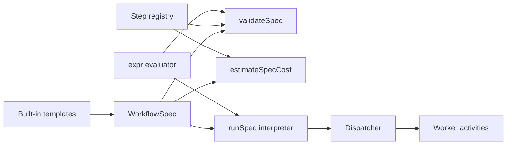

# Workflow spec, interpreter, step registry and built-in templates

> Indexed at commit `d0a90fb5` on 2026-10-06 · [view on GitHub](https://github.com/yorch/auto-swe/tree/d0a90fb5)

## Relevant source files

- [packages/shared/src/workflow/spec.ts](https://github.com/yorch/auto-swe/blob/d0a90fb5/packages/shared/src/workflow/spec.ts)
- [packages/shared/src/workflow/interpreter.ts](https://github.com/yorch/auto-swe/blob/d0a90fb5/packages/shared/src/workflow/interpreter.ts)
- [packages/shared/src/workflow/stepRegistry.ts](https://github.com/yorch/auto-swe/blob/d0a90fb5/packages/shared/src/workflow/stepRegistry.ts)
- [packages/shared/src/workflow/registry-types.ts](https://github.com/yorch/auto-swe/blob/d0a90fb5/packages/shared/src/workflow/registry-types.ts)
- [packages/shared/src/workflow/validateSpec.ts](https://github.com/yorch/auto-swe/blob/d0a90fb5/packages/shared/src/workflow/validateSpec.ts)
- [packages/shared/src/workflow/expr.ts](https://github.com/yorch/auto-swe/blob/d0a90fb5/packages/shared/src/workflow/expr.ts)
- [packages/shared/src/workflow/signalSlots.ts](https://github.com/yorch/auto-swe/blob/d0a90fb5/packages/shared/src/workflow/signalSlots.ts)
- [packages/shared/src/workflow/costEstimator.ts](https://github.com/yorch/auto-swe/blob/d0a90fb5/packages/shared/src/workflow/costEstimator.ts)
- [packages/shared/src/workflow/specDiff.ts](https://github.com/yorch/auto-swe/blob/d0a90fb5/packages/shared/src/workflow/specDiff.ts)
- [packages/shared/src/workflow/codemod.ts](https://github.com/yorch/auto-swe/blob/d0a90fb5/packages/shared/src/workflow/codemod.ts)
- [packages/shared/src/workflow/shellImageAllowlist.ts](https://github.com/yorch/auto-swe/blob/d0a90fb5/packages/shared/src/workflow/shellImageAllowlist.ts)
- [packages/shared/src/workflow/defaultEngineeringSpec.ts](https://github.com/yorch/auto-swe/blob/d0a90fb5/packages/shared/src/workflow/defaultEngineeringSpec.ts)
- [packages/shared/src/workflow/builtinTemplates.ts](https://github.com/yorch/auto-swe/blob/d0a90fb5/packages/shared/src/workflow/builtinTemplates.ts)
- [packages/shared/src/workflow/templates/index.ts](https://github.com/yorch/auto-swe/blob/d0a90fb5/packages/shared/src/workflow/templates/index.ts)
- [packages/shared/src/workflow/templates/authoring/index.ts](https://github.com/yorch/auto-swe/blob/d0a90fb5/packages/shared/src/workflow/templates/authoring/index.ts)

## Overview

A workflow is a versioned JSON directed graph (`WorkflowSpec`) of typed nodes. The spec schema, the interpreter that walks it, the catalog of steps a node may call, the static validators, and the seeded templates all live in `packages/shared/src/workflow/`. Everything here is pure and I/O-free, so the same code runs in the Temporal worker, the gateway and the web editor.

The interpreter does not perform side effects. It is handed a `Dispatcher` and asks it to run steps, record outcomes and wait for signals; the worker supplies the Temporal-backed implementation.

## Architecture

```mermaid
flowchart LR
  T[Built-in templates] --> S[WorkflowSpec]
  S --> V[validateSpec]
  S --> C[estimateSpecCost]
  S --> I[runSpec interpreter]
  R[Step registry] --> V
  R --> C
  E[expr evaluator] --> I
  E --> V
  I --> D[Dispatcher]
  D --> W[Worker activities]
```

A spec is produced by a template or authored by a user, parsed with `WorkflowSpecSchema`, linted by `validateSpec` against the step registry, and executed by `runSpec`. Cost estimation reads the same registry metadata.

Sources: [spec.ts:L637-L671](https://github.com/yorch/auto-swe/blob/d0a90fb5/packages/shared/src/workflow/spec.ts#L637-L671) [interpreter.ts:L393-L405](https://github.com/yorch/auto-swe/blob/d0a90fb5/packages/shared/src/workflow/interpreter.ts#L393-L405) [validateSpec.ts:L221](https://github.com/yorch/auto-swe/blob/d0a90fb5/packages/shared/src/workflow/validateSpec.ts#L221)

## The spec format

`WorkflowSpecSchema` is an object with `name`, `description`, `entry`, `schemaVersion` (the literal `SPEC_SCHEMA_VERSION`, currently 1) and a `nodes` record keyed by node id. A `superRefine` rejects an `entry` that is not in `nodes` and any edge that names an unknown node.

`NodeSchema` is a Zod discriminated union on `type` with 15 members: `step`, `agent`, `mcp`, `eval`, `set`, `cond`, `signal`, `terminate`, `fanOut`, `shell`, `containerStep`, `humanApproval`, `humanDecision`, `humanInput` and `humanReview`. `nodeEdges` enumerates every outgoing edge of a node in one place; both the schema's reference check and `validateSpec`'s graph analysis use it. Optional `group` and `title` fields are presentation-only, capped at 40 and 80 characters.

Data flows through bindings. A `Binding` is `{ from, default? }`, `{ literal }` or `{ expr }`, with expressions capped at 2,000 characters. Per-node failure policy is `onFail`: `'block'` (default), `'warn'`, or `{ retry: N }` with N from 1 to 10. The legacy `retry`, `startToCloseTimeout` and `heartbeatTimeout` fields still parse but nothing reads them.

Sources: [spec.ts:L28](https://github.com/yorch/auto-swe/blob/d0a90fb5/packages/shared/src/workflow/spec.ts#L28) [spec.ts:L602-L619](https://github.com/yorch/auto-swe/blob/d0a90fb5/packages/shared/src/workflow/spec.ts#L602-L619) [spec.ts:L637-L671](https://github.com/yorch/auto-swe/blob/d0a90fb5/packages/shared/src/workflow/spec.ts#L637-L671) [spec.ts:L84-L99](https://github.com/yorch/auto-swe/blob/d0a90fb5/packages/shared/src/workflow/spec.ts#L84-L99) [spec.ts:L196-L213](https://github.com/yorch/auto-swe/blob/d0a90fb5/packages/shared/src/workflow/spec.ts#L196-L213)

## The interpreter

`runSpec(spec, initialContext, dispatcher, limits)` copies the context, builds a transition cursor and calls `walk` from `entry`. `walk` loops node by node, switching on `node.type`. The six dispatch-style nodes (`step`, `agent`, `mcp`, `eval`, `containerStep`, `shell`) go through `runDispatchNode`; `set`, `cond`, `signal` and `terminate` have their own handlers; `fanOut` runs branches via `runFanOut`; the four human nodes share `runHumanNode`.

Each transition increments a counter shared across fan-out branches. When it passes the cap (default `DEFAULT_MAX_TRANSITIONS` = 500) the walk throws an infinite-loop error. The cap and the default fan-out concurrency (`DEFAULT_FANOUT_CONCURRENCY` = 4) can be overridden per run. `readInterpreterLimits` reads them from the run's pinned settings (`workflow.maxTransitions`, `workflow.fanoutConcurrency`) and falls back to defaults on anything missing or malformed, because the code runs in the Temporal isolate and a replay must see the same bounds.

`runRetryable` implements `onFail` and records a row per attempt. Human nodes map to `HITL_KINDS` (`APPROVAL`, `DECISION`, `INPUT`, `REVIEW`), and `HITL_VALID_ACTIONS` lists the accepted response actions per kind. Replay compatibility changes are gated behind patch ids such as `WORKFLOW_CANCEL_PATCH`.

Sources: [interpreter.ts:L393-L430](https://github.com/yorch/auto-swe/blob/d0a90fb5/packages/shared/src/workflow/interpreter.ts#L393-L430) [interpreter.ts:L432-L545](https://github.com/yorch/auto-swe/blob/d0a90fb5/packages/shared/src/workflow/interpreter.ts#L432-L545) [interpreter.ts:L293-L323](https://github.com/yorch/auto-swe/blob/d0a90fb5/packages/shared/src/workflow/interpreter.ts#L293-L323) [interpreter.ts:L377-L391](https://github.com/yorch/auto-swe/blob/d0a90fb5/packages/shared/src/workflow/interpreter.ts#L377-L391) [interpreter.ts:L789](https://github.com/yorch/auto-swe/blob/d0a90fb5/packages/shared/src/workflow/interpreter.ts#L789) [interpreter.ts:L94-L95](https://github.com/yorch/auto-swe/blob/d0a90fb5/packages/shared/src/workflow/interpreter.ts#L94-L95)

## Expressions and signals

`expr.ts` implements a deliberately small expression language: path lookups, literals, arithmetic, comparisons, `&&`, `||`, `!`, `??` and parentheses, with no function calls or assignment. `checkExprSyntax` lets validators reject bad expressions without evaluating them. `RESERVED_SEGMENTS` (`__proto__`, `prototype`, `constructor`) is refused for both reads and writes to prevent prototype pollution.

`SignalSlots` buffers signal payloads between Temporal handlers and the interpreter's wait calls. A payload that arrives before a wait is kept, `take()` consumes it, and `null` is a legal payload distinct from "unset".

Sources: [expr.ts:L1-L35](https://github.com/yorch/auto-swe/blob/d0a90fb5/packages/shared/src/workflow/expr.ts#L1-L35) [expr.ts:L81-L103](https://github.com/yorch/auto-swe/blob/d0a90fb5/packages/shared/src/workflow/expr.ts#L81-L103) [signalSlots.ts:L1-L40](https://github.com/yorch/auto-swe/blob/d0a90fb5/packages/shared/src/workflow/signalSlots.ts#L1-L40)

## Step registry

`registry-types.ts` declares `BUILTIN_STEPS`, the canonical list of 38 step names (agent steps, CI wait, quality gates, decomposition, PRD, and generic workspace/source/outcome steps), plus `StepMetadata`: name, category (`agent`, `gate`, `control`, `vcs`, `shell`), label, config fields, an optional `internal` flag and a `costHint` with a pricing role.

`stepRegistry.ts` registers a metadata entry per step into a map. `listSteps()` hides internal steps from authors, `listAllSteps()` returns all, and `assertBuiltinStepsRegistered()` throws if any `BUILTIN_STEPS` entry is unregistered; the worker calls it at boot. Only metadata lives here; the activity wiring is the worker's executor table. The file header lists the five steps for adding a step. It also exports `IMPLEMENTER_TOOL_IDS` (four workspace tools) and `AGENT_TOOL_KEYS`, which adds the `'mcp'` pseudo-key.

Sources: [registry-types.ts:L52-L105](https://github.com/yorch/auto-swe/blob/d0a90fb5/packages/shared/src/workflow/registry-types.ts#L52-L105) [registry-types.ts:L10-L47](https://github.com/yorch/auto-swe/blob/d0a90fb5/packages/shared/src/workflow/registry-types.ts#L10-L47) [stepRegistry.ts:L1-L52](https://github.com/yorch/auto-swe/blob/d0a90fb5/packages/shared/src/workflow/stepRegistry.ts#L1-L52) [stepRegistry.ts:L669-L697](https://github.com/yorch/auto-swe/blob/d0a90fb5/packages/shared/src/workflow/stepRegistry.ts#L669-L697)

## Static analysis and tooling

`validateSpec` returns structured errors and warnings. Errors are `EXPR_SYNTAX`, `NO_TERMINAL` and `RESERVED_PATH_SEGMENT`; `INTERNAL_STEP` is also pushed as an error. Warnings include `UNKNOWN_NODE_REF`, `UNREACHABLE`, `NODE_CANT_TERMINATE`, `UNKNOWN_STEP`, `MISSING_CONFIG`, `FANOUT_LEAK`, `TERMINAL_IN_SUBGRAPH_ONLY`, `IGNORED_FIELD` and `GROUP_NOT_CONTIGUOUS`. The generation repair loop hard-gates on errors, while the gateway save path surfaces everything as non-blocking warnings.

`estimateSpecCost` sums each step's `costHint` tokens times per-role prices; branching takes the worst arm and `fanOut` multiplies by an assumed width of 4. `diffSpecs` produces added, removed, changed, unchanged and presentation-only node lists plus meta changes for the version-compare UI. `migrateSpec` chains registered codemods, each bumping the schema version by exactly one; callers must re-parse the result. `isShellImageAllowed` permits `BUILTIN_SHELL_IMAGES` plus a team allowlist for shell nodes.

Sources: [validateSpec.ts:L1-L47](https://github.com/yorch/auto-swe/blob/d0a90fb5/packages/shared/src/workflow/validateSpec.ts#L1-L47) [validateSpec.ts:L221-L240](https://github.com/yorch/auto-swe/blob/d0a90fb5/packages/shared/src/workflow/validateSpec.ts#L221-L240) [costEstimator.ts:L1-L50](https://github.com/yorch/auto-swe/blob/d0a90fb5/packages/shared/src/workflow/costEstimator.ts#L1-L50) [specDiff.ts:L18-L35](https://github.com/yorch/auto-swe/blob/d0a90fb5/packages/shared/src/workflow/specDiff.ts#L18-L35) [codemod.ts:L17-L69](https://github.com/yorch/auto-swe/blob/d0a90fb5/packages/shared/src/workflow/codemod.ts#L17-L69) [shellImageAllowlist.ts:L17-L99](https://github.com/yorch/auto-swe/blob/d0a90fb5/packages/shared/src/workflow/shellImageAllowlist.ts#L17-L99)

## Built-in templates

`BUILTIN_TEMPLATES` in `templates/index.ts` holds 26 entries, each with name, description, spec and optionally an input schema and workspace provider. The first, `default-engineering`, is marked `isDefault` and carries `SWE_INPUT_SCHEMA` (`ticketId`, `connectionId`, `description`, optional `budget`). The others are grouped as automated (hotfix, dependency update, model catalog refresh, code-and-CI, agent-reviewed PR, consensus review), signal-driven (signal-gated and canary rollouts), parallel (fan-out), human-in-the-loop (PR approval gate, scope clarification, security triage, human code review, tiered escalation, four-eyes, migration, full supervised), and non-SWE (Zendesk reply, two Notion content flows, product PRD draft, Slack update, two create-issue flows, PRD decomposition). `builtinTemplates.ts` is a backwards-compatible re-export barrel.

`DEFAULT_ENGINEERING_SPEC` is composed from helpers in `templates/authoring/` (`validatePhase`, `reviewLoop`, `openPullRequest`, `ciLoop`, `statusStamp`, `terminate`, merged with `mergeNodes`), which expand at load into flat nodes. Its flow is validate, implement, review loop, open PR, CI loop, then a `humanMergeSignal` wait with a 7-day timeout, commit lesson and done.

Sources: [templates/index.ts:L63-L293](https://github.com/yorch/auto-swe/blob/d0a90fb5/packages/shared/src/workflow/templates/index.ts#L63-L293) [templates/index.ts:L50-L61](https://github.com/yorch/auto-swe/blob/d0a90fb5/packages/shared/src/workflow/templates/index.ts#L50-L61) [defaultEngineeringSpec.ts:L1-L92](https://github.com/yorch/auto-swe/blob/d0a90fb5/packages/shared/src/workflow/defaultEngineeringSpec.ts#L1-L92) [templates/authoring/index.ts:L1-L26](https://github.com/yorch/auto-swe/blob/d0a90fb5/packages/shared/src/workflow/templates/authoring/index.ts#L1-L26) [builtinTemplates.ts:L1-L25](https://github.com/yorch/auto-swe/blob/d0a90fb5/packages/shared/src/workflow/builtinTemplates.ts#L1-L25)
