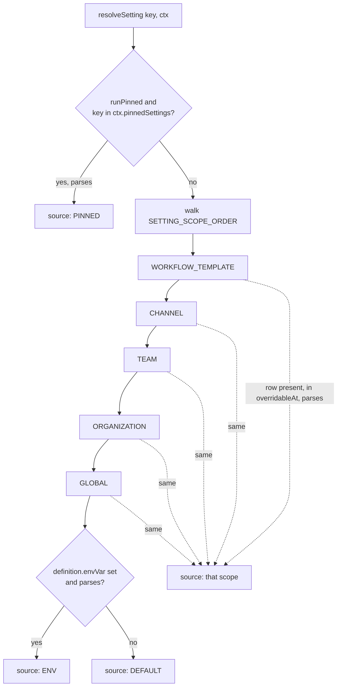
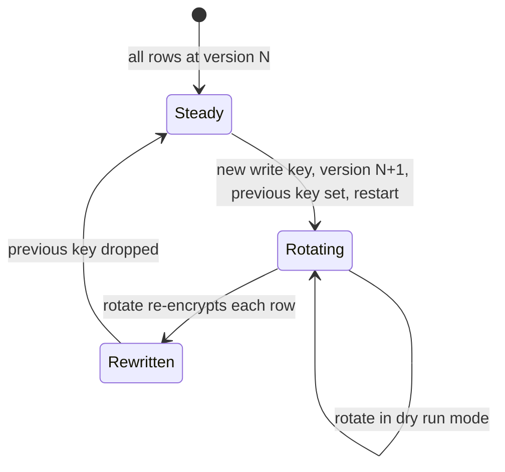

# Configuration, Settings Registry, and Secrets

> Indexed at commit `b1d8930` on 2026-09-08 · [view on GitHub](https://github.com/yorch/auto-swe/tree/b1d8930)

## Relevant source files

- [packages/shared/src/config/types.ts](https://github.com/yorch/auto-swe/blob/b1d8930/packages/shared/src/config/types.ts)
- [packages/shared/src/config/registry.ts](https://github.com/yorch/auto-swe/blob/b1d8930/packages/shared/src/config/registry.ts)
- [packages/shared/src/config/resolveSetting.ts](https://github.com/yorch/auto-swe/blob/b1d8930/packages/shared/src/config/resolveSetting.ts)
- [packages/shared/src/config/cache.ts](https://github.com/yorch/auto-swe/blob/b1d8930/packages/shared/src/config/cache.ts)
- [packages/shared/src/config/permissions.ts](https://github.com/yorch/auto-swe/blob/b1d8930/packages/shared/src/config/permissions.ts)
- [packages/shared/src/config/index.ts](https://github.com/yorch/auto-swe/blob/b1d8930/packages/shared/src/config/index.ts)
- [packages/shared/src/lib/systemConfig.ts](https://github.com/yorch/auto-swe/blob/b1d8930/packages/shared/src/lib/systemConfig.ts)
- [packages/shared/src/lib/crypto.ts](https://github.com/yorch/auto-swe/blob/b1d8930/packages/shared/src/lib/crypto.ts)
- [packages/shared/src/lib/keyRotation.ts](https://github.com/yorch/auto-swe/blob/b1d8930/packages/shared/src/lib/keyRotation.ts)
- [packages/gateway/src/lib/configSettingsService.ts](https://github.com/yorch/auto-swe/blob/b1d8930/packages/gateway/src/lib/configSettingsService.ts)
- [packages/shared/src/prisma/schema.prisma](https://github.com/yorch/auto-swe/blob/b1d8930/packages/shared/src/prisma/schema.prisma)
- [packages/shared/src/prisma/migrations/00000000000001_custom_constraints_and_indexes/migration.sql](https://github.com/yorch/auto-swe/blob/b1d8930/packages/shared/src/prisma/migrations/00000000000001_custom_constraints_and_indexes/migration.sql)
- [packages/worker/src/activities/templates.ts](https://github.com/yorch/auto-swe/blob/b1d8930/packages/worker/src/activities/templates.ts)
- [packages/shared/src/workflow/interpreter.ts](https://github.com/yorch/auto-swe/blob/b1d8930/packages/shared/src/workflow/interpreter.ts)

## Overview

Configuration in auto-swe splits three ways, and each layer exists because the other two cannot hold that kind of value. **Bootstrap environment variables** carry what a process needs before it can reach the database — the database URL itself, the master encryption key, the Temporal address, the public URLs used in OAuth redirects. **Singleton integration tables** hold connector credentials and endpoints, one row per table with `id = 'default'`, secrets sealed with AES-256-GCM. **The setting registry** holds operator policy: knobs that are neither a credential nor bootstrap, declared once in TypeScript and overridable per scope from the dashboard.

The registry is the layer with the most machinery behind it. One declaration per knob supplies the schema that validates a write, the default a read falls back to, the scopes an override may attach to, the role floor for changing it, and whether the value freezes for the life of a workflow run. Adding a knob is a definition — not a migration plus a route plus a form field.

Sources: [packages/shared/src/config/types.ts:L33-L81](https://github.com/yorch/auto-swe/blob/b1d8930/packages/shared/src/config/types.ts#L33-L81) [packages/shared/src/lib/systemConfig.ts:L10-L31](https://github.com/yorch/auto-swe/blob/b1d8930/packages/shared/src/lib/systemConfig.ts#L10-L31)

## The Setting Definition

Every knob is one entry in `SETTING_DEFINITIONS`, wrapped in a `defineSetting` identity helper whose only job is to preserve the value type so `resolveSetting('channel.historyMessageLimit')` returns `number` rather than `unknown` ([packages/shared/src/config/registry.ts#L21](https://github.com/yorch/auto-swe/blob/b1d8930/packages/shared/src/config/registry.ts#L21)). The registry currently declares 19 settings across five groups: `channel`, `memory`, `repoDependency`, `workflow`, and `workspace`.

| Field | Purpose |
| ----- | ------- |
| `schema` | Zod type that validates every write **and** every value read back out of the database |
| `defaultValue` | The constant the setting replaced, so an unconfigured deployment behaves as before |
| `overridableAt` | Scopes below GLOBAL where an override may live; empty means platform-wide only |
| `requiredRole` | Floor for who may change it; no grant can lower it |
| `runPinned` | Snapshots the value into `WorkflowRun.pinnedSettings` at run start |
| `restartRequired` | Surfaced in the admin form; the resolver does not enforce it |
| `envVar` / `parseEnv` | Environment variable consulted between the cascade and the default |
| `group`, `label`, `description`, `unit` | Drive the admin form and permission patterns |

A setting's **key is the property name it is stored under** — there is no `key` field on the definition. That property is the primary key of the stored override and the subject of permission grants, so renaming one orphans every row and grant that referenced it, and carrying it twice would only create a way for the two to disagree. Because grants match on a `group.*` prefix, a key must also carry its own group as a prefix, which is why `workspace.maxToolOutputChars` tunes the implementer's tool output rather than a container.

Sources: [packages/shared/src/config/types.ts:L33-L81](https://github.com/yorch/auto-swe/blob/b1d8930/packages/shared/src/config/types.ts#L33-L81) [packages/shared/src/config/registry.ts:L46-L124](https://github.com/yorch/auto-swe/blob/b1d8930/packages/shared/src/config/registry.ts#L46-L124) [packages/shared/src/config/registry.ts:L284-L301](https://github.com/yorch/auto-swe/blob/b1d8930/packages/shared/src/config/registry.ts#L284-L301)

## Resolution Cascade

`resolveFrom` is the single resolution rule, shared by the one-key, batch, effective-view, and snapshot entry points ([packages/shared/src/config/resolveSetting.ts#L149](https://github.com/yorch/auto-swe/blob/b1d8930/packages/shared/src/config/resolveSetting.ts#L149)). The pinned check is guarded with an explicit object test before `in`, because `pinnedSettings` arrives from an untyped JSON column and a `key in aString` throw would break every activity in the run. Provenance from a pinned read is reported as `PINNED` rather than the original scope, since which scope supplied it was decided at run start and is not recorded in the snapshot.

Two rules make the cascade defensive rather than merely ordered. A stored value is run through the definition's schema by `accept`, and a value that no longer parses is **logged and skipped**, degrading that one key to the next tier instead of failing every activity that reads config. Separately, `overridableAt` is honoured on the way out as well as on the way in: a row at a scope the definition forbids is ignored, because such a row can exist without passing the write path — written by direct SQL, or left behind when a definition later narrowed its scopes. A platform-wide security control that a stray TEAM row can switch off is not a control, and `workspace.blockMetadata` is exactly that case.

Sources: [packages/shared/src/config/resolveSetting.ts:L118-L203](https://github.com/yorch/auto-swe/blob/b1d8930/packages/shared/src/config/resolveSetting.ts#L118-L203) [packages/shared/src/config/types.ts:L8-L20](https://github.com/yorch/auto-swe/blob/b1d8930/packages/shared/src/config/types.ts#L8-L20) [packages/shared/src/config/registry.ts:L240-L255](https://github.com/yorch/auto-swe/blob/b1d8930/packages/shared/src/config/registry.ts#L240-L255)

## Caching

Every override visible from a resolution context is fetched in **one** query and cached under one key, so resolving twenty settings for a run costs one round trip rather than twenty ([packages/shared/src/config/resolveSetting.ts#L63](https://github.com/yorch/auto-swe/blob/b1d8930/packages/shared/src/config/resolveSetting.ts#L63)). The cache key encodes each context id with `encodeURIComponent` rather than plain joining: ids are UUIDs today, but an id containing the separator would make two contexts share an entry, which is a cross-tenant read.

The store is a process-local bounded LRU with a 30-second default TTL, overridable with `CONFIG_CACHE_TTL_MS`, capped at 1000 entries by default via `CONFIG_CACHE_MAX_ENTRIES`. Expired entries are purged lazily on insert rather than on every read. The same cache backs the agent and credential resolvers, which is why "how long until my change takes effect" has one answer across all of them.

A write invalidates the whole `settings:` prefix rather than one key, because a GLOBAL edit changes what every team resolves. That invalidation is **process-local**: the gateway clears its own cache immediately on save, while the worker keeps serving its cached value until its own TTL lapses. An admin's save is therefore immediate in the dashboard and near-immediate in the worker, but never atomic across both.

Sources: [packages/shared/src/config/cache.ts:L18-L19](https://github.com/yorch/auto-swe/blob/b1d8930/packages/shared/src/config/cache.ts#L18-L19) [packages/shared/src/config/cache.ts:L66-L126](https://github.com/yorch/auto-swe/blob/b1d8930/packages/shared/src/config/cache.ts#L66-L126) [packages/shared/src/config/resolveSetting.ts:L46-L58](https://github.com/yorch/auto-swe/blob/b1d8930/packages/shared/src/config/resolveSetting.ts#L46-L58) [packages/gateway/src/lib/configSettingsService.ts:L19-L23](https://github.com/yorch/auto-swe/blob/b1d8930/packages/gateway/src/lib/configSettingsService.ts#L19-L23)

## Permission Model

`checkSettingWrite` applies four gates in order and returns a code rather than a boolean, so an operator who is denied learns which gate stopped them: `UNKNOWN_SETTING`, `SCOPE_NOT_ALLOWED`, `ROLE_TOO_LOW`, `NO_GRANT` ([packages/shared/src/config/permissions.ts#L115](https://github.com/yorch/auto-swe/blob/b1d8930/packages/shared/src/config/permissions.ts#L115)). Platform ADMINs bypass grants entirely after clearing the role floor, since they can already write every singleton config table.

Grants are `config_permissions` rows, not code, so widening who configures what is an admin action rather than a deploy. A grant names exactly one grantee — a specific user or every holder of a role — and matches a key with one of three patterns only: `*`, `group.*`, or an exact key. This is deliberately not a glob library, so an operator reading a grant can tell what it covers without learning a matching syntax. Grant scope is hierarchical: GLOBAL authority covers any write, ORGANIZATION covers anything inside that org but never the GLOBAL row, and TEAM covers the team plus the channels and templates beneath it.

The gateway resolves the owning team and org of whatever the override attaches to before checking a grant, so a TEAM-scoped grant correctly covers a channel or workflow template inside that team ([packages/gateway/src/lib/configSettingsService.ts#L82](https://github.com/yorch/auto-swe/blob/b1d8930/packages/gateway/src/lib/configSettingsService.ts#L82)). Reads are gated separately by membership rather than by grants, because the effective-config view exposes another tenant's resolved values; GLOBAL values stay readable by any authenticated user.

Sources: [packages/shared/src/config/permissions.ts:L22-L161](https://github.com/yorch/auto-swe/blob/b1d8930/packages/shared/src/config/permissions.ts#L22-L161) [packages/gateway/src/lib/configSettingsService.ts:L79-L187](https://github.com/yorch/auto-swe/blob/b1d8930/packages/gateway/src/lib/configSettingsService.ts#L79-L187) [packages/shared/src/prisma/schema.prisma:L1950-L1987](https://github.com/yorch/auto-swe/blob/b1d8930/packages/shared/src/prisma/schema.prisma#L1950-L1987)

## Run Pinning

Two settings are `runPinned` today: `workflow.fanoutConcurrency` and `workflow.maxTransitions`. Both bound how a single run may expand, and both exist for the workflow interpreter, which runs inside the Temporal V8 isolate and cannot read the database. A run that started under one transition ceiling must finish under the same one, or its replay history stops matching its code.

`snapshotPinnedSettings` reads the live cascade for every `runPinned` key and returns a plain object, which the template activity writes onto `WorkflowRun.pinnedSettings` at run start ([packages/worker/src/activities/templates.ts#L96](https://github.com/yorch/auto-swe/blob/b1d8930/packages/worker/src/activities/templates.ts#L96)). The upsert there uses `update: {}` so a Temporal retry of the same `workflowId` preserves the original snapshot rather than re-resolving it. Inside the isolate, `readInterpreterLimits` re-validates the snapshot by hand instead of reusing the registry's Zod schemas, because workflow code may only `import type` from outside `@temporalio/workflow`. Anything missing or malformed falls back to the interpreter's own defaults: runs created before the column existed carry NULL, and a workflow that threw on that would strand every one of them behind a workflow-task failure that retries forever.

Everything not pinned re-resolves per call, which is what lets a model or prompt edit land inside an already-running workflow.

Sources: [packages/shared/src/config/resolveSetting.ts:L247-L259](https://github.com/yorch/auto-swe/blob/b1d8930/packages/shared/src/config/resolveSetting.ts#L247-L259) [packages/shared/src/workflow/interpreter.ts:L279-L312](https://github.com/yorch/auto-swe/blob/b1d8930/packages/shared/src/workflow/interpreter.ts#L279-L312) [packages/worker/src/activities/templates.ts:L90-L118](https://github.com/yorch/auto-swe/blob/b1d8930/packages/worker/src/activities/templates.ts#L90-L118) [packages/shared/src/config/registry.ts:L209-L239](https://github.com/yorch/auto-swe/blob/b1d8930/packages/shared/src/config/registry.ts#L209-L239)

## Storage Layout

Overrides live in `config_settings`, one JSON value per key per scope instance, with nullable `team_id`, `org_id`, `channel_id`, and `workflow_template_id` columns. A CHECK constraint enforces that exactly the id column for the row's own scope is set, so a TEAM override can never also carry an org id.

Uniqueness is five **partial** indexes, one per scope, each keyed on `key` plus that scope's id column and filtered by `WHERE scope = …`. Prisma cannot express a filtered predicate in an upsert's where clause, so writes are `findFirst` followed by a conditional `create` or `update` — exactly the pattern `Agent` and `ProviderCredential` live with. `resolveWriteTarget` centralises that lookup so the set and clear paths cannot drift apart.

Grants carry their own CHECK constraints: one enforcing that exactly one of `user_id` or `role` is set, and one restricting grant scope to GLOBAL, ORGANIZATION, or TEAM. `ConfigScope` also permits CHANNEL and WORKFLOW_TEMPLATE, so a grant row carrying either fails every branch and is rejected — authority is expressed at a tenant boundary and covers everything beneath it.

Sources: [packages/shared/src/prisma/schema.prisma:L1919-L1948](https://github.com/yorch/auto-swe/blob/b1d8930/packages/shared/src/prisma/schema.prisma#L1919-L1948) [packages/shared/src/prisma/migrations/00000000000001_custom_constraints_and_indexes/migration.sql:L200-L257](https://github.com/yorch/auto-swe/blob/b1d8930/packages/shared/src/prisma/migrations/00000000000001_custom_constraints_and_indexes/migration.sql#L200-L257) [packages/gateway/src/lib/configSettingsService.ts:L254-L362](https://github.com/yorch/auto-swe/blob/b1d8930/packages/gateway/src/lib/configSettingsService.ts#L254-L362)

## Integration Singletons

Connector configuration lives outside the registry, in singleton tables whose shape is relational and whose secrets use the encryption envelope. Each has a `resolveXxxConfig()` function in `systemConfig.ts` that reads the one row at `id = 'default'` and falls back field by field to an environment variable, so a deployment that has not yet visited the admin UI keeps working unchanged.

| Resolver | Covers | Representative env fallbacks |
| -------- | ------ | ---------------------------- |
| `resolveGitHubConfig` | PAT, webhook secret, GitHub App credentials, GHE base URLs, OAuth app | `GITHUB_TOKEN`, `GITHUB_WEBHOOK_SECRET`, `GITHUB_API_URL` |
| `resolveSlackConfig` | Bot token, client id/secret, signing secret | Slack equivalents |
| `resolveStorageConfig` | S3 backend, bucket, region, credentials | `ARTIFACT_S3_BUCKET`, `AWS_ACCESS_KEY_ID` |
| `resolveWorkflowDefaults` | Branch prefix, PR templates, CI wait strategy, Tier-2 defaults | `BRANCH_PREFIX`, `CI_WAIT_MODE`, `CI_POLL_*` |
| `resolveIssueTrackerConfig`, `resolveKnowledgeBaseConfig`, `resolveFigmaConfig` | Tracker, knowledge base, and design connectors | per-connector tokens |
| `resolveGoogleOAuthConfig`, `resolveOktaOAuthConfig` | Social sign-in and enterprise SSO | `GOOGLE_CLIENT_SECRET`, `OKTA_ISSUER` |

Two details of the fallback pattern are load-bearing. Fields use `??` rather than `||`, so a legitimately-zero or empty DB value is honoured rather than silently replaced by the environment — the Tier-2 budget columns depend on this. And a malformed value degrades to the safe option rather than the risky one: `resolveCiWaitMode` treats anything other than the literal `'poll'` as `'signal'` at both the DB and env level, so a typo cannot silently enable active polling ([packages/shared/src/lib/systemConfig.ts#L381](https://github.com/yorch/auto-swe/blob/b1d8930/packages/shared/src/lib/systemConfig.ts#L381)).

These resolvers hold **no in-process cache** — the shared package stays free of a cache implementation, and callers that need one wrap it themselves. Every resolver also accepts a `ResolveOpts` whose `orgId` is reserved and currently ignored, so introducing per-org rows later becomes a resolver-internal change rather than a signature break across the codebase.

Sources: [packages/shared/src/lib/systemConfig.ts:L10-L52](https://github.com/yorch/auto-swe/blob/b1d8930/packages/shared/src/lib/systemConfig.ts#L10-L52) [packages/shared/src/lib/systemConfig.ts:L83-L150](https://github.com/yorch/auto-swe/blob/b1d8930/packages/shared/src/lib/systemConfig.ts#L83-L150) [packages/shared/src/lib/systemConfig.ts:L376-L435](https://github.com/yorch/auto-swe/blob/b1d8930/packages/shared/src/lib/systemConfig.ts#L376-L435) [packages/shared/src/lib/systemConfig.ts:L697-L722](https://github.com/yorch/auto-swe/blob/b1d8930/packages/shared/src/lib/systemConfig.ts#L697-L722)

## Startup Reads Versus Per-Call Reads

Most integration values are re-resolved on every call, which is what lets an admin's edit land inside an in-flight workflow. The exceptions are the OAuth credentials. `initAuth()` resolves GitHub, Google, and Okta configuration once and builds the better-auth singleton from the result; subsequent calls are no-ops, so changing any OAuth credential requires a gateway restart. Okta is registered through better-auth's generic-OAuth plugin, whose discovery fetch also happens at boot, so the issuer is read once too — normalised there by stripping trailing slashes, since better-auth appends the discovery path to whatever it is handed.

Two settings in the registry are marked `restartRequired` in the same spirit; the flag is surfaced in the admin form, and the resolver does not enforce it.

Sources: [packages/gateway/src/lib/betterAuth.ts:L283-L316](https://github.com/yorch/auto-swe/blob/b1d8930/packages/gateway/src/lib/betterAuth.ts#L283-L316) [packages/shared/src/lib/systemConfig.ts:L690-L722](https://github.com/yorch/auto-swe/blob/b1d8930/packages/shared/src/lib/systemConfig.ts#L690-L722) [packages/shared/src/config/registry.ts:L268-L282](https://github.com/yorch/auto-swe/blob/b1d8930/packages/shared/src/config/registry.ts#L268-L282)

## Secret Encryption

Every secret field is sealed with AES-256-GCM under a per-record random 12-byte nonce, with the 16-byte auth tag stored in its own column alongside the ciphertext and a `keyVersion` integer. The master key is read from `CONFIG_ENCRYPTION_KEY` as base64-encoded 32 bytes and cached for the process lifetime. `encryptSecret` also stores a `lastFour` hint, and refuses to derive one from a secret shorter than eight characters — four characters of an eight-character secret is half of it.

Both services call `assertEncryptionKeyConfigured()` as the first statement of their startup path, so a missing, non-base64, or wrong-length key fails the process at boot rather than on the first credential read ([packages/worker/src/index.ts#L21](https://github.com/yorch/auto-swe/blob/b1d8930/packages/worker/src/index.ts#L21)).

Rotation deliberately supports exactly one old key, not a general version-to-key map: `CONFIG_ENCRYPTION_KEY` is the write key and `CONFIG_ENCRYPTION_KEY_PREVIOUS` is read-only for the version immediately below. Setting the previous key while the version is still 1 is rejected, since there is no earlier version for it to decrypt. `rotateEncryptionKey` walks every model in `ENCRYPTED_FIELDS`, decrypts each row with whichever version it carries, re-encrypts under the current one, and writes it back in a single update. There is no global transaction — a row already at the current version is skipped, so an interrupted run resumes by running it again. A row that fails to decrypt is reported in the result, never swallowed, and the `--dry-run` mode exists so that failure is found before half the table has moved.

`ENCRYPTED_FIELDS` derives the four or five column names of each field from a shared prefix rather than listing them, because a hand-written table let a swapped nonce and auth-tag pair pass a coverage test that compares column sets rather than roles. The one irregular row — `providerCredential`, whose version and last-four columns are unprefixed — stays visibly irregular. A companion test derives the same set from `schema.prisma` and fails when the two disagree, since a new encrypted column nobody adds here would be silently skipped by rotation and become unreadable the moment the old key is dropped.

Sources: [packages/shared/src/lib/crypto.ts:L1-L102](https://github.com/yorch/auto-swe/blob/b1d8930/packages/shared/src/lib/crypto.ts#L1-L102) [packages/shared/src/lib/crypto.ts:L112-L174](https://github.com/yorch/auto-swe/blob/b1d8930/packages/shared/src/lib/crypto.ts#L112-L174) [packages/shared/src/lib/keyRotation.ts:L41-L96](https://github.com/yorch/auto-swe/blob/b1d8930/packages/shared/src/lib/keyRotation.ts#L41-L96) [packages/shared/src/lib/keyRotation.ts:L110-L193](https://github.com/yorch/auto-swe/blob/b1d8930/packages/shared/src/lib/keyRotation.ts#L110-L193) [packages/worker/src/index.ts:L17-L21](https://github.com/yorch/auto-swe/blob/b1d8930/packages/worker/src/index.ts#L17-L21)

## Bootstrap Environment Variables

The values a process needs before it can read the database stay in the environment, and `systemConfig.ts` centralises those reads too so callers do not scatter `process.env` across the codebase. `resolvePublicUrl`, `resolveWebUrl`, `resolveTemporalAddress`, `resolveOtelExporterEndpoint`, and `resolveOtelMetricExportInterval` are plain synchronous functions with literal defaults. `resolveAuthEmailConfig` and `resolveBetterAuthConfig` are the same pattern for transactional email and the better-auth secret and origins. `DATABASE_URL` and `CONFIG_ENCRYPTION_KEY` sit below even these, since the first is what the Prisma client connects with and the second is what makes any stored secret readable.

Sources: [packages/shared/src/lib/systemConfig.ts:L724-L783](https://github.com/yorch/auto-swe/blob/b1d8930/packages/shared/src/lib/systemConfig.ts#L724-L783)

## Related Pages

- Parent: [@auto-swe/shared](./2-shared-library.md)
- Sibling: [Data Model](./2.1-data-model.md)
- Sibling: [Workflow Spec and Interpreter](./2.2-workflow-spec-and-interpreter.md)
- Sibling: [Skills and Security Scanners](./2.4-skills-and-security-scanners.md)
