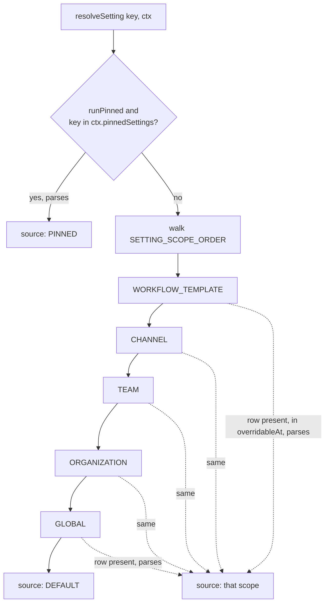
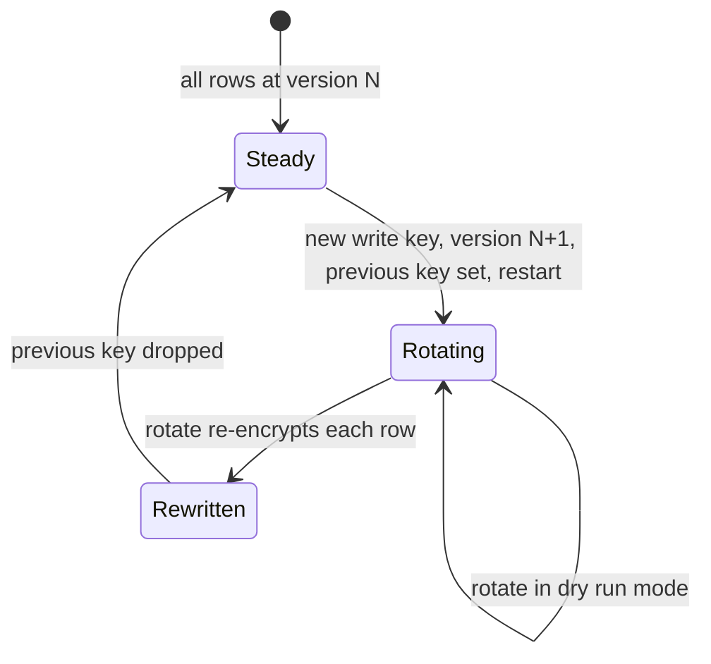

# Configuration, Settings Registry, and Secrets

> Indexed at commit `ae416937` on 2026-10-03 · [view on GitHub](https://github.com/yorch/auto-swe/tree/ae416937)

## Relevant source files

- [packages/shared/src/config/types.ts](https://github.com/yorch/auto-swe/blob/ae416937/packages/shared/src/config/types.ts)
- [packages/shared/src/config/registry.ts](https://github.com/yorch/auto-swe/blob/ae416937/packages/shared/src/config/registry.ts)
- [packages/shared/src/config/resolveSetting.ts](https://github.com/yorch/auto-swe/blob/ae416937/packages/shared/src/config/resolveSetting.ts)
- [packages/shared/src/config/cache.ts](https://github.com/yorch/auto-swe/blob/ae416937/packages/shared/src/config/cache.ts)
- [packages/shared/src/config/permissions.ts](https://github.com/yorch/auto-swe/blob/ae416937/packages/shared/src/config/permissions.ts)
- [packages/shared/src/config/index.ts](https://github.com/yorch/auto-swe/blob/ae416937/packages/shared/src/config/index.ts)
- [packages/shared/src/lib/systemConfig.ts](https://github.com/yorch/auto-swe/blob/ae416937/packages/shared/src/lib/systemConfig.ts)
- [packages/shared/src/lib/crypto.ts](https://github.com/yorch/auto-swe/blob/ae416937/packages/shared/src/lib/crypto.ts)
- [packages/shared/src/lib/keyRotation.ts](https://github.com/yorch/auto-swe/blob/ae416937/packages/shared/src/lib/keyRotation.ts)
- [packages/gateway/src/lib/env.ts](https://github.com/yorch/auto-swe/blob/ae416937/packages/gateway/src/lib/env.ts)
- [packages/gateway/src/lib/configSettingsService.ts](https://github.com/yorch/auto-swe/blob/ae416937/packages/gateway/src/lib/configSettingsService.ts)
- [packages/shared/src/prisma/schema.prisma](https://github.com/yorch/auto-swe/blob/ae416937/packages/shared/src/prisma/schema.prisma)
- [packages/shared/src/prisma/migrations/00000000000001_custom_constraints_and_indexes/migration.sql](https://github.com/yorch/auto-swe/blob/ae416937/packages/shared/src/prisma/migrations/00000000000001_custom_constraints_and_indexes/migration.sql)
- [packages/worker/src/activities/templates.ts](https://github.com/yorch/auto-swe/blob/ae416937/packages/worker/src/activities/templates.ts)
- [packages/shared/src/workflow/interpreter.ts](https://github.com/yorch/auto-swe/blob/ae416937/packages/shared/src/workflow/interpreter.ts)

## Overview

Configuration in auto-swe splits three ways, and each layer exists because the other two cannot hold that kind of value. **Environment variables** carry what a process needs before it can reach the database, and also what only a deployer should be able to change: the database URL, the master encryption key, the Temporal address, the public URLs, sign-in credentials for Google, Okta and GitHub, artifact storage, workspace sizing and images, worker and scanner bounds, and the cron schedules the gateway applies once at boot. **Singleton integration tables** hold connector credentials and endpoints that an admin edits at run time, one row per table with `id = 'default'`, secrets sealed with AES-256-GCM. **The setting registry** holds operator policy: knobs that are neither a credential nor bootstrap, declared once in TypeScript and overridable per scope from the dashboard.

The rule that sorts a value into the first layer is "needed at start-up, or only a deployer should change it". Several of those values were once admin forms; a form for a value read once at boot only looks live, so they are read from the environment inside a small set of resolvers in `systemConfig.ts` and nowhere else. They have no database column and no admin tab.

The registry is the layer with the most machinery behind it. One declaration per knob supplies the schema that validates a write, the default a read falls back to, the scopes an override may attach to, the role floor for changing it, and whether the value freezes for the life of a workflow run. It declares 31 settings. Adding a knob is a definition, not a migration plus a route plus a form field. The living reference is [`docs/configuration.md`](https://github.com/yorch/auto-swe/blob/ae416937/docs/configuration.md); this page describes how the code behind it is arranged.

Sources: [packages/shared/src/config/types.ts:L36-L82](https://github.com/yorch/auto-swe/blob/ae416937/packages/shared/src/config/types.ts#L36-L82) [packages/shared/src/lib/systemConfig.ts:L12-L33](https://github.com/yorch/auto-swe/blob/ae416937/packages/shared/src/lib/systemConfig.ts#L12-L33) [packages/shared/src/lib/systemConfig.ts:L731-L799](https://github.com/yorch/auto-swe/blob/ae416937/packages/shared/src/lib/systemConfig.ts#L731-L799)

## The Setting Definition

Every knob is one entry in `SETTING_DEFINITIONS`, wrapped in a `defineSetting` identity helper whose only job is to preserve the value type so `resolveSetting('channel.historyMessageLimit')` returns `number` rather than `unknown` ([packages/shared/src/config/registry.ts#L23](https://github.com/yorch/auto-swe/blob/ae416937/packages/shared/src/config/registry.ts#L23)). The 31 settings fall into eight groups (`SETTING_GROUPS`), counted from the source:

| Group | Count | Settings |
| ----- | ----- | -------- |
| `channel` | 7 | assistant history, memory, ingest, cooldown, lookback and thread-context budgets |
| `github` | 3 | `repositoryHosts`, `userCredentialHosts`, `userCredentialsEnabled` |
| `mcp` | 4 | `enabled`, `writeToolsEnabled`, `maxConcurrentRuns`, `writeCallsPerMinute` |
| `memory` | 1 | `orgSimilarityThreshold` |
| `repoAccess` | 2 | `mode`, `viewStaleAfterHours` |
| `repoDependency` | 1 | `autoPromoteThreshold` |
| `workflow` | 4 | `fanoutConcurrency`, `maxTransitions`, `runlessMaxInputTokens`, `runlessMaxOutputTokens` |
| `workspace` | 9 | `agentMaxSteps`, five `agentRun*` ceilings, `gitHelperImage`, `implementerRuntime`, `maxToolOutputChars` |

The five `agentRun*` settings are `agentRunAllowWorkflowChanges`, `agentRunMaxConcurrentGlobal`, `agentRunMaxConcurrentPerTeam`, `agentRunMaxSteps` and `agentRunMaxWallClockSeconds`. They bound ad-hoc "run this library agent on this repository" launches, are all ADMIN-only, and a per-launch cap can only lower them: the gateway rejects a cap above a ceiling and the worker clamps again, because a ceiling can drop between launch and start. See [Agent Runs and Implementer Runtimes](./4.6-agent-runs-and-implementer-runtimes.md).

| Field | Purpose |
| ----- | ------- |
| `schema` | Zod type that validates every write **and** every value read back out of the database |
| `defaultValue` | The constant the setting replaced, so an unconfigured deployment behaves as before |
| `overridableAt` | Scopes below GLOBAL where an override may live; empty means platform-wide only |
| `requiredRole` | Floor for who may change it; no grant can lower it |
| `runPinned` | Snapshots the value into `WorkflowRun.pinnedSettings` at run start |
| `sensitive` | Optional. The stored and resolved values are redacted in every read for anyone below `requiredRole`; the definition itself stays visible |
| `restartRequired` | Surfaced in the admin form; the resolver does not enforce it. No current definition sets it |
| `group`, `label`, `description`, `unit` | Drive the admin form and permission patterns |

A setting's **key is the property name it is stored under**: there is no `key` field on the definition. That property is the primary key of the stored override and the subject of permission grants, so renaming one orphans every row and grant that referenced it, and carrying it twice would only create a way for the two to disagree. Because grants match on a `group.*` prefix, a key must also carry its own group as a prefix, which is why `workspace.maxToolOutputChars` tunes the implementer's tool output rather than a container.

Flags, per the declarations:

| Flag | Settings |
| ---- | -------- |
| `requiredRole: 'ADMIN'` (18) | all `github.*`, `mcp.*`, `repoAccess.*`, the two `workflow.runless*` caps, all five `workspace.agentRun*`, `workspace.gitHelperImage`, `workspace.implementerRuntime` |
| `requiredRole: 'LEAD'` (13) | all `channel.*`, `memory.orgSimilarityThreshold`, `repoDependency.autoPromoteThreshold`, `workflow.fanoutConcurrency`, `workflow.maxTransitions`, `workspace.agentMaxSteps`, `workspace.maxToolOutputChars` |
| `overridableAt: []` (10) | `github.*`, `mcp.*`, `repoAccess.*`, `workspace.agentRunMaxConcurrentGlobal` |
| `runPinned: true` (3) | `workflow.fanoutConcurrency`, `workflow.maxTransitions`, `workspace.implementerRuntime` |
| `sensitive: true` (2) | `github.repositoryHosts`, `github.userCredentialHosts` |
| `restartRequired: true` | none |

The two host lists share one `hostList` schema built from `hostEntry`: lowercase `host` or `host:port`, at most 50 entries, `:443` refused because a parsed URL never carries the default port (such an entry would look set while matching nothing), and a trailing dot refused because no URL comparison here treats `ghe.corp.` as equal to `ghe.corp`. `hostEntry` is exported so other code can validate against the same rule. Both lists are `sensitive`, because an allowlist can name internal servers on a private network; `listSettings` in the gateway withholds `value` and `overrideAtScope` and returns `redacted: true` when the actor's role does not meet the setting's `requiredRole`.

Two details of scope are deliberate. `channel.reactiveCooldownMinutes` and `channel.reactiveLookbackMinutes` omit `CHANNEL` from `overridableAt`, because `SlackChannel` has its own nullable column for the same knob that always outranks a registry row; offering the scope would store a value the worker never reads. And `workspace.gitHelperImage` cascades to TEAM and ORGANIZATION even though the rest of the workspace infrastructure is environment-only, since a team on an isolated network may need its own mirror of the image.

Sources: [packages/shared/src/config/types.ts:L22-L82](https://github.com/yorch/auto-swe/blob/ae416937/packages/shared/src/config/types.ts#L22-L82) [packages/shared/src/config/registry.ts:L29-L40](https://github.com/yorch/auto-swe/blob/ae416937/packages/shared/src/config/registry.ts#L29-L40) [packages/shared/src/config/registry.ts:L52-L192](https://github.com/yorch/auto-swe/blob/ae416937/packages/shared/src/config/registry.ts#L52-L192) [packages/shared/src/config/registry.ts:L194-L304](https://github.com/yorch/auto-swe/blob/ae416937/packages/shared/src/config/registry.ts#L194-L304) [packages/shared/src/config/registry.ts:L311-L507](https://github.com/yorch/auto-swe/blob/ae416937/packages/shared/src/config/registry.ts#L311-L507) [packages/gateway/src/lib/configSettingsService.ts:L215-L262](https://github.com/yorch/auto-swe/blob/ae416937/packages/gateway/src/lib/configSettingsService.ts#L215-L262)

## Resolution Cascade

```mermaid
flowchart TD
    Start[resolveSetting key, ctx] --> Pinned{runPinned and<br/>key in ctx.pinnedSettings?}
    Pinned -- yes, parses --> PinnedOut[source: PINNED]
    Pinned -- no --> Cascade[walk SETTING_SCOPE_ORDER]
    Cascade --> WT[WORKFLOW_TEMPLATE]
    WT --> CH[CHANNEL]
    CH --> TEAM[TEAM]
    TEAM --> ORG[ORGANIZATION]
    ORG --> GLOBAL[GLOBAL]
    GLOBAL --> Default[source: DEFAULT]
    WT -. row present, in overridableAt, parses .-> ScopeOut[source: that scope]
    CH -. same .-> ScopeOut
    TEAM -. same .-> ScopeOut
    ORG -. same .-> ScopeOut
    GLOBAL -. row present, parses .-> ScopeOut
```

`resolveFrom` is the single resolution rule, shared by the one-key, batch, effective-view, and snapshot entry points ([packages/shared/src/config/resolveSetting.ts#L135](https://github.com/yorch/auto-swe/blob/ae416937/packages/shared/src/config/resolveSetting.ts#L135)). The order is run pin, then `WORKFLOW_TEMPLATE → CHANNEL → TEAM → ORGANIZATION → GLOBAL`, then the definition default. There is no environment-variable tier: a registry value comes from a stored override or its default. The pinned check is guarded with an explicit object test before `in`, because `pinnedSettings` arrives from an untyped JSON column and a `key in aString` throw would break every activity in the run. Provenance from a pinned read is reported as `PINNED` rather than the original scope, since which scope supplied it was decided at run start and is not recorded in the snapshot.

Two rules make the cascade defensive rather than merely ordered. A stored value is run through the definition's schema by `accept`, and a value that no longer parses is **logged and skipped**, degrading that one key to the next tier instead of failing every activity that reads config; the warning exists because an operator who sees their row in the database and `DEFAULT` in the dashboard would otherwise have nothing connecting the two. Separately, `overridableAt` is honoured on the way out as well as on the way in: a row at a scope the definition forbids is ignored, because such a row can exist without passing the write path — written by direct SQL, or left behind when a definition later narrowed its scopes. A platform-wide security control that a stray TEAM row can switch off is not a control, and `github.userCredentialsEnabled` is exactly that case.

Sources: [packages/shared/src/config/resolveSetting.ts:L112-L184](https://github.com/yorch/auto-swe/blob/ae416937/packages/shared/src/config/resolveSetting.ts#L112-L184) [packages/shared/src/config/types.ts:L4-L20](https://github.com/yorch/auto-swe/blob/ae416937/packages/shared/src/config/types.ts#L4-L20) [packages/shared/src/config/types.ts:L97-L105](https://github.com/yorch/auto-swe/blob/ae416937/packages/shared/src/config/types.ts#L97-L105)

## Caching

Every override visible from a resolution context is fetched in **one** query and cached under one key, so resolving twenty settings for a run costs one round trip rather than twenty ([packages/shared/src/config/resolveSetting.ts#L61](https://github.com/yorch/auto-swe/blob/ae416937/packages/shared/src/config/resolveSetting.ts#L61)). The cache key encodes each context id with `encodeURIComponent` rather than plain joining: ids are UUIDs today, but an id containing the separator would make two contexts share an entry, which is a cross-tenant read. The query is deliberately cross-tenant only in its GLOBAL branch, and goes through `runUnscoped` with a stated reason.

The store is a process-local bounded LRU with a 30-second default TTL, overridable with `CONFIG_CACHE_TTL_MS`, capped at 1000 entries by default via `CONFIG_CACHE_MAX_ENTRIES`. Expired entries are purged lazily on insert rather than on every read. The same cache backs the agent and credential resolvers, which is why "how long until my change takes effect" has one answer across all of them.

`withCache` also coalesces concurrent misses: callers arriving while a fetch for the same key is running share that one fetch instead of each hitting the database. Invalidation marks matching in-flight fetches stale and removes them, so a result read before a write cannot be stored after the write's invalidation. A caller already waiting gets the value it asked for; every later caller starts a fresh fetch.

A write invalidates the whole `settings:` prefix rather than one key, because a GLOBAL edit changes what every team resolves. That invalidation is **process-local**: the gateway clears its own cache immediately on save, while the worker keeps serving its cached value until its own TTL lapses. An admin's save is therefore immediate in the dashboard and near-immediate in the worker, but never atomic across both.

Sources: [packages/shared/src/config/cache.ts:L18-L19](https://github.com/yorch/auto-swe/blob/ae416937/packages/shared/src/config/cache.ts#L18-L19) [packages/shared/src/config/cache.ts:L66-L173](https://github.com/yorch/auto-swe/blob/ae416937/packages/shared/src/config/cache.ts#L66-L173) [packages/shared/src/config/resolveSetting.ts:L42-L110](https://github.com/yorch/auto-swe/blob/ae416937/packages/shared/src/config/resolveSetting.ts#L42-L110) [packages/shared/src/config/resolveSetting.ts:L242-L249](https://github.com/yorch/auto-swe/blob/ae416937/packages/shared/src/config/resolveSetting.ts#L242-L249) [packages/gateway/src/lib/configSettingsService.ts:L21-L26](https://github.com/yorch/auto-swe/blob/ae416937/packages/gateway/src/lib/configSettingsService.ts#L21-L26)

## Permission Model

`checkSettingWrite` applies four gates in order and returns a code rather than a boolean, so an operator who is denied learns which gate stopped them: `UNKNOWN_SETTING`, `SCOPE_NOT_ALLOWED`, `ROLE_TOO_LOW`, `NO_GRANT` ([packages/shared/src/config/permissions.ts#L115](https://github.com/yorch/auto-swe/blob/ae416937/packages/shared/src/config/permissions.ts#L115)). Platform ADMINs bypass grants entirely after clearing the role floor, since they can already write every singleton config table. Because 18 of the 31 settings carry `requiredRole: 'ADMIN'`, a grant can only ever widen access to the 13 LEAD-floor settings.

Grants are `config_permissions` rows, not code, so widening who configures what is an admin action rather than a deploy. A grant names exactly one grantee — a specific user or every holder of a role — and matches a key with one of three patterns only: `*`, `group.*`, or an exact key. This is deliberately not a glob library, so an operator reading a grant can tell what it covers without learning a matching syntax. Grant scope is hierarchical: GLOBAL authority covers any write, ORGANIZATION covers anything inside that org but never the GLOBAL row, and TEAM covers the team plus the channels and templates beneath it.

The gateway resolves the owning team and org of whatever the override attaches to before checking a grant, so a TEAM-scoped grant correctly covers a channel or workflow template inside that team ([packages/gateway/src/lib/configSettingsService.ts#L84](https://github.com/yorch/auto-swe/blob/ae416937/packages/gateway/src/lib/configSettingsService.ts#L84)). Reads are gated separately by membership rather than by grants, because the effective-config view exposes another tenant's resolved values; GLOBAL values stay readable by any authenticated user.

Sources: [packages/shared/src/config/permissions.ts:L22-L161](https://github.com/yorch/auto-swe/blob/ae416937/packages/shared/src/config/permissions.ts#L22-L161) [packages/gateway/src/lib/configSettingsService.ts:L84-L198](https://github.com/yorch/auto-swe/blob/ae416937/packages/gateway/src/lib/configSettingsService.ts#L84-L198) [packages/shared/src/prisma/schema.prisma:L2310-L2347](https://github.com/yorch/auto-swe/blob/ae416937/packages/shared/src/prisma/schema.prisma#L2310-L2347)

## Run Pinning

Three settings are `runPinned`: `workflow.fanoutConcurrency`, `workflow.maxTransitions` and `workspace.implementerRuntime`. The first two bound how a single run may expand, and both exist for the workflow interpreter, which runs inside the Temporal V8 isolate and cannot read the database. A run that started under one transition ceiling must finish under the same one, or its replay history stops matching its code. The third decides who executes the implementer's tool loop and which credential enters the workspace, so a run that began on one runtime must not finish a later iteration on the other and a re-run of the same history must take the same path.

`snapshotPinnedSettings` reads the live cascade for every `runPinned` key and returns a plain object, which the template activity writes onto `WorkflowRun.pinnedSettings` at run start ([packages/worker/src/activities/templates.ts#L229](https://github.com/yorch/auto-swe/blob/ae416937/packages/worker/src/activities/templates.ts#L229)). The upsert there uses `update: {}` so a Temporal retry of the same `workflowId` preserves the original snapshot rather than re-resolving it, and the activity reads the pin back off the row rather than trusting the value it just computed. A row that predates the column is backfilled so the workflow and its activities agree. Inside the isolate, `readInterpreterLimits` re-validates the snapshot by hand instead of reusing the registry's Zod schemas, because workflow code may only `import type` from outside `@temporalio/workflow`; it reads only the two interpreter keys. Anything missing or malformed falls back to the interpreter's own defaults: runs created before the column existed carry NULL, and a workflow that threw on that would strand every one of them behind a workflow-task failure that retries forever. `workspace.implementerRuntime` is consumed outside the isolate, by `selectImplementerRuntime` in the worker, which resolves it through the run's pinned context.

Everything not pinned re-resolves per call, which is what lets a model or prompt edit land inside an already-running workflow.

Sources: [packages/shared/src/config/resolveSetting.ts:L228-L240](https://github.com/yorch/auto-swe/blob/ae416937/packages/shared/src/config/resolveSetting.ts#L228-L240) [packages/shared/src/workflow/interpreter.ts:L282-L341](https://github.com/yorch/auto-swe/blob/ae416937/packages/shared/src/workflow/interpreter.ts#L282-L341) [packages/worker/src/activities/templates.ts:L220-L293](https://github.com/yorch/auto-swe/blob/ae416937/packages/worker/src/activities/templates.ts#L220-L293) [packages/shared/src/config/registry.ts:L311-L336](https://github.com/yorch/auto-swe/blob/ae416937/packages/shared/src/config/registry.ts#L311-L336) [packages/shared/src/config/registry.ts:L473-L488](https://github.com/yorch/auto-swe/blob/ae416937/packages/shared/src/config/registry.ts#L473-L488)

## Storage Layout

Overrides live in `config_settings`, one JSON value per key per scope instance, with nullable `team_id`, `org_id`, `channel_id`, and `workflow_template_id` columns. A CHECK constraint enforces that exactly the id column for the row's own scope is set, so a TEAM override can never also carry an org id.

Uniqueness is five **partial** indexes, one per scope, each keyed on `key` plus that scope's id column and filtered by `WHERE scope = …`. Prisma cannot express a filtered predicate in an upsert's where clause, so writes are `findFirst` followed by a conditional `create` or `update` — exactly the pattern `Agent` and `ProviderCredential` live with. `resolveWriteTarget` centralises that lookup so the set and clear paths cannot drift apart. When a concurrent writer wins the create race, the partial unique index refuses the loser, which then updates the winner's row: last write wins, as it would have in sequence.

Grants carry their own CHECK constraints: one enforcing that exactly one of `user_id` or `role` is set, and one restricting grant scope to GLOBAL, ORGANIZATION, or TEAM. `ConfigScope` also permits CHANNEL and WORKFLOW_TEMPLATE, so a grant row carrying either fails every branch and is rejected — authority is expressed at a tenant boundary and covers everything beneath it.

Sources: [packages/shared/src/prisma/schema.prisma:L2279-L2308](https://github.com/yorch/auto-swe/blob/ae416937/packages/shared/src/prisma/schema.prisma#L2279-L2308) [packages/shared/src/prisma/migrations/00000000000001_custom_constraints_and_indexes/migration.sql:L189-L262](https://github.com/yorch/auto-swe/blob/ae416937/packages/shared/src/prisma/migrations/00000000000001_custom_constraints_and_indexes/migration.sql#L189-L262) [packages/gateway/src/lib/configSettingsService.ts:L264-L371](https://github.com/yorch/auto-swe/blob/ae416937/packages/gateway/src/lib/configSettingsService.ts#L264-L371)

## Integration Singletons

Connector configuration that an admin edits at run time lives outside the registry, in singleton tables whose shape is relational and whose secrets use the encryption envelope. Each has a `resolveXxxConfig()` function in `systemConfig.ts` that reads the one row at `id = 'default'` and falls back field by field to an environment variable, so a deployment that has not yet visited the admin UI keeps working unchanged. Seven tables are singletons, each guarded by a CHECK on `id = 'default'`: `GitHubConfig`, `SlackConfig`, `WorkflowDefaults`, `IssueTrackerConfig`, `KnowledgeBaseConfig`, `FigmaConfig`, and `EmbeddingConfig` (resolved by the worker's embeddings module rather than `systemConfig.ts`).

| Resolver | Covers | Representative env fallbacks |
| -------- | ------ | ---------------------------- |
| `resolveGitHubConfig` | PAT, webhook secret, GitHub App credentials (id, client id/secret, private key, installation id), auth mode, GHE base and API URLs | `GITHUB_TOKEN`, `GITHUB_WEBHOOK_SECRET`, `GITHUB_APP_*`, `GITHUB_URL`, `GITHUB_API_URL` |
| `resolveSlackConfig` | Bot token, client id/secret, signing secret | `SLACK_BOT_TOKEN`, `SLACK_CLIENT_ID`, `SLACK_CLIENT_SECRET`, `SLACK_SIGNING_SECRET` |
| `resolveSlackBotTokenForSlackChannel`, `resolveSlackBotTokenForWorkspace` | Per-workspace bot tokens from `SlackWorkspace` | none |
| `resolveWorkflowDefaults` | Branch prefix, PR templates, default team slug, CI wait strategy, Tier-2 defaults (budget tiers, TDD and eval iteration caps, lesson retrieval, eval health thresholds) | `BRANCH_PREFIX`, `DEFAULT_TEAM_SLUG`, `PR_*_TEMPLATE`, `CI_WAIT_MODE`, `CI_POLL_*` |
| `resolveConsolidationConfig`, `resolveEvalScheduleConfig`, `resolveRevalidationConfig`, `resolveCanaryConfig` | Schedules and canary routing, read from the same `WorkflowDefaults` row | none |
| `resolveIssueTrackerConfig`, `resolveKnowledgeBaseConfig`, `resolveFigmaConfig` | Tracker, knowledge base, and design connectors | `TRACKER_*`, `KB_*`, `FIGMA_API_TOKEN` |

The GitHub config returned here also names a `credentialHost` — the host family of its API URL — so the token resolver can refuse to mint or return a credential for any other host. Credentials for other approved hosts live in `GitHubHostCredential` and are resolved by `githubHostCredential.ts`; see [Repository Access, Sharing, and Per-User Credentials](./3.4-repository-access-and-credentials.md).

Two details of the fallback pattern are load-bearing. Fields use `??` rather than `||`, so a legitimately-zero or empty DB value is honoured rather than silently replaced by the environment — the Tier-2 budget columns depend on this. And a malformed value degrades to the safe option rather than the risky one: `resolveCiWaitMode` treats anything other than the literal `'poll'` as `'signal'` at both the DB and env level, so a typo cannot silently enable active polling ([packages/shared/src/lib/systemConfig.ts#L357](https://github.com/yorch/auto-swe/blob/ae416937/packages/shared/src/lib/systemConfig.ts#L357)).

These resolvers hold **no in-process cache** — the shared package stays free of a cache implementation, and callers that need one wrap it themselves. Every resolver also accepts a `ResolveOpts` whose `orgId` is reserved and currently ignored, so introducing per-org rows later becomes a resolver-internal change rather than a signature break across the codebase.

Sources: [packages/shared/src/lib/systemConfig.ts:L12-L52](https://github.com/yorch/auto-swe/blob/ae416937/packages/shared/src/lib/systemConfig.ts#L12-L52) [packages/shared/src/lib/systemConfig.ts:L56-L148](https://github.com/yorch/auto-swe/blob/ae416937/packages/shared/src/lib/systemConfig.ts#L56-L148) [packages/shared/src/lib/systemConfig.ts:L150-L276](https://github.com/yorch/auto-swe/blob/ae416937/packages/shared/src/lib/systemConfig.ts#L150-L276) [packages/shared/src/lib/systemConfig.ts:L306-L408](https://github.com/yorch/auto-swe/blob/ae416937/packages/shared/src/lib/systemConfig.ts#L306-L408) [packages/shared/src/lib/systemConfig.ts:L409-L623](https://github.com/yorch/auto-swe/blob/ae416937/packages/shared/src/lib/systemConfig.ts#L409-L623) [packages/shared/src/prisma/migrations/00000000000001_custom_constraints_and_indexes/migration.sql:L141-L186](https://github.com/yorch/auto-swe/blob/ae416937/packages/shared/src/prisma/migrations/00000000000001_custom_constraints_and_indexes/migration.sql#L141-L186)

## Environment-Only Configuration

A second family of resolvers in `systemConfig.ts` reads the environment and never the database. They are the only place `process.env` is consulted for these values, so callers do not scatter reads across the codebase.

| Resolver | Variables | Notes |
| -------- | --------- | ----- |
| `resolveGoogleOAuthConfig` | `GOOGLE_CLIENT_ID`, `GOOGLE_CLIENT_SECRET` | Read once at gateway boot |
| `resolveOktaOAuthConfig` | `OKTA_ISSUER`, `OKTA_CLIENT_ID`, `OKTA_CLIENT_SECRET` | Issuer has trailing slashes stripped |
| `resolveGitHubConfig` (two fields) | `GITHUB_CLIENT_ID`, `GITHUB_CLIENT_SECRET` | GitHub sign-in credentials; the rest of that resolver is database-primary |
| `resolveStorageConfig` | `ARTIFACT_S3_BUCKET`, `_REGION`, `_ENDPOINT`, `_PREFIX`, `_FORCE_PATH_STYLE`, `AWS_ACCESS_KEY_ID`, `AWS_SECRET_ACCESS_KEY` | Backend is `s3` when a bucket is set, otherwise `inline` (Postgres) |
| `resolveWorkspaceInfra` | `WORKSPACE_MEMORY` (`4g`), `WORKSPACE_CPUS` (2), `WORKSPACE_PIDS_LIMIT` (512), `WORKSPACE_IMAGE` (`node:24-alpine`), `WORKSPACE_METADATA_BLOCK_IMAGE` (`alpine:3.20`), `WORKSPACE_BLOCK_METADATA`, `WORKER_MAX_CONCURRENT_ACTIVITIES` (10), `SCANNER_REGEX_BUDGET_MS` (250) | Container caps and images, metadata blackholing, Temporal activity concurrency, scanner budget |
| `resolveScheduledSweeps` | `REPO_ACCESS_SYNC_ENABLED`/`_CRON`, `REPO_DEPENDENCY_SCAN_ENABLED`/`_CRON`, `MODEL_DISCOVERY_ENABLED`/`_CRON` | Temporal Schedules the gateway applies once at boot |
| `resolvePublicUrl`, `resolveWebUrl`, `resolveTemporalAddress` | `PUBLIC_URL`, `WEB_URL`, `TEMPORAL_ADDRESS` | Literal localhost defaults |
| `resolveOtelExporterEndpoint`, `resolveOtelMetricExportInterval` | `OTEL_EXPORTER_OTLP_ENDPOINT`, `OTEL_METRIC_EXPORT_INTERVAL` | Interval defaults to 60 000 ms |
| `resolveAuthEmailConfig`, `resolveBetterAuthConfig` | `AUTH_FROM_EMAIL`, `RESEND_API_KEY`, `SMTP_*`; `BETTER_AUTH_URL`, `BETTER_AUTH_SECRET`, `CORS_ORIGIN` | Transactional email and the better-auth secret and origins |

`resolveWorkspaceInfra` backs the `createWorkspace` image default and every scanner's budget: `resolveRegexBudgetMs()` in `regexExec.ts` simply returns its `regexScanBudgetMs`, which `boundedEnvInt` clamps to 10 ms to 60 s. The gateway's own process settings are separate again: `lib/env.ts` reads `CORS_ORIGIN` (comma-separated, first entry is the default client origin) and `PORT` (default 8080). `DATABASE_URL` and `CONFIG_ENCRYPTION_KEY` sit below all of these, since the first is what the Prisma client connects with and the second is what makes any stored secret readable.

Both groups follow one validation pattern. The resolver is **lenient**: it runs on paths that must not throw (a scan cannot abort its activity), so a bad value falls back to its default, and `validatedEnv` logs the rejected value once so a typo in the deploy file does not pass unnoticed. A **strict** counterpart runs at boot and turns a bad value into a failed deploy instead. `validateWorkspaceInfraEnv` and `validateScheduledSweepsEnv` collect every problem into one message, so a single failed boot is enough to fix the file; only a value that is set and unusable is a problem, since unset and empty both take defaults. Two choices are worth knowing. Security-relevant switches accept only literal spellings: `WORKSPACE_BLOCK_METADATA` turns blocking off only for the exact string `false`, and the strict check refuses anything but `true` or `false`, so `0` or `no` cannot read as "off" to an operator while leaving blocking on. And oversized numbers are clamped with a warning rather than rejected, so a deployment that already ran `WORKER_MAX_CONCURRENT_ACTIVITIES=2000` does not silently drop to the default when a ceiling is introduced.

The worker calls `assertWorkspaceInfraEnv()` after config readiness and reads `maxConcurrentActivities` once when it creates the Temporal worker. The gateway calls `assertScheduledSweepsEnv()` at boot and applies the three sweep schedules then; a schedule saved in a form could not take effect without a restart, so none is offered. `REPO_ACCESS_SYNC_ENABLED` defaults to off because it spends API quota in proportion to team members times repositories, and the repo-access gate logs a warning when `repoAccess.mode` is `enforce` while that sweep is disabled.

Sources: [packages/shared/src/lib/systemConfig.ts:L278-L304](https://github.com/yorch/auto-swe/blob/ae416937/packages/shared/src/lib/systemConfig.ts#L278-L304) [packages/shared/src/lib/systemConfig.ts:L625-L729](https://github.com/yorch/auto-swe/blob/ae416937/packages/shared/src/lib/systemConfig.ts#L625-L729) [packages/shared/src/lib/systemConfig.ts:L731-L876](https://github.com/yorch/auto-swe/blob/ae416937/packages/shared/src/lib/systemConfig.ts#L731-L876) [packages/shared/src/lib/systemConfig.ts:L878-L970](https://github.com/yorch/auto-swe/blob/ae416937/packages/shared/src/lib/systemConfig.ts#L878-L970) [packages/shared/src/lib/regexExec.ts:L95-L105](https://github.com/yorch/auto-swe/blob/ae416937/packages/shared/src/lib/regexExec.ts#L95-L105) [packages/gateway/src/lib/env.ts:L1-L22](https://github.com/yorch/auto-swe/blob/ae416937/packages/gateway/src/lib/env.ts#L1-L22) [packages/worker/src/index.ts:L47-L76](https://github.com/yorch/auto-swe/blob/ae416937/packages/worker/src/index.ts#L47-L76) [packages/gateway/src/index.ts:L86-L94](https://github.com/yorch/auto-swe/blob/ae416937/packages/gateway/src/index.ts#L86-L94) [packages/gateway/src/index.ts:L155-L175](https://github.com/yorch/auto-swe/blob/ae416937/packages/gateway/src/index.ts#L155-L175)

## Startup Reads Versus Per-Call Reads

Most integration values are re-resolved on every call, which is what lets an admin's edit land inside an in-flight workflow. The exceptions are the sign-in credentials. `initAuth()` resolves GitHub, Google, and Okta configuration once and builds the better-auth singleton from the result; subsequent calls are no-ops, so changing any of those environment variables requires a gateway restart. Okta is registered through better-auth's generic-OAuth plugin, whose discovery fetch also happens at boot, so the issuer is read once too. It is normalised by stripping trailing slashes, since better-auth appends the discovery path to whatever it is handed, and it goes through the SSRF guard (public HTTPS only): a rejected issuer disables Okta sign-in and logs why, without taking down email and the other methods.

The worker's concurrency cap and the gateway's schedule syncs are boot-time reads in the same spirit. No registry setting is `restartRequired`; the flag remains on the definition type and the admin form for a future knob that needs it.

Sources: [packages/gateway/src/lib/betterAuth.ts:L75-L80](https://github.com/yorch/auto-swe/blob/ae416937/packages/gateway/src/lib/betterAuth.ts#L75-L80) [packages/gateway/src/lib/betterAuth.ts:L188-L233](https://github.com/yorch/auto-swe/blob/ae416937/packages/gateway/src/lib/betterAuth.ts#L188-L233) [packages/shared/src/lib/systemConfig.ts:L641-L668](https://github.com/yorch/auto-swe/blob/ae416937/packages/shared/src/lib/systemConfig.ts#L641-L668) [packages/shared/src/config/types.ts:L77-L79](https://github.com/yorch/auto-swe/blob/ae416937/packages/shared/src/config/types.ts#L77-L79)

## Secret Encryption

Every secret field is sealed with AES-256-GCM under a per-record random 12-byte nonce, with the 16-byte auth tag stored in its own column alongside the ciphertext and a `keyVersion` integer. The master key is read from `CONFIG_ENCRYPTION_KEY` as base64-encoded 32 bytes and cached for the process lifetime. `encryptSecret` also stores a `lastFour` hint, and refuses to derive one from a secret shorter than eight characters — four characters of an eight-character secret is half of it.

Both services call `assertEncryptionKeyConfigured()` as the first statement of their startup path, so a missing, non-base64, or wrong-length key fails the process at boot rather than on the first credential read ([packages/worker/src/index.ts#L22](https://github.com/yorch/auto-swe/blob/ae416937/packages/worker/src/index.ts#L22)).

```mermaid
stateDiagram-v2
    [*] --> Steady: all rows at version N
    Steady --> Rotating: new write key, version N+1, previous key set, restart
    Rotating --> Rotating: rotate in dry run mode
    Rotating --> Rewritten: rotate re-encrypts each row
    Rewritten --> Steady: previous key dropped
```

Rotation deliberately supports exactly one old key, not a general version-to-key map: `CONFIG_ENCRYPTION_KEY` is the write key and `CONFIG_ENCRYPTION_KEY_PREVIOUS` is read-only for the version immediately below. Setting the previous key while the version is still 1 is rejected, since there is no earlier version for it to decrypt. `rotateEncryptionKey` walks every model in `ENCRYPTED_FIELDS`, decrypts each row with whichever version it carries, re-encrypts under the current one, and writes it back in a single update. There is no global transaction — a row already at the current version is skipped, so an interrupted run resumes by running it again. A row that fails to decrypt is reported in the result, never swallowed, and the `dryRun` mode exists so that failure is found before half the table has moved.

The write-back is conditional. Rotation runs against a live deployment, so an admin can save a new secret between the read and the write; an update keyed by `id` alone would overwrite the fresh secret with the re-encrypted old one. Each rotated field's nonce and key version, as read, are part of the `where` (a nonce is random per encryption, so any re-save changes it), and a row whose update matches nothing is reported in `conflicted` and left for the next run. The scan itself runs through `runUnscoped` with a stated reason, since skipping a tenant's rows would leave them unreadable once the old key is dropped.

`ENCRYPTED_FIELDS` covers eleven Prisma delegates:

| Delegate | Encrypted fields |
| -------- | ---------------- |
| `connection` | `apiKey` (no last-four column) |
| `connectionCredential` | `token` — the per-user GitHub token |
| `figmaConfig` | `apiToken` |
| `gitHubConfig` | `token`, `webhookSecret`, `appClientSecret`, `appPrivateKey` |
| `gitHubHostCredential` | `token`, `appPrivateKey` — the per-host platform credential |
| `gitHubHostWebhookSecret` | `secret` — the per-host webhook secret |
| `issueTrackerConfig` | `apiToken`, `webhookSecret` |
| `knowledgeBaseConfig` | `apiToken` |
| `providerCredential` | `apiKey`, with unprefixed `keyVersion` and `lastFour` columns |
| `slackConfig` | `clientSecret`, `signingSecret`, `botToken` |
| `slackWorkspace` | `botToken` |

No Google, Okta, or storage secret appears: those are environment variables now and nothing stores them. `fieldsFor(prefix)` derives the four or five column names of each regular field from a shared prefix rather than listing them, because a hand-written table let a swapped nonce and auth-tag pair pass a coverage test that compares column sets rather than roles. The one irregular row, `providerCredential`, stays visibly irregular. A companion test, `keyRotation.coverage.test.ts`, derives the same set from `schema.prisma` and fails when the two disagree, since a new encrypted column nobody adds here would be silently skipped by rotation and become unreadable the moment the old key is dropped.

Sources: [packages/shared/src/lib/crypto.ts:L1-L102](https://github.com/yorch/auto-swe/blob/ae416937/packages/shared/src/lib/crypto.ts#L1-L102) [packages/shared/src/lib/crypto.ts:L112-L174](https://github.com/yorch/auto-swe/blob/ae416937/packages/shared/src/lib/crypto.ts#L112-L174) [packages/shared/src/lib/keyRotation.ts:L22-L103](https://github.com/yorch/auto-swe/blob/ae416937/packages/shared/src/lib/keyRotation.ts#L22-L103) [packages/shared/src/lib/keyRotation.ts:L122-L225](https://github.com/yorch/auto-swe/blob/ae416937/packages/shared/src/lib/keyRotation.ts#L122-L225) [packages/worker/src/index.ts:L19-L22](https://github.com/yorch/auto-swe/blob/ae416937/packages/worker/src/index.ts#L19-L22)

## Related Pages

- Parent: [@auto-swe/shared](./2-shared-library.md)
- Sibling: [Data Model](./2.1-data-model.md)
- Sibling: [Workflow Spec and Interpreter](./2.2-workflow-spec-and-interpreter.md)
- Sibling: [Skills and Security Scanners](./2.4-skills-and-security-scanners.md)
- [Agent Runs and Implementer Runtimes](./4.6-agent-runs-and-implementer-runtimes.md)
- [MCP Server and OAuth](./3.5-mcp-server-and-oauth.md)
