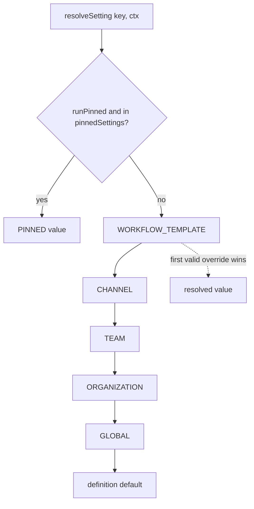

# Configuration and Settings

> Indexed at commit `d0a90fb5` on 2026-10-06 · [view on GitHub](https://github.com/yorch/auto-swe/tree/d0a90fb5)

## Relevant source files

- [packages/shared/src/config/registry.ts](https://github.com/yorch/auto-swe/blob/d0a90fb5/packages/shared/src/config/registry.ts)
- [packages/shared/src/config/types.ts](https://github.com/yorch/auto-swe/blob/d0a90fb5/packages/shared/src/config/types.ts)
- [packages/shared/src/config/resolveSetting.ts](https://github.com/yorch/auto-swe/blob/d0a90fb5/packages/shared/src/config/resolveSetting.ts)
- [packages/shared/src/config/cache.ts](https://github.com/yorch/auto-swe/blob/d0a90fb5/packages/shared/src/config/cache.ts)
- [packages/shared/src/config/permissions.ts](https://github.com/yorch/auto-swe/blob/d0a90fb5/packages/shared/src/config/permissions.ts)
- [packages/shared/src/lib/systemConfig.ts](https://github.com/yorch/auto-swe/blob/d0a90fb5/packages/shared/src/lib/systemConfig.ts)
- [docs/configuration.md](https://github.com/yorch/auto-swe/blob/d0a90fb5/docs/configuration.md)

## Overview

Configuration is split into three tiers. Bootstrap values that a process needs before it can reach the database stay in the environment, integration credentials live in singleton database tables, and operator policy lives in the setting registry. The rule is stated in [docs/configuration.md:L1-L14](https://github.com/yorch/auto-swe/blob/d0a90fb5/docs/configuration.md#L1-L14): what must be true before a process reaches the database stays in the environment, and everything else is data an operator changes without a deploy.

This page covers the second and third tiers. The system config resolvers in `systemConfig.ts` read the singleton integration tables, and the registry under `packages/shared/src/config/` declares each policy knob once, then resolves it through a five-level scope cascade with an optional per-run pin.

Sources: [docs/configuration.md:L1-L14](https://github.com/yorch/auto-swe/blob/d0a90fb5/docs/configuration.md#L1-L14) [packages/shared/src/config/registry.ts:L1-L16](https://github.com/yorch/auto-swe/blob/d0a90fb5/packages/shared/src/config/registry.ts#L1-L16)

## Implementation

### System config resolvers

[packages/shared/src/lib/systemConfig.ts:L17-L28](https://github.com/yorch/auto-swe/blob/d0a90fb5/packages/shared/src/lib/systemConfig.ts#L17-L28) documents the contract. Each resolver reads a singleton row (`id = 'default'`) and falls back to the matching environment variable, so a deployment that has not visited the admin UI keeps working. The resolvers keep no in-process cache. The optional `ResolveOpts.orgId` is reserved for multi-org rows and is ignored today.

`resolveGitHubConfig` decrypts each secret column with `decryptOptional` and falls back to `GITHUB_TOKEN`, `GITHUB_WEBHOOK_SECRET` and similar variables ([systemConfig.ts:L88-L125](https://github.com/yorch/auto-swe/blob/d0a90fb5/packages/shared/src/lib/systemConfig.ts#L88-L125)). `resolveWorkflowDefaults` applies `row?.x ?? default` to each Tier-2 knob. It covers the budget tiers, TDD and eval iteration limits, lesson retrieval, eval health thresholds and the CI wait settings. The CI columns are nullable and fall back to the `CI_*` environment variables ([systemConfig.ts:L362-L405](https://github.com/yorch/auto-swe/blob/d0a90fb5/packages/shared/src/lib/systemConfig.ts#L362-L405)). Other resolvers cover Slack, the issue tracker, the knowledge base and Figma. Environment-only resolvers, for example `resolveWorkspaceInfra` and `resolveScheduledSweeps`, serve the bootstrap tier ([systemConfig.ts:L801](https://github.com/yorch/auto-swe/blob/d0a90fb5/packages/shared/src/lib/systemConfig.ts#L801), [systemConfig.ts:L932](https://github.com/yorch/auto-swe/blob/d0a90fb5/packages/shared/src/lib/systemConfig.ts#L932)).

Sources: [packages/shared/src/lib/systemConfig.ts:L17-L28](https://github.com/yorch/auto-swe/blob/d0a90fb5/packages/shared/src/lib/systemConfig.ts#L17-L28) [packages/shared/src/lib/systemConfig.ts:L362-L405](https://github.com/yorch/auto-swe/blob/d0a90fb5/packages/shared/src/lib/systemConfig.ts#L362-L405) [docs/configuration.md:L16-L40](https://github.com/yorch/auto-swe/blob/d0a90fb5/docs/configuration.md#L16-L40)

### The setting registry

`SETTING_DEFINITIONS` in [registry.ts](https://github.com/yorch/auto-swe/blob/d0a90fb5/packages/shared/src/config/registry.ts) holds 33 settings across nine groups: `channel`, `github`, `mcp`, `memory`, `repoAccess`, `repoDependency`, `skills`, `workflow` and `workspace` ([types.ts:L24-L34](https://github.com/yorch/auto-swe/blob/d0a90fb5/packages/shared/src/config/types.ts#L24-L34)). A setting's identity is its property key. The `SettingDefinition` interface carries the group, label, description, a Zod `schema`, `defaultValue`, `overridableAt`, `requiredRole`, `runPinned`, an optional `sensitive` flag, `restartRequired` and a display `unit` ([types.ts:L47-L83](https://github.com/yorch/auto-swe/blob/d0a90fb5/packages/shared/src/config/types.ts#L47-L83)).

The definition drives validation, resolution, the admin form and the permission check. Adding a knob needs no migration. `defaultValue` is the constant the setting replaced, so an unconfigured deployment behaves as before. The registry exports `SettingKey` and `SettingValue<K>` types, `SETTING_KEYS`, `isSettingKey`, `getSettingDefinition` and `RUN_PINNED_SETTING_KEYS` ([registry.ts:L541-L562](https://github.com/yorch/auto-swe/blob/d0a90fb5/packages/shared/src/config/registry.ts#L541-L562)).

Exactly three settings are run-pinned: `workflow.fanoutConcurrency`, `workflow.maxTransitions` and `workspace.implementerRuntime` ([registry.ts:L340-L370](https://github.com/yorch/auto-swe/blob/d0a90fb5/packages/shared/src/config/registry.ts#L340-L370), [registry.ts:L506-L519](https://github.com/yorch/auto-swe/blob/d0a90fb5/packages/shared/src/config/registry.ts#L506-L519)). The interpreter runs in a V8 isolate that cannot read the database, and a replay must not take a different path. Platform-wide controls such as `github.userCredentialsEnabled` set `overridableAt: []` ([registry.ts:L182-L193](https://github.com/yorch/auto-swe/blob/d0a90fb5/packages/shared/src/config/registry.ts#L182-L193)). The `sensitive` flag redacts values like host allowlists below the required role.

Sources: [packages/shared/src/config/registry.ts:L22-L52](https://github.com/yorch/auto-swe/blob/d0a90fb5/packages/shared/src/config/registry.ts#L22-L52) [packages/shared/src/config/types.ts:L47-L83](https://github.com/yorch/auto-swe/blob/d0a90fb5/packages/shared/src/config/types.ts#L47-L83) [packages/shared/src/config/registry.ts:L541-L562](https://github.com/yorch/auto-swe/blob/d0a90fb5/packages/shared/src/config/registry.ts#L541-L562)

### Resolution, caching and pinning

`resolveFrom` implements one rule for every entry point. For a `runPinned` key with a value in `ctx.pinnedSettings`, the pinned value wins and its source is reported as `PINNED`. Otherwise it walks `SETTING_SCOPE_ORDER` (`WORKFLOW_TEMPLATE`, `CHANNEL`, `TEAM`, `ORGANIZATION`, `GLOBAL`) and takes the first override, then falls back to the default ([resolveSetting.ts:L135-L184](https://github.com/yorch/auto-swe/blob/d0a90fb5/packages/shared/src/config/resolveSetting.ts#L135-L184), [types.ts:L8-L14](https://github.com/yorch/auto-swe/blob/d0a90fb5/packages/shared/src/config/types.ts#L8-L14)). A stored row at a scope the definition does not allow is skipped on read as well as on write. A value that fails its schema is logged and ignored, so one bad row degrades only that key ([resolveSetting.ts:L116-L131](https://github.com/yorch/auto-swe/blob/d0a90fb5/packages/shared/src/config/resolveSetting.ts#L116-L131)).

`loadOverrides` fetches every candidate row for a context in one query and caches the map under a key built from URL-encoded template, channel, team and organization ids. The encoding prevents two contexts from sharing an entry ([resolveSetting.ts:L44-L110](https://github.com/yorch/auto-swe/blob/d0a90fb5/packages/shared/src/config/resolveSetting.ts#L44-L110)). Public entry points are `resolveSetting`, `resolveSettings`, `resolveEffectiveSettings` (value plus source scope, for the diagnostic view) and `snapshotPinnedSettings`, which captures every run-pinned key at run start ([resolveSetting.ts:L188-L240](https://github.com/yorch/auto-swe/blob/d0a90fb5/packages/shared/src/config/resolveSetting.ts#L188-L240)).

The cache in [cache.ts](https://github.com/yorch/auto-swe/blob/d0a90fb5/packages/shared/src/config/cache.ts) is a process-local least-recently-used (LRU) store. It holds up to 1000 entries (`CONFIG_CACHE_MAX_ENTRIES`) with a 30 s time-to-live (TTL, `CONFIG_CACHE_TTL_MS`). Concurrent misses share one fetch, and an invalidation marks in-flight fetches stale so they are not stored ([cache.ts:L18-L19](https://github.com/yorch/auto-swe/blob/d0a90fb5/packages/shared/src/config/cache.ts#L18-L19), [cache.ts:L87-L135](https://github.com/yorch/auto-swe/blob/d0a90fb5/packages/shared/src/config/cache.ts#L87-L135)). `invalidateSettingsCache` drops every `settings:` prefixed entry, because a GLOBAL write changes what every context resolves ([resolveSetting.ts:L247-L249](https://github.com/yorch/auto-swe/blob/d0a90fb5/packages/shared/src/config/resolveSetting.ts#L247-L249)).

Sources: [packages/shared/src/config/resolveSetting.ts:L135-L249](https://github.com/yorch/auto-swe/blob/d0a90fb5/packages/shared/src/config/resolveSetting.ts#L135-L249) [packages/shared/src/config/cache.ts:L87-L173](https://github.com/yorch/auto-swe/blob/d0a90fb5/packages/shared/src/config/cache.ts#L87-L173)

### Write permissions

`checkSettingWrite` is the single authorisation rule. It returns a denial code rather than a boolean: `UNKNOWN_SETTING`, `SCOPE_NOT_ALLOWED`, `ROLE_TOO_LOW` or `NO_GRANT` ([permissions.ts:L104-L161](https://github.com/yorch/auto-swe/blob/d0a90fb5/packages/shared/src/config/permissions.ts#L104-L161)). The definition's `requiredRole` is a floor that no grant can lower, ranked ENGINEER, LEAD, ADMIN ([permissions.ts:L22-L30](https://github.com/yorch/auto-swe/blob/d0a90fb5/packages/shared/src/config/permissions.ts#L22-L30)). ADMINs bypass grants.

Grants match keys by `*`, `group.*` or an exact key ([permissions.ts:L36-L44](https://github.com/yorch/auto-swe/blob/d0a90fb5/packages/shared/src/config/permissions.ts#L36-L44)). A GLOBAL grant covers any write. An ORGANIZATION grant covers its organization but never the GLOBAL row. A TEAM grant covers that team and the channels and templates beneath it ([permissions.ts:L73-L102](https://github.com/yorch/auto-swe/blob/d0a90fb5/packages/shared/src/config/permissions.ts#L73-L102)).

Sources: [packages/shared/src/config/permissions.ts:L73-L161](https://github.com/yorch/auto-swe/blob/d0a90fb5/packages/shared/src/config/permissions.ts#L73-L161)

## Diagram

```mermaid
flowchart TD
  A[resolveSetting key, ctx] --> B{runPinned and in pinnedSettings?}
  B -- yes --> P[PINNED value]
  B -- no --> C[WORKFLOW_TEMPLATE]
  C --> D[CHANNEL]
  D --> E[TEAM]
  E --> F[ORGANIZATION]
  F --> G[GLOBAL]
  G --> H[definition default]
  C -. first valid override wins .-> R[resolved value]
```

Sources: [packages/shared/src/config/resolveSetting.ts:L135-L184](https://github.com/yorch/auto-swe/blob/d0a90fb5/packages/shared/src/config/resolveSetting.ts#L135-L184)

## Usage

Callers import from `@auto-swe/shared/config` and read a typed value with `resolveSetting('workspace.maxToolOutputChars', ctx)`. They pass the fullest scope context available, since a missing `teamId` resolves a broader value. A run snapshots pinned keys once at start with `snapshotPinnedSettings` and later passes the result as `ctx.pinnedSettings`. Integration config is read through the `resolveXxxConfig()` functions, never from `process.env` in new code.

Sources: [packages/shared/src/config/resolveSetting.ts:L188-L240](https://github.com/yorch/auto-swe/blob/d0a90fb5/packages/shared/src/config/resolveSetting.ts#L188-L240) [packages/shared/src/lib/systemConfig.ts:L88](https://github.com/yorch/auto-swe/blob/d0a90fb5/packages/shared/src/lib/systemConfig.ts#L88)

## Related Pages

- Parent: [Shared Library](./2-shared-library.md)
- Sibling: [Data Model](./2.1-data-model.md)
- Sibling: [Workflow Spec and Interpreter](./2.2-workflow-spec-and-interpreter.md)
- Sibling: [Skills and Security Scanners](./2.4-skills-and-security-scanners.md)
