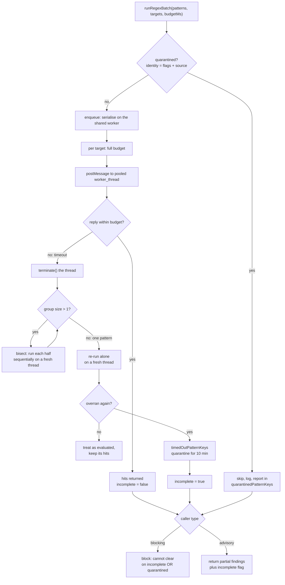

# Built-in Skills and Runtime Security Scanners

> Indexed at commit `b1d8930` on 2026-09-08 · [view on GitHub](https://github.com/yorch/auto-swe/tree/b1d8930)

## Relevant source files

- [packages/shared/src/skills/index.ts](https://github.com/yorch/auto-swe/blob/b1d8930/packages/shared/src/skills/index.ts)
- [packages/shared/src/skills/scopeConservatism.ts](https://github.com/yorch/auto-swe/blob/b1d8930/packages/shared/src/skills/scopeConservatism.ts)
- [packages/shared/src/scannerPatterns/index.ts](https://github.com/yorch/auto-swe/blob/b1d8930/packages/shared/src/scannerPatterns/index.ts)
- [packages/shared/src/lib/regexExec.ts](https://github.com/yorch/auto-swe/blob/b1d8930/packages/shared/src/lib/regexExec.ts)
- [packages/shared/src/lib/regexSafety.ts](https://github.com/yorch/auto-swe/blob/b1d8930/packages/shared/src/lib/regexSafety.ts)
- [packages/shared/src/lib/skillScanner.ts](https://github.com/yorch/auto-swe/blob/b1d8930/packages/shared/src/lib/skillScanner.ts)
- [packages/shared/src/lib/scannerCache.ts](https://github.com/yorch/auto-swe/blob/b1d8930/packages/shared/src/lib/scannerCache.ts)
- [packages/shared/src/lib/syncBuiltins.ts](https://github.com/yorch/auto-swe/blob/b1d8930/packages/shared/src/lib/syncBuiltins.ts)
- [packages/shared/src/prisma/schema.prisma](https://github.com/yorch/auto-swe/blob/b1d8930/packages/shared/src/prisma/schema.prisma)
- [packages/worker/src/lib/shellCommandScanner.ts](https://github.com/yorch/auto-swe/blob/b1d8930/packages/worker/src/lib/shellCommandScanner.ts)
- [packages/worker/src/lib/sensitiveFileScanner.ts](https://github.com/yorch/auto-swe/blob/b1d8930/packages/worker/src/lib/sensitiveFileScanner.ts)
- [packages/worker/src/lib/codeSecurityScanner.ts](https://github.com/yorch/auto-swe/blob/b1d8930/packages/worker/src/lib/codeSecurityScanner.ts)
- [packages/worker/src/lib/scannerPatternLoader.ts](https://github.com/yorch/auto-swe/blob/b1d8930/packages/worker/src/lib/scannerPatternLoader.ts)
- [packages/gateway/src/routes/scannerPatterns.ts](https://github.com/yorch/auto-swe/blob/b1d8930/packages/gateway/src/routes/scannerPatterns.ts)
- [packages/gateway/src/lib/skillLibraryService.ts](https://github.com/yorch/auto-swe/blob/b1d8930/packages/gateway/src/lib/skillLibraryService.ts)

## Overview

The shared package holds two bodies of seed content that shape how agents behave and what they are allowed to do. Skills are named prompt fragments injected into an agent's system message; they steer reasoning. Scanner patterns are regular expressions run against agent-produced text; they gate action. Both seed into the database at startup and are extensible by administrators from the dashboard, which is why the second half of this page is mostly about how untrusted regular expressions are contained at run time.

## Built-in Skills

A skill is a `promptText` fragment plus the agent roles it attaches to. The definition shape is `BuiltinSkillDef` — `name`, `description`, `promptText`, and an `assignments` array of `{ role, sortOrder }` pairs — declared at [packages/shared/src/skills/index.ts#L37-L42](https://github.com/yorch/auto-swe/blob/b1d8930/packages/shared/src/skills/index.ts#L37-L42). One file per skill exports one constant, and [`BUILTIN_SKILLS`](https://github.com/yorch/auto-swe/blob/b1d8930/packages/shared/src/skills/index.ts#L44-L88) is the ordered registry of all of them. The repository ships **35** built-in skills.

[`scopeConservatism.ts`](https://github.com/yorch/auto-swe/blob/b1d8930/packages/shared/src/skills/scopeConservatism.ts) is a representative file: two assignments (`planner` at sort order 10, `validateContext` at 10), a one-sentence description used in the implementer's skill menu, and a Markdown `promptText` body headed by an H2 that becomes a section of the system message.

The `assignments` array is the single source of truth for which agent gets which fragment; the `sortOrder` fixes the order fragments appear in. Grouped by the role they attach to:

| Role | Skills | Theme |
| ---- | ------ | ----- |
| `implementer` | `follow-existing-patterns`, `test-first`, `incremental-commits`, `no-new-dependencies`, `shell-command-safety`, `security-aware-implementation`, `idempotency`, `graceful-degradation`, `async-safety`, `observability-first`, `minimal-surface-area`, `configuration-over-hardcoding`, `design-fidelity`, `api-contract-stability`, `pr-description-quality` | Coding discipline and safe execution |
| `reviewer` | `review-focus-security`, `migration-safety-review`, `api-contract-stability`, `async-safety`, `minimal-surface-area`, `error-path-coverage` | What a whole-diff review must look at |
| `securityReviewer`, `domainLogicReviewer`, `performanceReviewer` | `security-review-depth`, `domain-logic-integrity`, `performance-impact-assessment` | One persona-specific lens each for the review network |
| `planner`, `decomposer` | `scope-conservatism`, `acceptance-criteria-first`, `rollback-first-planning`, `test-first`, `idempotency`, `no-new-dependencies`, `configuration-over-hardcoding`, `subtask-decomposition` | Planning and work breakdown |
| `validateContext` | `scope-conservatism`, `acceptance-criteria-first`, `success-criteria-extraction`, `context-ambiguity-resolution` | Turning a ticket into checkable criteria |
| `securityReview` | `security-aware-implementation`, `shell-command-safety` | The post-diff security gate |
| `commitToMemory` | `actionable-lessons` | Writing lessons worth retrieving later |
| `supportResponder` | `support-ticket-tone`, `support-kb-retrieval`, `support-escalation-policy`, `support-response-templates` | Support and operations pack |
| `productAnalyst`, `prdWriter` | `prd-readiness`, `product-acceptance-criteria`, `story-decomposition` | Product pack |

Several skills carry two assignments, so the same fragment reaches both an author and its reviewer. `security-aware-implementation` and `shell-command-safety` attach to `implementer` and `securityReview`; `test-first`, `idempotency`, `no-new-dependencies` and `configuration-over-hardcoding` attach to `implementer` and `planner`.

Sources: [packages/shared/src/skills/index.ts:L37-L88](https://github.com/yorch/auto-swe/blob/b1d8930/packages/shared/src/skills/index.ts#L37-L88) [packages/shared/src/skills/scopeConservatism.ts:L1-L18](https://github.com/yorch/auto-swe/blob/b1d8930/packages/shared/src/skills/scopeConservatism.ts#L1-L18)

### Built-in versus custom, verified versus unverified

The `Skill` model carries `isBuiltIn`, `isVerified`, `isActive`, an `origin` provenance string, and a tenant `scope` ([schema.prisma#L2015-L2044](https://github.com/yorch/auto-swe/blob/b1d8930/packages/shared/src/prisma/schema.prisma#L2015-L2044)). `syncSkills` seeds every entry of `BUILTIN_SKILLS` as `isBuiltIn: true` and `isVerified: true`, updating description and prompt text on each run while deliberately leaving `isActive` alone so an administrator's decision to disable a skill survives a restart ([syncBuiltins.ts#L703-L734](https://github.com/yorch/auto-swe/blob/b1d8930/packages/shared/src/lib/syncBuiltins.ts#L703-L734)).

The two flags are independent claims. `isBuiltIn` is provenance: this row came from the repository, not from a user, and its `promptText` is locked — the update path for a built-in accepts only name, description, and active state ([skillLibraryService.ts#L64-L82](https://github.com/yorch/auto-swe/blob/b1d8930/packages/gateway/src/lib/skillLibraryService.ts#L64-L82)). `isVerified` is a content-trust signal about the current prompt text. A custom skill is created with `isVerified: false` and its text scanned for injection and exfiltration patterns, non-blocking, with warnings returned alongside the created row ([skillLibraryService.ts#L27-L57](https://github.com/yorch/auto-swe/blob/b1d8930/packages/gateway/src/lib/skillLibraryService.ts#L27-L57)). Editing `promptText` resets the flag to false; editing only the name or description does not, because those do not change what the agent reads.

Sources: [packages/gateway/src/lib/skillLibraryService.ts:L27-L92](https://github.com/yorch/auto-swe/blob/b1d8930/packages/gateway/src/lib/skillLibraryService.ts#L27-L92) [packages/shared/src/lib/syncBuiltins.ts:L703-L734](https://github.com/yorch/auto-swe/blob/b1d8930/packages/shared/src/lib/syncBuiltins.ts#L703-L734) [packages/shared/src/prisma/schema.prisma:L2015-L2044](https://github.com/yorch/auto-swe/blob/b1d8930/packages/shared/src/prisma/schema.prisma#L2015-L2044)

## Scanner Patterns

[`BUILTIN_SCANNER_PATTERNS`](https://github.com/yorch/auto-swe/blob/b1d8930/packages/shared/src/scannerPatterns/index.ts#L59-L538) holds **62** patterns across six categories. Each entry is a `label`, a `pattern` source string, a `flags` string, and a `type` ([index.ts#L1-L6](https://github.com/yorch/auto-swe/blob/b1d8930/packages/shared/src/scannerPatterns/index.ts#L1-L6)).

| Category | Count | Applies at | Behaviour |
| -------- | ----- | ---------- | --------- |
| `INJECTION` | 13 | Skill save, and per-iteration on model output | Advisory |
| `EXFILTRATION` | 11 | Same as injection, over prose | Advisory |
| `SHELL_COMMAND` | 18 | Before every `bash` tool call | Soft-block returning an error to the agent |
| `CODE_SECURITY` | 10 | Added lines of the post-commit diff | Advisory, passed to the security reviewer |
| `SENSITIVE_FILE` | 6 | Before every `writeFile`, and on shell write targets | Hard-block |
| `PII` | 4 | The `pii` eval scorer | Fails the scorer on a hit |

Provenance splits by type. `scannerPatternOrigin` tags `CODE_SECURITY` as `swe-starter` seed content and leaves the other five categories as core platform defaults with a null origin, so a core-only deployment keeps the cross-cutting guards and drops the source-scanning ones ([index.ts#L8-L17](https://github.com/yorch/auto-swe/blob/b1d8930/packages/shared/src/scannerPatterns/index.ts#L8-L17)).

The injection set covers instruction override, persona jailbreaks, safety-system bypass, low-level token sequences such as `<|im_start|>`, and template-engine injection. The exfiltration set is written for **prose** and is deliberately not reused in a shell context — `https?://\S+` would match most legitimate build commands. Shell-context exfiltration has its own dedicated rules targeting outbound movement of local data: upload flags, request-capture sinks, cloud instance-metadata endpoints, netcat egress, remote copy, credential-file reads, and encode-then-pipe chains ([index.ts#L321-L378](https://github.com/yorch/auto-swe/blob/b1d8930/packages/shared/src/scannerPatterns/index.ts#L321-L378)).

Cost shape matters inside the built-in set itself. Shell patterns of the form `\bword\b … tail` bound their scan after the command word with [`restOfSegment`](https://github.com/yorch/auto-swe/blob/b1d8930/packages/shared/src/scannerPatterns/index.ts#L19-L40), which stops at the next occurrence of the same word set rather than at the segment end. A plain `[^;&|]*` there is quadratic: the pattern is attempted at every occurrence of the word and each attempt scans to the end of the segment, so 20,000 characters of repeated `curl` costs more than the whole budget for one pattern. `regexExec.test.ts` times the entire built-in set against adversarial windows to keep this true.

Sources: [packages/shared/src/scannerPatterns/index.ts:L1-L538](https://github.com/yorch/auto-swe/blob/b1d8930/packages/shared/src/scannerPatterns/index.ts#L1-L538) [packages/worker/src/lib/scannerPatternLoader.ts:L31-L67](https://github.com/yorch/auto-swe/blob/b1d8930/packages/worker/src/lib/scannerPatternLoader.ts#L31-L67) [packages/worker/src/activities/runEvalNode.ts:L119-L140](https://github.com/yorch/auto-swe/blob/b1d8930/packages/worker/src/activities/runEvalNode.ts#L119-L140)

### Loading and caching

Stored rows reach the scanners through [`makePatternLoader`](https://github.com/yorch/auto-swe/blob/b1d8930/packages/worker/src/lib/scannerPatternLoader.ts#L31-L67), a per-instance time-to-live cache shared by the shell, code-security, and sensitive-file scanners. Its only load-time filter is whether the source compiles; a row that will not compile is logged and skipped, because inside the executor there would be no way to report which one failed. How expensive a row is to run is never judged here — a wrong guess would silently stop an administrator's block rule from applying. The cache window is single-sourced at 60 seconds in [`scannerCache.ts`](https://github.com/yorch/auto-swe/blob/b1d8930/packages/shared/src/lib/scannerCache.ts#L1-L11); gateway and worker are separate processes, so a pattern edit propagates only as each expires.

Patterns are cached as source plus flags, never as compiled `RegExp` objects, because execution happens in another thread that compiles its own copies.

## Containment: Executing Untrusted Regular Expressions

Scanner patterns are data. Administrators add them at `/admin/scanner` and installed bundles carry them, and their bodies run in-process against agent text on every shell call, every file write, every skill save, and every test-driven iteration. JavaScript's backtracking engine has no execution budget, and a running regular expression cannot be interrupted from the thread executing it, so a pattern such as `(a+)+$` is a self-inflicted denial of service on the gateway or worker ([regexExec.ts#L1-L18](https://github.com/yorch/auto-swe/blob/b1d8930/packages/shared/src/lib/regexExec.ts#L1-L18)).

Structural analysis was tried and removed. It missed real hangs and rejected ordinary linear patterns, including two of the repository's own hardcoded scanner regexes ([regexSafety.ts#L10-L15](https://github.com/yorch/auto-swe/blob/b1d8930/packages/shared/src/lib/regexSafety.ts#L10-L15)). The only construction that actually bounds JavaScript regex execution is running it somewhere killable.

### The pooled worker thread

[`regexExec.ts`](https://github.com/yorch/auto-swe/blob/b1d8930/packages/shared/src/lib/regexExec.ts) owns a single long-lived `worker_thread` that executes every scanner pattern in both processes. The worker body is a string evaluated with `eval: true` so it needs no build step, no module resolution, and no loader, and behaves identically under `tsx`, Vitest, and the compiled output ([regexExec.ts#L189-L231](https://github.com/yorch/auto-swe/blob/b1d8930/packages/shared/src/lib/regexExec.ts#L189-L231)). It keeps its own `Map` of compiled expressions keyed on the source-plus-flags identity string, so the 60-odd built-in patterns are compiled once per process rather than once per batch, and it retains no caller object between jobs.

Spawn costs about 70 milliseconds once; a warm round trip is about 0.1 milliseconds. Batches are serialised through [`enqueue`](https://github.com/yorch/auto-swe/blob/b1d8930/packages/shared/src/lib/regexExec.ts#L507-L514) so a wedged batch cannot corrupt a concurrent one. Thread startup is explicitly excluded from the clock: charging spawn to the budget would fail the first scan of every process on a busy host, which reads as a spurious block on the agent's first shell call ([regexExec.ts#L280-L288](https://github.com/yorch/auto-swe/blob/b1d8930/packages/shared/src/lib/regexExec.ts#L280-L288)). Both `error` and `exit` drop the handle, so an out-of-memory kill cannot leave every later batch posting to a dead worker and blaming whichever innocent pattern happened to be in it.

### The budget

The wall-clock bound is the `workspace.regexScanBudgetMs` setting, default 250 milliseconds, resolved once per scan by [`resolveRegexBudgetMs`](https://github.com/yorch/auto-swe/blob/b1d8930/packages/shared/src/lib/regexExec.ts#L111-L122) and passed explicitly through `runRegexBatch`'s `opts.budgetMs`. It is ADMIN-only and platform-wide, with no team-level override, because no team should be able to loosen the bound that keeps a bad pattern from wedging the shared executor. A resolution failure falls back to the default rather than propagating, since a scan must never abort its calling activity.

The budget is **per target**, not per batch ([regexExec.ts#L426-L452](https://github.com/yorch/auto-swe/blob/b1d8930/packages/shared/src/lib/regexExec.ts#L426-L452)). A blocking scanner that splits a long command into overlapping windows gets a full budget for each window, so the happy-path bound on a scan is targets times budget, proportional to the input the caller chose to scan.

### Bisection, confirmation, quarantine

On an overrun the worker is terminated — it is stuck inside a regular expression and will never yield — and the batch is re-run in halves against a fresh thread. [`evaluateGroup`](https://github.com/yorch/auto-swe/blob/b1d8930/packages/shared/src/lib/regexExec.ts#L381-L419) recurses until one pattern is isolated, so the hang is attributed precisely and the well-behaved patterns' hits are still returned. The halves run sequentially, because overlapping them on one shared worker would interleave their replies and blame the innocent half.

An isolated overrun is then confirmed. The lone pattern is re-run by itself on a fresh thread, and only a second overrun lands in `timedOutPatternKeys`. One observation is not evidence: a starved host, a garbage-collection pause, or a linear-but-heavy pattern on a large window can miss a 250-millisecond budget once, and quarantining on that would silently drop a real rule for every later scan. If the re-run completes, its hits are returned and the pattern is treated as evaluated.

A twice-confirmed pattern is added to a process-local quarantine keyed on source plus flags, expiring after `REGEX_QUARANTINE_TTL_MS`, which is 10 minutes ([regexExec.ts#L87-L93](https://github.com/yorch/auto-swe/blob/b1d8930/packages/shared/src/lib/regexExec.ts#L87-L93)). Quarantined keys are reaped lazily on read, so an administrator's fix takes effect without a restart. Later batches skip those patterns, log loudly on every skip, and report them in `quarantinedPatternKeys` ([regexExec.ts#L460-L505](https://github.com/yorch/auto-swe/blob/b1d8930/packages/shared/src/lib/regexExec.ts#L460-L505)).

Sources: [packages/shared/src/lib/regexExec.ts:L233-L514](https://github.com/yorch/auto-swe/blob/b1d8930/packages/shared/src/lib/regexExec.ts#L233-L514)

### Blocking fails closed, advisory degrades

`runRegexBatch` never throws; every failure mode resolves to a result whose `incomplete` flag the caller interprets ([regexExec.ts#L161-L187](https://github.com/yorch/auto-swe/blob/b1d8930/packages/shared/src/lib/regexExec.ts#L161-L187)).

Blocking scanners cannot say an input is clean when a rule did not run, so they do not. [`scanShellCommand`](https://github.com/yorch/auto-swe/blob/b1d8930/packages/worker/src/lib/shellCommandScanner.ts#L158-L208) blocks on three separate conditions: the pattern store failed to load, a rule was skipped as quarantined, or the batch came back incomplete. Each returns an actionable message to the agent rather than a throw the tool would surface as a generic error. Quarantine is handled explicitly because `incomplete` does not cover it — a skipped rule was never evaluated. [`checkSensitiveFilePath`](https://github.com/yorch/auto-swe/blob/b1d8930/packages/worker/src/lib/sensitiveFileScanner.ts#L115-L140) does the same, folding quarantine into its own `incomplete` before deciding.

Advisory scanners keep whatever they found. [`scanSkillContent`](https://github.com/yorch/auto-swe/blob/b1d8930/packages/shared/src/lib/skillScanner.ts#L80-L94) returns `incomplete: true` alongside its warnings, and [`scanDiffForCodeIssues`](https://github.com/yorch/auto-swe/blob/b1d8930/packages/worker/src/lib/codeSecurityScanner.ts#L55-L90) logs and returns partial findings.

### Chunking, not truncation

Truncation in a blocking scanner is a bypass: 20,000 characters of leading comment pushes a forbidden command past a plain cap and out of the rule's sight. [`chunkScanText`](https://github.com/yorch/auto-swe/blob/b1d8930/packages/shared/src/lib/regexSafety.ts#L111-L135) therefore splits input into overlapping windows that together cover all of it, with a 2,000-character overlap chosen to exceed the longest plausible match for shell commands and file paths. Text shorter than one window yields exactly one window, so the common case allocates nothing extra. The shell scanner maps every window to its own target key, and the sensitive-file scanner chunks both the basename and the normalised path.

[`capScanText`](https://github.com/yorch/auto-swe/blob/b1d8930/packages/shared/src/lib/regexSafety.ts#L101-L109) still exists at a 20,000-character cap, restricted to advisory callers where a missed match past the cap costs only a warning — for example a single added diff line that is a minified bundle.

Sources: [packages/shared/src/lib/regexSafety.ts:L21-L38](https://github.com/yorch/auto-swe/blob/b1d8930/packages/shared/src/lib/regexSafety.ts#L21-L38) [packages/shared/src/lib/regexSafety.ts:L101-L135](https://github.com/yorch/auto-swe/blob/b1d8930/packages/shared/src/lib/regexSafety.ts#L101-L135) [packages/worker/src/lib/shellCommandScanner.ts:L158-L208](https://github.com/yorch/auto-swe/blob/b1d8930/packages/worker/src/lib/shellCommandScanner.ts#L158-L208) [packages/worker/src/lib/sensitiveFileScanner.ts:L40-L84](https://github.com/yorch/auto-swe/blob/b1d8930/packages/worker/src/lib/sensitiveFileScanner.ts#L40-L84)

## Write-Time Validation

Two checks guard a pattern before it is stored, and they answer different questions.

[`checkRegexSafety`](https://github.com/yorch/auto-swe/blob/b1d8930/packages/shared/src/lib/regexSafety.ts#L80-L99) is pure and synchronous, because the bundle SDK depends on it and must stay free of input and output. It is a syntax-and-size policy: reject unsafe flags, reject what will not compile, reject a source over 2,000 characters. It makes no claim about execution cost.

The safe flag subset is `i`, `m`, `s`, `u`, `v`, enforced by `SAFE_FLAGS_RE` at [regexSafety.ts#L48-L55](https://github.com/yorch/auto-swe/blob/b1d8930/packages/shared/src/lib/regexSafety.ts#L48-L55). The global and sticky flags are rejected because both are stateful: they advance `lastIndex` between `exec` calls, and the executor caches one compiled expression per identity for the life of the process. A cached global-flagged expression would produce different results on its second use against the same text. The gateway's request schema imports the same constant so the two definitions cannot drift.

[`probeRegexBacktracking`](https://github.com/yorch/auto-swe/blob/b1d8930/packages/shared/src/lib/regexExec.ts#L577-L605) is the empirical check the admin API layers on top. It runs the candidate under the same budget against a corpus of repetition-heavy strings built from a general alphabet plus every character the pattern itself mentions, which is what makes both `(w+)+$` and `([Ѐ-ӿ]+)+$` detectable without any structural understanding. Repetition lengths are deliberately short — 28, 44 and 64 characters — because exponential backtracking is already unbearable there while a merely quadratic pattern stays in microseconds, and probing with long inputs would conflate the two ([regexExec.ts#L516-L560](https://github.com/yorch/auto-swe/blob/b1d8930/packages/shared/src/lib/regexExec.ts#L516-L560)). The whole corpus shares one budget, so a pattern that is merely slow on every string fails.

The route composes them and distinguishes the outcomes in its error code: `INVALID_REGEX` for a compile failure, `REDOS_RISK` for a demonstrated overrun ([scannerPatterns.ts#L48-L74](https://github.com/yorch/auto-swe/blob/b1d8930/packages/gateway/src/routes/scannerPatterns.ts#L48-L74)). The probe is sound but incomplete: it rejects only a blow-up it watched happen, and it misses polynomial patterns and blow-ups needing input it cannot synthesise, such as a Unicode script property. It is an early, actionable error for the administrator, not the containment. Containment is the run-time budget, which applies equally to stored rows, bundle-installed rows, and rows written straight into the database.

Sources: [packages/shared/src/lib/regexSafety.ts:L18-L99](https://github.com/yorch/auto-swe/blob/b1d8930/packages/shared/src/lib/regexSafety.ts#L18-L99) [packages/shared/src/lib/regexExec.ts:L516-L605](https://github.com/yorch/auto-swe/blob/b1d8930/packages/shared/src/lib/regexExec.ts#L516-L605) [packages/gateway/src/routes/scannerPatterns.ts:L48-L74](https://github.com/yorch/auto-swe/blob/b1d8930/packages/gateway/src/routes/scannerPatterns.ts#L48-L74)

## Limitations

- Quarantine is fail-open for the quarantined rule for the length of its window, from the advisory scanners' point of view. Blocking scanners choose the opposite and refuse to clear, so one bad row costs the agent shell access until an administrator fixes it at `/admin/scanner`.
- The quarantine is per-process. Gateway and worker quarantine independently and both forget on restart.
- The scan during which a pattern overran fails closed, so an agent can see one spurious block before the quarantine takes effect.
- A pattern burns two budgets per target before being quarantined, and again once the window lapses. N distinct pathological patterns cost N times that. The budget bounds a hang; it does not make scanning free.
- Shell write-target extraction is a heuristic over command text, not a shell parser. It raises the floor and is not a containment boundary.
- The 60-second pattern cache has no cross-process invalidation, so an edit takes up to that long to reach both services.
- A match longer than the 2,000-character window overlap can straddle a boundary and be missed.

## Related Pages

- Parent: [@auto-swe/shared](./2-shared-library.md)
- Sibling: [Data Model](./2.1-data-model.md)
- Sibling: [Workflow Spec and Interpreter](./2.2-workflow-spec-and-interpreter.md)
- Sibling: [Configuration and Settings](./2.3-configuration-and-settings.md)
