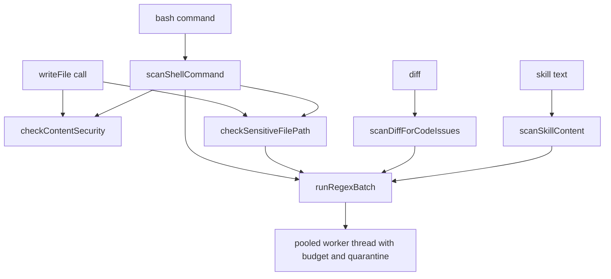

# Skills and Runtime Security Scanners

> Indexed at commit `d0a90fb5` on 2026-10-06 · [view on GitHub](https://github.com/yorch/auto-swe/tree/d0a90fb5)

## Relevant source files

- [packages/shared/src/skills/index.ts](https://github.com/yorch/auto-swe/blob/d0a90fb5/packages/shared/src/skills/index.ts)
- [packages/shared/src/scannerPatterns/index.ts](https://github.com/yorch/auto-swe/blob/d0a90fb5/packages/shared/src/scannerPatterns/index.ts)
- [packages/shared/src/lib/skillScanner.ts](https://github.com/yorch/auto-swe/blob/d0a90fb5/packages/shared/src/lib/skillScanner.ts)
- [packages/shared/src/lib/skillRevision.ts](https://github.com/yorch/auto-swe/blob/d0a90fb5/packages/shared/src/lib/skillRevision.ts)
- [packages/shared/src/lib/skillSource/index.ts](https://github.com/yorch/auto-swe/blob/d0a90fb5/packages/shared/src/lib/skillSource/index.ts)
- [packages/shared/src/lib/skillSource/github.ts](https://github.com/yorch/auto-swe/blob/d0a90fb5/packages/shared/src/lib/skillSource/github.ts)
- [packages/shared/src/lib/skillSource/errors.ts](https://github.com/yorch/auto-swe/blob/d0a90fb5/packages/shared/src/lib/skillSource/errors.ts)
- [packages/shared/src/lib/regexExec.ts](https://github.com/yorch/auto-swe/blob/d0a90fb5/packages/shared/src/lib/regexExec.ts)
- [packages/shared/src/lib/regexSafety.ts](https://github.com/yorch/auto-swe/blob/d0a90fb5/packages/shared/src/lib/regexSafety.ts)
- [packages/worker/src/lib/shellCommandScanner.ts](https://github.com/yorch/auto-swe/blob/d0a90fb5/packages/worker/src/lib/shellCommandScanner.ts)
- [packages/worker/src/lib/codeSecurityScanner.ts](https://github.com/yorch/auto-swe/blob/d0a90fb5/packages/worker/src/lib/codeSecurityScanner.ts)
- [packages/worker/src/lib/sensitiveFileScanner.ts](https://github.com/yorch/auto-swe/blob/d0a90fb5/packages/worker/src/lib/sensitiveFileScanner.ts)
- [packages/worker/src/agents/preWriteSecurityCheck.ts](https://github.com/yorch/auto-swe/blob/d0a90fb5/packages/worker/src/agents/preWriteSecurityCheck.ts)

## Overview

This subsystem covers two related concerns. Skills are named prompt fragments that shape how an agent reasons; they ship as built-ins, are versioned through immutable revisions, and can be imported from a GitHub repository. The runtime security scanners check agent activity (shell commands, file writes, diffs, skill text and model output) against regular-expression patterns held as data, with one shared execution engine that bounds the cost of running those patterns.

Scanners fall into two classes. Blocking scanners refuse an action: the shell-command and sensitive-file scanners fail closed when they cannot finish a scan, while the pre-write content check is a static, synchronous rule set that blocks only on CRITICAL findings and skips test files ([preWriteSecurityCheck.ts:L139-L184](https://github.com/yorch/auto-swe/blob/d0a90fb5/packages/worker/src/agents/preWriteSecurityCheck.ts#L139-L184)). Advisory scanners (skill content, code diff) report findings and degrade to partial results when a scan overruns. They differ when the pattern set itself cannot be loaded: `scanSkillContent` does not catch the failure, so it propagates to the caller ([skillScanner.ts:L34](https://github.com/yorch/auto-swe/blob/d0a90fb5/packages/shared/src/lib/skillScanner.ts#L34), [scannerPatternLoader.ts:L51-L58](https://github.com/yorch/auto-swe/blob/d0a90fb5/packages/shared/src/lib/scannerPatternLoader.ts#L51-L58)), while `scanDiffForCodeIssues` catches it, logs, and returns `[]` ([codeSecurityScanner.ts:L55-L68](https://github.com/yorch/auto-swe/blob/d0a90fb5/packages/worker/src/lib/codeSecurityScanner.ts#L55-L68)).

## Built-in skills and revisions

Built-in skills are declared one per file under `packages/shared/src/skills/` and aggregated into `BUILTIN_SKILLS`, an array of `BuiltinSkillDef` objects carrying `name`, `description`, `promptText` and role `assignments` with a `sortOrder` ([skills/index.ts:L37-L44](https://github.com/yorch/auto-swe/blob/d0a90fb5/packages/shared/src/skills/index.ts#L37-L44)). The array is grouped by role: implementer skills (for example `TEST_FIRST_SKILL`, `SHELL_COMMAND_SAFETY_SKILL`), reviewer and sub-reviewer skills, planner and decomposer skills, `validateContext` and `commitToMemory` skills, and a support pack and a product pack.

Skill history is handled by `skillRevision.ts`. `Skill.promptText` and `description` are the live copy and mirror the revision numbered `currentRevision`. Two builders, `initialRevision` and `nextRevision`, return fragments that callers spread into their own `skill.create` or `skill.update`; the revision row is a nested create in the same statement, so a skill never exists without the revision it names ([skillRevision.ts:L1-L13](https://github.com/yorch/auto-swe/blob/d0a90fb5/packages/shared/src/lib/skillRevision.ts#L1-L13)).

`skillContentHash` takes a sha256 over the prompt text and description, and `skillContentChanged` compares hashes so an unchanged write creates no revision ([skillRevision.ts:L28-L38](https://github.com/yorch/auto-swe/blob/d0a90fb5/packages/shared/src/lib/skillRevision.ts#L28-L38)). `nextRevision` returns a `where` clause that includes the `currentRevision` the caller read. Two concurrent edits therefore cannot both claim revision N+1: the loser matches no row, and `isRevisionConflict` recognises the resulting Prisma `P2025` (or the `P2002` unique-index backstop) ([skillRevision.ts:L75-L106](https://github.com/yorch/auto-swe/blob/d0a90fb5/packages/shared/src/lib/skillRevision.ts#L75-L106)). Revision metadata records scan warnings, the creator, and for imported skills the `sourceSha`, `sourcePath` and `referenceFiles`.

Sources: [packages/shared/src/skills/index.ts:L37-L90](https://github.com/yorch/auto-swe/blob/d0a90fb5/packages/shared/src/skills/index.ts#L37-L90) [packages/shared/src/lib/skillRevision.ts:L1-L106](https://github.com/yorch/auto-swe/blob/d0a90fb5/packages/shared/src/lib/skillRevision.ts#L1-L106)

## External skill sources

`fetchSkillSource` reads skills from a GitHub repository path and returns a commit `sha` plus a list of skills ([skillSource/index.ts:L393-L473](https://github.com/yorch/auto-swe/blob/d0a90fb5/packages/shared/src/lib/skillSource/index.ts#L393-L473)). It first resolves access, then resolves the ref to a commit (or reads an explicit `atSha`), and fails with `SHA_MOVED` if the ref no longer matches the `expectSha` a preview showed. It lists the tree, plans which `SKILL.md` folders and companion files to fetch, and enforces limits: 100 skills per source, 2,000,000 total bytes, 50 reference files of at most 100,000 bytes each ([skillSource/index.ts:L23-L28](https://github.com/yorch/auto-swe/blob/d0a90fb5/packages/shared/src/lib/skillSource/index.ts#L23-L28)).

Planning is conservative about what it keeps. Only `.md` and `.txt` files without control characters count as text; symlinks, submodules, non-text files, oversized files and files beyond the per-skill cap are recorded as skipped with a reason. In `REJECT` script mode a folder holding any non-text file is rejected outright ([skillSource/index.ts:L245-L316](https://github.com/yorch/auto-swe/blob/d0a90fb5/packages/shared/src/lib/skillSource/index.ts#L245-L316)). A bad skill reports an error on itself without failing the others, and duplicate normalised names within a source are flagged. Nothing fetched is executed; only text is stored.

Host policy runs before any request. `resolveAccess` validates the host shape, requires it to be `github.com` or an admin-approved repository host, and applies a private-network allowance only to a host that is both approved and opted in ([skillSource/github.ts:L61-L69](https://github.com/yorch/auto-swe/blob/d0a90fb5/packages/shared/src/lib/skillSource/github.ts#L61-L69), [L117-L165](https://github.com/yorch/auto-swe/blob/d0a90fb5/packages/shared/src/lib/skillSource/github.ts#L117-L165)). Only the platform credential is used, resolved through `resolvePlatformCredential`; a host without one is read anonymously.

`apiGet` handles each request under a budget of at most 300 requests, a 60 second overall deadline, and a rate-limit floor ([github.ts:L49-L59](https://github.com/yorch/auto-swe/blob/d0a90fb5/packages/shared/src/lib/skillSource/github.ts#L49-L59)). Redirects are followed manually, up to five hops; each hop passes the URL check, and a hop to a different origin must be an approved host. The bearer token is attached only when the request origin equals the API origin ([github.ts:L196-L280](https://github.com/yorch/auto-swe/blob/d0a90fb5/packages/shared/src/lib/skillSource/github.ts#L196-L280)). Failures surface only as codes from `SKILL_SOURCE_ERRORS`, each with a fixed message, because fetch errors and response bodies can echo headers or credentials ([skillSource/errors.ts:L1-L33](https://github.com/yorch/auto-swe/blob/d0a90fb5/packages/shared/src/lib/skillSource/errors.ts#L1-L33)).

Sources: [packages/shared/src/lib/skillSource/index.ts:L393-L473](https://github.com/yorch/auto-swe/blob/d0a90fb5/packages/shared/src/lib/skillSource/index.ts#L393-L473) [packages/shared/src/lib/skillSource/github.ts:L117-L280](https://github.com/yorch/auto-swe/blob/d0a90fb5/packages/shared/src/lib/skillSource/github.ts#L117-L280) [packages/shared/src/lib/skillSource/errors.ts:L1-L72](https://github.com/yorch/auto-swe/blob/d0a90fb5/packages/shared/src/lib/skillSource/errors.ts#L1-L72)

## Scanner patterns as data

`BUILTIN_SCANNER_PATTERNS` holds the built-in rules, each a `{ flags, label, pattern, type }` record ([scannerPatterns/index.ts:L1-L15](https://github.com/yorch/auto-swe/blob/d0a90fb5/packages/shared/src/scannerPatterns/index.ts#L1-L15), [L61](https://github.com/yorch/auto-swe/blob/d0a90fb5/packages/shared/src/scannerPatterns/index.ts#L61)). The types are `INJECTION`, `EXFILTRATION`, `SHELL_COMMAND`, `CODE_SECURITY`, `SENSITIVE_FILE` and `PII`. All but `CODE_SECURITY` are core platform defaults with a null origin; `CODE_SECURITY` is tagged `swe-starter` because it is source scanning specific to the software-engineering use case ([scannerPatterns/index.ts:L10-L19](https://github.com/yorch/auto-swe/blob/d0a90fb5/packages/shared/src/scannerPatterns/index.ts#L10-L19)).

Shell patterns that open on a command word use the `restOfSegment` helper, which stops at the next occurrence of the same word set or at a segment separator. This keeps matching cost linear in the command length rather than quadratic ([scannerPatterns/index.ts:L21-L48](https://github.com/yorch/auto-swe/blob/d0a90fb5/packages/shared/src/scannerPatterns/index.ts#L21-L48)). The scanners load their pattern sets through `makePatternLoader`, a cached DB-backed loader filtered by pattern type.

Write-time validation in `checkRegexSafety` is a syntax-and-size policy: it accepts only the flags `i`, `m`, `s`, `u`, `v`, requires the pattern to compile, and caps the source at 2,000 characters. It makes no claim about execution cost ([regexSafety.ts:L19-L100](https://github.com/yorch/auto-swe/blob/d0a90fb5/packages/shared/src/lib/regexSafety.ts#L19-L100)).

Sources: [packages/shared/src/scannerPatterns/index.ts:L1-L61](https://github.com/yorch/auto-swe/blob/d0a90fb5/packages/shared/src/scannerPatterns/index.ts#L1-L61) [packages/shared/src/lib/regexSafety.ts:L19-L100](https://github.com/yorch/auto-swe/blob/d0a90fb5/packages/shared/src/lib/regexSafety.ts#L19-L100)

## Bounded regex execution

Pattern bodies are admin- or bundle-supplied, and JavaScript regular expressions have no execution budget, so `regexExec.ts` runs every scanner pattern in a pooled `worker_thread` that can be terminated. `runRegexBatch` takes pattern specs and targets, and returns `hits`, an `incomplete` flag, timed-out pattern keys, and `quarantinedPatternKeys` ([regexExec.ts:L486-L532](https://github.com/yorch/auto-swe/blob/d0a90fb5/packages/shared/src/lib/regexExec.ts#L486-L532)). Calls are serialised through an internal queue.

The per-target budget defaults to 250 ms and comes from the `SCANNER_REGEX_BUDGET_MS` environment variable through `resolveRegexBudgetMs`, which reads the environment and so cannot throw ([regexExec.ts:L84-L105](https://github.com/yorch/auto-swe/blob/d0a90fb5/packages/shared/src/lib/regexExec.ts#L84-L105)). On an overrun the executor attributes the hang to a pattern by bisecting, then re-runs a lone suspect in isolation. A pattern that overruns twice is quarantined in the current process for `REGEX_QUARANTINE_TTL_MS`, ten minutes, and later batches skip it and report it in `quarantinedPatternKeys` ([regexExec.ts:L88-L92](https://github.com/yorch/auto-swe/blob/d0a90fb5/packages/shared/src/lib/regexExec.ts#L88-L92)). The quarantine is per process and is not shared between gateway and worker.

`probeRegexBacktracking` is the write-time check: it runs a candidate against a corpus built from its own alphabet under one budget and returns an error message when it overruns ([regexExec.ts:L603-L632](https://github.com/yorch/auto-swe/blob/d0a90fb5/packages/shared/src/lib/regexExec.ts#L603-L632)). It is an early signal for the admin; runtime bounding is the containment.

Input windowing differs by scanner class. `capScanText` truncates at 20,000 characters and is for advisory callers only. `chunkScanText` covers the whole input in overlapping windows (2,000 character overlap), and `shellScanTargets` builds windows on segment boundaries over both the raw and the whitespace-collapsed spelling of a command ([regexSafety.ts:L19-L46](https://github.com/yorch/auto-swe/blob/d0a90fb5/packages/shared/src/lib/regexSafety.ts#L19-L46), [L107-L146](https://github.com/yorch/auto-swe/blob/d0a90fb5/packages/shared/src/lib/regexSafety.ts#L107-L146), [L178-L235](https://github.com/yorch/auto-swe/blob/d0a90fb5/packages/shared/src/lib/regexSafety.ts#L178-L235)).

Sources: [packages/shared/src/lib/regexExec.ts:L84-L132](https://github.com/yorch/auto-swe/blob/d0a90fb5/packages/shared/src/lib/regexExec.ts#L84-L132) [packages/shared/src/lib/regexExec.ts:L486-L632](https://github.com/yorch/auto-swe/blob/d0a90fb5/packages/shared/src/lib/regexExec.ts#L486-L632)

## Scanners

| Scanner | Class | Input | Outcome |
| ------- | ----- | ----- | ------- |
| `scanShellCommand` | Blocking | `bash` command text | Returns a block message or `null` |
| `checkSensitiveFilePath(s)` | Blocking | Write-target paths | Returns a block message or `null` |
| `checkContentSecurity` | Blocking on CRITICAL | `writeFile` content | Blocks on CRITICAL, warns on HIGH and MEDIUM |
| `scanDiffForCodeIssues` | Advisory | Added diff lines | Returns findings |
| `scanSkillContent` | Advisory | Skill or LLM text | Returns warnings and `incomplete` |

`scanShellCommand` loads the `SHELL_COMMAND` patterns and runs them over `shellScanTargets(command)`. If the policy cannot be loaded, if a hit occurs, if a rule is quarantined, or if the batch is incomplete, it returns a block message, so an uncleared command is never treated as clean. It then extracts write targets (redirects, `tee`, `dd of=`, `cp`/`mv` destinations), from both the raw and the canonicalised command, and checks them against the sensitive-file policy in one batch. Finally it applies the critical pre-write content rules to content written by echo redirects and heredocs ([shellCommandScanner.ts:L162-L251](https://github.com/yorch/auto-swe/blob/d0a90fb5/packages/worker/src/lib/shellCommandScanner.ts#L162-L251)). Target extraction is a heuristic over command text, not a shell parser.

`checkSensitiveFilePath` tests each `SENSITIVE_FILE` pattern against both the basename and the full normalised path, so a rule applies at any directory depth. It blocks when a pattern hits, when the pattern set failed to load, or when the scan was incomplete ([sensitiveFileScanner.ts:L105-L146](https://github.com/yorch/auto-swe/blob/d0a90fb5/packages/worker/src/lib/sensitiveFileScanner.ts#L105-L146)). `checkSensitiveFilePaths` does the same for many paths in a single executor round trip and conservatively reports the first path when the batch is incomplete ([sensitiveFileScanner.ts:L148-L157](https://github.com/yorch/auto-swe/blob/d0a90fb5/packages/worker/src/lib/sensitiveFileScanner.ts#L148-L157)).

`checkContentSecurity` iterates the static `SECURITY_RULES` line by line, skipping test files and honouring per-rule file extension and excluded-path filters. It passes unless a CRITICAL violation exists ([preWriteSecurityCheck.ts:L139-L184](https://github.com/yorch/auto-swe/blob/d0a90fb5/packages/worker/src/agents/preWriteSecurityCheck.ts#L139-L184)). `wrapWriteToolWithSecurityCheck` wraps the write tool in an OpenTelemetry span: a CRITICAL result returns a `SECURITY CHECK FAILED` message and does not write, while lesser findings let the write proceed with a `SECURITY WARNINGS` prefix ([preWriteSecurityCheck.ts:L188-L255](https://github.com/yorch/auto-swe/blob/d0a90fb5/packages/worker/src/agents/preWriteSecurityCheck.ts#L188-L255)).

The advisory scanners degrade instead. `scanDiffForCodeIssues` returns `[]` if patterns fail to load, caps each added line, logs when the batch is incomplete, and returns the findings it has, ordered by line and pattern ([codeSecurityScanner.ts:L55-L108](https://github.com/yorch/auto-swe/blob/d0a90fb5/packages/worker/src/lib/codeSecurityScanner.ts#L55-L108)). `scanSkillContent` runs `INJECTION` and `EXFILTRATION` patterns over capped text, or over full overlapping windows when `opts.full` is set. It marks the result `incomplete` on an overrun or a quarantined pattern ([skillScanner.ts:L26-L58](https://github.com/yorch/auto-swe/blob/d0a90fb5/packages/shared/src/lib/skillScanner.ts#L26-L58)).

Sources: [packages/worker/src/lib/shellCommandScanner.ts:L162-L251](https://github.com/yorch/auto-swe/blob/d0a90fb5/packages/worker/src/lib/shellCommandScanner.ts#L162-L251) [packages/worker/src/lib/sensitiveFileScanner.ts:L105-L157](https://github.com/yorch/auto-swe/blob/d0a90fb5/packages/worker/src/lib/sensitiveFileScanner.ts#L105-L157) [packages/worker/src/agents/preWriteSecurityCheck.ts:L139-L255](https://github.com/yorch/auto-swe/blob/d0a90fb5/packages/worker/src/agents/preWriteSecurityCheck.ts#L139-L255) [packages/worker/src/lib/codeSecurityScanner.ts:L55-L108](https://github.com/yorch/auto-swe/blob/d0a90fb5/packages/worker/src/lib/codeSecurityScanner.ts#L55-L108) [packages/shared/src/lib/skillScanner.ts:L26-L58](https://github.com/yorch/auto-swe/blob/d0a90fb5/packages/shared/src/lib/skillScanner.ts#L26-L58)

## Diagram

```mermaid
flowchart TD
  A[bash command] --> S[scanShellCommand]
  W[writeFile call] --> P[checkContentSecurity]
  W --> F[checkSensitiveFilePath]
  S --> F
  S --> P
  S --> R[runRegexBatch]
  F --> R
  D[diff] --> C[scanDiffForCodeIssues] --> R
  K[skill text] --> SK[scanSkillContent] --> R
  R --> T[pooled worker thread with budget and quarantine]
```

Sources: [packages/worker/src/lib/shellCommandScanner.ts:L162-L251](https://github.com/yorch/auto-swe/blob/d0a90fb5/packages/worker/src/lib/shellCommandScanner.ts#L162-L251) [packages/shared/src/lib/regexExec.ts:L486-L532](https://github.com/yorch/auto-swe/blob/d0a90fb5/packages/shared/src/lib/regexExec.ts#L486-L532)

## Related Pages

- Parent: [Shared library](./2-shared-library.md)
- Sibling: [Data model](./2.1-data-model.md)
- Sibling: [Workflow spec and interpreter](./2.2-workflow-spec-and-interpreter.md)
- Sibling: [Configuration and settings](./2.3-configuration-and-settings.md)
