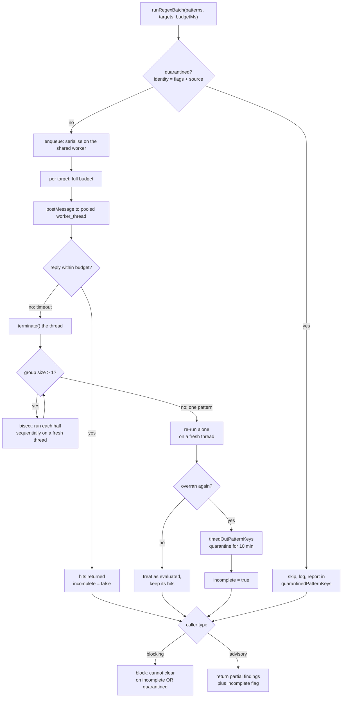

# Built-in Skills and Runtime Security Scanners

> Indexed at commit `ae416937` on 2026-10-03 · [view on GitHub](https://github.com/yorch/auto-swe/tree/ae416937)

## Relevant source files

- [packages/shared/src/skills/index.ts](https://github.com/yorch/auto-swe/blob/ae416937/packages/shared/src/skills/index.ts)
- [packages/shared/src/skills/scopeConservatism.ts](https://github.com/yorch/auto-swe/blob/ae416937/packages/shared/src/skills/scopeConservatism.ts)
- [packages/shared/src/scannerPatterns/index.ts](https://github.com/yorch/auto-swe/blob/ae416937/packages/shared/src/scannerPatterns/index.ts)
- [packages/shared/src/lib/regexExec.ts](https://github.com/yorch/auto-swe/blob/ae416937/packages/shared/src/lib/regexExec.ts)
- [packages/shared/src/lib/regexSafety.ts](https://github.com/yorch/auto-swe/blob/ae416937/packages/shared/src/lib/regexSafety.ts)
- [packages/shared/src/lib/skillScanner.ts](https://github.com/yorch/auto-swe/blob/ae416937/packages/shared/src/lib/skillScanner.ts)
- [packages/shared/src/lib/scannerPatternLoader.ts](https://github.com/yorch/auto-swe/blob/ae416937/packages/shared/src/lib/scannerPatternLoader.ts)
- [packages/shared/src/lib/scannerPatternTypes.ts](https://github.com/yorch/auto-swe/blob/ae416937/packages/shared/src/lib/scannerPatternTypes.ts)
- [packages/shared/src/lib/scannerCache.ts](https://github.com/yorch/auto-swe/blob/ae416937/packages/shared/src/lib/scannerCache.ts)
- [packages/shared/src/lib/systemConfig.ts](https://github.com/yorch/auto-swe/blob/ae416937/packages/shared/src/lib/systemConfig.ts)
- [packages/shared/src/lib/syncBuiltins.ts](https://github.com/yorch/auto-swe/blob/ae416937/packages/shared/src/lib/syncBuiltins.ts)
- [packages/shared/src/prisma/schema.prisma](https://github.com/yorch/auto-swe/blob/ae416937/packages/shared/src/prisma/schema.prisma)
- [packages/worker/src/lib/shellCommandScanner.ts](https://github.com/yorch/auto-swe/blob/ae416937/packages/worker/src/lib/shellCommandScanner.ts)
- [packages/worker/src/lib/sensitiveFileScanner.ts](https://github.com/yorch/auto-swe/blob/ae416937/packages/worker/src/lib/sensitiveFileScanner.ts)
- [packages/worker/src/lib/codeSecurityScanner.ts](https://github.com/yorch/auto-swe/blob/ae416937/packages/worker/src/lib/codeSecurityScanner.ts)
- [packages/worker/src/lib/scannerPatternLoader.ts](https://github.com/yorch/auto-swe/blob/ae416937/packages/worker/src/lib/scannerPatternLoader.ts)
- [packages/worker/src/agents/claudeCode/policy.ts](https://github.com/yorch/auto-swe/blob/ae416937/packages/worker/src/agents/claudeCode/policy.ts)
- [packages/worker/src/agents/claudeCode/runtime.ts](https://github.com/yorch/auto-swe/blob/ae416937/packages/worker/src/agents/claudeCode/runtime.ts)
- [packages/worker/src/activities/runEvalNode.ts](https://github.com/yorch/auto-swe/blob/ae416937/packages/worker/src/activities/runEvalNode.ts)
- [packages/gateway/src/routes/scannerPatterns.ts](https://github.com/yorch/auto-swe/blob/ae416937/packages/gateway/src/routes/scannerPatterns.ts)
- [packages/gateway/src/lib/skillLibraryService.ts](https://github.com/yorch/auto-swe/blob/ae416937/packages/gateway/src/lib/skillLibraryService.ts)

## Overview

The shared package holds two bodies of seed content that shape how agents behave and what they are allowed to do. Skills are named prompt fragments injected into an agent's system message; they steer reasoning. Scanner patterns are regular expressions run against agent-produced text; they gate action. Both seed into the database at startup and are extensible by administrators from the dashboard, which is why the second half of this page is mostly about how untrusted regular expressions are contained at run time.

Agent reference material, including what calls each agent and which skills it receives, lives in [docs/agents.md](https://github.com/yorch/auto-swe/blob/ae416937/docs/agents.md); this page covers the seed content and the execution machinery.

Sources: [packages/shared/src/skills/index.ts:L37-L88](https://github.com/yorch/auto-swe/blob/ae416937/packages/shared/src/skills/index.ts#L37-L88) [packages/shared/src/scannerPatterns/index.ts:L1-L552](https://github.com/yorch/auto-swe/blob/ae416937/packages/shared/src/scannerPatterns/index.ts#L1-L552)

## Built-in Skills

A skill is a `promptText` fragment plus the agent roles it attaches to. The definition shape is `BuiltinSkillDef` — `name`, `description`, `promptText`, and an `assignments` array of `{ role, sortOrder }` pairs — declared at [packages/shared/src/skills/index.ts#L37-L42](https://github.com/yorch/auto-swe/blob/ae416937/packages/shared/src/skills/index.ts#L37-L42). One file per skill exports one constant, and [`BUILTIN_SKILLS`](https://github.com/yorch/auto-swe/blob/ae416937/packages/shared/src/skills/index.ts#L44-L88) is the ordered registry of all of them. The repository ships **35** built-in skills.

[`scopeConservatism.ts`](https://github.com/yorch/auto-swe/blob/ae416937/packages/shared/src/skills/scopeConservatism.ts#L3-L18) is a representative file: two assignments (`planner` at sort order 10, `validateContext` at 10), a one-sentence description used in the implementer's skill menu, and a Markdown `promptText` body headed by an H2 that becomes a section of the system message.

The `assignments` array is the single source of truth for which agent gets which fragment; the `sortOrder` fixes the order fragments appear in. Grouped by the role they attach to:

| Role | Skills | Theme |
| ---- | ------ | ----- |
| `implementer` | `follow-existing-patterns`, `test-first`, `incremental-commits`, `no-new-dependencies`, `shell-command-safety`, `security-aware-implementation`, `pr-description-quality`, `idempotency`, `graceful-degradation`, `async-safety`, `observability-first`, `api-contract-stability`, `minimal-surface-area`, `configuration-over-hardcoding`, `design-fidelity` | Coding discipline and safe execution |
| `reviewer` | `review-focus-security`, `error-path-coverage`, `migration-safety-review`, `async-safety`, `api-contract-stability`, `minimal-surface-area` | What a whole-diff review must look at |
| `securityReviewer`, `domainLogicReviewer`, `performanceReviewer` | `security-review-depth`, `domain-logic-integrity`, `performance-impact-assessment` | One persona-specific lens each for the review network |
| `planner` | `scope-conservatism`, `test-first`, `no-new-dependencies`, `acceptance-criteria-first`, `idempotency`, `configuration-over-hardcoding`, `rollback-first-planning` | Planning discipline |
| `decomposer` | `subtask-decomposition` | Work breakdown |
| `validateContext` | `scope-conservatism`, `success-criteria-extraction`, `acceptance-criteria-first`, `context-ambiguity-resolution` | Turning a ticket into checkable criteria |
| `securityReview` | `shell-command-safety`, `security-aware-implementation` | The post-diff security gate |
| `commitToMemory` | `actionable-lessons` | Writing lessons worth retrieving later |
| `supportResponder` | `support-ticket-tone`, `support-kb-retrieval`, `support-escalation-policy`, `support-response-templates` | Support and operations pack |
| `productAnalyst`, `prdWriter` | `prd-readiness`, `product-acceptance-criteria`, `story-decomposition` | Product pack (`productAnalyst` gets the first two, `prdWriter` the last two) |

Several skills carry two assignments, so the same fragment reaches both an author and its reviewer. `async-safety`, `api-contract-stability` and `minimal-surface-area` attach to `implementer` and `reviewer`; `test-first`, `idempotency`, `no-new-dependencies` and `configuration-over-hardcoding` attach to `implementer` and `planner`; `security-aware-implementation` and `shell-command-safety` attach to `implementer` and `securityReview`.

Sources: [packages/shared/src/skills/index.ts:L37-L88](https://github.com/yorch/auto-swe/blob/ae416937/packages/shared/src/skills/index.ts#L37-L88) [packages/shared/src/skills/scopeConservatism.ts:L3-L18](https://github.com/yorch/auto-swe/blob/ae416937/packages/shared/src/skills/scopeConservatism.ts#L3-L18)

### Built-in versus custom, verified versus unverified

The `Skill` model carries `isBuiltIn`, `isVerified`, `isActive`, an `origin` provenance string, and a tenant `scope` with optional `teamId` and `orgId` ([schema.prisma#L2373-L2402](https://github.com/yorch/auto-swe/blob/ae416937/packages/shared/src/prisma/schema.prisma#L2373-L2402)). `syncSkills` seeds every entry of `BUILTIN_SKILLS` as `isBuiltIn: true` and `isVerified: true`, tagged with the `swe-starter` origin, updating description and prompt text on each run while deliberately leaving `isActive` alone so an administrator's decision to disable a skill survives a restart ([syncBuiltins.ts#L1095-L1129](https://github.com/yorch/auto-swe/blob/ae416937/packages/shared/src/lib/syncBuiltins.ts#L1095-L1129)). Which agent a skill reaches is not decided there: the attachment is made through each Agent's `skillRefs`.

The two flags are independent claims. `isBuiltIn` is provenance: this row came from the repository, not from a user, and its `promptText` is locked — the update path for a built-in accepts only name, description, and active state ([skillLibraryService.ts#L62-L95](https://github.com/yorch/auto-swe/blob/ae416937/packages/gateway/src/lib/skillLibraryService.ts#L62-L95)). `isVerified` is a content-trust signal about the current prompt text. A custom skill is created with `isVerified: false` and its text scanned for injection and exfiltration patterns, non-blocking, with warnings returned alongside the created row ([skillLibraryService.ts#L30-L60](https://github.com/yorch/auto-swe/blob/ae416937/packages/gateway/src/lib/skillLibraryService.ts#L30-L60)). Editing `promptText` resets the flag to false; editing only the name or description does not, because those do not change what the agent reads.

Custom skills are also tenant-scoped. A read sees platform-wide GLOBAL rows plus the caller's own team and organization rows, so a team's custom `promptText` is not readable platform-wide ([skillLibraryService.ts#L14-L28](https://github.com/yorch/auto-swe/blob/ae416937/packages/gateway/src/lib/skillLibraryService.ts#L14-L28)).

Sources: [packages/gateway/src/lib/skillLibraryService.ts:L14-L95](https://github.com/yorch/auto-swe/blob/ae416937/packages/gateway/src/lib/skillLibraryService.ts#L14-L95) [packages/shared/src/lib/syncBuiltins.ts:L1095-L1129](https://github.com/yorch/auto-swe/blob/ae416937/packages/shared/src/lib/syncBuiltins.ts#L1095-L1129) [packages/shared/src/prisma/schema.prisma:L2373-L2402](https://github.com/yorch/auto-swe/blob/ae416937/packages/shared/src/prisma/schema.prisma#L2373-L2402)

## Scanner Patterns

[`BUILTIN_SCANNER_PATTERNS`](https://github.com/yorch/auto-swe/blob/ae416937/packages/shared/src/scannerPatterns/index.ts#L61-L552) holds **63** patterns across six categories. Each entry is a `label`, a `pattern` source string, a `flags` string, and a `type` ([index.ts#L3-L8](https://github.com/yorch/auto-swe/blob/ae416937/packages/shared/src/scannerPatterns/index.ts#L3-L8)). The six category names are one shared list, [`SCANNER_PATTERN_TYPES`](https://github.com/yorch/auto-swe/blob/ae416937/packages/shared/src/lib/scannerPatternTypes.ts#L7-L16), which the bundle schema, the gateway route and the pattern loader all import so none keeps its own copy of the Prisma enum.

| Category | Count | Applies at | Behaviour |
| -------- | ----- | ---------- | --------- |
| `INJECTION` | 13 | Skill save, and per-iteration on model output | Advisory |
| `EXFILTRATION` | 11 | Same as injection, over prose | Advisory |
| `SHELL_COMMAND` | 18 | Before every `bash` call | Soft-block returning an error to the agent |
| `CODE_SECURITY` | 10 | Added lines of the post-commit diff | Advisory, passed to the security reviewer |
| `SENSITIVE_FILE` | 7 | Before every `writeFile`, and on shell write targets | Hard-block |
| `PII` | 4 | The `pii` eval scorer | Fails the scorer on a hit |

The counts are tallies of `type:` fields in the file: 13 + 11 + 18 + 10 + 7 + 4 = 63. The seventh sensitive-file rule, `sensitive-git-metadata`, matches `.git` itself and anything under it at any depth, but not `.github/` or `.gitignore`. The comment on it gives the reason: hooks, `.git/config` (`url.*.insteadOf`, `http.proxy`, `core.hooksPath`, `core.sshCommand`) and gitfiles are what an authenticated push or fetch reads, and the worker neutralises them before every authenticated git call, so this rule blocks the direct write that would plant them ([index.ts#L509-L520](https://github.com/yorch/auto-swe/blob/ae416937/packages/shared/src/scannerPatterns/index.ts#L509-L520)).

Provenance splits by type. `scannerPatternOrigin` tags `CODE_SECURITY` as `swe-starter` seed content and leaves the other five categories as core platform defaults with a null origin, so a core-only deployment keeps the cross-cutting guards and drops the source-scanning ones ([index.ts#L10-L19](https://github.com/yorch/auto-swe/blob/ae416937/packages/shared/src/scannerPatterns/index.ts#L10-L19)). `syncScannerPatterns` upserts by label for one origin group at a time and omits `isActive` from the update, so an administrator's disable decision survives a re-sync ([syncBuiltins.ts#L1174-L1196](https://github.com/yorch/auto-swe/blob/ae416937/packages/shared/src/lib/syncBuiltins.ts#L1174-L1196)). The stored row is the `ScannerPattern` model, with a unique `label`, `isBuiltIn` and `isActive` ([schema.prisma#L2404-L2427](https://github.com/yorch/auto-swe/blob/ae416937/packages/shared/src/prisma/schema.prisma#L2404-L2427)).

The injection set covers instruction override, persona jailbreaks, safety-system bypass, low-level token sequences such as `<|im_start|>`, and template-engine injection. The exfiltration set is written for **prose** and is deliberately not reused in a shell context — `https?://\S+` would match most legitimate build commands. Shell-context exfiltration has its own dedicated rules targeting outbound movement of local data: upload flags, request-capture sinks, cloud instance-metadata endpoints, netcat egress, remote copy, credential-file reads, and encode-then-pipe chains ([index.ts#L323-L380](https://github.com/yorch/auto-swe/blob/ae416937/packages/shared/src/scannerPatterns/index.ts#L323-L380)).

Cost shape matters inside the built-in set itself. Shell patterns of the form `\bword\b … tail` bound their scan after the command word with [`restOfSegment`](https://github.com/yorch/auto-swe/blob/ae416937/packages/shared/src/scannerPatterns/index.ts#L21-L42), which stops at the next occurrence of the same word set rather than at the segment end. A plain `[^;&|]*` there is quadratic: the pattern is attempted at every occurrence of the word and each attempt scans to the end of the segment, so 20,000 characters of repeated `curl` costs more than the whole budget for one pattern. The comment above the array states the rule — every `SHELL_COMMAND` pattern must stay linear on a 20k window — and says `regexExec.test.ts` times the whole set against adversarial windows ([index.ts#L50-L60](https://github.com/yorch/auto-swe/blob/ae416937/packages/shared/src/scannerPatterns/index.ts#L50-L60)).

Sources: [packages/shared/src/scannerPatterns/index.ts:L1-L552](https://github.com/yorch/auto-swe/blob/ae416937/packages/shared/src/scannerPatterns/index.ts#L1-L552) [packages/shared/src/lib/scannerPatternTypes.ts:L7-L16](https://github.com/yorch/auto-swe/blob/ae416937/packages/shared/src/lib/scannerPatternTypes.ts#L7-L16) [packages/shared/src/lib/syncBuiltins.ts:L1174-L1196](https://github.com/yorch/auto-swe/blob/ae416937/packages/shared/src/lib/syncBuiltins.ts#L1174-L1196)

### Where each category runs

Each category has a different consumer, and only some of them block.

- **`SHELL_COMMAND`** is read by [`scanShellCommand`](https://github.com/yorch/auto-swe/blob/ae416937/packages/worker/src/lib/shellCommandScanner.ts#L162-L251) before every `bash` call, which also checks the command's write targets against the sensitive-file policy and the content it writes against the pre-write content rules.
- **`SENSITIVE_FILE`** is read by [`checkSensitiveFilePath`](https://github.com/yorch/auto-swe/blob/ae416937/packages/worker/src/lib/sensitiveFileScanner.ts#L115-L138) before every `writeFile`, and by the shell scanner for write targets.
- **`CODE_SECURITY`** is read by [`scanDiffForCodeIssues`](https://github.com/yorch/auto-swe/blob/ae416937/packages/worker/src/lib/codeSecurityScanner.ts#L55-L104), which scans the added lines of a diff and returns findings for the security reviewer rather than blocking.
- **`INJECTION` and `EXFILTRATION`** are read by [`scanSkillContent`](https://github.com/yorch/auto-swe/blob/ae416937/packages/shared/src/lib/skillScanner.ts#L30-L46) on skill save and on model output.
- **`PII`** is read by the `pii` eval scorer. It queries the active `PII` rows directly, drops any that no longer compile, and runs them under the same budget over the scored value; the scorer passes only when nothing matched and the batch completed, so an overrun fails the score instead of clearing it ([runEvalNode.ts#L127-L149](https://github.com/yorch/auto-swe/blob/ae416937/packages/worker/src/activities/runEvalNode.ts#L127-L149)). The PII patterns therefore never run on a `bash` call or a file write.

### The Claude Code runtime boundary

The optional Claude Code implementer runtime consults these same scanners. The SDK runs in the worker and the `claude` binary runs in the workspace container; a `PreToolUse` hook calls [`decideToolCall`](https://github.com/yorch/auto-swe/blob/ae416937/packages/worker/src/agents/claudeCode/policy.ts#L66-L149) in the worker process before the harness executes a tool, so the container cannot edit the policy ([runtime.ts#L214-L262](https://github.com/yorch/auto-swe/blob/ae416937/packages/worker/src/agents/claudeCode/runtime.ts#L214-L262)). `Bash` goes through `scanShellCommand`; `Write` and `Edit` go through `checkSensitiveFilePath` and then the pre-write content check, with the same trace tags as the Mastra tools; `Read`, `Glob` and `Grep` are only confined to the checkout; any other tool is denied. If a scanner throws, the hook turns that into a deny, so the blocking scanners keep failing closed on this path too. The runtime itself, including how the seam is selected, is covered in [Agent Runs and Implementer Runtimes](./4.6-agent-runs-and-implementer-runtimes.md).

Sources: [packages/worker/src/agents/claudeCode/policy.ts:L66-L149](https://github.com/yorch/auto-swe/blob/ae416937/packages/worker/src/agents/claudeCode/policy.ts#L66-L149) [packages/worker/src/agents/claudeCode/runtime.ts:L214-L262](https://github.com/yorch/auto-swe/blob/ae416937/packages/worker/src/agents/claudeCode/runtime.ts#L214-L262) [packages/worker/src/activities/runEvalNode.ts:L127-L149](https://github.com/yorch/auto-swe/blob/ae416937/packages/worker/src/activities/runEvalNode.ts#L127-L149)

### Loading and caching

Stored rows reach the scanners through [`makePatternLoader`](https://github.com/yorch/auto-swe/blob/ae416937/packages/shared/src/lib/scannerPatternLoader.ts#L39-L89), a per-instance time-to-live cache over the active rows of one or more types. There is one implementation: the worker's shell, code-security and sensitive-file scanners use it through a [re-export](https://github.com/yorch/auto-swe/blob/ae416937/packages/worker/src/lib/scannerPatternLoader.ts#L1-L7), and the skill scanner uses it for `INJECTION` and `EXFILTRATION` together ([skillScanner.ts#L1-L9](https://github.com/yorch/auto-swe/blob/ae416937/packages/shared/src/lib/skillScanner.ts#L1-L9)), so the load rules cannot differ between processes. The database client is imported lazily on the first `load()`, so importing a scanner needs no `DATABASE_URL`.

Its only load-time filter is whether the source compiles; a row that will not compile is logged and skipped, because inside the executor there would be no way to report which one failed. How expensive a row is to run is never judged here — a wrong guess would silently stop an administrator's block rule from applying. The cache window is [`SCANNER_PATTERN_CACHE_TTL_MS`](https://github.com/yorch/auto-swe/blob/ae416937/packages/shared/src/lib/scannerPatternLoader.ts#L10), 60 seconds, re-exported through [`scannerCache.ts`](https://github.com/yorch/auto-swe/blob/ae416937/packages/shared/src/lib/scannerCache.ts#L12-L30); gateway and worker are separate processes, so a pattern edit propagates only as each expires.

Entries are cached as source plus flags, never as compiled `RegExp` objects, because execution happens in another thread that compiles its own copies.

Sources: [packages/shared/src/lib/scannerPatternLoader.ts:L1-L89](https://github.com/yorch/auto-swe/blob/ae416937/packages/shared/src/lib/scannerPatternLoader.ts#L1-L89) [packages/worker/src/lib/scannerPatternLoader.ts:L1-L7](https://github.com/yorch/auto-swe/blob/ae416937/packages/worker/src/lib/scannerPatternLoader.ts#L1-L7) [packages/shared/src/lib/scannerCache.ts:L1-L30](https://github.com/yorch/auto-swe/blob/ae416937/packages/shared/src/lib/scannerCache.ts#L1-L30)

## Containment: Executing Untrusted Regular Expressions

Scanner patterns are data. Administrators add them at `/govern/scanner` and installed bundles carry them, and their bodies run in-process against agent text on every shell call, every file write, every skill save, and every test-driven iteration. JavaScript's backtracking engine has no execution budget, and a running regular expression cannot be interrupted from the thread executing it, so a pattern such as `(a+)+$` is a self-inflicted denial of service on the gateway or worker ([regexExec.ts#L1-L18](https://github.com/yorch/auto-swe/blob/ae416937/packages/shared/src/lib/regexExec.ts#L1-L18)).

Structural analysis was tried and removed. It missed real hangs and rejected ordinary linear patterns, including two of the repository's own hardcoded scanner regexes ([regexSafety.ts#L10-L15](https://github.com/yorch/auto-swe/blob/ae416937/packages/shared/src/lib/regexSafety.ts#L10-L15)). The only construction that actually bounds JavaScript regex execution is running it somewhere killable.

### The pooled worker thread

[`regexExec.ts`](https://github.com/yorch/auto-swe/blob/ae416937/packages/shared/src/lib/regexExec.ts) owns a single long-lived `worker_thread` that executes every scanner pattern in both processes. The worker body is a string evaluated with `eval: true` so it needs no build step, no module resolution, and no loader, and behaves identically under `tsx`, Vitest, and the compiled output ([regexExec.ts#L172-L214](https://github.com/yorch/auto-swe/blob/ae416937/packages/shared/src/lib/regexExec.ts#L172-L214)). It keeps its own `Map` of compiled expressions keyed on the source-plus-flags identity string, so the built-in patterns are compiled once per process rather than once per batch, and it retains no caller object between jobs.

Spawn costs about 70 milliseconds once; a warm round trip is about 0.1 milliseconds ([regexExec.ts#L20-L26](https://github.com/yorch/auto-swe/blob/ae416937/packages/shared/src/lib/regexExec.ts#L20-L26)). Batches are serialised through [`enqueue`](https://github.com/yorch/auto-swe/blob/ae416937/packages/shared/src/lib/regexExec.ts#L533-L540) so a wedged batch cannot corrupt a concurrent one. Thread startup is explicitly excluded from the clock: charging spawn to the budget would fail the first scan of every process on a busy host, which reads as a spurious block on the agent's first shell call ([regexExec.ts#L264-L271](https://github.com/yorch/auto-swe/blob/ae416937/packages/shared/src/lib/regexExec.ts#L264-L271), [regexExec.ts#L302-L306](https://github.com/yorch/auto-swe/blob/ae416937/packages/shared/src/lib/regexExec.ts#L302-L306)). Both `error` and `exit` drop the handle, so an out-of-memory kill cannot leave every later batch posting to a dead worker and blaming whichever innocent pattern happened to be in it ([regexExec.ts#L252-L263](https://github.com/yorch/auto-swe/blob/ae416937/packages/shared/src/lib/regexExec.ts#L252-L263)).

### The budget

The wall-clock bound is the `SCANNER_REGEX_BUDGET_MS` environment variable, 250 milliseconds when unset ([regexExec.ts#L76-L84](https://github.com/yorch/auto-swe/blob/ae416937/packages/shared/src/lib/regexExec.ts#L76-L84)). It is not a registry setting and has no database row or admin form. [`resolveRegexBudgetMs`](https://github.com/yorch/auto-swe/blob/ae416937/packages/shared/src/lib/regexExec.ts#L94-L105) returns `resolveWorkspaceInfra().regexScanBudgetMs`, the same resolver that reads workspace sizing and images, and each of the four scanner entry points calls it once per scan and passes the number explicitly through `runRegexBatch`'s `opts.budgetMs`. Callers that omit it fall back to the 250 ms default, which is what the tests do.

Its scope is the deployment. There is no per-team, per-template or per-run override and no role that edits it, because the bound that keeps a bad pattern from wedging the shared executor is an infrastructure decision, not an operator policy; changing it means redeploying the process with a different environment. The resolver is lenient on purpose, because the scan path must never throw: a value that is not a positive integer falls back to 250, one above 60,000 is clamped to 60,000 with a logged warning, and one below 10 is raised to 10 ([systemConfig.ts#L751-L765](https://github.com/yorch/auto-swe/blob/ae416937/packages/shared/src/lib/systemConfig.ts#L751-L765), [systemConfig.ts#L793-L823](https://github.com/yorch/auto-swe/blob/ae416937/packages/shared/src/lib/systemConfig.ts#L793-L823)). Because that leniency would hide a typo, the worker runs the strict counterpart, `assertWorkspaceInfraEnv`, at boot: a set-but-unusable `SCANNER_REGEX_BUDGET_MS` fails the deploy instead of silently reverting to the default ([systemConfig.ts#L825-L875](https://github.com/yorch/auto-swe/blob/ae416937/packages/shared/src/lib/systemConfig.ts#L825-L875), [worker/src/index.ts#L51](https://github.com/yorch/auto-swe/blob/ae416937/packages/worker/src/index.ts#L51)). The gateway reads the variable through the same lenient resolver without that boot check.

The budget is **per target**, not per batch ([regexExec.ts#L434-L466](https://github.com/yorch/auto-swe/blob/ae416937/packages/shared/src/lib/regexExec.ts#L434-L466)). A blocking scanner that splits a long command into windows gets a full budget for each window, so the happy-path bound on a scan is targets times budget, proportional to the input the caller chose to scan. A pattern confirmed to overrun on one target is dropped for the remaining targets, since it has already been blamed and would only burn two more budgets on each.

### Bisection, confirmation, quarantine

On an overrun the worker is terminated — it is stuck inside a regular expression and will never yield — and the batch is re-run in halves against a fresh thread. [`evaluateGroup`](https://github.com/yorch/auto-swe/blob/ae416937/packages/shared/src/lib/regexExec.ts#L370-L412) recurses until one pattern is isolated, so the hang is attributed precisely and the well-behaved patterns' hits are still returned. The halves run sequentially, because overlapping them on one shared worker would interleave their replies and blame the innocent half. A bisected group is exactly as complete as its halves: if both halves finish, every pattern's hits are known and the group is not reported `incomplete`, so a blocking scanner does not refuse a command that every rule evaluated and cleared merely because the rules together took longer than one budget. A thread fault, which cannot be attributed to any pattern, is reported `incomplete` and quarantines nothing ([regexExec.ts#L383-L386](https://github.com/yorch/auto-swe/blob/ae416937/packages/shared/src/lib/regexExec.ts#L383-L386)).

An isolated overrun is then confirmed. The lone pattern is re-run by itself on a fresh thread, and only a second overrun lands in `timedOutPatternKeys` ([regexExec.ts#L387-L395](https://github.com/yorch/auto-swe/blob/ae416937/packages/shared/src/lib/regexExec.ts#L387-L395)). One observation is not evidence: a starved host, a garbage-collection pause, or a linear-but-heavy pattern on a large window can miss a 250-millisecond budget once, and quarantining on that would silently drop a real rule for every later scan. If the re-run completes, its hits are returned and the pattern is treated as evaluated.

A twice-confirmed pattern is added to a process-local quarantine keyed on flags plus source, expiring after `REGEX_QUARANTINE_TTL_MS`, which is 10 minutes ([regexExec.ts#L86-L92](https://github.com/yorch/auto-swe/blob/ae416937/packages/shared/src/lib/regexExec.ts#L86-L92)). Quarantined keys are reaped lazily on read ([regexExec.ts#L221-L241](https://github.com/yorch/auto-swe/blob/ae416937/packages/shared/src/lib/regexExec.ts#L221-L241)), so an administrator's fix takes effect without a restart. Later batches skip those patterns, log loudly on every skip, and report them in `quarantinedPatternKeys` ([regexExec.ts#L486-L531](https://github.com/yorch/auto-swe/blob/ae416937/packages/shared/src/lib/regexExec.ts#L486-L531)).

```mermaid
flowchart TD
    A["runRegexBatch(patterns, targets, budgetMs)"] --> B{"quarantined?<br/>identity = flags + source"}
    B -- yes --> C["skip, log, report in<br/>quarantinedPatternKeys"]
    B -- no --> D["enqueue: serialise on the shared worker"]
    D --> E["per target: full budget"]
    E --> F["postMessage to pooled worker_thread"]
    F --> G{"reply within budget?"}
    G -- yes --> H["hits returned<br/>incomplete = false"]
    G -- "no: timeout" --> I["terminate() the thread"]
    I --> J{"group size > 1?"}
    J -- yes --> K["bisect: run each half<br/>sequentially on a fresh thread"]
    K --> J
    J -- "no: one pattern" --> L["re-run alone<br/>on a fresh thread"]
    L --> M{"overran again?"}
    M -- no --> N["treat as evaluated,<br/>keep its hits"]
    M -- yes --> O["timedOutPatternKeys<br/>quarantine for 10 min"]
    O --> P["incomplete = true"]
    H --> Q{"caller type"}
    N --> Q
    P --> Q
    C --> Q
    Q -- blocking --> R["block: cannot clear<br/>on incomplete OR quarantined"]
    Q -- advisory --> S["return partial findings<br/>plus incomplete flag"]
```

Sources: [packages/shared/src/lib/regexExec.ts:L221-L541](https://github.com/yorch/auto-swe/blob/ae416937/packages/shared/src/lib/regexExec.ts#L221-L541)

### Blocking fails closed, advisory degrades

`runRegexBatch` never throws; every failure mode resolves to a result whose `incomplete` flag the caller interprets ([regexExec.ts#L150-L170](https://github.com/yorch/auto-swe/blob/ae416937/packages/shared/src/lib/regexExec.ts#L150-L170), [regexExec.ts#L480-L490](https://github.com/yorch/auto-swe/blob/ae416937/packages/shared/src/lib/regexExec.ts#L480-L490)).

Blocking scanners cannot say an input is clean when a rule did not run, so they do not. [`scanShellCommand`](https://github.com/yorch/auto-swe/blob/ae416937/packages/worker/src/lib/shellCommandScanner.ts#L162-L211) blocks on three separate conditions: the pattern store failed to load, a rule was skipped as quarantined, or the batch came back incomplete. Each returns an actionable message to the agent rather than a throw the tool would surface as a generic error. Quarantine is handled explicitly because `incomplete` does not cover it — a skipped rule was never evaluated. [`checkSensitiveFilePath`](https://github.com/yorch/auto-swe/blob/ae416937/packages/worker/src/lib/sensitiveFileScanner.ts#L115-L138) does the same, folding quarantine into its own `incomplete` before deciding ([sensitiveFileScanner.ts#L70-L73](https://github.com/yorch/auto-swe/blob/ae416937/packages/worker/src/lib/sensitiveFileScanner.ts#L70-L73)).

Advisory scanners keep whatever they found. [`scanSkillContent`](https://github.com/yorch/auto-swe/blob/ae416937/packages/shared/src/lib/skillScanner.ts#L30-L46) returns `incomplete: true` alongside its warnings, and [`scanDiffForCodeIssues`](https://github.com/yorch/auto-swe/blob/ae416937/packages/worker/src/lib/codeSecurityScanner.ts#L55-L104) logs and returns partial findings; when its pattern store fails to load it returns no findings rather than failing the run.

### Chunking, not truncation

Truncation in a blocking scanner is a bypass: 20,000 characters of leading comment pushes a forbidden command past a plain cap and out of the rule's sight. Two helpers in `regexSafety.ts` cover the whole input instead, and which one a scanner uses depends on what its matches look like.

[`chunkScanText`](https://github.com/yorch/auto-swe/blob/ae416937/packages/shared/src/lib/regexSafety.ts#L111-L135) splits input into fixed windows of 20,000 characters that overlap by 2,000, a figure chosen to exceed the longest plausible match for file paths ([regexSafety.ts#L21-L38](https://github.com/yorch/auto-swe/blob/ae416937/packages/shared/src/lib/regexSafety.ts#L21-L38)). Text shorter than one window yields exactly one window, so the common case allocates nothing extra. The sensitive-file scanner uses it on both the basename and the normalised path ([sensitiveFileScanner.ts#L49-L59](https://github.com/yorch/auto-swe/blob/ae416937/packages/worker/src/lib/sensitiveFileScanner.ts#L49-L59)).

The shell scanner cannot rely on a fixed overlap, because the built-in shell rules run from the command word to the flag however far apart those are: a `curl` padded with thousands of spaces before its `-T /etc/passwd` is a match longer than any overlap. It uses [`shellScanTargets`](https://github.com/yorch/auto-swe/blob/ae416937/packages/shared/src/lib/regexSafety.ts#L226-L235) instead, which follows command structure ([`shellScanWindows`](https://github.com/yorch/auto-swe/blob/ae416937/packages/shared/src/lib/regexSafety.ts#L158-L224)):

- Every window starts at a segment boundary, on the `;`, `&` or `|` itself so a rule that looks at the preceding operator still sees it, and holds whole segments.
- Each window also carries the whole next segment, or `overlap` characters, whichever is longer, so a `| sh` after a download or a `| … curl` after an encoder is in view.
- A segment longer than the window becomes a window on its own, uncut. Its cost is still bounded by the per-window budget, and a blocking scanner fails closed if it overruns.
- A command that fits in one window is scanned as one window.
- The command is also scanned in its [canonical spelling](https://github.com/yorch/auto-swe/blob/ae416937/packages/shared/src/lib/regexSafety.ts#L137-L153): line continuations removed and each run of whitespace collapsed. That takes away the free padding, and duplicate windows are dropped.

The guarantee is that a match is seen if it lies within two adjacent segments, within one segment plus `overlap` characters beyond it, or is no longer than `overlap`; every character lands in at least one window. The scanner also extracts write targets from both spellings, because a line continuation can split a redirect from its target ([shellCommandScanner.ts#L213-L233](https://github.com/yorch/auto-swe/blob/ae416937/packages/worker/src/lib/shellCommandScanner.ts#L213-L233)).

[`capScanText`](https://github.com/yorch/auto-swe/blob/ae416937/packages/shared/src/lib/regexSafety.ts#L101-L109) still exists at a 20,000-character cap, restricted to advisory callers where a missed match past the cap costs only a warning — the skill scanner, and each added diff line in the code-security scan, which can be a minified bundle.

Sources: [packages/shared/src/lib/regexSafety.ts:L21-L38](https://github.com/yorch/auto-swe/blob/ae416937/packages/shared/src/lib/regexSafety.ts#L21-L38) [packages/shared/src/lib/regexSafety.ts:L101-L235](https://github.com/yorch/auto-swe/blob/ae416937/packages/shared/src/lib/regexSafety.ts#L101-L235) [packages/worker/src/lib/shellCommandScanner.ts:L162-L233](https://github.com/yorch/auto-swe/blob/ae416937/packages/worker/src/lib/shellCommandScanner.ts#L162-L233) [packages/worker/src/lib/sensitiveFileScanner.ts:L36-L85](https://github.com/yorch/auto-swe/blob/ae416937/packages/worker/src/lib/sensitiveFileScanner.ts#L36-L85)

## Write-Time Validation

Two checks guard a pattern before it is stored, and they answer different questions.

[`checkRegexSafety`](https://github.com/yorch/auto-swe/blob/ae416937/packages/shared/src/lib/regexSafety.ts#L70-L99) is pure and synchronous, because the bundle SDK depends on it and must stay free of input and output. It is a syntax-and-size policy: reject unsafe flags, reject what will not compile, reject a source over 2,000 characters. It makes no claim about execution cost.

The safe flag subset is `i`, `m`, `s`, `u`, `v`, enforced by `SAFE_FLAGS_RE` at [regexSafety.ts#L48-L55](https://github.com/yorch/auto-swe/blob/ae416937/packages/shared/src/lib/regexSafety.ts#L48-L55). The global and sticky flags are rejected because both are stateful: they advance `lastIndex` between `exec` calls, and the executor caches one compiled expression per identity for the life of the process. A cached global-flagged expression would produce different results on its second use against the same text. The gateway's request schema imports the same constant so the two definitions cannot drift.

[`probeRegexBacktracking`](https://github.com/yorch/auto-swe/blob/ae416937/packages/shared/src/lib/regexExec.ts#L588-L631) is the empirical check the admin API layers on top. It runs the candidate under the same budget against a corpus of repetition-heavy strings built from a general alphabet plus every character the pattern itself mentions, up to 40 seeds, plus two-character cycles so a group such as `(ab|a)+` is reachable. That is what makes both `(w+)+$` and `([Ѐ-ӿ]+)+$` detectable without any structural understanding. Repetition lengths are deliberately short — 28, 44 and 64 characters — because exponential backtracking is already unbearable there while a merely quadratic pattern stays in microseconds, and probing with long inputs would conflate the two ([regexExec.ts#L542-L586](https://github.com/yorch/auto-swe/blob/ae416937/packages/shared/src/lib/regexExec.ts#L542-L586)). The whole corpus shares one budget, so a pattern that is merely slow on every string fails. An executor fault, which is not a verdict on the pattern, does not reject the write.

The route composes them and distinguishes the outcomes in its error code: `INVALID_REGEX` for a compile failure, `REDOS_RISK` for a demonstrated overrun ([scannerPatterns.ts#L45-L71](https://github.com/yorch/auto-swe/blob/ae416937/packages/gateway/src/routes/scannerPatterns.ts#L45-L71)). The probe is sound but incomplete: it rejects only a blow-up it watched happen, and it misses polynomial patterns and blow-ups needing input it cannot synthesise, such as a Unicode script property. It is an early, actionable error for the administrator, not the containment. Containment is the run-time budget, which applies equally to stored rows, bundle-installed rows, and rows written straight into the database.

Sources: [packages/shared/src/lib/regexSafety.ts:L48-L99](https://github.com/yorch/auto-swe/blob/ae416937/packages/shared/src/lib/regexSafety.ts#L48-L99) [packages/shared/src/lib/regexExec.ts:L542-L631](https://github.com/yorch/auto-swe/blob/ae416937/packages/shared/src/lib/regexExec.ts#L542-L631) [packages/gateway/src/routes/scannerPatterns.ts:L45-L71](https://github.com/yorch/auto-swe/blob/ae416937/packages/gateway/src/routes/scannerPatterns.ts#L45-L71)

## Limitations

- Quarantine is fail-open for the quarantined rule for the length of its window, from the advisory scanners' point of view. Blocking scanners choose the opposite and refuse to clear, so one bad row costs the agent shell access until an administrator fixes it at `/govern/scanner`.
- The quarantine is per-process. Gateway and worker quarantine independently and both forget on restart.
- The scan during which a pattern overran fails closed, so an agent can see one spurious block before the quarantine takes effect.
- A pattern burns two budgets per target before being quarantined, and again once the window lapses. N distinct pathological patterns cost N times that. The budget bounds a hang; it does not make scanning free.
- The budget is deployment-wide and environment-only. No team, template or run can tighten or loosen it, and a change needs a redeploy.
- Shell write-target extraction is a heuristic over command text, not a shell parser. It raises the floor and is not a containment boundary.
- The 60-second pattern cache has no cross-process invalidation, so an edit takes up to that long to reach both services.
- A match longer than the 2,000-character overlap can straddle a window boundary and be missed by the fixed-window scanners. The shell scanner's structure-following windows narrow this to matches spanning more than two adjacent segments or running more than the overlap past one segment.
- The `PII` patterns run only in the eval scorer; nothing scans agent output or file content against them at run time.

Sources: [packages/shared/src/lib/regexExec.ts:L44-L71](https://github.com/yorch/auto-swe/blob/ae416937/packages/shared/src/lib/regexExec.ts#L44-L71) [packages/shared/src/lib/regexSafety.ts:L158-L235](https://github.com/yorch/auto-swe/blob/ae416937/packages/shared/src/lib/regexSafety.ts#L158-L235) [packages/worker/src/lib/shellCommandScanner.ts:L162-L233](https://github.com/yorch/auto-swe/blob/ae416937/packages/worker/src/lib/shellCommandScanner.ts#L162-L233) [packages/shared/src/lib/scannerPatternLoader.ts:L39-L89](https://github.com/yorch/auto-swe/blob/ae416937/packages/shared/src/lib/scannerPatternLoader.ts#L39-L89)

## Related Pages

- Parent: [@auto-swe/shared](./2-shared-library.md)
- Sibling: [Data Model](./2.1-data-model.md)
- Sibling: [Workflow Spec and Interpreter](./2.2-workflow-spec-and-interpreter.md)
- Sibling: [Configuration and Settings](./2.3-configuration-and-settings.md)
- Runtime that enforces these scanners from a worker-side policy: [Agent Runs and Implementer Runtimes](./4.6-agent-runs-and-implementer-runtimes.md)
