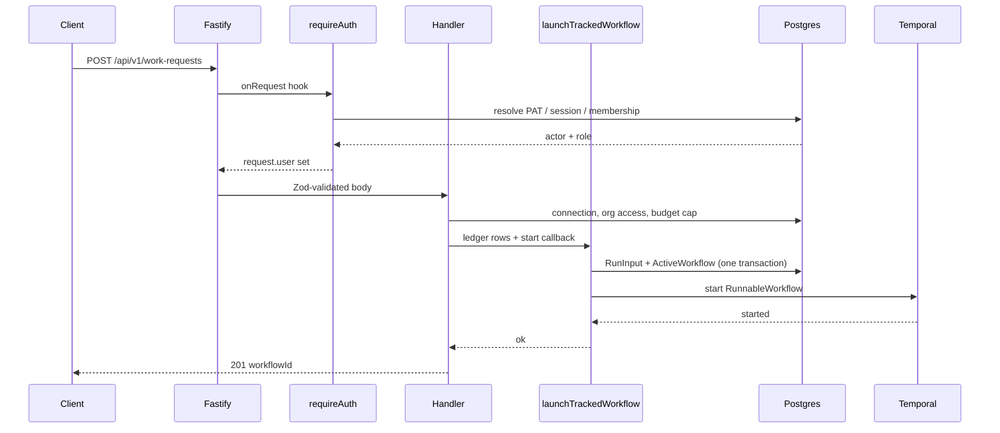

# @auto-swe/gateway — Fastify HTTP API

> Indexed at commit `b1d8930` on 2026-09-08 · [view on GitHub](https://github.com/yorch/auto-swe/tree/b1d8930)

## Relevant source files

- [packages/gateway/package.json](https://github.com/yorch/auto-swe/blob/b1d8930/packages/gateway/package.json)
- [packages/gateway/src/index.ts](https://github.com/yorch/auto-swe/blob/b1d8930/packages/gateway/src/index.ts)
- [packages/gateway/src/plugins/prisma.ts](https://github.com/yorch/auto-swe/blob/b1d8930/packages/gateway/src/plugins/prisma.ts)
- [packages/gateway/src/plugins/temporal.ts](https://github.com/yorch/auto-swe/blob/b1d8930/packages/gateway/src/plugins/temporal.ts)
- [packages/gateway/src/plugins/auth.ts](https://github.com/yorch/auto-swe/blob/b1d8930/packages/gateway/src/plugins/auth.ts)
- [packages/gateway/src/lib/workflowLaunch.ts](https://github.com/yorch/auto-swe/blob/b1d8930/packages/gateway/src/lib/workflowLaunch.ts)
- [packages/gateway/src/lib/env.ts](https://github.com/yorch/auto-swe/blob/b1d8930/packages/gateway/src/lib/env.ts)
- [packages/gateway/src/lib/telemetry.ts](https://github.com/yorch/auto-swe/blob/b1d8930/packages/gateway/src/lib/telemetry.ts)
- [packages/gateway/src/lib/pagination.ts](https://github.com/yorch/auto-swe/blob/b1d8930/packages/gateway/src/lib/pagination.ts)
- [packages/gateway/src/lib/queryParams.ts](https://github.com/yorch/auto-swe/blob/b1d8930/packages/gateway/src/lib/queryParams.ts)
- [packages/gateway/src/lib/auditLog.ts](https://github.com/yorch/auto-swe/blob/b1d8930/packages/gateway/src/lib/auditLog.ts)
- [packages/gateway/src/lib/platformAdminScope.ts](https://github.com/yorch/auto-swe/blob/b1d8930/packages/gateway/src/lib/platformAdminScope.ts)
- [packages/gateway/src/lib/runVisibility.ts](https://github.com/yorch/auto-swe/blob/b1d8930/packages/gateway/src/lib/runVisibility.ts)
- [packages/gateway/src/lib/idempotency.ts](https://github.com/yorch/auto-swe/blob/b1d8930/packages/gateway/src/lib/idempotency.ts)
- [packages/gateway/src/lib/systemConfigService.ts](https://github.com/yorch/auto-swe/blob/b1d8930/packages/gateway/src/lib/systemConfigService.ts)
- [packages/gateway/src/lib/configSettingsService.ts](https://github.com/yorch/auto-swe/blob/b1d8930/packages/gateway/src/lib/configSettingsService.ts)
- [packages/gateway/src/lib/agentLibraryService.ts](https://github.com/yorch/auto-swe/blob/b1d8930/packages/gateway/src/lib/agentLibraryService.ts)
- [packages/gateway/src/lib/hitlResolve.ts](https://github.com/yorch/auto-swe/blob/b1d8930/packages/gateway/src/lib/hitlResolve.ts)
- [packages/gateway/src/routes/workRequests.ts](https://github.com/yorch/auto-swe/blob/b1d8930/packages/gateway/src/routes/workRequests.ts)
- [packages/gateway/src/routes/workflowProjections.ts](https://github.com/yorch/auto-swe/blob/b1d8930/packages/gateway/src/routes/workflowProjections.ts)
- [packages/gateway/src/scripts/provisionAuthAdmin.ts](https://github.com/yorch/auto-swe/blob/b1d8930/packages/gateway/src/scripts/provisionAuthAdmin.ts)
- [packages/gateway/Dockerfile](https://github.com/yorch/auto-swe/blob/b1d8930/packages/gateway/Dockerfile)

## Overview

`@auto-swe/gateway` is the platform's only HTTP surface. It is a Fastify 5 server that authenticates every caller, enforces role-based and tenant-scoped access, validates request and response bodies with Zod, reads and writes the Postgres schema through the shared Prisma singleton, and starts and signals Temporal workflows on the `engineering-workflow` task queue. The web dashboard, the `auto-swe` CLI, GitHub webhooks, and Slack interactivity all enter the system through this one process.

The package is deliberately thin at the edge and thick in the middle. Route modules under `src/routes/` own the wire contract — path, schema, status codes, and the RBAC hook — while the substantive logic lives in service modules under `src/lib/` that take a `PrismaClient` argument and have no Fastify coupling. Thirty-five route modules register over two hundred endpoint handlers under the `/api/v1` prefix, and three Fastify plugins decorate the server instance with the three capabilities every route needs: `prisma`, `temporal`, and `auth` ([packages/gateway/src/index.ts#L130-L132](https://github.com/yorch/auto-swe/blob/b1d8930/packages/gateway/src/index.ts#L130-L132)).

Sources: [packages/gateway/package.json:L1-L48](https://github.com/yorch/auto-swe/blob/b1d8930/packages/gateway/package.json#L1-L48) [packages/gateway/src/index.ts:L336-L408](https://github.com/yorch/auto-swe/blob/b1d8930/packages/gateway/src/index.ts#L336-L408)

## Architecture

```mermaid
flowchart LR
    subgraph Bootstrap["src/index.ts"]
        Boot[start]
    end

    subgraph Plugins["src/plugins"]
        PrismaP[prisma]
        TemporalP[temporal]
        AuthP[auth]
    end

    subgraph Routes["src/routes — 35 modules"]
        RouteMod[route module]
    end

    subgraph Services["src/lib"]
        Svc[service modules]
        Launch[workflowLaunch]
    end

    Boot --> PrismaP
    Boot --> TemporalP
    Boot --> AuthP
    Boot --> RouteMod

    RouteMod -->|requireAuth hook| AuthP
    RouteMod --> Svc
    RouteMod --> Launch
    Svc -.fastify.prisma.-> PrismaP
    Launch -.fastify.prisma.-> PrismaP
    Launch -.fastify.temporal.-> TemporalP

    PrismaP -.-> DB[(Postgres)]
    TemporalP -.-> Temporal[/Temporal/]
```

`start()` registers the three plugins before any route module, so by the time a route's `FastifyPluginAsync` runs, `fastify.prisma`, `fastify.temporal`, and `fastify.auth` are all decorated on the instance. Route modules never construct their own clients; they reach the shared ones through the instance and delegate real work to `src/lib` services and to `launchTrackedWorkflow`.

Sources: [packages/gateway/src/index.ts:L68-L136](https://github.com/yorch/auto-swe/blob/b1d8930/packages/gateway/src/index.ts#L68-L136) [packages/gateway/src/plugins/prisma.ts:L1-L32](https://github.com/yorch/auto-swe/blob/b1d8930/packages/gateway/src/plugins/prisma.ts#L1-L32)

## Module Layout

| Module | Path | Responsibility |
| ------ | ---- | -------------- |
| Bootstrap | [`src/index.ts`](https://github.com/yorch/auto-swe/blob/b1d8930/packages/gateway/src/index.ts) | Telemetry init, plugin order, built-in sync, schedule sync, error handler, route registration, graceful shutdown |
| `prisma` plugin | [`src/plugins/prisma.ts`](https://github.com/yorch/auto-swe/blob/b1d8930/packages/gateway/src/plugins/prisma.ts) | Connects and decorates the shared `PrismaClient`; disconnects on close |
| `temporal` plugin | [`src/plugins/temporal.ts`](https://github.com/yorch/auto-swe/blob/b1d8930/packages/gateway/src/plugins/temporal.ts) | Temporal `Client` + `ScheduleClient`; every start, signal, cancel, and schedule reconciliation |
| `auth` plugin | [`src/plugins/auth.ts`](https://github.com/yorch/auto-swe/blob/b1d8930/packages/gateway/src/plugins/auth.ts) | JSON Web Token signing and verification, personal-access-token hashing, the `requireAuth` RBAC hook |
| Route modules | [`src/routes/`](https://github.com/yorch/auto-swe/tree/b1d8930/packages/gateway/src/routes) | 35 `FastifyPluginAsync` modules, one per resource family |
| Config services | [`src/lib/systemConfigService.ts`](https://github.com/yorch/auto-swe/blob/b1d8930/packages/gateway/src/lib/systemConfigService.ts), [`configSettingsService.ts`](https://github.com/yorch/auto-swe/blob/b1d8930/packages/gateway/src/lib/configSettingsService.ts) | Singleton integration tables and the setting registry's read/write/permission surface |
| Library services | [`agentLibraryService.ts`](https://github.com/yorch/auto-swe/blob/b1d8930/packages/gateway/src/lib/agentLibraryService.ts), [`skillLibraryService.ts`](https://github.com/yorch/auto-swe/blob/b1d8930/packages/gateway/src/lib/skillLibraryService.ts), [`credentialService.ts`](https://github.com/yorch/auto-swe/blob/b1d8930/packages/gateway/src/lib/credentialService.ts), [`bundleService.ts`](https://github.com/yorch/auto-swe/blob/b1d8930/packages/gateway/src/lib/bundleService.ts) | Versioning, content scanning, redaction, and import/export for library entities |
| Launch + governance | [`workflowLaunch.ts`](https://github.com/yorch/auto-swe/blob/b1d8930/packages/gateway/src/lib/workflowLaunch.ts), [`hitlResolve.ts`](https://github.com/yorch/auto-swe/blob/b1d8930/packages/gateway/src/lib/hitlResolve.ts), [`runVisibility.ts`](https://github.com/yorch/auto-swe/blob/b1d8930/packages/gateway/src/lib/runVisibility.ts) | Ledger-then-start launching, human-in-the-loop resolution, tenant visibility predicates |
| Cross-cutting helpers | [`auditLog.ts`](https://github.com/yorch/auto-swe/blob/b1d8930/packages/gateway/src/lib/auditLog.ts), [`pagination.ts`](https://github.com/yorch/auto-swe/blob/b1d8930/packages/gateway/src/lib/pagination.ts), [`queryParams.ts`](https://github.com/yorch/auto-swe/blob/b1d8930/packages/gateway/src/lib/queryParams.ts), [`idempotency.ts`](https://github.com/yorch/auto-swe/blob/b1d8930/packages/gateway/src/lib/idempotency.ts), [`platformAdminScope.ts`](https://github.com/yorch/auto-swe/blob/b1d8930/packages/gateway/src/lib/platformAdminScope.ts) | Audit rows, bounded pagination schemas, boolean query params, deterministic workflow IDs, scoped cross-tenant reads |
| Provisioning script | [`src/scripts/provisionAuthAdmin.ts`](https://github.com/yorch/auto-swe/blob/b1d8930/packages/gateway/src/scripts/provisionAuthAdmin.ts) | Idempotently creates the seeded admin's better-auth credential account |

Sources: [packages/gateway/src/index.ts:L1-L66](https://github.com/yorch/auto-swe/blob/b1d8930/packages/gateway/src/index.ts#L1-L66) [packages/gateway/src/lib/workflowLaunch.ts:L1-L52](https://github.com/yorch/auto-swe/blob/b1d8930/packages/gateway/src/lib/workflowLaunch.ts#L1-L52)

## Key Components

### Server bootstrap

`start()` runs a fixed sequence before the listener opens. OpenTelemetry is initialized at module scope, above the Fastify import, so the HTTP and Fastify auto-instrumentations can patch before any server object exists ([packages/gateway/src/index.ts#L1-L5](https://github.com/yorch/auto-swe/blob/b1d8930/packages/gateway/src/index.ts#L1-L5)). Inside `start()`, `assertEncryptionKeyConfigured()` fails the boot when `CONFIG_ENCRYPTION_KEY` is missing, because every database-stored secret passes through that key and a gateway without it would serve errors on exactly the admin pages needed to bootstrap a deployment. `initAuth()` follows, reading OAuth credentials from the database once — which is why changing those credentials requires a restart.

Sources: [packages/gateway/src/index.ts:L1-L78](https://github.com/yorch/auto-swe/blob/b1d8930/packages/gateway/src/index.ts#L1-L78) [packages/gateway/src/lib/telemetry.ts:L1-L14](https://github.com/yorch/auto-swe/blob/b1d8930/packages/gateway/src/lib/telemetry.ts#L1-L14)

### Plugin registration order

Registration order is load-bearing. The Zod validator and serializer compilers are set first, then an `onRoute` hook injects a permissive `z.any()` 200 response schema into any route that declares none — a guard against `fast-json-stringify` silently stripping undeclared response fields ([packages/gateway/src/index.ts#L87-L91](https://github.com/yorch/auto-swe/blob/b1d8930/packages/gateway/src/index.ts#L87-L91)). Then come CORS with an explicit method list, `fastify-raw-body` in non-global mode for per-route HMAC verification, a custom `application/x-www-form-urlencoded` parser that the social sign-in buttons and Slack slash commands both depend on, cookies, and a global rate limit of 200 requests per minute. Only after all of that do `prismaPlugin`, `temporalPlugin`, and `authPlugin` register.

Sources: [packages/gateway/src/index.ts:L80-L132](https://github.com/yorch/auto-swe/blob/b1d8930/packages/gateway/src/index.ts#L80-L132)

### The fastify-plugin convention

Every extension that must decorate the root instance is wrapped in `fastify-plugin`, which suppresses Fastify's default encapsulation so the decoration is visible to sibling plugins and to all later-registered routes. Each wrapper declares a `fastify: '5.x'` version range and a `name`, and each plugin augments the `FastifyInstance` interface through TypeScript declaration merging so `fastify.prisma`, `fastify.temporal`, and `fastify.auth` are typed at every call site ([packages/gateway/src/plugins/prisma.ts#L6-L10](https://github.com/yorch/auto-swe/blob/b1d8930/packages/gateway/src/plugins/prisma.ts#L6-L10)). The Prisma plugin deliberately decorates the shared singleton from `@auto-swe/shared/db` rather than constructing a second client: the tenant guard is applied once in that factory, and a local `new PrismaClient()` would be both unguarded and a second connection pool in the same process.

Route modules, by contrast, are plain `FastifyPluginAsync` values registered with a `prefix` and are *not* wrapped — encapsulation is what keeps each module's hooks and schemas local to its own routes.

Sources: [packages/gateway/src/plugins/prisma.ts:L12-L32](https://github.com/yorch/auto-swe/blob/b1d8930/packages/gateway/src/plugins/prisma.ts#L12-L32) [packages/gateway/src/plugins/auth.ts:L141-L187](https://github.com/yorch/auto-swe/blob/b1d8930/packages/gateway/src/plugins/auth.ts#L141-L187) [packages/gateway/src/plugins/temporal.ts:L140-L145](https://github.com/yorch/auto-swe/blob/b1d8930/packages/gateway/src/plugins/temporal.ts#L140-L145)

### Zod validation via fastify-type-provider-zod

Routes opt into typed schemas by calling `fastify.withTypeProvider<ZodTypeProvider>()` at the top of the plugin body and registering handlers on the returned instance, which infers `request.body`, `request.params`, and `request.querystring` types directly from the Zod schemas ([packages/gateway/src/routes/workRequests.ts#L328-L329](https://github.com/yorch/auto-swe/blob/b1d8930/packages/gateway/src/routes/workRequests.ts#L328-L329)). Two shared helpers keep query parsing uniform: `paginationQuery()` builds a bounded `{ limit, offset }` schema with per-route caps, and `booleanQueryParam()` accepts only the literal strings `true` and `false`, because `z.coerce.boolean()` is `Boolean(input)` and would silently turn `?flag=false` into `true`.

Shared response shapes live in `workflowProjections.ts`, which both the workflow-templates and workflow-runs routes import so the `WorkflowRunSummary` wire shape cannot drift between them.

Sources: [packages/gateway/src/lib/pagination.ts:L1-L10](https://github.com/yorch/auto-swe/blob/b1d8930/packages/gateway/src/lib/pagination.ts#L1-L10) [packages/gateway/src/lib/queryParams.ts:L1-L29](https://github.com/yorch/auto-swe/blob/b1d8930/packages/gateway/src/lib/queryParams.ts#L1-L29) [packages/gateway/src/routes/workflowProjections.ts:L1-L20](https://github.com/yorch/auto-swe/blob/b1d8930/packages/gateway/src/routes/workflowProjections.ts#L1-L20)

### The service layer under src/lib

Service modules take `prisma` as a parameter and return data plus enough prior state for the caller to write an audit entry, leaving HTTP status decisions and role checks in the route. `systemConfigService.ts` covers the singleton integration tables with a uniform triple per section — a masked read, a partial update that seals secrets into AES-GCM envelope columns, and a live connection test — and secret fields are write-only, so reads return only a `lastFour`. `agentLibraryService.ts` and `skillLibraryService.ts` apply the same shape to versioned library content, including the prompt-injection scan and the `isVerified` reset that follows a prompt edit.

Three helpers carry policy that would otherwise be re-implemented per route. `runVisibility.ts` builds the Prisma `where` predicate that decides which runs a non-admin may see, derived from template ownership and team membership. `platformAdminScope.ts` wraps the admin branch of a listing in `runUnscoped` so a deliberate cross-tenant read is distinguishable from a forgotten filter, keeping the tenant guard live for everyone else. `auditLog.ts` writes one `ConfigAuditLog` row per mutation over a closed union of twenty-five entity types.

Sources: [packages/gateway/src/lib/systemConfigService.ts:L1-L40](https://github.com/yorch/auto-swe/blob/b1d8930/packages/gateway/src/lib/systemConfigService.ts#L1-L40) [packages/gateway/src/lib/agentLibraryService.ts:L1-L30](https://github.com/yorch/auto-swe/blob/b1d8930/packages/gateway/src/lib/agentLibraryService.ts#L1-L30) [packages/gateway/src/lib/runVisibility.ts:L1-L46](https://github.com/yorch/auto-swe/blob/b1d8930/packages/gateway/src/lib/runVisibility.ts#L1-L46) [packages/gateway/src/lib/platformAdminScope.ts:L1-L24](https://github.com/yorch/auto-swe/blob/b1d8930/packages/gateway/src/lib/platformAdminScope.ts#L1-L24) [packages/gateway/src/lib/auditLog.ts:L1-L49](https://github.com/yorch/auto-swe/blob/b1d8930/packages/gateway/src/lib/auditLog.ts#L1-L49)

### Talking to Temporal

The `temporal` plugin opens one `Connection` at boot, builds a `Client` and a `ScheduleClient` over it, and decorates the instance with a flat object of roughly forty methods. Starts are typed one per workflow — `startRunnableWorkflow`, `startEpicWorkflow`, `startChannelAssistant`, `startEvalRunWorkflow`, `startConsolidationWorkflow`, `startReembedMemory`, `startRepoDependencyInference` — and all target the `engineering-workflow` task queue with a caller-supplied workflow ID ([packages/gateway/src/plugins/temporal.ts#L723-L732](https://github.com/yorch/auto-swe/blob/b1d8930/packages/gateway/src/plugins/temporal.ts#L723-L732)). Two methods are request/response rather than fire-and-forget: `generateWorkflowSpec` and `explainWorkflowSpec` use `client.workflow.execute` and await the result, because model binding happens in the worker.

Schedules go through one shared `upsertSchedule` reconciliation. It calls `describe()` behind `scheduleExists`, which distinguishes a missing schedule from an unreachable Temporal by error class — treating every error as not-found once made an outage look like a clean slate, so deletes reported success while live schedules kept firing. Existing schedules are updated in place; new ones are created with `ScheduleOverlapPolicy.SKIP`, dropping a fire that arrives while the previous run is still in flight.

Sources: [packages/gateway/src/plugins/temporal.ts:L159-L238](https://github.com/yorch/auto-swe/blob/b1d8930/packages/gateway/src/plugins/temporal.ts#L159-L238) [packages/gateway/src/plugins/temporal.ts:L241-L294](https://github.com/yorch/auto-swe/blob/b1d8930/packages/gateway/src/plugins/temporal.ts#L241-L294)

### launchTrackedWorkflow — ledger before start

Six route modules start tracked runs, and all six go through `launchTrackedWorkflow` rather than calling the Temporal decorator directly. It writes the `RunInput` and `ActiveWorkflow` rows in one Prisma transaction, then invokes the caller's `start()` callback, and deletes the rows if the start throws.

The ordering is the point. Starting Temporal first meant that a failed database write left a workflow burning budget, pushing branches, and opening pull requests with no row to attribute it to. The reverse orphan — rows with no workflow — is inert, visible in the dashboard, and operator-recoverable. Writing first also makes deduplication atomic: the unique index on `ActiveWorkflow.temporalWorkflowId` decides the winner between two concurrent submissions, where a read-then-start sequence had a time-of-check-to-time-of-use gap. A unique-constraint violation and a Temporal `WorkflowExecutionAlreadyStartedError` both surface as `{ ok: false, reason: 'DUPLICATE' }`, which callers map to a 409. Compensation is best-effort and never throws, because leaving the rows behind is the recoverable failure and the caller still needs the original start error.

For triggers with no intrinsic key — `POST /workflow-templates/:id/runs` and `POST /webhooks/:token` accept arbitrary payloads — `idempotency.ts` derives a deterministic workflow ID from an opt-in `Idempotency-Key` header, hashed and scoped so the same key against two templates cannot collide.

Sources: [packages/gateway/src/lib/workflowLaunch.ts:L86-L179](https://github.com/yorch/auto-swe/blob/b1d8930/packages/gateway/src/lib/workflowLaunch.ts#L86-L179) [packages/gateway/src/routes/workRequests.ts:L533-L575](https://github.com/yorch/auto-swe/blob/b1d8930/packages/gateway/src/routes/workRequests.ts#L533-L575) [packages/gateway/src/lib/idempotency.ts:L1-L52](https://github.com/yorch/auto-swe/blob/b1d8930/packages/gateway/src/lib/idempotency.ts#L1-L52)

### Startup-time seeding and schedule sync

After the plugins land and before routes register, `syncBuiltins(app.prisma)` seeds and idempotently updates the platform's built-in reference data: scanner patterns and autonomy policies as core defaults, plus workflow templates, channel templates, skills, agents, and eval rubrics as software-engineering starter content. Every deploy therefore picks up new or changed built-ins without a manual step.

Four Temporal Schedules are then reconciled against whatever configuration is in the database — lesson consolidation, repository-dependency scanning, the nightly eval regression, and eval re-validation. All four are fired without `await` and each has a `.catch()` that logs a warning, because a Temporal connectivity failure at startup must not crash the gateway; an admin can re-save from the dashboard once Temporal is reachable.

Sources: [packages/gateway/src/index.ts:L134-L166](https://github.com/yorch/auto-swe/blob/b1d8930/packages/gateway/src/index.ts#L134-L166) [packages/shared/src/lib/syncBuiltins.ts:L170-L190](https://github.com/yorch/auto-swe/blob/b1d8930/packages/shared/src/lib/syncBuiltins.ts#L170-L190)

### Error handling and graceful shutdown

One global error handler logs the full error server-side and returns `{ error: { code, message } }`. Messages on 4xx responses pass through — validation and authorization text is intentional — while any status at or above 500 is replaced with a generic string, since library and database constraint text leaks internals. Shutdown is guarded against double entry: `SIGTERM` and `SIGINT` both call `app.close()`, which drains in-flight requests and runs plugin `onClose` hooks including the Prisma disconnect, and only then flushes OpenTelemetry.

Sources: [packages/gateway/src/index.ts:L168-L183](https://github.com/yorch/auto-swe/blob/b1d8930/packages/gateway/src/index.ts#L168-L183) [packages/gateway/src/index.ts:L410-L434](https://github.com/yorch/auto-swe/blob/b1d8930/packages/gateway/src/index.ts#L410-L434)

## Data Flow



A work-request submission is the canonical path. The `requireAuth` hook resolves the caller before the handler body runs, the handler performs resource, organization, and budget checks against Postgres, and only then hands both the ledger rows and a start closure to `launchTrackedWorkflow`. A unique-index conflict on either side returns 409 instead of 201, and a Temporal start failure rolls the ledger rows back.

Sources: [packages/gateway/src/routes/workRequests.ts:L384-L470](https://github.com/yorch/auto-swe/blob/b1d8930/packages/gateway/src/routes/workRequests.ts#L384-L470) [packages/gateway/src/plugins/auth.ts:L364-L400](https://github.com/yorch/auto-swe/blob/b1d8930/packages/gateway/src/plugins/auth.ts#L364-L400)

## Configuration & Extension Points

The gateway reads almost all of its configuration from the database, through resolvers in `@auto-swe/shared`. The environment variables it does read directly are bootstrap and deploy-time knobs only.

| Setting | Type | Default | Purpose |
| ------- | ---- | ------- | ------- |
| `PORT` | number | `8080` | Listen port; non-numeric values fall back to the default |
| `CORS_ORIGIN` | comma-separated list | `http://localhost:3000` | Allowed browser origins; the first entry is also the default client origin |
| `CONFIG_ENCRYPTION_KEY` | base64, 32 bytes | none — required | AES-256-GCM key for every database-stored secret; boot fails without it |
| `JWT_PRIVATE_KEY_PATH` / `JWT_PUBLIC_KEY_PATH` | path | unset | RS256 key pair; when unset the gateway uses HS256 with `JWT_SECRET` |
| `JWT_SECRET` | string | dev fallback | HS256 signing secret; the built-in fallback is refused unless `NODE_ENV` is `development` or `test` |
| `SESSION_CACHE_TTL_MS` | number | `60000` | Session-revocation lag window for the in-memory session cache |
| `BUNDLE_TRUSTED_KEYS` | JSON array | `[]` | Bundle signature trust anchors; deliberately environment-sourced so database write access cannot mint trust |
| `BUNDLE_ALLOW_UNVERIFIED` | `'1'` flag | deny | Whether unverified bundles may install |
| `BUNDLE_MAX_BYTES` | number | service default | Size cap on install-from-URL fetches |

Everything else — GitHub, Slack, storage, tracker, knowledge-base, Figma, OAuth credentials, workflow defaults, and the setting registry — is stored encrypted in Postgres and managed through the admin routes.

The Dockerfile is a three-stage Yarn 4 build (builder, prod-deps, runtime) that provisions a Corepack-free `yarn` shim in each stage that needs one, generates the Prisma client during the build, and copies only `dist` output and production `node_modules` into the runtime image. The entrypoint runs `prisma migrate deploy` under a 120-second timeout before handing off to the container command, so a hung database aborts boot rather than silently appearing to succeed.

Sources: [packages/gateway/src/lib/env.ts:L1-L22](https://github.com/yorch/auto-swe/blob/b1d8930/packages/gateway/src/lib/env.ts#L1-L22) [packages/gateway/src/plugins/auth.ts:L94-L139](https://github.com/yorch/auto-swe/blob/b1d8930/packages/gateway/src/plugins/auth.ts#L94-L139) [packages/gateway/src/lib/bundleTrust.ts:L1-L33](https://github.com/yorch/auto-swe/blob/b1d8930/packages/gateway/src/lib/bundleTrust.ts#L1-L33) [packages/gateway/Dockerfile:L1-L159](https://github.com/yorch/auto-swe/blob/b1d8930/packages/gateway/Dockerfile#L1-L159)

## Detail Pages

**HTTP routes.** The [route catalog](./3.1-http-routes.md) enumerates all thirty-five route modules and their endpoints, the `/api/v1/platform` prefix and its deprecated `/api/v1/admin` alias registered alongside it, the resource families that carry both a platform-scoped and a team-scoped variant, and the request and response schemas each module declares. It also covers the pagination and projection conventions that keep list responses uniform.

**Authentication and role-based access control.** The [auth page](./3.2-authentication-and-rbac.md) covers the three credential paths the gateway accepts — `ats_`-prefixed personal access tokens, JSON Web Tokens, and better-auth browser session cookies — and how each is normalized into the same `JwtPayload` so downstream role checks behave identically. It details the `requireAuth` hook's platform, team, and organization role ladders, the audience claims that keep an API bearer from being replayed as OAuth state, the in-memory session cache and its invalidation on sign-out, and the session-token bridge that exchanges a browser session for a short-lived token.

**GitHub integration and inbound webhooks.** The [webhooks page](./3.3-github-and-webhooks.md) covers HMAC signature verification over the raw body, the GitHub App installation-token cache and its personal-access-token fallback, the pull-request and continuous-integration events that signal running workflows, the Slack signature and replay window, and the shared human-in-the-loop resolve core that the inbox API and Slack button interactions both call. It also covers `isTerminalSignalError`, which decides whether a failed signal should roll back the database write that preceded it.

## Related Pages

- Repository structure: [1. Repository Structure](./1-repository-structure.md)
- Shared library: [2. @auto-swe/shared](./2-shared-library.md)
- Temporal worker: [4. @auto-swe/worker](./4-temporal-worker.md)
- Web dashboard: [5. @auto-swe/web](./5-web-dashboard.md)
- Command-line interface: [6. @auto-swe/cli](./6-cli.md)
- Bundle authoring SDK: [7. @auto-swe/sdk](./7-bundle-sdk.md)
- Detail: [3.1 HTTP Routes](./3.1-http-routes.md)
- Detail: [3.2 Authentication and RBAC](./3.2-authentication-and-rbac.md)
- Detail: [3.3 GitHub and Webhooks](./3.3-github-and-webhooks.md)
