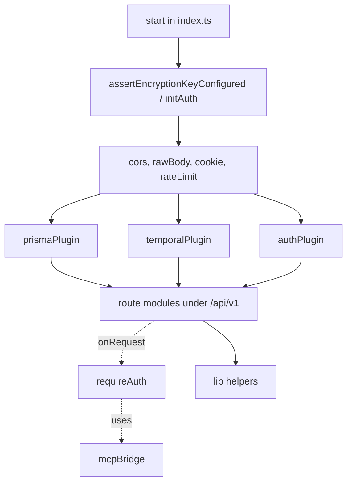
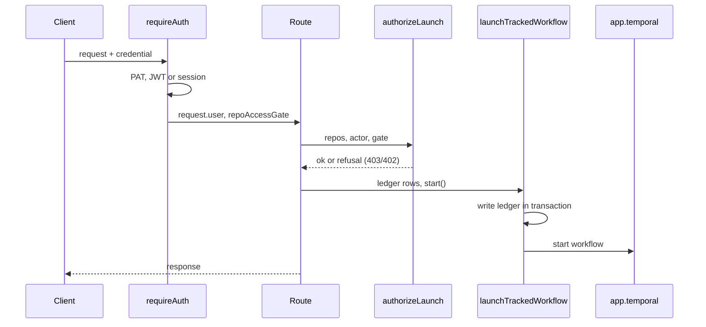

# Gateway API (Fastify 5)

> Indexed at commit `d0a90fb5` on 2026-10-06 · [view on GitHub](https://github.com/yorch/auto-swe/tree/d0a90fb5)

## Relevant source files

- [packages/gateway/src/index.ts](https://github.com/yorch/auto-swe/blob/d0a90fb5/packages/gateway/src/index.ts)
- [packages/gateway/src/plugins/auth.ts](https://github.com/yorch/auto-swe/blob/d0a90fb5/packages/gateway/src/plugins/auth.ts)
- [packages/gateway/src/plugins/prisma.ts](https://github.com/yorch/auto-swe/blob/d0a90fb5/packages/gateway/src/plugins/prisma.ts)
- [packages/gateway/src/plugins/temporal.ts](https://github.com/yorch/auto-swe/blob/d0a90fb5/packages/gateway/src/plugins/temporal.ts)
- [packages/gateway/src/lib/env.ts](https://github.com/yorch/auto-swe/blob/d0a90fb5/packages/gateway/src/lib/env.ts)
- [packages/gateway/src/lib/httpErrors.ts](https://github.com/yorch/auto-swe/blob/d0a90fb5/packages/gateway/src/lib/httpErrors.ts)
- [packages/gateway/src/lib/idempotency.ts](https://github.com/yorch/auto-swe/blob/d0a90fb5/packages/gateway/src/lib/idempotency.ts)
- [packages/gateway/src/lib/tenantScope.ts](https://github.com/yorch/auto-swe/blob/d0a90fb5/packages/gateway/src/lib/tenantScope.ts)
- [packages/gateway/src/lib/launchAuthorization.ts](https://github.com/yorch/auto-swe/blob/d0a90fb5/packages/gateway/src/lib/launchAuthorization.ts)
- [packages/gateway/src/lib/workflowLaunch.ts](https://github.com/yorch/auto-swe/blob/d0a90fb5/packages/gateway/src/lib/workflowLaunch.ts)
- [packages/gateway/src/lib/auditLog.ts](https://github.com/yorch/auto-swe/blob/d0a90fb5/packages/gateway/src/lib/auditLog.ts)
- [packages/gateway/src/lib/trustProxy.ts](https://github.com/yorch/auto-swe/blob/d0a90fb5/packages/gateway/src/lib/trustProxy.ts)
- [packages/gateway/src/lib/betterAuthHandler.ts](https://github.com/yorch/auto-swe/blob/d0a90fb5/packages/gateway/src/lib/betterAuthHandler.ts)
- [packages/gateway/src/lib/github.ts](https://github.com/yorch/auto-swe/blob/d0a90fb5/packages/gateway/src/lib/github.ts)
- [packages/gateway/src/lib/mcp/bridge.ts](https://github.com/yorch/auto-swe/blob/d0a90fb5/packages/gateway/src/lib/mcp/bridge.ts)
- [packages/gateway/package.json](https://github.com/yorch/auto-swe/blob/d0a90fb5/packages/gateway/package.json)

## Overview

The gateway is the HTTP Application Programming Interface (API) of auto-swe, built on Fastify 5 with Zod request validation. It authenticates browser sessions, personal access tokens (PATs) and Model Context Protocol (MCP) clients, enforces role-based access control (RBAC), and starts and signals Temporal workflows on behalf of callers. The package is ESM and declares `fastify` 5.12.5, `fastify-plugin`, `fastify-type-provider-zod`, `@temporalio/client` and `better-auth` as dependencies ([packages/gateway/package.json:L1-L57](https://github.com/yorch/auto-swe/blob/d0a90fb5/packages/gateway/package.json#L1-L57)).

The entry point [packages/gateway/src/index.ts](https://github.com/yorch/auto-swe/blob/d0a90fb5/packages/gateway/src/index.ts) is a single `start()` function that assembles the server in a fixed order: boot assertions, global plugins, three decorating plugins (`prisma`, `temporal`, `auth`), built-in data sync, schedule reconciliation, error handling, and route registration. Route modules live in `packages/gateway/src/routes/` and are covered by child pages; this page documents the composition root, the plugins, and the shared `lib/` helpers they rely on.

Sources: [packages/gateway/src/index.ts:L91-L422](https://github.com/yorch/auto-swe/blob/d0a90fb5/packages/gateway/src/index.ts#L91-L422) [packages/gateway/package.json:L1-L57](https://github.com/yorch/auto-swe/blob/d0a90fb5/packages/gateway/package.json#L1-L57)

## Architecture

```mermaid
flowchart TD
    Start[start in index.ts] --> Boot[assertEncryptionKeyConfigured / initAuth]
    Boot --> Global[cors, rawBody, cookie, rateLimit]
    Global --> Prisma[prismaPlugin]
    Global --> Temporal[temporalPlugin]
    Global --> Auth[authPlugin]
    Prisma --> Routes[route modules under /api/v1]
    Temporal --> Routes
    Auth --> Routes
    Routes -.onRequest.-> RA[requireAuth]
    RA -.uses.-> Bridge[mcpBridge]
    Routes --> Lib[lib helpers]
```

`start()` registers global Fastify plugins first, then the three decorating plugins that add `app.prisma`, `app.temporal` and `app.auth`. Route modules attach `requireAuth()` as an `onRequest` hook and reach shared behavior through `lib/` helpers such as `authorizeLaunch` and `launchTrackedWorkflow`. The MCP bridge is registered on the root instance so both `requireAuth` and the MCP route can reach it.

Sources: [packages/gateway/src/index.ts:L96-L154](https://github.com/yorch/auto-swe/blob/d0a90fb5/packages/gateway/src/index.ts#L96-L154) [packages/gateway/src/index.ts:L237-L243](https://github.com/yorch/auto-swe/blob/d0a90fb5/packages/gateway/src/index.ts#L237-L243)

## Module Layout

| Module | Path | Responsibility |
| ------ | ---- | -------------- |
| Composition root | `packages/gateway/src/index.ts` | Boot sequence, global hooks, route registration, graceful shutdown |
| `prismaPlugin` | `packages/gateway/src/plugins/prisma.ts` | Decorates `app.prisma` with the shared client |
| `temporalPlugin` | `packages/gateway/src/plugins/temporal.ts` | Decorates `app.temporal` with workflow and schedule helpers |
| `authPlugin` / `requireAuth` | `packages/gateway/src/plugins/auth.ts` | Token signing and verification, session and PAT auth, RBAC hook factory, rate-limit keys |
| Launch helpers | `packages/gateway/src/lib/launchAuthorization.ts`, `workflowLaunch.ts`, `idempotency.ts` | Single authorization decision, ledger-first workflow start, idempotent run IDs |
| Tenancy helpers | `packages/gateway/src/lib/tenantScope.ts`, `runVisibility.ts`, `orgAccess.ts` | Membership predicates, run visibility filters, org membership and budget checks |
| Better Auth and MCP | `packages/gateway/src/lib/betterAuthHandler.ts`, `lib/mcp/bridge.ts`, `lib/mcpOAuthGate.ts` | Browser sign-in routes, in-process MCP bridge, OAuth endpoint gate |
| Integration clients | `packages/gateway/src/lib/github.ts`, `slack.ts`, `credentialService.ts` | Webhook signature checks, Slack calls, provider credential handling |
| Small utilities | `packages/gateway/src/lib/env.ts`, `httpErrors.ts`, `trustProxy.ts`, `auditLog.ts` | Env parsing, error envelope, proxy trust, audit rows |

Sources: [packages/gateway/src/index.ts:L19-L89](https://github.com/yorch/auto-swe/blob/d0a90fb5/packages/gateway/src/index.ts#L19-L89) [packages/gateway/src/plugins/prisma.ts:L21-L32](https://github.com/yorch/auto-swe/blob/d0a90fb5/packages/gateway/src/plugins/prisma.ts#L21-L32)

## Key Components

### Boot sequence and global behavior

`start()` first calls `assertEncryptionKeyConfigured()` and `assertScheduledSweepsEnv()` so a missing key or a bad sweep value fails the boot rather than the first admin request, then `initMetrics()` and `await initAuth()` ([packages/gateway/src/index.ts#L96-L104](https://github.com/yorch/auto-swe/blob/d0a90fb5/packages/gateway/src/index.ts#L96-L104)). Fastify is created with `trustProxy` parsed from `TRUST_PROXY`; `parseTrustProxy` returns `false` by default, accepts `true` or a list of proxy IPs and CIDRs, and refuses a bare hop count ([packages/gateway/src/lib/trustProxy.ts:L21-L30](https://github.com/yorch/auto-swe/blob/d0a90fb5/packages/gateway/src/lib/trustProxy.ts#L21-L30)).

Validation and serialization use the Zod compilers, and an `onRoute` hook gives any route without a response schema a permissive `z.any()` 200 schema so `fast-json-stringify` cannot silently strip fields ([packages/gateway/src/index.ts#L108-L119](https://github.com/yorch/auto-swe/blob/d0a90fb5/packages/gateway/src/index.ts#L108-L119)). The global error handler returns `{ error: { code, message } }` and replaces any 5xx message with `Internal server error` ([packages/gateway/src/index.ts#L212-L221](https://github.com/yorch/auto-swe/blob/d0a90fb5/packages/gateway/src/index.ts#L212-L221)). Routes use `sendError` from [packages/gateway/src/lib/httpErrors.ts:L10-L18](https://github.com/yorch/auto-swe/blob/d0a90fb5/packages/gateway/src/lib/httpErrors.ts#L10-L18) to emit the same envelope.

Sources: [packages/gateway/src/index.ts:L96-L221](https://github.com/yorch/auto-swe/blob/d0a90fb5/packages/gateway/src/index.ts#L96-L221) [packages/gateway/src/lib/trustProxy.ts:L21-L38](https://github.com/yorch/auto-swe/blob/d0a90fb5/packages/gateway/src/lib/trustProxy.ts#L21-L38)

### Rate limiting

A global `@fastify/rate-limit` registration allows 200 requests per minute, keyed by `rateLimitKey` ([packages/gateway/src/index.ts#L141-L145](https://github.com/yorch/auto-swe/blob/d0a90fb5/packages/gateway/src/index.ts#L141-L145)). `rateLimitKey` buckets a request by user ID only when identity is already verified: a Bearer JWT whose signature checks, or a session cookie present in the session cache. PATs, unknown cookies and invalid tokens fall back to the client IP, so a client cannot mint fresh buckets with random tokens ([packages/gateway/src/plugins/auth.ts:L534-L570](https://github.com/yorch/auto-swe/blob/d0a90fb5/packages/gateway/src/plugins/auth.ts#L534-L570)).

Credential endpoints under `/api/auth/` get a stricter 20-per-minute per-IP limit, and anonymous OAuth client registration is capped at 10 per minute ([packages/gateway/src/lib/betterAuthHandler.ts:L108-L141](https://github.com/yorch/auto-swe/blob/d0a90fb5/packages/gateway/src/lib/betterAuthHandler.ts#L108-L141)).

Sources: [packages/gateway/src/plugins/auth.ts:L530-L570](https://github.com/yorch/auto-swe/blob/d0a90fb5/packages/gateway/src/plugins/auth.ts#L530-L570) [packages/gateway/src/lib/betterAuthHandler.ts:L119-L141](https://github.com/yorch/auto-swe/blob/d0a90fb5/packages/gateway/src/lib/betterAuthHandler.ts#L119-L141)

### prismaPlugin

`prismaPlugin` connects the shared `prisma` singleton from `@auto-swe/shared/db`, decorates the instance as `app.prisma`, and disconnects in an `onClose` hook. It deliberately does not construct a second client, because the tenant guard is applied once in the shared factory and a second client would be unguarded and open a second pool ([packages/gateway/src/plugins/prisma.ts:L12-L29](https://github.com/yorch/auto-swe/blob/d0a90fb5/packages/gateway/src/plugins/prisma.ts#L12-L29)).

Sources: [packages/gateway/src/plugins/prisma.ts:L1-L32](https://github.com/yorch/auto-swe/blob/d0a90fb5/packages/gateway/src/plugins/prisma.ts#L1-L32)

### temporalPlugin

`temporalPlugin` opens a Temporal `Connection`, a workflow `Client` and a `ScheduleClient`, and decorates `app.temporal` with typed helpers ([packages/gateway/src/plugins/temporal.ts:L306-L316](https://github.com/yorch/auto-swe/blob/d0a90fb5/packages/gateway/src/plugins/temporal.ts#L306-L316)). The surface covers starting workflows (`startRunnableWorkflow`, `startEpicWorkflow`, `startChannelAssistant`), signalling and cancelling, status checks (`isWorkflowRunning`, `workflowSettledStatus`), request/response workflow authoring (`generateWorkflowSpec`, `explainWorkflowSpec`), and `sync*Schedule` / `trigger*Now` methods ([packages/gateway/src/plugins/temporal.ts:L511-L1050](https://github.com/yorch/auto-swe/blob/d0a90fb5/packages/gateway/src/plugins/temporal.ts#L511-L1050)).

Schedules are reconciled by `upsertSchedule`: update in place if the schedule exists, otherwise create it with the `SKIP` overlap policy. `scheduleExists` distinguishes a missing schedule from an unreachable Temporal by error class, so an outage is never reported as "not scheduled" ([packages/gateway/src/plugins/temporal.ts:L449-L508](https://github.com/yorch/auto-swe/blob/d0a90fb5/packages/gateway/src/plugins/temporal.ts#L449-L508)). Fixed schedule IDs such as `auto-swe-run-reaper` and `auto-swe-model-discovery` are exported constants ([packages/gateway/src/plugins/temporal.ts:L33-L40](https://github.com/yorch/auto-swe/blob/d0a90fb5/packages/gateway/src/plugins/temporal.ts#L33-L40)).

Sources: [packages/gateway/src/plugins/temporal.ts:L306-L316](https://github.com/yorch/auto-swe/blob/d0a90fb5/packages/gateway/src/plugins/temporal.ts#L306-L316) [packages/gateway/src/plugins/temporal.ts:L449-L508](https://github.com/yorch/auto-swe/blob/d0a90fb5/packages/gateway/src/plugins/temporal.ts#L449-L508) [packages/gateway/src/plugins/temporal.ts:L1063-L1069](https://github.com/yorch/auto-swe/blob/d0a90fb5/packages/gateway/src/plugins/temporal.ts#L1063-L1069)

### authPlugin and requireAuth

`authPlugin` decorates `app.auth` with `signAccessToken`, `verifyAccessToken`, `verifyAccessTokenClaims`, `hashToken`, and the OAuth `state` pair `signOAuthState` / `verifyOAuthState`. Access tokens carry the audience `auto-swe:api` and OAuth state tokens `auto-swe:oauth-state`, so one class cannot be replayed as the other ([packages/gateway/src/plugins/auth.ts:L122-L126](https://github.com/yorch/auto-swe/blob/d0a90fb5/packages/gateway/src/plugins/auth.ts#L122-L126), [packages/gateway/src/plugins/auth.ts:L254-L311](https://github.com/yorch/auto-swe/blob/d0a90fb5/packages/gateway/src/plugins/auth.ts#L254-L311)). `verifyAccessToken` re-reads the user through a 30-second cache, so a demoted role takes effect and a deactivated user is rejected ([packages/gateway/src/plugins/auth.ts:L219-L250](https://github.com/yorch/auto-swe/blob/d0a90fb5/packages/gateway/src/plugins/auth.ts#L219-L250)).

`requireAuth(options)` returns an `onRequest` hook that tries credentials in order: the in-process MCP bridge header, then `Authorization: Bearer` (a PAT when prefixed `ats_`, otherwise a JWT), then the better-auth session cookie. It then resolves the repository-access gate config, and applies `requiredRole`, `requiredTeamRole` and `requiredOrgRole` checks; platform ADMINs bypass team and org checks ([packages/gateway/src/plugins/auth.ts:L656-L806](https://github.com/yorch/auto-swe/blob/d0a90fb5/packages/gateway/src/plugins/auth.ts#L656-L806)). PAT verification hashes the token, rejects revoked, expired or inactive-user tokens, and updates `lastUsedAt` without awaiting ([packages/gateway/src/plugins/auth.ts:L357-L381](https://github.com/yorch/auto-swe/blob/d0a90fb5/packages/gateway/src/plugins/auth.ts#L357-L381)). Session payloads are cached by cookie value for 60 seconds by default, capped at 2,000 entries ([packages/gateway/src/plugins/auth.ts:L394-L400](https://github.com/yorch/auto-swe/blob/d0a90fb5/packages/gateway/src/plugins/auth.ts#L394-L400)). Detail lives in the authentication page.

Sources: [packages/gateway/src/plugins/auth.ts:L656-L806](https://github.com/yorch/auto-swe/blob/d0a90fb5/packages/gateway/src/plugins/auth.ts#L656-L806) [packages/gateway/src/plugins/auth.ts:L254-L311](https://github.com/yorch/auto-swe/blob/d0a90fb5/packages/gateway/src/plugins/auth.ts#L254-L311) [packages/gateway/src/plugins/auth.ts:L357-L381](https://github.com/yorch/auto-swe/blob/d0a90fb5/packages/gateway/src/plugins/auth.ts#L357-L381)

### MCP bridge

`createMcpBridge` builds a bridge with a per-boot random secret held in a closure; `mcpBridgePlugin` decorates the root instance with it ([packages/gateway/src/lib/mcp/bridge.ts:L78-L165](https://github.com/yorch/auto-swe/blob/d0a90fb5/packages/gateway/src/lib/mcp/bridge.ts#L78-L165)). MCP tools call REST routes in-process through `bridge.get` and `bridge.post` under the header `x-auto-swe-mcp-bridge`. In `requireAuth`, `authenticateBridgedCall` accepts only calls with the exact secret, to routes that declare `config.mcpScope`, bearing a non-PAT MCP token whose scopes cover that route ([packages/gateway/src/plugins/auth.ts:L607-L654](https://github.com/yorch/auto-swe/blob/d0a90fb5/packages/gateway/src/plugins/auth.ts#L607-L654)). The full MCP surface is covered on its own page.

Sources: [packages/gateway/src/lib/mcp/bridge.ts:L24-L75](https://github.com/yorch/auto-swe/blob/d0a90fb5/packages/gateway/src/lib/mcp/bridge.ts#L24-L75) [packages/gateway/src/plugins/auth.ts:L588-L654](https://github.com/yorch/auto-swe/blob/d0a90fb5/packages/gateway/src/plugins/auth.ts#L588-L654)

### Launch authorization and workflow launch

`authorizeLaunch` is the one authorization decision every launch path takes. It runs `decideRepoAccess` per repository (403 on refusal), then org membership (403), then the org's monthly budget cap (402), and returns a decision without sending a response so HTTP routes and Slack views can render it their own way ([packages/gateway/src/lib/launchAuthorization.ts:L1-L24](https://github.com/yorch/auto-swe/blob/d0a90fb5/packages/gateway/src/lib/launchAuthorization.ts#L1-L24), [packages/gateway/src/lib/launchAuthorization.ts:L95-L165](https://github.com/yorch/auto-swe/blob/d0a90fb5/packages/gateway/src/lib/launchAuthorization.ts#L95-L165)).

`launchTrackedWorkflow` writes the ledger rows first, atomically in one transaction, and treats a unique-violation as the dedup gate firing. An optional `LaunchGuard` runs inside that transaction before any write, so an atomic check-then-insert such as a per-user cap is possible ([packages/gateway/src/lib/workflowLaunch.ts:L106-L135](https://github.com/yorch/auto-swe/blob/d0a90fb5/packages/gateway/src/lib/workflowLaunch.ts#L106-L135)). Generic triggers derive deterministic workflow IDs from a caller `Idempotency-Key`, hashed and scoped; the key is opt-in and capped at 255 characters ([packages/gateway/src/lib/idempotency.ts:L1-L40](https://github.com/yorch/auto-swe/blob/d0a90fb5/packages/gateway/src/lib/idempotency.ts#L1-L40)).

Sources: [packages/gateway/src/lib/launchAuthorization.ts:L95-L165](https://github.com/yorch/auto-swe/blob/d0a90fb5/packages/gateway/src/lib/launchAuthorization.ts#L95-L165) [packages/gateway/src/lib/workflowLaunch.ts:L106-L135](https://github.com/yorch/auto-swe/blob/d0a90fb5/packages/gateway/src/lib/workflowLaunch.ts#L106-L135) [packages/gateway/src/lib/idempotency.ts:L1-L40](https://github.com/yorch/auto-swe/blob/d0a90fb5/packages/gateway/src/lib/idempotency.ts#L1-L40)

### Tenancy and audit helpers

`tenantScope.ts` holds one definition of each membership predicate (`memberTeams`, `memberOrgs`) that call sites nest under a relation key; spreading them is wrong because the coverage test grades `where` clauses with the tenant guard and drops spreads ([packages/gateway/src/lib/tenantScope.ts:L1-L45](https://github.com/yorch/auto-swe/blob/d0a90fb5/packages/gateway/src/lib/tenantScope.ts#L1-L45)). `writeAuditLog` records `CREATE`, `UPDATE` and `DELETE` changes to `configAuditLog`, optionally on a transaction client so the entry commits with the change ([packages/gateway/src/lib/auditLog.ts:L43-L58](https://github.com/yorch/auto-swe/blob/d0a90fb5/packages/gateway/src/lib/auditLog.ts#L43-L58)).

Sources: [packages/gateway/src/lib/tenantScope.ts:L1-L45](https://github.com/yorch/auto-swe/blob/d0a90fb5/packages/gateway/src/lib/tenantScope.ts#L1-L45) [packages/gateway/src/lib/auditLog.ts:L43-L58](https://github.com/yorch/auto-swe/blob/d0a90fb5/packages/gateway/src/lib/auditLog.ts#L43-L58)

## Data Flow

```mermaid
sequenceDiagram
    participant Client
    participant Hook as requireAuth
    participant Route
    participant Authz as authorizeLaunch
    participant Launch as launchTrackedWorkflow
    participant Temporal as app.temporal

    Client->>Hook: request + credential
    Hook->>Hook: PAT, JWT or session
    Hook->>Route: request.user, repoAccessGate
    Route->>Authz: repos, actor, gate
    Authz-->>Route: ok or refusal (403/402)
    Route->>Launch: ledger rows, start()
    Launch->>Launch: write ledger in transaction
    Launch->>Temporal: start workflow
    Route-->>Client: response
```

A launch request passes `requireAuth`, which populates `request.user` and `request.repoAccessGate`. The route then asks `authorizeLaunch` for a decision and, on success, hands ledger rows and a `start` callback to `launchTrackedWorkflow`, which writes the ledger before calling Temporal.

Sources: [packages/gateway/src/plugins/auth.ts:L656-L723](https://github.com/yorch/auto-swe/blob/d0a90fb5/packages/gateway/src/plugins/auth.ts#L656-L723) [packages/gateway/src/lib/launchAuthorization.ts:L95-L118](https://github.com/yorch/auto-swe/blob/d0a90fb5/packages/gateway/src/lib/launchAuthorization.ts#L95-L118) [packages/gateway/src/lib/workflowLaunch.ts:L117-L135](https://github.com/yorch/auto-swe/blob/d0a90fb5/packages/gateway/src/lib/workflowLaunch.ts#L117-L135)

## Configuration & Extension Points

| Setting | Type | Default | Purpose |
| ------- | ---- | ------- | ------- |
| `PORT` | number | `8080` | Listen port; non-numeric values fall back to the default |
| `CORS_ORIGIN` | comma-separated string | `http://localhost:3000` | Allowed browser origins |
| `TRUST_PROXY` | `true`, `false`, or IP/CIDR list | `false` | Which peers may set forwarding headers |
| `SESSION_CACHE_TTL_MS` | number | `60000` | Session-revocation lag window |

Route modules extend the gateway by registering with a `prefix` in `start()`. Many admin modules are registered twice, under `/api/v1/platform` and a deprecated `/api/v1/admin` alias ([packages/gateway/src/index.ts:L339-L395](https://github.com/yorch/auto-swe/blob/d0a90fb5/packages/gateway/src/index.ts#L339-L395)). Routes opt in to MCP with `config.mcpScope` of `read` or `write` ([packages/gateway/src/plugins/auth.ts:L69-L75](https://github.com/yorch/auto-swe/blob/d0a90fb5/packages/gateway/src/plugins/auth.ts#L69-L75)).

Sources: [packages/gateway/src/lib/env.ts:L1-L22](https://github.com/yorch/auto-swe/blob/d0a90fb5/packages/gateway/src/lib/env.ts#L1-L22) [packages/gateway/src/plugins/auth.ts:L394-L395](https://github.com/yorch/auto-swe/blob/d0a90fb5/packages/gateway/src/plugins/auth.ts#L394-L395) [packages/gateway/src/index.ts:L309-L395](https://github.com/yorch/auto-swe/blob/d0a90fb5/packages/gateway/src/index.ts#L309-L395)

## Related Pages

- HTTP routes: [3.1 HTTP routes](./3.1-http-routes.md)
- Authentication and RBAC: [3.2 Authentication and RBAC](./3.2-authentication-and-rbac.md)
- GitHub and webhooks: [3.3 GitHub and webhooks](./3.3-github-and-webhooks.md)
- Repository access and credentials: [3.4 Repository access and credentials](./3.4-repository-access-and-credentials.md)
- MCP server and OAuth: [3.5 MCP server and OAuth](./3.5-mcp-server-and-oauth.md)
- Work views and PR lifecycle: [3.6 Work views and PR lifecycle](./3.6-work-views-and-pr-lifecycle.md)
