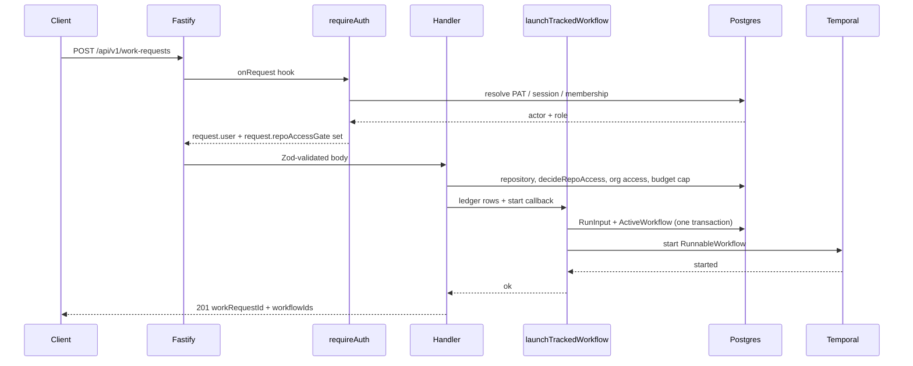

# @auto-swe/gateway — Fastify HTTP API

> Indexed at commit `ae416937` on 2026-10-03 · [view on GitHub](https://github.com/yorch/auto-swe/tree/ae416937)

## Relevant source files

- [packages/gateway/package.json](https://github.com/yorch/auto-swe/blob/ae416937/packages/gateway/package.json)
- [packages/gateway/src/index.ts](https://github.com/yorch/auto-swe/blob/ae416937/packages/gateway/src/index.ts)
- [packages/gateway/src/instrument.ts](https://github.com/yorch/auto-swe/blob/ae416937/packages/gateway/src/instrument.ts)
- [packages/gateway/src/plugins/prisma.ts](https://github.com/yorch/auto-swe/blob/ae416937/packages/gateway/src/plugins/prisma.ts)
- [packages/gateway/src/plugins/temporal.ts](https://github.com/yorch/auto-swe/blob/ae416937/packages/gateway/src/plugins/temporal.ts)
- [packages/gateway/src/plugins/auth.ts](https://github.com/yorch/auto-swe/blob/ae416937/packages/gateway/src/plugins/auth.ts)
- [packages/gateway/src/lib/betterAuth.ts](https://github.com/yorch/auto-swe/blob/ae416937/packages/gateway/src/lib/betterAuth.ts)
- [packages/gateway/src/lib/betterAuthHandler.ts](https://github.com/yorch/auto-swe/blob/ae416937/packages/gateway/src/lib/betterAuthHandler.ts)
- [packages/gateway/src/lib/canonicalPath.ts](https://github.com/yorch/auto-swe/blob/ae416937/packages/gateway/src/lib/canonicalPath.ts)
- [packages/gateway/src/lib/formBody.ts](https://github.com/yorch/auto-swe/blob/ae416937/packages/gateway/src/lib/formBody.ts)
- [packages/gateway/src/lib/trustProxy.ts](https://github.com/yorch/auto-swe/blob/ae416937/packages/gateway/src/lib/trustProxy.ts)
- [packages/gateway/src/lib/workflowLaunch.ts](https://github.com/yorch/auto-swe/blob/ae416937/packages/gateway/src/lib/workflowLaunch.ts)
- [packages/gateway/src/lib/idempotency.ts](https://github.com/yorch/auto-swe/blob/ae416937/packages/gateway/src/lib/idempotency.ts)
- [packages/gateway/src/lib/env.ts](https://github.com/yorch/auto-swe/blob/ae416937/packages/gateway/src/lib/env.ts)
- [packages/gateway/src/lib/telemetry.ts](https://github.com/yorch/auto-swe/blob/ae416937/packages/gateway/src/lib/telemetry.ts)
- [packages/gateway/src/lib/repoIdentityIndexCheck.ts](https://github.com/yorch/auto-swe/blob/ae416937/packages/gateway/src/lib/repoIdentityIndexCheck.ts)
- [packages/gateway/src/lib/pagination.ts](https://github.com/yorch/auto-swe/blob/ae416937/packages/gateway/src/lib/pagination.ts)
- [packages/gateway/src/lib/queryParams.ts](https://github.com/yorch/auto-swe/blob/ae416937/packages/gateway/src/lib/queryParams.ts)
- [packages/gateway/src/lib/mapLimited.ts](https://github.com/yorch/auto-swe/blob/ae416937/packages/gateway/src/lib/mapLimited.ts)
- [packages/gateway/src/lib/auditLog.ts](https://github.com/yorch/auto-swe/blob/ae416937/packages/gateway/src/lib/auditLog.ts)
- [packages/gateway/src/lib/platformAdminScope.ts](https://github.com/yorch/auto-swe/blob/ae416937/packages/gateway/src/lib/platformAdminScope.ts)
- [packages/gateway/src/lib/runVisibility.ts](https://github.com/yorch/auto-swe/blob/ae416937/packages/gateway/src/lib/runVisibility.ts)
- [packages/gateway/src/lib/tenantScope.ts](https://github.com/yorch/auto-swe/blob/ae416937/packages/gateway/src/lib/tenantScope.ts)
- [packages/gateway/src/lib/systemConfigService.ts](https://github.com/yorch/auto-swe/blob/ae416937/packages/gateway/src/lib/systemConfigService.ts)
- [packages/gateway/src/lib/agentLibraryService.ts](https://github.com/yorch/auto-swe/blob/ae416937/packages/gateway/src/lib/agentLibraryService.ts)
- [packages/gateway/src/lib/hitlResolve.ts](https://github.com/yorch/auto-swe/blob/ae416937/packages/gateway/src/lib/hitlResolve.ts)
- [packages/gateway/src/lib/mcpOAuthGate.ts](https://github.com/yorch/auto-swe/blob/ae416937/packages/gateway/src/lib/mcpOAuthGate.ts)
- [packages/gateway/src/lib/mcpWriteGuard.ts](https://github.com/yorch/auto-swe/blob/ae416937/packages/gateway/src/lib/mcpWriteGuard.ts)
- [packages/gateway/src/lib/mcp/bridge.ts](https://github.com/yorch/auto-swe/blob/ae416937/packages/gateway/src/lib/mcp/bridge.ts)
- [packages/gateway/src/lib/bundleTrust.ts](https://github.com/yorch/auto-swe/blob/ae416937/packages/gateway/src/lib/bundleTrust.ts)
- [packages/gateway/src/lib/bundleFetch.ts](https://github.com/yorch/auto-swe/blob/ae416937/packages/gateway/src/lib/bundleFetch.ts)
- [packages/gateway/src/routes/mcp.ts](https://github.com/yorch/auto-swe/blob/ae416937/packages/gateway/src/routes/mcp.ts)
- [packages/gateway/src/routes/workRequests.ts](https://github.com/yorch/auto-swe/blob/ae416937/packages/gateway/src/routes/workRequests.ts)
- [packages/gateway/src/routes/agentRuns.ts](https://github.com/yorch/auto-swe/blob/ae416937/packages/gateway/src/routes/agentRuns.ts)
- [packages/gateway/src/routes/workflowProjections.ts](https://github.com/yorch/auto-swe/blob/ae416937/packages/gateway/src/routes/workflowProjections.ts)
- [packages/gateway/src/routes/usage.ts](https://github.com/yorch/auto-swe/blob/ae416937/packages/gateway/src/routes/usage.ts)
- [packages/gateway/src/scripts/provisionAuthAdmin.ts](https://github.com/yorch/auto-swe/blob/ae416937/packages/gateway/src/scripts/provisionAuthAdmin.ts)
- [packages/gateway/src/scripts/backfillGithubLogins.ts](https://github.com/yorch/auto-swe/blob/ae416937/packages/gateway/src/scripts/backfillGithubLogins.ts)
- [packages/gateway/Dockerfile](https://github.com/yorch/auto-swe/blob/ae416937/packages/gateway/Dockerfile)
- [packages/gateway/docker-entrypoint.sh](https://github.com/yorch/auto-swe/blob/ae416937/packages/gateway/docker-entrypoint.sh)
- [packages/shared/src/lib/systemConfig.ts](https://github.com/yorch/auto-swe/blob/ae416937/packages/shared/src/lib/systemConfig.ts)
- [packages/shared/src/lib/syncBuiltins.ts](https://github.com/yorch/auto-swe/blob/ae416937/packages/shared/src/lib/syncBuiltins.ts)

## Overview

`@auto-swe/gateway` is the platform's only HTTP surface. It is a Fastify 5 server that authenticates every caller, enforces role-based and tenant-scoped access, validates request and response bodies with Zod, reads and writes the Postgres schema through the shared Prisma singleton, and starts and signals Temporal workflows on the `engineering-workflow` task queue. The web dashboard, the `auto-swe` CLI, GitHub webhooks, Slack interactivity, and MCP clients all enter the system through this one process.

Besides the REST API it hosts two things that are not REST. The first is the better-auth handler at `/api/auth/*`, which serves browser sign-in and also acts as an OAuth 2.1 authorization server for MCP clients. The second is a stateless MCP endpoint at `/api/v1/mcp` that is the matching OAuth resource server; its tools call ordinary REST routes in-process rather than touching the database. Both are covered on [3.5 MCP Server and OAuth](./3.5-mcp-server-and-oauth.md) and only their registration is described here.

The package is deliberately thin at the edge and thick in the middle. Route modules under `src/routes/` own the wire contract — path, schema, status codes, and the RBAC hook — while the substantive logic lives in service modules under `src/lib/` that take a `PrismaClient` argument and have no Fastify coupling. There are 43 non-test modules in `src/routes/`; 42 register routes and `workflowProjections.ts` holds only shared schemas. Together they declare 263 handlers (the [route catalog](./3.1-http-routes.md) states how those counts were taken). They mount under the `/api/v1` prefix, and three Fastify plugins decorate the server instance with the three capabilities every route needs: `prisma`, `temporal`, and `auth` ([packages/gateway/src/index.ts#L139-L142](https://github.com/yorch/auto-swe/blob/ae416937/packages/gateway/src/index.ts#L139-L142)).

The gateway talks to GitHub with plain `fetch`, not an SDK client: `lib/github.ts` pages the REST API and verifies webhook HMACs, `lib/githubIdentity.ts` reads the `/user` endpoint, and the App-installation token mechanics live in `@auto-swe/shared` and are only re-exported by `lib/githubAuth.ts`. Behaviour at the edges of the process is configured mostly through the environment rather than the database (see [Configuration & Extension Points](#configuration--extension-points)).

Sources: [packages/gateway/package.json:L1-L54](https://github.com/yorch/auto-swe/blob/ae416937/packages/gateway/package.json#L1-L54) [packages/gateway/src/index.ts:L207-L224](https://github.com/yorch/auto-swe/blob/ae416937/packages/gateway/src/index.ts#L207-L224) [packages/gateway/src/index.ts:L287-L370](https://github.com/yorch/auto-swe/blob/ae416937/packages/gateway/src/index.ts#L287-L370) [packages/gateway/src/lib/githubAuth.ts:L1-L14](https://github.com/yorch/auto-swe/blob/ae416937/packages/gateway/src/lib/githubAuth.ts#L1-L14) [packages/gateway/src/lib/githubIdentity.ts:L36-L60](https://github.com/yorch/auto-swe/blob/ae416937/packages/gateway/src/lib/githubIdentity.ts#L36-L60) [packages/gateway/src/routes/mcp.ts:L23-L30](https://github.com/yorch/auto-swe/blob/ae416937/packages/gateway/src/routes/mcp.ts#L23-L30)

## Architecture

```mermaid
flowchart LR
    subgraph Bootstrap["src/index.ts"]
        Boot[start]
    end

    subgraph Plugins["src/plugins"]
        PrismaP[prisma]
        TemporalP[temporal]
        AuthP[auth]
    end

    subgraph Edge["better-auth + MCP"]
        Gate[mcpOAuthGate]
        BA["/api/auth/*"]
        Bridge[mcpBridge]
        McpR["/api/v1/mcp"]
    end

    subgraph Routes["src/routes — 43 modules"]
        RouteMod[route module]
    end

    subgraph Services["src/lib"]
        Svc[service modules]
        Scope[tenantScope + runVisibility]
        Launch[workflowLaunch]
    end

    Boot --> PrismaP
    Boot --> TemporalP
    Boot --> AuthP
    Boot --> Gate
    Boot --> RouteMod

    Gate --> BA
    McpR -->|tool call| Bridge
    Bridge -->|in-process request| RouteMod
    RouteMod -->|requireAuth hook| AuthP
    AuthP -.request.repoAccessGate.-> RouteMod
    RouteMod --> Svc
    RouteMod --> Scope
    RouteMod --> Launch
    Svc -.fastify.prisma.-> PrismaP
    Scope -.where predicates.-> PrismaP
    Launch -.fastify.prisma.-> PrismaP
    Launch -.fastify.temporal.-> TemporalP

    PrismaP -.-> DB[(Postgres)]
    TemporalP -.-> Temporal[/Temporal/]
```

`start()` registers the three plugins before any route module, so by the time a route's `FastifyPluginAsync` runs, `fastify.prisma`, `fastify.temporal`, and `fastify.auth` are all decorated on the instance. Route modules never construct their own clients; they reach the shared ones through the instance and delegate real work to `src/lib` services and to `launchTrackedWorkflow`. The `requireAuth` hook also leaves one more thing on every authenticated request, `request.repoAccessGate`, which the tenancy predicates in `tenantScope.ts` and `runVisibility.ts` consume (see below).

The MCP path joins the same pipeline instead of bypassing it. A tool call does not query the database; the bridge re-enters the server with an in-process request to a REST route that has opted in with `config.mcpScope`, and `requireAuth` authenticates that request first, so the route's role check, visibility filter, tenant guard and audit all apply to the tool call as to a REST call.

Sources: [packages/gateway/src/index.ts:L139-L146](https://github.com/yorch/auto-swe/blob/ae416937/packages/gateway/src/index.ts#L139-L146) [packages/gateway/src/index.ts:L213-L224](https://github.com/yorch/auto-swe/blob/ae416937/packages/gateway/src/index.ts#L213-L224) [packages/gateway/src/plugins/prisma.ts:L1-L32](https://github.com/yorch/auto-swe/blob/ae416937/packages/gateway/src/plugins/prisma.ts#L1-L32) [packages/gateway/src/plugins/auth.ts:L713-L723](https://github.com/yorch/auto-swe/blob/ae416937/packages/gateway/src/plugins/auth.ts#L713-L723) [packages/gateway/src/plugins/auth.ts:L66-L74](https://github.com/yorch/auto-swe/blob/ae416937/packages/gateway/src/plugins/auth.ts#L66-L74)

## Module Layout

| Module | Path | Responsibility |
| ------ | ---- | -------------- |
| Bootstrap | [`src/index.ts`](https://github.com/yorch/auto-swe/blob/ae416937/packages/gateway/src/index.ts), [`src/instrument.ts`](https://github.com/yorch/auto-swe/blob/ae416937/packages/gateway/src/instrument.ts) | `instrument.ts` is the OpenTelemetry preload; `index.ts` runs the fail-fast checks, plugin order, built-in sync, six schedule syncs, error handler, better-auth and MCP registration, route registration, graceful shutdown |
| `prisma` plugin | [`src/plugins/prisma.ts`](https://github.com/yorch/auto-swe/blob/ae416937/packages/gateway/src/plugins/prisma.ts) | Connects and decorates the shared `PrismaClient`; disconnects on close |
| `temporal` plugin | [`src/plugins/temporal.ts`](https://github.com/yorch/auto-swe/blob/ae416937/packages/gateway/src/plugins/temporal.ts) | Temporal `Client` + `ScheduleClient`; every start, signal, cancel, liveness probe, and schedule reconciliation |
| `auth` plugin | [`src/plugins/auth.ts`](https://github.com/yorch/auto-swe/blob/ae416937/packages/gateway/src/plugins/auth.ts) | JSON Web Token signing and verification, personal-access-token hashing, the `requireAuth` RBAC hook, the per-request repository-access gate, the in-process MCP bridge path |
| Route modules | [`src/routes/`](https://github.com/yorch/auto-swe/tree/ae416937/packages/gateway/src/routes) | 43 modules (42 route plugins plus the shared-projection module), one per resource family; `mcp.ts` is the one that declares absolute paths |
| better-auth edge | [`betterAuth.ts`](https://github.com/yorch/auto-swe/blob/ae416937/packages/gateway/src/lib/betterAuth.ts), [`betterAuthHandler.ts`](https://github.com/yorch/auto-swe/blob/ae416937/packages/gateway/src/lib/betterAuthHandler.ts), [`canonicalPath.ts`](https://github.com/yorch/auto-swe/blob/ae416937/packages/gateway/src/lib/canonicalPath.ts), [`formBody.ts`](https://github.com/yorch/auto-swe/blob/ae416937/packages/gateway/src/lib/formBody.ts) | The better-auth singleton and its environment-sourced providers, the Fastify-to-fetch bridge with per-route rate limits, the canonical-path check, the urlencoded body parser |
| MCP edge | [`mcpOAuthGate.ts`](https://github.com/yorch/auto-swe/blob/ae416937/packages/gateway/src/lib/mcpOAuthGate.ts), [`mcpConsentAudit.ts`](https://github.com/yorch/auto-swe/blob/ae416937/packages/gateway/src/lib/mcpConsentAudit.ts), [`mcp/bridge.ts`](https://github.com/yorch/auto-swe/blob/ae416937/packages/gateway/src/lib/mcp/bridge.ts), [`mcpWriteGuard.ts`](https://github.com/yorch/auto-swe/blob/ae416937/packages/gateway/src/lib/mcpWriteGuard.ts), [`routes/mcp.ts`](https://github.com/yorch/auto-swe/blob/ae416937/packages/gateway/src/routes/mcp.ts) | Which OAuth endpoints exist, consent auditing, the in-process tool bridge, write guards enforced in the REST route, the MCP endpoint (detailed on [3.5](./3.5-mcp-server-and-oauth.md)) |
| Config services | [`systemConfigService.ts`](https://github.com/yorch/auto-swe/blob/ae416937/packages/gateway/src/lib/systemConfigService.ts), [`configSettingsService.ts`](https://github.com/yorch/auto-swe/blob/ae416937/packages/gateway/src/lib/configSettingsService.ts) | Singleton integration tables (GitHub, Slack, tracker, knowledge base, Figma, workflow defaults) and the setting registry's read/write/permission surface |
| Library services | [`agentLibraryService.ts`](https://github.com/yorch/auto-swe/blob/ae416937/packages/gateway/src/lib/agentLibraryService.ts), [`skillLibraryService.ts`](https://github.com/yorch/auto-swe/blob/ae416937/packages/gateway/src/lib/skillLibraryService.ts), [`credentialService.ts`](https://github.com/yorch/auto-swe/blob/ae416937/packages/gateway/src/lib/credentialService.ts), [`bundleService.ts`](https://github.com/yorch/auto-swe/blob/ae416937/packages/gateway/src/lib/bundleService.ts), [`modelCatalogService.ts`](https://github.com/yorch/auto-swe/blob/ae416937/packages/gateway/src/lib/modelCatalogService.ts) | Versioning, content scanning, redaction, import/export, and the model catalog |
| Launch + governance | [`workflowLaunch.ts`](https://github.com/yorch/auto-swe/blob/ae416937/packages/gateway/src/lib/workflowLaunch.ts), [`launchAuthorization.ts`](https://github.com/yorch/auto-swe/blob/ae416937/packages/gateway/src/lib/launchAuthorization.ts), [`hitlResolve.ts`](https://github.com/yorch/auto-swe/blob/ae416937/packages/gateway/src/lib/hitlResolve.ts), [`runVisibility.ts`](https://github.com/yorch/auto-swe/blob/ae416937/packages/gateway/src/lib/runVisibility.ts), [`runConnection.ts`](https://github.com/yorch/auto-swe/blob/ae416937/packages/gateway/src/lib/runConnection.ts) | Ledger-then-start launching, the one authorization decision every launch path takes (repository access, organization membership, the organization's monthly cap), human-in-the-loop resolution, run visibility and run-control predicates, repository validation at launch |
| Tenancy and repository access | [`tenantScope.ts`](https://github.com/yorch/auto-swe/blob/ae416937/packages/gateway/src/lib/tenantScope.ts), [`repoAccessRefresh.ts`](https://github.com/yorch/auto-swe/blob/ae416937/packages/gateway/src/lib/repoAccessRefresh.ts), [`repoAccessWebhook.ts`](https://github.com/yorch/auto-swe/blob/ae416937/packages/gateway/src/lib/repoAccessWebhook.ts), [`repositoryHost.ts`](https://github.com/yorch/auto-swe/blob/ae416937/packages/gateway/src/lib/repositoryHost.ts), [`githubIdentity.ts`](https://github.com/yorch/auto-swe/blob/ae416937/packages/gateway/src/lib/githubIdentity.ts), [`githubWebhookSecret.ts`](https://github.com/yorch/auto-swe/blob/ae416937/packages/gateway/src/lib/githubWebhookSecret.ts) | Membership and gate `where` predicates, webhook-driven refresh of cached GitHub permission answers, host-aware repository matching, the GitHub username behind a linked account, per-host webhook secrets (detailed on [3.3](./3.3-github-and-webhooks.md) and [3.4](./3.4-repository-access-and-credentials.md)) |
| Cross-cutting helpers | [`auditLog.ts`](https://github.com/yorch/auto-swe/blob/ae416937/packages/gateway/src/lib/auditLog.ts), [`pagination.ts`](https://github.com/yorch/auto-swe/blob/ae416937/packages/gateway/src/lib/pagination.ts), [`queryParams.ts`](https://github.com/yorch/auto-swe/blob/ae416937/packages/gateway/src/lib/queryParams.ts), [`idempotency.ts`](https://github.com/yorch/auto-swe/blob/ae416937/packages/gateway/src/lib/idempotency.ts), [`platformAdminScope.ts`](https://github.com/yorch/auto-swe/blob/ae416937/packages/gateway/src/lib/platformAdminScope.ts), [`mapLimited.ts`](https://github.com/yorch/auto-swe/blob/ae416937/packages/gateway/src/lib/mapLimited.ts), [`trustProxy.ts`](https://github.com/yorch/auto-swe/blob/ae416937/packages/gateway/src/lib/trustProxy.ts) | Audit rows, bounded pagination schemas, boolean query params, deterministic workflow IDs, scoped cross-tenant reads, bounded query concurrency, the `TRUST_PROXY` parser |
| Usage reporting | [`src/routes/usage.ts`](https://github.com/yorch/auto-swe/blob/ae416937/packages/gateway/src/routes/usage.ts) | Platform, team and organization LLM usage aggregated from `agent_traces`, with bounded query concurrency so a report cannot starve the 10-connection pool |
| Scripts | [`provisionAuthAdmin.ts`](https://github.com/yorch/auto-swe/blob/ae416937/packages/gateway/src/scripts/provisionAuthAdmin.ts), [`backfillGithubLogins.ts`](https://github.com/yorch/auto-swe/blob/ae416937/packages/gateway/src/scripts/backfillGithubLogins.ts) | Idempotently create the seeded admin's better-auth credential account; backfill `users.github_login` for accounts linked before the column existed, to be run once before enforcement is turned on |

Sources: [packages/gateway/src/index.ts:L1-L83](https://github.com/yorch/auto-swe/blob/ae416937/packages/gateway/src/index.ts#L1-L83) [packages/gateway/src/instrument.ts:L1-L13](https://github.com/yorch/auto-swe/blob/ae416937/packages/gateway/src/instrument.ts#L1-L13) [packages/gateway/src/lib/workflowLaunch.ts:L1-L53](https://github.com/yorch/auto-swe/blob/ae416937/packages/gateway/src/lib/workflowLaunch.ts#L1-L53) [packages/gateway/src/lib/launchAuthorization.ts:L1-L14](https://github.com/yorch/auto-swe/blob/ae416937/packages/gateway/src/lib/launchAuthorization.ts#L1-L14) [packages/gateway/src/lib/tenantScope.ts:L1-L30](https://github.com/yorch/auto-swe/blob/ae416937/packages/gateway/src/lib/tenantScope.ts#L1-L30) [packages/gateway/src/routes/usage.ts:L1-L36](https://github.com/yorch/auto-swe/blob/ae416937/packages/gateway/src/routes/usage.ts#L1-L36) [packages/gateway/src/scripts/backfillGithubLogins.ts:L1-L17](https://github.com/yorch/auto-swe/blob/ae416937/packages/gateway/src/scripts/backfillGithubLogins.ts#L1-L17)

## Key Components

### Server bootstrap

The process starts under an OpenTelemetry preload. `instrument.ts` initialises the SDK and is loaded with `node --import` (`tsx --import` in development), so the HTTP, Fastify and undici instrumentations are in place before `index.ts`'s import graph binds `http`; started from the entry point instead, they would patch nothing. `index.ts` imports `otel` from it only for the shutdown handle ([packages/gateway/src/instrument.ts#L1-L13](https://github.com/yorch/auto-swe/blob/ae416937/packages/gateway/src/instrument.ts#L1-L13), [packages/gateway/package.json#L6-L11](https://github.com/yorch/auto-swe/blob/ae416937/packages/gateway/package.json#L6-L11)).

`start()` then runs a fixed sequence before the listener opens, and each early step fails the boot rather than serving in a degraded state:

1. `assertEncryptionKeyConfigured()` fails when `CONFIG_ENCRYPTION_KEY` is missing or malformed, because every database-stored secret passes through that key and a gateway without it would serve errors on exactly the admin pages needed to bootstrap a deployment.
2. `assertScheduledSweepsEnv()` rejects a set-but-unusable value for any of the six sweep variables, naming every problem at once. The lenient resolver would otherwise swap a bad value for its default, and for the `*_ENABLED` flags that default can be the opposite of what was meant.
3. `initMetrics()` binds the gateway's instruments to the provider the preload created.
4. `initAuth()` builds the better-auth singleton, reading Google, Okta and GitHub sign-in credentials from the environment once, which is why changing them requires a restart.
5. The Fastify instance is built, with `trustProxy` taken from `TRUST_PROXY`.

Two guards fire even earlier, at module load or plugin registration. `betterAuth.ts` is imported by `index.ts`, and evaluating it throws when `BETTER_AUTH_SECRET` is empty outside `development`/`test`, so a deploy that forgets `NODE_ENV` fails instead of signing cookies with a public string. The `auth` plugin does the same for `JWT_SECRET` when it registers, and an empty or whitespace-only value counts as unset.

Sources: [packages/gateway/src/index.ts:L85-L100](https://github.com/yorch/auto-swe/blob/ae416937/packages/gateway/src/index.ts#L85-L100) [packages/gateway/src/lib/betterAuth.ts:L50-L71](https://github.com/yorch/auto-swe/blob/ae416937/packages/gateway/src/lib/betterAuth.ts#L50-L71) [packages/gateway/src/lib/betterAuth.ts:L186-L216](https://github.com/yorch/auto-swe/blob/ae416937/packages/gateway/src/lib/betterAuth.ts#L186-L216) [packages/gateway/src/plugins/auth.ts:L138-L190](https://github.com/yorch/auto-swe/blob/ae416937/packages/gateway/src/plugins/auth.ts#L138-L190) [packages/gateway/src/plugins/auth.ts:L249-L252](https://github.com/yorch/auto-swe/blob/ae416937/packages/gateway/src/plugins/auth.ts#L249-L252) [packages/gateway/src/lib/trustProxy.ts:L1-L38](https://github.com/yorch/auto-swe/blob/ae416937/packages/gateway/src/lib/trustProxy.ts#L1-L38) [packages/shared/src/lib/systemConfig.ts:L943-L970](https://github.com/yorch/auto-swe/blob/ae416937/packages/shared/src/lib/systemConfig.ts#L943-L970)

### Plugin registration order

Registration order is load-bearing. The Zod validator and serializer compilers are set first, then an `onRoute` hook injects a permissive `z.any()` 200 response schema into any route that declares no `response` schema — a guard against `fast-json-stringify` silently stripping undeclared response fields ([packages/gateway/src/index.ts#L102-L113](https://github.com/yorch/auto-swe/blob/ae416937/packages/gateway/src/index.ts#L102-L113)). Because the hook is installed before any route, it also covers the better-auth and MCP routes that register later. Then come CORS with an explicit method list (`GET`, `HEAD`, `POST`, `PUT`, `DELETE`, `PATCH`), `fastify-raw-body` in non-global mode for per-route HMAC verification, a custom `application/x-www-form-urlencoded` parser, cookies, and a global rate limit of 200 requests per minute. Only after all of that do `prismaPlugin`, `temporalPlugin`, and `authPlugin` register, in that order.

The rate limit is keyed by `rateLimitKey`, which picks a per-user bucket only for an identity this process can already prove (a Bearer JWT with a valid signature, or a session cookie present in the session cache) and otherwise falls back to the client IP, normalised so an IPv6 client is bucketed by its /64. A key taken from an unverified header would let a client mint a fresh bucket per request. The urlencoded parser exists because social sign-in buttons, Slack slash commands and the OAuth token endpoints all post forms; it keeps the unparsed string on `request.rawFormBody` so a policy check sees repeated keys that the parsed object collapses.

After the plugins and the built-in sync, the order continues: the `/health` route, then `mcpOAuthGate` and `mcpConsentAudit`, then the better-auth routes, then `mcpBridgePlugin` and `mcpRoutes`, then the public `/api/v1/auth/*` routes, then every route module. The gate goes before the better-auth routes because its hooks apply only to routes registered after it. The better-auth handler is mounted at `/api/auth/*` with a 20-per-minute per-IP limit on each credential endpoint and a 10-per-minute limit on anonymous client registration, keyed on the IP alone because a per-user key would give an attacker a fresh bucket per self-registered account. It serves only canonical request paths: better-auth resolves the URL before dispatching, but Fastify matched the route, and its rate limit, on the raw path, so a path containing `.`/`..` segments (encoded or not) or `\` is refused with `400 NON_CANONICAL_PATH`.

Sources: [packages/gateway/src/index.ts:L102-L145](https://github.com/yorch/auto-swe/blob/ae416937/packages/gateway/src/index.ts#L102-L145) [packages/gateway/src/index.ts:L204-L224](https://github.com/yorch/auto-swe/blob/ae416937/packages/gateway/src/index.ts#L204-L224) [packages/gateway/src/plugins/auth.ts:L523-L571](https://github.com/yorch/auto-swe/blob/ae416937/packages/gateway/src/plugins/auth.ts#L523-L571) [packages/gateway/src/lib/formBody.ts:L1-L37](https://github.com/yorch/auto-swe/blob/ae416937/packages/gateway/src/lib/formBody.ts#L1-L37) [packages/gateway/src/lib/betterAuthHandler.ts:L17-L33](https://github.com/yorch/auto-swe/blob/ae416937/packages/gateway/src/lib/betterAuthHandler.ts#L17-L33) [packages/gateway/src/lib/betterAuthHandler.ts:L93-L141](https://github.com/yorch/auto-swe/blob/ae416937/packages/gateway/src/lib/betterAuthHandler.ts#L93-L141) [packages/gateway/src/lib/canonicalPath.ts:L1-L19](https://github.com/yorch/auto-swe/blob/ae416937/packages/gateway/src/lib/canonicalPath.ts#L1-L19)

### The fastify-plugin convention

Every extension that must decorate the root instance, or whose hooks must reach routes registered after it, is wrapped in `fastify-plugin`, which suppresses Fastify's default encapsulation so the decoration is visible to sibling plugins and to all later-registered routes. Each wrapper declares a `fastify: '5.x'` version range and a `name`. Three of them are the core plugins (`prisma`, `temporal`, `auth`). The MCP edge adds three more: `mcp-bridge` decorates `fastify.mcpBridge`, and `mcp-oauth-gate` and `mcp-consent-audit` only add hooks ([packages/gateway/src/lib/mcp/bridge.ts#L157-L162](https://github.com/yorch/auto-swe/blob/ae416937/packages/gateway/src/lib/mcp/bridge.ts#L157-L162)).

Each decorating plugin augments the `FastifyInstance` interface through TypeScript declaration merging so `fastify.prisma`, `fastify.temporal`, and `fastify.auth` are typed at every call site ([packages/gateway/src/plugins/prisma.ts#L6-L10](https://github.com/yorch/auto-swe/blob/ae416937/packages/gateway/src/plugins/prisma.ts#L6-L10)). The auth plugin additionally augments `FastifyRequest` with `user`, `teamRole`, `repoAccessGate` and `mcpBridge`, and `FastifyContextConfig` with `mcpScope`, the per-route opt-in that lets a bridged MCP call reach a route at all. The Prisma plugin deliberately decorates the shared singleton from `@auto-swe/shared/db` rather than constructing a second client: the tenant guard is applied once in that factory, and a local `new PrismaClient()` would be both unguarded and a second connection pool in the same process.

Route modules, by contrast, are plain `FastifyPluginAsync` values registered with a `prefix` and are *not* wrapped — encapsulation is what keeps each module's hooks and schemas local to its own routes. `orgBudget.ts` and `orgMembers.ts` carry a comment saying so explicitly: `fp()` sets skip-override, after which Fastify ignores the `prefix` passed at registration and would mount their routes at the server root. Several modules mount at the same prefix (`/api/v1/repositories` carries three) and many are mounted twice, once under `/api/v1/platform` and once under the deprecated `/api/v1/admin` alias.

Sources: [packages/gateway/src/plugins/prisma.ts:L12-L32](https://github.com/yorch/auto-swe/blob/ae416937/packages/gateway/src/plugins/prisma.ts#L12-L32) [packages/gateway/src/plugins/auth.ts:L24-L75](https://github.com/yorch/auto-swe/blob/ae416937/packages/gateway/src/plugins/auth.ts#L24-L75) [packages/gateway/src/plugins/auth.ts:L314](https://github.com/yorch/auto-swe/blob/ae416937/packages/gateway/src/plugins/auth.ts#L314) [packages/gateway/src/plugins/temporal.ts:L978](https://github.com/yorch/auto-swe/blob/ae416937/packages/gateway/src/plugins/temporal.ts#L978) [packages/gateway/src/lib/mcpOAuthGate.ts:L430-L432](https://github.com/yorch/auto-swe/blob/ae416937/packages/gateway/src/lib/mcpOAuthGate.ts#L430-L432) [packages/gateway/src/lib/mcpConsentAudit.ts:L71-L73](https://github.com/yorch/auto-swe/blob/ae416937/packages/gateway/src/lib/mcpConsentAudit.ts#L71-L73) [packages/gateway/src/routes/orgBudget.ts:L199-L203](https://github.com/yorch/auto-swe/blob/ae416937/packages/gateway/src/routes/orgBudget.ts#L199-L203) [packages/gateway/src/routes/orgMembers.ts:L263-L267](https://github.com/yorch/auto-swe/blob/ae416937/packages/gateway/src/routes/orgMembers.ts#L263-L267)

### Zod validation via fastify-type-provider-zod

Routes opt into typed schemas by calling `fastify.withTypeProvider<ZodTypeProvider>()` at the top of the plugin body and registering handlers on the returned instance, which infers `request.body`, `request.params`, and `request.querystring` types directly from the Zod schemas. The root instance supplies the compilers (`validatorCompiler` and `serializerCompiler` from `fastify-type-provider-zod`), so a route needs no per-route configuration to be validated. Two shared helpers keep query parsing uniform: `paginationQuery()` builds a bounded `{ limit, offset }` schema with per-route caps, and `booleanQueryParam()` accepts only the literal strings `true` and `false`, because `z.coerce.boolean()` is `Boolean(input)` and would silently turn `?flag=false` into `true`. Headers get the same treatment: `IdempotencyHeaderSchema` declares the optional `Idempotency-Key` header on the routes that honour it.

Shared response shapes live in `workflowProjections.ts`, which both the workflow-templates and workflow-runs routes import so the `WorkflowRunSummary` wire shape cannot drift between them.

Sources: [packages/gateway/src/index.ts:L102-L104](https://github.com/yorch/auto-swe/blob/ae416937/packages/gateway/src/index.ts#L102-L104) [packages/gateway/src/routes/agentRuns.ts:L554](https://github.com/yorch/auto-swe/blob/ae416937/packages/gateway/src/routes/agentRuns.ts#L554) [packages/gateway/src/lib/pagination.ts:L1-L10](https://github.com/yorch/auto-swe/blob/ae416937/packages/gateway/src/lib/pagination.ts#L1-L10) [packages/gateway/src/lib/queryParams.ts:L1-L29](https://github.com/yorch/auto-swe/blob/ae416937/packages/gateway/src/lib/queryParams.ts#L1-L29) [packages/gateway/src/lib/idempotency.ts:L27-L34](https://github.com/yorch/auto-swe/blob/ae416937/packages/gateway/src/lib/idempotency.ts#L27-L34) [packages/gateway/src/routes/workflowProjections.ts:L1-L20](https://github.com/yorch/auto-swe/blob/ae416937/packages/gateway/src/routes/workflowProjections.ts#L1-L20)

### The service layer under src/lib

Service modules take `prisma` as a parameter and return data plus enough prior state for the caller to write an audit entry, leaving HTTP status decisions and role checks in the route. `systemConfigService.ts` covers the singleton integration tables (GitHub, Slack, tracker, knowledge base, Figma, workflow defaults) with a uniform triple per section — a masked read, a partial update that seals secrets into AES-GCM envelope columns, and a live connection test — and secret fields are write-only, so reads return only a `lastFour`. Credentials that are environment-only, such as sign-in client secrets and artifact storage, have no section here. `agentLibraryService.ts` and `skillLibraryService.ts` apply the same shape to versioned library content, including the prompt-injection scan and the `isVerified` reset that follows a prompt edit.

Four helpers carry policy that would otherwise be re-implemented per route:

- `tenantScope.ts` is the one definition of the membership predicates that decide which tenants' rows a caller may read (`memberTeams`, `memberOrgs`, `reachableConnections`, `permissionRequirement`). Call sites nest them under the relation they reach tenancy through rather than spreading them, because a coverage test grades each `where` with the shared tenant guard and a spread would read as an unaccounted call site.
- `runVisibility.ts` builds the Prisma `where` predicate that decides which runs a non-admin may see, derived from template ownership, team membership, and the repository-reach predicate. It also builds a narrower *control* predicate for cancelling a run or answering a human step: a team a repository is shared with may see the owning team's runs but not steer them, so control comes from owning the repository, the team-owned template, or having launched the run, and deliberately has no "global template" branch.
- `platformAdminScope.ts` wraps the admin branch of a listing in `runUnscoped` so a deliberate cross-tenant read is distinguishable from a forgotten filter, keeping the tenant guard live for everyone else.
- `auditLog.ts` writes one `ConfigAuditLog` row per mutation over a closed union of twenty-nine entity types.

The visibility and control filters are pure synchronous functions called inside `where` literals, so they cannot resolve configuration themselves. `requireAuth` resolves the repository-access gate once per request instead and leaves it on `request.repoAccessGate`; handlers pass it in. When the gate's configuration cannot be read, the resolver falls back to the last value this process saw, and only a process that has never read it treats the gate as `off` — so a configuration read failure does not silently disable enforcement that was being applied a second earlier. `hitlResolve.ts` takes the gate as an explicit dependency for the same reason, because its two callers (the HTTP route and the Slack button) obtain it differently.

Sources: [packages/gateway/src/lib/systemConfigService.ts:L1-L22](https://github.com/yorch/auto-swe/blob/ae416937/packages/gateway/src/lib/systemConfigService.ts#L1-L22) [packages/gateway/src/lib/agentLibraryService.ts:L1-L30](https://github.com/yorch/auto-swe/blob/ae416937/packages/gateway/src/lib/agentLibraryService.ts#L1-L30) [packages/gateway/src/lib/tenantScope.ts:L1-L60](https://github.com/yorch/auto-swe/blob/ae416937/packages/gateway/src/lib/tenantScope.ts#L1-L60) [packages/gateway/src/lib/runVisibility.ts:L62-L157](https://github.com/yorch/auto-swe/blob/ae416937/packages/gateway/src/lib/runVisibility.ts#L62-L157) [packages/gateway/src/lib/platformAdminScope.ts:L1-L24](https://github.com/yorch/auto-swe/blob/ae416937/packages/gateway/src/lib/platformAdminScope.ts#L1-L24) [packages/gateway/src/lib/auditLog.ts:L1-L45](https://github.com/yorch/auto-swe/blob/ae416937/packages/gateway/src/lib/auditLog.ts#L1-L45) [packages/gateway/src/plugins/auth.ts:L713-L723](https://github.com/yorch/auto-swe/blob/ae416937/packages/gateway/src/plugins/auth.ts#L713-L723) [packages/shared/src/lib/repoAccessGate.ts:L161-L176](https://github.com/yorch/auto-swe/blob/ae416937/packages/shared/src/lib/repoAccessGate.ts#L161-L176) [packages/gateway/src/lib/hitlResolve.ts:L32-L53](https://github.com/yorch/auto-swe/blob/ae416937/packages/gateway/src/lib/hitlResolve.ts#L32-L53)

### Talking to Temporal

The `temporal` plugin opens one `Connection` at boot (the address comes from `TEMPORAL_ADDRESS`), builds a `Client` with a trace-context interceptor and a `ScheduleClient` over it, and decorates the instance with a flat object of thirty-eight methods. Starts are typed one per workflow — `startRunnableWorkflow`, `startEpicWorkflow`, `startChannelAssistant`, `startEvalRunWorkflow`, `startConsolidationWorkflow`, `startReembedMemory`, `startRepoDependencyInference`, `startWorkflowAuthorJob` — and all target the `engineering-workflow` task queue with a caller-supplied workflow ID ([packages/gateway/src/plugins/temporal.ts#L819-L829](https://github.com/yorch/auto-swe/blob/ae416937/packages/gateway/src/plugins/temporal.ts#L819-L829)). Two methods are request/response rather than fire-and-forget: `generateWorkflowSpec` and `explainWorkflowSpec` use `client.workflow.execute` and await the result, because model binding happens in the worker. Alongside `signalWorkflow` and `cancelWorkflow` sit two liveness probes for callers that must decide something expensive before signalling, `isWorkflowRunning` and `isWorkflowGone`; both treat not-found as a definite answer and let any other error propagate, so an unreachable server is not read as "nothing is running".

Schedules go through one shared `upsertSchedule` reconciliation. It calls `describe()` behind `scheduleExists`, which distinguishes a missing schedule from an unreachable Temporal by error class — treating every error as not-found would make an outage look like a clean slate, so deletes would report success while live schedules kept firing. Existing schedules are updated in place, and only touch the paused state when the caller supplies one; new ones are created with `ScheduleOverlapPolicy.SKIP`, dropping a fire that arrives while the previous run is still in flight. Six system-wide schedule IDs are exported as constants (lesson consolidation, eval regression, eval re-validation, repository-dependency scan, the repository-access permission sweep, and provider model discovery), next to per-row schedules for scheduled work requests and per-channel Slack ambient and reactive digests. Each system schedule has a `sync…Schedule` method, a `trigger…Now` method exists for the ones an admin can fire on demand, and the on-demand triggers use `SKIP` too, except lesson consolidation, which uses `ALLOW_ALL`.

Sources: [packages/gateway/src/plugins/temporal.ts:L28-L47](https://github.com/yorch/auto-swe/blob/ae416937/packages/gateway/src/plugins/temporal.ts#L28-L47) [packages/gateway/src/plugins/temporal.ts:L183-L269](https://github.com/yorch/auto-swe/blob/ae416937/packages/gateway/src/plugins/temporal.ts#L183-L269) [packages/gateway/src/plugins/temporal.ts:L271-L282](https://github.com/yorch/auto-swe/blob/ae416937/packages/gateway/src/plugins/temporal.ts#L271-L282) [packages/gateway/src/plugins/temporal.ts:L399-L451](https://github.com/yorch/auto-swe/blob/ae416937/packages/gateway/src/plugins/temporal.ts#L399-L451) [packages/gateway/src/plugins/temporal.ts:L478-L507](https://github.com/yorch/auto-swe/blob/ae416937/packages/gateway/src/plugins/temporal.ts#L478-L507) [packages/gateway/src/plugins/temporal.ts:L698-L732](https://github.com/yorch/auto-swe/blob/ae416937/packages/gateway/src/plugins/temporal.ts#L698-L732) [packages/gateway/src/plugins/temporal.ts:L863-L970](https://github.com/yorch/auto-swe/blob/ae416937/packages/gateway/src/plugins/temporal.ts#L863-L970)

### launchTrackedWorkflow — ledger before start

Seven route modules start tracked runs — work requests, agent runs, epics, PRD runs, workflow templates, webhooks, and Slack — and all of them go through `launchTrackedWorkflow` rather than calling the Temporal decorator directly (nine call sites in all, two of them in `workRequests.ts` and two in `webhooks.ts`). It writes the `RunInput` and `ActiveWorkflow` rows in one Prisma transaction, then invokes the caller's `start()` callback, and deletes the rows if the start throws.

The ordering is the point. Starting Temporal first would mean that a failed database write leaves a workflow burning budget, pushing branches, and opening pull requests with no row to attribute it to. The reverse orphan — rows with no workflow — is inert, visible in the dashboard, and operator-recoverable. Starting first would also wedge the ticket: workflow-ID allocation derives its `-rN` suffix from `ActiveWorkflow` rows, so with no row written a resubmission would re-allocate the base ID and Temporal would reject it as already started. Writing first also makes deduplication atomic: the unique index on `ActiveWorkflow.temporalWorkflowId` decides the winner between two concurrent submissions, where a read-then-start sequence would leave a time-of-check-to-time-of-use gap. A unique-constraint violation and a Temporal `WorkflowExecutionAlreadyStartedError` both surface as `{ ok: false, reason: 'DUPLICATE' }`, tagged with a `source` (`ledger` or `temporal`) so a caller can tell whether the owner is a row it can see or an execution no row accounts for; callers map either to a 409. Compensation is best-effort and never throws, because leaving the rows behind is the recoverable failure and the caller still needs the original start error.

A caller may also pass a `guard`, a function that runs inside the same interactive transaction as the ledger writes and returns a refusal reason or `null`. Anything that must be atomic with the insert, such as a per-user concurrency cap, belongs there, because a check made before the insert is racy. A refusal returns `{ ok: false, reason: 'GUARD_REFUSED' }` with nothing written. The MCP write guards use this for the run cap, and the rest of those guards (writes enabled, burst limit, budget tier, idempotency key) are enforced in the REST route that serves the tool, never in the tool.

PRD runs are the one launch that passes no `ActiveWorkflow` row; they track spend through `AgentTrace` instead and supply a bare `temporalWorkflowId`. They keep ledger-before-start ordering and compensation but give up the atomic dedup, since the unique index is what provides it.

Workflow IDs come from two places. `allocateWorkflowId`, used by work requests and Slack, derives the ID for a ticket and repository, adds an `-rN` suffix for a re-run of a finished ticket, and reports a conflict when an execution of the same repository is still in flight; the base ID is not unique across repositories, so the owner is passed in so that another tenant's identically named run is not mistaken for a conflict. For triggers with no intrinsic key — `POST /workflow-templates/:id/runs`, `POST /webhooks/:token`, PRD runs and agent runs accept arbitrary payloads — `idempotency.ts` derives a deterministic workflow ID from an opt-in `Idempotency-Key` header, hashed and scoped so the same key against two templates cannot collide. `POST /work-requests` honours the same header differently: the key is stored on the `RunInput` row, scoped to the authenticated user, so a retry answers with the run the first call started.

Sources: [packages/gateway/src/lib/workflowLaunch.ts:L11-L47](https://github.com/yorch/auto-swe/blob/ae416937/packages/gateway/src/lib/workflowLaunch.ts#L11-L47) [packages/gateway/src/lib/workflowLaunch.ts:L48-L113](https://github.com/yorch/auto-swe/blob/ae416937/packages/gateway/src/lib/workflowLaunch.ts#L48-L113) [packages/gateway/src/lib/workflowLaunch.ts:L115-L233](https://github.com/yorch/auto-swe/blob/ae416937/packages/gateway/src/lib/workflowLaunch.ts#L115-L233) [packages/gateway/src/lib/workflowLaunch.ts:L235-L290](https://github.com/yorch/auto-swe/blob/ae416937/packages/gateway/src/lib/workflowLaunch.ts#L235-L290) [packages/gateway/src/lib/mcpWriteGuard.ts:L10-L22](https://github.com/yorch/auto-swe/blob/ae416937/packages/gateway/src/lib/mcpWriteGuard.ts#L10-L22) [packages/gateway/src/routes/agentRuns.ts:L315-L375](https://github.com/yorch/auto-swe/blob/ae416937/packages/gateway/src/routes/agentRuns.ts#L315-L375) [packages/gateway/src/routes/workRequests.ts:L419-L447](https://github.com/yorch/auto-swe/blob/ae416937/packages/gateway/src/routes/workRequests.ts#L419-L447) [packages/gateway/src/lib/idempotency.ts:L1-L52](https://github.com/yorch/auto-swe/blob/ae416937/packages/gateway/src/lib/idempotency.ts#L1-L52) [packages/gateway/src/routes/prdRuns.ts:L170-L186](https://github.com/yorch/auto-swe/blob/ae416937/packages/gateway/src/routes/prdRuns.ts#L170-L186)

### Startup-time seeding and schedule sync

After the plugins land and before routes register, `syncBuiltins(app.prisma)` seeds and idempotently updates the platform's built-in reference data. The core defaults are scanner patterns, autonomy policies and the model catalog, seeded from the built-in model list so a price corrected in code reaches every deployment on restart while an admin-customised row is never overwritten. The software-engineering starter content is workflow templates, the channel assistant and channel task templates, the hidden agent-run template, skills, the code-security scanner patterns, agents, and eval rubrics. Every deploy therefore picks up new or changed built-ins without a manual step. Two advisory checks run right after: one warns about webhook-secret rows stored for hosts that never send the enterprise-host header, the other lists active repositories on a host that has no platform credential. Both log and return a boolean; neither can fail the boot.

Six Temporal Schedules are then reconciled. Three come from the database, through the consolidation, eval-regression and eval re-validation resolvers: lesson consolidation, the nightly eval regression, and eval re-validation. Three come from the environment, through `resolveScheduledSweeps()`: repository-dependency scanning, the repository-access permission sweep, and provider model discovery. They are applied once, here, so they are environment variables on purpose: a value saved in a form could not take effect without a restart. Each has an `…_ENABLED` flag and a five-field UTC `…_CRON`; the permission sweep is created paused unless `REPO_ACCESS_SYNC_ENABLED=true`, because it spends GitHub quota in proportion to team members times repositories, while dependency scanning and model discovery default to enabled. All six are fired without `await` and each has a `.catch()` that logs a warning, because a Temporal connectivity failure at startup must not crash the gateway; an admin can re-save the database-backed ones from the dashboard once Temporal is reachable.

Sources: [packages/gateway/src/index.ts:L144-L188](https://github.com/yorch/auto-swe/blob/ae416937/packages/gateway/src/index.ts#L144-L188) [packages/shared/src/lib/syncBuiltins.ts:L154-L184](https://github.com/yorch/auto-swe/blob/ae416937/packages/shared/src/lib/syncBuiltins.ts#L154-L184) [packages/shared/src/lib/syncBuiltins.ts:L234-L243](https://github.com/yorch/auto-swe/blob/ae416937/packages/shared/src/lib/syncBuiltins.ts#L234-L243) [packages/shared/src/lib/systemConfig.ts:L878-L941](https://github.com/yorch/auto-swe/blob/ae416937/packages/shared/src/lib/systemConfig.ts#L878-L941) [packages/gateway/src/lib/repoIdentityIndexCheck.ts:L12-L115](https://github.com/yorch/auto-swe/blob/ae416937/packages/gateway/src/lib/repoIdentityIndexCheck.ts#L12-L115) [packages/gateway/src/plugins/temporal.ts:L863-L935](https://github.com/yorch/auto-swe/blob/ae416937/packages/gateway/src/plugins/temporal.ts#L863-L935)

### Error handling and graceful shutdown

One global error handler logs the full error server-side and returns `{ error: { code, message } }`. Messages on 4xx responses pass through — validation and authorization text is intentional — while any status at or above 500 is replaced with a generic string, since library and database constraint text leaks internals. Shutdown is guarded against double entry: `SIGTERM` and `SIGINT` both call `app.close()`, which drains in-flight requests and runs plugin `onClose` hooks including the Prisma disconnect and the Temporal connection close, and only then flushes OpenTelemetry. A failure to start logs, flushes OpenTelemetry, and exits non-zero.

Sources: [packages/gateway/src/index.ts:L190-L202](https://github.com/yorch/auto-swe/blob/ae416937/packages/gateway/src/index.ts#L190-L202) [packages/gateway/src/index.ts:L372-L403](https://github.com/yorch/auto-swe/blob/ae416937/packages/gateway/src/index.ts#L372-L403) [packages/gateway/src/plugins/temporal.ts:L972-L975](https://github.com/yorch/auto-swe/blob/ae416937/packages/gateway/src/plugins/temporal.ts#L972-L975)

## Data Flow

```mermaid
sequenceDiagram
    participant Client
    participant Fastify
    participant requireAuth
    participant Handler
    participant launchTrackedWorkflow
    participant Postgres
    participant Temporal

    Client->>Fastify: POST /api/v1/work-requests
    Fastify->>requireAuth: onRequest hook
    requireAuth->>Postgres: resolve PAT / session / membership
    Postgres-->>requireAuth: actor + role
    requireAuth-->>Fastify: request.user + request.repoAccessGate set
    Fastify->>Handler: Zod-validated body
    Handler->>Postgres: repository, decideRepoAccess, org access, budget cap
    Handler->>launchTrackedWorkflow: ledger rows + start callback
    launchTrackedWorkflow->>Postgres: RunInput + ActiveWorkflow (one transaction)
    launchTrackedWorkflow->>Temporal: start RunnableWorkflow
    Temporal-->>launchTrackedWorkflow: started
    launchTrackedWorkflow-->>Handler: ok
    Handler-->>Client: 201 workRequestId + workflowIds
```

A work-request submission is the canonical path. The `requireAuth` hook resolves the caller and the repository-access gate before the handler body runs; the handler first replays a prior submission when an `Idempotency-Key` matches, then loads the repository, calls `decideRepoAccess` (team membership and, when enabled, GitHub permission, in one decision), performs organization and budget checks against Postgres, and only then hands both the ledger rows and a start closure to `launchTrackedWorkflow`. A unique-index conflict on either side returns 409 instead of 201, and a Temporal start failure rolls the ledger rows back. After the 201 is decided, ticket and design enrichment run best-effort and never change the response.

Sources: [packages/gateway/src/routes/workRequests.ts:L419-L447](https://github.com/yorch/auto-swe/blob/ae416937/packages/gateway/src/routes/workRequests.ts#L419-L447) [packages/gateway/src/routes/workRequests.ts:L685-L720](https://github.com/yorch/auto-swe/blob/ae416937/packages/gateway/src/routes/workRequests.ts#L685-L720) [packages/gateway/src/plugins/auth.ts:L656-L723](https://github.com/yorch/auto-swe/blob/ae416937/packages/gateway/src/plugins/auth.ts#L656-L723)

## Configuration & Extension Points

Settings split into three tiers. Integration credentials and workflow defaults (GitHub, Slack, tracker, knowledge base, Figma) are stored encrypted in the database and managed through the admin routes. Operator policy lives in the setting registry. The environment holds what a process needs at start-up or what only a deployer should change: sign-in credentials, artifact storage, workspace and worker bounds, and the schedule sweeps. The table lists what the gateway reads, directly or through the resolvers it calls at boot; it does not list worker-only variables.

| Setting | Type | Default | Purpose |
| ------- | ---- | ------- | ------- |
| `PORT` | number | `8080` | Listen port; non-numeric values fall back to the default |
| `CORS_ORIGIN` | comma-separated list | `http://localhost:3000` | Allowed browser origins; the first entry is also the default client origin and a hostname the MCP endpoint accepts in an `Origin` header |
| `TRUST_PROXY` | `true`, `false`, or comma-separated IPs/CIDRs | `false` | Whether Fastify trusts `X-Forwarded-For`; a bare hop count is refused at boot |
| `CONFIG_ENCRYPTION_KEY` | base64, 32 bytes | none — required | AES-256-GCM key for every database-stored secret; boot fails without it |
| `DATABASE_URL` | URL | none — required | Postgres connection for the shared Prisma singleton |
| `TEMPORAL_ADDRESS` | `host:port` | `localhost:7233` | Temporal frontend the plugin connects to |
| `BETTER_AUTH_URL` | URL | `http://localhost:8080` | Public base URL of the gateway; the OAuth issuer and resource identifier for MCP derive from it |
| `BETTER_AUTH_SECRET` | string, 32+ chars | none — required outside development/test | Signs better-auth cookies; the in-source fallback is refused unless `NODE_ENV` is `development` or `test` |
| `JWT_PRIVATE_KEY_PATH` / `JWT_PUBLIC_KEY_PATH` | path | unset | RS256 key pair; when unset the gateway uses HS256 with `JWT_SECRET` |
| `JWT_SECRET` | string | dev fallback | HS256 signing secret; blank counts as unset, and the built-in fallback is refused unless `NODE_ENV` is `development` or `test` |
| `NODE_ENV` | string | unset | Unset is treated as production by both secret guards; `development`/`test` allow the dev fallbacks and let auth emails print a link when no transport is configured; the Docker image sets `production` |
| `SESSION_CACHE_TTL_MS` | number | `60000` | Session-revocation lag window for the in-memory session cache |
| `GITHUB_CLIENT_ID` / `GITHUB_CLIENT_SECRET` | string | unset | GitHub sign-in credentials, read once at boot |
| `GOOGLE_CLIENT_ID` / `GOOGLE_CLIENT_SECRET` | string | unset | Google sign-in credentials, read once at boot |
| `OKTA_ISSUER` / `OKTA_CLIENT_ID` / `OKTA_CLIENT_SECRET` | https URL / string | unset | Okta sign-in; all three must be present, and an issuer that fails the SSRF guard or is not https leaves Okta off without stopping the gateway |
| `SMTP_HOST` / `SMTP_PORT` / `SMTP_USER` / `SMTP_PASS` / `AUTH_FROM_EMAIL` / `RESEND_API_KEY` | string | unset | Transports for magic-link and password emails; with none set and a production `NODE_ENV`, magic-link sign-in is hidden |
| `REPO_ACCESS_SYNC_ENABLED` / `REPO_ACCESS_SYNC_CRON` | `true`/`false` / cron | `false` / `23 * * * *` | The repository-access permission sweep schedule |
| `REPO_DEPENDENCY_SCAN_ENABLED` / `REPO_DEPENDENCY_SCAN_CRON` | `true`/`false` / cron | `true` / `0 4 * * *` | The repository-dependency scan schedule |
| `MODEL_DISCOVERY_ENABLED` / `MODEL_DISCOVERY_CRON` | `true`/`false` / cron | `true` / `17 3 * * *` | The provider model discovery schedule |
| `OTEL_EXPORTER_OTLP_ENDPOINT` / `OTEL_METRIC_EXPORT_INTERVAL` | URL / ms | unset / `60000` | Trace and metric export; with no endpoint the SDK starts without exporters |
| `GITHUB_URL` | URL | `https://github.com` | Fallback for the instance's GitHub host when none is saved, used to decide which hosts an MCP pull-request link may name |
| `BUNDLE_TRUSTED_KEYS` | JSON array | `[]` | Bundle signature trust anchors; deliberately environment-sourced so database write access cannot mint trust |
| `BUNDLE_ALLOW_UNVERIFIED` | `'1'` flag | deny | Whether unverified bundles may install |
| `BUNDLE_MAX_BYTES` | number | `5000000` | Size cap on install-from-URL fetches |
| `SEED_ADMIN_EMAIL` / `SEED_ADMIN_PASSWORD` | string | `admin@auto-swe.local` / none — required | Read only by `provisionAuthAdmin.ts`; the script refuses to run without a password, so it hashes the same value the shared seed did |

Everything else — GitHub tokens and App credentials, Slack, tracker, knowledge-base and Figma connectors, workflow defaults, the repository-access gate, the MCP switches, and the rest of the setting registry — is stored in Postgres and managed through the admin routes. The living reference for the split is [docs/configuration.md](https://github.com/yorch/auto-swe/blob/ae416937/docs/configuration.md); the sign-in setup is in [docs/oauth-setup.md](https://github.com/yorch/auto-swe/blob/ae416937/docs/oauth-setup.md).

The Dockerfile is a three-stage Yarn 4 build (builder, prod-deps, runtime) that provisions a Corepack-free `yarn` shim in each stage that runs `yarn` (the builder and prod-deps stages), generates the Prisma client during the build, and copies only `dist` output and the production `node_modules` into the runtime image. Ownership is set on each `COPY` rather than with a recursive `chown`, which would store the tree twice. The image sets `NODE_ENV=production`, exposes 8080, and carries a `/health` healthcheck. The entrypoint runs `prisma migrate deploy` under a 120-second timeout before handing off to the container command, so a hung database aborts boot rather than silently appearing to succeed, and the command itself starts Node with `--import` on the compiled `instrument.js` preload.

Sources: [packages/gateway/src/lib/env.ts:L1-L22](https://github.com/yorch/auto-swe/blob/ae416937/packages/gateway/src/lib/env.ts#L1-L22) [packages/gateway/src/lib/trustProxy.ts:L21-L38](https://github.com/yorch/auto-swe/blob/ae416937/packages/gateway/src/lib/trustProxy.ts#L21-L38) [packages/shared/src/lib/systemConfig.ts:L632-L735](https://github.com/yorch/auto-swe/blob/ae416937/packages/shared/src/lib/systemConfig.ts#L632-L735) [packages/shared/src/lib/systemConfig.ts:L878-L941](https://github.com/yorch/auto-swe/blob/ae416937/packages/shared/src/lib/systemConfig.ts#L878-L941) [packages/gateway/src/lib/betterAuth.ts:L186-L226](https://github.com/yorch/auto-swe/blob/ae416937/packages/gateway/src/lib/betterAuth.ts#L186-L226) [packages/gateway/src/lib/authEmail.ts:L34-L77](https://github.com/yorch/auto-swe/blob/ae416937/packages/gateway/src/lib/authEmail.ts#L34-L77) [packages/gateway/src/lib/mcpRouteOptions.ts:L28-L55](https://github.com/yorch/auto-swe/blob/ae416937/packages/gateway/src/lib/mcpRouteOptions.ts#L28-L55) [packages/gateway/src/plugins/auth.ts:L138-L190](https://github.com/yorch/auto-swe/blob/ae416937/packages/gateway/src/plugins/auth.ts#L138-L190) [packages/gateway/src/plugins/auth.ts:L388-L400](https://github.com/yorch/auto-swe/blob/ae416937/packages/gateway/src/plugins/auth.ts#L388-L400) [packages/gateway/src/lib/bundleTrust.ts:L1-L33](https://github.com/yorch/auto-swe/blob/ae416937/packages/gateway/src/lib/bundleTrust.ts#L1-L33) [packages/gateway/src/lib/bundleFetch.ts:L21-L25](https://github.com/yorch/auto-swe/blob/ae416937/packages/gateway/src/lib/bundleFetch.ts#L21-L25) [packages/gateway/src/scripts/provisionAuthAdmin.ts:L38-L50](https://github.com/yorch/auto-swe/blob/ae416937/packages/gateway/src/scripts/provisionAuthAdmin.ts#L38-L50) [packages/gateway/Dockerfile:L1-L160](https://github.com/yorch/auto-swe/blob/ae416937/packages/gateway/Dockerfile#L1-L160) [packages/gateway/docker-entrypoint.sh:L15-L24](https://github.com/yorch/auto-swe/blob/ae416937/packages/gateway/docker-entrypoint.sh#L15-L24)

## Detail Pages

**HTTP routes.** The [route catalog](./3.1-http-routes.md) enumerates all 43 route-directory modules and their endpoints: 263 handlers declared in 42 plugins, mounted 62 times. It covers the `/api/v1/platform` prefix and its deprecated `/api/v1/admin` alias, the resource families that carry both a platform-scoped and a team-scoped variant, the better-auth and MCP routes that sit outside the per-module counts, and the request and response schemas each module declares, along with the pagination and projection conventions that keep list responses uniform.

**Authentication and role-based access control.** The [auth page](./3.2-authentication-and-rbac.md) covers the credential paths the gateway accepts — `ats_`-prefixed personal access tokens, short-lived JSON Web Tokens that are re-checked against the user's current role and status, better-auth browser session cookies, and OAuth access tokens for MCP clients that are honoured only on routes that opt in — and how each is normalized into the same `JwtPayload`. It details the environment-sourced sign-in methods including GitHub Enterprise, the `requireAuth` hook's platform, team, and organization role ladders, the audience claims that keep an API bearer from being replayed as OAuth state, the in-memory session and token-user caches and their invalidation, and the session-token bridge that exchanges a browser session for a short-lived token.

**GitHub integration and inbound webhooks.** The [webhooks page](./3.3-github-and-webhooks.md) covers HMAC signature verification over the raw body with per-host secrets, the GitHub App installation-token cache and its personal-access-token fallback, the pull-request and continuous-integration events that signal running workflows, the Slack signature and replay window, the shared human-in-the-loop resolve core that the inbox API and Slack button interactions both call, and the launch and Temporal-plugin behaviour in more depth. It also covers `isTerminalSignalError`, which decides whether a failed signal should roll back the database write that preceded it.

**Repository access, sharing, and per-user credentials.** The [repository access page](./3.4-repository-access-and-credentials.md) maps four questions about a repository to the function that answers each: who may reach it (owning-team and shared-team membership, then optionally a cached GitHub permission), who may manage it (the owning team's leads only), which credential a run uses (the launcher's own token or the platform credential of the repository's host), and which hosts a credential may be sent to. It covers the `tenantScope` predicates and the per-request gate described above, the webhook-driven and scheduled refresh of cached permission answers, GitHub username re-registration and takeover detection, GitHub App installation records and the retired-installation mark, the URL lockdown applied wherever a repository's base URLs are written, and the identity and team rules for scheduled work requests.

**MCP server and OAuth.** The [MCP page](./3.5-mcp-server-and-oauth.md) maps the three pieces that let an MCP client act as a signed-in user: the better-auth OAuth 2.1 authorization server, the Fastify gate that decides which of its endpoints exist and what a request to them may ask for, and the stateless `/api/v1/mcp` resource server whose read and write tools are in-process calls to REST routes. It covers the consent screen, connected apps and grant revocation, the token verifier that re-reads consent, client and user on every request, the write guards enforced in the REST route, and the repository invariant that keeps MCP code away from the database.

Sources: [packages/gateway/src/index.ts:L287-L370](https://github.com/yorch/auto-swe/blob/ae416937/packages/gateway/src/index.ts#L287-L370) [packages/gateway/src/plugins/auth.ts:L656-L723](https://github.com/yorch/auto-swe/blob/ae416937/packages/gateway/src/plugins/auth.ts#L656-L723) [packages/gateway/src/lib/tenantScope.ts:L38-L178](https://github.com/yorch/auto-swe/blob/ae416937/packages/gateway/src/lib/tenantScope.ts#L38-L178) [packages/gateway/src/lib/repoAccessRefresh.ts:L1-L30](https://github.com/yorch/auto-swe/blob/ae416937/packages/gateway/src/lib/repoAccessRefresh.ts#L1-L30) [packages/gateway/src/routes/mcp.ts:L23-L50](https://github.com/yorch/auto-swe/blob/ae416937/packages/gateway/src/routes/mcp.ts#L23-L50)

## Related Pages

- Repository structure: [1. Repository Structure](./1-repository-structure.md)
- Shared library: [2. @auto-swe/shared](./2-shared-library.md)
- Temporal worker: [4. @auto-swe/worker](./4-temporal-worker.md)
- Web dashboard: [5. @auto-swe/web](./5-web-dashboard.md)
- Command-line interface: [6. @auto-swe/cli](./6-cli.md)
- Bundle authoring SDK: [7. @auto-swe/sdk](./7-bundle-sdk.md)
- Detail: [3.1 HTTP Routes](./3.1-http-routes.md)
- Detail: [3.2 Authentication and RBAC](./3.2-authentication-and-rbac.md)
- Detail: [3.3 GitHub and Webhooks](./3.3-github-and-webhooks.md)
- Detail: [3.4 Repository Access, Sharing, and Per-User Credentials](./3.4-repository-access-and-credentials.md)
- Detail: [3.5 MCP Server and OAuth](./3.5-mcp-server-and-oauth.md)

Sources: [packages/gateway/src/index.ts:L1-L83](https://github.com/yorch/auto-swe/blob/ae416937/packages/gateway/src/index.ts#L1-L83)
