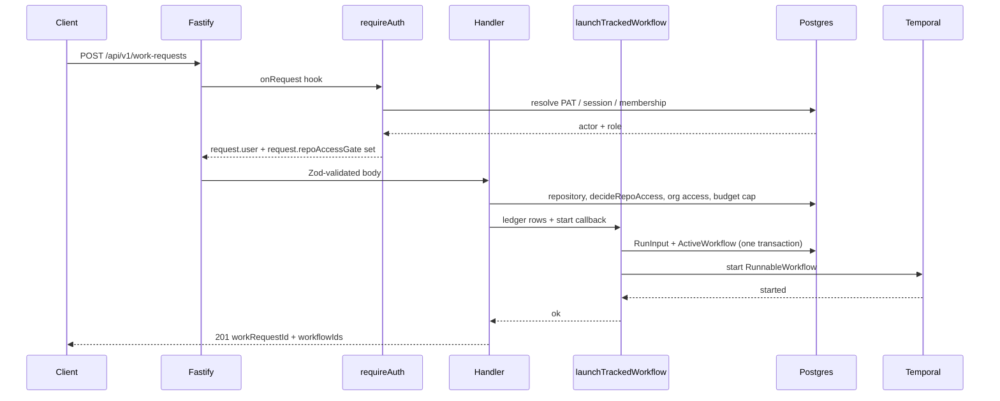

# @auto-swe/gateway — Fastify HTTP API

> Indexed at commit `147d054a` on 2026-09-30 · [view on GitHub](https://github.com/yorch/auto-swe/tree/147d054a)

## Relevant source files

- [packages/gateway/package.json](https://github.com/yorch/auto-swe/blob/147d054a/packages/gateway/package.json)
- [packages/gateway/src/index.ts](https://github.com/yorch/auto-swe/blob/147d054a/packages/gateway/src/index.ts)
- [packages/gateway/src/plugins/prisma.ts](https://github.com/yorch/auto-swe/blob/147d054a/packages/gateway/src/plugins/prisma.ts)
- [packages/gateway/src/plugins/temporal.ts](https://github.com/yorch/auto-swe/blob/147d054a/packages/gateway/src/plugins/temporal.ts)
- [packages/gateway/src/plugins/auth.ts](https://github.com/yorch/auto-swe/blob/147d054a/packages/gateway/src/plugins/auth.ts)
- [packages/gateway/src/lib/workflowLaunch.ts](https://github.com/yorch/auto-swe/blob/147d054a/packages/gateway/src/lib/workflowLaunch.ts)
- [packages/gateway/src/lib/env.ts](https://github.com/yorch/auto-swe/blob/147d054a/packages/gateway/src/lib/env.ts)
- [packages/gateway/src/lib/telemetry.ts](https://github.com/yorch/auto-swe/blob/147d054a/packages/gateway/src/lib/telemetry.ts)
- [packages/gateway/src/lib/pagination.ts](https://github.com/yorch/auto-swe/blob/147d054a/packages/gateway/src/lib/pagination.ts)
- [packages/gateway/src/lib/queryParams.ts](https://github.com/yorch/auto-swe/blob/147d054a/packages/gateway/src/lib/queryParams.ts)
- [packages/gateway/src/lib/auditLog.ts](https://github.com/yorch/auto-swe/blob/147d054a/packages/gateway/src/lib/auditLog.ts)
- [packages/gateway/src/lib/platformAdminScope.ts](https://github.com/yorch/auto-swe/blob/147d054a/packages/gateway/src/lib/platformAdminScope.ts)
- [packages/gateway/src/lib/runVisibility.ts](https://github.com/yorch/auto-swe/blob/147d054a/packages/gateway/src/lib/runVisibility.ts)
- [packages/gateway/src/lib/tenantScope.ts](https://github.com/yorch/auto-swe/blob/147d054a/packages/gateway/src/lib/tenantScope.ts)
- [packages/gateway/src/lib/idempotency.ts](https://github.com/yorch/auto-swe/blob/147d054a/packages/gateway/src/lib/idempotency.ts)
- [packages/gateway/src/lib/systemConfigService.ts](https://github.com/yorch/auto-swe/blob/147d054a/packages/gateway/src/lib/systemConfigService.ts)
- [packages/gateway/src/lib/configSettingsService.ts](https://github.com/yorch/auto-swe/blob/147d054a/packages/gateway/src/lib/configSettingsService.ts)
- [packages/gateway/src/lib/agentLibraryService.ts](https://github.com/yorch/auto-swe/blob/147d054a/packages/gateway/src/lib/agentLibraryService.ts)
- [packages/gateway/src/lib/hitlResolve.ts](https://github.com/yorch/auto-swe/blob/147d054a/packages/gateway/src/lib/hitlResolve.ts)
- [packages/gateway/src/lib/runConnection.ts](https://github.com/yorch/auto-swe/blob/147d054a/packages/gateway/src/lib/runConnection.ts)
- [packages/gateway/src/lib/repoAccessRefresh.ts](https://github.com/yorch/auto-swe/blob/147d054a/packages/gateway/src/lib/repoAccessRefresh.ts)
- [packages/gateway/src/lib/repoAccessWebhook.ts](https://github.com/yorch/auto-swe/blob/147d054a/packages/gateway/src/lib/repoAccessWebhook.ts)
- [packages/gateway/src/lib/repositoryHost.ts](https://github.com/yorch/auto-swe/blob/147d054a/packages/gateway/src/lib/repositoryHost.ts)
- [packages/gateway/src/lib/githubIdentity.ts](https://github.com/yorch/auto-swe/blob/147d054a/packages/gateway/src/lib/githubIdentity.ts)
- [packages/gateway/src/lib/githubAuth.ts](https://github.com/yorch/auto-swe/blob/147d054a/packages/gateway/src/lib/githubAuth.ts)
- [packages/gateway/src/lib/github.ts](https://github.com/yorch/auto-swe/blob/147d054a/packages/gateway/src/lib/github.ts)
- [packages/gateway/src/lib/bundleTrust.ts](https://github.com/yorch/auto-swe/blob/147d054a/packages/gateway/src/lib/bundleTrust.ts)
- [packages/gateway/src/lib/bundleFetch.ts](https://github.com/yorch/auto-swe/blob/147d054a/packages/gateway/src/lib/bundleFetch.ts)
- [packages/gateway/src/routes/workRequests.ts](https://github.com/yorch/auto-swe/blob/147d054a/packages/gateway/src/routes/workRequests.ts)
- [packages/gateway/src/routes/workflowProjections.ts](https://github.com/yorch/auto-swe/blob/147d054a/packages/gateway/src/routes/workflowProjections.ts)
- [packages/gateway/src/routes/usage.ts](https://github.com/yorch/auto-swe/blob/147d054a/packages/gateway/src/routes/usage.ts)
- [packages/gateway/src/scripts/provisionAuthAdmin.ts](https://github.com/yorch/auto-swe/blob/147d054a/packages/gateway/src/scripts/provisionAuthAdmin.ts)
- [packages/gateway/src/scripts/backfillGithubLogins.ts](https://github.com/yorch/auto-swe/blob/147d054a/packages/gateway/src/scripts/backfillGithubLogins.ts)
- [packages/gateway/Dockerfile](https://github.com/yorch/auto-swe/blob/147d054a/packages/gateway/Dockerfile)
- [packages/gateway/docker-entrypoint.sh](https://github.com/yorch/auto-swe/blob/147d054a/packages/gateway/docker-entrypoint.sh)

## Overview

`@auto-swe/gateway` is the platform's only HTTP surface. It is a Fastify 5 server that authenticates every caller, enforces role-based and tenant-scoped access, validates request and response bodies with Zod, reads and writes the Postgres schema through the shared Prisma singleton, and starts and signals Temporal workflows on the `engineering-workflow` task queue. The web dashboard, the `auto-swe` CLI, GitHub webhooks, and Slack interactivity all enter the system through this one process.

The package is deliberately thin at the edge and thick in the middle. Route modules under `src/routes/` own the wire contract — path, schema, status codes, and the RBAC hook — while the substantive logic lives in service modules under `src/lib/` that take a `PrismaClient` argument and have no Fastify coupling. Thirty-eight non-test modules sit in `src/routes/`; thirty-seven register routes and declare 239 handlers between them, and `workflowProjections.ts` holds only shared schemas (the [route catalog](./3.1-http-routes.md) states how those counts were taken). They mount under the `/api/v1` prefix, and three Fastify plugins decorate the server instance with the three capabilities every route needs: `prisma`, `temporal`, and `auth` ([packages/gateway/src/index.ts#L132-L135](https://github.com/yorch/auto-swe/blob/147d054a/packages/gateway/src/index.ts#L132-L135)).

The gateway talks to GitHub with plain `fetch`, not an SDK client: `lib/github.ts` pages the REST API and verifies webhook HMACs, `lib/githubIdentity.ts` reads the `/user` endpoint, and the App-installation token mechanics live in `@auto-swe/shared` and are only re-exported by `lib/githubAuth.ts`.

Sources: [packages/gateway/package.json:L1-L48](https://github.com/yorch/auto-swe/blob/147d054a/packages/gateway/package.json#L1-L48) [packages/gateway/src/index.ts:L71-L81](https://github.com/yorch/auto-swe/blob/147d054a/packages/gateway/src/index.ts#L71-L81) [packages/gateway/src/lib/githubAuth.ts:L1-L14](https://github.com/yorch/auto-swe/blob/147d054a/packages/gateway/src/lib/githubAuth.ts#L1-L14) [packages/gateway/src/lib/githubIdentity.ts:L36-L60](https://github.com/yorch/auto-swe/blob/147d054a/packages/gateway/src/lib/githubIdentity.ts#L36-L60)

## Architecture

```mermaid
flowchart LR
    subgraph Bootstrap["src/index.ts"]
        Boot[start]
    end

    subgraph Plugins["src/plugins"]
        PrismaP[prisma]
        TemporalP[temporal]
        AuthP[auth]
    end

    subgraph Routes["src/routes — 38 modules"]
        RouteMod[route module]
    end

    subgraph Services["src/lib"]
        Svc[service modules]
        Scope[tenantScope + runVisibility]
        Launch[workflowLaunch]
    end

    Boot --> PrismaP
    Boot --> TemporalP
    Boot --> AuthP
    Boot --> RouteMod

    RouteMod -->|requireAuth hook| AuthP
    AuthP -.request.repoAccessGate.-> RouteMod
    RouteMod --> Svc
    RouteMod --> Scope
    RouteMod --> Launch
    Svc -.fastify.prisma.-> PrismaP
    Scope -.where predicates.-> PrismaP
    Launch -.fastify.prisma.-> PrismaP
    Launch -.fastify.temporal.-> TemporalP

    PrismaP -.-> DB[(Postgres)]
    TemporalP -.-> Temporal[/Temporal/]
```

`start()` registers the three plugins before any route module, so by the time a route's `FastifyPluginAsync` runs, `fastify.prisma`, `fastify.temporal`, and `fastify.auth` are all decorated on the instance. Route modules never construct their own clients; they reach the shared ones through the instance and delegate real work to `src/lib` services and to `launchTrackedWorkflow`. The `requireAuth` hook also leaves one more thing on every authenticated request, `request.repoAccessGate`, which the tenancy predicates in `tenantScope.ts` and `runVisibility.ts` consume (see below).

Sources: [packages/gateway/src/index.ts:L81-L135](https://github.com/yorch/auto-swe/blob/147d054a/packages/gateway/src/index.ts#L81-L135) [packages/gateway/src/plugins/prisma.ts:L1-L32](https://github.com/yorch/auto-swe/blob/147d054a/packages/gateway/src/plugins/prisma.ts#L1-L32) [packages/gateway/src/plugins/auth.ts:L415-L425](https://github.com/yorch/auto-swe/blob/147d054a/packages/gateway/src/plugins/auth.ts#L415-L425)

## Module Layout

| Module | Path | Responsibility |
| ------ | ---- | -------------- |
| Bootstrap | [`src/index.ts`](https://github.com/yorch/auto-swe/blob/147d054a/packages/gateway/src/index.ts) | Telemetry init, plugin order, built-in sync, five schedule syncs, error handler, route registration, graceful shutdown |
| `prisma` plugin | [`src/plugins/prisma.ts`](https://github.com/yorch/auto-swe/blob/147d054a/packages/gateway/src/plugins/prisma.ts) | Connects and decorates the shared `PrismaClient`; disconnects on close |
| `temporal` plugin | [`src/plugins/temporal.ts`](https://github.com/yorch/auto-swe/blob/147d054a/packages/gateway/src/plugins/temporal.ts) | Temporal `Client` + `ScheduleClient`; every start, signal, cancel, liveness probe, and schedule reconciliation |
| `auth` plugin | [`src/plugins/auth.ts`](https://github.com/yorch/auto-swe/blob/147d054a/packages/gateway/src/plugins/auth.ts) | JSON Web Token signing and verification, personal-access-token hashing, the `requireAuth` RBAC hook, the per-request repository-access gate |
| Route modules | [`src/routes/`](https://github.com/yorch/auto-swe/tree/147d054a/packages/gateway/src/routes) | 38 modules (37 `FastifyPluginAsync` route plugins plus the shared-projection module), one per resource family |
| Config services | [`src/lib/systemConfigService.ts`](https://github.com/yorch/auto-swe/blob/147d054a/packages/gateway/src/lib/systemConfigService.ts), [`configSettingsService.ts`](https://github.com/yorch/auto-swe/blob/147d054a/packages/gateway/src/lib/configSettingsService.ts) | Singleton integration tables and the setting registry's read/write/permission surface |
| Library services | [`agentLibraryService.ts`](https://github.com/yorch/auto-swe/blob/147d054a/packages/gateway/src/lib/agentLibraryService.ts), [`skillLibraryService.ts`](https://github.com/yorch/auto-swe/blob/147d054a/packages/gateway/src/lib/skillLibraryService.ts), [`credentialService.ts`](https://github.com/yorch/auto-swe/blob/147d054a/packages/gateway/src/lib/credentialService.ts), [`bundleService.ts`](https://github.com/yorch/auto-swe/blob/147d054a/packages/gateway/src/lib/bundleService.ts) | Versioning, content scanning, redaction, and import/export for library entities |
| Launch + governance | [`workflowLaunch.ts`](https://github.com/yorch/auto-swe/blob/147d054a/packages/gateway/src/lib/workflowLaunch.ts), [`hitlResolve.ts`](https://github.com/yorch/auto-swe/blob/147d054a/packages/gateway/src/lib/hitlResolve.ts), [`runVisibility.ts`](https://github.com/yorch/auto-swe/blob/147d054a/packages/gateway/src/lib/runVisibility.ts), [`runConnection.ts`](https://github.com/yorch/auto-swe/blob/147d054a/packages/gateway/src/lib/runConnection.ts) | Ledger-then-start launching, human-in-the-loop resolution, run visibility and run-control predicates, repository validation at launch |
| Tenancy and repository access | [`tenantScope.ts`](https://github.com/yorch/auto-swe/blob/147d054a/packages/gateway/src/lib/tenantScope.ts), [`repoAccessRefresh.ts`](https://github.com/yorch/auto-swe/blob/147d054a/packages/gateway/src/lib/repoAccessRefresh.ts), [`repoAccessWebhook.ts`](https://github.com/yorch/auto-swe/blob/147d054a/packages/gateway/src/lib/repoAccessWebhook.ts), [`repositoryHost.ts`](https://github.com/yorch/auto-swe/blob/147d054a/packages/gateway/src/lib/repositoryHost.ts), [`githubIdentity.ts`](https://github.com/yorch/auto-swe/blob/147d054a/packages/gateway/src/lib/githubIdentity.ts) | Membership and gate `where` predicates, webhook-driven refresh of cached GitHub permission answers, host-aware repository matching, the GitHub username behind a linked account (detailed on [3.4](./3.4-repository-access-and-credentials.md)) |
| Cross-cutting helpers | [`auditLog.ts`](https://github.com/yorch/auto-swe/blob/147d054a/packages/gateway/src/lib/auditLog.ts), [`pagination.ts`](https://github.com/yorch/auto-swe/blob/147d054a/packages/gateway/src/lib/pagination.ts), [`queryParams.ts`](https://github.com/yorch/auto-swe/blob/147d054a/packages/gateway/src/lib/queryParams.ts), [`idempotency.ts`](https://github.com/yorch/auto-swe/blob/147d054a/packages/gateway/src/lib/idempotency.ts), [`platformAdminScope.ts`](https://github.com/yorch/auto-swe/blob/147d054a/packages/gateway/src/lib/platformAdminScope.ts) | Audit rows, bounded pagination schemas, boolean query params, deterministic workflow IDs, scoped cross-tenant reads |
| Usage reporting | [`src/routes/usage.ts`](https://github.com/yorch/auto-swe/blob/147d054a/packages/gateway/src/routes/usage.ts) | ADMIN-only platform-wide LLM usage aggregated from `agent_traces`, with bounded query concurrency so a report cannot starve the 10-connection pool |
| Scripts | [`provisionAuthAdmin.ts`](https://github.com/yorch/auto-swe/blob/147d054a/packages/gateway/src/scripts/provisionAuthAdmin.ts), [`backfillGithubLogins.ts`](https://github.com/yorch/auto-swe/blob/147d054a/packages/gateway/src/scripts/backfillGithubLogins.ts) | Idempotently create the seeded admin's better-auth credential account; backfill `users.github_login` for accounts linked before the column existed, to be run once before enforcement is turned on |

Sources: [packages/gateway/src/index.ts:L1-L69](https://github.com/yorch/auto-swe/blob/147d054a/packages/gateway/src/index.ts#L1-L69) [packages/gateway/src/lib/workflowLaunch.ts:L1-L52](https://github.com/yorch/auto-swe/blob/147d054a/packages/gateway/src/lib/workflowLaunch.ts#L1-L52) [packages/gateway/src/lib/tenantScope.ts:L1-L30](https://github.com/yorch/auto-swe/blob/147d054a/packages/gateway/src/lib/tenantScope.ts#L1-L30) [packages/gateway/src/routes/usage.ts:L1-L30](https://github.com/yorch/auto-swe/blob/147d054a/packages/gateway/src/routes/usage.ts#L1-L30) [packages/gateway/src/scripts/backfillGithubLogins.ts:L1-L25](https://github.com/yorch/auto-swe/blob/147d054a/packages/gateway/src/scripts/backfillGithubLogins.ts#L1-L25)

## Key Components

### Server bootstrap

`start()` runs a fixed sequence before the listener opens. OpenTelemetry is initialized at module scope, above the Fastify import, so the HTTP and Fastify auto-instrumentations can patch before any server object exists ([packages/gateway/src/index.ts#L1-L5](https://github.com/yorch/auto-swe/blob/147d054a/packages/gateway/src/index.ts#L1-L5)). Inside `start()`, `assertEncryptionKeyConfigured()` fails the boot when `CONFIG_ENCRYPTION_KEY` is missing, because every database-stored secret passes through that key and a gateway without it would serve errors on exactly the admin pages needed to bootstrap a deployment. `initAuth()` follows, reading OAuth credentials from the database once — which is why changing those credentials requires a restart. Only then is the Fastify instance built.

Sources: [packages/gateway/src/index.ts:L1-L81](https://github.com/yorch/auto-swe/blob/147d054a/packages/gateway/src/index.ts#L1-L81) [packages/gateway/src/lib/telemetry.ts:L1-L14](https://github.com/yorch/auto-swe/blob/147d054a/packages/gateway/src/lib/telemetry.ts#L1-L14)

### Plugin registration order

Registration order is load-bearing. The Zod validator and serializer compilers are set first, then an `onRoute` hook injects a permissive `z.any()` 200 response schema into any route that declares no `response` schema — a guard against `fast-json-stringify` silently stripping undeclared response fields ([packages/gateway/src/index.ts#L90-L94](https://github.com/yorch/auto-swe/blob/147d054a/packages/gateway/src/index.ts#L90-L94)). Then come CORS with an explicit method list (`GET`, `HEAD`, `POST`, `PUT`, `DELETE`, `PATCH`), `fastify-raw-body` in non-global mode for per-route HMAC verification, a custom `application/x-www-form-urlencoded` parser that the social sign-in buttons and Slack slash commands both depend on, cookies, and a global rate limit of 200 requests per minute. Only after all of that do `prismaPlugin`, `temporalPlugin`, and `authPlugin` register, in that order.

Sources: [packages/gateway/src/index.ts:L83-L135](https://github.com/yorch/auto-swe/blob/147d054a/packages/gateway/src/index.ts#L83-L135)

### The fastify-plugin convention

Every extension that must decorate the root instance is wrapped in `fastify-plugin`, which suppresses Fastify's default encapsulation so the decoration is visible to sibling plugins and to all later-registered routes. Each wrapper declares a `fastify: '5.x'` version range and a `name`, and each plugin augments the `FastifyInstance` interface through TypeScript declaration merging so `fastify.prisma`, `fastify.temporal`, and `fastify.auth` are typed at every call site ([packages/gateway/src/plugins/prisma.ts#L6-L10](https://github.com/yorch/auto-swe/blob/147d054a/packages/gateway/src/plugins/prisma.ts#L6-L10)). The auth plugin additionally augments `FastifyRequest` with `user`, `teamRole`, and `repoAccessGate`. The Prisma plugin deliberately decorates the shared singleton from `@auto-swe/shared/db` rather than constructing a second client: the tenant guard is applied once in that factory, and a local `new PrismaClient()` would be both unguarded and a second connection pool in the same process.

Route modules, by contrast, are plain `FastifyPluginAsync` values registered with a `prefix` and are *not* wrapped — encapsulation is what keeps each module's hooks and schemas local to its own routes. Several modules mount at the same prefix (`/api/v1/repositories` carries three) and many are mounted twice, once under `/api/v1/platform` and once under the deprecated `/api/v1/admin` alias.

Sources: [packages/gateway/src/plugins/prisma.ts:L12-L32](https://github.com/yorch/auto-swe/blob/147d054a/packages/gateway/src/plugins/prisma.ts#L12-L32) [packages/gateway/src/plugins/auth.ts:L21-L47](https://github.com/yorch/auto-swe/blob/147d054a/packages/gateway/src/plugins/auth.ts#L21-L47) [packages/gateway/src/plugins/auth.ts:L153-L199](https://github.com/yorch/auto-swe/blob/147d054a/packages/gateway/src/plugins/auth.ts#L153-L199) [packages/gateway/src/plugins/temporal.ts:L921](https://github.com/yorch/auto-swe/blob/147d054a/packages/gateway/src/plugins/temporal.ts#L921)

### Zod validation via fastify-type-provider-zod

Routes opt into typed schemas by calling `fastify.withTypeProvider<ZodTypeProvider>()` at the top of the plugin body and registering handlers on the returned instance, which infers `request.body`, `request.params`, and `request.querystring` types directly from the Zod schemas ([packages/gateway/src/routes/workRequests.ts#L357](https://github.com/yorch/auto-swe/blob/147d054a/packages/gateway/src/routes/workRequests.ts#L357)). Two shared helpers keep query parsing uniform: `paginationQuery()` builds a bounded `{ limit, offset }` schema with per-route caps, and `booleanQueryParam()` accepts only the literal strings `true` and `false`, because `z.coerce.boolean()` is `Boolean(input)` and would silently turn `?flag=false` into `true`.

Shared response shapes live in `workflowProjections.ts`, which both the workflow-templates and workflow-runs routes import so the `WorkflowRunSummary` wire shape cannot drift between them.

Sources: [packages/gateway/src/lib/pagination.ts:L1-L10](https://github.com/yorch/auto-swe/blob/147d054a/packages/gateway/src/lib/pagination.ts#L1-L10) [packages/gateway/src/lib/queryParams.ts:L1-L29](https://github.com/yorch/auto-swe/blob/147d054a/packages/gateway/src/lib/queryParams.ts#L1-L29) [packages/gateway/src/routes/workflowProjections.ts:L1-L20](https://github.com/yorch/auto-swe/blob/147d054a/packages/gateway/src/routes/workflowProjections.ts#L1-L20)

### The service layer under src/lib

Service modules take `prisma` as a parameter and return data plus enough prior state for the caller to write an audit entry, leaving HTTP status decisions and role checks in the route. `systemConfigService.ts` covers the singleton integration tables with a uniform triple per section — a masked read, a partial update that seals secrets into AES-GCM envelope columns, and a live connection test — and secret fields are write-only, so reads return only a `lastFour`. `agentLibraryService.ts` and `skillLibraryService.ts` apply the same shape to versioned library content, including the prompt-injection scan and the `isVerified` reset that follows a prompt edit.

Four helpers carry policy that would otherwise be re-implemented per route:

- `tenantScope.ts` is the one definition of the membership predicates that decide which tenants' rows a caller may read (`memberTeams`, `memberOrgs`, `reachableConnections`, `permissionRequirement`). Call sites nest them under the relation they reach tenancy through rather than spreading them, because a coverage test grades each `where` with the shared tenant guard and a spread would read as an unaccounted call site.
- `runVisibility.ts` builds the Prisma `where` predicate that decides which runs a non-admin may see, derived from template ownership, team membership, and the repository-reach predicate. It also builds a narrower *control* predicate for cancelling a run or answering a human step: a team a repository is shared with may see the owning team's runs but not steer them, so control comes from owning the repository, the team-owned template, or having launched the run, and deliberately has no "global template" branch.
- `platformAdminScope.ts` wraps the admin branch of a listing in `runUnscoped` so a deliberate cross-tenant read is distinguishable from a forgotten filter, keeping the tenant guard live for everyone else.
- `auditLog.ts` writes one `ConfigAuditLog` row per mutation over a closed union of twenty-three entity types.

The visibility and control filters are pure synchronous functions called inside `where` literals, so they cannot resolve configuration themselves. `requireAuth` resolves the repository-access gate once per request instead and leaves it on `request.repoAccessGate`; handlers pass it in. When the gate's configuration cannot be read, the resolver falls back to the last value this process saw, and only a process that has never read it treats the gate as `off` — so a configuration read failure does not silently disable enforcement that was being applied a second earlier. `hitlResolve.ts` takes the gate as an explicit dependency for the same reason, because its two callers (the HTTP route and the Slack button) obtain it differently.

Sources: [packages/gateway/src/lib/systemConfigService.ts:L1-L40](https://github.com/yorch/auto-swe/blob/147d054a/packages/gateway/src/lib/systemConfigService.ts#L1-L40) [packages/gateway/src/lib/agentLibraryService.ts:L1-L30](https://github.com/yorch/auto-swe/blob/147d054a/packages/gateway/src/lib/agentLibraryService.ts#L1-L30) [packages/gateway/src/lib/tenantScope.ts:L1-L60](https://github.com/yorch/auto-swe/blob/147d054a/packages/gateway/src/lib/tenantScope.ts#L1-L60) [packages/gateway/src/lib/runVisibility.ts:L1-L103](https://github.com/yorch/auto-swe/blob/147d054a/packages/gateway/src/lib/runVisibility.ts#L1-L103) [packages/gateway/src/lib/platformAdminScope.ts:L1-L24](https://github.com/yorch/auto-swe/blob/147d054a/packages/gateway/src/lib/platformAdminScope.ts#L1-L24) [packages/gateway/src/lib/auditLog.ts:L1-L50](https://github.com/yorch/auto-swe/blob/147d054a/packages/gateway/src/lib/auditLog.ts#L1-L50) [packages/gateway/src/plugins/auth.ts:L415-L425](https://github.com/yorch/auto-swe/blob/147d054a/packages/gateway/src/plugins/auth.ts#L415-L425) [packages/gateway/src/lib/hitlResolve.ts:L34-L53](https://github.com/yorch/auto-swe/blob/147d054a/packages/gateway/src/lib/hitlResolve.ts#L34-L53)

### Talking to Temporal

The `temporal` plugin opens one `Connection` at boot, builds a `Client` and a `ScheduleClient` over it, and decorates the instance with a flat object of thirty-six methods. Starts are typed one per workflow — `startRunnableWorkflow`, `startEpicWorkflow`, `startChannelAssistant`, `startEvalRunWorkflow`, `startConsolidationWorkflow`, `startReembedMemory`, `startRepoDependencyInference`, `startWorkflowAuthorJob` — and all target the `engineering-workflow` task queue with a caller-supplied workflow ID ([packages/gateway/src/plugins/temporal.ts#L772-L781](https://github.com/yorch/auto-swe/blob/147d054a/packages/gateway/src/plugins/temporal.ts#L772-L781)). Two methods are request/response rather than fire-and-forget: `generateWorkflowSpec` and `explainWorkflowSpec` use `client.workflow.execute` and await the result, because model binding happens in the worker. Alongside `signalWorkflow` and `cancelWorkflow` sits `isWorkflowRunning`, a liveness probe for callers that must decide something expensive before signalling; it treats not-found and closed as the same answer, and lets any other error propagate so an unreachable server is not read as "nothing is running".

Schedules go through one shared `upsertSchedule` reconciliation. It calls `describe()` behind `scheduleExists`, which distinguishes a missing schedule from an unreachable Temporal by error class — treating every error as not-found once made an outage look like a clean slate, so deletes reported success while live schedules kept firing. Existing schedules are updated in place; new ones are created with `ScheduleOverlapPolicy.SKIP`, dropping a fire that arrives while the previous run is still in flight. Five system-wide schedule IDs are exported as constants (lesson consolidation, eval regression, eval revalidation, repository-dependency scan, and the repository-access permission sweep), next to per-row schedules for scheduled work requests and per-channel Slack digests.

Sources: [packages/gateway/src/plugins/temporal.ts:L26-L31](https://github.com/yorch/auto-swe/blob/147d054a/packages/gateway/src/plugins/temporal.ts#L26-L31) [packages/gateway/src/plugins/temporal.ts:L370-L417](https://github.com/yorch/auto-swe/blob/147d054a/packages/gateway/src/plugins/temporal.ts#L370-L417) [packages/gateway/src/plugins/temporal.ts:L443-L470](https://github.com/yorch/auto-swe/blob/147d054a/packages/gateway/src/plugins/temporal.ts#L443-L470) [packages/gateway/src/plugins/temporal.ts:L675-L698](https://github.com/yorch/auto-swe/blob/147d054a/packages/gateway/src/plugins/temporal.ts#L675-L698) [packages/gateway/src/plugins/temporal.ts:L845-L855](https://github.com/yorch/auto-swe/blob/147d054a/packages/gateway/src/plugins/temporal.ts#L845-L855)

### launchTrackedWorkflow — ledger before start

Six route modules start tracked runs — work requests, epics, PRD runs, workflow templates, webhooks, and Slack — and all six go through `launchTrackedWorkflow` rather than calling the Temporal decorator directly (eight call sites in all, two of them in `workRequests.ts` and two in `webhooks.ts`). It writes the `RunInput` and `ActiveWorkflow` rows in one Prisma transaction, then invokes the caller's `start()` callback, and deletes the rows if the start throws.

The ordering is the point. Starting Temporal first meant that a failed database write left a workflow burning budget, pushing branches, and opening pull requests with no row to attribute it to. The reverse orphan — rows with no workflow — is inert, visible in the dashboard, and operator-recoverable. Starting first also wedged the ticket: workflow-ID allocation derives its `-rN` suffix from `ActiveWorkflow` rows, so with no row written a resubmission re-allocated the base ID and Temporal rejected it as already started. Writing first also makes deduplication atomic: the unique index on `ActiveWorkflow.temporalWorkflowId` decides the winner between two concurrent submissions, where a read-then-start sequence had a time-of-check-to-time-of-use gap. A unique-constraint violation and a Temporal `WorkflowExecutionAlreadyStartedError` both surface as `{ ok: false, reason: 'DUPLICATE' }`, which callers map to a 409. Compensation is best-effort and never throws, because leaving the rows behind is the recoverable failure and the caller still needs the original start error.

PRD runs are the one launch that passes no `ActiveWorkflow` row; they track spend through `AgentTrace` instead and supply a bare `temporalWorkflowId`. They keep ledger-before-start ordering and compensation but give up the atomic dedup, since the unique index is what provides it.

For triggers with no intrinsic key — `POST /workflow-templates/:id/runs` and `POST /webhooks/:token` accept arbitrary payloads — `idempotency.ts` derives a deterministic workflow ID from an opt-in `Idempotency-Key` header, hashed and scoped so the same key against two templates cannot collide.

Sources: [packages/gateway/src/lib/workflowLaunch.ts:L5-L84](https://github.com/yorch/auto-swe/blob/147d054a/packages/gateway/src/lib/workflowLaunch.ts#L5-L84) [packages/gateway/src/lib/workflowLaunch.ts:L86-L179](https://github.com/yorch/auto-swe/blob/147d054a/packages/gateway/src/lib/workflowLaunch.ts#L86-L179) [packages/gateway/src/routes/workRequests.ts:L582-L632](https://github.com/yorch/auto-swe/blob/147d054a/packages/gateway/src/routes/workRequests.ts#L582-L632) [packages/gateway/src/lib/idempotency.ts:L1-L52](https://github.com/yorch/auto-swe/blob/147d054a/packages/gateway/src/lib/idempotency.ts#L1-L52)

### Startup-time seeding and schedule sync

After the plugins land and before routes register, `syncBuiltins(app.prisma)` seeds and idempotently updates the platform's built-in reference data: scanner patterns and autonomy policies as core defaults, plus workflow templates, channel templates, skills, agents, and eval rubrics as software-engineering starter content. Every deploy therefore picks up new or changed built-ins without a manual step.

Five Temporal Schedules are then reconciled against whatever configuration is in the database — lesson consolidation, repository-dependency scanning, the repository-access permission sweep, the nightly eval regression, and eval re-validation. All five are fired without `await` and each has a `.catch()` that logs a warning, because a Temporal connectivity failure at startup must not crash the gateway; an admin can re-save from the dashboard once Temporal is reachable. The permission sweep is created paused unless an admin has enabled `repoAccess.syncEnabled`, because it spends GitHub quota in proportion to team members times repositories.

Sources: [packages/gateway/src/index.ts:L137-L181](https://github.com/yorch/auto-swe/blob/147d054a/packages/gateway/src/index.ts#L137-L181) [packages/shared/src/lib/syncBuiltins.ts:L170-L190](https://github.com/yorch/auto-swe/blob/147d054a/packages/shared/src/lib/syncBuiltins.ts#L170-L190) [packages/gateway/src/plugins/temporal.ts:L845-L855](https://github.com/yorch/auto-swe/blob/147d054a/packages/gateway/src/plugins/temporal.ts#L845-L855)

### Error handling and graceful shutdown

One global error handler logs the full error server-side and returns `{ error: { code, message } }`. Messages on 4xx responses pass through — validation and authorization text is intentional — while any status at or above 500 is replaced with a generic string, since library and database constraint text leaks internals. Shutdown is guarded against double entry: `SIGTERM` and `SIGINT` both call `app.close()`, which drains in-flight requests and runs plugin `onClose` hooks including the Prisma disconnect, and only then flushes OpenTelemetry.

Sources: [packages/gateway/src/index.ts:L183-L195](https://github.com/yorch/auto-swe/blob/147d054a/packages/gateway/src/index.ts#L183-L195) [packages/gateway/src/index.ts:L429-L460](https://github.com/yorch/auto-swe/blob/147d054a/packages/gateway/src/index.ts#L429-L460)

## Data Flow

```mermaid
sequenceDiagram
    participant Client
    participant Fastify
    participant requireAuth
    participant Handler
    participant launchTrackedWorkflow
    participant Postgres
    participant Temporal

    Client->>Fastify: POST /api/v1/work-requests
    Fastify->>requireAuth: onRequest hook
    requireAuth->>Postgres: resolve PAT / session / membership
    Postgres-->>requireAuth: actor + role
    requireAuth-->>Fastify: request.user + request.repoAccessGate set
    Fastify->>Handler: Zod-validated body
    Handler->>Postgres: repository, decideRepoAccess, org access, budget cap
    Handler->>launchTrackedWorkflow: ledger rows + start callback
    launchTrackedWorkflow->>Postgres: RunInput + ActiveWorkflow (one transaction)
    launchTrackedWorkflow->>Temporal: start RunnableWorkflow
    Temporal-->>launchTrackedWorkflow: started
    launchTrackedWorkflow-->>Handler: ok
    Handler-->>Client: 201 workRequestId + workflowIds
```

A work-request submission is the canonical path. The `requireAuth` hook resolves the caller and the repository-access gate before the handler body runs; the handler loads the repository, calls `decideRepoAccess` (team membership and, when enabled, GitHub permission, in one decision), then performs organization and budget checks against Postgres, and only then hands both the ledger rows and a start closure to `launchTrackedWorkflow`. A unique-index conflict on either side returns 409 instead of 201, and a Temporal start failure rolls the ledger rows back. After the 201 is decided, ticket and design enrichment run best-effort and never change the response.

Sources: [packages/gateway/src/routes/workRequests.ts:L412-L520](https://github.com/yorch/auto-swe/blob/147d054a/packages/gateway/src/routes/workRequests.ts#L412-L520) [packages/gateway/src/routes/workRequests.ts:L582-L662](https://github.com/yorch/auto-swe/blob/147d054a/packages/gateway/src/routes/workRequests.ts#L582-L662) [packages/gateway/src/plugins/auth.ts:L376-L440](https://github.com/yorch/auto-swe/blob/147d054a/packages/gateway/src/plugins/auth.ts#L376-L440)

## Configuration & Extension Points

The gateway reads almost all of its configuration from the database, through resolvers in `@auto-swe/shared`. The environment variables it does read directly are bootstrap and deploy-time knobs only.

| Setting | Type | Default | Purpose |
| ------- | ---- | ------- | ------- |
| `PORT` | number | `8080` | Listen port; non-numeric values fall back to the default |
| `CORS_ORIGIN` | comma-separated list | `http://localhost:3000` | Allowed browser origins; the first entry is also the default client origin |
| `CONFIG_ENCRYPTION_KEY` | base64, 32 bytes | none — required | AES-256-GCM key for every database-stored secret; boot fails without it |
| `JWT_PRIVATE_KEY_PATH` / `JWT_PUBLIC_KEY_PATH` | path | unset | RS256 key pair; when unset the gateway uses HS256 with `JWT_SECRET` |
| `JWT_SECRET` | string | dev fallback | HS256 signing secret; the built-in fallback is refused unless `NODE_ENV` is `development` or `test` |
| `NODE_ENV` | string | unset | Gates the JWT dev fallback, and in better-auth decides whether an SMTP failure throws (`production`) or falls back; the Docker image sets `production` |
| `SESSION_CACHE_TTL_MS` | number | `60000` | Session-revocation lag window for the in-memory session cache |
| `BUNDLE_TRUSTED_KEYS` | JSON array | `[]` | Bundle signature trust anchors; deliberately environment-sourced so database write access cannot mint trust |
| `BUNDLE_ALLOW_UNVERIFIED` | `'1'` flag | deny | Whether unverified bundles may install |
| `BUNDLE_MAX_BYTES` | number | `5000000` | Size cap on install-from-URL fetches |
| `SEED_ADMIN_EMAIL` / `SEED_ADMIN_PASSWORD` | string | `admin@auto-swe.local` / random | Read only by `provisionAuthAdmin.ts`; an unset password is generated and printed |

Everything else — GitHub, Slack, storage, tracker, knowledge-base, Figma, OAuth credentials, workflow defaults, the repository-access gate and sweep schedule, and the rest of the setting registry — is stored in Postgres and managed through the admin routes.

The Dockerfile is a three-stage Yarn 4 build (builder, prod-deps, runtime) that provisions a Corepack-free `yarn` shim in each stage that runs `yarn` (the builder and prod-deps stages), generates the Prisma client during the build, and copies only `dist` output and the production `node_modules` into the runtime image. Ownership is set on each `COPY` rather than with a recursive `chown`, which would store the tree twice. The image sets `NODE_ENV=production`, exposes 8080, and carries a `/health` healthcheck. The entrypoint runs `prisma migrate deploy` under a 120-second timeout before handing off to the container command, so a hung database aborts boot rather than silently appearing to succeed.

Sources: [packages/gateway/src/lib/env.ts:L1-L22](https://github.com/yorch/auto-swe/blob/147d054a/packages/gateway/src/lib/env.ts#L1-L22) [packages/gateway/src/plugins/auth.ts:L90-L145](https://github.com/yorch/auto-swe/blob/147d054a/packages/gateway/src/plugins/auth.ts#L90-L145) [packages/gateway/src/plugins/auth.ts:L276-L280](https://github.com/yorch/auto-swe/blob/147d054a/packages/gateway/src/plugins/auth.ts#L276-L280) [packages/gateway/src/lib/bundleTrust.ts:L1-L33](https://github.com/yorch/auto-swe/blob/147d054a/packages/gateway/src/lib/bundleTrust.ts#L1-L33) [packages/gateway/src/lib/bundleFetch.ts:L21-L25](https://github.com/yorch/auto-swe/blob/147d054a/packages/gateway/src/lib/bundleFetch.ts#L21-L25) [packages/gateway/src/scripts/provisionAuthAdmin.ts:L39-L56](https://github.com/yorch/auto-swe/blob/147d054a/packages/gateway/src/scripts/provisionAuthAdmin.ts#L39-L56) [packages/gateway/Dockerfile:L1-L159](https://github.com/yorch/auto-swe/blob/147d054a/packages/gateway/Dockerfile#L1-L159) [packages/gateway/docker-entrypoint.sh:L15-L24](https://github.com/yorch/auto-swe/blob/147d054a/packages/gateway/docker-entrypoint.sh#L15-L24)

## Detail Pages

**HTTP routes.** The [route catalog](./3.1-http-routes.md) enumerates all thirty-eight route-directory modules and their endpoints, the `/api/v1/platform` prefix and its deprecated `/api/v1/admin` alias registered alongside it, the resource families that carry both a platform-scoped and a team-scoped variant, and the request and response schemas each module declares. It also covers the pagination and projection conventions that keep list responses uniform.

**Authentication and role-based access control.** The [auth page](./3.2-authentication-and-rbac.md) covers the three credential paths the gateway accepts — `ats_`-prefixed personal access tokens, JSON Web Tokens, and better-auth browser session cookies — and how each is normalized into the same `JwtPayload` so downstream role checks behave identically. It details the `requireAuth` hook's platform, team, and organization role ladders, the audience claims that keep an API bearer from being replayed as OAuth state, the in-memory session cache and its invalidation on sign-out, and the session-token bridge that exchanges a browser session for a short-lived token.

**GitHub integration and inbound webhooks.** The [webhooks page](./3.3-github-and-webhooks.md) covers HMAC signature verification over the raw body, the GitHub App installation-token cache and its personal-access-token fallback, the pull-request and continuous-integration events that signal running workflows, the Slack signature and replay window, and the shared human-in-the-loop resolve core that the inbox API and Slack button interactions both call. It also covers `isTerminalSignalError`, which decides whether a failed signal should roll back the database write that preceded it.

**Repository access, sharing, and per-user credentials.** The [repository access page](./3.4-repository-access-and-credentials.md) maps four questions about a repository to the function that answers each: who may reach it (owning-team and shared-team membership, then optionally a cached GitHub permission), who may manage it (the owning team's leads only), which credential a run uses (the launcher's own token or the platform's), and which hosts a credential may be sent to. It covers the `tenantScope` predicates and the per-request gate described above, the webhook-driven and scheduled refresh of cached permission answers, GitHub username re-registration and takeover detection, GitHub App installation records and the retired-installation mark, and the URL lockdown applied wherever a repository's base URLs are written.

Sources: [packages/gateway/src/index.ts:L351-L427](https://github.com/yorch/auto-swe/blob/147d054a/packages/gateway/src/index.ts#L351-L427) [packages/gateway/src/plugins/auth.ts:L376-L440](https://github.com/yorch/auto-swe/blob/147d054a/packages/gateway/src/plugins/auth.ts#L376-L440) [packages/gateway/src/lib/tenantScope.ts:L32-L170](https://github.com/yorch/auto-swe/blob/147d054a/packages/gateway/src/lib/tenantScope.ts#L32-L170) [packages/gateway/src/lib/repoAccessRefresh.ts:L1-L30](https://github.com/yorch/auto-swe/blob/147d054a/packages/gateway/src/lib/repoAccessRefresh.ts#L1-L30)

## Related Pages

- Repository structure: [1. Repository Structure](./1-repository-structure.md)
- Shared library: [2. @auto-swe/shared](./2-shared-library.md)
- Temporal worker: [4. @auto-swe/worker](./4-temporal-worker.md)
- Web dashboard: [5. @auto-swe/web](./5-web-dashboard.md)
- Command-line interface: [6. @auto-swe/cli](./6-cli.md)
- Bundle authoring SDK: [7. @auto-swe/sdk](./7-bundle-sdk.md)
- Detail: [3.1 HTTP Routes](./3.1-http-routes.md)
- Detail: [3.2 Authentication and RBAC](./3.2-authentication-and-rbac.md)
- Detail: [3.3 GitHub and Webhooks](./3.3-github-and-webhooks.md)
- Detail: [3.4 Repository Access, Sharing, and Per-User Credentials](./3.4-repository-access-and-credentials.md)

Sources: [packages/gateway/src/index.ts:L1-L69](https://github.com/yorch/auto-swe/blob/147d054a/packages/gateway/src/index.ts#L1-L69)
