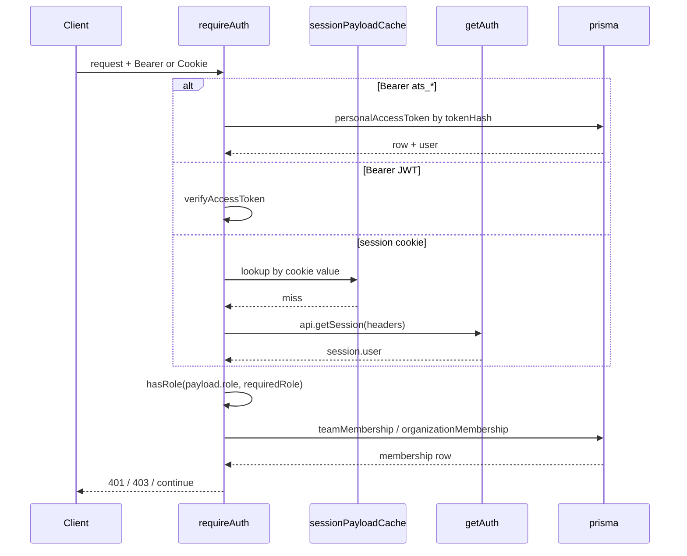

# Authentication, Authorization, and Access Scoping

> Indexed at commit `b1d8930` on 2026-09-08 · [view on GitHub](https://github.com/yorch/auto-swe/tree/b1d8930)

## Relevant source files

- [packages/gateway/src/lib/betterAuth.ts](https://github.com/yorch/auto-swe/blob/b1d8930/packages/gateway/src/lib/betterAuth.ts)
- [packages/gateway/src/plugins/auth.ts](https://github.com/yorch/auto-swe/blob/b1d8930/packages/gateway/src/plugins/auth.ts)
- [packages/gateway/src/plugins/auth.hook.test.ts](https://github.com/yorch/auto-swe/blob/b1d8930/packages/gateway/src/plugins/auth.hook.test.ts)
- [packages/gateway/src/index.ts](https://github.com/yorch/auto-swe/blob/b1d8930/packages/gateway/src/index.ts)
- [packages/gateway/src/routes/tokens.ts](https://github.com/yorch/auto-swe/blob/b1d8930/packages/gateway/src/routes/tokens.ts)
- [packages/gateway/src/lib/orgAccess.ts](https://github.com/yorch/auto-swe/blob/b1d8930/packages/gateway/src/lib/orgAccess.ts)
- [packages/gateway/src/lib/platformAdminScope.ts](https://github.com/yorch/auto-swe/blob/b1d8930/packages/gateway/src/lib/platformAdminScope.ts)
- [packages/gateway/src/lib/runVisibility.ts](https://github.com/yorch/auto-swe/blob/b1d8930/packages/gateway/src/lib/runVisibility.ts)
- [packages/gateway/src/lib/githubAuth.ts](https://github.com/yorch/auto-swe/blob/b1d8930/packages/gateway/src/lib/githubAuth.ts)
- [packages/gateway/src/routes/users.ts](https://github.com/yorch/auto-swe/blob/b1d8930/packages/gateway/src/routes/users.ts)
- [packages/gateway/src/routes/teams.ts](https://github.com/yorch/auto-swe/blob/b1d8930/packages/gateway/src/routes/teams.ts)
- [packages/gateway/src/routes/organizations.ts](https://github.com/yorch/auto-swe/blob/b1d8930/packages/gateway/src/routes/organizations.ts)
- [packages/gateway/src/routes/orgMembers.ts](https://github.com/yorch/auto-swe/blob/b1d8930/packages/gateway/src/routes/orgMembers.ts)
- [packages/gateway/src/routes/me.ts](https://github.com/yorch/auto-swe/blob/b1d8930/packages/gateway/src/routes/me.ts)
- [packages/gateway/src/routes/admin.ts](https://github.com/yorch/auto-swe/blob/b1d8930/packages/gateway/src/routes/admin.ts)
- [packages/gateway/src/scripts/provisionAuthAdmin.ts](https://github.com/yorch/auto-swe/blob/b1d8930/packages/gateway/src/scripts/provisionAuthAdmin.ts)
- [packages/shared/src/config/permissions.ts](https://github.com/yorch/auto-swe/blob/b1d8930/packages/shared/src/config/permissions.ts)
- [packages/shared/src/lib/tenantGuard.ts](https://github.com/yorch/auto-swe/blob/b1d8930/packages/shared/src/lib/tenantGuard.ts)

## Overview

The gateway carries two independent identity systems that converge on one in-memory shape. Browsers authenticate with a better-auth cookie session; command-line and Continuous Integration (CI) clients authenticate with a bearer token, either a personal access token (PAT) or a short-lived JSON Web Token (JWT). Both paths are normalised into a `JwtPayload` carrying `sub`, `role`, and an optional `slackId`, so every downstream authorization check sees a single principal type regardless of how the caller arrived ([packages/gateway/src/plugins/auth.ts#L11-L17](https://github.com/yorch/auto-swe/blob/b1d8930/packages/gateway/src/plugins/auth.ts#L11-L17)).

Authorization layers on top of that principal in four places: a platform role ladder, team membership roles, organization membership roles, and query-level visibility predicates that decide which rows a non-admin may read.

Sources: [packages/gateway/src/plugins/auth.ts:L1-L64](https://github.com/yorch/auto-swe/blob/b1d8930/packages/gateway/src/plugins/auth.ts#L1-L64) [packages/gateway/src/lib/betterAuth.ts:L1-L14](https://github.com/yorch/auto-swe/blob/b1d8930/packages/gateway/src/lib/betterAuth.ts#L1-L14)

## Sign-in methods

`buildAuth` in [packages/gateway/src/lib/betterAuth.ts#L334-L495](https://github.com/yorch/auto-swe/blob/b1d8930/packages/gateway/src/lib/betterAuth.ts#L334-L495) constructs the better-auth instance against the gateway's shared Prisma client via `prismaAdapter`. It registers email plus password with `requireEmailVerification` and an eight-character minimum, a `magicLink` plugin with a ten-minute expiry, and GitHub and Google social providers. Each social provider is registered only when both its client id and client secret resolved, so an unconfigured provider is absent rather than broken ([packages/gateway/src/lib/betterAuth.ts#L466-L477](https://github.com/yorch/auto-swe/blob/b1d8930/packages/gateway/src/lib/betterAuth.ts#L466-L477)).

Okta enterprise single sign-on is registered through better-auth's `genericOAuth` plugin, and only when issuer, client id, and client secret are all present ([packages/gateway/src/lib/betterAuth.ts#L449-L461](https://github.com/yorch/auto-swe/blob/b1d8930/packages/gateway/src/lib/betterAuth.ts#L449-L461)). Because `genericOAuth` reuses the built-in social routes, Okta needs no client-side plugin.

Account linking by verified email is enabled, and the trusted-provider list contains only OAuth-verified legs. Email plus password is deliberately excluded: trusting it would let someone who merely knows a victim's address plant a credential that auto-links onto the victim's existing row ([packages/gateway/src/lib/betterAuth.ts#L348-L357](https://github.com/yorch/auto-swe/blob/b1d8930/packages/gateway/src/lib/betterAuth.ts#L348-L357)). Okta joins that trusted set when configured.

A `databaseHooks.user.create.after` hook adds every new user to the configured default team as `ENGINEER`. Failures are logged and swallowed so a missing default team cannot block sign-up ([packages/gateway/src/lib/betterAuth.ts#L381-L410](https://github.com/yorch/auto-swe/blob/b1d8930/packages/gateway/src/lib/betterAuth.ts#L381-L410)). New users default to `isActive: false` and sit in an approval queue until an admin flips the flag ([packages/gateway/src/lib/betterAuth.ts#L487-L493](https://github.com/yorch/auto-swe/blob/b1d8930/packages/gateway/src/lib/betterAuth.ts#L487-L493)).

Magic-link and password-reset emails resolve their transport at call time in a fixed order: Simple Mail Transfer Protocol (SMTP) through nodemailer, then the Resend Hypertext Transfer Protocol (HTTP) application programming interface (API), then a console log for development ([packages/gateway/src/lib/betterAuth.ts#L98-L156](https://github.com/yorch/auto-swe/blob/b1d8930/packages/gateway/src/lib/betterAuth.ts#L98-L156)). The SMTP branch inspects `accepted` and `rejected` because `sendMail` resolves on submission acceptance rather than delivery.

The better-auth handler is mounted at `/api/auth/*`, with the eight credential-bearing paths registered separately under a 20-per-minute rate limit so that `/get-session` keeps the permissive global limit ([packages/gateway/src/index.ts#L248-L270](https://github.com/yorch/auto-swe/blob/b1d8930/packages/gateway/src/index.ts#L248-L270)). `GET /api/v1/auth/providers` reports which providers are live so the login page renders only the buttons that work ([packages/gateway/src/index.ts#L275](https://github.com/yorch/auto-swe/blob/b1d8930/packages/gateway/src/index.ts#L275)).

Sources: [packages/gateway/src/lib/betterAuth.ts:L334-L512](https://github.com/yorch/auto-swe/blob/b1d8930/packages/gateway/src/lib/betterAuth.ts#L334-L512) [packages/gateway/src/lib/betterAuth.ts:L98-L215](https://github.com/yorch/auto-swe/blob/b1d8930/packages/gateway/src/lib/betterAuth.ts#L98-L215) [packages/gateway/src/index.ts:L185-L275](https://github.com/yorch/auto-swe/blob/b1d8930/packages/gateway/src/index.ts#L185-L275)

## Personal access tokens

A PAT is the string `ats_` followed by 32 bytes of base64url entropy ([packages/gateway/src/routes/tokens.ts#L31-L33](https://github.com/yorch/auto-swe/blob/b1d8930/packages/gateway/src/routes/tokens.ts#L31-L33)). The prefix constant lives in the auth plugin and is imported by the mint route, so the mint and verify paths cannot drift ([packages/gateway/src/plugins/auth.ts#L215](https://github.com/yorch/auto-swe/blob/b1d8930/packages/gateway/src/plugins/auth.ts#L215)).

`POST /api/v1/auth/tokens` stores only the SHA-256 hash plus a non-secret twelve-character prefix, and returns the plaintext exactly once in the 201 body ([packages/gateway/src/routes/tokens.ts#L79-L130](https://github.com/yorch/auto-swe/blob/b1d8930/packages/gateway/src/routes/tokens.ts#L79-L130)). Listing and revocation are owner-scoped; a delete against another user's token returns 404 rather than 403, hiding the row's existence ([packages/gateway/src/routes/tokens.ts#L141-L151](https://github.com/yorch/auto-swe/blob/b1d8930/packages/gateway/src/routes/tokens.ts#L141-L151)). Issue and revoke both write an audit-log entry through `safePatAuditFields`, which excludes both the plaintext and the stored hash ([packages/gateway/src/routes/tokens.ts#L38-L54](https://github.com/yorch/auto-swe/blob/b1d8930/packages/gateway/src/routes/tokens.ts#L38-L54)).

Verification hashes the presented token, looks the row up by `tokenHash`, and rejects when the row is missing, revoked, or owned by an inactive user. An expiry in the past yields the distinct code `TOKEN_EXPIRED` ([packages/gateway/src/plugins/auth.ts#L230-L254](https://github.com/yorch/auto-swe/blob/b1d8930/packages/gateway/src/plugins/auth.ts#L230-L254)). The `lastUsedAt` write is fire-and-forget so a slow update adds no request latency.

Sources: [packages/gateway/src/routes/tokens.ts:L1-L184](https://github.com/yorch/auto-swe/blob/b1d8930/packages/gateway/src/routes/tokens.ts#L1-L184) [packages/gateway/src/plugins/auth.ts:L208-L254](https://github.com/yorch/auto-swe/blob/b1d8930/packages/gateway/src/plugins/auth.ts#L208-L254)

## JWTs and the session-token bridge

The auth plugin decorates the Fastify instance with `signAccessToken`, `verifyAccessToken`, `hashToken`, `signOAuthState`, and `verifyOAuthState` ([packages/gateway/src/plugins/auth.ts#L146-L183](https://github.com/yorch/auto-swe/blob/b1d8930/packages/gateway/src/plugins/auth.ts#L146-L183)). Access tokens live one hour and carry the audience `auto-swe:api`; OAuth `state` tokens live ten minutes under `auto-swe:oauth-state`, so neither class can be presented as the other ([packages/gateway/src/plugins/auth.ts#L77-L92](https://github.com/yorch/auto-swe/blob/b1d8930/packages/gateway/src/plugins/auth.ts#L77-L92)). State tokens additionally carry a `purpose`, verified as an exact match at the callback, so a token minted by the engineer-level Slack link flow cannot complete the admin-only bot install.

Signing uses RS256 when `JWT_PRIVATE_KEY_PATH` is set and HS256 otherwise. Both key getters refuse the development fallback secret unless `NODE_ENV` explicitly names `development` or `test`, treating an unset value as production so a forgetful deploy fails at boot ([packages/gateway/src/plugins/auth.ts#L100-L139](https://github.com/yorch/auto-swe/blob/b1d8930/packages/gateway/src/plugins/auth.ts#L100-L139)). The better-auth secret applies the same guard ([packages/gateway/src/lib/betterAuth.ts#L45-L54](https://github.com/yorch/auto-swe/blob/b1d8930/packages/gateway/src/lib/betterAuth.ts#L45-L54)).

`POST /api/v1/auth/session-token` is the bridge: it reads the better-auth session, re-fetches the canonical user row to confirm `isActive`, and mints an access token reporting `ACCESS_TOKEN_TTL_SECONDS` as its lifetime ([packages/gateway/src/index.ts#L280-L316](https://github.com/yorch/auto-swe/blob/b1d8930/packages/gateway/src/index.ts#L280-L316)). Since the authentication hook now accepts the session cookie directly, the bridge is a convenience for clients that want a bearer token rather than a requirement ([packages/gateway/src/plugins/auth.ts#L385-L388](https://github.com/yorch/auto-swe/blob/b1d8930/packages/gateway/src/plugins/auth.ts#L385-L388)).

Sources: [packages/gateway/src/plugins/auth.ts:L76-L187](https://github.com/yorch/auto-swe/blob/b1d8930/packages/gateway/src/plugins/auth.ts#L76-L187) [packages/gateway/src/index.ts:L277-L316](https://github.com/yorch/auto-swe/blob/b1d8930/packages/gateway/src/index.ts#L277-L316)

## The requireAuth hook

`requireAuth(options)` returns an `onRequest` hook and is the single entry point every protected route uses ([packages/gateway/src/plugins/auth.ts#L364-L484](https://github.com/yorch/auto-swe/blob/b1d8930/packages/gateway/src/plugins/auth.ts#L364-L484)). It branches on the presence of an `Authorization: Bearer` header. With one, an `ats_` prefix routes to PAT verification and anything else to JWT verification. Without one, it falls through to the better-auth session cookie. A failure on either path ends in 401 with a typed code.

The cookie path is served by `verifyBetterAuthSession`, which first consults `sessionPayloadCache`, a FIFO map capped at 2000 entries with a 60-second time-to-live overridable through `SESSION_CACHE_TTL_MS` ([packages/gateway/src/plugins/auth.ts#L256-L356](https://github.com/yorch/auto-swe/blob/b1d8930/packages/gateway/src/plugins/auth.ts#L256-L356)). The cache removes a Postgres round trip from each of the five to fifteen API calls a dashboard page render fires. Its cost is a revocation lag, closed explicitly wherever a session's authority ends. Sign-out and revoke-session invalidate the cookie snapshotted before better-auth ran ([packages/gateway/src/index.ts#L223-L229](https://github.com/yorch/auto-swe/blob/b1d8930/packages/gateway/src/index.ts#L223-L229)), the admin session-delete route drops the deleted row's token ([packages/gateway/src/routes/admin.ts#L196-L199](https://github.com/yorch/auto-swe/blob/b1d8930/packages/gateway/src/routes/admin.ts#L196-L199)), and a role or activity change on `PATCH /api/v1/users/:id` drops every cached session for that user ([packages/gateway/src/routes/users.ts#L327-L340](https://github.com/yorch/auto-swe/blob/b1d8930/packages/gateway/src/routes/users.ts#L327-L340)).

Handlers narrow the principal with `requireUser(request)`, which throws if the hook did not run rather than returning `undefined` ([packages/gateway/src/plugins/auth.ts#L59-L64](https://github.com/yorch/auto-swe/blob/b1d8930/packages/gateway/src/plugins/auth.ts#L59-L64)).

Sources: [packages/gateway/src/plugins/auth.ts:L256-L484](https://github.com/yorch/auto-swe/blob/b1d8930/packages/gateway/src/plugins/auth.ts#L256-L484) [packages/gateway/src/plugins/auth.hook.test.ts:L115-L262](https://github.com/yorch/auto-swe/blob/b1d8930/packages/gateway/src/plugins/auth.hook.test.ts#L115-L262)

## Role model and route declarations

Three ladders coexist. The platform ladder is `ADMIN > LEAD > ENGINEER`, ranked once in `roleMeets` in the shared package so the setting registry's `requiredRole` floor and the gateway's `hasRole` cannot disagree ([packages/shared/src/config/permissions.ts#L22-L30](https://github.com/yorch/auto-swe/blob/b1d8930/packages/shared/src/config/permissions.ts#L22-L30), [packages/gateway/src/plugins/auth.ts#L41-L43](https://github.com/yorch/auto-swe/blob/b1d8930/packages/gateway/src/plugins/auth.ts#L41-L43)). Team membership reuses the same three values. The organization ladder is separate: `ORG_ADMIN > ORG_MEMBER`, ranked in `hasOrgRole` ([packages/gateway/src/plugins/auth.ts#L45-L53](https://github.com/yorch/auto-swe/blob/b1d8930/packages/gateway/src/plugins/auth.ts#L45-L53)). Both lookups treat an unrecognised role as rank zero, so an unknown value is denied rather than granted.

| Option | Type | Default | Purpose |
| ------ | ---- | ------- | ------- |
| `requiredRole` | `string` | none | Platform role floor checked against the token's `role` |
| `requiredTeamRole` | `string` | none | Team role floor resolved through `TeamMembership` |
| `teamIdParam` | `string` | `'id'` | Route param holding the team identifier |
| `requiredOrgRole` | `string` | none | Org role floor resolved through `OrganizationMembership` |
| `orgIdParam` | `string` | `'orgId'` | Route param holding the organization identifier |

Order matters: the platform check runs first and short-circuits, so a platform-role failure never reaches a membership lookup. Platform admins then bypass both the team and the org branch outright. A route that declares a membership role but supplies no matching param returns 500, not a silent grant, and a non-UUID identifier returns 400 before any query runs ([packages/gateway/src/plugins/auth.ts#L411-L482](https://github.com/yorch/auto-swe/blob/b1d8930/packages/gateway/src/plugins/auth.ts#L411-L482)). A successful team check writes the resolved role onto `request.teamRole` for the handler.

Team routes combine both floors. Renaming a team requires `LEAD` on the platform and `LEAD` in that team ([packages/gateway/src/routes/teams.ts#L216](https://github.com/yorch/auto-swe/blob/b1d8930/packages/gateway/src/routes/teams.ts#L216)), while creating or deleting one is platform `ADMIN` ([packages/gateway/src/routes/teams.ts#L96](https://github.com/yorch/auto-swe/blob/b1d8930/packages/gateway/src/routes/teams.ts#L96)). Organization routes use only the org ladder: reads take `ORG_MEMBER`, writes take `ORG_ADMIN` ([packages/gateway/src/routes/organizations.ts#L104-L136](https://github.com/yorch/auto-swe/blob/b1d8930/packages/gateway/src/routes/organizations.ts#L104-L136), [packages/gateway/src/routes/orgMembers.ts#L72-L230](https://github.com/yorch/auto-swe/blob/b1d8930/packages/gateway/src/routes/orgMembers.ts#L72-L230)). Every user-administration route is platform `ADMIN` ([packages/gateway/src/routes/users.ts#L88-L272](https://github.com/yorch/auto-swe/blob/b1d8930/packages/gateway/src/routes/users.ts#L88-L272)), and self-service preference routes require only `ENGINEER` and read `sub` from the token rather than a path parameter ([packages/gateway/src/routes/me.ts#L15-L33](https://github.com/yorch/auto-swe/blob/b1d8930/packages/gateway/src/routes/me.ts#L15-L33)).

Sources: [packages/gateway/src/plugins/auth.ts:L37-L53](https://github.com/yorch/auto-swe/blob/b1d8930/packages/gateway/src/plugins/auth.ts#L37-L53) [packages/gateway/src/plugins/auth.ts:L403-L482](https://github.com/yorch/auto-swe/blob/b1d8930/packages/gateway/src/plugins/auth.ts#L403-L482) [packages/gateway/src/routes/teams.ts:L93-L520](https://github.com/yorch/auto-swe/blob/b1d8930/packages/gateway/src/routes/teams.ts#L93-L520) [packages/gateway/src/routes/orgMembers.ts:L60-L240](https://github.com/yorch/auto-swe/blob/b1d8930/packages/gateway/src/routes/orgMembers.ts#L60-L240)

## Access scoping below the route

Declarative hooks cover routes whose tenant is in the path. Work-request submission derives its organization from the target connection inside the handler, so `assertOrgAccess` performs the same check imperatively, short-circuiting for platform admins and sending 403 itself ([packages/gateway/src/lib/orgAccess.ts#L26-L45](https://github.com/yorch/auto-swe/blob/b1d8930/packages/gateway/src/lib/orgAccess.ts#L26-L45)). Its neighbour `assertOrgBudget` enforces the monthly cap under a per-organization advisory lock and returns 402 on breach ([packages/gateway/src/lib/orgAccess.ts#L56-L91](https://github.com/yorch/auto-swe/blob/b1d8930/packages/gateway/src/lib/orgAccess.ts#L56-L91)).

Row visibility is a separate concern from route access. `buildWorkflowRunVisibilityFilter` returns an empty predicate for admins and otherwise a three-branch `OR`: global templates, templates owned by one of the caller's teams, or runs whose work request touches a repository on one of their teams ([packages/gateway/src/lib/runVisibility.ts#L15-L36](https://github.com/yorch/auto-swe/blob/b1d8930/packages/gateway/src/lib/runVisibility.ts#L15-L36)). `buildWorkflowHumanStepVisibilityFilter` nests that predicate under `run` for the inbox and Slack action paths. Both are spread into `where` clauses across the run, template, human-step, and Slack routes rather than applied by a hook, which keeps the predicate visible at each query.

The empty-object admin branch is indistinguishable from a forgotten filter, which is the exact bug the shared `tenantGuard` exists to catch ([packages/shared/src/lib/tenantGuard.ts#L1-L23](https://github.com/yorch/auto-swe/blob/b1d8930/packages/shared/src/lib/tenantGuard.ts#L1-L23)). `asPlatformAdmin` resolves that: it runs the callback through `runUnscoped` only when the caller is an admin, naming the reason and the models involved, and leaves the guard live for everyone else ([packages/gateway/src/lib/platformAdminScope.ts#L16-L23](https://github.com/yorch/auto-swe/blob/b1d8930/packages/gateway/src/lib/platformAdminScope.ts#L16-L23)). Seven listing routes use it, among them repositories, teams, lessons, and Slack channels.

Sources: [packages/gateway/src/lib/orgAccess.ts:L1-L91](https://github.com/yorch/auto-swe/blob/b1d8930/packages/gateway/src/lib/orgAccess.ts#L1-L91) [packages/gateway/src/lib/runVisibility.ts:L1-L46](https://github.com/yorch/auto-swe/blob/b1d8930/packages/gateway/src/lib/runVisibility.ts#L1-L46) [packages/gateway/src/lib/platformAdminScope.ts:L1-L24](https://github.com/yorch/auto-swe/blob/b1d8930/packages/gateway/src/lib/platformAdminScope.ts#L1-L24)

## Startup-time credential reads

`initAuth()` runs before the Fastify instance is even constructed, resolving GitHub, Google, and Okta credentials from the database with environment-variable fallback and storing them in module-level variables ([packages/gateway/src/index.ts#L68-L78](https://github.com/yorch/auto-swe/blob/b1d8930/packages/gateway/src/index.ts#L68-L78), [packages/gateway/src/lib/betterAuth.ts#L287-L307](https://github.com/yorch/auto-swe/blob/b1d8930/packages/gateway/src/lib/betterAuth.ts#L287-L307)). Repeat calls are no-ops because the singleton already exists.

Operationally this means an admin who edits OAuth credentials at `/admin/integrations` sees no effect until the gateway restarts. Provider registration is decided once, so enabling GitHub sign-in on a running server leaves `configuredProviders()` reporting it as off and the login button hidden ([packages/gateway/src/lib/betterAuth.ts#L500-L512](https://github.com/yorch/auto-swe/blob/b1d8930/packages/gateway/src/lib/betterAuth.ts#L500-L512)). Okta is stricter still: the `genericOAuth` plugin fetches the OpenID Connect discovery document during `init`, so the issuer is read at boot. A discovery fetch that fails for a configured provider is logged without throwing, meaning an Okta outage cannot stop the gateway from booting, but Okta sign-in stays broken until a restart against a reachable issuer ([packages/gateway/src/lib/betterAuth.ts#L437-L461](https://github.com/yorch/auto-swe/blob/b1d8930/packages/gateway/src/lib/betterAuth.ts#L437-L461)).

Two settings escape this freeze because they are re-read per call. The default team slug is resolved inside the sign-up hook, and the email transport is resolved inside each delivery function, so both take effect without a restart.

GitHub outbound credentials follow a different lifecycle entirely. `resolveGitHubToken` picks App or PAT mode per call, caching an installation token in memory until a minute before its stated expiry and keying that cache on the configuration itself, so a credential change invalidates it ([packages/gateway/src/lib/githubAuth.ts#L64-L89](https://github.com/yorch/auto-swe/blob/b1d8930/packages/gateway/src/lib/githubAuth.ts#L64-L89)).

For local bootstrap, `provisionAuthAdmin.ts` idempotently creates the better-auth credential account for the seeded admin. The shared seed writes a legacy bcrypt hash, while better-auth stores a scrypt hash on its own `Account` row, so without this script the seeded admin can use magic link or social sign-in but not the password tab ([packages/gateway/src/scripts/provisionAuthAdmin.ts#L1-L46](https://github.com/yorch/auto-swe/blob/b1d8930/packages/gateway/src/scripts/provisionAuthAdmin.ts#L1-L46)).

Sources: [packages/gateway/src/lib/betterAuth.ts:L56-L64](https://github.com/yorch/auto-swe/blob/b1d8930/packages/gateway/src/lib/betterAuth.ts#L56-L64) [packages/gateway/src/lib/betterAuth.ts:L283-L332](https://github.com/yorch/auto-swe/blob/b1d8930/packages/gateway/src/lib/betterAuth.ts#L283-L332) [packages/gateway/src/lib/githubAuth.ts:L1-L90](https://github.com/yorch/auto-swe/blob/b1d8930/packages/gateway/src/lib/githubAuth.ts#L1-L90) [packages/gateway/src/scripts/provisionAuthAdmin.ts:L1-L118](https://github.com/yorch/auto-swe/blob/b1d8930/packages/gateway/src/scripts/provisionAuthAdmin.ts#L1-L118)

## Related Pages

- Parent: [Gateway API](./3-gateway-api.md)
- Sibling: [HTTP Routes](./3.1-http-routes.md)
- Sibling: [GitHub and Webhooks](./3.3-github-and-webhooks.md)
