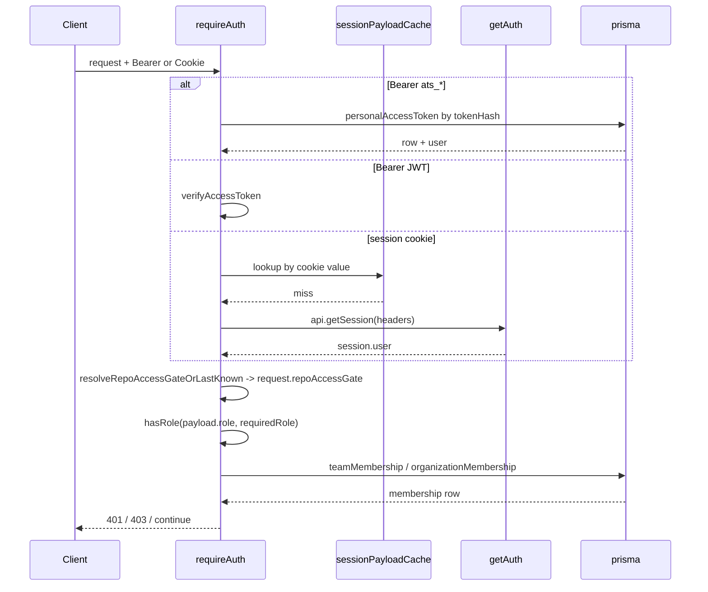

# Authentication, Authorization, and Access Scoping

> Indexed at commit `147d054a` on 2026-09-30 · [view on GitHub](https://github.com/yorch/auto-swe/tree/147d054a)

## Relevant source files

- [packages/gateway/src/lib/betterAuth.ts](https://github.com/yorch/auto-swe/blob/147d054a/packages/gateway/src/lib/betterAuth.ts)
- [packages/gateway/src/plugins/auth.ts](https://github.com/yorch/auto-swe/blob/147d054a/packages/gateway/src/plugins/auth.ts)
- [packages/gateway/src/plugins/auth.hook.test.ts](https://github.com/yorch/auto-swe/blob/147d054a/packages/gateway/src/plugins/auth.hook.test.ts)
- [packages/gateway/src/index.ts](https://github.com/yorch/auto-swe/blob/147d054a/packages/gateway/src/index.ts)
- [packages/gateway/src/routes/tokens.ts](https://github.com/yorch/auto-swe/blob/147d054a/packages/gateway/src/routes/tokens.ts)
- [packages/gateway/src/lib/orgAccess.ts](https://github.com/yorch/auto-swe/blob/147d054a/packages/gateway/src/lib/orgAccess.ts)
- [packages/gateway/src/lib/platformAdminScope.ts](https://github.com/yorch/auto-swe/blob/147d054a/packages/gateway/src/lib/platformAdminScope.ts)
- [packages/gateway/src/lib/runVisibility.ts](https://github.com/yorch/auto-swe/blob/147d054a/packages/gateway/src/lib/runVisibility.ts)
- [packages/gateway/src/lib/tenantScope.ts](https://github.com/yorch/auto-swe/blob/147d054a/packages/gateway/src/lib/tenantScope.ts)
- [packages/gateway/src/lib/githubAuth.ts](https://github.com/yorch/auto-swe/blob/147d054a/packages/gateway/src/lib/githubAuth.ts)
- [packages/gateway/src/routes/users.ts](https://github.com/yorch/auto-swe/blob/147d054a/packages/gateway/src/routes/users.ts)
- [packages/gateway/src/routes/teams.ts](https://github.com/yorch/auto-swe/blob/147d054a/packages/gateway/src/routes/teams.ts)
- [packages/gateway/src/routes/organizations.ts](https://github.com/yorch/auto-swe/blob/147d054a/packages/gateway/src/routes/organizations.ts)
- [packages/gateway/src/routes/orgMembers.ts](https://github.com/yorch/auto-swe/blob/147d054a/packages/gateway/src/routes/orgMembers.ts)
- [packages/gateway/src/routes/me.ts](https://github.com/yorch/auto-swe/blob/147d054a/packages/gateway/src/routes/me.ts)
- [packages/gateway/src/routes/admin.ts](https://github.com/yorch/auto-swe/blob/147d054a/packages/gateway/src/routes/admin.ts)
- [packages/gateway/src/scripts/provisionAuthAdmin.ts](https://github.com/yorch/auto-swe/blob/147d054a/packages/gateway/src/scripts/provisionAuthAdmin.ts)
- [packages/shared/src/config/permissions.ts](https://github.com/yorch/auto-swe/blob/147d054a/packages/shared/src/config/permissions.ts)
- [packages/shared/src/lib/tenantGuard.ts](https://github.com/yorch/auto-swe/blob/147d054a/packages/shared/src/lib/tenantGuard.ts)

## Overview

The gateway carries two independent identity systems that converge on one in-memory shape. Browsers authenticate with a better-auth cookie session; command-line and Continuous Integration (CI) clients authenticate with a bearer token, either a personal access token (PAT) or a short-lived JSON Web Token (JWT). Both paths are normalised into a `JwtPayload` carrying `sub`, `role`, and an optional `slackId`, so every downstream authorization check sees a single principal type regardless of how the caller arrived ([packages/gateway/src/plugins/auth.ts#L13-L19](https://github.com/yorch/auto-swe/blob/147d054a/packages/gateway/src/plugins/auth.ts#L13-L19)).

Authorization layers on top of that principal in four places: a platform role ladder, team membership roles, organization membership roles, and query-level visibility predicates that decide which rows a non-admin may read. The last of those now also depends on a per-request snapshot of the GitHub permission gate, resolved by the authentication hook. Which repositories a user may reach, and the GitHub-permission and per-user-credential rules behind that, are covered on [Repository Access and Credentials](./3.4-repository-access-and-credentials.md) and are not repeated here.

Sources: [packages/gateway/src/plugins/auth.ts:L1-L76](https://github.com/yorch/auto-swe/blob/147d054a/packages/gateway/src/plugins/auth.ts#L1-L76) [packages/gateway/src/lib/betterAuth.ts:L1-L14](https://github.com/yorch/auto-swe/blob/147d054a/packages/gateway/src/lib/betterAuth.ts#L1-L14)

## Sign-in methods

`buildAuth` in [packages/gateway/src/lib/betterAuth.ts#L335-L570](https://github.com/yorch/auto-swe/blob/147d054a/packages/gateway/src/lib/betterAuth.ts#L335-L570) constructs the better-auth instance against the gateway's shared Prisma client via `prismaAdapter`. It registers email plus password with `requireEmailVerification` and an eight-character minimum ([packages/gateway/src/lib/betterAuth.ts#L482-L500](https://github.com/yorch/auto-swe/blob/147d054a/packages/gateway/src/lib/betterAuth.ts#L482-L500)), a `magicLink` plugin with a ten-minute expiry ([packages/gateway/src/lib/betterAuth.ts#L502-L507](https://github.com/yorch/auto-swe/blob/147d054a/packages/gateway/src/lib/betterAuth.ts#L502-L507)), and GitHub and Google social providers. Each social provider is registered only when both its client id and client secret resolved, so an unconfigured provider is absent rather than broken ([packages/gateway/src/lib/betterAuth.ts#L537-L548](https://github.com/yorch/auto-swe/blob/147d054a/packages/gateway/src/lib/betterAuth.ts#L537-L548)).

Okta enterprise single sign-on is registered through better-auth's `genericOAuth` plugin, and only when issuer, client id, and client secret are all present ([packages/gateway/src/lib/betterAuth.ts#L508-L532](https://github.com/yorch/auto-swe/blob/147d054a/packages/gateway/src/lib/betterAuth.ts#L508-L532)). Because `genericOAuth` reuses the built-in social routes, Okta needs no client-side plugin.

Account linking by verified email is enabled, and the trusted-provider list contains only OAuth-verified legs. Email plus password is deliberately excluded: trusting it would let someone who merely knows a victim's address plant a credential that auto-links onto the victim's existing row ([packages/gateway/src/lib/betterAuth.ts#L375-L391](https://github.com/yorch/auto-swe/blob/147d054a/packages/gateway/src/lib/betterAuth.ts#L375-L391)). Okta joins that trusted set when configured.

Two `databaseHooks` run after the identity rows change. `user.create.after` adds every new user to the configured default team as `ENGINEER`; failures are logged and swallowed so a missing default team cannot block sign-up ([packages/gateway/src/lib/betterAuth.ts#L453-L480](https://github.com/yorch/auto-swe/blob/147d054a/packages/gateway/src/lib/betterAuth.ts#L453-L480)). The `account` hooks record the GitHub username behind a linked GitHub account. `refreshGithubLogin` runs on account create and on every account update, because `updateAccountOnSignIn` refreshes the stored token on each GitHub sign-in and that is where a renamed GitHub account is noticed. It does nothing for other providers, and it swallows failures for the same reason as the team hook ([packages/gateway/src/lib/betterAuth.ts#L336-L367](https://github.com/yorch/auto-swe/blob/147d054a/packages/gateway/src/lib/betterAuth.ts#L336-L367), [packages/gateway/src/lib/betterAuth.ts#L415-L451](https://github.com/yorch/auto-swe/blob/147d054a/packages/gateway/src/lib/betterAuth.ts#L415-L451)). Unlinking GitHub calls `clearGithubLogin`, so a login left behind cannot keep resolving repository permissions for an account no longer connected. The resulting `githubLogin` column is declared with `input: false`, so a client can never set it: a user who could write their own login could claim another person's repository access ([packages/gateway/src/lib/betterAuth.ts#L558-L567](https://github.com/yorch/auto-swe/blob/147d054a/packages/gateway/src/lib/betterAuth.ts#L558-L567)). What reads that login is described on [Repository Access and Credentials](./3.4-repository-access-and-credentials.md).

New users default to `isActive: false` and sit in an approval queue until an admin flips the flag ([packages/gateway/src/lib/betterAuth.ts#L555-L565](https://github.com/yorch/auto-swe/blob/147d054a/packages/gateway/src/lib/betterAuth.ts#L555-L565)).

Magic-link and password-reset emails resolve their transport at call time in a fixed order: Simple Mail Transfer Protocol (SMTP) through nodemailer, then the Resend Hypertext Transfer Protocol (HTTP) application programming interface (API), then a console log for development ([packages/gateway/src/lib/betterAuth.ts#L90-L218](https://github.com/yorch/auto-swe/blob/147d054a/packages/gateway/src/lib/betterAuth.ts#L90-L218)). The SMTP branch inspects `accepted` and `rejected` because `sendMail` resolves on submission acceptance rather than delivery.

The better-auth handler is mounted at `/api/auth/*`, with the eight credential-bearing paths registered separately under a 20-per-minute rate limit so that `/get-session` keeps the permissive global limit ([packages/gateway/src/index.ts#L257-L285](https://github.com/yorch/auto-swe/blob/147d054a/packages/gateway/src/index.ts#L257-L285)). `GET /api/v1/auth/providers` reports which providers are live so the login page renders only the buttons that work ([packages/gateway/src/index.ts#L290](https://github.com/yorch/auto-swe/blob/147d054a/packages/gateway/src/index.ts#L290)).

Sources: [packages/gateway/src/lib/betterAuth.ts:L335-L570](https://github.com/yorch/auto-swe/blob/147d054a/packages/gateway/src/lib/betterAuth.ts#L335-L570) [packages/gateway/src/lib/betterAuth.ts:L90-L218](https://github.com/yorch/auto-swe/blob/147d054a/packages/gateway/src/lib/betterAuth.ts#L90-L218) [packages/gateway/src/index.ts:L201-L290](https://github.com/yorch/auto-swe/blob/147d054a/packages/gateway/src/index.ts#L201-L290)

## Personal access tokens

A PAT is the string `ats_` followed by 32 bytes of base64url entropy ([packages/gateway/src/routes/tokens.ts#L21-L33](https://github.com/yorch/auto-swe/blob/147d054a/packages/gateway/src/routes/tokens.ts#L21-L33)). The prefix constant lives in the auth plugin and is imported by the mint route, so the mint and verify paths cannot drift ([packages/gateway/src/plugins/auth.ts#L222-L227](https://github.com/yorch/auto-swe/blob/147d054a/packages/gateway/src/plugins/auth.ts#L222-L227)).

`POST /api/v1/auth/tokens` stores only the SHA-256 hash plus a non-secret twelve-character prefix, and returns the plaintext exactly once in the 201 body ([packages/gateway/src/routes/tokens.ts#L79-L130](https://github.com/yorch/auto-swe/blob/147d054a/packages/gateway/src/routes/tokens.ts#L79-L130)). Listing and revocation are owner-scoped; a delete against another user's token returns 404 rather than 403, hiding the row's existence ([packages/gateway/src/routes/tokens.ts#L133-L152](https://github.com/yorch/auto-swe/blob/147d054a/packages/gateway/src/routes/tokens.ts#L133-L152)). Issue and revoke both write an audit-log entry through `safePatAuditFields`, which excludes both the plaintext and the stored hash ([packages/gateway/src/routes/tokens.ts#L35-L54](https://github.com/yorch/auto-swe/blob/147d054a/packages/gateway/src/routes/tokens.ts#L35-L54)).

Verification hashes the presented token, looks the row up by `tokenHash`, and rejects when the row is missing, revoked, or owned by an inactive user. An expiry in the past yields the distinct code `TOKEN_EXPIRED` ([packages/gateway/src/plugins/auth.ts#L242-L253](https://github.com/yorch/auto-swe/blob/147d054a/packages/gateway/src/plugins/auth.ts#L242-L253)). The `lastUsedAt` write is fire-and-forget so a slow update adds no request latency. The synthesized payload carries the owner's role and a 60-second expiry, so downstream role checks behave exactly as they do for a JWT.

Sources: [packages/gateway/src/routes/tokens.ts:L1-L184](https://github.com/yorch/auto-swe/blob/147d054a/packages/gateway/src/routes/tokens.ts#L1-L184) [packages/gateway/src/plugins/auth.ts:L222-L266](https://github.com/yorch/auto-swe/blob/147d054a/packages/gateway/src/plugins/auth.ts#L222-L266)

## JWTs and the session-token bridge

The auth plugin decorates the Fastify instance with `signAccessToken`, `verifyAccessToken`, `hashToken`, `signOAuthState`, and `verifyOAuthState` ([packages/gateway/src/plugins/auth.ts#L158-L195](https://github.com/yorch/auto-swe/blob/147d054a/packages/gateway/src/plugins/auth.ts#L158-L195)). Access tokens live one hour and carry the audience `auto-swe:api`; OAuth `state` tokens live ten minutes under `auto-swe:oauth-state`, so neither class can be presented as the other ([packages/gateway/src/plugins/auth.ts#L86-L104](https://github.com/yorch/auto-swe/blob/147d054a/packages/gateway/src/plugins/auth.ts#L86-L104)). State tokens additionally carry a `purpose`, verified as an exact match at the callback, so a token minted by the engineer-level Slack link flow cannot complete the admin-only bot install ([packages/gateway/src/plugins/auth.ts#L185-L194](https://github.com/yorch/auto-swe/blob/147d054a/packages/gateway/src/plugins/auth.ts#L185-L194)).

Signing uses RS256 when `JWT_PRIVATE_KEY_PATH` is set and HS256 otherwise. Both key getters refuse the development fallback secret unless `NODE_ENV` explicitly names `development` or `test`, treating an unset value as production so a forgetful deploy fails at boot ([packages/gateway/src/plugins/auth.ts#L106-L151](https://github.com/yorch/auto-swe/blob/147d054a/packages/gateway/src/plugins/auth.ts#L106-L151)). The better-auth secret applies the same guard ([packages/gateway/src/lib/betterAuth.ts#L40-L54](https://github.com/yorch/auto-swe/blob/147d054a/packages/gateway/src/lib/betterAuth.ts#L40-L54)).

`POST /api/v1/auth/session-token` is the bridge: it reads the better-auth session, re-fetches the canonical user row to confirm `isActive`, and mints an access token reporting `ACCESS_TOKEN_TTL_SECONDS` as its lifetime ([packages/gateway/src/index.ts#L292-L331](https://github.com/yorch/auto-swe/blob/147d054a/packages/gateway/src/index.ts#L292-L331)). Since the authentication hook accepts the session cookie directly, the bridge is a convenience for clients that want a bearer token rather than a requirement; the hook's own comment says the cookie path removes the need for it "in the long run" ([packages/gateway/src/plugins/auth.ts#L396-L404](https://github.com/yorch/auto-swe/blob/147d054a/packages/gateway/src/plugins/auth.ts#L396-L404)).

Sources: [packages/gateway/src/plugins/auth.ts:L86-L199](https://github.com/yorch/auto-swe/blob/147d054a/packages/gateway/src/plugins/auth.ts#L86-L199) [packages/gateway/src/index.ts:L292-L331](https://github.com/yorch/auto-swe/blob/147d054a/packages/gateway/src/index.ts#L292-L331)

## The requireAuth hook

`requireAuth(options)` returns an `onRequest` hook and is the single entry point every protected route uses ([packages/gateway/src/plugins/auth.ts#L376-L507](https://github.com/yorch/auto-swe/blob/147d054a/packages/gateway/src/plugins/auth.ts#L376-L507)). It branches on the presence of an `Authorization: Bearer` header. With one, an `ats_` prefix routes to PAT verification and anything else to JWT verification. Without one, it falls through to the better-auth session cookie. A failure on either path ends in 401 with a typed code.

Once a principal exists, the hook does one more thing before any role check: it resolves the repository permission gate and stores it on `request.repoAccessGate`. The reason is structural. The visibility filters are pure synchronous functions called inside `where` literals, so letting them resolve their own configuration would mean awaiting mid-expression at roughly twenty call sites; resolving once here, behind the setting registry's cache, makes each filter a memory read ([packages/gateway/src/plugins/auth.ts#L36-L46](https://github.com/yorch/auto-swe/blob/147d054a/packages/gateway/src/plugins/auth.ts#L36-L46)). A failed read never fails the request, but it does not silently disable enforcement either: `resolveRepoAccessGateOrLastKnown` falls back to the last value this process read, and only a process that has never read it at all proceeds with mode `off` and a logged warning ([packages/gateway/src/plugins/auth.ts#L415-L425](https://github.com/yorch/auto-swe/blob/147d054a/packages/gateway/src/plugins/auth.ts#L415-L425)). The resolver's timeout and backoff behaviour is described on [Repository Access and Credentials](./3.4-repository-access-and-credentials.md).

```mermaid
sequenceDiagram
    participant Client
    participant requireAuth
    participant sessionPayloadCache
    participant getAuth
    participant prisma

    Client->>requireAuth: request + Bearer or Cookie
    alt Bearer ats_*
        requireAuth->>prisma: personalAccessToken by tokenHash
        prisma-->>requireAuth: row + user
    else Bearer JWT
        requireAuth->>requireAuth: verifyAccessToken
    else session cookie
        requireAuth->>sessionPayloadCache: lookup by cookie value
        sessionPayloadCache-->>requireAuth: miss
        requireAuth->>getAuth: api.getSession(headers)
        getAuth-->>requireAuth: session.user
    end
    requireAuth->>requireAuth: resolveRepoAccessGateOrLastKnown -> request.repoAccessGate
    requireAuth->>requireAuth: hasRole(payload.role, requiredRole)
    requireAuth->>prisma: teamMembership / organizationMembership
    prisma-->>requireAuth: membership row
    requireAuth-->>Client: 401 / 403 / continue
```

The cookie path is served by `verifyBetterAuthSession`, which first consults `sessionPayloadCache`, a FIFO map capped at 2000 entries with a 60-second time-to-live overridable through `SESSION_CACHE_TTL_MS` ([packages/gateway/src/plugins/auth.ts#L268-L374](https://github.com/yorch/auto-swe/blob/147d054a/packages/gateway/src/plugins/auth.ts#L268-L374)). The cache removes a Postgres round trip from each of the five to fifteen API calls a dashboard page render fires. Its cost is a revocation lag, closed explicitly wherever a session's authority ends. Sign-out and revoke-session invalidate the cookie snapshotted before better-auth ran ([packages/gateway/src/index.ts#L209-L246](https://github.com/yorch/auto-swe/blob/147d054a/packages/gateway/src/index.ts#L209-L246)), the admin session-delete route drops the deleted row's token ([packages/gateway/src/routes/admin.ts#L196-L199](https://github.com/yorch/auto-swe/blob/147d054a/packages/gateway/src/routes/admin.ts#L196-L199)), and a role or activity change on `PATCH /api/v1/users/:id` drops every cached session for that user ([packages/gateway/src/routes/users.ts#L327-L340](https://github.com/yorch/auto-swe/blob/147d054a/packages/gateway/src/routes/users.ts#L327-L340)).

Handlers narrow the principal with `requireUser(request)`, which throws if the hook did not run rather than returning `undefined` ([packages/gateway/src/plugins/auth.ts#L67-L76](https://github.com/yorch/auto-swe/blob/147d054a/packages/gateway/src/plugins/auth.ts#L67-L76)).

Sources: [packages/gateway/src/plugins/auth.ts:L268-L507](https://github.com/yorch/auto-swe/blob/147d054a/packages/gateway/src/plugins/auth.ts#L268-L507) [packages/gateway/src/plugins/auth.hook.test.ts:L115-L262](https://github.com/yorch/auto-swe/blob/147d054a/packages/gateway/src/plugins/auth.hook.test.ts#L115-L262)

## Role model and route declarations

Three ladders coexist, and they are ranked in separate maps. The platform ladder is `ADMIN > LEAD > ENGINEER`, ranked once in `roleMeets` in the shared package so the setting registry's `requiredRole` floor and the gateway's `hasRole` cannot disagree ([packages/shared/src/config/permissions.ts#L20-L30](https://github.com/yorch/auto-swe/blob/147d054a/packages/shared/src/config/permissions.ts#L20-L30), [packages/gateway/src/plugins/auth.ts#L49-L55](https://github.com/yorch/auto-swe/blob/147d054a/packages/gateway/src/plugins/auth.ts#L49-L55)). Team membership reuses the same three values. The organization ladder is separate: `ORG_ADMIN > ORG_MEMBER`, ranked in the gateway-local `ORG_ROLE_HIERARCHY` and checked by `hasOrgRole` ([packages/gateway/src/plugins/auth.ts#L57-L65](https://github.com/yorch/auto-swe/blob/147d054a/packages/gateway/src/plugins/auth.ts#L57-L65)). Both lookups treat an unrecognised role as rank zero, so an unknown value is denied rather than granted. The shared ladder is documented as a seniority floor only, not a claim that a `LEAD` can do everything an `ENGINEER` can.

| Option | Type | Default | Purpose |
| ------ | ---- | ------- | ------- |
| `requiredRole` | `string` | none | Platform role floor checked against the token's `role` |
| `requiredTeamRole` | `string` | none | Team role floor resolved through `TeamMembership` |
| `teamIdParam` | `string` | `'id'` | Route param holding the team identifier |
| `requiredOrgRole` | `string` | none | Org role floor resolved through `OrganizationMembership` |
| `orgIdParam` | `string` | `'orgId'` | Route param holding the organization identifier |

Order matters: the platform check runs first and short-circuits, so a platform-role failure never reaches a membership lookup. Platform admins then bypass both the team and the org branch outright. A route that declares a membership role but supplies no matching param returns 500, not a silent grant, and a non-UUID identifier returns 400 before any query runs ([packages/gateway/src/plugins/auth.ts#L427-L507](https://github.com/yorch/auto-swe/blob/147d054a/packages/gateway/src/plugins/auth.ts#L427-L507)). A successful team check writes the resolved role onto `request.teamRole` for the handler.

Team routes combine both floors. Renaming a team requires `LEAD` on the platform and `LEAD` in that team ([packages/gateway/src/routes/teams.ts#L217](https://github.com/yorch/auto-swe/blob/147d054a/packages/gateway/src/routes/teams.ts#L217)), while creating or deleting one is platform `ADMIN` ([packages/gateway/src/routes/teams.ts#L97](https://github.com/yorch/auto-swe/blob/147d054a/packages/gateway/src/routes/teams.ts#L97), [packages/gateway/src/routes/teams.ts#L386](https://github.com/yorch/auto-swe/blob/147d054a/packages/gateway/src/routes/teams.ts#L386)). Organization routes mix the two ladders. The per-organization routes use only the org ladder: reads take `ORG_MEMBER`, writes take `ORG_ADMIN` ([packages/gateway/src/routes/organizations.ts#L104-L177](https://github.com/yorch/auto-swe/blob/147d054a/packages/gateway/src/routes/organizations.ts#L104-L177), [packages/gateway/src/routes/orgMembers.ts#L72-L230](https://github.com/yorch/auto-swe/blob/147d054a/packages/gateway/src/routes/orgMembers.ts#L72-L230)). The two list routes use the platform ladder instead, since they are not scoped to one organization: the caller's own list takes `LEAD` and the cross-organization budget-alert list takes `ADMIN` ([packages/gateway/src/routes/organizations.ts#L63](https://github.com/yorch/auto-swe/blob/147d054a/packages/gateway/src/routes/organizations.ts#L63), [packages/gateway/src/routes/organizations.ts#L92](https://github.com/yorch/auto-swe/blob/147d054a/packages/gateway/src/routes/organizations.ts#L92)). Every user-administration route is platform `ADMIN` ([packages/gateway/src/routes/users.ts#L91-L272](https://github.com/yorch/auto-swe/blob/147d054a/packages/gateway/src/routes/users.ts#L91-L272)), and self-service preference routes require only `ENGINEER` and read `sub` from the token rather than a path parameter ([packages/gateway/src/routes/me.ts#L15-L56](https://github.com/yorch/auto-swe/blob/147d054a/packages/gateway/src/routes/me.ts#L15-L56)).

Sources: [packages/gateway/src/plugins/auth.ts:L49-L65](https://github.com/yorch/auto-swe/blob/147d054a/packages/gateway/src/plugins/auth.ts#L49-L65) [packages/gateway/src/plugins/auth.ts:L427-L507](https://github.com/yorch/auto-swe/blob/147d054a/packages/gateway/src/plugins/auth.ts#L427-L507) [packages/shared/src/config/permissions.ts:L15-L30](https://github.com/yorch/auto-swe/blob/147d054a/packages/shared/src/config/permissions.ts#L15-L26) [packages/gateway/src/routes/teams.ts:L95-L390](https://github.com/yorch/auto-swe/blob/147d054a/packages/gateway/src/routes/teams.ts#L95-L390) [packages/gateway/src/routes/orgMembers.ts:L60-L240](https://github.com/yorch/auto-swe/blob/147d054a/packages/gateway/src/routes/orgMembers.ts#L60-L240)

## Access scoping below the route

Declarative hooks cover routes whose tenant is in the path. Work-request submission derives its organization from the target connection inside the handler, so `assertOrgAccess` performs the same check imperatively, short-circuiting for platform admins and sending 403 itself ([packages/gateway/src/lib/orgAccess.ts#L24-L45](https://github.com/yorch/auto-swe/blob/147d054a/packages/gateway/src/lib/orgAccess.ts#L24-L45)). Its neighbour `assertOrgBudget` enforces the monthly cap under a per-organization advisory lock and returns 402 on breach ([packages/gateway/src/lib/orgAccess.ts#L47-L91](https://github.com/yorch/auto-swe/blob/147d054a/packages/gateway/src/lib/orgAccess.ts#L47-L91)).

Row visibility is a separate concern from route access, and it now has two predicates per entity rather than one. Both take the actor and the gate that `requireAuth` stored on the request, and the gate argument is required: `MaybeGate` may be `undefined`, but a call site must say so, so a new caller that forgets it fails to compile instead of running ungated ([packages/gateway/src/lib/tenantScope.ts#L62-L76](https://github.com/yorch/auto-swe/blob/147d054a/packages/gateway/src/lib/tenantScope.ts#L62-L76)).

- **Visibility.** `buildWorkflowRunVisibilityFilter` returns an empty predicate for admins and otherwise a three-branch `OR`: global templates, templates owned by one of the caller's teams, or runs whose work request touches a repository the caller can reach. That last branch goes through `reachableConnections`, which ANDs team-or-shared-team membership with the GitHub permission requirement, so a permission row can only take access away ([packages/gateway/src/lib/runVisibility.ts#L21-L43](https://github.com/yorch/auto-swe/blob/147d054a/packages/gateway/src/lib/runVisibility.ts#L21-L43), [packages/gateway/src/lib/tenantScope.ts#L99-L120](https://github.com/yorch/auto-swe/blob/147d054a/packages/gateway/src/lib/tenantScope.ts#L99-L120)). `buildWorkflowHumanStepVisibilityFilter` nests that predicate under `run` for the inbox ([packages/gateway/src/lib/runVisibility.ts#L95-L103](https://github.com/yorch/auto-swe/blob/147d054a/packages/gateway/src/lib/runVisibility.ts#L95-L103)).
- **Control.** `buildWorkflowRunControlFilter` decides which runs a caller may cancel or answer a human step on, and it is deliberately narrower. A repository shared with the caller's team lets them see the owning team's runs and start their own, not stop or steer the owning team's. So the repository branch admits only the owning team's members (still subject to the permission requirement), alongside team-owned templates and any run the caller launched themselves. It has no global-template branch, because every engineering run uses a built-in global template and that branch would hand control of every run to every signed-in user ([packages/gateway/src/lib/runVisibility.ts#L45-L81](https://github.com/yorch/auto-swe/blob/147d054a/packages/gateway/src/lib/runVisibility.ts#L45-L81)). `buildWorkflowHumanStepControlFilter` wraps it for human steps ([packages/gateway/src/lib/runVisibility.ts#L83-L92](https://github.com/yorch/auto-swe/blob/147d054a/packages/gateway/src/lib/runVisibility.ts#L83-L92)). The run-cancel route, the Slack action path, and the shared human-step resolver all use it ([packages/gateway/src/routes/workflowRuns.ts#L205](https://github.com/yorch/auto-swe/blob/147d054a/packages/gateway/src/routes/workflowRuns.ts#L205), [packages/gateway/src/routes/slack.ts#L154](https://github.com/yorch/auto-swe/blob/147d054a/packages/gateway/src/routes/slack.ts#L154), [packages/gateway/src/lib/hitlResolve.ts#L263](https://github.com/yorch/auto-swe/blob/147d054a/packages/gateway/src/lib/hitlResolve.ts#L263)).

Both predicates are spread into `where` clauses across the run, template, human-step, and Slack routes rather than applied by a hook, which keeps the predicate visible at each query; the route files pass `request.repoAccessGate` as the gate ([packages/gateway/src/routes/workflowRuns.ts#L145](https://github.com/yorch/auto-swe/blob/147d054a/packages/gateway/src/routes/workflowRuns.ts#L145)). Team listings use the same shared `memberTeams` helper for the membership leg ([packages/gateway/src/routes/teams.ts#L146-L168](https://github.com/yorch/auto-swe/blob/147d054a/packages/gateway/src/routes/teams.ts#L146-L168)).

The empty-object admin branch is indistinguishable from a forgotten filter, which is the exact bug the shared `tenantGuard` exists to catch. The guard fails any multi-row query on a tenant-scoped model that carries no tenant predicate, and its model set now holds 20 models, `ConnectionTeamShare` among them ([packages/shared/src/lib/tenantGuard.ts#L1-L23](https://github.com/yorch/auto-swe/blob/147d054a/packages/shared/src/lib/tenantGuard.ts#L1-L23), [packages/shared/src/lib/tenantGuard.ts#L25-L46](https://github.com/yorch/auto-swe/blob/147d054a/packages/shared/src/lib/tenantGuard.ts#L25-L46)). `asPlatformAdmin` resolves the admin branch: it runs the callback through `runUnscoped` only when the caller is an admin, naming the reason and the models involved, and leaves the guard live for everyone else ([packages/gateway/src/lib/platformAdminScope.ts#L16-L23](https://github.com/yorch/auto-swe/blob/147d054a/packages/gateway/src/lib/platformAdminScope.ts#L16-L23)). Eight call sites across seven route files use it, among them repositories, teams, lessons, and Slack channels.

Sources: [packages/gateway/src/lib/orgAccess.ts:L1-L91](https://github.com/yorch/auto-swe/blob/147d054a/packages/gateway/src/lib/orgAccess.ts#L1-L91) [packages/gateway/src/lib/runVisibility.ts:L1-L103](https://github.com/yorch/auto-swe/blob/147d054a/packages/gateway/src/lib/runVisibility.ts#L1-L103) [packages/gateway/src/lib/tenantScope.ts:L37-L120](https://github.com/yorch/auto-swe/blob/147d054a/packages/gateway/src/lib/tenantScope.ts#L37-L120) [packages/gateway/src/lib/platformAdminScope.ts:L1-L24](https://github.com/yorch/auto-swe/blob/147d054a/packages/gateway/src/lib/platformAdminScope.ts#L1-L24) [packages/shared/src/lib/tenantGuard.ts:L1-L46](https://github.com/yorch/auto-swe/blob/147d054a/packages/shared/src/lib/tenantGuard.ts#L1-L46)

## Startup-time credential reads

`initAuth()` runs before the Fastify instance is even constructed, resolving GitHub, Google, and Okta credentials from the database with environment-variable fallback and storing them in module-level variables ([packages/gateway/src/index.ts#L75-L81](https://github.com/yorch/auto-swe/blob/147d054a/packages/gateway/src/index.ts#L75-L81), [packages/gateway/src/lib/betterAuth.ts#L286-L309](https://github.com/yorch/auto-swe/blob/147d054a/packages/gateway/src/lib/betterAuth.ts#L286-L309)). Repeat calls are no-ops because the singleton already exists.

Operationally this means an admin who edits OAuth credentials at `/admin/integrations` sees no effect until the gateway restarts. Provider registration is decided once, so enabling GitHub sign-in on a running server leaves `configuredProviders()` reporting it as off and the login button hidden ([packages/gateway/src/lib/betterAuth.ts#L572-L587](https://github.com/yorch/auto-swe/blob/147d054a/packages/gateway/src/lib/betterAuth.ts#L572-L587)). Okta is stricter still: the `genericOAuth` plugin fetches the OpenID Connect discovery document during `init`, so the issuer is read at boot. A discovery fetch that fails for a configured provider is logged without throwing, meaning an Okta outage cannot stop the gateway from booting, but Okta sign-in stays broken until a restart against a reachable issuer ([packages/gateway/src/lib/betterAuth.ts#L508-L532](https://github.com/yorch/auto-swe/blob/147d054a/packages/gateway/src/lib/betterAuth.ts#L508-L532)).

Two settings escape this freeze because they are re-read per call. The default team slug is resolved inside the sign-up hook, and the email transport is resolved inside each delivery function, so both take effect without a restart. The repository permission gate is also re-read, but on every authenticated request through the hook rather than at boot, so changing its mode needs no restart either ([packages/gateway/src/plugins/auth.ts#L415-L425](https://github.com/yorch/auto-swe/blob/147d054a/packages/gateway/src/plugins/auth.ts#L415-L425)). The gateway also reconciles the repository-access sweep schedule against the registry at startup, paused unless an admin has enabled it ([packages/gateway/src/index.ts#L159-L169](https://github.com/yorch/auto-swe/blob/147d054a/packages/gateway/src/index.ts#L159-L169)).

By contrast, GitHub outbound credentials follow a different lifecycle entirely and are not part of sign-in. The gateway's `githubAuth.ts` is now only a re-export of the shared installation resolver, which the worker also uses, so both resolve a given installation the same way; see [GitHub and Webhooks](./3.3-github-and-webhooks.md) ([packages/gateway/src/lib/githubAuth.ts#L1-L14](https://github.com/yorch/auto-swe/blob/147d054a/packages/gateway/src/lib/githubAuth.ts#L1-L14)).

For local bootstrap, `provisionAuthAdmin.ts` idempotently creates the better-auth credential account for the seeded admin. The shared seed writes a legacy bcrypt hash, while better-auth stores a scrypt hash on its own `Account` row, so without this script the seeded admin can use magic link or social sign-in but not the password tab ([packages/gateway/src/scripts/provisionAuthAdmin.ts#L1-L46](https://github.com/yorch/auto-swe/blob/147d054a/packages/gateway/src/scripts/provisionAuthAdmin.ts#L1-L46)).

Sources: [packages/gateway/src/lib/betterAuth.ts:L56-L66](https://github.com/yorch/auto-swe/blob/147d054a/packages/gateway/src/lib/betterAuth.ts#L56-L66) [packages/gateway/src/lib/betterAuth.ts:L286-L335](https://github.com/yorch/auto-swe/blob/147d054a/packages/gateway/src/lib/betterAuth.ts#L286-L335) [packages/gateway/src/lib/betterAuth.ts:L572-L587](https://github.com/yorch/auto-swe/blob/147d054a/packages/gateway/src/lib/betterAuth.ts#L572-L587) [packages/gateway/src/lib/githubAuth.ts:L1-L14](https://github.com/yorch/auto-swe/blob/147d054a/packages/gateway/src/lib/githubAuth.ts#L1-L14) [packages/gateway/src/scripts/provisionAuthAdmin.ts:L1-L118](https://github.com/yorch/auto-swe/blob/147d054a/packages/gateway/src/scripts/provisionAuthAdmin.ts#L1-L118)

## Related Pages

- Parent: [Gateway API](./3-gateway-api.md)
- Sibling: [HTTP Routes](./3.1-http-routes.md)
- Sibling: [GitHub and Webhooks](./3.3-github-and-webhooks.md)
- Sibling: [Repository Access and Credentials](./3.4-repository-access-and-credentials.md)
