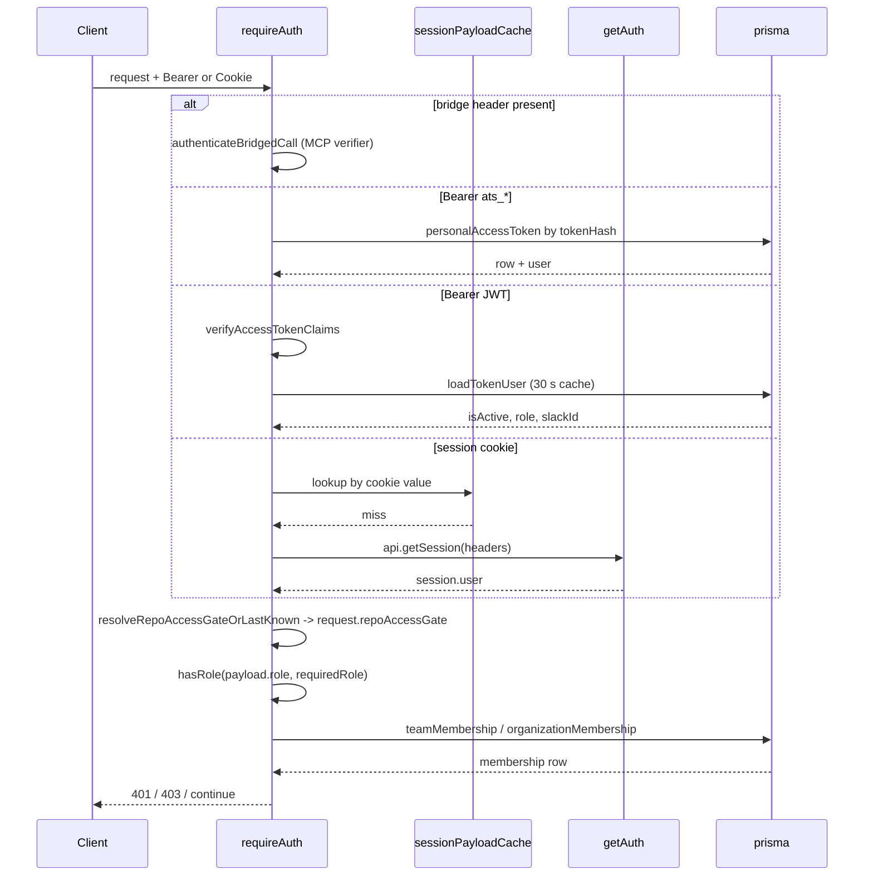

# Authentication, Authorization, and Access Scoping

> Indexed at commit `ae416937` on 2026-10-03 · [view on GitHub](https://github.com/yorch/auto-swe/tree/ae416937)

## Relevant source files

- [packages/gateway/src/lib/betterAuth.ts](https://github.com/yorch/auto-swe/blob/ae416937/packages/gateway/src/lib/betterAuth.ts)
- [packages/gateway/src/lib/betterAuthHandler.ts](https://github.com/yorch/auto-swe/blob/ae416937/packages/gateway/src/lib/betterAuthHandler.ts)
- [packages/gateway/src/lib/canonicalPath.ts](https://github.com/yorch/auto-swe/blob/ae416937/packages/gateway/src/lib/canonicalPath.ts)
- [packages/gateway/src/lib/githubEnterpriseAuth.ts](https://github.com/yorch/auto-swe/blob/ae416937/packages/gateway/src/lib/githubEnterpriseAuth.ts)
- [packages/gateway/src/lib/authEmail.ts](https://github.com/yorch/auto-swe/blob/ae416937/packages/gateway/src/lib/authEmail.ts)
- [packages/gateway/src/plugins/auth.ts](https://github.com/yorch/auto-swe/blob/ae416937/packages/gateway/src/plugins/auth.ts)
- [packages/gateway/src/plugins/auth.hook.test.ts](https://github.com/yorch/auto-swe/blob/ae416937/packages/gateway/src/plugins/auth.hook.test.ts)
- [packages/gateway/src/index.ts](https://github.com/yorch/auto-swe/blob/ae416937/packages/gateway/src/index.ts)
- [packages/gateway/src/routes/tokens.ts](https://github.com/yorch/auto-swe/blob/ae416937/packages/gateway/src/routes/tokens.ts)
- [packages/gateway/src/lib/orgAccess.ts](https://github.com/yorch/auto-swe/blob/ae416937/packages/gateway/src/lib/orgAccess.ts)
- [packages/gateway/src/lib/platformAdminScope.ts](https://github.com/yorch/auto-swe/blob/ae416937/packages/gateway/src/lib/platformAdminScope.ts)
- [packages/gateway/src/lib/runVisibility.ts](https://github.com/yorch/auto-swe/blob/ae416937/packages/gateway/src/lib/runVisibility.ts)
- [packages/gateway/src/lib/tenantScope.ts](https://github.com/yorch/auto-swe/blob/ae416937/packages/gateway/src/lib/tenantScope.ts)
- [packages/gateway/src/routes/users.ts](https://github.com/yorch/auto-swe/blob/ae416937/packages/gateway/src/routes/users.ts)
- [packages/gateway/src/routes/teams.ts](https://github.com/yorch/auto-swe/blob/ae416937/packages/gateway/src/routes/teams.ts)
- [packages/gateway/src/routes/organizations.ts](https://github.com/yorch/auto-swe/blob/ae416937/packages/gateway/src/routes/organizations.ts)
- [packages/gateway/src/routes/orgMembers.ts](https://github.com/yorch/auto-swe/blob/ae416937/packages/gateway/src/routes/orgMembers.ts)
- [packages/gateway/src/routes/me.ts](https://github.com/yorch/auto-swe/blob/ae416937/packages/gateway/src/routes/me.ts)
- [packages/gateway/src/routes/admin.ts](https://github.com/yorch/auto-swe/blob/ae416937/packages/gateway/src/routes/admin.ts)
- [packages/gateway/src/scripts/provisionAuthAdmin.ts](https://github.com/yorch/auto-swe/blob/ae416937/packages/gateway/src/scripts/provisionAuthAdmin.ts)
- [packages/shared/src/config/permissions.ts](https://github.com/yorch/auto-swe/blob/ae416937/packages/shared/src/config/permissions.ts)
- [packages/shared/src/lib/tenantGuard.ts](https://github.com/yorch/auto-swe/blob/ae416937/packages/shared/src/lib/tenantGuard.ts)
- [packages/shared/src/lib/systemConfig.ts](https://github.com/yorch/auto-swe/blob/ae416937/packages/shared/src/lib/systemConfig.ts)

## Overview

The gateway accepts three kinds of credential and converges them on one in-memory shape. Browsers authenticate with a better-auth cookie session. Command-line and Continuous Integration (CI) clients authenticate with a bearer token: a personal access token (PAT) or a short-lived JSON Web Token (JWT). MCP clients authenticate with an OAuth access token that better-auth issues, and that token is honoured only on routes that opt in to it. Each path is normalised into a `JwtPayload` carrying `sub`, `role`, and an optional `slackId`, so every downstream authorization check sees a single principal type regardless of how the caller arrived ([packages/gateway/src/plugins/auth.ts#L16-L22](https://github.com/yorch/auto-swe/blob/ae416937/packages/gateway/src/plugins/auth.ts#L16-L22)).

Authorization layers on top of that principal in four places: a platform role ladder, team membership roles, organization membership roles, and query-level visibility predicates that decide which rows a non-admin may read. The last of those also depends on a per-request snapshot of the GitHub permission gate, resolved by the authentication hook. Which repositories a user may reach, and the GitHub-permission and per-user-credential rules behind that, are covered on [Repository Access and Credentials](./3.4-repository-access-and-credentials.md). The MCP authorization server, its consent flow, and the MCP endpoint are covered on [MCP Server and OAuth](./3.5-mcp-server-and-oauth.md); this page covers only where they meet the authentication hook.

Sources: [packages/gateway/src/plugins/auth.ts:L16-L76](https://github.com/yorch/auto-swe/blob/ae416937/packages/gateway/src/plugins/auth.ts#L16-L76) [packages/gateway/src/lib/betterAuth.ts:L1-L14](https://github.com/yorch/auto-swe/blob/ae416937/packages/gateway/src/lib/betterAuth.ts#L1-L14)

## Sign-in methods

`buildAuth` in [packages/gateway/src/lib/betterAuth.ts#L261-L570](https://github.com/yorch/auto-swe/blob/ae416937/packages/gateway/src/lib/betterAuth.ts#L261-L570) constructs the better-auth instance against the gateway's shared Prisma client via `prismaAdapter`. It registers:

- email plus password, with `requireEmailVerification` on and an eight-character minimum ([packages/gateway/src/lib/betterAuth.ts#L427-L446](https://github.com/yorch/auto-swe/blob/ae416937/packages/gateway/src/lib/betterAuth.ts#L427-L446));
- a `magicLink` plugin with a ten-minute expiry ([packages/gateway/src/lib/betterAuth.ts#L448-L452](https://github.com/yorch/auto-swe/blob/ae416937/packages/gateway/src/lib/betterAuth.ts#L448-L452));
- Google as a built-in social provider, and GitHub as a built-in social provider when the GitHub base URL is github.com, each only when its client id and secret are both present, so an unconfigured provider is absent rather than broken ([packages/gateway/src/lib/betterAuth.ts#L534-L548](https://github.com/yorch/auto-swe/blob/ae416937/packages/gateway/src/lib/betterAuth.ts#L534-L548));
- one `genericOAuth` plugin that carries every provider the built-in adapters cannot: GitHub Enterprise (registered under the id `github`) and Okta, with the plugin omitted when neither applies ([packages/gateway/src/lib/betterAuth.ts#L262-L272](https://github.com/yorch/auto-swe/blob/ae416937/packages/gateway/src/lib/betterAuth.ts#L262-L272), [packages/gateway/src/lib/betterAuth.ts#L453-L466](https://github.com/yorch/auto-swe/blob/ae416937/packages/gateway/src/lib/betterAuth.ts#L453-L466)). Because `genericOAuth` reuses the built-in social routes, neither needs a client-side plugin.

### Where each credential is read

Sign-in credentials come from environment variables, read once at boot by `initAuth()`. Google reads `GOOGLE_CLIENT_ID` and `GOOGLE_CLIENT_SECRET`; Okta reads `OKTA_ISSUER`, `OKTA_CLIENT_ID` and `OKTA_CLIENT_SECRET`; GitHub reads `GITHUB_CLIENT_ID` and `GITHUB_CLIENT_SECRET`. All three resolvers read `process.env` directly and never touch the database, because better-auth consumes them once at construction, so an editable copy could never take effect without a restart ([packages/shared/src/lib/systemConfig.ts#L142-L144](https://github.com/yorch/auto-swe/blob/ae416937/packages/shared/src/lib/systemConfig.ts#L142-L144), [packages/shared/src/lib/systemConfig.ts#L632-L668](https://github.com/yorch/auto-swe/blob/ae416937/packages/shared/src/lib/systemConfig.ts#L632-L668)). The one database read in sign-in setup is the GitHub config row, which supplies the base URL and API URL that decide which GitHub flavour to wire ([packages/gateway/src/lib/betterAuth.ts#L188-L218](https://github.com/yorch/auto-swe/blob/ae416937/packages/gateway/src/lib/betterAuth.ts#L188-L218)).

Okta needs all three values, and the issuer is checked first: it must pass the server-side request guard and use `https`, because its discovery document is fetched at boot. A rejected issuer disables Okta alone and logs the reason, so a typo cannot take down email and the other methods ([packages/gateway/src/lib/betterAuth.ts#L205-L234](https://github.com/yorch/auto-swe/blob/ae416937/packages/gateway/src/lib/betterAuth.ts#L205-L234)).

### GitHub and GitHub Enterprise

`resolveGithubSignIn` classifies GitHub sign-in as one of three modes: `none` when the id or secret is missing or a saved URL is not valid http(s); `builtin` when the base URL host is github.com; and `ghe` for any other host ([packages/gateway/src/lib/githubEnterpriseAuth.ts#L96-L99](https://github.com/yorch/auto-swe/blob/ae416937/packages/gateway/src/lib/githubEnterpriseAuth.ts#L96-L99), [packages/gateway/src/lib/githubEnterpriseAuth.ts#L146-L196](https://github.com/yorch/auto-swe/blob/ae416937/packages/gateway/src/lib/githubEnterpriseAuth.ts#L146-L196)). It never throws, because it runs at boot. The built-in better-auth GitHub provider is fixed to github.com, so the `ghe` mode registers a generic-OAuth provider under the same `github` id, with authorize and token URLs built from the base URL, scopes `read:user` and `user:email`, and PKCE off. Reusing the id keeps the callback URL, existing account rows and every `'github'` check unchanged; the cost is that Enterprise sign-in replaces github.com sign-in rather than coexisting with it ([docs/adr/ghe-github-signin.md](https://github.com/yorch/auto-swe/blob/ae416937/docs/adr/ghe-github-signin.md)).

Two details keep Enterprise sign-in safe. The API root is derived once: when the saved API URL is still `api.github.com` but the base URL is not, it becomes `{base}/api/v3`, and the post-sign-in login sync uses that same value, so a user's Enterprise access token is never sent to api.github.com ([packages/gateway/src/lib/githubEnterpriseAuth.ts#L119-L124](https://github.com/yorch/auto-swe/blob/ae416937/packages/gateway/src/lib/githubEnterpriseAuth.ts#L119-L124), [packages/gateway/src/lib/betterAuth.ts#L291-L294](https://github.com/yorch/auto-swe/blob/ae416937/packages/gateway/src/lib/betterAuth.ts#L291-L294)). And the profile is accepted only when `/user/emails` holds a primary, verified address, because `github` is a trusted provider for account linking and an unverified address could link onto someone else's user; the account id is prefixed with the host, since accounts are unique on `(providerId, accountId)` and both GitHub flavours share the `github` provider id ([packages/gateway/src/lib/githubEnterpriseAuth.ts#L41-L94](https://github.com/yorch/auto-swe/blob/ae416937/packages/gateway/src/lib/githubEnterpriseAuth.ts#L41-L94)).

### Linking, hooks, and approval

Account linking by verified email is enabled, and the trusted-provider list contains only OAuth-verified legs: `github` and `google`, plus `okta` when configured. Email plus password is deliberately excluded: trusting it would let someone who merely knows a victim's address plant a credential that auto-links onto the victim's existing row ([packages/gateway/src/lib/betterAuth.ts#L310-L332](https://github.com/yorch/auto-swe/blob/ae416937/packages/gateway/src/lib/betterAuth.ts#L310-L332)).

Two `databaseHooks` run after the identity rows change. `user.create.after` adds every new user to the configured default team as `ENGINEER`; failures are logged and swallowed so a missing default team cannot block sign-up ([packages/gateway/src/lib/betterAuth.ts#L398-L425](https://github.com/yorch/auto-swe/blob/ae416937/packages/gateway/src/lib/betterAuth.ts#L398-L425)). The `account` hooks record the GitHub username behind a linked GitHub account. `refreshGithubLogin` runs on account create and on every account update, because `updateAccountOnSignIn` refreshes the stored token on each GitHub sign-in and that is where a renamed GitHub account is noticed. It does nothing for other providers and swallows failures for the same reason as the team hook ([packages/gateway/src/lib/betterAuth.ts#L274-L308](https://github.com/yorch/auto-swe/blob/ae416937/packages/gateway/src/lib/betterAuth.ts#L274-L308), [packages/gateway/src/lib/betterAuth.ts#L360-L397](https://github.com/yorch/auto-swe/blob/ae416937/packages/gateway/src/lib/betterAuth.ts#L360-L397)). Unlinking GitHub calls `clearGithubLogin`, so a login left behind cannot keep resolving repository permissions for an account no longer connected. The `githubLogin` column is declared with `input: false`, so a client can never set it: a user who could write their own login could claim another person's repository access ([packages/gateway/src/lib/betterAuth.ts#L558-L568](https://github.com/yorch/auto-swe/blob/ae416937/packages/gateway/src/lib/betterAuth.ts#L558-L568)). What reads that login is described on [Repository Access and Credentials](./3.4-repository-access-and-credentials.md).

New users default to `isActive: false` and sit in an approval queue until an admin flips the flag; `role` and `slackId` are likewise `input: false` ([packages/gateway/src/lib/betterAuth.ts#L555-L567](https://github.com/yorch/auto-swe/blob/ae416937/packages/gateway/src/lib/betterAuth.ts#L555-L567)).

### Email delivery and the handler mount

Magic-link and password-reset emails go through `deliverAuthEmail`, which resolves a transport at call time: Simple Mail Transfer Protocol (SMTP) through nodemailer, then the Resend Hypertext Transfer Protocol (HTTP) application programming interface (API), then, only when `NODE_ENV` is `development` or `test`, a print of the link to stdout. Anywhere else an unconfigured transport fails without logging the credential-bearing URL, and an unset `NODE_ENV` counts as production ([packages/gateway/src/lib/authEmail.ts#L1-L36](https://github.com/yorch/auto-swe/blob/ae416937/packages/gateway/src/lib/authEmail.ts#L1-L36), [packages/gateway/src/lib/betterAuth.ts#L84-L115](https://github.com/yorch/auto-swe/blob/ae416937/packages/gateway/src/lib/betterAuth.ts#L84-L115)).

The better-auth handler is mounted at `/api/auth/*`, and it serves only canonical request paths. Fastify chooses a route, and the rate limit attached to it, on the raw path, while better-auth resolves the URL before dispatching, so a spelling with `.` or `..` segments (encoded or not) or a backslash could be served under a different policy than the one that matched. The handler therefore answers 400 `NON_CANONICAL_PATH` to any path that does not resolve to itself ([packages/gateway/src/lib/betterAuthHandler.ts#L22-L31](https://github.com/yorch/auto-swe/blob/ae416937/packages/gateway/src/lib/betterAuthHandler.ts#L22-L31), [packages/gateway/src/lib/canonicalPath.ts#L1-L19](https://github.com/yorch/auto-swe/blob/ae416937/packages/gateway/src/lib/canonicalPath.ts#L1-L19)). Eight credential-bearing paths are registered separately under a 20-per-minute limit keyed on client IP alone, and anonymous OAuth client registration under 10 per minute, so that `/get-session` keeps the permissive global limit ([packages/gateway/src/lib/betterAuthHandler.ts#L90-L141](https://github.com/yorch/auto-swe/blob/ae416937/packages/gateway/src/lib/betterAuthHandler.ts#L90-L141)). `GET /api/v1/auth/providers` reports which providers are live so the login page renders only the buttons that work ([packages/gateway/src/index.ts#L226-L229](https://github.com/yorch/auto-swe/blob/ae416937/packages/gateway/src/index.ts#L226-L229), [packages/gateway/src/lib/betterAuth.ts#L572-L587](https://github.com/yorch/auto-swe/blob/ae416937/packages/gateway/src/lib/betterAuth.ts#L572-L587)).

Sources: [packages/gateway/src/lib/betterAuth.ts:L188-L587](https://github.com/yorch/auto-swe/blob/ae416937/packages/gateway/src/lib/betterAuth.ts#L188-L587) [packages/gateway/src/lib/githubEnterpriseAuth.ts:L41-L196](https://github.com/yorch/auto-swe/blob/ae416937/packages/gateway/src/lib/githubEnterpriseAuth.ts#L41-L196) [packages/gateway/src/lib/betterAuthHandler.ts:L22-L141](https://github.com/yorch/auto-swe/blob/ae416937/packages/gateway/src/lib/betterAuthHandler.ts#L22-L141) [packages/shared/src/lib/systemConfig.ts:L632-L668](https://github.com/yorch/auto-swe/blob/ae416937/packages/shared/src/lib/systemConfig.ts#L632-L668)

## Credential paths

Three credential classes reach `requireAuth`, plus a bridged form of the third. Each ends in a `JwtPayload`.

| Credential | Presented as | Resolved by | Principal's role comes from |
| ---------- | ------------ | ----------- | --------------------------- |
| Session cookie | `better-auth.session_token` cookie | `verifyBetterAuthSession`, through a 60 s cache | the better-auth session's user |
| Personal access token | `Authorization: Bearer ats_...` | `verifyPatPayload`, a hash lookup | the token owner's row |
| Access JWT | `Authorization: Bearer <jwt>` | `verifyAccessToken`, signature then a user re-read | the user's current row, not the claim |
| MCP access token | bearer token plus the bridge header | `authenticateBridgedCall` | the user's current row, via the shared verifier |

### Personal access tokens

A PAT is the string `ats_` followed by 32 bytes of base64url entropy ([packages/gateway/src/routes/tokens.ts#L22-L34](https://github.com/yorch/auto-swe/blob/ae416937/packages/gateway/src/routes/tokens.ts#L22-L34)). The prefix constant lives in the auth plugin and is imported by the mint route, so the mint and verify paths cannot drift ([packages/gateway/src/plugins/auth.ts#L335-L342](https://github.com/yorch/auto-swe/blob/ae416937/packages/gateway/src/plugins/auth.ts#L335-L342)).

`POST /api/v1/auth/tokens` stores only the SHA-256 hash plus a non-secret twelve-character prefix, and returns the plaintext exactly once in the 201 body ([packages/gateway/src/routes/tokens.ts#L58-L110](https://github.com/yorch/auto-swe/blob/ae416937/packages/gateway/src/routes/tokens.ts#L58-L110)). Listing and revocation are owner-scoped; a delete against another user's token returns 404 rather than 403, hiding the row's existence ([packages/gateway/src/routes/tokens.ts#L112-L131](https://github.com/yorch/auto-swe/blob/ae416937/packages/gateway/src/routes/tokens.ts#L112-L131)). Issue and revoke both write an audit-log entry through `safePatAuditFields`, which excludes both the plaintext and the stored hash ([packages/gateway/src/routes/tokens.ts#L83-L95](https://github.com/yorch/auto-swe/blob/ae416937/packages/gateway/src/routes/tokens.ts#L83-L95), [packages/gateway/src/routes/tokens.ts#L139-L160](https://github.com/yorch/auto-swe/blob/ae416937/packages/gateway/src/routes/tokens.ts#L139-L160)).

Verification hashes the presented token, looks the row up by `tokenHash`, and rejects when the row is missing, revoked, or owned by an inactive user. An expiry in the past yields the distinct code `TOKEN_EXPIRED`. The `lastUsedAt` write is fire-and-forget so a slow update adds no request latency. The synthesized payload carries the owner's role and a 60-second expiry, so downstream role checks behave exactly as they do for a JWT ([packages/gateway/src/plugins/auth.ts#L352-L381](https://github.com/yorch/auto-swe/blob/ae416937/packages/gateway/src/plugins/auth.ts#L352-L381)).

### JWTs and the session-token bridge

The auth plugin decorates the Fastify instance with `signAccessToken`, `verifyAccessToken`, `verifyAccessTokenClaims`, `hashToken`, `signOAuthState`, and `verifyOAuthState` ([packages/gateway/src/plugins/auth.ts#L254-L311](https://github.com/yorch/auto-swe/blob/ae416937/packages/gateway/src/plugins/auth.ts#L254-L311)). Access tokens live one hour and carry the audience `auto-swe:api`; OAuth `state` tokens live ten minutes under `auto-swe:oauth-state`, so neither class can be presented as the other ([packages/gateway/src/plugins/auth.ts#L117-L133](https://github.com/yorch/auto-swe/blob/ae416937/packages/gateway/src/plugins/auth.ts#L117-L133)). State tokens additionally carry a `purpose`, verified as an exact match at the callback, so a token minted by the engineer-level Slack link flow cannot complete the admin-only bot install ([packages/gateway/src/plugins/auth.ts#L300-L309](https://github.com/yorch/auto-swe/blob/ae416937/packages/gateway/src/plugins/auth.ts#L300-L309)).

`verifyAccessToken` treats the signature as proof of identity but not of authority. After the signature and audience check it re-reads the subject and rejects a deactivated or deleted user; the returned payload carries the user's current role and `slackId`, not the values frozen at mint time. The lookup sits behind a 30-second, 2000-entry cache whose entry is dropped at once on the node that changed the user. A failed lookup is surfaced as a server error rather than a 401, since it is an outage and not a verdict on the caller ([packages/gateway/src/plugins/auth.ts#L193-L247](https://github.com/yorch/auto-swe/blob/ae416937/packages/gateway/src/plugins/auth.ts#L193-L247), [packages/gateway/src/plugins/auth.ts#L274-L298](https://github.com/yorch/auto-swe/blob/ae416937/packages/gateway/src/plugins/auth.ts#L274-L298)).

Signing uses RS256 when `JWT_PRIVATE_KEY_PATH` is set and HS256 otherwise. Both key getters refuse the development fallback secret unless `NODE_ENV` explicitly names `development` or `test`, treating an unset value as production so a forgetful deploy fails at boot; a blank `JWT_SECRET` counts as unset ([packages/gateway/src/plugins/auth.ts#L135-L191](https://github.com/yorch/auto-swe/blob/ae416937/packages/gateway/src/plugins/auth.ts#L135-L191)). The better-auth secret applies the same guard ([packages/gateway/src/lib/betterAuth.ts#L60-L73](https://github.com/yorch/auto-swe/blob/ae416937/packages/gateway/src/lib/betterAuth.ts#L60-L73)).

`POST /api/v1/auth/session-token` is the bridge from cookie to bearer: it reads the better-auth session, re-fetches the canonical user row to confirm `isActive`, and mints an access token reporting `ACCESS_TOKEN_TTL_SECONDS` as its lifetime ([packages/gateway/src/index.ts#L231-L270](https://github.com/yorch/auto-swe/blob/ae416937/packages/gateway/src/index.ts#L231-L270)). Since the authentication hook accepts the session cookie directly, the bridge is a convenience for clients that want a bearer token rather than a requirement ([packages/gateway/src/plugins/auth.ts#L694-L699](https://github.com/yorch/auto-swe/blob/ae416937/packages/gateway/src/plugins/auth.ts#L694-L699)).

### MCP access tokens

better-auth also runs the OAuth 2.1 authorization server for MCP clients, through its `jwt` and `oauthProvider` plugins configured inside `buildAuth` ([packages/gateway/src/lib/betterAuth.ts#L467-L529](https://github.com/yorch/auto-swe/blob/ae416937/packages/gateway/src/lib/betterAuth.ts#L467-L529)). A Fastify gate registered ahead of the auth routes decides which of its endpoints exist and applies per-request policy ([packages/gateway/src/index.ts#L213-L216](https://github.com/yorch/auto-swe/blob/ae416937/packages/gateway/src/index.ts#L213-L216)). The resulting access token is not accepted by `requireAuth` the way a PAT or JWT is. An MCP tool never touches data itself: it makes an in-process `inject()` call to the REST route a client would use, re-presenting the caller's own token together with a header carrying a per-boot secret ([packages/gateway/src/lib/mcp/bridge.ts#L6-L21](https://github.com/yorch/auto-swe/blob/ae416937/packages/gateway/src/lib/mcp/bridge.ts#L6-L21)). The hook's first branch is keyed on the presence of that header, and from there the request never falls through to the PAT, JWT, or cookie paths. It refuses the call unless the header is exactly the secret (403), the route declares `config.mcpScope` (403), the credential is a non-PAT bearer token (401), the shared verifier accepts it after re-reading consent, client and user (401), and the token's scopes cover the route's declared `read` or `write` scope (403 `INSUFFICIENT_SCOPE`) ([packages/gateway/src/plugins/auth.ts#L588-L654](https://github.com/yorch/auto-swe/blob/ae416937/packages/gateway/src/plugins/auth.ts#L588-L654)). The principal is the token's user with their current role. Issuance, consent, the verifier, and the endpoint itself are on [MCP Server and OAuth](./3.5-mcp-server-and-oauth.md).

Sources: [packages/gateway/src/routes/tokens.ts:L1-L164](https://github.com/yorch/auto-swe/blob/ae416937/packages/gateway/src/routes/tokens.ts#L1-L164) [packages/gateway/src/plugins/auth.ts:L117-L311](https://github.com/yorch/auto-swe/blob/ae416937/packages/gateway/src/plugins/auth.ts#L117-L311) [packages/gateway/src/plugins/auth.ts:L335-L381](https://github.com/yorch/auto-swe/blob/ae416937/packages/gateway/src/plugins/auth.ts#L335-L381) [packages/gateway/src/plugins/auth.ts:L588-L654](https://github.com/yorch/auto-swe/blob/ae416937/packages/gateway/src/plugins/auth.ts#L588-L654) [packages/gateway/src/index.ts:L231-L270](https://github.com/yorch/auto-swe/blob/ae416937/packages/gateway/src/index.ts#L231-L270)

## The requireAuth hook

`requireAuth(options)` returns an `onRequest` hook and is the single entry point every protected route uses ([packages/gateway/src/plugins/auth.ts#L656-L806](https://github.com/yorch/auto-swe/blob/ae416937/packages/gateway/src/plugins/auth.ts#L656-L806)). Its branches are ordered:

1. If the MCP bridge header is present at all, the request is authenticated as a bridged MCP call and nothing else is tried ([packages/gateway/src/plugins/auth.ts#L661-L673](https://github.com/yorch/auto-swe/blob/ae416937/packages/gateway/src/plugins/auth.ts#L661-L673)).
2. Otherwise, with an `Authorization: Bearer` header, an `ats_` prefix routes to PAT verification and anything else to JWT verification ([packages/gateway/src/plugins/auth.ts#L674-L693](https://github.com/yorch/auto-swe/blob/ae416937/packages/gateway/src/plugins/auth.ts#L674-L693)).
3. Without either, it falls through to the better-auth session cookie ([packages/gateway/src/plugins/auth.ts#L694-L704](https://github.com/yorch/auto-swe/blob/ae416937/packages/gateway/src/plugins/auth.ts#L694-L704)).

A failure on any path ends in 401 with a typed code.

Once a principal exists, the hook does one more thing before any role check: it resolves the repository permission gate and stores it on `request.repoAccessGate`. The reason is structural. The visibility filters are pure synchronous functions called inside `where` literals, so letting them resolve their own configuration would mean awaiting mid-expression at many call sites; resolving once here, behind the setting registry's cache, makes each filter a memory read ([packages/gateway/src/plugins/auth.ts#L50-L62](https://github.com/yorch/auto-swe/blob/ae416937/packages/gateway/src/plugins/auth.ts#L50-L62)). A failed read never fails the request, but it does not silently disable enforcement either: `resolveRepoAccessGateOrLastKnown` falls back to the last value this process read, and only a process that has never read it at all proceeds with mode `off` and a logged warning ([packages/gateway/src/plugins/auth.ts#L713-L723](https://github.com/yorch/auto-swe/blob/ae416937/packages/gateway/src/plugins/auth.ts#L713-L723)). The resolver's timeout and backoff behaviour is described on [Repository Access and Credentials](./3.4-repository-access-and-credentials.md).

```mermaid
sequenceDiagram
    participant Client
    participant requireAuth
    participant sessionPayloadCache
    participant getAuth
    participant prisma

    Client->>requireAuth: request + Bearer or Cookie
    alt bridge header present
        requireAuth->>requireAuth: authenticateBridgedCall (MCP verifier)
    else Bearer ats_*
        requireAuth->>prisma: personalAccessToken by tokenHash
        prisma-->>requireAuth: row + user
    else Bearer JWT
        requireAuth->>requireAuth: verifyAccessTokenClaims
        requireAuth->>prisma: loadTokenUser (30 s cache)
        prisma-->>requireAuth: isActive, role, slackId
    else session cookie
        requireAuth->>sessionPayloadCache: lookup by cookie value
        sessionPayloadCache-->>requireAuth: miss
        requireAuth->>getAuth: api.getSession(headers)
        getAuth-->>requireAuth: session.user
    end
    requireAuth->>requireAuth: resolveRepoAccessGateOrLastKnown -> request.repoAccessGate
    requireAuth->>requireAuth: hasRole(payload.role, requiredRole)
    requireAuth->>prisma: teamMembership / organizationMembership
    prisma-->>requireAuth: membership row
    requireAuth-->>Client: 401 / 403 / continue
```

The cookie path is served by `verifyBetterAuthSession`, which first consults `sessionPayloadCache`, a FIFO map capped at 2000 entries with a 60-second time-to-live overridable through `SESSION_CACHE_TTL_MS` ([packages/gateway/src/plugins/auth.ts#L383-L487](https://github.com/yorch/auto-swe/blob/ae416937/packages/gateway/src/plugins/auth.ts#L383-L487)). The cache removes a Postgres round trip from each of the five to fifteen API calls a dashboard page render fires. Its cost is a revocation lag, closed explicitly wherever a session's authority ends. Sign-out and revoke-session invalidate the cookie snapshotted before better-auth ran ([packages/gateway/src/lib/betterAuthHandler.ts#L35-L76](https://github.com/yorch/auto-swe/blob/ae416937/packages/gateway/src/lib/betterAuthHandler.ts#L35-L76)); the admin session-delete route drops the deleted row's token, which `invalidateSessionCache` matches against the signed cookie form by prefix ([packages/gateway/src/routes/admin.ts#L196-L198](https://github.com/yorch/auto-swe/blob/ae416937/packages/gateway/src/routes/admin.ts#L196-L198), [packages/gateway/src/plugins/auth.ts#L489-L507](https://github.com/yorch/auto-swe/blob/ae416937/packages/gateway/src/plugins/auth.ts#L489-L507)); and a role or activity change on `PATCH /api/v1/users/:id` calls `invalidateUserAuthCache`, which drops every cached session for that user and their cached bearer-token state ([packages/gateway/src/plugins/auth.ts#L509-L521](https://github.com/yorch/auto-swe/blob/ae416937/packages/gateway/src/plugins/auth.ts#L509-L521), [packages/gateway/src/routes/users.ts#L381-L390](https://github.com/yorch/auto-swe/blob/ae416937/packages/gateway/src/routes/users.ts#L381-L390)). The same cache doubles as the rate-limit identity: a request is bucketed by user id only when this process can prove who the caller is without a database read (a verified JWT or a cached session), and by IP otherwise, so one busy server-rendered dashboard does not exhaust a shared limit ([packages/gateway/src/plugins/auth.ts#L523-L570](https://github.com/yorch/auto-swe/blob/ae416937/packages/gateway/src/plugins/auth.ts#L523-L570)).

Handlers narrow the principal with `requireUser(request)`, which throws if the hook did not run rather than returning `undefined` ([packages/gateway/src/plugins/auth.ts#L96-L105](https://github.com/yorch/auto-swe/blob/ae416937/packages/gateway/src/plugins/auth.ts#L96-L105)).

Sources: [packages/gateway/src/plugins/auth.ts:L383-L570](https://github.com/yorch/auto-swe/blob/ae416937/packages/gateway/src/plugins/auth.ts#L383-L570) [packages/gateway/src/plugins/auth.ts:L656-L723](https://github.com/yorch/auto-swe/blob/ae416937/packages/gateway/src/plugins/auth.ts#L656-L723) [packages/gateway/src/plugins/auth.hook.test.ts:L115-L262](https://github.com/yorch/auto-swe/blob/ae416937/packages/gateway/src/plugins/auth.hook.test.ts#L115-L262)

## Role model and route declarations

Three ladders coexist, and they are ranked in separate maps. The platform ladder is `ADMIN > LEAD > ENGINEER`, ranked once in `roleMeets` in the shared package so the setting registry's `requiredRole` floor and the gateway's `hasRole` cannot disagree ([packages/shared/src/config/permissions.ts#L20-L30](https://github.com/yorch/auto-swe/blob/ae416937/packages/shared/src/config/permissions.ts#L20-L30), [packages/gateway/src/plugins/auth.ts#L78-L84](https://github.com/yorch/auto-swe/blob/ae416937/packages/gateway/src/plugins/auth.ts#L78-L84)). Team membership reuses the same three values. The organization ladder is separate: `ORG_ADMIN > ORG_MEMBER`, ranked in the gateway-local `ORG_ROLE_HIERARCHY` and checked by `hasOrgRole` ([packages/gateway/src/plugins/auth.ts#L86-L94](https://github.com/yorch/auto-swe/blob/ae416937/packages/gateway/src/plugins/auth.ts#L86-L94)). Both lookups treat an unrecognised role as rank zero, so an unknown value is denied rather than granted ([packages/gateway/src/plugins/auth.hook.test.ts#L87-L113](https://github.com/yorch/auto-swe/blob/ae416937/packages/gateway/src/plugins/auth.hook.test.ts#L87-L113)). The shared ladder is documented as a seniority floor only, not a claim that a `LEAD` can do everything an `ENGINEER` can.

| Option | Type | Default | Purpose |
| ------ | ---- | ------- | ------- |
| `requiredRole` | `string` | none | Platform role floor checked against the token's `role` |
| `requiredTeamRole` | `string` | none | Team role floor resolved through `TeamMembership` |
| `teamIdParam` | `string` | `'id'` | Route param holding the team identifier |
| `requiredOrgRole` | `string` | none | Org role floor resolved through `OrganizationMembership` |
| `orgIdParam` | `string` | `'orgId'` | Route param holding the organization identifier |

A route also opts in to MCP calls with `config: { mcpScope: 'read' | 'write' }`, declared beside its `onRequest` hook; a route without it refuses a bridged call ([packages/gateway/src/plugins/auth.ts#L69-L75](https://github.com/yorch/auto-swe/blob/ae416937/packages/gateway/src/plugins/auth.ts#L69-L75)).

Order matters: the platform check runs first and short-circuits, so a platform-role failure never reaches a membership lookup. Platform admins then bypass both the team and the org branch outright. A route that declares a membership role but supplies no matching param returns 500, not a silent grant, and a non-UUID identifier returns 400 before any query runs ([packages/gateway/src/plugins/auth.ts#L725-L806](https://github.com/yorch/auto-swe/blob/ae416937/packages/gateway/src/plugins/auth.ts#L725-L806)). A successful team check writes the resolved role onto `request.teamRole` for the handler.

Team routes combine both floors. Renaming a team requires `LEAD` on the platform and `LEAD` in that team ([packages/gateway/src/routes/teams.ts#L252](https://github.com/yorch/auto-swe/blob/ae416937/packages/gateway/src/routes/teams.ts#L252)), the per-team allowlist writes require `ADMIN` at both levels ([packages/gateway/src/routes/teams.ts#L320-L326](https://github.com/yorch/auto-swe/blob/ae416937/packages/gateway/src/routes/teams.ts#L320-L326), [packages/gateway/src/routes/teams.ts#L391-L397](https://github.com/yorch/auto-swe/blob/ae416937/packages/gateway/src/routes/teams.ts#L391-L397)), and creating or deleting a team is platform `ADMIN` ([packages/gateway/src/routes/teams.ts#L132](https://github.com/yorch/auto-swe/blob/ae416937/packages/gateway/src/routes/teams.ts#L132), [packages/gateway/src/routes/teams.ts#L421](https://github.com/yorch/auto-swe/blob/ae416937/packages/gateway/src/routes/teams.ts#L421)). Organization routes mix the two ladders. The per-organization routes use only the org ladder: reads take `ORG_MEMBER`, writes take `ORG_ADMIN` ([packages/gateway/src/routes/organizations.ts#L104-L140](https://github.com/yorch/auto-swe/blob/ae416937/packages/gateway/src/routes/organizations.ts#L104-L140), [packages/gateway/src/routes/orgMembers.ts#L72-L232](https://github.com/yorch/auto-swe/blob/ae416937/packages/gateway/src/routes/orgMembers.ts#L72-L232)). The two list routes use the platform ladder instead, since they are not scoped to one organization: the caller's own list takes `LEAD` and the cross-organization budget-alert list takes `ADMIN` ([packages/gateway/src/routes/organizations.ts#L63](https://github.com/yorch/auto-swe/blob/ae416937/packages/gateway/src/routes/organizations.ts#L63), [packages/gateway/src/routes/organizations.ts#L92](https://github.com/yorch/auto-swe/blob/ae416937/packages/gateway/src/routes/organizations.ts#L92)). User administration is platform `ADMIN`, with one exception: an exact-email lookup at `LEAD`, which answers only whether an address belongs to an active user, returns no role or memberships, and is rate-limited to 30 per minute so the team and organization member pickers work without exposing the directory ([packages/gateway/src/routes/users.ts#L90-L158](https://github.com/yorch/auto-swe/blob/ae416937/packages/gateway/src/routes/users.ts#L90-L158)). Self-service routes require only `ENGINEER` and read `sub` from the token rather than a path parameter: preferences, and the list and revocation of the MCP clients the caller has authorised. Revocation works even while the MCP server is switched off, so a user can always take access back ([packages/gateway/src/routes/me.ts#L16-L105](https://github.com/yorch/auto-swe/blob/ae416937/packages/gateway/src/routes/me.ts#L16-L105)). Deactivating a user revokes their MCP grants in the same transaction as the update ([packages/gateway/src/routes/users.ts#L363-L380](https://github.com/yorch/auto-swe/blob/ae416937/packages/gateway/src/routes/users.ts#L363-L380)).

Sources: [packages/gateway/src/plugins/auth.ts:L69-L94](https://github.com/yorch/auto-swe/blob/ae416937/packages/gateway/src/plugins/auth.ts#L69-L94) [packages/gateway/src/plugins/auth.ts:L725-L806](https://github.com/yorch/auto-swe/blob/ae416937/packages/gateway/src/plugins/auth.ts#L725-L806) [packages/shared/src/config/permissions.ts:L20-L30](https://github.com/yorch/auto-swe/blob/ae416937/packages/shared/src/config/permissions.ts#L20-L30) [packages/gateway/src/routes/teams.ts:L132-L421](https://github.com/yorch/auto-swe/blob/ae416937/packages/gateway/src/routes/teams.ts#L132-L421) [packages/gateway/src/routes/orgMembers.ts:L72-L232](https://github.com/yorch/auto-swe/blob/ae416937/packages/gateway/src/routes/orgMembers.ts#L72-L232) [packages/gateway/src/routes/users.ts:L90-L158](https://github.com/yorch/auto-swe/blob/ae416937/packages/gateway/src/routes/users.ts#L90-L158)

## Access scoping below the route

Declarative hooks cover routes whose tenant is in the path. A launch derives its organization from the target connection inside the handler, so `assertOrgAccess` performs the same check imperatively, short-circuiting for platform admins and sending 403 itself; the launch routes reach it through `authorizeLaunch` ([packages/gateway/src/lib/orgAccess.ts#L36-L92](https://github.com/yorch/auto-swe/blob/ae416937/packages/gateway/src/lib/orgAccess.ts#L36-L92)). Its neighbour `assertOrgBudget` enforces the monthly cap and returns 402 on breach. Spend is the organization's finalized runs plus what in-flight runs have accrued plus runless workflows attributed to it, and the check is best-effort under concurrency, since spend is recorded by the worker after the launch returns: the cap stops new work and is not a hard ceiling ([packages/gateway/src/lib/orgAccess.ts#L51-L112](https://github.com/yorch/auto-swe/blob/ae416937/packages/gateway/src/lib/orgAccess.ts#L51-L112)).

Row visibility is a separate concern from route access, with two predicates per entity. Both take the actor and the gate that `requireAuth` stored on the request, and the gate argument is required: `MaybeGate` may be `undefined`, but a call site must say so, so a new caller that forgets it fails to compile instead of running ungated ([packages/gateway/src/lib/tenantScope.ts#L62-L76](https://github.com/yorch/auto-swe/blob/ae416937/packages/gateway/src/lib/tenantScope.ts#L62-L76)).

- **Visibility.** `buildWorkflowRunVisibilityFilter` returns an empty predicate for admins and otherwise a six-term `OR`: the caller requested the run; its single-repository work request touches a repository the caller can reach; its work request's own connection is reachable; the run records a reachable repository itself (an epic child); its template belongs to one of the caller's teams; or it is a channel-assistant run in a channel owned by one of the caller's teams. Global templates are deliberately not a term, since every built-in is global and that term would expose every run of the default workflow to everyone. Multi-repository runs are decided per run rather than through the shared work request, so a member of one team in an epic does not see every child. Reachability goes through `reachableConnections`, which ANDs team-or-shared-team membership with the GitHub permission requirement, so a permission row can only take access away ([packages/gateway/src/lib/runVisibility.ts#L62-L88](https://github.com/yorch/auto-swe/blob/ae416937/packages/gateway/src/lib/runVisibility.ts#L62-L88), [packages/gateway/src/lib/tenantScope.ts#L99-L120](https://github.com/yorch/auto-swe/blob/ae416937/packages/gateway/src/lib/tenantScope.ts#L99-L120)). `buildWorkflowHumanStepVisibilityFilter` nests that predicate under `run` for the inbox ([packages/gateway/src/lib/runVisibility.ts#L148-L157](https://github.com/yorch/auto-swe/blob/ae416937/packages/gateway/src/lib/runVisibility.ts#L148-L157)).
- **Control.** `buildWorkflowRunControlFilter` decides which runs a caller may cancel or answer a human step on, and it is deliberately narrower. A repository shared with the caller's team lets them see the owning team's runs and start their own, not stop or steer the owning team's. So the repository terms admit only the owning team's members (still subject to the permission requirement), alongside team-owned templates and any run the caller launched themselves (`launchedById`). It has no global-template term, for the reason above ([packages/gateway/src/lib/runVisibility.ts#L90-L135](https://github.com/yorch/auto-swe/blob/ae416937/packages/gateway/src/lib/runVisibility.ts#L90-L135)). `buildWorkflowHumanStepControlFilter` wraps it for human steps ([packages/gateway/src/lib/runVisibility.ts#L137-L146](https://github.com/yorch/auto-swe/blob/ae416937/packages/gateway/src/lib/runVisibility.ts#L137-L146)). The run-cancel route, the Slack action path, and the shared human-step resolver all use it ([packages/gateway/src/routes/workflowRuns.ts#L283](https://github.com/yorch/auto-swe/blob/ae416937/packages/gateway/src/routes/workflowRuns.ts#L283), [packages/gateway/src/routes/slack.ts#L158](https://github.com/yorch/auto-swe/blob/ae416937/packages/gateway/src/routes/slack.ts#L158), [packages/gateway/src/lib/hitlResolve.ts#L263](https://github.com/yorch/auto-swe/blob/ae416937/packages/gateway/src/lib/hitlResolve.ts#L263)).

Both predicates are spread into `where` clauses across the run, template, human-step, and Slack routes rather than applied by a hook, which keeps the predicate visible at each query; the route files pass `request.repoAccessGate` as the gate ([packages/gateway/src/routes/workflowRuns.ts#L209](https://github.com/yorch/auto-swe/blob/ae416937/packages/gateway/src/routes/workflowRuns.ts#L209)). The membership predicates themselves have one definition each in `tenantScope.ts` (`memberTeams`, `memberOrgs`, `memberOrSharedTeams`, `ledTeams`), and call sites nest them under a relation key instead of spreading them, because the coverage test that grades each `where` cannot see through a spread. Team listings use `memberTeams` for the membership leg ([packages/gateway/src/lib/tenantScope.ts#L1-L45](https://github.com/yorch/auto-swe/blob/ae416937/packages/gateway/src/lib/tenantScope.ts#L1-L45), [packages/gateway/src/routes/teams.ts#L177-L204](https://github.com/yorch/auto-swe/blob/ae416937/packages/gateway/src/routes/teams.ts#L177-L204)).

The empty-object admin branch is indistinguishable from a forgotten filter, which is the exact bug the shared `tenantGuard` exists to catch. The guard fails any multi-row query (`findMany`, `count`, `aggregate`, `groupBy`, `updateMany`, `deleteMany`) on a tenant-scoped model that carries no tenant predicate, and its model set holds 22 models, `ConnectionTeamShare` and `AgentTrace` among them ([packages/shared/src/lib/tenantGuard.ts#L24-L58](https://github.com/yorch/auto-swe/blob/ae416937/packages/shared/src/lib/tenantGuard.ts#L24-L58)). It is defence in depth at the ORM layer, not a security boundary: raw SQL bypasses it, and a `findUnique` by id is deliberately unguarded ([packages/shared/src/lib/tenantGuard.ts#L3-L22](https://github.com/yorch/auto-swe/blob/ae416937/packages/shared/src/lib/tenantGuard.ts#L3-L22)). `asPlatformAdmin` resolves the admin branch: it runs the callback through `runUnscoped` only when the caller is an admin, naming the reason and the models involved, and leaves the guard live for everyone else ([packages/gateway/src/lib/platformAdminScope.ts#L16-L24](https://github.com/yorch/auto-swe/blob/ae416937/packages/gateway/src/lib/platformAdminScope.ts#L16-L24)). Thirteen call sites across ten route files use it (counted with a search for `asPlatformAdmin(` outside tests), among them repositories, teams, lessons, usage, and Slack channels.

Sources: [packages/gateway/src/lib/orgAccess.ts:L36-L112](https://github.com/yorch/auto-swe/blob/ae416937/packages/gateway/src/lib/orgAccess.ts#L36-L112) [packages/gateway/src/lib/runVisibility.ts:L62-L157](https://github.com/yorch/auto-swe/blob/ae416937/packages/gateway/src/lib/runVisibility.ts#L62-L157) [packages/gateway/src/lib/tenantScope.ts:L29-L178](https://github.com/yorch/auto-swe/blob/ae416937/packages/gateway/src/lib/tenantScope.ts#L29-L178) [packages/gateway/src/lib/platformAdminScope.ts:L1-L24](https://github.com/yorch/auto-swe/blob/ae416937/packages/gateway/src/lib/platformAdminScope.ts#L1-L24) [packages/shared/src/lib/tenantGuard.ts:L1-L58](https://github.com/yorch/auto-swe/blob/ae416937/packages/shared/src/lib/tenantGuard.ts#L1-L58)

## Startup-time reads

The gateway reads its auth configuration in a fixed order at the top of `start()`, before the Fastify instance exists: the encryption key is asserted, the environment-only sweep schedules are validated, metrics start, and then `initAuth()` runs, resolving the GitHub, Google, and Okta settings described above and storing them in module-level variables ([packages/gateway/src/index.ts#L85-L100](https://github.com/yorch/auto-swe/blob/ae416937/packages/gateway/src/index.ts#L85-L100), [packages/gateway/src/lib/betterAuth.ts#L75-L82](https://github.com/yorch/auto-swe/blob/ae416937/packages/gateway/src/lib/betterAuth.ts#L75-L82)). Repeat calls are no-ops because the singleton already exists. The better-auth base URL, client origin, and secret are read when the module loads, and a missing secret outside development or test throws there ([packages/gateway/src/lib/betterAuth.ts#L50-L73](https://github.com/yorch/auto-swe/blob/ae416937/packages/gateway/src/lib/betterAuth.ts#L50-L73)).

Operationally this means that changing any sign-in credential needs a gateway restart. Provider registration is decided once, so enabling GitHub sign-in on a running server leaves `configuredProviders()` reporting it as off and the login button hidden ([packages/gateway/src/lib/betterAuth.ts#L572-L587](https://github.com/yorch/auto-swe/blob/ae416937/packages/gateway/src/lib/betterAuth.ts#L572-L587)). Okta is stricter still: the `genericOAuth` plugin fetches the OpenID Connect discovery document during `init`, so the issuer is read at boot. A discovery fetch that fails for a configured provider is logged without throwing, meaning an Okta outage cannot stop the gateway from booting, but Okta sign-in stays broken until a restart against a reachable issuer ([packages/gateway/src/lib/betterAuth.ts#L453-L466](https://github.com/yorch/auto-swe/blob/ae416937/packages/gateway/src/lib/betterAuth.ts#L453-L466)). The MCP authorization server freezes too: its issuer, resource, scopes, and token lifetimes derive from `BETTER_AUTH_URL` and `CORS_ORIGIN` when `buildAuth` runs ([packages/gateway/src/lib/betterAuth.ts#L467-L479](https://github.com/yorch/auto-swe/blob/ae416937/packages/gateway/src/lib/betterAuth.ts#L467-L479)).

Three kinds of setting escape this freeze because they are re-read per call. The default team slug is resolved inside the sign-up hook, and the email transport is resolved inside each delivery function, so both take effect without a restart ([packages/gateway/src/lib/betterAuth.ts#L398-L425](https://github.com/yorch/auto-swe/blob/ae416937/packages/gateway/src/lib/betterAuth.ts#L398-L425)). The repository permission gate is re-read on every authenticated request through the hook, so changing its mode needs no restart either ([packages/gateway/src/plugins/auth.ts#L713-L723](https://github.com/yorch/auto-swe/blob/ae416937/packages/gateway/src/plugins/auth.ts#L713-L723)). And the operator switches for the MCP server are registry settings read per request by the OAuth gate and by the issuance hook, which re-reads them on every token mint ([packages/gateway/src/lib/betterAuth.ts#L499-L512](https://github.com/yorch/auto-swe/blob/ae416937/packages/gateway/src/lib/betterAuth.ts#L499-L512)).

The sweep and discovery Temporal schedules are reconciled at startup from environment-only values, not from per-request settings. The repository-access sweep is paused unless enabled, because it spends GitHub quota proportional to team members times repositories ([packages/gateway/src/index.ts#L158-L176](https://github.com/yorch/auto-swe/blob/ae416937/packages/gateway/src/index.ts#L158-L176)).

By contrast, GitHub outbound credentials follow a different lifecycle entirely and are not part of sign-in. The gateway's `githubAuth.ts` is only a re-export of the shared installation resolver, which the worker also uses, so both resolve a given installation the same way; see [GitHub and Webhooks](./3.3-github-and-webhooks.md) ([packages/gateway/src/lib/githubAuth.ts#L1-L14](https://github.com/yorch/auto-swe/blob/ae416937/packages/gateway/src/lib/githubAuth.ts#L1-L14)).

For local bootstrap, `provisionAuthAdmin.ts` idempotently creates the better-auth credential account for the seeded admin. The shared seed writes a legacy bcrypt hash, while better-auth stores a scrypt hash on its own `Account` row, so without this script the seeded admin can use magic link or social sign-in but not the password tab ([packages/gateway/src/scripts/provisionAuthAdmin.ts#L1-L22](https://github.com/yorch/auto-swe/blob/ae416937/packages/gateway/src/scripts/provisionAuthAdmin.ts#L1-L22)).

Sources: [packages/gateway/src/index.ts:L85-L176](https://github.com/yorch/auto-swe/blob/ae416937/packages/gateway/src/index.ts#L85-L176) [packages/gateway/src/lib/betterAuth.ts:L50-L82](https://github.com/yorch/auto-swe/blob/ae416937/packages/gateway/src/lib/betterAuth.ts#L50-L82) [packages/gateway/src/lib/betterAuth.ts:L453-L529](https://github.com/yorch/auto-swe/blob/ae416937/packages/gateway/src/lib/betterAuth.ts#L453-L529) [packages/gateway/src/lib/betterAuth.ts:L572-L587](https://github.com/yorch/auto-swe/blob/ae416937/packages/gateway/src/lib/betterAuth.ts#L572-L587) [packages/gateway/src/lib/githubAuth.ts:L1-L14](https://github.com/yorch/auto-swe/blob/ae416937/packages/gateway/src/lib/githubAuth.ts#L1-L14) [packages/gateway/src/scripts/provisionAuthAdmin.ts:L1-L110](https://github.com/yorch/auto-swe/blob/ae416937/packages/gateway/src/scripts/provisionAuthAdmin.ts#L1-L110)

## Related Pages

- Parent: [Gateway API](./3-gateway-api.md)
- Sibling: [HTTP Routes](./3.1-http-routes.md)
- Sibling: [GitHub and Webhooks](./3.3-github-and-webhooks.md)
- Sibling: [Repository Access and Credentials](./3.4-repository-access-and-credentials.md)
- Sibling: [MCP Server and OAuth](./3.5-mcp-server-and-oauth.md)
