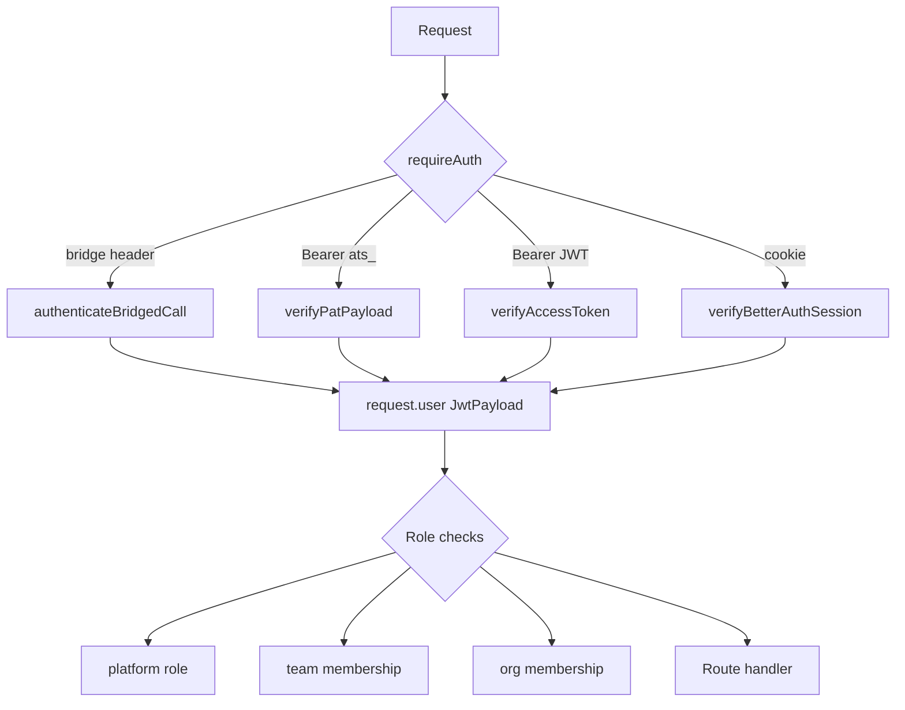

# Authentication and RBAC

> Indexed at commit `d0a90fb5` on 2026-10-06 · [view on GitHub](https://github.com/yorch/auto-swe/tree/d0a90fb5)

## Relevant source files

- [packages/gateway/src/plugins/auth.ts](https://github.com/yorch/auto-swe/blob/d0a90fb5/packages/gateway/src/plugins/auth.ts)
- [packages/gateway/src/plugins/prisma.ts](https://github.com/yorch/auto-swe/blob/d0a90fb5/packages/gateway/src/plugins/prisma.ts)
- [packages/gateway/src/lib/betterAuth.ts](https://github.com/yorch/auto-swe/blob/d0a90fb5/packages/gateway/src/lib/betterAuth.ts)
- [packages/gateway/src/lib/betterAuthHandler.ts](https://github.com/yorch/auto-swe/blob/d0a90fb5/packages/gateway/src/lib/betterAuthHandler.ts)
- [packages/gateway/src/lib/githubEnterpriseAuth.ts](https://github.com/yorch/auto-swe/blob/d0a90fb5/packages/gateway/src/lib/githubEnterpriseAuth.ts)
- [packages/gateway/src/lib/githubAuth.ts](https://github.com/yorch/auto-swe/blob/d0a90fb5/packages/gateway/src/lib/githubAuth.ts)
- [packages/gateway/src/routes/users.ts](https://github.com/yorch/auto-swe/blob/d0a90fb5/packages/gateway/src/routes/users.ts)
- [packages/gateway/src/routes/tokens.ts](https://github.com/yorch/auto-swe/blob/d0a90fb5/packages/gateway/src/routes/tokens.ts)
- [packages/gateway/src/index.ts](https://github.com/yorch/auto-swe/blob/d0a90fb5/packages/gateway/src/index.ts)
- [packages/shared/src/lib/tenantGuard.ts](https://github.com/yorch/auto-swe/blob/d0a90fb5/packages/shared/src/lib/tenantGuard.ts)

## Overview

The gateway authenticates callers through four credential types and funnels every one into a single `JwtPayload` (`sub`, `role`, optional `slackId`) that downstream RBAC reads. Browsers use better-auth cookie sessions, programmatic clients use personal access tokens (PATs) prefixed `ats_`, short-lived access JWTs come from a session-token bridge, and in-process Model Context Protocol (MCP) tool calls use a bridged path. The `requireAuth()` hook factory in [plugins/auth.ts](https://github.com/yorch/auto-swe/blob/d0a90fb5/packages/gateway/src/plugins/auth.ts#L656-L806) is the one enforcement point routes attach to `onRequest`.

Authorization has three layers: a platform role ladder (`ADMIN > LEAD > ENGINEER`), team roles resolved from `TeamMembership`, and organization roles (`ORG_ADMIN > ORG_MEMBER`). A Prisma tenant guard adds defence in depth at the data layer.

## Implementation

### Credential resolution order

`requireAuth()` tries paths in a fixed order. Path 0 applies whenever the MCP bridge header is present, regardless of its value, so a malformed header can never fall through to another path. Path 1 handles `Authorization: Bearer`: a token starting with `ats_` is verified as a PAT, anything else as an access JWT. Path 2 (no bearer header) reads the better-auth session cookie. If no payload results, the hook answers `401 UNAUTHORIZED` ([plugins/auth.ts:L656-L710](https://github.com/yorch/auto-swe/blob/d0a90fb5/packages/gateway/src/plugins/auth.ts#L656-L710)).

After authentication the hook resolves the repository access gate configuration once per request, falling back to the last value read, and stores it on `request.repoAccessGate` ([plugins/auth.ts:L711-L723](https://github.com/yorch/auto-swe/blob/d0a90fb5/packages/gateway/src/plugins/auth.ts#L711-L723)). Role checks follow: the platform role via `hasRole`, then the team role (`requiredTeamRole`, `teamIdParam`) and the org role (`requiredOrgRole`, `orgIdParam`). Platform `ADMIN`s bypass team and org checks. A missing route parameter is a 500, a non-UUID is a 400, and a missing or insufficient membership is a 403 ([plugins/auth.ts:L725-L805](https://github.com/yorch/auto-swe/blob/d0a90fb5/packages/gateway/src/plugins/auth.ts#L725-L805)). The role ladder itself lives in `@auto-swe/shared/config/permissions` so the settings registry ranks roles identically ([plugins/auth.ts:L78-L84](https://github.com/yorch/auto-swe/blob/d0a90fb5/packages/gateway/src/plugins/auth.ts#L78-L84)).

Sources: [packages/gateway/src/plugins/auth.ts:L656-L806](https://github.com/yorch/auto-swe/blob/d0a90fb5/packages/gateway/src/plugins/auth.ts#L656-L806)

### Access JWTs

`authPlugin` decorates the app with `auth.signAccessToken`, `verifyAccessToken`, `verifyAccessTokenClaims`, `hashToken`, and the OAuth-state signer and verifier ([plugins/auth.ts:L249-L311](https://github.com/yorch/auto-swe/blob/d0a90fb5/packages/gateway/src/plugins/auth.ts#L249-L311)). Tokens carry the audience `auto-swe:api` and a 3600-second lifetime; OAuth `state` tokens use a separate audience and a per-flow `purpose`, so the two classes cannot be swapped ([plugins/auth.ts:L117-L133](https://github.com/yorch/auto-swe/blob/d0a90fb5/packages/gateway/src/plugins/auth.ts#L117-L133)). Signing uses RS256 when `JWT_PRIVATE_KEY_PATH` is set and HS256 with `JWT_SECRET` otherwise. A built-in development secret is permitted only when `NODE_ENV` is `development` or `test`, so a deployment with `NODE_ENV` unset refuses to start signing ([plugins/auth.ts:L135-L191](https://github.com/yorch/auto-swe/blob/d0a90fb5/packages/gateway/src/plugins/auth.ts#L135-L191)).

The signed `role` claim is a mint-time snapshot, so `verifyAccessToken` re-reads the user through `loadTokenUser` and returns the current role. It rejects a deactivated or deleted user, and a failed lookup surfaces as a server error rather than a 401. The lookup sits behind a 30-second, 2,000-entry cache ([plugins/auth.ts:L216-L247](https://github.com/yorch/auto-swe/blob/d0a90fb5/packages/gateway/src/plugins/auth.ts#L216-L247), [plugins/auth.ts:L274-L291](https://github.com/yorch/auto-swe/blob/d0a90fb5/packages/gateway/src/plugins/auth.ts#L274-L291)).

The session-token bridge, `POST /api/v1/auth/session-token`, lives in the gateway entry point. It reads the better-auth session, re-fetches the `User` row, rejects inactive users with 403, and returns a signed access token with `ACCESS_TOKEN_TTL_SECONDS` ([index.ts:L253-L283](https://github.com/yorch/auto-swe/blob/d0a90fb5/packages/gateway/src/index.ts#L253-L283)).

### Personal access tokens

`verifyPatPayload` hashes the presented token with SHA-256, looks up `personalAccessToken` by `tokenHash`, and rejects missing, revoked, expired, or inactive-user tokens with `TOKEN_INVALID` or `TOKEN_EXPIRED`. It updates `lastUsedAt` without awaiting, and synthesizes a 60-second payload from the owning user's current role ([plugins/auth.ts:L335-L381](https://github.com/yorch/auto-swe/blob/d0a90fb5/packages/gateway/src/plugins/auth.ts#L335-L381)).

Tokens are minted in [routes/tokens.ts](https://github.com/yorch/auto-swe/blob/d0a90fb5/packages/gateway/src/routes/tokens.ts#L30-L110) as `ats_` plus 32 random bytes in base64url. Only the hash and a 12-character non-secret `prefix` are stored, and `expiresInDays` accepts 1 to 365. Revocation sets `revokedAt`, returns 404 for tokens the caller does not own, and writes an audit row ([routes/tokens.ts:L113-L164](https://github.com/yorch/auto-swe/blob/d0a90fb5/packages/gateway/src/routes/tokens.ts#L113-L164)). The `PAT_PREFIX` constant is defined in `auth.ts` and imported by the route so mint and verify cannot drift.

Sources: [packages/gateway/src/plugins/auth.ts:L335-L381](https://github.com/yorch/auto-swe/blob/d0a90fb5/packages/gateway/src/plugins/auth.ts#L335-L381) [packages/gateway/src/routes/tokens.ts:L1-L164](https://github.com/yorch/auto-swe/blob/d0a90fb5/packages/gateway/src/routes/tokens.ts#L1-L164)

### Sessions and cache invalidation

`verifyBetterAuthSession` caches the synthesized payload keyed by the signed session cookie value. The TTL defaults to 60 seconds (`SESSION_CACHE_TTL_MS` overrides it) and the cache holds at most 2,000 entries with FIFO eviction. On a miss it lazily imports `getAuth()` and calls `api.getSession`, returning null for inactive users ([plugins/auth.ts:L391-L487](https://github.com/yorch/auto-swe/blob/d0a90fb5/packages/gateway/src/plugins/auth.ts#L391-L487)).

Two exported functions shorten the revocation lag. `invalidateSessionCache` drops a session by signed or bare token, and `invalidateUserAuthCache` drops every cached session and the bearer user state for a user id ([plugins/auth.ts:L489-L521](https://github.com/yorch/auto-swe/blob/d0a90fb5/packages/gateway/src/plugins/auth.ts#L489-L521)). The better-auth handler calls the former after a successful `/sign-out` or `/revoke-session` ([betterAuthHandler.ts:L66-L75](https://github.com/yorch/auto-swe/blob/d0a90fb5/packages/gateway/src/lib/betterAuthHandler.ts#L66-L75)), and `PATCH /api/v1/users/:id` calls the latter when a role or active flag changes ([routes/users.ts:L408-L423](https://github.com/yorch/auto-swe/blob/d0a90fb5/packages/gateway/src/routes/users.ts#L408-L423)).

The rate limiter keys on user id only when identity is already proven without a database read: a Bearer JWT whose signature verifies, or a cookie present in the session cache. Everything else, including PATs, keys on IP ([plugins/auth.ts:L523-L570](https://github.com/yorch/auto-swe/blob/d0a90fb5/packages/gateway/src/plugins/auth.ts#L523-L570)).

### MCP bridge authentication

`authenticateBridgedCall` accepts a call only if the bridge header equals the per-boot secret, the route declares `config.mcpScope`, the credential is a non-PAT Bearer token the shared MCP verifier accepts, and the token scopes cover the route's scope. Failures return 401 or 403 (`INSUFFICIENT_SCOPE` for scope gaps). The caller is the token's user with their current role ([plugins/auth.ts:L588-L654](https://github.com/yorch/auto-swe/blob/d0a90fb5/packages/gateway/src/plugins/auth.ts#L588-L654)). The OAuth authorization server for MCP clients is covered on the [MCP page](./3.5-mcp-server-and-oauth.md).

Sources: [packages/gateway/src/plugins/auth.ts:L391-L654](https://github.com/yorch/auto-swe/blob/d0a90fb5/packages/gateway/src/plugins/auth.ts#L391-L654)

## Diagram

```mermaid
flowchart TD
  Req[Request] --> H{requireAuth}
  H -->|bridge header| B[authenticateBridgedCall]
  H -->|Bearer ats_| P[verifyPatPayload]
  H -->|Bearer JWT| J[verifyAccessToken]
  H -->|cookie| S[verifyBetterAuthSession]
  B --> U[request.user JwtPayload]
  P --> U
  J --> U
  S --> U
  U --> R{Role checks}
  R --> PR[platform role]
  R --> TR[team membership]
  R --> OR[org membership]
  R --> Handler[Route handler]
```

## better-auth configuration

`buildAuth()` constructs the better-auth instance with the Prisma adapter, UUID id generation, `SameSite=Lax` cookies (secure under HTTPS), and an enforced origin check ([betterAuth.ts:L313-L357](https://github.com/yorch/auto-swe/blob/d0a90fb5/packages/gateway/src/lib/betterAuth.ts#L313-L357)). `initAuth()` runs once at startup and reads the GitHub, Google, and Okta credentials, so changing them requires a restart. An unusable Okta issuer disables only Okta ([betterAuth.ts:L189-L235](https://github.com/yorch/auto-swe/blob/d0a90fb5/packages/gateway/src/lib/betterAuth.ts#L189-L235)). `BETTER_AUTH_SECRET` falls back to a development value only under `development` or `test` ([betterAuth.ts:L61-L74](https://github.com/yorch/auto-swe/blob/d0a90fb5/packages/gateway/src/lib/betterAuth.ts#L61-L74)).

Sign-in methods are email and password with required email verification (minimum 8 characters), magic links valid for 10 minutes, Google, GitHub, and Okta through `genericOAuth` ([betterAuth.ts:L449-L488](https://github.com/yorch/auto-swe/blob/d0a90fb5/packages/gateway/src/lib/betterAuth.ts#L449-L488)). Account linking by verified email trusts only OAuth providers (`github`, `google`, and `okta` when configured); email and password is excluded so a self-registered credential cannot attach to an existing user ([betterAuth.ts:L326-L335](https://github.com/yorch/auto-swe/blob/d0a90fb5/packages/gateway/src/lib/betterAuth.ts#L326-L335)).

New users default to `role: ENGINEER` and `isActive: false`, and none of `role`, `isActive`, `slackId`, or `githubLogin` accepts client input. Sign-ups therefore wait in an approval queue until an admin activates them ([betterAuth.ts:L577-L590](https://github.com/yorch/auto-swe/blob/d0a90fb5/packages/gateway/src/lib/betterAuth.ts#L577-L590)). A post-create hook adds each new user to the configured default team as `ENGINEER` and logs rather than fails when the team is missing ([betterAuth.ts:L420-L447](https://github.com/yorch/auto-swe/blob/d0a90fb5/packages/gateway/src/lib/betterAuth.ts#L420-L447)). Account hooks record, refresh, and clear the user's GitHub login on link, update, and unlink ([betterAuth.ts:L283-L418](https://github.com/yorch/auto-swe/blob/d0a90fb5/packages/gateway/src/lib/betterAuth.ts#L283-L418)).

`createBetterAuthHandler` adapts Fastify requests to better-auth's fetch-style handler. It rejects non-canonical request paths with 400, re-serializes the parsed body (JSON, or urlencoded for `/api/auth/oauth2/`), and forwards status, headers, and body ([betterAuthHandler.ts:L22-L88](https://github.com/yorch/auto-swe/blob/d0a90fb5/packages/gateway/src/lib/betterAuthHandler.ts#L22-L88)). `registerBetterAuthRoutes` applies a per-IP limit of 20 requests per minute to credential endpoints and 10 per minute to OAuth client registration, then mounts a wildcard `/api/auth/*` route ([betterAuthHandler.ts:L96-L141](https://github.com/yorch/auto-swe/blob/d0a90fb5/packages/gateway/src/lib/betterAuthHandler.ts#L96-L141)).

Sources: [packages/gateway/src/lib/betterAuth.ts:L313-L592](https://github.com/yorch/auto-swe/blob/d0a90fb5/packages/gateway/src/lib/betterAuth.ts#L313-L592) [packages/gateway/src/lib/betterAuthHandler.ts:L22-L141](https://github.com/yorch/auto-swe/blob/d0a90fb5/packages/gateway/src/lib/betterAuthHandler.ts#L22-L141)

## GitHub sign-in and credential re-exports

`resolveGithubSignIn` returns one of three modes. `none` applies when credentials are missing or a URL is invalid, `builtin` when the base host is `github.com`, and `ghe` otherwise. The `ghe` mode registers a generic OAuth provider under the id `github`, so callback URLs, account rows, and `'github'` checks stay unchanged ([githubEnterpriseAuth.ts:L127-L227](https://github.com/yorch/auto-swe/blob/d0a90fb5/packages/gateway/src/lib/githubEnterpriseAuth.ts#L127-L227)). `fetchGhesUserInfo` accepts a profile only with a primary, verified email and an integer id, prefixes the account id with the host, and fetches with `redirect: 'error'` and a 5-second timeout ([githubEnterpriseAuth.ts:L84-L125](https://github.com/yorch/auto-swe/blob/d0a90fb5/packages/gateway/src/lib/githubEnterpriseAuth.ts#L84-L125)).

[githubAuth.ts](https://github.com/yorch/auto-swe/blob/d0a90fb5/packages/gateway/src/lib/githubAuth.ts#L9-L14) only re-exports the shared installation-token resolver (`resolveGitHubToken` and related names) under the names the gateway imports. Its use is covered in [GitHub and webhooks](./3.3-github-and-webhooks.md).

Sources: [packages/gateway/src/lib/githubEnterpriseAuth.ts:L84-L227](https://github.com/yorch/auto-swe/blob/d0a90fb5/packages/gateway/src/lib/githubEnterpriseAuth.ts#L84-L227) [packages/gateway/src/lib/githubAuth.ts:L1-L14](https://github.com/yorch/auto-swe/blob/d0a90fb5/packages/gateway/src/lib/githubAuth.ts#L1-L14)

## Usage

User administration in [routes/users.ts](https://github.com/yorch/auto-swe/blob/d0a90fb5/packages/gateway/src/routes/users.ts) shows the hook in use. Listing, creating, inviting, and patching users require `ADMIN`; the exact-email `/lookup` requires `LEAD` and is limited to 30 requests per minute per caller, answering only whether an active user exists ([routes/users.ts:L96-L158](https://github.com/yorch/auto-swe/blob/d0a90fb5/packages/gateway/src/routes/users.ts#L96-L158)). Invites create a pre-activated, email-verified user with the requested role and send a magic link ([routes/users.ts:L258-L300](https://github.com/yorch/auto-swe/blob/d0a90fb5/packages/gateway/src/routes/users.ts#L258-L300)).

`PATCH /:id` blocks an admin from deactivating or demoting themselves (`CANNOT_SELF_DEACTIVATE`, `CANNOT_SELF_DEMOTE`), enforces `slackId` uniqueness, and revokes the user's MCP grants in the same transaction as a deactivation ([routes/users.ts:L344-L407](https://github.com/yorch/auto-swe/blob/d0a90fb5/packages/gateway/src/routes/users.ts#L344-L407)).

Sources: [packages/gateway/src/routes/users.ts:L96-L430](https://github.com/yorch/auto-swe/blob/d0a90fb5/packages/gateway/src/routes/users.ts#L96-L430)

## Tenant guard

[plugins/prisma.ts](https://github.com/yorch/auto-swe/blob/d0a90fb5/packages/gateway/src/plugins/prisma.ts#L12-L29) decorates Fastify with the shared Prisma singleton, so one pool and one guard serve routes and better-auth alike. The guard itself lives in `@auto-swe/shared` and fails mass operations (`findMany`, `count`, `aggregate`, `groupBy`, `updateMany`, `deleteMany`) on tenant-scoped models when no tenant predicate is present. It deliberately skips by-id lookups, and its own documentation states it is defence in depth rather than a security boundary ([tenantGuard.ts:L1-L40](https://github.com/yorch/auto-swe/blob/d0a90fb5/packages/shared/src/lib/tenantGuard.ts#L1-L40)).

Sources: [packages/gateway/src/plugins/prisma.ts:L1-L32](https://github.com/yorch/auto-swe/blob/d0a90fb5/packages/gateway/src/plugins/prisma.ts#L1-L32) [packages/shared/src/lib/tenantGuard.ts:L1-L40](https://github.com/yorch/auto-swe/blob/d0a90fb5/packages/shared/src/lib/tenantGuard.ts#L1-L40)

## Related Pages

- Parent: [Gateway API](./3-gateway-api.md)
- Sibling: [HTTP routes](./3.1-http-routes.md)
- Sibling: [GitHub and webhooks](./3.3-github-and-webhooks.md)
- Sibling: [Repository access and credentials](./3.4-repository-access-and-credentials.md)
- Sibling: [MCP server and OAuth](./3.5-mcp-server-and-oauth.md)
- Sibling: [Work views and PR lifecycle](./3.6-work-views-and-pr-lifecycle.md)
