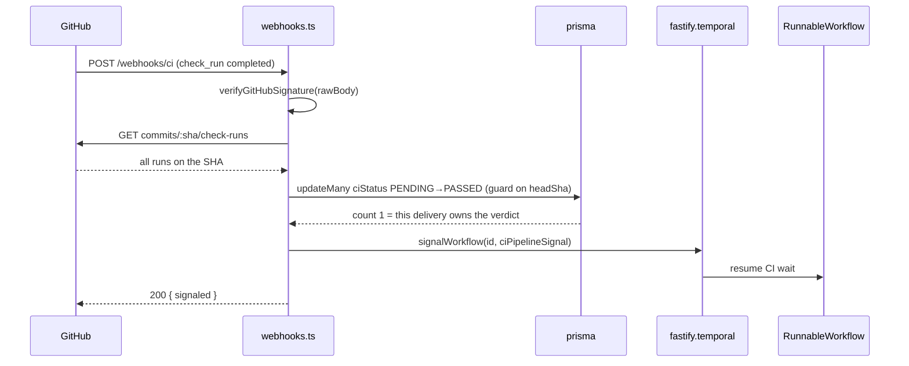

# GitHub Integration, Webhooks, and Workflow Launch

> Indexed at commit `b1d8930` on 2026-09-08 · [view on GitHub](https://github.com/yorch/auto-swe/tree/b1d8930)

## Relevant source files

- [packages/gateway/src/lib/github.ts](https://github.com/yorch/auto-swe/blob/b1d8930/packages/gateway/src/lib/github.ts)
- [packages/gateway/src/lib/githubAuth.ts](https://github.com/yorch/auto-swe/blob/b1d8930/packages/gateway/src/lib/githubAuth.ts)
- [packages/gateway/src/routes/webhooks.ts](https://github.com/yorch/auto-swe/blob/b1d8930/packages/gateway/src/routes/webhooks.ts)
- [packages/gateway/src/lib/workflowLaunch.ts](https://github.com/yorch/auto-swe/blob/b1d8930/packages/gateway/src/lib/workflowLaunch.ts)
- [packages/gateway/src/lib/idempotency.ts](https://github.com/yorch/auto-swe/blob/b1d8930/packages/gateway/src/lib/idempotency.ts)
- [packages/gateway/src/lib/temporalErrors.ts](https://github.com/yorch/auto-swe/blob/b1d8930/packages/gateway/src/lib/temporalErrors.ts)
- [packages/gateway/src/plugins/temporal.ts](https://github.com/yorch/auto-swe/blob/b1d8930/packages/gateway/src/plugins/temporal.ts)
- [packages/gateway/src/lib/slack.ts](https://github.com/yorch/auto-swe/blob/b1d8930/packages/gateway/src/lib/slack.ts)
- [packages/gateway/src/lib/issueTrackerClient.ts](https://github.com/yorch/auto-swe/blob/b1d8930/packages/gateway/src/lib/issueTrackerClient.ts)
- [packages/shared/src/lib/ssrfGuard.ts](https://github.com/yorch/auto-swe/blob/b1d8930/packages/shared/src/lib/ssrfGuard.ts)
- [packages/shared/src/lib/integrations/registry.ts](https://github.com/yorch/auto-swe/blob/b1d8930/packages/shared/src/lib/integrations/registry.ts)
- [packages/shared/src/lib/workflowId.ts](https://github.com/yorch/auto-swe/blob/b1d8930/packages/shared/src/lib/workflowId.ts)
- [packages/gateway/src/routes/workRequests.ts](https://github.com/yorch/auto-swe/blob/b1d8930/packages/gateway/src/routes/workRequests.ts)
- [packages/gateway/src/lib/github.test.ts](https://github.com/yorch/auto-swe/blob/b1d8930/packages/gateway/src/lib/github.test.ts)
- [packages/gateway/src/routes/webhooks.test.ts](https://github.com/yorch/auto-swe/blob/b1d8930/packages/gateway/src/routes/webhooks.test.ts)
- [packages/gateway/src/routes/webhooks.trigger.test.ts](https://github.com/yorch/auto-swe/blob/b1d8930/packages/gateway/src/routes/webhooks.trigger.test.ts)
- [packages/gateway/src/lib/workflowLaunch.test.ts](https://github.com/yorch/auto-swe/blob/b1d8930/packages/gateway/src/lib/workflowLaunch.test.ts)

## Overview

This page covers the gateway's edge with the outside world: the calls it makes to GitHub, the webhook endpoints it exposes, and the path from an inbound event to a started or resumed Temporal workflow. Four routes are mounted under `/api/v1/webhooks` — `/git`, `/ci`, `/:token`, and `/jira` — registered at [packages/gateway/src/index.ts#L349](https://github.com/yorch/auto-swe/blob/b1d8930/packages/gateway/src/index.ts#L349). None of them carries an authentication preHandler; each authenticates its own caller with an HMAC signature or an opaque token.

Two of the routes resume a workflow that is already suspended, and two start a new one. Everything that starts a workflow goes through `launchTrackedWorkflow`, and everything that talks to Temporal goes through the `fastify.temporal` decorator.

## Outbound GitHub client

The gateway does not use Octokit. `packages/gateway/src/lib/github.ts` calls the REST API with `fetch` directly, sending `Accept: application/vnd.github+json`, `X-GitHub-Api-Version: 2022-11-28`, and a 15-second `AbortSignal.timeout` per request ([github.ts#L110-L145](https://github.com/yorch/auto-swe/blob/b1d8930/packages/gateway/src/lib/github.ts#L110-L145)).

Authentication resolves in `resolveGitHubToken`, which reads `authMode` from the DB-backed GitHub config ([githubAuth.ts#L64-L90](https://github.com/yorch/auto-swe/blob/b1d8930/packages/gateway/src/lib/githubAuth.ts#L64-L90)).

| Mode | Condition | Credential used |
| ---- | --------- | --------------- |
| `app` | Set explicitly | RS256 JWT exchanged for an installation token |
| `auto` | `appId`, `appPrivateKey` and `appInstallationId` all present | Same as `app` |
| `auto` (fallback) | App fields absent | The configured personal access token |
| — | Neither available | Throws `GitHubTokenMissingError` |

App mode mints a ten-minute JWT with `createSign('RSA-SHA256')`, exchanges it at `/app/installations/:id/access_tokens`, and caches the installation token in module scope until sixty seconds before its stated expiry ([githubAuth.ts#L25-L62](https://github.com/yorch/auto-swe/blob/b1d8930/packages/gateway/src/lib/githubAuth.ts#L25-L62)). The cache key folds in the app id, installation id and the last twenty characters of the private key, so rotating credentials invalidates it.

Listing repositories is the one read the gateway performs on its own behalf. It targets `/installation/repositories` under App auth and `/user/repos` under PAT auth, and pages through `fetchAllPages` with `GITHUB_PER_PAGE = 100` and `GITHUB_MAX_PAGES = 5` — 500 repositories at most ([github.ts#L65-L102](https://github.com/yorch/auto-swe/blob/b1d8930/packages/gateway/src/lib/github.ts#L65-L102)). The loop stops early on any short page. The `/ci` handler reuses both constants for its own check-run listing.

Sources: [packages/gateway/src/lib/github.ts:L1-L145](https://github.com/yorch/auto-swe/blob/b1d8930/packages/gateway/src/lib/github.ts#L1-L145) [packages/gateway/src/lib/githubAuth.ts:L1-L90](https://github.com/yorch/auto-swe/blob/b1d8930/packages/gateway/src/lib/githubAuth.ts#L1-L90)

## Inbound endpoints and signature verification

| Route | Authenticated by | Effect |
| ----- | ---------------- | ------ |
| `POST /webhooks/git` | GitHub HMAC-SHA256 | Records a PR merge, signals `humanMergeSignal` |
| `POST /webhooks/ci` | GitHub HMAC-SHA256 | Records a CI verdict, signals `ciPipelineSignal` |
| `POST /webhooks/:token` | Opaque per-template `webhookToken` | Starts `RunnableWorkflow` |
| `POST /webhooks/jira` | Issue-tracker HMAC-SHA256 | Auto-creates a work request and starts `RunnableWorkflow` |

`verifyGitHubSignature` recomputes `sha256=<hmac>` over the raw body and compares with `crypto.timingSafeEqual`, returning `false` rather than throwing when the two buffers differ in length ([github.ts#L14-L31](https://github.com/yorch/auto-swe/blob/b1d8930/packages/gateway/src/lib/github.ts#L14-L31)). Raw bodies are available because `fastify-raw-body` is registered with `global: false` and each of these routes opts in with `config: { rawBody: true }` ([index.ts#L102](https://github.com/yorch/auto-swe/blob/b1d8930/packages/gateway/src/index.ts#L102)).

`verifyWebhookOrReject` fails closed on all three of a missing configured secret, a missing `x-hub-signature-256` header, and a mismatched digest ([webhooks.ts#L141-L168](https://github.com/yorch/auto-swe/blob/b1d8930/packages/gateway/src/routes/webhooks.ts#L141-L168)). The Jira route repeats the same sequence inline against the tracker's own `webhookSecret`, reusing the identical HMAC function ([webhooks.ts#L849-L866](https://github.com/yorch/auto-swe/blob/b1d8930/packages/gateway/src/routes/webhooks.ts#L849-L866)).

A verified body is still an untrusted shape. `normalizeGitHubPullRequestEvent` and `normalizeGitHubCheckRunEvent` are pure functions that Zod-parse the payload and collapse it to one of three domain events — `unrecognized`, `ignored`, or the real event — so that a signed but malformed body answers 200 with `ignored` instead of throwing a 500 ([webhooks.ts#L95-L139](https://github.com/yorch/auto-swe/blob/b1d8930/packages/gateway/src/routes/webhooks.ts#L95-L139)). Only these two functions know GitHub's payload shapes; the handlers below them are provider-agnostic.

Sources: [packages/gateway/src/routes/webhooks.ts:L48-L168](https://github.com/yorch/auto-swe/blob/b1d8930/packages/gateway/src/routes/webhooks.ts#L48-L168) [packages/gateway/src/lib/github.ts:L1-L31](https://github.com/yorch/auto-swe/blob/b1d8930/packages/gateway/src/lib/github.ts#L1-L31)

## From webhook to Temporal signal

The diagram shows the `/ci` path; `/git` is the same shape with a `PullRequest.status` `OPEN`→`MERGED` guard and a `humanMergeSignal`. In both, the DB transition is the concurrency gate and the signal follows it.

A single passing check run says nothing about the other checks on a commit, so `aggregateCheckRuns` lists every run for the head SHA before deciding ([webhooks.ts#L191-L260](https://github.com/yorch/auto-swe/blob/b1d8930/packages/gateway/src/routes/webhooks.ts#L191-L260)). It returns `null` — and the handler falls back to per-run signaling — whenever the view cannot be trusted: no token, an API error, or a result set longer than five pages. A failing conclusion short-circuits the aggregation so the CI-fix loop gets the failing logs immediately.

The transition guard is a freshness check, not a change detector. Rows move only while `ciStatus` is `PENDING` **and** `headSha` matches the delivery, which blocks a hand-redelivered stale `failure` from flipping a newer `PASSED` back and re-signaling a run that has moved on ([webhooks.ts#L523-L551](https://github.com/yorch/auto-swe/blob/b1d8930/packages/gateway/src/routes/webhooks.ts#L523-L551)).

Signal failures split by kind, decided by `isTerminalSignalError`, which tests for `WorkflowNotFoundError` ([temporalErrors.ts#L20-L22](https://github.com/yorch/auto-swe/blob/b1d8930/packages/gateway/src/lib/temporalErrors.ts#L20-L22)). A transient failure rolls the DB row back to its pre-delivery value and answers 503, which marks the delivery failed in GitHub's UI; GitHub does not retry on its own, so the rollback exists to make a human "Redeliver" work. A terminal failure keeps the write and answers 200, because no redelivery could ever land that signal. One `check_run` event can fan out to several workflows, so `/ci` decides this per pull request and rolls back only the ones whose signal failed transiently ([webhooks.ts#L601-L653](https://github.com/yorch/auto-swe/blob/b1d8930/packages/gateway/src/routes/webhooks.ts#L601-L653)).

Both handlers then do best-effort follow-up work that can never fail the request: a Slack notification to the originating channel or the team's notify channel, and an issue-tracker sync ([webhooks.ts#L406-L443](https://github.com/yorch/auto-swe/blob/b1d8930/packages/gateway/src/routes/webhooks.ts#L406-L443)).

Sources: [packages/gateway/src/routes/webhooks.ts:L171-L684](https://github.com/yorch/auto-swe/blob/b1d8930/packages/gateway/src/routes/webhooks.ts#L171-L684) [packages/gateway/src/lib/temporalErrors.ts:L1-L22](https://github.com/yorch/auto-swe/blob/b1d8930/packages/gateway/src/lib/temporalErrors.ts#L1-L22)

## Idempotency and replay protection

Replay protection differs per route because each has a different stable identity to key on.

| Route | Dedup key | Mechanism |
| ----- | --------- | --------- |
| `/git` | `PullRequest.status` | Atomic `OPEN`→`MERGED` `updateMany`; a loser sees count 0 |
| `/ci` | `ciStatus` + `headSha` | Atomic `PENDING`→verdict guarded on the delivery's SHA |
| `/:token` | `Idempotency-Key` header | Hashed into the workflow ID; opt-in |
| `/jira` | Ticket key | Deterministic `jira-<ticketId>` workflow ID |

The generic trigger accepts an arbitrary payload, so nothing intrinsic identifies a retry. `workflowIdFromIdempotencyKey` therefore derives the ID from the caller's key, hashing rather than embedding it so client input never reaches the Temporal ID or the dashboard, and length-prefixing the scope so two `(scope, key)` pairs cannot alias ([idempotency.ts#L49-L52](https://github.com/yorch/auto-swe/blob/b1d8930/packages/gateway/src/lib/idempotency.ts#L49-L52)). The digest is truncated to 64 bits, which makes a collision surface as a 409 rather than as two runs merging. Sending no key keeps the previous behaviour of one fresh run per delivery, which is what a schedule or a manual re-run wants ([idempotency.ts#L4-L34](https://github.com/yorch/auto-swe/blob/b1d8930/packages/gateway/src/lib/idempotency.ts#L4-L34)). Keys are capped at 255 characters. The route is additionally rate-limited to 60 requests per minute with a 128 KB body limit ([webhooks.ts#L691-L701](https://github.com/yorch/auto-swe/blob/b1d8930/packages/gateway/src/routes/webhooks.ts#L691-L701)).

Sources: [packages/gateway/src/lib/idempotency.ts:L1-L52](https://github.com/yorch/auto-swe/blob/b1d8930/packages/gateway/src/lib/idempotency.ts#L1-L52) [packages/gateway/src/routes/webhooks.ts:L686-L839](https://github.com/yorch/auto-swe/blob/b1d8930/packages/gateway/src/routes/webhooks.ts#L686-L839)

## Workflow launch

`launchTrackedWorkflow` writes the `RunInput` and `ActiveWorkflow` rows in one Prisma transaction, then starts the workflow, then deletes the rows if the start failed ([workflowLaunch.ts#L86-L139](https://github.com/yorch/auto-swe/blob/b1d8930/packages/gateway/src/lib/workflowLaunch.ts#L86-L139)). The ordering is deliberate and the header comment records why the reverse was worse: starting first meant a failed DB write left a workflow burning budget and opening pull requests with no row to attribute it to, and it wedged the ticket for later resubmission as well ([workflowLaunch.ts#L5-L40](https://github.com/yorch/auto-swe/blob/b1d8930/packages/gateway/src/lib/workflowLaunch.ts#L5-L40)).

Writing first also makes dedup atomic and durable. The unique index on `ActiveWorkflow.temporalWorkflowId` decides the winner of two concurrent submissions, closing a TOCTOU gap that a read-then-start sequence has, and a DB row outlives Temporal's execution-retention window. A unique-constraint violation on insert and a `WorkflowExecutionAlreadyStartedError` on start both surface as `{ ok: false, reason: 'DUPLICATE' }`, which callers map to 409 or to a `duplicate: true` acknowledgement. Compensation is best-effort and never throws: each delete runs independently and a failure is logged, leaving the rows as a visible non-terminal run ([workflowLaunch.ts#L146-L179](https://github.com/yorch/auto-swe/blob/b1d8930/packages/gateway/src/lib/workflowLaunch.ts#L146-L179)).

Workflow IDs are built per entry point:

| Entry point | ID shape |
| ----------- | -------- |
| `POST /work-requests` | `eng-<org>-<repoName>-<ticketId>`, plus `-rN` on re-run |
| `POST /webhooks/:token` with a key | `wh-<8-char template id>-<16 hex digest>` |
| `POST /webhooks/:token` without a key | `wh-<8-char template id>-<8 random hex>` |
| `POST /webhooks/jira` | `jira-<ticketId>` |

The work-request base ID comes from `generateWorkflowId` ([workflowId.ts#L8-L14](https://github.com/yorch/auto-swe/blob/b1d8930/packages/shared/src/lib/workflowId.ts#L8-L14)) and is then passed through `allocateWorkflowId`, which returns a conflict when a non-terminal execution for that ticket and repository already exists and otherwise appends `-rN` for a re-run ([workRequests.ts#L288-L311](https://github.com/yorch/auto-swe/blob/b1d8930/packages/gateway/src/routes/workRequests.ts#L288-L311)). The Jira ID is deliberately once-ever per ticket: re-triggering a completed ticket requires the authenticated path, which allocates a fresh ID.

The Jira auto-trigger refuses to guess a target. The tracker config is a platform-wide singleton with no ticket-to-repository mapping, so the route acknowledges and skips the transition unless exactly one active `git_repo` connection is onboarded — picking the first of several would route one tenant's spend into another tenant's repository ([webhooks.ts#L890-L922](https://github.com/yorch/auto-swe/blob/b1d8930/packages/gateway/src/routes/webhooks.ts#L890-L922)). Both starting routes check the organization's monthly budget before launching.

Sources: [packages/gateway/src/lib/workflowLaunch.ts:L1-L179](https://github.com/yorch/auto-swe/blob/b1d8930/packages/gateway/src/lib/workflowLaunch.ts#L1-L179) [packages/gateway/src/routes/workRequests.ts:L277-L311](https://github.com/yorch/auto-swe/blob/b1d8930/packages/gateway/src/routes/workRequests.ts#L277-L311) [packages/shared/src/lib/workflowId.ts:L1-L22](https://github.com/yorch/auto-swe/blob/b1d8930/packages/shared/src/lib/workflowId.ts#L1-L22)

## The Temporal Fastify plugin

`packages/gateway/src/plugins/temporal.ts` opens one `Connection` at boot, builds a `Client` and a `ScheduleClient` from it, and decorates the instance as `fastify.temporal` ([temporal.ts#L238-L243](https://github.com/yorch/auto-swe/blob/b1d8930/packages/gateway/src/plugins/temporal.ts#L238-L243)). It is wrapped in `fastify-plugin` under the name `temporal`, so the decorator is visible to every route, and an `onClose` hook closes the connection ([temporal.ts#L856-L862](https://github.com/yorch/auto-swe/blob/b1d8930/packages/gateway/src/plugins/temporal.ts#L856-L862)). The address comes from `resolveTemporalAddress`, not from a hard-coded value.

The decorator's surface is declared through a `declare module 'fastify'` augmentation, so route code sees typed methods rather than a raw client ([temporal.ts#L159-L235](https://github.com/yorch/auto-swe/blob/b1d8930/packages/gateway/src/plugins/temporal.ts#L159-L235)). It groups into three kinds of call:

- **Starts.** `startRunnableWorkflow`, `startEpicWorkflow`, `startEvalRunWorkflow`, `startChannelAssistant` and others, all onto the `engineering-workflow` task queue ([temporal.ts#L723-L732](https://github.com/yorch/auto-swe/blob/b1d8930/packages/gateway/src/plugins/temporal.ts#L723-L732)). `startChannelAssistant` sets `WorkflowIdReusePolicy.REJECT_DUPLICATE` so a re-delivered Slack event is rejected rather than answered twice ([temporal.ts#L647-L662](https://github.com/yorch/auto-swe/blob/b1d8930/packages/gateway/src/plugins/temporal.ts#L647-L662)).
- **Signals and cancels.** `signalWorkflow` takes a workflow ID, a signal name and arguments, and is the single path every webhook and Slack handler uses to resume a run ([temporal.ts#L638-L646](https://github.com/yorch/auto-swe/blob/b1d8930/packages/gateway/src/plugins/temporal.ts#L638-L646)).
- **Schedules.** Lesson consolidation, eval regression, revalidation, repository dependency scans, recurring work requests, and per-channel ambient and reactive polls. `upsertSchedule` updates in place when the schedule exists and creates it otherwise, with `ScheduleOverlapPolicy.SKIP` ([temporal.ts#L368-L392](https://github.com/yorch/auto-swe/blob/b1d8930/packages/gateway/src/plugins/temporal.ts#L368-L392)). Existence is decided by `scheduleExists`, which rethrows anything that is not a `ScheduleNotFoundError` — treating an outage as "no such schedule" once made deletes report success while live schedules kept firing ([temporal.ts#L345-L356](https://github.com/yorch/auto-swe/blob/b1d8930/packages/gateway/src/plugins/temporal.ts#L345-L356)).

Two methods break the fire-and-forget pattern: `generateWorkflowSpec` and `explainWorkflowSpec` await the workflow result, because the generate-validate-repair loop runs in the worker where models bind.

Sources: [packages/gateway/src/plugins/temporal.ts:L1-L862](https://github.com/yorch/auto-swe/blob/b1d8930/packages/gateway/src/plugins/temporal.ts#L1-L862)

## Slack and issue-tracker outbound clients

`packages/gateway/src/lib/slack.ts` holds both halves of the Slack edge. `verifySlackSignature` rebuilds the `v0:<timestamp>:<body>` base string, compares the HMAC in constant time, and rejects any request whose timestamp is more than five minutes from now — the replay window Slack recommends ([slack.ts#L20-L45](https://github.com/yorch/auto-swe/blob/b1d8930/packages/gateway/src/lib/slack.ts#L20-L45)).

Outbound, `postSlackMessage` calls `chat.postMessage` with a two-second timeout and returns `null` on any failure or when no bot token is configured, so a Slack outage cannot break workflow-step recording ([slack.ts#L70-L107](https://github.com/yorch/auto-swe/blob/b1d8930/packages/gateway/src/lib/slack.ts#L70-L107)). The webhook handlers use it for the merge notification, threading the reply under the originating message when one exists. `fetchSlackChannelIsPrivate` asks `conversations.info` whether a channel is private, since `SlackChannel.isPrivate` decides whether that channel's memory can be read elsewhere and the alternative is guessing from the payload shape ([slack.ts#L115-L152](https://github.com/yorch/auto-swe/blob/b1d8930/packages/gateway/src/lib/slack.ts#L115-L152)). `views.publish` and `views.open` share `slackApiPost`, which never throws and shapes a network error into `{ ok: false, error }` ([slack.ts#L239-L261](https://github.com/yorch/auto-swe/blob/b1d8930/packages/gateway/src/lib/slack.ts#L239-L261)).

The issue-tracker client is a thin delegation wrapper over the shared provider registry, kept for backwards compatibility with importers of `FetchedTicket`. Its stated policy is that it never throws: no provider, bad config, network error, timeout, 404 or unparsable body all log a warning and return `null`, because ticket enrichment must never block a submission ([issueTrackerClient.ts#L41-L77](https://github.com/yorch/auto-swe/blob/b1d8930/packages/gateway/src/lib/issueTrackerClient.ts#L41-L77)). Writes back to the tracker on merge and on CI verdicts go through `syncTrackerOnEvent`, called with a `.catch` at both sites.

Sources: [packages/gateway/src/lib/slack.ts:L1-L301](https://github.com/yorch/auto-swe/blob/b1d8930/packages/gateway/src/lib/slack.ts#L1-L301) [packages/gateway/src/lib/issueTrackerClient.ts:L1-L77](https://github.com/yorch/auto-swe/blob/b1d8930/packages/gateway/src/lib/issueTrackerClient.ts#L1-L77)

## SSRF guard on self-hosted base URLs

Every operator-supplied URL the gateway or worker fetches passes through one definition, `isSafeProbeUrl` ([ssrfGuard.ts#L46-L112](https://github.com/yorch/auto-swe/blob/b1d8930/packages/shared/src/lib/ssrfGuard.ts#L46-L112)). It rejects any non-`http(s)` protocol and any hostname that is loopback, unspecified, `.local`, `.internal`, RFC 1918, link-local including the AWS metadata range, or IPv6 unique-local. It strips the brackets Node's parser keeps on IPv6 hostnames, extracts the embedded IPv4 from both spellings of an IPv4-mapped IPv6 address, and covers the short-form notations such as `127.1` and `0.0.0.1`.

The guard is text-level and does no DNS lookup. Its own header states the limit: it blocks the obvious accidents, not an attacker who registers a public hostname resolving to an internal address ([ssrfGuard.ts#L1-L17](https://github.com/yorch/auto-swe/blob/b1d8930/packages/shared/src/lib/ssrfGuard.ts#L1-L17)). Rebinding defence belongs to outbound network policy at the container level.

Connector base URLs run through `checkBaseUrlSafety`, which fails closed by returning `false` so the provider factory returns `null` ([registry.ts#L58-L77](https://github.com/yorch/auto-swe/blob/b1d8930/packages/shared/src/lib/integrations/registry.ts#L58-L77)). The per-connector `allowPrivateNetwork` flag is the operator's explicit opt-in for a legitimately self-hosted Jira, GitHub Enterprise or Confluence instance on an internal address. It bypasses the rejection, and the bypass itself is logged at warn level so it stays auditable. The flag defaults to `false`.

Sources: [packages/shared/src/lib/ssrfGuard.ts:L1-L112](https://github.com/yorch/auto-swe/blob/b1d8930/packages/shared/src/lib/ssrfGuard.ts#L1-L112) [packages/shared/src/lib/integrations/registry.ts:L45-L150](https://github.com/yorch/auto-swe/blob/b1d8930/packages/shared/src/lib/integrations/registry.ts#L45-L150)

## Related Pages

- Parent: [Gateway API](./3-gateway-api.md)
- Sibling: [HTTP Routes](./3.1-http-routes.md)
- Sibling: [Authentication and RBAC](./3.2-authentication-and-rbac.md)
- [Workflow Spec and Interpreter](./2.2-workflow-spec-and-interpreter.md)
- [Temporal Workflows](./4.1-temporal-workflows.md)
