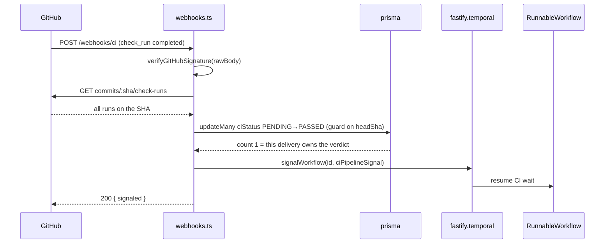

# GitHub Integration, Webhooks, and Workflow Launch

> Indexed at commit `147d054a` on 2026-09-30 · [view on GitHub](https://github.com/yorch/auto-swe/tree/147d054a)

## Relevant source files

- [packages/gateway/src/lib/github.ts](https://github.com/yorch/auto-swe/blob/147d054a/packages/gateway/src/lib/github.ts)
- [packages/gateway/src/lib/githubAuth.ts](https://github.com/yorch/auto-swe/blob/147d054a/packages/gateway/src/lib/githubAuth.ts)
- [packages/shared/src/lib/githubInstallation.ts](https://github.com/yorch/auto-swe/blob/147d054a/packages/shared/src/lib/githubInstallation.ts)
- [packages/gateway/src/routes/webhooks.ts](https://github.com/yorch/auto-swe/blob/147d054a/packages/gateway/src/routes/webhooks.ts)
- [packages/gateway/src/lib/repositoryHost.ts](https://github.com/yorch/auto-swe/blob/147d054a/packages/gateway/src/lib/repositoryHost.ts)
- [packages/gateway/src/lib/repoAccessWebhook.ts](https://github.com/yorch/auto-swe/blob/147d054a/packages/gateway/src/lib/repoAccessWebhook.ts)
- [packages/gateway/src/lib/workflowLaunch.ts](https://github.com/yorch/auto-swe/blob/147d054a/packages/gateway/src/lib/workflowLaunch.ts)
- [packages/gateway/src/lib/idempotency.ts](https://github.com/yorch/auto-swe/blob/147d054a/packages/gateway/src/lib/idempotency.ts)
- [packages/gateway/src/lib/temporalErrors.ts](https://github.com/yorch/auto-swe/blob/147d054a/packages/gateway/src/lib/temporalErrors.ts)
- [packages/gateway/src/plugins/temporal.ts](https://github.com/yorch/auto-swe/blob/147d054a/packages/gateway/src/plugins/temporal.ts)
- [packages/gateway/src/lib/slack.ts](https://github.com/yorch/auto-swe/blob/147d054a/packages/gateway/src/lib/slack.ts)
- [packages/gateway/src/lib/issueTrackerClient.ts](https://github.com/yorch/auto-swe/blob/147d054a/packages/gateway/src/lib/issueTrackerClient.ts)
- [packages/shared/src/lib/ssrfGuard.ts](https://github.com/yorch/auto-swe/blob/147d054a/packages/shared/src/lib/ssrfGuard.ts)
- [packages/shared/src/lib/integrations/registry.ts](https://github.com/yorch/auto-swe/blob/147d054a/packages/shared/src/lib/integrations/registry.ts)
- [packages/shared/src/lib/workflowId.ts](https://github.com/yorch/auto-swe/blob/147d054a/packages/shared/src/lib/workflowId.ts)
- [packages/gateway/src/routes/workRequests.ts](https://github.com/yorch/auto-swe/blob/147d054a/packages/gateway/src/routes/workRequests.ts)
- [packages/gateway/src/lib/github.test.ts](https://github.com/yorch/auto-swe/blob/147d054a/packages/gateway/src/lib/github.test.ts)
- [packages/gateway/src/routes/webhooks.test.ts](https://github.com/yorch/auto-swe/blob/147d054a/packages/gateway/src/routes/webhooks.test.ts)
- [packages/gateway/src/routes/webhooks.trigger.test.ts](https://github.com/yorch/auto-swe/blob/147d054a/packages/gateway/src/routes/webhooks.trigger.test.ts)
- [packages/gateway/src/lib/workflowLaunch.test.ts](https://github.com/yorch/auto-swe/blob/147d054a/packages/gateway/src/lib/workflowLaunch.test.ts)

## Overview

This page covers the gateway's edge with the outside world: the calls it makes to GitHub, the webhook endpoints it exposes, and the path from an inbound event to a started or resumed Temporal workflow. Five routes are mounted under `/api/v1/webhooks` — `/git`, `/access`, `/ci`, `/:token`, and `/jira` — registered at [packages/gateway/src/index.ts#L364](https://github.com/yorch/auto-swe/blob/147d054a/packages/gateway/src/index.ts#L364). None of them carries an authentication preHandler; each authenticates its own caller with an HMAC signature or an opaque token.

Two of the routes resume a workflow that is already suspended (`/git`, `/ci`), one only refreshes cached permission answers (`/access`), and two start a new run (`/:token`, `/jira`). Everything that starts a workflow goes through `launchTrackedWorkflow`, and everything that talks to Temporal goes through the `fastify.temporal` decorator. Who may reach a repository, installations, and per-user credentials are covered in [Repository Access and Credentials](./3.4-repository-access-and-credentials.md) and are only referenced here where a webhook touches them.

## Outbound GitHub client

The gateway does not use Octokit. `packages/gateway/src/lib/github.ts` calls the REST API with `fetch` directly, sending `Accept: application/vnd.github+json`, `X-GitHub-Api-Version: 2022-11-28`, and a 15-second `AbortSignal.timeout` per request ([github.ts#L80-L102](https://github.com/yorch/auto-swe/blob/147d054a/packages/gateway/src/lib/github.ts#L80-L102), [github.ts#L110-L119](https://github.com/yorch/auto-swe/blob/147d054a/packages/gateway/src/lib/github.ts#L110-L119)). The App-token exchange uses `fetch` as well, with a 10-second timeout ([githubInstallation.ts#L112-L121](https://github.com/yorch/auto-swe/blob/147d054a/packages/shared/src/lib/githubInstallation.ts#L112-L121)).

`packages/gateway/src/lib/githubAuth.ts` is now only a re-export. The credential mechanics live in `@auto-swe/shared/lib/githubInstallation` so the worker resolves an installation exactly as the gateway does ([githubAuth.ts#L1-L14](https://github.com/yorch/auto-swe/blob/147d054a/packages/gateway/src/lib/githubAuth.ts#L1-L14)). `resolveGitHubToken` reads `authMode` from the DB-backed GitHub config and takes an optional `InstallationTarget` (installation id and API base) that overrides the singleton values ([githubInstallation.ts#L135-L163](https://github.com/yorch/auto-swe/blob/147d054a/packages/shared/src/lib/githubInstallation.ts#L135-L163)).

| Mode | Condition | Credential used |
| ---- | --------- | --------------- |
| `app` | Set explicitly | RS256 JWT exchanged for an installation token; throws `GitHubTokenMissingError` if no installation id is available |
| `pat` | Set explicitly | The configured personal access token |
| `auto` | `appId`, `appPrivateKey` and an installation id all present | Same as `app` |
| `auto` (fallback) | App fields absent | The configured personal access token |
| any | Nothing usable | Throws `GitHubTokenMissingError` |

App mode mints a ten-minute JWT with `createSign('RSA-SHA256')` and exchanges it at `/app/installations/:id/access_tokens` ([githubInstallation.ts#L73-L83](https://github.com/yorch/auto-swe/blob/147d054a/packages/shared/src/lib/githubInstallation.ts#L73-L83), [githubInstallation.ts#L88-L133](https://github.com/yorch/auto-swe/blob/147d054a/packages/shared/src/lib/githubInstallation.ts#L88-L133)). The installation id must be numeric, so a malformed singleton value cannot redirect the App JWT to another path. Tokens are cached in a `Map` keyed by `<installationId>@<apiUrl>`, so two installations no longer evict each other and the same id on two hosts stays distinct, and each entry is served until sixty seconds before its stated expiry ([githubInstallation.ts#L46-L51](https://github.com/yorch/auto-swe/blob/147d054a/packages/shared/src/lib/githubInstallation.ts#L46-L51), [githubInstallation.ts#L165-L185](https://github.com/yorch/auto-swe/blob/147d054a/packages/shared/src/lib/githubInstallation.ts#L165-L185)). A cache hit also requires a matching credential fingerprint, which is now a SHA-256 digest of the private key plus the app id; the earlier last-twenty-characters slice was a constant PEM footer and never invalidated on rotation ([githubInstallation.ts#L53-L71](https://github.com/yorch/auto-swe/blob/147d054a/packages/shared/src/lib/githubInstallation.ts#L53-L71)).

Listing repositories is the one read this module performs on its own behalf. It calls `resolveGitHubToken(config)` with no target, so it uses the singleton installation. It targets `/installation/repositories` under App auth and `/user/repos` under PAT auth, and pages through `fetchAllPages` with `GITHUB_PER_PAGE = 100` and `GITHUB_MAX_PAGES = 5` — 500 repositories at most ([github.ts#L65-L145](https://github.com/yorch/auto-swe/blob/147d054a/packages/gateway/src/lib/github.ts#L65-L145)). The loop stops early on any short page. The `/ci` handler reuses both constants for its own check-run listing.

Sources: [packages/gateway/src/lib/github.ts:L65-L145](https://github.com/yorch/auto-swe/blob/147d054a/packages/gateway/src/lib/github.ts#L65-L145) [packages/gateway/src/lib/githubAuth.ts:L1-L14](https://github.com/yorch/auto-swe/blob/147d054a/packages/gateway/src/lib/githubAuth.ts#L1-L14) [packages/shared/src/lib/githubInstallation.ts:L1-L192](https://github.com/yorch/auto-swe/blob/147d054a/packages/shared/src/lib/githubInstallation.ts#L1-L192)

## Inbound endpoints and signature verification

| Route | Authenticated by | Effect |
| ----- | ---------------- | ------ |
| `POST /webhooks/git` | GitHub HMAC-SHA256 | Records a PR merge, signals `humanMergeSignal` |
| `POST /webhooks/access` | GitHub HMAC-SHA256 | Classifies a collaborator/team/org/repository event and refreshes the affected cached permission answers |
| `POST /webhooks/ci` | GitHub HMAC-SHA256 | Records a CI verdict, signals `ciPipelineSignal` |
| `POST /webhooks/:token` | Opaque per-template `webhookToken` | Starts `RunnableWorkflow` |
| `POST /webhooks/jira` | Issue-tracker HMAC-SHA256 | Auto-creates a work request and starts `RunnableWorkflow` |

`verifyGitHubSignature` recomputes `sha256=<hmac>` over the raw body and compares with `crypto.timingSafeEqual`, returning `false` rather than throwing when the two buffers differ in length ([github.ts#L14-L31](https://github.com/yorch/auto-swe/blob/147d054a/packages/gateway/src/lib/github.ts#L14-L31)). Raw bodies are available because `fastify-raw-body` is registered with `global: false` and each signed route opts in with `config: { rawBody: true }` ([index.ts#L105](https://github.com/yorch/auto-swe/blob/147d054a/packages/gateway/src/index.ts#L105)).

`verifyWebhookOrReject` fails closed: a missing configured secret or a missing `x-hub-signature-256` header answers 401, a missing raw body answers 400, and a mismatched digest answers 401 ([webhooks.ts#L155-L182](https://github.com/yorch/auto-swe/blob/147d054a/packages/gateway/src/routes/webhooks.ts#L155-L182)). The `/git`, `/access` and `/ci` routes share it. The Jira route repeats the same sequence inline against the tracker's own `webhookSecret`, reusing the identical HMAC function, and answers 401 for each failure ([webhooks.ts#L923-L940](https://github.com/yorch/auto-swe/blob/147d054a/packages/gateway/src/routes/webhooks.ts#L923-L940)).

A verified body is still an untrusted shape. `normalizeGitHubPullRequestEvent` and `normalizeGitHubCheckRunEvent` are pure functions that Zod-parse the payload and collapse it to one of three domain events — `unrecognized`, `ignored`, or the real event — so that a signed but malformed body answers 200 with `ignored` instead of throwing a 500 ([webhooks.ts#L75-L153](https://github.com/yorch/auto-swe/blob/147d054a/packages/gateway/src/routes/webhooks.ts#L75-L153)). Only these two functions know GitHub's payload shapes; the handlers below them are provider-agnostic.

Both events now carry the repository's `html_url` (optional in the schema), because `full_name` names no host ([webhooks.ts#L52-L66](https://github.com/yorch/auto-swe/blob/147d054a/packages/gateway/src/routes/webhooks.ts#L52-L66)). Before looking up a pull request, `/git` and `/ci` call `webhookRepositoryWhere`, which matches by owner and name alone unless that pair is onboarded more than once; only then does it add the host constraint, so a deployment reaching a single host keeps matching by name even if its configured web URL spells the host differently from GitHub ([repositoryHost.ts#L39-L72](https://github.com/yorch/auto-swe/blob/147d054a/packages/gateway/src/lib/repositoryHost.ts#L39-L72), [webhooks.ts#L303-L308](https://github.com/yorch/auto-swe/blob/147d054a/packages/gateway/src/routes/webhooks.ts#L303-L308), [webhooks.ts#L541-L546](https://github.com/yorch/auto-swe/blob/147d054a/packages/gateway/src/routes/webhooks.ts#L541-L546)).

The `/access` route verifies, then hands the event type from `x-github-event` to `classifyAccessEvent`, which handles `member`, `team`, `membership`, `organization` and `repository` events and names everything else as ignored ([webhooks.ts#L479-L518](https://github.com/yorch/auto-swe/blob/147d054a/packages/gateway/src/routes/webhooks.ts#L479-L518), [repoAccessWebhook.ts#L71-L130](https://github.com/yorch/auto-swe/blob/147d054a/packages/gateway/src/lib/repoAccessWebhook.ts#L71-L130)). It deliberately never answers non-2xx on a lookup error, since GitHub redeliveries of one timed-out lookup would be worse than a pair keeping its previous answer until the next sweep. What the refreshed answers mean is covered in [Repository Access and Credentials](./3.4-repository-access-and-credentials.md).

Sources: [packages/gateway/src/routes/webhooks.ts:L52-L182](https://github.com/yorch/auto-swe/blob/147d054a/packages/gateway/src/routes/webhooks.ts#L52-L182) [packages/gateway/src/routes/webhooks.ts:L479-L518](https://github.com/yorch/auto-swe/blob/147d054a/packages/gateway/src/routes/webhooks.ts#L479-L518) [packages/gateway/src/lib/github.ts:L1-L31](https://github.com/yorch/auto-swe/blob/147d054a/packages/gateway/src/lib/github.ts#L1-L31) [packages/gateway/src/lib/repositoryHost.ts:L1-L72](https://github.com/yorch/auto-swe/blob/147d054a/packages/gateway/src/lib/repositoryHost.ts#L1-L72)

## From webhook to Temporal signal

```mermaid
sequenceDiagram
    participant GitHub
    participant webhooks as webhooks.ts
    participant prisma
    participant temporal as fastify.temporal
    participant Workflow as RunnableWorkflow

    GitHub->>webhooks: POST /webhooks/ci (check_run completed)
    webhooks->>webhooks: verifyGitHubSignature(rawBody)
    webhooks->>GitHub: GET commits/:sha/check-runs
    GitHub-->>webhooks: all runs on the SHA
    webhooks->>prisma: updateMany ciStatus PENDING→PASSED (guard on headSha)
    prisma-->>webhooks: count 1 = this delivery owns the verdict
    webhooks->>temporal: signalWorkflow(id, ciPipelineSignal)
    temporal->>Workflow: resume CI wait
    webhooks-->>GitHub: 200 { signaled }
```

The diagram shows the `/ci` path; `/git` is the same shape with a `PullRequest.status` `OPEN`→`MERGED` guard and a `humanMergeSignal`. In both, the DB transition is the concurrency gate and the signal follows it ([webhooks.ts#L333-L346](https://github.com/yorch/auto-swe/blob/147d054a/packages/gateway/src/routes/webhooks.ts#L333-L346)).

A single passing check run says nothing about the other checks on a commit, so `aggregateCheckRuns` lists every run for the head SHA, using the configured PAT, before deciding ([webhooks.ts#L196-L274](https://github.com/yorch/auto-swe/blob/147d054a/packages/gateway/src/routes/webhooks.ts#L196-L274)). It returns `null` — and the handler falls back to per-run signaling — whenever the view cannot be trusted: no token, an API error, or a result set longer than five pages. A failing conclusion short-circuits the aggregation so the CI-fix loop gets the failing logs immediately ([webhooks.ts#L568-L592](https://github.com/yorch/auto-swe/blob/147d054a/packages/gateway/src/routes/webhooks.ts#L568-L592)).

The transition guard is a freshness check, not a change detector. Rows move only while `ciStatus` is `PENDING` **and** `headSha` matches the delivery, which blocks a hand-redelivered stale `failure` from flipping a newer `PASSED` back and re-signaling a run that has moved on ([webhooks.ts#L594-L642](https://github.com/yorch/auto-swe/blob/147d054a/packages/gateway/src/routes/webhooks.ts#L594-L642)).

Signal failures split by kind, decided by `isTerminalSignalError`, which tests for `WorkflowNotFoundError` ([temporalErrors.ts#L20-L22](https://github.com/yorch/auto-swe/blob/147d054a/packages/gateway/src/lib/temporalErrors.ts#L20-L22)). On `/git`, a transient failure rolls the row back to `OPEN` and answers 503 with `SIGNAL_FAILED`, which marks the delivery failed in GitHub's UI; GitHub does not retry on its own, so the rollback exists to make a human "Redeliver" work. A terminal failure keeps `MERGED`, reports `signalSent: false`, and answers 200, because no redelivery could ever land that signal ([webhooks.ts#L348-L399](https://github.com/yorch/auto-swe/blob/147d054a/packages/gateway/src/routes/webhooks.ts#L348-L399)). One `check_run` event can fan out to several workflows, so `/ci` decides this per pull request: it signals all transitioned rows with `Promise.allSettled`, rolls only the transiently failed ones back to `PENDING` (guarded on the status and head SHA it wrote), and answers 503 if any remain ([webhooks.ts#L644-L724](https://github.com/yorch/auto-swe/blob/147d054a/packages/gateway/src/routes/webhooks.ts#L644-L724), [webhooks.ts#L744-L751](https://github.com/yorch/auto-swe/blob/147d054a/packages/gateway/src/routes/webhooks.ts#L744-L751)).

Both handlers then do best-effort follow-up work that can never fail the request. `/git` posts a Slack notification to the originating channel or the team's notify channel and syncs the issue tracker ([webhooks.ts#L430-L467](https://github.com/yorch/auto-swe/blob/147d054a/packages/gateway/src/routes/webhooks.ts#L430-L467)); `/ci` syncs the tracker only for pull requests whose signal landed, so a rolled-back one syncs on its redelivery ([webhooks.ts#L726-L742](https://github.com/yorch/auto-swe/blob/147d054a/packages/gateway/src/routes/webhooks.ts#L726-L742)).

The Temporal decorator also gained `isWorkflowRunning`, which answers `false` for a missing or closed execution and rethrows any other error, for callers that must decide something expensive before signalling ([temporal.ts#L663-L685](https://github.com/yorch/auto-swe/blob/147d054a/packages/gateway/src/plugins/temporal.ts#L663-L685)). The webhook handlers above do not use it; they signal and read the error class instead.

Sources: [packages/gateway/src/routes/webhooks.ts:L283-L755](https://github.com/yorch/auto-swe/blob/147d054a/packages/gateway/src/routes/webhooks.ts#L283-L755) [packages/gateway/src/lib/temporalErrors.ts:L1-L22](https://github.com/yorch/auto-swe/blob/147d054a/packages/gateway/src/lib/temporalErrors.ts#L1-L22)

## Idempotency and replay protection

Replay protection differs per route because each has a different stable identity to key on.

| Route | Dedup key | Mechanism |
| ----- | --------- | --------- |
| `/git` | `PullRequest.status` | Atomic `OPEN`→`MERGED` `updateMany`; a loser sees count 0 |
| `/ci` | `ciStatus` + `headSha` | Atomic `PENDING`→verdict guarded on the delivery's SHA |
| `/:token` | `Idempotency-Key` header | Hashed into the workflow ID; opt-in |
| `/jira` | Ticket key | Deterministic `jira-<ticketId>` workflow ID |

The generic trigger accepts an arbitrary payload, so nothing intrinsic identifies a retry. `workflowIdFromIdempotencyKey` therefore derives the ID from the caller's key, hashing rather than embedding it so client input never reaches the Temporal ID or the dashboard, and length-prefixing the scope so two `(scope, key)` pairs cannot alias ([idempotency.ts#L49-L52](https://github.com/yorch/auto-swe/blob/147d054a/packages/gateway/src/lib/idempotency.ts#L49-L52)). The digest is truncated to 64 bits, which makes a collision surface as a 409 rather than as two runs merging. Sending no key keeps the previous behaviour of one fresh run per delivery, which is what a schedule or a manual re-run wants ([idempotency.ts#L4-L34](https://github.com/yorch/auto-swe/blob/147d054a/packages/gateway/src/lib/idempotency.ts#L4-L34)). Keys are capped at 255 characters. The route is additionally rate-limited to 60 requests per minute with a 128 KB body limit ([webhooks.ts#L762-L772](https://github.com/yorch/auto-swe/blob/147d054a/packages/gateway/src/routes/webhooks.ts#L762-L772)).

Sources: [packages/gateway/src/lib/idempotency.ts:L1-L52](https://github.com/yorch/auto-swe/blob/147d054a/packages/gateway/src/lib/idempotency.ts#L1-L52) [packages/gateway/src/routes/webhooks.ts:L757-L826](https://github.com/yorch/auto-swe/blob/147d054a/packages/gateway/src/routes/webhooks.ts#L757-L826)

## Workflow launch

`launchTrackedWorkflow` writes the `RunInput` and `ActiveWorkflow` rows in one Prisma transaction, then starts the workflow, then deletes the rows if the start failed ([workflowLaunch.ts#L86-L139](https://github.com/yorch/auto-swe/blob/147d054a/packages/gateway/src/lib/workflowLaunch.ts#L86-L139)). The ordering is deliberate and the header comment records why the reverse was worse: starting first meant a failed DB write left a workflow burning budget and opening pull requests with no row to attribute it to, and it wedged the ticket for later resubmission as well ([workflowLaunch.ts#L5-L40](https://github.com/yorch/auto-swe/blob/147d054a/packages/gateway/src/lib/workflowLaunch.ts#L5-L40)).

Writing first also makes dedup atomic and durable. The unique index on `ActiveWorkflow.temporalWorkflowId` decides the winner of two concurrent submissions, closing a TOCTOU gap that a read-then-start sequence has, and a DB row outlives Temporal's execution-retention window. A unique-constraint violation on insert and a `WorkflowExecutionAlreadyStartedError` on start both surface as `{ ok: false, reason: 'DUPLICATE' }`, which callers map to 409 or to a `duplicate: true` acknowledgement ([webhooks.ts#L900-L907](https://github.com/yorch/auto-swe/blob/147d054a/packages/gateway/src/routes/webhooks.ts#L900-L907), [webhooks.ts#L1086-L1088](https://github.com/yorch/auto-swe/blob/147d054a/packages/gateway/src/routes/webhooks.ts#L1086-L1088)). Compensation is best-effort and never throws: each delete runs independently and a failure is logged, leaving the rows as a visible non-terminal run ([workflowLaunch.ts#L146-L179](https://github.com/yorch/auto-swe/blob/147d054a/packages/gateway/src/lib/workflowLaunch.ts#L146-L179)).

Workflow IDs are built per entry point:

| Entry point | ID shape |
| ----------- | -------- |
| `POST /work-requests` | `eng-<org>-<repoName>-<ticketId>`, or `eng-<host>-<org>-<repoName>-<ticketId>` when the repository has a host override; plus `-rN` on re-run |
| `POST /webhooks/:token` with a key | `wh-<8-char template id>-<16 hex digest>` |
| `POST /webhooks/:token` without a key | `wh-<8-char template id>-<8 random hex>` |
| `POST /webhooks/jira` | `jira-<ticketId>` |

The work-request base ID comes from `generateWorkflowId`, which now takes the repository's `githubUrl` override and inserts its lower-cased host, because the same owner and name on github.com and on a GitHub Enterprise server are different repositories. A repository on the instance host has no override and keeps the original shape ([workflowId.ts#L1-L32](https://github.com/yorch/auto-swe/blob/147d054a/packages/shared/src/lib/workflowId.ts#L1-L32)). The base ID is passed through `allocateWorkflowId` together with the host-less legacy ID. It returns a conflict when a non-terminal execution exists under either family, so adding a host override while a run is in flight cannot start a second run on the same branch; otherwise it appends `-rN` for a re-run ([workRequests.ts#L283-L339](https://github.com/yorch/auto-swe/blob/147d054a/packages/gateway/src/routes/workRequests.ts#L283-L339), [workRequests.ts#L504-L514](https://github.com/yorch/auto-swe/blob/147d054a/packages/gateway/src/routes/workRequests.ts#L504-L514)). The re-run route builds its ID the same way ([workRequests.ts#L761-L771](https://github.com/yorch/auto-swe/blob/147d054a/packages/gateway/src/routes/workRequests.ts#L761-L771)). The template webhook and Jira IDs are unchanged and carry no host ([webhooks.ts#L819-L826](https://github.com/yorch/auto-swe/blob/147d054a/packages/gateway/src/routes/webhooks.ts#L819-L826), [webhooks.ts#L1043](https://github.com/yorch/auto-swe/blob/147d054a/packages/gateway/src/routes/webhooks.ts#L1043)). The Jira ID is deliberately once-ever per ticket: re-triggering a completed ticket requires the authenticated path, which allocates a fresh ID.

The `/:token` route has no authenticated user, so it passes `gate: undefined` to `validateRunConnection` and is scoped to the template's own team rather than to a GitHub identity ([webhooks.ts#L833-L848](https://github.com/yorch/auto-swe/blob/147d054a/packages/gateway/src/routes/webhooks.ts#L833-L848)). The Jira auto-trigger is exempt from the identity gate for the same reason, but not from installation retirement: it skips with `reason: 'installation retired'` when the chosen repository's installation is retired ([webhooks.ts#L999-L1009](https://github.com/yorch/auto-swe/blob/147d054a/packages/gateway/src/routes/webhooks.ts#L999-L1009)). The gate and retirement rules themselves are in [Repository Access and Credentials](./3.4-repository-access-and-credentials.md).

The Jira auto-trigger refuses to guess a target. The tracker config is a platform-wide singleton with no ticket-to-repository mapping, so the route acknowledges and skips the transition unless exactly one active `git_repo` connection is onboarded — picking the first of several would route one tenant's spend into another tenant's repository ([webhooks.ts#L964-L997](https://github.com/yorch/auto-swe/blob/147d054a/packages/gateway/src/routes/webhooks.ts#L964-L997)). Both starting routes check the organization's monthly budget before launching ([webhooks.ts#L849-L855](https://github.com/yorch/auto-swe/blob/147d054a/packages/gateway/src/routes/webhooks.ts#L849-L855), [webhooks.ts#L1021-L1032](https://github.com/yorch/auto-swe/blob/147d054a/packages/gateway/src/routes/webhooks.ts#L1021-L1032)).

Sources: [packages/gateway/src/lib/workflowLaunch.ts:L1-L179](https://github.com/yorch/auto-swe/blob/147d054a/packages/gateway/src/lib/workflowLaunch.ts#L1-L179) [packages/gateway/src/routes/workRequests.ts:L283-L339](https://github.com/yorch/auto-swe/blob/147d054a/packages/gateway/src/routes/workRequests.ts#L283-L339) [packages/shared/src/lib/workflowId.ts:L1-L40](https://github.com/yorch/auto-swe/blob/147d054a/packages/shared/src/lib/workflowId.ts#L1-L40) [packages/gateway/src/routes/webhooks.ts:L833-L1092](https://github.com/yorch/auto-swe/blob/147d054a/packages/gateway/src/routes/webhooks.ts#L833-L1092)

## The Temporal Fastify plugin

`packages/gateway/src/plugins/temporal.ts` opens one `Connection` at boot, builds a `Client` and a `ScheduleClient` from it, and decorates the instance as `fastify.temporal` ([temporal.ts#L252-L257](https://github.com/yorch/auto-swe/blob/147d054a/packages/gateway/src/plugins/temporal.ts#L252-L257), [temporal.ts#L419](https://github.com/yorch/auto-swe/blob/147d054a/packages/gateway/src/plugins/temporal.ts#L419)). It is wrapped in `fastify-plugin` under the name `temporal`, so the decorator is visible to every route, and an `onClose` hook closes the connection ([temporal.ts#L915-L921](https://github.com/yorch/auto-swe/blob/147d054a/packages/gateway/src/plugins/temporal.ts#L915-L921)). The address comes from `resolveTemporalAddress`, not from a hard-coded value.

The decorator's surface is declared through a `declare module 'fastify'` augmentation, so route code sees typed methods rather than a raw client ([temporal.ts#L171-L250](https://github.com/yorch/auto-swe/blob/147d054a/packages/gateway/src/plugins/temporal.ts#L171-L250)). It groups into three kinds of call:

- **Starts.** `startRunnableWorkflow`, `startEpicWorkflow`, `startEvalRunWorkflow`, `startChannelAssistant` and others, all onto the `engineering-workflow` task queue ([temporal.ts#L725-L732](https://github.com/yorch/auto-swe/blob/147d054a/packages/gateway/src/plugins/temporal.ts#L725-L732)). `startChannelAssistant` sets `WorkflowIdReusePolicy.REJECT_DUPLICATE` so a re-delivered Slack event is rejected rather than answered twice ([temporal.ts#L696-L711](https://github.com/yorch/auto-swe/blob/147d054a/packages/gateway/src/plugins/temporal.ts#L696-L711)).
- **Signals, cancels and liveness.** `signalWorkflow` takes a workflow ID, a signal name and arguments, and is the single path every webhook and Slack handler uses to resume a run ([temporal.ts#L687-L694](https://github.com/yorch/auto-swe/blob/147d054a/packages/gateway/src/plugins/temporal.ts#L687-L694)). `isWorkflowRunning` is the read-only counterpart described above.
- **Schedules.** Lesson consolidation, eval regression, revalidation, repository dependency scans, the repository-access permission sweep, recurring work requests, and per-channel ambient and reactive polls. The access sweep is a system-wide schedule with no arguments that starts `ScheduledRepoAccessSyncWorkflow` ([temporal.ts#L290-L299](https://github.com/yorch/auto-swe/blob/147d054a/packages/gateway/src/plugins/temporal.ts#L290-L299), [temporal.ts#L844-L852](https://github.com/yorch/auto-swe/blob/147d054a/packages/gateway/src/plugins/temporal.ts#L844-L852)). `upsertSchedule` updates in place when the schedule exists and creates it otherwise, with `ScheduleOverlapPolicy.SKIP` ([temporal.ts#L393-L417](https://github.com/yorch/auto-swe/blob/147d054a/packages/gateway/src/plugins/temporal.ts#L393-L417)). Existence is decided by `scheduleExists`, which rethrows anything that is not a `ScheduleNotFoundError` — treating an outage as "no such schedule" once made deletes report success while live schedules kept firing ([temporal.ts#L362-L380](https://github.com/yorch/auto-swe/blob/147d054a/packages/gateway/src/plugins/temporal.ts#L362-L380)).

Two methods break the fire-and-forget pattern: `generateWorkflowSpec` and `explainWorkflowSpec` await the workflow result, because the generate-validate-repair loop runs in the worker where models bind ([temporal.ts#L443-L472](https://github.com/yorch/auto-swe/blob/147d054a/packages/gateway/src/plugins/temporal.ts#L443-L472)).

Sources: [packages/gateway/src/plugins/temporal.ts:L1-L921](https://github.com/yorch/auto-swe/blob/147d054a/packages/gateway/src/plugins/temporal.ts#L1-L921)

## Slack and issue-tracker outbound clients

`packages/gateway/src/lib/slack.ts` holds both halves of the Slack edge. `verifySlackSignature` rebuilds the `v0:<timestamp>:<body>` base string, compares the HMAC in constant time, and rejects any request whose timestamp is more than five minutes from now — the replay window Slack recommends ([slack.ts#L12](https://github.com/yorch/auto-swe/blob/147d054a/packages/gateway/src/lib/slack.ts#L12), [slack.ts#L20-L45](https://github.com/yorch/auto-swe/blob/147d054a/packages/gateway/src/lib/slack.ts#L20-L45)).

Outbound, `postSlackMessage` calls `chat.postMessage` with a two-second timeout and returns `null` on any failure or when no bot token is configured, so a Slack outage cannot break workflow-step recording ([slack.ts#L68-L107](https://github.com/yorch/auto-swe/blob/147d054a/packages/gateway/src/lib/slack.ts#L68-L107)). The `/git` handler uses it for the merge notification, threading the reply under the originating message when one exists. `fetchSlackChannelIsPrivate` asks `conversations.info` whether a channel is private, since `SlackChannel.isPrivate` decides whether that channel's memory can be read elsewhere and the alternative is guessing from the payload shape ([slack.ts#L115-L152](https://github.com/yorch/auto-swe/blob/147d054a/packages/gateway/src/lib/slack.ts#L115-L152)). `views.publish` and `views.open` share `slackApiPost`, which never throws and shapes a network error into `{ ok: false, error }` but sets no timeout of its own ([slack.ts#L239-L261](https://github.com/yorch/auto-swe/blob/147d054a/packages/gateway/src/lib/slack.ts#L239-L261)).

The issue-tracker client is a thin delegation wrapper over the shared provider registry, kept for backwards compatibility with importers of `FetchedTicket`. Its stated policy is that it never throws: no provider, bad config, network error, timeout, 404 or unparsable body all log a warning and return `null`, because ticket enrichment must never block a submission ([issueTrackerClient.ts#L12-L14](https://github.com/yorch/auto-swe/blob/147d054a/packages/gateway/src/lib/issueTrackerClient.ts#L12-L14), [issueTrackerClient.ts#L40-L77](https://github.com/yorch/auto-swe/blob/147d054a/packages/gateway/src/lib/issueTrackerClient.ts#L40-L77)). Writes back to the tracker on merge and on CI verdicts go through `syncTrackerOnEvent`, called with a `.catch` at both sites ([webhooks.ts#L450-L467](https://github.com/yorch/auto-swe/blob/147d054a/packages/gateway/src/routes/webhooks.ts#L450-L467), [webhooks.ts#L726-L742](https://github.com/yorch/auto-swe/blob/147d054a/packages/gateway/src/routes/webhooks.ts#L726-L742)).

Sources: [packages/gateway/src/lib/slack.ts:L1-L301](https://github.com/yorch/auto-swe/blob/147d054a/packages/gateway/src/lib/slack.ts#L1-L301) [packages/gateway/src/lib/issueTrackerClient.ts:L1-L77](https://github.com/yorch/auto-swe/blob/147d054a/packages/gateway/src/lib/issueTrackerClient.ts#L1-L77)

## SSRF guard on self-hosted base URLs

Every operator-supplied URL the gateway or worker fetches passes through one definition, `isSafeProbeUrl` ([ssrfGuard.ts#L46-L112](https://github.com/yorch/auto-swe/blob/147d054a/packages/shared/src/lib/ssrfGuard.ts#L46-L112)). It rejects any non-`http(s)` protocol and any hostname that is loopback, unspecified, `.local`, `.internal`, RFC 1918, link-local including the AWS metadata range, or IPv6 unique-local. It strips the brackets Node's parser keeps on IPv6 hostnames, extracts the embedded IPv4 from both spellings of an IPv4-mapped IPv6 address, and covers the short-form notations such as `127.1` and `0.0.0.1`.

The guard is text-level and does no DNS lookup. Its own header states the limit: it blocks the obvious accidents, not an attacker who registers a public hostname resolving to an internal address ([ssrfGuard.ts#L1-L17](https://github.com/yorch/auto-swe/blob/147d054a/packages/shared/src/lib/ssrfGuard.ts#L1-L17)). Rebinding defence belongs to outbound network policy at the container level.

Connector base URLs run through `checkBaseUrlSafety`, which fails closed by returning `false` so the provider factory returns `null` ([registry.ts#L58-L77](https://github.com/yorch/auto-swe/blob/147d054a/packages/shared/src/lib/integrations/registry.ts#L58-L77)). The per-connector `allowPrivateNetwork` flag is the operator's explicit opt-in for a legitimately self-hosted Jira, GitHub Enterprise or Confluence instance on an internal address. It bypasses the rejection, and the bypass itself is logged at warn level so it stays auditable. The flag defaults to `false`. Where repository base URLs are written and which hosts may receive a credential is covered in [Repository Access and Credentials](./3.4-repository-access-and-credentials.md).

Sources: [packages/shared/src/lib/ssrfGuard.ts:L1-L112](https://github.com/yorch/auto-swe/blob/147d054a/packages/shared/src/lib/ssrfGuard.ts#L1-L112) [packages/shared/src/lib/integrations/registry.ts:L45-L150](https://github.com/yorch/auto-swe/blob/147d054a/packages/shared/src/lib/integrations/registry.ts#L45-L150)

## Related Pages

- Parent: [Gateway API](./3-gateway-api.md)
- Sibling: [HTTP Routes](./3.1-http-routes.md)
- Sibling: [Authentication and RBAC](./3.2-authentication-and-rbac.md)
- Sibling: [Repository Access and Credentials](./3.4-repository-access-and-credentials.md)
- [Workflow Spec and Interpreter](./2.2-workflow-spec-and-interpreter.md)
- [Temporal Workflows](./4.1-temporal-workflows.md)
