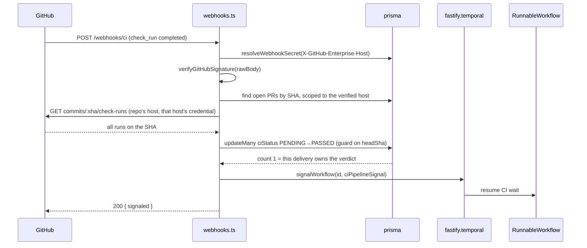

# GitHub Integration, Webhooks, and Workflow Launch

> Indexed at commit `ae416937` on 2026-10-03 · [view on GitHub](https://github.com/yorch/auto-swe/tree/ae416937)

## Relevant source files

- [packages/gateway/src/lib/github.ts](https://github.com/yorch/auto-swe/blob/ae416937/packages/gateway/src/lib/github.ts)
- [packages/gateway/src/lib/githubAuth.ts](https://github.com/yorch/auto-swe/blob/ae416937/packages/gateway/src/lib/githubAuth.ts)
- [packages/gateway/src/lib/githubWebhookSecret.ts](https://github.com/yorch/auto-swe/blob/ae416937/packages/gateway/src/lib/githubWebhookSecret.ts)
- [packages/shared/src/lib/githubInstallation.ts](https://github.com/yorch/auto-swe/blob/ae416937/packages/shared/src/lib/githubInstallation.ts)
- [packages/shared/src/lib/githubHostCredential.ts](https://github.com/yorch/auto-swe/blob/ae416937/packages/shared/src/lib/githubHostCredential.ts)
- [packages/shared/src/lib/githubHostScope.ts](https://github.com/yorch/auto-swe/blob/ae416937/packages/shared/src/lib/githubHostScope.ts)
- [packages/gateway/src/routes/webhooks.ts](https://github.com/yorch/auto-swe/blob/ae416937/packages/gateway/src/routes/webhooks.ts)
- [packages/gateway/src/lib/repositoryHost.ts](https://github.com/yorch/auto-swe/blob/ae416937/packages/gateway/src/lib/repositoryHost.ts)
- [packages/gateway/src/lib/repoAccessWebhook.ts](https://github.com/yorch/auto-swe/blob/ae416937/packages/gateway/src/lib/repoAccessWebhook.ts)
- [packages/gateway/src/lib/repoAccessRefresh.ts](https://github.com/yorch/auto-swe/blob/ae416937/packages/gateway/src/lib/repoAccessRefresh.ts)
- [packages/gateway/src/lib/repoIdentityIndexCheck.ts](https://github.com/yorch/auto-swe/blob/ae416937/packages/gateway/src/lib/repoIdentityIndexCheck.ts)
- [packages/gateway/src/lib/workflowLaunch.ts](https://github.com/yorch/auto-swe/blob/ae416937/packages/gateway/src/lib/workflowLaunch.ts)
- [packages/gateway/src/lib/idempotency.ts](https://github.com/yorch/auto-swe/blob/ae416937/packages/gateway/src/lib/idempotency.ts)
- [packages/gateway/src/lib/temporalErrors.ts](https://github.com/yorch/auto-swe/blob/ae416937/packages/gateway/src/lib/temporalErrors.ts)
- [packages/gateway/src/plugins/temporal.ts](https://github.com/yorch/auto-swe/blob/ae416937/packages/gateway/src/plugins/temporal.ts)
- [packages/gateway/src/index.ts](https://github.com/yorch/auto-swe/blob/ae416937/packages/gateway/src/index.ts)
- [packages/shared/src/lib/systemConfig.ts](https://github.com/yorch/auto-swe/blob/ae416937/packages/shared/src/lib/systemConfig.ts)
- [packages/gateway/src/lib/slack.ts](https://github.com/yorch/auto-swe/blob/ae416937/packages/gateway/src/lib/slack.ts)
- [packages/gateway/src/lib/issueTrackerClient.ts](https://github.com/yorch/auto-swe/blob/ae416937/packages/gateway/src/lib/issueTrackerClient.ts)
- [packages/shared/src/lib/ssrfGuard.ts](https://github.com/yorch/auto-swe/blob/ae416937/packages/shared/src/lib/ssrfGuard.ts)
- [packages/shared/src/lib/integrations/registry.ts](https://github.com/yorch/auto-swe/blob/ae416937/packages/shared/src/lib/integrations/registry.ts)
- [packages/shared/src/lib/workflowId.ts](https://github.com/yorch/auto-swe/blob/ae416937/packages/shared/src/lib/workflowId.ts)
- [packages/gateway/src/routes/workRequests.ts](https://github.com/yorch/auto-swe/blob/ae416937/packages/gateway/src/routes/workRequests.ts)

## Overview

This page covers the gateway's edge with the outside world: the calls it makes to GitHub, the webhook endpoints it exposes, and the path from an inbound event to a started or resumed Temporal workflow. Five routes are mounted under `/api/v1/webhooks` — `/git`, `/access`, `/ci`, `/:token`, and `/jira` — registered at [packages/gateway/src/index.ts#L304](https://github.com/yorch/auto-swe/blob/ae416937/packages/gateway/src/index.ts#L304). None of them sits behind a session or token login; each authenticates its own caller with an HMAC signature or an opaque token.

Two of the routes resume a workflow that is already suspended (`/git`, `/ci`), one only refreshes cached permission answers (`/access`), and two start a new run (`/:token`, `/jira`). Everything that starts a workflow goes through `launchTrackedWorkflow`, and everything that talks to Temporal goes through the `fastify.temporal` decorator. A repository can live on a GitHub host other than the instance's own, so the GitHub-facing half of this page is host-aware throughout: which webhook secret verifies a delivery, which repositories a delivery may touch, and which platform credential may be sent to a host. Who may reach a repository, installations, and per-user credentials are covered in [Repository Access and Credentials](./3.4-repository-access-and-credentials.md) and are only referenced here where a webhook touches them.

## Outbound GitHub client

The gateway does not use Octokit. `packages/gateway/src/lib/github.ts` calls the REST API with `fetch` directly, sending `Accept: application/vnd.github+json`, `X-GitHub-Api-Version: 2022-11-28`, and a 15-second `AbortSignal.timeout` per request ([github.ts#L80-L102](https://github.com/yorch/auto-swe/blob/ae416937/packages/gateway/src/lib/github.ts#L80-L102), [github.ts#L114-L119](https://github.com/yorch/auto-swe/blob/ae416937/packages/gateway/src/lib/github.ts#L114-L119)). The App-token exchange uses `fetch` as well, with a 10-second timeout ([githubInstallation.ts#L126-L135](https://github.com/yorch/auto-swe/blob/ae416937/packages/shared/src/lib/githubInstallation.ts#L126-L135)). The module's remaining job is webhook signature verification, covered below.

`packages/gateway/src/lib/githubAuth.ts` is only a re-export. The credential mechanics live in `@auto-swe/shared/lib/githubInstallation` so the worker resolves an installation exactly as the gateway does ([githubAuth.ts#L1-L14](https://github.com/yorch/auto-swe/blob/ae416937/packages/gateway/src/lib/githubAuth.ts#L1-L14)). `resolveGitHubToken` takes a `ResolvedGitHubConfig` — the credential set to mint from — and an optional `InstallationTarget` (installation id and API base) that overrides the singleton values ([githubInstallation.ts#L149-L218](https://github.com/yorch/auto-swe/blob/ae416937/packages/shared/src/lib/githubInstallation.ts#L149-L218)).

| Mode | Condition | Credential used |
| ---- | --------- | --------------- |
| `app` | Set explicitly | RS256 JWT exchanged for an installation token; throws `GitHubTokenMissingError` if no installation id is available |
| `pat` | Set explicitly | The configured personal access token |
| `auto` | `appId`, `appPrivateKey` and an installation id all present | Same as `app` |
| `auto` (fallback) | App fields absent | The configured personal access token |
| any | Nothing usable | Throws `GitHubTokenMissingError` |
| any | The effective API host is not the host the config belongs to | Throws `PlatformCredentialHostError` before any mode is consulted |

The last row is the host rule's final enforcement point. Every platform credential — the PAT, an installation token, and the App JWT that mints one — leaves through `resolveGitHubToken`, so it compares the host family of the effective API URL with the host the config was built for (`credentialHost`, defaulting to the config's own API host) and refuses a mismatch ([githubInstallation.ts#L31-L42](https://github.com/yorch/auto-swe/blob/ae416937/packages/shared/src/lib/githubInstallation.ts#L31-L42), [githubInstallation.ts#L169-L184](https://github.com/yorch/auto-swe/blob/ae416937/packages/shared/src/lib/githubInstallation.ts#L169-L184)). `hostFamily` folds `github.com` with `api.github.com` and `<tenant>.ghe.com` with `api.<tenant>.ghe.com`, because each pair is one host served on two names ([githubHostScope.ts#L63-L75](https://github.com/yorch/auto-swe/blob/ae416937/packages/shared/src/lib/githubHostScope.ts#L63-L75)).

App mode mints a ten-minute JWT with `createSign('RSA-SHA256')` and exchanges it at `/app/installations/:id/access_tokens` ([githubInstallation.ts#L87-L97](https://github.com/yorch/auto-swe/blob/ae416937/packages/shared/src/lib/githubInstallation.ts#L87-L97), [githubInstallation.ts#L102-L147](https://github.com/yorch/auto-swe/blob/ae416937/packages/shared/src/lib/githubInstallation.ts#L102-L147)). The installation id must be numeric, so a malformed singleton value cannot redirect the App JWT to another path. Tokens are cached in a `Map` keyed by `<installationId>@<apiUrl>`, so two installations do not evict each other and the same id on two hosts stays distinct; each entry is served until sixty seconds before its stated expiry ([githubInstallation.ts#L60-L65](https://github.com/yorch/auto-swe/blob/ae416937/packages/shared/src/lib/githubInstallation.ts#L60-L65), [githubInstallation.ts#L199-L210](https://github.com/yorch/auto-swe/blob/ae416937/packages/shared/src/lib/githubInstallation.ts#L199-L210)). A cache hit also requires a matching credential fingerprint, a SHA-256 digest of the private key plus the app id; a slice of the PEM's last characters would be its constant footer and never invalidate on rotation ([githubInstallation.ts#L67-L85](https://github.com/yorch/auto-swe/blob/ae416937/packages/shared/src/lib/githubInstallation.ts#L67-L85)).

**Host credentials.** The instance's own credential set is the `GitHubConfig` singleton. A repository on another approved host is reached with that host's own set, a `GitHubHostCredential` row. `resolvePlatformCredential` returns one of five outcomes: `instance`, `host` (carrying a config), or a refusal — `mismatch` (another host with no usable set), `misconfigured` (web and API hosts differ) or `installation-mismatch` (the repository's installation is recorded for a different host) ([githubHostCredential.ts#L117-L177](https://github.com/yorch/auto-swe/blob/ae416937/packages/shared/src/lib/githubHostCredential.ts#L117-L177)). The scope decision itself is `platformCredentialScope`, which treats a repository as on the instance only when both its web and API overrides are in the instance's host family ([githubHostScope.ts#L126-L147](https://github.com/yorch/auto-swe/blob/ae416937/packages/shared/src/lib/githubHostScope.ts#L126-L147)). A host's row yields a usable set only when it holds a PAT or a complete App and the host is still in `github.repositoryHosts`; an approval that lapsed takes the credentials with it ([githubHostCredential.ts#L57-L88](https://github.com/yorch/auto-swe/blob/ae416937/packages/shared/src/lib/githubHostCredential.ts#L57-L88)). The config built from a row inherits nothing from the instance — no token, App, singleton installation id or auth mode — and carries `credentialHost` so the guard above compares against the right host ([githubHostCredential.ts#L95-L115](https://github.com/yorch/auto-swe/blob/ae416937/packages/shared/src/lib/githubHostCredential.ts#L95-L115)). Installations, user tokens and approval of hosts are in [Repository Access and Credentials](./3.4-repository-access-and-credentials.md).

Listing repositories is the one read `github.ts` performs on its own behalf. It calls `resolveGitHubToken(config)` with no target, so it uses the instance's credential set and singleton installation. It targets `/installation/repositories` under App auth and `/user/repos` under PAT auth, and pages through `fetchAllPages` with `GITHUB_PER_PAGE = 100` and `GITHUB_MAX_PAGES = 5` — 500 repositories at most ([github.ts#L65-L145](https://github.com/yorch/auto-swe/blob/ae416937/packages/gateway/src/lib/github.ts#L65-L145)). The loop stops early on any short page. The `/ci` handler reuses both constants for its own check-run listing.

Sources: [packages/gateway/src/lib/github.ts:L65-L145](https://github.com/yorch/auto-swe/blob/ae416937/packages/gateway/src/lib/github.ts#L65-L145) [packages/gateway/src/lib/githubAuth.ts:L1-L14](https://github.com/yorch/auto-swe/blob/ae416937/packages/gateway/src/lib/githubAuth.ts#L1-L14) [packages/shared/src/lib/githubInstallation.ts:L1-L218](https://github.com/yorch/auto-swe/blob/ae416937/packages/shared/src/lib/githubInstallation.ts#L1-L218) [packages/shared/src/lib/githubHostCredential.ts:L1-L177](https://github.com/yorch/auto-swe/blob/ae416937/packages/shared/src/lib/githubHostCredential.ts#L1-L177) [packages/shared/src/lib/githubHostScope.ts:L1-L190](https://github.com/yorch/auto-swe/blob/ae416937/packages/shared/src/lib/githubHostScope.ts#L1-L190)

## Inbound endpoints and signature verification

| Route | Authenticated by | Effect |
| ----- | ---------------- | ------ |
| `POST /webhooks/git` | GitHub HMAC-SHA256, instance or per-host secret | Records a PR merge, signals `humanMergeSignal` |
| `POST /webhooks/access` | GitHub HMAC-SHA256, instance or per-host secret | Classifies a collaborator/team/org/repository event and refreshes the affected cached permission answers |
| `POST /webhooks/ci` | GitHub HMAC-SHA256, instance or per-host secret | Records a CI verdict, signals `ciPipelineSignal` |
| `POST /webhooks/:token` | Opaque per-template `webhookToken` | Starts `RunnableWorkflow` |
| `POST /webhooks/jira` | Issue-tracker HMAC-SHA256 | Auto-creates a work request and starts `RunnableWorkflow` |

`verifyGitHubSignature` recomputes `sha256=<hmac>` over the raw body and compares with `crypto.timingSafeEqual`, returning `false` rather than throwing when the two buffers differ in length ([github.ts#L14-L31](https://github.com/yorch/auto-swe/blob/ae416937/packages/gateway/src/lib/github.ts#L14-L31)). Raw bodies are available because `fastify-raw-body` is registered with `global: false` and each signed route opts in with `config: { rawBody: true }` ([index.ts#L123-L124](https://github.com/yorch/auto-swe/blob/ae416937/packages/gateway/src/index.ts#L123-L124)).

**Which secret verifies a delivery.** `resolveWebhookSecret` reads the `X-GitHub-Enterprise-Host` header, which GitHub Enterprise Server sets and github.com does not. A header naming a host with a `GitHubHostWebhookSecret` row selects that row's secret, matching the exact `host[:port]` first and otherwise the one row with that hostname; a hostname shared by several rows with no exact match selects none. With no header, or a host with no row, the instance secret from `GitHubConfig` is used. Exactly one secret is ever tried, because trying the host's and then the instance's would let an instance-signed payload pass as coming from the enterprise host. The row is read on every delivery, not cached, so a rotated-out secret stops authenticating at once, and a stored secret that fails to decrypt throws instead of falling back ([githubWebhookSecret.ts#L1-L105](https://github.com/yorch/auto-swe/blob/ae416937/packages/gateway/src/lib/githubWebhookSecret.ts#L1-L105)). A matched row whose host is no longer approved verifies nothing and is refused rather than handed to the instance secret ([githubWebhookSecret.ts#L88-L91](https://github.com/yorch/auto-swe/blob/ae416937/packages/gateway/src/lib/githubWebhookSecret.ts#L88-L91)).

`verifyWebhookOrReject` fails closed and now returns the host the chosen secret proves (`null` for the instance secret). An unapproved host answers 401 `WEBHOOK_AUTH_FAILED`; a missing secret or a missing `x-hub-signature-256` header answers 401; a missing raw body answers 400; a mismatched digest answers 401 ([webhooks.ts#L165-L221](https://github.com/yorch/auto-swe/blob/ae416937/packages/gateway/src/routes/webhooks.ts#L165-L221)). The `/git`, `/access` and `/ci` routes share it. The Jira route repeats the same sequence inline against the tracker's own `webhookSecret`, reusing the identical HMAC function, and answers 401 for each failure ([webhooks.ts#L1105-L1121](https://github.com/yorch/auto-swe/blob/ae416937/packages/gateway/src/routes/webhooks.ts#L1105-L1121)).

A verified body is still an untrusted shape. `normalizeGitHubPullRequestEvent` and `normalizeGitHubCheckRunEvent` are pure functions that Zod-parse the payload and collapse it to one of three domain events — `unrecognized`, `ignored`, or the real event — so that a signed but malformed body answers 200 with `ignored` instead of throwing a 500 ([webhooks.ts#L60-L164](https://github.com/yorch/auto-swe/blob/ae416937/packages/gateway/src/routes/webhooks.ts#L60-L164)). Only these two functions know GitHub's payload shapes; the handlers below them are provider-agnostic.

**Host-aware matching.** A secret proves who sent a payload, not which repository it may act on, and `full_name` names no host. Both events carry the repository's optional `html_url`, and every handler applies two symmetric checks before touching a row. `deliveryHostMatches` requires that, when a per-host secret verified the delivery, the payload's `html_url` is on that host; `claimsHostWithOwnSecret` rejects an instance-secret delivery whose `html_url` names a host that has a secret of its own, since that host must sign with its own. Either failure answers 200 with `ignored` and the reason `Repository is not on the host that signed this delivery` ([repositoryHost.ts#L69-L105](https://github.com/yorch/auto-swe/blob/ae416937/packages/gateway/src/lib/repositoryHost.ts#L69-L105), [webhooks.ts#L172-L177](https://github.com/yorch/auto-swe/blob/ae416937/packages/gateway/src/routes/webhooks.ts#L172-L177), [webhooks.ts#L407-L412](https://github.com/yorch/auto-swe/blob/ae416937/packages/gateway/src/routes/webhooks.ts#L407-L412), [webhooks.ts#L663-L668](https://github.com/yorch/auto-swe/blob/ae416937/packages/gateway/src/routes/webhooks.ts#L663-L668)). Only hosts that can sign with their own secret count: github.com and `<tenant>.ghe.com` send no host header, so a legacy row for one never excludes anything ([repositoryHost.ts#L50-L67](https://github.com/yorch/auto-swe/blob/ae416937/packages/gateway/src/lib/repositoryHost.ts#L50-L67)). Startup logs a warning when such a row exists ([repoIdentityIndexCheck.ts#L20-L39](https://github.com/yorch/auto-swe/blob/ae416937/packages/gateway/src/lib/repoIdentityIndexCheck.ts#L20-L39), [index.ts#L148-L149](https://github.com/yorch/auto-swe/blob/ae416937/packages/gateway/src/index.ts#L148-L149)).

The repository lookup is `webhookRepositoryWhere`. Owner and name compare case-insensitively and literally — `_` and `%` are escaped because Prisma compiles `insensitive` equality to `ILIKE` — and the result is ANDed with `webhookHostScope`, which binds the delivery to the host its secret proved: a per-host secret reaches only connections on that host, and the instance secret reaches none on a host with its own secret. The scope loads only the repositories that already match the owner and name, so the cost follows the delivery rather than the number of onboarded repositories. The payload's own `html_url` is consulted only when the same owner and name is onboarded on more than one distinct host, so a single-host deployment keeps matching by name even if its configured web URL spells the host differently from GitHub ([repositoryHost.ts#L107-L232](https://github.com/yorch/auto-swe/blob/ae416937/packages/gateway/src/lib/repositoryHost.ts#L107-L232), [webhooks.ts#L414-L421](https://github.com/yorch/auto-swe/blob/ae416937/packages/gateway/src/routes/webhooks.ts#L414-L421), [webhooks.ts#L670-L677](https://github.com/yorch/auto-swe/blob/ae416937/packages/gateway/src/routes/webhooks.ts#L670-L677)).

The `/access` route verifies, applies the same host checks to every event kind except a bare user event, then hands the event type from `x-github-event` to `classifyAccessEvent`, which handles `member`, `team`, `membership`, `organization` and `repository` events and names everything else as ignored ([webhooks.ts#L601-L643](https://github.com/yorch/auto-swe/blob/ae416937/packages/gateway/src/routes/webhooks.ts#L601-L643), [repoAccessWebhook.ts#L71-L152](https://github.com/yorch/auto-swe/blob/ae416937/packages/gateway/src/lib/repoAccessWebhook.ts#L71-L152)). `refreshInvalidatedAccess` receives the verified host, and a user event is scoped through `webhookHostScope` as well, so it cannot reach another host's repositories ([repoAccessRefresh.ts#L70-L99](https://github.com/yorch/auto-swe/blob/ae416937/packages/gateway/src/lib/repoAccessRefresh.ts#L70-L99)). It deliberately never answers non-2xx on a lookup error, since GitHub redeliveries of one timed-out lookup would be worse than a pair keeping its previous answer until the next sweep. What the refreshed answers mean is covered in [Repository Access and Credentials](./3.4-repository-access-and-credentials.md).

Sources: [packages/gateway/src/routes/webhooks.ts:L60-L221](https://github.com/yorch/auto-swe/blob/ae416937/packages/gateway/src/routes/webhooks.ts#L60-L221) [packages/gateway/src/routes/webhooks.ts:L601-L643](https://github.com/yorch/auto-swe/blob/ae416937/packages/gateway/src/routes/webhooks.ts#L601-L643) [packages/gateway/src/lib/github.ts:L1-L31](https://github.com/yorch/auto-swe/blob/ae416937/packages/gateway/src/lib/github.ts#L1-L31) [packages/gateway/src/lib/githubWebhookSecret.ts:L1-L105](https://github.com/yorch/auto-swe/blob/ae416937/packages/gateway/src/lib/githubWebhookSecret.ts#L1-L105) [packages/gateway/src/lib/repositoryHost.ts:L1-L232](https://github.com/yorch/auto-swe/blob/ae416937/packages/gateway/src/lib/repositoryHost.ts#L1-L232)

## From webhook to Temporal signal

```mermaid
sequenceDiagram
    participant GitHub
    participant webhooks as webhooks.ts
    participant prisma
    participant temporal as fastify.temporal
    participant Workflow as RunnableWorkflow

    GitHub->>webhooks: POST /webhooks/ci (check_run completed)
    webhooks->>prisma: resolveWebhookSecret(X-GitHub-Enterprise-Host)
    webhooks->>webhooks: verifyGitHubSignature(rawBody)
    webhooks->>prisma: find open PRs by SHA, scoped to the verified host
    webhooks->>GitHub: GET commits/:sha/check-runs (repo's host, that host's credential)
    GitHub-->>webhooks: all runs on the SHA
    webhooks->>prisma: updateMany ciStatus PENDING→PASSED (guard on headSha)
    prisma-->>webhooks: count 1 = this delivery owns the verdict
    webhooks->>temporal: signalWorkflow(id, ciPipelineSignal)
    temporal->>Workflow: resume CI wait
    webhooks-->>GitHub: 200 { signaled }
```

The diagram shows the `/ci` path; `/git` is the same shape with a `PullRequest.status` `OPEN`→`MERGED` guard and a `humanMergeSignal`. In both, the DB transition is the concurrency gate and the signal follows it ([webhooks.ts#L446-L459](https://github.com/yorch/auto-swe/blob/ae416937/packages/gateway/src/routes/webhooks.ts#L446-L459), [webhooks.ts#L788-L796](https://github.com/yorch/auto-swe/blob/ae416937/packages/gateway/src/routes/webhooks.ts#L788-L796)).

A single passing check run says nothing about the other checks on a commit, so `aggregateCheckRuns` lists every run for the head SHA before deciding ([webhooks.ts#L301-L384](https://github.com/yorch/auto-swe/blob/ae416937/packages/gateway/src/routes/webhooks.ts#L301-L384)). It returns `null` — and the handler falls back to per-run signaling — whenever the view cannot be trusted: no token, an API error, or a result set longer than five pages. The lookup is made per repository, because one SHA can be tracked on several (a fork, a mirror, the same name on two hosts). `checkRunTarget` picks the API of the host the repository lives on and a token from that host's platform credential set, minted for the repository's own installation when it has one. It returns nothing when the repository's URLs are not on an approved host, when its web and API hosts differ, when its host has no platform credential, or when no credential resolves; the aggregation is then unavailable for that repository and it is signalled from the single run's verdict. It never uses a user's token, since a webhook has no launcher ([webhooks.ts#L223-L287](https://github.com/yorch/auto-swe/blob/ae416937/packages/gateway/src/routes/webhooks.ts#L223-L287), [webhooks.ts#L719-L766](https://github.com/yorch/auto-swe/blob/ae416937/packages/gateway/src/routes/webhooks.ts#L719-L766)). A failing conclusion skips the aggregation so the CI-fix loop gets the failing logs immediately; a repository whose checks are still running is held back, and if every repository is held back the delivery answers `deferred` ([webhooks.ts#L709-L761](https://github.com/yorch/auto-swe/blob/ae416937/packages/gateway/src/routes/webhooks.ts#L709-L761)).

The transition guard is a freshness check, not a change detector. Rows move only while `ciStatus` is `PENDING` **and** `headSha` matches the delivery, which blocks a hand-redelivered stale `failure` from flipping a newer `PASSED` back and re-signaling a run that has moved on. Each row gets the verdict computed for its own repository ([webhooks.ts#L767-L816](https://github.com/yorch/auto-swe/blob/ae416937/packages/gateway/src/routes/webhooks.ts#L767-L816)).

Signal failures split by kind, decided by `isTerminalSignalError`, which tests for `WorkflowNotFoundError` ([temporalErrors.ts#L20-L22](https://github.com/yorch/auto-swe/blob/ae416937/packages/gateway/src/lib/temporalErrors.ts#L20-L22)). On `/git`, a transient failure rolls the row back to `OPEN` and answers 503 with `SIGNAL_FAILED`, which marks the delivery failed in GitHub's UI; GitHub does not retry on its own, so the rollback exists to make a human "Redeliver" work. A terminal failure keeps `MERGED`, reports `signalSent: false`, and answers 200, because no redelivery could ever land that signal ([webhooks.ts#L461-L512](https://github.com/yorch/auto-swe/blob/ae416937/packages/gateway/src/routes/webhooks.ts#L461-L512), [webhooks.ts#L585-L591](https://github.com/yorch/auto-swe/blob/ae416937/packages/gateway/src/routes/webhooks.ts#L585-L591)). One `check_run` event can fan out to several workflows, so `/ci` decides this per pull request: it signals all transitioned rows with `Promise.allSettled`, rolls only the transiently failed ones back to `PENDING` (guarded on the status and head SHA it wrote), and answers 503 if any remain ([webhooks.ts#L820-L901](https://github.com/yorch/auto-swe/blob/ae416937/packages/gateway/src/routes/webhooks.ts#L820-L901), [webhooks.ts#L921-L930](https://github.com/yorch/auto-swe/blob/ae416937/packages/gateway/src/routes/webhooks.ts#L921-L930)).

Both handlers then do best-effort follow-up work that can never fail the request. `/git` posts a Slack notification to the originating channel or the team's notify channel and syncs the issue tracker, building the pull-request URL from the repository's own web base rather than the instance's ([webhooks.ts#L543-L583](https://github.com/yorch/auto-swe/blob/ae416937/packages/gateway/src/routes/webhooks.ts#L543-L583)); `/ci` syncs the tracker only for pull requests whose signal landed, so a rolled-back one syncs on its redelivery ([webhooks.ts#L903-L919](https://github.com/yorch/auto-swe/blob/ae416937/packages/gateway/src/routes/webhooks.ts#L903-L919)).

The Temporal decorator offers two liveness probes for callers that must decide something expensive before signalling. `isWorkflowRunning` answers `false` for a missing or closed execution; `isWorkflowGone` answers `true` only when the execution is definitively finished or does not exist, treats anything uncertain as `false`, and rethrows any other error ([temporal.ts#L710-L731](https://github.com/yorch/auto-swe/blob/ae416937/packages/gateway/src/plugins/temporal.ts#L710-L731)). The webhook handlers above use neither; they signal and read the error class instead.

Sources: [packages/gateway/src/routes/webhooks.ts:L223-L930](https://github.com/yorch/auto-swe/blob/ae416937/packages/gateway/src/routes/webhooks.ts#L223-L930) [packages/gateway/src/lib/temporalErrors.ts:L1-L22](https://github.com/yorch/auto-swe/blob/ae416937/packages/gateway/src/lib/temporalErrors.ts#L1-L22)

## Idempotency and replay protection

Replay protection differs per route because each has a different stable identity to key on.

| Route | Dedup key | Mechanism |
| ----- | --------- | --------- |
| `/git` | `PullRequest.status` | Atomic `OPEN`→`MERGED` `updateMany`; a loser sees count 0 |
| `/ci` | `ciStatus` + `headSha` | Atomic `PENDING`→verdict guarded on the delivery's SHA |
| `/:token` | `Idempotency-Key` header | Hashed into the workflow ID; opt-in |
| `/jira` | Ticket key | Deterministic `jira-<ticketId>` workflow ID |
| `POST /work-requests` | `Idempotency-Key` header, per user | Stored on `RunInput`; a retry answers with the run it started; opt-in |

The generic trigger accepts an arbitrary payload, so nothing intrinsic identifies a retry. `workflowIdFromIdempotencyKey` therefore derives the ID from the caller's key, hashing rather than embedding it so client input never reaches the Temporal ID or the dashboard, and length-prefixing the scope (`<length>:<scope><key>`) so two `(scope, key)` pairs cannot alias. The webhook route passes the first eight hex characters of the template id as the scope, giving `wh-<scope>-<16 hex>`, so the same key against two templates cannot collide. The digest is truncated to 64 bits, which makes a collision surface as a 409 rather than as two runs merging. Sending no key keeps one fresh run per delivery, which is what a schedule or a manual re-run wants ([idempotency.ts#L4-L52](https://github.com/yorch/auto-swe/blob/ae416937/packages/gateway/src/lib/idempotency.ts#L4-L52), [webhooks.ts#L996-L1003](https://github.com/yorch/auto-swe/blob/ae416937/packages/gateway/src/routes/webhooks.ts#L996-L1003)). Keys are capped at 255 characters ([idempotency.ts#L27-L34](https://github.com/yorch/auto-swe/blob/ae416937/packages/gateway/src/lib/idempotency.ts#L27-L34)). The route is additionally rate-limited to 60 requests per minute with a 128 KB body limit ([webhooks.ts#L938-L949](https://github.com/yorch/auto-swe/blob/ae416937/packages/gateway/src/routes/webhooks.ts#L938-L949)).

`POST /work-requests` accepts the same header but does not derive a workflow ID from it; a work request already has a ticket-based ID. The key is stored on the `RunInput` row and looked up by the pair `(requestedById, idempotencyKey)`, so it is scoped to the authenticated user and nothing client-supplied names an owner. The replay lookup runs first, before any ID is allocated. A matching row replays as `200` with `deduplicated: true` only once `startedActiveWorkflowId` is stamped (after the Temporal start succeeded) and the caller can still reach the repository; a row whose ticket, repository, description or budget tier differ answers 422 `IDEMPOTENCY_KEY_MISMATCH`; a row not yet confirmed answers 409 `IDEMPOTENCY_KEY_IN_PROGRESS` with `retry-after`. The lookup is repeated wherever a concurrent same-key request could have won a race, and a conflict whose holder has since compensated away answers 409 `IDEMPOTENCY_KEY_RETRY` rather than "already running" ([workRequests.ts#L375-L382](https://github.com/yorch/auto-swe/blob/ae416937/packages/gateway/src/routes/workRequests.ts#L375-L382), [workRequests.ts#L419-L514](https://github.com/yorch/auto-swe/blob/ae416937/packages/gateway/src/routes/workRequests.ts#L419-L514), [workRequests.ts#L580-L612](https://github.com/yorch/auto-swe/blob/ae416937/packages/gateway/src/routes/workRequests.ts#L580-L612)). After a successful launch the handler stamps `startedActiveWorkflowId`, retrying the write three times; if it still fails, the key reports in-progress rather than ever claiming a run that did not start ([workRequests.ts#L738-L761](https://github.com/yorch/auto-swe/blob/ae416937/packages/gateway/src/routes/workRequests.ts#L738-L761)). Agent runs use the same header and the hashed form with their own scope; see [Agent Runs and Implementer Runtimes](./4.6-agent-runs-and-implementer-runtimes.md).

Sources: [packages/gateway/src/lib/idempotency.ts:L1-L52](https://github.com/yorch/auto-swe/blob/ae416937/packages/gateway/src/lib/idempotency.ts#L1-L52) [packages/gateway/src/routes/webhooks.ts:L934-L1090](https://github.com/yorch/auto-swe/blob/ae416937/packages/gateway/src/routes/webhooks.ts#L934-L1090) [packages/gateway/src/routes/workRequests.ts:L375-L761](https://github.com/yorch/auto-swe/blob/ae416937/packages/gateway/src/routes/workRequests.ts#L375-L761)

## Workflow launch

`launchTrackedWorkflow` writes the `RunInput` and `ActiveWorkflow` rows in one Prisma transaction, then starts the workflow, then deletes the rows if the start failed ([workflowLaunch.ts#L115-L198](https://github.com/yorch/auto-swe/blob/ae416937/packages/gateway/src/lib/workflowLaunch.ts#L115-L198)). The ordering is deliberate and the header comment records why the reverse was worse: starting first meant a failed DB write left a workflow burning budget and opening pull requests with no row to attribute it to, and it wedged the ticket for later resubmission as well ([workflowLaunch.ts#L11-L46](https://github.com/yorch/auto-swe/blob/ae416937/packages/gateway/src/lib/workflowLaunch.ts#L11-L46)).

Writing first also makes dedup atomic and durable. The unique index on `ActiveWorkflow.temporalWorkflowId` decides the winner of two concurrent submissions, closing a TOCTOU gap that a read-then-start sequence has, and a DB row outlives Temporal's execution-retention window. A unique-constraint violation on insert and a `WorkflowExecutionAlreadyStartedError` on start both surface as `{ ok: false, reason: 'DUPLICATE' }`, now tagged with a `source` of `ledger` or `temporal`; a `temporal` duplicate is a live execution no row accounts for. Callers map the result to 409 or to a `duplicate: true` acknowledgement ([workflowLaunch.ts#L79-L105](https://github.com/yorch/auto-swe/blob/ae416937/packages/gateway/src/lib/workflowLaunch.ts#L79-L105), [webhooks.ts#L1077-L1084](https://github.com/yorch/auto-swe/blob/ae416937/packages/gateway/src/routes/webhooks.ts#L1077-L1084), [webhooks.ts#L1272-L1277](https://github.com/yorch/auto-swe/blob/ae416937/packages/gateway/src/routes/webhooks.ts#L1272-L1277)). A caller can also pass a `guard`, a check that runs inside the same interactive transaction before any ledger write, so a check-then-insert that must be atomic (the per-user run cap for MCP writes) is; a refusal returns `GUARD_REFUSED` and writes nothing. Without a guard the batch form is used unchanged ([workflowLaunch.ts#L106-L170](https://github.com/yorch/auto-swe/blob/ae416937/packages/gateway/src/lib/workflowLaunch.ts#L106-L170)). Compensation is best-effort and never throws: each delete runs independently and a failure is logged, leaving the rows as a visible non-terminal run ([workflowLaunch.ts#L175-L231](https://github.com/yorch/auto-swe/blob/ae416937/packages/gateway/src/lib/workflowLaunch.ts#L175-L231)).

Workflow IDs are built per entry point:

| Entry point | ID shape |
| ----------- | -------- |
| `POST /work-requests` | `eng-<org>-<repoName>-<ticketId>` with owner and name lower-cased, or `eng-<host>-<org>-<repoName>-<ticketId>` when the repository has a host override; plus `-rN` on re-run |
| `POST /webhooks/:token` with a key | `wh-<8-char template id>-<16 hex digest>` |
| `POST /webhooks/:token` without a key | `wh-<8-char template id>-<8 random hex>` |
| `POST /webhooks/jira` | `jira-<ticketId>` |

The work-request base ID comes from `generateWorkflowId`. Owner and repository name are lower-cased because GitHub treats them as case-insensitive, so an ID does not depend on the casing stored at onboarding; the ticket id keeps its casing because it is an external key and the branch name is built from it. A repository with a `githubUrl` override also carries its lower-cased `host[:port]`, because the same owner and name on github.com and on a GitHub Enterprise server are different repositories ([workflowId.ts#L1-L57](https://github.com/yorch/auto-swe/blob/ae416937/packages/shared/src/lib/workflowId.ts#L1-L57)). The format is still not unique on its own, since every part may contain hyphens. `allocateWorkflowId` queries `ActiveWorkflow` for the base, its `-r` family, and the families of the same ticket's earlier-format IDs from `legacyWorkflowIdBases` (stored casing, with and without the host segment), and hands the rows to `chooseWorkflowId` ([workflowLaunch.ts#L232-L290](https://github.com/yorch/auto-swe/blob/ae416937/packages/gateway/src/lib/workflowLaunch.ts#L232-L290)). `chooseWorkflowId` returns a conflict when a non-terminal execution of this repository exists under any of those families, so upgrading, or adding a host override while a run is in flight, cannot start a second run on the same branch. A row owned by a different repository or ticket is never a conflict; when one occupies the base string, the allocation moves to a `-x<8 hex of the repository id>` family, otherwise it appends `-rN` for a re-run ([workflowId.ts#L59-L221](https://github.com/yorch/auto-swe/blob/ae416937/packages/shared/src/lib/workflowId.ts#L59-L221)). The submit route and the re-run route both build their IDs this way ([workRequests.ts#L553-L613](https://github.com/yorch/auto-swe/blob/ae416937/packages/gateway/src/routes/workRequests.ts#L553-L613), [workRequests.ts#L877-L897](https://github.com/yorch/auto-swe/blob/ae416937/packages/gateway/src/routes/workRequests.ts#L877-L897)). The template webhook and Jira IDs carry no host ([webhooks.ts#L996-L1003](https://github.com/yorch/auto-swe/blob/ae416937/packages/gateway/src/routes/webhooks.ts#L996-L1003), [webhooks.ts#L1229](https://github.com/yorch/auto-swe/blob/ae416937/packages/gateway/src/routes/webhooks.ts#L1229)). The Jira ID is deliberately once-ever per ticket: re-triggering a completed ticket requires the authenticated path, which allocates a fresh ID.

The `/:token` route has no authenticated user, so it passes `gate: undefined` to `validateRunConnection` and is scoped to the template's own team rather than to a GitHub identity ([webhooks.ts#L1010-L1025](https://github.com/yorch/auto-swe/blob/ae416937/packages/gateway/src/routes/webhooks.ts#L1010-L1025)). The Jira auto-trigger is exempt from the identity gate for the same reason, but not from installation retirement: it skips with `reason: 'installation retired'` when the chosen repository's installation is retired ([webhooks.ts#L1184-L1195](https://github.com/yorch/auto-swe/blob/ae416937/packages/gateway/src/routes/webhooks.ts#L1184-L1195)). The gate and retirement rules themselves are in [Repository Access and Credentials](./3.4-repository-access-and-credentials.md).

The Jira auto-trigger refuses to guess a target. The tracker config is a platform-wide singleton with no ticket-to-repository mapping, so the route acknowledges and skips the transition unless exactly one active `git_repo` connection is onboarded — picking the first of several would route one tenant's spend into another tenant's repository. It also refuses a ticket key that fails `isValidTicketId`, because the key becomes the branch name and the workflow ID. Every skip answers 200 `{ data: { reason, skipped: true } }` so Jira does not retry ([webhooks.ts#L1100-L1103](https://github.com/yorch/auto-swe/blob/ae416937/packages/gateway/src/routes/webhooks.ts#L1100-L1103), [webhooks.ts#L1148-L1183](https://github.com/yorch/auto-swe/blob/ae416937/packages/gateway/src/routes/webhooks.ts#L1148-L1183)). Both starting routes check the organization's monthly budget before launching ([webhooks.ts#L1026-L1032](https://github.com/yorch/auto-swe/blob/ae416937/packages/gateway/src/routes/webhooks.ts#L1026-L1032), [webhooks.ts#L1207-L1220](https://github.com/yorch/auto-swe/blob/ae416937/packages/gateway/src/routes/webhooks.ts#L1207-L1220)).

Sources: [packages/gateway/src/lib/workflowLaunch.ts:L1-L290](https://github.com/yorch/auto-swe/blob/ae416937/packages/gateway/src/lib/workflowLaunch.ts#L1-L290) [packages/shared/src/lib/workflowId.ts:L1-L221](https://github.com/yorch/auto-swe/blob/ae416937/packages/shared/src/lib/workflowId.ts#L1-L221) [packages/gateway/src/routes/workRequests.ts:L553-L761](https://github.com/yorch/auto-swe/blob/ae416937/packages/gateway/src/routes/workRequests.ts#L553-L761) [packages/gateway/src/routes/webhooks.ts:L996-L1279](https://github.com/yorch/auto-swe/blob/ae416937/packages/gateway/src/routes/webhooks.ts#L996-L1279)

## The Temporal Fastify plugin

`packages/gateway/src/plugins/temporal.ts` opens one `Connection` at boot, builds a `Client` and a `ScheduleClient` from it, and decorates the instance as `fastify.temporal` ([temporal.ts#L272-L281](https://github.com/yorch/auto-swe/blob/ae416937/packages/gateway/src/plugins/temporal.ts#L272-L281), [temporal.ts#L454](https://github.com/yorch/auto-swe/blob/ae416937/packages/gateway/src/plugins/temporal.ts#L454)). The `Client` carries a trace-context interceptor that stamps the request's trace context on every workflow it starts, so the run's activities join the request's trace. The plugin is wrapped in `fastify-plugin` under the name `temporal`, so the decorator is visible to every route, and an `onClose` hook closes the connection ([temporal.ts#L972-L978](https://github.com/yorch/auto-swe/blob/ae416937/packages/gateway/src/plugins/temporal.ts#L972-L978)). The address comes from `resolveTemporalAddress`, not from a hard-coded value.

The decorator's surface is declared through a `declare module 'fastify'` augmentation, so route code sees typed methods rather than a raw client ([temporal.ts#L183-L265](https://github.com/yorch/auto-swe/blob/ae416937/packages/gateway/src/plugins/temporal.ts#L183-L265)). It groups into three kinds of call:

- **Starts.** `startRunnableWorkflow`, `startEpicWorkflow`, `startEvalRunWorkflow`, `startChannelAssistant` and others, all onto the `engineering-workflow` task queue ([temporal.ts#L819-L836](https://github.com/yorch/auto-swe/blob/ae416937/packages/gateway/src/plugins/temporal.ts#L819-L836)). `startChannelAssistant` sets `WorkflowIdReusePolicy.REJECT_DUPLICATE` so a re-delivered Slack event is rejected rather than answered twice ([temporal.ts#L743-L770](https://github.com/yorch/auto-swe/blob/ae416937/packages/gateway/src/plugins/temporal.ts#L743-L770)).
- **Signals, cancels and liveness.** `signalWorkflow` takes a workflow ID, a signal name and arguments, and is the single path every webhook and Slack handler uses to resume a run ([temporal.ts#L734-L741](https://github.com/yorch/auto-swe/blob/ae416937/packages/gateway/src/plugins/temporal.ts#L734-L741)). `isWorkflowRunning` and `isWorkflowGone` are the read-only counterparts described above.
- **Schedules.** One `sync…Schedule` method per recurring job: lesson consolidation, eval regression, eval revalidation, repository dependency scans, the repository-access permission sweep, provider model discovery, recurring work requests, and per-channel ambient and reactive polls ([temporal.ts#L840-L975](https://github.com/yorch/auto-swe/blob/ae416937/packages/gateway/src/plugins/temporal.ts#L840-L975)). Schedule IDs are exported constants; the model-discovery sweep is `auto-swe-model-discovery` and, like the access sweep, is system-wide with no arguments ([temporal.ts#L28-L33](https://github.com/yorch/auto-swe/blob/ae416937/packages/gateway/src/plugins/temporal.ts#L28-L33), [temporal.ts#L174-L181](https://github.com/yorch/auto-swe/blob/ae416937/packages/gateway/src/plugins/temporal.ts#L174-L181), [temporal.ts#L325-L334](https://github.com/yorch/auto-swe/blob/ae416937/packages/gateway/src/plugins/temporal.ts#L325-L334), [temporal.ts#L890-L912](https://github.com/yorch/auto-swe/blob/ae416937/packages/gateway/src/plugins/temporal.ts#L890-L912)). `upsertSchedule` updates in place when the schedule exists and creates it otherwise, with `ScheduleOverlapPolicy.SKIP`, and a `paused` flag when the caller supplies one ([temporal.ts#L428-L452](https://github.com/yorch/auto-swe/blob/ae416937/packages/gateway/src/plugins/temporal.ts#L428-L452)). Existence is decided by `scheduleExists`, which rethrows anything that is not a `ScheduleNotFoundError` — treating an outage as "no such schedule" once made deletes report success while live schedules kept firing ([temporal.ts#L405-L417](https://github.com/yorch/auto-swe/blob/ae416937/packages/gateway/src/plugins/temporal.ts#L405-L417)).

Two methods break the fire-and-forget pattern: `generateWorkflowSpec` and `explainWorkflowSpec` await the workflow result, because the generate-validate-repair loop runs in the worker where models bind ([temporal.ts#L478-L510](https://github.com/yorch/auto-swe/blob/ae416937/packages/gateway/src/plugins/temporal.ts#L478-L510)).

**Registration at startup.** The gateway applies the recurring system schedules once, in `start()`, and each call is best-effort: a Temporal outage logs a warning and does not stop the gateway. Three of them — the repository dependency scan, the repository-access sweep and model discovery — are environment-only, read together by `resolveScheduledSweeps`:

| Schedule | Enabled variable (default) | Cron variable (default, UTC) |
| -------- | -------------------------- | ---------------------------- |
| Repository access sweep | `REPO_ACCESS_SYNC_ENABLED` (`false`) | `REPO_ACCESS_SYNC_CRON` (`23 * * * *`) |
| Repository dependency scan | `REPO_DEPENDENCY_SCAN_ENABLED` (`true`) | `REPO_DEPENDENCY_SCAN_CRON` (`0 4 * * *`) |
| Provider model discovery | `MODEL_DISCOVERY_ENABLED` (`true`) | `MODEL_DISCOVERY_CRON` (`17 3 * * *`) |

The resolver is lenient and falls back to the default for an unusable value, so `assertScheduledSweepsEnv` runs first at boot and fails the process with one message naming every set-but-invalid variable; for the `ENABLED` flags the silent default could be the opposite of what was meant. A disabled schedule still exists, paused ([systemConfig.ts#L880-L970](https://github.com/yorch/auto-swe/blob/ae416937/packages/shared/src/lib/systemConfig.ts#L880-L970), [index.ts#L91-L93](https://github.com/yorch/auto-swe/blob/ae416937/packages/gateway/src/index.ts#L91-L93), [index.ts#L158-L176](https://github.com/yorch/auto-swe/blob/ae416937/packages/gateway/src/index.ts#L158-L176)). The access sweep is off by default because it spends GitHub quota in proportion to team members times repositories. The lesson-consolidation, eval-regression and eval-revalidation schedules are still read from the database-backed configuration at startup ([index.ts#L151-L156](https://github.com/yorch/auto-swe/blob/ae416937/packages/gateway/src/index.ts#L151-L156), [index.ts#L178-L188](https://github.com/yorch/auto-swe/blob/ae416937/packages/gateway/src/index.ts#L178-L188)). Per-channel and per-work-request schedules are not registered here; their routes sync them when a row is saved.

Sources: [packages/gateway/src/plugins/temporal.ts:L1-L978](https://github.com/yorch/auto-swe/blob/ae416937/packages/gateway/src/plugins/temporal.ts#L1-L978) [packages/gateway/src/index.ts:L85-L188](https://github.com/yorch/auto-swe/blob/ae416937/packages/gateway/src/index.ts#L85-L188) [packages/shared/src/lib/systemConfig.ts:L880-L970](https://github.com/yorch/auto-swe/blob/ae416937/packages/shared/src/lib/systemConfig.ts#L880-L970)

## Slack and issue-tracker outbound clients

`packages/gateway/src/lib/slack.ts` holds both halves of the Slack edge. `verifySlackSignature` rebuilds the `v0:<timestamp>:<body>` base string, compares the HMAC in constant time, and rejects any request whose timestamp is more than five minutes from now — the replay window Slack recommends ([slack.ts#L12](https://github.com/yorch/auto-swe/blob/ae416937/packages/gateway/src/lib/slack.ts#L12), [slack.ts#L20-L45](https://github.com/yorch/auto-swe/blob/ae416937/packages/gateway/src/lib/slack.ts#L20-L45)).

Outbound, `postSlackMessage` calls `chat.postMessage` with a two-second timeout and returns `null` on any failure or when no bot token is configured, so a Slack outage cannot break workflow-step recording ([slack.ts#L68-L107](https://github.com/yorch/auto-swe/blob/ae416937/packages/gateway/src/lib/slack.ts#L68-L107)). The `/git` handler uses it for the merge notification, threading the reply under the originating message when one exists. `fetchSlackChannelIsPrivate` asks `conversations.info` whether a channel is private, since `SlackChannel.isPrivate` decides whether that channel's memory can be read elsewhere and the alternative is guessing from the payload shape ([slack.ts#L115-L152](https://github.com/yorch/auto-swe/blob/ae416937/packages/gateway/src/lib/slack.ts#L115-L152)). `views.publish` and `views.open` share `slackApiPost`, which never throws and shapes a network error into `{ ok: false, error }` but sets no timeout of its own ([slack.ts#L239-L261](https://github.com/yorch/auto-swe/blob/ae416937/packages/gateway/src/lib/slack.ts#L239-L261)).

The issue-tracker client is a thin delegation wrapper over the shared provider registry, kept for backwards compatibility with importers of `FetchedTicket`. Its stated policy is that it never throws: no provider, bad config, network error, timeout, 404 or unparsable body all log a warning and return `null`, because ticket enrichment must never block a submission ([issueTrackerClient.ts#L9-L16](https://github.com/yorch/auto-swe/blob/ae416937/packages/gateway/src/lib/issueTrackerClient.ts#L9-L16), [issueTrackerClient.ts#L40-L77](https://github.com/yorch/auto-swe/blob/ae416937/packages/gateway/src/lib/issueTrackerClient.ts#L40-L77)). Writes back to the tracker on merge and on CI verdicts go through `syncTrackerOnEvent`, called with a `.catch` at both sites ([webhooks.ts#L563-L583](https://github.com/yorch/auto-swe/blob/ae416937/packages/gateway/src/routes/webhooks.ts#L563-L583), [webhooks.ts#L903-L919](https://github.com/yorch/auto-swe/blob/ae416937/packages/gateway/src/routes/webhooks.ts#L903-L919)).

Sources: [packages/gateway/src/lib/slack.ts:L1-L301](https://github.com/yorch/auto-swe/blob/ae416937/packages/gateway/src/lib/slack.ts#L1-L301) [packages/gateway/src/lib/issueTrackerClient.ts:L1-L77](https://github.com/yorch/auto-swe/blob/ae416937/packages/gateway/src/lib/issueTrackerClient.ts#L1-L77)

## SSRF guard on self-hosted base URLs

Every operator-supplied URL the gateway or worker fetches passes through one definition, `isSafeProbeUrl` ([ssrfGuard.ts#L70-L157](https://github.com/yorch/auto-swe/blob/ae416937/packages/shared/src/lib/ssrfGuard.ts#L70-L157)). It rejects any non-`http(s)` protocol and any hostname that is loopback, unspecified, `.localhost`, `.local`, `.internal`, RFC 1918, `0.0.0.0/8`, link-local including the AWS metadata range, carrier-grade NAT (`100.64.0.0/10`, which includes Alibaba Cloud's metadata address), IPv6 unique-local, or deprecated IPv6 site-local. It strips the brackets Node's parser keeps on IPv6 hostnames and a trailing dot (`localhost.` resolves like `localhost`), and covers the short-form IPv4 notations such as `127.1`. It extracts an embedded IPv4 from IPv4-mapped, IPv4-translated and IPv4-compatible IPv6 addresses, the NAT64 well-known prefix and 6to4, each in dotted and hex tail spellings, and rejects the NAT64 local-use prefix outright because its target cannot be read from the address ([ssrfGuard.ts#L20-L62](https://github.com/yorch/auto-swe/blob/ae416937/packages/shared/src/lib/ssrfGuard.ts#L20-L62), [ssrfGuard.ts#L84-L157](https://github.com/yorch/auto-swe/blob/ae416937/packages/shared/src/lib/ssrfGuard.ts#L84-L157)).

The guard is text-level and does no DNS lookup. Its own header states the limit: it blocks the obvious accidents, not an attacker who registers a public hostname resolving to an internal address ([ssrfGuard.ts#L1-L17](https://github.com/yorch/auto-swe/blob/ae416937/packages/shared/src/lib/ssrfGuard.ts#L1-L17)). Rebinding defence belongs to outbound network policy at the container level.

Connector base URLs run through `checkBaseUrlSafety`, which fails closed by returning `false` so the provider factory returns `null` ([registry.ts#L58-L77](https://github.com/yorch/auto-swe/blob/ae416937/packages/shared/src/lib/integrations/registry.ts#L58-L77)). The per-connector `allowPrivateNetwork` flag is the operator's explicit opt-in for a legitimately self-hosted Jira, GitHub Enterprise or Confluence instance on an internal address. It bypasses the rejection, and the bypass itself is logged at warn level so it stays auditable. The flag defaults to `false`. Where repository base URLs are written and which hosts may receive a credential is covered in [Repository Access and Credentials](./3.4-repository-access-and-credentials.md).

Sources: [packages/shared/src/lib/ssrfGuard.ts:L1-L157](https://github.com/yorch/auto-swe/blob/ae416937/packages/shared/src/lib/ssrfGuard.ts#L1-L157) [packages/shared/src/lib/integrations/registry.ts:L45-L150](https://github.com/yorch/auto-swe/blob/ae416937/packages/shared/src/lib/integrations/registry.ts#L45-L150)

## Related Pages

- Parent: [Gateway API](./3-gateway-api.md)
- Sibling: [HTTP Routes](./3.1-http-routes.md)
- Sibling: [Authentication and RBAC](./3.2-authentication-and-rbac.md)
- Sibling: [Repository Access and Credentials](./3.4-repository-access-and-credentials.md)
- Sibling: [MCP Server and OAuth](./3.5-mcp-server-and-oauth.md)
- [Workflow Spec and Interpreter](./2.2-workflow-spec-and-interpreter.md)
- [Temporal Workflows](./4.1-temporal-workflows.md)
- [Agent Runs and Implementer Runtimes](./4.6-agent-runs-and-implementer-runtimes.md)
