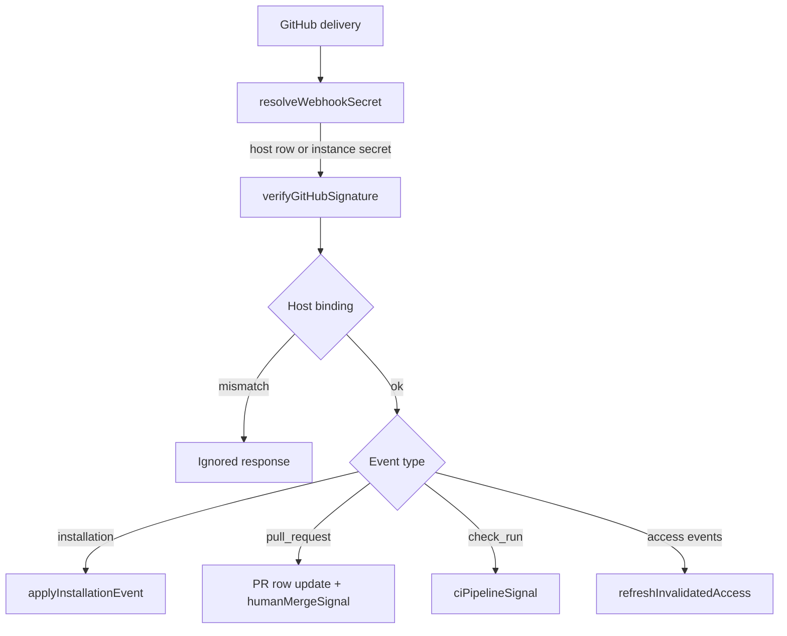

# GitHub Integration and Webhooks

> Indexed at commit `d0a90fb5` on 2026-10-06 · [view on GitHub](https://github.com/yorch/auto-swe/tree/d0a90fb5)

## Relevant source files

- [packages/gateway/src/routes/webhooks.ts](https://github.com/yorch/auto-swe/blob/d0a90fb5/packages/gateway/src/routes/webhooks.ts)
- [packages/gateway/src/lib/github.ts](https://github.com/yorch/auto-swe/blob/d0a90fb5/packages/gateway/src/lib/github.ts)
- [packages/gateway/src/lib/githubWebhookSecret.ts](https://github.com/yorch/auto-swe/blob/d0a90fb5/packages/gateway/src/lib/githubWebhookSecret.ts)
- [packages/gateway/src/lib/installationWebhook.ts](https://github.com/yorch/auto-swe/blob/d0a90fb5/packages/gateway/src/lib/installationWebhook.ts)
- [packages/shared/src/lib/githubInstallation.ts](https://github.com/yorch/auto-swe/blob/d0a90fb5/packages/shared/src/lib/githubInstallation.ts)

## Overview

The gateway receives inbound events from GitHub (pull request, check run, GitHub App installation, and access-change events) and from Jira, and turns them into database updates and Temporal workflow signals. All routes live in the `webhookRoutes` plugin ([webhooks.ts#L469](https://github.com/yorch/auto-swe/blob/d0a90fb5/packages/gateway/src/routes/webhooks.ts#L469)). Signature verification is in `lib/github.ts`, secret selection in `lib/githubWebhookSecret.ts`, and App lifecycle handling in `lib/installationWebhook.ts`. The shared package supplies installation-token minting.

```mermaid
flowchart TD
  D[GitHub delivery] --> R[resolveWebhookSecret]
  R -->|host row or instance secret| V[verifyGitHubSignature]
  V --> H{Host binding}
  H -->|mismatch| I[Ignored response]
  H -->|ok| E{Event type}
  E -->|installation| A[applyInstallationEvent]
  E -->|pull_request| P[PR row update + humanMergeSignal]
  E -->|check_run| C[ciPipelineSignal]
  E -->|access events| X[refreshInvalidatedAccess]
```

Sources: [webhooks.ts#L469-L765](https://github.com/yorch/auto-swe/blob/d0a90fb5/packages/gateway/src/routes/webhooks.ts#L469-L765)

## HMAC verification

`verifyGitHubSignature` computes `sha256=` plus an HMAC-SHA256 hex digest of the raw body and compares it with `crypto.timingSafeEqual`. A length mismatch returns `false` before the comparison, because `timingSafeEqual` throws on unequal buffers ([github.ts:L14-L31](https://github.com/yorch/auto-swe/blob/d0a90fb5/packages/gateway/src/lib/github.ts#L14-L31)).

`verifyWebhookOrReject` wraps this for the GitHub routes. It answers 401 `WEBHOOK_AUTH_FAILED` for an unapproved host, a missing secret or signature, or an invalid signature, and 400 for a missing raw body. On success it returns the host the secret proved ([webhooks.ts:L217-L257](https://github.com/yorch/auto-swe/blob/d0a90fb5/packages/gateway/src/routes/webhooks.ts#L217-L257)). Each route opts into `rawBody: true` so the exact bytes are available.

Sources: [github.ts:L14-L31](https://github.com/yorch/auto-swe/blob/d0a90fb5/packages/gateway/src/lib/github.ts#L14-L31) [webhooks.ts:L217-L257](https://github.com/yorch/auto-swe/blob/d0a90fb5/packages/gateway/src/routes/webhooks.ts#L217-L257)

## Per-host secrets

`resolveWebhookSecret` chooses exactly one secret per delivery. The `X-GitHub-Enterprise-Host` header is lowercased by `enterpriseHostOf`; a matching `GitHubHostWebhookSecret` row is found by exact `host[:port]`, else by the single row sharing the hostname. A hostname shared by several rows with no exact match resolves to none ([githubWebhookSecret.ts:L72-L87](https://github.com/yorch/auto-swe/blob/d0a90fb5/packages/gateway/src/lib/githubWebhookSecret.ts#L72-L87)).

A matched row whose host is no longer in `approvedRepositoryHosts()` yields `host_not_approved`, and the delivery is refused rather than handed to the instance secret. Otherwise the row's secret is decrypted; a decryption failure throws. A delivery naming no row falls back to the instance secret from `resolveGitHubConfig()` with `host: null` ([githubWebhookSecret.ts:L88-L104](https://github.com/yorch/auto-swe/blob/d0a90fb5/packages/gateway/src/lib/githubWebhookSecret.ts#L88-L104)). The secret is read on every delivery and never cached, so a rotated secret stops authenticating immediately ([githubWebhookSecret.ts:L31-L32](https://github.com/yorch/auto-swe/blob/d0a90fb5/packages/gateway/src/lib/githubWebhookSecret.ts#L31-L32)).

The resolved `host` binds the delivery to repositories on that host. Handlers call `deliveryHostMatches` and `claimsHostWithOwnSecret` from `lib/repositoryHost.ts`, and a mismatch returns the ignored `HOST_MISMATCH` response ([webhooks.ts:L212-L215](https://github.com/yorch/auto-swe/blob/d0a90fb5/packages/gateway/src/routes/webhooks.ts#L212-L215)). The secret proves the sender, not which repository the payload may act on.

Sources: [githubWebhookSecret.ts:L72-L104](https://github.com/yorch/auto-swe/blob/d0a90fb5/packages/gateway/src/lib/githubWebhookSecret.ts#L72-L104) [webhooks.ts:L503-L508](https://github.com/yorch/auto-swe/blob/d0a90fb5/packages/gateway/src/routes/webhooks.ts#L503-L508)

## Pull request webhook (`/git`)

Normalizer functions map GitHub payloads to provider-agnostic domain events. `normalizeGitHubPullRequestEvent` yields `merged`, `closed`, `reopened`, `draft`, `retitled`, `ignored`, or `unrecognized` ([webhooks.ts:L143-L176](https://github.com/yorch/auto-swe/blob/d0a90fb5/packages/gateway/src/routes/webhooks.ts#L143-L176)). Payloads are Zod-validated, so a malformed but signed body is ignored rather than causing a 500.

Non-merge events go to `recordPullRequestChange`, which updates only an existing tracked row through guarded `updateMany` calls, so redeliveries are no-ops ([webhooks.ts:L431-L467](https://github.com/yorch/auto-swe/blob/d0a90fb5/packages/gateway/src/routes/webhooks.ts#L431-L467)).

A merge moves the row from `OPEN` or `CLOSED` to `MERGED` with an atomic `updateMany`; only the delivery that changes a row proceeds, which dedupes concurrent deliveries. It then sends `humanMergeSignal` to the Temporal workflow ([webhooks.ts:L559-L589](https://github.com/yorch/auto-swe/blob/d0a90fb5/packages/gateway/src/routes/webhooks.ts#L559-L589)). A transient signal failure rolls the row back and answers 503 `SIGNAL_FAILED` so a manual redelivery can work. A terminal failure (the execution is gone, per `isTerminalSignalError`) keeps `MERGED` and answers 200 ([webhooks.ts:L591-L624](https://github.com/yorch/auto-swe/blob/d0a90fb5/packages/gateway/src/routes/webhooks.ts#L591-L624)). Afterwards, best-effort steps record an `EvalResult`, post a Slack notice, and sync the issue tracker.

Sources: [webhooks.ts:L469-L705](https://github.com/yorch/auto-swe/blob/d0a90fb5/packages/gateway/src/routes/webhooks.ts#L469-L705)

## CI webhook (`/ci`)

`normalizeGitHubCheckRunEvent` accepts only completed check runs ([webhooks.ts:L179-L202](https://github.com/yorch/auto-swe/blob/d0a90fb5/packages/gateway/src/routes/webhooks.ts#L179-L202)). The handler finds open tracked PRs by `headSha` within the host-bound repository filter ([webhooks.ts:L803-L826](https://github.com/yorch/auto-swe/blob/d0a90fb5/packages/gateway/src/routes/webhooks.ts#L803-L826)).

A failing conclusion signals immediately. A conclusion in `NON_FAILING_CONCLUSIONS` (`success`, `neutral`, `skipped`) triggers aggregation per repository: `aggregateCheckRuns` pages through the commit's check runs, up to `GITHUB_MAX_PAGES` pages of `GITHUB_PER_PAGE` runs ([webhooks.ts:L348-L417](https://github.com/yorch/auto-swe/blob/d0a90fb5/packages/gateway/src/routes/webhooks.ts#L348-L417), [github.ts:L65-L71](https://github.com/yorch/auto-swe/blob/d0a90fb5/packages/gateway/src/lib/github.ts#L65-L71)). If any run is incomplete the response is `deferred`. If aggregation is unavailable or truncated, the handler falls back to per-run signaling.

`checkRunTarget` picks the API URL and token for each repository. It requires approved repository hosts, resolves the platform credential for the repository's host through `resolvePlatformCredential`, and never uses a user token ([webhooks.ts:L277-L325](https://github.com/yorch/auto-swe/blob/d0a90fb5/packages/gateway/src/routes/webhooks.ts#L277-L325)).

Each PR transitions `ciStatus` from `PENDING` to `PASSED` or `FAILED` only while its `headSha` still matches, which makes the write a freshness guard rather than a change detector ([webhooks.ts:L911-L919](https://github.com/yorch/auto-swe/blob/d0a90fb5/packages/gateway/src/routes/webhooks.ts#L911-L919)). Workflows then receive `ciPipelineSignal` in parallel. Transient failures roll that PR back to `PENDING` and produce a 503; terminal failures keep the recorded status ([webhooks.ts:L969-L1051](https://github.com/yorch/auto-swe/blob/d0a90fb5/packages/gateway/src/routes/webhooks.ts#L969-L1051)).

Sources: [webhooks.ts:L767-L1055](https://github.com/yorch/auto-swe/blob/d0a90fb5/packages/gateway/src/routes/webhooks.ts#L767-L1055)

## Installation and access events

The `/git` and `/access` routes both hand `installation` and `installation_target` events to `applyInstallationEvent` ([webhooks.ts:L483-L494](https://github.com/yorch/auto-swe/blob/d0a90fb5/packages/gateway/src/routes/webhooks.ts#L483-L494), [webhooks.ts:L724-L735](https://github.com/yorch/auto-swe/blob/d0a90fb5/packages/gateway/src/routes/webhooks.ts#L724-L735)). The relevant actions are `deleted`, `suspend` and `unsuspend` for `installation`, and `renamed` for `installation_target` ([installationWebhook.ts:L178-L183](https://github.com/yorch/auto-swe/blob/d0a90fb5/packages/gateway/src/lib/installationWebhook.ts#L178-L183)).

The delivery is treated as a prompt to ask, not as state to apply. The handler binds the delivery to its host, looks up the `GitHubInstallation` row by `(host, installationId)`, and ignores unregistered installations, so a delivery cannot add a credential path ([installationWebhook.ts:L190-L208](https://github.com/yorch/auto-swe/blob/d0a90fb5/packages/gateway/src/lib/installationWebhook.ts#L190-L208)). It then calls `GET /app/installations/{id}` through `fetchAppInstallation`, authenticated with that host's App JWT, and applies only what GitHub reports: 404 is `deleted`, a `suspended_at` value is `suspended`, anything else is `active` ([githubInstallation.ts:L167-L205](https://github.com/yorch/auto-swe/blob/d0a90fb5/packages/shared/src/lib/githubInstallation.ts#L167-L205)). A host with no App credentials, or a failed lookup, changes nothing ([installationWebhook.ts:L98-L128](https://github.com/yorch/auto-swe/blob/d0a90fb5/packages/gateway/src/lib/installationWebhook.ts#L98-L128)).

`changeFor` only reverses retirements recorded with a `webhook:` `retiredReason`, so an admin's own retirement is never reactivated. The write is conditional on the row as read, and an audit entry follows the change ([installationWebhook.ts:L133-L158](https://github.com/yorch/auto-swe/blob/d0a90fb5/packages/gateway/src/lib/installationWebhook.ts#L133-L158), [installationWebhook.ts:L220-L258](https://github.com/yorch/auto-swe/blob/d0a90fb5/packages/gateway/src/lib/installationWebhook.ts#L220-L258)).

For other access events (collaborator, team, membership, repository), `classifyAccessEvent` produces an invalidation and `refreshInvalidatedAccess` refreshes permission answers. A lookup failure never fails the response, to avoid redelivery storms ([webhooks.ts:L736-L764](https://github.com/yorch/auto-swe/blob/d0a90fb5/packages/gateway/src/routes/webhooks.ts#L736-L764)).

Sources: [installationWebhook.ts:L166-L260](https://github.com/yorch/auto-swe/blob/d0a90fb5/packages/gateway/src/lib/installationWebhook.ts#L166-L260) [githubInstallation.ts:L149-L205](https://github.com/yorch/auto-swe/blob/d0a90fb5/packages/shared/src/lib/githubInstallation.ts#L149-L205)

## Installation tokens

`resolveGitHubToken` returns an App installation token when the App is configured (or `authMode` is `'app'`), otherwise the PAT. It first refuses any API host that differs from the credential set's host, throwing `PlatformCredentialHostError` ([githubInstallation.ts:L227-L248](https://github.com/yorch/auto-swe/blob/d0a90fb5/packages/shared/src/lib/githubInstallation.ts#L227-L248)).

Tokens are cached per `installationId@apiUrl`, so two installations do not evict each other. Entries expire 60 seconds before GitHub's expiry, and a hashed fingerprint of the App id and private key invalidates entries on rotation ([githubInstallation.ts:L60-L85](https://github.com/yorch/auto-swe/blob/d0a90fb5/packages/shared/src/lib/githubInstallation.ts#L60-L85), [githubInstallation.ts:L260-L268](https://github.com/yorch/auto-swe/blob/d0a90fb5/packages/shared/src/lib/githubInstallation.ts#L260-L268)). `fetchInstallationToken` signs an RS256 JWT, requires a numeric installation id, and posts to `/app/installations/{id}/access_tokens` ([githubInstallation.ts:L87-L147](https://github.com/yorch/auto-swe/blob/d0a90fb5/packages/shared/src/lib/githubInstallation.ts#L87-L147)).

The gateway also lists repositories for onboarding: `listGitHubRepos` calls `/installation/repositories` in App mode or `/user/repos` otherwise, paging up to 500 repositories ([github.ts:L110-L145](https://github.com/yorch/auto-swe/blob/d0a90fb5/packages/gateway/src/lib/github.ts#L110-L145)).

Sources: [githubInstallation.ts:L60-L276](https://github.com/yorch/auto-swe/blob/d0a90fb5/packages/shared/src/lib/githubInstallation.ts#L60-L276) [github.ts:L104-L145](https://github.com/yorch/auto-swe/blob/d0a90fb5/packages/gateway/src/lib/github.ts#L104-L145)

## Jira and template triggers

`POST /jira` is exempt from session auth (`skipAuth`) and fails closed. It requires a configured tracker `webhookSecret` and a valid `X-Hub-Signature-256` HMAC, reusing `verifyGitHubSignature` ([webhooks.ts:L1228-L1245](https://github.com/yorch/auto-swe/blob/d0a90fb5/packages/gateway/src/routes/webhooks.ts#L1228-L1245)). It acts only when the transition target matches `webhookTriggerStatus`, the ticket id is valid, and exactly one active `git_repo` connection exists; otherwise it acknowledges with 200 and a skip reason ([webhooks.ts:L1259-L1307](https://github.com/yorch/auto-swe/blob/d0a90fb5/packages/gateway/src/routes/webhooks.ts#L1259-L1307)). It skips a retired installation, enforces the org budget, and starts a workflow with the deterministic ID `jira-<ticket>`, which makes the trigger once-ever per ticket ([webhooks.ts:L1313-L1353](https://github.com/yorch/auto-swe/blob/d0a90fb5/packages/gateway/src/routes/webhooks.ts#L1313-L1353)).

`POST /:token` is a token-secured trigger for a workflow template, rate limited to 60 requests per minute with a 128 KiB body limit. It validates the payload against the template `inputSchema`, honors an `Idempotency-Key`, and launches through `launchTrackedWorkflow` ([webhooks.ts:L1057-L1214](https://github.com/yorch/auto-swe/blob/d0a90fb5/packages/gateway/src/routes/webhooks.ts#L1057-L1214)).

Sources: [webhooks.ts:L1216-L1402](https://github.com/yorch/auto-swe/blob/d0a90fb5/packages/gateway/src/routes/webhooks.ts#L1216-L1402) [webhooks.ts:L1057-L1214](https://github.com/yorch/auto-swe/blob/d0a90fb5/packages/gateway/src/routes/webhooks.ts#L1057-L1214)
