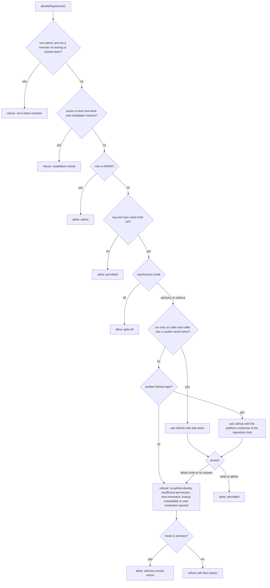
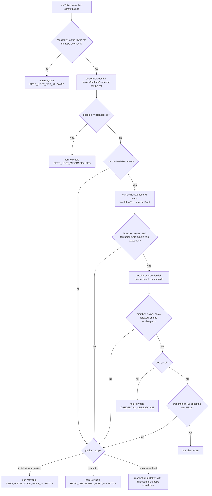

# Repository Access, Sharing, and Per-User Credentials

> Indexed at commit `ae416937` on 2026-10-03 · [view on GitHub](https://github.com/yorch/auto-swe/tree/ae416937)

## Relevant source files

- [packages/shared/src/lib/repoMembership.ts](https://github.com/yorch/auto-swe/blob/ae416937/packages/shared/src/lib/repoMembership.ts)
- [packages/shared/src/lib/connectionCredential.ts](https://github.com/yorch/auto-swe/blob/ae416937/packages/shared/src/lib/connectionCredential.ts)
- [packages/shared/src/lib/repoAccessDecision.ts](https://github.com/yorch/auto-swe/blob/ae416937/packages/shared/src/lib/repoAccessDecision.ts)
- [packages/shared/src/lib/repoAccessGate.ts](https://github.com/yorch/auto-swe/blob/ae416937/packages/shared/src/lib/repoAccessGate.ts)
- [packages/shared/src/lib/repoPermission.ts](https://github.com/yorch/auto-swe/blob/ae416937/packages/shared/src/lib/repoPermission.ts)
- [packages/shared/src/lib/githubPermission.ts](https://github.com/yorch/auto-swe/blob/ae416937/packages/shared/src/lib/githubPermission.ts)
- [packages/shared/src/lib/githubIdentityCheck.ts](https://github.com/yorch/auto-swe/blob/ae416937/packages/shared/src/lib/githubIdentityCheck.ts)
- [packages/shared/src/lib/repoAccessProjection.ts](https://github.com/yorch/auto-swe/blob/ae416937/packages/shared/src/lib/repoAccessProjection.ts)
- [packages/shared/src/lib/githubHostScope.ts](https://github.com/yorch/auto-swe/blob/ae416937/packages/shared/src/lib/githubHostScope.ts)
- [packages/shared/src/lib/githubHostCredential.ts](https://github.com/yorch/auto-swe/blob/ae416937/packages/shared/src/lib/githubHostCredential.ts)
- [packages/shared/src/lib/githubInstallation.ts](https://github.com/yorch/auto-swe/blob/ae416937/packages/shared/src/lib/githubInstallation.ts)
- [packages/shared/src/lib/keyRotation.ts](https://github.com/yorch/auto-swe/blob/ae416937/packages/shared/src/lib/keyRotation.ts)
- [packages/shared/src/lib/systemConfig.ts](https://github.com/yorch/auto-swe/blob/ae416937/packages/shared/src/lib/systemConfig.ts)
- [packages/gateway/src/lib/tenantScope.ts](https://github.com/yorch/auto-swe/blob/ae416937/packages/gateway/src/lib/tenantScope.ts)
- [packages/gateway/src/lib/launchAuthorization.ts](https://github.com/yorch/auto-swe/blob/ae416937/packages/gateway/src/lib/launchAuthorization.ts)
- [packages/gateway/src/lib/runConnection.ts](https://github.com/yorch/auto-swe/blob/ae416937/packages/gateway/src/lib/runConnection.ts)
- [packages/gateway/src/lib/repoAccessRefresh.ts](https://github.com/yorch/auto-swe/blob/ae416937/packages/gateway/src/lib/repoAccessRefresh.ts)
- [packages/gateway/src/routes/repositories.ts](https://github.com/yorch/auto-swe/blob/ae416937/packages/gateway/src/routes/repositories.ts)
- [packages/gateway/src/routes/connectionCredentials.ts](https://github.com/yorch/auto-swe/blob/ae416937/packages/gateway/src/routes/connectionCredentials.ts)
- [packages/gateway/src/routes/githubInstallations.ts](https://github.com/yorch/auto-swe/blob/ae416937/packages/gateway/src/routes/githubInstallations.ts)
- [packages/gateway/src/routes/githubHostCredentials.ts](https://github.com/yorch/auto-swe/blob/ae416937/packages/gateway/src/routes/githubHostCredentials.ts)
- [packages/gateway/src/routes/scheduledWorkRequests.ts](https://github.com/yorch/auto-swe/blob/ae416937/packages/gateway/src/routes/scheduledWorkRequests.ts)
- [packages/gateway/src/routes/webhooks.ts](https://github.com/yorch/auto-swe/blob/ae416937/packages/gateway/src/routes/webhooks.ts)
- [packages/gateway/src/plugins/auth.ts](https://github.com/yorch/auto-swe/blob/ae416937/packages/gateway/src/plugins/auth.ts)
- [packages/worker/src/lib/runLauncher.ts](https://github.com/yorch/auto-swe/blob/ae416937/packages/worker/src/lib/runLauncher.ts)
- [packages/worker/src/lib/scm/github.ts](https://github.com/yorch/auto-swe/blob/ae416937/packages/worker/src/lib/scm/github.ts)
- [packages/worker/src/activities/syncRepoAccess.ts](https://github.com/yorch/auto-swe/blob/ae416937/packages/worker/src/activities/syncRepoAccess.ts)
- [packages/worker/src/activities/scheduledFireAuthorization.ts](https://github.com/yorch/auto-swe/blob/ae416937/packages/worker/src/activities/scheduledFireAuthorization.ts)
- [packages/worker/src/activities/templates.ts](https://github.com/yorch/auto-swe/blob/ae416937/packages/worker/src/activities/templates.ts)
- [packages/shared/src/config/registry.ts](https://github.com/yorch/auto-swe/blob/ae416937/packages/shared/src/config/registry.ts)
- [packages/shared/src/prisma/schema.prisma](https://github.com/yorch/auto-swe/blob/ae416937/packages/shared/src/prisma/schema.prisma)
- [docs/repo-access-gating.md](https://github.com/yorch/auto-swe/blob/ae416937/docs/repo-access-gating.md)
- [docs/repositories.md](https://github.com/yorch/auto-swe/blob/ae416937/docs/repositories.md)
- [docs/user-github-credentials.md](https://github.com/yorch/auto-swe/blob/ae416937/docs/user-github-credentials.md)

## Overview

A repository is a `Connection` row with `type = 'git_repo'`. Four independent questions are answered about one, in four different places, and this page maps each to the function that decides it: may a user *reach* it (team membership, then optionally GitHub permission), may they *manage* it (owning team lead only), which *credential* does a run use (the launcher's own token, else the platform credential of the repository's host), and which *hosts* may a credential be sent to. The product and operations view lives in [repo-access-gating.md](https://github.com/yorch/auto-swe/blob/ae416937/docs/repo-access-gating.md), [repositories.md](https://github.com/yorch/auto-swe/blob/ae416937/docs/repositories.md) and [user-github-credentials.md](https://github.com/yorch/auto-swe/blob/ae416937/docs/user-github-credentials.md); this page does not restate them and instead says where each rule is enforced and why it has that shape.

The recurring design move is to make the wrong thing unrepresentable. Membership is one helper rather than a hand-written `where`; the launch decision takes every input as a required field so a forgotten one fails to compile; the platform-credential rule is one module that every call site asks, with a last-line guard in the token minter; the user-credential resolver reads the repository's URLs itself rather than accepting them from the caller; and the identity of a run is read from a row the run's first activity wrote, not from the request.

Sources: [packages/shared/src/lib/repoMembership.ts:L1-L57](https://github.com/yorch/auto-swe/blob/ae416937/packages/shared/src/lib/repoMembership.ts#L1-L57) [packages/shared/src/lib/repoAccessDecision.ts:L1-L66](https://github.com/yorch/auto-swe/blob/ae416937/packages/shared/src/lib/repoAccessDecision.ts#L1-L66) [packages/shared/src/lib/githubHostScope.ts:L1-L25](https://github.com/yorch/auto-swe/blob/ae416937/packages/shared/src/lib/githubHostScope.ts#L1-L25) [packages/shared/src/lib/connectionCredential.ts:L184-L269](https://github.com/yorch/auto-swe/blob/ae416937/packages/shared/src/lib/connectionCredential.ts#L184-L269) [packages/worker/src/lib/runLauncher.ts:L1-L49](https://github.com/yorch/auto-swe/blob/ae416937/packages/worker/src/lib/runLauncher.ts#L1-L49)

## How "may this user reach this repository" is decided

### One definition of membership

A user reaches a repository when they belong to the owning team or to any team it is shared with through `ConnectionTeamShare`. That rule lives in [repoMembership.ts#L1-L10](https://github.com/yorch/auto-swe/blob/ae416937/packages/shared/src/lib/repoMembership.ts#L1-L10) and nowhere else: `repoMembersSelect` builds the Prisma `select` for both memberships, `allRepoMemberships` and `isRepoMember` answer it in memory, and `repoMemberWhere` expresses it as a `Connection` predicate ([repoMembership.ts#L23-L57](https://github.com/yorch/auto-swe/blob/ae416937/packages/shared/src/lib/repoMembership.ts#L23-L57)). The file header names the reason: the question is asked by listings, the launch decision, the credential resolver and the permission sweep, and a site that counted only `repo.team.memberships` would silently lock shared-team members out of that one path. The gateway keeps a second spelling for query call sites, `memberOrSharedTeams`, which also lists both branches ([tenantScope.ts#L116-L120](https://github.com/yorch/auto-swe/blob/ae416937/packages/gateway/src/lib/tenantScope.ts#L116-L120)).

Reading `repo.team.memberships` alone is wrong for a second reason that is easy to miss: the `RepoAccessSubject` type makes `shares` a required field, so a call site that forgets to select it does not compile rather than quietly refusing shared members ([repoAccessDecision.ts#L36-L66](https://github.com/yorch/auto-swe/blob/ae416937/packages/shared/src/lib/repoAccessDecision.ts#L36-L66)). `validateRunConnection` shows the idiom: it selects `repoMembersSelect({ userId: true }, { userId: user?.sub ?? NO_USER }).shares`, filtered to the acting user so it never loads a whole team ([runConnection.ts#L62-L85](https://github.com/yorch/auto-swe/blob/ae416937/packages/gateway/src/lib/runConnection.ts#L62-L85)).

The `ConnectionTeamShare` model is unique on `(connectionId, teamId)`, indexed by `teamId`, and cascades on delete of either side ([schema.prisma#L405-L419](https://github.com/yorch/auto-swe/blob/ae416937/packages/shared/src/prisma/schema.prisma#L405-L419)). Shares are written by `PUT /api/v1/repositories/:id/shares`, which requires the caller to manage the owning team, accepts only active teams in the same `orgId` (a share never crosses a tenant boundary), replaces the set in one transaction, writes an audit entry, and then deactivates the schedules of any team that lost its claim ([repositories.ts#L826-L918](https://github.com/yorch/auto-swe/blob/ae416937/packages/gateway/src/routes/repositories.ts#L826-L918)).

### Reaching versus managing

Management is deliberately narrower and does not go through the membership helper. `canManageTeamRepos` allows a platform `ADMIN`, or a `LEAD` membership in the owning team where the team is active ([repositories.ts#L113-L135](https://github.com/yorch/auto-swe/blob/ae416937/packages/gateway/src/routes/repositories.ts#L113-L135)). The share-candidates route, the shares route and repository edit all call it, so a shared team's members can start runs but cannot edit, move or re-share the repository ([repositories.ts#L790-L823](https://github.com/yorch/auto-swe/blob/ae416937/packages/gateway/src/routes/repositories.ts#L790-L823)). Schedules have their own, wider team rule, covered in [Schedules](#schedules-identity-team-and-concurrent-edits). Changing a repository's GitHub App installation is narrower still: `rejectsInstallationChange` refuses any non-`ADMIN` who sends `installationId`, because it changes which GitHub account answers permission questions ([repositories.ts#L137-L152](https://github.com/yorch/auto-swe/blob/ae416937/packages/gateway/src/routes/repositories.ts#L137-L152)). The listing route shows deactivated repositories only to someone who could reactivate them, through `ledTeams`, the single-row form of which is `canManageTeamRepos` ([repositories.ts#L370-L426](https://github.com/yorch/auto-swe/blob/ae416937/packages/gateway/src/routes/repositories.ts#L370-L426) [tenantScope.ts#L172-L178](https://github.com/yorch/auto-swe/blob/ae416937/packages/gateway/src/lib/tenantScope.ts#L172-L178)). Control of an in-flight run (cancel, answering human steps) is a third, separate predicate described in [repositories.md](https://github.com/yorch/auto-swe/blob/ae416937/docs/repositories.md).

### The decision function

Launch paths call `decideRepoAccess` ([repoAccessDecision.ts#L148-L212](https://github.com/yorch/auto-swe/blob/ae416937/packages/shared/src/lib/repoAccessDecision.ts#L148-L212)), usually through `authorizeLaunch`, which runs it for every named repository and then checks membership of each org the launch spends against and each org's monthly cap ([launchAuthorization.ts#L87-L164](https://github.com/yorch/auto-swe/blob/ae416937/packages/gateway/src/lib/launchAuthorization.ts#L87-L164)). The order inside `decideRepoAccess` is fixed and each step explains itself in a comment:

1. Non-admin and not a member of the owning or a shared team: `not-a-team-member`. This is first so an outsider is not sent to link a GitHub account that would not help.
2. When `action === 'start-new-work'` (the default) and the repository's installation is inactive: `installation-retired`, for everyone including admins.
3. `ADMIN`: allowed with reason `admin`.
4. A row with no `organizationName` and `repoName` (an MCP server, an HTTP API) has nothing GitHub can answer about: allowed. The exemption is keyed on coordinates rather than `type`, because a team lead can create a non-git row that carries a real repository's coordinates.
5. Otherwise `decideRepoLaunch` consults the GitHub gate.

`runIdentity` (`'caller'` or `'platform'`, default `'platform'`) is passed through to step 5. Template runs pass `'caller'` ([runConnection.ts#L101-L115](https://github.com/yorch/auto-swe/blob/ae416937/packages/gateway/src/lib/runConnection.ts#L101-L115)). The two conditions are ANDed: GitHub can only take access away, never grant it, so membership stays the outer bound even with the gate off ([repoAccessDecision.ts#L148-L159](https://github.com/yorch/auto-swe/blob/ae416937/packages/shared/src/lib/repoAccessDecision.ts#L148-L159)).

Listings use the predicate form instead. `reachableConnections(actor, gate)` is `AND` of `memberOrSharedTeams` and `permissionRequirement` ([tenantScope.ts#L99-L106](https://github.com/yorch/auto-swe/blob/ae416937/packages/gateway/src/lib/tenantScope.ts#L99-L106)). Routes acting on named repositories load first and decide afterwards so a refusal can name which repositories were refused; filtering in the query would turn that into "no such repository" ([repoAccessDecision.ts#L16-L22](https://github.com/yorch/auto-swe/blob/ae416937/packages/shared/src/lib/repoAccessDecision.ts#L16-L22)). `multiRepoRefusalBody` returns `FORBIDDEN` if any refusal is a membership one, else `INSTALLATION_RETIRED`, else `REPO_ACCESS_DENIED` ([repoAccessDecision.ts#L214-L266](https://github.com/yorch/auto-swe/blob/ae416937/packages/shared/src/lib/repoAccessDecision.ts#L214-L266)).

Sources: [packages/shared/src/lib/repoMembership.ts:L1-L57](https://github.com/yorch/auto-swe/blob/ae416937/packages/shared/src/lib/repoMembership.ts#L1-L57) [packages/shared/src/lib/repoAccessDecision.ts:L36-L286](https://github.com/yorch/auto-swe/blob/ae416937/packages/shared/src/lib/repoAccessDecision.ts#L36-L286) [packages/shared/src/lib/repoAccessGate.ts:L219-L320](https://github.com/yorch/auto-swe/blob/ae416937/packages/shared/src/lib/repoAccessGate.ts#L219-L320) [packages/gateway/src/lib/launchAuthorization.ts:L35-L164](https://github.com/yorch/auto-swe/blob/ae416937/packages/gateway/src/lib/launchAuthorization.ts#L35-L164) [packages/gateway/src/lib/tenantScope.ts:L99-L178](https://github.com/yorch/auto-swe/blob/ae416937/packages/gateway/src/lib/tenantScope.ts#L99-L178) [packages/gateway/src/routes/repositories.ts:L113-L152](https://github.com/yorch/auto-swe/blob/ae416937/packages/gateway/src/routes/repositories.ts#L113-L152) [packages/gateway/src/routes/repositories.ts:L826-L918](https://github.com/yorch/auto-swe/blob/ae416937/packages/gateway/src/routes/repositories.ts#L826-L918) [packages/gateway/src/lib/runConnection.ts:L53-L149](https://github.com/yorch/auto-swe/blob/ae416937/packages/gateway/src/lib/runConnection.ts#L53-L149) [packages/shared/src/prisma/schema.prisma:L405-L419](https://github.com/yorch/auto-swe/blob/ae416937/packages/shared/src/prisma/schema.prisma#L405-L419)

## GitHub-permission gating

The gate has three modes, `RepoAccessMode = 'off' | 'advisory' | 'enforce'`, held by the `repoAccess.mode` setting (default `off`) ([repoAccessGate.ts#L36-L42](https://github.com/yorch/auto-swe/blob/ae416937/packages/shared/src/lib/repoAccessGate.ts#L36-L42)). The `repoAccess` group in the registry has two settings, both `ADMIN`-only with no override scope ([registry.ts#L261-L291](https://github.com/yorch/auto-swe/blob/ae416937/packages/shared/src/config/registry.ts#L261-L291)):

| Setting | Default | Role |
| --- | --- | --- |
| `repoAccess.mode` | `off` | `off`, `advisory`, `enforce` |
| `repoAccess.viewStaleAfterHours` | `72` | max age of a cached answer for viewing (integer, 1 to 8760) |

The sweep that refreshes the cached answers is not a setting. It is scheduled from the environment at gateway start: `REPO_ACCESS_SYNC_ENABLED` (default false, because it spends API quota in proportion to team members times repositories) and `REPO_ACCESS_SYNC_CRON` (default `23 * * * *`), resolved by `resolveScheduledSweeps` ([systemConfig.ts#L907-L937](https://github.com/yorch/auto-swe/blob/ae416937/packages/shared/src/lib/systemConfig.ts#L907-L937)).

**Launch is live, listings are cached.** `decideRepoLaunch` asks GitHub at launch time and writes the answer back, so the decision that matters most is effectively real time ([repoAccessGate.ts#L219-L262](https://github.com/yorch/auto-swe/blob/ae416937/packages/shared/src/lib/repoAccessGate.ts#L219-L262)). It needs the level `write`: `permissionMeets(permission, 'write')`, since a run pushes a branch and opens a pull request ([repoAccessGate.ts#L264-L320](https://github.com/yorch/auto-swe/blob/ae416937/packages/shared/src/lib/repoAccessGate.ts#L264-L320)). Listings read the `repo_access` projection: under `enforce` only, `permissionRequirement` requires a row with `permission` in `READ`, `WRITE`, `ADMIN`, `userId` equal to the actor and `checkedAt >= now - staleAfterHours`, and exempts every non-`git_repo` connection because none can ever have a row ([tenantScope.ts#L142-L170](https://github.com/yorch/auto-swe/blob/ae416937/packages/gateway/src/lib/tenantScope.ts#L142-L170)). Under `advisory` a listing is unchanged; the signal is carried by the launch path, which logs `repoAccess advisory` and returns `advisory-would-refuse` ([repoAccessGate.ts#L254-L260](https://github.com/yorch/auto-swe/blob/ae416937/packages/shared/src/lib/repoAccessGate.ts#L254-L260)).

**How the question is asked.** `lookupRepoPermission` refuses to send a credential to an API override that is not on an approved host, then asks the shared host rule which platform credential applies to the repository (`resolvePlatformCredential`), mints a token from that set for the repository's installation and calls `fetchRepoPermission` with the user's login ([repoPermission.ts#L49-L111](https://github.com/yorch/auto-swe/blob/ae416937/packages/shared/src/lib/repoPermission.ts#L49-L111)). The worker's `repoPermission`, used by the sweep, runs the same sequence over its own repository ref ([github.ts#L551-L591](https://github.com/yorch/auto-swe/blob/ae416937/packages/worker/src/lib/scm/github.ts#L551-L591)). When the run will act as the caller and the caller has a usable saved token, `launchRefusal` instead asks `GET /repos/{owner}/{repo}` with that token through `fetchOwnRepoPermission`, which maps the `permissions` flags (`admin`; `maintain` or `push` to `write`; `triage` or `pull` to `read`; else `none`) and treats a missing `permissions` object as `unavailable`, not `none` ([githubPermission.ts#L122-L149](https://github.com/yorch/auto-swe/blob/ae416937/packages/shared/src/lib/githubPermission.ts#L122-L149) [repoAccessGate.ts#L264-L297](https://github.com/yorch/auto-swe/blob/ae416937/packages/shared/src/lib/repoAccessGate.ts#L264-L297)). A token GitHub rejects, or that cannot see the repository, yields `user-credential-rejected` and does not fall back, because the run would use that token and fail.

**Failures are not verdicts.** `PermissionLookupFailure` is `repo-not-found`, `credential-rejected`, `host-mismatch`, `rate-limited` or `unavailable`. A 404 maps to `repo-not-found`, 401 to `credential-rejected`, 403 to `rate-limited` only when `x-ratelimit-remaining` is `0`, 429 to `rate-limited`, other non-2xx and network errors to `unavailable`, with an 8 000 ms timeout ([githubPermission.ts#L38-L47](https://github.com/yorch/auto-swe/blob/ae416937/packages/shared/src/lib/githubPermission.ts#L38-L47) [githubPermission.ts#L163-L207](https://github.com/yorch/auto-swe/blob/ae416937/packages/shared/src/lib/githubPermission.ts#L163-L207)). `host-mismatch` is a standing condition decided before any request is made: the API override is not approved, no platform credential applies to the repository's host, or the minter refused a credential for another host ([repoPermission.ts#L66-L103](https://github.com/yorch/auto-swe/blob/ae416937/packages/shared/src/lib/repoPermission.ts#L66-L103)). A credential set that cannot be loaded reads as `unavailable`. The launch decision keeps `host-mismatch` apart from `lookup-unavailable` because a retry cannot cure it, and its message points at host credentials or a saved token ([repoAccessGate.ts#L195-L217](https://github.com/yorch/auto-swe/blob/ae416937/packages/shared/src/lib/repoAccessGate.ts#L195-L217)). `recordRepoPermission` writes a `none` (a fact) but writes nothing for a failure, so an outage ages out through the staleness window instead of overwriting a row ([repoAccessProjection.ts#L26-L53](https://github.com/yorch/auto-swe/blob/ae416937/packages/shared/src/lib/repoAccessProjection.ts#L26-L53)). The launch path fails closed on any failure.

**Caching and refresh.** `repo_access` is a cache with unique `(userId, connectionId)` and indexes on `connectionId` and `checkedAt` ([schema.prisma#L376-L394](https://github.com/yorch/auto-swe/blob/ae416937/packages/shared/src/prisma/schema.prisma#L376-L394)). Its writers are the launch path, the webhook refresh (`POST /api/v1/webhooks/access`, signature-verified, in [webhooks.ts#L595-L642](https://github.com/yorch/auto-swe/blob/ae416937/packages/gateway/src/routes/webhooks.ts#L595-L642) with the work in [repoAccessRefresh.ts#L70-L106](https://github.com/yorch/auto-swe/blob/ae416937/packages/gateway/src/lib/repoAccessRefresh.ts#L70-L106)) and the sweep `syncRepoAccess` ([syncRepoAccess.ts#L225-L276](https://github.com/yorch/auto-swe/blob/ae416937/packages/worker/src/activities/syncRepoAccess.ts#L225-L276)). The refresh binds its repository lookup to the host the delivery's secret proved, for user events as well as repository events ([repoAccessRefresh.ts#L79-L97](https://github.com/yorch/auto-swe/blob/ae416937/packages/gateway/src/lib/repoAccessRefresh.ts#L79-L97)). Both the sweep and the refresh use the user token when `lookupPermissionViaUserCredential` finds one usable and fall back to the login lookup otherwise ([syncRepoAccess.ts#L240-L262](https://github.com/yorch/auto-swe/blob/ae416937/packages/worker/src/activities/syncRepoAccess.ts#L240-L262) [repoPermission.ts#L113-L165](https://github.com/yorch/auto-swe/blob/ae416937/packages/shared/src/lib/repoPermission.ts#L113-L165)).

**Gate reads never block a request.** `requireAuth` resolves the gate on every authenticated request through `resolveRepoAccessGateOrLastKnown`: a 2 000 ms read timeout, a 5 000 ms backoff after a failure, and the last value this process read, so a database blip cannot silently turn enforcement off. Only a process that has never read it treats the gate as `off` and logs a warning ([repoAccessGate.ts#L104-L176](https://github.com/yorch/auto-swe/blob/ae416937/packages/shared/src/lib/repoAccessGate.ts#L104-L176) [auth.ts#L713-L723](https://github.com/yorch/auto-swe/blob/ae416937/packages/gateway/src/plugins/auth.ts#L713-L723)). `resolveRepoAccessGate` also warns when mode is `enforce` while `REPO_ACCESS_SYNC_ENABLED` is not `true` ([repoAccessGate.ts#L68-L102](https://github.com/yorch/auto-swe/blob/ae416937/packages/shared/src/lib/repoAccessGate.ts#L68-L102)).

Sources: [packages/shared/src/lib/repoAccessGate.ts:L36-L320](https://github.com/yorch/auto-swe/blob/ae416937/packages/shared/src/lib/repoAccessGate.ts#L36-L320) [packages/shared/src/lib/repoPermission.ts:L26-L165](https://github.com/yorch/auto-swe/blob/ae416937/packages/shared/src/lib/repoPermission.ts#L26-L165) [packages/shared/src/lib/githubPermission.ts:L19-L207](https://github.com/yorch/auto-swe/blob/ae416937/packages/shared/src/lib/githubPermission.ts#L19-L207) [packages/shared/src/lib/repoAccessProjection.ts:L14-L53](https://github.com/yorch/auto-swe/blob/ae416937/packages/shared/src/lib/repoAccessProjection.ts#L14-L53) [packages/gateway/src/lib/tenantScope.ts:L47-L170](https://github.com/yorch/auto-swe/blob/ae416937/packages/gateway/src/lib/tenantScope.ts#L47-L170) [packages/shared/src/config/registry.ts:L261-L291](https://github.com/yorch/auto-swe/blob/ae416937/packages/shared/src/config/registry.ts#L261-L291) [packages/shared/src/lib/systemConfig.ts:L907-L937](https://github.com/yorch/auto-swe/blob/ae416937/packages/shared/src/lib/systemConfig.ts#L907-L937) [packages/shared/src/prisma/schema.prisma:L376-L394](https://github.com/yorch/auto-swe/blob/ae416937/packages/shared/src/prisma/schema.prisma#L376-L394) [packages/gateway/src/plugins/auth.ts:L713-L723](https://github.com/yorch/auto-swe/blob/ae416937/packages/gateway/src/plugins/auth.ts#L713-L723) [packages/gateway/src/routes/webhooks.ts:L595-L642](https://github.com/yorch/auto-swe/blob/ae416937/packages/gateway/src/routes/webhooks.ts#L595-L642) [packages/gateway/src/lib/repoAccessRefresh.ts:L70-L106](https://github.com/yorch/auto-swe/blob/ae416937/packages/gateway/src/lib/repoAccessRefresh.ts#L70-L106) [packages/worker/src/activities/syncRepoAccess.ts:L225-L276](https://github.com/yorch/auto-swe/blob/ae416937/packages/worker/src/activities/syncRepoAccess.ts#L225-L276) [packages/worker/src/lib/scm/github.ts:L551-L591](https://github.com/yorch/auto-swe/blob/ae416937/packages/worker/src/lib/scm/github.ts#L551-L591)

## GitHub username re-registration and takeover detection

`users.github_login` is `@unique` ([schema.prisma#L1052](https://github.com/yorch/auto-swe/blob/ae416937/packages/shared/src/prisma/schema.prisma#L1052)). GitHub frees a username on rename and lets anyone re-register it, so a stored login can come to name someone else and the projection would record that person's access as this user's. `verifyGithubLoginOwnership` compares the numeric id GitHub reports for the login today (`fetchGithubUserId`, `/users/{login}`, 8 000 ms timeout) with `accounts.account_id` that better-auth stored at link time ([githubIdentityCheck.ts#L182-L296](https://github.com/yorch/auto-swe/blob/ae416937/packages/shared/src/lib/githubIdentityCheck.ts#L182-L296)).

**The account's own host answers.** An id is only comparable inside the id space of the host that issued it. A bare `accounts.account_id` comes from better-auth's built-in `github` provider and is a github.com id; a GitHub Enterprise sign-in stores `{host}:{id}` so that a bare id cannot collide with an earlier github.com account ([githubIdentityCheck.ts#L51-L58](https://github.com/yorch/auto-swe/blob/ae416937/packages/shared/src/lib/githubIdentityCheck.ts#L51-L58) [githubEnterpriseAuth.ts#L41-L52](https://github.com/yorch/auto-swe/blob/ae416937/packages/gateway/src/lib/githubEnterpriseAuth.ts#L41-L52)). `accountTargets` resolves, per account, the host that owns its id space and the platform credential that applies there: the instance's own when the host is the instance's, otherwise the one configured for that host, and never any other. A host with an App but no PAT mints through any active installation recorded for it. Where no credential applies, a github.com account is asked unauthenticated and any other host is not asked at all, and the sweep logs the hosts it had to ask without a credential ([githubIdentityCheck.ts#L60-L166](https://github.com/yorch/auto-swe/blob/ae416937/packages/shared/src/lib/githubIdentityCheck.ts#L60-L166) [syncRepoAccess.ts#L206-L217](https://github.com/yorch/auto-swe/blob/ae416937/packages/worker/src/activities/syncRepoAccess.ts#L206-L217)). The reason is the one the code gives for every other host rule: asking the wrong host compares two different id spaces, which reads as a mismatch and would clear a valid login.

Outcomes are a closed union: `ok`, `reassigned`, `unlinked` (no linked account behind a recorded login, cleared without raising the alarm), and `unverifiable` (GitHub did not answer, no credential applies to the account's host, or several GitHub accounts are linked so the login cannot be tied to one host; nothing changed) ([githubIdentityCheck.ts#L168-L180](https://github.com/yorch/auto-swe/blob/ae416937/packages/shared/src/lib/githubIdentityCheck.ts#L168-L180) [githubIdentityCheck.ts#L243-L296](https://github.com/yorch/auto-swe/blob/ae416937/packages/shared/src/lib/githubIdentityCheck.ts#L243-L296)). Only a confirmed mismatch clears: an outage is not evidence a name changed hands. A plain rename resolves to the same id and is left alone.

On `reassigned`, `clearGithubLogin` runs in one transaction that nulls the login and deletes every `repo_access` row for the user. Deleting rows matters because listings read by user id, not through the login, so rows recorded from the impostor's permissions would otherwise survive for `repoAccess.viewStaleAfterHours` ([githubIdentityCheck.ts#L214-L233](https://github.com/yorch/auto-swe/blob/ae416937/packages/shared/src/lib/githubIdentityCheck.ts#L214-L233)). Then `recordTakeover` writes a `configAuditLog` row with `entityType: 'User'`, `action: 'UPDATE'`, `actorId: null`, `beforeJson` of the old login and expected account id, and `afterJson` carrying `reason: 'login-reassigned'` and the observed account id ([githubIdentityCheck.ts#L298-L350](https://github.com/yorch/auto-swe/blob/ae416937/packages/shared/src/lib/githubIdentityCheck.ts#L298-L350)). The write is best-effort: a failure is logged with `console.warn` and does not undo the clearing. It lives inside `verifyGithubLoginOwnership` so no caller can detect a takeover and forget to record it.

All three writers verify. `verifiedGithubLoginFor` serves the launch path and the webhook refresh, returning null when the login was reassigned and the login unchanged when unverifiable ([repoPermission.ts#L183-L217](https://github.com/yorch/auto-swe/blob/ae416937/packages/shared/src/lib/repoPermission.ts#L183-L217)); the sweep verifies once per user (a `verified` map) and counts `reassignedLogins` and `unlinkedLogins` separately ([syncRepoAccess.ts#L145-L204](https://github.com/yorch/auto-swe/blob/ae416937/packages/worker/src/activities/syncRepoAccess.ts#L145-L204)). A GitHub sign-in on an Enterprise host records the login from that host's own `/user` ([betterAuth.ts#L282-L304](https://github.com/yorch/auto-swe/blob/ae416937/packages/gateway/src/lib/betterAuth.ts#L282-L304)); the sign-in design is in the ADR [ghe-github-signin.md](https://github.com/yorch/auto-swe/blob/ae416937/docs/adr/ghe-github-signin.md).

Sources: [packages/shared/src/lib/githubIdentityCheck.ts:L1-L350](https://github.com/yorch/auto-swe/blob/ae416937/packages/shared/src/lib/githubIdentityCheck.ts#L1-L350) [packages/shared/src/lib/repoPermission.ts:L183-L217](https://github.com/yorch/auto-swe/blob/ae416937/packages/shared/src/lib/repoPermission.ts#L183-L217) [packages/worker/src/activities/syncRepoAccess.ts:L145-L217](https://github.com/yorch/auto-swe/blob/ae416937/packages/worker/src/activities/syncRepoAccess.ts#L145-L217) [packages/gateway/src/lib/githubEnterpriseAuth.ts:L41-L52](https://github.com/yorch/auto-swe/blob/ae416937/packages/gateway/src/lib/githubEnterpriseAuth.ts#L41-L52) [packages/gateway/src/lib/betterAuth.ts:L282-L304](https://github.com/yorch/auto-swe/blob/ae416937/packages/gateway/src/lib/betterAuth.ts#L282-L304) [packages/shared/src/prisma/schema.prisma:L1052](https://github.com/yorch/auto-swe/blob/ae416937/packages/shared/src/prisma/schema.prisma#L1052)

## Installations and the retired-installation mark

`GitHubInstallation` rows are `host` (empty for the instance's own, otherwise the host family of a configured host), `installationId` (numeric, opaque), `accountLogin` (display only) and `isActive` (default `true`); the identity is the pair `(host, installationId)`, because a numeric installation id is only unique per GitHub host ([schema.prisma#L528-L563](https://github.com/yorch/auto-swe/blob/ae416937/packages/shared/src/prisma/schema.prisma#L528-L563)). `Connection.installationId` points a repository at one, and null means the singleton `GitHubConfig.appInstallationId`. `resolveGitHubToken` caches one installation token per `installationId@apiUrl` key, with a fingerprint of the App id and a SHA-256 of the private key so rotation invalidates the cache ([githubInstallation.ts#L52-L85](https://github.com/yorch/auto-swe/blob/ae416937/packages/shared/src/lib/githubInstallation.ts#L52-L85) [githubInstallation.ts#L199-L210](https://github.com/yorch/auto-swe/blob/ae416937/packages/shared/src/lib/githubInstallation.ts#L199-L210)).

**A repository may only point at an installation of its own host.** `installationHostFor` says which host a repository's installation must carry: empty for the instance's own host, otherwise the repository's host family ([githubHostScope.ts#L145-L166](https://github.com/yorch/auto-swe/blob/ae416937/packages/shared/src/lib/githubHostScope.ts#L145-L166)). Create and edit both run `installationHostProblem` and answer 400 `INSTALLATION_HOST_MISMATCH`; edit judges it whenever the installation or either URL override changes, so repointing a repository to another host cannot leave it minting tokens through the old host's installation ([repositories.ts#L154-L189](https://github.com/yorch/auto-swe/blob/ae416937/packages/gateway/src/routes/repositories.ts#L154-L189) [repositories.ts#L486-L495](https://github.com/yorch/auto-swe/blob/ae416937/packages/gateway/src/routes/repositories.ts#L486-L495) [repositories.ts#L648-L666](https://github.com/yorch/auto-swe/blob/ae416937/packages/gateway/src/routes/repositories.ts#L648-L666)). The worker and the shared lookup re-check the pair at use time and surface `installation-mismatch` ([githubHostCredential.ts#L148-L177](https://github.com/yorch/auto-swe/blob/ae416937/packages/shared/src/lib/githubHostCredential.ts#L148-L177)).

"Retired" means `isActive = false`. `isInstallationRetired` uses optional chaining (`installation?.isActive === false`) because an unselected relation arrives as `undefined` and a stricter-looking `!== null` once read it as retired and then threw ([repoAccessDecision.ts#L98-L108](https://github.com/yorch/auto-swe/blob/ae416937/packages/shared/src/lib/repoAccessDecision.ts#L98-L108)). Retirement stops new work only. It is consulted at the decision, not in the token resolver that clones, pushes and reads CI share, so work in flight keeps resolving credentials through it ([repoAccessDecision.ts#L82-L97](https://github.com/yorch/auto-swe/blob/ae416937/packages/shared/src/lib/repoAccessDecision.ts#L82-L97)). Three enforcement points exist:

- `decideRepoAccess` with `action: 'start-new-work'` refuses everyone, admins included, with `INSTALLATION_RETIRED` ([repoAccessDecision.ts#L190-L192](https://github.com/yorch/auto-swe/blob/ae416937/packages/shared/src/lib/repoAccessDecision.ts#L190-L192)). `'steer-running-work'` removes only this condition and still runs membership and the GitHub check ([repoAccessDecision.ts#L117-L146](https://github.com/yorch/auto-swe/blob/ae416937/packages/shared/src/lib/repoAccessDecision.ts#L117-L146)).
- Paths with no user, the template webhook and the issue-tracker auto-trigger, are exempt from the gate for want of an identity, so `validateRunConnection` checks retirement ahead of the user branch and replies 409 ([runConnection.ts#L93-L99](https://github.com/yorch/auto-swe/blob/ae416937/packages/gateway/src/lib/runConnection.ts#L93-L99)), and the Jira auto-trigger skips with `reason: 'installation retired'` ([webhooks.ts#L1189-L1194](https://github.com/yorch/auto-swe/blob/ae416937/packages/gateway/src/routes/webhooks.ts#L1189-L1194)).
- A run started outside the gateway, a scheduled fire or a deferred channel task, re-reads retirement in `createWorkflowRun`, the run's first activity, which refuses it there ([templates.ts#L101-L124](https://github.com/yorch/auto-swe/blob/ae416937/packages/worker/src/activities/templates.ts#L101-L124) [templates.ts#L166-L171](https://github.com/yorch/auto-swe/blob/ae416937/packages/worker/src/activities/templates.ts#L166-L171)).

**Installations admin route.** `packages/gateway/src/routes/githubInstallations.ts` is `ADMIN`-only and is mounted under both `/api/v1/platform` and `/api/v1/admin` ([index.ts#L337-L338](https://github.com/yorch/auto-swe/blob/ae416937/packages/gateway/src/index.ts#L337-L338)): `GET /github-installations` (with a count of connections), `POST`, `PATCH /:id` (`accountLogin`, `isActive`) and `DELETE /:id`. `POST` takes an optional `host`; it is stored as the host family, empty when it is the instance's own, and rejected with 400 `HOST_NOT_APPROVED` unless the host is the instance's or approved, and a duplicate pair is 409 `INSTALLATION_EXISTS`. The host is part of the identity and cannot be edited. Delete is refused with 409 `INSTALLATION_IN_USE`, naming up to ten repositories, while any repository points at the installation, and a foreign-key race (`P2003`) maps to the same code ([githubInstallations.ts#L56-L185](https://github.com/yorch/auto-swe/blob/ae416937/packages/gateway/src/routes/githubInstallations.ts#L56-L185)). Retiring is therefore a `PATCH` of `isActive`, deletion needs repointing first.

Sources: [packages/shared/src/lib/repoAccessDecision.ts:L82-L146](https://github.com/yorch/auto-swe/blob/ae416937/packages/shared/src/lib/repoAccessDecision.ts#L82-L146) [packages/gateway/src/lib/runConnection.ts:L53-L149](https://github.com/yorch/auto-swe/blob/ae416937/packages/gateway/src/lib/runConnection.ts#L53-L149) [packages/gateway/src/routes/githubInstallations.ts:L1-L186](https://github.com/yorch/auto-swe/blob/ae416937/packages/gateway/src/routes/githubInstallations.ts#L1-L186) [packages/gateway/src/routes/repositories.ts:L154-L189](https://github.com/yorch/auto-swe/blob/ae416937/packages/gateway/src/routes/repositories.ts#L154-L189) [packages/shared/src/prisma/schema.prisma:L528-L563](https://github.com/yorch/auto-swe/blob/ae416937/packages/shared/src/prisma/schema.prisma#L528-L563) [packages/shared/src/lib/githubInstallation.ts:L52-L210](https://github.com/yorch/auto-swe/blob/ae416937/packages/shared/src/lib/githubInstallation.ts#L52-L210) [packages/shared/src/lib/githubHostScope.ts:L145-L166](https://github.com/yorch/auto-swe/blob/ae416937/packages/shared/src/lib/githubHostScope.ts#L145-L166) [packages/gateway/src/routes/webhooks.ts:L1185-L1194](https://github.com/yorch/auto-swe/blob/ae416937/packages/gateway/src/routes/webhooks.ts#L1185-L1194) [packages/worker/src/activities/templates.ts:L101-L171](https://github.com/yorch/auto-swe/blob/ae416937/packages/worker/src/activities/templates.ts#L101-L171) [packages/gateway/src/index.ts:L337-L340](https://github.com/yorch/auto-swe/blob/ae416937/packages/gateway/src/index.ts#L337-L340)

## Platform credentials per host

The platform's credentials (a PAT, an App's installation tokens, and the App JWT that can mint a token for every installation of the App) each belong to one GitHub host family and are valid there and nowhere else. `githubHostScope.ts` is the one rule, and its header lists the callers that ask it: the worker's `runToken`, `fetchCiLogs` and `repoPermission`, the gateway's check-run lookup, and the shared permission lookup ([githubHostScope.ts#L1-L25](https://github.com/yorch/auto-swe/blob/ae416937/packages/shared/src/lib/githubHostScope.ts#L1-L25) [webhooks.ts#L222-L287](https://github.com/yorch/auto-swe/blob/ae416937/packages/gateway/src/routes/webhooks.ts#L222-L287)). `hostFamily` folds a hosted GitHub's two names into one host (`github.com` with `api.github.com`, `<tenant>.ghe.com` with `api.<tenant>.ghe.com`) ([githubHostScope.ts#L57-L74](https://github.com/yorch/auto-swe/blob/ae416937/packages/shared/src/lib/githubHostScope.ts#L57-L74)). `platformCredentialScope` then classifies a repository from its two URL overrides: `instance` when both are the instance's own host, `misconfigured` when its web and API hosts differ, otherwise `host` when a credential set exists for that host and `mismatch` when none does ([githubHostScope.ts#L96-L143](https://github.com/yorch/auto-swe/blob/ae416937/packages/shared/src/lib/githubHostScope.ts#L96-L143)).

Two credential sets exist. The instance's is the `GitHubConfig` singleton. Any other approved host has a `GitHubHostCredential` row: a PAT, a GitHub App (id and private key together), or both, keyed by host family ([schema.prisma#L487-L526](https://github.com/yorch/auto-swe/blob/ae416937/packages/shared/src/prisma/schema.prisma#L487-L526)). `resolveHostCredential` returns it only when the row has a PAT or a complete App and the host is still approved by `github.repositoryHosts`, so an approval that lapses takes the credentials with it; an undecryptable secret throws ([githubHostCredential.ts#L49-L88](https://github.com/yorch/auto-swe/blob/ae416937/packages/shared/src/lib/githubHostCredential.ts#L49-L88)). `hostCredentialConfig` builds a `ResolvedGitHubConfig` from the row alone and inherits nothing of the instance's, not the PAT, the App, the singleton installation id or the auth mode, and stamps it with `credentialHost` ([githubHostCredential.ts#L90-L115](https://github.com/yorch/auto-swe/blob/ae416937/packages/shared/src/lib/githubHostCredential.ts#L90-L115)). `resolvePlatformCredential` returns one of five outcomes, `instance`, `host`, `mismatch`, `misconfigured` or `installation-mismatch`, and reads the database only when the repository is off the instance's host ([githubHostCredential.ts#L117-L177](https://github.com/yorch/auto-swe/blob/ae416937/packages/shared/src/lib/githubHostCredential.ts#L117-L177)).

The last line is in the token minter. `resolveGitHubToken` compares the API host it is about to use with the `credentialHost` of the set the token is minted from and throws `PlatformCredentialHostError` on a difference, so a caller that forgot to ask the rule still cannot send a credential to the wrong host ([githubInstallation.ts#L31-L42](https://github.com/yorch/auto-swe/blob/ae416937/packages/shared/src/lib/githubInstallation.ts#L31-L42) [githubInstallation.ts#L173-L184](https://github.com/yorch/auto-swe/blob/ae416937/packages/shared/src/lib/githubInstallation.ts#L173-L184)).

**Managing host credentials.** `packages/gateway/src/routes/githubHostCredentials.ts` is `ADMIN`-only and registered under `/api/v1/platform`, so the path is `/api/v1/platform/github-host-credentials` ([index.ts#L340](https://github.com/yorch/auto-swe/blob/ae416937/packages/gateway/src/index.ts#L340)). Secrets are write-only: the API reports `hasToken`, `hasAppPrivateKey` and the last four characters, never a value, and both are encrypted with the shared AES-256-GCM envelope (`encryptSecret`) ([githubHostCredentials.ts#L79-L142](https://github.com/yorch/auto-swe/blob/ae416937/packages/gateway/src/routes/githubHostCredentials.ts#L79-L142)). Create requires a token, an App or both (`NO_CREDENTIAL`), an App's id and key together (`INCOMPLETE_APP`), a host that is approved and is not the instance's own (`HOST_NOT_APPROVED`, `HOST_IS_INSTANCE`) and a host with no row yet (409 `HOST_CREDENTIAL_EXISTS`); a PATCH sets, rotates or clears single fields and may not leave a row with nothing usable; every change writes an audit entry carrying which secrets are set and their last four characters ([githubHostCredentials.ts#L150-L328](https://github.com/yorch/auto-swe/blob/ae416937/packages/gateway/src/routes/githubHostCredentials.ts#L150-L328)). Rotation covers the table: both secret columns are in `ENCRYPTED_FIELDS`, and a coverage test derives the same set from the schema so a new encrypted column cannot be skipped ([keyRotation.ts#L69-L77](https://github.com/yorch/auto-swe/blob/ae416937/packages/shared/src/lib/keyRotation.ts#L69-L77) [keyRotation.ts#L95](https://github.com/yorch/auto-swe/blob/ae416937/packages/shared/src/lib/keyRotation.ts#L95)). The operator view is under [Per-host credentials](https://github.com/yorch/auto-swe/blob/ae416937/docs/repositories.md#per-host-credentials) in repositories.md and in section 6 of [user-github-credentials.md](https://github.com/yorch/auto-swe/blob/ae416937/docs/user-github-credentials.md).

Sources: [packages/shared/src/lib/githubHostScope.ts:L1-L194](https://github.com/yorch/auto-swe/blob/ae416937/packages/shared/src/lib/githubHostScope.ts#L1-L194) [packages/shared/src/lib/githubHostCredential.ts:L1-L177](https://github.com/yorch/auto-swe/blob/ae416937/packages/shared/src/lib/githubHostCredential.ts#L1-L177) [packages/shared/src/lib/githubInstallation.ts:L31-L184](https://github.com/yorch/auto-swe/blob/ae416937/packages/shared/src/lib/githubInstallation.ts#L31-L184) [packages/gateway/src/routes/githubHostCredentials.ts:L1-L329](https://github.com/yorch/auto-swe/blob/ae416937/packages/gateway/src/routes/githubHostCredentials.ts#L1-L329) [packages/shared/src/lib/keyRotation.ts:L69-L95](https://github.com/yorch/auto-swe/blob/ae416937/packages/shared/src/lib/keyRotation.ts#L69-L95) [packages/shared/src/prisma/schema.prisma:L487-L526](https://github.com/yorch/auto-swe/blob/ae416937/packages/shared/src/prisma/schema.prisma#L487-L526) [packages/gateway/src/routes/webhooks.ts:L222-L287](https://github.com/yorch/auto-swe/blob/ae416937/packages/gateway/src/routes/webhooks.ts#L222-L287)

## Per-user GitHub credentials

### Flag and policy

Two `ADMIN`-only, deployment-wide settings govern the feature ([registry.ts#L168-L192](https://github.com/yorch/auto-swe/blob/ae416937/packages/shared/src/config/registry.ts#L168-L192)): `github.userCredentialsEnabled` (default `false`) and `github.userCredentialHosts` (default `['github.com']`, sensitive). `resolveUserCredentialPolicy` reads both in one call ([connectionCredential.ts#L162-L175](https://github.com/yorch/auto-swe/blob/ae416937/packages/shared/src/lib/connectionCredential.ts#L162-L175)). With the flag off, every resolver returns null and saved rows are inert but kept; users can still delete theirs. Together with `github.repositoryHosts` these are the three settings of the `github` group.

### Storage and encryption

`ConnectionCredential` has `tokenCiphertext`, `tokenNonce`, `tokenAuthTag`, `tokenKeyVersion`, `tokenLastFour`, plus `apiOrigin` and `webOrigin` recorded at save time; it is unique on `(connectionId, userId)` and cascades from both user and connection ([schema.prisma#L421-L460](https://github.com/yorch/auto-swe/blob/ae416937/packages/shared/src/prisma/schema.prisma#L421-L460)). `encryptCredentialToken` wraps the shared `encryptSecret` AES-256-GCM envelope and returns those columns ([connectionCredential.ts#L28-L46](https://github.com/yorch/auto-swe/blob/ae416937/packages/shared/src/lib/connectionCredential.ts#L28-L46)).

Routes in [packages/gateway/src/routes/connectionCredentials.ts](https://github.com/yorch/auto-swe/blob/ae416937/packages/gateway/src/routes/connectionCredentials.ts) all act on the caller's own row: `GET /api/v1/repositories/credentials/mine` (policy plus which repositories have a token, never the token), `PUT /:id/credential` and `DELETE /:id/credential`. Save requires the flag on (403 `USER_CREDENTIALS_DISABLED`), the caller to be a member via `isRepoMember` or an admin (`loadOwnableRepo` returns 404 otherwise), an active repository and team (409 `REPO_INACTIVE`), both URLs on the allowlist (400 `HOST_NOT_ALLOWED`), GitHub to accept the token (400 `CREDENTIAL_REJECTED`, 503 `GITHUB_UNAVAILABLE`) and the token's owner to have `write` (400 `INSUFFICIENT_PERMISSION`). Only `tokenLastFour` is returned or audited ([connectionCredentials.ts#L48-L106](https://github.com/yorch/auto-swe/blob/ae416937/packages/gateway/src/routes/connectionCredentials.ts#L48-L106) [connectionCredentials.ts#L110-L260](https://github.com/yorch/auto-swe/blob/ae416937/packages/gateway/src/routes/connectionCredentials.ts#L110-L260)).

### Resolution

`resolveUserCredential(prisma, { connectionId, userId })` is the only way to obtain a token. There is no lookup by repository alone, so no path can pick "whichever token this repository has" ([connectionCredential.ts#L1-L21](https://github.com/yorch/auto-swe/blob/ae416937/packages/shared/src/lib/connectionCredential.ts#L1-L21)). It returns null, the caller's cue to use the platform credential, never another user's, unless all hold: flag on; a row exists; the user `isActive` and either role `ADMIN` or `isRepoMember`; both current URLs pass `credentialHostAllowed`; and `originOf` of each current URL equals the stored `apiOrigin` and `webOrigin` ([connectionCredential.ts#L210-L255](https://github.com/yorch/auto-swe/blob/ae416937/packages/shared/src/lib/connectionCredential.ts#L210-L255)). It reads the repository's URLs itself so the launch gate, the sweep and the run apply identical checks to identical values. A database or decryption failure throws; a decryption failure is the typed `CredentialUnreadableError`, because null would quietly switch the run to the platform identity ([connectionCredential.ts#L257-L289](https://github.com/yorch/auto-swe/blob/ae416937/packages/shared/src/lib/connectionCredential.ts#L257-L289)).

In the worker, `runToken` asks the host rule before it asks for a user token: the repository's overrides must be approved, and a repository whose web and API hosts differ is refused before any token of any kind is chosen. The launcher's token is then tried, and only when there is none does the platform credential's own scope decide, so a repository on a host with no platform credential is still reachable with a user's saved token ([github.ts#L184-L223](https://github.com/yorch/auto-swe/blob/ae416937/packages/worker/src/lib/scm/github.ts#L184-L223)).

### Host allowlist and verified-origin binding

`credentialHostAllowed(url, hosts)` accepts a URL only if it is HTTPS, has no userinfo, query or fragment, and is already in canonical form (`url` equals `parsed.href`, with or without a trailing slash), then matches `host` exactly against the list. It refuses backslashes, a redundant `:443` and uppercase because the WHATWG parser and git or curl disagree on inputs such as `https://github.com\@evil.example`. There are no wildcards or suffix rules; the one special case is that `github.com` also admits `api.github.com` ([connectionCredential.ts#L57-L102](https://github.com/yorch/auto-swe/blob/ae416937/packages/shared/src/lib/connectionCredential.ts#L57-L102)). The verified-origin binding is the `apiOrigin`/`webOrigin` comparison in `resolveUserCredential`: a team lead who repoints `githubUrl` or `githubApiUrl` makes saved tokens unusable until their owners save them again ([connectionCredential.ts#L253-L255](https://github.com/yorch/auto-swe/blob/ae416937/packages/shared/src/lib/connectionCredential.ts#L253-L255)). The worker adds a second comparison: the resolved credential's URLs must equal the URLs on the repository ref the activity holds, so a ref loaded before a repoint cannot send the token to the old host ([github.ts#L139-L175](https://github.com/yorch/auto-swe/blob/ae416937/packages/worker/src/lib/scm/github.ts#L139-L175)).

### Why the launcher, not the requester

`currentRunLauncherId` reads `WorkflowRun.launchedById`, and only when the row's `temporalRunId` equals the current activity's `workflowExecution.runId`; otherwise null ([runLauncher.ts#L31-L49](https://github.com/yorch/auto-swe/blob/ae416937/packages/worker/src/lib/runLauncher.ts#L31-L49)). It is not `RunInput.requestedById`, because a re-run reuses the original request and anyone re-running someone's work would act as them. The run-id check exists because the row is upserted by workflow id and never rewritten, and a workflow id can be reused once the earlier execution closes. `createWorkflowRun` therefore writes `launchedById` and `temporalRunId` on create only, with `update: {}` ([templates.ts#L231-L263](https://github.com/yorch/auto-swe/blob/ae416937/packages/worker/src/activities/templates.ts#L231-L263)). A null launcher covers activities outside a workflow, workflows with no run row (the sweep), webhooks, and cron fires of a schedule with no author. A database error throws so the activity retries instead of silently running as the platform ([runLauncher.ts#L19-L30](https://github.com/yorch/auto-swe/blob/ae416937/packages/worker/src/lib/runLauncher.ts#L19-L30)).

Launch paths set the launcher explicitly. A schedule carries `actsAsUserId` and puts it in the Temporal schedule's stored arguments ([schema.prisma#L1234-L1241](https://github.com/yorch/auto-swe/blob/ae416937/packages/shared/src/prisma/schema.prisma#L1234-L1241) [scheduledWorkRequests.ts#L338-L369](https://github.com/yorch/auto-swe/blob/ae416937/packages/gateway/src/routes/scheduledWorkRequests.ts#L338-L369)); the rules for who that is are in [Schedules](#schedules-identity-team-and-concurrent-edits). PRD child runs inherit the launcher only when the feature flag is on ([prdWorkflow.ts#L343](https://github.com/yorch/auto-swe/blob/ae416937/packages/worker/src/activities/prdWorkflow.ts#L343)), and a channel task sets it only when it targets a repository ([channelTask.ts#L194](https://github.com/yorch/auto-swe/blob/ae416937/packages/worker/src/activities/channelTask.ts#L194)). The full launch-path table is in [user-github-credentials.md](https://github.com/yorch/auto-swe/blob/ae416937/docs/user-github-credentials.md).

Sources: [packages/shared/src/lib/connectionCredential.ts:L1-L289](https://github.com/yorch/auto-swe/blob/ae416937/packages/shared/src/lib/connectionCredential.ts#L1-L289) [packages/gateway/src/routes/connectionCredentials.ts:L1-L261](https://github.com/yorch/auto-swe/blob/ae416937/packages/gateway/src/routes/connectionCredentials.ts#L1-L261) [packages/worker/src/lib/scm/github.ts:L52-L223](https://github.com/yorch/auto-swe/blob/ae416937/packages/worker/src/lib/scm/github.ts#L52-L231) [packages/worker/src/lib/runLauncher.ts:L1-L49](https://github.com/yorch/auto-swe/blob/ae416937/packages/worker/src/lib/runLauncher.ts#L1-L49) [packages/worker/src/activities/templates.ts:L231-L263](https://github.com/yorch/auto-swe/blob/ae416937/packages/worker/src/activities/templates.ts#L231-L263) [packages/shared/src/prisma/schema.prisma:L421-L460](https://github.com/yorch/auto-swe/blob/ae416937/packages/shared/src/prisma/schema.prisma#L421-L460) [packages/shared/src/config/registry.ts:L168-L192](https://github.com/yorch/auto-swe/blob/ae416937/packages/shared/src/config/registry.ts#L168-L192)

## URL lockdown and where credentials are sent

`githubUrl` and `githubApiUrl` are base URLs a team lead can set, and every credential, platform or user, is sent to them. Unchecked, a lead could point a repository at a host they control and collect the platform token. The control has four parts.

**Write time.** `normaliseRepositoryUrls` runs on create and edit for every role, admins included. It requires the web base to be an origin with no path, rejects an API base containing `/repos/`, stores the web base as its origin and the API base without a trailing slash, collapses either to null when equal to the instance's own host (null already means "no override"), then calls `repositoryHostsAllowed` and rejects with `REPO_HOST_NOT_ALLOWED` naming the setting. It also requires the two bases to be on one host family (treating null as the instance's own), judged against the stored overrides for the field a PATCH does not set, and rejects with `REPO_HOST_MISMATCH` otherwise, because a token minted for one host would be sent to the other ([repositories.ts#L191-L296](https://github.com/yorch/auto-swe/blob/ae416937/packages/gateway/src/routes/repositories.ts#L191-L296) [repositories.ts#L476-L484](https://github.com/yorch/auto-swe/blob/ae416937/packages/gateway/src/routes/repositories.ts#L476-L484) [repositories.ts#L623-L631](https://github.com/yorch/auto-swe/blob/ae416937/packages/gateway/src/routes/repositories.ts#L623-L631)).

**Use time.** `repositoryHostsAllowed(repo)` returns `{ ok: true }` immediately when there are no overrides. Otherwise the allowed hosts are the GitHub integration's web and API hosts plus `github.repositoryHosts` (default empty, `ADMIN`-only, sensitive), and each override must pass `credentialHostAllowed` ([connectionCredential.ts#L113-L160](https://github.com/yorch/auto-swe/blob/ae416937/packages/shared/src/lib/connectionCredential.ts#L113-L160) [registry.ts#L155-L167](https://github.com/yorch/auto-swe/blob/ae416937/packages/shared/src/config/registry.ts#L155-L167)). `runToken` in the worker calls it before any credential is chosen and throws a non-retryable `REPO_HOST_NOT_ALLOWED` ([github.ts#L184-L201](https://github.com/yorch/auto-swe/blob/ae416937/packages/worker/src/lib/scm/github.ts#L184-L201)); `lookupRepoPermission` calls it and reports the failure as "could not ask" (`host-mismatch`) rather than a denial ([repoPermission.ts#L66-L71](https://github.com/yorch/auto-swe/blob/ae416937/packages/shared/src/lib/repoPermission.ts#L66-L71)). Approval alone does not hand a host the platform credential: that needs a row under [Platform credentials per host](#platform-credentials-per-host).

**Identity.** A repository is identified by `(host, owner, name)` with owner and name compared case-insensitively, as GitHub does. The unique index `connections_git_repo_host_org_repo_ci_uidx` is hand-written DDL over `COALESCE(github_url, '')`, `lower(organization_name)` and `lower(repo_name)` ([migration.sql#L71-L81](https://github.com/yorch/auto-swe/blob/ae416937/packages/shared/src/prisma/migrations/00000000000001_custom_constraints_and_indexes/migration.sql#L71-L81)). Onboarding and a repoint that moves a repository to another host both pre-check for a case-only collision through `insensitiveName`, which escapes `_` and `%` so they are not `ILIKE` wildcards ([repositories.ts#L497-L514](https://github.com/yorch/auto-swe/blob/ae416937/packages/gateway/src/routes/repositories.ts#L497-L514) [repositories.ts#L668-L695](https://github.com/yorch/auto-swe/blob/ae416937/packages/gateway/src/routes/repositories.ts#L668-L695) [repositoryHost.ts#L160-L179](https://github.com/yorch/auto-swe/blob/ae416937/packages/gateway/src/lib/repositoryHost.ts#L160-L179)). Webhooks match a repository by the same case-insensitive name, bound to the host the delivery's secret proved ([repositoryHost.ts#L181-L232](https://github.com/yorch/auto-swe/blob/ae416937/packages/gateway/src/lib/repositoryHost.ts#L181-L232)). The operations view is in [repositories.md](https://github.com/yorch/auto-swe/blob/ae416937/docs/repositories.md).

Sources: [packages/gateway/src/routes/repositories.ts:L191-L296](https://github.com/yorch/auto-swe/blob/ae416937/packages/gateway/src/routes/repositories.ts#L191-L296) [packages/shared/src/lib/connectionCredential.ts:L57-L160](https://github.com/yorch/auto-swe/blob/ae416937/packages/shared/src/lib/connectionCredential.ts#L57-L160) [packages/worker/src/lib/scm/github.ts:L184-L223](https://github.com/yorch/auto-swe/blob/ae416937/packages/worker/src/lib/scm/github.ts#L184-L223) [packages/shared/src/lib/repoPermission.ts:L49-L111](https://github.com/yorch/auto-swe/blob/ae416937/packages/shared/src/lib/repoPermission.ts#L49-L111) [packages/shared/src/config/registry.ts:L155-L167](https://github.com/yorch/auto-swe/blob/ae416937/packages/shared/src/config/registry.ts#L155-L167) [packages/gateway/src/lib/repositoryHost.ts:L160-L232](https://github.com/yorch/auto-swe/blob/ae416937/packages/gateway/src/lib/repositoryHost.ts#L160-L232) [packages/shared/src/prisma/migrations/00000000000001_custom_constraints_and_indexes/migration.sql:L71-L81](https://github.com/yorch/auto-swe/blob/ae416937/packages/shared/src/prisma/migrations/00000000000001_custom_constraints_and_indexes/migration.sql#L71-L81)

## Schedules: identity, team and concurrent edits

A `ScheduledWorkRequest` is a standing instruction to push, open pull requests and spend, so it is a launch path in every sense a work request is. Three columns carry its access story: `actsAsUserId` (whose identity every fire runs as), `teamId` (the team that owns it, which is the repository's owning team or a team it is shared with) and `version` (a compare-and-set token) ([schema.prisma#L1216-L1268](https://github.com/yorch/auto-swe/blob/ae416937/packages/shared/src/prisma/schema.prisma#L1216-L1268)).

**Who may schedule.** A `LEAD` of the owning team or of any shared team may create one, and `resolveCreateTeam` picks or validates the owning team. Managing it (edit, fire, delete) is open to `ADMIN`, a `LEAD` of the schedule's own team, or a `LEAD` of the repository's owning team, which keeps authority over every schedule on its repository; a team that is no longer shared has no standing. A schedule whose team was deleted (null `teamId`) is managed only by `ADMIN` or the owning team's lead ([scheduledWorkRequests.ts#L179-L266](https://github.com/yorch/auto-swe/blob/ae416937/packages/gateway/src/routes/scheduledWorkRequests.ts#L179-L266)).

**Whose identity it runs as.** Creating a schedule makes the creator `actsAsUserId`. Whoever then changes what it does (description, template, cron, budget tier) or switches it back on becomes who it runs as, so editing someone else's schedule takes it over rather than borrowing their token; a pause or rename does not rebind. Firing by hand has the same rule. The decision about the new identity is the ordinary launch decision, taken before anything is written and with `runIdentity: 'caller'`, and a transfer is recorded as an `acts-as-changed` audit entry ([scheduledWorkRequests.ts#L158-L177](https://github.com/yorch/auto-swe/blob/ae416937/packages/gateway/src/routes/scheduledWorkRequests.ts#L158-L177) [scheduledWorkRequests.ts#L840-L889](https://github.com/yorch/auto-swe/blob/ae416937/packages/gateway/src/routes/scheduledWorkRequests.ts#L840-L889) [scheduledWorkRequests.ts#L963-L984](https://github.com/yorch/auto-swe/blob/ae416937/packages/gateway/src/routes/scheduledWorkRequests.ts#L963-L984) [scheduledWorkRequests.ts#L1085-L1105](https://github.com/yorch/auto-swe/blob/ae416937/packages/gateway/src/routes/scheduledWorkRequests.ts#L1085-L1105)).

**Re-checked at every fire.** No gateway route sits on a cron fire, so the worker takes the decision again in `createWorkflowRun`, the run's first activity, which leaves the workflow's command sequence unchanged. A refusal is a non-retryable failure that fails one execution; the next tick decides again, so restoring access resumes the schedule. It refuses an inactive row, a missing or inactive acting user, an inactive repository, a team with no remaining claim on the repository, a launcher in the Temporal arguments that differs from the row's `actsAsUserId`, and then repository access, org membership and the org's monthly cap for the acting user ([scheduledFireAuthorization.ts#L45-L270](https://github.com/yorch/auto-swe/blob/ae416937/packages/worker/src/activities/scheduledFireAuthorization.ts#L45-L270) [templates.ts#L161-L166](https://github.com/yorch/auto-swe/blob/ae416937/packages/worker/src/activities/templates.ts#L161-L166)). When a share is removed or a repository moves, `deactivateSchedulesOutsideTeams` pauses the schedules of teams with no claim left, row first and then Temporal, per row and without failing the caller ([scheduledWorkRequests.ts#L499-L579](https://github.com/yorch/auto-swe/blob/ae416937/packages/gateway/src/routes/scheduledWorkRequests.ts#L499-L579) [repositories.ts#L780-L784](https://github.com/yorch/auto-swe/blob/ae416937/packages/gateway/src/routes/repositories.ts#L780-L784)).

**Edits and fires do not clobber each other.** Row writes are conditional on the `version`, team, active flag and acting user the request read. Columns a concurrent write may change without invalidating the decision (who it acts as, the version and timestamps, and `lastFiredAt` and `nextFireAt` bookkeeping, which does not bump `version`) are listed in `ORTHOGONAL_COLUMNS`. A PATCH that loses its write re-reads the row and, when only those columns moved, takes its decision again, launch gate included, up to three attempts; any other change (a pause, a rename, an unshare-deactivation) is a 409 `SCHEDULE_CONFLICT`, and Temporal is put back in step with the row on every exit that had already synced it ([scheduledWorkRequests.ts#L406-L497](https://github.com/yorch/auto-swe/blob/ae416937/packages/gateway/src/routes/scheduledWorkRequests.ts#L406-L497) [scheduledWorkRequests.ts#L919-L1058](https://github.com/yorch/auto-swe/blob/ae416937/packages/gateway/src/routes/scheduledWorkRequests.ts#L919-L1058)).

Sources: [packages/shared/src/prisma/schema.prisma:L1216-L1268](https://github.com/yorch/auto-swe/blob/ae416937/packages/shared/src/prisma/schema.prisma#L1216-L1268) [packages/gateway/src/routes/scheduledWorkRequests.ts:L158-L266](https://github.com/yorch/auto-swe/blob/ae416937/packages/gateway/src/routes/scheduledWorkRequests.ts#L158-L266) [packages/gateway/src/routes/scheduledWorkRequests.ts:L406-L579](https://github.com/yorch/auto-swe/blob/ae416937/packages/gateway/src/routes/scheduledWorkRequests.ts#L406-L579) [packages/gateway/src/routes/scheduledWorkRequests.ts:L840-L1058](https://github.com/yorch/auto-swe/blob/ae416937/packages/gateway/src/routes/scheduledWorkRequests.ts#L840-L1058) [packages/worker/src/activities/scheduledFireAuthorization.ts:L45-L270](https://github.com/yorch/auto-swe/blob/ae416937/packages/worker/src/activities/scheduledFireAuthorization.ts#L45-L270) [packages/worker/src/activities/templates.ts:L161-L166](https://github.com/yorch/auto-swe/blob/ae416937/packages/worker/src/activities/templates.ts#L161-L166)

## Limitations

These are gaps visible in the code at this commit, not restatements of the product docs.

- **Advisory mode does not touch listings.** `permissionRequirement` returns `{}` unless the mode is `enforce`, so advisory reports only at launch ([tenantScope.ts#L90-L92](https://github.com/yorch/auto-swe/blob/ae416937/packages/gateway/src/lib/tenantScope.ts#L90-L92) [tenantScope.ts#L146-L148](https://github.com/yorch/auto-swe/blob/ae416937/packages/gateway/src/lib/tenantScope.ts#L146-L148)).
- **Ownership checks need a credential for the account's host.** A login on a host with no platform credential, or on an account with several linked GitHub accounts, reads as `unverifiable` and is never cleared, so a re-registered username there goes undetected ([githubIdentityCheck.ts#L265-L283](https://github.com/yorch/auto-swe/blob/ae416937/packages/shared/src/lib/githubIdentityCheck.ts#L265-L283)). The sweep records `unverifiable` as verified, so a sustained GitHub outage defers detection indefinitely ([syncRepoAccess.ts#L181](https://github.com/yorch/auto-swe/blob/ae416937/packages/worker/src/activities/syncRepoAccess.ts#L181)).
- **Gate state is per process.** `lastKnownGate` and the failure backoff are module variables, so each gateway process forgets on restart and a never-readable process treats the gate as `off` ([repoAccessGate.ts#L50-L66](https://github.com/yorch/auto-swe/blob/ae416937/packages/shared/src/lib/repoAccessGate.ts#L50-L66) [auth.ts#L717-L723](https://github.com/yorch/auto-swe/blob/ae416937/packages/gateway/src/plugins/auth.ts#L717-L723)).
- **Enforce without the sweep is permitted.** `repoAccess.mode` is a setting and the sweep is an environment flag that defaults to off, so the pairing is reachable by accident and only a one-time `console.warn` flags it ([repoAccessGate.ts#L79-L102](https://github.com/yorch/auto-swe/blob/ae416937/packages/shared/src/lib/repoAccessGate.ts#L79-L102) [systemConfig.ts#L907-L937](https://github.com/yorch/auto-swe/blob/ae416937/packages/shared/src/lib/systemConfig.ts#L907-L937)).
- **Takeover audit is best-effort.** If the audit insert fails the login is already cleared and only a `console.warn` records it ([githubIdentityCheck.ts#L315-L349](https://github.com/yorch/auto-swe/blob/ae416937/packages/shared/src/lib/githubIdentityCheck.ts#L315-L349)). A takeover is also only detected on a sweep, a launch or a webhook refresh, not on a schedule of its own.
- **A lapsed host approval silently disables its credentials.** `resolveHostCredential` returns null once the host leaves `github.repositoryHosts`, and a run on that host then fails with a host-mismatch. Only an edit of the row reports it ([githubHostCredential.ts#L83-L86](https://github.com/yorch/auto-swe/blob/ae416937/packages/shared/src/lib/githubHostCredential.ts#L83-L86) [githubHostCredentials.ts#L270-L275](https://github.com/yorch/auto-swe/blob/ae416937/packages/gateway/src/routes/githubHostCredentials.ts#L270-L275)). Deleting a host credential has no in-use check, unlike deleting an installation, so repositories and installations recorded on that host stay and fail at launch ([githubHostCredentials.ts#L303-L328](https://github.com/yorch/auto-swe/blob/ae416937/packages/gateway/src/routes/githubHostCredentials.ts#L303-L328)).
- **The setting text for repository hosts omits host credentials.** The `github.repositoryHosts` description says a listed host is reachable only with a user's saved token, which is true until a host credential row exists ([registry.ts#L155-L167](https://github.com/yorch/auto-swe/blob/ae416937/packages/shared/src/config/registry.ts#L155-L167)).
- **Retirement is not retroactive.** It stops new work only; in-flight runs, clones, pushes and CI reads continue through a retired installation by design ([repoAccessDecision.ts#L91-L97](https://github.com/yorch/auto-swe/blob/ae416937/packages/shared/src/lib/repoAccessDecision.ts#L91-L97)).
- **Slack and call sites that omit `runIdentity` are judged by login, not token.** `runIdentity` defaults to `'platform'`, so a path that does not pass `'caller'` is gated on the stored login even when the user saved a token ([launchAuthorization.ts#L69-L84](https://github.com/yorch/auto-swe/blob/ae416937/packages/gateway/src/lib/launchAuthorization.ts#L69-L84) [repoAccessGate.ts#L178-L188](https://github.com/yorch/auto-swe/blob/ae416937/packages/shared/src/lib/repoAccessGate.ts#L178-L188)).
- **A shared team cannot manage the repository, yet its lead can schedule on it.** Repository management goes only through `canManageTeamRepos` for the owning team, but `canCreate` admits a lead of any shared team, and the comment on `ConnectionTeamShare` still lists schedules among the things that stay with the owning team ([repositories.ts#L113-L135](https://github.com/yorch/auto-swe/blob/ae416937/packages/gateway/src/routes/repositories.ts#L113-L135) [scheduledWorkRequests.ts#L199-L202](https://github.com/yorch/auto-swe/blob/ae416937/packages/gateway/src/routes/scheduledWorkRequests.ts#L199-L202) [schema.prisma#L396-L404](https://github.com/yorch/auto-swe/blob/ae416937/packages/shared/src/prisma/schema.prisma#L396-L404)).
- **Gateway-side GitHub calls never use a user token.** Only the worker's SCM layer resolves a launcher token; the gateway's check-run lookup is documented as never using a user's token, so gateway-side calls use the platform credential ([github.ts#L139-L175](https://github.com/yorch/auto-swe/blob/ae416937/packages/worker/src/lib/scm/github.ts#L139-L175) [webhooks.ts#L222-L238](https://github.com/yorch/auto-swe/blob/ae416937/packages/gateway/src/routes/webhooks.ts#L222-L238)).

Sources: [packages/gateway/src/lib/tenantScope.ts:L90-L148](https://github.com/yorch/auto-swe/blob/ae416937/packages/gateway/src/lib/tenantScope.ts#L90-L148) [packages/shared/src/lib/githubIdentityCheck.ts:L243-L349](https://github.com/yorch/auto-swe/blob/ae416937/packages/shared/src/lib/githubIdentityCheck.ts#L243-L349) [packages/shared/src/lib/repoAccessGate.ts:L50-L188](https://github.com/yorch/auto-swe/blob/ae416937/packages/shared/src/lib/repoAccessGate.ts#L50-L188) [packages/worker/src/activities/syncRepoAccess.ts:L181](https://github.com/yorch/auto-swe/blob/ae416937/packages/worker/src/activities/syncRepoAccess.ts#L181) [packages/shared/src/lib/githubHostCredential.ts:L83-L86](https://github.com/yorch/auto-swe/blob/ae416937/packages/shared/src/lib/githubHostCredential.ts#L83-L86) [packages/gateway/src/routes/githubHostCredentials.ts:L270-L328](https://github.com/yorch/auto-swe/blob/ae416937/packages/gateway/src/routes/githubHostCredentials.ts#L270-L328) [packages/shared/src/config/registry.ts:L155-L167](https://github.com/yorch/auto-swe/blob/ae416937/packages/shared/src/config/registry.ts#L155-L167) [packages/shared/src/lib/repoAccessDecision.ts:L82-L146](https://github.com/yorch/auto-swe/blob/ae416937/packages/shared/src/lib/repoAccessDecision.ts#L82-L146) [packages/gateway/src/lib/launchAuthorization.ts:L69-L111](https://github.com/yorch/auto-swe/blob/ae416937/packages/gateway/src/lib/launchAuthorization.ts#L69-L111) [packages/gateway/src/routes/scheduledWorkRequests.ts:L199-L202](https://github.com/yorch/auto-swe/blob/ae416937/packages/gateway/src/routes/scheduledWorkRequests.ts#L199-L202) [packages/shared/src/prisma/schema.prisma:L396-L404](https://github.com/yorch/auto-swe/blob/ae416937/packages/shared/src/prisma/schema.prisma#L396-L404) [packages/gateway/src/routes/webhooks.ts:L222-L238](https://github.com/yorch/auto-swe/blob/ae416937/packages/gateway/src/routes/webhooks.ts#L222-L238)

## Related Pages

- Parent: [Gateway API](./3-gateway-api.md)
- Sibling: [HTTP Routes](./3.1-http-routes.md), [Authentication and RBAC](./3.2-authentication-and-rbac.md), [GitHub Integration and Webhooks](./3.3-github-and-webhooks.md), [MCP Server and OAuth](./3.5-mcp-server-and-oauth.md)
- Living docs: [repo-access-gating.md](https://github.com/yorch/auto-swe/blob/ae416937/docs/repo-access-gating.md), [repositories.md](https://github.com/yorch/auto-swe/blob/ae416937/docs/repositories.md), [user-github-credentials.md](https://github.com/yorch/auto-swe/blob/ae416937/docs/user-github-credentials.md)

Sources: [docs/repo-access-gating.md](https://github.com/yorch/auto-swe/blob/ae416937/docs/repo-access-gating.md) [docs/repositories.md](https://github.com/yorch/auto-swe/blob/ae416937/docs/repositories.md) [docs/user-github-credentials.md](https://github.com/yorch/auto-swe/blob/ae416937/docs/user-github-credentials.md)
