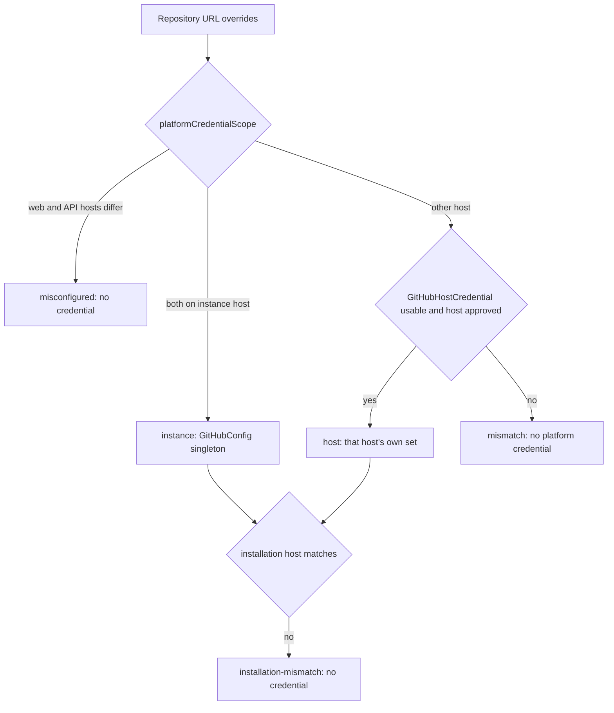

# Repository access, sharing and credentials

> Indexed at commit `d0a90fb5` on 2026-10-06 · [view on GitHub](https://github.com/yorch/auto-swe/tree/d0a90fb5)

## Relevant source files

- [packages/gateway/src/routes/repositories.ts](https://github.com/yorch/auto-swe/blob/d0a90fb5/packages/gateway/src/routes/repositories.ts)
- [packages/gateway/src/lib/credentialService.ts](https://github.com/yorch/auto-swe/blob/d0a90fb5/packages/gateway/src/lib/credentialService.ts)
- [packages/shared/src/lib/repoMembership.ts](https://github.com/yorch/auto-swe/blob/d0a90fb5/packages/shared/src/lib/repoMembership.ts)
- [packages/shared/src/lib/githubHostCredential.ts](https://github.com/yorch/auto-swe/blob/d0a90fb5/packages/shared/src/lib/githubHostCredential.ts)
- [packages/shared/src/lib/githubHostScope.ts](https://github.com/yorch/auto-swe/blob/d0a90fb5/packages/shared/src/lib/githubHostScope.ts)
- [packages/shared/src/lib/connectionCredential.ts](https://github.com/yorch/auto-swe/blob/d0a90fb5/packages/shared/src/lib/connectionCredential.ts)
- [packages/shared/src/lib/ssrfGuard.ts](https://github.com/yorch/auto-swe/blob/d0a90fb5/packages/shared/src/lib/ssrfGuard.ts)
- [packages/shared/src/lib/guardedFetch.ts](https://github.com/yorch/auto-swe/blob/d0a90fb5/packages/shared/src/lib/guardedFetch.ts)

## Overview

This subsystem answers three questions about a repository (stored as a `Connection` row): who may reach it, which hosts its URLs may name, and which credential the platform sends there. Membership is one shared definition; host policy is checked at write time and again at credential-resolution time; credentials are bound to the host family they were issued for. The outbound URL guard is the shared classifier that connector and probe call sites use before sending a request.

The gateway owns the HTTP surface (onboarding, editing, listing and sharing). The shared package owns the rules, so the gateway, the worker and the permission sweep apply identical checks.

## Membership and sharing

"May this user reach this repository" means membership of the owning team or of a team the repository is shared with (`ConnectionTeamShare`). [`repoMembership.ts`](https://github.com/yorch/auto-swe/blob/d0a90fb5/packages/shared/src/lib/repoMembership.ts#L1-L57) provides `repoMembersSelect` (a Prisma select for both membership sets, optionally filtered to one user), `allRepoMemberships`, `isRepoMember`, and `repoMemberWhere` (a `Connection` predicate). The module comment states the reason for a single definition: a call site counting only the owning team would lock shared-team members out of that path.

Management is a different question and stays with the owning team. `canManageTeamRepos` allows a platform `ADMIN`, or a member of that specific active team holding at least `LEAD`; the route-level `LEAD` gate checks only the platform role ([repositories.ts:L125-L139](https://github.com/yorch/auto-swe/blob/d0a90fb5/packages/gateway/src/routes/repositories.ts#L125-L139)).

`PUT /:id/shares` replaces the set of further teams a repository is shared with. It accepts only `git_repo` connections (so shares cannot bypass the admin-only routes for MCP or API connections), requires `canManageTeamRepos`, drops the owning team from the list, and accepts only active teams in the same organization, returning `INVALID_SHARE_TEAMS` otherwise. The delete and create run in one transaction, an audit row records before and after, and schedules belonging to a team that lost its share are deactivated afterwards without turning a committed change into a failure ([repositories.ts:L849-L938](https://github.com/yorch/auto-swe/blob/d0a90fb5/packages/gateway/src/routes/repositories.ts#L849-L938)). `GET /:id/share-candidates` lists the active teams of the same organization that could be added ([repositories.ts:L814-L847](https://github.com/yorch/auto-swe/blob/d0a90fb5/packages/gateway/src/routes/repositories.ts#L814-L847)).

Sources: [packages/shared/src/lib/repoMembership.ts:L1-L57](https://github.com/yorch/auto-swe/blob/d0a90fb5/packages/shared/src/lib/repoMembership.ts#L1-L57) [packages/gateway/src/routes/repositories.ts:L125-L139](https://github.com/yorch/auto-swe/blob/d0a90fb5/packages/gateway/src/routes/repositories.ts#L125-L139) [packages/gateway/src/routes/repositories.ts:L814-L938](https://github.com/yorch/auto-swe/blob/d0a90fb5/packages/gateway/src/routes/repositories.ts#L814-L938)

## Repository URLs and the host allowlist

A repository may override the instance's GitHub web base (`githubUrl`) and API base (`githubApiUrl`). Because every credential is sent to those bases, the gateway validates them before storage in `normaliseRepositoryUrls`, for every role including `ADMIN` ([repositories.ts:L227-L306](https://github.com/yorch/auto-swe/blob/d0a90fb5/packages/gateway/src/routes/repositories.ts#L227-L306)). It enforces these rules:

- `githubUrl` must be a web base with no path, stored as its origin; `githubApiUrl` must not contain `/repos/` and is stored without a trailing slash.
- A value equal to the instance's own host is stored as `null`, which already means "no override", so one host has one spelling and the unique index on host, owner and name stays meaningful.
- Both bases must pass `repositoryHostsAllowed`; a refusal names the URL and points to the `github.repositoryHosts` setting.
- The two bases must be on the same host family, otherwise the response code is `REPO_HOST_MISMATCH`. A PATCH is judged against the stored overrides for the field it does not set.

The approved set comes from `approvedRepositoryHosts`: the GitHub integration's web and API hosts plus `github.repositoryHosts` ([connectionCredential.ts:L117-L125](https://github.com/yorch/auto-swe/blob/d0a90fb5/packages/shared/src/lib/connectionCredential.ts#L117-L125)). `credentialHostAllowed` applies the match: HTTPS only, no userinfo, query or fragment, only a URL that already equals its parsed canonical form, and an exact host match with no wildcards or suffixes. `github.com` also admits `api.github.com` ([connectionCredential.ts:L73-L102](https://github.com/yorch/auto-swe/blob/d0a90fb5/packages/shared/src/lib/connectionCredential.ts#L73-L102)).

Only a platform `ADMIN` may set `installationId`, because the installation decides which GitHub account answers permission questions; `installationHostProblem` additionally requires the installation's recorded host to equal the host the repository's URLs imply ([repositories.ts:L150-L204](https://github.com/yorch/auto-swe/blob/d0a90fb5/packages/gateway/src/routes/repositories.ts#L150-L204)).

Sources: [packages/gateway/src/routes/repositories.ts:L227-L306](https://github.com/yorch/auto-swe/blob/d0a90fb5/packages/gateway/src/routes/repositories.ts#L227-L306) [packages/shared/src/lib/connectionCredential.ts:L73-L160](https://github.com/yorch/auto-swe/blob/d0a90fb5/packages/shared/src/lib/connectionCredential.ts#L73-L160) [packages/gateway/src/routes/repositories.ts:L150-L204](https://github.com/yorch/auto-swe/blob/d0a90fb5/packages/gateway/src/routes/repositories.ts#L150-L204)

## Platform credentials and host scope

The platform's PAT, GitHub App installation tokens and App JSON Web Token (JWT) are valid on one host family only and are never sent elsewhere ([githubHostScope.ts:L1-L25](https://github.com/yorch/auto-swe/blob/d0a90fb5/packages/shared/src/lib/githubHostScope.ts#L1-L25)). `hostFamily` folds `api.github.com` into `github.com` and `api.<tenant>.ghe.com` into `<tenant>.ghe.com` ([githubHostScope.ts:L63-L69](https://github.com/yorch/auto-swe/blob/d0a90fb5/packages/shared/src/lib/githubHostScope.ts#L63-L69)). `platformCredentialScope` classifies a repository as `instance`, `host`, `mismatch` or `misconfigured` ([githubHostScope.ts:L134-L151](https://github.com/yorch/auto-swe/blob/d0a90fb5/packages/shared/src/lib/githubHostScope.ts#L134-L151)).

`resolvePlatformCredential` turns that classification into a `PlatformCredential` ([githubHostCredential.ts:L140-L177](https://github.com/yorch/auto-swe/blob/d0a90fb5/packages/shared/src/lib/githubHostCredential.ts#L140-L177)). `resolveHostCredential` reads a `GitHubHostCredential` row, decrypts the PAT and App key, and returns null when neither a PAT nor a complete App exists, or when the host is no longer in the approved set ([githubHostCredential.ts:L57-L88](https://github.com/yorch/auto-swe/blob/d0a90fb5/packages/shared/src/lib/githubHostCredential.ts#L57-L88)). A host's config is built from its row alone and inherits nothing of the instance's, including the singleton installation id and auth mode ([githubHostCredential.ts:L95-L115](https://github.com/yorch/auto-swe/blob/d0a90fb5/packages/shared/src/lib/githubHostCredential.ts#L95-L115)). The database is read only for repositories off the instance host.

Sources: [packages/shared/src/lib/githubHostScope.ts:L1-L203](https://github.com/yorch/auto-swe/blob/d0a90fb5/packages/shared/src/lib/githubHostScope.ts#L1-L203) [packages/shared/src/lib/githubHostCredential.ts:L57-L177](https://github.com/yorch/auto-swe/blob/d0a90fb5/packages/shared/src/lib/githubHostCredential.ts#L57-L177)

## Per-user credentials

A user may save their own token for one repository (`ConnectionCredential`); it is used only for runs that user launched. Reads are keyed by `(connectionId, userId)`, so no path can select "whichever token this repo has" ([connectionCredential.ts:L1-L21](https://github.com/yorch/auto-swe/blob/d0a90fb5/packages/shared/src/lib/connectionCredential.ts#L1-L21)). Two admin-only settings govern it: `github.userCredentialsEnabled` and `github.userCredentialHosts`, read together by `resolveUserCredentialPolicy` ([connectionCredential.ts:L163-L175](https://github.com/yorch/auto-swe/blob/d0a90fb5/packages/shared/src/lib/connectionCredential.ts#L163-L175)).

`resolveUserCredential` returns a token only when all of the following hold ([connectionCredential.ts:L210-L269](https://github.com/yorch/auto-swe/blob/d0a90fb5/packages/shared/src/lib/connectionCredential.ts#L210-L269)):

- the feature is on and the user saved a token for this repository;
- the user is active and is still a member of the owning or a shared team, or is a platform `ADMIN`;
- both of the repository's current bases are on the user-credential allowlist;
- both bases still have the origins recorded when the token was saved, so a repointed repository requires saving the token again.

Null is the caller's cue to use the platform credential, never another user's token. A database or decryption failure throws, and an undecryptable token raises `CredentialUnreadableError` so callers do not retry it or silently switch identity ([connectionCredential.ts:L271-L289](https://github.com/yorch/auto-swe/blob/d0a90fb5/packages/shared/src/lib/connectionCredential.ts#L271-L289)).

Sources: [packages/shared/src/lib/connectionCredential.ts:L1-L21](https://github.com/yorch/auto-swe/blob/d0a90fb5/packages/shared/src/lib/connectionCredential.ts#L1-L21) [packages/shared/src/lib/connectionCredential.ts:L163-L289](https://github.com/yorch/auto-swe/blob/d0a90fb5/packages/shared/src/lib/connectionCredential.ts#L163-L289)

## Outbound URL guard

`ssrfGuard.ts` is the single classifier for operator-supplied URLs (provider `apiBase` probes, MCP connections, bundle URLs, connector base URLs). `isSafeProbeUrl` accepts only `http(s)` and refuses internal names (`localhost`, `.local`, `.internal`), the single-label `metadata` name, private IPv4 and IPv6 ranges and carrier-grade NAT, and it applies the same range checks to the IPv4 address embedded in mapped, compatible, NAT64 and 6to4 IPv6 forms ([ssrfGuard.ts:L185-L211](https://github.com/yorch/auto-swe/blob/d0a90fb5/packages/shared/src/lib/ssrfGuard.ts#L185-L211)); reserved ranges are refused separately ([ssrfGuard.ts:L122-L220](https://github.com/yorch/auto-swe/blob/d0a90fb5/packages/shared/src/lib/ssrfGuard.ts#L122-L220)).

Refusals carry a `private` flag only when an operator opt-in may waive them. `checkProbeUrl` with `allowPrivate` waives private-network refusals but never loopback, unspecified, link-local or cloud-metadata addresses, nor a malformed URL or non-http scheme ([ssrfGuard.ts:L222-L291](https://github.com/yorch/auto-swe/blob/d0a90fb5/packages/shared/src/lib/ssrfGuard.ts#L222-L291)). `checkConnectorBaseUrl` runs strict first, then the opt-in, and reports which refusal was waived ([ssrfGuard.ts:L302-L314](https://github.com/yorch/auto-swe/blob/d0a90fb5/packages/shared/src/lib/ssrfGuard.ts#L302-L314)).

The guard reads host text only. At call sites that use the guarded fetch, name resolution is also checked at connection time by `guardedDispatcher.ts`, which classifies every resolved address and connects to an address from that checked set. Behind a process-wide environment proxy the proxy performs the final resolution, so the host is checked up front but the connection cannot be pinned ([guardedDispatcher.ts:L1-L22](https://github.com/yorch/auto-swe/blob/d0a90fb5/packages/shared/src/lib/guardedDispatcher.ts#L1-L22); [ssrfGuard.ts:L11-L19](https://github.com/yorch/auto-swe/blob/d0a90fb5/packages/shared/src/lib/ssrfGuard.ts#L11-L19)). The gateway's provider-credential probe builds its fetch with `createGuardedFetch()`, applies a 5-second timeout, and returns sanitized error text rather than the raw fetch message ([credentialService.ts:L63-L91](https://github.com/yorch/auto-swe/blob/d0a90fb5/packages/gateway/src/lib/credentialService.ts#L63-L91)). `credentialInputProblem` rejects keys with whitespace or control characters and an `apiBase` with userinfo ([credentialService.ts:L96-L120](https://github.com/yorch/auto-swe/blob/d0a90fb5/packages/gateway/src/lib/credentialService.ts#L96-L120)).

`fetchGuarded` follows redirects by hand, up to `MAX_GUARDED_REDIRECTS` (3) hops. It runs the caller's `check` on the first URL and every hop, and requires an explicit `fetchImpl`. Credential headers go only to `credentialOrigin`; other origins receive an allowlist of benign headers. Only 307 and 308 keep the method and body, and a cross-origin redirect of a write is refused ([guardedFetch.ts:L1-L109](https://github.com/yorch/auto-swe/blob/d0a90fb5/packages/shared/src/lib/guardedFetch.ts#L1-L109)).

Sources: [packages/shared/src/lib/ssrfGuard.ts:L1-L314](https://github.com/yorch/auto-swe/blob/d0a90fb5/packages/shared/src/lib/ssrfGuard.ts#L1-L314) [packages/shared/src/lib/guardedFetch.ts:L1-L109](https://github.com/yorch/auto-swe/blob/d0a90fb5/packages/shared/src/lib/guardedFetch.ts#L1-L109) [packages/gateway/src/lib/credentialService.ts:L63-L120](https://github.com/yorch/auto-swe/blob/d0a90fb5/packages/gateway/src/lib/credentialService.ts#L63-L120)
