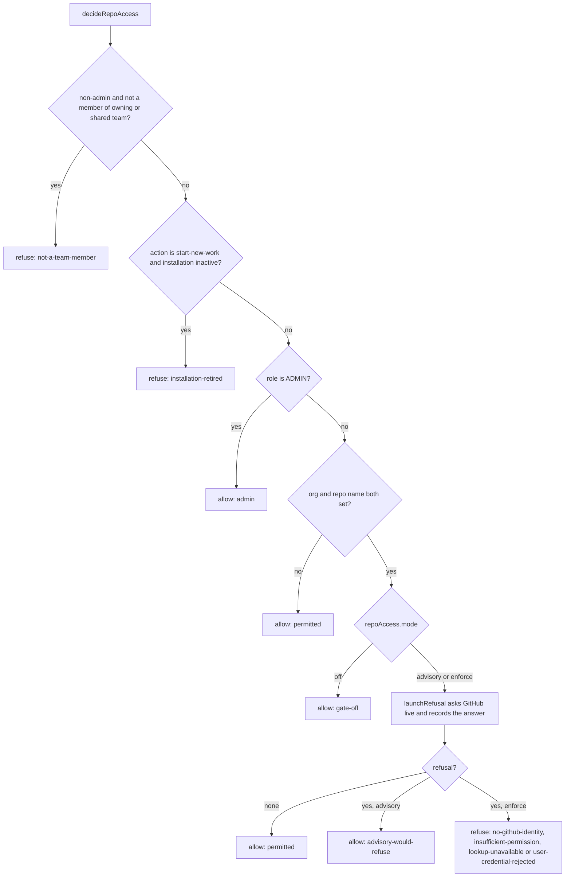
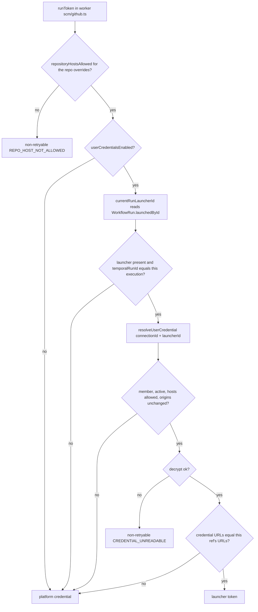

# Repository Access, Sharing, and Per-User Credentials

> Indexed at commit `147d054a` on 2026-09-30 · [view on GitHub](https://github.com/yorch/auto-swe/tree/147d054a)

## Relevant source files

- [packages/shared/src/lib/repoMembership.ts](https://github.com/yorch/auto-swe/blob/147d054a/packages/shared/src/lib/repoMembership.ts)
- [packages/shared/src/lib/connectionCredential.ts](https://github.com/yorch/auto-swe/blob/147d054a/packages/shared/src/lib/connectionCredential.ts)
- [packages/shared/src/lib/repoAccessDecision.ts](https://github.com/yorch/auto-swe/blob/147d054a/packages/shared/src/lib/repoAccessDecision.ts)
- [packages/shared/src/lib/repoAccessGate.ts](https://github.com/yorch/auto-swe/blob/147d054a/packages/shared/src/lib/repoAccessGate.ts)
- [packages/shared/src/lib/repoPermission.ts](https://github.com/yorch/auto-swe/blob/147d054a/packages/shared/src/lib/repoPermission.ts)
- [packages/shared/src/lib/githubPermission.ts](https://github.com/yorch/auto-swe/blob/147d054a/packages/shared/src/lib/githubPermission.ts)
- [packages/shared/src/lib/githubIdentityCheck.ts](https://github.com/yorch/auto-swe/blob/147d054a/packages/shared/src/lib/githubIdentityCheck.ts)
- [packages/shared/src/lib/repoAccessProjection.ts](https://github.com/yorch/auto-swe/blob/147d054a/packages/shared/src/lib/repoAccessProjection.ts)
- [packages/gateway/src/lib/tenantScope.ts](https://github.com/yorch/auto-swe/blob/147d054a/packages/gateway/src/lib/tenantScope.ts)
- [packages/gateway/src/routes/repositories.ts](https://github.com/yorch/auto-swe/blob/147d054a/packages/gateway/src/routes/repositories.ts)
- [packages/gateway/src/routes/connectionCredentials.ts](https://github.com/yorch/auto-swe/blob/147d054a/packages/gateway/src/routes/connectionCredentials.ts)
- [packages/gateway/src/routes/githubInstallations.ts](https://github.com/yorch/auto-swe/blob/147d054a/packages/gateway/src/routes/githubInstallations.ts)
- [packages/gateway/src/lib/runConnection.ts](https://github.com/yorch/auto-swe/blob/147d054a/packages/gateway/src/lib/runConnection.ts)
- [packages/worker/src/lib/runLauncher.ts](https://github.com/yorch/auto-swe/blob/147d054a/packages/worker/src/lib/runLauncher.ts)
- [packages/worker/src/lib/scm/github.ts](https://github.com/yorch/auto-swe/blob/147d054a/packages/worker/src/lib/scm/github.ts)
- [packages/worker/src/activities/syncRepoAccess.ts](https://github.com/yorch/auto-swe/blob/147d054a/packages/worker/src/activities/syncRepoAccess.ts)
- [packages/worker/src/activities/templates.ts](https://github.com/yorch/auto-swe/blob/147d054a/packages/worker/src/activities/templates.ts)
- [packages/gateway/src/routes/scheduledWorkRequests.ts](https://github.com/yorch/auto-swe/blob/147d054a/packages/gateway/src/routes/scheduledWorkRequests.ts)
- [packages/shared/src/config/registry.ts](https://github.com/yorch/auto-swe/blob/147d054a/packages/shared/src/config/registry.ts)
- [packages/shared/src/prisma/schema.prisma](https://github.com/yorch/auto-swe/blob/147d054a/packages/shared/src/prisma/schema.prisma)
- [packages/gateway/src/lib/repoAccessRefresh.ts](https://github.com/yorch/auto-swe/blob/147d054a/packages/gateway/src/lib/repoAccessRefresh.ts)
- [packages/gateway/src/plugins/auth.ts](https://github.com/yorch/auto-swe/blob/147d054a/packages/gateway/src/plugins/auth.ts)
- [packages/gateway/src/routes/webhooks.ts](https://github.com/yorch/auto-swe/blob/147d054a/packages/gateway/src/routes/webhooks.ts)
- [docs/repo-access-gating.md](https://github.com/yorch/auto-swe/blob/147d054a/docs/repo-access-gating.md)
- [docs/repositories.md](https://github.com/yorch/auto-swe/blob/147d054a/docs/repositories.md)
- [docs/user-github-credentials.md](https://github.com/yorch/auto-swe/blob/147d054a/docs/user-github-credentials.md)

## Overview

A repository is a `Connection` row with `type = 'git_repo'`. Four independent questions are answered about one, in four different places, and this page maps each to the function that decides it: may a user *reach* it (team membership, then optionally GitHub permission), may they *manage* it (owning team lead only), which *credential* does a run use (the launcher's own token or the platform's), and which *hosts* may a credential be sent to. The product and operations view lives in [repo-access-gating.md](https://github.com/yorch/auto-swe/blob/147d054a/docs/repo-access-gating.md), [repositories.md](https://github.com/yorch/auto-swe/blob/147d054a/docs/repositories.md) and [user-github-credentials.md](https://github.com/yorch/auto-swe/blob/147d054a/docs/user-github-credentials.md); this page does not restate them and instead says where each rule is enforced and why it has that shape.

The recurring design move is to make the wrong thing unrepresentable. Membership is one helper rather than a hand-written `where`; the launch decision takes every input as a required field so a forgotten one fails to compile; the credential resolver reads the repository's URLs itself rather than accepting them from the caller; and the identity of a run is read from a row the run's first activity wrote, not from the request.

Sources: [packages/shared/src/lib/repoMembership.ts:L1-L57](https://github.com/yorch/auto-swe/blob/147d054a/packages/shared/src/lib/repoMembership.ts#L1-L57) [packages/shared/src/lib/repoAccessDecision.ts:L1-L64](https://github.com/yorch/auto-swe/blob/147d054a/packages/shared/src/lib/repoAccessDecision.ts#L1-L64) [packages/shared/src/lib/connectionCredential.ts:L176-L261](https://github.com/yorch/auto-swe/blob/147d054a/packages/shared/src/lib/connectionCredential.ts#L176-L261) [packages/worker/src/lib/runLauncher.ts:L1-L49](https://github.com/yorch/auto-swe/blob/147d054a/packages/worker/src/lib/runLauncher.ts#L1-L49)

## How "may this user reach this repository" is decided

### One definition of membership

A user reaches a repository when they belong to the owning team or to any team it is shared with through `ConnectionTeamShare`. That rule lives in [repoMembership.ts#L1](https://github.com/yorch/auto-swe/blob/147d054a/packages/shared/src/lib/repoMembership.ts#L1) and nowhere else: `repoMembersSelect` builds the Prisma `select` for both memberships, `allRepoMemberships` and `isRepoMember` answer it in memory, and `repoMemberWhere` expresses it as a `Connection` predicate ([repoMembership.ts#L23-L56](https://github.com/yorch/auto-swe/blob/147d054a/packages/shared/src/lib/repoMembership.ts#L23-L56)). The file header names the reason: the question is asked by listings, the launch decision, the credential resolver and the permission sweep, and a site that counted only `repo.team.memberships` would silently lock shared-team members out of that one path. The gateway keeps a second spelling for query call sites, `memberOrSharedTeams`, which also lists both branches ([tenantScope.ts#L116-L119](https://github.com/yorch/auto-swe/blob/147d054a/packages/gateway/src/lib/tenantScope.ts#L116-L119)).

Reading `repo.team.memberships` alone is wrong for a second reason that is easy to miss: the `RepoAccessSubject` type makes `shares` a required field, so a call site that forgets to select it does not compile rather than quietly refusing shared members ([repoAccessDecision.ts#L47-L64](https://github.com/yorch/auto-swe/blob/147d054a/packages/shared/src/lib/repoAccessDecision.ts#L47-L64)). `validateRunConnection` shows the idiom: it selects `repoMembersSelect({ userId: true }, { userId: user?.sub ?? NO_USER }).shares`, filtered to the acting user so it never loads a whole team ([runConnection.ts#L64-L70](https://github.com/yorch/auto-swe/blob/147d054a/packages/gateway/src/lib/runConnection.ts#L64-L70)).

The `ConnectionTeamShare` model is unique on `(connectionId, teamId)`, indexed by `teamId`, and cascades on delete of either side ([schema.prisma#L404-L418](https://github.com/yorch/auto-swe/blob/147d054a/packages/shared/src/prisma/schema.prisma#L404-L418)). Shares are written by `PUT /api/v1/repositories/:id/shares`, which requires the caller to manage the owning team, accepts only active teams in the same `orgId` (a share never crosses a tenant boundary), replaces the set in one transaction, and writes an audit entry ([repositories.ts#L633-L716](https://github.com/yorch/auto-swe/blob/147d054a/packages/gateway/src/routes/repositories.ts#L633-L716)).

### Reaching versus managing

Management is deliberately narrower and does not go through the membership helper. `canManageTeamRepos` allows a platform `ADMIN`, or a `LEAD` membership in the owning team where the team is active ([repositories.ts#L84-L107](https://github.com/yorch/auto-swe/blob/147d054a/packages/gateway/src/routes/repositories.ts#L84-L107)). The share-candidates route, the shares route, repository edit and the schedule routes all call it, so a shared team's members can start runs but cannot edit, move, re-share or schedule ([repositories.ts#L598-L625](https://github.com/yorch/auto-swe/blob/147d054a/packages/gateway/src/routes/repositories.ts#L598-L625)). Changing a repository's GitHub App installation is narrower still: `rejectsInstallationChange` refuses any non-`ADMIN` who sends `installationId`, because it changes which GitHub account answers permission questions ([repositories.ts#L108-L124](https://github.com/yorch/auto-swe/blob/147d054a/packages/gateway/src/routes/repositories.ts#L108-L124)). Control of an in-flight run (cancel, answering human steps) is a third, separate predicate described in [repositories.md](https://github.com/yorch/auto-swe/blob/147d054a/docs/repositories.md).

### The decision function

Launch paths call `decideRepoAccess` ([repoAccessDecision.ts#L158-L210](https://github.com/yorch/auto-swe/blob/147d054a/packages/shared/src/lib/repoAccessDecision.ts#L158-L210)). The order is fixed and each step explains itself in a comment:

1. Non-admin and not a member of the owning or a shared team: `not-a-team-member`. This is first so an outsider is not sent to link a GitHub account that would not help.
2. When `action === 'start-new-work'` (the default) and the repository's installation is inactive: `installation-retired`, for everyone including admins.
3. `ADMIN`: allowed with reason `admin`.
4. A row with no `organizationName` and `repoName` (an MCP server, an HTTP API) has nothing GitHub can answer about: allowed. The exemption is keyed on coordinates rather than `type`, because a team lead can create a non-git row that carries a real repository's coordinates.
5. Otherwise `decideRepoLaunch` consults the GitHub gate.

`runIdentity` (`'caller'` or `'platform'`, default `'platform'`) is passed through to step 5. Template runs pass `'caller'` ([runConnection.ts#L104-L113](https://github.com/yorch/auto-swe/blob/147d054a/packages/gateway/src/lib/runConnection.ts#L104-L113)). The two conditions are ANDed: GitHub can only take access away, never grant it, so membership stays the outer bound even with the gate off ([repoAccessDecision.ts#L146-L157](https://github.com/yorch/auto-swe/blob/147d054a/packages/shared/src/lib/repoAccessDecision.ts#L146-L157)).

Listings use the predicate form instead. `reachableConnections(actor, gate)` is `AND` of `memberOrSharedTeams` and `permissionRequirement` ([tenantScope.ts#L99-L106](https://github.com/yorch/auto-swe/blob/147d054a/packages/gateway/src/lib/tenantScope.ts#L99-L106)). Routes acting on named repositories load first and decide afterwards so a refusal can name which repositories were refused; filtering in the query would turn that into "no such repository" ([repoAccessDecision.ts#L16-L22](https://github.com/yorch/auto-swe/blob/147d054a/packages/shared/src/lib/repoAccessDecision.ts#L16-L22)). `multiRepoRefusalBody` returns `FORBIDDEN` if any refusal is a membership one, else `INSTALLATION_RETIRED`, else `REPO_ACCESS_DENIED` ([repoAccessDecision.ts#L224-L264](https://github.com/yorch/auto-swe/blob/147d054a/packages/shared/src/lib/repoAccessDecision.ts#L224-L264)).

Sources: [packages/shared/src/lib/repoMembership.ts:L1-L57](https://github.com/yorch/auto-swe/blob/147d054a/packages/shared/src/lib/repoMembership.ts#L1-L57) [packages/shared/src/lib/repoAccessDecision.ts:L47-L284](https://github.com/yorch/auto-swe/blob/147d054a/packages/shared/src/lib/repoAccessDecision.ts#L47-L284) [packages/gateway/src/lib/tenantScope.ts:L78-L170](https://github.com/yorch/auto-swe/blob/147d054a/packages/gateway/src/lib/tenantScope.ts#L78-L170) [packages/gateway/src/routes/repositories.ts:L84-L124](https://github.com/yorch/auto-swe/blob/147d054a/packages/gateway/src/routes/repositories.ts#L84-L124) [packages/gateway/src/routes/repositories.ts:L633-L716](https://github.com/yorch/auto-swe/blob/147d054a/packages/gateway/src/routes/repositories.ts#L633-L716) [packages/gateway/src/lib/runConnection.ts:L52-L135](https://github.com/yorch/auto-swe/blob/147d054a/packages/gateway/src/lib/runConnection.ts#L52-L135) [packages/shared/src/prisma/schema.prisma:L404-L418](https://github.com/yorch/auto-swe/blob/147d054a/packages/shared/src/prisma/schema.prisma#L404-L418)

## GitHub-permission gating

The gate has three modes, `RepoAccessMode = 'off' | 'advisory' | 'enforce'`, held by the `repoAccess.mode` setting (default `off`), and every one of the four `repoAccess.*` settings is `ADMIN`-only with no override scope ([repoAccessGate.ts#L35-L40](https://github.com/yorch/auto-swe/blob/147d054a/packages/shared/src/lib/repoAccessGate.ts#L35-L40) [registry.ts#L231-L281](https://github.com/yorch/auto-swe/blob/147d054a/packages/shared/src/config/registry.ts#L231-L281)).

| Setting | Default | Role |
| --- | --- | --- |
| `repoAccess.mode` | `off` | `off`, `advisory`, `enforce` |
| `repoAccess.syncEnabled` | `false` | whether the scheduled sweep runs |
| `repoAccess.syncCron` | `23 * * * *` | sweep schedule (UTC) |
| `repoAccess.viewStaleAfterHours` | `72` | max age of a cached answer for viewing (integer, 1 to 8760) |

**Launch is live, listings are cached.** `decideRepoLaunch` asks GitHub at launch time and writes the answer back, so the decision that matters most is effectively real time ([repoAccessGate.ts#L230-L260](https://github.com/yorch/auto-swe/blob/147d054a/packages/shared/src/lib/repoAccessGate.ts#L230-L260)). It needs the level `write`: `permissionMeets(permission, 'write')`, since a run pushes a branch and opens a pull request ([repoAccessGate.ts#L262-L317](https://github.com/yorch/auto-swe/blob/147d054a/packages/shared/src/lib/repoAccessGate.ts#L262-L317)). Listings read the `repo_access` projection: under `enforce` only, `permissionRequirement` requires a row with `permission` in `READ`, `WRITE`, `ADMIN`, `userId` equal to the actor and `checkedAt >= now - staleAfterHours`, and exempts every non-`git_repo` connection because none can ever have a row ([tenantScope.ts#L142-L170](https://github.com/yorch/auto-swe/blob/147d054a/packages/gateway/src/lib/tenantScope.ts#L142-L170)). Under `advisory` a listing is unchanged; the signal is carried by the launch path, which logs `repoAccess advisory` and returns `advisory-would-refuse` ([repoAccessGate.ts#L246-L256](https://github.com/yorch/auto-swe/blob/147d054a/packages/shared/src/lib/repoAccessGate.ts#L246-L256)).

**How the question is asked.** `lookupRepoPermission` refuses to send the platform token to a per-repository API override that is not on an approved host (reported as `credential-rejected`, "could not ask", never a denial), resolves the token for the repository's installation, and calls `fetchRepoPermission` with the user's login ([repoPermission.ts#L48-L82](https://github.com/yorch/auto-swe/blob/147d054a/packages/shared/src/lib/repoPermission.ts#L48-L82)). When the run will act as the caller and the caller has a usable saved token, `launchRefusal` instead asks `GET /repos/{owner}/{repo}` with that token through `fetchOwnRepoPermission`, which maps the `permissions` flags (`admin`; `maintain` or `push` to `write`; `triage` or `pull` to `read`; else `none`) and treats a missing `permissions` object as `unavailable`, not `none` ([githubPermission.ts#L117-L144](https://github.com/yorch/auto-swe/blob/147d054a/packages/shared/src/lib/githubPermission.ts#L117-L144) [repoAccessGate.ts#L262-L290](https://github.com/yorch/auto-swe/blob/147d054a/packages/shared/src/lib/repoAccessGate.ts#L262-L290)). A token GitHub rejects, or that cannot see the repository, yields `user-credential-rejected` and does not fall back, because the run would use that token and fail.

**Failures are not verdicts.** `PermissionLookupFailure` is `repo-not-found`, `credential-rejected`, `rate-limited` or `unavailable`; a 404 maps to `repo-not-found`, 401 to `credential-rejected`, 403 to `rate-limited` only when `x-ratelimit-remaining` is `0`, 429 to `rate-limited`, other non-2xx and network errors to `unavailable`, with an 8 000 ms timeout ([githubPermission.ts#L38-L58](https://github.com/yorch/auto-swe/blob/147d054a/packages/shared/src/lib/githubPermission.ts#L38-L58) [githubPermission.ts#L156-L202](https://github.com/yorch/auto-swe/blob/147d054a/packages/shared/src/lib/githubPermission.ts#L156-L202)). `recordRepoPermission` writes a `none` (a fact) but writes nothing for a failure, so an outage ages out through the staleness window instead of overwriting a row ([repoAccessProjection.ts#L22-L53](https://github.com/yorch/auto-swe/blob/147d054a/packages/shared/src/lib/repoAccessProjection.ts#L22-L53)). The launch path fails closed on any failure.

**Caching and refresh.** `repo_access` is a cache with unique `(userId, connectionId)` and indexes on `connectionId` and `checkedAt` ([schema.prisma#L375-L393](https://github.com/yorch/auto-swe/blob/147d054a/packages/shared/src/prisma/schema.prisma#L375-L393)). Its writers are the launch path, the webhook refresh (`POST /api/v1/webhooks/access`, signature-verified, in [webhooks.ts#L479-L500](https://github.com/yorch/auto-swe/blob/147d054a/packages/gateway/src/routes/webhooks.ts#L479-L500) with the work in [packages/gateway/src/lib/repoAccessRefresh.ts](https://github.com/yorch/auto-swe/blob/147d054a/packages/gateway/src/lib/repoAccessRefresh.ts)) and the sweep `syncRepoAccess` ([packages/worker/src/activities/syncRepoAccess.ts](https://github.com/yorch/auto-swe/blob/147d054a/packages/worker/src/activities/syncRepoAccess.ts)). Both the sweep and the refresh use the user token when `lookupPermissionViaUserCredential` finds one usable and fall back to the login lookup otherwise ([syncRepoAccess.ts#L245](https://github.com/yorch/auto-swe/blob/147d054a/packages/worker/src/activities/syncRepoAccess.ts#L245)).

**Gate reads never block a request.** `requireAuth` resolves the gate on every authenticated request through `resolveRepoAccessGateOrLastKnown`: a 2 000 ms read timeout, a 5 000 ms backoff after a failure, and the last value this process read, so a database blip cannot silently turn enforcement off. Only a process that has never read it treats the gate as `off` and logs a warning ([repoAccessGate.ts#L136-L186](https://github.com/yorch/auto-swe/blob/147d054a/packages/shared/src/lib/repoAccessGate.ts#L136-L186) [auth.ts#L415-L425](https://github.com/yorch/auto-swe/blob/147d054a/packages/gateway/src/plugins/auth.ts#L415-L425)). `resolveRepoAccessGate` also warns when mode is `enforce` while `repoAccess.syncEnabled` is false ([repoAccessGate.ts#L95-L112](https://github.com/yorch/auto-swe/blob/147d054a/packages/shared/src/lib/repoAccessGate.ts#L95-L112)).

Sources: [packages/shared/src/lib/repoAccessGate.ts:L35-L317](https://github.com/yorch/auto-swe/blob/147d054a/packages/shared/src/lib/repoAccessGate.ts#L35-L317) [packages/shared/src/lib/repoPermission.ts:L25-L135](https://github.com/yorch/auto-swe/blob/147d054a/packages/shared/src/lib/repoPermission.ts#L25-L135) [packages/shared/src/lib/githubPermission.ts:L19-L202](https://github.com/yorch/auto-swe/blob/147d054a/packages/shared/src/lib/githubPermission.ts#L19-L202) [packages/shared/src/lib/repoAccessProjection.ts:L15-L53](https://github.com/yorch/auto-swe/blob/147d054a/packages/shared/src/lib/repoAccessProjection.ts#L15-L53) [packages/gateway/src/lib/tenantScope.ts:L47-L170](https://github.com/yorch/auto-swe/blob/147d054a/packages/gateway/src/lib/tenantScope.ts#L47-L170) [packages/shared/src/config/registry.ts:L231-L281](https://github.com/yorch/auto-swe/blob/147d054a/packages/shared/src/config/registry.ts#L231-L281) [packages/shared/src/prisma/schema.prisma:L375-L393](https://github.com/yorch/auto-swe/blob/147d054a/packages/shared/src/prisma/schema.prisma#L375-L393) [packages/gateway/src/plugins/auth.ts:L405-L428](https://github.com/yorch/auto-swe/blob/147d054a/packages/gateway/src/plugins/auth.ts#L405-L428) [packages/gateway/src/routes/webhooks.ts:L479-L500](https://github.com/yorch/auto-swe/blob/147d054a/packages/gateway/src/routes/webhooks.ts#L479-L500)

## GitHub username re-registration and takeover detection

`users.github_login` is `@unique` ([schema.prisma#L979](https://github.com/yorch/auto-swe/blob/147d054a/packages/shared/src/prisma/schema.prisma#L979)). GitHub frees a username on rename and lets anyone re-register it, so a stored login can come to name someone else and the projection would record that person's access as this user's. `verifyGithubLoginOwnership` compares the numeric id GitHub reports for the login today (`fetchGithubUserId`, `/users/{login}`, 8 000 ms timeout) with `accounts.account_id` that better-auth stored at link time ([githubIdentityCheck.ts#L116-L145](https://github.com/yorch/auto-swe/blob/147d054a/packages/shared/src/lib/githubIdentityCheck.ts#L116-L145)).

Outcomes are a closed union: `ok`, `reassigned`, `unlinked` (no linked account behind a recorded login, cleared without raising the alarm), and `unverifiable` (GitHub did not answer, nothing changed) ([githubIdentityCheck.ts#L41-L53](https://github.com/yorch/auto-swe/blob/147d054a/packages/shared/src/lib/githubIdentityCheck.ts#L41-L53)). Only a confirmed mismatch clears: an outage is not evidence a name changed hands. A plain rename resolves to the same id and is left alone.

On `reassigned`, `clearGithubLogin` runs in one transaction that nulls the login and deletes every `repo_access` row for the user. Deleting rows matters because listings read by user id, not through the login, so rows recorded from the impostor's permissions would otherwise survive for `repoAccess.viewStaleAfterHours` ([githubIdentityCheck.ts#L87-L106](https://github.com/yorch/auto-swe/blob/147d054a/packages/shared/src/lib/githubIdentityCheck.ts#L87-L106)). Then `recordTakeover` writes a `configAuditLog` row with `entityType: 'User'`, `action: 'UPDATE'`, `actorId: null`, `beforeJson` of the old login and expected account id, and `afterJson` carrying `reason: 'login-reassigned'` and the observed account id ([githubIdentityCheck.ts#L147-L199](https://github.com/yorch/auto-swe/blob/147d054a/packages/shared/src/lib/githubIdentityCheck.ts#L147-L199)). The write is best-effort: a failure is logged with `console.warn` and does not undo the clearing. It lives inside `verifyGithubLoginOwnership` so no caller can detect a takeover and forget to record it.

All three writers verify. `verifiedGithubLoginFor` serves the launch path and the webhook refresh, returning null when the login was reassigned and the login unchanged when unverifiable ([repoPermission.ts#L160-L190](https://github.com/yorch/auto-swe/blob/147d054a/packages/shared/src/lib/repoPermission.ts#L160-L190)); the sweep verifies once per user (a `verified` map) and counts `reassignedLogins` and `unlinkedLogins` separately ([syncRepoAccess.ts#L170-L225](https://github.com/yorch/auto-swe/blob/147d054a/packages/worker/src/activities/syncRepoAccess.ts#L170-L225)). The account lookup uses the fixed constant `GITHUB_ACCOUNT_API_URL = 'https://api.github.com'`, not the instance `apiUrl`, because better-auth's built-in provider always talks to github.com and asking an Enterprise host about a github.com id would read as a mismatch and clear a valid login ([githubIdentityCheck.ts#L25-L39](https://github.com/yorch/auto-swe/blob/147d054a/packages/shared/src/lib/githubIdentityCheck.ts#L25-L39)).

Sources: [packages/shared/src/lib/githubIdentityCheck.ts:L1-L199](https://github.com/yorch/auto-swe/blob/147d054a/packages/shared/src/lib/githubIdentityCheck.ts#L1-L199) [packages/shared/src/lib/repoPermission.ts:L160-L190](https://github.com/yorch/auto-swe/blob/147d054a/packages/shared/src/lib/repoPermission.ts#L160-L190) [packages/worker/src/activities/syncRepoAccess.ts:L170-L225](https://github.com/yorch/auto-swe/blob/147d054a/packages/worker/src/activities/syncRepoAccess.ts#L170-L225) [packages/shared/src/prisma/schema.prisma](https://github.com/yorch/auto-swe/blob/147d054a/packages/shared/src/prisma/schema.prisma)

## Installations and the retired-installation mark

`GitHubInstallation` rows are `installationId` (unique, numeric, opaque), `accountLogin` (display only) and `isActive` (default `true`) ([schema.prisma#L472-L495](https://github.com/yorch/auto-swe/blob/147d054a/packages/shared/src/prisma/schema.prisma#L472-L495)); `Connection.installationId` points a repository at one, and null means the singleton `GitHubConfig.appInstallationId`. `resolveGitHubToken` caches one installation token per `installationId@apiUrl` key, with a fingerprint of the App id and a SHA-256 of the private key so rotation invalidates the cache ([githubInstallation.ts#L49-L70](https://github.com/yorch/auto-swe/blob/147d054a/packages/shared/src/lib/githubInstallation.ts#L49-L70) [githubInstallation.ts#L155-L192](https://github.com/yorch/auto-swe/blob/147d054a/packages/shared/src/lib/githubInstallation.ts#L155-L192)).

"Retired" means `isActive = false`. `isInstallationRetired` uses optional chaining (`installation?.isActive === false`) because an unselected relation arrives as `undefined` and a stricter-looking `!== null` once read it as retired and then threw ([repoAccessDecision.ts#L96-L106](https://github.com/yorch/auto-swe/blob/147d054a/packages/shared/src/lib/repoAccessDecision.ts#L96-L106)). Retirement stops new work only. It is consulted at the decision, not in the token resolver that clones, pushes and reads CI share, so work in flight keeps resolving credentials through it ([repoAccessDecision.ts#L80-L95](https://github.com/yorch/auto-swe/blob/147d054a/packages/shared/src/lib/repoAccessDecision.ts#L80-L95)). Two enforcement points exist:

- `decideRepoAccess` with `action: 'start-new-work'` refuses everyone, admins included, with `INSTALLATION_RETIRED` ([repoAccessDecision.ts#L188-L190](https://github.com/yorch/auto-swe/blob/147d054a/packages/shared/src/lib/repoAccessDecision.ts#L188-L190)). `'steer-running-work'` removes only this condition and still runs membership and the GitHub check; a deferred channel task re-reads retirement when it fires in `createWorkflowRun` ([repoAccessDecision.ts#L115-L144](https://github.com/yorch/auto-swe/blob/147d054a/packages/shared/src/lib/repoAccessDecision.ts#L115-L144)).
- Paths with no user, the template webhook and the issue-tracker auto-trigger, are exempt from the gate for want of an identity, so `validateRunConnection` checks retirement ahead of the user branch and replies 409 ([runConnection.ts#L92-L98](https://github.com/yorch/auto-swe/blob/147d054a/packages/gateway/src/lib/runConnection.ts#L92-L98)), and the Jira auto-trigger skips with `reason: 'installation retired'` ([webhooks.ts#L1006-L1008](https://github.com/yorch/auto-swe/blob/147d054a/packages/gateway/src/routes/webhooks.ts#L1006-L1008)).

**Installations admin route.** `packages/gateway/src/routes/githubInstallations.ts` is `ADMIN`-only: `GET /github-installations` (with a count of connections), `POST` (409 `INSTALLATION_EXISTS` on a duplicate id), `PATCH /:id` (`accountLogin`, `isActive`) and `DELETE /:id`. Delete is refused with 409 `INSTALLATION_IN_USE`, naming up to ten repositories, while any repository points at the installation, and a foreign-key race (`P2003`) maps to the same code ([githubInstallations.ts#L43-L152](https://github.com/yorch/auto-swe/blob/147d054a/packages/gateway/src/routes/githubInstallations.ts#L43-L152)). Retiring is therefore a `PATCH` of `isActive`, deletion needs repointing first.

Sources: [packages/shared/src/lib/repoAccessDecision.ts:L80-L144](https://github.com/yorch/auto-swe/blob/147d054a/packages/shared/src/lib/repoAccessDecision.ts#L80-L144) [packages/gateway/src/lib/runConnection.ts:L52-L135](https://github.com/yorch/auto-swe/blob/147d054a/packages/gateway/src/lib/runConnection.ts#L52-L135) [packages/gateway/src/routes/githubInstallations.ts:L1-L152](https://github.com/yorch/auto-swe/blob/147d054a/packages/gateway/src/routes/githubInstallations.ts#L1-L152) [packages/shared/src/prisma/schema.prisma:L472-L495](https://github.com/yorch/auto-swe/blob/147d054a/packages/shared/src/prisma/schema.prisma#L472-L495) [packages/shared/src/lib/githubInstallation.ts:L21-L192](https://github.com/yorch/auto-swe/blob/147d054a/packages/shared/src/lib/githubInstallation.ts#L21-L192) [packages/gateway/src/routes/webhooks.ts:L1000-L1010](https://github.com/yorch/auto-swe/blob/147d054a/packages/gateway/src/routes/webhooks.ts#L1000-L1010)

## Per-user GitHub credentials

### Flag and policy

Two `ADMIN`-only, deployment-wide settings govern the feature ([registry.ts#L185-L208](https://github.com/yorch/auto-swe/blob/147d054a/packages/shared/src/config/registry.ts#L185-L208)): `github.userCredentialsEnabled` (default `false`) and `github.userCredentialHosts` (default `['github.com']`, sensitive). `resolveUserCredentialPolicy` reads both in one call ([connectionCredential.ts#L154-L167](https://github.com/yorch/auto-swe/blob/147d054a/packages/shared/src/lib/connectionCredential.ts#L154-L167)). With the flag off, every resolver returns null and saved rows are inert but kept; users can still delete theirs.

### Storage and encryption

`ConnectionCredential` has `tokenCiphertext`, `tokenNonce`, `tokenAuthTag`, `tokenKeyVersion`, `tokenLastFour`, plus `apiOrigin` and `webOrigin` recorded at save time; it is unique on `(connectionId, userId)` and cascades from both user and connection ([schema.prisma#L433-L459](https://github.com/yorch/auto-swe/blob/147d054a/packages/shared/src/prisma/schema.prisma#L433-L459)). `encryptCredentialToken` wraps the shared `encryptSecret` AES-256-GCM envelope and returns those columns ([connectionCredential.ts#L28-L46](https://github.com/yorch/auto-swe/blob/147d054a/packages/shared/src/lib/connectionCredential.ts#L28-L46)).

Routes in [packages/gateway/src/routes/connectionCredentials.ts](https://github.com/yorch/auto-swe/blob/147d054a/packages/gateway/src/routes/connectionCredentials.ts) all act on the caller's own row: `GET /api/v1/repositories/credentials/mine` (policy plus which repositories have a token, never the token), `PUT /:id/credential` and `DELETE /:id/credential`. Save requires the flag on (403 `USER_CREDENTIALS_DISABLED`), the caller to be a member via `isRepoMember` or an admin (`loadOwnableRepo` returns 404 otherwise), an active repository and team (409 `REPO_INACTIVE`), both URLs on the allowlist (400 `HOST_NOT_ALLOWED`), GitHub to accept the token (400 `CREDENTIAL_REJECTED`, 503 `GITHUB_UNAVAILABLE`) and the token's owner to have `write` (400 `INSUFFICIENT_PERMISSION`). Only `tokenLastFour` is returned or audited ([connectionCredentials.ts#L55-L80](https://github.com/yorch/auto-swe/blob/147d054a/packages/gateway/src/routes/connectionCredentials.ts#L55-L80) [connectionCredentials.ts#L110-L230](https://github.com/yorch/auto-swe/blob/147d054a/packages/gateway/src/routes/connectionCredentials.ts#L110-L230)).

### Resolution

`resolveUserCredential(prisma, { connectionId, userId })` is the only way to obtain a token. There is no lookup by repository alone, so no path can pick "whichever token this repository has" ([connectionCredential.ts#L1-L21](https://github.com/yorch/auto-swe/blob/147d054a/packages/shared/src/lib/connectionCredential.ts#L1-L21)). It returns null, the caller's cue to use the platform credential, never another user's, unless all hold: flag on; a row exists; the user `isActive` and either role `ADMIN` or `isRepoMember`; both current URLs pass `credentialHostAllowed`; and `originOf` of each current URL equals the stored `apiOrigin` and `webOrigin` ([connectionCredential.ts#L202-L247](https://github.com/yorch/auto-swe/blob/147d054a/packages/shared/src/lib/connectionCredential.ts#L202-L247)). It reads the repository's URLs itself so the launch gate, the sweep and the run apply identical checks to identical values. A database or decryption failure throws; a decryption failure is the typed `CredentialUnreadableError`, because null would quietly switch the run to the platform identity ([connectionCredential.ts#L248-L281](https://github.com/yorch/auto-swe/blob/147d054a/packages/shared/src/lib/connectionCredential.ts#L248-L281)).

### Host allowlist and verified-origin binding

`credentialHostAllowed(url, hosts)` accepts a URL only if it is HTTPS, has no userinfo, query or fragment, and is already in canonical form (`url` equals `parsed.href`, with or without a trailing slash), then matches `host` exactly against the list. It refuses backslashes, a redundant `:443` and uppercase because the WHATWG parser and git or curl disagree on inputs such as `https://github.com\@evil.example`. There are no wildcards or suffix rules; the one special case is that `github.com` also admits `api.github.com` ([connectionCredential.ts#L57-L102](https://github.com/yorch/auto-swe/blob/147d054a/packages/shared/src/lib/connectionCredential.ts#L57-L102)). The verified-origin binding is the `apiOrigin`/`webOrigin` comparison in `resolveUserCredential`: a team lead who repoints `githubUrl` or `githubApiUrl` makes saved tokens unusable until their owners save them again ([connectionCredential.ts#L245-L247](https://github.com/yorch/auto-swe/blob/147d054a/packages/shared/src/lib/connectionCredential.ts#L245-L247)). The worker adds a second comparison: the resolved credential's URLs must equal the URLs on the repository ref the activity holds, so a ref loaded before a repoint cannot send the token to the old host ([github.ts#L63-L115](https://github.com/yorch/auto-swe/blob/147d054a/packages/worker/src/lib/scm/github.ts#L63-L115)).

### Why the launcher, not the requester

`currentRunLauncherId` reads `WorkflowRun.launchedById`, and only when the row's `temporalRunId` equals the current activity's `workflowExecution.runId`; otherwise null ([runLauncher.ts#L31-L49](https://github.com/yorch/auto-swe/blob/147d054a/packages/worker/src/lib/runLauncher.ts#L31-L49)). It is not `RunInput.requestedById`, because a re-run reuses the original request and anyone re-running someone's work would act as them. The run-id check exists because the row is upserted by workflow id and never rewritten, and a workflow id can be reused once the earlier execution closes. `createWorkflowRun` therefore writes `launchedById` and `temporalRunId` on create only, with `update: {}` ([templates.ts#L164-L185](https://github.com/yorch/auto-swe/blob/147d054a/packages/worker/src/activities/templates.ts#L164-L185)). A null launcher covers activities outside a workflow, workflows with no run row (the sweep), webhooks, and cron fires of a schedule with no author. A database error throws so the activity retries instead of silently running as the platform ([runLauncher.ts#L19-L30](https://github.com/yorch/auto-swe/blob/147d054a/packages/worker/src/lib/runLauncher.ts#L19-L30)).

Launch paths set the launcher explicitly. A schedule carries `actsAsUserId` ([schema.prisma#L1155-L1156](https://github.com/yorch/auto-swe/blob/147d054a/packages/shared/src/prisma/schema.prisma#L1155-L1156)); a fire sends `launchedById: row.actsAsUserId` ([scheduledWorkRequests.ts#L239](https://github.com/yorch/auto-swe/blob/147d054a/packages/gateway/src/routes/scheduledWorkRequests.ts#L239)), the creator becomes the author ([scheduledWorkRequests.ts#L409](https://github.com/yorch/auto-swe/blob/147d054a/packages/gateway/src/routes/scheduledWorkRequests.ts#L409)), and an editor takes over when they change what runs ([scheduledWorkRequests.ts#L553-L561](https://github.com/yorch/auto-swe/blob/147d054a/packages/gateway/src/routes/scheduledWorkRequests.ts#L553-L561)). PRD child runs inherit the launcher only when the feature flag is on ([prdWorkflow.ts#L323](https://github.com/yorch/auto-swe/blob/147d054a/packages/worker/src/activities/prdWorkflow.ts#L323)), and a channel task sets it only when it targets a repository ([channelTask.ts#L194](https://github.com/yorch/auto-swe/blob/147d054a/packages/worker/src/activities/channelTask.ts#L194)). The full launch-path table is in [user-github-credentials.md](https://github.com/yorch/auto-swe/blob/147d054a/docs/user-github-credentials.md).

Sources: [packages/shared/src/lib/connectionCredential.ts:L1-L281](https://github.com/yorch/auto-swe/blob/147d054a/packages/shared/src/lib/connectionCredential.ts#L1-L281) [packages/gateway/src/routes/connectionCredentials.ts:L1-L261](https://github.com/yorch/auto-swe/blob/147d054a/packages/gateway/src/routes/connectionCredentials.ts#L1-L261) [packages/worker/src/lib/scm/github.ts:L63-L150](https://github.com/yorch/auto-swe/blob/147d054a/packages/worker/src/lib/scm/github.ts#L63-L150) [packages/worker/src/lib/runLauncher.ts:L1-L49](https://github.com/yorch/auto-swe/blob/147d054a/packages/worker/src/lib/runLauncher.ts#L1-L49) [packages/worker/src/activities/templates.ts:L160-L185](https://github.com/yorch/auto-swe/blob/147d054a/packages/worker/src/activities/templates.ts#L160-L185) [packages/shared/src/prisma/schema.prisma:L433-L459](https://github.com/yorch/auto-swe/blob/147d054a/packages/shared/src/prisma/schema.prisma#L433-L459) [packages/gateway/src/routes/scheduledWorkRequests.ts:L239-L240](https://github.com/yorch/auto-swe/blob/147d054a/packages/gateway/src/routes/scheduledWorkRequests.ts#L239-L240) [packages/shared/src/config/registry.ts:L185-L208](https://github.com/yorch/auto-swe/blob/147d054a/packages/shared/src/config/registry.ts#L185-L208)

## URL lockdown and where credentials are sent

`githubUrl` and `githubApiUrl` are base URLs a team lead can set, and every credential, platform or user, is sent to them. Unchecked, a lead could point a repository at a host they control and collect the platform token. The control has three parts.

**Write time.** `normaliseRepositoryUrls` runs on create and edit for every role, admins included. It requires the web base to be an origin with no path, rejects an API base containing `/repos/`, stores the web base as its origin and the API base without a trailing slash, collapses either to null when equal to the instance's own host (null already means "no override"), then calls `repositoryHostsAllowed` and rejects with `REPO_HOST_NOT_ALLOWED` naming the setting ([repositories.ts#L126-L198](https://github.com/yorch/auto-swe/blob/147d054a/packages/gateway/src/routes/repositories.ts#L126-L198) [repositories.ts#L357-L365](https://github.com/yorch/auto-swe/blob/147d054a/packages/gateway/src/routes/repositories.ts#L357-L365) [repositories.ts#L483-L491](https://github.com/yorch/auto-swe/blob/147d054a/packages/gateway/src/routes/repositories.ts#L483-L491)).

**Use time.** `repositoryHostsAllowed(repo)` returns `{ ok: true }` immediately when there are no overrides. Otherwise the allowed hosts are the GitHub integration's web and API hosts plus `github.repositoryHosts` (default empty, `ADMIN`-only, sensitive), and each override must pass `credentialHostAllowed` ([connectionCredential.ts#L113-L152](https://github.com/yorch/auto-swe/blob/147d054a/packages/shared/src/lib/connectionCredential.ts#L113-L152) [registry.ts#L172-L184](https://github.com/yorch/auto-swe/blob/147d054a/packages/shared/src/config/registry.ts#L172-L184)). `runToken` in the worker calls it before any credential is chosen and throws a non-retryable `REPO_HOST_NOT_ALLOWED` ([github.ts#L118-L146](https://github.com/yorch/auto-swe/blob/147d054a/packages/worker/src/lib/scm/github.ts#L118-L146)); `lookupRepoPermission` calls it and reports the failure as "could not ask" rather than a denial ([repoPermission.ts#L59-L61](https://github.com/yorch/auto-swe/blob/147d054a/packages/shared/src/lib/repoPermission.ts#L59-L61)).

**Identity.** A repository is identified by `(host, owner, name)`; the unique index `connections_git_repo_host_org_repo_uidx` is hand-written DDL, described in [repositories.md](https://github.com/yorch/auto-swe/blob/147d054a/docs/repositories.md).

Sources: [packages/gateway/src/routes/repositories.ts:L126-L198](https://github.com/yorch/auto-swe/blob/147d054a/packages/gateway/src/routes/repositories.ts#L126-L198) [packages/shared/src/lib/connectionCredential.ts:L57-L152](https://github.com/yorch/auto-swe/blob/147d054a/packages/shared/src/lib/connectionCredential.ts#L57-L152) [packages/worker/src/lib/scm/github.ts:L118-L146](https://github.com/yorch/auto-swe/blob/147d054a/packages/worker/src/lib/scm/github.ts#L118-L146) [packages/shared/src/lib/repoPermission.ts:L48-L66](https://github.com/yorch/auto-swe/blob/147d054a/packages/shared/src/lib/repoPermission.ts#L48-L66) [packages/shared/src/config/registry.ts:L172-L184](https://github.com/yorch/auto-swe/blob/147d054a/packages/shared/src/config/registry.ts#L172-L184)

## Limitations

These are gaps visible in the code at this commit, not restatements of the product docs.

- **Advisory mode does not touch listings.** `permissionRequirement` returns `{}` unless the mode is `enforce`, so advisory reports only at launch ([tenantScope.ts#L90-L92](https://github.com/yorch/auto-swe/blob/147d054a/packages/gateway/src/lib/tenantScope.ts#L90-L92) [tenantScope.ts#L146-L148](https://github.com/yorch/auto-swe/blob/147d054a/packages/gateway/src/lib/tenantScope.ts#L146-L148)).
- **Login-based gating cannot work on GitHub Enterprise.** The login and its ownership check are pinned to `https://api.github.com`. The code comment notes no login is ever stored on an Enterprise deployment, so the launch gate there depends on a saved user token or refuses with `no-github-identity` ([githubIdentityCheck.ts#L25-L39](https://github.com/yorch/auto-swe/blob/147d054a/packages/shared/src/lib/githubIdentityCheck.ts#L25-L39) [repoAccessGate.ts#L296-L302](https://github.com/yorch/auto-swe/blob/147d054a/packages/shared/src/lib/repoAccessGate.ts#L296-L302)).
- **Gate state is per process.** `lastKnownGate` and the failure backoff are module variables, so each gateway process forgets on restart and a never-readable process treats the gate as `off` ([repoAccessGate.ts#L50-L66](https://github.com/yorch/auto-swe/blob/147d054a/packages/shared/src/lib/repoAccessGate.ts#L50-L66) [auth.ts#L421-L425](https://github.com/yorch/auto-swe/blob/147d054a/packages/gateway/src/plugins/auth.ts#L421-L425)).
- **Enforce without the sweep is permitted.** The two settings default in opposite directions and only a one-time `console.warn` flags the combination ([repoAccessGate.ts#L95-L112](https://github.com/yorch/auto-swe/blob/147d054a/packages/shared/src/lib/repoAccessGate.ts#L95-L112)).
- **Takeover audit is best-effort.** If the audit insert fails the login is already cleared and only a `console.warn` records it ([githubIdentityCheck.ts#L160-L198](https://github.com/yorch/auto-swe/blob/147d054a/packages/shared/src/lib/githubIdentityCheck.ts#L160-L198)). A takeover is also only detected on a sweep, a launch or a webhook refresh, not on a schedule of its own.
- **Unverifiable is treated as fine.** The sweep records an `unverifiable` result as verified (`ok` or `unverifiable`), so a sustained GitHub outage defers detection indefinitely ([syncRepoAccess.ts#L195](https://github.com/yorch/auto-swe/blob/147d054a/packages/worker/src/activities/syncRepoAccess.ts#L195)).
- **Installation ids are not host-scoped.** `installationId` is unique across the deployment, so the same numeric id on two hosts cannot be registered, although the token cache key includes the API URL ([schema.prisma#L477-L483](https://github.com/yorch/auto-swe/blob/147d054a/packages/shared/src/prisma/schema.prisma#L477-L483)).
- **Retirement is not retroactive.** It stops new work only; in-flight runs, clones, pushes and CI reads continue through a retired installation by design ([repoAccessDecision.ts#L89-L94](https://github.com/yorch/auto-swe/blob/147d054a/packages/shared/src/lib/repoAccessDecision.ts#L89-L94)).
- **Slack and fired-by-hand schedules are judged by login, not token.** `runIdentity` defaults to `'platform'`, so a call site that does not pass `'caller'` is gated on the stored login even when the user saved a token ([repoAccessGate.ts#L186-L190](https://github.com/yorch/auto-swe/blob/147d054a/packages/shared/src/lib/repoAccessGate.ts#L186-L190) [repoAccessDecision.ts#L164-L165](https://github.com/yorch/auto-swe/blob/147d054a/packages/shared/src/lib/repoAccessDecision.ts#L164-L165)).
- **A shared team cannot manage.** Management, including schedules, goes only through `canManageTeamRepos` for the owning team ([repositories.ts#L84-L107](https://github.com/yorch/auto-swe/blob/147d054a/packages/gateway/src/routes/repositories.ts#L84-L107)).
- **Gateway GitHub client ignores user tokens.** `gateway/src/lib/github.ts` has no reference to `resolveUserCredential`; only the worker's SCM layer resolves a launcher token, so gateway-side calls use the platform credential ([github.ts#L63-L115](https://github.com/yorch/auto-swe/blob/147d054a/packages/worker/src/lib/scm/github.ts#L63-L115)).

Sources: [packages/gateway/src/lib/tenantScope.ts:L90-L148](https://github.com/yorch/auto-swe/blob/147d054a/packages/gateway/src/lib/tenantScope.ts#L90-L148) [packages/shared/src/lib/githubIdentityCheck.ts:L25-L199](https://github.com/yorch/auto-swe/blob/147d054a/packages/shared/src/lib/githubIdentityCheck.ts#L25-L199) [packages/shared/src/lib/repoAccessGate.ts:L50-L190](https://github.com/yorch/auto-swe/blob/147d054a/packages/shared/src/lib/repoAccessGate.ts#L50-L190) [packages/worker/src/activities/syncRepoAccess.ts](https://github.com/yorch/auto-swe/blob/147d054a/packages/worker/src/activities/syncRepoAccess.ts) [packages/shared/src/prisma/schema.prisma:L472-L495](https://github.com/yorch/auto-swe/blob/147d054a/packages/shared/src/prisma/schema.prisma#L472-L495) [packages/shared/src/lib/repoAccessDecision.ts:L80-L165](https://github.com/yorch/auto-swe/blob/147d054a/packages/shared/src/lib/repoAccessDecision.ts#L80-L165) [packages/gateway/src/routes/repositories.ts:L84-L107](https://github.com/yorch/auto-swe/blob/147d054a/packages/gateway/src/routes/repositories.ts#L84-L107)

## Related Pages

- Parent: [Gateway API](./3-gateway-api.md)
- Sibling: [HTTP Routes](./3.1-http-routes.md), [Authentication and RBAC](./3.2-authentication-and-rbac.md), [GitHub Integration and Webhooks](./3.3-github-and-webhooks.md)
- Living docs: [repo-access-gating.md](https://github.com/yorch/auto-swe/blob/147d054a/docs/repo-access-gating.md), [repositories.md](https://github.com/yorch/auto-swe/blob/147d054a/docs/repositories.md), [user-github-credentials.md](https://github.com/yorch/auto-swe/blob/147d054a/docs/user-github-credentials.md)

Sources: [docs/repo-access-gating.md](https://github.com/yorch/auto-swe/blob/147d054a/docs/repo-access-gating.md) [docs/repositories.md](https://github.com/yorch/auto-swe/blob/147d054a/docs/repositories.md) [docs/user-github-credentials.md](https://github.com/yorch/auto-swe/blob/147d054a/docs/user-github-credentials.md)
