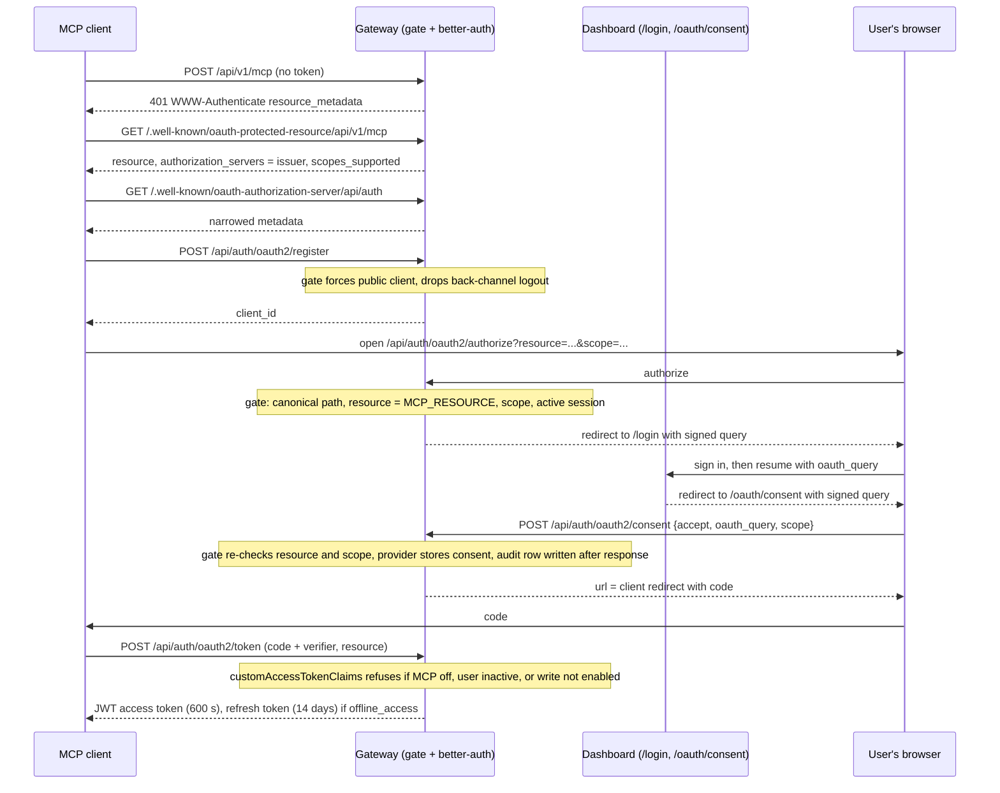
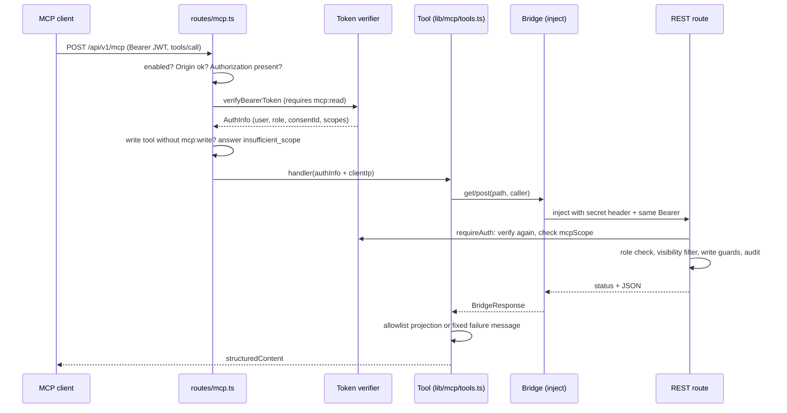

# MCP Server and OAuth 2.1 Authorization

> Indexed at commit `ae416937` on 2026-10-03 · [view on GitHub](https://github.com/yorch/auto-swe/tree/ae416937)

## Relevant source files

- [packages/gateway/src/lib/betterAuth.ts](https://github.com/yorch/auto-swe/blob/ae416937/packages/gateway/src/lib/betterAuth.ts)
- [packages/gateway/src/lib/mcpOAuth.ts](https://github.com/yorch/auto-swe/blob/ae416937/packages/gateway/src/lib/mcpOAuth.ts)
- [packages/gateway/src/lib/mcpOAuthGate.ts](https://github.com/yorch/auto-swe/blob/ae416937/packages/gateway/src/lib/mcpOAuthGate.ts)
- [packages/gateway/src/lib/mcpOAuthGateOptions.ts](https://github.com/yorch/auto-swe/blob/ae416937/packages/gateway/src/lib/mcpOAuthGateOptions.ts)
- [packages/gateway/src/lib/mcpConsentAudit.ts](https://github.com/yorch/auto-swe/blob/ae416937/packages/gateway/src/lib/mcpConsentAudit.ts)
- [packages/gateway/src/lib/mcpGrants.ts](https://github.com/yorch/auto-swe/blob/ae416937/packages/gateway/src/lib/mcpGrants.ts)
- [packages/gateway/src/lib/mcpTokenVerifier.ts](https://github.com/yorch/auto-swe/blob/ae416937/packages/gateway/src/lib/mcpTokenVerifier.ts)
- [packages/gateway/src/lib/mcpRouteOptions.ts](https://github.com/yorch/auto-swe/blob/ae416937/packages/gateway/src/lib/mcpRouteOptions.ts)
- [packages/gateway/src/lib/mcpWriteGuard.ts](https://github.com/yorch/auto-swe/blob/ae416937/packages/gateway/src/lib/mcpWriteGuard.ts)
- [packages/gateway/src/lib/mcp/bridge.ts](https://github.com/yorch/auto-swe/blob/ae416937/packages/gateway/src/lib/mcp/bridge.ts)
- [packages/gateway/src/lib/mcp/tools.ts](https://github.com/yorch/auto-swe/blob/ae416937/packages/gateway/src/lib/mcp/tools.ts)
- [packages/gateway/src/lib/mcp/projections.ts](https://github.com/yorch/auto-swe/blob/ae416937/packages/gateway/src/lib/mcp/projections.ts)
- [packages/gateway/src/lib/canonicalPath.ts](https://github.com/yorch/auto-swe/blob/ae416937/packages/gateway/src/lib/canonicalPath.ts)
- [packages/gateway/src/routes/mcp.ts](https://github.com/yorch/auto-swe/blob/ae416937/packages/gateway/src/routes/mcp.ts)
- [packages/gateway/src/routes/me.ts](https://github.com/yorch/auto-swe/blob/ae416937/packages/gateway/src/routes/me.ts)
- [packages/gateway/src/routes/users.ts](https://github.com/yorch/auto-swe/blob/ae416937/packages/gateway/src/routes/users.ts)
- [packages/gateway/src/routes/workRequests.ts](https://github.com/yorch/auto-swe/blob/ae416937/packages/gateway/src/routes/workRequests.ts)
- [packages/gateway/src/routes/workflowRuns.ts](https://github.com/yorch/auto-swe/blob/ae416937/packages/gateway/src/routes/workflowRuns.ts)
- [packages/gateway/src/plugins/auth.ts](https://github.com/yorch/auto-swe/blob/ae416937/packages/gateway/src/plugins/auth.ts)
- [packages/gateway/src/index.ts](https://github.com/yorch/auto-swe/blob/ae416937/packages/gateway/src/index.ts)
- [packages/web/src/app/oauth/consent/page.tsx](https://github.com/yorch/auto-swe/blob/ae416937/packages/web/src/app/oauth/consent/page.tsx)
- [packages/web/src/components/oauth/ConsentScreen.tsx](https://github.com/yorch/auto-swe/blob/ae416937/packages/web/src/components/oauth/ConsentScreen.tsx)
- [packages/web/src/components/settings/ConnectedAppsSection.tsx](https://github.com/yorch/auto-swe/blob/ae416937/packages/web/src/components/settings/ConnectedAppsSection.tsx)
- [packages/web/src/hooks/useOAuthConsent.ts](https://github.com/yorch/auto-swe/blob/ae416937/packages/web/src/hooks/useOAuthConsent.ts)
- [packages/web/src/hooks/useMcpGrants.ts](https://github.com/yorch/auto-swe/blob/ae416937/packages/web/src/hooks/useMcpGrants.ts)
- [packages/web/src/lib/mcpConsent.ts](https://github.com/yorch/auto-swe/blob/ae416937/packages/web/src/lib/mcpConsent.ts)
- [packages/web/src/lib/oauthQuery.ts](https://github.com/yorch/auto-swe/blob/ae416937/packages/web/src/lib/oauthQuery.ts)
- [packages/shared/src/config/registry.ts](https://github.com/yorch/auto-swe/blob/ae416937/packages/shared/src/config/registry.ts)
- [packages/shared/src/prisma/schema.prisma](https://github.com/yorch/auto-swe/blob/ae416937/packages/shared/src/prisma/schema.prisma)
- [docs/mcp-server.md](https://github.com/yorch/auto-swe/blob/ae416937/docs/mcp-server.md)
- [docs/oauth-setup.md](https://github.com/yorch/auto-swe/blob/ae416937/docs/oauth-setup.md)

## Overview

The platform lets an MCP client (a coding agent, say) act as a signed-in user. Three pieces make that work, and this page maps each to its code. An OAuth 2.1 authorization server, served by better-auth's `jwt` and `oauthProvider` plugins, issues short-lived JWT access tokens to dynamically registered public clients. A Fastify plugin, the gate, decides which of that server's endpoints exist and what a request to them may ask for. A stateless MCP endpoint at `/api/v1/mcp` is the OAuth resource server: it verifies the token on every request and exposes a small set of tools, each of which is one in-process call to an ordinary REST route.

The operator and client view (endpoints, connecting a client, settings, operations) is in [docs/mcp-server.md](https://github.com/yorch/auto-swe/blob/ae416937/docs/mcp-server.md) and the environment and sign-in setup in [docs/oauth-setup.md](https://github.com/yorch/auto-swe/blob/ae416937/docs/oauth-setup.md); this page does not restate them. It says where each rule is enforced and why the code has that shape. MCP here means the server the platform exposes. The `mcp`-type `Connection` rows administered by `routes/mcpConnections.ts` are the opposite direction, outbound servers an agent binds tools from, and are covered in [4.3-agent-layer.md](./4.3-agent-layer.md).

One design constraint runs through all of it. MCP code under `lib/mcp/**` and `routes/mcp.ts` never touches the database: a tool reaches data only through a REST route, so the route's role check, visibility filter, tenant guard and audit apply to a tool call exactly as to a REST call. The repository's invariant check enforces this by allowlisting what those files may import (see the Source invariants table in the repository's `CLAUDE.md`). Two related files that do read the database, `mcpRouteOptions.ts` and `mcpGrants.ts`, sit outside that boundary on purpose: they hold the consent and key lookups the verifier and the dashboard need.

Sources: [packages/gateway/src/routes/mcp.ts:L23-L30](https://github.com/yorch/auto-swe/blob/ae416937/packages/gateway/src/routes/mcp.ts#L23-L30) [packages/gateway/src/lib/mcp/tools.ts:L30-L36](https://github.com/yorch/auto-swe/blob/ae416937/packages/gateway/src/lib/mcp/tools.ts#L30-L36) [packages/gateway/src/lib/mcp/bridge.ts:L6-L21](https://github.com/yorch/auto-swe/blob/ae416937/packages/gateway/src/lib/mcp/bridge.ts#L6-L21)

## The authorization server

### Fixed parameters

Everything about the authorization server derives from the deployment's public base URL, so nothing is configured and nothing is read from the database at boot ([mcpOAuth.ts:L1-L8](https://github.com/yorch/auto-swe/blob/ae416937/packages/gateway/src/lib/mcpOAuth.ts#L1-L8)). The issuer is the base URL plus `/api/auth`, and the resource indicator, which is also the audience of every token, is the base URL plus `/api/v1/mcp` ([mcpOAuth.ts:L45-L60](https://github.com/yorch/auto-swe/blob/ae416937/packages/gateway/src/lib/mcpOAuth.ts#L45-L60)). `betterAuth.ts` computes both once from `BETTER_AUTH_URL` and exports them as `MCP_ISSUER` and `MCP_RESOURCE` ([betterAuth.ts:L54-L58](https://github.com/yorch/auto-swe/blob/ae416937/packages/gateway/src/lib/betterAuth.ts#L54-L58)).

| Parameter | Value | Where |
|---|---|---|
| Scopes | `mcp:read`, `mcp:write`, `offline_access` | `MCP_SCOPES` |
| Access token lifetime | 600 s | `MCP_ACCESS_TOKEN_TTL_SECONDS` |
| Refresh token lifetime | 14 days | `MCP_REFRESH_TOKEN_TTL_SECONDS` |
| Signing key rotation | every 30 days | `MCP_JWKS_ROTATION_SECONDS` |
| Rotated key stays published | 3600 s | `MCP_JWKS_GRACE_SECONDS` |
| Resource server JWKS cache | 5 minutes | `MCP_JWKS_CACHE_TTL_MS` |
| Floor between forced JWKS reads | 10 s | `MCP_JWKS_MIN_REFRESH_MS` |
| Consent skew tolerated on `iat` | 5 s | `MCP_CONSENT_SKEW_SECONDS` |

The refresh token rotates on use, and the source comment gives the intent of each lifetime: the access token is short because revocation bites at the resource server but a leak should still be bounded, and a connection unused for 14 days must be re-authorised. The grace period is sized to cover the access-token lifetime, clock skew and a resource server's JWKS cache ([mcpOAuth.ts:L16-L38](https://github.com/yorch/auto-swe/blob/ae416937/packages/gateway/src/lib/mcpOAuth.ts#L16-L38)).

### Plugin configuration

`buildAuth` adds two plugins to the same better-auth instance that serves browser sign-in. `jwt` is configured with the rotation and grace values, the issuer, and `disableSettingJwtHeader: true`, without which the plugin would sign the whole session user (email, role, `isActive`, `slackId`) into a `set-auth-jwt` header on every `/get-session` ([betterAuth.ts:L467-L478](https://github.com/yorch/auto-swe/blob/ae416937/packages/gateway/src/lib/betterAuth.ts#L467-L478)). `oauthProvider` is configured as follows ([betterAuth.ts:L479-L529](https://github.com/yorch/auto-swe/blob/ae416937/packages/gateway/src/lib/betterAuth.ts#L479-L529)):

- **Registration.** Dynamic and unauthenticated registration are on. A registering client may request only the three MCP scopes (`clientRegistrationAllowedScopes`), and a registered client is linked by default to the one resource, `MCP_RESOURCE` (`clientRegistrationDefaultResources`). The comment records why: per-client resource enforcement defaults on, and a dynamically registered client linked to no resource would fail every authorize request with `invalid_target`, so the fix is the default resource, not turning enforcement off.
- **No management surface.** `clientPrivileges` and `resourcePrivileges` both return `false`. The plugin's default lets any signed-in session create, update, delete and rotate clients, and new sign-ups exist (inactive) with magic-link sign-up on, so with no client-management UI the privilege is denied outright.
- **Grants.** Only `authorization_code` and `refresh_token`; the default `client_credentials` grant is removed because every client is public. `offline_access` is in both `scopes` and the resource's `allowedScopes`, because the plugin intersects requested scopes with the resource's list and would otherwise filter the refresh-token scope away. The resource row is seeded in `overwrite` mode so a change to the scopes reaches a row that already exists.
- **Pages.** `consentPage` is the dashboard's `/oauth/consent` and `loginPage` its `/login`, both on `CLIENT_ORIGIN`.
- **Issuance check.** `customAccessTokenClaims` runs on every JWT access-token mint, for the code grant and the refresh grant, before any refresh token is stored or rotated. It reads the two MCP settings and throws `invalid_grant` when `mcpIssuanceRefusal` returns a reason: MCP is off, the account is not active, or `mcp:write` is requested while writes are off ([mcpOAuth.ts:L62-L91](https://github.com/yorch/auto-swe/blob/ae416937/packages/gateway/src/lib/mcpOAuth.ts#L62-L91)). The comment explains the placement: an authorization can be completed on paths the gate never sees, since the plugin resumes it from the sign-in response, and this is the one place every path crosses.

PKCE is not set anywhere in the gateway's configuration. The documentation states that `S256` is required and that registration is public-client only ([docs/oauth-setup.md:L243](https://github.com/yorch/auto-swe/blob/ae416937/docs/oauth-setup.md#L243)); the enforcement itself is inside the plugin, whose package is not installed in the indexed tree, so this page cannot cite the line that does it.

The tokens are JWTs signed with EdDSA and verified as RFC 9068 access tokens (header `typ` of `at+jwt`) by the resource server, described below. Scopes appear in the `scope` claim as a space-separated string.

Sources: [packages/gateway/src/lib/mcpOAuth.ts:L10-L91](https://github.com/yorch/auto-swe/blob/ae416937/packages/gateway/src/lib/mcpOAuth.ts#L10-L91) [packages/gateway/src/lib/betterAuth.ts:L467-L529](https://github.com/yorch/auto-swe/blob/ae416937/packages/gateway/src/lib/betterAuth.ts#L467-L529) [packages/gateway/src/lib/betterAuth.ts:L54-L58](https://github.com/yorch/auto-swe/blob/ae416937/packages/gateway/src/lib/betterAuth.ts#L54-L58)

## The Fastify gate

### Why a gate and not hooks

All policy about whether and how the better-auth OAuth endpoints may be used lives in one Fastify plugin, `mcpOAuthGate`, rather than in better-auth hooks. The header comment gives the reasons: it is deterministic, it reads current settings on every request, and it does not depend on better-auth's path-matched hooks, which would miss the plugin's `continue` endpoint because that endpoint calls `authorize` internally ([mcpOAuthGate.ts:L7-L25](https://github.com/yorch/auto-swe/blob/ae416937/packages/gateway/src/lib/mcpOAuthGate.ts#L7-L25)). `index.ts` registers it, and the consent audit plugin, immediately before the better-auth handler because its hooks apply only to routes registered after it ([index.ts:L213-L216](https://github.com/yorch/auto-swe/blob/ae416937/packages/gateway/src/index.ts#L213-L216)).

The gate runs two hooks and acts only on `/api/auth` paths ([mcpOAuthGate.ts:L203-L263](https://github.com/yorch/auto-swe/blob/ae416937/packages/gateway/src/lib/mcpOAuthGate.ts#L203-L263)).

1. **`onRequest` classifies the path.** The path is first folded to its most generous reading (percent-decoded, lower-cased, repeated and trailing slashes dropped). A path that is not canonical is refused with 400 `NON_CANONICAL_PATH` before any rule runs, using `isCanonicalRequestPath`, which fails any path that URL resolution would rewrite, such as `.`/`..` segments (encoded or not) or backslashes ([canonicalPath.ts:L1-L19](https://github.com/yorch/auto-swe/blob/ae416937/packages/gateway/src/lib/canonicalPath.ts#L1-L19)). Matching on the folded form means an unusual spelling cannot escape a rule; serving on the exact path means it cannot reach an endpoint the allowlist does not name. If the folded path falls in an OAuth namespace (`/oauth2`, `/admin/oauth2`, `/.well-known`, `/jwks`, `/token`) and the exact path is not in the allowlist, the answer is 404. Allowlisted paths are 404 while `mcp.enabled` is off, and 503 if the settings cannot be read, so the gate fails closed.
2. **`preHandler` applies per-endpoint rules** once the body is parsed.

The allowlist is exactly eight paths: `/oauth2/authorize`, `/oauth2/consent`, `/oauth2/continue`, `/oauth2/token`, `/oauth2/register`, `/oauth2/revoke`, `/oauth2/public-client` and `/jwks`, each under `/api/auth` ([mcpOAuthGate.ts:L43-L58](https://github.com/yorch/auto-swe/blob/ae416937/packages/gateway/src/lib/mcpOAuthGate.ts#L43-L58)). What is deliberately not served is listed in the comment above the namespaces: client management, `get-consents`/`delete-consent`/`update-consent`, `introspect`, `userinfo`, `end-session`, the admin resource endpoints, the OIDC discovery document, and `GET /token`, the jwt plugin's session-to-JWT minting endpoint ([mcpOAuthGate.ts:L60-L67](https://github.com/yorch/auto-swe/blob/ae416937/packages/gateway/src/lib/mcpOAuthGate.ts#L60-L67)). Consent deletion in particular is withheld because revocation has to be one transaction (see below).

### Per-endpoint rules

| Endpoint | Rule | Code |
|---|---|---|
| `register` | Forced into the narrowest shape: `token_endpoint_auth_method` defaults to `none` and anything else is `invalid_client_metadata`; back-channel logout fields are refused; `application_type` defaults to `native` when every redirect URI is loopback `http` or a private-use scheme | `hardenRegistration` |
| `token` | `resource`, when present, must be exactly `MCP_RESOURCE` and not repeated; not required here | `checkResources` |
| `authorize` | `resource` required and equal to `MCP_RESOURCE`; `scope` not repeated; a POST may not also carry `scope` or `resource` in its query string, since the plugin reads the body of a POST and the query of a GET and never both | `checkAuthorization` |
| `consent`, `continue` | The same resource and scope checks run on the signed `oauth_query` the request carries, and on the `scope` the user narrowed the grant to | `checkAuthorization` |
| any of authorize, consent, continue | A session whose user is not active is refused 403 `access_denied`; no session passes, because the plugin sends the browser to log in | `checkAuthorization` |

While `mcp.writeToolsEnabled` is off, a requested scope containing `mcp:write` is `invalid_scope`, and a missing `scope` on authorize is also refused: without a scope the plugin grants the client's registered scopes, which for a registration that listed `mcp:write` includes it, and there is no way to say "everything but write" without a database read ([mcpOAuthGate.ts:L293-L314](https://github.com/yorch/auto-swe/blob/ae416937/packages/gateway/src/lib/mcpOAuthGate.ts#L293-L314)). Requiring `resource` at authorize and at the token step is also what makes the plugin's opaque, audience-less token path unreachable, which is why `customAccessTokenClaims` can be the single issuance check ([betterAuth.ts:L494-L499](https://github.com/yorch/auto-swe/blob/ae416937/packages/gateway/src/lib/betterAuth.ts#L494-L499)).

The gate also handles a resume path. The provider resumes an authorization from any endpoint whose body carries `oauth_query`; with MCP off the gate deletes that field so that sign-in just signs in ([mcpOAuthGate.ts:L232-L253](https://github.com/yorch/auto-swe/blob/ae416937/packages/gateway/src/lib/mcpOAuthGate.ts#L232-L253)).

Discovery for an issuer with a path puts the well-known segment between host and path, which better-auth cannot mount, so the gate serves `GET /.well-known/oauth-authorization-server/api/auth` itself. It calls the provider's metadata handler and passes the document through `narrowMetadata`, which drops `introspection_*` and `backchannel_logout_*` keys and sets both `token_endpoint_auth_methods_supported` and `revocation_endpoint_auth_methods_supported` to `['none']`, so a client that follows the document never walks into a 404 or a refused registration ([mcpOAuthGate.ts:L109-L129](https://github.com/yorch/auto-swe/blob/ae416937/packages/gateway/src/lib/mcpOAuthGate.ts#L109-L129), [mcpOAuthGate.ts:L407-L430](https://github.com/yorch/auto-swe/blob/ae416937/packages/gateway/src/lib/mcpOAuthGate.ts#L407-L430)).

Production wiring for the gate is in `mcpOAuthGateOptions()`: settings come from the registry (`mcp.enabled`, `mcp.writeToolsEnabled`) and the session user from `auth.api.getSession` ([mcpOAuthGateOptions.ts:L9-L25](https://github.com/yorch/auto-swe/blob/ae416937/packages/gateway/src/lib/mcpOAuthGateOptions.ts#L9-L25)).

Sources: [packages/gateway/src/lib/mcpOAuthGate.ts:L1-L433](https://github.com/yorch/auto-swe/blob/ae416937/packages/gateway/src/lib/mcpOAuthGate.ts#L1-L433) [packages/gateway/src/lib/mcpOAuthGateOptions.ts:L1-L35](https://github.com/yorch/auto-swe/blob/ae416937/packages/gateway/src/lib/mcpOAuthGateOptions.ts#L1-L35) [packages/gateway/src/lib/canonicalPath.ts:L1-L19](https://github.com/yorch/auto-swe/blob/ae416937/packages/gateway/src/lib/canonicalPath.ts#L1-L19) [packages/gateway/src/index.ts:L213-L216](https://github.com/yorch/auto-swe/blob/ae416937/packages/gateway/src/index.ts#L213-L216)

## Authorization flow

The diagram follows one client from discovery to a stored grant. The 401 challenge, the metadata documents and the registration hardening are described above; the consent page is described in the next section.

Sources: [packages/gateway/src/routes/mcp.ts:L167-L193](https://github.com/yorch/auto-swe/blob/ae416937/packages/gateway/src/routes/mcp.ts#L167-L193) [packages/gateway/src/routes/mcp.ts:L228-L237](https://github.com/yorch/auto-swe/blob/ae416937/packages/gateway/src/routes/mcp.ts#L228-L237) [packages/gateway/src/lib/mcpOAuthGate.ts:L232-L263](https://github.com/yorch/auto-swe/blob/ae416937/packages/gateway/src/lib/mcpOAuthGate.ts#L232-L263) [packages/gateway/src/lib/betterAuth.ts:L494-L513](https://github.com/yorch/auto-swe/blob/ae416937/packages/gateway/src/lib/betterAuth.ts#L494-L513)

## Consent, connected apps and revocation

### The consent screen

The authorization server redirects the browser to `/login` and then `/oauth/consent` carrying the original request in the query, plus a signature and the names of the signed parameters (`ba_param`). Whichever page the user is on sends the signed part back as `oauth_query`; parameters the page adds itself are unsigned, and including them would invalidate the signature, so `signedOAuthQuery` keeps only the signed ones. The file notes that it mirrors `buildSignedOAuthQuery` from the plugin's client package and that a test checks the two agree ([oauthQuery.ts:L1-L36](https://github.com/yorch/auto-swe/blob/ae416937/packages/web/src/lib/oauthQuery.ts#L1-L36)). The login page resumes the authorization through the same helper ([login/page.tsx:L100](https://github.com/yorch/auto-swe/blob/ae416937/packages/web/src/app/login/page.tsx#L100)).

`ConsentScreen` establishes its own session first, because the browser can arrive straight from the authorization server after a social sign-in without passing the login page. With no session it offers a sign-in link that carries the signed query back; with an unreachable gateway it offers a retry ([ConsentScreen.tsx:L32-L82](https://github.com/yorch/auto-swe/blob/ae416937/packages/web/src/components/oauth/ConsentScreen.tsx#L32-L82)). Once authenticated it shows the app's registered name marked `unverified` (the app chose it), the redirect host prominently with a warning when the redirect is loopback or an app URL scheme, and a list of what the grant allows. Read is described as seeing repositories, work requests, runs and pending approvals. The write checkbox is offered only when the request asked for `mcp:write` and the operator switch from `GET /api/v1/me/mcp-grants` says writes are enabled, and it starts unchecked. If the request included `offline_access`, the screen says the connection stays for up to 14 days between uses ([ConsentScreen.tsx:L84-L200](https://github.com/yorch/auto-swe/blob/ae416937/packages/web/src/components/oauth/ConsentScreen.tsx#L84-L200), [mcpConsent.ts:L8-L9](https://github.com/yorch/auto-swe/blob/ae416937/packages/web/src/lib/mcpConsent.ts#L8-L9)). Approve is disabled when MCP is off or when the narrowed scope would grant neither read nor write ([ConsentScreen.tsx:L116-L119](https://github.com/yorch/auto-swe/blob/ae416937/packages/web/src/components/oauth/ConsentScreen.tsx#L116-L119)).

The decision is a cookie-authenticated `POST /api/auth/oauth2/consent` carrying `accept`, `oauth_query` and, when accepting, the narrowed `scope`. The response's `url` is where the browser goes next, and `resumeUrl` refuses `javascript:`, `data:`, `vbscript:`, `blob:` and `file:` values before navigating ([useOAuthConsent.ts:L55-L87](https://github.com/yorch/auto-swe/blob/ae416937/packages/web/src/hooks/useOAuthConsent.ts#L55-L87), [mcpConsent.ts:L64-L81](https://github.com/yorch/auto-swe/blob/ae416937/packages/web/src/lib/mcpConsent.ts#L64-L81)). Cookie-authenticated POSTs, the consent decision among them, are refused by better-auth unless their `Origin` is trusted; `betterAuth.ts` pins `disableOriginCheck: false` because the library switches that check off under test runners ([betterAuth.ts:L347-L351](https://github.com/yorch/auto-swe/blob/ae416937/packages/gateway/src/lib/betterAuth.ts#L347-L351)).

The provider writes the consent row itself, so the audit record is made afterwards. `mcpConsentAudit` notes the start time of a `POST` to the consent path, and in `onResponse`, for a 200 with `accept: true`, loads the latest consent for the session user and client and writes a `ConfigAuditLog` `CREATE` row of entity type `McpGrant`. A consent row older than the request, with the provider stamping to the second, means the request resumed authorization instead of granting, and no row is written. The write is best-effort and a failure is logged ([mcpConsentAudit.ts:L23-L73](https://github.com/yorch/auto-swe/blob/ae416937/packages/gateway/src/lib/mcpConsentAudit.ts#L23-L73)).

### Connected apps

Settings has a "Connected apps" section listing the clients the user authorised, each with its redirect hosts, scopes and grant time, and a Disconnect action behind a confirmation. The section hides itself when MCP is off and nothing is connected ([ConnectedAppsSection.tsx:L25-L35](https://github.com/yorch/auto-swe/blob/ae416937/packages/web/src/components/settings/ConnectedAppsSection.tsx#L25-L35), mounted at [settings/page.tsx:L325](https://github.com/yorch/auto-swe/blob/ae416937/packages/web/src/app/settings/page.tsx#L325)). It reads `GET /api/v1/me/mcp-grants`, which returns the caller's grants plus the two operator switches, so the OAuth endpoints themselves stay free of settings lookups, and revokes through `DELETE /api/v1/me/mcp-grants/:clientId`. Both routes require `ENGINEER` and operate on the caller's own `sub`. The delete is deliberately independent of `mcp.enabled`: a user can always take access back, and it answers 404 only when there was nothing to revoke ([me.ts:L59-L103](https://github.com/yorch/auto-swe/blob/ae416937/packages/gateway/src/routes/me.ts#L59-L103), [useMcpGrants.ts:L23-L37](https://github.com/yorch/auto-swe/blob/ae416937/packages/web/src/hooks/useMcpGrants.ts#L23-L37)).

### Revocation

Deleting the consent row is not revocation, and `revokeMcpGrants` exists because of that. The refresh grant checks neither the consent nor the account's grants, so a refresh token would outlive its consent, and a later consent by the same client would revive every refresh token it was ever issued ([mcpGrants.ts:L3-L16](https://github.com/yorch/auto-swe/blob/ae416937/packages/gateway/src/lib/mcpGrants.ts#L3-L16)). So revocation is one transaction that, for the (user, client) pair or for all of a user's clients, does the following ([mcpGrants.ts:L83-L152](https://github.com/yorch/auto-swe/blob/ae416937/packages/gateway/src/lib/mcpGrants.ts#L83-L152)):

1. deletes the consent rows;
2. marks every stored refresh token and access token revoked;
3. deletes pending authorization codes, found by scanning `verification` rows whose value contains the user id and parsing the JSON for `type: authorization_code`, because the code grant never looks for a consent and an unexchanged code could otherwise be traded for a refresh token after the disconnect;
4. writes a `DELETE` audit row per consent, or, when tokens or codes outlived their consent, one row keyed by the user id.

JWT access tokens are not stored, so there is nothing to mark for them. They stop working at the resource server, which requires the consent row to exist, and in any case expire within 600 seconds. Every consent deletion goes through this function. Besides the user's own disconnect, deactivating a user revokes all of that user's grants in the same transaction as the `isActive: false` update, and any request that sets `isActive: false` revokes, since the operation is idempotent ([users.ts:L370-L379](https://github.com/yorch/auto-swe/blob/ae416937/packages/gateway/src/routes/users.ts#L370-L379)).

Sources: [packages/web/src/components/oauth/ConsentScreen.tsx:L32-L238](https://github.com/yorch/auto-swe/blob/ae416937/packages/web/src/components/oauth/ConsentScreen.tsx#L32-L238) [packages/web/src/lib/mcpConsent.ts:L1-L86](https://github.com/yorch/auto-swe/blob/ae416937/packages/web/src/lib/mcpConsent.ts#L1-L86) [packages/web/src/lib/oauthQuery.ts:L1-L36](https://github.com/yorch/auto-swe/blob/ae416937/packages/web/src/lib/oauthQuery.ts#L1-L36) [packages/gateway/src/lib/mcpConsentAudit.ts:L1-L74](https://github.com/yorch/auto-swe/blob/ae416937/packages/gateway/src/lib/mcpConsentAudit.ts#L1-L74) [packages/gateway/src/lib/mcpGrants.ts:L1-L153](https://github.com/yorch/auto-swe/blob/ae416937/packages/gateway/src/lib/mcpGrants.ts#L1-L153) [packages/gateway/src/routes/me.ts:L59-L103](https://github.com/yorch/auto-swe/blob/ae416937/packages/gateway/src/routes/me.ts#L59-L103)

## The MCP endpoint as a resource server

### Mounting and the switch

`mcpRoutes` is registered unconditionally, after `mcpBridgePlugin` has put the bridge on the root instance, and `mcp.enabled` is read per request: a disabled deployment answers 404 from every route, so the switch needs no restart ([index.ts:L217-L224](https://github.com/yorch/auto-swe/blob/ae416937/packages/gateway/src/index.ts#L217-L224)). The route's `onRequest` hook runs before the body is parsed, so a disabled endpoint answers 404 whatever the request carries, not 415, 400 or 413, and an unreadable setting answers 503 ([mcp.ts:L143-L165](https://github.com/yorch/auto-swe/blob/ae416937/packages/gateway/src/routes/mcp.ts#L143-L165)).

The handler is the MCP SDK's `createMcpHandler`, stateless: the factory runs once per HTTP request with the verified token, so the tool list is decided per request. It advertises no subscription capability (`maxSubscriptions: 0`) and answers `GET` and `DELETE` with 405 in the stateless fallback; the response mode is `auto` ([mcp.ts:L125-L141](https://github.com/yorch/auto-swe/blob/ae416937/packages/gateway/src/routes/mcp.ts#L125-L141)). The route accepts `GET`, `POST` and `DELETE` at the resource path ([mcp.ts:L280-L285](https://github.com/yorch/auto-swe/blob/ae416937/packages/gateway/src/routes/mcp.ts#L280-L285)).

### Protected resource metadata

RFC 9728 metadata is served at the path-inserted URL clients derive from the resource identifier and at the root. It names the resource `auto-swe MCP`, the issuer as the one authorization server, and the scopes the server accepts now: `mcp:read` alone, plus `mcp:write` only while writes are enabled. If the issuer is neither HTTPS nor localhost the SDK refuses to build the document and the route answers 500 with a log line, which points at a misconfigured `BETTER_AUTH_URL` ([mcp.ts:L52-L55](https://github.com/yorch/auto-swe/blob/ae416937/packages/gateway/src/routes/mcp.ts#L52-L55), [mcp.ts:L167-L193](https://github.com/yorch/auto-swe/blob/ae416937/packages/gateway/src/routes/mcp.ts#L167-L193)).

### The request path

`serve` handles a request in a fixed order ([mcp.ts:L195-L279](https://github.com/yorch/auto-swe/blob/ae416937/packages/gateway/src/routes/mcp.ts#L195-L279)):

1. Build a web `Request` from the configured resource origin, never from the `Host` header, because a client-chosen host that is not a valid authority would make the constructor throw.
2. Refuse a browser `Origin` that is not in `allowedOriginHostnames`, which is the hostnames of the CORS origins plus the resource URL; a request with no `Origin` passes ([mcpRouteOptions.ts:L69-L72](https://github.com/yorch/auto-swe/blob/ae416937/packages/gateway/src/lib/mcpRouteOptions.ts#L69-L72)).
3. With no `Authorization` header, answer 401 with `Bearer scope="mcp:read", resource_metadata="..."` and no error code, as RFC 6750 section 3.1 specifies.
4. Verify the bearer token with the shared verifier, requiring `mcp:read`. A refusal (`OAuthError`) becomes the SDK's challenge response; any other failure, such as unreadable keys or database, is logged and answered 500, not 401.
5. Step-up: when writes are enabled, the token lacks `mcp:write` and the body calls a write tool (checked across a JSON-RPC batch), answer with an `insufficient_scope` challenge naming `mcp:write`, instead of reporting the tool as unknown. With writes off the tool does not exist, and asking for the scope would send the user round a consent that is refused.
6. Stamp the client IP onto the verified `AuthInfo` and hand it to the handler, so the inner REST call is rate limited as the client is.

### The token verifier

`createMcpTokenVerifier` is the single answer to whether a token is good, shared by the MCP route and by `requireAuth` for bridged calls. Its checks, in order ([mcpTokenVerifier.ts:L172-L255](https://github.com/yorch/auto-swe/blob/ae416937/packages/gateway/src/lib/mcpTokenVerifier.ts#L172-L255)):

1. **Shape and type.** The header must decode; `typ` must be `at+jwt` or `application/at+jwt`, case-insensitively; and `kid` must be a non-empty string. An opaque token, an ID token or a session token is refused before any key is read.
2. **Signature, issuer, expiry.** Algorithm `EdDSA` only, the configured issuer, and required claims `exp`, `iat` and `sub`, checked against a local JWK set.
3. **Audience.** Exactly one audience, equal to `MCP_RESOURCE`.
4. **Caller.** `sub` is a string, a client id comes from `client_id` or `azp`, and `exp`, `iat` and `scope` are well-typed. Only `mcp:read` and `mcp:write` are kept from the scope claim.
5. **Database state, on every call.** The latest consent for the (user, client), the client's `disabled` flag, the live user, and the write switch are loaded together. No consent, a disabled or missing client, or an inactive user rejects. A consent whose `updatedAt` is later than the token's `iat` by more than 5 seconds supersedes the token, so a step-up re-consent invalidates tokens issued before it.
6. **Effective scopes.** The intersection of the token's scopes, the scopes the user consented to, and what the operator allows (`mcp:write` only while writes are on); `mcp:write` implies `mcp:read`.

The returned `AuthInfo` carries `clientId`, the token's expiry, the scopes, and `extra` with `consentId`, the user's **current** role and `userId`. Rejection reasons (`expired`, `bad-signature`, `wrong-audience`, `no-consent`, `consent-superseded` and so on) go to an `onReject` callback for logs and tests; the caller always receives only "Invalid access token" ([mcpTokenVerifier.ts:L30-L42](https://github.com/yorch/auto-swe/blob/ae416937/packages/gateway/src/lib/mcpTokenVerifier.ts#L30-L42), [mcpTokenVerifier.ts:L118-L121](https://github.com/yorch/auto-swe/blob/ae416937/packages/gateway/src/lib/mcpTokenVerifier.ts#L118-L121)).

Key handling is in `createJwksCache`. Keys are read in process, with no HTTP, through `auth.api.getJwks()` ([mcpRouteOptions.ts:L79-L82](https://github.com/yorch/auto-swe/blob/ae416937/packages/gateway/src/lib/mcpRouteOptions.ts#L79-L82)). The cache holds them for 5 minutes and coalesces concurrent loads into one in-flight read. A token naming a `kid` the cache lacks is the normal first sight of a rotated key, so a `JWKSNoMatchingKey` error forces one re-read and a retry; forced re-reads are floored at one per 10 seconds, after which the cache answers however many unknown keys arrive, so a stream of random `kid`s cannot become a stream of reads ([mcpTokenVerifier.ts:L72-L116](https://github.com/yorch/auto-swe/blob/ae416937/packages/gateway/src/lib/mcpTokenVerifier.ts#L72-L116), [mcpTokenVerifier.ts:L140-L170](https://github.com/yorch/auto-swe/blob/ae416937/packages/gateway/src/lib/mcpTokenVerifier.ts#L140-L170)). The grace period of an hour is what lets a rotated-out key keep verifying tokens a cache has not yet refreshed.

### Identity and how it differs from other credentials

An MCP token authenticates a user through a client the user consented to. The user's role is read from the database on each verification through `loadTokenUser`, which has a 30-second per-process cache of up to 2000 users, so a demotion or deactivation applies to MCP within that window on a replica that did not handle the change ([auth.ts:L223-L247](https://github.com/yorch/auto-swe/blob/ae416937/packages/gateway/src/plugins/auth.ts#L223-L247)). The role is never copied into the token, so a demoted user does not keep the old role for the token's lifetime.

| | Session cookie | Personal access token | MCP access token |
|---|---|---|---|
| Presented as | better-auth cookie | `Authorization: Bearer` with the PAT prefix | `Authorization: Bearer` JWT, `typ at+jwt` |
| Accepted at | Every REST route (path 2 of `requireAuth`) | Every REST route (path 1) | `/api/v1/mcp`, and a REST route only via the bridge, on a route that declares `mcpScope` |
| Issued by | Sign-in | Settings, API tokens | The OAuth server, after user consent |
| Lifetime | Session | Until revoked | 600 s, refreshable for 14 days |
| Scope | The user's role | The user's role | `mcp:read` / `mcp:write`, also bounded by the user's role and the operator switches |
| Revocation | Sign-out | Revoke the token | Disconnect the app, deactivate the user, or disable the client; effective on the next request |

A token sent directly to a REST route is refused: without the bridge header it takes the PAT/API-JWT path and fails there, and with the header it must also carry the per-boot secret ([bridge.ts:L10-L18](https://github.com/yorch/auto-swe/blob/ae416937/packages/gateway/src/lib/mcp/bridge.ts#L10-L18)). A PAT is explicitly refused on the bridged path ([auth.ts:L616-L623](https://github.com/yorch/auto-swe/blob/ae416937/packages/gateway/src/plugins/auth.ts#L616-L623)).

Sources: [packages/gateway/src/routes/mcp.ts:L1-L286](https://github.com/yorch/auto-swe/blob/ae416937/packages/gateway/src/routes/mcp.ts#L1-L286) [packages/gateway/src/lib/mcpTokenVerifier.ts:L1-L257](https://github.com/yorch/auto-swe/blob/ae416937/packages/gateway/src/lib/mcpTokenVerifier.ts#L1-L257) [packages/gateway/src/lib/mcpRouteOptions.ts:L60-L105](https://github.com/yorch/auto-swe/blob/ae416937/packages/gateway/src/lib/mcpRouteOptions.ts#L60-L105) [packages/gateway/src/plugins/auth.ts:L210-L247](https://github.com/yorch/auto-swe/blob/ae416937/packages/gateway/src/plugins/auth.ts#L210-L247)

## The tool bridge

A tool never touches data. It makes an in-process `fastify.inject()` call to the same route a REST client would call, through the bridge, and two properties make that safe ([bridge.ts:L6-L21](https://github.com/yorch/auto-swe/blob/ae416937/packages/gateway/src/lib/mcp/bridge.ts#L6-L21)).

1. The inner call re-presents the caller's own access token, and `requireAuth` verifies it again with the same verifier. Identity is never asserted in a header, so the secret alone grants nothing.
2. `requireAuth` accepts an MCP token only on a call that carries the per-boot secret and on a route that declares `config.mcpScope`. The secret is 32 random bytes drawn when the bridge is built, held in a closure, never configured or persisted, so two processes never share one and a restart changes it. Comparison hashes both sides first, so `timingSafeEqual` always gets equal-length inputs ([bridge.ts:L71-L80](https://github.com/yorch/auto-swe/blob/ae416937/packages/gateway/src/lib/mcp/bridge.ts#L71-L80), [bridge.ts:L115-L120](https://github.com/yorch/auto-swe/blob/ae416937/packages/gateway/src/lib/mcp/bridge.ts#L115-L120)).

The inner request is built from scratch; nothing the client sent is forwarded, and the client's address is the one thing taken from the outer request, so the global rate limit counts the inner call against the client ([bridge.ts:L92-L105](https://github.com/yorch/auto-swe/blob/ae416937/packages/gateway/src/lib/mcp/bridge.ts#L92-L105)).

`authenticateBridgedCall` is the receiving end. It runs first in `requireAuth`, decided by the presence of the header and not its value, so no malformed value can fall through to the PAT or session paths. In order: the header must be the process secret (403), the route must declare `mcpScope` (403), the credential must be a `Bearer` token that is not a PAT (401), the shared verifier must accept it (401), and its effective scopes must include `mcp:write` or `mcp:read` as the route declares (403 `INSUFFICIENT_SCOPE`). The resulting identity is the verified user with their current role ([auth.ts:L588-L650](https://github.com/yorch/auto-swe/blob/ae416937/packages/gateway/src/plugins/auth.ts#L588-L650), [auth.ts:L661-L670](https://github.com/yorch/auto-swe/blob/ae416937/packages/gateway/src/plugins/auth.ts#L661-L670)). Seven route declarations opt in:

| Route | `mcpScope` | Tool |
|---|---|---|
| `GET /repositories` | read | `list_repositories` |
| `GET /work-requests` | read | `list_work_requests` |
| `GET /workflow-runs` | read | `list_runs` |
| `GET /workflow-runs/:id` | read | `get_run` |
| `GET /human-steps` | read | `list_pending_human_steps` |
| `POST /work-requests` | write | `submit_work_request` |
| `POST /workflow-runs/:id/cancel` | write | `cancel_run` |

The seven declarations are at [repositories.ts:L373](https://github.com/yorch/auto-swe/blob/ae416937/packages/gateway/src/routes/repositories.ts#L373), [workRequests.ts:L314](https://github.com/yorch/auto-swe/blob/ae416937/packages/gateway/src/routes/workRequests.ts#L314), [workRequests.ts:L369](https://github.com/yorch/auto-swe/blob/ae416937/packages/gateway/src/routes/workRequests.ts#L369), [workflowRuns.ts:L193](https://github.com/yorch/auto-swe/blob/ae416937/packages/gateway/src/routes/workflowRuns.ts#L193), [workflowRuns.ts:L257](https://github.com/yorch/auto-swe/blob/ae416937/packages/gateway/src/routes/workflowRuns.ts#L257), [workflowRuns.ts:L480](https://github.com/yorch/auto-swe/blob/ae416937/packages/gateway/src/routes/workflowRuns.ts#L480) and [humanSteps.ts:L142](https://github.com/yorch/auto-swe/blob/ae416937/packages/gateway/src/routes/humanSteps.ts#L142). The mapping of the run-detail GET to `get_run` rests on the `/api/v1/workflow-runs/${runId}` path the tool calls ([tools.ts:L278](https://github.com/yorch/auto-swe/blob/ae416937/packages/gateway/src/lib/mcp/tools.ts#L278)); the declarations above are the routes' own markers.

Sources: [packages/gateway/src/lib/mcp/bridge.ts:L1-L182](https://github.com/yorch/auto-swe/blob/ae416937/packages/gateway/src/lib/mcp/bridge.ts#L1-L182) [packages/gateway/src/plugins/auth.ts:L588-L670](https://github.com/yorch/auto-swe/blob/ae416937/packages/gateway/src/plugins/auth.ts#L588-L670)

## Tools

### Which tools exist for a request

`createMcpToolServer` is called per request with the verified `AuthInfo`. A caller without `mcp:read` sees no tools; the write tools are registered only when the scopes include `mcp:write`, which the verifier grants only while writes are enabled and the user consented ([tools.ts:L637-L657](https://github.com/yorch/auto-swe/blob/ae416937/packages/gateway/src/lib/mcp/tools.ts#L637-L657)). The server is named `auto-swe` and reports `MCP_SERVER_VERSION`, `1.0.0` ([mcpRouteOptions.ts:L11-L12](https://github.com/yorch/auto-swe/blob/ae416937/packages/gateway/src/lib/mcpRouteOptions.ts#L11-L12)).

### Read tools

All five are `GET`s declared read-only and idempotent. Each tool chooses the request, runs it through the bridge, validates the REST body with a schema that names only the fields it uses, and reduces it to an allowlisted result ([tools.ts:L108-L157](https://github.com/yorch/auto-swe/blob/ae416937/packages/gateway/src/lib/mcp/tools.ts#L108-L157)).

| Tool | Route called | Inputs | Notes |
|---|---|---|---|
| `list_repositories` | `/api/v1/repositories` | `limit` 1-100 (default 50 as sent), `offset` | Keeps only `git_repo` connections after the route has counted them |
| `list_work_requests` | `/api/v1/work-requests` | paging, `ticket` (1-200 chars) | No descriptions or requester names; `isMine` is computed from the caller |
| `list_runs` | `/api/v1/workflow-runs` | paging, `status`, `workRequestId` | Status enum is `RUNNING`, `SUCCESS`, `FAILED`, `TIMED_OUT`, `CANCELLED`, `SKIPPED` |
| `get_run` | `/api/v1/workflow-runs/:id` | `runId` | Steps as node, status, attempt; PR link only on a configured GitHub host; no errors, inputs, outputs or traces |
| `list_pending_human_steps` | `/api/v1/human-steps` | none | At most 100, with `truncated` when a full page may hide more; the answer to a step is not returned |

Failures never relay the route's text. `failureFor` maps a status to a fixed message (401 "reconnect", 403, 404, 429, 5xx), because a REST error can echo input or name what exists, and a thrown error is turned into the generic 500 message for the same reason ([tools.ts:L70-L95](https://github.com/yorch/auto-swe/blob/ae416937/packages/gateway/src/lib/mcp/tools.ts#L70-L95)). A run the caller cannot see is a 404, as in REST.

Because a tool result enters a model's context, `projections.ts` treats anything written by another person as a prompt-injection channel. Every projection is an allowlist of identifiers, enums, numbers, timestamps, one validated URL and a few short team-authored names (template, node, human step title). Those names are clipped and stripped of format characters (zero-width and bidi controls, private use, the U+E0000 tag block, unpaired surrogates), and control characters become spaces ([projections.ts:L1-L30](https://github.com/yorch/auto-swe/blob/ae416937/packages/gateway/src/lib/mcp/projections.ts#L1-L30)). A pull request link in `get_run` is trusted only on a GitHub host the platform is configured for: the instance's own and each distinct `githubUrl` on an active connection, cached for 60 seconds ([mcpRouteOptions.ts:L22-L58](https://github.com/yorch/auto-swe/blob/ae416937/packages/gateway/src/lib/mcpRouteOptions.ts#L22-L58)).

### Write tools

Both write tools call a route that bounds them itself, so the tool is never the control ([tools.ts:L30-L36](https://github.com/yorch/auto-swe/blob/ae416937/packages/gateway/src/lib/mcp/tools.ts#L30-L36)). Neither can approve, merge or answer a human step; no tool does.

- **`submit_work_request`** takes `description` (1 to 20,000 characters), `externalTicketId`, `repoId` and a required `idempotencyKey` of 8 to 128 characters from `A-Za-z0-9._:~-`. It posts `{description, externalTicketId, repoIds: [repoId]}` to `/api/v1/work-requests` with the key as the `Idempotency-Key` header. A 409 `WORKFLOW_ALREADY_EXISTS` is reported as `already_running` rather than a failure; otherwise the result is `started` or `already_submitted` with the `workRequestId` ([tools.ts:L390-L450](https://github.com/yorch/auto-swe/blob/ae416937/packages/gateway/src/lib/mcp/tools.ts#L390-L450), [ticketId.ts:L10](https://github.com/yorch/auto-swe/blob/ae416937/packages/gateway/src/lib/ticketId.ts#L10)). The run launches under the caller's identity, so with per-user GitHub credentials enabled it can push and open pull requests with the user's own token.
- **`cancel_run`** takes exactly one of `runId` or `workRequestId`. A `runId` is one cancel call. A `workRequestId` lists the work request's running runs in pages of 100, cancels only those the caller launched (`isMine`), and reports the others in `notCancelled` with a reason to use their own `runId`. Listing repeats in rounds until a pass finds no own running run not yet tried, because offset paging over a changing list can skip one. A 429, a 401, or a 403 with `MCP_WRITE_DISABLED` or `INSUFFICIENT_SCOPE` stops the loop and marks the rest not attempted; the result is `CANCELLED`, `PARTIAL`, or an error when nothing was cancelled ([tools.ts:L452-L635](https://github.com/yorch/auto-swe/blob/ae416937/packages/gateway/src/lib/mcp/tools.ts#L452-L635)).

Write refusals are translated by `writeFailure` into fixed messages by status and, where several share one, by the route's error code: 402 means the organization's monthly budget is used up; 403 `MCP_WRITE_DISABLED`; 409 for an idempotency key still starting or a run not in a cancellable state; 422 for a key reused for a different request; 429 `MCP_RUN_CAP_REACHED` versus the burst limit ([tools.ts:L341-L383](https://github.com/yorch/auto-swe/blob/ae416937/packages/gateway/src/lib/mcp/tools.ts#L341-L383)).

### Write guards in the route

The guards live in `mcpWriteGuard.ts`, called by `POST /work-requests` and `POST /workflow-runs/:id/cancel`, and act only when the request is bridged; REST and CLI callers pass straight through. This is so that a leaked bridge secret plus a valid write token gets exactly what the tool gets and no more ([mcpWriteGuard.ts:L10-L22](https://github.com/yorch/auto-swe/blob/ae416937/packages/gateway/src/lib/mcpWriteGuard.ts#L10-L22)). `assertMcpWriteAllowed` runs first in the handler and in particular ahead of the idempotency replay, and checks in order ([mcpWriteGuard.ts:L116-L171](https://github.com/yorch/auto-swe/blob/ae416937/packages/gateway/src/lib/mcpWriteGuard.ts#L116-L171)):

1. `mcp.writeToolsEnabled`, else 403 `MCP_WRITE_DISABLED`. Settings are read per call, and if they cannot be read the call is a 500: a guard that cannot tell what is allowed must not allow.
2. A per-user sliding one-minute burst limit of `mcp.writeCallsPerMinute` calls, counting every attempt whether refused or not, else 429 `MCP_WRITE_RATE_LIMITED`. The window is an in-process map, swept when it exceeds 10,000 users ([mcpWriteGuard.ts:L42-L62](https://github.com/yorch/auto-swe/blob/ae416937/packages/gateway/src/lib/mcpWriteGuard.ts#L42-L62)).
3. For a submit only: the budget tier must be `STANDARD`, else 422 `MCP_BUDGET_TIER_NOT_ALLOWED`.
4. For a submit only: an `Idempotency-Key` is required, else 422 `MCP_IDEMPOTENCY_KEY_REQUIRED`.
5. The concurrency cap, returned as a `LaunchGuard` rather than checked here, because a check before the insert is racy. `launchTrackedWorkflow` runs it inside the transaction that writes the ledger rows, under `pg_advisory_xact_lock` keyed by the user, counting the user's non-terminal `ActiveWorkflow` rows whatever launched them. At or over `mcp.maxConcurrentRuns` the route answers 429 `MCP_RUN_CAP_REACHED`; a retry that raced its own first submit is answered as a replay instead ([mcpWriteGuard.ts:L69-L90](https://github.com/yorch/auto-swe/blob/ae416937/packages/gateway/src/lib/mcpWriteGuard.ts#L69-L90), [workRequests.ts:L700-L725](https://github.com/yorch/auto-swe/blob/ae416937/packages/gateway/src/routes/workRequests.ts#L700-L725)).

Each bridged write is audited. `mcpWriteBegin` opens a record in `preValidation`, so a malformed body is audited too, and `mcpWriteAuditHook` writes an `McpToolCall` audit row in `onSend`: the user, the consent id as entity id, the OAuth client id and name, the tool, a SHA-256 digest of the input (never its text), the status and error code, and the resulting ids. One row per guarded attempt, refusals included. It is best-effort, and a failure is logged and never changes the response ([mcpWriteGuard.ts:L183-L267](https://github.com/yorch/auto-swe/blob/ae416937/packages/gateway/src/lib/mcpWriteGuard.ts#L183-L267)).

Sources: [packages/gateway/src/lib/mcp/tools.ts:L30-L657](https://github.com/yorch/auto-swe/blob/ae416937/packages/gateway/src/lib/mcp/tools.ts#L30-L657) [packages/gateway/src/lib/mcp/projections.ts:L1-L40](https://github.com/yorch/auto-swe/blob/ae416937/packages/gateway/src/lib/mcp/projections.ts#L1-L40) [packages/gateway/src/lib/mcpWriteGuard.ts:L1-L268](https://github.com/yorch/auto-swe/blob/ae416937/packages/gateway/src/lib/mcpWriteGuard.ts#L1-L268) [packages/gateway/src/routes/workRequests.ts:L365-L398](https://github.com/yorch/auto-swe/blob/ae416937/packages/gateway/src/routes/workRequests.ts#L365-L398) [packages/gateway/src/routes/workflowRuns.ts:L253-L280](https://github.com/yorch/auto-swe/blob/ae416937/packages/gateway/src/routes/workflowRuns.ts#L253-L280)

## Settings, limits and defaults

Four registry settings control the surface. All are ADMIN-only, have no per-scope override (`overridableAt: []`), do not need a restart and are not pinned to a run ([registry.ts:L194-L244](https://github.com/yorch/auto-swe/blob/ae416937/packages/shared/src/config/registry.ts#L194-L244)).

| Setting | Default | Bound | Read by |
|---|---|---|---|
| `mcp.enabled` | `false` | boolean | gate, endpoint, issuance check, `me.ts` |
| `mcp.writeToolsEnabled` | `false` | boolean | gate, endpoint, verifier, issuance check, write guard |
| `mcp.writeCallsPerMinute` | `10` | positive integer, at most 600 | write guard |
| `mcp.maxConcurrentRuns` | `2` | positive integer, at most 50 | write guard |

Other limits in the code: the gateway's global rate limit of 200 requests per minute, keyed by user where the identity is verified and by client IP otherwise, applies to the endpoint and, through the bridge's `remoteAddress`, to the inner call ([index.ts:L131-L136](https://github.com/yorch/auto-swe/blob/ae416937/packages/gateway/src/index.ts#L131-L136)); the settings cache is about 30 seconds; paging is 1 to 100 per page; the human-step listing is capped at 100.

Sources: [packages/shared/src/config/registry.ts:L194-L244](https://github.com/yorch/auto-swe/blob/ae416937/packages/shared/src/config/registry.ts#L194-L244) [packages/gateway/src/index.ts:L128-L136](https://github.com/yorch/auto-swe/blob/ae416937/packages/gateway/src/index.ts#L128-L136) [packages/gateway/src/lib/mcpOAuth.ts:L10-L43](https://github.com/yorch/auto-swe/blob/ae416937/packages/gateway/src/lib/mcpOAuth.ts#L10-L43)

## Diagram: a tool call

Sources: [packages/gateway/src/routes/mcp.ts:L195-L279](https://github.com/yorch/auto-swe/blob/ae416937/packages/gateway/src/routes/mcp.ts#L195-L279) [packages/gateway/src/lib/mcp/bridge.ts:L82-L113](https://github.com/yorch/auto-swe/blob/ae416937/packages/gateway/src/lib/mcp/bridge.ts#L82-L113) [packages/gateway/src/plugins/auth.ts:L607-L650](https://github.com/yorch/auto-swe/blob/ae416937/packages/gateway/src/plugins/auth.ts#L607-L650) [packages/gateway/src/lib/mcp/tools.ts:L108-L157](https://github.com/yorch/auto-swe/blob/ae416937/packages/gateway/src/lib/mcp/tools.ts#L108-L157)

## Limitations

The living doc keeps the operator-facing list in [docs/mcp-server.md](https://github.com/yorch/auto-swe/blob/ae416937/docs/mcp-server.md#L278); the points below are what reading the code adds or sharpens.

- **Two verifications and several reads per tool call.** The route verifies the token, and `requireAuth` verifies it again on the inner call. Each verification queries the consent and the client on every call; only the user lookup is cached, for 30 seconds. A tool call therefore costs at least two rounds of those reads, and `cancel_run` by work request adds a round per own run it attempts, plus the listing calls ([mcpRouteOptions.ts:L83-L101](https://github.com/yorch/auto-swe/blob/ae416937/packages/gateway/src/lib/mcpRouteOptions.ts#L83-L101), [mcpTokenVerifier.ts:L216-L222](https://github.com/yorch/auto-swe/blob/ae416937/packages/gateway/src/lib/mcpTokenVerifier.ts#L216-L222)).
- **Only the newest consent counts.** `loadGrant` takes the latest consent row for the pair by `updatedAt`, so scopes are per client and not per resource or repository. Consent is read or write, not narrower ([mcpRouteOptions.ts:L85-L90](https://github.com/yorch/auto-swe/blob/ae416937/packages/gateway/src/lib/mcpRouteOptions.ts#L85-L90)).
- **No path deletes a registered client.** Registration is anonymous and open, and a search of the gateway, shared and worker sources found no code outside tests that deletes an `OauthClient`; the only brake is the global per-IP rate limit, and the only per-client switch is the `disabled` flag the verifier reads. Abandoned registrations accumulate.
- **Access tokens cannot be revoked individually.** JWT access tokens are not stored, so the only controls are removing the consent, disabling the client, deactivating the user, or waiting out the 600 seconds. The stored-token revocation in `revokeMcpGrants` covers refresh tokens and any opaque access token the plugin might have stored ([mcpGrants.ts:L13-L16](https://github.com/yorch/auto-swe/blob/ae416937/packages/gateway/src/lib/mcpGrants.ts#L13-L16)).
- **A grant audit can be missing.** The consent audit row is written after the response, best-effort, from what the provider stored, and only for accepted decisions that granted something. A failed write leaves a grant with no `CREATE` row ([mcpConsentAudit.ts:L7-L14](https://github.com/yorch/auto-swe/blob/ae416937/packages/gateway/src/lib/mcpConsentAudit.ts#L7-L14)).
- **Pending-code deletion is a text scan.** Revocation finds authorization codes by selecting `verification` rows whose value contains the user id and then parsing each as JSON. It is correct for the stored shape but is a substring scan of a table not designed for it ([mcpGrants.ts:L101-L110](https://github.com/yorch/auto-swe/blob/ae416937/packages/gateway/src/lib/mcpGrants.ts#L101-L110)).
- **Per-process state.** The burst window, the JWKS cache, the user cache and the GitHub host cache are in memory per gateway process, so limits and propagation delays multiply with replicas. The bridge secret is per process by design, which is safe only because an inner call is made in the same process ([mcpWriteGuard.ts:L42-L47](https://github.com/yorch/auto-swe/blob/ae416937/packages/gateway/src/lib/mcpWriteGuard.ts#L42-L47), [bridge.ts:L73-L77](https://github.com/yorch/auto-swe/blob/ae416937/packages/gateway/src/lib/mcp/bridge.ts#L73-L77)).
- **PKCE enforcement is not visible in this tree.** The gateway sets no PKCE option; the documentation says `S256` is required, but the line that enforces it is inside the plugin, which is not part of the indexed source.
- **Gate allowlist is exact and case-sensitive on the raw path.** The allowlist matches the unfolded path, so a differently cased spelling of an allowed endpoint is a 404 and not a served request. That is the safe direction, but a client that normalises case would be refused ([mcpOAuthGate.ts:L216-L222](https://github.com/yorch/auto-swe/blob/ae416937/packages/gateway/src/lib/mcpOAuthGate.ts#L216-L222)).
- **Tools expose a fixed surface.** Five read tools and two write tools; resources and prompts are not exposed, and a personal access token cannot authenticate to the endpoint, so a headless agent without a browser has no way to connect. Browser-hosted clients are refused by the `Origin` check unless their hostname is in the deployment's CORS set ([mcp.ts:L222-L226](https://github.com/yorch/auto-swe/blob/ae416937/packages/gateway/src/routes/mcp.ts#L222-L226), [docs/mcp-server.md:L278](https://github.com/yorch/auto-swe/blob/ae416937/docs/mcp-server.md#L278)).

Sources: [packages/gateway/src/lib/mcpRouteOptions.ts:L60-L105](https://github.com/yorch/auto-swe/blob/ae416937/packages/gateway/src/lib/mcpRouteOptions.ts#L60-L105) [packages/gateway/src/lib/mcpGrants.ts:L1-L110](https://github.com/yorch/auto-swe/blob/ae416937/packages/gateway/src/lib/mcpGrants.ts#L1-L110) [packages/gateway/src/lib/mcpConsentAudit.ts:L1-L74](https://github.com/yorch/auto-swe/blob/ae416937/packages/gateway/src/lib/mcpConsentAudit.ts#L1-L74) [packages/gateway/src/lib/mcpOAuthGate.ts:L203-L230](https://github.com/yorch/auto-swe/blob/ae416937/packages/gateway/src/lib/mcpOAuthGate.ts#L203-L230)

## Related Pages

- Parent: [Gateway API](./3-gateway-api.md)
- Sibling: [HTTP routes](./3.1-http-routes.md)
- Sibling: [Authentication and RBAC](./3.2-authentication-and-rbac.md)
- Sibling: [GitHub and webhooks](./3.3-github-and-webhooks.md)
- Sibling: [Repository access and credentials](./3.4-repository-access-and-credentials.md)
- Dashboard side of consent and connected apps: [App routes and pages](./5.1-app-routes-and-pages.md)
