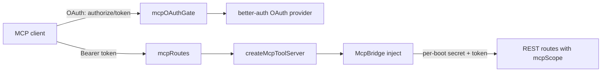

# MCP Server, OAuth Authorization Server, and Outbound MCP Connections

> Indexed at commit `d0a90fb5` on 2026-10-06 · [view on GitHub](https://github.com/yorch/auto-swe/tree/d0a90fb5)

## Relevant source files

- [packages/gateway/src/routes/mcp.ts](https://github.com/yorch/auto-swe/blob/d0a90fb5/packages/gateway/src/routes/mcp.ts)
- [packages/gateway/src/lib/mcp/bridge.ts](https://github.com/yorch/auto-swe/blob/d0a90fb5/packages/gateway/src/lib/mcp/bridge.ts)
- [packages/gateway/src/lib/mcp/tools.ts](https://github.com/yorch/auto-swe/blob/d0a90fb5/packages/gateway/src/lib/mcp/tools.ts)
- [packages/gateway/src/lib/mcpOAuthGate.ts](https://github.com/yorch/auto-swe/blob/d0a90fb5/packages/gateway/src/lib/mcpOAuthGate.ts)
- [packages/gateway/src/lib/mcpProbe.ts](https://github.com/yorch/auto-swe/blob/d0a90fb5/packages/gateway/src/lib/mcpProbe.ts)
- [packages/gateway/src/routes/mcpConnections.ts](https://github.com/yorch/auto-swe/blob/d0a90fb5/packages/gateway/src/routes/mcpConnections.ts)
- [packages/shared/src/lib/mcpHeaders.ts](https://github.com/yorch/auto-swe/blob/d0a90fb5/packages/shared/src/lib/mcpHeaders.ts)
- [packages/worker/src/agents/mcpTools.ts](https://github.com/yorch/auto-swe/blob/d0a90fb5/packages/worker/src/agents/mcpTools.ts)
- [packages/worker/src/lib/config/mcpConnection.ts](https://github.com/yorch/auto-swe/blob/d0a90fb5/packages/worker/src/lib/config/mcpConnection.ts)

## Overview

The Model Context Protocol (MCP) appears in the platform in two opposite directions. Inbound, the gateway is an MCP server: external MCP clients authenticate through an OAuth 2.1 authorization server hosted by the gateway and call a small set of tools that mirror REST routes. Outbound, a worker agent can bind the tools of an administrator-registered MCP server, stored as an `mcp`-type `Connection`, into an implementer run.

The two directions share no runtime code, but both treat the credential as the thing to protect. The inbound side never lets a tool touch the database; the outbound side never lets a stored secret leave its connection's origin.

## Inbound MCP endpoint

`mcpRoutes` mounts a stateless Streamable HTTP server that is an OAuth 2.1 resource server. It is mounted unconditionally, and `mcp.enabled` is read per request in an `onRequest` hook, so a disabled deployment answers 404 on every route before the body is parsed, and a settings read failure answers 503 ([routes/mcp.ts:L150-L165](https://github.com/yorch/auto-swe/blob/d0a90fb5/packages/gateway/src/routes/mcp.ts#L150-L165)). The route serves `GET`, `POST` and `DELETE` at the resource path and publishes RFC 9728 protected-resource metadata at the path-inserted and root `.well-known` URLs ([routes/mcp.ts:L167-L193](https://github.com/yorch/auto-swe/blob/d0a90fb5/packages/gateway/src/routes/mcp.ts#L167-L193)). The advertised scopes are `mcp:read`, plus `mcp:write` only while `mcp.writeToolsEnabled` is on ([routes/mcp.ts:L53-L55](https://github.com/yorch/auto-swe/blob/d0a90fb5/packages/gateway/src/routes/mcp.ts#L53-L55)).

The `serve` handler applies checks in a fixed order ([routes/mcp.ts:L195-L279](https://github.com/yorch/auto-swe/blob/d0a90fb5/packages/gateway/src/routes/mcp.ts#L195-L279)). It builds the web `Request` from the configured resource origin rather than the `Host` header, validates any browser `Origin` against `allowedOriginHostnames`, answers 401 with a `WWW-Authenticate` challenge when no `Authorization` header is present, and verifies the bearer token with `verifyBearerToken`. A token without `mcp:write` that calls a write tool receives an `insufficient_scope` challenge naming the scope to request, but only while writes are enabled. The verified `AuthInfo` is stamped with the client address through `withClientIp` before the SDK handler runs.

The handler is created with `maxSubscriptions: 0`, so no long-lived subscription streams are held, and `responseMode: 'auto'` ([routes/mcp.ts:L127-L138](https://github.com/yorch/auto-swe/blob/d0a90fb5/packages/gateway/src/routes/mcp.ts#L127-L138)). SDK errors that are a client's fault log at debug; anything else logs at error, and only the error, never the request ([routes/mcp.ts:L89-L106](https://github.com/yorch/auto-swe/blob/d0a90fb5/packages/gateway/src/routes/mcp.ts#L89-L106)).

Sources: [packages/gateway/src/routes/mcp.ts:L108-L286](https://github.com/yorch/auto-swe/blob/d0a90fb5/packages/gateway/src/routes/mcp.ts#L108-L286) [docs/mcp-server.md](https://github.com/yorch/auto-swe/blob/d0a90fb5/docs/mcp-server.md)

## Tools and the REST bridge

`createMcpToolServer` runs per HTTP request and decides which tools exist from the verified token: a caller without `mcp:read` sees none, and the write tools are registered only with `mcp:write` ([lib/mcp/tools.ts:L643-L657](https://github.com/yorch/auto-swe/blob/d0a90fb5/packages/gateway/src/lib/mcp/tools.ts#L643-L657)). The read tools are `list_repositories`, `list_work_requests`, `list_runs`, `get_run` and `list_pending_human_steps`; the write tools, named in `WRITE_TOOL_NAMES`, are `submit_work_request` and `cancel_run` ([lib/mcp/tools.ts:L332](https://github.com/yorch/auto-swe/blob/d0a90fb5/packages/gateway/src/lib/mcp/tools.ts#L332)).

A tool never reads data itself. It calls the bridge, which issues an in-process `app.inject()` to the same REST route a REST client would hit, so role gates, visibility filters, tenant guards, rate limits and audit writes apply unchanged ([lib/mcp/bridge.ts:L6-L21](https://github.com/yorch/auto-swe/blob/d0a90fb5/packages/gateway/src/lib/mcp/bridge.ts#L6-L21)). Each tool then reduces the response to an allowlisted shape using the Zod schemas in [lib/mcp/projections.ts](https://github.com/yorch/auto-swe/blob/d0a90fb5/packages/gateway/src/lib/mcp/projections.ts), which also removes invisible characters (format, private-use and tag-block characters, unpaired surrogates) from text fields and turns control characters and line separators into spaces ([projections.ts:L22-L25](https://github.com/yorch/auto-swe/blob/d0a90fb5/packages/gateway/src/lib/mcp/projections.ts#L22-L25)).

Two properties keep the bridge safe. The inner call re-presents the caller's own access token, and `requireAuth` verifies it again with the same verifier, so identity is never asserted in a header. A per-boot secret, 32 random bytes held in a closure and compared with `timingSafeEqual` over SHA-256 digests, marks an inner call, and `requireAuth` accepts an MCP token only on a call carrying that secret to a route declaring `config.mcpScope` ([lib/mcp/bridge.ts:L78-L144](https://github.com/yorch/auto-swe/blob/d0a90fb5/packages/gateway/src/lib/mcp/bridge.ts#L78-L144)). The inner request is built from scratch; the only value taken from the outer request is the client address, so the global rate limit counts the call against the real client.

Sources: [packages/gateway/src/lib/mcp/bridge.ts](https://github.com/yorch/auto-swe/blob/d0a90fb5/packages/gateway/src/lib/mcp/bridge.ts) [packages/gateway/src/lib/mcp/tools.ts:L28-L47](https://github.com/yorch/auto-swe/blob/d0a90fb5/packages/gateway/src/lib/mcp/tools.ts#L28-L47)

## OAuth authorization server gate

The authorization server itself is the better-auth OAuth provider; `mcpOAuthGate` is a single Fastify plugin holding all policy about whether and how its endpoints may be used. It registers app-wide `onRequest` and `preHandler` hooks and acts only on `/api/auth` paths ([mcpOAuthGate.ts:L1-L25](https://github.com/yorch/auto-swe/blob/d0a90fb5/packages/gateway/src/lib/mcpOAuthGate.ts#L1-L25)).

The `onRequest` hook refuses non-canonical path spellings with 400, answers 404 for every OAuth-namespace path outside an exact allowlist, and answers 404 for the allowlisted ones while `mcp.enabled` is off ([mcpOAuthGate.ts:L203-L230](https://github.com/yorch/auto-swe/blob/d0a90fb5/packages/gateway/src/lib/mcpOAuthGate.ts#L203-L230)). The allowlist is `authorize`, `consent`, `continue`, `token`, `register`, `revoke`, `public-client` and `jwks` ([mcpOAuthGate.ts:L44-L57](https://github.com/yorch/auto-swe/blob/d0a90fb5/packages/gateway/src/lib/mcpOAuthGate.ts#L44-L57)). Introspection, userinfo, consent management, client management and the jwt plugin's session-to-token endpoint are not reachable. A settings failure fails closed with 503.

The `preHandler` hook applies per-endpoint rules once the body is parsed ([mcpOAuthGate.ts:L232-L263](https://github.com/yorch/auto-swe/blob/d0a90fb5/packages/gateway/src/lib/mcpOAuthGate.ts#L232-L263)):

| Endpoint | Rule |
| -------- | ---- |
| `authorize`, `consent`, `continue` | `resource` must be present, unrepeated and equal to the MCP resource (for `consent` and `continue` this applies to the signed `oauth_query` when the body carries one); `scope` must not be repeated and may not include `mcp:write` while writes are off; an inactive account gets `access_denied` |
| `token` | any `resource` must equal the MCP resource |
| `register` | registration is forced to a public client, back-channel logout is refused, and loopback-redirect clients default to `application_type: native` |

The audience and scope checks are in `checkResources` and `checkScope` ([mcpOAuthGate.ts:L266-L316](https://github.com/yorch/auto-swe/blob/d0a90fb5/packages/gateway/src/lib/mcpOAuthGate.ts#L266-L316)). For a `POST` to `authorize`, the gate refuses `scope` or `resource` in the query string, so the parameters it checks are exactly the ones the provider reads ([mcpOAuthGate.ts:L316-L346](https://github.com/yorch/auto-swe/blob/d0a90fb5/packages/gateway/src/lib/mcpOAuthGate.ts#L316-L346)). With MCP disabled, an `oauth_query` carried by a sign-in body is deleted so sign-in only signs in ([mcpOAuthGate.ts:L232-L252](https://github.com/yorch/auto-swe/blob/d0a90fb5/packages/gateway/src/lib/mcpOAuthGate.ts#L232-L252)).

The gate also serves RFC 8414 discovery at the root for an issuer with a path. `narrowMetadata` removes introspection and back-channel-logout keys and restricts both token and revocation client authentication to `none`, so the published document matches what the gate permits ([mcpOAuthGate.ts:L117-L129](https://github.com/yorch/auto-swe/blob/d0a90fb5/packages/gateway/src/lib/mcpOAuthGate.ts#L117-L129), [mcpOAuthGate.ts:L409-L430](https://github.com/yorch/auto-swe/blob/d0a90fb5/packages/gateway/src/lib/mcpOAuthGate.ts#L409-L430)).

Sources: [packages/gateway/src/lib/mcpOAuthGate.ts](https://github.com/yorch/auto-swe/blob/d0a90fb5/packages/gateway/src/lib/mcpOAuthGate.ts)

## Diagram

## Outbound MCP connections

An administrator manages `mcp` connections through `mcpConnectionRoutes`, all gated by `requireAuth({ requiredRole: 'ADMIN' })`: list, create, edit, delete, and `POST /mcp-connections/:id/test` ([routes/mcpConnections.ts:L160-L173](https://github.com/yorch/auto-swe/blob/d0a90fb5/packages/gateway/src/routes/mcpConnections.ts#L160-L173)). The create schema accepts `url` (http or https), an optional `bearerToken`, up to five custom `headers`, optional `listTimeoutMs` and `callTimeoutMs`, and an `allowPrivateNetwork` flag ([routes/mcpConnections.ts:L37-L67](https://github.com/yorch/auto-swe/blob/d0a90fb5/packages/gateway/src/routes/mcpConnections.ts#L37-L67)). Edit accepts `clearBearerToken`, which cannot be combined with a new token, and a header list where a row without a `value` keeps the stored value of that name ([routes/mcpConnections.ts:L75-L100](https://github.com/yorch/auto-swe/blob/d0a90fb5/packages/gateway/src/routes/mcpConnections.ts#L75-L100)).

The token is encrypted into the `apiKey*` envelope columns, and responses expose only `hasToken` and header names; `headersUnreadable` reports a row that cannot be opened ([routes/mcpConnections.ts:L104-L141](https://github.com/yorch/auto-swe/blob/d0a90fb5/packages/gateway/src/routes/mcpConnections.ts#L104-L141)). Create and edit run `checkProbeUrl(url, { allowPrivate })` and answer 400 `UNSAFE_URL` on refusal, then `validateMcpHeaders`, answering 400 `INVALID_HEADERS` ([routes/mcpConnections.ts:L315-L335](https://github.com/yorch/auto-swe/blob/d0a90fb5/packages/gateway/src/routes/mcpConnections.ts#L315-L335)). The private-network opt-in follows the connector guard semantics: private ranges only, never loopback, link-local, unspecified or metadata addresses ([routes/mcpConnections.ts:L29-L35](https://github.com/yorch/auto-swe/blob/d0a90fb5/packages/gateway/src/routes/mcpConnections.ts#L29-L35)).

Custom headers are validated by `validateMcpHeaders` in the shared package: at most `MAX_MCP_HEADERS` (5), names that are RFC 7230 tokens and unique case-insensitively, and values of visible ASCII up to 2048 characters ([mcpHeaders.ts:L18-L84](https://github.com/yorch/auto-swe/blob/d0a90fb5/packages/shared/src/lib/mcpHeaders.ts#L18-L84)). `Authorization`, `Cookie`, `Set-Cookie`, `Host`, `Content-Type`, `Content-Length`, `Accept`, `Last-Event-ID`, the hop-by-hop names (`Connection`, `Keep-Alive`, `TE`, `Trailer`, `Transfer-Encoding`, `Upgrade`), any `proxy-*` name, and the MCP session and protocol headers are forbidden ([mcpHeaders.ts:L31-L62](https://github.com/yorch/auto-swe/blob/d0a90fb5/packages/shared/src/lib/mcpHeaders.ts#L31-L62)). The set is sealed as one AES-256-GCM envelope by `sealMcpHeaders`, and `openMcpHeaders` re-validates on read and throws a fixed message when the envelope is unreadable ([mcpHeaders.ts:L87-L152](https://github.com/yorch/auto-swe/blob/d0a90fb5/packages/shared/src/lib/mcpHeaders.ts#L87-L152)).

The test endpoint uses `probeMcpServer`, which initializes a session, lists tools, and returns only fixed messages and up to 12 tool names, with the timeout capped at 60 seconds ([mcpProbe.ts:L36-L42](https://github.com/yorch/auto-swe/blob/d0a90fb5/packages/gateway/src/lib/mcpProbe.ts#L36-L42)). Its `send` helper refuses any target outside the connection's origin, never follows redirects, lets protocol and token headers win over custom ones, and maps blocked-network and authentication failures to fixed text ([mcpProbe.ts:L269-L330](https://github.com/yorch/auto-swe/blob/d0a90fb5/packages/gateway/src/lib/mcpProbe.ts#L269-L330)).

Sources: [packages/gateway/src/routes/mcpConnections.ts](https://github.com/yorch/auto-swe/blob/d0a90fb5/packages/gateway/src/routes/mcpConnections.ts) [packages/shared/src/lib/mcpHeaders.ts](https://github.com/yorch/auto-swe/blob/d0a90fb5/packages/shared/src/lib/mcpHeaders.ts) [packages/gateway/src/lib/mcpProbe.ts](https://github.com/yorch/auto-swe/blob/d0a90fb5/packages/gateway/src/lib/mcpProbe.ts)

## Worker-side loading

`resolveAgentMcpUrl` returns a target only when the resolved agent enables the `mcp` tool key and references an active `mcp` connection; every failure yields `null` so the activity degrades to built-in tools ([mcpConnection.ts:L117-L138](https://github.com/yorch/auto-swe/blob/d0a90fb5/packages/worker/src/lib/config/mcpConnection.ts#L117-L138)). `mcpUrlForConnection` reads `config.url`, the optional timeouts and `allowPrivateNetwork`, decrypts the bearer token and headers, and defines both as non-enumerable properties so a spread, `JSON.stringify` or log of the target cannot carry them. An undecryptable token or header set yields no tools rather than an unauthenticated connection ([mcpConnection.ts:L45-L109](https://github.com/yorch/auto-swe/blob/d0a90fb5/packages/worker/src/lib/config/mcpConnection.ts#L45-L109)).

`loadMcpTools` validates the URL with `checkProbeUrl` (http and https only, so stdio servers are unsupported), builds an `MCPClient` with a unique id per load, lists tools under a timeout (default 15 s list, 60 s per call), and returns them keyed `mcp_<name>` with audit wrapping ([mcpTools.ts:L272-L350](https://github.com/yorch/auto-swe/blob/d0a90fb5/packages/worker/src/agents/mcpTools.ts#L272-L350)). It never throws: an invalid server reference records an `mcp.invalid_ref` event and a failed connection an `mcp.connect_failed` event, and either returns an empty tool set.

The fetch chosen for the client determines credential handling. With a token or headers, `bearerFetch` attaches the token only to the server's own origin, strips `authorization` for any other origin, applies custom headers through `applyMcpHeaders`, and rejects any 3xx response ([mcpTools.ts:L124-L146](https://github.com/yorch/auto-swe/blob/d0a90fb5/packages/worker/src/agents/mcpTools.ts#L124-L146)). Without credentials, `guardedMcpFetch` resolves, checks and pins every request and follows redirects by hand through `fetchGuarded`, re-checking each hop ([mcpTools.ts:L166-L181](https://github.com/yorch/auto-swe/blob/d0a90fb5/packages/worker/src/agents/mcpTools.ts#L166-L181)). In both cases `originScopedFetch` applies the private-network opt-in to the connection's own origin only ([mcpTools.ts:L154-L156](https://github.com/yorch/auto-swe/blob/d0a90fb5/packages/worker/src/agents/mcpTools.ts#L154-L156)).

Sources: [packages/worker/src/agents/mcpTools.ts](https://github.com/yorch/auto-swe/blob/d0a90fb5/packages/worker/src/agents/mcpTools.ts) [packages/worker/src/lib/config/mcpConnection.ts](https://github.com/yorch/auto-swe/blob/d0a90fb5/packages/worker/src/lib/config/mcpConnection.ts)

## Related Pages

- Parent: [Gateway API](./3-gateway-api.md)
- Sibling: [HTTP Routes](./3.1-http-routes.md)
- Sibling: [Authentication and RBAC](./3.2-authentication-and-rbac.md)
- Sibling: [GitHub and Webhooks](./3.3-github-and-webhooks.md)
- Sibling: [Repository Access and Credentials](./3.4-repository-access-and-credentials.md)
- Sibling: [Work Views and PR Lifecycle](./3.6-work-views-and-pr-lifecycle.md)
