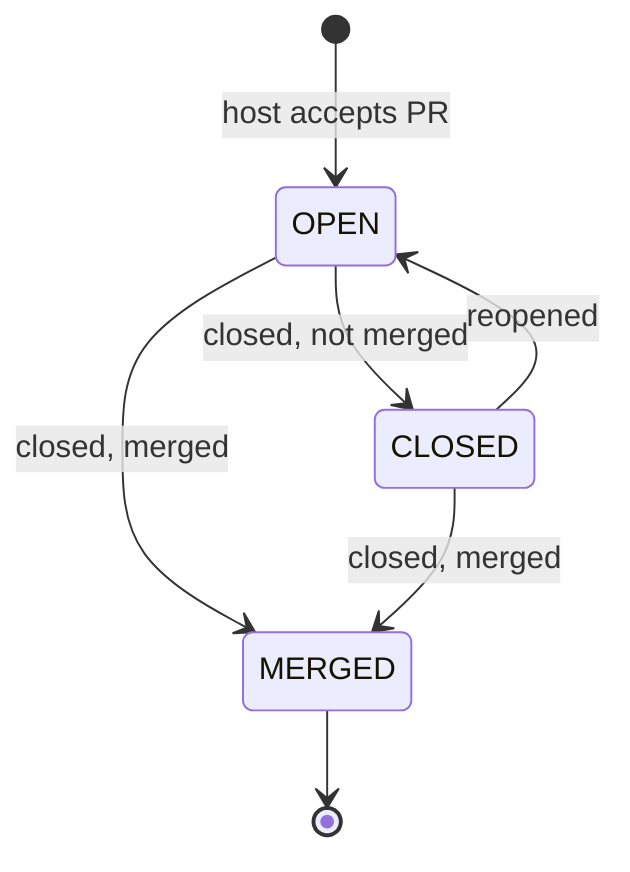

# Work Views and Pull-Request Lifecycle

> Indexed at commit `d0a90fb5` on 2026-10-06 · [view on GitHub](https://github.com/yorch/auto-swe/tree/d0a90fb5)

## Relevant source files

- [packages/gateway/src/routes/pullRequests.ts](https://github.com/yorch/auto-swe/blob/d0a90fb5/packages/gateway/src/routes/pullRequests.ts)
- [packages/gateway/src/routes/tickets.ts](https://github.com/yorch/auto-swe/blob/d0a90fb5/packages/gateway/src/routes/tickets.ts)
- [packages/shared/src/lib/pullRequest.ts](https://github.com/yorch/auto-swe/blob/d0a90fb5/packages/shared/src/lib/pullRequest.ts)
- [packages/shared/src/lib/requestInFlight.ts](https://github.com/yorch/auto-swe/blob/d0a90fb5/packages/shared/src/lib/requestInFlight.ts)
- [packages/worker/src/activities/createOrUpdatePullRequest.ts](https://github.com/yorch/auto-swe/blob/d0a90fb5/packages/worker/src/activities/createOrUpdatePullRequest.ts)
- [packages/worker/src/activities/scheduledFireAuthorization.ts](https://github.com/yorch/auto-swe/blob/d0a90fb5/packages/worker/src/activities/scheduledFireAuthorization.ts)
- [packages/gateway/src/routes/workRequests.ts](https://github.com/yorch/auto-swe/blob/d0a90fb5/packages/gateway/src/routes/workRequests.ts)
- [packages/gateway/src/routes/webhooks.ts](https://github.com/yorch/auto-swe/blob/d0a90fb5/packages/gateway/src/routes/webhooks.ts)
- [packages/web/src/app/pull-requests/page.tsx](https://github.com/yorch/auto-swe/blob/d0a90fb5/packages/web/src/app/pull-requests/page.tsx)
- [packages/web/src/app/tickets/page.tsx](https://github.com/yorch/auto-swe/blob/d0a90fb5/packages/web/src/app/tickets/page.tsx)
- [docs/work-views.md](https://github.com/yorch/auto-swe/blob/d0a90fb5/docs/work-views.md)

## Overview

Two dashboard views answer "which pull requests are open and where do they stand" and "what happened under this ticket". Both read data the platform already records: one `PullRequest` row per PR the platform opens, linked to an `ActiveWorkflow` ledger row ([docs/work-views.md:L10-L25](https://github.com/yorch/auto-swe/blob/d0a90fb5/docs/work-views.md#L10-L25)). This page covers the PR state model, how a re-push reuses or refuses a PR, the webhook transitions, the two list APIs, and the overlap checks that keep two executions of one request from fighting over a branch.

## Implementation

### PR states and shared helpers

`PULL_REQUEST_STATES` is `OPEN`, `MERGED`, `CLOSED`, where `CLOSED` means closed without merging ([packages/shared/src/lib/pullRequest.ts:L7-L9](https://github.com/yorch/auto-swe/blob/d0a90fb5/packages/shared/src/lib/pullRequest.ts#L7-L9)). Host titles are untrusted, so `clampPullRequestTitle` trims and caps them at 300 code points ([L12-L21](https://github.com/yorch/auto-swe/blob/d0a90fb5/packages/shared/src/lib/pullRequest.ts#L12-L21)). `pullRequestUrl` is the single link derivation: it builds the address from the repository's own web base and returns null for a missing part or a non-http(s) base ([L37-L50](https://github.com/yorch/auto-swe/blob/d0a90fb5/packages/shared/src/lib/pullRequest.ts#L37-L50)).

Sources: [packages/shared/src/lib/pullRequest.ts:L1-L50](https://github.com/yorch/auto-swe/blob/d0a90fb5/packages/shared/src/lib/pullRequest.ts#L1-L50)

### PR reuse and the close guard

`createOrUpdatePullRequest` first resolves the execution's own ledger row, falling back to any row of the request ([packages/worker/src/activities/createOrUpdatePullRequest.ts:L59-L68](https://github.com/yorch/auto-swe/blob/d0a90fb5/packages/worker/src/activities/createOrUpdatePullRequest.ts#L59-L68)). It then loads the latest PR on that row, any status ([L74-L82](https://github.com/yorch/auto-swe/blob/d0a90fb5/packages/worker/src/activities/createOrUpdatePullRequest.ts#L74-L82)). A `CLOSED` result throws a non-retryable `PR_CLOSED_BY_REVIEWER` failure rather than opening a replacement, since a close is a decision ([L83-L88](https://github.com/yorch/auto-swe/blob/d0a90fb5/packages/worker/src/activities/createOrUpdatePullRequest.ts#L83-L88)).

If the latest PR is `OPEN` it is updated; if it is merged or absent, the newest `OPEN` PR of the same request and repository is adopted ([L89-L99](https://github.com/yorch/auto-swe/blob/d0a90fb5/packages/worker/src/activities/createOrUpdatePullRequest.ts#L89-L99)). Updating re-arms `ciStatus = PENDING`, records the new `headSha`, and moves an adopted PR onto the executing workflow's row so the CI webhook signals the right execution ([L117-L127](https://github.com/yorch/auto-swe/blob/d0a90fb5/packages/worker/src/activities/createOrUpdatePullRequest.ts#L117-L127)). When a draft was promised and the PR has since been marked ready, the activity refuses to push onto it ([L110-L113](https://github.com/yorch/auto-swe/blob/d0a90fb5/packages/worker/src/activities/createOrUpdatePullRequest.ts#L110-L113)).

Sources: [packages/worker/src/activities/createOrUpdatePullRequest.ts:L59-L127](https://github.com/yorch/auto-swe/blob/d0a90fb5/packages/worker/src/activities/createOrUpdatePullRequest.ts#L59-L127)

### Webhook transitions

`normalizeGitHubPullRequestEvent` maps a `pull_request` payload to a domain event: merged or closed, `reopened`, a draft toggle on `ready_for_review` or `converted_to_draft`, and a retitle on `edited` with a clamped title; every other action is ignored ([packages/gateway/src/routes/webhooks.ts:L142-L175](https://github.com/yorch/auto-swe/blob/d0a90fb5/packages/gateway/src/routes/webhooks.ts#L142-L175)). The handler updates only an existing row; with none it answers "No tracked pull request" ([L440-L444](https://github.com/yorch/auto-swe/blob/d0a90fb5/packages/gateway/src/routes/webhooks.ts#L440-L444)).

Each status change is an `updateMany` guarded on the current status: close from `OPEN`, reopen from `CLOSED` ([L446-L456](https://github.com/yorch/auto-swe/blob/d0a90fb5/packages/gateway/src/routes/webhooks.ts#L446-L456)). A merge is claimed by an atomic `OPEN|CLOSED -> MERGED` update, so only the delivery that wins signals the workflow and a duplicate delivery no-ops ([L554-L567](https://github.com/yorch/auto-swe/blob/d0a90fb5/packages/gateway/src/routes/webhooks.ts#L554-L567)). A close without merge does not signal the workflow ([docs/work-views.md:L53](https://github.com/yorch/auto-swe/blob/d0a90fb5/docs/work-views.md#L53)).

Sources: [packages/gateway/src/routes/webhooks.ts:L142-L175](https://github.com/yorch/auto-swe/blob/d0a90fb5/packages/gateway/src/routes/webhooks.ts#L142-L175) [packages/gateway/src/routes/webhooks.ts:L440-L567](https://github.com/yorch/auto-swe/blob/d0a90fb5/packages/gateway/src/routes/webhooks.ts#L440-L567) [docs/work-views.md:L46-L72](https://github.com/yorch/auto-swe/blob/d0a90fb5/docs/work-views.md#L46-L72)

### GET /pull-requests

The route requires the `ENGINEER` role and accepts `state`, `draft`, `repoId`, `teamId`, `scope` (default `MINE`) and a case-insensitive `ticket` substring ([packages/gateway/src/routes/pullRequests.ts:L16-L24](https://github.com/yorch/auto-swe/blob/d0a90fb5/packages/gateway/src/routes/pullRequests.ts#L16-L24)). Non-admins see only PRs on repositories `reachableConnections` allows ([L45-L49](https://github.com/yorch/auto-swe/blob/d0a90fb5/packages/gateway/src/routes/pullRequests.ts#L45-L49)). Ledger-derived fields (ticket, request, cost) are read only when the ledger row is on the same repository ([L96-L97](https://github.com/yorch/auto-swe/blob/d0a90fb5/packages/gateway/src/routes/pullRequests.ts#L96-L97)), and `latestRun` only for runs passing `buildWorkflowRunVisibilityFilter` ([L98-L111](https://github.com/yorch/auto-swe/blob/d0a90fb5/packages/gateway/src/routes/pullRequests.ts#L98-L111)). Results sort by `openedAt` then `id`, descending ([L88](https://github.com/yorch/auto-swe/blob/d0a90fb5/packages/gateway/src/routes/pullRequests.ts#L88)).

Sources: [packages/gateway/src/routes/pullRequests.ts:L16-L141](https://github.com/yorch/auto-swe/blob/d0a90fb5/packages/gateway/src/routes/pullRequests.ts#L16-L141)

### GET /tickets and generated ticket ids

`GET /tickets` groups `RunInput` rows by `externalTicketId` in the database, ordered by the newest request's `createdAt`, with `take`/`skip` paging and a second `groupBy` for `meta.total` ([packages/gateway/src/routes/tickets.ts:L155-L166](https://github.com/yorch/auto-swe/blob/d0a90fb5/packages/gateway/src/routes/tickets.ts#L155-L166)). A request is visible to its requester, to anyone who sees one of its runs, or to anyone who reaches a repository it touches ([L91-L100](https://github.com/yorch/auto-swe/blob/d0a90fb5/packages/gateway/src/routes/tickets.ts#L91-L100)).

Unless `includeAutomated` is set, the list excludes requests with agent-run or channel runs and requests flagged `ticketIsSynthetic`, the marker for platform-generated ids that are correlation keys rather than tracker tickets ([L127-L148](https://github.com/yorch/auto-swe/blob/d0a90fb5/packages/gateway/src/routes/tickets.ts#L127-L148)). Tracker `title`, `status` and `url` come from `ContextSnapshot.rawTicketData`, capped at 300 characters, and the link is returned only for http(s) ([L26-L55](https://github.com/yorch/auto-swe/blob/d0a90fb5/packages/gateway/src/routes/tickets.ts#L26-L55)). Generated ids skip tracker syncs entirely ([docs/work-views.md:L129-L147](https://github.com/yorch/auto-swe/blob/d0a90fb5/docs/work-views.md#L129-L147)).

Sources: [packages/gateway/src/routes/tickets.ts:L18-L166](https://github.com/yorch/auto-swe/blob/d0a90fb5/packages/gateway/src/routes/tickets.ts#L18-L166) [docs/work-views.md:L106-L147](https://github.com/yorch/auto-swe/blob/d0a90fb5/docs/work-views.md#L106-L147)

### Retry and scheduled-fire overlap checks

A re-run and a scheduled fire push the same branch, so a second execution would adopt and re-link the first's PR. `liveInFlightExecution` finds non-terminal `ActiveWorkflow` rows for a request, excluding the schedule anchor `SCHEDULED`, and with `ignoreFires` also every `sched-` row ([packages/shared/src/lib/requestInFlight.ts:L133-L146](https://github.com/yorch/auto-swe/blob/d0a90fb5/packages/shared/src/lib/requestInFlight.ts#L133-L146)). Because a ledger row is only a claim, each candidate is judged: a row updated within `RECONCILE_GRACE_MS` is trusted, otherwise Temporal is asked with a timeout; a finished workflow has its row closed, and an unreachable Temporal yields a blocking `unconfirmed` result, so the check fails closed ([L28-L58](https://github.com/yorch/auto-swe/blob/d0a90fb5/packages/shared/src/lib/requestInFlight.ts#L28-L58)). `confirmInFlight` applies the same verdict to one row the workflow-id allocator named ([L87-L106](https://github.com/yorch/auto-swe/blob/d0a90fb5/packages/shared/src/lib/requestInFlight.ts#L87-L106)).

The retry route calls `liveInFlightExecution` first and answers `409 WORKFLOW_ALREADY_EXISTS` while a run is live ([packages/gateway/src/routes/workRequests.ts:L957-L967](https://github.com/yorch/auto-swe/blob/d0a90fb5/packages/gateway/src/routes/workRequests.ts#L957-L967)); the same 409 code is returned when Temporal cannot be reached to confirm whether a run has finished ([L942-L948](https://github.com/yorch/auto-swe/blob/d0a90fb5/packages/gateway/src/routes/workRequests.ts#L942-L948)). It then confirms any row the allocator refuses on, retrying allocation up to three times ([L986-L997](https://github.com/yorch/auto-swe/blob/d0a90fb5/packages/gateway/src/routes/workRequests.ts#L986-L997)). The scheduled-fire side calls the same function with `ignoreFires: true` and refuses with reason `request-in-flight`, skipping that tick ([packages/worker/src/activities/scheduledFireAuthorization.ts:L280-L291](https://github.com/yorch/auto-swe/blob/d0a90fb5/packages/worker/src/activities/scheduledFireAuthorization.ts#L280-L291)). A skip logs at info level rather than warn ([L307-L312](https://github.com/yorch/auto-swe/blob/d0a90fb5/packages/worker/src/activities/scheduledFireAuthorization.ts#L307-L312)). The two checks read then act without a lock, so near-simultaneous launches can still overlap ([docs/work-views.md:L209-L230](https://github.com/yorch/auto-swe/blob/d0a90fb5/docs/work-views.md#L209-L230)).

Sources: [packages/shared/src/lib/requestInFlight.ts:L28-L162](https://github.com/yorch/auto-swe/blob/d0a90fb5/packages/shared/src/lib/requestInFlight.ts#L28-L162) [packages/gateway/src/routes/workRequests.ts:L957-L997](https://github.com/yorch/auto-swe/blob/d0a90fb5/packages/gateway/src/routes/workRequests.ts#L957-L997) [packages/worker/src/activities/scheduledFireAuthorization.ts:L276-L312](https://github.com/yorch/auto-swe/blob/d0a90fb5/packages/worker/src/activities/scheduledFireAuthorization.ts#L276-L312)

## Usage

The dashboard pages keep their filters in the address. `/pull-requests` reads `state` from the query and treats an absent value as Open ([packages/web/src/app/pull-requests/page.tsx:L40-L41](https://github.com/yorch/auto-swe/blob/d0a90fb5/packages/web/src/app/pull-requests/page.tsx#L40-L41), [L109](https://github.com/yorch/auto-swe/blob/d0a90fb5/packages/web/src/app/pull-requests/page.tsx#L109)). `/tickets` reads `automated=1` into `includeAutomated` and shows a "Hide automated runs" checkbox checked by default ([packages/web/src/app/tickets/page.tsx:L24](https://github.com/yorch/auto-swe/blob/d0a90fb5/packages/web/src/app/tickets/page.tsx#L24), [L76-L78](https://github.com/yorch/auto-swe/blob/d0a90fb5/packages/web/src/app/tickets/page.tsx#L76-L78)). Known gaps live in [docs/work-views.md:L190-L251](https://github.com/yorch/auto-swe/blob/d0a90fb5/docs/work-views.md#L190-L251).

Sources: [packages/web/src/app/pull-requests/page.tsx:L28-L112](https://github.com/yorch/auto-swe/blob/d0a90fb5/packages/web/src/app/pull-requests/page.tsx#L28-L112) [packages/web/src/app/tickets/page.tsx:L20-L80](https://github.com/yorch/auto-swe/blob/d0a90fb5/packages/web/src/app/tickets/page.tsx#L20-L80)

## Related Pages

- Parent: [Gateway API](./3-gateway-api.md)
- Sibling: [HTTP Routes](./3.1-http-routes.md)
- Sibling: [GitHub and Webhooks](./3.3-github-and-webhooks.md)
- Sibling: [Repository Access and Credentials](./3.4-repository-access-and-credentials.md)
