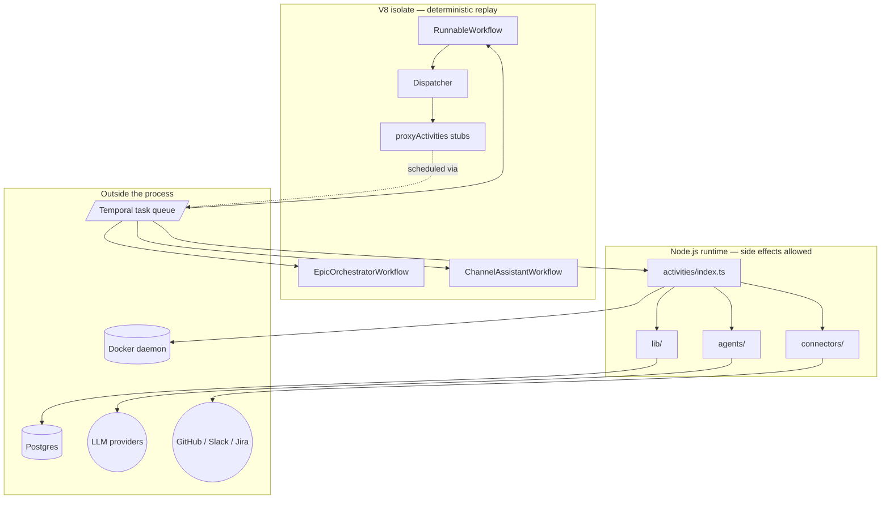
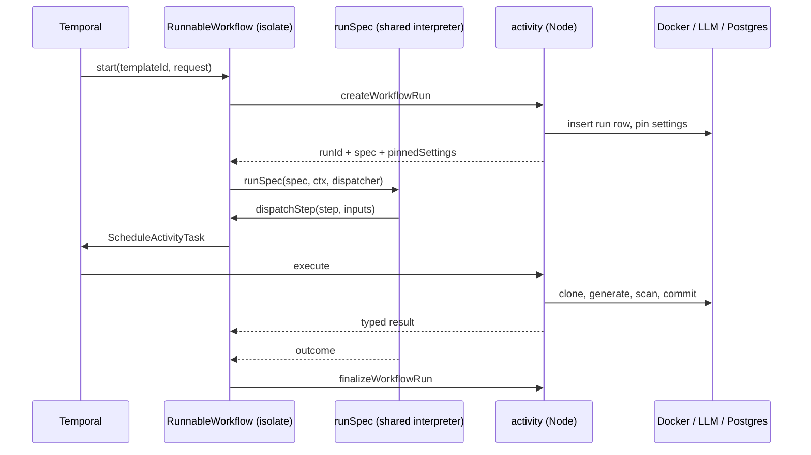

# @auto-swe/worker — Temporal Worker and Agent Runtime

> Indexed at commit `b1d8930` on 2026-09-08 · [view on GitHub](https://github.com/yorch/auto-swe/tree/b1d8930)

## Relevant source files

- [packages/worker/package.json](https://github.com/yorch/auto-swe/blob/b1d8930/packages/worker/package.json)
- [packages/worker/src/index.ts](https://github.com/yorch/auto-swe/blob/b1d8930/packages/worker/src/index.ts)
- [packages/worker/src/workflows/index.ts](https://github.com/yorch/auto-swe/blob/b1d8930/packages/worker/src/workflows/index.ts)
- [packages/worker/src/workflows/runnable.ts](https://github.com/yorch/auto-swe/blob/b1d8930/packages/worker/src/workflows/runnable.ts)
- [packages/worker/src/workflows/proxyOptions.ts](https://github.com/yorch/auto-swe/blob/b1d8930/packages/worker/src/workflows/proxyOptions.ts)
- [packages/worker/src/workflows/runnable.replay.test.ts](https://github.com/yorch/auto-swe/blob/b1d8930/packages/worker/src/workflows/runnable.replay.test.ts)
- [packages/worker/src/activities/index.ts](https://github.com/yorch/auto-swe/blob/b1d8930/packages/worker/src/activities/index.ts)
- [packages/worker/src/lib/workflowEngine.ts](https://github.com/yorch/auto-swe/blob/b1d8930/packages/worker/src/lib/workflowEngine.ts)
- [packages/worker/src/lib/config/assertReady.ts](https://github.com/yorch/auto-swe/blob/b1d8930/packages/worker/src/lib/config/assertReady.ts)
- [packages/worker/src/lib/config/agentSpec.ts](https://github.com/yorch/auto-swe/blob/b1d8930/packages/worker/src/lib/config/agentSpec.ts)
- [packages/worker/src/lib/telemetry.ts](https://github.com/yorch/auto-swe/blob/b1d8930/packages/worker/src/lib/telemetry.ts)
- [packages/worker/src/activities/workspace.ts](https://github.com/yorch/auto-swe/blob/b1d8930/packages/worker/src/activities/workspace.ts)
- [packages/worker/src/connectors/issueTracker.ts](https://github.com/yorch/auto-swe/blob/b1d8930/packages/worker/src/connectors/issueTracker.ts)
- [packages/worker/Dockerfile](https://github.com/yorch/auto-swe/blob/b1d8930/packages/worker/Dockerfile)

## Overview

`@auto-swe/worker` is the execution half of the platform. The gateway accepts a work request and starts a Temporal workflow; this package is the process that picks that workflow off the task queue and does everything it describes — resolving agents, calling language models, cloning repositories into Docker containers, running quality gates, opening pull requests, and writing every trace and token back to the database.

The package is the largest in the monorepo: 20 workflow modules, 54 activity modules, and 56 library modules, plus the Mastra agent definitions and the external connectors. It is also the one with the hardest internal boundary. Workflow code runs inside a Temporal V8 isolate with deterministic replay; activity code runs in ordinary Node.js and is allowed to touch the world. Nearly every rule in this subsystem exists to keep those two halves from leaking into each other.

Sources: [packages/worker/package.json:L1-L40](https://github.com/yorch/auto-swe/blob/b1d8930/packages/worker/package.json#L1-L40) [packages/worker/src/index.ts:L1-L95](https://github.com/yorch/auto-swe/blob/b1d8930/packages/worker/src/index.ts#L1-L95)

## Architecture

The dashed edge is the whole point. A workflow never calls an activity directly; it calls a `proxyActivities` stub, which records a command in workflow history and hands scheduling back to Temporal. Temporal then delivers the activity task to the Node side of the same process, where it may block on Docker, Postgres, an LLM provider, or an HTTP API. Nothing on the right half of the diagram is reachable from the left half at runtime.

Sources: [packages/worker/src/workflows/runnable.ts:L58-L228](https://github.com/yorch/auto-swe/blob/b1d8930/packages/worker/src/workflows/runnable.ts#L58-L228) [packages/worker/src/activities/index.ts:L1-L211](https://github.com/yorch/auto-swe/blob/b1d8930/packages/worker/src/activities/index.ts#L1-L211)

## Module Layout

| Module | Path | Responsibility |
| ------ | ---- | -------------- |
| Bootstrap | [`src/index.ts`](https://github.com/yorch/auto-swe/blob/b1d8930/packages/worker/src/index.ts) | Telemetry, boot assertions, Temporal connection, `Worker.create` |
| Workflows | [`src/workflows/`](https://github.com/yorch/auto-swe/tree/b1d8930/packages/worker/src/workflows) | 17 exported workflow functions, isolate-safe only |
| Activities | [`src/activities/`](https://github.com/yorch/auto-swe/tree/b1d8930/packages/worker/src/activities) | 54 modules; the deterministic boundary and every side effect |
| Agents | [`src/agents/`](https://github.com/yorch/auto-swe/tree/b1d8930/packages/worker/src/agents) | Mastra agent + tool definitions (implementer, review network, decomposer) |
| Connectors | [`src/connectors/`](https://github.com/yorch/auto-swe/tree/b1d8930/packages/worker/src/connectors) | Thin HTTP clients for Linear, Jira, Notion, Zendesk, Slack |
| Library | [`src/lib/`](https://github.com/yorch/auto-swe/tree/b1d8930/packages/worker/src/lib) | Agent resolution, model binding, tracing, cost, scanners, Docker helpers |

Sources: [packages/worker/src/workflows/index.ts:L1-L19](https://github.com/yorch/auto-swe/blob/b1d8930/packages/worker/src/workflows/index.ts#L1-L19) [packages/worker/src/activities/index.ts:L1-L211](https://github.com/yorch/auto-swe/blob/b1d8930/packages/worker/src/activities/index.ts#L1-L211)

## Key Components

### Bootstrap and boot-time assertions

`run()` in [src/index.ts#L17](https://github.com/yorch/auto-swe/blob/b1d8930/packages/worker/src/index.ts#L17) is ordered so that a misconfigured deployment fails at startup rather than inside the first activity. OpenTelemetry initializes before any other import so instrumentation is in place. Then `assertEncryptionKeyConfigured()` runs first inside the function, because every provider credential decrypts through that key. `assertConfigReady()` walks every Agent row the installed templates can reach and confirms each resolves a model and a credential, and `assertBuiltinStepsRegistered()` confirms every step the worker promises has registry metadata. All three throw before the poller starts, and the top-level catch shuts down telemetry and exits non-zero so an orchestrator keeps the worker out of rotation.

Sources: [packages/worker/src/index.ts:L17-L47](https://github.com/yorch/auto-swe/blob/b1d8930/packages/worker/src/index.ts#L17-L47) [packages/worker/src/lib/config/assertReady.ts:L19-L76](https://github.com/yorch/auto-swe/blob/b1d8930/packages/worker/src/lib/config/assertReady.ts#L19-L76) [packages/worker/src/index.ts:L91-L95](https://github.com/yorch/auto-swe/blob/b1d8930/packages/worker/src/index.ts#L91-L95)

### Worker creation, task queue, and workflow bundle path

The worker registers the entire activity barrel as `activities`, polls the `engineering-workflow` task queue in the `default` namespace, and caps concurrent activity executions from the `workspace.maxConcurrentActivities` setting rather than Temporal's default of 100 — most activities hold a Docker workspace, so a burst would exhaust the Docker host. That cap is read once at boot, which is why the setting is flagged as requiring a restart. The workflow bundle path is resolved relative to the module: `workflows/index.ts` when it exists, so `tsx watch` development works, and `workflows/index.js` otherwise for the compiled production image.

Sources: [packages/worker/src/index.ts:L54-L85](https://github.com/yorch/auto-swe/blob/b1d8930/packages/worker/src/index.ts#L54-L85)

### The isolate boundary and the `import type` rule

Workflow files are bundled separately and executed in a V8 isolate with no Node built-ins and no filesystem. Any runtime import of an external package either fails to bundle or drags non-deterministic behavior into replay. Workflow modules therefore use `import type` for everything outside `@temporalio/workflow`, and the two exceptions are deliberate. [`lib/workflowEngine.ts`](https://github.com/yorch/auto-swe/blob/b1d8930/packages/worker/src/lib/workflowEngine.ts) re-exports the shared interpreter, `lookupPath`, and `SignalSlots` through a worker-internal module so workflow files import from a local path while sharing the implementation with `@auto-swe/shared`. [`workflows/proxyOptions.ts`](https://github.com/yorch/auto-swe/blob/b1d8930/packages/worker/src/workflows/proxyOptions.ts) exports only plain object and string literals, with fully-erased type imports, which makes it safe to import at runtime from inside the isolate.

Determinism is enforced by test, not by convention alone. [`runnable.replay.test.ts`](https://github.com/yorch/auto-swe/blob/b1d8930/packages/worker/src/workflows/runnable.replay.test.ts) replays 13 recorded history fixtures — one per control-flow shape — against current workflow code. Replay guards only the paths a recorded history walked, and it compares command type and sequence rather than activity arguments, so a new control-flow shape needs a new fixture.

Sources: [packages/worker/src/lib/workflowEngine.ts:L1-L19](https://github.com/yorch/auto-swe/blob/b1d8930/packages/worker/src/lib/workflowEngine.ts#L1-L19) [packages/worker/src/workflows/proxyOptions.ts:L12-L25](https://github.com/yorch/auto-swe/blob/b1d8930/packages/worker/src/workflows/proxyOptions.ts#L12-L25) [packages/worker/src/workflows/runnable.replay.test.ts:L1-L57](https://github.com/yorch/auto-swe/blob/b1d8930/packages/worker/src/workflows/runnable.replay.test.ts#L1-L57)

### Retry and timeout presets

Every `proxyActivities` call site draws its retry policy and timeout from named presets rather than inline literals. Nine retry shapes cover the range from `RETRY_STATE` (five attempts, one second to thirty, for durable run-state writes) through `RETRY_AGENT` (two attempts, because a retried implementer call re-burns tokens) to `RETRY_SINGLE_ATTEMPT` for activities that own an internal poll or repair loop. Timeout constants are named for their literal duration string so a reviewer can confirm at a glance that a refactor changed no effective value.

Sources: [packages/worker/src/workflows/proxyOptions.ts:L36-L180](https://github.com/yorch/auto-swe/blob/b1d8930/packages/worker/src/workflows/proxyOptions.ts#L36-L180)

### `RunnableWorkflow` and the step executor map

[`RunnableWorkflow`](https://github.com/yorch/auto-swe/blob/b1d8930/packages/worker/src/workflows/runnable.ts#L240) is the generic interpreter that executes any versioned workflow spec, and it is where most runs land. It materializes the run row, reads interpreter bounds from the pinned-settings snapshot taken at run start, registers a signal handler for every signal and human-in-the-loop node named in the spec, then builds a `Dispatcher` whose methods forward to activity proxies. The shared interpreter walks the spec; the workflow body is pure walk and dispatch.

Step names map to activities through `STEP_EXECUTORS`, a `ReadonlyMap` of 29 entries built once at module load. Adding a step is a map entry, never a change to control flow. Finalization runs inside `CancellationScope.nonCancellable` so a cancelled or failed run still records its status, and `snapshotContext` spills oversized context strings into workflow artifacts under a per-chunk and per-run byte budget rather than truncating them.

Sources: [packages/worker/src/workflows/runnable.ts:L240-L303](https://github.com/yorch/auto-swe/blob/b1d8930/packages/worker/src/workflows/runnable.ts#L240-L303) [packages/worker/src/workflows/runnable.ts:L528-L950](https://github.com/yorch/auto-swe/blob/b1d8930/packages/worker/src/workflows/runnable.ts#L528-L950) [packages/worker/src/workflows/runnable.ts:L1087-L1176](https://github.com/yorch/auto-swe/blob/b1d8930/packages/worker/src/workflows/runnable.ts#L1087-L1176)

### The other workflows

Sixteen further workflows share the same queue. `EpicOrchestratorWorkflow` fans a multi-repository epic out into child workflows and computes the transitive dependent closure so a failed upstream repository marks its downstream repositories skipped. `ChannelAssistantWorkflow` turns one Slack mention into one reply, posting a placeholder and editing it in place when the turn completes. Four scheduled workflows drive lesson consolidation, evaluation runs, dataset revalidation, and repository dependency scans; three more back natural-language workflow authoring and explanation.

Sources: [packages/worker/src/workflows/index.ts:L1-L19](https://github.com/yorch/auto-swe/blob/b1d8930/packages/worker/src/workflows/index.ts#L1-L19) [packages/worker/src/workflows/epicOrchestrator.ts:L45-L60](https://github.com/yorch/auto-swe/blob/b1d8930/packages/worker/src/workflows/epicOrchestrator.ts#L45-L60) [packages/worker/src/workflows/channelAssistant.ts:L15-L48](https://github.com/yorch/auto-swe/blob/b1d8930/packages/worker/src/workflows/channelAssistant.ts#L15-L48)

### External connectors

[`src/connectors/`](https://github.com/yorch/auto-swe/tree/b1d8930/packages/worker/src/connectors) holds four dependency-free HTTP clients for the systems a non-code workflow reads from and writes to: Linear and Jira behind a shared `createIssue` / `fetchIssue` facade, Notion pages and blocks, Zendesk tickets and comments, and Slack message posts. Each sets a 30-second `AbortSignal.timeout` and classifies failures into Temporal terms, throwing `ApplicationFailure.nonRetryable` on an authentication or client error and a retryable failure on a 429 or 5xx. They are consumed only from activities — `genericActions.ts` for the `readSource`, `writeOutcome`, and `runTool` node types, and `resolveWorkspace.ts` for seeding a run's context.

Sources: [packages/worker/src/connectors/issueTracker.ts:L253-L273](https://github.com/yorch/auto-swe/blob/b1d8930/packages/worker/src/connectors/issueTracker.ts#L253-L273) [packages/worker/src/connectors/slack.ts:L9-L45](https://github.com/yorch/auto-swe/blob/b1d8930/packages/worker/src/connectors/slack.ts#L9-L45) [packages/worker/src/activities/genericActions.ts:L13-L21](https://github.com/yorch/auto-swe/blob/b1d8930/packages/worker/src/activities/genericActions.ts#L13-L21) [packages/worker/src/activities/resolveWorkspace.ts:L10-L12](https://github.com/yorch/auto-swe/blob/b1d8930/packages/worker/src/activities/resolveWorkspace.ts#L10-L12)

## Data Flow

The interpreter never calls an activity itself. It calls a `Dispatcher` method, and the workflow implements that method as a proxied activity call wrapped in `runWithCancellation`, which installs a per-call `CancellationScope` so fan-out block mode can abort a sibling branch instead of letting it drain.

Sources: [packages/worker/src/workflows/runnable.ts:L332-L397](https://github.com/yorch/auto-swe/blob/b1d8930/packages/worker/src/workflows/runnable.ts#L332-L397) [packages/worker/src/workflows/runnable.ts:L998-L1020](https://github.com/yorch/auto-swe/blob/b1d8930/packages/worker/src/workflows/runnable.ts#L998-L1020)

## Runtime Environment

| Setting | Value | Source |
| ------- | ----- | ------ |
| Task queue | `engineering-workflow` | [index.ts#L81](https://github.com/yorch/auto-swe/blob/b1d8930/packages/worker/src/index.ts#L81) |
| Namespace | `default` | [index.ts#L80](https://github.com/yorch/auto-swe/blob/b1d8930/packages/worker/src/index.ts#L80) |
| Temporal address | `TEMPORAL_ADDRESS`, default `localhost:7233` | [index.ts#L57](https://github.com/yorch/auto-swe/blob/b1d8930/packages/worker/src/index.ts#L57) |
| Activity concurrency | `workspace.maxConcurrentActivities` setting, boot-time only | [index.ts#L54-L79](https://github.com/yorch/auto-swe/blob/b1d8930/packages/worker/src/index.ts#L54-L79) |
| Runtime image | `node:26-slim`, glibc | [Dockerfile#L86](https://github.com/yorch/auto-swe/blob/b1d8930/packages/worker/Dockerfile#L86) |

The runtime image is glibc rather than Alpine because `@temporalio/core-bridge` ships only `-gnu` prebuilds; on musl the worker dies at startup on a shared-library load. The Docker CLI is copied in from the official image so the worker can manage workspace containers over the mounted host socket.

Sources: [packages/worker/Dockerfile:L74-L92](https://github.com/yorch/auto-swe/blob/b1d8930/packages/worker/Dockerfile#L74-L92) [packages/worker/src/index.ts:L54-L85](https://github.com/yorch/auto-swe/blob/b1d8930/packages/worker/src/index.ts#L54-L85)

## Child Pages

**[Temporal workflows](./4.1-temporal-workflows.md)** covers the 17 exported workflow functions in depth: the generic `RunnableWorkflow` interpreter and its signal, human-in-the-loop, and fan-out handling; the epic orchestrator's child-workflow model; the channel-assistant and scheduled families; and the determinism regime — the `import type` rule, the replay fixtures, and what re-recording a fixture does and does not fix.

**[Activity catalog](./4.2-activities.md)** walks the 54 activity modules grouped by concern: implementation and fix loops, quality gates, pull-request and continuous-integration handling, decomposition and merge, declarative node activities, evaluation, channel assistant, and run state. It documents the input and output shapes each activity contracts on and where each sits in the retry taxonomy.

**[Agent layer](./4.3-agent-layer.md)** documents how an agent key becomes a running model call: `resolveAgent` walking the five-level scope cascade, `resolveAgentSpec` composing model, prompt, skills, and tools into an in-process `AgentSpec` that never crosses an activity boundary, model binding across the four provider adapters, Mastra tool definitions, progressive skill disclosure, and Model Context Protocol tool loading.

**[Docker workspaces](./4.4-docker-workspaces.md)** covers the Docker-in-Docker execution model: `createWorkspace` and the `Workspace` handle, `shellQuote` as the injection boundary for agent-generated commands, credential splitting so a clone token never lands in `.git/config`, container resource caps, dependency repository checkouts, ephemeral containers for shell and container steps, and the cleanup discipline that keeps containers from leaking.

**[Observability and cost](./4.5-observability-and-cost.md)** covers `AgentTracer` and the `persistActivityTrace` contract, the redaction applied before traces reach the database, the OpenTelemetry setup and Temporal runtime metrics, and token accounting — the model price table, per-model environment overrides, budget tiers, and how an unpriced model degrades to zero cost without losing usage.

## Related Pages

- Repository structure: [Repository Structure](./1-repository-structure.md)
- Shared library, including the workflow spec and interpreter: [@auto-swe/shared](./2-shared-library.md)
- The service that starts these workflows: [Gateway API](./3-gateway-api.md)
- Sibling packages: [Web Dashboard](./5-web-dashboard.md) · [CLI](./6-cli.md) · [Bundle SDK](./7-bundle-sdk.md)
