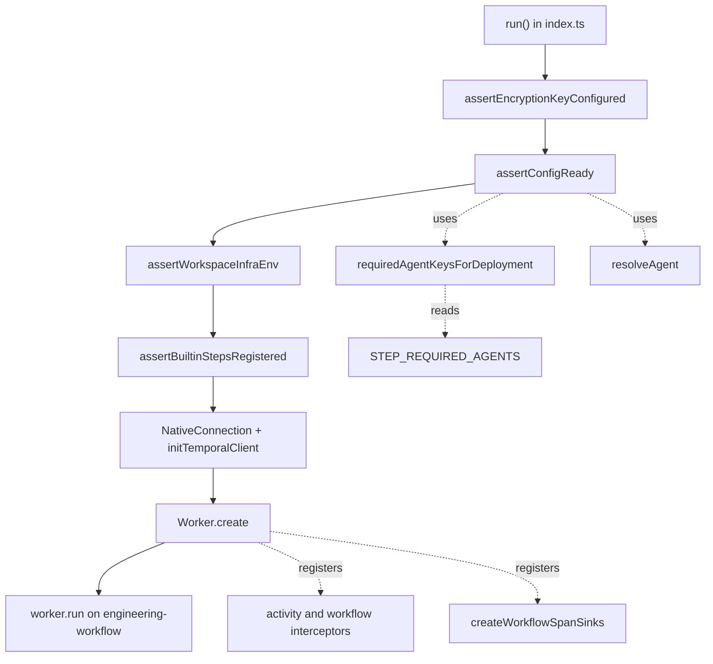

# Temporal Worker

> Indexed at commit `d0a90fb5` on 2026-10-06 · [view on GitHub](https://github.com/yorch/auto-swe/tree/d0a90fb5)

## Relevant source files

- [packages/worker/src/index.ts](https://github.com/yorch/auto-swe/blob/d0a90fb5/packages/worker/src/index.ts)
- [packages/worker/package.json](https://github.com/yorch/auto-swe/blob/d0a90fb5/packages/worker/package.json)
- [packages/worker/src/lib/config/assertReady.ts](https://github.com/yorch/auto-swe/blob/d0a90fb5/packages/worker/src/lib/config/assertReady.ts)
- [packages/worker/src/lib/config/deploymentAgents.ts](https://github.com/yorch/auto-swe/blob/d0a90fb5/packages/worker/src/lib/config/deploymentAgents.ts)
- [packages/worker/src/lib/config/stepRequiredAgents.ts](https://github.com/yorch/auto-swe/blob/d0a90fb5/packages/worker/src/lib/config/stepRequiredAgents.ts)
- [packages/worker/src/lib/config/resolver.ts](https://github.com/yorch/auto-swe/blob/d0a90fb5/packages/worker/src/lib/config/resolver.ts)
- [packages/worker/src/lib/config/agentResolver.ts](https://github.com/yorch/auto-swe/blob/d0a90fb5/packages/worker/src/lib/config/agentResolver.ts)
- [packages/worker/src/lib/models.ts](https://github.com/yorch/auto-swe/blob/d0a90fb5/packages/worker/src/lib/models.ts)
- [packages/worker/src/lib/temporalClient.ts](https://github.com/yorch/auto-swe/blob/d0a90fb5/packages/worker/src/lib/temporalClient.ts)
- [packages/worker/src/lib/workflowEngine.ts](https://github.com/yorch/auto-swe/blob/d0a90fb5/packages/worker/src/lib/workflowEngine.ts)
- [packages/worker/src/lib/activitySpans.ts](https://github.com/yorch/auto-swe/blob/d0a90fb5/packages/worker/src/lib/activitySpans.ts)
- [packages/worker/src/lib/activityNodeTag.ts](https://github.com/yorch/auto-swe/blob/d0a90fb5/packages/worker/src/lib/activityNodeTag.ts)
- [packages/worker/src/lib/workflowSpanSink.ts](https://github.com/yorch/auto-swe/blob/d0a90fb5/packages/worker/src/lib/workflowSpanSink.ts)
- [packages/worker/src/lib/activityContext.ts](https://github.com/yorch/auto-swe/blob/d0a90fb5/packages/worker/src/lib/activityContext.ts)
- [packages/worker/src/lib/costTracking.ts](https://github.com/yorch/auto-swe/blob/d0a90fb5/packages/worker/src/lib/costTracking.ts)
- [packages/worker/src/lib/execUtils.ts](https://github.com/yorch/auto-swe/blob/d0a90fb5/packages/worker/src/lib/execUtils.ts)
- [packages/worker/src/lib/usdCapGuard.ts](https://github.com/yorch/auto-swe/blob/d0a90fb5/packages/worker/src/lib/usdCapGuard.ts)
- [packages/worker/src/lib/scm/index.ts](https://github.com/yorch/auto-swe/blob/d0a90fb5/packages/worker/src/lib/scm/index.ts)

## Overview

`@auto-swe/worker` is the process that executes durable workflows. It connects to Temporal, polls the `engineering-workflow` task queue, runs workflow code in a V8 isolate, and runs every activity (LLM calls, Docker workspaces, GitHub calls, database writes) in the Node process. The entry point is [packages/worker/src/index.ts](https://github.com/yorch/auto-swe/blob/d0a90fb5/packages/worker/src/index.ts), and the shared helpers every activity leans on live under `src/lib/`.

This page covers the boot sequence, worker registration, the configuration-readiness gate, and the `lib/` layer. The workflows, activities, agent layer, Docker workspaces, observability, runtimes, model catalog and memory each have their own child page.

The package is an ESM module started with `node --import ./dist/instrument.js dist/index.js`; the `instrument.js` preload installs OpenTelemetry before anything else loads, and dev mode runs the same preload under `tsx watch` ([packages/worker/package.json:L6-L11](https://github.com/yorch/auto-swe/blob/d0a90fb5/packages/worker/package.json#L6-L11)). Dependencies pin the Temporal SDK at 1.24.0, Mastra at 1.73.0 and the Vercel AI SDK provider adapters ([packages/worker/package.json:L12-L38](https://github.com/yorch/auto-swe/blob/d0a90fb5/packages/worker/package.json#L12-L38)).

Sources: [packages/worker/src/index.ts:L19-L133](https://github.com/yorch/auto-swe/blob/d0a90fb5/packages/worker/src/index.ts#L19-L133) [packages/worker/package.json:L1-L48](https://github.com/yorch/auto-swe/blob/d0a90fb5/packages/worker/package.json#L1-L48)

## Architecture

```mermaid
flowchart TD
    Boot["run() in index.ts"] --> Key["assertEncryptionKeyConfigured"]
    Key --> Ready["assertConfigReady"]
    Ready --> Infra["assertWorkspaceInfraEnv"]
    Infra --> Steps["assertBuiltinStepsRegistered"]
    Steps --> Conn["NativeConnection + initTemporalClient"]
    Conn --> Create["Worker.create"]
    Create --> Poll["worker.run on engineering-workflow"]
    Ready -.uses.-> Agents["requiredAgentKeysForDeployment"]
    Agents -.reads.-> Map["STEP_REQUIRED_AGENTS"]
    Ready -.uses.-> Resolve["resolveAgent"]
    Create -.registers.-> Interceptors["activity and workflow interceptors"]
    Create -.registers.-> Sinks["createWorkflowSpanSinks"]
```

Boot is strictly ordered and fail-fast: each guard throws before the poller starts, and the top-level `catch` flushes OpenTelemetry and exits with status 1 so an orchestrator keeps the worker out of rotation. Registration then hands Temporal the activity module, two activity interceptors, two workflow-module interceptors and a sink that exports workflow spans.

Sources: [packages/worker/src/index.ts:L19-L133](https://github.com/yorch/auto-swe/blob/d0a90fb5/packages/worker/src/index.ts#L19-L133)

## Module Layout

| Module | Path | Responsibility |
| ------ | ---- | -------------- |
| Entry point | `packages/worker/src/index.ts` | Boot guards, Temporal connection, `Worker.create` |
| Readiness gate | `packages/worker/src/lib/config/assertReady.ts` | Boot-time check of agents, credentials and embedding config |
| Deployment agent set | `packages/worker/src/lib/config/deploymentAgents.ts` | Derives which agent keys the installed templates need |
| Step to agent map | `packages/worker/src/lib/config/stepRequiredAgents.ts` | Plain-data map from step name to required agent keys |
| Resolvers | `packages/worker/src/lib/config/resolver.ts`, `agentResolver.ts` | Scope-cascading credential and agent resolution |
| Model binding | `packages/worker/src/lib/models.ts` | `getModel`, `getModelSpec`, `getBoundModel` over the resolver |
| Temporal client | `packages/worker/src/lib/temporalClient.ts` | Process-wide `Client` for activities that start workflows |
| Engine re-exports | `packages/worker/src/lib/workflowEngine.ts` | Isolate-safe re-export of the shared interpreter |
| Tracing | `packages/worker/src/lib/activitySpans.ts`, `workflowSpanSink.ts`, `activityNodeTag.ts` | Activity spans, workflow span export, node attribution |
| Activity context | `packages/worker/src/lib/activityContext.ts` | Current workflow id, attempt, trace persistence |
| Cost and budgets | `packages/worker/src/lib/costTracking.ts`, `usdCapGuard.ts` | Pricing, token ledger, budget refusal |
| Exec helpers | `packages/worker/src/lib/execUtils.ts` | Child-process options, error text, heartbeats |
| SCM | `packages/worker/src/lib/scm/` | `ScmProvider` selection and CI polling |

Sources: [packages/worker/src/lib/config/assertReady.ts:L19-L76](https://github.com/yorch/auto-swe/blob/d0a90fb5/packages/worker/src/lib/config/assertReady.ts#L19-L76) [packages/worker/src/lib/models.ts:L34-L73](https://github.com/yorch/auto-swe/blob/d0a90fb5/packages/worker/src/lib/models.ts#L34-L73) [packages/worker/src/lib/temporalClient.ts:L13-L34](https://github.com/yorch/auto-swe/blob/d0a90fb5/packages/worker/src/lib/temporalClient.ts#L13-L34)

## Key Components

### Boot sequence

`run()` first calls `assertEncryptionKeyConfigured()`, because every provider credential and integration secret decrypts through that key, and then `initMetrics()` ([packages/worker/src/index.ts#L23-L25](https://github.com/yorch/auto-swe/blob/d0a90fb5/packages/worker/src/index.ts#L23-L25)). When `OTEL_EXPORTER_OTLP_ENDPOINT` is set it installs a Temporal `Runtime` with OTLP metrics and an `OtelForwardingLogger` wrapping the default logger ([packages/worker/src/index.ts#L29-L39](https://github.com/yorch/auto-swe/blob/d0a90fb5/packages/worker/src/index.ts#L29-L39)).

It then runs three guards in order: `assertConfigReady()`, `assertWorkspaceInfraEnv()` (which fails the boot on an environment typo that the resolvers would otherwise silently default) and `assertBuiltinStepsRegistered()` (every built-in step needs registry metadata, or a shipped template validates as `UNKNOWN_STEP`) ([packages/worker/src/index.ts#L47-L70](https://github.com/yorch/auto-swe/blob/d0a90fb5/packages/worker/src/index.ts#L47-L70)). Between them it warns about leftover `MODEL_PRICE_*` variables through `ignoredPriceOverrideVars()`, since the model catalog replaced them ([packages/worker/src/lib/costTracking.ts#L182](https://github.com/yorch/auto-swe/blob/d0a90fb5/packages/worker/src/lib/costTracking.ts#L182)).

Sources: [packages/worker/src/index.ts:L19-L70](https://github.com/yorch/auto-swe/blob/d0a90fb5/packages/worker/src/index.ts#L19-L70)

### Worker registration

Temporal reads the concurrency cap at creation, so `maxConcurrentActivities` from `resolveWorkspaceInfra()` is an environment-driven value that needs a restart to change; it feeds `maxConcurrentActivityTaskExecutions` because most activities hold a Docker workspace ([packages/worker/src/index.ts#L72-L75](https://github.com/yorch/auto-swe/blob/d0a90fb5/packages/worker/src/index.ts#L72-L75), [packages/worker/src/index.ts#L109-L112](https://github.com/yorch/auto-swe/blob/d0a90fb5/packages/worker/src/index.ts#L109-L112)). The worker opens a `NativeConnection` for polling and, separately, calls `initTemporalClient()` for a regular `Client`, because the two transports are not interchangeable ([packages/worker/src/lib/temporalClient.ts#L7-L23](https://github.com/yorch/auto-swe/blob/d0a90fb5/packages/worker/src/lib/temporalClient.ts#L7-L23)). Activities reach that client through `getTemporalClient()`, which throws if boot has not initialised it.

Workflow and interceptor paths prefer the `.ts` source (for `tsx watch`) and fall back to compiled `.js`. `Worker.create` registers the whole `activities` module, the `engineering-workflow` task queue in the `default` namespace, and `workflowsPath` for the isolate bundle ([packages/worker/src/index.ts#L81-L121](https://github.com/yorch/auto-swe/blob/d0a90fb5/packages/worker/src/index.ts#L81-L121)).

Sources: [packages/worker/src/index.ts:L72-L127](https://github.com/yorch/auto-swe/blob/d0a90fb5/packages/worker/src/index.ts#L72-L127) [packages/worker/src/lib/temporalClient.ts:L1-L34](https://github.com/yorch/auto-swe/blob/d0a90fb5/packages/worker/src/lib/temporalClient.ts#L1-L34)

### Config readiness gate

`assertConfigReady()` collects every failure rather than stopping at the first. For each key from `requiredAgentKeysForDeployment()` it calls `resolveAgent(role)` and records the error message; it then checks the `EmbeddingConfig` singleton for a valid `modelSpec` and either a pinned credential of the matching provider or a GLOBAL `ProviderCredential` ([packages/worker/src/lib/config/assertReady.ts#L19-L68](https://github.com/yorch/auto-swe/blob/d0a90fb5/packages/worker/src/lib/config/assertReady.ts#L19-L68)). If anything is missing it throws one error that points at `/studio/models` and `/studio/agents/library` ([packages/worker/src/lib/config/assertReady.ts#L70-L75](https://github.com/yorch/auto-swe/blob/d0a90fb5/packages/worker/src/lib/config/assertReady.ts#L70-L75)).

The agent set is deployment-specific. `installedStepNames()` reads the active and experiment versions of every `ACTIVE` template, gathers `step` nodes (and `runEvalNode` for `eval` nodes), and `requiredAgentKeysForDeployment()` maps them through `STEP_REQUIRED_AGENTS`, adding `channelAssistant` when any Slack channel exists ([packages/worker/src/lib/config/deploymentAgents.ts#L29-L83](https://github.com/yorch/auto-swe/blob/d0a90fb5/packages/worker/src/lib/config/deploymentAgents.ts#L29-L83)). A deployment with no software-engineering workflow therefore does not need `implementer` configured. In `STEP_REQUIRED_AGENTS`, `runAgentNode` is `null` because its agent comes from the spec's `agentRef`, which is checked at template save instead ([packages/worker/src/lib/config/stepRequiredAgents.ts#L55-L71](https://github.com/yorch/auto-swe/blob/d0a90fb5/packages/worker/src/lib/config/stepRequiredAgents.ts#L55-L71)).

Sources: [packages/worker/src/lib/config/assertReady.ts:L19-L76](https://github.com/yorch/auto-swe/blob/d0a90fb5/packages/worker/src/lib/config/assertReady.ts#L19-L76) [packages/worker/src/lib/config/deploymentAgents.ts:L29-L83](https://github.com/yorch/auto-swe/blob/d0a90fb5/packages/worker/src/lib/config/deploymentAgents.ts#L29-L83) [packages/worker/src/lib/config/stepRequiredAgents.ts:L55-L71](https://github.com/yorch/auto-swe/blob/d0a90fb5/packages/worker/src/lib/config/stepRequiredAgents.ts#L55-L71)

### Resolvers and model binding

`resolveProviderCredential` cascades TEAM, then ORGANIZATION, then GLOBAL behind the shared config cache, and throws `ConfigMissingError` when no row exists. When a narrower request falls through to a broader row it invalidates its own cache key so a later narrower insert is not masked for the full TTL ([packages/worker/src/lib/config/resolver.ts#L10-L41](https://github.com/yorch/auto-swe/blob/d0a90fb5/packages/worker/src/lib/config/resolver.ts#L10-L41)). `resolveAgent(key, ctx)` in [packages/worker/src/lib/config/agentResolver.ts#L324](https://github.com/yorch/auto-swe/blob/d0a90fb5/packages/worker/src/lib/config/agentResolver.ts#L324) is the single agent resolver, covered on the agent layer page.

`models.ts` is the thin layer activities call. `getModelSpec` and `getModel` take the scope from the Temporal activity context via `currentRequestContext()` and let a caller override fields such as `channelId`; `getBoundModel` returns the model together with the spec it was built from so usage is priced at the bound model ([packages/worker/src/lib/models.ts#L34-L73](https://github.com/yorch/auto-swe/blob/d0a90fb5/packages/worker/src/lib/models.ts#L34-L73)). Built models are cached by spec, the last six characters of the API key and the `apiBase`, so a credential rotation busts the cache without storing the secret ([packages/worker/src/lib/models.ts#L87-L96](https://github.com/yorch/auto-swe/blob/d0a90fb5/packages/worker/src/lib/models.ts#L87-L96)).

Sources: [packages/worker/src/lib/config/resolver.ts:L10-L60](https://github.com/yorch/auto-swe/blob/d0a90fb5/packages/worker/src/lib/config/resolver.ts#L10-L60) [packages/worker/src/lib/models.ts:L27-L96](https://github.com/yorch/auto-swe/blob/d0a90fb5/packages/worker/src/lib/models.ts#L27-L96)

### Isolate boundary and tracing glue

[packages/worker/src/lib/workflowEngine.ts](https://github.com/yorch/auto-swe/blob/d0a90fb5/packages/worker/src/lib/workflowEngine.ts#L12-L19) re-exports `runSpec`, `readInterpreterLimits`, `BranchCancelledError`, `lookupPath`, `SignalSlots` and `CHANNEL_TASK_STEER_SIGNAL` from `@auto-swe/shared`, so workflow files import the engine from a worker-internal path rather than reaching into an external package.

`activitySpanInterceptor` wraps each attempt in an `activity.<type>` span parented on the run's workflow span, and does not count cancellations as failures ([packages/worker/src/lib/activitySpans.ts#L17-L60](https://github.com/yorch/auto-swe/blob/d0a90fb5/packages/worker/src/lib/activitySpans.ts#L17-L60)). `activityNodeTagInterceptor` decodes the header the workflow stamped on a dispatch and exposes it through `currentNodeTag()` using `AsyncLocalStorage`, so `AgentTrace` rows carry `specNodeId`, `recordingId` and `stepAttempt` ([packages/worker/src/lib/activityNodeTag.ts#L9-L63](https://github.com/yorch/auto-swe/blob/d0a90fb5/packages/worker/src/lib/activityNodeTag.ts#L9-L63)). `createWorkflowSpanSinks` exports the run's workflow span with `callDuringReplay: false`, so a worker restart does not export a run twice ([packages/worker/src/lib/workflowSpanSink.ts#L9-L25](https://github.com/yorch/auto-swe/blob/d0a90fb5/packages/worker/src/lib/workflowSpanSink.ts#L9-L25)).

Sources: [packages/worker/src/lib/workflowEngine.ts:L12-L19](https://github.com/yorch/auto-swe/blob/d0a90fb5/packages/worker/src/lib/workflowEngine.ts#L12-L19) [packages/worker/src/lib/activitySpans.ts:L1-L60](https://github.com/yorch/auto-swe/blob/d0a90fb5/packages/worker/src/lib/activitySpans.ts#L1-L60) [packages/worker/src/lib/activityNodeTag.ts:L1-L63](https://github.com/yorch/auto-swe/blob/d0a90fb5/packages/worker/src/lib/activityNodeTag.ts#L1-L63) [packages/worker/src/lib/workflowSpanSink.ts:L1-L25](https://github.com/yorch/auto-swe/blob/d0a90fb5/packages/worker/src/lib/workflowSpanSink.ts#L1-L25)

### Shared activity helpers

`persistActivityTrace(tracer, agentKey)` attaches the active OpenTelemetry span context, resolves the run and spend owner, and writes the tracer's rows with the activity's type, attempt and node tag; activities call it from a `finally` block ([packages/worker/src/lib/activityContext.ts#L104-L138](https://github.com/yorch/auto-swe/blob/d0a90fb5/packages/worker/src/lib/activityContext.ts#L104-L138)). `assertBudgetAvailable` takes the workflow id from the activity context, checks the organization cap first, then the run's ledger, and falls back to the runless cap when the run has no ledger ([packages/worker/src/lib/costTracking.ts#L361-L386](https://github.com/yorch/auto-swe/blob/d0a90fb5/packages/worker/src/lib/costTracking.ts#L361-L386)). `execUtils.ts` defines `EXEC_OPTS` (10 MB buffer, 120 s timeout) and error-text helpers for Docker callouts ([packages/worker/src/lib/execUtils.ts#L18-L35](https://github.com/yorch/auto-swe/blob/d0a90fb5/packages/worker/src/lib/execUtils.ts#L18-L35)). `getScmProvider` always returns the GitHub provider today, and `toRepoRef` requires an `installation` property so a caller cannot silently resolve the default installation ([packages/worker/src/lib/scm/index.ts#L23-L43](https://github.com/yorch/auto-swe/blob/d0a90fb5/packages/worker/src/lib/scm/index.ts#L23-L43)).

Sources: [packages/worker/src/lib/activityContext.ts:L104-L138](https://github.com/yorch/auto-swe/blob/d0a90fb5/packages/worker/src/lib/activityContext.ts#L104-L138) [packages/worker/src/lib/costTracking.ts:L361-L386](https://github.com/yorch/auto-swe/blob/d0a90fb5/packages/worker/src/lib/costTracking.ts#L361-L386) [packages/worker/src/lib/execUtils.ts:L1-L35](https://github.com/yorch/auto-swe/blob/d0a90fb5/packages/worker/src/lib/execUtils.ts#L1-L35) [packages/worker/src/lib/scm/index.ts:L23-L43](https://github.com/yorch/auto-swe/blob/d0a90fb5/packages/worker/src/lib/scm/index.ts#L23-L43)

## Configuration & Extension Points

| Setting | Type | Default | Purpose |
| ------- | ---- | ------- | ------- |
| `OTEL_EXPORTER_OTLP_ENDPOINT` | env var | unset | Enables Temporal runtime metrics and OTLP log forwarding |
| `TEMPORAL_ADDRESS` | env var | `localhost:7233` | Address for the polling `NativeConnection` |
| `maxConcurrentActivities` | from `resolveWorkspaceInfra()` | read at boot | Caps concurrent activity executions |
| Task queue | constant | `engineering-workflow` | Queue the worker polls |

Adding a step that resolves a model means adding its roles to `STEP_REQUIRED_AGENTS`, or the boot gate will not check them and the run fails mid-flight instead ([packages/worker/src/lib/config/stepRequiredAgents.ts#L11-L16](https://github.com/yorch/auto-swe/blob/d0a90fb5/packages/worker/src/lib/config/stepRequiredAgents.ts#L11-L16)).

Sources: [packages/worker/src/index.ts:L29-L39](https://github.com/yorch/auto-swe/blob/d0a90fb5/packages/worker/src/index.ts#L29-L39) [packages/worker/src/index.ts:L72-L79](https://github.com/yorch/auto-swe/blob/d0a90fb5/packages/worker/src/index.ts#L72-L79) [packages/worker/src/lib/config/stepRequiredAgents.ts:L11-L71](https://github.com/yorch/auto-swe/blob/d0a90fb5/packages/worker/src/lib/config/stepRequiredAgents.ts#L11-L71)

## Related Pages

- [4.1 Temporal workflows](./4.1-temporal-workflows.md)
- [4.2 Activities](./4.2-activities.md)
- [4.3 Agent layer](./4.3-agent-layer.md)
- [4.4 Docker workspaces](./4.4-docker-workspaces.md)
- [4.5 Observability and cost](./4.5-observability-and-cost.md)
- [4.6 Agent runs and implementer runtimes](./4.6-agent-runs-and-implementer-runtimes.md)
- [4.7 Model catalog and pricing](./4.7-model-catalog-and-pricing.md)
- [4.8 Agent memory](./4.8-agent-memory.md)
