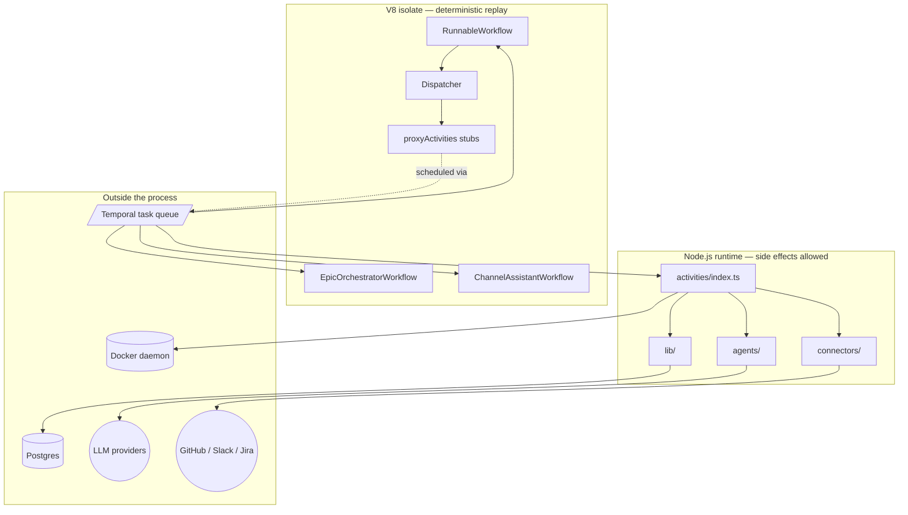
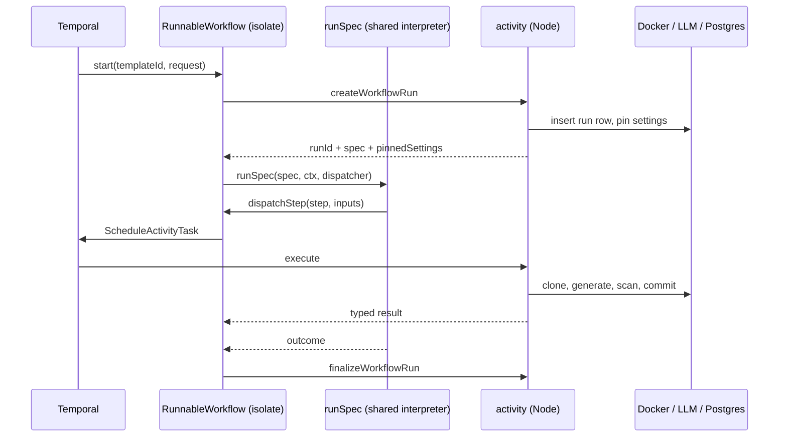

# @auto-swe/worker — Temporal Worker and Agent Runtime

> Indexed at commit `147d054a` on 2026-09-30 · [view on GitHub](https://github.com/yorch/auto-swe/tree/147d054a)

## Relevant source files

- [packages/worker/package.json](https://github.com/yorch/auto-swe/blob/147d054a/packages/worker/package.json)
- [packages/worker/src/index.ts](https://github.com/yorch/auto-swe/blob/147d054a/packages/worker/src/index.ts)
- [packages/worker/src/workflows/index.ts](https://github.com/yorch/auto-swe/blob/147d054a/packages/worker/src/workflows/index.ts)
- [packages/worker/src/workflows/runnable.ts](https://github.com/yorch/auto-swe/blob/147d054a/packages/worker/src/workflows/runnable.ts)
- [packages/worker/src/workflows/proxyOptions.ts](https://github.com/yorch/auto-swe/blob/147d054a/packages/worker/src/workflows/proxyOptions.ts)
- [packages/worker/src/workflows/runnable.replay.test.ts](https://github.com/yorch/auto-swe/blob/147d054a/packages/worker/src/workflows/runnable.replay.test.ts)
- [packages/worker/src/activities/index.ts](https://github.com/yorch/auto-swe/blob/147d054a/packages/worker/src/activities/index.ts)
- [packages/worker/src/lib/workflowEngine.ts](https://github.com/yorch/auto-swe/blob/147d054a/packages/worker/src/lib/workflowEngine.ts)
- [packages/worker/src/lib/config/assertReady.ts](https://github.com/yorch/auto-swe/blob/147d054a/packages/worker/src/lib/config/assertReady.ts)
- [packages/worker/src/lib/activitySpans.ts](https://github.com/yorch/auto-swe/blob/147d054a/packages/worker/src/lib/activitySpans.ts)
- [packages/worker/src/lib/metrics.ts](https://github.com/yorch/auto-swe/blob/147d054a/packages/worker/src/lib/metrics.ts)
- [packages/worker/src/activities/workspace.ts](https://github.com/yorch/auto-swe/blob/147d054a/packages/worker/src/activities/workspace.ts)
- [packages/worker/src/connectors/issueTracker.ts](https://github.com/yorch/auto-swe/blob/147d054a/packages/worker/src/connectors/issueTracker.ts)
- [packages/worker/Dockerfile](https://github.com/yorch/auto-swe/blob/147d054a/packages/worker/Dockerfile)

## Overview

`@auto-swe/worker` is the execution half of the platform. The gateway accepts a work request and starts a Temporal workflow; this package is the process that picks that workflow off the task queue and does everything it describes — resolving agents, calling language models, cloning repositories into Docker containers, running quality gates, opening pull requests, and writing every trace and token back to the database.

The package is the largest in the monorepo: 21 workflow modules, 55 activity modules, and 61 library modules, plus the Mastra agent definitions and the external connectors. Each count is the number of `.ts` files under `src/workflows/`, `src/activities/`, and `src/lib/` (recursing into subdirectories such as `lib/config/` and `lib/scm/`) at the indexed commit, excluding `*.test.ts`, taken with `git ls-tree -r --name-only` — the same method reproduces the earlier 20, 54, and 56. The workflow count includes the `index.ts` barrel and `proxyOptions.ts`, which export no workflow of their own. It is also the package with the hardest internal boundary. Workflow code runs inside a Temporal V8 isolate with deterministic replay; activity code runs in ordinary Node.js and is allowed to touch the world. Nearly every rule in this subsystem exists to keep those two halves from leaking into each other.

Sources: [packages/worker/package.json:L1-L40](https://github.com/yorch/auto-swe/blob/147d054a/packages/worker/package.json#L1-L40) [packages/worker/src/index.ts:L1-L101](https://github.com/yorch/auto-swe/blob/147d054a/packages/worker/src/index.ts#L1-L101)

## Architecture

```mermaid
graph TB
    subgraph Isolate["V8 isolate — deterministic replay"]
        Runnable[RunnableWorkflow]
        Epic[EpicOrchestratorWorkflow]
        ChannelWf[ChannelAssistantWorkflow]
        Dispatcher[Dispatcher]
        Proxies[proxyActivities stubs]
    end

    subgraph Node["Node.js runtime — side effects allowed"]
        Activities[activities/index.ts]
        Agents[agents/]
        Connectors[connectors/]
        Lib[lib/]
    end

    subgraph External["Outside the process"]
        Temporal[/Temporal task queue/]
        Docker[(Docker daemon)]
        DB[(Postgres)]
        LLM((LLM providers))
        SCM((GitHub / Slack / Jira))
    end

    Temporal --> Runnable
    Temporal --> Epic
    Temporal --> ChannelWf
    Runnable --> Dispatcher
    Dispatcher --> Proxies
    Proxies -.scheduled via.-> Temporal
    Temporal --> Activities
    Activities --> Agents
    Activities --> Connectors
    Activities --> Lib
    Lib --> DB
    Agents --> LLM
    Activities --> Docker
    Connectors --> SCM
```

The dashed edge is the whole point. A workflow never calls an activity directly; it calls a `proxyActivities` stub, which records a command in workflow history and hands scheduling back to Temporal. Temporal then delivers the activity task to the Node side of the same process, where it may block on Docker, Postgres, an LLM provider, or an HTTP API. Nothing on the right half of the diagram is reachable from the left half at runtime. The one piece of worker code that straddles the activity side is an interceptor: every activity attempt passes through `activitySpanInterceptor`, which wraps it in a span and a duration sample (see [Observability and cost](./4.5-observability-and-cost.md)).

Sources: [packages/worker/src/workflows/runnable.ts:L58-L228](https://github.com/yorch/auto-swe/blob/147d054a/packages/worker/src/workflows/runnable.ts#L58-L228) [packages/worker/src/activities/index.ts:L1-L213](https://github.com/yorch/auto-swe/blob/147d054a/packages/worker/src/activities/index.ts#L1-L213) [packages/worker/src/index.ts:L74-L91](https://github.com/yorch/auto-swe/blob/147d054a/packages/worker/src/index.ts#L74-L91)

## Module Layout

| Module | Path | Responsibility |
| ------ | ---- | -------------- |
| Bootstrap | [`src/index.ts`](https://github.com/yorch/auto-swe/blob/147d054a/packages/worker/src/index.ts) | Telemetry, metrics, boot assertions, Temporal connection, `Worker.create` |
| Workflows | [`src/workflows/`](https://github.com/yorch/auto-swe/tree/147d054a/packages/worker/src/workflows) | 21 modules exporting 18 workflow functions, isolate-safe only |
| Activities | [`src/activities/`](https://github.com/yorch/auto-swe/tree/147d054a/packages/worker/src/activities) | 55 modules; the deterministic boundary and every side effect |
| Agents | [`src/agents/`](https://github.com/yorch/auto-swe/tree/147d054a/packages/worker/src/agents) | Mastra agent + tool definitions (implementer, review network, decomposer) |
| Connectors | [`src/connectors/`](https://github.com/yorch/auto-swe/tree/147d054a/packages/worker/src/connectors) | Four HTTP client modules: issue tracker (Linear and Jira), Notion, Zendesk, Slack |
| Library | [`src/lib/`](https://github.com/yorch/auto-swe/tree/147d054a/packages/worker/src/lib) | 61 modules: agent resolution, model binding, tracing, spans and metrics, cost, SCM, Docker helpers |

Sources: [packages/worker/src/workflows/index.ts:L1-L20](https://github.com/yorch/auto-swe/blob/147d054a/packages/worker/src/workflows/index.ts#L1-L20) [packages/worker/src/activities/index.ts:L1-L213](https://github.com/yorch/auto-swe/blob/147d054a/packages/worker/src/activities/index.ts#L1-L213)

## Key Components

### Bootstrap and boot-time assertions

`run()` in [src/index.ts#L19](https://github.com/yorch/auto-swe/blob/147d054a/packages/worker/src/index.ts#L19) is ordered so that a misconfigured deployment fails at startup rather than inside the first activity. The order is:

1. `initTelemetry('auto-swe-worker')` on the file's first line, before any other import, so OpenTelemetry instrumentation is in place when later modules load ([L1-L4](https://github.com/yorch/auto-swe/blob/147d054a/packages/worker/src/index.ts#L1-L4)).
2. `assertEncryptionKeyConfigured()`, the first call inside `run()`, because every provider credential and integration secret decrypts through that key ([L23](https://github.com/yorch/auto-swe/blob/147d054a/packages/worker/src/index.ts#L23)).
3. `initMetrics()`, placed after telemetry so the instruments bind to the real meter provider rather than a no-op ([L25](https://github.com/yorch/auto-swe/blob/147d054a/packages/worker/src/index.ts#L25)).
4. `Runtime.install` with OTel metrics, only when `OTEL_EXPORTER_OTLP_ENDPOINT` is set ([L28-L37](https://github.com/yorch/auto-swe/blob/147d054a/packages/worker/src/index.ts#L28-L37)).
5. `assertConfigReady()`, which walks every Agent the installed templates can reach and confirms each resolves a model and a credential, and checks the `EmbeddingConfig` singleton ([L45](https://github.com/yorch/auto-swe/blob/147d054a/packages/worker/src/index.ts#L45)).
6. `assertBuiltinStepsRegistered()`, which confirms every step the worker promises has registry metadata so a shipped template is never flagged `UNKNOWN_STEP` ([L51](https://github.com/yorch/auto-swe/blob/147d054a/packages/worker/src/index.ts#L51)).
7. The concurrency setting and the Temporal connection resolve together, then `initTemporalClient()`, then `Worker.create` ([L58-L74](https://github.com/yorch/auto-swe/blob/147d054a/packages/worker/src/index.ts#L58-L74)).

The two assertions throw before the poller starts, and the top-level catch shuts down telemetry and exits non-zero so an orchestrator keeps the worker out of rotation.

Sources: [packages/worker/src/index.ts:L1-L74](https://github.com/yorch/auto-swe/blob/147d054a/packages/worker/src/index.ts#L1-L74) [packages/worker/src/lib/config/assertReady.ts:L19-L76](https://github.com/yorch/auto-swe/blob/147d054a/packages/worker/src/lib/config/assertReady.ts#L19-L76) [packages/worker/src/index.ts:L97-L101](https://github.com/yorch/auto-swe/blob/147d054a/packages/worker/src/index.ts#L97-L101)

### Worker creation, task queue, and workflow bundle path

The worker registers the entire activity barrel as `activities`, polls the `engineering-workflow` task queue in the `default` namespace, and installs `activitySpanInterceptor` as its only activity interceptor. It caps concurrent activity executions at `maxConcurrentActivityTaskExecutions`, taken from the `workspace.maxConcurrentActivities` setting (default 10, ADMIN-only, `restartRequired`) rather than Temporal's default of 100 — most activities hold a Docker workspace, so a burst would exhaust the Docker host. That cap is read once at boot, which is why the setting is flagged as requiring a restart; the setting still falls back to the `WORKER_MAX_CONCURRENT_ACTIVITIES` environment variable. The workflow bundle path is resolved relative to the module: `workflows/index.ts` when it exists, so `tsx watch` development works, and `workflows/index.js` otherwise for the compiled production image.

Sources: [packages/worker/src/index.ts:L58-L91](https://github.com/yorch/auto-swe/blob/147d054a/packages/worker/src/index.ts#L58-L91) [packages/shared/src/config/registry.ts:L380-L394](https://github.com/yorch/auto-swe/blob/147d054a/packages/shared/src/config/registry.ts#L380-L394)

### The isolate boundary and the `import type` rule

Workflow files are bundled separately and executed in a V8 isolate with no Node built-ins and no filesystem. Any runtime import of an external package either fails to bundle or drags non-deterministic behavior into replay. Workflow modules therefore use `import type` for everything outside `@temporalio/workflow` (and `@temporalio/common`, which `runnable.ts` imports for `CancelledFailure`), and the two sanctioned exceptions are deliberate. [`lib/workflowEngine.ts`](https://github.com/yorch/auto-swe/blob/147d054a/packages/worker/src/lib/workflowEngine.ts) re-exports the shared interpreter (`runSpec`, `readInterpreterLimits`, `BranchCancelledError`), `lookupPath`, `SignalSlots`, and the channel-task steer signal name through a worker-internal module, so workflow files import from a local path while sharing the implementation with `@auto-swe/shared`. [`workflows/proxyOptions.ts`](https://github.com/yorch/auto-swe/blob/147d054a/packages/worker/src/workflows/proxyOptions.ts) exports only plain object and string literals, with fully-erased type imports, which makes it safe to import at runtime from inside the isolate.

Determinism is enforced by test, not by convention alone. [`runnable.replay.test.ts`](https://github.com/yorch/auto-swe/blob/147d054a/packages/worker/src/workflows/runnable.replay.test.ts) replays 13 recorded history fixtures — `agent-node`, `container-step`, `context-spill`, `eval`, `fan-out`, `human-approval`, `human-decision`, `human-input`, `human-review`, `linear`, `mcp`, `shell`, and `signal`, one `.bin` file each in `__fixtures__/` — against current workflow code. The fixtures are discovered by directory listing and the test pins their names, so losing one fails the suite. Replay guards only the paths a recorded history walked, and it compares command type and sequence rather than activity arguments, so a new control-flow shape needs a new fixture.

Sources: [packages/worker/src/lib/workflowEngine.ts:L1-L19](https://github.com/yorch/auto-swe/blob/147d054a/packages/worker/src/lib/workflowEngine.ts#L1-L19) [packages/worker/src/workflows/proxyOptions.ts:L12-L25](https://github.com/yorch/auto-swe/blob/147d054a/packages/worker/src/workflows/proxyOptions.ts#L12-L25) [packages/worker/src/workflows/runnable.replay.test.ts:L1-L80](https://github.com/yorch/auto-swe/blob/147d054a/packages/worker/src/workflows/runnable.replay.test.ts#L1-L80)

### Retry and timeout presets

Every `proxyActivities` call site draws its retry policy and timeout from named presets rather than inline literals. Nine retry shapes cover the range from `RETRY_STATE` (five attempts, one second to thirty, for durable run-state writes) through `RETRY_AGENT` (two attempts, because a retried implementer call re-burns tokens) to `RETRY_SINGLE_ATTEMPT` for activities that own an internal poll or repair loop. Timeout constants are named for their literal duration string so a reviewer can confirm at a glance that a refactor changed no effective value.

Sources: [packages/worker/src/workflows/proxyOptions.ts:L36-L180](https://github.com/yorch/auto-swe/blob/147d054a/packages/worker/src/workflows/proxyOptions.ts#L36-L180)

### `RunnableWorkflow` and the step executor map

[`RunnableWorkflow`](https://github.com/yorch/auto-swe/blob/147d054a/packages/worker/src/workflows/runnable.ts#L240) is the generic interpreter that executes any versioned workflow spec, and it is where most runs land. It materializes the run row — passing the request's `launchedById` so the run records who launched it — reads interpreter bounds from the pinned-settings snapshot taken at run start, registers a signal handler for every signal and human-in-the-loop node named in the spec plus the channel steer signal, then builds a `Dispatcher` whose methods forward to activity proxies. The shared interpreter walks the spec; the workflow body is pure walk and dispatch.

Step names map to activities through `STEP_EXECUTORS`, a `ReadonlyMap` of 36 entries built once at module load. The figure is counted from source: each entry opens with `[` at two-space indentation between the map's declaration and its closing `]);`, 36 of them, the same at the earlier commit — the 29 once stated on this page was wrong. Adding a step is a map entry, never a change to control flow. Finalization runs inside `CancellationScope.nonCancellable` so a cancelled or failed run still records its status, and `snapshotContext` spills oversized context strings into workflow artifacts under a per-chunk and per-run byte budget rather than truncating them.

Sources: [packages/worker/src/workflows/runnable.ts:L240-L331](https://github.com/yorch/auto-swe/blob/147d054a/packages/worker/src/workflows/runnable.ts#L240-L331) [packages/worker/src/workflows/runnable.ts:L529-L957](https://github.com/yorch/auto-swe/blob/147d054a/packages/worker/src/workflows/runnable.ts#L529-L957) [packages/worker/src/workflows/runnable.ts:L1028-L1181](https://github.com/yorch/auto-swe/blob/147d054a/packages/worker/src/workflows/runnable.ts#L1028-L1181)

### The other workflows

Seventeen further workflows share the same queue. `EpicOrchestratorWorkflow` fans a multi-repository epic out into child workflows, passes the epic's launcher down to every child, and computes the transitive dependent closure so a failed upstream repository marks its downstream repositories skipped. `ChannelAssistantWorkflow` turns one Slack mention into one reply, posting a placeholder and editing it in place when the turn completes; when a task launch is refused on access it delivers the refusal text instead of an acknowledgement, since nothing launched. Three more channel workflows cover ambient digests, reactive replies, and scheduled channel tasks. Five scheduled workflows drive lesson consolidation, evaluation runs, dataset revalidation, repository dependency scans, and the repository-access sync, which is a single activity call rather than a per-repository fan-out because its cost is GitHub API quota against one shared credential. The remainder are the lesson-consolidation, evaluation-run, dependency-inference, and memory re-embedding workflows, plus the workflow-authoring, authoring-job, and explanation workflows.

Sources: [packages/worker/src/workflows/index.ts:L1-L20](https://github.com/yorch/auto-swe/blob/147d054a/packages/worker/src/workflows/index.ts#L1-L20) [packages/worker/src/workflows/epicOrchestrator.ts:L45-L60](https://github.com/yorch/auto-swe/blob/147d054a/packages/worker/src/workflows/epicOrchestrator.ts#L45-L60) [packages/worker/src/workflows/channelAssistant.ts:L15-L48](https://github.com/yorch/auto-swe/blob/147d054a/packages/worker/src/workflows/channelAssistant.ts#L15-L48) [packages/worker/src/workflows/scheduledRepoAccessSync.ts:L14-L29](https://github.com/yorch/auto-swe/blob/147d054a/packages/worker/src/workflows/scheduledRepoAccessSync.ts#L14-L29)

### External connectors

[`src/connectors/`](https://github.com/yorch/auto-swe/tree/147d054a/packages/worker/src/connectors) holds four dependency-free HTTP client modules for the systems a non-code workflow reads from and writes to: `issueTracker.ts` (Linear and Jira behind a shared `createIssue` / `fetchIssue` facade), `notion.ts` (pages and blocks), `zendesk.ts` (tickets and comments), and `slack.ts` (message posts). Each sets a 30-second `AbortSignal.timeout` and classifies failures into Temporal terms, throwing `ApplicationFailure.nonRetryable` on an authentication or client error and a retryable failure on a 429 or 5xx. They are consumed only from activities — `genericActions.ts` for the `readSource`, `writeOutcome`, and `runTool` node types, and `resolveWorkspace.ts` for seeding a run's context.

Sources: [packages/worker/src/connectors/issueTracker.ts:L253-L273](https://github.com/yorch/auto-swe/blob/147d054a/packages/worker/src/connectors/issueTracker.ts#L253-L273) [packages/worker/src/connectors/slack.ts:L9-L45](https://github.com/yorch/auto-swe/blob/147d054a/packages/worker/src/connectors/slack.ts#L9-L45) [packages/worker/src/activities/genericActions.ts:L13-L21](https://github.com/yorch/auto-swe/blob/147d054a/packages/worker/src/activities/genericActions.ts#L13-L21) [packages/worker/src/activities/resolveWorkspace.ts:L11-L13](https://github.com/yorch/auto-swe/blob/147d054a/packages/worker/src/activities/resolveWorkspace.ts#L11-L13)

## Data Flow

```mermaid
sequenceDiagram
    participant Temporal
    participant Workflow as RunnableWorkflow (isolate)
    participant Interp as runSpec (shared interpreter)
    participant Activity as activity (Node)
    participant World as Docker / LLM / Postgres

    Temporal->>Workflow: start(templateId, request)
    Workflow->>Activity: createWorkflowRun
    Activity->>World: insert run row, pin settings
    Activity-->>Workflow: runId + spec + pinnedSettings
    Workflow->>Interp: runSpec(spec, ctx, dispatcher)
    Interp->>Workflow: dispatchStep(step, inputs)
    Workflow->>Temporal: ScheduleActivityTask
    Temporal->>Activity: execute
    Activity->>World: clone, generate, scan, commit
    Activity-->>Workflow: typed result
    Interp-->>Workflow: outcome
    Workflow->>Activity: finalizeWorkflowRun
```

The interpreter never calls an activity itself. It calls a `Dispatcher` method, and the workflow implements that method as a proxied activity call wrapped in `runWithCancellation`, which installs a per-call `CancellationScope` so fan-out block mode can abort a sibling branch instead of letting it drain.

Sources: [packages/worker/src/workflows/runnable.ts:L244-L262](https://github.com/yorch/auto-swe/blob/147d054a/packages/worker/src/workflows/runnable.ts#L244-L262) [packages/worker/src/workflows/runnable.ts:L333-L398](https://github.com/yorch/auto-swe/blob/147d054a/packages/worker/src/workflows/runnable.ts#L333-L398) [packages/worker/src/workflows/runnable.ts:L1003-L1025](https://github.com/yorch/auto-swe/blob/147d054a/packages/worker/src/workflows/runnable.ts#L1003-L1025)

## Runtime Environment

| Setting | Value | Source |
| ------- | ----- | ------ |
| Task queue | `engineering-workflow` | [index.ts#L87](https://github.com/yorch/auto-swe/blob/147d054a/packages/worker/src/index.ts#L87) |
| Namespace | `default` | [index.ts#L86](https://github.com/yorch/auto-swe/blob/147d054a/packages/worker/src/index.ts#L86) |
| Temporal address | `TEMPORAL_ADDRESS`, default `localhost:7233` | [index.ts#L60-L62](https://github.com/yorch/auto-swe/blob/147d054a/packages/worker/src/index.ts#L60-L62) |
| Activity concurrency | `workspace.maxConcurrentActivities` setting, default 10, boot-time only | [index.ts#L58-L59](https://github.com/yorch/auto-swe/blob/147d054a/packages/worker/src/index.ts#L58-L59), [index.ts#L85](https://github.com/yorch/auto-swe/blob/147d054a/packages/worker/src/index.ts#L85) |
| Activity interceptor | `activitySpanInterceptor` | [index.ts#L78](https://github.com/yorch/auto-swe/blob/147d054a/packages/worker/src/index.ts#L78) |
| Runtime image | `node:26-slim`, glibc | [Dockerfile#L86](https://github.com/yorch/auto-swe/blob/147d054a/packages/worker/Dockerfile#L86) |

The runtime image is glibc rather than Alpine because `@temporalio/core-bridge` ships only `-gnu` prebuilds; on musl the worker dies at startup on a shared-library load. The Docker CLI is copied in from the official image so the worker can manage workspace containers over the mounted host socket.

Sources: [packages/worker/Dockerfile:L74-L92](https://github.com/yorch/auto-swe/blob/147d054a/packages/worker/Dockerfile#L74-L92) [packages/worker/src/index.ts:L58-L91](https://github.com/yorch/auto-swe/blob/147d054a/packages/worker/src/index.ts#L58-L91)

## Child Pages

**[Temporal workflows](./4.1-temporal-workflows.md)** covers the 18 exported workflow functions in depth: the generic `RunnableWorkflow` interpreter and its signal, human-in-the-loop, and fan-out handling; the epic orchestrator's child-workflow model; the channel-assistant and scheduled families; and the determinism regime — the `import type` rule, the replay fixtures, and what re-recording a fixture does and does not fix.

**[Activity catalog](./4.2-activities.md)** walks the 55 activity modules grouped by concern: implementation and fix loops, quality gates, pull-request and continuous-integration handling, decomposition and merge, declarative node activities, evaluation, channel assistant, repository-access sync, and run state. It documents the input and output shapes each activity contracts on and where each sits in the retry taxonomy.

**[Agent layer](./4.3-agent-layer.md)** documents how an agent key becomes a running model call: `resolveAgent` walking the five-level scope cascade, `resolveAgentSpec` composing model, prompt, skills, and tools into an in-process `AgentSpec` that never crosses an activity boundary, model binding across the four provider adapters, Mastra tool definitions, progressive skill disclosure, and Model Context Protocol tool loading.

**[Docker workspaces](./4.4-docker-workspaces.md)** covers the Docker-in-Docker execution model: `createWorkspace` and the `Workspace` handle, `shellQuote` as the injection boundary for agent-generated commands, credential splitting so a clone token never lands in `.git/config`, container resource caps, dependency repository checkouts, ephemeral containers for shell and container steps, and the cleanup discipline that keeps containers from leaking.

**[Observability and cost](./4.5-observability-and-cost.md)** covers `AgentTracer` and the `persistActivityTrace` contract, including the `embedding` trace rows that make embedding spend visible for workflows with no ledger and the run totals summed from them; the admin-only usage report at `GET /api/v1/platform/usage`; the `activity.<type>` span each attempt gets from the interceptor installed in the bootstrap; the six low-cardinality metrics seeded by `initMetrics()`; the OpenTelemetry setup and Temporal runtime metrics; and token accounting — the model price table, per-model environment overrides, budget tiers, and how an unpriced model degrades to zero cost without losing usage.

## Related Pages

- Repository structure: [Repository Structure](./1-repository-structure.md)
- Shared library, including the workflow spec and interpreter: [@auto-swe/shared](./2-shared-library.md)
- The service that starts these workflows: [Gateway API](./3-gateway-api.md)
- Sibling packages: [Web Dashboard](./5-web-dashboard.md) · [CLI](./6-cli.md) · [Bundle SDK](./7-bundle-sdk.md)
