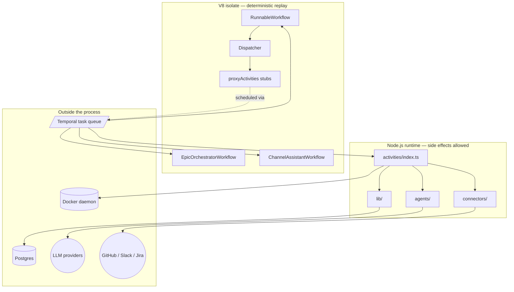
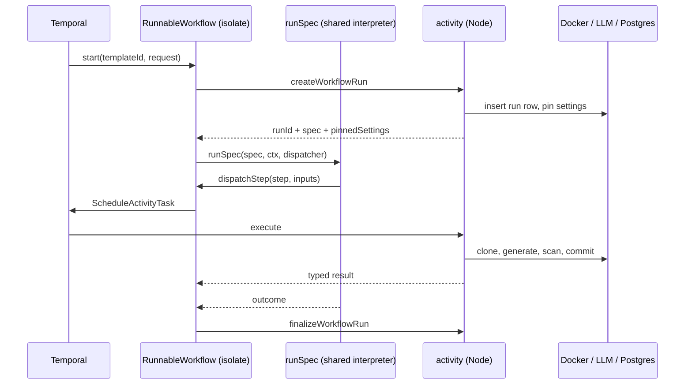

# @auto-swe/worker — Temporal Worker and Agent Runtime

> Indexed at commit `ae416937` on 2026-10-03 · [view on GitHub](https://github.com/yorch/auto-swe/tree/ae416937)

## Relevant source files

- [packages/worker/package.json](https://github.com/yorch/auto-swe/blob/ae416937/packages/worker/package.json)
- [packages/worker/src/index.ts](https://github.com/yorch/auto-swe/blob/ae416937/packages/worker/src/index.ts)
- [packages/worker/src/instrument.ts](https://github.com/yorch/auto-swe/blob/ae416937/packages/worker/src/instrument.ts)
- [packages/worker/src/workflows/index.ts](https://github.com/yorch/auto-swe/blob/ae416937/packages/worker/src/workflows/index.ts)
- [packages/worker/src/workflows/runnable.ts](https://github.com/yorch/auto-swe/blob/ae416937/packages/worker/src/workflows/runnable.ts)
- [packages/worker/src/workflows/proxyOptions.ts](https://github.com/yorch/auto-swe/blob/ae416937/packages/worker/src/workflows/proxyOptions.ts)
- [packages/worker/src/workflows/runnable.replay.test.ts](https://github.com/yorch/auto-swe/blob/ae416937/packages/worker/src/workflows/runnable.replay.test.ts)
- [packages/worker/src/activities/index.ts](https://github.com/yorch/auto-swe/blob/ae416937/packages/worker/src/activities/index.ts)
- [packages/worker/src/lib/workflowEngine.ts](https://github.com/yorch/auto-swe/blob/ae416937/packages/worker/src/lib/workflowEngine.ts)
- [packages/worker/src/lib/config/assertReady.ts](https://github.com/yorch/auto-swe/blob/ae416937/packages/worker/src/lib/config/assertReady.ts)
- [packages/worker/src/lib/activitySpans.ts](https://github.com/yorch/auto-swe/blob/ae416937/packages/worker/src/lib/activitySpans.ts)
- [packages/worker/src/lib/activityNodeTag.ts](https://github.com/yorch/auto-swe/blob/ae416937/packages/worker/src/lib/activityNodeTag.ts)
- [packages/shared/src/lib/systemConfig.ts](https://github.com/yorch/auto-swe/blob/ae416937/packages/shared/src/lib/systemConfig.ts)
- [packages/worker/src/connectors/issueTracker.ts](https://github.com/yorch/auto-swe/blob/ae416937/packages/worker/src/connectors/issueTracker.ts)
- [packages/worker/Dockerfile](https://github.com/yorch/auto-swe/blob/ae416937/packages/worker/Dockerfile)

## Overview

`@auto-swe/worker` is the execution half of the platform. The gateway accepts a work request and starts a Temporal workflow; this package is the process that picks that workflow off the task queue and does everything it describes — resolving agents, calling language models, cloning repositories into Docker containers, running quality gates, opening pull requests, and writing every trace and token back to the database.

The package is the largest in the monorepo: 28 workflow modules, 61 activity modules, and 73 library modules, plus the Mastra agent definitions and the external connectors. Each count is the number of `.ts` files under `src/workflows/`, `src/activities/`, and `src/lib/` (recursing into subdirectories such as `lib/config/` and `lib/scm/`) at the indexed commit, excluding `*.test.ts`, taken with `git ls-tree -r --name-only ae416937`. The library count is 55 files directly in `lib/` plus 13 in `lib/config/` and 5 in `lib/scm/`. The workflow count includes support files that export no workflow: the `index.ts` barrel, `proxyOptions.ts`, `taskChild.ts`, the node-tag pair (`nodeTag.ts`, `nodeTagScope.ts`), and the two workflow interceptor modules; 19 of the 28 are workflow definitions. The package is also the one with the hardest internal boundary. Workflow code runs inside a Temporal V8 isolate with deterministic replay; activity code runs in ordinary Node.js and is allowed to touch the world. Nearly every rule in this subsystem exists to keep those two halves from leaking into each other.

Infrastructure configuration reaches the worker through the process environment, not the database: container caps, the default workspace image, the activity concurrency cap and the scanner regex budget are read by `resolveWorkspaceInfra()` and validated at boot. Model and credential configuration is the opposite — database-driven, with the worker refusing to start until it is complete. See [Boot-time assertions](#bootstrap-and-boot-time-assertions) below.

Sources: [packages/worker/package.json:L1-L47](https://github.com/yorch/auto-swe/blob/ae416937/packages/worker/package.json#L1-L47) [packages/worker/src/index.ts:L18-L127](https://github.com/yorch/auto-swe/blob/ae416937/packages/worker/src/index.ts#L18-L127) [packages/shared/src/lib/systemConfig.ts:L733-L749](https://github.com/yorch/auto-swe/blob/ae416937/packages/shared/src/lib/systemConfig.ts#L733-L749)

## Architecture

```mermaid
graph TB
    subgraph Isolate["V8 isolate — deterministic replay"]
        Runnable[RunnableWorkflow]
        Epic[EpicOrchestratorWorkflow]
        ChannelWf[ChannelAssistantWorkflow]
        Dispatcher[Dispatcher]
        Proxies[proxyActivities stubs]
    end

    subgraph Node["Node.js runtime — side effects allowed"]
        Activities[activities/index.ts]
        Agents[agents/]
        Connectors[connectors/]
        Lib[lib/]
    end

    subgraph External["Outside the process"]
        Temporal[/Temporal task queue/]
        Docker[(Docker daemon)]
        DB[(Postgres)]
        LLM((LLM providers))
        SCM((GitHub / Slack / Jira))
    end

    Temporal --> Runnable
    Temporal --> Epic
    Temporal --> ChannelWf
    Runnable --> Dispatcher
    Dispatcher --> Proxies
    Proxies -.scheduled via.-> Temporal
    Temporal --> Activities
    Activities --> Agents
    Activities --> Connectors
    Activities --> Lib
    Lib --> DB
    Agents --> LLM
    Activities --> Docker
    Connectors --> SCM
```

The dashed edge is the whole point. A workflow never calls an activity directly; it calls a `proxyActivities` stub, which records a command in workflow history and hands scheduling back to Temporal. Temporal then delivers the activity task to the Node side of the same process, where it may block on Docker, Postgres, an LLM provider, or an HTTP API. Nothing on the right half of the diagram is reachable from the left half at runtime. The worker code that straddles the boundary is interceptors. Two are workflow-side and add headers only: one stamps each dispatched activity with the spec node it runs for, one forwards the starter's trace context. Two are activity-side: `activitySpanInterceptor` wraps every attempt in a span and a duration sample, and `activityNodeTagInterceptor` reads the node tag back so persisted trace rows know which node produced them (see [Observability and cost](./4.5-observability-and-cost.md)).

Sources: [packages/worker/src/workflows/runnable.ts:L269-L503](https://github.com/yorch/auto-swe/blob/ae416937/packages/worker/src/workflows/runnable.ts#L269-L503) [packages/worker/src/activities/index.ts:L1-L219](https://github.com/yorch/auto-swe/blob/ae416937/packages/worker/src/activities/index.ts#L1-L219) [packages/worker/src/index.ts:L98-L117](https://github.com/yorch/auto-swe/blob/ae416937/packages/worker/src/index.ts#L98-L117) [packages/worker/src/lib/activityNodeTag.ts:L55-L63](https://github.com/yorch/auto-swe/blob/ae416937/packages/worker/src/lib/activityNodeTag.ts#L55-L63)

## Module Layout

| Module | Path | Responsibility |
| ------ | ---- | -------------- |
| Bootstrap | [`src/index.ts`](https://github.com/yorch/auto-swe/blob/ae416937/packages/worker/src/index.ts), [`src/instrument.ts`](https://github.com/yorch/auto-swe/blob/ae416937/packages/worker/src/instrument.ts) | `instrument.ts` is the OpenTelemetry preload; `index.ts` runs metrics, boot assertions, the Temporal connection and `Worker.create` |
| Workflows | [`src/workflows/`](https://github.com/yorch/auto-swe/tree/ae416937/packages/worker/src/workflows) | 28 modules, 19 of them workflow definitions; isolate-safe only |
| Activities | [`src/activities/`](https://github.com/yorch/auto-swe/tree/ae416937/packages/worker/src/activities) | 61 modules; the deterministic boundary and every side effect |
| Agents | [`src/agents/`](https://github.com/yorch/auto-swe/tree/ae416937/packages/worker/src/agents) | Mastra agent and tool definitions (implementer, review network, decomposer, workspace tools), plus the implementer runtime seam |
| Connectors | [`src/connectors/`](https://github.com/yorch/auto-swe/tree/ae416937/packages/worker/src/connectors) | Four HTTP client modules: issue tracker (Linear and Jira), Notion, Zendesk, Slack |
| Library | [`src/lib/`](https://github.com/yorch/auto-swe/tree/ae416937/packages/worker/src/lib) | 73 modules: agent resolution, model binding, tracing, spans and metrics, cost, SCM, Docker helpers |

Sources: [packages/worker/src/workflows/index.ts:L1-L21](https://github.com/yorch/auto-swe/blob/ae416937/packages/worker/src/workflows/index.ts#L1-L21) [packages/worker/src/activities/index.ts:L1-L219](https://github.com/yorch/auto-swe/blob/ae416937/packages/worker/src/activities/index.ts#L1-L219)

## Key Components

### Bootstrap and boot-time assertions

The worker starts with `node --import ./dist/instrument.js dist/index.js` (`tsx watch --import ./src/instrument.ts` in development; the container `CMD` uses the same form). [`instrument.ts`](https://github.com/yorch/auto-swe/blob/ae416937/packages/worker/src/instrument.ts#L13) calls `initTelemetry('auto-swe-worker')` as a preload, so the OpenTelemetry SDK and its module hooks exist before `index.ts`'s import graph loads; started from the entry point instead, it would run after every static import had bound `http` and patch nothing. `index.ts` imports the resulting `otel` handle only for shutdown. `run()` in [src/index.ts#L18](https://github.com/yorch/auto-swe/blob/ae416937/packages/worker/src/index.ts#L18) is then ordered so that a misconfigured deployment fails at startup rather than inside the first activity:

1. Telemetry, via the preload above, before any application import ([instrument.ts:L1-L13](https://github.com/yorch/auto-swe/blob/ae416937/packages/worker/src/instrument.ts#L1-L13)).
2. `assertEncryptionKeyConfigured()`, the first call inside `run()`, because every provider credential and integration secret decrypts through that key ([L22](https://github.com/yorch/auto-swe/blob/ae416937/packages/worker/src/index.ts#L22)).
3. `initMetrics()`, so the instruments bind to the real meter provider rather than a no-op ([L24](https://github.com/yorch/auto-swe/blob/ae416937/packages/worker/src/index.ts#L24)).
4. `Runtime.install` with OTel metrics and an `OtelForwardingLogger` that also exports SDK and activity log lines over OTLP, only when `OTEL_EXPORTER_OTLP_ENDPOINT` is set ([L28-L38](https://github.com/yorch/auto-swe/blob/ae416937/packages/worker/src/index.ts#L28-L38)).
5. `assertConfigReady()`, which resolves every Agent the installed templates can reach and confirms each has a model and a credential, and checks the `EmbeddingConfig` singleton ([L46](https://github.com/yorch/auto-swe/blob/ae416937/packages/worker/src/index.ts#L46)).
6. `assertWorkspaceInfraEnv()`, which validates the infrastructure variables read from the environment (`WORKSPACE_MEMORY`, `WORKSPACE_CPUS`, `WORKSPACE_PIDS_LIMIT`, `WORKSPACE_IMAGE`, `WORKSPACE_METADATA_BLOCK_IMAGE`, `WORKSPACE_BLOCK_METADATA`, `WORKER_MAX_CONCURRENT_ACTIVITIES`, `SCANNER_REGEX_BUDGET_MS`) and throws one error naming every bad value. The resolvers themselves are lenient — they run on scan and workspace paths that must not throw — so without this strict pass a typo would silently run with a different limit than the operator wrote ([L51](https://github.com/yorch/auto-swe/blob/ae416937/packages/worker/src/index.ts#L51)).
7. A warning, not a failure, naming any `MODEL_PRICE_*` variable still set, because per-model price overrides are no longer read ([L56-L63](https://github.com/yorch/auto-swe/blob/ae416937/packages/worker/src/index.ts#L56-L63)).
8. `assertBuiltinStepsRegistered()`, which confirms every step the worker promises has registry metadata so a shipped template is never flagged `UNKNOWN_STEP` ([L69](https://github.com/yorch/auto-swe/blob/ae416937/packages/worker/src/index.ts#L69)).
9. `resolveWorkspaceInfra()` for the concurrency cap, then the Temporal `NativeConnection`, then `initTemporalClient()`, then `Worker.create` ([L74-L117](https://github.com/yorch/auto-swe/blob/ae416937/packages/worker/src/index.ts#L74-L117)).

The three assertions throw before the poller starts, and the top-level catch shuts telemetry down and exits non-zero so an orchestrator keeps the worker out of rotation. What each environment variable and each database row means is in [Configuration](./2.3-configuration-and-settings.md) and [Model Catalog and Pricing](./4.7-model-catalog-and-pricing.md); [Agent Layer](./4.3-agent-layer.md) covers what `assertConfigReady` walks.

Sources: [packages/worker/src/index.ts:L18-L127](https://github.com/yorch/auto-swe/blob/ae416937/packages/worker/src/index.ts#L18-L127) [packages/worker/src/instrument.ts:L1-L13](https://github.com/yorch/auto-swe/blob/ae416937/packages/worker/src/instrument.ts#L1-L13) [packages/worker/src/lib/config/assertReady.ts:L19-L76](https://github.com/yorch/auto-swe/blob/ae416937/packages/worker/src/lib/config/assertReady.ts#L19-L76) [packages/shared/src/lib/systemConfig.ts:L832-L876](https://github.com/yorch/auto-swe/blob/ae416937/packages/shared/src/lib/systemConfig.ts#L832-L876) [packages/worker/package.json:L6-L10](https://github.com/yorch/auto-swe/blob/ae416937/packages/worker/package.json#L6-L10) [packages/worker/Dockerfile:L147-L148](https://github.com/yorch/auto-swe/blob/ae416937/packages/worker/Dockerfile#L147-L148)

### Worker creation, task queue, and workflow bundle path

The worker registers the entire activity barrel as `activities`, polls the `engineering-workflow` task queue in the `default` namespace, and installs two activity interceptors (`activitySpanInterceptor`, `activityNodeTagInterceptor`) and two workflow-module interceptors (`nodeTagInterceptor`, `traceContextInterceptor`). It caps concurrent activity executions at `maxConcurrentActivityTaskExecutions`, taken from `resolveWorkspaceInfra().maxConcurrentActivities`, which reads the `WORKER_MAX_CONCURRENT_ACTIVITIES` environment variable (default 10, clamped to 1–1000) rather than Temporal's default of 100 — most activities hold a Docker workspace, so a burst would exhaust the Docker host. Temporal reads the cap when the worker is created, so changing it means a restart. The workflow bundle path and the two workflow-interceptor paths each resolve relative to the module with the same dev/prod split: the `.ts` file when it exists, so `tsx watch` development works, and the `.js` file otherwise for the compiled production image.

Sources: [packages/worker/src/index.ts:L71-L117](https://github.com/yorch/auto-swe/blob/ae416937/packages/worker/src/index.ts#L71-L117) [packages/shared/src/lib/systemConfig.ts:L801-L823](https://github.com/yorch/auto-swe/blob/ae416937/packages/shared/src/lib/systemConfig.ts#L801-L823)

### The isolate boundary and the `import type` rule

Workflow files are bundled separately and executed in a V8 isolate with no Node built-ins and no filesystem. Any runtime import of an external package either fails to bundle or drags non-deterministic behavior into replay. Workflow modules therefore use `import type` for everything outside `@temporalio/workflow` (and `@temporalio/common`, which `runnable.ts` imports for `ApplicationFailure` and `CancelledFailure`), and the sanctioned exceptions are deliberate. [`lib/workflowEngine.ts`](https://github.com/yorch/auto-swe/blob/ae416937/packages/worker/src/lib/workflowEngine.ts) re-exports the shared interpreter (`runSpec`, `readInterpreterLimits`, `BranchCancelledError`), `lookupPath`, `SignalSlots`, and the channel-task steer signal name through a worker-internal module, so workflow files import from a local path while sharing the implementation with `@auto-swe/shared`. [`workflows/proxyOptions.ts`](https://github.com/yorch/auto-swe/blob/ae416937/packages/worker/src/workflows/proxyOptions.ts) exports only plain object and string literals, with fully-erased type imports, which makes it safe to import at runtime from inside the isolate. The node-tag modules (`nodeTag.ts`, `nodeTagScope.ts`) and `taskChild.ts` follow the same pure-local-module pattern.

Determinism is enforced by test, not by convention alone. [`runnable.replay.test.ts`](https://github.com/yorch/auto-swe/blob/ae416937/packages/worker/src/workflows/runnable.replay.test.ts) replays 19 recorded history fixtures — `agent-node`, `agent-run`, `cond-loop`, `container-step`, `context-spill`, `eval`, `fan-out-block-cancel`, `fan-out`, `human-approval`, `human-decision`, `human-input`, `human-review`, `linear`, `mcp`, `nested-fan-out`, `on-error-continue`, `on-fail-retry`, `shell`, and `signal`, one `.bin` file each in `__fixtures__/` — against current workflow code. The fixtures are discovered by directory listing and the test pins their names, so losing one fails the suite. Replay guards only the paths a recorded history walked, and it compares command type and sequence rather than activity arguments, so a new control-flow shape needs a new fixture. Further interceptor-specific replay tests sit beside it; see [Temporal workflows](./4.1-temporal-workflows.md).

Sources: [packages/worker/src/lib/workflowEngine.ts:L1-L19](https://github.com/yorch/auto-swe/blob/ae416937/packages/worker/src/lib/workflowEngine.ts#L1-L19) [packages/worker/src/workflows/proxyOptions.ts:L10-L25](https://github.com/yorch/auto-swe/blob/ae416937/packages/worker/src/workflows/proxyOptions.ts#L10-L25) [packages/worker/src/workflows/runnable.ts:L9-L40](https://github.com/yorch/auto-swe/blob/ae416937/packages/worker/src/workflows/runnable.ts#L9-L40) [packages/worker/src/workflows/runnable.replay.test.ts:L38-L88](https://github.com/yorch/auto-swe/blob/ae416937/packages/worker/src/workflows/runnable.replay.test.ts#L38-L88)

### Retry and timeout presets

Every `proxyActivities` call site draws its retry policy and timeout from named presets rather than inline literals. Nine retry shapes cover the range from `RETRY_STATE` (durable run-state writes) through `RETRY_AGENT` (two attempts, because a retried implementer call re-burns tokens) to `RETRY_SINGLE_ATTEMPT` for activities that own an internal poll or repair loop. Timeout constants are named for their literal duration string so a reviewer can confirm at a glance that a refactor changed no effective value.

Sources: [packages/worker/src/workflows/proxyOptions.ts:L28-L160](https://github.com/yorch/auto-swe/blob/ae416937/packages/worker/src/workflows/proxyOptions.ts#L28-L160)

### `RunnableWorkflow` and the step executor map

[`RunnableWorkflow`](https://github.com/yorch/auto-swe/blob/ae416937/packages/worker/src/workflows/runnable.ts#L269) is the generic interpreter that executes any versioned workflow spec, and it is where most runs land — including a library agent run and a model-catalog refresh, which are executions of different specs. It materializes the run row — passing the request's `launchedById` so the run records who launched it — reads interpreter bounds from the pinned-settings snapshot taken at run start, registers a signal handler for every signal and human-in-the-loop node named in the spec plus the channel steer signal, then builds a `Dispatcher` whose methods forward to activity proxies. The shared interpreter walks the spec; the workflow body is pure walk and dispatch.

Step names map to activities through `STEP_EXECUTORS`, a `ReadonlyMap` of 38 entries built once at module load. The figure is counted from source: 30 entries open with `[` alone on a line at two-space indentation, and 8 are single-line entries (`listProviderModels`, `resolveCiWaitConfig`, and the six quality gates that share `gateExecutor`). Adding a step is a map entry, never a change to control flow. Finalization runs inside `CancellationScope.nonCancellable` so a cancelled or failed run still records its status, and `snapshotContext` spills oversized context strings into workflow artifacts under a per-chunk and per-run byte budget rather than truncating them. The Agent Run template and the implementer runtime seam are covered in [Agent runs and implementer runtimes](./4.6-agent-runs-and-implementer-runtimes.md).

Sources: [packages/worker/src/workflows/runnable.ts:L269-L503](https://github.com/yorch/auto-swe/blob/ae416937/packages/worker/src/workflows/runnable.ts#L269-L503) [packages/worker/src/workflows/runnable.ts:L592-L1052](https://github.com/yorch/auto-swe/blob/ae416937/packages/worker/src/workflows/runnable.ts#L592-L1052) [packages/worker/src/workflows/runnable.ts:L1229-L1325](https://github.com/yorch/auto-swe/blob/ae416937/packages/worker/src/workflows/runnable.ts#L1229-L1325)

### The other workflows

Eighteen further workflows share the same queue. `EpicOrchestratorWorkflow` fans a multi-repository epic out into child workflows, passes the epic's launcher down to every child, and computes the transitive dependent closure so a failed upstream repository marks its downstream repositories skipped. `ChannelAssistantWorkflow` turns one Slack mention into one reply, posting a placeholder and editing it in place when the turn completes; when a task launch is refused on access it delivers the refusal text instead of an acknowledgement, since nothing launched. Three more channel workflows cover ambient digests, reactive replies, and scheduled channel tasks. Six scheduled workflows drive lesson consolidation, evaluation runs, dataset revalidation, repository dependency scans, the repository-access sync, and provider model discovery; the access sync and model discovery are each a single activity call rather than a per-repository fan-out, because their cost is provider API quota against one shared credential. The remainder are the lesson-consolidation, evaluation-run, dependency-inference, and memory re-embedding workflows, plus the workflow-authoring, authoring-job, and explanation workflows.

Sources: [packages/worker/src/workflows/index.ts:L1-L21](https://github.com/yorch/auto-swe/blob/ae416937/packages/worker/src/workflows/index.ts#L1-L21) [packages/worker/src/workflows/epicOrchestrator.ts:L53-L92](https://github.com/yorch/auto-swe/blob/ae416937/packages/worker/src/workflows/epicOrchestrator.ts#L53-L92) [packages/worker/src/workflows/channelAssistant.ts:L325-L330](https://github.com/yorch/auto-swe/blob/ae416937/packages/worker/src/workflows/channelAssistant.ts#L325-L330) [packages/worker/src/workflows/scheduledRepoAccessSync.ts:L14-L29](https://github.com/yorch/auto-swe/blob/ae416937/packages/worker/src/workflows/scheduledRepoAccessSync.ts#L14-L29) [packages/worker/src/workflows/scheduledModelDiscovery.ts:L1-L21](https://github.com/yorch/auto-swe/blob/ae416937/packages/worker/src/workflows/scheduledModelDiscovery.ts#L1-L21)

### External connectors

[`src/connectors/`](https://github.com/yorch/auto-swe/tree/ae416937/packages/worker/src/connectors) holds four dependency-free HTTP client modules for the systems a non-code workflow reads from and writes to: `issueTracker.ts` (Linear and Jira behind a shared `createIssue` / `fetchIssue` facade), `notion.ts` (pages and blocks), `zendesk.ts` (tickets and comments), and `slack.ts` (message posts). Each sets an `AbortSignal.timeout` and classifies failures into Temporal terms, throwing `ApplicationFailure.nonRetryable` on an authentication or client error and a retryable failure on a 429 or 5xx. They are consumed only from activities — `genericActions.ts` for the `readSource`, `writeOutcome`, and `runTool` node types, and `resolveWorkspace.ts` for seeding a run's context.

Sources: [packages/worker/src/connectors/issueTracker.ts:L96-L117](https://github.com/yorch/auto-swe/blob/ae416937/packages/worker/src/connectors/issueTracker.ts#L96-L117) [packages/worker/src/connectors/slack.ts:L15-L52](https://github.com/yorch/auto-swe/blob/ae416937/packages/worker/src/connectors/slack.ts#L15-L52) [packages/worker/src/activities/genericActions.ts:L13-L21](https://github.com/yorch/auto-swe/blob/ae416937/packages/worker/src/activities/genericActions.ts#L13-L21) [packages/worker/src/activities/resolveWorkspace.ts:L11-L13](https://github.com/yorch/auto-swe/blob/ae416937/packages/worker/src/activities/resolveWorkspace.ts#L11-L13)

## Data Flow

```mermaid
sequenceDiagram
    participant Temporal
    participant Workflow as RunnableWorkflow (isolate)
    participant Interp as runSpec (shared interpreter)
    participant Activity as activity (Node)
    participant World as Docker / LLM / Postgres

    Temporal->>Workflow: start(templateId, request)
    Workflow->>Activity: createWorkflowRun
    Activity->>World: insert run row, pin settings
    Activity-->>Workflow: runId + spec + pinnedSettings
    Workflow->>Interp: runSpec(spec, ctx, dispatcher)
    Interp->>Workflow: dispatchStep(step, inputs)
    Workflow->>Temporal: ScheduleActivityTask
    Temporal->>Activity: execute
    Activity->>World: clone, generate, scan, commit
    Activity-->>Workflow: typed result
    Interp-->>Workflow: outcome
    Workflow->>Activity: finalizeWorkflowRun
```

The interpreter never calls an activity itself. It calls a `Dispatcher` method, and the workflow implements that method as a proxied activity call wrapped in `runWithNodeTag` and `runWithCancellation`. The first stores which spec node is dispatching so the activity carries a node tag; the second installs a per-call `CancellationScope` so fan-out block mode can abort a sibling branch instead of letting it drain.

Sources: [packages/worker/src/workflows/runnable.ts:L269-L298](https://github.com/yorch/auto-swe/blob/ae416937/packages/worker/src/workflows/runnable.ts#L269-L298) [packages/worker/src/workflows/runnable.ts:L370-L453](https://github.com/yorch/auto-swe/blob/ae416937/packages/worker/src/workflows/runnable.ts#L370-L453) [packages/worker/src/workflows/runnable.ts:L1140-L1150](https://github.com/yorch/auto-swe/blob/ae416937/packages/worker/src/workflows/runnable.ts#L1140-L1150)

## Runtime Environment

| Setting | Value | Source |
| ------- | ----- | ------ |
| Task queue | `engineering-workflow` | [index.ts#L113](https://github.com/yorch/auto-swe/blob/ae416937/packages/worker/src/index.ts#L113) |
| Namespace | `default` | [index.ts#L112](https://github.com/yorch/auto-swe/blob/ae416937/packages/worker/src/index.ts#L112) |
| Temporal address | `TEMPORAL_ADDRESS`, default `localhost:7233` | [index.ts#L75-L77](https://github.com/yorch/auto-swe/blob/ae416937/packages/worker/src/index.ts#L75-L77) |
| Activity concurrency | `WORKER_MAX_CONCURRENT_ACTIVITIES` via `resolveWorkspaceInfra()`, default 10, clamped 1–1000, boot-time only | [index.ts#L74](https://github.com/yorch/auto-swe/blob/ae416937/packages/worker/src/index.ts#L74), [index.ts#L111](https://github.com/yorch/auto-swe/blob/ae416937/packages/worker/src/index.ts#L111) |
| Activity interceptors | `activitySpanInterceptor`, `activityNodeTagInterceptor` | [index.ts#L105](https://github.com/yorch/auto-swe/blob/ae416937/packages/worker/src/index.ts#L105) |
| Workflow interceptor modules | `nodeTagInterceptor`, `traceContextInterceptor` | [index.ts#L106](https://github.com/yorch/auto-swe/blob/ae416937/packages/worker/src/index.ts#L106) |
| Runtime image | `node:26-slim`, glibc | [Dockerfile#L86](https://github.com/yorch/auto-swe/blob/ae416937/packages/worker/Dockerfile#L86) |

The runtime image is glibc rather than Alpine because `@temporalio/core-bridge` ships only `-gnu` prebuilds; on musl the worker dies at startup on a shared-library load. The Docker CLI is copied in from the official `docker:28-cli` image so the worker can manage workspace containers over the mounted host socket.

Sources: [packages/worker/Dockerfile:L76-L92](https://github.com/yorch/auto-swe/blob/ae416937/packages/worker/Dockerfile#L76-L92) [packages/worker/src/index.ts:L71-L117](https://github.com/yorch/auto-swe/blob/ae416937/packages/worker/src/index.ts#L71-L117)

## Child Pages

**[Temporal workflows](./4.1-temporal-workflows.md)** covers the 19 workflow functions exported from the barrel in depth: the generic `RunnableWorkflow` interpreter and its signal, human-in-the-loop, and fan-out handling; node attribution and trace-context forwarding; the epic orchestrator's child-workflow model; the channel-assistant and scheduled families; and the determinism regime — the `import type` rule, the 19 replay fixtures, and what re-recording a fixture does and does not fix.

**[Activity catalog](./4.2-activities.md)** walks the 61 activity modules grouped by concern: implementation and fix loops, quality gates, pull-request and continuous-integration handling, decomposition and merge, declarative node activities, evaluation, model discovery, channel assistant, repository-access sync, and run state. It documents the input and output shapes each activity contracts on and which modules are in-process helpers rather than registered activities.

**[Agent layer](./4.3-agent-layer.md)** documents how an agent key becomes a running model call: `resolveAgent` walking the five-level scope cascade, `resolveAgentSpec` composing model, prompt, skills, and tools into an in-process `AgentSpec` that never crosses an activity boundary, model binding across provider adapters, Mastra tool definitions, progressive skill disclosure, Model Context Protocol tool loading, and the boot-time readiness walk.

**[Docker workspaces](./4.4-docker-workspaces.md)** covers the Docker-in-Docker execution model: `createWorkspace` and the `Workspace` handle, `shellQuote` as the injection boundary for agent-generated commands, credential splitting so a clone token never lands in `.git/config`, container resource caps, dependency repository checkouts, ephemeral containers for shell and container steps, and the cleanup discipline that keeps containers from leaking.

**[Observability and cost](./4.5-observability-and-cost.md)** covers `AgentTracer` and the `persistActivityTrace` contract, including the node, trace and spend-owner stamps on each row and the `embedding` rows that make embedding spend visible for workflows with no ledger; the admin-scoped usage report; the `activity.<type>` span each attempt gets from the interceptor installed in the bootstrap; the low-cardinality metrics seeded by `initMetrics()`; OpenTelemetry setup; and the layered token and dollar budgets.

**[Agent runs and implementer runtimes](./4.6-agent-runs-and-implementer-runtimes.md)** is the code map for two features that share the model-calling loop. An agent run launches one library agent against one repository with no authored workflow, through a hidden system template and the generic `runAgent` activity, and optionally publishes a branch or draft pull request after deterministic checks and the security gate. The implementer runtime seam routes every implementer-family turn through `runImplementerTurn`, with a run-pinned setting choosing between the Mastra tool loop and the Claude Code harness.

**[Model catalog and pricing](./4.7-model-catalog-and-pricing.md)** explains how every LLM and embedding call is priced from `model_catalog_entries`, with `BUILTIN_MODELS` as the shipped baseline and fallback; the catalog API and its unpriced-model warnings; on-demand and scheduled provider model discovery that stores admin-reviewed suggestions; the `model-catalog-refresh` template; and the dashboard and cost-estimate consumers.

## Related Pages

- Repository structure: [Repository Structure](./1-repository-structure.md)
- Shared library, including the workflow spec and interpreter: [@auto-swe/shared](./2-shared-library.md)
- The service that starts these workflows: [Gateway API](./3-gateway-api.md)
- Sibling packages: [Web Dashboard](./5-web-dashboard.md) · [CLI](./6-cli.md) · [Bundle SDK](./7-bundle-sdk.md)
