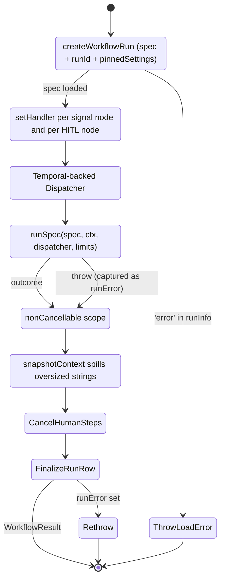

# Temporal Workflow Definitions

> Indexed at commit `b1d8930` on 2026-09-08 · [view on GitHub](https://github.com/yorch/auto-swe/tree/b1d8930)

## Relevant source files

- [packages/worker/src/workflows/index.ts](https://github.com/yorch/auto-swe/blob/b1d8930/packages/worker/src/workflows/index.ts)
- [packages/worker/src/workflows/runnable.ts](https://github.com/yorch/auto-swe/blob/b1d8930/packages/worker/src/workflows/runnable.ts)
- [packages/worker/src/workflows/proxyOptions.ts](https://github.com/yorch/auto-swe/blob/b1d8930/packages/worker/src/workflows/proxyOptions.ts)
- [packages/worker/src/workflows/epicOrchestrator.ts](https://github.com/yorch/auto-swe/blob/b1d8930/packages/worker/src/workflows/epicOrchestrator.ts)
- [packages/worker/src/workflows/channelAssistant.ts](https://github.com/yorch/auto-swe/blob/b1d8930/packages/worker/src/workflows/channelAssistant.ts)
- [packages/worker/src/workflows/channelScheduledTask.ts](https://github.com/yorch/auto-swe/blob/b1d8930/packages/worker/src/workflows/channelScheduledTask.ts)
- [packages/worker/src/workflows/channelAmbient.ts](https://github.com/yorch/auto-swe/blob/b1d8930/packages/worker/src/workflows/channelAmbient.ts)
- [packages/worker/src/workflows/channelReactive.ts](https://github.com/yorch/auto-swe/blob/b1d8930/packages/worker/src/workflows/channelReactive.ts)
- [packages/worker/src/workflows/taskChild.ts](https://github.com/yorch/auto-swe/blob/b1d8930/packages/worker/src/workflows/taskChild.ts)
- [packages/worker/src/workflows/workflowAuthorJob.ts](https://github.com/yorch/auto-swe/blob/b1d8930/packages/worker/src/workflows/workflowAuthorJob.ts)
- [packages/worker/src/workflows/workflowAuthor.ts](https://github.com/yorch/auto-swe/blob/b1d8930/packages/worker/src/workflows/workflowAuthor.ts)
- [packages/worker/src/workflows/workflowExplain.ts](https://github.com/yorch/auto-swe/blob/b1d8930/packages/worker/src/workflows/workflowExplain.ts)
- [packages/worker/src/workflows/scheduledConsolidation.ts](https://github.com/yorch/auto-swe/blob/b1d8930/packages/worker/src/workflows/scheduledConsolidation.ts)
- [packages/worker/src/workflows/scheduledEval.ts](https://github.com/yorch/auto-swe/blob/b1d8930/packages/worker/src/workflows/scheduledEval.ts)
- [packages/worker/src/workflows/scheduledRevalidation.ts](https://github.com/yorch/auto-swe/blob/b1d8930/packages/worker/src/workflows/scheduledRevalidation.ts)
- [packages/worker/src/workflows/scheduledRepoDependencyScan.ts](https://github.com/yorch/auto-swe/blob/b1d8930/packages/worker/src/workflows/scheduledRepoDependencyScan.ts)
- [packages/worker/src/workflows/consolidateLessons.ts](https://github.com/yorch/auto-swe/blob/b1d8930/packages/worker/src/workflows/consolidateLessons.ts)
- [packages/worker/src/workflows/evalRun.ts](https://github.com/yorch/auto-swe/blob/b1d8930/packages/worker/src/workflows/evalRun.ts)
- [packages/worker/src/workflows/inferRepoDependencies.ts](https://github.com/yorch/auto-swe/blob/b1d8930/packages/worker/src/workflows/inferRepoDependencies.ts)
- [packages/worker/src/workflows/reembedMemory.ts](https://github.com/yorch/auto-swe/blob/b1d8930/packages/worker/src/workflows/reembedMemory.ts)
- [packages/worker/src/lib/workflowEngine.ts](https://github.com/yorch/auto-swe/blob/b1d8930/packages/worker/src/lib/workflowEngine.ts)
- [packages/worker/src/workflows/runnable.replay.test.ts](https://github.com/yorch/auto-swe/blob/b1d8930/packages/worker/src/workflows/runnable.replay.test.ts)
- [packages/worker/src/workflows/runnable.workflow.test.ts](https://github.com/yorch/auto-swe/blob/b1d8930/packages/worker/src/workflows/runnable.workflow.test.ts)
- [packages/worker/scripts/recordReplayHistory.ts](https://github.com/yorch/auto-swe/blob/b1d8930/packages/worker/scripts/recordReplayHistory.ts)

## Overview

`packages/worker/src/workflows/` holds every Temporal workflow definition in the platform. Seventeen workflow functions are exported from the barrel at [packages/worker/src/workflows/index.ts](https://github.com/yorch/auto-swe/blob/b1d8930/packages/worker/src/workflows/index.ts), which is the module the worker points `workflowsPath` at so Temporal can bundle them all into one V8 isolate.

Only one of them contains real business logic. `RunnableWorkflow` is a generic interpreter that executes any versioned JSON workflow spec; everything a run does — implement, review, gate, open a pull request, wait for a human — is a node in that spec rather than a branch in workflow code. The other sixteen are orchestration shells: fan-out parents, schedule targets, thin durable wrappers around a single activity, and channel-assistant turn handlers.

The directory also holds four test files and a `__fixtures__/` directory of thirteen recorded histories. Those are covered in the last two sections and are never loaded by the worker bundle.

## Workflow Inventory

| Workflow | Input | Output | Role |
| -------- | ----- | ------ | ---- |
| `RunnableWorkflow` | `RunnableWorkflowInput` (`templateId`, `templateVersion`, `request`) | `WorkflowResult` | Generic spec interpreter; the platform's main run |
| `EpicOrchestratorWorkflow` | `EpicRequest` | `EpicResult` | Multi-repo epic; starts one child run per repo in dependency order |
| `ChannelAssistantWorkflow` | `ChannelAssistantTurnInput` | `void` | One Slack @mention, one reply; may launch a task child |
| `ChannelScheduledTaskWorkflow` | `ChannelScheduledTaskInput` | `void` | Sleeps until `runAt`, then starts a deferred task child |
| `ChannelAmbientWorkflow` | `{ channelId }` | `void` | Per-channel proactive digest, memory consolidation, sweeps |
| `ChannelReactiveWorkflow` | `{ channelId }` | `void` | Per-channel reactive interjection evaluation |
| `ScheduledConsolidationWorkflow` | `ScheduledConsolidationInput` | `ScheduledConsolidationResult` | Fan-out to one `ConsolidateLessonsWorkflow` child per repo |
| `ConsolidateLessonsWorkflow` | `ConsolidateLessonsInput` | `ConsolidateLessonsResult` | Single-activity lesson consolidation for one repo |
| `ScheduledEvalWorkflow` | `ScheduledEvalInput` | `void` | Nightly benchmark; prepare then run the eval harness |
| `EvalRunWorkflow` | `EvalRunWorkflowInput` | `void` | Durable wrapper around one offline eval harness run |
| `ScheduledRevalidationWorkflow` | `ScheduledRevalidationInput` | `ScheduledRevalidationResult` | Per-dataset re-validation fan-out |
| `ScheduledRepoDependencyScanWorkflow` | none | `ScheduledRepoDependencyScanResult` | Per-repo dependency detection fan-out |
| `InferRepoDependenciesWorkflow` | `{ repoId }` | `{ autoPromoted, proposed }` | One-shot LLM dependency inference for one repo |
| `ReembedMemoryWorkflow` | `{ memoryId }` | `void` | Regenerates a stale pgvector embedding out of band |
| `WorkflowAuthorWorkflow` | `GenerateWorkflowSpecInput` | `GenerateWorkflowSpecResult` | Synchronous spec generation the gateway awaits |
| `WorkflowAuthorJobWorkflow` | `WorkflowAuthorJobInput` | `WorkflowAuthorJobResult` | Async spec generation job with a progress query |
| `WorkflowExplainWorkflow` | `ExplainWorkflowSpecInput` | `ExplainWorkflowSpecResult` | One fast LLM call explaining a spec in plain language |

Every workflow runs on the single `engineering-workflow` task queue. The gateway starts them by name from its Temporal plugin, either directly or as the action of a named Temporal Schedule.

Sources: [packages/worker/src/workflows/index.ts:L1-L19](https://github.com/yorch/auto-swe/blob/b1d8930/packages/worker/src/workflows/index.ts#L1-L19) [packages/worker/src/workflows/runnable.ts:L232-L240](https://github.com/yorch/auto-swe/blob/b1d8930/packages/worker/src/workflows/runnable.ts#L232-L240) [packages/worker/src/workflows/epicOrchestrator.ts:L89](https://github.com/yorch/auto-swe/blob/b1d8930/packages/worker/src/workflows/epicOrchestrator.ts#L89)

## RunnableWorkflow

### Lifecycle

`RunnableWorkflow` runs in five stages and never inspects the spec's semantics itself. It materializes the run row, registers signal handlers, builds a dispatcher, hands both to the shared interpreter, and finalizes.



The first activity, `createWorkflowRun`, returns the parsed spec, the run id, and a pinned-settings snapshot in one round trip; a failure to load the template throws before anything else happens. Interpreter bounds come from that snapshot through `readInterpreterLimits`, not from a live config read, so a mid-run settings edit cannot change the ceiling a replay was recorded under.

The run's workspace defaults are derived on the workflow side: `connectionId` falls back from the request's `connectionId` to `repoId`, and an absent `workspaceProvider` becomes `git_repo`, which is what makes a software-engineering run a special case of the generic one rather than a separate code path.

Finalization is wrapped in `CancellationScope.nonCancellable`. Without it, every activity started after the root scope was cancelled would throw `CancelledFailure` immediately, leaving cancelled runs stuck at `RUNNING` with their pending human steps still in the inbox. Inside that scope the workflow snapshots the context, cancels lingering `PENDING` human steps best-effort, and writes the terminal status. A cancellation surfaces from `runSpec` as a `CancelledFailure` and is classified `CANCELLED` rather than `FAILED`.

The returned object spreads the terminate node's result first and then the real status, so a `status` key inside a spec-authored result cannot overwrite the run's actual outcome.

Sources: [packages/worker/src/workflows/runnable.ts:L240-L447](https://github.com/yorch/auto-swe/blob/b1d8930/packages/worker/src/workflows/runnable.ts#L240-L447) [packages/worker/src/lib/workflowEngine.ts:L1-L19](https://github.com/yorch/auto-swe/blob/b1d8930/packages/worker/src/lib/workflowEngine.ts#L1-L19)

### Activity proxies and timeout tiers

Seventeen `proxyActivities` groups sit at module scope, each pairing a retry policy with a timeout tier drawn from [packages/worker/src/workflows/proxyOptions.ts](https://github.com/yorch/auto-swe/blob/b1d8930/packages/worker/src/workflows/proxyOptions.ts). Retry presets are named by role and timeout constants by their literal duration string, so a reviewer can confirm at a glance that a refactor changed no effective value.

| Proxy group | Retry preset | Start-to-close | Heartbeat |
| ----------- | ------------ | -------------- | --------- |
| state (run rows, human steps, spill) | `RETRY_STATE` (5 attempts) | `30s` | none |
| generic (workspace, source, outcome, tool) | `RETRY_STANDARD` (3 attempts) | `1m` | none |
| agent (implement, review network, fixes) | `RETRY_AGENT` (2 attempts) | `30m` | `5m` |
| shell and container steps | `RETRY_SANDBOX` (2 attempts) | `60m` | none |
| quality gates (six activities) | `RETRY_SANDBOX` | `15m` | `2m` |
| declarative agent, eval, MCP nodes | `RETRY_STANDARD` | `10m` | `2m` |
| CI polling | `RETRY_SINGLE_ATTEMPT` | `6h` | `2m` |
| GitHub (pull request, CI logs) | inline, 4 attempts | `2m` | none |
| PRD decomposition | `RETRY_LLM_LIGHT` (2 attempts) | `15m` | `5m` |

Two choices in that table carry load. Gate activities keep Temporal-level retries low on purpose, because retry, warn, and block semantics belong to the spec's `onFail` policy and are handled by the interpreter, not the proxy. `waitForCiByPolling` gets exactly one attempt and a six-hour cap, since the activity owns its own poll loop and bounds itself by the `deadlineSec` input; the cap only has to exceed the largest configurable deadline.

Sources: [packages/worker/src/workflows/runnable.ts:L56-L228](https://github.com/yorch/auto-swe/blob/b1d8930/packages/worker/src/workflows/runnable.ts#L56-L228) [packages/worker/src/workflows/proxyOptions.ts:L27-L180](https://github.com/yorch/auto-swe/blob/b1d8930/packages/worker/src/workflows/proxyOptions.ts#L27-L180)

### Step dispatch

The interpreter asks the dispatcher to run a step by name. `dispatchStepImpl` does one `Map` lookup against `STEP_EXECUTORS` and throws `unknown step` on a miss, so there is no `switch` and adding a step never changes control flow.

Thirty-six executors are registered, covering domain-state updates, context validation, the declarative agent, eval, MCP and container nodes, implementation and its three fix variants, the review network, the six quality gates, pull-request creation, CI log fetch and polling, memory commits, branch merges and conflict resolution, PRD decomposition, and the generic connector steps that read a source, write an outcome, publish, or run a tool. The six quality gates share a single `gateExecutor` that indexes the activity by the step name, because all six take the same input shape.

Executors resolve their arguments from three places in a fixed order: explicit `inputs` bindings, the node's `config`, then a `lookupPath` read from the run context. `pickCodeResult` centralizes the common fallback to `context.currentCodeResult` and throws when nothing is bound. A step inside a fan-out branch reads its per-branch element through the interpreter-named `fanOut.itemKey`, defaulting to `subtask`.

Tool selection is deliberately excluded from this path: an executor derives `config.systemPrompt` but never forwards a tools override, because tool access is resolved from the database through the agent cascade.

Sources: [packages/worker/src/workflows/runnable.ts:L528-L950](https://github.com/yorch/auto-swe/blob/b1d8930/packages/worker/src/workflows/runnable.ts#L528-L950) [packages/worker/src/workflows/runnable.ts:L954-L983](https://github.com/yorch/auto-swe/blob/b1d8930/packages/worker/src/workflows/runnable.ts#L954-L983)

### Signals and human-in-the-loop suspension

Signal handlers are registered up front for every name the spec mentions statically: a `signal` node's `name`, and `hitl_<nodeId>` for each of the four human node types. `SignalSlots` owns the buffering and stale-payload semantics so the dispatcher stays a thin wrapper.

Static registration is not sufficient. A human node reached inside a fan-out branch waits on a branch-unique name such as `hitl_fan[0]/gate`, which only exists once the interpreter walks there, so `waitSignal` registers any unseen name lazily on first use. That is replay-safe because Temporal buffers a signal that arrives before its handler is set and handler registration emits no command.

```mermaid
sequenceDiagram
    participant I as Interpreter (runHitl)
    participant D as Dispatcher
    participant T as Temporal
    participant G as Gateway / inbox
    I->>D: recordStep(PENDING)
    I->>D: notifyHumanStep(kind, options, timeout)
    D->>T: createHumanStep activity
    T-->>G: row appears in the inbox
    I->>D: waitSignal("hitl_<nodeId>", node.timeout)
    D->>D: ensureSignalHandler(name)
    D->>T: condition(() => slots.hasPending(name), timeout)
    Note over T: workflow parks; no activity in flight
    G->>T: signal hitl_<nodeId> {action, value}
    T-->>D: slots.deliver -> condition resolves
    D-->>I: slots.take(payload)
    I->>I: route on approve / reject / option / onSubmit
```

The wait is a plain `condition` with the node's timeout as its duration. On timeout the interpreter records the step `SKIPPED`, resolves the database row as `TIMED_OUT`, and takes the node's `onTimeout` edge. Deliberately, `waitSignal` performs no stale-payload reset: a signal that lands before the interpreter reaches its wait node, which is what happens when a continuous-integration webhook races the pull-request step, is kept and satisfies that wait, and `take()` consumes it so no later wait can see it twice.

A second signal, the channel steering signal, appends to a plain in-workflow array. Its buffer is drained by `drainSteering()` so each agent node consumes only the guidance that arrived since the previous one. Steering reaches `agent` nodes only, so a code-route task running the software-engineering template buffers steering that is never consumed.

Sources: [packages/worker/src/workflows/runnable.ts:L271-L322](https://github.com/yorch/auto-swe/blob/b1d8930/packages/worker/src/workflows/runnable.ts#L271-L322) [packages/worker/src/workflows/runnable.ts:L352-L375](https://github.com/yorch/auto-swe/blob/b1d8930/packages/worker/src/workflows/runnable.ts#L352-L375)

### Fan-out and cancellation

The workflow does not implement fan-out; the shared interpreter runs branches through a bounded worker pool and calls back into the dispatcher for each step. What the workflow contributes is cancellation. When the interpreter passes a `cancellation` sink, `runWithCancellation` wraps the activity await in a per-call `CancellationScope` and writes a `cancel()` callback into the sink, so a fan-out running in block mode can abort every sibling's in-flight Temporal activity instead of letting it drain.

A cancelled call is rethrown as `BranchCancelledError` rather than the raw `CancelledFailure`. That distinction matters: the interpreter's retry wrapper recognizes the branch error and bypasses `onError` and `onFail` policies, so a sibling with `onFail: 'warn'` cannot swallow a cancellation raised on it by block mode and keep running. The token is cleared in a `finally`, because leaving it behind would let a later cancel target a scope that already settled.

Sources: [packages/worker/src/workflows/runnable.ts:L985-L1020](https://github.com/yorch/auto-swe/blob/b1d8930/packages/worker/src/workflows/runnable.ts#L985-L1020) [packages/worker/src/workflows/runnable.ts:L324-L351](https://github.com/yorch/auto-swe/blob/b1d8930/packages/worker/src/workflows/runnable.ts#L324-L351)

### Run state and the context spill

Run state is surfaced through the database, not through Temporal queries. `RunnableWorkflow` defines no query handler: it reports progress by calling `recordWorkflowStep` on every step transition, `createHumanStep` and `resolveHumanStep` around human nodes, and `finalizeWorkflowRun` at the end, and the dashboard reads those rows. The only query handler in the directory belongs to `WorkflowAuthorJobWorkflow`.

The final snapshot is size-managed by `snapshotContext`. It walks the context recording the path of every string longer than the 4,000-character inline limit, then writes those values to workflow artifacts in batches sized by an accumulated one-million-unit budget, and substitutes an artifact reference by path so two identical strings at different paths cannot collide. A total ceiling of eight million units bounds how much one run may spill, because activity inputs are themselves recorded in workflow history. Past the ceiling, or on a failed artifact write, the value degrades to a truncated placeholder whose note says which case applied.

Sources: [packages/worker/src/workflows/runnable.ts:L1022-L1176](https://github.com/yorch/auto-swe/blob/b1d8930/packages/worker/src/workflows/runnable.ts#L1022-L1176) [packages/worker/src/workflows/runnable.ts:L357-L365](https://github.com/yorch/auto-swe/blob/b1d8930/packages/worker/src/workflows/runnable.ts#L357-L365)

## Child-Workflow Relationships

Four workflows start children, and each launch site pins its own parent-close and reuse policy.

`EpicOrchestratorWorkflow` loops while unfinished repos remain, selecting repos whose dependencies have all succeeded and starting one `RunnableWorkflow` child per ready repo under `PARENT_CLOSE_POLICY_REQUEST_CANCEL` and a workflow id of `<epicWorkflowId>-<repoId>`. Each child resolves its own template from its repo's team default, so repos in one epic can run different workflows. When a repo finishes without success, `computeTransitiveDependents` walks the dependency graph and marks every downstream repo `SKIPPED`; the seed set includes the failed repo itself so a cycle cannot re-add it and overwrite its terminal verdict. A single `epicCancelSignal` sets a flag the loop checks each iteration.

`ChannelAssistantWorkflow` launches a task child but never awaits it, because the task must outlive the short turn that posted the acknowledgement. Both its task routes go through `startThreadTaskChild`, which centralizes three invariants: the abandon parent-close policy, the `engineering-workflow` task queue, and `REJECT_DUPLICATE` on a deterministic per-thread workflow id. That id is single-use because the run record is upserted by workflow id, so reusing it would silently misattribute a second task's traces and cost to the first, closed run. A rejected duplicate surfaces as `WorkflowExecutionAlreadyStartedError` and becomes an honest "already a task in this thread" reply rather than a false acknowledgement.

`ChannelScheduledTaskWorkflow` is the deferred variant. It holds the same per-thread id, sleeps until `runAt`, folds any steering that arrived before launch into the task description, then starts `RunnableWorkflow` under a private `<id>-run` child id. It then awaits the child purely to hold the steering bridge open, forwarding each later reply to the running child and swallowing a signal rejection from an already-closed run. An unparseable `runAt` yields `NaN` and is treated as run-now rather than hanging.

`ScheduledConsolidationWorkflow` is the only pure fan-out parent: it starts one `ConsolidateLessonsWorkflow` child per opted-in repo with a thirty-minute execution timeout, then awaits each handle individually inside a try/catch so one repo's failure never discards another repo's result. The two other scheduled sweeps use the same isolation shape with plain activity calls instead of children.

Sources: [packages/worker/src/workflows/epicOrchestrator.ts:L58-L235](https://github.com/yorch/auto-swe/blob/b1d8930/packages/worker/src/workflows/epicOrchestrator.ts#L58-L235) [packages/worker/src/workflows/taskChild.ts:L24-L36](https://github.com/yorch/auto-swe/blob/b1d8930/packages/worker/src/workflows/taskChild.ts#L24-L36) [packages/worker/src/workflows/channelAssistant.ts:L409-L520](https://github.com/yorch/auto-swe/blob/b1d8930/packages/worker/src/workflows/channelAssistant.ts#L409-L520) [packages/worker/src/workflows/channelScheduledTask.ts:L58-L166](https://github.com/yorch/auto-swe/blob/b1d8930/packages/worker/src/workflows/channelScheduledTask.ts#L58-L166) [packages/worker/src/workflows/scheduledConsolidation.ts:L22-L63](https://github.com/yorch/auto-swe/blob/b1d8930/packages/worker/src/workflows/scheduledConsolidation.ts#L22-L63)

## Channel and Scheduled Workflows

The three channel-triggered workflows share a run-record lifecycle: `startChannelRun` runs first so the agent traces produced inside can resolve a run id and persist, then the body runs, then `finalizeChannelRun` writes the terminal status. Every one of those three calls is wrapped in its own try/catch, because observability must never block the user-visible outcome.

`ChannelAmbientWorkflow` fires five activities in sequence on each schedule tick — digest, memory consolidation, open-item sweep, passive ingestion, and cross-channel signal flagging — each independently best-effort so a failure in one never blocks the rest, and only the digest failure flips the run status. `ChannelReactiveWorkflow` runs a single interjection evaluation on the channel's reactive cron. `ChannelAssistantWorkflow` posts a placeholder message, runs the turn, and edits the placeholder in place with the answer, falling back to a fresh post when the placeholder has no timestamp and to friendly error text when the turn throws. Its turn can return a delegate, generate, or refine intent, and all three are gated on the channel budget before any expensive work starts.

The remaining workflows are thin. `ConsolidateLessonsWorkflow`, `EvalRunWorkflow`, `InferRepoDependenciesWorkflow`, `ReembedMemoryWorkflow`, `WorkflowAuthorWorkflow`, and `WorkflowExplainWorkflow` each proxy exactly one activity and return its result; they exist so the work is durable, observable in the Temporal UI, and resumable. `WorkflowAuthorJobWorkflow` is the one exception with real structure: it exposes an `authorJobProgress` query returning a phase of `generating`, `persisting`, `done`, or `failed`, so the gateway can start it without blocking an HTTP request and let the browser poll. Its persist activity gets exactly one attempt, because a retry after a committed-but-unacknowledged create would leave a second draft template behind.

Sources: [packages/worker/src/workflows/channelAmbient.ts:L89-L173](https://github.com/yorch/auto-swe/blob/b1d8930/packages/worker/src/workflows/channelAmbient.ts#L89-L173) [packages/worker/src/workflows/channelReactive.ts:L37-L77](https://github.com/yorch/auto-swe/blob/b1d8930/packages/worker/src/workflows/channelReactive.ts#L37-L77) [packages/worker/src/workflows/channelAssistant.ts:L142-L345](https://github.com/yorch/auto-swe/blob/b1d8930/packages/worker/src/workflows/channelAssistant.ts#L142-L345) [packages/worker/src/workflows/workflowAuthorJob.ts:L42-L101](https://github.com/yorch/auto-swe/blob/b1d8930/packages/worker/src/workflows/workflowAuthorJob.ts#L42-L101)

## Determinism Discipline

Workflow files execute in a V8 isolate, not in Node.js. The isolate has no filesystem, no network, and no Node built-ins, and Temporal's bundler treats a runtime import from an outside package as a determinism hazard. The rule the codebase enforces is therefore mechanical: from an external package, only `import type`, which the TypeScript compiler erases entirely.

Three categories of module-level import are legal in a workflow file:

| Import kind | Example | Why it is safe |
| ----------- | ------- | -------------- |
| Runtime values from `@temporalio/workflow` | `proxyActivities`, `condition`, `setHandler`, `sleep`, `startChild`, `log`, `CancellationScope` | The SDK is the isolate's own runtime |
| `import type` from anywhere | `import type * as activitiesType from '../activities/index.js'` | Erased at compile time; carries no runtime value |
| Runtime imports from pure local modules | `./proxyOptions.js`, `./taskChild.js`, `../lib/workflowEngine.js` | Object and string literals plus Temporal-only imports, with no Node or external dependency |

`packages/worker/src/lib/workflowEngine.ts` exists solely to make the third category work for shared code. It re-exports `runSpec`, `readInterpreterLimits`, `lookupPath`, `SignalSlots`, `BranchCancelledError`, and the steering-signal constant from `@auto-swe/shared`, so workflow files import from a worker-internal path while the implementation stays shared.

Two subtler rules follow from the same constraint. The activity proxies at module scope perform no input/output, so building `STEP_EXECUTORS` once at module load is safe. And `Date.now()` and `new Date()` are deterministic inside a workflow, because the SDK patches them against the replay clock — which is what lets `ChannelScheduledTaskWorkflow` compute a sleep from a wall-clock timestamp.

Sources: [packages/worker/src/lib/workflowEngine.ts:L1-L19](https://github.com/yorch/auto-swe/blob/b1d8930/packages/worker/src/lib/workflowEngine.ts#L1-L19) [packages/worker/src/workflows/proxyOptions.ts:L12-L25](https://github.com/yorch/auto-swe/blob/b1d8930/packages/worker/src/workflows/proxyOptions.ts#L12-L25) [packages/worker/src/workflows/runnable.ts:L449-L459](https://github.com/yorch/auto-swe/blob/b1d8930/packages/worker/src/workflows/runnable.ts#L449-L459) [packages/worker/src/workflows/channelScheduledTask.ts:L94-L99](https://github.com/yorch/auto-swe/blob/b1d8930/packages/worker/src/workflows/channelScheduledTask.ts#L94-L99)

## Testing Strategy

Four files in this directory are tests, not workflow definitions, and none of them is exported from the barrel.

[runnable.workflow.test.ts](https://github.com/yorch/auto-swe/blob/b1d8930/packages/worker/src/workflows/runnable.workflow.test.ts) runs the real workflow code forward inside Temporal's time-skipping `TestWorkflowEnvironment` with every activity replaced by an in-process fake. It covers signal delivery, a signal that arrives before the interpreter reaches its wait node, the timeout route under time skipping, finalization as `FAILED` after a blocking step exhausts its retries, a human node answered separately inside each fan-out branch, cancellation, workspace defaulting, and the four context-spill behaviours. One case deliberately serves an undefined pinned-settings snapshot, because a run row created before that column existed carries null and an unguarded read would strand it silently.

[channelAssistant.workflow.test.ts](https://github.com/yorch/auto-swe/blob/b1d8930/packages/worker/src/workflows/channelAssistant.workflow.test.ts) uses the same harness for the Slack turn: placeholder editing, both fallback paths, budget refusal, workflow generation and refinement, and the code-route fallback to a general task when no repository resolves. [epicOrchestrator.test.ts](https://github.com/yorch/auto-swe/blob/b1d8930/packages/worker/src/workflows/epicOrchestrator.test.ts) is a plain unit test of `computeTransitiveDependents` over chains, diamonds, cycles, and dangling dependency ids.

Sources: [packages/worker/src/workflows/runnable.workflow.test.ts:L1-L205](https://github.com/yorch/auto-swe/blob/b1d8930/packages/worker/src/workflows/runnable.workflow.test.ts#L1-L205) [packages/worker/src/workflows/channelAssistant.workflow.test.ts:L243-L437](https://github.com/yorch/auto-swe/blob/b1d8930/packages/worker/src/workflows/channelAssistant.workflow.test.ts#L243-L437) [packages/worker/src/workflows/epicOrchestrator.test.ts:L1-L80](https://github.com/yorch/auto-swe/blob/b1d8930/packages/worker/src/workflows/epicOrchestrator.test.ts#L1-L80)

## Replay Testing

Running forward against fakes catches logic errors. It cannot catch the failure Temporal is hardest to debug: a change that makes the workflow take a different path when replaying an execution that already happened, which surfaces in production as a stuck run long after the deploy that caused it.

[runnable.replay.test.ts](https://github.com/yorch/auto-swe/blob/b1d8930/packages/worker/src/workflows/runnable.replay.test.ts) closes that gap. It discovers every `.bin` file under `__fixtures__/`, decodes it as binary protobuf, and replays it against the current bundle with `Worker.runReplayHistory`. Fixtures are discovered rather than listed, because a fixture nobody replays is worse than no fixture — it looks like coverage. Binary protobuf is used rather than JSON because the proto3-JSON converters mangle timestamps and payload metadata on round trip.

Thirteen fixtures exist, one per control-flow shape, because replay only guards the paths a recorded history actually walked:

| Fixture | Shape it covers |
| ------- | --------------- |
| `linear` | `step` dispatch, a `cond` branch, an explicit `terminate` |
| `fan-out` | Bounded-concurrency branch scheduling and the join |
| `signal` | Signal-handler registration and the park/resume boundary |
| `human-approval` | Human park on `hitl_<nodeId>`, routed on approve/reject |
| `human-decision` | Routing on which option came back |
| `human-input` | A structured payload folded back into context |
| `human-review` | Routing on `onSubmit` rather than approve/reject |
| `agent-node` | The declarative agent node |
| `eval` | The eval node's scorers and judge threshold |
| `mcp` | A single external tool call node |
| `shell` | A user-authored command in an ephemeral container |
| `container-step` | The container-contract coded capability |
| `context-spill` | A `set` node plus the finalization spill path |

Four guard tests protect the fixture set itself. One asserts the exact list of names, so silently losing a fixture would fail rather than quietly narrow the guard. One asserts each history has more than ten events and more than one completed workflow task, since a truncated fixture would replay vacuously. One asserts the five parking fixtures actually recorded a signal event, proving they parked and resumed rather than timing out. One asserts the fan-out fixture scheduled more than three activities and the spill fixture actually called `storeContextOverflowBatch`.

The test file names its own blind spot: Temporal compares command type and sequence, not activity arguments, so permuting same-type branch activities replays clean. Reversing the fan-out worker pool's iteration order passes. Replay guards the shape of the command stream, not the data flowing through it.

**A failing replay test must not be fixed by re-recording the fixture.** Regenerating a history to make a red replay go green defeats the entire purpose of the test, because a determinism violation is exactly what it was written to catch. The recorder at [packages/worker/scripts/recordReplayHistory.ts](https://github.com/yorch/auto-swe/blob/b1d8930/packages/worker/scripts/recordReplayHistory.ts) is run only when the workflow's own structure changed intentionally, and every fixture file carries the header "do not edit by hand". The recorder drives the parking scenarios by watching the domain-state log for a marker step before signalling, because a signal sent before the interpreter reaches its wait node is deliberately dropped.

Sources: [packages/worker/src/workflows/runnable.replay.test.ts:L1-L168](https://github.com/yorch/auto-swe/blob/b1d8930/packages/worker/src/workflows/runnable.replay.test.ts#L1-L168) [packages/worker/scripts/recordReplayHistory.ts:L1-L130](https://github.com/yorch/auto-swe/blob/b1d8930/packages/worker/scripts/recordReplayHistory.ts#L1-L130) [packages/worker/scripts/recordReplayHistory.ts:L317-L442](https://github.com/yorch/auto-swe/blob/b1d8930/packages/worker/scripts/recordReplayHistory.ts#L317-L442)

## Related Pages

- Parent: [Temporal Worker](./4-temporal-worker.md)
- Sibling: [Activities](./4.2-activities.md)
- Sibling: [Agent Layer](./4.3-agent-layer.md)
- Sibling: [Docker Workspaces](./4.4-docker-workspaces.md)
- Sibling: [Observability and Cost](./4.5-observability-and-cost.md)
- The spec format and the interpreter this workflow drives: [Workflow Spec and Interpreter](./2.2-workflow-spec-and-interpreter.md)
