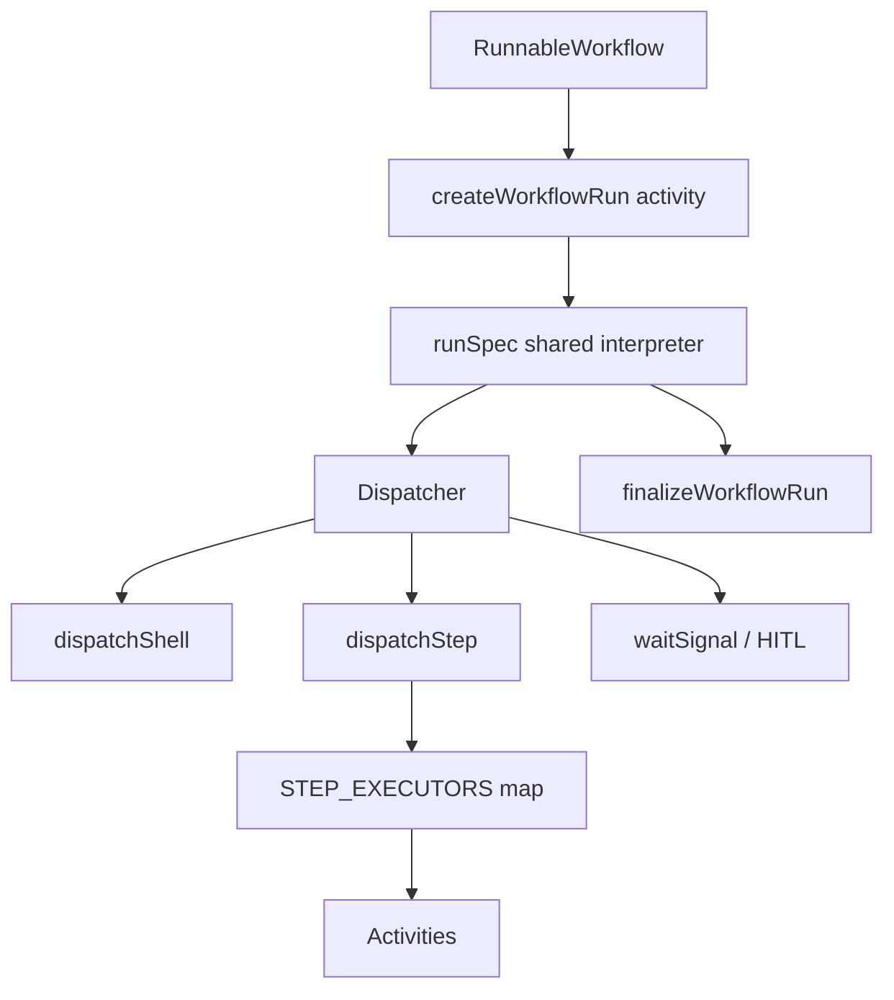

# Temporal Workflows

> Indexed at commit `d0a90fb5` on 2026-10-06 · [view on GitHub](https://github.com/yorch/auto-swe/tree/d0a90fb5)

## Relevant source files

- [packages/worker/src/workflows/runnable.ts](https://github.com/yorch/auto-swe/blob/d0a90fb5/packages/worker/src/workflows/runnable.ts)
- [packages/worker/src/workflows/runnableSteps.ts](https://github.com/yorch/auto-swe/blob/d0a90fb5/packages/worker/src/workflows/runnableSteps.ts)
- [packages/worker/src/workflows/runnableActivities.ts](https://github.com/yorch/auto-swe/blob/d0a90fb5/packages/worker/src/workflows/runnableActivities.ts)
- [packages/worker/src/workflows/runnableContext.ts](https://github.com/yorch/auto-swe/blob/d0a90fb5/packages/worker/src/workflows/runnableContext.ts)
- [packages/worker/src/workflows/proxyOptions.ts](https://github.com/yorch/auto-swe/blob/d0a90fb5/packages/worker/src/workflows/proxyOptions.ts)
- [packages/worker/src/workflows/index.ts](https://github.com/yorch/auto-swe/blob/d0a90fb5/packages/worker/src/workflows/index.ts)
- [packages/worker/src/workflows/nodeTag.ts](https://github.com/yorch/auto-swe/blob/d0a90fb5/packages/worker/src/workflows/nodeTag.ts)
- [packages/worker/src/workflows/nodeTagScope.ts](https://github.com/yorch/auto-swe/blob/d0a90fb5/packages/worker/src/workflows/nodeTagScope.ts)
- [packages/worker/src/workflows/nodeTagInterceptor.ts](https://github.com/yorch/auto-swe/blob/d0a90fb5/packages/worker/src/workflows/nodeTagInterceptor.ts)
- [packages/worker/src/workflows/scheduledConsolidation.ts](https://github.com/yorch/auto-swe/blob/d0a90fb5/packages/worker/src/workflows/scheduledConsolidation.ts)
- [packages/worker/src/workflows/scheduledEval.ts](https://github.com/yorch/auto-swe/blob/d0a90fb5/packages/worker/src/workflows/scheduledEval.ts)
- [packages/worker/src/workflows/scheduledRunReaper.ts](https://github.com/yorch/auto-swe/blob/d0a90fb5/packages/worker/src/workflows/scheduledRunReaper.ts)
- [packages/worker/src/workflows/runnable.replay.test.ts](https://github.com/yorch/auto-swe/blob/d0a90fb5/packages/worker/src/workflows/runnable.replay.test.ts)
- [packages/worker/scripts/recordReplayHistory.ts](https://github.com/yorch/auto-swe/blob/d0a90fb5/packages/worker/scripts/recordReplayHistory.ts)
- [packages/worker/src/index.ts](https://github.com/yorch/auto-swe/blob/d0a90fb5/packages/worker/src/index.ts)

## Overview

The worker bundles every workflow from one barrel, [`workflows/index.ts`](https://github.com/yorch/auto-swe/blob/d0a90fb5/packages/worker/src/workflows/index.ts#L1-L23), which exports 21 workflow functions plus two Temporal handles (`epicCancelSignal`, `authorJobProgressQuery`). They fall into three groups: the generic `RunnableWorkflow` interpreter, orchestration workflows (epic, channel, authoring), and cron-style scheduled workflows. Workflow code runs in a V8 isolate, so everything with side effects goes through activities.

Sources: [packages/worker/src/workflows/index.ts:L1-L23](https://github.com/yorch/auto-swe/blob/d0a90fb5/packages/worker/src/workflows/index.ts#L1-L23)

## The runnable workflow

`RunnableWorkflow` takes a `templateId`, `templateVersion` and a `RepoWorkRequest` ([runnable.ts#L44-L48](https://github.com/yorch/auto-swe/blob/d0a90fb5/packages/worker/src/workflows/runnable.ts#L44-L48)). It first calls the `createWorkflowRun` activity, which materializes the run row and returns the parsed spec. A load failure throws a non-retryable `ApplicationFailure` (`WORKFLOW_RUN_SETUP_FAILED`), because a plain `Error` would fail the workflow task and Temporal would retry it forever ([runnable.ts#L56-L78](https://github.com/yorch/auto-swe/blob/d0a90fb5/packages/worker/src/workflows/runnable.ts#L56-L78)).

The interpreter bounds come from the run's pinned-settings snapshot through `readInterpreterLimits`, not a live read, so a mid-run edit cannot change the ceiling a replay was recorded under ([runnable.ts#L81-L84](https://github.com/yorch/auto-swe/blob/d0a90fb5/packages/worker/src/workflows/runnable.ts#L81-L84)). The walk itself is delegated to `runSpec` in the shared workflow engine; the workflow only supplies a `Dispatcher` ([runnable.ts#L156-L260](https://github.com/yorch/auto-swe/blob/d0a90fb5/packages/worker/src/workflows/runnable.ts#L156-L260)).

The file was split into isolate-safe siblings: activity proxies in `runnableActivities.ts`, step executors in `runnableSteps.ts`, and record bounding plus context spill in `runnableContext.ts` ([runnable.ts#L37-L40](https://github.com/yorch/auto-swe/blob/d0a90fb5/packages/worker/src/workflows/runnable.ts#L37-L40)).

```mermaid
flowchart TD
  A[RunnableWorkflow] --> B[createWorkflowRun activity]
  B --> C[runSpec shared interpreter]
  C --> D[Dispatcher]
  D --> E[dispatchShell]
  D --> F[dispatchStep]
  D --> G[waitSignal / HITL]
  F --> H[STEP_EXECUTORS map]
  H --> I[Activities]
  C --> J[finalizeWorkflowRun]
```

Sources: [packages/worker/src/workflows/runnable.ts:L44-L260](https://github.com/yorch/auto-swe/blob/d0a90fb5/packages/worker/src/workflows/runnable.ts#L44-L260) [packages/worker/src/workflows/runnableSteps.ts](https://github.com/yorch/auto-swe/blob/d0a90fb5/packages/worker/src/workflows/runnableSteps.ts)

## Interpreter dispatch

The `Dispatcher` has nine members: `dispatchShell`, `dispatchStep`, `drainSteering`, `isCancellation`, `notifyHumanStep`, `patched`, `recordStep`, `resolveHumanStep` and `waitSignal` ([runnable.ts#L156-L238](https://github.com/yorch/auto-swe/blob/d0a90fb5/packages/worker/src/workflows/runnable.ts#L156-L238)). `dispatchShell` forwards the node's resource options (`cpus`, `memory`, `network`, `timeoutMs`) to the `runShellStep` activity. `dispatchStep` calls `dispatchStepImpl`, which looks the step name up in the `STEP_EXECUTORS` map and throws `unknown step` if absent ([runnableSteps.ts#L568-L581](https://github.com/yorch/auto-swe/blob/d0a90fb5/packages/worker/src/workflows/runnableSteps.ts#L568-L581)).

Signals are registered up front for every `signal` node (by its name) and every human node (`humanApproval`, `humanDecision`, `humanInput`, `humanReview`) under `hitl_${nodeId}` ([runnable.ts#L106-L127](https://github.com/yorch/auto-swe/blob/d0a90fb5/packages/worker/src/workflows/runnable.ts#L106-L127)). A HITL node inside a fan-out branch has a branch-unique name known only at run time, so `waitSignal` registers handlers lazily; Temporal buffers early signals and handler registration emits no command, which keeps the lazy path replay-safe. A channel `steer` signal feeds an in-workflow buffer that `drainSteering` empties for the next `agent` node ([runnable.ts#L143-L146](https://github.com/yorch/auto-swe/blob/d0a90fb5/packages/worker/src/workflows/runnable.ts#L143-L146)).

Inside a fan-out branch the interpreter passes a cancellation sink. `runWithCancellation` wraps the activity in a `CancellationScope`, exposes `scope.cancel()` as the token, and rethrows a branch cancellation as `BranchCancelledError` so `onError`/`onFail` policies cannot swallow it. When the parent scope itself was cancelled, the original cancellation propagates so the run ends `CANCELLED` ([runnable.ts#L360-L389](https://github.com/yorch/auto-swe/blob/d0a90fb5/packages/worker/src/workflows/runnable.ts#L360-L389)).

Finalization runs in `CancellationScope.nonCancellable`: it snapshots the context, cancels pending human steps (best-effort), then calls `finalizeWorkflowRun` with `SUCCESS`, `FAILED`, `TIMED_OUT`, `SKIPPED` or `CANCELLED`. Non-Temporal errors then become a non-retryable `WORKFLOW_SPEC_FAILED` failure ([runnable.ts#L257-L325](https://github.com/yorch/auto-swe/blob/d0a90fb5/packages/worker/src/workflows/runnable.ts#L257-L325)).

Step records written to history are bounded: strings over 8,000 characters are cut and nesting beyond 12 levels is summarized ([runnableContext.ts#L14-L30](https://github.com/yorch/auto-swe/blob/d0a90fb5/packages/worker/src/workflows/runnableContext.ts#L14-L30)). `snapshotContext` instead spills oversized values to workflow artifacts, degrading to truncation if the write fails ([runnableContext.ts#L100-L111](https://github.com/yorch/auto-swe/blob/d0a90fb5/packages/worker/src/workflows/runnableContext.ts#L100-L111)).

Sources: [packages/worker/src/workflows/runnable.ts:L106-L389](https://github.com/yorch/auto-swe/blob/d0a90fb5/packages/worker/src/workflows/runnable.ts#L106-L389) [packages/worker/src/workflows/runnableSteps.ts:L568-L581](https://github.com/yorch/auto-swe/blob/d0a90fb5/packages/worker/src/workflows/runnableSteps.ts#L568-L581) [packages/worker/src/workflows/runnableContext.ts](https://github.com/yorch/auto-swe/blob/d0a90fb5/packages/worker/src/workflows/runnableContext.ts)

## Scheduled workflows

Scheduled workflows are fired by named Temporal Schedules. `ScheduledConsolidationWorkflow` fetches opted-in repositories, then starts one `ConsolidateLessonsWorkflow` child per repository with a 30-minute execution timeout, so one failure does not abort the others ([scheduledConsolidation.ts#L1-L40](https://github.com/yorch/auto-swe/blob/d0a90fb5/packages/worker/src/workflows/scheduledConsolidation.ts#L1-L40)). `ScheduledEvalWorkflow` prepares an `EvalRun` and runs the harness in a single-attempt activity with a 4-hour timeout and a 5-minute heartbeat; a missing dataset logs and returns ([scheduledEval.ts#L18-L45](https://github.com/yorch/auto-swe/blob/d0a90fb5/packages/worker/src/workflows/scheduledEval.ts#L18-L45)). `ScheduledRunReaperWorkflow` is one activity, `reapStrandedRuns`, that finalizes runs whose Temporal workflow ended without finalizing them ([scheduledRunReaper.ts#L14-L21](https://github.com/yorch/auto-swe/blob/d0a90fb5/packages/worker/src/workflows/scheduledRunReaper.ts#L14-L21)). Others in the barrel cover model discovery, repository access sync, dependency scan, revalidation and skill-source sync.

Retry and timeout presets (`RETRY_STANDARD`, `RETRY_STATE`, `RETRY_AGENT`, `RETRY_SANDBOX`, `RETRY_SCHEDULED`, `T_30S` through `T_60M`) are centralized in `proxyOptions.ts` as plain literals ([proxyOptions.ts#L36-L157](https://github.com/yorch/auto-swe/blob/d0a90fb5/packages/worker/src/workflows/proxyOptions.ts#L36-L157)). Agent-run activities get a 14,400-second ceiling plus 7,200 seconds of headroom ([proxyOptions.ts#L185-L202](https://github.com/yorch/auto-swe/blob/d0a90fb5/packages/worker/src/workflows/proxyOptions.ts#L185-L202)).

Sources: [packages/worker/src/workflows/scheduledConsolidation.ts](https://github.com/yorch/auto-swe/blob/d0a90fb5/packages/worker/src/workflows/scheduledConsolidation.ts) [packages/worker/src/workflows/scheduledEval.ts](https://github.com/yorch/auto-swe/blob/d0a90fb5/packages/worker/src/workflows/scheduledEval.ts) [packages/worker/src/workflows/scheduledRunReaper.ts](https://github.com/yorch/auto-swe/blob/d0a90fb5/packages/worker/src/workflows/scheduledRunReaper.ts) [packages/worker/src/workflows/proxyOptions.ts](https://github.com/yorch/auto-swe/blob/d0a90fb5/packages/worker/src/workflows/proxyOptions.ts)

## V8 isolate rules

Workflow files run in a V8 isolate, so external packages are imported with `import type` only and runtime imports come from `@temporalio/workflow` or pure local modules. `proxyOptions.ts` documents this: it exports only plain object and string literals and has no runtime imports ([proxyOptions.ts#L12-L18](https://github.com/yorch/auto-swe/blob/d0a90fb5/packages/worker/src/workflows/proxyOptions.ts#L12-L18)). Activity modules are referenced as types (`import type * as activitiesType`) and bound through `proxyActivities`, which is deterministic and emits no command at module load ([runnableActivities.ts#L1-L12](https://github.com/yorch/auto-swe/blob/d0a90fb5/packages/worker/src/workflows/runnableActivities.ts#L1-L12)).

Changes to live workflows that alter the command stream are gated with `patched()`. The two ids in `runnable.ts` are `workflow-cancel-propagates` and `orphaned-signal-wait-keeps-payload` ([runnable.ts#L396-L397](https://github.com/yorch/auto-swe/blob/d0a90fb5/packages/worker/src/workflows/runnable.ts#L396-L397)).

Per-node attribution uses a workflow interceptor. `runWithNodeTag` stores a `NodeTag` (`specNodeId`, `recordingId`, `stepAttempt`) in an `AsyncLocalStorage`, chosen over a module variable because concurrent fan-out branches would otherwise share one slot ([nodeTagScope.ts#L3-L20](https://github.com/yorch/auto-swe/blob/d0a90fb5/packages/worker/src/workflows/nodeTagScope.ts#L3-L20)). The outbound `scheduleActivity` interceptor adds the `x-auto-swe-node` header and changes nothing else, so the command stream is unchanged ([nodeTagInterceptor.ts#L4-L29](https://github.com/yorch/auto-swe/blob/d0a90fb5/packages/worker/src/workflows/nodeTagInterceptor.ts#L4-L29), [nodeTag.ts#L9](https://github.com/yorch/auto-swe/blob/d0a90fb5/packages/worker/src/workflows/nodeTag.ts#L9)). The worker registers both this and the trace-context interceptor through `workflowModules` ([index.ts#L107](https://github.com/yorch/auto-swe/blob/d0a90fb5/packages/worker/src/index.ts#L107)).

Sources: [packages/worker/src/workflows/proxyOptions.ts](https://github.com/yorch/auto-swe/blob/d0a90fb5/packages/worker/src/workflows/proxyOptions.ts) [packages/worker/src/workflows/nodeTagScope.ts](https://github.com/yorch/auto-swe/blob/d0a90fb5/packages/worker/src/workflows/nodeTagScope.ts) [packages/worker/src/workflows/nodeTagInterceptor.ts](https://github.com/yorch/auto-swe/blob/d0a90fb5/packages/worker/src/workflows/nodeTagInterceptor.ts) [packages/worker/src/index.ts](https://github.com/yorch/auto-swe/blob/d0a90fb5/packages/worker/src/index.ts)

## Replay fixtures

Forward tests with fake activities catch logic errors but not a change that takes a different path when replaying an existing execution. `runnable.replay.test.ts` replays recorded histories against current code; a reordered activity, an extra activity on an already-run path, `Date.now()` branching, or iteration over an unordered collection makes the replay diverge ([runnable.replay.test.ts#L1-L30](https://github.com/yorch/auto-swe/blob/d0a90fb5/packages/worker/src/workflows/runnable.replay.test.ts#L1-L30)). Replay guards only paths a history walked, so there is one fixture per control-flow shape. A documented blind spot is that Temporal compares command type and sequence, not activity arguments.

Fixtures are binary protobuf `.bin` files in `src/workflows/__fixtures__/` (34 at this commit, covering `linear`, `fan-out`, `signal`, the four human-node shapes, `cond-loop`, `context-spill`, epic and channel workflows, among others). The test discovers them by directory listing, so a recorded fixture is replayed without registration ([runnable.replay.test.ts#L38-L52](https://github.com/yorch/auto-swe/blob/d0a90fb5/packages/worker/src/workflows/runnable.replay.test.ts#L38-L52)). `orchestration.replay.test.ts` owns the epic and channel fixtures.

`scripts/recordReplayHistory.ts` records them with `TestWorkflowEnvironment`, one `Scenario` per shape from the `SCENARIOS` list ([recordReplayHistory.ts#L45-L204](https://github.com/yorch/auto-swe/blob/d0a90fb5/packages/worker/scripts/recordReplayHistory.ts#L45-L204)). It is run as `yarn workspace @auto-swe/worker exec tsx scripts/recordReplayHistory.ts [scenario ...]`; naming scenarios records only those, so a new shape does not rewrite passing fixtures. Re-recording is correct only when the workflow's structure changed intentionally, never to make a failing replay pass ([recordReplayHistory.ts#L1-L21](https://github.com/yorch/auto-swe/blob/d0a90fb5/packages/worker/scripts/recordReplayHistory.ts#L1-L21)).

Sources: [packages/worker/src/workflows/runnable.replay.test.ts](https://github.com/yorch/auto-swe/blob/d0a90fb5/packages/worker/src/workflows/runnable.replay.test.ts) [packages/worker/scripts/recordReplayHistory.ts](https://github.com/yorch/auto-swe/blob/d0a90fb5/packages/worker/scripts/recordReplayHistory.ts)
